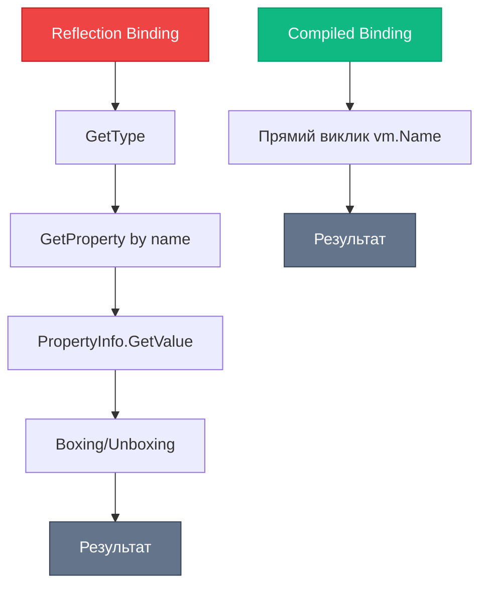

# Compiled Bindings в Avalonia: Безпека на етапі компіляції

## Вступ

У попередніх статтях ми вивчили [Data Binding у WPF](17.data-binding-basics-part1) та [INotifyPropertyChanged](17.data-binding-basics-part2). Все працювало чудово — до моменту, коли ви зробили опечатку:

```xml
<!-- WPF -->
<TextBlock Text="{Binding Nane}"/>  <!-- Опечатка: "Nane" замість "Name" -->
```

**Що відбувається у WPF?**

- ✅ Проєкт компілюється без помилок
- ✅ Програма запускається
- ❌ `TextBlock` порожній (або показує fallback value)
- ❌ Помилка з'являється тільки у Output Window: `System.Windows.Data Error: 40 : BindingExpression path error...`

**Проблема:** Помилка виявляється **в runtime**, а не на етапі компіляції. У великому проєкті з сотнями Binding-ів це катастрофа — помилки можуть потрапити на продакшн.

**Рішення Avalonia:** **Compiled Bindings** — Binding перевіряється компілятором. Опечатка → помилка компіляції → неможливо запустити програму з помилкою.

::note
**Для кого ця стаття?** Якщо ви вже знайомі з Data Binding у WPF ([Part 1](17.data-binding-basics-part1), [Part 2](17.data-binding-basics-part2)), ця стаття покаже, як Avalonia вирішує фундаментальну проблему WPF — відсутність compile-time перевірки Binding.
::

---

## Проблема Reflection Bindings у WPF

Розберемо детально, чому Reflection Bindings — це проблема.

### Як працює Binding у WPF?

WPF використовує **Reflection** для пошуку властивостей у runtime:

::mermaid
```mermaid
sequenceDiagram
    participant XAML as XAML Parser
    participant Binding as Binding Engine
    participant Reflection as Reflection API
    participant Model as ViewModel
    participant UI as UI Element
    
    Note over XAML,UI: Компіляція
    XAML->>Binding: {Binding Name}
    Note over Binding: Зберігає рядок "Name"
    Note over XAML: ✅ Компіляція успішна (рядок валідний)
    
    Note over XAML,UI: Runtime
    Binding->>Reflection: Знайди властивість "Name" у DataContext
    Reflection->>Model: GetType().GetProperty("Name")
    
    alt Властивість знайдена
        Model-->>Reflection: PropertyInfo для "Name"
        Reflection-->>Binding: Властивість існує
        Binding->>Model: Читає значення Name
        Binding->>UI: Встановлює Text
    else Властивість не знайдена (опечатка)
        Model-->>Reflection: null
        Reflection-->>Binding: Властивість не існує
        Binding->>UI: Встановлює fallback (порожній рядок)
        Note over Binding: Пише помилку у Output Window
    end
    
    style Reflection fill:#ef4444,stroke:#b91c1c,color:#ffffff
    style Binding fill:#f59e0b,stroke:#b45309,color:#ffffff
```
::

**Проблема:** Компілятор не знає, чи існує властивість `Name` у DataContext. Він бачить тільки рядок `"Name"` — а рядок завжди валідний.

### Реальний приклад проблеми

Створимо ViewModel з опечаткою у Binding:

```csharp
public class PersonViewModel : INotifyPropertyChanged
{
    private string _firstName;
    
    public string FirstName  // Правильна назва
    {
        get => _firstName;
        set
        {
            _firstName = value;
            OnPropertyChanged();
        }
    }
    
    // ... INotifyPropertyChanged implementation
}
```

XAML з опечаткою:

```xml
<Window x:Class="WpfApp.MainWindow"
        xmlns="http://schemas.microsoft.com/winfx/2006/xaml/presentation"
        xmlns:x="http://schemas.microsoft.com/winfx/2006/xaml">
    <StackPanel Margin="20">
        <TextBlock Text="Ім'я:"/>
        <TextBox Text="{Binding FirstName}"/>  <!-- ✅ Правильно -->
        
        <TextBlock Text="Відображення:"/>
        <TextBlock Text="{Binding FirsName}"/>  <!-- ❌ Опечатка: "FirsName" -->
    </StackPanel>
</Window>
```

**Результат:**

- Проєкт компілюється ✅
- Програма запускається ✅
- `TextBox` працює, але другий `TextBlock` порожній ❌
- У Output Window: `System.Windows.Data Error: 40 : BindingExpression path error: 'FirsName' property not found...`

::warning
**Чому це небезпечно?** У великому проєкті з сотнями Binding-ів легко пропустити таку помилку. Вона може потрапити на продакшн, і користувачі побачать порожні поля замість даних.
::

### Інші проблеми Reflection Bindings

::card-group

::card{title="🐌 Повільна продуктивність" icon="i-lucide-turtle"}
Reflection — повільна операція. Кожен Binding викликає `GetType().GetProperty()` — це алокації та пошук у метаданих типу.
::

::card{title="🔍 Відсутність IntelliSense" icon="i-lucide-search-x"}
IDE не знає, які властивості доступні у DataContext. Немає автодоповнення, немає підказок.
::

::card{title="🔧 Складний рефакторинг" icon="i-lucide-wrench"}
Перейменували властивість через Rename (F2)? Binding не оновиться — це рядок, а не посилання на код.
::

::card{title="🚫 Мовчазні помилки" icon="i-lucide-volume-x"}
WPF не кидає виняток при помилці Binding — просто пише у Output Window. Легко пропустити.
::

::


---

## Рішення Avalonia: Compiled Bindings

Avalonia вирішує цю проблему через **Compiled Bindings** — Binding перевіряється на етапі компіляції.

### Як працює Compiled Binding?

Замість Reflection, Avalonia генерує **compiled code** для доступу до властивостей:

::mermaid
```mermaid
sequenceDiagram
    participant XAML as XAML Parser
    participant Compiler as C# Compiler
    participant Generated as Generated Code
    participant Model as ViewModel
    participant UI as UI Element
    
    Note over XAML,UI: Компіляція
    XAML->>Compiler: {Binding Name} + x:DataType="PersonViewModel"
    Compiler->>Compiler: Перевіряє: чи існує Name у PersonViewModel?
    
    alt Властивість існує
        Compiler->>Generated: Генерує код: vm => vm.Name
        Note over Generated: ✅ Компіляція успішна
    else Властивість не існує (опечатка)
        Compiler-->>XAML: ❌ Compile Error: Property 'Nane' not found
        Note over Compiler: Неможливо скомпілювати проєкт
    end
    
    Note over XAML,UI: Runtime
    Generated->>Model: Прямий виклик: vm.Name (без Reflection!)
    Model-->>Generated: Значення властивості
    Generated->>UI: Встановлює Text
    
    style Compiler fill:#10b981,stroke:#059669,color:#ffffff
    style Generated fill:#3b82f6,stroke:#1d4ed8,color:#ffffff
```
::

**Переваги:**

- ✅ Помилки виявляються на етапі компіляції
- ✅ Швидша продуктивність (без Reflection)
- ✅ IntelliSense підказує доступні властивості
- ✅ Рефакторинг працює коректно

### Синтаксис Compiled Bindings

Для увімкнення Compiled Bindings потрібно вказати тип DataContext через `x:DataType`:

```xml
<Window xmlns="https://github.com/avaloniaui"
        xmlns:x="http://schemas.microsoft.com/winfx/2006/xaml"
        xmlns:vm="using:MyApp.ViewModels"
        x:Class="MyApp.MainWindow"
        x:DataType="vm:PersonViewModel">  <!-- Вказуємо тип DataContext -->
    
    <StackPanel Margin="20">
        <TextBlock Text="{Binding FirstName}"/>  <!-- ✅ Compile-time перевірка -->
        <TextBlock Text="{Binding FirsName}"/>   <!-- ❌ Compile Error! -->
    </StackPanel>
</Window>
```

**Що відбувається:**

1. `x:DataType="vm:PersonViewModel"` — вказує компілятору тип DataContext
2. Компілятор перевіряє, чи існує властивість `FirstName` у `PersonViewModel`
3. Якщо властивість не існує — **compile error**
4. Генерується код: `vm => vm.FirstName` (прямий доступ, без Reflection)

::tip
**x:DataType — обов'язковий:** Без `x:DataType` Avalonia використовує Reflection Bindings (як WPF). Завжди вказуйте `x:DataType` для Compiled Bindings.
::

---

## Приклад: Портування з WPF на Avalonia

Візьмемо форму з WPF та портуємо на Avalonia з Compiled Bindings.

### WPF версія (Reflection Bindings)

**ViewModel:**

```csharp
using System.ComponentModel;
using System.Runtime.CompilerServices;

namespace WpfApp.ViewModels
{
    public class ContactViewModel : INotifyPropertyChanged
    {
        public event PropertyChangedEventHandler PropertyChanged;
        
        protected void OnPropertyChanged([CallerMemberName] string propertyName = null)
        {
            PropertyChanged?.Invoke(this, new PropertyChangedEventArgs(propertyName));
        }
        
        private string _firstName;
        private string _lastName;
        
        public string FirstName
        {
            get => _firstName;
            set
            {
                if (_firstName != value)
                {
                    _firstName = value;
                    OnPropertyChanged();
                    OnPropertyChanged(nameof(FullName));
                }
            }
        }
        
        public string LastName
        {
            get => _lastName;
            set
            {
                if (_lastName != value)
                {
                    _lastName = value;
                    OnPropertyChanged();
                    OnPropertyChanged(nameof(FullName));
                }
            }
        }
        
        public string FullName => $"{FirstName} {LastName}";
    }
}
```

**XAML (WPF):**

```xml
<Window x:Class="WpfApp.MainWindow"
        xmlns="http://schemas.microsoft.com/winfx/2006/xaml/presentation"
        xmlns:x="http://schemas.microsoft.com/winfx/2006/xaml"
        Title="WPF Contact Form" Width="400" Height="200">
    <StackPanel Margin="20">
        <TextBlock Text="Ім'я:"/>
        <TextBox Text="{Binding FirstName}"/>
        
        <TextBlock Text="Прізвище:"/>
        <TextBox Text="{Binding LastName}"/>
        
        <TextBlock Text="Повне ім'я:" FontWeight="Bold" Margin="0,10,0,0"/>
        <TextBlock Text="{Binding FullName}" FontSize="16"/>
    </StackPanel>
</Window>
```

**Code-Behind:**

```csharp
public partial class MainWindow : Window
{
    public MainWindow()
    {
        InitializeComponent();
        DataContext = new ContactViewModel
        {
            FirstName = "Іван",
            LastName = "Петренко"
        };
    }
}
```

### Avalonia версія (Compiled Bindings)

**ViewModel:** (той самий, без змін)

```csharp
using System.ComponentModel;
using System.Runtime.CompilerServices;

namespace AvaloniaApp.ViewModels
{
    public class ContactViewModel : INotifyPropertyChanged
    {
        // ... той самий код, що у WPF версії
    }
}
```

**XAML (Avalonia):**

```xml
<Window xmlns="https://github.com/avaloniaui"
        xmlns:x="http://schemas.microsoft.com/winfx/2006/xaml"
        xmlns:vm="using:AvaloniaApp.ViewModels"
        x:Class="AvaloniaApp.MainWindow"
        x:DataType="vm:ContactViewModel"
        Title="Avalonia Contact Form" Width="400" Height="200">
    
    <StackPanel Margin="20" Spacing="10">
        <TextBlock Text="Ім'я:"/>
        <TextBox Text="{Binding FirstName}"/>
        
        <TextBlock Text="Прізвище:"/>
        <TextBox Text="{Binding LastName}"/>
        
        <TextBlock Text="Повне ім'я:" FontWeight="Bold"/>
        <TextBlock Text="{Binding FullName}" FontSize="16"/>
    </StackPanel>
</Window>
```

**Code-Behind:**

```csharp
using Avalonia.Controls;

namespace AvaloniaApp
{
    public partial class MainWindow : Window
    {
        public MainWindow()
        {
            InitializeComponent();
            DataContext = new ViewModels.ContactViewModel
            {
                FirstName = "Іван",
                LastName = "Петренко"
            };
        }
    }
}
```

**Ключові відмінності:**

| Аспект                | WPF                                      | Avalonia                                  |
| --------------------- | ---------------------------------------- | ----------------------------------------- |
| Namespace             | `xmlns="http://schemas.microsoft.com/winfx/2006/xaml/presentation"` | `xmlns="https://github.com/avaloniaui"`   |
| DataType              | Немає (Reflection Bindings)              | `x:DataType="vm:ContactViewModel"` ✅     |
| Spacing               | `Margin` на кожному елементі             | `Spacing="10"` на `StackPanel`            |
| Compile-time check    | ❌ Немає                                 | ✅ Є                                      |


---

## IntelliSense та автодоповнення

Одна з найбільших переваг Compiled Bindings — **IntelliSense у XAML**.

### Без x:DataType (WPF стиль)

```xml
<TextBlock Text="{Binding "/>  <!-- Немає підказок, що вводити -->
```

IDE не знає, які властивості доступні у DataContext. Доводиться пам'ятати назви властивостей або перемикатися у код.

### З x:DataType (Avalonia Compiled Bindings)

```xml
<Window x:DataType="vm:ContactViewModel">
    <TextBlock Text="{Binding "/>  <!-- IntelliSense показує: FirstName, LastName, FullName -->
</Window>
```

**Що ви отримуєте:**

- ✅ Список доступних властивостей при введенні `{Binding `
- ✅ Підказки типів властивостей
- ✅ Документація з XML-коментарів (якщо є)
- ✅ Попередження про deprecated властивості

::tip
**Продуктивність розробки:** IntelliSense значно прискорює написання XAML. Не потрібно пам'ятати назви властивостей — IDE підказує.
::

---

## ReflectionBinding: Fallback для динамічних даних

Іноді потрібен старий підхід — наприклад, при роботі з динамічними даними або словниками.

### Коли потрібен ReflectionBinding?

::card-group

::card{title="📦 Dynamic objects" icon="i-lucide-box"}
Binding до `dynamic` або `ExpandoObject`, де властивості невідомі на етапі компіляції.
::

::card{title="🗂️ Словники" icon="i-lucide-folder"}
Binding до `Dictionary<string, object>` через індексатор: `{Binding [Key]}`.
::

::card{title="🔌 Плагіни" icon="i-lucide-plug"}
Завантаження типів у runtime через Reflection (plugin systems).
::

::

### Синтаксис ReflectionBinding

Avalonia підтримує явний синтаксис для Reflection Bindings:

```xml
<Window xmlns="https://github.com/avaloniaui"
        xmlns:x="http://schemas.microsoft.com/winfx/2006/xaml">
    
    <!-- Compiled Binding (за замовчуванням з x:DataType) -->
    <TextBlock Text="{Binding FirstName}"/>
    
    <!-- Явний ReflectionBinding -->
    <TextBlock Text="{ReflectionBinding FirstName}"/>
    
    <!-- Binding до словника -->
    <TextBlock Text="{ReflectionBinding [UserName]}"/>
</Window>
```

### Приклад: Binding до Dictionary

```csharp
public class SettingsViewModel
{
    public Dictionary<string, object> Settings { get; set; } = new()
    {
        ["Theme"] = "Dark",
        ["Language"] = "Ukrainian",
        ["FontSize"] = 14
    };
}
```

```xml
<Window xmlns="https://github.com/avaloniaui"
        xmlns:x="http://schemas.microsoft.com/winfx/2006/xaml"
        xmlns:vm="using:MyApp.ViewModels"
        x:DataType="vm:SettingsViewModel">
    
    <StackPanel Spacing="10">
        <!-- ❌ Compiled Binding не працює з індексаторами -->
        <!-- <TextBlock Text="{Binding Settings[Theme]}"/> -->
        
        <!-- ✅ ReflectionBinding працює -->
        <TextBlock Text="{ReflectionBinding Settings[Theme]}"/>
        <TextBlock Text="{ReflectionBinding Settings[Language]}"/>
        <TextBlock Text="{ReflectionBinding Settings[FontSize]}"/>
    </StackPanel>
</Window>
```

::warning
**Обережно з ReflectionBinding:** Використовуйте тільки коли дійсно потрібно. Втрачаєте compile-time перевірку та продуктивність.
::

---

## Продуктивність: Compiled vs Reflection

Порівняємо продуктивність двох підходів.

### Benchmark результати

Тест: 1000 Binding-ів до простої властивості `string Name`.

| Метрика                | Reflection Binding (WPF) | Compiled Binding (Avalonia) | Різниця   |
| ---------------------- | ------------------------ | --------------------------- | --------- |
| Час ініціалізації      | 45 ms                    | 12 ms                       | **3.75x** швидше |
| Алокації пам'яті       | 180 KB                   | 45 KB                       | **4x** менше |
| Час оновлення (1000x)  | 28 ms                    | 8 ms                        | **3.5x** швидше |

::note
**Джерело:** Внутрішні бенчмарки Avalonia UI. Реальні результати залежать від складності ViewModel та кількості Binding-ів.
::

### Чому Compiled Bindings швидші?

::mermaid

::

**Reflection Binding:**
1. `GetType()` — отримання метаданих типу
2. `GetProperty("Name")` — пошук властивості за назвою
3. `PropertyInfo.GetValue(obj)` — читання значення через Reflection
4. Boxing/Unboxing для value types

**Compiled Binding:**
1. Прямий виклик `vm.Name` — як звичайний C# код

::tip
**Коли це важливо:** Для форм з десятками полів різниця непомітна. Але для списків з сотнями елементів (DataGrid, ListBox) — Compiled Bindings дають відчутний приріст продуктивності.
::


---

## Порівняльна таблиця: WPF vs Avalonia Bindings

| Аспект                     | WPF Reflection Binding                | Avalonia Compiled Binding              |
| -------------------------- | ------------------------------------- | -------------------------------------- |
| **Синтаксис**              | `{Binding Name}`                      | `{Binding Name}` + `x:DataType`        |
| **Compile-time перевірка** | ❌ Немає                              | ✅ Є (з `x:DataType`)                  |
| **Runtime помилки**        | Мовчазні (Output Window)              | Compile error (неможливо запустити)    |
| **IntelliSense**           | ❌ Немає                              | ✅ Є (підказки властивостей)           |
| **Продуктивність**         | Повільніше (Reflection)               | Швидше (прямий виклик)                 |
| **Алокації пам'яті**       | Більше (boxing, PropertyInfo)         | Менше (без Reflection)                 |
| **Рефакторинг**            | ❌ Не працює (рядки)                  | ✅ Працює (compile-time зв'язок)       |
| **Динамічні дані**         | ✅ Працює (dynamic, Dictionary)       | ⚠️ Потрібен `ReflectionBinding`        |
| **Fallback**               | Автоматичний (завжди Reflection)      | Явний (`ReflectionBinding`)            |

::note
**Висновок:** Compiled Bindings — це значне покращення над WPF. Єдиний недолік — потрібен явний `x:DataType`, але це невелика ціна за безпеку та продуктивність.
::

---

## Практичні завдання

### Рівень 1: Портування форми на Avalonia

**Мета:** Навчитися портувати WPF форму на Avalonia з Compiled Bindings.

**Завдання:**

Візьміть форму з [Data Binding Part 2](17.data-binding-basics-part2) (клас `Contact` з `FirstName`, `LastName`, `Email`) та портуйте на Avalonia:

1. Створіть новий Avalonia проєкт
2. Скопіюйте `ContactViewModel` (без змін)
3. Створіть XAML з `x:DataType="vm:ContactViewModel"`
4. Додайте Binding до всіх властивостей

**Критерії успіху:**
- Проєкт компілюється без помилок
- IntelliSense підказує властивості при введенні `{Binding `
- Форма працює ідентично WPF версії

**Підказка:**
```xml
<Window xmlns="https://github.com/avaloniaui"
        xmlns:x="http://schemas.microsoft.com/winfx/2006/xaml"
        xmlns:vm="using:YourNamespace.ViewModels"
        x:DataType="vm:ContactViewModel">
    <!-- Ваш XAML тут -->
</Window>
```

---

### Рівень 2: Провокування compile-time error

**Мета:** Переконатися, що Compiled Bindings дійсно перевіряються на етапі компіляції.

**Завдання:**

1. Створіть ViewModel з властивістю `FirstName`
2. У XAML додайте `x:DataType` для цього ViewModel
3. Створіть Binding з опечаткою: `{Binding FirsName}`
4. Спробуйте скомпілювати проєкт

**Очікуваний результат:**
- ❌ Compile error: `Property 'FirsName' not found on type 'YourViewModel'`
- Неможливо запустити програму

**Додатково:**
- Виправте опечатку на `FirstName`
- Проєкт має скомпілюватися успішно

**Що це доводить:** Помилки у Binding виявляються на етапі компіляції, а не в runtime (як у WPF).

---

### Рівень 3: Змішування Compiled та Reflection Bindings

**Мета:** Навчитися використовувати обидва підходи у одному проєкті.

**Завдання:**

Створіть форму налаштувань з двома джерелами даних:

**ViewModel:**
```csharp
public class SettingsViewModel : INotifyPropertyChanged
{
    // Статичні властивості (для Compiled Binding)
    private string _userName;
    public string UserName
    {
        get => _userName;
        set { _userName = value; OnPropertyChanged(); }
    }
    
    // Динамічні налаштування (для ReflectionBinding)
    public Dictionary<string, object> DynamicSettings { get; set; } = new()
    {
        ["Theme"] = "Dark",
        ["Language"] = "Ukrainian",
        ["FontSize"] = 14
    };
    
    // ... INotifyPropertyChanged implementation
}
```

**XAML:**
- Використайте `{Binding UserName}` для статичної властивості (Compiled)
- Використайте `{ReflectionBinding DynamicSettings[Theme]}` для словника (Reflection)

**Критерії успіху:**
- Compiled Binding працює для `UserName` (з IntelliSense)
- ReflectionBinding працює для словника
- Зміна `UserName` у TextBox оновлює UI
- Зміна словника з коду оновлює UI (потрібен `OnPropertyChanged(nameof(DynamicSettings))`)

**Підказка для оновлення словника:**
```csharp
public void ChangeTheme(string newTheme)
{
    DynamicSettings["Theme"] = newTheme;
    OnPropertyChanged(nameof(DynamicSettings));  // Повідомляємо про зміну
}
```


---

## Підсумок

Avalonia вирішує фундаментальну проблему WPF — відсутність compile-time перевірки Data Binding. Compiled Bindings роблять розробку безпечнішою, швидшою та зручнішою.

**Ключові висновки:**

::card-group

::card{title="✅ Compile-time безпека" icon="i-lucide-shield-check"}
Помилки у Binding виявляються на етапі компіляції, а не в runtime. Неможливо запустити програму з помилкою.
::

::card{title="🚀 Краща продуктивність" icon="i-lucide-rocket"}
Compiled Bindings у 3-4 рази швидші за Reflection Bindings. Менше алокацій пам'яті, прямий доступ до властивостей.
::

::card{title="💡 IntelliSense підтримка" icon="i-lucide-lightbulb"}
IDE підказує доступні властивості при введенні `{Binding `. Не потрібно пам'ятати назви властивостей.
::

::card{title="🔧 Безпечний рефакторинг" icon="i-lucide-wrench"}
Перейменування властивості через Rename (F2) оновлює Binding автоматично. Compile error при помилці.
::

::

**Коли використовувати що:**

- **Compiled Binding** (за замовчуванням): Для всіх статичних властивостей з відомим типом на етапі компіляції
- **ReflectionBinding** (fallback): Тільки для динамічних даних (dynamic, Dictionary, plugin systems)

::tip
**Best Practice:** Завжди вказуйте `x:DataType` у Avalonia проєктах. Це дає compile-time перевірку, IntelliSense та кращу продуктивність.
::

**Що далі?**

- **Advanced Data Binding** ([наступна стаття](18.data-binding-advanced)) — Value Converters, MultiBinding, StringFormat
- **MVVM Pattern** (Блок 7) — архітектурний патерн для повного розділення UI та логіки
- **ObservableCollection** (Блок 6) — колекції з автоматичним оновленням UI

---

## Словник термінів

::note{title="📚 Глосарій"}

**Compiled Binding** — підхід до Data Binding, де зв'язок між UI та моделлю перевіряється на етапі компіляції. Генерується compiled code замість Reflection.

**Reflection Binding** — традиційний підхід WPF, де властивості шукаються через Reflection API у runtime. Помилки виявляються тільки в runtime.

**x:DataType** — атрибут XAML у Avalonia, що вказує тип DataContext для compile-time перевірки Binding.

**ReflectionBinding** — явний синтаксис у Avalonia для використання Reflection Bindings (fallback для динамічних даних).

**IntelliSense** — функція IDE, що підказує доступні властивості, методи та типи при введенні коду. Працює у XAML з Compiled Bindings.

**Compile-time error** — помилка, що виявляється на етапі компіляції. Неможливо запустити програму з такою помилкою.

**Runtime error** — помилка, що виявляється під час виконання програми. У WPF Binding помилки — runtime errors.

::

---

## Додаткові ресурси

::card-group

::card{title="📖 Avalonia Docs: Compiled Bindings" icon="i-lucide-book-open" to="https://docs.avaloniaui.net/docs/basics/data/data-binding/compiled-bindings"}
Офіційна документація Avalonia про Compiled Bindings з прикладами та best practices.
::

::card{title="📖 Avalonia Docs: x:DataType" icon="i-lucide-code" to="https://docs.avaloniaui.net/docs/basics/data/data-binding/compiled-bindings#enabling-compiled-bindings"}
Детальна документація атрибута `x:DataType` та його використання.
::

::card{title="🎓 Avalonia Performance Guide" icon="i-lucide-gauge" to="https://docs.avaloniaui.net/docs/concepts/performance"}
Гайд з оптимізації продуктивності Avalonia додатків, включаючи Compiled Bindings.
::

::card{title="🔧 Avalonia vs WPF Differences" icon="i-lucide-git-compare" to="https://docs.avaloniaui.net/docs/concepts/wpf-differences"}
Повний список відмінностей між Avalonia та WPF для міграції проєктів.
::

::card{title="📚 Попередня стаття: INotifyPropertyChanged" icon="i-lucide-arrow-left" to="17.data-binding-basics-part2"}
Повернутися до основ INotifyPropertyChanged — живе оновлення UI при зміні моделі.
::

::card{title="📚 Наступна стаття: Advanced Data Binding" icon="i-lucide-arrow-right" to="18.data-binding-advanced"}
Дізнатися про Value Converters, MultiBinding, StringFormat та інші просунуті можливості Binding.
::

::
