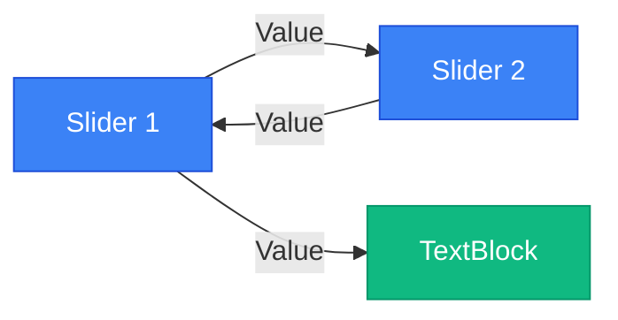
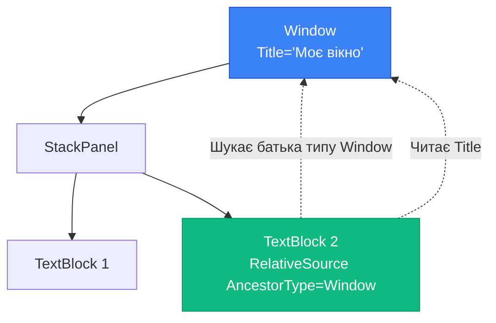
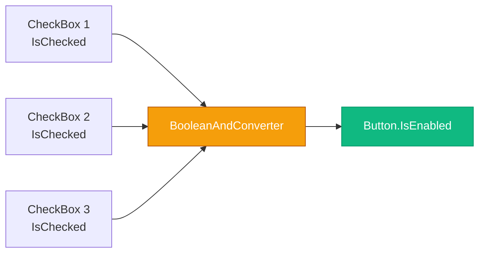

# Просунутий Data Binding: Розширені можливості

## Вступ

У попередніх статтях ми вивчили базовий Data Binding — прив'язку до `DataContext`:

```xml
<TextBlock Text="{Binding FirstName}"/>
```

Але що, якщо потрібно:

- Прив'язати `TextBlock` до значення `Slider`?
- Знайти батьківський `Window` і прочитати його властивість?
- Об'єднати `FirstName` та `LastName` в одне поле `FullName`?
- Показати placeholder поки дані завантажуються?

Для цих сценаріїв потрібні **розширені можливості Binding**: `ElementName`, `RelativeSource`, `MultiBinding`, `StringFormat`, `FallbackValue`.

::note
**Для кого ця стаття?** Якщо ви вже знайомі з базовим Data Binding ([Part 1](17.data-binding-basics-part1), [Part 2](17.data-binding-basics-part2)), ця стаття покаже, як вирішувати складніші сценарії без code-behind.
::

---

## ElementName Binding: Прив'язка до іншого UI-елемента

`ElementName` дозволяє прив'язати властивість одного елемента до властивості іншого елемента.

### Синтаксис

```xml
<TextBlock Text="{Binding ElementName=targetElement, Path=PropertyName}"/>
```

**Параметри:**

- `ElementName` — назва елемента (встановлена через `x:Name`)
- `Path` — властивість цього елемента

### Приклад: Slider + TextBlock

Класичний приклад — синхронізація `Slider` та `TextBlock`:

```xml
<StackPanel Margin="20">
    <TextBlock Text="Гучність:"/>
    <Slider x:Name="volumeSlider" 
            Minimum="0" 
            Maximum="100" 
            Value="50"/>
    
    <TextBlock Text="{Binding ElementName=volumeSlider, Path=Value}" 
               FontSize="24" 
               FontWeight="Bold"/>
</StackPanel>
```

**Що відбувається:**

1. `Slider` має `x:Name="volumeSlider"`
2. `TextBlock.Text` прив'язаний до `volumeSlider.Value`
3. При зміні `Slider` → `TextBlock` автоматично оновлюється

::wpf-preview{title="Slider + TextBlock синхронізація"}
```xml
<StackPanel Margin="20" Spacing="10">
  <TextBlock Text="Гучність:"/>
  <Slider Value="50" Minimum="0" Maximum="100"/>
  <TextBlock Text="50" FontSize="24" FontWeight="Bold"/>
  <TextBlock Text="(У реальному WPF число оновлюється при русі слайдера)" 
             FontSize="10" 
             Foreground="Gray"/>
</StackPanel>
```
::

### Приклад: Синхронізація двох Slider-ів

Два слайдери, що синхронізуються між собою:

```xml
<StackPanel Margin="20">
    <TextBlock Text="Слайдер 1:"/>
    <Slider x:Name="slider1" 
            Minimum="0" 
            Maximum="100" 
            Value="{Binding ElementName=slider2, Path=Value, Mode=TwoWay}"/>
    
    <TextBlock Text="Слайдер 2:" Margin="0,20,0,0"/>
    <Slider x:Name="slider2" 
            Minimum="0" 
            Maximum="100" 
            Value="50"/>
    
    <TextBlock Text="{Binding ElementName=slider1, Path=Value}" 
               FontSize="16" 
               Margin="0,10,0,0"/>
</StackPanel>
```

**Ключовий момент:** `Mode=TwoWay` — зміна `slider1` оновлює `slider2`, і навпаки.

::mermaid

::

### Приклад: Контроль розміру шрифту

Динамічна зміна розміру шрифту через `Slider`:

```xml
<StackPanel Margin="20">
    <TextBlock Text="Розмір шрифту:"/>
    <Slider x:Name="fontSizeSlider" 
            Minimum="10" 
            Maximum="72" 
            Value="16"/>
    
    <TextBlock Text="{Binding ElementName=fontSizeSlider, Path=Value, StringFormat='Розмір: {0:F0} pt'}" 
               Margin="0,10,0,0"/>
    
    <TextBlock Text="Це текст з динамічним розміром шрифту" 
               FontSize="{Binding ElementName=fontSizeSlider, Path=Value}"
               Margin="0,20,0,0"
               TextWrapping="Wrap"/>
</StackPanel>
```

**Що нового:**

- `StringFormat='Розмір: {0:F0} pt'` — форматування значення (детальніше у розділі StringFormat)
- `FontSize="{Binding ElementName=...}"` — прив'язка до властивості `FontSize`

::wpf-preview{title="Динамічний розмір шрифту"}
```xml
<StackPanel Margin="20" Spacing="10">
  <TextBlock Text="Розмір шрифту:"/>
  <Slider Value="16" Minimum="10" Maximum="72"/>
  <TextBlock Text="Розмір: 16 pt"/>
  <TextBlock Text="Це текст з динамічним розміром шрифту" 
             FontSize="16" 
             TextWrapping="Wrap"/>
  <TextBlock Text="(У реальному WPF розмір змінюється при русі слайдера)" 
             FontSize="10" 
             Foreground="Gray"/>
</StackPanel>
```
::

### Use Cases для ElementName

::card-group

::card{title="🎚️ Контроли налаштувань" icon="i-lucide-sliders"}
Slider для гучності, яскравості, розміру шрифту — відображення поточного значення у TextBlock.
::

::card{title="🔗 Синхронізація контролів" icon="i-lucide-link"}
Два DatePicker (дата початку/кінця) — кінець не може бути раніше початку.
::

::card{title="👁️ Live preview" icon="i-lucide-eye"}
Форма налаштувань зліва → preview справа (розмір, колір, шрифт).
::

::card{title="✅ Умовна видимість" icon="i-lucide-check-circle"}
CheckBox "Показати деталі" → Panel з деталями (через `Visibility` Binding).
::

::


---

## RelativeSource Binding: Пошук елементів у дереві

`RelativeSource` дозволяє знайти елемент відносно поточного елемента у Visual/Logical Tree.

### Режими RelativeSource

| Режим              | Опис                                      | Use Case                          |
| ------------------ | ----------------------------------------- | --------------------------------- |
| `Self`             | Прив'язка до себе                         | Tooltip з власною властивістю     |
| `FindAncestor`     | Пошук батька по типу                      | Доступ до Window з дочірнього елемента |
| `TemplatedParent`  | Батьківський елемент у ControlTemplate    | Кастомні контроли                 |
| `PreviousData`     | Попередній елемент у колекції             | Порівняння з попереднім значенням |

### Self: Прив'язка до себе

Прив'язка властивості елемента до іншої його властивості.

**Синтаксис:**

```xml
<TextBlock Text="{Binding RelativeSource={RelativeSource Self}, Path=PropertyName}"/>
```

**Приклад: Tooltip з шириною елемента**

```xml
<Border Width="200" 
        Height="100" 
        Background="LightBlue"
        ToolTip="{Binding RelativeSource={RelativeSource Self}, Path=ActualWidth, StringFormat='Ширина: {0:F0} px'}"/>
```

**Що відбувається:**

1. `RelativeSource Self` — посилання на сам `Border`
2. `Path=ActualWidth` — читає властивість `ActualWidth` цього `Border`
3. Tooltip показує: "Ширина: 200 px"

**Приклад: Кнопка з текстом про свій стан**

```xml
<Button Content="Натисни мене"
        ToolTip="{Binding RelativeSource={RelativeSource Self}, Path=IsEnabled, StringFormat='Активна: {0}'}"/>
```

### FindAncestor: Пошук батька по типу

Пошук батьківського елемента певного типу у Visual Tree.

**Синтаксис:**

```xml
<TextBlock Text="{Binding RelativeSource={RelativeSource AncestorType=Window}, Path=Title}"/>
```

**Параметри:**

- `AncestorType` — тип батька (Window, Grid, StackPanel, UserControl)
- `AncestorLevel` — рівень (1 = перший батько, 2 = дідусь, тощо)

**Приклад: Доступ до Window.Title з дочірнього елемента**

```xml
<Window x:Class="MyApp.MainWindow"
        Title="Моє вікно" 
        Width="400" Height="300">
    <StackPanel Margin="20">
        <TextBlock Text="Заголовок вікна:"/>
        <TextBlock Text="{Binding RelativeSource={RelativeSource AncestorType=Window}, Path=Title}" 
                   FontWeight="Bold" 
                   FontSize="16"/>
    </StackPanel>
</Window>
```

**Що відбувається:**

1. `TextBlock` шукає батька типу `Window`
2. Читає його властивість `Title`
3. Відображає: "Моє вікно"

::mermaid

::

**Приклад: Доступ до DataContext батьківського Grid**

```xml
<Grid x:Name="parentGrid" DataContext="{Binding SomeViewModel}">
    <StackPanel>
        <Border>
            <TextBlock Text="{Binding RelativeSource={RelativeSource AncestorType=Grid}, Path=DataContext.PropertyName}"/>
        </Border>
    </StackPanel>
</Grid>
```

**Use Case:** Коли дочірній елемент має свій `DataContext`, але потрібен доступ до батьківського.

**Приклад: AncestorLevel — пошук дідуся**

```xml
<Grid x:Name="grandparent" Background="LightGray">
    <Grid x:Name="parent" Background="LightBlue">
        <TextBlock Text="{Binding RelativeSource={RelativeSource AncestorType=Grid, AncestorLevel=2}, Path=Name}" 
                   Margin="20"/>
    </Grid>
</Grid>
```

**Результат:** `TextBlock` показує "grandparent" (другий батько типу `Grid`).

### TemplatedParent: Всередині ControlTemplate

Використовується у кастомних контролах для доступу до властивостей батьківського контролу.

**Приклад: Кастомна кнопка**

```xml
<ControlTemplate TargetType="Button">
    <Border Background="{TemplateBinding Background}"
            BorderBrush="{TemplateBinding BorderBrush}"
            BorderThickness="{TemplateBinding BorderThickness}">
        <ContentPresenter Content="{Binding RelativeSource={RelativeSource TemplatedParent}, Path=Content}"
                          HorizontalAlignment="Center"
                          VerticalAlignment="Center"/>
    </Border>
</ControlTemplate>
```

**Що відбувається:**

- `TemplatedParent` — посилання на `Button`, для якого застосовується цей template
- `Path=Content` — читає властивість `Content` цієї кнопки

::note
**TemplateBinding vs RelativeSource TemplatedParent:** `TemplateBinding` — це скорочений синтаксис для `RelativeSource TemplatedParent`. Працює тільки у ControlTemplate. `TemplateBinding Background` = `Binding RelativeSource={RelativeSource TemplatedParent}, Path=Background`.
::

### Use Cases для RelativeSource

::card-group

::card{title="🪟 Доступ до Window" icon="i-lucide-square"}
Дочірній елемент читає `Window.Title`, `Window.Width`, або викликає команди Window.
::

::card{title="📦 Доступ до батьківського контейнера" icon="i-lucide-box"}
Елемент у Grid читає `Grid.ActualWidth` для адаптивного layout.
::

::card{title="🎨 Кастомні контроли" icon="i-lucide-palette"}
ControlTemplate читає властивості батьківського контролу через `TemplatedParent`.
::

::card{title="🔗 Обхід DataContext" icon="i-lucide-unlink"}
Дочірній елемент має свій DataContext, але потрібен доступ до батьківського.
::

::


---

## MultiBinding: Об'єднання кількох джерел

`MultiBinding` дозволяє об'єднати кілька властивостей в одне значення через `IMultiValueConverter`.

### Проблема

Як відобразити `FullName`, якщо у моделі є тільки `FirstName` та `LastName`?

**Неправильний підхід:**

```csharp
// ❌ Додавати обчислювану властивість у ViewModel для кожної комбінації
public string FullName => $"{FirstName} {LastName}";
public string FullNameWithTitle => $"{Title} {FirstName} {LastName}";
public string ShortName => $"{FirstName[0]}. {LastName}";
// ... десятки варіантів
```

**Правильний підхід:** `MultiBinding` + `IMultiValueConverter` — логіка об'єднання у конвертері, а не у ViewModel.

### Синтаксис MultiBinding

```xml
<TextBlock>
    <TextBlock.Text>
        <MultiBinding Converter="{StaticResource fullNameConverter}">
            <Binding Path="FirstName"/>
            <Binding Path="LastName"/>
        </MultiBinding>
    </TextBlock.Text>
</TextBlock>
```

### IMultiValueConverter

Інтерфейс для перетворення масиву значень в одне значення:

```csharp
public interface IMultiValueConverter
{
    object Convert(object[] values, Type targetType, object parameter, CultureInfo culture);
    object[] ConvertBack(object value, Type[] targetTypes, object parameter, CultureInfo culture);
}
```

**Параметри:**

- `values` — масив значень з усіх Binding-ів
- `targetType` — тип Target властивості (наприклад, `string`)
- `parameter` — додатковий параметр (через `ConverterParameter`)
- `culture` — культура для локалізації

### Приклад: FullName Converter

**Converter:**

```csharp
using System;
using System.Globalization;
using System.Windows.Data;

public class FullNameConverter : IMultiValueConverter
{
    public object Convert(object[] values, Type targetType, object parameter, CultureInfo culture)
    {
        // Перевірка: чи всі значення — рядки
        if (values.Length < 2 || values[0] is not string firstName || values[1] is not string lastName)
            return string.Empty;
        
        // Об'єднання
        return $"{firstName} {lastName}";
    }
    
    public object[] ConvertBack(object value, Type[] targetTypes, object parameter, CultureInfo culture)
    {
        // ConvertBack для MultiBinding рідко використовується
        throw new NotImplementedException();
    }
}
```

**Реєстрація у ресурсах:**

```xml
<Window.Resources>
    <local:FullNameConverter x:Key="fullNameConverter"/>
</Window.Resources>
```

**Використання:**

```xml
<StackPanel Margin="20">
    <TextBlock Text="Ім'я:"/>
    <TextBox Text="{Binding FirstName}"/>
    
    <TextBlock Text="Прізвище:"/>
    <TextBox Text="{Binding LastName}"/>
    
    <TextBlock Text="Повне ім'я:" FontWeight="Bold" Margin="0,10,0,0"/>
    <TextBlock FontSize="16">
        <TextBlock.Text>
            <MultiBinding Converter="{StaticResource fullNameConverter}">
                <Binding Path="FirstName"/>
                <Binding Path="LastName"/>
            </MultiBinding>
        </TextBlock.Text>
    </TextBlock>
</StackPanel>
```

**Результат:** При зміні `FirstName` або `LastName` → `FullName` автоматично оновлюється.

::wpf-preview{title="MultiBinding для FullName"}
```xml
<StackPanel Margin="20" Spacing="10">
  <TextBlock Text="Ім'я:"/>
  <TextBox Text="Іван"/>
  
  <TextBlock Text="Прізвище:"/>
  <TextBox Text="Петренко"/>
  
  <TextBlock Text="Повне ім'я:" FontWeight="Bold"/>
  <TextBlock Text="Іван Петренко" FontSize="16"/>
  
  <TextBlock Text="(У реальному WPF оновлюється при зміні будь-якого поля)" 
             FontSize="10" 
             Foreground="Gray"/>
</StackPanel>
```
::

### Приклад: Калькулятор з MultiBinding

**Converter для суми:**

```csharp
public class SumConverter : IMultiValueConverter
{
    public object Convert(object[] values, Type targetType, object parameter, CultureInfo culture)
    {
        double sum = 0;
        
        foreach (var value in values)
        {
            if (value is string str && double.TryParse(str, out double number))
                sum += number;
            else if (value is double d)
                sum += d;
        }
        
        return sum;
    }
    
    public object[] ConvertBack(object value, Type[] targetTypes, object parameter, CultureInfo culture)
    {
        throw new NotImplementedException();
    }
}
```

**XAML:**

```xml
<Window.Resources>
    <local:SumConverter x:Key="sumConverter"/>
</Window.Resources>

<StackPanel Margin="20">
    <TextBlock Text="Число 1:"/>
    <TextBox x:Name="txt1" Text="10"/>
    
    <TextBlock Text="Число 2:"/>
    <TextBox x:Name="txt2" Text="20"/>
    
    <TextBlock Text="Число 3:"/>
    <TextBox x:Name="txt3" Text="30"/>
    
    <TextBlock Text="Сума:" FontWeight="Bold" Margin="0,10,0,0"/>
    <TextBlock FontSize="20">
        <TextBlock.Text>
            <MultiBinding Converter="{StaticResource sumConverter}">
                <Binding ElementName="txt1" Path="Text"/>
                <Binding ElementName="txt2" Path="Text"/>
                <Binding ElementName="txt3" Path="Text"/>
            </MultiBinding>
        </TextBlock.Text>
    </TextBlock>
</StackPanel>
```

**Результат:** Сума трьох TextBox-ів оновлюється миттєво при зміні будь-якого з них.

### Приклад: Умовна видимість через MultiBinding

**Converter для AND логіки:**

```csharp
public class BooleanAndConverter : IMultiValueConverter
{
    public object Convert(object[] values, Type targetType, object parameter, CultureInfo culture)
    {
        // Всі значення мають бути true
        foreach (var value in values)
        {
            if (value is not bool b || !b)
                return false;
        }
        
        return true;
    }
    
    public object[] ConvertBack(object value, Type[] targetTypes, object parameter, CultureInfo culture)
    {
        throw new NotImplementedException();
    }
}
```

**XAML:**

```xml
<StackPanel Margin="20">
    <CheckBox x:Name="chk1" Content="Умова 1"/>
    <CheckBox x:Name="chk2" Content="Умова 2"/>
    <CheckBox x:Name="chk3" Content="Умова 3"/>
    
    <Button Content="Доступна тільки якщо всі CheckBox-и вибрані" Margin="0,20,0,0">
        <Button.IsEnabled>
            <MultiBinding Converter="{StaticResource booleanAndConverter}">
                <Binding ElementName="chk1" Path="IsChecked"/>
                <Binding ElementName="chk2" Path="IsChecked"/>
                <Binding ElementName="chk3" Path="IsChecked"/>
            </MultiBinding>
        </Button.IsEnabled>
    </Button>
</StackPanel>
```

**Результат:** Кнопка активна тільки коли всі три CheckBox-и вибрані.

::mermaid

::


---

## StringFormat: Форматування прямо у Binding

`StringFormat` дозволяє форматувати значення без створення конвертера.

### Синтаксис

```xml
<TextBlock Text="{Binding Price, StringFormat='{}{0:C2}'}"/>
```

**Важливо:** `{}` на початку — escape-послідовність, щоб XAML parser не сприймав `{0}` як Markup Extension.

### Формати чисел

| Формат | Опис                  | Приклад (1234.56)  |
| ------ | --------------------- | ------------------ |
| `C2`   | Currency (2 знаки)    | $1,234.56          |
| `N0`   | Number без дробової   | 1,235              |
| `N2`   | Number з 2 знаками    | 1,234.56           |
| `P0`   | Percent без дробової  | 123,456%           |
| `P2`   | Percent з 2 знаками   | 123,456.00%        |
| `F2`   | Fixed-point 2 знаки   | 1234.56            |

**Приклад:**

```xml
<StackPanel Margin="20">
    <TextBlock Text="{Binding Price, StringFormat='Ціна: {0:C2}'}"/>
    <TextBlock Text="{Binding Discount, StringFormat='Знижка: {0:P0}'}"/>
    <TextBlock Text="{Binding Quantity, StringFormat='Кількість: {0:N0} шт.'}"/>
</StackPanel>
```

**Результат:**
- Ціна: $1,234.56
- Знижка: 15%
- Кількість: 100 шт.

### Формати дат

| Формат | Опис                     | Приклад                  |
| ------ | ------------------------ | ------------------------ |
| `d`    | Short date               | 10.04.2026               |
| `D`    | Long date                | 10 квітня 2026 р.        |
| `t`    | Short time               | 14:30                    |
| `T`    | Long time                | 14:30:45                 |
| `g`    | Short date + time        | 10.04.2026 14:30         |
| `G`    | Long date + time         | 10.04.2026 14:30:45      |

**Приклад:**

```xml
<StackPanel Margin="20">
    <TextBlock Text="{Binding CreatedDate, StringFormat='Створено: {0:d}'}"/>
    <TextBlock Text="{Binding LastModified, StringFormat='Змінено: {0:G}'}"/>
    <TextBlock Text="{Binding Time, StringFormat='Час: {0:HH:mm:ss}'}"/>
</StackPanel>
```

### Кастомні формати

```xml
<!-- Телефон -->
<TextBlock Text="{Binding Phone, StringFormat='Тел: +38 ({0:000}) 000-00-00}'}"/>

<!-- Дата народження -->
<TextBlock Text="{Binding BirthDate, StringFormat='Народився: {0:dd MMMM yyyy} року'}"/>

<!-- Розмір файлу -->
<TextBlock Text="{Binding FileSize, StringFormat='{}{0:N0} байт'}"/>
```

### StringFormat у MultiBinding

```xml
<TextBlock>
    <TextBlock.Text>
        <MultiBinding StringFormat="{}{0} {1} ({2} років)">
            <Binding Path="FirstName"/>
            <Binding Path="LastName"/>
            <Binding Path="Age"/>
        </MultiBinding>
    </TextBlock.Text>
</TextBlock>
```

**Результат:** "Іван Петренко (25 років)"

::tip
**Коли використовувати StringFormat:** Для простого форматування (дати, числа, рядки). Для складної логіки — створюйте `IValueConverter`.
::

---

## FallbackValue та TargetNullValue

Ці властивості визначають, що показувати при помилці Binding або null значенні.

### FallbackValue: Значення при помилці

Показується, коли Binding не може знайти властивість або виникла помилка.

```xml
<TextBlock Text="{Binding NonExistentProperty, FallbackValue='Дані недоступні'}"/>
```

**Use Cases:**

::card-group

::card{title="🔌 Завантаження даних" icon="i-lucide-loader"}
Показати "Завантаження..." поки дані завантажуються з API.
::

::card{title="❌ Помилка Binding" icon="i-lucide-x-circle"}
Показати "N/A" замість порожнього поля при помилці.
::

::card{title="🖼️ Placeholder зображення" icon="i-lucide-image"}
Показати placeholder.png якщо Image.Source не завантажився.
::

::

**Приклад:**

```xml
<StackPanel Margin="20">
    <TextBlock Text="{Binding UserName, FallbackValue='Гість'}"/>
    <Image Source="{Binding AvatarUrl, FallbackValue='/Images/default-avatar.png'}" 
           Width="100" 
           Height="100"/>
</StackPanel>
```

### TargetNullValue: Значення при null

Показується, коли Source властивість має значення `null`.

```xml
<TextBlock Text="{Binding MiddleName, TargetNullValue='(немає по батькові)'}"/>
```

**Різниця між FallbackValue та TargetNullValue:**

| Ситуація                        | FallbackValue | TargetNullValue |
| ------------------------------- | ------------- | --------------- |
| Властивість не існує            | ✅ Показується | ❌ Не показується |
| Властивість = `null`            | ❌ Не показується | ✅ Показується |
| Помилка конвертера              | ✅ Показується | ❌ Не показується |
| Binding до неправильного типу   | ✅ Показується | ❌ Не показується |

**Приклад:**

```xml
<StackPanel Margin="20">
    <!-- Якщо Email = null → показати "(не вказано)" -->
    <TextBlock Text="{Binding Email, TargetNullValue='(не вказано)'}"/>
    
    <!-- Якщо Phone = null → показати "N/A", якщо помилка → "Помилка" -->
    <TextBlock Text="{Binding Phone, TargetNullValue='N/A', FallbackValue='Помилка'}"/>
</StackPanel>
```

---

## Debugging Binding: Пошук помилок

Binding помилки у WPF — мовчазні. Як їх знайти?

### Output Window

При помилці Binding WPF пише у Output Window:

```
System.Windows.Data Error: 40 : BindingExpression path error: 'Nane' property not found on 'object' ''PersonViewModel' (HashCode=12345)'. BindingExpression:Path=Nane; DataItem='PersonViewModel' (HashCode=12345); target element is 'TextBlock' (Name=''); target property is 'Text' (type 'String')
```

**Як читати:**

- `Error: 40` — код помилки (40 = property not found)
- `'Nane' property not found` — властивість не знайдена
- `DataItem='PersonViewModel'` — тип DataContext
- `target element is 'TextBlock'` — елемент з помилкою

### PresentationTraceSources.TraceLevel

Для детальної діагностики увімкніть трасування:

```xml
<TextBlock Text="{Binding Name}" 
           xmlns:diag="clr-namespace:System.Diagnostics;assembly=WindowsBase"
           diag:PresentationTraceSources.TraceLevel="High"/>
```

**Рівні трасування:**

- `None` — без трасування (за замовчуванням)
- `Low` — тільки помилки
- `Medium` — помилки + попередження
- `High` — вся інформація (кожен крок Binding)

**Output при TraceLevel=High:**

```
System.Windows.Data Information: 10 : Cannot retrieve value using the binding and no valid fallback value exists; using default instead. BindingExpression:Path=Name; DataItem=null; target element is 'TextBlock' (Name=''); target property is 'Text' (type 'String')
System.Windows.Data Information: 20 : BindingExpression cannot retrieve value due to missing information. BindingExpression:Path=Name; DataItem=null; target element is 'TextBlock' (Name=''); target property is 'Text' (type 'String')
System.Windows.Data Information: 21 : BindingExpression cannot retrieve value from null data item. BindingExpression:Path=Name; DataItem=null; target element is 'TextBlock' (Name=''); target property is 'Text' (type 'String')
```

::warning
**Увага:** `TraceLevel=High` генерує величезну кількість логів. Використовуйте тільки для діагностики конкретного Binding, а не для всього проєкту.
::

### Типові помилки Binding

::card-group

::card{title="❌ Property not found" icon="i-lucide-search-x"}
Опечатка у назві властивості або властивість не існує у DataContext.
::

::card{title="❌ DataContext is null" icon="i-lucide-database-zap"}
DataContext не встановлений або встановлений після ініціалізації Binding.
::

::card{title="❌ Wrong type" icon="i-lucide-alert-triangle"}
Спроба прив'язати string до int без конвертера.
::

::card{title="❌ Converter error" icon="i-lucide-wrench"}
Виняток у методі `Convert()` конвертера.
::

::


---

## Практичні завдання

### Рівень 1: Slider + TextBlock через ElementName

**Мета:** Навчитися використовувати `ElementName` Binding для синхронізації контролів.

**Завдання:**

Створіть форму налаштувань з трьома параметрами:

1. **Гучність** (Slider 0-100) → TextBlock показує значення
2. **Яскравість** (Slider 0-100) → TextBlock показує значення у відсотках (`StringFormat='{}{0:F0}%'`)
3. **Розмір шрифту** (Slider 10-72) → TextBlock з демо-текстом, що змінює свій розмір

**Критерії успіху:**
- Всі три Slider-и працюють незалежно
- TextBlock-и оновлюються миттєво при зміні Slider
- Демо-текст змінює розмір шрифту у реальному часі

**Підказка:**
```xml
<Slider x:Name="volumeSlider" Minimum="0" Maximum="100" Value="50"/>
<TextBlock Text="{Binding ElementName=volumeSlider, Path=Value, StringFormat='Гучність: {0:F0}'}"/>
```

---

### Рівень 2: Калькулятор з MultiBinding

**Мета:** Створити калькулятор, що об'єднує кілька TextBox через `MultiBinding`.

**Завдання:**

Створіть калькулятор з чотирма операціями:

**Converter:**
```csharp
public class CalculatorConverter : IMultiValueConverter
{
    public object Convert(object[] values, Type targetType, object parameter, CultureInfo culture)
    {
        if (values.Length < 3) return 0;
        
        if (!double.TryParse(values[0]?.ToString(), out double num1)) return 0;
        if (!double.TryParse(values[1]?.ToString(), out double num2)) return 0;
        
        string operation = values[2]?.ToString();
        
        return operation switch
        {
            "+" => num1 + num2,
            "-" => num1 - num2,
            "*" => num1 * num2,
            "/" => num2 != 0 ? num1 / num2 : 0,
            _ => 0
        };
    }
    
    public object[] ConvertBack(object value, Type[] targetTypes, object parameter, CultureInfo culture)
    {
        throw new NotImplementedException();
    }
}
```

**UI:**
- Два TextBox для чисел
- ComboBox з операціями (+, -, *, /)
- TextBlock з результатом через `MultiBinding`

**Критерії успіху:**
- Результат оновлюється миттєво при зміні будь-якого параметра
- Ділення на нуль повертає 0 (без винятку)
- Некоректне введення (не число) повертає 0

---

### Рівень 3: Форма реєстрації з валідацією

**Мета:** Створити складну форму з `MultiBinding` для умовної активації кнопки.

**Завдання:**

Створіть форму реєстрації з такими полями:

**ViewModel:**
```csharp
public class RegistrationViewModel : INotifyPropertyChanged
{
    private string _userName;
    private string _email;
    private string _password;
    private string _confirmPassword;
    private bool _agreeToTerms;
    
    // Властивості з INPC...
}
```

**Вимоги до валідації:**

1. `UserName` — не порожній, мінімум 3 символи
2. `Email` — містить "@"
3. `Password` — мінімум 6 символів
4. `ConfirmPassword` — співпадає з `Password`
5. `AgreeToTerms` — CheckBox вибраний

**Converter для валідації:**
```csharp
public class RegistrationValidationConverter : IMultiValueConverter
{
    public object Convert(object[] values, Type targetType, object parameter, CultureInfo culture)
    {
        if (values.Length < 5) return false;
        
        string userName = values[0]?.ToString();
        string email = values[1]?.ToString();
        string password = values[2]?.ToString();
        string confirmPassword = values[3]?.ToString();
        bool agreeToTerms = values[4] is bool b && b;
        
        return !string.IsNullOrWhiteSpace(userName) && userName.Length >= 3 &&
               !string.IsNullOrWhiteSpace(email) && email.Contains("@") &&
               !string.IsNullOrWhiteSpace(password) && password.Length >= 6 &&
               password == confirmPassword &&
               agreeToTerms;
    }
    
    public object[] ConvertBack(object value, Type[] targetTypes, object parameter, CultureInfo culture)
    {
        throw new NotImplementedException();
    }
}
```

**UI:**
- TextBox-и для всіх полів
- CheckBox "Я погоджуюсь з умовами"
- Button "Зареєструватися" — активна тільки коли всі умови виконані (через `MultiBinding` на `IsEnabled`)

**Критерії успіху:**
- Кнопка активна тільки коли всі 5 умов виконані
- Валідація працює у реальному часі (без натискання кнопки)
- Використано `UpdateSourceTrigger=PropertyChanged` для миттєвої валідації

**Додатково (складно):**
- Додайте TextBlock-и з підказками під кожним полем (червоний текст при помилці)
- Використайте `FallbackValue` для відображення помилок

---

## Підсумок

Ви опанували розширені можливості Data Binding, що дозволяють вирішувати складні сценарії без code-behind.

**Ключові висновки:**

::card-group

::card{title="🔗 ElementName Binding" icon="i-lucide-link"}
Прив'язка до іншого UI-елемента. Синхронізація контролів, live preview, умовна видимість.
::

::card{title="🔍 RelativeSource Binding" icon="i-lucide-search"}
Пошук елементів у дереві: `Self`, `FindAncestor`, `TemplatedParent`. Доступ до батьківських властивостей.
::

::card{title="🔀 MultiBinding" icon="i-lucide-git-merge"}
Об'єднання кількох джерел через `IMultiValueConverter`. Калькулятори, валідація, складні умови.
::

::card{title="📝 StringFormat" icon="i-lucide-type"}
Форматування значень без конвертера. Дати, числа, валюта, відсотки.
::

::card{title="🛡️ FallbackValue" icon="i-lucide-shield"}
Значення при помилці Binding. Placeholder-и, "Завантаження...", "N/A".
::

::card{title="🐛 Debugging" icon="i-lucide-bug"}
Output Window, `PresentationTraceSources.TraceLevel=High` для діагностики помилок.
::

::

**Що далі?**

- **Value Converters** ([наступна стаття](19.value-converters)) — детальний розгляд `IValueConverter` та створення бібліотеки конвертерів
- **Data Templates** (стаття 20) — візуалізація об'єктів через шаблони
- **MVVM Pattern** (Блок 7) — архітектурний патерн для повного розділення UI та логіки

::tip
**Best Practice:** Використовуйте `ElementName` та `RelativeSource` для UI-логіки (синхронізація контролів). Використовуйте `DataContext` Binding для бізнес-логіки (дані з ViewModel).
::

---

## Словник термінів

::note{title="📚 Глосарій"}

**ElementName Binding** — прив'язка властивості одного UI-елемента до властивості іншого UI-елемента через `x:Name`.

**RelativeSource Binding** — пошук елемента відносно поточного елемента у Visual/Logical Tree. Режими: `Self`, `FindAncestor`, `TemplatedParent`, `PreviousData`.

**MultiBinding** — об'єднання кількох Binding-ів в одне значення через `IMultiValueConverter`.

**IMultiValueConverter** — інтерфейс для перетворення масиву значень (`object[]`) в одне значення. Використовується у `MultiBinding`.

**StringFormat** — властивість Binding для форматування значення без створення конвертера. Підтримує стандартні формати .NET.

**FallbackValue** — значення, що показується при помилці Binding (властивість не знайдена, помилка конвертера).

**TargetNullValue** — значення, що показується коли Source властивість має значення `null`.

**PresentationTraceSources.TraceLevel** — рівень трасування для діагностики Binding помилок. Значення: `None`, `Low`, `Medium`, `High`.

::

---

## Додаткові ресурси

::card-group

::card{title="📖 Microsoft Docs: Data Binding Overview" icon="i-lucide-book-open" to="https://learn.microsoft.com/en-us/dotnet/desktop/wpf/data/"}
Повний огляд Data Binding у WPF з усіма можливостями та прикладами.
::

::card{title="📖 RelativeSource Binding" icon="i-lucide-search" to="https://learn.microsoft.com/en-us/dotnet/desktop/wpf/data/relativesource-markupextension"}
Детальна документація `RelativeSource` з усіма режимами та use cases.
::

::card{title="📖 MultiBinding Class" icon="i-lucide-git-merge" to="https://learn.microsoft.com/en-us/dotnet/api/system.windows.data.multibinding"}
API документація `MultiBinding` та `IMultiValueConverter`.
::

::card{title="🎓 String Formatting" icon="i-lucide-type" to="https://learn.microsoft.com/en-us/dotnet/standard/base-types/formatting-types"}
Повний гайд з форматування типів у .NET (дати, числа, валюта).
::

::card{title="🐛 Debugging Data Bindings" icon="i-lucide-bug" to="https://learn.microsoft.com/en-us/dotnet/desktop/wpf/data/how-to-debug-bindings"}
Офіційний гайд з діагностики та debugging Binding помилок.
::

::card{title="📚 Попередня стаття: Avalonia Compiled Bindings" icon="i-lucide-arrow-left" to="17a.avalonia-compiled-bindings"}
Повернутися до Avalonia Compiled Bindings — compile-time перевірка Binding.
::

::card{title="📚 Наступна стаття: Value Converters" icon="i-lucide-arrow-right" to="19.value-converters"}
Дізнатися про `IValueConverter` — перетворення типів даних між Source та Target.
::

::
