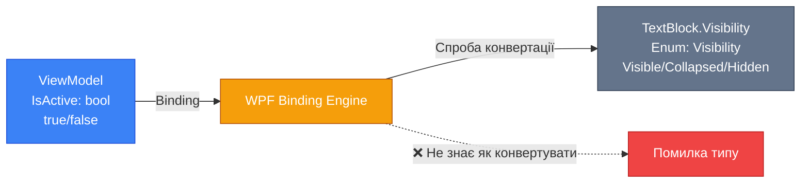
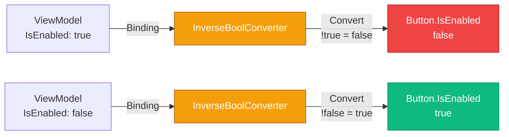

# Value Converters: Перетворення типів даних у Data Binding

## Вступ

Уявіть ситуацію: у вашій моделі є властивість `IsActive` типу `bool`, і ви хочете показати/приховати елемент залежно від цього значення:

```xml
<TextBlock Text="Активний користувач" 
           Visibility="{Binding IsActive}"/>
```

**Проблема:** WPF видає помилку компіляції. `Visibility` — це enum типу `Visibility` (значення: `Visible`, `Collapsed`, `Hidden`), а `IsActive` — це `bool`. Типи несумісні.

Або інший приклад: у моделі дата народження зберігається як `DateTime`, але на UI потрібно показати у форматі "10 квітня 2026 року":

```xml
<TextBlock Text="{Binding BirthDate}"/>
<!-- Показує: 10.04.2026 0:00:00 ❌ -->
```

**Рішення:** **Value Converters** — спеціальні класи, що перетворюють дані між Source (модель) та Target (UI). Вони діють як "перекладачі" між різними типами даних.

::note
**Для кого ця стаття?** Якщо ви вже знайомі з [Data Binding](17.data-binding-basics-part1) та [Advanced Binding](18.data-binding-advanced), ця стаття покаже, як вирішувати проблему несумісності типів через `IValueConverter`.
::

---

## Проблема: Несумісність типів у Binding

Data Binding у WPF працює чудово, коли типи Source та Target співпадають:

```csharp
// ViewModel
public string FirstName { get; set; } = "Іван";
```

```xml
<!-- UI -->
<TextBlock Text="{Binding FirstName}"/>  <!-- ✅ string → string -->
```

Але що, якщо типи різні?

### Типові сценарії несумісності

::card-group

::card{title="🔘 Boolean → Visibility" icon="i-lucide-eye"}
Показати/приховати елемент залежно від bool властивості. `true` → `Visible`, `false` → `Collapsed`.
::

::card{title="📅 DateTime → String" icon="i-lucide-calendar"}
Відобразити дату у читабельному форматі: "10 квітня 2026 року" замість "10.04.2026 0:00:00".
::

::card{title="🎨 Enum → Brush" icon="i-lucide-palette"}
Колір фону залежно від статусу: `Status.Active` → зелений, `Status.Inactive` → сірий.
::

::card{title="🔢 Number → String" icon="i-lucide-hash"}
Форматування числа: `1234.56` → "1 234,56 грн" або "1,234.56 USD".
::

::card{title="❓ Null → Visibility" icon="i-lucide-help-circle"}
Приховати елемент, якщо значення `null`. Показати placeholder.
::

::card{title="🔄 Inverse Boolean" icon="i-lucide-repeat"}
Інвертувати bool: `IsEnabled=true` → `IsDisabled=false` для UI логіки.
::

::

### Приклад проблеми: Boolean → Visibility

**ViewModel:**

```csharp
public class UserViewModel : INotifyPropertyChanged
{
    private bool _isActive;
    
    public bool IsActive
    {
        get => _isActive;
        set
        {
            _isActive = value;
            OnPropertyChanged();
        }
    }
    
    // ... INotifyPropertyChanged implementation
}
```

**Спроба прив'язки (не працює):**

```xml
<StackPanel Margin="20">
    <CheckBox Content="Користувач активний" IsChecked="{Binding IsActive}"/>
    
    <!-- ❌ Помилка: Cannot convert 'System.Boolean' to 'System.Windows.Visibility' -->
    <TextBlock Text="Активний користувач" 
               Visibility="{Binding IsActive}"/>
</StackPanel>
```

**Чому не працює?**

::mermaid

::

WPF Binding Engine не знає, як перетворити `bool` у `Visibility`. Йому потрібна **інструкція** — Value Converter.

---

## IValueConverter: Інтерфейс для перетворення

`IValueConverter` — це інтерфейс з простору імен `System.Windows.Data`, що визначає контракт для перетворення даних.

### Анатомія інтерфейсу

```csharp
public interface IValueConverter
{
    // Source → Target (модель → UI)
    object Convert(
        object value,           // Значення з Source (модель)
        Type targetType,        // Тип Target властивості (UI)
        object parameter,       // Додатковий параметр (ConverterParameter)
        CultureInfo culture     // Культура для локалізації
    );
    
    // Target → Source (UI → модель) — для TwoWay Binding
    object ConvertBack(
        object value,           // Значення з Target (UI)
        Type targetType,        // Тип Source властивості (модель)
        object parameter,       // Додатковий параметр
        CultureInfo culture     // Культура для локалізації
    );
}
```

### 🔵 Recap: Що таке інтерфейс?

Для студентів зі слабким розумінням ООП — коротке нагадування.

**Інтерфейс** — це контракт, який клас зобов'язується виконати. Інтерфейс визначає **що** клас має робити (методи, властивості), але не **як** (реалізація).

```csharp
// Інтерфейс — контракт
public interface IValueConverter
{
    object Convert(...);      // Клас має реалізувати цей метод
    object ConvertBack(...);  // І цей метод
}

// Клас, що виконує контракт
public class BoolToVisibilityConverter : IValueConverter
{
    // Реалізація контракту
    public object Convert(object value, Type targetType, object parameter, CultureInfo culture)
    {
        // Логіка перетворення bool → Visibility
    }
    
    public object ConvertBack(object value, Type targetType, object parameter, CultureInfo culture)
    {
        // Логіка перетворення Visibility → bool
    }
}
```

**Аналогія:** Інтерфейс — це як посадова інструкція. `IValueConverter` — це інструкція: "Ти маєш вміти перетворювати дані в обидва боки (Convert та ConvertBack)".

::tip
**Детальніше про інтерфейси:** Якщо концепція інтерфейсів незрозуміла, рекомендую повернутися до розділу [ООП: Інтерфейси](../02.oop/04.interfaces) для глибшого розуміння.
::

### Параметри методів

Розберемо детально кожен параметр:

**1. `object value` — Значення для перетворення**

У методі `Convert()` — це значення з Source (модель). У методі `ConvertBack()` — значення з Target (UI).

```csharp
public object Convert(object value, ...)
{
    // value — це IsActive (bool) з ViewModel
    if (value is bool isActive)
    {
        // Перетворюємо bool → Visibility
    }
}
```

**2. `Type targetType` — Тип цільової властивості**

Тип, у який потрібно перетворити значення. Зазвичай не використовується, бо конвертер створюється для конкретної пари типів.

```csharp
public object Convert(object value, Type targetType, ...)
{
    // targetType == typeof(Visibility)
    // Можна перевірити, чи правильний тип
    if (targetType != typeof(Visibility))
        throw new InvalidOperationException("Target must be Visibility");
}
```

**3. `object parameter` — Додатковий параметр**

Передається через `ConverterParameter` у XAML. Дозволяє налаштувати поведінку конвертера.

```xml
<TextBlock Visibility="{Binding IsActive, 
                                Converter={StaticResource boolToVisConverter},
                                ConverterParameter=Inverted}"/>
```

```csharp
public object Convert(object value, Type targetType, object parameter, ...)
{
    bool invert = parameter?.ToString() == "Inverted";
    bool isActive = (bool)value;
    
    if (invert)
        isActive = !isActive;  // Інвертуємо логіку
    
    return isActive ? Visibility.Visible : Visibility.Collapsed;
}
```

**4. `CultureInfo culture` — Культура для локалізації**

Використовується для форматування дат, чисел, валюти залежно від локалі користувача.

```csharp
public object Convert(object value, Type targetType, object parameter, CultureInfo culture)
{
    if (value is DateTime date)
    {
        // Форматуємо дату згідно з культурою
        return date.ToString("D", culture);  // "10 квітня 2026 року" (uk-UA)
    }
}
```

---

## Стандартний конвертер WPF: BooleanToVisibilityConverter

WPF має один вбудований конвертер — `BooleanToVisibilityConverter`.

### Як він працює?

| Source (bool) | Target (Visibility) |
| ------------- | ------------------- |
| `true`        | `Visible`           |
| `false`       | `Collapsed`         |

**ConvertBack:**

| Source (Visibility) | Target (bool) |
| ------------------- | ------------- |
| `Visible`           | `true`        |
| `Collapsed`         | `false`       |
| `Hidden`            | `false`       |

### Використання

**Крок 1: Реєстрація у ресурсах**

```xml
<Window.Resources>
    <BooleanToVisibilityConverter x:Key="boolToVisConverter"/>
</Window.Resources>
```

**Крок 2: Використання у Binding**

```xml
<StackPanel Margin="20">
    <CheckBox Content="Показати деталі" IsChecked="{Binding ShowDetails}"/>
    
    <Border Background="LightBlue" 
            Padding="10" 
            Margin="0,10,0,0"
            Visibility="{Binding ShowDetails, Converter={StaticResource boolToVisConverter}}">
        <TextBlock Text="Це деталі, що показуються тільки коли ShowDetails = true"/>
    </Border>
</StackPanel>
```

**Що відбувається:**

1. `ShowDetails` (bool) змінюється при кліку на CheckBox
2. Binding Engine викликає `BooleanToVisibilityConverter.Convert()`
3. Конвертер повертає `Visible` або `Collapsed`
4. `Border.Visibility` оновлюється

::wpf-preview{title="BooleanToVisibilityConverter у дії"}
```xml
<StackPanel Margin="20" Spacing="10">
  <CheckBox Content="Показати деталі" IsChecked="True"/>
  
  <Border Background="LightBlue" Padding="10">
    <TextBlock Text="Це деталі, що показуються тільки коли ShowDetails = true"/>
  </Border>
  
  <TextBlock Text="(У реальному WPF Border зникає при зняті галочки)" 
             FontSize="10" 
             Foreground="Gray"/>
</StackPanel>
```
::

::note
**Avalonia:** У Avalonia немає вбудованого `BooleanToVisibilityConverter`. Потрібно створювати власний або використовувати бібліотеки (наприклад, `Avalonia.Xaml.Behaviors`).
::


---

## Створення кастомних конвертерів

Розберемо покроково, як створювати власні Value Converters для різних сценаріїв.

### Конвертер 1: InverseBoolConverter

**Призначення:** Інвертувати bool значення. `true` → `false`, `false` → `true`.

**Use Case:** Кнопка "Вимкнути" активна тільки коли щось увімкнено. `IsEnabled="{Binding IsActive, Converter={StaticResource inverseBoolConverter}}"`.

**Реалізація:**

```csharp
using System;
using System.Globalization;
using System.Windows.Data;

namespace MyApp.Converters
{
    public class InverseBoolConverter : IValueConverter
    {
        public object Convert(object value, Type targetType, object parameter, CultureInfo culture)
        {
            // Перевірка типу
            if (value is not bool boolValue)
                return false;  // Fallback значення
            
            // Інвертуємо
            return !boolValue;
        }
        
        public object ConvertBack(object value, Type targetType, object parameter, CultureInfo culture)
        {
            // ConvertBack — та сама логіка (інверсія симетрична)
            if (value is not bool boolValue)
                return false;
            
            return !boolValue;
        }
    }
}
```

**Реєстрація у ресурсах:**

```xml
<Window.Resources>
    <local:InverseBoolConverter x:Key="inverseBoolConverter"/>
</Window.Resources>
```

**Використання:**

```xml
<StackPanel Margin="20">
    <CheckBox Content="Увімкнено" IsChecked="{Binding IsEnabled}"/>
    
    <!-- Кнопка активна тільки коли IsEnabled = false -->
    <Button Content="Увімкнути" 
            IsEnabled="{Binding IsEnabled, Converter={StaticResource inverseBoolConverter}}"
            Margin="0,10,0,0"/>
</StackPanel>
```

**Діаграма роботи:**

::mermaid

::

---

### Конвертер 2: NullToVisibilityConverter

**Призначення:** Приховати елемент, якщо значення `null`. Показати, якщо не `null`.

**Use Case:** Показати повідомлення про помилку тільки коли воно є (не `null`).

**Реалізація:**

```csharp
using System;
using System.Globalization;
using System.Windows;
using System.Windows.Data;

namespace MyApp.Converters
{
    public class NullToVisibilityConverter : IValueConverter
    {
        // Властивість для налаштування: приховувати при null чи навпаки?
        public bool InvertLogic { get; set; } = false;
        
        public object Convert(object value, Type targetType, object parameter, CultureInfo culture)
        {
            bool isNull = value == null;
            
            // Якщо InvertLogic = true, інвертуємо логіку
            if (InvertLogic)
                isNull = !isNull;
            
            return isNull ? Visibility.Collapsed : Visibility.Visible;
        }
        
        public object ConvertBack(object value, Type targetType, object parameter, CultureInfo culture)
        {
            // ConvertBack не має сенсу для Visibility → null
            throw new NotImplementedException();
        }
    }
}
```

**Реєстрація з налаштуванням:**

```xml
<Window.Resources>
    <!-- Приховати при null -->
    <local:NullToVisibilityConverter x:Key="nullToCollapsedConverter" InvertLogic="False"/>
    
    <!-- Показати при null (інвертована логіка) -->
    <local:NullToVisibilityConverter x:Key="nullToVisibleConverter" InvertLogic="True"/>
</Window.Resources>
```

**Використання:**

```xml
<StackPanel Margin="20">
    <TextBox Text="{Binding ErrorMessage, UpdateSourceTrigger=PropertyChanged}"/>
    
    <!-- Показати тільки якщо ErrorMessage не null -->
    <Border Background="#FFEBEE" 
            BorderBrush="#F44336" 
            BorderThickness="1" 
            Padding="10" 
            Margin="0,10,0,0"
            Visibility="{Binding ErrorMessage, Converter={StaticResource nullToCollapsedConverter}}">
        <TextBlock Text="{Binding ErrorMessage}" 
                   Foreground="#D32F2F"/>
    </Border>
</StackPanel>
```

**Результат:** Червона рамка з помилкою показується тільки коли `ErrorMessage` не `null`.

---

### Конвертер 3: EnumToBrushConverter

**Призначення:** Перетворити enum у колір (Brush). Різні статуси — різні кольори.

**Use Case:** Статус замовлення: `Pending` → жовтий, `Completed` → зелений, `Cancelled` → червоний.

**Enum:**

```csharp
public enum OrderStatus
{
    Pending,
    Processing,
    Completed,
    Cancelled
}
```

**Реалізація конвертера:**

```csharp
using System;
using System.Globalization;
using System.Windows.Data;
using System.Windows.Media;

namespace MyApp.Converters
{
    public class OrderStatusToBrushConverter : IValueConverter
    {
        public object Convert(object value, Type targetType, object parameter, CultureInfo culture)
        {
            if (value is not OrderStatus status)
                return Brushes.Gray;  // Fallback
            
            return status switch
            {
                OrderStatus.Pending => new SolidColorBrush(Color.FromRgb(255, 193, 7)),    // Жовтий
                OrderStatus.Processing => new SolidColorBrush(Color.FromRgb(33, 150, 243)), // Синій
                OrderStatus.Completed => new SolidColorBrush(Color.FromRgb(76, 175, 80)),   // Зелений
                OrderStatus.Cancelled => new SolidColorBrush(Color.FromRgb(244, 67, 54)),   // Червоний
                _ => Brushes.Gray
            };
        }
        
        public object ConvertBack(object value, Type targetType, object parameter, CultureInfo culture)
        {
            // ConvertBack не має сенсу для Brush → Enum
            throw new NotImplementedException();
        }
    }
}
```

**Використання:**

```xml
<Window.Resources>
    <local:OrderStatusToBrushConverter x:Key="statusToBrushConverter"/>
</Window.Resources>

<StackPanel Margin="20">
    <TextBlock Text="Статус замовлення:"/>
    <ComboBox SelectedItem="{Binding Status}" 
              ItemsSource="{Binding AllStatuses}"/>
    
    <Border Background="{Binding Status, Converter={StaticResource statusToBrushConverter}}" 
            Padding="10" 
            Margin="0,10,0,0"
            CornerRadius="5">
        <TextBlock Text="{Binding Status}" 
                   Foreground="White" 
                   FontWeight="Bold" 
                   HorizontalAlignment="Center"/>
    </Border>
</StackPanel>
```

**Візуалізація:**

::wpf-preview{title="EnumToBrushConverter для статусів"}
```xml
<StackPanel Margin="20" Spacing="10">
  <TextBlock Text="Статус замовлення:"/>
  
  <Border Background="#FFC107" Padding="10" CornerRadius="5">
    <TextBlock Text="Pending" Foreground="White" FontWeight="Bold" HorizontalAlignment="Center"/>
  </Border>
  
  <Border Background="#2196F3" Padding="10" CornerRadius="5">
    <TextBlock Text="Processing" Foreground="White" FontWeight="Bold" HorizontalAlignment="Center"/>
  </Border>
  
  <Border Background="#4CAF50" Padding="10" CornerRadius="5">
    <TextBlock Text="Completed" Foreground="White" FontWeight="Bold" HorizontalAlignment="Center"/>
  </Border>
  
  <Border Background="#F44336" Padding="10" CornerRadius="5">
    <TextBlock Text="Cancelled" Foreground="White" FontWeight="Bold" HorizontalAlignment="Center"/>
  </Border>
  
  <TextBlock Text="(У реальному WPF колір змінюється при виборі статусу)" 
             FontSize="10" 
             Foreground="Gray"/>
</StackPanel>
```
::

---

### Конвертер 4: DateToStringConverter

**Призначення:** Форматувати дату у читабельний формат з урахуванням культури.

**Use Case:** Показати дату народження як "10 квітня 2026 року" замість "10.04.2026 0:00:00".

**Реалізація:**

```csharp
using System;
using System.Globalization;
using System.Windows.Data;

namespace MyApp.Converters
{
    public class DateToStringConverter : IValueConverter
    {
        // Формат за замовчуванням
        public string Format { get; set; } = "D";  // Long date format
        
        public object Convert(object value, Type targetType, object parameter, CultureInfo culture)
        {
            if (value is not DateTime date)
                return string.Empty;
            
            // Використовуємо parameter як формат, якщо передано
            string format = parameter?.ToString() ?? Format;
            
            // Форматуємо з урахуванням культури
            return date.ToString(format, culture);
        }
        
        public object ConvertBack(object value, Type targetType, object parameter, CultureInfo culture)
        {
            if (value is not string str)
                return DateTime.MinValue;
            
            // Спроба парсингу
            if (DateTime.TryParse(str, culture, DateTimeStyles.None, out DateTime result))
                return result;
            
            return DateTime.MinValue;
        }
    }
}
```

**Реєстрація з різними форматами:**

```xml
<Window.Resources>
    <!-- Довгий формат: "10 квітня 2026 року" -->
    <local:DateToStringConverter x:Key="longDateConverter" Format="D"/>
    
    <!-- Короткий формат: "10.04.2026" -->
    <local:DateToStringConverter x:Key="shortDateConverter" Format="d"/>
    
    <!-- Дата + час: "10.04.2026 14:30" -->
    <local:DateToStringConverter x:Key="dateTimeConverter" Format="g"/>
</Window.Resources>
```

**Використання:**

```xml
<StackPanel Margin="20">
    <TextBlock Text="Дата народження:"/>
    <DatePicker SelectedDate="{Binding BirthDate}"/>
    
    <TextBlock Text="Форматовані дати:" FontWeight="Bold" Margin="0,20,0,10"/>
    
    <TextBlock Text="{Binding BirthDate, Converter={StaticResource longDateConverter}}"/>
    <TextBlock Text="{Binding BirthDate, Converter={StaticResource shortDateConverter}}"/>
    <TextBlock Text="{Binding BirthDate, Converter={StaticResource dateTimeConverter}}"/>
    
    <!-- Використання ConverterParameter для кастомного формату -->
    <TextBlock Text="{Binding BirthDate, 
                              Converter={StaticResource longDateConverter},
                              ConverterParameter='dd MMMM yyyy року'}"/>
</StackPanel>
```

**Результат (для uk-UA культури):**
- 10 квітня 2026 р.
- 10.04.2026
- 10.04.2026 14:30
- 10 квітня 2026 року

---

### Конвертер 5: NumberToStringConverter з форматуванням

**Призначення:** Форматувати числа як валюту, відсотки, або з розділювачами тисяч.

**Реалізація:**

```csharp
using System;
using System.Globalization;
using System.Windows.Data;

namespace MyApp.Converters
{
    public class NumberToStringConverter : IValueConverter
    {
        // Формат: "C" (currency), "N" (number), "P" (percent), "F" (fixed-point)
        public string Format { get; set; } = "N2";
        
        public object Convert(object value, Type targetType, object parameter, CultureInfo culture)
        {
            // Спроба конвертації у double
            if (!double.TryParse(value?.ToString(), out double number))
                return "0";
            
            // Використовуємо parameter як формат, якщо передано
            string format = parameter?.ToString() ?? Format;
            
            return number.ToString(format, culture);
        }
        
        public object ConvertBack(object value, Type targetType, object parameter, CultureInfo culture)
        {
            if (value is not string str)
                return 0.0;
            
            // Видаляємо символи валюти, пробіли, відсотки
            str = str.Replace(culture.NumberFormat.CurrencySymbol, "")
                     .Replace(culture.NumberFormat.PercentSymbol, "")
                     .Replace(" ", "")
                     .Trim();
            
            if (double.TryParse(str, NumberStyles.Any, culture, out double result))
                return result;
            
            return 0.0;
        }
    }
}
```

**Використання:**

```xml
<Window.Resources>
    <local:NumberToStringConverter x:Key="currencyConverter" Format="C2"/>
    <local:NumberToStringConverter x:Key="numberConverter" Format="N0"/>
    <local:NumberToStringConverter x:Key="percentConverter" Format="P0"/>
</Window.Resources>

<StackPanel Margin="20">
    <TextBlock Text="Ціна:"/>
    <TextBox Text="{Binding Price}"/>
    
    <TextBlock Text="Форматовані значення:" FontWeight="Bold" Margin="0,20,0,10"/>
    
    <!-- Валюта: $1,234.56 -->
    <TextBlock Text="{Binding Price, Converter={StaticResource currencyConverter}}"/>
    
    <!-- Число з розділювачами: 1,235 -->
    <TextBlock Text="{Binding Price, Converter={StaticResource numberConverter}}"/>
    
    <!-- Відсоток: 123,456% -->
    <TextBlock Text="{Binding Discount, Converter={StaticResource percentConverter}}"/>
</StackPanel>
```


---

## MarkupExtension + Converter: Уникнення реєстрації у ресурсах

Стандартний підхід вимагає реєстрації конвертера у ресурсах:

```xml
<Window.Resources>
    <local:InverseBoolConverter x:Key="inverseBoolConverter"/>
</Window.Resources>

<Button IsEnabled="{Binding IsActive, Converter={StaticResource inverseBoolConverter}}"/>
```

**Проблема:** Для кожного конвертера потрібен окремий запис у ресурсах. У великому проєкті це десятки рядків.

**Рішення:** Поєднати конвертер з `MarkupExtension` — дозволяє використовувати конвертер без реєстрації.

### Що таке MarkupExtension?

`MarkupExtension` — це клас, що дозволяє створювати кастомні розширення XAML (як `{Binding}`, `{StaticResource}`, `{x:Type}`).

**Базовий клас:**

```csharp
public abstract class MarkupExtension
{
    public abstract object ProvideValue(IServiceProvider serviceProvider);
}
```

### Реалізація: Converter як MarkupExtension

**Приклад: InverseBoolConverter + MarkupExtension**

```csharp
using System;
using System.Globalization;
using System.Windows.Data;
using System.Windows.Markup;

namespace MyApp.Converters
{
    // Наслідуємо і IValueConverter, і MarkupExtension
    public class InverseBoolConverter : MarkupExtension, IValueConverter
    {
        // Singleton instance для оптимізації
        private static InverseBoolConverter _instance;
        
        // MarkupExtension метод — повертає екземпляр конвертера
        public override object ProvideValue(IServiceProvider serviceProvider)
        {
            // Повертаємо singleton (один екземпляр для всіх використань)
            return _instance ??= new InverseBoolConverter();
        }
        
        // IValueConverter методи
        public object Convert(object value, Type targetType, object parameter, CultureInfo culture)
        {
            if (value is not bool boolValue)
                return false;
            
            return !boolValue;
        }
        
        public object ConvertBack(object value, Type targetType, object parameter, CultureInfo culture)
        {
            if (value is not bool boolValue)
                return false;
            
            return !boolValue;
        }
    }
}
```

**Використання (без реєстрації у ресурсах):**

```xml
<Window xmlns:conv="clr-namespace:MyApp.Converters">
    <StackPanel Margin="20">
        <CheckBox Content="Увімкнено" IsChecked="{Binding IsEnabled}"/>
        
        <!-- Використовуємо конвертер без StaticResource! -->
        <Button Content="Увімкнути" 
                IsEnabled="{Binding IsEnabled, Converter={conv:InverseBoolConverter}}"/>
    </StackPanel>
</Window>
```

**Переваги:**

::card-group

::card{title="✅ Менше коду" icon="i-lucide-code"}
Не потрібно реєструвати у `Window.Resources` кожен конвертер.
::

::card{title="✅ Чистіший XAML" icon="i-lucide-sparkles"}
Конвертер використовується прямо у Binding, як `{Binding}` або `{StaticResource}`.
::

::card{title="✅ Singleton оптимізація" icon="i-lucide-zap"}
Один екземпляр конвертера для всіх використань (економія пам'яті).
::

::card{title="✅ Легше рефакторинг" icon="i-lucide-wrench"}
Перейменували конвертер → IDE автоматично оновлює всі використання.
::

::

**Порівняння підходів:**

| Аспект                  | StaticResource підхід                | MarkupExtension підхід           |
| ----------------------- | ------------------------------------ | -------------------------------- |
| Реєстрація у ресурсах   | ✅ Потрібна                          | ❌ Не потрібна                   |
| Синтаксис               | `{StaticResource key}`               | `{conv:ConverterName}`           |
| Кількість екземплярів   | 1 (у ресурсах)                       | 1 (singleton у ProvideValue)     |
| Рефакторинг             | ⚠️ Ручне оновлення ключів            | ✅ Автоматичне                   |
| Читабельність           | ⚠️ Потрібно шукати у ресурсах        | ✅ Видно прямо у Binding         |

::tip
**Best Practice:** Для простих конвертерів без налаштувань (властивостей) використовуйте MarkupExtension підхід. Для конвертерів з налаштуваннями (як `DateToStringConverter` з `Format`) — StaticResource підхід.
::

---

## IMultiValueConverter: Конвертер для MultiBinding

У [попередній статті](18.data-binding-advanced#multibinding) ми розглянули `MultiBinding` — об'єднання кількох джерел. Для нього потрібен `IMultiValueConverter`.

### Відмінності від IValueConverter

| Аспект           | IValueConverter                  | IMultiValueConverter              |
| ---------------- | -------------------------------- | --------------------------------- |
| Вхідні дані      | `object value` (одне значення)   | `object[] values` (масив значень) |
| Використання     | Звичайний Binding                | MultiBinding                      |
| ConvertBack      | `object` → `object`              | `object` → `object[]`             |

### Приклад: FullNameConverter

**Завдання:** Об'єднати `FirstName`, `MiddleName`, `LastName` у повне ім'я.

**Реалізація:**

```csharp
using System;
using System.Globalization;
using System.Linq;
using System.Windows.Data;
using System.Windows.Markup;

namespace MyApp.Converters
{
    public class FullNameConverter : MarkupExtension, IMultiValueConverter
    {
        private static FullNameConverter _instance;
        
        public override object ProvideValue(IServiceProvider serviceProvider)
        {
            return _instance ??= new FullNameConverter();
        }
        
        public object Convert(object[] values, Type targetType, object parameter, CultureInfo culture)
        {
            // Фільтруємо null та порожні рядки
            var parts = values
                .Where(v => v is string str && !string.IsNullOrWhiteSpace(str))
                .Cast<string>()
                .ToArray();
            
            // Об'єднуємо через пробіл
            return string.Join(" ", parts);
        }
        
        public object[] ConvertBack(object value, Type[] targetTypes, object parameter, CultureInfo culture)
        {
            // ConvertBack для FullName → FirstName, MiddleName, LastName
            if (value is not string fullName)
                return new object[targetTypes.Length];
            
            var parts = fullName.Split(' ', StringSplitOptions.RemoveEmptyEntries);
            var result = new object[targetTypes.Length];
            
            // Заповнюємо масив (FirstName, MiddleName, LastName)
            for (int i = 0; i < Math.Min(parts.Length, result.Length); i++)
            {
                result[i] = parts[i];
            }
            
            return result;
        }
    }
}
```

**Використання:**

```xml
<Window xmlns:conv="clr-namespace:MyApp.Converters">
    <StackPanel Margin="20">
        <TextBlock Text="Ім'я:"/>
        <TextBox Text="{Binding FirstName}"/>
        
        <TextBlock Text="По батькові:"/>
        <TextBox Text="{Binding MiddleName}"/>
        
        <TextBlock Text="Прізвище:"/>
        <TextBox Text="{Binding LastName}"/>
        
        <TextBlock Text="Повне ім'я:" FontWeight="Bold" Margin="0,20,0,5"/>
        <TextBlock FontSize="16">
            <TextBlock.Text>
                <MultiBinding Converter="{conv:FullNameConverter}">
                    <Binding Path="FirstName"/>
                    <Binding Path="MiddleName"/>
                    <Binding Path="LastName"/>
                </MultiBinding>
            </TextBlock.Text>
        </TextBlock>
    </StackPanel>
</Window>
```

**Результат:** "Іван Петрович Петренко" (автоматично оновлюється при зміні будь-якого поля).

### Приклад: MathOperationConverter

**Завдання:** Виконати математичну операцію над двома числами.

**Реалізація:**

```csharp
using System;
using System.Globalization;
using System.Windows.Data;
using System.Windows.Markup;

namespace MyApp.Converters
{
    public class MathOperationConverter : MarkupExtension, IMultiValueConverter
    {
        private static MathOperationConverter _instance;
        
        public override object ProvideValue(IServiceProvider serviceProvider)
        {
            return _instance ??= new MathOperationConverter();
        }
        
        public object Convert(object[] values, Type targetType, object parameter, CultureInfo culture)
        {
            // Перевірка: мінімум 2 значення
            if (values.Length < 2)
                return 0.0;
            
            // Парсинг чисел
            if (!double.TryParse(values[0]?.ToString(), out double num1))
                return 0.0;
            
            if (!double.TryParse(values[1]?.ToString(), out double num2))
                return 0.0;
            
            // Операція з parameter
            string operation = parameter?.ToString() ?? "+";
            
            return operation switch
            {
                "+" => num1 + num2,
                "-" => num1 - num2,
                "*" => num1 * num2,
                "/" => num2 != 0 ? num1 / num2 : 0,
                "%" => num2 != 0 ? num1 % num2 : 0,
                "^" => Math.Pow(num1, num2),
                _ => 0.0
            };
        }
        
        public object[] ConvertBack(object value, Type[] targetTypes, object parameter, CultureInfo culture)
        {
            throw new NotImplementedException();
        }
    }
}
```

**Використання:**

```xml
<Window xmlns:conv="clr-namespace:MyApp.Converters">
    <StackPanel Margin="20">
        <TextBlock Text="Число 1:"/>
        <TextBox x:Name="txt1" Text="10"/>
        
        <TextBlock Text="Число 2:"/>
        <TextBox x:Name="txt2" Text="5"/>
        
        <TextBlock Text="Результати:" FontWeight="Bold" Margin="0,20,0,10"/>
        
        <!-- Сума -->
        <TextBlock>
            <TextBlock.Text>
                <MultiBinding Converter="{conv:MathOperationConverter}" ConverterParameter="+">
                    <Binding ElementName="txt1" Path="Text"/>
                    <Binding ElementName="txt2" Path="Text"/>
                </MultiBinding>
            </TextBlock.Text>
        </TextBlock>
        
        <!-- Різниця -->
        <TextBlock>
            <TextBlock.Text>
                <MultiBinding Converter="{conv:MathOperationConverter}" ConverterParameter="-">
                    <Binding ElementName="txt1" Path="Text"/>
                    <Binding ElementName="txt2" Path="Text"/>
                </MultiBinding>
            </TextBlock.Text>
        </TextBlock>
        
        <!-- Добуток -->
        <TextBlock>
            <TextBlock.Text>
                <MultiBinding Converter="{conv:MathOperationConverter}" ConverterParameter="*">
                    <Binding ElementName="txt1" Path="Text"/>
                    <Binding ElementName="txt2" Path="Text"/>
                </MultiBinding>
            </TextBlock.Text>
        </TextBlock>
        
        <!-- Частка -->
        <TextBlock>
            <TextBlock.Text>
                <MultiBinding Converter="{conv:MathOperationConverter}" ConverterParameter="/">
                    <Binding ElementName="txt1" Path="Text"/>
                    <Binding ElementName="txt2" Path="Text"/>
                </MultiBinding>
            </TextBlock.Text>
        </TextBlock>
    </StackPanel>
</Window>
```

**Результат:** Всі операції оновлюються миттєво при зміні будь-якого TextBox.

::wpf-preview{title="MathOperationConverter у дії"}
```xml
<StackPanel Margin="20" Spacing="10">
  <TextBlock Text="Число 1:"/>
  <TextBox Text="10"/>
  
  <TextBlock Text="Число 2:"/>
  <TextBox Text="5"/>
  
  <TextBlock Text="Результати:" FontWeight="Bold"/>
  
  <StackPanel Spacing="5">
    <TextBlock Text="10 + 5 = 15"/>
    <TextBlock Text="10 - 5 = 5"/>
    <TextBlock Text="10 * 5 = 50"/>
    <TextBlock Text="10 / 5 = 2"/>
  </StackPanel>
  
  <TextBlock Text="(У реальному WPF результати оновлюються при зміні чисел)" 
             FontSize="10" 
             Foreground="Gray"/>
</StackPanel>
```
::

---

## Бібліотека конвертерів: Best Practices

При роботі з великими проєктами корисно створити бібліотеку багаторазових конвертерів.

### Структура проєкту

```
MyApp/
├── Converters/
│   ├── BooleanConverters/
│   │   ├── InverseBoolConverter.cs
│   │   ├── BoolToVisibilityConverter.cs
│   │   └── BoolToColorConverter.cs
│   ├── NumericConverters/
│   │   ├── NumberToStringConverter.cs
│   │   ├── MathOperationConverter.cs
│   │   └── PercentageConverter.cs
│   ├── DateTimeConverters/
│   │   ├── DateToStringConverter.cs
│   │   ├── TimeSpanToStringConverter.cs
│   │   └── RelativeDateConverter.cs
│   ├── EnumConverters/
│   │   ├── EnumToBrushConverter.cs
│   │   ├── EnumToVisibilityConverter.cs
│   │   └── EnumToStringConverter.cs
│   └── CollectionConverters/
│       ├── CountToVisibilityConverter.cs
│       └── EmptyCollectionToBoolConverter.cs
```

### Базовий клас для конвертерів

Створіть базовий клас для уникнення дублювання коду:

```csharp
using System;
using System.Globalization;
using System.Windows.Data;
using System.Windows.Markup;

namespace MyApp.Converters
{
    /// <summary>
    /// Базовий клас для всіх конвертерів з підтримкою MarkupExtension
    /// </summary>
    /// <typeparam name="T">Тип конвертера</typeparam>
    public abstract class BaseConverter<T> : MarkupExtension, IValueConverter
        where T : class, new()
    {
        private static T _instance;
        
        public override object ProvideValue(IServiceProvider serviceProvider)
        {
            return _instance ??= new T();
        }
        
        public abstract object Convert(object value, Type targetType, object parameter, CultureInfo culture);
        
        public virtual object ConvertBack(object value, Type targetType, object parameter, CultureInfo culture)
        {
            throw new NotImplementedException();
        }
    }
}
```

**Використання базового класу:**

```csharp
namespace MyApp.Converters
{
    public class InverseBoolConverter : BaseConverter<InverseBoolConverter>
    {
        public override object Convert(object value, Type targetType, object parameter, CultureInfo culture)
        {
            if (value is not bool boolValue)
                return false;
            
            return !boolValue;
        }
        
        public override object ConvertBack(object value, Type targetType, object parameter, CultureInfo culture)
        {
            if (value is not bool boolValue)
                return false;
            
            return !boolValue;
        }
    }
}
```

**Переваги:**

- Менше коду (не потрібно писати `ProvideValue` у кожному конвертері)
- Автоматична підтримка MarkupExtension
- Singleton pattern "з коробки"
- Легше підтримувати та розширювати

### Документування конвертерів

Додайте XML-коментарі для кожного конвертера:

```csharp
/// <summary>
/// Конвертує Boolean значення у Visibility.
/// true → Visible, false → Collapsed
/// </summary>
/// <remarks>
/// Використання:
/// <code>
/// &lt;TextBlock Visibility="{Binding IsActive, Converter={local:BoolToVisibilityConverter}}"/&gt;
/// </code>
/// 
/// З інверсією через ConverterParameter:
/// <code>
/// &lt;TextBlock Visibility="{Binding IsActive, 
///                                  Converter={local:BoolToVisibilityConverter},
///                                  ConverterParameter=Inverted}"/&gt;
/// </code>
/// </remarks>
public class BoolToVisibilityConverter : BaseConverter<BoolToVisibilityConverter>
{
    // ... implementation
}
```


---

## Практичні завдання

### Рівень 1: BooleanToVisibilityConverter — показати/приховати елемент

**Мета:** Навчитися використовувати конвертер для умовної видимості елементів.

**Завдання:**

Створіть форму з налаштуваннями, де деякі опції показуються тільки при активації певних CheckBox-ів:

**Вимоги:**

1. CheckBox "Увімкнути розширені налаштування"
2. Panel з розширеними налаштуваннями (3-4 додаткові опції)
3. Panel видимий тільки коли CheckBox вибраний
4. Використайте `BooleanToVisibilityConverter` (створіть власний або використайте вбудований WPF)

**Критерії успіху:**
- Panel з'являється/зникає при кліку на CheckBox
- Використано Binding з конвертером (не code-behind)
- Плавна поведінка (без мерехтіння)

**Підказка:**
```xml
<CheckBox Content="Увімкнути розширені налаштування" IsChecked="{Binding ShowAdvanced}"/>

<Border Visibility="{Binding ShowAdvanced, Converter={StaticResource boolToVisConverter}}"
        Background="LightGray" 
        Padding="10" 
        Margin="0,10,0,0">
    <!-- Розширені налаштування тут -->
</Border>
```

---

### Рівень 2: Бібліотека з 5+ конвертерів

**Мета:** Створити багаторазову бібліотеку конвертерів для використання у різних проєктах.

**Завдання:**

Створіть окрему папку `Converters` та реалізуйте мінімум 5 конвертерів:

**Обов'язкові конвертери:**

1. **InverseBoolConverter** — інверсія bool
2. **NullToVisibilityConverter** — приховати при null
3. **EnumToBrushConverter** — enum → колір (для статусів)
4. **DateToStringConverter** — форматування дат
5. **NumberToStringConverter** — форматування чисел (валюта, відсотки)

**Додаткові (на вибір):**

6. **StringToUpperConverter** — перетворення у верхній регістр
7. **CountToVisibilityConverter** — приховати якщо колекція порожня
8. **BoolToColorConverter** — true → зелений, false → червоний
9. **EmptyStringToVisibilityConverter** — приховати якщо рядок порожній
10. **InverseBoolToVisibilityConverter** — інверсія + visibility

**Вимоги:**

- Всі конвертери наслідують `BaseConverter<T>` (створіть базовий клас)
- Всі конвертери підтримують MarkupExtension
- Додайте XML-коментарі з прикладами використання
- Створіть демо-вікно, що показує всі конвертери у дії

**Критерії успіху:**
- Мінімум 5 робочих конвертерів
- Базовий клас для уникнення дублювання коду
- Демо-вікно з прикладами кожного конвертера
- Документація (XML-коментарі)

**Підказка для базового класу:**
```csharp
public abstract class BaseConverter<T> : MarkupExtension, IValueConverter
    where T : class, new()
{
    private static T _instance;
    
    public override object ProvideValue(IServiceProvider serviceProvider)
    {
        return _instance ??= new T();
    }
    
    public abstract object Convert(object value, Type targetType, object parameter, CultureInfo culture);
    
    public virtual object ConvertBack(object value, Type targetType, object parameter, CultureInfo culture)
    {
        throw new NotImplementedException();
    }
}
```

---

### Рівень 3: Конвертер з ConverterParameter — один конвертер, різна поведінка

**Мета:** Створити універсальний конвертер, що змінює поведінку залежно від `ConverterParameter`.

**Завдання:**

Створіть універсальний `ComparisonConverter`, що порівнює значення з параметром та повертає bool:

**Підтримувані операції (через ConverterParameter):**

- `">"` — більше
- `"<"` — менше
- `">="` — більше або дорівнює
- `"<="` — менше або дорівнює
- `"=="` — дорівнює
- `"!="` — не дорівнює

**Реалізація:**

```csharp
public class ComparisonConverter : BaseConverter<ComparisonConverter>
{
    public override object Convert(object value, Type targetType, object parameter, CultureInfo culture)
    {
        // Парсинг: "operator:value" (наприклад, ">:18" або "==:Active")
        string param = parameter?.ToString();
        if (string.IsNullOrEmpty(param))
            return false;
        
        var parts = param.Split(':', 2);
        if (parts.Length != 2)
            return false;
        
        string op = parts[0];
        string compareValue = parts[1];
        
        // Порівняння чисел
        if (double.TryParse(value?.ToString(), out double numValue) &&
            double.TryParse(compareValue, out double numCompare))
        {
            return op switch
            {
                ">" => numValue > numCompare,
                "<" => numValue < numCompare,
                ">=" => numValue >= numCompare,
                "<=" => numValue <= numCompare,
                "==" => Math.Abs(numValue - numCompare) < 0.0001,
                "!=" => Math.Abs(numValue - numCompare) >= 0.0001,
                _ => false
            };
        }
        
        // Порівняння рядків
        string strValue = value?.ToString();
        return op switch
        {
            "==" => strValue == compareValue,
            "!=" => strValue != compareValue,
            _ => false
        };
    }
}
```

**Використання:**

Створіть форму реєстрації з валідацією:

1. **Вік** — має бути >= 18 (показати попередження якщо менше)
2. **Пароль** — довжина >= 6 (кнопка активна тільки якщо >= 6)
3. **Статус** — показати різні повідомлення залежно від статусу

**XAML приклад:**

```xml
<StackPanel Margin="20">
    <TextBlock Text="Вік:"/>
    <TextBox Text="{Binding Age}"/>
    
    <!-- Попередження якщо вік < 18 -->
    <TextBlock Text="Ви маєте бути повнолітнім" 
               Foreground="Red"
               Visibility="{Binding Age, 
                                    Converter={local:ComparisonConverter},
                                    ConverterParameter='&lt;:18'}"/>
    
    <TextBlock Text="Пароль:"/>
    <PasswordBox x:Name="pwd"/>
    
    <!-- Кнопка активна тільки якщо пароль >= 6 символів -->
    <Button Content="Зареєструватися"
            IsEnabled="{Binding ElementName=pwd, 
                                Path=Password.Length,
                                Converter={local:ComparisonConverter},
                                ConverterParameter='>=:6'}"/>
</StackPanel>
```

**Критерії успіху:**
- Конвертер підтримує всі 6 операцій
- Працює з числами та рядками
- Використано у мінімум 3 різних сценаріях
- Валідація працює у реальному часі

**Додатково (складно):**
- Додайте підтримку дат (порівняння `DateTime`)
- Додайте підтримку `null` значень
- Створіть `ComparisonToVisibilityConverter` (комбінація порівняння + visibility)

---

## Підсумок

Value Converters — це потужний інструмент для перетворення даних між моделлю та UI. Вони дозволяють тримати ViewModel чистим від UI-логіки.

**Ключові висновки:**

::card-group

::card{title="🔄 IValueConverter" icon="i-lucide-repeat"}
Інтерфейс для перетворення типів: `Convert()` (Source → Target), `ConvertBack()` (Target → Source).
::

::card{title="🎨 Типові сценарії" icon="i-lucide-palette"}
Boolean → Visibility, DateTime → String, Enum → Color, Number → String з форматуванням.
::

::card{title="✨ MarkupExtension" icon="i-lucide-sparkles"}
Поєднання конвертера з MarkupExtension дозволяє уникнути реєстрації у ресурсах.
::

::card{title="🔀 IMultiValueConverter" icon="i-lucide-git-merge"}
Для MultiBinding — об'єднання кількох джерел через масив значень.
::

::card{title="⚙️ ConverterParameter" icon="i-lucide-settings"}
Додатковий параметр для налаштування поведінки конвертера без створення нових класів.
::

::card{title="📚 Бібліотека конвертерів" icon="i-lucide-library"}
Створіть багаторазову бібліотеку з базовим класом для уникнення дублювання коду.
::

::

**Коли використовувати конвертери:**

- ✅ Перетворення типів (bool → Visibility, enum → Color)
- ✅ Форматування даних (дати, числа, валюта)
- ✅ Умовна логіка UI (показати/приховати, активувати/деактивувати)
- ✅ Об'єднання кількох властивостей (FullName, адреса)

**Коли НЕ використовувати конвертери:**

- ❌ Складна бізнес-логіка (винесіть у ViewModel)
- ❌ Обчислювані властивості, що часто змінюються (створіть властивість у ViewModel)
- ❌ Логіка, що потребує доступу до сервісів (винесіть у ViewModel)

::tip
**Best Practice:** Конвертери мають бути **stateless** (без стану) та **pure functions** (без побічних ефектів). Один і той самий вхід завжди дає один і той самий вихід.
::

**Що далі?**

- **Data Templates** ([наступна стаття](20.data-templates)) — візуалізація об'єктів через шаблони
- **Collections Binding** (стаття 21) — прив'язка колекцій через `ObservableCollection`
- **MVVM Pattern** (Блок 7) — архітектурний патерн для повного розділення UI та логіки

---

## Словник термінів

::note{title="📚 Глосарій"}

**Value Converter** — клас, що реалізує `IValueConverter` для перетворення даних між Source (модель) та Target (UI).

**IValueConverter** — інтерфейс з методами `Convert()` та `ConvertBack()` для двостороннього перетворення типів.

**IMultiValueConverter** — інтерфейс для перетворення масиву значень (`object[]`) в одне значення. Використовується у `MultiBinding`.

**MarkupExtension** — базовий клас для створення кастомних розширень XAML (як `{Binding}`, `{StaticResource}`).

**ConverterParameter** — додатковий параметр, що передається у конвертер через XAML для налаштування поведінки.

**CultureInfo** — клас, що представляє культуру (локаль) для форматування дат, чисел, валюти.

**Stateless converter** — конвертер без внутрішнього стану. Результат залежить тільки від вхідних параметрів.

**Pure function** — функція без побічних ефектів. Один і той самий вхід завжди дає один і той самий вихід.

**Singleton pattern** — патерн проєктування, де існує тільки один екземпляр класу. Використовується у `ProvideValue()` для оптимізації.

::

---

## Додаткові ресурси

::card-group

::card{title="📖 Microsoft Docs: Data Binding Converters" icon="i-lucide-book-open" to="https://learn.microsoft.com/en-us/dotnet/desktop/wpf/data/how-to-convert-bound-data"}
Офіційна документація про Value Converters з прикладами та best practices.
::

::card{title="📖 IValueConverter Interface" icon="i-lucide-code" to="https://learn.microsoft.com/en-us/dotnet/api/system.windows.data.ivalueconverter"}
API документація інтерфейсу `IValueConverter` з детальним описом методів.
::

::card{title="📖 IMultiValueConverter Interface" icon="i-lucide-git-merge" to="https://learn.microsoft.com/en-us/dotnet/api/system.windows.data.imultivalueconverter"}
API документація `IMultiValueConverter` для MultiBinding сценаріїв.
::

::card{title="🎓 MarkupExtension Class" icon="i-lucide-sparkles" to="https://learn.microsoft.com/en-us/dotnet/api/system.windows.markup.markupextension"}
Документація базового класу `MarkupExtension` для створення кастомних розширень XAML.
::

::card{title="🔧 WPF Converters Library" icon="i-lucide-library" to="https://github.com/topics/wpf-converters"}
Колекція готових бібліотек конвертерів на GitHub для використання у проєктах.
::

::card{title="📚 Попередня стаття: Advanced Data Binding" icon="i-lucide-arrow-left" to="18.data-binding-advanced"}
Повернутися до розширених можливостей Data Binding — ElementName, RelativeSource, MultiBinding.
::

::card{title="📚 Наступна стаття: Data Templates" icon="i-lucide-arrow-right" to="20.data-templates"}
Дізнатися про Data Templates — візуалізація C#-об'єктів у красивий UI автоматично.
::

::
