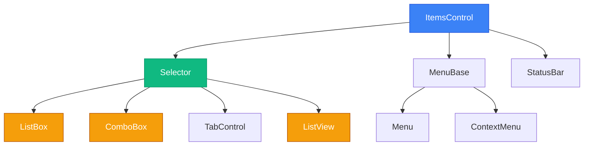

# Collections Binding Part 1: ObservableCollection та ItemsControl

## Вступ

У попередніх статтях ми навчилися прив'язувати окремі властивості до UI:

```xml
<TextBlock Text="{Binding FirstName}"/>
<TextBlock Text="{Binding Age}"/>
```

Але що, якщо у вас є **колекція** об'єктів — список контактів, завдань, повідомлень? Як відобразити їх у UI? Як зробити так, щоб при додаванні нового елемента у колекцію — UI автоматично оновлювався?

**Спроба 1: List<T>**

```csharp
public class MainViewModel
{
    public List<Person> People { get; set; }
    
    public MainViewModel()
    {
        People = new List<Person>
        {
            new Person { FirstName = "Іван", LastName = "Петренко" },
            new Person { FirstName = "Марія", LastName = "Коваленко" }
        };
    }
    
    public void AddPerson()
    {
        People.Add(new Person { FirstName = "Олександр", LastName = "Шевченко" });
        // ❌ UI не оновлюється!
    }
}
```

```xml
<ListBox ItemsSource="{Binding People}"/>
```

**Проблема:** При запуску `ListBox` показує 2 елементи. Але коли ви викликаєте `AddPerson()` — третій елемент не з'являється. Чому?

**Рішення:** **ObservableCollection<T>** — спеціальна колекція, що автоматично повідомляє UI про зміни.

::note
**Для кого ця стаття?** Якщо ви вже знайомі з [Data Binding](17.data-binding-basics-part1), [INotifyPropertyChanged](17.data-binding-basics-part2) та [Data Templates](20.data-templates), ця стаття покаже, як прив'язувати колекції з автоматичним оновленням UI.
::

---

## Проблема: List<T> не повідомляє про зміни

Розберемо детально, чому `List<T>` не працює для Data Binding.

### Експеримент: Додавання елемента у List<T>

**ViewModel:**

```csharp
using System.Collections.Generic;
using System.ComponentModel;
using System.Runtime.CompilerServices;

public class ContactsViewModel : INotifyPropertyChanged
{
    public event PropertyChangedEventHandler PropertyChanged;
    
    protected void OnPropertyChanged([CallerMemberName] string propertyName = null)
    {
        PropertyChanged?.Invoke(this, new PropertyChangedEventArgs(propertyName));
    }
    
    private List<Person> _people;
    
    public List<Person> People
    {
        get => _people;
        set
        {
            _people = value;
            OnPropertyChanged();
        }
    }
    
    public ContactsViewModel()
    {
        People = new List<Person>
        {
            new Person { FirstName = "Іван", LastName = "Петренко" },
            new Person { FirstName = "Марія", LastName = "Коваленко" }
        };
    }
}
```

**XAML:**

```xml
<Window x:Class="MyApp.MainWindow"
        DataContext="{Binding Source={StaticResource viewModel}}">
    <StackPanel Margin="20">
        <ListBox ItemsSource="{Binding People}" Height="200"/>
        <Button Content="Додати особу" Click="AddPerson_Click" Margin="0,10,0,0"/>
    </StackPanel>
</Window>
```

**Code-Behind:**

```csharp
private void AddPerson_Click(object sender, RoutedEventArgs e)
{
    var viewModel = (ContactsViewModel)DataContext;
    viewModel.People.Add(new Person 
    { 
        FirstName = "Олександр", 
        LastName = "Шевченко" 
    });
    
    // ❌ UI не оновлюється!
}
```

**Результат:** `ListBox` все ще показує тільки 2 елементи (Іван та Марія). Олександр не з'являється.

### Чому так відбувається?

::mermaid
```mermaid
sequenceDiagram
    participant Code as Code-Behind
    participant List as List<Person>
    participant Binding as Binding Engine
    participant UI as ListBox
    
    Note over Code,UI: Ініціалізація
    Code->>Binding: ItemsSource = People (List)
    Binding->>List: Читає всі елементи
    Binding->>UI: Створює UI для 2 елементів
    
    Note over Code,UI: Додавання елемента
    Code->>List: Add(new Person)
    Note over List: Елемент додано
    List-.->Binding: ❌ Не повідомляє про зміну!
    Note over UI: ❌ UI не оновлюється
    
    style List fill:#ef4444,stroke:#b91c1c,color:#ffffff
    style Binding fill:#f59e0b,stroke:#b45309,color:#ffffff
```
::

**Проблема:** `List<T>` — це звичайна колекція. Вона не має механізму повідомлення про зміни. Коли ви викликаєте `Add()`, `Remove()`, `Clear()` — ніхто не дізнається про це.

**Чому `OnPropertyChanged()` не допомагає?**

Спроба 2:

```csharp
public void AddPerson()
{
    People.Add(new Person { FirstName = "Олександр", LastName = "Шевченко" });
    OnPropertyChanged(nameof(People));  // Спроба повідомити
}
```

**Результат:** Все одно не працює. Чому?

`OnPropertyChanged(nameof(People))` повідомляє, що **властивість** `People` змінилася (тобто, що тепер `People` вказує на інший об'єкт). Але ми не змінювали сам об'єкт `List<Person>` — ми змінювали його **вміст** (додали елемент).

**Аналогія:** Уявіть, що `People` — це коробка з іграшками. `OnPropertyChanged(nameof(People))` каже: "Я замінив коробку на іншу". Але ми не замінювали коробку — ми додали іграшку **всередину** тієї самої коробки. WPF не знає про це.

### Обхідний шлях (антипатерн)

Можна замінити всю колекцію:

```csharp
public void AddPerson()
{
    var newList = new List<Person>(People);
    newList.Add(new Person { FirstName = "Олександр", LastName = "Шевченко" });
    People = newList;  // Заміна всієї колекції
    
    // ✅ Тепер UI оновлюється
}
```

**Але це антипатерн:**

::card-group

::card{title="❌ Неефективно" icon="i-lucide-zap-off"}
Створюється нова колекція при кожному додаванні. Для 1000 елементів — 1000 алокацій.
::

::card{title="❌ Втрата стану" icon="i-lucide-x-circle"}
Втрачається вибраний елемент (`SelectedItem`), позиція прокрутки, стан розгортання.
::

::card{title="❌ Повне перемалювання" icon="i-lucide-refresh-cw"}
WPF перемальовує **весь** список, навіть якщо додано тільки один елемент.
::

::card{title="❌ Не масштабується" icon="i-lucide-trending-down"}
Для складних операцій (видалення, заміна, переміщення) код стає нечитабельним.
::

::

---

## ObservableCollection<T>: Колекція з повідомленнями

`ObservableCollection<T>` — це спеціальна колекція з простору імен `System.Collections.ObjectModel`, що реалізує інтерфейс `INotifyCollectionChanged`.

### Що таке INotifyCollectionChanged?

**Інтерфейс:**

```csharp
public interface INotifyCollectionChanged
{
    event NotifyCollectionChangedEventHandler CollectionChanged;
}

public delegate void NotifyCollectionChangedEventHandler(
    object sender,
    NotifyCollectionChangedEventArgs e
);
```

**Аналогія з INotifyPropertyChanged:**

| Інтерфейс                  | Повідомляє про...                | Подія              |
| -------------------------- | -------------------------------- | ------------------ |
| `INotifyPropertyChanged`   | Зміну властивості об'єкта        | `PropertyChanged`  |
| `INotifyCollectionChanged` | Зміну вмісту колекції            | `CollectionChanged`|

### 🔵 Recap: Що таке подія (Event)?

Для студентів зі слабким розумінням ООП — коротке нагадування.

**Подія (Event)** — це механізм сповіщення у C#. Об'єкт може "викликати" подію, а інші об'єкти можуть "підписатися" на неї.

```csharp
// Клас з подією
public class ObservableCollection<T>
{
    // Подія — список підписників
    public event NotifyCollectionChangedEventHandler CollectionChanged;
    
    public void Add(T item)
    {
        // Додаємо елемент
        _items.Add(item);
        
        // Викликаємо подію — повідомляємо всіх підписників
        CollectionChanged?.Invoke(this, new NotifyCollectionChangedEventArgs(...));
    }
}

// Підписник (WPF Binding Engine)
var collection = new ObservableCollection<Person>();
collection.CollectionChanged += (sender, e) =>
{
    // Обробка зміни — оновлення UI
    Console.WriteLine("Колекція змінилася!");
};
```

**Аналогія:** Подія — це як дзвінок. `ObservableCollection` дзвонить (викликає подію), а WPF Binding Engine відповідає (обробляє подію та оновлює UI).

::tip
**Детальніше про події:** Якщо концепція подій незрозуміла, рекомендую повернутися до розділу [ООП: Делегати та Події](../02.oop/05.delegates-events) для глибшого розуміння.
::

### Як працює ObservableCollection<T>?

::mermaid
```mermaid
sequenceDiagram
    participant Code as Code-Behind
    participant OC as ObservableCollection<Person>
    participant Binding as Binding Engine
    participant UI as ListBox
    
    Note over Code,UI: Ініціалізація
    Code->>Binding: ItemsSource = People (ObservableCollection)
    Binding->>OC: Підписується на CollectionChanged
    Binding->>OC: Читає всі елементи
    Binding->>UI: Створює UI для 2 елементів
    
    Note over Code,UI: Додавання елемента
    Code->>OC: Add(new Person)
    OC->>OC: Додає елемент у внутрішній список
    OC->>Binding: CollectionChanged event (Add, new Person)
    Binding->>UI: Створює UI для нового елемента
    Note over UI: ✅ UI оновлюється!
    
    style OC fill:#10b981,stroke:#059669,color:#ffffff
    style Binding fill:#3b82f6,stroke:#1d4ed8,color:#ffffff
```
::

**Процес:**

1. При прив'язці `ItemsSource` → Binding Engine підписується на `CollectionChanged`
2. При виклику `Add()` → `ObservableCollection` додає елемент та викликає подію
3. Binding Engine отримує подію → створює UI для нового елемента
4. UI оновлюється автоматично

### Перший робочий приклад

**ViewModel з ObservableCollection:**

```csharp
using System.Collections.ObjectModel;
using System.ComponentModel;
using System.Runtime.CompilerServices;

public class ContactsViewModel : INotifyPropertyChanged
{
    public event PropertyChangedEventHandler PropertyChanged;
    
    protected void OnPropertyChanged([CallerMemberName] string propertyName = null)
    {
        PropertyChanged?.Invoke(this, new PropertyChangedEventArgs(propertyName));
    }
    
    // ObservableCollection замість List
    public ObservableCollection<Person> People { get; set; }
    
    public ContactsViewModel()
    {
        People = new ObservableCollection<Person>
        {
            new Person { FirstName = "Іван", LastName = "Петренко" },
            new Person { FirstName = "Марія", LastName = "Коваленко" }
        };
    }
}
```

**XAML:**

```xml
<Window x:Class="MyApp.MainWindow"
        DataContext="{Binding Source={StaticResource viewModel}}">
    <StackPanel Margin="20">
        <ListBox ItemsSource="{Binding People}" Height="200"/>
        <Button Content="Додати особу" Click="AddPerson_Click" Margin="0,10,0,0"/>
    </StackPanel>
</Window>
```

**Code-Behind:**

```csharp
private void AddPerson_Click(object sender, RoutedEventArgs e)
{
    var viewModel = (ContactsViewModel)DataContext;
    viewModel.People.Add(new Person 
    { 
        FirstName = "Олександр", 
        LastName = "Шевченко" 
    });
    
    // ✅ UI автоматично оновлюється!
}
```

**Результат:** При кліку на кнопку — третій елемент (Олександр) з'являється у `ListBox` автоматично!

::wpf-preview{title="ObservableCollection у дії"}
```xml
<StackPanel Margin="20" Spacing="10">
  <ListBox Height="150">
    <ListBoxItem Content="Іван Петренко"/>
    <ListBoxItem Content="Марія Коваленко"/>
    <ListBoxItem Content="Олександр Шевченко"/>
  </ListBox>
  <Button Content="Додати особу"/>
  <TextBlock Text="(У реальному WPF новий елемент з'являється при кліку на кнопку)" 
             FontSize="10" 
             Foreground="Gray"/>
</StackPanel>
```
::


---

## ItemsControl: Базовий клас для списків

`ItemsControl` — це базовий клас для всіх контролів, що відображають колекції.

### Ієрархія класів

::mermaid

::

**Основні контроли:**

- **ListBox** — список з можливістю вибору
- **ComboBox** — випадаючий список
- **ListView** — список з колонками (як таблиця)
- **TabControl** — вкладки
- **Menu** — меню
- **TreeView** — дерево (використовує `HierarchicalDataTemplate`)

### Ключові властивості ItemsControl

**1. ItemsSource** — джерело даних (колекція)

```xml
<ListBox ItemsSource="{Binding People}"/>
```

**2. ItemTemplate** — шаблон для кожного елемента

```xml
<ListBox ItemsSource="{Binding People}">
    <ListBox.ItemTemplate>
        <DataTemplate>
            <TextBlock Text="{Binding FirstName}"/>
        </DataTemplate>
    </ListBox.ItemTemplate>
</ListBox>
```

**3. ItemsPanel** — панель для розташування елементів

```xml
<ListBox ItemsSource="{Binding People}">
    <ListBox.ItemsPanel>
        <ItemsPanelTemplate>
            <!-- Горизонтальний список замість вертикального -->
            <StackPanel Orientation="Horizontal"/>
        </ItemsPanelTemplate>
    </ListBox.ItemsPanel>
</ListBox>
```

**4. DisplayMemberPath** — властивість для відображення (без DataTemplate)

```xml
<!-- Швидкий спосіб без DataTemplate -->
<ListBox ItemsSource="{Binding People}" DisplayMemberPath="FirstName"/>
```

### Порівняння підходів відображення

**Підхід 1: ToString() (за замовчуванням)**

```xml
<ListBox ItemsSource="{Binding People}"/>
```

**Результат:** Кожен елемент показує результат `ToString()` — "MyApp.Models.Person".

**Підхід 2: DisplayMemberPath**

```xml
<ListBox ItemsSource="{Binding People}" DisplayMemberPath="FirstName"/>
```

**Результат:** Кожен елемент показує тільки `FirstName` — "Іван", "Марія".

**Підхід 3: ItemTemplate (найгнучкіший)**

```xml
<ListBox ItemsSource="{Binding People}">
    <ListBox.ItemTemplate>
        <DataTemplate>
            <StackPanel Orientation="Horizontal">
                <TextBlock Text="{Binding FirstName}" FontWeight="Bold"/>
                <TextBlock Text=" "/>
                <TextBlock Text="{Binding LastName}"/>
            </StackPanel>
        </DataTemplate>
    </ListBox.ItemTemplate>
</ListBox>
```

**Результат:** Кожен елемент показує "Іван Петренко" з форматуванням.

**Підхід 4: Implicit DataTemplate (найкращий)**

```xml
<Window.Resources>
    <DataTemplate DataType="{x:Type local:Person}">
        <Border Background="LightBlue" Padding="5" Margin="2">
            <StackPanel>
                <TextBlock Text="{Binding FirstName}" FontWeight="Bold"/>
                <TextBlock Text="{Binding LastName}" FontSize="12"/>
            </StackPanel>
        </Border>
    </DataTemplate>
</Window.Resources>

<ListBox ItemsSource="{Binding People}"/>
```

**Результат:** Кожен елемент автоматично використовує DataTemplate — красива картка.

---

## Операції з ObservableCollection

`ObservableCollection<T>` підтримує всі стандартні операції колекцій.

### Add — Додавання елемента

```csharp
public void AddPerson()
{
    People.Add(new Person 
    { 
        FirstName = "Новий", 
        LastName = "Користувач" 
    });
    
    // UI автоматично оновлюється
}
```

**Подія:** `CollectionChanged` з `Action = Add`, `NewItems = [new Person]`.

### Remove — Видалення елемента

```csharp
public void RemovePerson(Person person)
{
    People.Remove(person);
    
    // UI автоматично оновлюється
}
```

**Подія:** `CollectionChanged` з `Action = Remove`, `OldItems = [person]`.

### Clear — Очищення колекції

```csharp
public void ClearAll()
{
    People.Clear();
    
    // UI автоматично оновлюється (всі елементи зникають)
}
```

**Подія:** `CollectionChanged` з `Action = Reset`.

### Insert — Вставка на позицію

```csharp
public void InsertAtBeginning()
{
    People.Insert(0, new Person 
    { 
        FirstName = "Перший", 
        LastName = "Елемент" 
    });
    
    // UI автоматично оновлюється
}
```

**Подія:** `CollectionChanged` з `Action = Add`, `NewStartingIndex = 0`.

### Replace — Заміна елемента

```csharp
public void ReplacePerson(int index, Person newPerson)
{
    People[index] = newPerson;
    
    // UI автоматично оновлюється
}
```

**Подія:** `CollectionChanged` з `Action = Replace`, `OldItems`, `NewItems`.

### Move — Переміщення елемента

```csharp
public void MoveToTop(int index)
{
    People.Move(index, 0);
    
    // UI автоматично оновлюється
}
```

**Подія:** `CollectionChanged` з `Action = Move`, `OldStartingIndex`, `NewStartingIndex`.

### Таблиця операцій

| Операція   | Метод                  | Подія CollectionChanged | UI Оновлення |
| ---------- | ---------------------- | ----------------------- | ------------ |
| Додавання  | `Add(item)`            | Action = Add            | ✅ Додає елемент |
| Видалення  | `Remove(item)`         | Action = Remove         | ✅ Видаляє елемент |
| Очищення   | `Clear()`              | Action = Reset          | ✅ Видаляє всі |
| Вставка    | `Insert(index, item)`  | Action = Add            | ✅ Вставляє на позицію |
| Заміна     | `this[index] = item`   | Action = Replace        | ✅ Замінює елемент |
| Переміщення| `Move(oldIndex, newIndex)` | Action = Move       | ✅ Переміщує елемент |

---

## SelectedItem та SelectedIndex

`Selector` (базовий клас для ListBox, ComboBox) має властивості для роботи з вибраним елементом.

### SelectedItem — Вибраний об'єкт

**ViewModel:**

```csharp
public class ContactsViewModel : INotifyPropertyChanged
{
    public ObservableCollection<Person> People { get; set; }
    
    private Person _selectedPerson;
    
    public Person SelectedPerson
    {
        get => _selectedPerson;
        set
        {
            _selectedPerson = value;
            OnPropertyChanged();
        }
    }
    
    // ... INotifyPropertyChanged implementation
}
```

**XAML:**

```xml
<Grid>
    <Grid.ColumnDefinitions>
        <ColumnDefinition Width="*"/>
        <ColumnDefinition Width="2*"/>
    </Grid.ColumnDefinitions>
    
    <!-- Список -->
    <ListBox Grid.Column="0" 
             ItemsSource="{Binding People}" 
             SelectedItem="{Binding SelectedPerson}"/>
    
    <!-- Деталі вибраного елемента -->
    <Border Grid.Column="1" 
            Background="LightGray" 
            Padding="20" 
            Margin="10,0,0,0">
        <StackPanel>
            <TextBlock Text="Деталі:" FontWeight="Bold" FontSize="16" Margin="0,0,0,10"/>
            <TextBlock Text="{Binding SelectedPerson.FirstName, StringFormat='Ім''я: {0}'}"/>
            <TextBlock Text="{Binding SelectedPerson.LastName, StringFormat='Прізвище: {0}'}"/>
            <TextBlock Text="{Binding SelectedPerson.Email, StringFormat='Email: {0}'}"/>
        </StackPanel>
    </Border>
</Grid>
```

**Результат:** При кліку на елемент у `ListBox` — деталі відображаються справа (Master-Detail pattern).

::wpf-preview{title="Master-Detail з SelectedItem"}
```xml
<Grid Margin="20">
  <Grid.ColumnDefinitions>
    <ColumnDefinition Width="*"/>
    <ColumnDefinition Width="2*"/>
  </Grid.ColumnDefinitions>
  
  <ListBox Grid.Column="0">
    <ListBoxItem Content="Іван Петренко" IsSelected="True"/>
    <ListBoxItem Content="Марія Коваленко"/>
    <ListBoxItem Content="Олександр Шевченко"/>
  </ListBox>
  
  <Border Grid.Column="1" Background="LightGray" Padding="20" Margin="10,0,0,0">
    <StackPanel Spacing="5">
      <TextBlock Text="Деталі:" FontWeight="Bold" FontSize="16"/>
      <TextBlock Text="Ім'я: Іван"/>
      <TextBlock Text="Прізвище: Петренко"/>
      <TextBlock Text="Email: ivan@example.com"/>
    </StackPanel>
  </Border>
</Grid>
```
::

### SelectedIndex — Індекс вибраного елемента

```xml
<StackPanel>
    <ListBox ItemsSource="{Binding People}" 
             SelectedIndex="{Binding SelectedIndex}"/>
    
    <TextBlock Text="{Binding SelectedIndex, StringFormat='Вибрано елемент #{0}'}"/>
</StackPanel>
```

### SelectedValue та SelectedValuePath

Для вибору конкретної властивості об'єкта:

```xml
<ComboBox ItemsSource="{Binding People}" 
          DisplayMemberPath="FirstName"
          SelectedValuePath="Id"
          SelectedValue="{Binding SelectedPersonId}"/>
```

**Що відбувається:**

- `DisplayMemberPath="FirstName"` — показує `FirstName` у списку
- `SelectedValuePath="Id"` — при виборі повертає `Id` вибраного `Person`
- `SelectedValue="{Binding SelectedPersonId}"` — прив'язка до `int SelectedPersonId` у ViewModel

**Use Case:** Коли потрібен тільки ID вибраного елемента, а не весь об'єкт.

### Режими вибору (SelectionMode)

**ListBox.SelectionMode:**

```xml
<!-- Один елемент (за замовчуванням) -->
<ListBox SelectionMode="Single" ItemsSource="{Binding People}"/>

<!-- Множинний вибір (Ctrl+Click) -->
<ListBox SelectionMode="Multiple" ItemsSource="{Binding People}"/>

<!-- Розширений вибір (Shift+Click для діапазону) -->
<ListBox SelectionMode="Extended" ItemsSource="{Binding People}"/>
```

**Для множинного вибору:**

```csharp
public class ContactsViewModel
{
    public ObservableCollection<Person> People { get; set; }
    
    // Для Multiple/Extended режиму
    public ObservableCollection<Person> SelectedPeople { get; set; }
}
```

```xml
<ListBox ItemsSource="{Binding People}" 
         SelectionMode="Multiple"
         SelectedItems="{Binding SelectedPeople}"/>
```

::warning
**Увага:** `SelectedItems` — це не DependencyProperty, тому прив'язка працює тільки в один бік (UI → ViewModel). Для повноцінного TwoWay binding потрібні додаткові техніки (Attached Behaviors).
::


---

## Практичні завдання

### Рівень 1: ListBox з ObservableCollection<string> + кнопка "Додати"

**Мета:** Навчитися використовувати `ObservableCollection` для простих типів.

**Завдання:**

Створіть додаток "Список завдань" (спрощена версія):

**Вимоги:**

1. `ObservableCollection<string>` для зберігання завдань
2. `ListBox` для відображення завдань
3. `TextBox` для введення нового завдання
4. Кнопка "Додати" — додає текст з `TextBox` у колекцію
5. Кнопка "Видалити" — видаляє вибране завдання

**Критерії успіху:**
- При додаванні — завдання з'являється у списку автоматично
- При видаленні — завдання зникає зі списку автоматично
- `TextBox` очищається після додавання
- Кнопка "Видалити" активна тільки коли щось вибрано

**Підказка:**
```csharp
public class TodoViewModel : INotifyPropertyChanged
{
    public ObservableCollection<string> Tasks { get; set; }
    
    private string _newTask;
    public string NewTask
    {
        get => _newTask;
        set
        {
            _newTask = value;
            OnPropertyChanged();
        }
    }
    
    private string _selectedTask;
    public string SelectedTask
    {
        get => _selectedTask;
        set
        {
            _selectedTask = value;
            OnPropertyChanged();
        }
    }
    
    public TodoViewModel()
    {
        Tasks = new ObservableCollection<string>
        {
            "Купити молоко",
            "Зробити домашнє завдання"
        };
    }
}
```

```xml
<StackPanel Margin="20">
    <TextBox Text="{Binding NewTask, UpdateSourceTrigger=PropertyChanged}"/>
    <Button Content="Додати" Click="Add_Click" Margin="0,5,0,0"/>
    
    <ListBox ItemsSource="{Binding Tasks}" 
             SelectedItem="{Binding SelectedTask}"
             Height="200" 
             Margin="0,10,0,0"/>
    
    <Button Content="Видалити" 
            Click="Remove_Click" 
            IsEnabled="{Binding SelectedTask, Converter={local:NullToBoolConverter}}"
            Margin="0,5,0,0"/>
</StackPanel>
```

---

### Рівень 2: Список контактів з DataTemplate, Add/Remove

**Мета:** Створити повноцінний список контактів з красивим UI.

**Завдання:**

Створіть додаток "Контакти" з:

**Модель Contact:**
```csharp
public class Contact : INotifyPropertyChanged
{
    private string _firstName;
    private string _lastName;
    private string _phone;
    private string _email;
    
    public string FirstName
    {
        get => _firstName;
        set
        {
            _firstName = value;
            OnPropertyChanged();
            OnPropertyChanged(nameof(FullName));
        }
    }
    
    public string LastName
    {
        get => _lastName;
        set
        {
            _lastName = value;
            OnPropertyChanged();
            OnPropertyChanged(nameof(FullName));
        }
    }
    
    public string Phone
    {
        get => _phone;
        set
        {
            _phone = value;
            OnPropertyChanged();
        }
    }
    
    public string Email
    {
        get => _email;
        set
        {
            _email = value;
            OnPropertyChanged();
        }
    }
    
    public string FullName => $"{FirstName} {LastName}";
    
    // ... INotifyPropertyChanged implementation
}
```

**Вимоги до UI:**

1. `ListBox` з `DataTemplate` для кожного контакту:
   - Круглий аватар (Ellipse) з ініціалами
   - Повне ім'я жирним шрифтом
   - Телефон та email меншим шрифтом
2. Форма додавання контакту (4 TextBox + кнопка "Додати")
3. Кнопка "Видалити" для вибраного контакту
4. Кнопка "Редагувати" — заповнює форму даними вибраного контакту

**Критерії успіху:**
- Список відображається з красивим DataTemplate
- Додавання працює (новий контакт з'являється)
- Видалення працює (контакт зникає)
- Редагування працює (дані заповнюються у форму)
- Валідація: всі поля обов'язкові

**Підказка для DataTemplate:**
```xml
<DataTemplate DataType="{x:Type local:Contact}">
    <Border Background="White" 
            BorderBrush="#E0E0E0" 
            BorderThickness="0,0,0,1" 
            Padding="10">
        <Grid>
            <Grid.ColumnDefinitions>
                <ColumnDefinition Width="Auto"/>
                <ColumnDefinition Width="*"/>
            </Grid.ColumnDefinitions>
            
            <!-- Аватар з ініціалами -->
            <Border Width="50" 
                    Height="50" 
                    Background="#4CAF50" 
                    CornerRadius="25" 
                    Grid.Column="0" 
                    Margin="0,0,10,0">
                <TextBlock Text="{Binding Initials}" 
                           Foreground="White" 
                           FontSize="18" 
                           FontWeight="Bold"
                           HorizontalAlignment="Center" 
                           VerticalAlignment="Center"/>
            </Border>
            
            <!-- Інформація -->
            <StackPanel Grid.Column="1" VerticalAlignment="Center">
                <TextBlock Text="{Binding FullName}" 
                           FontWeight="Bold" 
                           FontSize="14"/>
                <TextBlock Text="{Binding Phone}" 
                           FontSize="12" 
                           Foreground="Gray"/>
                <TextBlock Text="{Binding Email}" 
                           FontSize="12" 
                           Foreground="Gray"/>
            </StackPanel>
        </Grid>
    </Border>
</DataTemplate>
```

---

### Рівень 3: Master-Detail з SelectedItem

**Мета:** Реалізувати Master-Detail pattern для перегляду та редагування деталей.

**Завдання:**

Створіть додаток "Бібліотека книг" з Master-Detail інтерфейсом:

**Модель Book:**
```csharp
public class Book : INotifyPropertyChanged
{
    public string Title { get; set; }
    public string Author { get; set; }
    public int Year { get; set; }
    public string Genre { get; set; }
    public string Description { get; set; }
    public int Pages { get; set; }
    public string ISBN { get; set; }
    
    // ... INotifyPropertyChanged implementation
}
```

**Вимоги до UI:**

**Ліва частина (Master):**
- `ListBox` з книгами (Title + Author)
- Пошук по назві (TextBox з фільтрацією)
- Кнопка "Додати нову книгу"

**Права частина (Detail):**
- Деталі вибраної книги (всі поля)
- Режим перегляду (тільки читання)
- Кнопка "Редагувати" → переключає у режим редагування
- У режимі редагування: TextBox-и для всіх полів + кнопки "Зберегти" та "Скасувати"
- Кнопка "Видалити книгу"

**Критерії успіху:**
- Master-Detail працює (клік на книгу → деталі справа)
- Режими перегляду/редагування перемикаються
- Зміни зберігаються у колекції
- Пошук фільтрує список (детальніше у Part 2)
- Додавання/видалення працює

**Додатково (складно):**
- Додайте підтвердження перед видаленням (MessageBox)
- Додайте валідацію (рік має бути > 1000, ISBN має бути 13 цифр)
- Додайте можливість сортування (по назві, автору, року)
- Додайте статистику (кількість книг, середня кількість сторінок)

**Підказка для Master-Detail layout:**
```xml
<Grid>
    <Grid.ColumnDefinitions>
        <ColumnDefinition Width="300"/>
        <ColumnDefinition Width="*"/>
    </Grid.ColumnDefinitions>
    
    <!-- Master -->
    <Border Grid.Column="0" BorderBrush="Gray" BorderThickness="0,0,1,0">
        <StackPanel>
            <TextBox Text="{Binding SearchQuery, UpdateSourceTrigger=PropertyChanged}" 
                     Margin="10"/>
            <ListBox ItemsSource="{Binding FilteredBooks}" 
                     SelectedItem="{Binding SelectedBook}"/>
            <Button Content="Додати книгу" Click="AddBook_Click" Margin="10"/>
        </StackPanel>
    </Border>
    
    <!-- Detail -->
    <Border Grid.Column="1" Padding="20">
        <StackPanel>
            <TextBlock Text="{Binding SelectedBook.Title}" 
                       FontSize="24" 
                       FontWeight="Bold"/>
            <TextBlock Text="{Binding SelectedBook.Author}" 
                       FontSize="18" 
                       Foreground="Gray"/>
            <!-- Інші поля -->
        </StackPanel>
    </Border>
</Grid>
```

---

## Підсумок

`ObservableCollection<T>` — це фундаментальна колекція для Data Binding у WPF. Вона автоматично повідомляє UI про зміни через `INotifyCollectionChanged`.

**Ключові висновки:**

::card-group

::card{title="📦 ObservableCollection<T>" icon="i-lucide-box"}
Колекція з автоматичним повідомленням про зміни. Реалізує `INotifyCollectionChanged` для сповіщення Binding Engine.
::

::card{title="🔔 INotifyCollectionChanged" icon="i-lucide-bell"}
Інтерфейс з подією `CollectionChanged`. Викликається при Add, Remove, Replace, Move, Reset.
::

::card{title="📋 ItemsControl" icon="i-lucide-list"}
Базовий клас для ListBox, ComboBox, ListView. Властивості: `ItemsSource`, `ItemTemplate`, `ItemsPanel`.
::

::card{title="🎯 SelectedItem" icon="i-lucide-target"}
Прив'язка вибраного елемента до ViewModel. TwoWay binding за замовчуванням. Master-Detail pattern.
::

::card{title="❌ List<T> не працює" icon="i-lucide-x-circle"}
`List<T>` не повідомляє про зміни. Використовуйте `ObservableCollection<T>` для Data Binding.
::

::card{title="✅ Автоматичне оновлення" icon="i-lucide-refresh-cw"}
Додавання/видалення елементів автоматично оновлює UI без ручного виклику `OnPropertyChanged`.
::

::

**Коли використовувати ObservableCollection:**

- ✅ Списки, що змінюються (додавання/видалення елементів)
- ✅ ListBox, ComboBox, ListView з динамічними даними
- ✅ Master-Detail інтерфейси
- ✅ Todo-списки, контакти, повідомлення

**Коли НЕ використовувати ObservableCollection:**

- ❌ Статичні списки (не змінюються після ініціалізації) — використовуйте `List<T>` або масив
- ❌ Величезні колекції (100,000+ елементів) — використовуйте віртуалізацію (Part 2)
- ❌ Часті масові операції — використовуйте `List<T>` + ручне оновлення

::tip
**Best Practice:** Завжди ініціалізуйте `ObservableCollection` у конструкторі ViewModel. Не робіть її `null` — це спричинить помилки Binding.
::

**Що далі?**

- **Collections Binding Part 2** ([наступна стаття](21.collections-binding-part2)) — фільтрація, сортування, групування через `ICollectionView`
- **MVVM Pattern** (Блок 7) — архітектурний патерн для повного розділення UI та логіки
- **Commands** (Блок 7) — замість event handlers у code-behind

---

## Словник термінів

::note{title="📚 Глосарій"}

**ObservableCollection<T>** — колекція з простору імен `System.Collections.ObjectModel`, що реалізує `INotifyCollectionChanged` для автоматичного повідомлення про зміни.

**INotifyCollectionChanged** — інтерфейс з подією `CollectionChanged`, що викликається при зміні вмісту колекції (Add, Remove, Replace, Move, Reset).

**CollectionChanged event** — подія, що повідомляє про зміни у колекції. Параметри: `Action` (тип зміни), `NewItems`, `OldItems`, `NewStartingIndex`, `OldStartingIndex`.

**ItemsControl** — базовий клас для контролів, що відображають колекції. Властивості: `ItemsSource`, `ItemTemplate`, `ItemsPanel`, `DisplayMemberPath`.

**ItemsSource** — властивість для прив'язки колекції до UI-контролу. Приймає `IEnumerable`.

**ItemTemplate** — DataTemplate для відображення кожного елемента колекції.

**ItemsPanel** — панель для розташування елементів (StackPanel, WrapPanel, VirtualizingStackPanel).

**Selector** — базовий клас для контролів з вибором (ListBox, ComboBox). Властивості: `SelectedItem`, `SelectedIndex`, `SelectedValue`.

**SelectedItem** — вибраний об'єкт у колекції. TwoWay binding за замовчуванням.

**SelectedIndex** — індекс вибраного елемента (0-based). `-1` якщо нічого не вибрано.

**Master-Detail pattern** — UI-патерн, де список (Master) зліва, деталі вибраного елемента (Detail) справа.

::

---

## Додаткові ресурси

::card-group

::card{title="📖 Microsoft Docs: ObservableCollection" icon="i-lucide-book-open" to="https://learn.microsoft.com/en-us/dotnet/api/system.collections.objectmodel.observablecollection-1"}
API документація `ObservableCollection<T>` з прикладами використання.
::

::card{title="📖 INotifyCollectionChanged Interface" icon="i-lucide-bell" to="https://learn.microsoft.com/en-us/dotnet/api/system.componentmodel.inotifycollectionchanged"}
Документація інтерфейсу `INotifyCollectionChanged` та події `CollectionChanged`.
::

::card{title="📖 ItemsControl Class" icon="i-lucide-list" to="https://learn.microsoft.com/en-us/dotnet/api/system.windows.controls.itemscontrol"}
API документація `ItemsControl` — базового класу для списків.
::

::card{title="🎓 Data Binding Collections" icon="i-lucide-database" to="https://learn.microsoft.com/en-us/dotnet/desktop/wpf/data/how-to-bind-to-a-collection-and-display-information-based-on-selection"}
Офіційний гайд з прив'язки колекцій та Master-Detail pattern.
::

::card{title="🔧 ListBox Control" icon="i-lucide-list-checks" to="https://learn.microsoft.com/en-us/dotnet/desktop/wpf/controls/listbox"}
Повний огляд контролу `ListBox` з прикладами та стилізацією.
::

::card{title="📚 Попередня стаття: Data Templates" icon="i-lucide-arrow-left" to="20.data-templates"}
Повернутися до Data Templates — візуалізація об'єктів через шаблони.
::

::card{title="📚 Наступна стаття: Collections Binding Part 2" icon="i-lucide-arrow-right" to="21.collections-binding-part2"}
Дізнатися про `ICollectionView` — фільтрація, сортування, групування колекцій.
::

::
