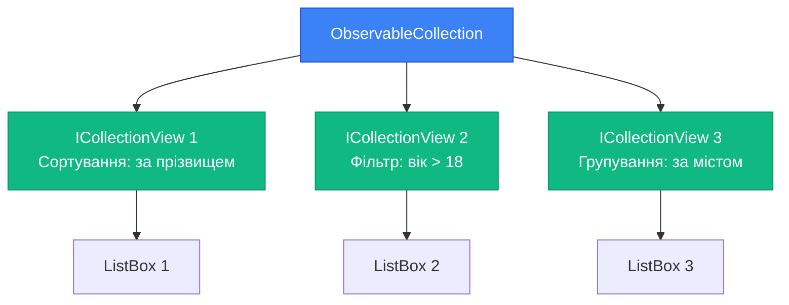
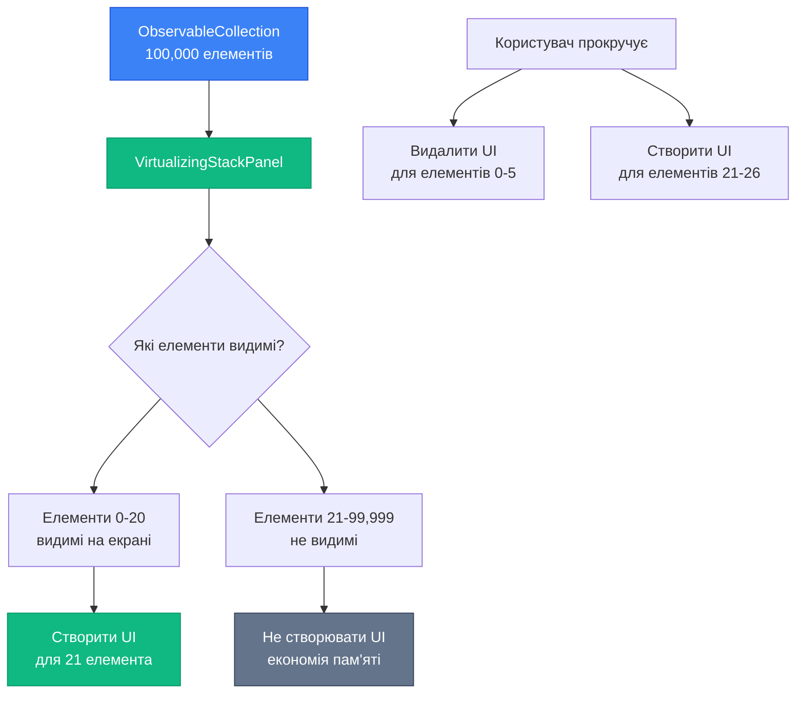

# Collections Binding Part 2: ICollectionView, Filtering, Sorting та Virtualization

## Вступ

У [попередній статті](21.collections-binding-part1) ми навчилися прив'язувати колекції через `ObservableCollection<T>`. Але що, якщо потрібно:

- **Відсортувати** список контактів за прізвищем?
- **Відфільтрувати** завдання — показати тільки активні?
- **Згрупувати** товари за категоріями?
- Відобразити **100,000 елементів** без зависання UI?

**Спроба 1: Змінити оригінальну колекцію**

```csharp
public void SortByName()
{
    var sorted = People.OrderBy(p => p.LastName).ToList();
    People.Clear();
    foreach (var person in sorted)
    {
        People.Add(person);
    }
    
    // ✅ Працює, але...
}
```

**Проблеми:**

- ❌ Змінюємо оригінальні дані (порушуємо принцип незмінності)
- ❌ Втрачається вибраний елемент (`SelectedItem`)
- ❌ Повне перемалювання UI (неефективно)
- ❌ Не можна мати кілька різних "виглядів" на одну колекцію

**Рішення:** **ICollectionView** — "вигляд" на колекцію, що дозволяє сортувати, фільтрувати та групувати без зміни оригінальних даних.

::note
**Для кого ця стаття?** Якщо ви вже знайомі з [ObservableCollection](21.collections-binding-part1), ця стаття покаже, як маніпулювати відображенням колекцій без зміни самих даних.
::

---

## ICollectionView: Вигляд на колекцію

`ICollectionView` — це інтерфейс, що представляє "вигляд" на колекцію з можливістю сортування, фільтрації та групування.

### Концепція: Модель vs Вигляд

**Аналогія:** Уявіть бібліотеку з книгами.

- **Модель (ObservableCollection)** — це фізичні книги на полицях. Вони не змінюються.
- **Вигляд (ICollectionView)** — це каталог, де ви можете:
  - Відсортувати книги за автором, роком, назвою
  - Відфільтрувати тільки фантастику
  - Згрупувати за жанрами

Книги на полицях залишаються на своїх місцях, але каталог показує їх по-різному.

::mermaid

::

**Ключова ідея:** Одна колекція → кілька виглядів → кілька UI-контролів з різним відображенням.

### Отримання ICollectionView

**Спосіб 1: CollectionViewSource.GetDefaultView()**

```csharp
using System.Windows.Data;

public class ContactsViewModel
{
    public ObservableCollection<Person> People { get; set; }
    public ICollectionView PeopleView { get; set; }
    
    public ContactsViewModel()
    {
        People = new ObservableCollection<Person>
        {
            new Person { FirstName = "Іван", LastName = "Петренко", Age = 25 },
            new Person { FirstName = "Марія", LastName = "Коваленко", Age = 30 },
            new Person { FirstName = "Олександр", LastName = "Шевченко", Age = 22 }
        };
        
        // Отримуємо вигляд на колекцію
        PeopleView = CollectionViewSource.GetDefaultView(People);
    }
}
```

**XAML:**

```xml
<!-- Прив'язка до ICollectionView замість ObservableCollection -->
<ListBox ItemsSource="{Binding PeopleView}"/>
```

**Спосіб 2: CollectionViewSource у XAML (декларативний)**

```xml
<Window.Resources>
    <CollectionViewSource x:Key="peopleViewSource" 
                          Source="{Binding People}">
        <!-- Сортування, фільтрація, групування тут -->
    </CollectionViewSource>
</Window.Resources>

<ListBox ItemsSource="{Binding Source={StaticResource peopleViewSource}}"/>
```

### Властивості ICollectionView

| Властивість         | Опис                                      | Тип                          |
| ------------------- | ----------------------------------------- | ---------------------------- |
| `SortDescriptions`  | Колекція правил сортування                | `SortDescriptionCollection`  |
| `Filter`            | Predicate для фільтрації                  | `Predicate<object>`          |
| `GroupDescriptions` | Колекція правил групування                | `ObservableCollection<GroupDescription>` |
| `CurrentItem`       | Поточний (вибраний) елемент               | `object`                     |
| `CurrentPosition`   | Індекс поточного елемента                 | `int`                        |
| `IsEmpty`           | Чи порожній вигляд (після фільтрації)     | `bool`                       |

---

## SortDescription: Сортування колекції

`SortDescription` визначає правило сортування за властивістю.

### Базове сортування

**ViewModel:**

```csharp
public class ContactsViewModel
{
    public ObservableCollection<Person> People { get; set; }
    public ICollectionView PeopleView { get; set; }
    
    public ContactsViewModel()
    {
        People = new ObservableCollection<Person>
        {
            new Person { FirstName = "Іван", LastName = "Петренко", Age = 25 },
            new Person { FirstName = "Марія", LastName = "Коваленко", Age = 30 },
            new Person { FirstName = "Олександр", LastName = "Шевченко", Age = 22 }
        };
        
        PeopleView = CollectionViewSource.GetDefaultView(People);
        
        // Сортування за прізвищем (за зростанням)
        PeopleView.SortDescriptions.Add(
            new SortDescription("LastName", ListSortDirection.Ascending)
        );
    }
}
```

**Результат:** Список відображається у порядку: Коваленко, Петренко, Шевченко.

::wpf-preview{title="Сортування за прізвищем"}
```xml
<ListBox Margin="20">
  <ListBoxItem Content="Марія Коваленко"/>
  <ListBoxItem Content="Іван Петренко"/>
  <ListBoxItem Content="Олександр Шевченко"/>
  <TextBlock Text="(Відсортовано за прізвищем)" 
             FontSize="10" 
             Foreground="Gray"
             Margin="10,5,0,0"/>
</ListBox>
```
::

### Множинне сортування

Можна додати кілька правил сортування — спочатку за одним полем, потім за іншим:

```csharp
// Спочатку за містом, потім за прізвищем
PeopleView.SortDescriptions.Add(
    new SortDescription("City", ListSortDirection.Ascending)
);
PeopleView.SortDescriptions.Add(
    new SortDescription("LastName", ListSortDirection.Ascending)
);
```

**Результат:** Спочатку групуються за містом (Київ, Львів, Одеса), всередині кожної групи — за прізвищем.

### Динамічна зміна сортування

```csharp
public void SortByName()
{
    PeopleView.SortDescriptions.Clear();
    PeopleView.SortDescriptions.Add(
        new SortDescription("LastName", ListSortDirection.Ascending)
    );
}

public void SortByAge()
{
    PeopleView.SortDescriptions.Clear();
    PeopleView.SortDescriptions.Add(
        new SortDescription("Age", ListSortDirection.Descending)
    );
}
```

**XAML з кнопками:**

```xml
<StackPanel Margin="20">
    <StackPanel Orientation="Horizontal" Margin="0,0,0,10">
        <Button Content="За прізвищем" Click="SortByName_Click" Margin="0,0,5,0"/>
        <Button Content="За віком" Click="SortByAge_Click"/>
    </StackPanel>
    
    <ListBox ItemsSource="{Binding PeopleView}" Height="200"/>
</StackPanel>
```

### Сортування у XAML (декларативне)

```xml
<Window.Resources>
    <CollectionViewSource x:Key="peopleViewSource" Source="{Binding People}">
        <CollectionViewSource.SortDescriptions>
            <componentModel:SortDescription PropertyName="LastName" Direction="Ascending"/>
            <componentModel:SortDescription PropertyName="FirstName" Direction="Ascending"/>
        </CollectionViewSource.SortDescriptions>
    </CollectionViewSource>
</Window.Resources>

<ListBox ItemsSource="{Binding Source={StaticResource peopleViewSource}}"/>
```

**Namespace для SortDescription у XAML:**

```xml
xmlns:componentModel="clr-namespace:System.ComponentModel;assembly=WindowsBase"
```

---

## Filter: Фільтрація колекції

`Filter` — це `Predicate<object>`, що визначає, які елементи показувати.

### Базова фільтрація

**ViewModel:**

```csharp
public class ContactsViewModel
{
    public ObservableCollection<Person> People { get; set; }
    public ICollectionView PeopleView { get; set; }
    
    public ContactsViewModel()
    {
        People = new ObservableCollection<Person>
        {
            new Person { FirstName = "Іван", LastName = "Петренко", Age = 17 },
            new Person { FirstName = "Марія", LastName = "Коваленко", Age = 30 },
            new Person { FirstName = "Олександр", LastName = "Шевченко", Age = 22 }
        };
        
        PeopleView = CollectionViewSource.GetDefaultView(People);
        
        // Фільтр: показати тільки повнолітніх
        PeopleView.Filter = item =>
        {
            if (item is Person person)
            {
                return person.Age >= 18;
            }
            return false;
        };
    }
}
```

**Результат:** Список показує тільки Марію (30) та Олександра (22). Іван (17) прихований.

::wpf-preview{title="Фільтрація за віком"}
```xml
<StackPanel Margin="20" Spacing="10">
  <TextBlock Text="Тільки повнолітні (вік >= 18):" FontWeight="Bold"/>
  <ListBox>
    <ListBoxItem Content="Марія Коваленко (30)"/>
    <ListBoxItem Content="Олександр Шевченко (22)"/>
  </ListBox>
  <TextBlock Text="(Іван Петренко (17) прихований фільтром)" 
             FontSize="10" 
             Foreground="Gray"/>
</StackPanel>
```
::

### Динамічна фільтрація (пошук)

**ViewModel з пошуком:**

```csharp
public class ContactsViewModel : INotifyPropertyChanged
{
    public ObservableCollection<Person> People { get; set; }
    public ICollectionView PeopleView { get; set; }
    
    private string _searchQuery;
    
    public string SearchQuery
    {
        get => _searchQuery;
        set
        {
            _searchQuery = value;
            OnPropertyChanged();
            ApplyFilter();
        }
    }
    
    public ContactsViewModel()
    {
        People = new ObservableCollection<Person>
        {
            new Person { FirstName = "Іван", LastName = "Петренко" },
            new Person { FirstName = "Марія", LastName = "Коваленко" },
            new Person { FirstName = "Олександр", LastName = "Шевченко" }
        };
        
        PeopleView = CollectionViewSource.GetDefaultView(People);
    }
    
    private void ApplyFilter()
    {
        if (string.IsNullOrWhiteSpace(SearchQuery))
        {
            // Немає пошукового запиту — показати всіх
            PeopleView.Filter = null;
        }
        else
        {
            // Фільтр: ім'я або прізвище містить запит
            PeopleView.Filter = item =>
            {
                if (item is Person person)
                {
                    return person.FirstName.Contains(SearchQuery, StringComparison.OrdinalIgnoreCase) ||
                           person.LastName.Contains(SearchQuery, StringComparison.OrdinalIgnoreCase);
                }
                return false;
            };
        }
    }
    
    // ... INotifyPropertyChanged implementation
}
```

**XAML:**

```xml
<StackPanel Margin="20">
    <TextBlock Text="Пошук:"/>
    <TextBox Text="{Binding SearchQuery, UpdateSourceTrigger=PropertyChanged}" 
             Margin="0,5,0,10"/>
    
    <ListBox ItemsSource="{Binding PeopleView}" Height="200"/>
</StackPanel>
```

**Результат:** При введенні "Мар" — показується тільки Марія. При введенні "ко" — Марія та Олександр (обидва мають "ко" у прізвищі).

### Refresh() — Оновлення фільтру

Якщо фільтр залежить від зовнішніх даних, потрібно викликати `Refresh()`:

```csharp
private int _minAge = 18;

public int MinAge
{
    get => _minAge;
    set
    {
        _minAge = value;
        OnPropertyChanged();
        PeopleView.Refresh();  // Оновлюємо фільтр
    }
}

public ContactsViewModel()
{
    // ...
    
    PeopleView.Filter = item =>
    {
        if (item is Person person)
        {
            return person.Age >= MinAge;  // Залежить від MinAge
        }
        return false;
    };
}
```

**XAML:**

```xml
<StackPanel Margin="20">
    <TextBlock Text="Мінімальний вік:"/>
    <Slider Value="{Binding MinAge}" Minimum="0" Maximum="100" Margin="0,5,0,10"/>
    <TextBlock Text="{Binding MinAge, StringFormat='Вік >= {0}'}"/>
    
    <ListBox ItemsSource="{Binding PeopleView}" Height="200" Margin="0,10,0,0"/>
</StackPanel>
```

**Результат:** При зміні слайдера — список автоматично фільтрується.


---

## GroupDescriptions: Групування колекції

`GroupDescriptions` дозволяє групувати елементи за властивістю.

### Базове групування

**ViewModel:**

```csharp
public class ContactsViewModel
{
    public ObservableCollection<Person> People { get; set; }
    public ICollectionView PeopleView { get; set; }
    
    public ContactsViewModel()
    {
        People = new ObservableCollection<Person>
        {
            new Person { FirstName = "Іван", LastName = "Петренко", City = "Київ" },
            new Person { FirstName = "Марія", LastName = "Коваленко", City = "Львів" },
            new Person { FirstName = "Олександр", LastName = "Шевченко", City = "Київ" },
            new Person { FirstName = "Анна", LastName = "Мельник", City = "Львів" }
        };
        
        PeopleView = CollectionViewSource.GetDefaultView(People);
        
        // Групування за містом
        PeopleView.GroupDescriptions.Add(new PropertyGroupDescription("City"));
    }
}
```

**XAML з GroupStyle:**

```xml
<ListBox ItemsSource="{Binding PeopleView}">
    <!-- Стиль для заголовків груп -->
    <ListBox.GroupStyle>
        <GroupStyle>
            <GroupStyle.HeaderTemplate>
                <DataTemplate>
                    <Border Background="#2196F3" Padding="5">
                        <TextBlock Text="{Binding Name}" 
                                   Foreground="White" 
                                   FontWeight="Bold" 
                                   FontSize="14"/>
                    </Border>
                </DataTemplate>
            </GroupStyle.HeaderTemplate>
        </GroupStyle>
    </ListBox.GroupStyle>
    
    <!-- Шаблон для елементів -->
    <ListBox.ItemTemplate>
        <DataTemplate>
            <TextBlock Text="{Binding FirstName}"/>
        </DataTemplate>
    </ListBox.ItemTemplate>
</ListBox>
```

**Результат:**

```
┌─ Київ ────────────┐
│ Іван              │
│ Олександр         │
├─ Львів ───────────┤
│ Марія             │
│ Анна              │
└───────────────────┘
```

::wpf-preview{title="Групування за містом"}
```xml
<StackPanel Margin="20" Spacing="5">
  <Border Background="#2196F3" Padding="5">
    <TextBlock Text="Київ" Foreground="White" FontWeight="Bold"/>
  </Border>
  <TextBlock Text="  Іван Петренко" Margin="10,0,0,0"/>
  <TextBlock Text="  Олександр Шевченко" Margin="10,0,0,0"/>
  
  <Border Background="#2196F3" Padding="5" Margin="0,10,0,0">
    <TextBlock Text="Львів" Foreground="White" FontWeight="Bold"/>
  </Border>
  <TextBlock Text="  Марія Коваленко" Margin="10,0,0,0"/>
  <TextBlock Text="  Анна Мельник" Margin="10,0,0,0"/>
</StackPanel>
```
::

### Множинне групування

```csharp
// Спочатку за містом, потім за віковою категорією
PeopleView.GroupDescriptions.Add(new PropertyGroupDescription("City"));
PeopleView.GroupDescriptions.Add(new PropertyGroupDescription("AgeCategory"));
```

**Модель з обчислюваною властивістю:**

```csharp
public class Person : INotifyPropertyChanged
{
    public string FirstName { get; set; }
    public string LastName { get; set; }
    public string City { get; set; }
    public int Age { get; set; }
    
    // Обчислювана властивість для групування
    public string AgeCategory
    {
        get
        {
            if (Age < 18) return "Неповнолітні";
            if (Age < 30) return "18-29";
            if (Age < 50) return "30-49";
            return "50+";
        }
    }
    
    // ... INotifyPropertyChanged implementation
}
```

**Результат:**

```
┌─ Київ ────────────┐
│ ├─ 18-29 ─────────┤
│ │ Іван (25)       │
│ ├─ 30-49 ─────────┤
│ │ Олександр (35)  │
├─ Львів ───────────┤
│ ├─ 18-29 ─────────┤
│ │ Марія (28)      │
└───────────────────┘
```

### Групування у XAML

```xml
<Window.Resources>
    <CollectionViewSource x:Key="peopleViewSource" Source="{Binding People}">
        <CollectionViewSource.GroupDescriptions>
            <PropertyGroupDescription PropertyName="City"/>
        </CollectionViewSource.GroupDescriptions>
        <CollectionViewSource.SortDescriptions>
            <componentModel:SortDescription PropertyName="City" Direction="Ascending"/>
            <componentModel:SortDescription PropertyName="LastName" Direction="Ascending"/>
        </CollectionViewSource.SortDescriptions>
    </CollectionViewSource>
</Window.Resources>

<ListBox ItemsSource="{Binding Source={StaticResource peopleViewSource}}">
    <ListBox.GroupStyle>
        <GroupStyle>
            <GroupStyle.HeaderTemplate>
                <DataTemplate>
                    <TextBlock Text="{Binding Name}" 
                               FontWeight="Bold" 
                               FontSize="16" 
                               Background="LightGray" 
                               Padding="5"/>
                </DataTemplate>
            </GroupStyle.HeaderTemplate>
        </GroupStyle>
    </ListBox.GroupStyle>
</ListBox>
```

### Кастомне групування через IValueConverter

Для складної логіки групування:

```csharp
public class AgeGroupConverter : IValueConverter
{
    public object Convert(object value, Type targetType, object parameter, CultureInfo culture)
    {
        if (value is int age)
        {
            if (age < 18) return "Неповнолітні";
            if (age < 30) return "Молодь (18-29)";
            if (age < 50) return "Дорослі (30-49)";
            return "Старші (50+)";
        }
        return "Невідомо";
    }
    
    public object ConvertBack(object value, Type targetType, object parameter, CultureInfo culture)
    {
        throw new NotImplementedException();
    }
}
```

```csharp
PeopleView.GroupDescriptions.Add(
    new PropertyGroupDescription("Age", new AgeGroupConverter())
);
```

---

## Virtualization: Оптимізація продуктивності

**Проблема:** Що, якщо у вас 100,000 елементів у списку? WPF створить 100,000 UI-елементів → зависання.

**Рішення:** **Virtualization** — WPF створює UI-елементи тільки для видимих рядків.

### Як працює віртуалізація?

::mermaid

::

**Без віртуалізації:**
- 100,000 елементів → 100,000 UI-контролів → ~500 MB пам'яті → зависання

**З віртуалізацією:**
- 100,000 елементів → 20 UI-контролів (тільки видимі) → ~5 MB пам'яті → плавна робота

### VirtualizingStackPanel

`ListBox` за замовчуванням використовує `VirtualizingStackPanel` як `ItemsPanel`.

**Перевірка:**

```xml
<ListBox ItemsSource="{Binding LargeCollection}">
    <!-- За замовчуванням VirtualizingStackPanel -->
    <ListBox.ItemsPanel>
        <ItemsPanelTemplate>
            <VirtualizingStackPanel/>
        </ItemsPanelTemplate>
    </ListBox.ItemsPanel>
</ListBox>
```

**Тест продуктивності:**

```csharp
public class PerformanceViewModel
{
    public ObservableCollection<int> LargeCollection { get; set; }
    
    public PerformanceViewModel()
    {
        LargeCollection = new ObservableCollection<int>();
        
        // Додаємо 100,000 елементів
        for (int i = 0; i < 100_000; i++)
        {
            LargeCollection.Add(i);
        }
    }
}
```

**Результат:** Список з 100,000 елементів відкривається миттєво та прокручується плавно.

### VirtualizationMode: Standard vs Recycling

**Standard (за замовчуванням):**
- Створює нові UI-елементи при прокрутці
- Видаляє старі UI-елементи

**Recycling (оптимізований):**
- Перевикористовує існуючі UI-елементи
- Тільки оновлює DataContext

```xml
<ListBox ItemsSource="{Binding LargeCollection}"
         VirtualizingPanel.VirtualizationMode="Recycling">
    <!-- Recycling mode — ще швидше -->
</ListBox>
```

**Порівняння:**

| Режим      | Створення UI | Видалення UI | Пам'ять | Швидкість |
| ---------- | ------------ | ------------ | ------- | --------- |
| Standard   | При прокрутці| При прокрутці| Середня | Швидка    |
| Recycling  | Один раз     | Ніколи       | Менша   | Швидша    |

::tip
**Best Practice:** Завжди використовуйте `VirtualizationMode="Recycling"` для великих списків (>1000 елементів).
::

### Коли віртуалізація НЕ працює?

**Проблема 1: ScrollViewer всередині ItemsControl**

```xml
<!-- ❌ Віртуалізація не працює -->
<ScrollViewer>
    <ListBox ItemsSource="{Binding LargeCollection}"/>
</ScrollViewer>
```

**Чому?** `ListBox` має власний `ScrollViewer`. Зовнішній `ScrollViewer` змушує `ListBox` розгорнутися на повну висоту → всі елементи створюються.

**Рішення:** Видалити зовнішній `ScrollViewer`.

**Проблема 2: ItemsControl без фіксованої висоти**

```xml
<!-- ❌ Віртуалізація не працює -->
<ListBox ItemsSource="{Binding LargeCollection}" Height="Auto"/>
```

**Чому?** `Height="Auto"` означає "розгорнися на всі елементи" → всі елементи створюються.

**Рішення:** Встановити фіксовану висоту або `Height="*"` у Grid.

**Проблема 3: StackPanel як ItemsPanel**

```xml
<!-- ❌ Віртуалізація не працює -->
<ListBox ItemsSource="{Binding LargeCollection}">
    <ListBox.ItemsPanel>
        <ItemsPanelTemplate>
            <StackPanel/>  <!-- Замість VirtualizingStackPanel -->
        </ItemsPanelTemplate>
    </ListBox.ItemsPanel>
</ListBox>
```

**Рішення:** Використовувати `VirtualizingStackPanel` (за замовчуванням).

### IsVirtualizing — Увімкнення/Вимкнення

```xml
<!-- Вимкнути віртуалізацію (для дебагу) -->
<ListBox ItemsSource="{Binding LargeCollection}"
         VirtualizingPanel.IsVirtualizing="False"/>
```

::warning
**Увага:** Вимикайте віртуалізацію тільки для дебагу або дуже малих списків (<100 елементів). Для великих списків це призведе до зависання.
::

### ScrollUnit: Pixel vs Item

```xml
<!-- Прокрутка по пікселях (плавна) -->
<ListBox VirtualizingPanel.ScrollUnit="Pixel"/>

<!-- Прокрутка по елементах (за замовчуванням) -->
<ListBox VirtualizingPanel.ScrollUnit="Item"/>
```

**Pixel:** Плавна прокрутка, але менш ефективна віртуалізація.
**Item:** Прокрутка по елементах (стрибками), але ефективніша віртуалізація.


---

## Практичні завдання

### Рівень 1: Сортування списку по імені через SortDescription

**Мета:** Навчитися використовувати `SortDescription` для сортування колекції.

**Завдання:**

Створіть список контактів з можливістю сортування:

**Вимоги:**

1. `ObservableCollection<Person>` з мінімум 10 контактами
2. `ICollectionView` для відображення
3. Три кнопки сортування:
   - "За прізвищем (А-Я)"
   - "За прізвищем (Я-А)"
   - "За віком (спадання)"
4. При кліку на кнопку — список пересортовується

**Критерії успіху:**
- Сортування працює коректно
- Вибраний елемент (`SelectedItem`) зберігається після сортування
- Оригінальна колекція не змінюється

**Підказка:**
```csharp
public void SortByLastNameAsc()
{
    PeopleView.SortDescriptions.Clear();
    PeopleView.SortDescriptions.Add(
        new SortDescription("LastName", ListSortDirection.Ascending)
    );
}

public void SortByLastNameDesc()
{
    PeopleView.SortDescriptions.Clear();
    PeopleView.SortDescriptions.Add(
        new SortDescription("LastName", ListSortDirection.Descending)
    );
}

public void SortByAgeDesc()
{
    PeopleView.SortDescriptions.Clear();
    PeopleView.SortDescriptions.Add(
        new SortDescription("Age", ListSortDirection.Descending)
    );
}
```

---

### Рівень 2: Фільтрація + сортування з UI

**Мета:** Створити список з пошуком та сортуванням через UI.

**Завдання:**

Створіть додаток "Каталог товарів" з:

**Модель Product:**
```csharp
public class Product : INotifyPropertyChanged
{
    public string Name { get; set; }
    public string Category { get; set; }
    public decimal Price { get; set; }
    public int Stock { get; set; }
    
    // ... INotifyPropertyChanged implementation
}
```

**Вимоги до UI:**

1. **Пошук:** TextBox для пошуку по назві товару
2. **Фільтр категорії:** ComboBox з категоріями ("Всі", "Електроніка", "Одяг", "Їжа")
3. **Фільтр наявності:** CheckBox "Тільки в наявності" (Stock > 0)
4. **Сортування:** ComboBox з варіантами:
   - "За назвою (А-Я)"
   - "За назвою (Я-А)"
   - "За ціною (зростання)"
   - "За ціною (спадання)"
5. **Список товарів:** ListBox з DataTemplate (назва, категорія, ціна, кількість)

**Критерії успіху:**
- Всі фільтри працюють одночасно (пошук + категорія + наявність)
- Сортування працює разом з фільтрами
- При зміні будь-якого фільтра — список оновлюється миттєво
- Показується кількість знайдених товарів

**Підказка для комбінованого фільтру:**
```csharp
private void ApplyFilter()
{
    PeopleView.Filter = item =>
    {
        if (item is Product product)
        {
            // Пошук по назві
            bool matchesSearch = string.IsNullOrWhiteSpace(SearchQuery) ||
                                 product.Name.Contains(SearchQuery, StringComparison.OrdinalIgnoreCase);
            
            // Фільтр категорії
            bool matchesCategory = SelectedCategory == "Всі" ||
                                   product.Category == SelectedCategory;
            
            // Фільтр наявності
            bool matchesStock = !ShowOnlyInStock || product.Stock > 0;
            
            return matchesSearch && matchesCategory && matchesStock;
        }
        return false;
    };
}
```

---

### Рівень 3: Повний Todo-додаток з фільтрацією та групуванням

**Мета:** Створити повноцінний Todo-додаток з усіма можливостями ICollectionView.

**Завдання:**

Створіть Todo-додаток з:

**Модель TodoItem:**
```csharp
public class TodoItem : INotifyPropertyChanged
{
    private bool _isCompleted;
    
    public string Title { get; set; }
    public string Description { get; set; }
    public DateTime DueDate { get; set; }
    public string Priority { get; set; }  // "Високий", "Середній", "Низький"
    public string Category { get; set; }  // "Робота", "Особисте", "Навчання"
    
    public bool IsCompleted
    {
        get => _isCompleted;
        set
        {
            _isCompleted = value;
            OnPropertyChanged();
        }
    }
    
    public bool IsOverdue => !IsCompleted && DueDate < DateTime.Now;
    
    // ... INotifyPropertyChanged implementation
}
```

**Вимоги до UI:**

**Верхня панель:**
1. TextBox для додавання нового завдання
2. ComboBox для вибору пріоритету
3. DatePicker для вибору дати
4. Кнопка "Додати"

**Фільтри:**
1. Три кнопки: "Всі", "Активні", "Завершені"
2. ComboBox для фільтрації за категорією
3. CheckBox "Показати прострочені"

**Сортування:**
1. ComboBox з варіантами:
   - "За датою (найближчі спочатку)"
   - "За пріоритетом"
   - "За назвою"

**Групування:**
1. CheckBox "Групувати за категорією"
2. CheckBox "Групувати за пріоритетом"

**Список завдань:**
1. ListBox з DataTemplate:
   - CheckBox для позначення завершення
   - Назва завдання (закреслена якщо завершено)
   - Дата (червона якщо прострочено)
   - Пріоритет (кольоровий індикатор)
2. Кнопка "Видалити" для кожного завдання

**Статистика:**
1. Кількість всіх завдань
2. Кількість активних
3. Кількість завершених
4. Кількість прострочених

**Критерії успіху:**
- Всі фільтри працюють одночасно
- Сортування працює разом з фільтрами
- Групування працює разом з фільтрами та сортуванням
- Статистика оновлюється автоматично
- Прострочені завдання виділяються червоним
- Завершені завдання мають закреслений текст

**Додатково (складно):**
- Збереження завдань у JSON файл
- Редагування завдань (подвійний клік)
- Drag & Drop для зміни пріоритету
- Нагадування про прострочені завдання

**Підказка для групування:**
```csharp
private void UpdateGrouping()
{
    TodosView.GroupDescriptions.Clear();
    
    if (GroupByCategory)
    {
        TodosView.GroupDescriptions.Add(new PropertyGroupDescription("Category"));
    }
    
    if (GroupByPriority)
    {
        TodosView.GroupDescriptions.Add(new PropertyGroupDescription("Priority"));
    }
}
```

---

## Підсумок

`ICollectionView` — це потужний інструмент для маніпуляції відображенням колекцій без зміни оригінальних даних.

**Ключові висновки:**

::card-group

::card{title="👁️ ICollectionView" icon="i-lucide-eye"}
"Вигляд" на колекцію з можливістю сортування, фільтрації та групування. Оригінальні дані не змінюються.
::

::card{title="🔄 SortDescription" icon="i-lucide-arrow-up-down"}
Правила сортування за властивістю. Підтримує множинне сортування (спочатку за одним полем, потім за іншим).
::

::card{title="🔍 Filter" icon="i-lucide-filter"}
Predicate для фільтрації елементів. Динамічна фільтрація через `Refresh()`. Комбінування кількох умов.
::

::card{title="📁 GroupDescriptions" icon="i-lucide-folder"}
Групування елементів за властивістю. `GroupStyle` для кастомізації заголовків груп. Множинне групування.
::

::card{title="⚡ Virtualization" icon="i-lucide-zap"}
Створення UI тільки для видимих елементів. `VirtualizingStackPanel` + `VirtualizationMode="Recycling"` для оптимізації.
::

::card{title="🎯 Один джерело → багато виглядів" icon="i-lucide-git-branch"}
Одна `ObservableCollection` → кілька `ICollectionView` → різне відображення у різних UI-контролах.
::

::

**Коли використовувати ICollectionView:**

- ✅ Сортування списків без зміни оригінальних даних
- ✅ Фільтрація (пошук, категорії, статуси)
- ✅ Групування (за категоріями, датами, статусами)
- ✅ Кілька різних виглядів на одну колекцію

**Коли використовувати Virtualization:**

- ✅ Списки з >1000 елементів
- ✅ Таблиці з великою кількістю рядків
- ✅ Нескінченна прокрутка (infinite scroll)

**Коли НЕ використовувати Virtualization:**

- ❌ Малі списки (<100 елементів)
- ❌ Коли потрібен доступ до всіх UI-елементів одночасно
- ❌ Складні layout-и з динамічною висотою елементів

::tip
**Best Practice:** Завжди використовуйте `ICollectionView` для сортування та фільтрації замість зміни оригінальної колекції. Це дозволяє зберегти оригінальні дані та мати кілька різних виглядів.
::

**Що далі?**

- **MVVM Pattern** ([наступна стаття](22.mvvm-pattern)) — архітектурний патерн для повного розділення UI та логіки
- **Commands** (Блок 7) — замість event handlers у code-behind
- **Dependency Injection** (Блок 7) — для тестованості та розширюваності

---

## Словник термінів

::note{title="📚 Глосарій"}

**ICollectionView** — інтерфейс, що представляє "вигляд" на колекцію з можливістю сортування, фільтрації та групування без зміни оригінальних даних.

**CollectionViewSource** — клас для створення `ICollectionView` з колекції. Метод `GetDefaultView()` повертає default view для колекції.

**SortDescription** — структура, що визначає правило сортування за властивістю. Параметри: `PropertyName`, `Direction` (Ascending/Descending).

**Filter** — властивість типу `Predicate<object>`, що визначає, які елементи показувати у вигляді.

**Refresh()** — метод для оновлення фільтру після зміни зовнішніх даних, від яких залежить фільтр.

**GroupDescriptions** — колекція правил групування. `PropertyGroupDescription` групує за властивістю.

**GroupStyle** — стиль для відображення груп у `ItemsControl`. `HeaderTemplate` визначає шаблон заголовка групи.

**Virtualization** — техніка оптимізації, коли UI-елементи створюються тільки для видимих рядків списку.

**VirtualizingStackPanel** — панель, що підтримує віртуалізацію. За замовчуванням використовується у `ListBox`.

**VirtualizationMode** — режим віртуалізації: `Standard` (створення/видалення UI) або `Recycling` (перевикористання UI).

**ScrollUnit** — одиниця прокрутки: `Pixel` (плавна прокрутка) або `Item` (прокрутка по елементах).

::

---

## Додаткові ресурси

::card-group

::card{title="📖 Microsoft Docs: ICollectionView" icon="i-lucide-book-open" to="https://learn.microsoft.com/en-us/dotnet/api/system.componentmodel.icollectionview"}
API документація інтерфейсу `ICollectionView` з прикладами використання.
::

::card{title="📖 CollectionViewSource Class" icon="i-lucide-eye" to="https://learn.microsoft.com/en-us/dotnet/api/system.windows.data.collectionviewsource"}
Документація класу `CollectionViewSource` для створення виглядів на колекції.
::

::card{title="🎓 Filtering and Sorting" icon="i-lucide-filter" to="https://learn.microsoft.com/en-us/dotnet/desktop/wpf/data/how-to-filter-data-in-a-view"}
Офіційний гайд з фільтрації та сортування колекцій через `ICollectionView`.
::

::card{title="🎓 Grouping Data" icon="i-lucide-folder" to="https://learn.microsoft.com/en-us/dotnet/desktop/wpf/data/how-to-group-sort-and-filter-data-in-the-datagrid-control"}
Гайд з групування даних у WPF з прикладами `GroupStyle`.
::

::card{title="⚡ UI Virtualization" icon="i-lucide-zap" to="https://learn.microsoft.com/en-us/dotnet/desktop/wpf/advanced/optimizing-performance-controls"}
Повний гайд з оптимізації продуктивності через віртуалізацію.
::

::card{title="🔧 VirtualizingStackPanel" icon="i-lucide-layers" to="https://learn.microsoft.com/en-us/dotnet/api/system.windows.controls.virtualizingstackpanel"}
API документація `VirtualizingStackPanel` з усіма властивостями та режимами.
::

::card{title="📚 Попередня стаття: Collections Binding Part 1" icon="i-lucide-arrow-left" to="21.collections-binding-part1"}
Повернутися до основ Collections Binding — `ObservableCollection` та `ItemsControl`.
::

::card{title="📚 Наступна стаття: MVVM Pattern" icon="i-lucide-arrow-right" to="22.mvvm-pattern"}
Дізнатися про MVVM — архітектурний патерн для розділення UI та логіки.
::

::
