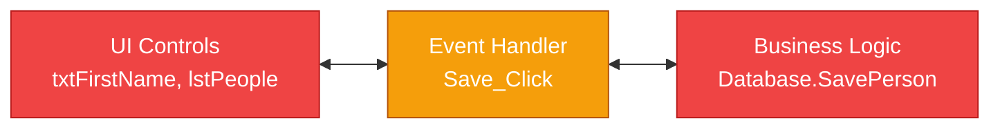
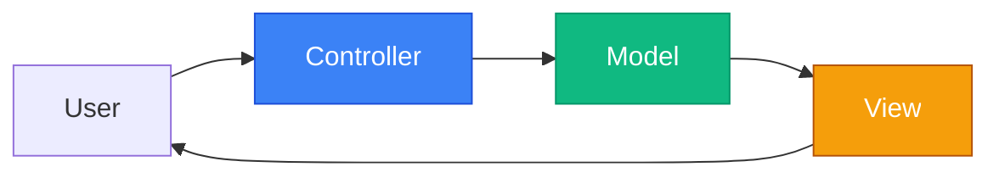
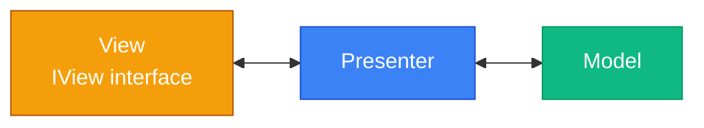
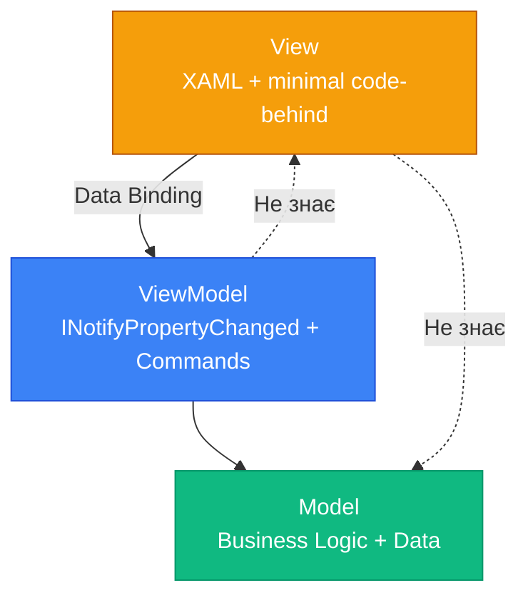

# MVVM Pattern: Від Spaghetti Code до архітектури

## Вступ

Уявіть ситуацію: ви створили WPF додаток. Спочатку все було просто — кілька кнопок, кілька TextBox-ів, трохи логіки у code-behind. Але проєкт ріс:

```csharp
// MainWindow.xaml.cs — 500 рядків коду
public partial class MainWindow : Window
{
    private List<Person> _people = new List<Person>();
    private Person _selectedPerson;
    
    private void LoadData_Click(object sender, RoutedEventArgs e)
    {
        // Завантаження даних з БД
        _people = Database.GetPeople();
        lstPeople.ItemsSource = _people;
    }
    
    private void Save_Click(object sender, RoutedEventArgs e)
    {
        // Валідація
        if (string.IsNullOrWhiteSpace(txtFirstName.Text))
        {
            MessageBox.Show("Введіть ім'я!");
            return;
        }
        
        // Збереження
        var person = new Person
        {
            FirstName = txtFirstName.Text,
            LastName = txtLastName.Text,
            Age = int.Parse(txtAge.Text)
        };
        
        Database.SavePerson(person);
        LoadData_Click(null, null);  // Перезавантаження списку
    }
    
    private void Delete_Click(object sender, RoutedEventArgs e)
    {
        if (_selectedPerson != null)
        {
            Database.DeletePerson(_selectedPerson.Id);
            LoadData_Click(null, null);
        }
    }
    
    private void Search_TextChanged(object sender, TextChangedEventArgs e)
    {
        var query = txtSearch.Text.ToLower();
        lstPeople.ItemsSource = _people.Where(p => 
            p.FirstName.ToLower().Contains(query) || 
            p.LastName.ToLower().Contains(query)
        ).ToList();
    }
    
    // ... ще 400 рядків подібного коду
}
```

**Проблеми:**

- ❌ **Tight coupling** — UI-логіка змішана з бізнес-логікою
- ❌ **Untestable** — як написати unit-test для `Save_Click`? Потрібен весь UI
- ❌ **Duplicated logic** — та сама логіка у двох вікнах → копіювання коду
- ❌ **Hard to maintain** — зміна однієї речі ламає три інші
- ❌ **Team collaboration** — дизайнер не може працювати з XAML без розробника

**Питання:**
- Як це тестувати?
- Як це підтримувати у команді?
- Як додати нову фічу, не зламавши все?
- Як перевикористати логіку в іншому вікні?

**Рішення:** **MVVM (Model-View-ViewModel)** — архітектурний патерн, що розділяє відповідальність між компонентами.

::note
**Для кого ця стаття?** Якщо ви вже знайомі з [Data Binding](17.data-binding-basics-part1), [INotifyPropertyChanged](17.data-binding-basics-part2) та [Collections Binding](21.collections-binding-part1), ця стаття покаже, як організувати код у масштабованій архітектурі.
::

---

## Проблема code-behind: Spaghetti Code

Розберемо детально, чому code-behind — це антипатерн для складних додатків.

### Tight Coupling: Тісна зв'язність

**Проблема:** UI залежить від логіки, логіка залежить від UI.

```csharp
private void Save_Click(object sender, RoutedEventArgs e)
{
    // Читання з UI
    var firstName = txtFirstName.Text;
    var lastName = txtLastName.Text;
    
    // Бізнес-логіка
    var person = new Person { FirstName = firstName, LastName = lastName };
    Database.SavePerson(person);
    
    // Оновлення UI
    lstPeople.ItemsSource = Database.GetPeople();
    txtFirstName.Clear();
    txtLastName.Clear();
}
```

**Що не так?**

::mermaid

::

- UI-контроли (`txtFirstName`) прямо використовуються у логіці
- Логіка прямо маніпулює UI (`lstPeople.ItemsSource`)
- Неможливо змінити UI без зміни логіки
- Неможливо перевикористати логіку в іншому вікні

### Untestable: Неможливість тестування

**Проблема:** Як написати unit-test для `Save_Click`?

```csharp
[Test]
public void Save_ShouldSavePersonToDatabase()
{
    // ❌ Як створити MainWindow без запуску всього UI?
    var window = new MainWindow();
    
    // ❌ Як встановити текст у TextBox?
    window.txtFirstName.Text = "Іван";
    
    // ❌ Як викликати Save_Click без реального кліку?
    window.Save_Click(null, null);
    
    // ❌ Як перевірити, що дані збережені?
    // Потрібен доступ до приватних полів
}
```

**Проблеми:**

- Потрібен весь UI для тестування логіки
- Потрібен доступ до приватних полів
- Тести повільні (створення UI)
- Тести крихкі (зміна UI ламає тести)

### Duplicated Logic: Дублювання коду

**Проблема:** Та сама логіка у двох вікнах.

```csharp
// MainWindow.xaml.cs
private void Save_Click(object sender, RoutedEventArgs e)
{
    if (string.IsNullOrWhiteSpace(txtFirstName.Text))
    {
        MessageBox.Show("Введіть ім'я!");
        return;
    }
    
    var person = new Person { FirstName = txtFirstName.Text };
    Database.SavePerson(person);
}

// EditWindow.xaml.cs
private void Update_Click(object sender, RoutedEventArgs e)
{
    // ❌ Копіювання тієї самої валідації
    if (string.IsNullOrWhiteSpace(txtFirstName.Text))
    {
        MessageBox.Show("Введіть ім'я!");
        return;
    }
    
    var person = new Person { FirstName = txtFirstName.Text };
    Database.UpdatePerson(person);
}
```

**Проблеми:**

- Зміна валідації → потрібно змінити у двох місцях
- Легко забути оновити одне з вікон
- Код стає нечитабельним

### Hard to Maintain: Складність підтримки

**Проблема:** Зміна однієї речі ламає три інші.

```csharp
// Додаємо нове поле "Email"
private void Save_Click(object sender, RoutedEventArgs e)
{
    var person = new Person 
    { 
        FirstName = txtFirstName.Text,
        LastName = txtLastName.Text,
        Email = txtEmail.Text  // Нове поле
    };
    
    Database.SavePerson(person);
    
    // ❌ Забули оновити Search_TextChanged
    // ❌ Забули оновити Delete_Click
    // ❌ Забули оновити EditWindow
}
```

---

## Еволюція архітектурних патернів

MVVM — це не перший патерн для розділення UI та логіки. Розберемо історію.

### MVC (Model-View-Controller) — 1979

**Походження:** Smalltalk (Trygve Reenskaug, Xerox PARC).

**Структура:**

::mermaid

::

- **Model** — дані та бізнес-логіка
- **View** — відображення даних
- **Controller** — обробка вводу користувача

**Проблема для WPF:** Controller тісно зв'язаний з View. Не використовує Data Binding.

### MVP (Model-View-Presenter) — 1990s

**Походження:** WinForms era (Microsoft).

**Структура:**

::mermaid

::

- **View** — пасивний, реалізує інтерфейс `IView`
- **Presenter** — вся логіка, маніпулює View через інтерфейс
- **Model** — дані

**Проблема для WPF:** Presenter знає View (через інтерфейс). Не використовує Data Binding повною мірою.

### MVVM (Model-View-ViewModel) — 2005

**Походження:** John Gossman (Microsoft) для WPF.

**Чому MVVM ідеальний для XAML-платформ?**

::card-group

::card{title="🔗 Data Binding як клей" icon="i-lucide-link"}
XAML має потужний Data Binding. MVVM використовує його на 100% — ViewModel не знає View.
::

::card{title="📢 INotifyPropertyChanged" icon="i-lucide-bell"}
Автоматичне оновлення UI при зміні даних. Не потрібно вручну оновлювати контроли.
::

::card{title="⚡ Commands" icon="i-lucide-zap"}
Декларативна прив'язка дій (кнопки, меню) до методів ViewModel без event handlers.
::

::card{title="🎨 Дизайнер + Розробник" icon="i-lucide-palette"}
Дизайнер працює з XAML, розробник з ViewModel. Мінімальна залежність.
::

::

**Структура:**

::mermaid

::

**Ключова відмінність:** ViewModel **не знає** View. Зв'язок тільки через Data Binding.


---

## Три компоненти MVVM

Розберемо детально кожен компонент та його відповідальність.

### Model: Бізнес-логіка та дані

**Відповідальність:**

- Бізнес-логіка (валідація, обчислення, правила)
- Доступ до даних (БД, API, файли)
- Доменні об'єкти (Entity, DTO)

**Що НЕ робить Model:**

- ❌ Не знає про UI
- ❌ Не знає про ViewModel
- ❌ Не має `INotifyPropertyChanged` (це відповідальність ViewModel)

**Приклади Model:**

**1. Entity (доменний об'єкт):**

```csharp
public class Person
{
    public int Id { get; set; }
    public string FirstName { get; set; }
    public string LastName { get; set; }
    public DateTime BirthDate { get; set; }
    public string Email { get; set; }
    
    // Бізнес-логіка
    public int Age => DateTime.Now.Year - BirthDate.Year;
    
    public bool IsAdult => Age >= 18;
}
```

**2. Service (бізнес-логіка):**

```csharp
public class PersonService
{
    private readonly IPersonRepository _repository;
    
    public PersonService(IPersonRepository repository)
    {
        _repository = repository;
    }
    
    public async Task<List<Person>> GetAllPeopleAsync()
    {
        return await _repository.GetAllAsync();
    }
    
    public async Task SavePersonAsync(Person person)
    {
        // Валідація
        if (string.IsNullOrWhiteSpace(person.FirstName))
            throw new ValidationException("Ім'я обов'язкове");
        
        if (person.Age < 0)
            throw new ValidationException("Вік не може бути від'ємним");
        
        // Збереження
        await _repository.SaveAsync(person);
    }
}
```

**3. Repository (доступ до даних):**

```csharp
public interface IPersonRepository
{
    Task<List<Person>> GetAllAsync();
    Task<Person> GetByIdAsync(int id);
    Task SaveAsync(Person person);
    Task DeleteAsync(int id);
}

public class PersonRepository : IPersonRepository
{
    private readonly DbContext _context;
    
    public PersonRepository(DbContext context)
    {
        _context = context;
    }
    
    public async Task<List<Person>> GetAllAsync()
    {
        return await _context.People.ToListAsync();
    }
    
    // ... інші методи
}
```

**Ключова ідея:** Model — це чистий C# без залежності від UI-фреймворку. Можна використовувати у консольному додатку, Web API, мобільному додатку.

---

### View: XAML + мінімальний code-behind

**Відповідальність:**

- Візуальне представлення (XAML)
- UI-специфічна логіка (анімації, фокус, прокрутка)
- Data Binding до ViewModel

**Що НЕ робить View:**

- ❌ Не містить бізнес-логіку
- ❌ Не звертається до БД/API
- ❌ Не містить складну логіку у code-behind

**Приклад View:**

**XAML:**

```xml
<Window x:Class="MyApp.Views.MainWindow"
        xmlns="http://schemas.microsoft.com/winfx/2006/xaml/presentation"
        xmlns:x="http://schemas.microsoft.com/winfx/2006/xaml"
        xmlns:vm="clr-namespace:MyApp.ViewModels"
        Title="Контакти" Width="800" Height="600">
    
    <!-- DataContext встановлюється у code-behind або через DI -->
    
    <Grid Margin="20">
        <Grid.ColumnDefinitions>
            <ColumnDefinition Width="*"/>
            <ColumnDefinition Width="2*"/>
        </Grid.ColumnDefinitions>
        
        <!-- Список контактів -->
        <StackPanel Grid.Column="0">
            <TextBox Text="{Binding SearchQuery, UpdateSourceTrigger=PropertyChanged}" 
                     Margin="0,0,0,10"/>
            
            <ListBox ItemsSource="{Binding People}" 
                     SelectedItem="{Binding SelectedPerson}"
                     Height="400"/>
            
            <Button Content="Додати" 
                    Command="{Binding AddCommand}" 
                    Margin="0,10,0,0"/>
        </StackPanel>
        
        <!-- Деталі вибраного контакту -->
        <Border Grid.Column="1" 
                Background="LightGray" 
                Padding="20" 
                Margin="10,0,0,0">
            <StackPanel>
                <TextBlock Text="Ім'я:"/>
                <TextBox Text="{Binding SelectedPerson.FirstName}"/>
                
                <TextBlock Text="Прізвище:" Margin="0,10,0,0"/>
                <TextBox Text="{Binding SelectedPerson.LastName}"/>
                
                <Button Content="Зберегти" 
                        Command="{Binding SaveCommand}" 
                        Margin="0,20,0,0"/>
            </StackPanel>
        </Border>
    </Grid>
</Window>
```

**Code-Behind (мінімальний):**

```csharp
public partial class MainWindow : Window
{
    public MainWindow()
    {
        InitializeComponent();
        
        // Встановлення DataContext
        DataContext = new MainViewModel();
    }
}
```

**Що дозволено у code-behind:**

✅ `InitializeComponent()`
✅ Встановлення `DataContext`
✅ UI-специфічна логіка (анімації, фокус):

```csharp
private void TextBox_GotFocus(object sender, RoutedEventArgs e)
{
    // Виділити весь текст при фокусі
    ((TextBox)sender).SelectAll();
}
```

✅ Складні UI-операції (прокрутка, діалоги):

```csharp
private void ScrollToBottom_Click(object sender, RoutedEventArgs e)
{
    scrollViewer.ScrollToBottom();
}
```

**Що НЕ дозволено:**

❌ Бізнес-логіка (валідація, обчислення)
❌ Доступ до БД/API
❌ Складна логіка обробки даних

---

### ViewModel: Посередник між View та Model

**Відповідальність:**

- Реалізація `INotifyPropertyChanged`
- Публічні властивості для Data Binding
- Commands для дій (кнопки, меню)
- Підготовка даних для View (форматування, фільтрація)
- Виклик Model для бізнес-логіки

**Що НЕ робить ViewModel:**

- ❌ Не знає конкретну View (не має посилань на UI-контроли)
- ❌ Не містить UI-специфічну логіку (анімації, фокус)
- ❌ Не містить складну бізнес-логіку (делегує Model)

**Приклад ViewModel:**

```csharp
using System.Collections.ObjectModel;
using System.ComponentModel;
using System.Runtime.CompilerServices;
using System.Windows.Input;

public class MainViewModel : INotifyPropertyChanged
{
    private readonly PersonService _personService;
    
    public event PropertyChangedEventHandler PropertyChanged;
    
    protected void OnPropertyChanged([CallerMemberName] string propertyName = null)
    {
        PropertyChanged?.Invoke(this, new PropertyChangedEventArgs(propertyName));
    }
    
    // Властивості для Data Binding
    private ObservableCollection<Person> _people;
    public ObservableCollection<Person> People
    {
        get => _people;
        set
        {
            _people = value;
            OnPropertyChanged();
        }
    }
    
    private Person _selectedPerson;
    public Person SelectedPerson
    {
        get => _selectedPerson;
        set
        {
            _selectedPerson = value;
            OnPropertyChanged();
        }
    }
    
    private string _searchQuery;
    public string SearchQuery
    {
        get => _searchQuery;
        set
        {
            _searchQuery = value;
            OnPropertyChanged();
            ApplyFilter();
        }
    }
    
    // Commands
    public ICommand AddCommand { get; }
    public ICommand SaveCommand { get; }
    public ICommand DeleteCommand { get; }
    
    // Конструктор
    public MainViewModel()
    {
        _personService = new PersonService(new PersonRepository());
        
        // Ініціалізація команд
        AddCommand = new RelayCommand(Add);
        SaveCommand = new RelayCommand(Save, CanSave);
        DeleteCommand = new RelayCommand(Delete, CanDelete);
        
        // Завантаження даних
        LoadData();
    }
    
    // Методи
    private async void LoadData()
    {
        var people = await _personService.GetAllPeopleAsync();
        People = new ObservableCollection<Person>(people);
    }
    
    private void Add()
    {
        var newPerson = new Person { FirstName = "Новий", LastName = "Користувач" };
        People.Add(newPerson);
        SelectedPerson = newPerson;
    }
    
    private async void Save()
    {
        if (SelectedPerson != null)
        {
            await _personService.SavePersonAsync(SelectedPerson);
        }
    }
    
    private bool CanSave()
    {
        return SelectedPerson != null && 
               !string.IsNullOrWhiteSpace(SelectedPerson.FirstName);
    }
    
    private void Delete()
    {
        if (SelectedPerson != null)
        {
            People.Remove(SelectedPerson);
        }
    }
    
    private bool CanDelete()
    {
        return SelectedPerson != null;
    }
    
    private void ApplyFilter()
    {
        // Фільтрація через ICollectionView (детальніше у наступних статтях)
    }
}
```

**Ключові моменти:**

1. **INotifyPropertyChanged** — для автоматичного оновлення UI
2. **ObservableCollection** — для автоматичного оновлення списків
3. **Commands** — для прив'язки дій до кнопок
4. **Делегування Model** — складна логіка у `PersonService`

---

## Потік даних у MVVM

Розберемо, як дані рухаються між компонентами.

### Діаграма взаємодії

::mermaid
```mermaid
sequenceDiagram
    participant User as Користувач
    participant View as View<br/>(XAML)
    participant VM as ViewModel
    participant Model as Model<br/>(Service)
    participant DB as Database
    
    Note over User,DB: Завантаження даних
    User->>View: Відкриває вікно
    View->>VM: Встановлює DataContext
    VM->>Model: GetAllPeopleAsync()
    Model->>DB: SELECT * FROM People
    DB-->>Model: List<Person>
    Model-->>VM: List<Person>
    VM->>VM: People = new ObservableCollection(list)
    VM->>View: PropertyChanged (People)
    View->>View: Оновлює ListBox
    
    Note over User,DB: Редагування
    User->>View: Змінює текст у TextBox
    View->>VM: Binding оновлює SelectedPerson.FirstName
    VM->>VM: PropertyChanged (FirstName)
    View->>View: Оновлює UI
    
    Note over User,DB: Збереження
    User->>View: Клік на "Зберегти"
    View->>VM: SaveCommand.Execute()
    VM->>Model: SavePersonAsync(person)
    Model->>Model: Валідація
    Model->>DB: UPDATE People SET ...
    DB-->>Model: Success
    Model-->>VM: Success
    VM->>View: Показує повідомлення (опціонально)
    
    style View fill:#f59e0b,stroke:#b45309,color:#ffffff
    style VM fill:#3b82f6,stroke:#1d4ed8,color:#ffffff
    style Model fill:#10b981,stroke:#059669,color:#ffffff
```
::

### Напрямки зв'язків

**View → ViewModel:**
- ✅ Data Binding (читання властивостей)
- ✅ Commands (виклик методів)
- ✅ Events (рідко, через Behaviors)

**ViewModel → View:**
- ✅ PropertyChanged (оповіщення про зміни)
- ❌ Прямих посилань немає

**ViewModel → Model:**
- ✅ Виклик методів сервісів
- ✅ Читання/запис даних

**Model → ViewModel:**
- ✅ Повернення даних
- ❌ Не знає про ViewModel

---

## Золоті правила MVVM

### Правило 1: View знає ViewModel

```csharp
// ✅ Правильно
public partial class MainWindow : Window
{
    public MainWindow()
    {
        InitializeComponent();
        DataContext = new MainViewModel();
    }
}
```

```xml
<!-- ✅ Правильно -->
<TextBox Text="{Binding FirstName}"/>
<Button Command="{Binding SaveCommand}"/>
```

### Правило 2: ViewModel НЕ знає View

```csharp
// ❌ НЕПРАВИЛЬНО
public class MainViewModel
{
    private MainWindow _view;  // ❌ Посилання на View
    
    public void Save()
    {
        _view.txtFirstName.Text = "...";  // ❌ Маніпуляція UI
    }
}

// ✅ Правильно
public class MainViewModel
{
    private string _firstName;
    public string FirstName
    {
        get => _firstName;
        set
        {
            _firstName = value;
            OnPropertyChanged();
        }
    }
    
    public void Save()
    {
        // Логіка без посилань на UI
    }
}
```

### Правило 3: Model не знає ні View, ні ViewModel

```csharp
// ❌ НЕПРАВИЛЬНО
public class PersonService
{
    private MainViewModel _viewModel;  // ❌ Залежність від ViewModel
    
    public void SavePerson(Person person)
    {
        // ...
        _viewModel.UpdateUI();  // ❌
    }
}

// ✅ Правильно
public class PersonService
{
    public async Task SavePersonAsync(Person person)
    {
        // Чистий C# без залежностей від UI
        await _repository.SaveAsync(person);
    }
}
```

### Правило 4: Бізнес-логіка у Model, UI-логіка у ViewModel

```csharp
// ❌ НЕПРАВИЛЬНО — бізнес-логіка у ViewModel
public class MainViewModel
{
    public void Save()
    {
        if (string.IsNullOrWhiteSpace(FirstName))
            throw new Exception("Ім'я обов'язкове");
        
        if (Age < 0 || Age > 150)
            throw new Exception("Некоректний вік");
        
        // ... складна валідація
    }
}

// ✅ Правильно — бізнес-логіка у Model
public class PersonService
{
    public void ValidatePerson(Person person)
    {
        if (string.IsNullOrWhiteSpace(person.FirstName))
            throw new ValidationException("Ім'я обов'язкове");
        
        if (person.Age < 0 || person.Age > 150)
            throw new ValidationException("Некоректний вік");
    }
}

public class MainViewModel
{
    public async void Save()
    {
        try
        {
            await _personService.SavePersonAsync(SelectedPerson);
        }
        catch (ValidationException ex)
        {
            ErrorMessage = ex.Message;  // UI-логіка
        }
    }
}
```


---

## 🔵 Recap: ООП концепції у MVVM

Для студентів зі слабким розумінням ООП — коротке нагадування ключових концепцій, що використовуються у MVVM.

### Інтерфейси як контракти

**Що таке інтерфейс?**

Інтерфейс — це **контракт**, який клас зобов'язується виконати. Інтерфейс визначає **що** клас має робити, але не **як**.

```csharp
// Інтерфейс — контракт
public interface INotifyPropertyChanged
{
    // Клас має мати цю подію
    event PropertyChangedEventHandler PropertyChanged;
}

// Клас, що виконує контракт
public class MainViewModel : INotifyPropertyChanged
{
    // Реалізація контракту
    public event PropertyChangedEventHandler PropertyChanged;
    
    // Тепер клас "обіцяє" повідомляти про зміни
}
```

**Чому це важливо для MVVM?**

- `INotifyPropertyChanged` — контракт: "Я обіцяю повідомити UI про зміни властивостей"
- WPF Binding Engine підписується на цей контракт
- Будь-який клас, що реалізує `INotifyPropertyChanged`, може бути ViewModel

**Аналогія:** Інтерфейс — це як договір. `INotifyPropertyChanged` — це договір між ViewModel та WPF: "Я обіцяю повідомити тебе, коли мої дані зміняться".

### Поліморфізм: ViewModel може бути будь-яким об'єктом

**Що таке поліморфізм?**

Поліморфізм — це можливість використовувати об'єкти різних типів через спільний інтерфейс.

```csharp
// Базовий інтерфейс
public interface INotifyPropertyChanged
{
    event PropertyChangedEventHandler PropertyChanged;
}

// Різні реалізації
public class MainViewModel : INotifyPropertyChanged { /* ... */ }
public class SettingsViewModel : INotifyPropertyChanged { /* ... */ }
public class LoginViewModel : INotifyPropertyChanged { /* ... */ }

// WPF не знає конкретний тип — працює через інтерфейс
public void SetDataContext(INotifyPropertyChanged viewModel)
{
    DataContext = viewModel;  // Може бути будь-який ViewModel
}
```

**Чому це важливо для MVVM?**

- View не знає конкретний тип ViewModel
- View працює через `INotifyPropertyChanged`
- Можна замінити ViewModel без зміни View

### Events: Механізм сповіщення

**Що таке подія (Event)?**

Подія — це механізм сповіщення у C#. Об'єкт може "викликати" подію, а інші об'єкти можуть "підписатися" на неї.

```csharp
// Клас з подією
public class MainViewModel
{
    // Подія — список підписників
    public event PropertyChangedEventHandler PropertyChanged;
    
    public string FirstName
    {
        get => _firstName;
        set
        {
            _firstName = value;
            
            // Викликаємо подію — повідомляємо всіх підписників
            PropertyChanged?.Invoke(this, new PropertyChangedEventArgs(nameof(FirstName)));
        }
    }
}

// Підписник (WPF Binding Engine)
var viewModel = new MainViewModel();
viewModel.PropertyChanged += (sender, e) =>
{
    // Обробка зміни — оновлення UI
    Console.WriteLine($"Властивість {e.PropertyName} змінилася!");
};
```

**Чому це важливо для MVVM?**

- ViewModel викликає подію `PropertyChanged`
- WPF Binding Engine підписується на цю подію
- При зміні властивості → подія → UI оновлюється

**Аналогія:** Подія — це як дзвінок. ViewModel дзвонить (викликає подію), а WPF відповідає (оновлює UI).

::tip
**Детальніше про ООП:** Якщо концепції інтерфейсів, поліморфізму або подій незрозумілі, рекомендую повернутися до розділу [ООП: Основи](../02.oop/) для глибшого розуміння.
::

---

## Практичні завдання

### Рівень 1: Визначити Model, View, ViewModel для калькулятора

**Мета:** Навчитися розділяти відповідальність між компонентами MVVM.

**Завдання:**

Для простого калькулятора визначте, що належить до Model, View та ViewModel:

**Функціональність калькулятора:**
- Два TextBox для введення чисел
- ComboBox для вибору операції (+, -, *, /)
- Button "Обчислити"
- TextBlock для відображення результату
- Валідація: числа мають бути коректними
- Історія обчислень (список попередніх операцій)

**Питання:**

1. Що належить до **Model**?
   - Логіка обчислення (додавання, віднімання, множення, ділення)
   - Валідація вводу
   - Зберігання історії
   - Що ще?

2. Що належить до **View**?
   - XAML розмітка (TextBox, Button, ComboBox)
   - Анімація при натисканні кнопки
   - Що ще?

3. Що належить до **ViewModel**?
   - Властивості для Data Binding (Number1, Number2, Result)
   - Command для кнопки "Обчислити"
   - ObservableCollection для історії
   - Що ще?

**Критерії успіху:**
- Правильно розділено відповідальність
- Model не знає про UI
- ViewModel не знає конкретну View
- View містить тільки XAML та мінімальний code-behind

**Підказка:**

**Model:**
```csharp
public class Calculator
{
    public double Add(double a, double b) => a + b;
    public double Subtract(double a, double b) => a - b;
    public double Multiply(double a, double b) => a * b;
    public double Divide(double a, double b) => b != 0 ? a / b : throw new DivideByZeroException();
}

public class CalculationHistory
{
    private List<string> _history = new List<string>();
    
    public void AddEntry(string entry)
    {
        _history.Add(entry);
    }
    
    public List<string> GetHistory() => _history;
}
```

---

### Рівень 2: Перенести Todo-додаток на MVVM

**Мета:** Практично застосувати MVVM до реального додатку.

**Завдання:**

У вас є Todo-додаток з code-behind (500 рядків). Перенесіть його на MVVM:

**Поточний code-behind (антипатерн):**
```csharp
public partial class MainWindow : Window
{
    private List<TodoItem> _todos = new List<TodoItem>();
    
    private void Add_Click(object sender, RoutedEventArgs e)
    {
        var todo = new TodoItem { Title = txtTitle.Text };
        _todos.Add(todo);
        lstTodos.ItemsSource = null;
        lstTodos.ItemsSource = _todos;
    }
    
    private void Delete_Click(object sender, RoutedEventArgs e)
    {
        var selected = (TodoItem)lstTodos.SelectedItem;
        _todos.Remove(selected);
        lstTodos.ItemsSource = null;
        lstTodos.ItemsSource = _todos;
    }
    
    // ... ще 400 рядків
}
```

**Вимоги до MVVM версії:**

1. **Model:**
   - `TodoItem` (Title, IsCompleted, DueDate)
   - `TodoService` (валідація, збереження)

2. **ViewModel:**
   - `MainViewModel` з `INotifyPropertyChanged`
   - `ObservableCollection<TodoItem>` для списку
   - Commands для Add, Delete, ToggleComplete
   - Властивості для фільтрації (ShowAll, ShowActive, ShowCompleted)

3. **View:**
   - XAML з Data Binding
   - Мінімальний code-behind (тільки `InitializeComponent()`)

**Критерії успіху:**
- Code-behind має <10 рядків
- Вся логіка у ViewModel
- Можна написати unit-test для ViewModel
- UI оновлюється автоматично через Data Binding

**Підказка для ViewModel:**
```csharp
public class MainViewModel : INotifyPropertyChanged
{
    private readonly TodoService _todoService;
    
    public ObservableCollection<TodoItem> Todos { get; set; }
    
    private string _newTodoTitle;
    public string NewTodoTitle
    {
        get => _newTodoTitle;
        set
        {
            _newTodoTitle = value;
            OnPropertyChanged();
        }
    }
    
    public ICommand AddCommand { get; }
    public ICommand DeleteCommand { get; }
    
    public MainViewModel()
    {
        _todoService = new TodoService();
        Todos = new ObservableCollection<TodoItem>();
        
        AddCommand = new RelayCommand(Add, CanAdd);
        DeleteCommand = new RelayCommand<TodoItem>(Delete);
    }
    
    private void Add()
    {
        var todo = new TodoItem { Title = NewTodoTitle };
        Todos.Add(todo);
        NewTodoTitle = string.Empty;
    }
    
    private bool CanAdd()
    {
        return !string.IsNullOrWhiteSpace(NewTodoTitle);
    }
    
    private void Delete(TodoItem todo)
    {
        Todos.Remove(todo);
    }
    
    // ... INotifyPropertyChanged implementation
}
```

---

### Рівень 3: Порівняти testability — ViewModel vs code-behind

**Мета:** Зрозуміти переваги MVVM для тестування.

**Завдання:**

Напишіть unit-тести для двох версій Todo-додатку:

**1. Code-behind версія (неможливо протестувати):**

Спробуйте написати тест:
```csharp
[Test]
public void Add_ShouldAddTodoToList()
{
    // ❌ Як створити MainWindow без UI?
    var window = new MainWindow();
    
    // ❌ Як встановити текст у TextBox?
    window.txtTitle.Text = "Нове завдання";
    
    // ❌ Як викликати Add_Click без реального кліку?
    window.Add_Click(null, null);
    
    // ❌ Як перевірити, що завдання додано?
    // Потрібен доступ до приватного поля _todos
}
```

**2. MVVM версія (легко тестувати):**

Напишіть тести:
```csharp
[Test]
public void Add_ShouldAddTodoToCollection()
{
    // ✅ Створюємо ViewModel без UI
    var viewModel = new MainViewModel();
    
    // ✅ Встановлюємо властивість
    viewModel.NewTodoTitle = "Нове завдання";
    
    // ✅ Викликаємо команду
    viewModel.AddCommand.Execute(null);
    
    // ✅ Перевіряємо результат
    Assert.AreEqual(1, viewModel.Todos.Count);
    Assert.AreEqual("Нове завдання", viewModel.Todos[0].Title);
}

[Test]
public void Add_ShouldClearNewTodoTitle()
{
    var viewModel = new MainViewModel();
    viewModel.NewTodoTitle = "Нове завдання";
    
    viewModel.AddCommand.Execute(null);
    
    Assert.IsEmpty(viewModel.NewTodoTitle);
}

[Test]
public void AddCommand_ShouldBeDisabled_WhenTitleIsEmpty()
{
    var viewModel = new MainViewModel();
    viewModel.NewTodoTitle = "";
    
    Assert.IsFalse(viewModel.AddCommand.CanExecute(null));
}

[Test]
public void Delete_ShouldRemoveTodoFromCollection()
{
    var viewModel = new MainViewModel();
    var todo = new TodoItem { Title = "Завдання" };
    viewModel.Todos.Add(todo);
    
    viewModel.DeleteCommand.Execute(todo);
    
    Assert.AreEqual(0, viewModel.Todos.Count);
}
```

**Критерії успіху:**
- Написано мінімум 5 unit-тестів для ViewModel
- Всі тести проходять
- Тести швидкі (<100ms кожен)
- Тести не потребують UI

**Висновок:**
Порівняйте складність тестування code-behind vs MVVM. Зробіть висновок про переваги MVVM для testability.

---

## Підсумок

MVVM — це архітектурний патерн, що розділяє відповідальність між компонентами та робить код тестованим, підтримуваним та масштабованим.

**Ключові висновки:**

::card-group

::card{title="🏗️ Три компоненти" icon="i-lucide-layers"}
Model (бізнес-логіка), View (UI), ViewModel (посередник). Кожен має свою відповідальність.
::

::card{title="🔗 Data Binding як клей" icon="i-lucide-link"}
ViewModel не знає View. Зв'язок тільки через Data Binding та Commands.
::

::card{title="✅ Testability" icon="i-lucide-check-circle"}
ViewModel легко тестувати без UI. Code-behind неможливо протестувати.
::

::card{title="♻️ Reusability" icon="i-lucide-recycle"}
Логіка у ViewModel перевикористовується у різних View. Model перевикористовується у різних проєктах.
::

::card{title="👥 Team collaboration" icon="i-lucide-users"}
Дизайнер працює з XAML, розробник з ViewModel. Мінімальна залежність.
::

::card{title="📏 Золоті правила" icon="i-lucide-ruler"}
View знає ViewModel. ViewModel НЕ знає View. Model не знає ні View, ні ViewModel.
::

::

**Переваги MVVM:**

- ✅ Розділення відповідальності (Separation of Concerns)
- ✅ Тестованість (Unit-тести для ViewModel)
- ✅ Підтримуваність (зміни у одному компоненті не ламають інші)
- ✅ Перевикористання (логіка у ViewModel, Model)
- ✅ Командна робота (дизайнер + розробник)

**Недоліки MVVM:**

- ⚠️ Більше коду на початку (boilerplate)
- ⚠️ Крива навчання (потрібно розуміти Data Binding, Commands)
- ⚠️ Overhead для простих додатків

::tip
**Коли використовувати MVVM:** Для будь-якого додатку, що складніший за "Hello World". Для командної розробки. Для довгострокових проєктів.
::

**Що далі?**

- **ViewModel Implementation** ([наступна стаття](23.viewmodel-implementation)) — створення BaseViewModel, валідація, DesignTime data
- **Commands** (стаття 24) — детальний розгляд ICommand та RelayCommand
- **MVVM Toolkit** (стаття 25) — автоматизація boilerplate через Source Generators

---

## Словник термінів

::note{title="📚 Глосарій"}

**MVVM (Model-View-ViewModel)** — архітектурний патерн для розділення UI та бізнес-логіки через Data Binding.

**Model** — компонент з бізнес-логікою та даними. Не знає про UI. Може бути Entity, Service, Repository.

**View** — компонент з візуальним представленням (XAML). Знає ViewModel через DataContext. Мінімальний code-behind.

**ViewModel** — посередник між View та Model. Реалізує INotifyPropertyChanged, містить Commands, підготовлює дані для View.

**Separation of Concerns** — принцип розділення відповідальності. Кожен компонент має одну чітку відповідальність.

**Tight Coupling** — тісна зв'язність, коли компоненти залежать один від одного. Антипатерн.

**Loose Coupling** — слабка зв'язність, коли компоненти незалежні. Досягається через інтерфейси та Data Binding.

**Testability** — можливість написати unit-тести для коду. MVVM робить код тестованим.

**Code-behind** — C# код у файлі `.xaml.cs`. У MVVM має бути мінімальним.

**Data Binding** — механізм зв'язування UI та даних. Ключовий елемент MVVM.

::

---

## Додаткові ресурси

::card-group

::card{title="📖 Microsoft Docs: MVVM Pattern" icon="i-lucide-book-open" to="https://learn.microsoft.com/en-us/dotnet/architecture/maui/mvvm"}
Офіційна документація Microsoft про MVVM pattern з прикладами.
::

::card{title="🎓 John Gossman: Introduction to MVVM" icon="i-lucide-graduation-cap" to="https://learn.microsoft.com/en-us/archive/blogs/johngossman/introduction-to-modelviewviewmodel-pattern-for-building-wpf-apps"}
Оригінальна стаття John Gossman (2005) про створення MVVM для WPF.
::

::card{title="📖 MVVM Design Pattern" icon="i-lucide-layout" to="https://learn.microsoft.com/en-us/dotnet/desktop/wpf/data/"}
Повний гайд з Data Binding та MVVM у WPF.
::

::card{title="🔧 MVVM Best Practices" icon="i-lucide-wrench" to="https://learn.microsoft.com/en-us/windows/communitytoolkit/mvvm/"}
Best practices для MVVM від Microsoft Community Toolkit.
::

::card{title="📚 Попередня стаття: Collections Binding Part 2" icon="i-lucide-arrow-left" to="21.collections-binding-part2"}
Повернутися до ICollectionView — фільтрація, сортування, віртуалізація.
::

::card{title="📚 Наступна стаття: ViewModel Implementation" icon="i-lucide-arrow-right" to="23.viewmodel-implementation"}
Дізнатися про створення BaseViewModel, валідацію та DesignTime data.
::

::
