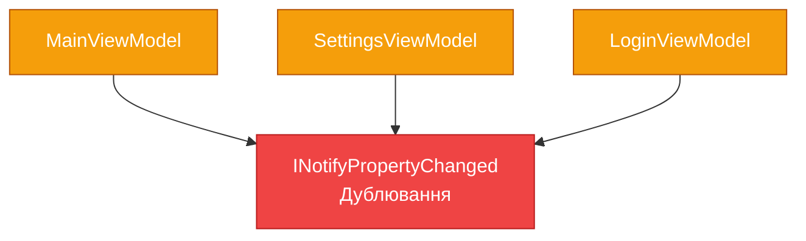

# ViewModel Implementation: Від BaseViewModel до валідації

## Вступ

У попередній статті ми розібрали [MVVM Pattern](22.mvvm-pattern) як архітектурний патерн — три компоненти, золоті правила, потік даних. Але залишилося питання: **як саме реалізувати ViewModel?**

Уявіть ситуацію: ви створюєте додаток з 10 екранами. Кожен екран має свій ViewModel. Кожен ViewModel потребує:

- Реалізації `INotifyPropertyChanged`
- Методу `OnPropertyChanged(string propertyName)`
- Десятків властивостей з однаковим boilerplate-кодом:

```csharp
private string _firstName;
public string FirstName
{
    get => _firstName;
    set
    {
        _firstName = value;
        OnPropertyChanged(nameof(FirstName));
    }
}
```

**Проблеми:**

- ❌ **Дублювання коду** — той самий патерн для кожної властивості
- ❌ **Помилки у назвах** — `OnPropertyChanged("FirsName")` (опечатка) → UI не оновлюється
- ❌ **Відсутність валідації** — як показати помилки у View?
- ❌ **Складність тестування** — як перевірити, що PropertyChanged викликається?

**Рішення:** Створити **BaseViewModel** — базовий клас з усією інфраструктурою, який успадковують всі ViewModel.

::note
**Для кого ця стаття?** Якщо ви вже знайомі з [INotifyPropertyChanged](17.data-binding-basics-part2) та [MVVM Pattern](22.mvvm-pattern), ця стаття покаже, як створити production-ready ViewModel з валідацією та DesignTime даними.
::

---

## Проблема boilerplate: Чому потрібен BaseViewModel

Розберемо детально, чому ручна реалізація `INotifyPropertyChanged` для кожного ViewModel — це антипатерн.

### Дублювання коду у кожному ViewModel

**Проблема:** Той самий код у 10 ViewModel.

```csharp
// MainViewModel.cs
public class MainViewModel : INotifyPropertyChanged
{
    public event PropertyChangedEventHandler PropertyChanged;
    
    protected void OnPropertyChanged(string propertyName)
    {
        PropertyChanged?.Invoke(this, new PropertyChangedEventArgs(propertyName));
    }
    
    private string _title;
    public string Title
    {
        get => _title;
        set
        {
            _title = value;
            OnPropertyChanged(nameof(Title));
        }
    }
}

// SettingsViewModel.cs
public class SettingsViewModel : INotifyPropertyChanged
{
    // ❌ Копіювання того самого коду
    public event PropertyChangedEventHandler PropertyChanged;
    
    protected void OnPropertyChanged(string propertyName)
    {
        PropertyChanged?.Invoke(this, new PropertyChangedEventArgs(propertyName));
    }
    
    private string _theme;
    public string Theme
    {
        get => _theme;
        set
        {
            _theme = value;
            OnPropertyChanged(nameof(Theme));
        }
    }
}

// LoginViewModel.cs
public class LoginViewModel : INotifyPropertyChanged
{
    // ❌ Знову те саме
    public event PropertyChangedEventHandler PropertyChanged;
    
    protected void OnPropertyChanged(string propertyName)
    {
        PropertyChanged?.Invoke(this, new PropertyChangedEventArgs(propertyName));
    }
    
    // ... властивості
}
```

**Що не так?**

::mermaid

::

- Той самий код у 10 місцях
- Зміна логіки → потрібно змінити у 10 місцях
- Легко забути оновити один з ViewModel

### Помилки у назвах властивостей

**Проблема:** Рядкові літерали — джерело помилок.

```csharp
private string _firstName;
public string FirstName
{
    get => _firstName;
    set
    {
        _firstName = value;
        // ❌ Опечатка — UI не оновиться
        OnPropertyChanged("FirsName");
    }
}
```

**Наслідки:**

- UI не оновлюється при зміні властивості
- Помилка виявляється тільки у runtime
- Складно знайти причину — компілятор не попереджає

**Спроба виправлення через `nameof`:**

```csharp
OnPropertyChanged(nameof(FirstName));  // ✅ Compile-time перевірка
```

Але це все одно багато boilerplate-коду для кожної властивості.


### Відсутність централізованої логіки

**Проблема:** Як додати логування змін властивостей?

```csharp
// Потрібно змінити у кожному ViewModel
protected void OnPropertyChanged(string propertyName)
{
    // Додаємо логування
    Console.WriteLine($"Property {propertyName} changed");
    
    PropertyChanged?.Invoke(this, new PropertyChangedEventArgs(propertyName));
}
```

Якщо у вас 10 ViewModel — потрібно змінити 10 файлів. Якщо забули один — логування працює неповністю.

**Інші приклади централізованої логіки:**

- Відстеження змін для Undo/Redo
- Автоматичне збереження при зміні
- Аналітика (tracking змін користувача)
- Debugging (виведення стеку викликів)

Без базового класу — неможливо додати цю логіку централізовано.

---

## BaseViewModel: Базовий клас для всіх ViewModel

Рішення всіх проблем — створити **BaseViewModel** — абстрактний базовий клас, який реалізує `INotifyPropertyChanged` та надає інфраструктуру для всіх ViewModel.

### Мінімальна реалізація BaseViewModel

**Мета:** Винести спільний код у один клас.

```csharp
using System.ComponentModel;
using System.Runtime.CompilerServices;

public abstract class BaseViewModel : INotifyPropertyChanged
{
    // Подія для сповіщення UI про зміни
    public event PropertyChangedEventHandler PropertyChanged;
    
    // Метод для виклику події
    protected virtual void OnPropertyChanged([CallerMemberName] string propertyName = null)
    {
        PropertyChanged?.Invoke(this, new PropertyChangedEventArgs(propertyName));
    }
}
```

**Ключові моменти:**

1. **`abstract class`** — не можна створити екземпляр `BaseViewModel`, тільки успадкувати
2. **`[CallerMemberName]`** — компілятор автоматично підставляє ім'я властивості, що викликала метод
3. **`virtual`** — дозволяє перевизначити у нащадках для кастомної логіки

**Використання:**

```csharp
public class MainViewModel : BaseViewModel
{
    private string _title;
    public string Title
    {
        get => _title;
        set
        {
            _title = value;
            // ✅ Не потрібно передавати ім'я — CallerMemberName підставить автоматично
            OnPropertyChanged();
        }
    }
}
```

**Переваги:**

- ✅ Код `INotifyPropertyChanged` у одному місці
- ✅ Автоматична підстановка імені властивості
- ✅ Легко додати централізовану логіку

::tip
**CallerMemberName:** Атрибут `[CallerMemberName]` — це compile-time magic. Компілятор підставляє ім'я методу/властивості, що викликала метод. Якщо викликати `OnPropertyChanged()` з властивості `Title`, компілятор підставить `"Title"`.
::


### Як працює CallerMemberName

Розберемо детально механізм `[CallerMemberName]`.

**Код, який ви пишете:**

```csharp
public string Title
{
    get => _title;
    set
    {
        _title = value;
        OnPropertyChanged();  // Не передаємо параметр
    }
}
```

**Що бачить компілятор:**

```csharp
public string Title
{
    get => _title;
    set
    {
        _title = value;
        OnPropertyChanged("Title");  // Компілятор підставив автоматично
    }
}
```

**Діаграма процесу:**

::mermaid
```mermaid
sequenceDiagram
    participant Code as Ваш код
    participant Compiler as C# Compiler
    participant Runtime as Runtime
    
    Code->>Compiler: OnPropertyChanged()
    Note over Compiler: Бачить атрибут [CallerMemberName]
    Compiler->>Compiler: Визначає ім'я властивості: "Title"
    Compiler->>Runtime: OnPropertyChanged("Title")
    Runtime->>Runtime: PropertyChanged?.Invoke(...)
    
    style Compiler fill:#3b82f6,stroke:#1d4ed8,color:#ffffff
    style Runtime fill:#10b981,stroke:#059669,color:#ffffff
```
::

**Переваги:**

- ✅ Compile-time перевірка — якщо властивість не існує, компілятор видасть помилку
- ✅ Refactoring-safe — при перейменуванні властивості через IDE, ім'я оновиться автоматично
- ✅ Менше коду — не потрібно писати `nameof(Title)`

**Альтернативи без CallerMemberName:**

```csharp
// ❌ Рядковий літерал — помилки у runtime
OnPropertyChanged("Title");

// ✅ nameof — compile-time перевірка, але більше коду
OnPropertyChanged(nameof(Title));

// ✅ CallerMemberName — найкраще рішення
OnPropertyChanged();
```

---

## SetProperty<T>: Універсальний метод для властивостей

Навіть з `BaseViewModel` та `CallerMemberName`, кожна властивість потребує 7 рядків коду:

```csharp
private string _title;
public string Title
{
    get => _title;
    set
    {
        _title = value;
        OnPropertyChanged();
    }
}
```

Якщо у ViewModel 20 властивостей — це 140 рядків однакового коду. Можна краще?

### Реалізація SetProperty<T>

**Мета:** Універсальний метод, що встановлює значення та викликає `OnPropertyChanged` тільки якщо значення змінилося.

```csharp
public abstract class BaseViewModel : INotifyPropertyChanged
{
    public event PropertyChangedEventHandler PropertyChanged;
    
    protected virtual void OnPropertyChanged([CallerMemberName] string propertyName = null)
    {
        PropertyChanged?.Invoke(this, new PropertyChangedEventArgs(propertyName));
    }
    
    // Універсальний метод для встановлення властивостей
    protected bool SetProperty<T>(ref T field, T value, [CallerMemberName] string propertyName = null)
    {
        // Перевірка: чи змінилося значення?
        if (EqualityComparer<T>.Default.Equals(field, value))
        {
            return false;  // Значення не змінилося — не викликаємо PropertyChanged
        }
        
        // Встановлюємо нове значення
        field = value;
        
        // Викликаємо PropertyChanged
        OnPropertyChanged(propertyName);
        
        return true;  // Значення змінилося
    }
}
```

**Ключові моменти:**

1. **`ref T field`** — передаємо backing field за посиланням, щоб змінити його значення
2. **`EqualityComparer<T>.Default`** — універсальне порівняння для будь-якого типу (працює для `string`, `int`, `DateTime`, custom класів)
3. **Повертає `bool`** — `true` якщо значення змінилося, `false` якщо ні (корисно для додаткової логіки)


### Використання SetProperty<T>

**До (без SetProperty):**

```csharp
private string _firstName;
public string FirstName
{
    get => _firstName;
    set
    {
        _firstName = value;
        OnPropertyChanged();
    }
}

private string _lastName;
public string LastName
{
    get => _lastName;
    set
    {
        _lastName = value;
        OnPropertyChanged();
    }
}

private int _age;
public int Age
{
    get => _age;
    set
    {
        _age = value;
        OnPropertyChanged();
    }
}
```

**Після (з SetProperty):**

```csharp
private string _firstName;
public string FirstName
{
    get => _firstName;
    set => SetProperty(ref _firstName, value);
}

private string _lastName;
public string LastName
{
    get => _lastName;
    set => SetProperty(ref _lastName, value);
}

private int _age;
public int Age
{
    get => _age;
    set => SetProperty(ref _age, value);
}
```

**Переваги:**

- ✅ Менше коду — 3 рядки замість 7
- ✅ Автоматична перевірка на зміну — `PropertyChanged` викликається тільки якщо значення змінилося
- ✅ Універсальність — працює для будь-якого типу

**Порівняння кількості коду:**

| Підхід | Рядків на властивість | Рядків для 20 властивостей |
|--------|----------------------|---------------------------|
| Без BaseViewModel | 10 | 200 |
| З BaseViewModel | 7 | 140 |
| З SetProperty | 3 | 60 |

::tip
**Expression-bodied setter:** Синтаксис `set => SetProperty(...)` — це скорочена форма для `set { SetProperty(...); }`. Працює з C# 7.0+.
::

### Чому перевірка на зміну важлива

**Проблема без перевірки:**

```csharp
// Без перевірки
public string Title
{
    get => _title;
    set
    {
        _title = value;
        OnPropertyChanged();  // Викликається завжди, навіть якщо значення не змінилося
    }
}

// Використання
viewModel.Title = "Hello";
viewModel.Title = "Hello";  // ❌ PropertyChanged викликається знову, хоча значення те саме
viewModel.Title = "Hello";  // ❌ І знову
```

**Наслідки:**

- UI перемальовується без потреби (performance overhead)
- Тригерять залежні властивості без причини
- Безкінечні цикли у складних сценаріях

**З перевіркою:**

```csharp
viewModel.Title = "Hello";  // ✅ PropertyChanged викликається
viewModel.Title = "Hello";  // ✅ Значення не змінилося — PropertyChanged НЕ викликається
viewModel.Title = "World";  // ✅ PropertyChanged викликається
```


---

## Обчислювані властивості та залежності

У реальних додатках властивості часто залежать одна від одної. Наприклад, `FullName` залежить від `FirstName` та `LastName`.

### Проблема залежних властивостей

**Сценарій:** Властивість `FullName` обчислюється з `FirstName` та `LastName`.

```csharp
public class PersonViewModel : BaseViewModel
{
    private string _firstName;
    public string FirstName
    {
        get => _firstName;
        set => SetProperty(ref _firstName, value);
    }
    
    private string _lastName;
    public string LastName
    {
        get => _lastName;
        set => SetProperty(ref _lastName, value);
    }
    
    // Обчислювана властивість
    public string FullName => $"{FirstName} {LastName}";
}
```

**Проблема:**

```xml
<TextBlock Text="{Binding FullName}"/>
```

Коли користувач змінює `FirstName`, UI для `FullName` **не оновлюється**, бо `PropertyChanged` для `FullName` не викликається.

::mermaid
```mermaid
sequenceDiagram
    participant User as Користувач
    participant View as View
    participant VM as ViewModel
    
    User->>View: Змінює FirstName на "Іван"
    View->>VM: FirstName = "Іван"
    VM->>VM: SetProperty(ref _firstName, "Іван")
    VM->>View: PropertyChanged("FirstName")
    View->>View: Оновлює TextBox для FirstName
    
    Note over View,VM: ❌ FullName НЕ оновлюється
    
    style VM fill:#ef4444,stroke:#b91c1c,color:#ffffff
```
::

### Рішення: Ручне сповіщення про залежні властивості

**Підхід 1: Викликати OnPropertyChanged вручну**

```csharp
public string FirstName
{
    get => _firstName;
    set
    {
        if (SetProperty(ref _firstName, value))
        {
            // Якщо FirstName змінився — сповістити про FullName
            OnPropertyChanged(nameof(FullName));
        }
    }
}

public string LastName
{
    get => _lastName;
    set
    {
        if (SetProperty(ref _lastName, value))
        {
            // Якщо LastName змінився — сповістити про FullName
            OnPropertyChanged(nameof(FullName));
        }
    }
}

public string FullName => $"{FirstName} {LastName}";
```

**Переваги:**

- ✅ Працює
- ✅ Явно видно залежності

**Недоліки:**

- ⚠️ Легко забути додати `OnPropertyChanged(nameof(FullName))`
- ⚠️ Якщо `FullName` залежить від 5 властивостей — потрібно додати у 5 місцях

### Рішення: SetProperty з callback

**Підхід 2: Розширити SetProperty для підтримки callback**

```csharp
public abstract class BaseViewModel : INotifyPropertyChanged
{
    // ... попередній код
    
    // Перевантаження з callback
    protected bool SetProperty<T>(
        ref T field, 
        T value, 
        Action onChanged = null,
        [CallerMemberName] string propertyName = null)
    {
        if (EqualityComparer<T>.Default.Equals(field, value))
        {
            return false;
        }
        
        field = value;
        OnPropertyChanged(propertyName);
        
        // Викликаємо callback після зміни
        onChanged?.Invoke();
        
        return true;
    }
}
```

**Використання:**

```csharp
public string FirstName
{
    get => _firstName;
    set => SetProperty(ref _firstName, value, onChanged: () => OnPropertyChanged(nameof(FullName)));
}

public string LastName
{
    get => _lastName;
    set => SetProperty(ref _lastName, value, onChanged: () => OnPropertyChanged(nameof(FullName)));
}

public string FullName => $"{FirstName} {LastName}";
```

**Переваги:**

- ✅ Компактніше
- ✅ Callback у одному рядку


### Складні залежності: Множинні властивості

**Сценарій:** Властивість `IsValid` залежить від `FirstName`, `LastName`, `Email`.

```csharp
public class PersonViewModel : BaseViewModel
{
    private string _firstName;
    public string FirstName
    {
        get => _firstName;
        set => SetProperty(ref _firstName, value, onChanged: NotifyValidationChanged);
    }
    
    private string _lastName;
    public string LastName
    {
        get => _lastName;
        set => SetProperty(ref _lastName, value, onChanged: NotifyValidationChanged);
    }
    
    private string _email;
    public string Email
    {
        get => _email;
        set => SetProperty(ref _email, value, onChanged: NotifyValidationChanged);
    }
    
    // Обчислювана властивість
    public bool IsValid =>
        !string.IsNullOrWhiteSpace(FirstName) &&
        !string.IsNullOrWhiteSpace(LastName) &&
        !string.IsNullOrWhiteSpace(Email) &&
        Email.Contains("@");
    
    // Централізований метод для сповіщення про валідацію
    private void NotifyValidationChanged()
    {
        OnPropertyChanged(nameof(IsValid));
    }
}
```

**XAML:**

```xml
<Button Content="Зберегти" IsEnabled="{Binding IsValid}"/>
```

Тепер кнопка автоматично активується/деактивується при зміні будь-якої з трьох властивостей.

::tip
**Централізація залежностей:** Якщо кілька властивостей впливають на одну обчислювану властивість, створіть окремий метод (наприклад, `NotifyValidationChanged()`), щоб не дублювати `OnPropertyChanged(nameof(IsValid))` у кожному setter.
::

---

## Валідація: INotifyDataErrorInfo

У реальних додатках потрібна валідація вводу користувача з відображенням помилок у UI. WPF надає інтерфейс `INotifyDataErrorInfo` для цього.

### Що таке INotifyDataErrorInfo

**Інтерфейс:**

```csharp
public interface INotifyDataErrorInfo
{
    // Чи є помилки у об'єкті
    bool HasErrors { get; }
    
    // Отримати помилки для конкретної властивості
    IEnumerable GetErrors(string propertyName);
    
    // Подія при зміні помилок
    event EventHandler<DataErrorsChangedEventArgs> ErrorsChanged;
}
```

**Як це працює:**

::mermaid
```mermaid
sequenceDiagram
    participant User as Користувач
    participant View as View (TextBox)
    participant VM as ViewModel
    participant Validation as Validation Logic
    
    User->>View: Вводить "abc" у Email
    View->>VM: Email = "abc"
    VM->>Validation: ValidateEmail("abc")
    Validation-->>VM: Помилка: "Некоректний email"
    VM->>VM: Зберігає помилку
    VM->>View: ErrorsChanged("Email")
    View->>VM: GetErrors("Email")
    VM-->>View: ["Некоректний email"]
    View->>View: Показує червону рамку + tooltip
    
    style Validation fill:#ef4444,stroke:#b91c1c,color:#ffffff
    style VM fill:#3b82f6,stroke:#1d4ed8,color:#ffffff
```
::

### Реалізація BaseViewModel з валідацією

**Розширений BaseViewModel:**

```csharp
using System.Collections;
using System.Collections.Generic;
using System.ComponentModel;
using System.Linq;
using System.Runtime.CompilerServices;

public abstract class BaseViewModel : INotifyPropertyChanged, INotifyDataErrorInfo
{
    // INotifyPropertyChanged
    public event PropertyChangedEventHandler PropertyChanged;
    
    protected virtual void OnPropertyChanged([CallerMemberName] string propertyName = null)
    {
        PropertyChanged?.Invoke(this, new PropertyChangedEventArgs(propertyName));
    }
    
    protected bool SetProperty<T>(ref T field, T value, [CallerMemberName] string propertyName = null)
    {
        if (EqualityComparer<T>.Default.Equals(field, value))
            return false;
        
        field = value;
        OnPropertyChanged(propertyName);
        return true;
    }
    
    // INotifyDataErrorInfo
    private readonly Dictionary<string, List<string>> _errors = new Dictionary<string, List<string>>();
    
    public event EventHandler<DataErrorsChangedEventArgs> ErrorsChanged;
    
    public bool HasErrors => _errors.Any();
    
    public IEnumerable GetErrors(string propertyName)
    {
        if (string.IsNullOrEmpty(propertyName))
        {
            // Повернути всі помилки
            return _errors.Values.SelectMany(e => e);
        }
        
        return _errors.ContainsKey(propertyName) ? _errors[propertyName] : null;
    }
    
    // Додати помилку
    protected void AddError(string propertyName, string error)
    {
        if (!_errors.ContainsKey(propertyName))
        {
            _errors[propertyName] = new List<string>();
        }
        
        if (!_errors[propertyName].Contains(error))
        {
            _errors[propertyName].Add(error);
            OnErrorsChanged(propertyName);
        }
    }
    
    // Очистити помилки для властивості
    protected void ClearErrors(string propertyName)
    {
        if (_errors.ContainsKey(propertyName))
        {
            _errors.Remove(propertyName);
            OnErrorsChanged(propertyName);
        }
    }
    
    // Викликати подію ErrorsChanged
    protected void OnErrorsChanged(string propertyName)
    {
        ErrorsChanged?.Invoke(this, new DataErrorsChangedEventArgs(propertyName));
        OnPropertyChanged(nameof(HasErrors));
    }
}
```


### Використання валідації у ViewModel

**Приклад: Форма реєстрації**

```csharp
public class RegistrationViewModel : BaseViewModel
{
    private string _email;
    public string Email
    {
        get => _email;
        set
        {
            if (SetProperty(ref _email, value))
            {
                ValidateEmail();
            }
        }
    }
    
    private string _password;
    public string Password
    {
        get => _password;
        set
        {
            if (SetProperty(ref _password, value))
            {
                ValidatePassword();
            }
        }
    }
    
    private string _confirmPassword;
    public string ConfirmPassword
    {
        get => _confirmPassword;
        set
        {
            if (SetProperty(ref _confirmPassword, value))
            {
                ValidateConfirmPassword();
            }
        }
    }
    
    // Валідація Email
    private void ValidateEmail()
    {
        ClearErrors(nameof(Email));
        
        if (string.IsNullOrWhiteSpace(Email))
        {
            AddError(nameof(Email), "Email обов'язковий");
        }
        else if (!Email.Contains("@"))
        {
            AddError(nameof(Email), "Некоректний формат email");
        }
        else if (Email.Length < 5)
        {
            AddError(nameof(Email), "Email занадто короткий");
        }
    }
    
    // Валідація Password
    private void ValidatePassword()
    {
        ClearErrors(nameof(Password));
        
        if (string.IsNullOrWhiteSpace(Password))
        {
            AddError(nameof(Password), "Пароль обов'язковий");
        }
        else if (Password.Length < 8)
        {
            AddError(nameof(Password), "Пароль має бути мінімум 8 символів");
        }
        else if (!Password.Any(char.IsDigit))
        {
            AddError(nameof(Password), "Пароль має містити цифру");
        }
        
        // Перевалідувати ConfirmPassword при зміні Password
        ValidateConfirmPassword();
    }
    
    // Валідація ConfirmPassword
    private void ValidateConfirmPassword()
    {
        ClearErrors(nameof(ConfirmPassword));
        
        if (string.IsNullOrWhiteSpace(ConfirmPassword))
        {
            AddError(nameof(ConfirmPassword), "Підтвердження паролю обов'язкове");
        }
        else if (Password != ConfirmPassword)
        {
            AddError(nameof(ConfirmPassword), "Паролі не співпадають");
        }
    }
}
```

**XAML з відображенням помилок:**

```xml
<StackPanel Margin="20">
    <!-- Email -->
    <TextBlock Text="Email:"/>
    <TextBox Text="{Binding Email, UpdateSourceTrigger=PropertyChanged, ValidatesOnNotifyDataErrors=True}"/>
    
    <!-- Password -->
    <TextBlock Text="Пароль:" Margin="0,10,0,0"/>
    <PasswordBox x:Name="passwordBox"/>
    
    <!-- Confirm Password -->
    <TextBlock Text="Підтвердження паролю:" Margin="0,10,0,0"/>
    <TextBox Text="{Binding ConfirmPassword, UpdateSourceTrigger=PropertyChanged, ValidatesOnNotifyDataErrors=True}"/>
    
    <!-- Кнопка (активна тільки якщо немає помилок) -->
    <Button Content="Зареєструватися" 
            IsEnabled="{Binding HasErrors, Converter={StaticResource InverseBooleanConverter}}"
            Margin="0,20,0,0"/>
</StackPanel>
```

**Ключові моменти:**

1. **`ValidatesOnNotifyDataErrors=True`** — WPF автоматично підписується на `ErrorsChanged` та показує помилки
2. **`UpdateSourceTrigger=PropertyChanged`** — валідація відбувається при кожній зміні, а не тільки при втраті фокусу
3. **`IsEnabled="{Binding HasErrors, Converter=...}"`** — кнопка активна тільки якщо немає помилок


### Стилізація помилок валідації у View

WPF автоматично показує червону рамку навколо контролу з помилкою, але можна кастомізувати через `Validation.ErrorTemplate`.

**Кастомний шаблон помилки:**

```xml
<Window.Resources>
    <!-- Шаблон для відображення помилок -->
    <ControlTemplate x:Key="ValidationErrorTemplate">
        <DockPanel>
            <!-- Червона рамка навколо контролу -->
            <Border BorderBrush="Red" BorderThickness="2" CornerRadius="3">
                <AdornedElementPlaceholder/>
            </Border>
            
            <!-- Іконка помилки -->
            <TextBlock DockPanel.Dock="Right" 
                       Text="⚠" 
                       Foreground="Red" 
                       FontSize="16" 
                       Margin="5,0,0,0"
                       ToolTip="{Binding ElementName=adorner, Path=AdornedElement.(Validation.Errors)[0].ErrorContent}"/>
        </DockPanel>
    </ControlTemplate>
</Window.Resources>

<TextBox Text="{Binding Email, UpdateSourceTrigger=PropertyChanged, ValidatesOnNotifyDataErrors=True}"
         Validation.ErrorTemplate="{StaticResource ValidationErrorTemplate}"/>
```

**Tooltip з текстом помилки:**

```xml
<Style TargetType="TextBox">
    <Style.Triggers>
        <Trigger Property="Validation.HasError" Value="True">
            <Setter Property="ToolTip" 
                    Value="{Binding RelativeSource={RelativeSource Self}, Path=(Validation.Errors)[0].ErrorContent}"/>
        </Trigger>
    </Style.Triggers>
</Style>
```

**Візуалізація:**

::wpf-preview{title="Валідація форми реєстрації"}
```xml
<StackPanel Margin="20" Width="300">
    <TextBlock Text="Email:" FontWeight="Bold"/>
    <TextBox Text="{Binding Email, UpdateSourceTrigger=PropertyChanged}" 
             Margin="0,5,0,0"/>
    
    <TextBlock Text="Пароль:" FontWeight="Bold" Margin="0,15,0,0"/>
    <TextBox Text="{Binding Password, UpdateSourceTrigger=PropertyChanged}" 
             Margin="0,5,0,0"/>
    
    <TextBlock Text="Підтвердження:" FontWeight="Bold" Margin="0,15,0,0"/>
    <TextBox Text="{Binding ConfirmPassword, UpdateSourceTrigger=PropertyChanged}" 
             Margin="0,5,0,0"/>
    
    <Button Content="Зареєструватися" 
            Command="{Binding RegisterCommand}"
            Margin="0,20,0,0"
            HorizontalAlignment="Stretch"/>
</StackPanel>
```

```csharp
// Code-behind для демонстрації
public partial class MainWindow : Window
{
    public MainWindow()
    {
        InitializeComponent();
        DataContext = new RegistrationViewModel();
    }
}

public class RegistrationViewModel
{
    public string Email { get; set; }
    public string Password { get; set; }
    public string ConfirmPassword { get; set; }
    
    public ICommand RegisterCommand => new RelayCommand(
        () => { /* Логіка реєстрації */ },
        () => !string.IsNullOrWhiteSpace(Email) && 
              !string.IsNullOrWhiteSpace(Password) && 
              Password == ConfirmPassword
    );
}
```
::

::note
Превью використовує Avalonia і не підтримує `INotifyDataErrorInfo` повністю. У реальному WPF-проєкті червона рамка з'явиться автоматично при помилці валідації.
::


---

## DesignTime дані: Робота дизайнера без запуску

Одна з найбільших проблем при розробці UI — неможливість побачити результат без запуску додатку. Дизайнер Visual Studio показує порожні контроли, бо `DataContext` встановлюється у runtime.

### Проблема: Порожній дизайнер

**XAML:**

```xml
<Window x:Class="MyApp.MainWindow"
        DataContext="{Binding Source={StaticResource MainViewModel}}">
    <StackPanel>
        <TextBlock Text="{Binding Title}" FontSize="24"/>
        <TextBlock Text="{Binding Description}"/>
        <ListBox ItemsSource="{Binding Items}"/>
    </StackPanel>
</Window>
```

**Що бачить дизайнер:**

- Порожній `TextBlock` (бо `Title` = null)
- Порожній `ListBox` (бо `Items` = null)
- Неможливо оцінити layout, розміри, вирівнювання

**Що хочемо бачити:**

- `Title` = "Мій додаток"
- `Description` = "Опис функціональності"
- `Items` = ["Елемент 1", "Елемент 2", "Елемент 3"]

### Рішення: d:DataContext для DesignTime

WPF надає спеціальний namespace `d:` (design-time) для встановлення даних, що використовуються тільки у дизайнері.

**Крок 1: Додати namespace:**

```xml
<Window x:Class="MyApp.MainWindow"
        xmlns:d="http://schemas.microsoft.com/expression/blend/2008"
        xmlns:mc="http://schemas.openxmlformats.org/markup-compatibility/2006"
        xmlns:vm="clr-namespace:MyApp.ViewModels"
        mc:Ignorable="d">
```

**Крок 2: Встановити d:DataContext:**

```xml
<Window x:Class="MyApp.MainWindow"
        xmlns:d="http://schemas.microsoft.com/expression/blend/2008"
        xmlns:mc="http://schemas.openxmlformats.org/markup-compatibility/2006"
        xmlns:vm="clr-namespace:MyApp.ViewModels"
        mc:Ignorable="d"
        d:DataContext="{d:DesignInstance Type=vm:MainViewModel, IsDesignTimeCreatable=True}">
    
    <StackPanel>
        <TextBlock Text="{Binding Title}" FontSize="24"/>
        <TextBlock Text="{Binding Description}"/>
        <ListBox ItemsSource="{Binding Items}"/>
    </StackPanel>
</Window>
```

**Ключові моменти:**

1. **`mc:Ignorable="d"`** — WPF ігнорує всі `d:` атрибути у runtime
2. **`d:DataContext`** — DataContext тільки для дизайнера
3. **`IsDesignTimeCreatable=True`** — дизайнер може створити екземпляр ViewModel через конструктор без параметрів

### Створення DesignTime ViewModel

**Підхід 1: Конструктор з параметром для DesignTime**

```csharp
public class MainViewModel : BaseViewModel
{
    public string Title { get; set; }
    public string Description { get; set; }
    public ObservableCollection<string> Items { get; set; }
    
    // Конструктор без параметрів для DesignTime
    public MainViewModel() : this(isDesignTime: true)
    {
    }
    
    // Конструктор з параметром
    public MainViewModel(bool isDesignTime)
    {
        if (isDesignTime)
        {
            // DesignTime дані
            Title = "Мій додаток (Design)";
            Description = "Це тестові дані для дизайнера";
            Items = new ObservableCollection<string>
            {
                "Елемент 1",
                "Елемент 2",
                "Елемент 3"
            };
        }
        else
        {
            // Runtime дані
            Title = "Мій додаток";
            Description = "Завантаження...";
            Items = new ObservableCollection<string>();
            LoadDataAsync();
        }
    }
    
    private async void LoadDataAsync()
    {
        // Завантаження реальних даних
    }
}
```

**Підхід 2: Окремий DesignTime ViewModel**

```csharp
// Runtime ViewModel
public class MainViewModel : BaseViewModel
{
    public string Title { get; set; }
    public ObservableCollection<string> Items { get; set; }
    
    public MainViewModel()
    {
        Title = "Мій додаток";
        Items = new ObservableCollection<string>();
        LoadDataAsync();
    }
}

// DesignTime ViewModel
public class DesignMainViewModel : MainViewModel
{
    public DesignMainViewModel()
    {
        Title = "Мій додаток (Design)";
        Items = new ObservableCollection<string>
        {
            "Тестовий елемент 1",
            "Тестовий елемент 2",
            "Тестовий елемент 3"
        };
    }
}
```

**XAML з DesignTime ViewModel:**

```xml
<Window d:DataContext="{d:DesignInstance Type=vm:DesignMainViewModel, IsDesignTimeCreatable=True}">
```


### Перевірка DesignTime у коді

Іноді потрібно перевірити, чи код виконується у дизайнері, щоб не викликати API або БД.

**Метод 1: DesignerProperties.GetIsInDesignMode**

```csharp
using System.ComponentModel;
using System.Windows;

public class MainViewModel : BaseViewModel
{
    public MainViewModel()
    {
        // Перевірка: чи виконується у дизайнері?
        if (DesignerProperties.GetIsInDesignMode(new DependencyObject()))
        {
            // DesignTime дані
            Title = "Тестовий заголовок";
            Items = new ObservableCollection<string> { "Item 1", "Item 2" };
        }
        else
        {
            // Runtime дані
            LoadDataAsync();
        }
    }
}
```

**Метод 2: Через Environment**

```csharp
public class MainViewModel : BaseViewModel
{
    private static bool IsDesignMode =>
        (bool)DesignerProperties.IsInDesignModeProperty.GetMetadata(typeof(DependencyObject)).DefaultValue;
    
    public MainViewModel()
    {
        if (IsDesignMode)
        {
            // DesignTime
        }
        else
        {
            // Runtime
        }
    }
}
```

::tip
**Best Practice:** Використовуйте окремі DesignTime ViewModel класи замість перевірки `IsInDesignMode` у конструкторі. Це чистіше та легше підтримувати.
::

### Переваги DesignTime даних

::card-group

::card{title="👁️ Візуальний feedback" icon="i-lucide-eye"}
Дизайнер показує реальний вигляд UI з даними. Можна оцінити layout, розміри, вирівнювання.
::

::card{title="🎨 Робота дизайнера" icon="i-lucide-palette"}
Дизайнер може працювати з XAML без запуску додатку. Швидший feedback loop.
::

::card{title="🐛 Легше знайти баги" icon="i-lucide-bug"}
Проблеми з layout видно одразу у дизайнері, а не після запуску.
::

::card{title="📏 Тестування різних станів" icon="i-lucide-ruler"}
Можна створити кілька DesignTime ViewModel для різних станів (порожній список, довгий текст, помилка).
::

::

---

## 🔵 Recap: ООП концепції у ViewModel

Для студентів зі слабким розумінням ООП — коротке нагадування ключових концепцій, що використовуються у ViewModel.

### Абстрактні класи: BaseViewModel як шаблон

**Що таке абстрактний клас?**

Абстрактний клас — це клас, від якого **не можна створити екземпляр**. Він слугує **шаблоном** для нащадків.

```csharp
// Абстрактний клас — шаблон
public abstract class BaseViewModel : INotifyPropertyChanged
{
    // Спільна логіка для всіх ViewModel
    public event PropertyChangedEventHandler PropertyChanged;
    
    protected void OnPropertyChanged(string propertyName)
    {
        PropertyChanged?.Invoke(this, new PropertyChangedEventArgs(propertyName));
    }
}

// ❌ Не можна створити екземпляр
var vm = new BaseViewModel();  // Помилка компіляції

// ✅ Можна успадкувати
public class MainViewModel : BaseViewModel
{
    // Використовує OnPropertyChanged з BaseViewModel
}
```

**Чому це важливо для MVVM?**

- `BaseViewModel` — це шаблон для всіх ViewModel
- Спільна логіка (`INotifyPropertyChanged`, `SetProperty`) у одному місці
- Всі ViewModel успадковують цю логіку автоматично

**Аналогія:** Абстрактний клас — це як креслення будинку. Ви не можете жити у кресленні, але можете побудувати багато будинків за цим кресленням.

### Generics: SetProperty<T> для будь-якого типу

**Що таке Generics?**

Generics — це можливість писати код, що працює з **будь-яким типом**.

```csharp
// Без Generics — потрібен окремий метод для кожного типу
protected bool SetPropertyString(ref string field, string value) { /* ... */ }
protected bool SetPropertyInt(ref int field, int value) { /* ... */ }
protected bool SetPropertyDateTime(ref DateTime field, DateTime value) { /* ... */ }

// З Generics — один метод для всіх типів
protected bool SetProperty<T>(ref T field, T value)
{
    // Працює для string, int, DateTime, будь-якого типу
}
```

**Чому це важливо для ViewModel?**

- `SetProperty<T>` працює для будь-якого типу властивості
- Не потрібно писати окремі методи для `string`, `int`, `DateTime`
- Компілятор перевіряє типи — безпечно

**Аналогія:** Generics — це як універсальний адаптер для розеток. Один адаптер працює з будь-якою вилкою.


### Ref параметри: Зміна значення backing field

**Що таке `ref`?**

`ref` — це передача параметра **за посиланням**, а не за значенням. Метод може змінити оригінальну змінну.

```csharp
// Без ref — зміна локальної копії
void SetValue(int x)
{
    x = 10;  // Змінюється тільки локальна копія
}

int number = 5;
SetValue(number);
Console.WriteLine(number);  // 5 — не змінилося

// З ref — зміна оригінальної змінної
void SetValue(ref int x)
{
    x = 10;  // Змінюється оригінальна змінна
}

int number = 5;
SetValue(ref number);
Console.WriteLine(number);  // 10 — змінилося
```

**Чому це важливо для SetProperty?**

```csharp
protected bool SetProperty<T>(ref T field, T value)
{
    // field — це backing field (_firstName, _age, тощо)
    // ref дозволяє змінити оригінальний backing field
    field = value;
}

// Використання
private string _firstName;
public string FirstName
{
    get => _firstName;
    set => SetProperty(ref _firstName, value);  // ref передає _firstName за посиланням
}
```

**Аналогія:** `ref` — це як дати комусь ключ від вашого будинку. Він може зайти та змінити щось всередині. Без `ref` — це як дати фотографію будинку — він може змінити фото, але не сам будинок.

### Dictionary: Зберігання помилок валідації

**Що таке Dictionary?**

Dictionary — це колекція **ключ-значення**. Швидкий пошук за ключем.

```csharp
// Dictionary<TKey, TValue>
Dictionary<string, List<string>> _errors = new Dictionary<string, List<string>>();

// Додати помилку для властивості "Email"
_errors["Email"] = new List<string> { "Некоректний email" };

// Отримати помилки для властивості "Email"
List<string> emailErrors = _errors["Email"];

// Перевірити, чи є помилки для властивості
bool hasEmailErrors = _errors.ContainsKey("Email");
```

**Чому це важливо для валідації?**

- Ключ — ім'я властивості (`"Email"`, `"Password"`)
- Значення — список помилок для цієї властивості
- Швидкий доступ до помилок конкретної властивості

**Структура:**

```
_errors = {
    "Email": ["Некоректний email", "Email занадто короткий"],
    "Password": ["Пароль має містити цифру"],
    "ConfirmPassword": ["Паролі не співпадають"]
}
```

::tip
**Детальніше про ООП:** Якщо концепції абстрактних класів, generics або ref параметрів незрозумілі, рекомендую повернутися до розділу [ООП: Основи](../02.oop/) для глибшого розуміння.
::

---

## Практичні завдання

### Рівень 1: Створити BaseViewModel з SetProperty

**Мета:** Навчитися створювати базовий клас для всіх ViewModel.

**Завдання:**

Створіть `BaseViewModel` з наступною функціональністю:

1. Реалізація `INotifyPropertyChanged`
2. Метод `OnPropertyChanged` з `[CallerMemberName]`
3. Метод `SetProperty<T>` з перевіркою на зміну
4. Тестовий `PersonViewModel` з властивостями `FirstName`, `LastName`, `Age`

**Критерії успіху:**

- `BaseViewModel` є абстрактним класом
- `SetProperty` повертає `bool` (чи змінилося значення)
- `PersonViewModel` успадковує `BaseViewModel`
- Всі властивості використовують `SetProperty`
- При зміні властивості викликається `PropertyChanged`

**Підказка:**

```csharp
public abstract class BaseViewModel : INotifyPropertyChanged
{
    public event PropertyChangedEventHandler PropertyChanged;
    
    protected virtual void OnPropertyChanged([CallerMemberName] string propertyName = null)
    {
        // TODO: Реалізувати
    }
    
    protected bool SetProperty<T>(ref T field, T value, [CallerMemberName] string propertyName = null)
    {
        // TODO: Реалізувати
        // 1. Перевірити, чи змінилося значення (EqualityComparer<T>.Default.Equals)
        // 2. Якщо не змінилося — повернути false
        // 3. Встановити нове значення (field = value)
        // 4. Викликати OnPropertyChanged
        // 5. Повернути true
    }
}

public class PersonViewModel : BaseViewModel
{
    // TODO: Додати властивості FirstName, LastName, Age з SetProperty
}
```

**Тест:**

```csharp
[Test]
public void SetProperty_ShouldRaisePropertyChanged()
{
    var vm = new PersonViewModel();
    bool eventRaised = false;
    
    vm.PropertyChanged += (s, e) =>
    {
        if (e.PropertyName == nameof(PersonViewModel.FirstName))
            eventRaised = true;
    };
    
    vm.FirstName = "Іван";
    
    Assert.IsTrue(eventRaised);
}

[Test]
public void SetProperty_ShouldNotRaisePropertyChanged_WhenValueNotChanged()
{
    var vm = new PersonViewModel { FirstName = "Іван" };
    int eventCount = 0;
    
    vm.PropertyChanged += (s, e) => eventCount++;
    
    vm.FirstName = "Іван";  // Те саме значення
    
    Assert.AreEqual(0, eventCount);
}
```


---

### Рівень 2: Додати валідацію через INotifyDataErrorInfo

**Мета:** Реалізувати валідацію з відображенням помилок у UI.

**Завдання:**

Розширте `BaseViewModel` з Рівня 1, додавши підтримку `INotifyDataErrorInfo`:

1. Реалізувати інтерфейс `INotifyDataErrorInfo`
2. Додати методи `AddError`, `ClearErrors`
3. Створити `RegistrationViewModel` з валідацією:
   - `Email` — обов'язковий, має містити `@`
   - `Password` — мінімум 8 символів, має містити цифру
   - `ConfirmPassword` — має співпадати з `Password`
4. Створити XAML-форму з відображенням помилок

**Критерії успіху:**

- `BaseViewModel` реалізує `INotifyDataErrorInfo`
- Валідація викликається при зміні властивості
- UI показує червону рамку при помилці
- Кнопка "Зареєструватися" активна тільки якщо немає помилок
- Всі тести проходять

**Підказка для BaseViewModel:**

```csharp
public abstract class BaseViewModel : INotifyPropertyChanged, INotifyDataErrorInfo
{
    // ... попередній код INotifyPropertyChanged
    
    private readonly Dictionary<string, List<string>> _errors = new Dictionary<string, List<string>>();
    
    public event EventHandler<DataErrorsChangedEventArgs> ErrorsChanged;
    
    public bool HasErrors => _errors.Any();
    
    public IEnumerable GetErrors(string propertyName)
    {
        // TODO: Реалізувати
    }
    
    protected void AddError(string propertyName, string error)
    {
        // TODO: Реалізувати
        // 1. Створити список помилок для властивості, якщо не існує
        // 2. Додати помилку до списку
        // 3. Викликати OnErrorsChanged
    }
    
    protected void ClearErrors(string propertyName)
    {
        // TODO: Реалізувати
        // 1. Видалити помилки для властивості
        // 2. Викликати OnErrorsChanged
    }
    
    protected void OnErrorsChanged(string propertyName)
    {
        ErrorsChanged?.Invoke(this, new DataErrorsChangedEventArgs(propertyName));
        OnPropertyChanged(nameof(HasErrors));
    }
}
```

**Підказка для RegistrationViewModel:**

```csharp
public class RegistrationViewModel : BaseViewModel
{
    private string _email;
    public string Email
    {
        get => _email;
        set
        {
            if (SetProperty(ref _email, value))
            {
                ValidateEmail();
            }
        }
    }
    
    private void ValidateEmail()
    {
        ClearErrors(nameof(Email));
        
        if (string.IsNullOrWhiteSpace(Email))
        {
            AddError(nameof(Email), "Email обов'язковий");
        }
        else if (!Email.Contains("@"))
        {
            AddError(nameof(Email), "Некоректний формат email");
        }
    }
    
    // TODO: Додати Password, ConfirmPassword з валідацією
}
```

**Тести:**

```csharp
[Test]
public void Email_ShouldHaveError_WhenEmpty()
{
    var vm = new RegistrationViewModel();
    vm.Email = "";
    
    Assert.IsTrue(vm.HasErrors);
    var errors = vm.GetErrors(nameof(vm.Email)).Cast<string>().ToList();
    Assert.IsTrue(errors.Any(e => e.Contains("обов'язковий")));
}

[Test]
public void Email_ShouldHaveError_WhenInvalidFormat()
{
    var vm = new RegistrationViewModel();
    vm.Email = "invalid-email";
    
    Assert.IsTrue(vm.HasErrors);
    var errors = vm.GetErrors(nameof(vm.Email)).Cast<string>().ToList();
    Assert.IsTrue(errors.Any(e => e.Contains("Некоректний формат")));
}

[Test]
public void ConfirmPassword_ShouldHaveError_WhenNotMatchingPassword()
{
    var vm = new RegistrationViewModel();
    vm.Password = "Password123";
    vm.ConfirmPassword = "DifferentPassword";
    
    Assert.IsTrue(vm.HasErrors);
    var errors = vm.GetErrors(nameof(vm.ConfirmPassword)).Cast<string>().ToList();
    Assert.IsTrue(errors.Any(e => e.Contains("не співпадають")));
}
```


---

### Рівень 3: Обчислювані властивості та DesignTime дані

**Мета:** Реалізувати складні залежності між властивостями та додати DesignTime дані для дизайнера.

**Завдання:**

Створіть `ProductViewModel` для інтернет-магазину:

1. **Властивості:**
   - `Name` (string) — назва товару
   - `Price` (decimal) — ціна за одиницю
   - `Quantity` (int) — кількість
   - `Discount` (decimal) — знижка у відсотках (0-100)
   - `TotalPrice` (обчислювана) — `Price * Quantity * (1 - Discount/100)`
   - `IsValid` (обчислювана) — чи всі поля заповнені коректно

2. **Валідація:**
   - `Name` — обов'язковий, мінімум 3 символи
   - `Price` — більше 0
   - `Quantity` — більше 0
   - `Discount` — від 0 до 100

3. **Залежності:**
   - При зміні `Price`, `Quantity` або `Discount` → оновити `TotalPrice`
   - При зміні будь-якої властивості → оновити `IsValid`

4. **DesignTime дані:**
   - Створити `DesignProductViewModel` з тестовими даними
   - XAML має показувати дані у дизайнері

**Критерії успіху:**

- Всі обчислювані властивості оновлюються автоматично
- Валідація працює для всіх полів
- DesignTime дані видно у дизайнері Visual Studio
- Всі тести проходять

**Підказка для ProductViewModel:**

```csharp
public class ProductViewModel : BaseViewModel
{
    private string _name;
    public string Name
    {
        get => _name;
        set
        {
            if (SetProperty(ref _name, value))
            {
                ValidateName();
                OnPropertyChanged(nameof(IsValid));
            }
        }
    }
    
    private decimal _price;
    public decimal Price
    {
        get => _price;
        set
        {
            if (SetProperty(ref _price, value))
            {
                ValidatePrice();
                OnPropertyChanged(nameof(TotalPrice));
                OnPropertyChanged(nameof(IsValid));
            }
        }
    }
    
    private int _quantity;
    public int Quantity
    {
        get => _quantity;
        set
        {
            if (SetProperty(ref _quantity, value))
            {
                ValidateQuantity();
                OnPropertyChanged(nameof(TotalPrice));
                OnPropertyChanged(nameof(IsValid));
            }
        }
    }
    
    private decimal _discount;
    public decimal Discount
    {
        get => _discount;
        set
        {
            if (SetProperty(ref _discount, value))
            {
                ValidateDiscount();
                OnPropertyChanged(nameof(TotalPrice));
                OnPropertyChanged(nameof(IsValid));
            }
        }
    }
    
    // Обчислювана властивість
    public decimal TotalPrice
    {
        get
        {
            if (Price <= 0 || Quantity <= 0)
                return 0;
            
            return Price * Quantity * (1 - Discount / 100);
        }
    }
    
    // Обчислювана властивість
    public bool IsValid =>
        !HasErrors &&
        !string.IsNullOrWhiteSpace(Name) &&
        Price > 0 &&
        Quantity > 0 &&
        Discount >= 0 && Discount <= 100;
    
    // TODO: Додати методи валідації
}
```

**Підказка для DesignTime:**

```csharp
public class DesignProductViewModel : ProductViewModel
{
    public DesignProductViewModel()
    {
        Name = "Ноутбук Lenovo ThinkPad";
        Price = 25000;
        Quantity = 2;
        Discount = 10;
    }
}
```

**XAML з DesignTime:**

```xml
<Window x:Class="MyApp.MainWindow"
        xmlns:d="http://schemas.microsoft.com/expression/blend/2008"
        xmlns:mc="http://schemas.openxmlformats.org/markup-compatibility/2006"
        xmlns:vm="clr-namespace:MyApp.ViewModels"
        mc:Ignorable="d"
        d:DataContext="{d:DesignInstance Type=vm:DesignProductViewModel, IsDesignTimeCreatable=True}">
    
    <StackPanel Margin="20">
        <TextBlock Text="Назва товару:"/>
        <TextBox Text="{Binding Name, UpdateSourceTrigger=PropertyChanged, ValidatesOnNotifyDataErrors=True}"/>
        
        <TextBlock Text="Ціна:" Margin="0,10,0,0"/>
        <TextBox Text="{Binding Price, UpdateSourceTrigger=PropertyChanged, ValidatesOnNotifyDataErrors=True}"/>
        
        <TextBlock Text="Кількість:" Margin="0,10,0,0"/>
        <TextBox Text="{Binding Quantity, UpdateSourceTrigger=PropertyChanged, ValidatesOnNotifyDataErrors=True}"/>
        
        <TextBlock Text="Знижка (%):" Margin="0,10,0,0"/>
        <TextBox Text="{Binding Discount, UpdateSourceTrigger=PropertyChanged, ValidatesOnNotifyDataErrors=True}"/>
        
        <TextBlock Text="{Binding TotalPrice, StringFormat='Загальна сума: {0:C}'}" 
                   FontSize="18" 
                   FontWeight="Bold" 
                   Margin="0,20,0,0"/>
        
        <Button Content="Додати до кошика" 
                IsEnabled="{Binding IsValid}" 
                Margin="0,20,0,0"/>
    </StackPanel>
</Window>
```

**Тести:**

```csharp
[Test]
public void TotalPrice_ShouldUpdate_WhenPriceChanges()
{
    var vm = new ProductViewModel { Price = 100, Quantity = 2, Discount = 0 };
    
    Assert.AreEqual(200, vm.TotalPrice);
    
    vm.Price = 150;
    
    Assert.AreEqual(300, vm.TotalPrice);
}

[Test]
public void TotalPrice_ShouldApplyDiscount()
{
    var vm = new ProductViewModel { Price = 100, Quantity = 2, Discount = 10 };
    
    // 100 * 2 * (1 - 10/100) = 180
    Assert.AreEqual(180, vm.TotalPrice);
}

[Test]
public void IsValid_ShouldBeFalse_WhenNameIsEmpty()
{
    var vm = new ProductViewModel { Name = "", Price = 100, Quantity = 1, Discount = 0 };
    
    Assert.IsFalse(vm.IsValid);
}

[Test]
public void PropertyChanged_ShouldRaiseForTotalPrice_WhenQuantityChanges()
{
    var vm = new ProductViewModel { Price = 100, Quantity = 1, Discount = 0 };
    bool eventRaised = false;
    
    vm.PropertyChanged += (s, e) =>
    {
        if (e.PropertyName == nameof(ProductViewModel.TotalPrice))
            eventRaised = true;
    };
    
    vm.Quantity = 2;
    
    Assert.IsTrue(eventRaised);
}
```


---

## Підсумок

ViewModel — це не просто клас з властивостями. Це інфраструктура, що забезпечує зв'язок між View та Model, валідацію, обчислювані властивості та DesignTime дані.

**Ключові висновки:**

::card-group

::card{title="🏗️ BaseViewModel" icon="i-lucide-layers"}
Базовий клас з INotifyPropertyChanged та SetProperty<T> усуває дублювання коду та централізує логіку.
::

::card{title="⚡ SetProperty<T>" icon="i-lucide-zap"}
Універсальний метод для встановлення властивостей з автоматичною перевіркою на зміну та викликом PropertyChanged.
::

::card{title="🔗 Обчислювані властивості" icon="i-lucide-link"}
Властивості, що залежать від інших, оновлюються автоматично через OnPropertyChanged у setter залежних властивостей.
::

::card{title="✅ Валідація" icon="i-lucide-check-circle"}
INotifyDataErrorInfo надає механізм валідації з автоматичним відображенням помилок у UI через Validation.ErrorTemplate.
::

::card{title="🎨 DesignTime дані" icon="i-lucide-palette"}
d:DataContext дозволяє бачити дані у дизайнері без запуску додатку. Окремі DesignTime ViewModel для різних станів.
::

::card{title="🧪 Testability" icon="i-lucide-flask"}
BaseViewModel легко тестувати — всі методи публічні або protected, PropertyChanged можна перевірити через підписку на подію.
::

::

**Переваги правильної реалізації ViewModel:**

- ✅ Менше boilerplate-коду (SetProperty замість 7 рядків на властивість)
- ✅ Compile-time перевірка (CallerMemberName, nameof)
- ✅ Централізована логіка (логування, tracking у одному місці)
- ✅ Автоматична валідація з відображенням у UI
- ✅ Обчислювані властивості з автоматичним оновленням
- ✅ DesignTime дані для швидкого feedback

**Недоліки:**

- ⚠️ Більше коду на початку (BaseViewModel, валідація)
- ⚠️ Потрібно пам'ятати про залежності між властивостями
- ⚠️ Складність для простих форм (overkill для 2-3 полів)

::tip
**Коли використовувати повну реалізацію:** Для будь-якого додатку з формами, валідацією, складними залежностями. Для простих діалогів можна обійтися без валідації та DesignTime даних.
::

**Що далі?**

- **Commands** ([наступна стаття](24.commands)) — ICommand, RelayCommand, AsyncRelayCommand для прив'язки дій до кнопок
- **MVVM Toolkit** (стаття 25) — автоматизація boilerplate через Source Generators ([ObservableProperty], [RelayCommand])
- **Messenger Pattern** (стаття 26) — комунікація між ViewModel без прямих посилань

---

## Словник термінів

::note{title="📚 Глосарій"}

**BaseViewModel** — абстрактний базовий клас, що реалізує INotifyPropertyChanged та надає інфраструктуру для всіх ViewModel.

**SetProperty<T>** — універсальний метод для встановлення значення властивості з автоматичною перевіркою на зміну та викликом PropertyChanged.

**CallerMemberName** — атрибут, що дозволяє компілятору автоматично підставляти ім'я методу/властивості, що викликала метод.

**Backing field** — приватне поле, що зберігає значення властивості (наприклад, `_firstName` для `FirstName`).

**Обчислювана властивість** — властивість без backing field, що обчислюється з інших властивостей (наприклад, `FullName` з `FirstName` та `LastName`).

**INotifyDataErrorInfo** — інтерфейс для валідації з автоматичним відображенням помилок у UI.

**Validation.ErrorTemplate** — шаблон для відображення помилок валідації у WPF (червона рамка, tooltip).

**DesignTime дані** — тестові дані, що використовуються тільки у дизайнері Visual Studio для візуального feedback.

**d:DataContext** — атрибут для встановлення DataContext тільки у дизайнері (ігнорується у runtime).

**IsDesignTimeCreatable** — атрибут, що вказує, чи може дизайнер створити екземпляр ViewModel через конструктор без параметрів.

**EqualityComparer<T>** — клас для універсального порівняння значень будь-якого типу.

**ref параметр** — передача параметра за посиланням, що дозволяє методу змінити оригінальну змінну.

::

---

## Додаткові ресурси

::card-group

::card{title="📖 Microsoft Docs: INotifyPropertyChanged" icon="i-lucide-book-open" to="https://learn.microsoft.com/en-us/dotnet/api/system.componentmodel.inotifypropertychanged"}
Офіційна документація про INotifyPropertyChanged з прикладами.
::

::card{title="📖 Microsoft Docs: INotifyDataErrorInfo" icon="i-lucide-alert-circle" to="https://learn.microsoft.com/en-us/dotnet/api/system.componentmodel.inotifydataerrorinfo"}
Офіційна документація про валідацію через INotifyDataErrorInfo.
::

::card{title="🎓 CallerMemberName Attribute" icon="i-lucide-graduation-cap" to="https://learn.microsoft.com/en-us/dotnet/api/system.runtime.compilerservices.callermembernameattribute"}
Детальний опис атрибута CallerMemberName та його використання.
::

::card{title="🔧 WPF Validation" icon="i-lucide-wrench" to="https://learn.microsoft.com/en-us/dotnet/desktop/wpf/data/how-to-implement-validation-logic-on-custom-objects"}
Best practices для валідації у WPF.
::

::card{title="📚 Попередня стаття: MVVM Pattern" icon="i-lucide-arrow-left" to="22.mvvm-pattern"}
Повернутися до MVVM Pattern — архітектурний патерн, три компоненти, золоті правила.
::

::card{title="📚 Наступна стаття: Commands" icon="i-lucide-arrow-right" to="24.commands"}
Дізнатися про ICommand, RelayCommand та AsyncRelayCommand для прив'язки дій до кнопок.
::

::
