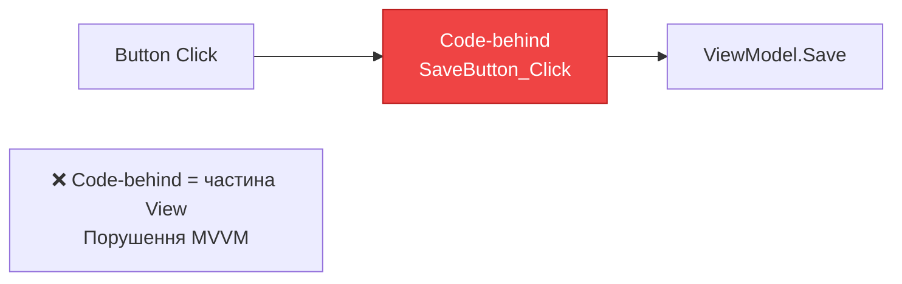

# Commands: Від event handlers до декларативних команд

## Вступ

У попередніх статтях ми створили [BaseViewModel](23.viewmodel-implementation) з `INotifyPropertyChanged` та валідацією. Але залишилася одна проблема: **як зв'язати дії користувача (натискання кнопок, меню) з логікою у ViewModel?**

Традиційний підхід WinForms — event handlers у code-behind:

```csharp
// MainWindow.xaml.cs
public partial class MainWindow : Window
{
    private MainViewModel _viewModel;
    
    public MainWindow()
    {
        InitializeComponent();
        _viewModel = new MainViewModel();
        DataContext = _viewModel;
    }
    
    private void SaveButton_Click(object sender, RoutedEventArgs e)
    {
        // ❌ Логіка у code-behind — порушення MVVM
        _viewModel.Save();
    }
    
    private void DeleteButton_Click(object sender, RoutedEventArgs e)
    {
        // ❌ Знову логіка у code-behind
        _viewModel.Delete();
    }
    
    private void RefreshButton_Click(object sender, RoutedEventArgs e)
    {
        // ❌ І знову
        _viewModel.Refresh();
    }
}
```

**Проблеми:**

- ❌ **Порушення MVVM** — логіка у code-behind, а не у ViewModel
- ❌ **Untestable** — як написати unit-test для `SaveButton_Click`?
- ❌ **Дублювання** — той самий патерн для кожної кнопки
- ❌ **Немає CanExecute** — як відключити кнопку, коли дія неможлива?
- ❌ **Keyboard shortcuts** — як прив'язати Ctrl+S до Save?

**Рішення:** **ICommand** — інтерфейс для декларативного зв'язування дій з ViewModel.

::note
**Для кого ця стаття?** Якщо ви вже знайомі з [MVVM Pattern](22.mvvm-pattern) та [ViewModel Implementation](23.viewmodel-implementation), ця стаття покаже, як замінити event handlers на Commands для чистої MVVM-архітектури.
::

---

## Проблема event handlers у MVVM

Розберемо детально, чому event handlers — це антипатерн для MVVM.

### Порушення золотого правила: ViewModel не знає View

**Золоте правило MVVM:** ViewModel не має посилань на View. Але event handlers живуть у code-behind (частина View).

```csharp
// XAML
<Button Content="Зберегти" Click="SaveButton_Click"/>

// Code-behind (частина View)
private void SaveButton_Click(object sender, RoutedEventArgs e)
{
    // Виклик ViewModel
    _viewModel.Save();
}
```

**Проблема:** Логіка розділена між View (code-behind) та ViewModel. Це не чистий MVVM.

::mermaid

::


### Неможливість тестування

**Проблема:** Як написати unit-test для event handler?

```csharp
[Test]
public void SaveButton_ShouldSaveData()
{
    // ❌ Як викликати SaveButton_Click без створення UI?
    var window = new MainWindow();
    
    // ❌ Як симулювати клік?
    window.SaveButton_Click(null, null);
    
    // ❌ Як перевірити результат?
}
```

**Наслідки:**

- Потрібен весь UI для тестування логіки
- Тести повільні (створення вікон)
- Тести крихкі (зміна UI ламає тести)

### Відсутність CanExecute

**Проблема:** Як відключити кнопку, коли дія неможлива?

```csharp
// ❌ Ручне управління IsEnabled
private void TextBox_TextChanged(object sender, TextChangedEventArgs e)
{
    // При кожній зміні тексту — перевіряти чи можна зберегти
    SaveButton.IsEnabled = !string.IsNullOrWhiteSpace(txtName.Text);
}

private void SaveButton_Click(object sender, RoutedEventArgs e)
{
    _viewModel.Save();
}
```

**Проблеми:**

- Ручне управління `IsEnabled` у кількох місцях
- Легко забути оновити `IsEnabled`
- Логіка розкидана по code-behind

### Дублювання коду

**Проблема:** Той самий патерн для кожної кнопки.

```csharp
private void SaveButton_Click(object sender, RoutedEventArgs e)
{
    _viewModel.Save();
}

private void DeleteButton_Click(object sender, RoutedEventArgs e)
{
    _viewModel.Delete();
}

private void RefreshButton_Click(object sender, RoutedEventArgs e)
{
    _viewModel.Refresh();
}

private void ExportButton_Click(object sender, RoutedEventArgs e)
{
    _viewModel.Export();
}

// ... ще 10 кнопок
```

Якщо у додатку 20 кнопок — 20 event handlers з однаковим патерном.

---

## ICommand: Інтерфейс для команд

WPF надає інтерфейс `ICommand` для декларативного зв'язування дій з ViewModel.

### Структура ICommand

**Інтерфейс:**

```csharp
public interface ICommand
{
    // Виконати команду
    void Execute(object? parameter);
    
    // Чи можна виконати команду (для IsEnabled)
    bool CanExecute(object? parameter);
    
    // Подія при зміні CanExecute
    event EventHandler CanExecuteChanged;
}
```

**Як це працює:**

::mermaid
```mermaid
sequenceDiagram
    participant User as Користувач
    participant Button as Button
    participant Command as ICommand
    participant VM as ViewModel
    
    Note over Button,Command: Ініціалізація
    Button->>Command: Підписка на CanExecuteChanged
    Button->>Command: CanExecute()?
    Command-->>Button: true
    Button->>Button: IsEnabled = true
    
    Note over User,VM: Користувач натискає кнопку
    User->>Button: Click
    Button->>Command: CanExecute()?
    Command-->>Button: true
    Button->>Command: Execute(parameter)
    Command->>VM: Виконати логіку
    
    Note over Command,VM: Зміна стану
    VM->>Command: RaiseCanExecuteChanged()
    Command->>Button: CanExecuteChanged event
    Button->>Command: CanExecute()?
    Command-->>Button: false
    Button->>Button: IsEnabled = false
    
    style Command fill:#3b82f6,stroke:#1d4ed8,color:#ffffff
    style VM fill:#10b981,stroke:#059669,color:#ffffff
```
::

**Ключові моменти:**

1. **Execute** — метод, що виконує дію (аналог event handler)
2. **CanExecute** — метод, що визначає, чи можна виконати дію (для `IsEnabled`)
3. **CanExecuteChanged** — подія, що сповіщає UI про зміну `CanExecute`


### Використання ICommand у XAML

**XAML з Command:**

```xml
<Button Content="Зберегти" Command="{Binding SaveCommand}"/>
```

**ViewModel:**

```csharp
public class MainViewModel : BaseViewModel
{
    public ICommand SaveCommand { get; }
    
    public MainViewModel()
    {
        SaveCommand = new RelayCommand(Save, CanSave);
    }
    
    private void Save()
    {
        // Логіка збереження
    }
    
    private bool CanSave()
    {
        // Чи можна зберегти?
        return !string.IsNullOrWhiteSpace(Name);
    }
}
```

**Переваги:**

- ✅ Логіка у ViewModel, а не у code-behind
- ✅ Автоматичне управління `IsEnabled` через `CanExecute`
- ✅ Легко тестувати — `SaveCommand.Execute(null)`
- ✅ Декларативний синтаксис у XAML

**Порівняння:**

| Аспект | Event Handler | ICommand |
|--------|--------------|----------|
| Логіка | Code-behind (View) | ViewModel |
| IsEnabled | Ручне управління | Автоматичне через CanExecute |
| Тестування | Складно (потрібен UI) | Легко (без UI) |
| XAML | `Click="SaveButton_Click"` | `Command="{Binding SaveCommand}"` |
| Keyboard shortcuts | Складно | Легко через InputBindings |

---

## RelayCommand: Ручна реалізація

WPF не надає готової реалізації `ICommand`. Потрібно створити власну або використати бібліотеку. Почнемо з ручної реалізації для розуміння механізму.

### Мінімальна реалізація RelayCommand

**Мета:** Створити універсальний клас, що реалізує `ICommand` через делегати.

```csharp
using System;
using System.Windows.Input;

public class RelayCommand : ICommand
{
    private readonly Action _execute;
    private readonly Func<bool> _canExecute;
    
    // Конструктор
    public RelayCommand(Action execute, Func<bool> canExecute = null)
    {
        _execute = execute ?? throw new ArgumentNullException(nameof(execute));
        _canExecute = canExecute;
    }
    
    // Подія при зміні CanExecute
    public event EventHandler CanExecuteChanged
    {
        add { CommandManager.RequerySuggested += value; }
        remove { CommandManager.RequerySuggested -= value; }
    }
    
    // Чи можна виконати команду
    public bool CanExecute(object parameter)
    {
        return _canExecute == null || _canExecute();
    }
    
    // Виконати команду
    public void Execute(object parameter)
    {
        _execute();
    }
}
```

**Ключові моменти:**

1. **Делегати** — `Action` для `Execute`, `Func<bool>` для `CanExecute`
2. **CommandManager.RequerySuggested** — WPF автоматично перевіряє `CanExecute` при зміні фокусу, натисканні клавіш
3. **Nullable CanExecute** — якщо не передано, команда завжди доступна

### Використання RelayCommand

**ViewModel:**

```csharp
public class PersonViewModel : BaseViewModel
{
    private string _name;
    public string Name
    {
        get => _name;
        set => SetProperty(ref _name, value);
    }
    
    private int _age;
    public int Age
    {
        get => _age;
        set => SetProperty(ref _age, value);
    }
    
    public ICommand SaveCommand { get; }
    public ICommand ClearCommand { get; }
    
    public PersonViewModel()
    {
        // Команда з CanExecute
        SaveCommand = new RelayCommand(Save, CanSave);
        
        // Команда без CanExecute (завжди доступна)
        ClearCommand = new RelayCommand(Clear);
    }
    
    private void Save()
    {
        // Логіка збереження
        MessageBox.Show($"Збережено: {Name}, {Age} років");
    }
    
    private bool CanSave()
    {
        // Можна зберегти тільки якщо ім'я не пусте та вік > 0
        return !string.IsNullOrWhiteSpace(Name) && Age > 0;
    }
    
    private void Clear()
    {
        Name = string.Empty;
        Age = 0;
    }
}
```

**XAML:**

```xml
<StackPanel Margin="20">
    <TextBlock Text="Ім'я:"/>
    <TextBox Text="{Binding Name, UpdateSourceTrigger=PropertyChanged}"/>
    
    <TextBlock Text="Вік:" Margin="0,10,0,0"/>
    <TextBox Text="{Binding Age, UpdateSourceTrigger=PropertyChanged}"/>
    
    <StackPanel Orientation="Horizontal" Margin="0,20,0,0">
        <!-- Кнопка активна тільки якщо CanSave повертає true -->
        <Button Content="Зберегти" Command="{Binding SaveCommand}" Width="100"/>
        
        <!-- Кнопка завжди активна -->
        <Button Content="Очистити" Command="{Binding ClearCommand}" Width="100" Margin="10,0,0,0"/>
    </StackPanel>
</StackPanel>
```

**Що відбувається:**

1. Користувач вводить текст у `Name` → `PropertyChanged` → WPF перевіряє `CanExecute` → оновлює `IsEnabled`
2. Користувач натискає "Зберегти" → WPF викликає `Execute` → виконується метод `Save`


### CommandManager.RequerySuggested: Автоматична перевірка CanExecute

**Що таке CommandManager.RequerySuggested?**

Це подія WPF, що викликається автоматично при:

- Зміні фокусу між контролами
- Натисканні клавіш
- Кліку миші
- Зміні вікна

WPF використовує цю подію для автоматичної перевірки `CanExecute` всіх команд.

**Діаграма:**

::mermaid
```mermaid
sequenceDiagram
    participant User as Користувач
    participant TextBox as TextBox
    participant WPF as WPF CommandManager
    participant Command as SaveCommand
    participant Button as Button
    
    User->>TextBox: Вводить текст "Іван"
    TextBox->>TextBox: PropertyChanged
    WPF->>WPF: RequerySuggested event
    WPF->>Command: CanExecute()?
    Command-->>WPF: true (ім'я не пусте)
    WPF->>Button: IsEnabled = true
    
    User->>TextBox: Видаляє текст
    TextBox->>TextBox: PropertyChanged
    WPF->>WPF: RequerySuggested event
    WPF->>Command: CanExecute()?
    Command-->>WPF: false (ім'я пусте)
    WPF->>Button: IsEnabled = false
    
    style WPF fill:#3b82f6,stroke:#1d4ed8,color:#ffffff
    style Command fill:#10b981,stroke:#059669,color:#ffffff
```
::

**Переваги:**

- ✅ Автоматична перевірка — не потрібно вручну викликати `RaiseCanExecuteChanged`
- ✅ Працює для всіх команд одночасно
- ✅ Оптимізовано WPF — перевірка тільки коли потрібно

**Недоліки:**

- ⚠️ Не завжди спрацьовує — якщо зміна відбулася у фоновому потоці
- ⚠️ Може спрацьовувати занадто часто — performance overhead

### Ручний виклик RaiseCanExecuteChanged

Іноді потрібно вручну сповістити про зміну `CanExecute`:

```csharp
public class RelayCommand : ICommand
{
    // ... попередній код
    
    // Метод для ручного виклику CanExecuteChanged
    public void RaiseCanExecuteChanged()
    {
        CommandManager.InvalidateRequerySuggested();
    }
}
```

**Використання:**

```csharp
public class MainViewModel : BaseViewModel
{
    private bool _isBusy;
    public bool IsBusy
    {
        get => _isBusy;
        set
        {
            if (SetProperty(ref _isBusy, value))
            {
                // Вручну сповістити про зміну CanExecute
                ((RelayCommand)SaveCommand).RaiseCanExecuteChanged();
            }
        }
    }
    
    public ICommand SaveCommand { get; }
    
    public MainViewModel()
    {
        SaveCommand = new RelayCommand(Save, CanSave);
    }
    
    private bool CanSave()
    {
        return !IsBusy;  // Не можна зберегти під час завантаження
    }
}
```

---

## RelayCommand<T>: Команди з параметром

Іноді потрібно передати параметр з View у команду. Наприклад, видалити конкретний елемент зі списку.

### Реалізація RelayCommand<T>

```csharp
public class RelayCommand<T> : ICommand
{
    private readonly Action<T> _execute;
    private readonly Func<T, bool> _canExecute;
    
    public RelayCommand(Action<T> execute, Func<T, bool> canExecute = null)
    {
        _execute = execute ?? throw new ArgumentNullException(nameof(execute));
        _canExecute = canExecute;
    }
    
    public event EventHandler CanExecuteChanged
    {
        add { CommandManager.RequerySuggested += value; }
        remove { CommandManager.RequerySuggested -= value; }
    }
    
    public bool CanExecute(object parameter)
    {
        return _canExecute == null || _canExecute((T)parameter);
    }
    
    public void Execute(object parameter)
    {
        _execute((T)parameter);
    }
}
```

### Використання CommandParameter

**ViewModel:**

```csharp
public class TodoViewModel : BaseViewModel
{
    public ObservableCollection<TodoItem> Items { get; set; }
    
    public ICommand DeleteCommand { get; }
    
    public TodoViewModel()
    {
        Items = new ObservableCollection<TodoItem>
        {
            new TodoItem { Title = "Завдання 1" },
            new TodoItem { Title = "Завдання 2" },
            new TodoItem { Title = "Завдання 3" }
        };
        
        DeleteCommand = new RelayCommand<TodoItem>(Delete, CanDelete);
    }
    
    private void Delete(TodoItem item)
    {
        Items.Remove(item);
    }
    
    private bool CanDelete(TodoItem item)
    {
        return item != null;
    }
}
```

**XAML:**

```xml
<ListBox ItemsSource="{Binding Items}">
    <ListBox.ItemTemplate>
        <DataTemplate>
            <StackPanel Orientation="Horizontal">
                <TextBlock Text="{Binding Title}" Width="200"/>
                
                <!-- CommandParameter передає поточний елемент -->
                <Button Content="Видалити" 
                        Command="{Binding DataContext.DeleteCommand, RelativeSource={RelativeSource AncestorType=ListBox}}"
                        CommandParameter="{Binding}"/>
            </StackPanel>
        </DataTemplate>
    </ListBox.ItemTemplate>
</ListBox>
```

**Ключові моменти:**

1. **`CommandParameter="{Binding}"`** — передає поточний `TodoItem` у команду
2. **`RelativeSource={RelativeSource AncestorType=ListBox}`** — знаходить `DataContext` батьківського `ListBox` (бо всередині `DataTemplate` контекст — це `TodoItem`)


### Візуалізація з CommandParameter

::wpf-preview{title="Todo список з командою видалення"}
```xml
<StackPanel Margin="20">
    <TextBlock Text="Список завдань:" FontWeight="Bold" FontSize="16" Margin="0,0,0,10"/>
    
    <ListBox Height="200">
        <ListBoxItem>
            <StackPanel Orientation="Horizontal">
                <TextBlock Text="Завдання 1" Width="200" VerticalAlignment="Center"/>
                <Button Content="Видалити" 
                        Command="{Binding DeleteCommand}" 
                        CommandParameter="Item1"
                        Padding="10,5"/>
            </StackPanel>
        </ListBoxItem>
        <ListBoxItem>
            <StackPanel Orientation="Horizontal">
                <TextBlock Text="Завдання 2" Width="200" VerticalAlignment="Center"/>
                <Button Content="Видалити" 
                        Command="{Binding DeleteCommand}" 
                        CommandParameter="Item2"
                        Padding="10,5"/>
            </StackPanel>
        </ListBoxItem>
        <ListBoxItem>
            <StackPanel Orientation="Horizontal">
                <TextBlock Text="Завдання 3" Width="200" VerticalAlignment="Center"/>
                <Button Content="Видалити" 
                        Command="{Binding DeleteCommand}" 
                        CommandParameter="Item3"
                        Padding="10,5"/>
            </StackPanel>
        </ListBoxItem>
    </ListBox>
    
    <TextBlock Text="Натисніть 'Видалити' для видалення завдання" 
               Margin="0,10,0,0" 
               FontStyle="Italic" 
               Foreground="Gray"/>
</StackPanel>
```

```csharp
// Code-behind для демонстрації
public partial class MainWindow : Window
{
    public MainWindow()
    {
        InitializeComponent();
        DataContext = new TodoViewModel();
    }
}

public class TodoViewModel
{
    public ICommand DeleteCommand { get; }
    
    public TodoViewModel()
    {
        DeleteCommand = new RelayCommand<string>(
            item => { /* Видалення */ },
            item => item != null
        );
    }
}
```
::

::note
Превью використовує Avalonia і показує статичний список. У реальному WPF-проєкті з `ObservableCollection` елементи видалятимуться динамічно.
::

---

## AsyncRelayCommand: Асинхронні команди

Багато операцій у сучасних додатках асинхронні: завантаження даних з API, збереження у БД, експорт файлів. Для цього потрібна асинхронна версія `RelayCommand`.

### Проблема синхронних команд

**Проблема:** Якщо `Execute` виконує довгу операцію, UI зависає.

```csharp
public ICommand LoadDataCommand { get; }

public MainViewModel()
{
    LoadDataCommand = new RelayCommand(LoadData);
}

private void LoadData()
{
    // ❌ Синхронна операція — UI зависає на 5 секунд
    Thread.Sleep(5000);
    
    var data = _apiService.GetData();
    Items = new ObservableCollection<Item>(data);
}
```

**Наслідки:**

- UI зависає під час виконання
- Користувач не може взаємодіяти з додатком
- Немає індикатора завантаження

### Реалізація AsyncRelayCommand

```csharp
using System;
using System.Threading.Tasks;
using System.Windows.Input;

public class AsyncRelayCommand : ICommand
{
    private readonly Func<Task> _execute;
    private readonly Func<bool> _canExecute;
    private bool _isExecuting;
    
    public AsyncRelayCommand(Func<Task> execute, Func<bool> canExecute = null)
    {
        _execute = execute ?? throw new ArgumentNullException(nameof(execute));
        _canExecute = canExecute;
    }
    
    public event EventHandler CanExecuteChanged
    {
        add { CommandManager.RequerySuggested += value; }
        remove { CommandManager.RequerySuggested -= value; }
    }
    
    public bool CanExecute(object parameter)
    {
        // Не можна виконати, якщо вже виконується
        return !_isExecuting && (_canExecute == null || _canExecute());
    }
    
    public async void Execute(object parameter)
    {
        if (_isExecuting)
            return;
        
        _isExecuting = true;
        RaiseCanExecuteChanged();
        
        try
        {
            await _execute();
        }
        finally
        {
            _isExecuting = false;
            RaiseCanExecuteChanged();
        }
    }
    
    public void RaiseCanExecuteChanged()
    {
        CommandManager.InvalidateRequerySuggested();
    }
}
```

**Ключові моменти:**

1. **`Func<Task>`** — делегат повертає `Task` для асинхронного виконання
2. **`_isExecuting`** — прапорець для запобігання повторному виконанню
3. **`async void Execute`** — WPF вимагає `void`, але всередині використовуємо `await`
4. **`try-finally`** — гарантуємо скидання `_isExecuting` навіть при помилці


### Використання AsyncRelayCommand з IsBusy

**ViewModel:**

```csharp
public class MainViewModel : BaseViewModel
{
    private bool _isBusy;
    public bool IsBusy
    {
        get => _isBusy;
        set => SetProperty(ref _isBusy, value);
    }
    
    private ObservableCollection<Item> _items;
    public ObservableCollection<Item> Items
    {
        get => _items;
        set => SetProperty(ref _items, value);
    }
    
    public ICommand LoadDataCommand { get; }
    
    public MainViewModel()
    {
        LoadDataCommand = new AsyncRelayCommand(LoadDataAsync);
    }
    
    private async Task LoadDataAsync()
    {
        IsBusy = true;
        
        try
        {
            // Симуляція завантаження з API
            await Task.Delay(2000);
            
            var data = await _apiService.GetDataAsync();
            Items = new ObservableCollection<Item>(data);
        }
        catch (Exception ex)
        {
            // Обробка помилки
            MessageBox.Show($"Помилка: {ex.Message}");
        }
        finally
        {
            IsBusy = false;
        }
    }
}
```

**XAML з індикатором завантаження:**

```xml
<Grid>
    <StackPanel>
        <Button Content="Завантажити дані" 
                Command="{Binding LoadDataCommand}"
                IsEnabled="{Binding IsBusy, Converter={StaticResource InverseBooleanConverter}}"/>
        
        <ListBox ItemsSource="{Binding Items}" Margin="0,10,0,0"/>
    </StackPanel>
    
    <!-- Індикатор завантаження -->
    <Grid Background="#80000000" Visibility="{Binding IsBusy, Converter={StaticResource BooleanToVisibilityConverter}}">
        <StackPanel HorizontalAlignment="Center" VerticalAlignment="Center">
            <ProgressBar IsIndeterminate="True" Width="200" Height="20"/>
            <TextBlock Text="Завантаження..." 
                       Foreground="White" 
                       Margin="0,10,0,0" 
                       HorizontalAlignment="Center"/>
        </StackPanel>
    </Grid>
</Grid>
```

**Що відбувається:**

1. Користувач натискає "Завантажити дані"
2. `IsBusy = true` → кнопка відключається, з'являється індикатор
3. Асинхронне завантаження даних (UI не зависає)
4. `IsBusy = false` → кнопка активується, індикатор зникає

### Обробка помилок у AsyncRelayCommand

**Проблема:** Якщо у `Execute` виникає виняток, він "проковтується" через `async void`.

**Рішення:** Обробляти винятки всередині `Execute`:

```csharp
public class AsyncRelayCommand : ICommand
{
    private readonly Func<Task> _execute;
    private readonly Action<Exception> _onException;
    
    public AsyncRelayCommand(Func<Task> execute, Action<Exception> onException = null)
    {
        _execute = execute;
        _onException = onException;
    }
    
    public async void Execute(object parameter)
    {
        if (_isExecuting)
            return;
        
        _isExecuting = true;
        RaiseCanExecuteChanged();
        
        try
        {
            await _execute();
        }
        catch (Exception ex)
        {
            // Викликати callback для обробки помилки
            _onException?.Invoke(ex);
        }
        finally
        {
            _isExecuting = false;
            RaiseCanExecuteChanged();
        }
    }
}
```

**Використання:**

```csharp
public MainViewModel()
{
    LoadDataCommand = new AsyncRelayCommand(
        execute: LoadDataAsync,
        onException: ex => ErrorMessage = ex.Message
    );
}

private string _errorMessage;
public string ErrorMessage
{
    get => _errorMessage;
    set => SetProperty(ref _errorMessage, value);
}
```

---

## InputBindings: Keyboard shortcuts

Команди можна прив'язати не тільки до кнопок, а й до клавіатурних скорочень.

### KeyBinding для команд

**XAML:**

```xml
<Window x:Class="MyApp.MainWindow"
        xmlns="http://schemas.microsoft.com/winfx/2006/xaml/presentation"
        xmlns:x="http://schemas.microsoft.com/winfx/2006/xaml">
    
    <!-- Прив'язка клавіатурних скорочень -->
    <Window.InputBindings>
        <KeyBinding Key="S" Modifiers="Ctrl" Command="{Binding SaveCommand}"/>
        <KeyBinding Key="N" Modifiers="Ctrl" Command="{Binding NewCommand}"/>
        <KeyBinding Key="O" Modifiers="Ctrl" Command="{Binding OpenCommand}"/>
        <KeyBinding Key="F5" Command="{Binding RefreshCommand}"/>
        <KeyBinding Key="Delete" Command="{Binding DeleteCommand}"/>
    </Window.InputBindings>
    
    <StackPanel Margin="20">
        <Button Content="Зберегти (Ctrl+S)" Command="{Binding SaveCommand}"/>
        <Button Content="Новий (Ctrl+N)" Command="{Binding NewCommand}" Margin="0,10,0,0"/>
        <Button Content="Відкрити (Ctrl+O)" Command="{Binding OpenCommand}" Margin="0,10,0,0"/>
        <Button Content="Оновити (F5)" Command="{Binding RefreshCommand}" Margin="0,10,0,0"/>
    </StackPanel>
</Window>
```

**Переваги:**

- ✅ Та сама команда для кнопки та клавіатурного скорочення
- ✅ `CanExecute` працює для обох
- ✅ Стандартні скорочення (Ctrl+S, Ctrl+N) працюють автоматично

### MouseBinding для команд

**XAML:**

```xml
<Window.InputBindings>
    <!-- Подвійний клік миші -->
    <MouseBinding Gesture="LeftDoubleClick" Command="{Binding OpenCommand}"/>
    
    <!-- Клік правою кнопкою -->
    <MouseBinding MouseAction="RightClick" Command="{Binding ShowContextMenuCommand}"/>
</Window.InputBindings>
```

### InputBindings на контролах

**XAML:**

```xml
<ListBox ItemsSource="{Binding Items}" SelectedItem="{Binding SelectedItem}">
    <ListBox.InputBindings>
        <!-- Delete для видалення вибраного елемента -->
        <KeyBinding Key="Delete" Command="{Binding DeleteCommand}" CommandParameter="{Binding SelectedItem}"/>
        
        <!-- Enter для редагування -->
        <KeyBinding Key="Enter" Command="{Binding EditCommand}" CommandParameter="{Binding SelectedItem}"/>
    </ListBox.InputBindings>
</ListBox>
```


---

## 🔵 Recap: ООП концепції у Commands

Для студентів зі слабким розумінням ООП — коротке нагадування ключових концепцій, що використовуються у Commands.

### Делегати: Action та Func

**Що таке делегат?**

Делегат — це **посилання на метод**. Можна передати метод як параметр іншому методу.

```csharp
// Делегат Action — метод без повернення значення
Action greet = () => Console.WriteLine("Привіт!");
greet();  // Виклик методу через делегат

// Делегат Action<T> — метод з параметром
Action<string> greetPerson = name => Console.WriteLine($"Привіт, {name}!");
greetPerson("Іван");

// Делегат Func<T> — метод з поверненням значення
Func<bool> canSave = () => !string.IsNullOrWhiteSpace(Name);
bool result = canSave();
```

**Чому це важливо для Commands?**

```csharp
public class RelayCommand : ICommand
{
    private readonly Action _execute;  // Делегат для Execute
    private readonly Func<bool> _canExecute;  // Делегат для CanExecute
    
    public RelayCommand(Action execute, Func<bool> canExecute = null)
    {
        _execute = execute;
        _canExecute = canExecute;
    }
    
    public void Execute(object parameter)
    {
        _execute();  // Виклик делегата
    }
}
```

**Використання:**

```csharp
// Передаємо методи як делегати
SaveCommand = new RelayCommand(Save, CanSave);

// Save та CanSave — це методи, але передаються як делегати
private void Save() { /* ... */ }
private bool CanSave() { /* ... */ }
```

**Аналогія:** Делегат — це як пульт дистанційного керування. Ви не знаєте, що всередині телевізора, але можете викликати дію (увімкнути, вимкнути) через пульт.

### Інтерфейси: ICommand як контракт

**Що таке інтерфейс?**

Інтерфейс — це **контракт**, який клас зобов'язується виконати.

```csharp
// Інтерфейс — контракт
public interface ICommand
{
    void Execute(object parameter);
    bool CanExecute(object parameter);
    event EventHandler CanExecuteChanged;
}

// Клас, що виконує контракт
public class RelayCommand : ICommand
{
    // Реалізація контракту
    public void Execute(object parameter) { /* ... */ }
    public bool CanExecute(object parameter) { /* ... */ }
    public event EventHandler CanExecuteChanged;
}
```

**Чому це важливо для Commands?**

- WPF знає про інтерфейс `ICommand`
- Будь-який клас, що реалізує `ICommand`, може бути командою
- `RelayCommand`, `AsyncRelayCommand`, `DelegateCommand` — всі реалізують `ICommand`

**Аналогія:** Інтерфейс — це як розетка. Будь-який пристрій з відповідною вилкою (реалізацією інтерфейсу) може підключитися.

### Async/Await: Асинхронне програмування

**Що таке async/await?**

`async/await` — це механізм для асинхронного виконання коду без блокування UI.

```csharp
// Синхронний метод — блокує UI
private void LoadData()
{
    Thread.Sleep(5000);  // ❌ UI зависає на 5 секунд
    var data = _apiService.GetData();
}

// Асинхронний метод — не блокує UI
private async Task LoadDataAsync()
{
    await Task.Delay(5000);  // ✅ UI не зависає
    var data = await _apiService.GetDataAsync();
}
```

**Чому це важливо для Commands?**

- Довгі операції (API, БД) не блокують UI
- Користувач може взаємодіяти з додатком під час завантаження
- Можна показати індикатор завантаження

**Аналогія:** Синхронний код — це як стояти в черзі у банку. Асинхронний код — це як замовити піцу онлайн і займатися своїми справами, поки вона готується.

::tip
**Детальніше про ООП:** Якщо концепції делегатів, інтерфейсів або async/await незрозумілі, рекомендую повернутися до розділу [ООП: Основи](../02.oop/) та [Асинхронне програмування](../08.async/) для глибшого розуміння.
::

---

## Практичні завдання

### Рівень 1: Кнопка Save з CanExecute

**Мета:** Навчитися створювати команди з автоматичним управлінням `IsEnabled`.

**Завдання:**

Створіть форму для введення даних користувача:

1. **Властивості:**
   - `FirstName` (string)
   - `LastName` (string)
   - `Email` (string)

2. **Команда:**
   - `SaveCommand` — зберігає дані
   - `CanExecute` — повертає `true` тільки якщо всі поля заповнені

3. **UI:**
   - Три TextBox для введення
   - Кнопка "Зберегти" (активна тільки якщо всі поля заповнені)

**Критерії успіху:**

- Кнопка відключена, якщо хоча б одне поле пусте
- Кнопка активується автоматично при заповненні всіх полів
- При натисканні кнопки — показати MessageBox з даними
- Всі тести проходять

**Підказка:**

```csharp
public class UserViewModel : BaseViewModel
{
    private string _firstName;
    public string FirstName
    {
        get => _firstName;
        set => SetProperty(ref _firstName, value);
    }
    
    // TODO: Додати LastName, Email
    
    public ICommand SaveCommand { get; }
    
    public UserViewModel()
    {
        SaveCommand = new RelayCommand(Save, CanSave);
    }
    
    private void Save()
    {
        MessageBox.Show($"Збережено: {FirstName} {LastName}, {Email}");
    }
    
    private bool CanSave()
    {
        // TODO: Перевірити, чи всі поля заповнені
        return !string.IsNullOrWhiteSpace(FirstName) &&
               !string.IsNullOrWhiteSpace(LastName) &&
               !string.IsNullOrWhiteSpace(Email);
    }
}
```

**Тести:**

```csharp
[Test]
public void SaveCommand_ShouldBeDisabled_WhenFieldsEmpty()
{
    var vm = new UserViewModel();
    
    Assert.IsFalse(vm.SaveCommand.CanExecute(null));
}

[Test]
public void SaveCommand_ShouldBeEnabled_WhenAllFieldsFilled()
{
    var vm = new UserViewModel
    {
        FirstName = "Іван",
        LastName = "Петренко",
        Email = "ivan@example.com"
    };
    
    Assert.IsTrue(vm.SaveCommand.CanExecute(null));
}

[Test]
public void SaveCommand_ShouldExecute_WhenEnabled()
{
    var vm = new UserViewModel
    {
        FirstName = "Іван",
        LastName = "Петренко",
        Email = "ivan@example.com"
    };
    
    // Не повинно кинути виняток
    vm.SaveCommand.Execute(null);
}
```


---

### Рівень 2: CRUD-застосунок з Commands

**Мета:** Реалізувати повний CRUD (Create, Read, Update, Delete) через команди.

**Завдання:**

Створіть застосунок для управління списком контактів:

1. **Model:**
   - `Contact` (Id, Name, Phone, Email)

2. **ViewModel:**
   - `ObservableCollection<Contact> Contacts`
   - `Contact SelectedContact`
   - `AddCommand` — додати новий контакт
   - `EditCommand` — редагувати вибраний контакт
   - `DeleteCommand` — видалити вибраний контакт
   - `RefreshCommand` — оновити список

3. **UI:**
   - ListBox зі списком контактів
   - Форма для редагування (Name, Phone, Email)
   - Кнопки: Додати, Зберегти, Видалити, Оновити

4. **CanExecute:**
   - `EditCommand` — активна тільки якщо вибрано контакт
   - `DeleteCommand` — активна тільки якщо вибрано контакт
   - `AddCommand` — завжди активна

**Критерії успіху:**

- Всі CRUD операції працюють
- Кнопки автоматично активуються/деактивуються
- При виборі контакту — форма заповнюється його даними
- Всі тести проходять

**Підказка для ViewModel:**

```csharp
public class ContactsViewModel : BaseViewModel
{
    public ObservableCollection<Contact> Contacts { get; set; }
    
    private Contact _selectedContact;
    public Contact SelectedContact
    {
        get => _selectedContact;
        set => SetProperty(ref _selectedContact, value);
    }
    
    public ICommand AddCommand { get; }
    public ICommand EditCommand { get; }
    public ICommand DeleteCommand { get; }
    public ICommand RefreshCommand { get; }
    
    public ContactsViewModel()
    {
        Contacts = new ObservableCollection<Contact>();
        
        AddCommand = new RelayCommand(Add);
        EditCommand = new RelayCommand(Edit, CanEdit);
        DeleteCommand = new RelayCommand(Delete, CanDelete);
        RefreshCommand = new RelayCommand(Refresh);
        
        LoadData();
    }
    
    private void Add()
    {
        var newContact = new Contact { Name = "Новий контакт" };
        Contacts.Add(newContact);
        SelectedContact = newContact;
    }
    
    private void Edit()
    {
        // Логіка редагування
    }
    
    private bool CanEdit()
    {
        return SelectedContact != null;
    }
    
    private void Delete()
    {
        if (SelectedContact != null)
        {
            Contacts.Remove(SelectedContact);
        }
    }
    
    private bool CanDelete()
    {
        return SelectedContact != null;
    }
    
    private void Refresh()
    {
        LoadData();
    }
    
    private void LoadData()
    {
        // Завантаження даних
    }
}
```

**Тести:**

```csharp
[Test]
public void AddCommand_ShouldAddNewContact()
{
    var vm = new ContactsViewModel();
    int initialCount = vm.Contacts.Count;
    
    vm.AddCommand.Execute(null);
    
    Assert.AreEqual(initialCount + 1, vm.Contacts.Count);
}

[Test]
public void DeleteCommand_ShouldBeDisabled_WhenNoSelection()
{
    var vm = new ContactsViewModel();
    vm.SelectedContact = null;
    
    Assert.IsFalse(vm.DeleteCommand.CanExecute(null));
}

[Test]
public void DeleteCommand_ShouldRemoveContact()
{
    var vm = new ContactsViewModel();
    var contact = new Contact { Name = "Test" };
    vm.Contacts.Add(contact);
    vm.SelectedContact = contact;
    
    vm.DeleteCommand.Execute(null);
    
    Assert.IsFalse(vm.Contacts.Contains(contact));
}
```

---

### Рівень 3: AsyncRelayCommand з ProgressBar та Cancel

**Мета:** Реалізувати асинхронну команду з індикатором завантаження та можливістю скасування.

**Завдання:**

Створіть застосунок для завантаження файлів:

1. **ViewModel:**
   - `LoadDataCommand` (AsyncRelayCommand) — завантажує дані з API
   - `CancelCommand` — скасовує завантаження
   - `IsBusy` — чи відбувається завантаження
   - `Progress` — прогрес завантаження (0-100)
   - `StatusMessage` — повідомлення про статус

2. **Функціональність:**
   - Симуляція завантаження з прогресом (0% → 100%)
   - Можливість скасувати завантаження
   - Індикатор завантаження (ProgressBar)
   - Обробка помилок

3. **UI:**
   - Кнопка "Завантажити" (відключена під час завантаження)
   - Кнопка "Скасувати" (активна тільки під час завантаження)
   - ProgressBar з прогресом
   - TextBlock зі статусом

**Критерії успіху:**

- Завантаження відбувається асинхронно (UI не зависає)
- ProgressBar показує реальний прогрес
- Можна скасувати завантаження
- Обробляються помилки
- Всі тести проходять

**Підказка для AsyncRelayCommand з CancellationToken:**

```csharp
public class AsyncRelayCommand : ICommand
{
    private readonly Func<CancellationToken, Task> _execute;
    private CancellationTokenSource _cts;
    private bool _isExecuting;
    
    public AsyncRelayCommand(Func<CancellationToken, Task> execute)
    {
        _execute = execute;
    }
    
    public bool CanExecute(object parameter)
    {
        return !_isExecuting;
    }
    
    public async void Execute(object parameter)
    {
        if (_isExecuting)
            return;
        
        _isExecuting = true;
        _cts = new CancellationTokenSource();
        RaiseCanExecuteChanged();
        
        try
        {
            await _execute(_cts.Token);
        }
        catch (OperationCanceledException)
        {
            // Завантаження скасовано
        }
        finally
        {
            _isExecuting = false;
            _cts = null;
            RaiseCanExecuteChanged();
        }
    }
    
    public void Cancel()
    {
        _cts?.Cancel();
    }
    
    // ... інші методи
}
```

**Підказка для ViewModel:**

```csharp
public class DownloadViewModel : BaseViewModel
{
    private bool _isBusy;
    public bool IsBusy
    {
        get => _isBusy;
        set => SetProperty(ref _isBusy, value);
    }
    
    private int _progress;
    public int Progress
    {
        get => _progress;
        set => SetProperty(ref _progress, value);
    }
    
    private string _statusMessage;
    public string StatusMessage
    {
        get => _statusMessage;
        set => SetProperty(ref _statusMessage, value);
    }
    
    public AsyncRelayCommand LoadDataCommand { get; }
    public ICommand CancelCommand { get; }
    
    public DownloadViewModel()
    {
        LoadDataCommand = new AsyncRelayCommand(LoadDataAsync);
        CancelCommand = new RelayCommand(Cancel, CanCancel);
    }
    
    private async Task LoadDataAsync(CancellationToken cancellationToken)
    {
        IsBusy = true;
        Progress = 0;
        StatusMessage = "Завантаження...";
        
        try
        {
            for (int i = 0; i <= 100; i += 10)
            {
                // Перевірка скасування
                cancellationToken.ThrowIfCancellationRequested();
                
                // Симуляція завантаження
                await Task.Delay(500, cancellationToken);
                
                Progress = i;
                StatusMessage = $"Завантажено {i}%";
            }
            
            StatusMessage = "Завантаження завершено!";
        }
        catch (OperationCanceledException)
        {
            StatusMessage = "Завантаження скасовано";
            Progress = 0;
        }
        finally
        {
            IsBusy = false;
        }
    }
    
    private void Cancel()
    {
        LoadDataCommand.Cancel();
    }
    
    private bool CanCancel()
    {
        return IsBusy;
    }
}
```

**Тести:**

```csharp
[Test]
public async Task LoadDataCommand_ShouldUpdateProgress()
{
    var vm = new DownloadViewModel();
    
    vm.LoadDataCommand.Execute(null);
    
    await Task.Delay(1000);
    
    Assert.IsTrue(vm.Progress > 0);
}

[Test]
public async Task CancelCommand_ShouldCancelLoading()
{
    var vm = new DownloadViewModel();
    
    vm.LoadDataCommand.Execute(null);
    await Task.Delay(500);
    
    vm.CancelCommand.Execute(null);
    await Task.Delay(500);
    
    Assert.IsFalse(vm.IsBusy);
    Assert.IsTrue(vm.StatusMessage.Contains("скасовано"));
}
```


---

## Підсумок

Commands — це декларативний спосіб зв'язування дій користувача з логікою ViewModel без event handlers у code-behind.

**Ключові висновки:**

::card-group

::card{title="🎯 ICommand інтерфейс" icon="i-lucide-target"}
Execute для виконання дії, CanExecute для автоматичного IsEnabled, CanExecuteChanged для сповіщення про зміни.
::

::card{title="⚡ RelayCommand" icon="i-lucide-zap"}
Універсальна реалізація ICommand через делегати Action та Func<bool>. Працює для більшості сценаріїв.
::

::card{title="📦 CommandParameter" icon="i-lucide-package"}
Передача даних з View у команду через CommandParameter. Корисно для списків та контекстних меню.
::

::card{title="⏳ AsyncRelayCommand" icon="i-lucide-clock"}
Асинхронне виконання з Task-based Execute. IsBusy для індикатора завантаження, CancellationToken для скасування.
::

::card{title="⌨️ InputBindings" icon="i-lucide-keyboard"}
Прив'язка команд до клавіатурних скорочень (Ctrl+S, F5) та жестів миші. Та сама команда для кнопки та shortcut.
::

::card{title="✅ Testability" icon="i-lucide-check-circle"}
Команди легко тестувати — Execute та CanExecute є публічними методами. Не потрібен UI для тестування.
::

::

**Переваги Commands:**

- ✅ Чистий MVVM — логіка у ViewModel, а не у code-behind
- ✅ Автоматичне управління IsEnabled через CanExecute
- ✅ Тестованість — легко написати unit-тести
- ✅ Перевикористання — та сама команда для кнопки, меню, shortcut
- ✅ Декларативність — зрозуміло з XAML, що робить кнопка
- ✅ Асинхронність — AsyncRelayCommand для довгих операцій

**Недоліки:**

- ⚠️ Більше коду на початку (створення класів команд)
- ⚠️ Крива навчання (потрібно розуміти делегати, async/await)
- ⚠️ CommandManager.RequerySuggested може спрацьовувати занадто часто

::tip
**Коли використовувати Commands:** Для будь-якої дії користувача (кнопки, меню, shortcuts). Для простих діалогів можна обійтися event handlers, але для складних додатків Commands — must-have.
::

**Що далі?**

- **MVVM Toolkit** ([наступна стаття](25.mvvm-toolkit)) — автоматизація boilerplate через Source Generators ([ObservableProperty], [RelayCommand])
- **Avalonia MVVM** (стаття 25a) — ReactiveUI та ViewLocator для Avalonia
- **Messenger Pattern** (стаття 26) — комунікація між ViewModel без прямих посилань

---

## Словник термінів

::note{title="📚 Глосарій"}

**ICommand** — інтерфейс для декларативного зв'язування дій з ViewModel. Містить Execute, CanExecute та CanExecuteChanged.

**RelayCommand** — універсальна реалізація ICommand через делегати. Найпоширеніша реалізація для WPF.

**Execute** — метод ICommand, що виконує дію (аналог event handler).

**CanExecute** — метод ICommand, що визначає, чи можна виконати дію. Використовується для автоматичного управління IsEnabled.

**CanExecuteChanged** — подія ICommand, що сповіщає UI про зміну CanExecute.

**CommandManager.RequerySuggested** — подія WPF для автоматичної перевірки CanExecute всіх команд.

**CommandParameter** — параметр, що передається з View у команду через Binding.

**AsyncRelayCommand** — асинхронна версія RelayCommand з підтримкою Task-based Execute.

**InputBindings** — механізм для прив'язки команд до клавіатурних скорочень та жестів миші.

**KeyBinding** — прив'язка команди до клавіатурного скорочення (Ctrl+S, F5).

**CancellationToken** — механізм для скасування асинхронних операцій.

**Делегат** — посилання на метод. Action для методів без повернення значення, Func<T> для методів з поверненням значення.

::

---

## Додаткові ресурси

::card-group

::card{title="📖 Microsoft Docs: ICommand" icon="i-lucide-book-open" to="https://learn.microsoft.com/en-us/dotnet/api/system.windows.input.icommand"}
Офіційна документація про ICommand інтерфейс з прикладами.
::

::card{title="📖 Microsoft Docs: Commanding Overview" icon="i-lucide-command" to="https://learn.microsoft.com/en-us/dotnet/desktop/wpf/advanced/commanding-overview"}
Повний огляд системи команд у WPF.
::

::card{title="🎓 RelayCommand Pattern" icon="i-lucide-graduation-cap" to="https://learn.microsoft.com/en-us/archive/msdn-magazine/2009/february/patterns-wpf-apps-with-the-model-view-viewmodel-design-pattern"}
Класична стаття про RelayCommand від Josh Smith.
::

::card{title="🔧 Async Commands Best Practices" icon="i-lucide-wrench" to="https://learn.microsoft.com/en-us/archive/msdn-magazine/2014/march/async-programming-patterns-for-asynchronous-mvvm-applications-commands"}
Best practices для асинхронних команд у MVVM.
::

::card{title="📚 Попередня стаття: ViewModel Implementation" icon="i-lucide-arrow-left" to="23.viewmodel-implementation"}
Повернутися до ViewModel Implementation — BaseViewModel, валідація, DesignTime дані.
::

::card{title="📚 Наступна стаття: MVVM Toolkit" icon="i-lucide-arrow-right" to="25.mvvm-toolkit"}
Дізнатися про CommunityToolkit.Mvvm — автоматизація boilerplate через Source Generators.
::

::
