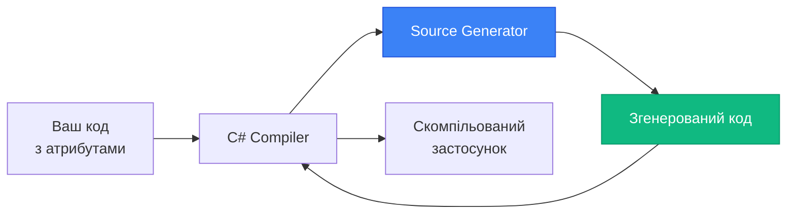

# MVVM Toolkit: MVVM без boilerplate через Source Generators

## Вступ

У попередніх статтях ми створили [BaseViewModel](23.viewmodel-implementation) з `INotifyPropertyChanged` та [Commands](24.commands) з `RelayCommand`. Але кожна властивість потребувала 3-7 рядків коду, кожна команда — 10-15 рядків. Для ViewModel з 20 властивостями та 5 командами — це 100+ рядків boilerplate-коду.

**Приклад типового ViewModel:**

```csharp
public class PersonViewModel : BaseViewModel
{
    // Властивість 1 — 7 рядків
    private string _firstName;
    public string FirstName
    {
        get => _firstName;
        set
        {
            if (SetProperty(ref _firstName, value))
            {
                OnPropertyChanged(nameof(FullName));
            }
        }
    }
    
    // Властивість 2 — 7 рядків
    private string _lastName;
    public string LastName
    {
        get => _lastName;
        set
        {
            if (SetProperty(ref _lastName, value))
            {
                OnPropertyChanged(nameof(FullName));
            }
        }
    }
    
    // Обчислювана властивість — 1 рядок
    public string FullName => $"{FirstName} {LastName}";
    
    // Команда — 15 рядків
    private RelayCommand _saveCommand;
    public ICommand SaveCommand => _saveCommand ??= new RelayCommand(Save, CanSave);
    
    private void Save()
    {
        // Логіка збереження
    }
    
    private bool CanSave()
    {
        return !string.IsNullOrWhiteSpace(FirstName);
    }
}
```

**Підрахунок:** 2 властивості (14 рядків) + 1 команда (15 рядків) = **29 рядків** для базової функціональності.

**Питання:** Чи можна це спростити?

**Відповідь:** Так! **CommunityToolkit.Mvvm** автоматизує boilerplate через **Source Generators**.

::note
**Для кого ця стаття?** Якщо ви вже знайомі з [ViewModel Implementation](23.viewmodel-implementation) та [Commands](24.commands), ця стаття покаже, як скоротити код у 5-10 разів через Source Generators.
::

---

## Проблема boilerplate: Скільки коду ми пишемо?

Розберемо детально, скільки коду потрібно для типового ViewModel без Toolkit.

### Підрахунок рядків коду

**Для 1 властивості з залежністю:**

```csharp
private string _firstName;
public string FirstName
{
    get => _firstName;
    set
    {
        if (SetProperty(ref _firstName, value))
        {
            OnPropertyChanged(nameof(FullName));
        }
    }
}
```

**7 рядків** на властивість.

**Для 1 команди:**

```csharp
private RelayCommand _saveCommand;
public ICommand SaveCommand => _saveCommand ??= new RelayCommand(Save, CanSave);

private void Save()
{
    // Логіка
}

private bool CanSave()
{
    return !string.IsNullOrWhiteSpace(FirstName);
}
```

**10-15 рядків** на команду.


**Для типового ViewModel:**

| Елемент | Кількість | Рядків на елемент | Всього рядків |
|---------|-----------|-------------------|---------------|
| Властивості | 20 | 7 | 140 |
| Команди | 5 | 12 | 60 |
| BaseViewModel | 1 | 50 | 50 |
| **Разом** | | | **250** |

**250 рядків** boilerplate-коду для одного ViewModel!

### Дублювання патернів

**Проблема:** Той самий патерн повторюється десятки разів.

```csharp
// Патерн 1: Властивість (повторюється 20 разів)
private string _field;
public string Property
{
    get => _field;
    set => SetProperty(ref _field, value);
}

// Патерн 2: Команда (повторюється 5 разів)
private RelayCommand _command;
public ICommand Command => _command ??= new RelayCommand(Execute, CanExecute);
```

**Що не так?**

- ❌ Копіювання того самого коду
- ❌ Легко зробити помилку (забути `OnPropertyChanged` для залежної властивості)
- ❌ Складно підтримувати (зміна патерну → змінити у 20 місцях)
- ❌ Багато коду для простої функціональності

---

## CommunityToolkit.Mvvm: Автоматизація через Source Generators

**CommunityToolkit.Mvvm** (раніше Microsoft.Toolkit.Mvvm) — це офіційна бібліотека від Microsoft для автоматизації MVVM через **Source Generators**.

### Що таке Source Generators?

**Source Generators** — це механізм C# 9.0+, що дозволяє генерувати код під час компіляції на основі атрибутів.

::mermaid

::

**Приклад:**

**Ваш код:**

```csharp
[ObservableProperty]
private string _firstName;
```

**Згенерований код (автоматично):**

```csharp
public string FirstName
{
    get => _firstName;
    set => SetProperty(ref _firstName, value);
}
```

**Переваги:**

- ✅ Менше коду — 1 рядок замість 7
- ✅ Compile-time генерація — без runtime overhead
- ✅ Безпечно — компілятор перевіряє атрибути
- ✅ IntelliSense — IDE знає про згенеровані властивості

### Встановлення CommunityToolkit.Mvvm

**NuGet Package:**

```bash
dotnet add package CommunityToolkit.Mvvm
```

**Або через Package Manager:**

```
Install-Package CommunityToolkit.Mvvm
```

**Версія:** 8.0+ (підтримує .NET 6+, .NET Framework 4.6.2+)

**Чому цей Toolkit:**

- ✅ **Microsoft-backed** — офіційна підтримка від Microsoft
- ✅ **Platform-agnostic** — працює у WPF, Avalonia, MAUI, UWP, WinUI
- ✅ **Open-source** — активна спільнота, регулярні оновлення
- ✅ **Zero dependencies** — не тягне інші бібліотеки
- ✅ **Source Generators** — compile-time генерація, без reflection

::tip
**Сумісність:** CommunityToolkit.Mvvm працює у будь-якому .NET проєкті — WPF, Avalonia, MAUI, Blazor, консольні додатки. Код ViewModel ідентичний для всіх платформ.
::

---

## [ObservableProperty]: Властивості без boilerplate

Найпотужніший атрибут Toolkit — `[ObservableProperty]` для автоматичної генерації властивостей з `INotifyPropertyChanged`.

### Базове використання

**До (без Toolkit):**

```csharp
public class PersonViewModel : BaseViewModel
{
    private string _firstName;
    public string FirstName
    {
        get => _firstName;
        set => SetProperty(ref _firstName, value);
    }
}
```

**Після (з Toolkit):**

```csharp
public partial class PersonViewModel : ObservableObject
{
    [ObservableProperty]
    private string _firstName;
}
```

**Що генерується:**

```csharp
// Згенерований код (автоматично)
public string FirstName
{
    get => _firstName;
    set => SetProperty(ref _firstName, value, global::System.ComponentModel.PropertyChangedEventArgs.Empty);
}
```

**Ключові моменти:**

1. **`partial class`** — обов'язково для Source Generators
2. **`ObservableObject`** — базовий клас з `INotifyPropertyChanged` (замість нашого `BaseViewModel`)
3. **`[ObservableProperty]`** — атрибут на `private` полі
4. **Naming convention** — `_firstName` → `FirstName` (автоматично)


### Partial methods: OnPropertyChanging та OnPropertyChanged

Source Generator автоматично створює partial methods для кастомної логіки.

**Згенеровані partial methods:**

```csharp
// Згенерований код
partial void OnFirstNameChanging(string value);
partial void OnFirstNameChanged(string value);
```

**Використання:**

```csharp
public partial class PersonViewModel : ObservableObject
{
    [ObservableProperty]
    private string _firstName;
    
    // Викликається ПЕРЕД зміною значення
    partial void OnFirstNameChanging(string value)
    {
        Console.WriteLine($"FirstName змінюється з '{_firstName}' на '{value}'");
    }
    
    // Викликається ПІСЛЯ зміни значення
    partial void OnFirstNameChanged(string value)
    {
        Console.WriteLine($"FirstName змінено на '{value}'");
        
        // Додаткова логіка
        if (string.IsNullOrWhiteSpace(value))
        {
            ErrorMessage = "Ім'я обов'язкове";
        }
    }
}
```

**Переваги:**

- ✅ Кастомна логіка без перевизначення setter
- ✅ Доступ до старого (`_firstName`) та нового (`value`) значення
- ✅ Partial methods — не потрібно реалізовувати, якщо не потрібна логіка

### [NotifyPropertyChangedFor]: Залежні властивості

**Проблема:** `FullName` залежить від `FirstName` та `LastName`.

**До (без Toolkit):**

```csharp
public string FirstName
{
    get => _firstName;
    set
    {
        if (SetProperty(ref _firstName, value))
        {
            OnPropertyChanged(nameof(FullName));  // Ручне сповіщення
        }
    }
}

public string FullName => $"{FirstName} {LastName}";
```

**Після (з Toolkit):**

```csharp
[ObservableProperty]
[NotifyPropertyChangedFor(nameof(FullName))]
private string _firstName;

[ObservableProperty]
[NotifyPropertyChangedFor(nameof(FullName))]
private string _lastName;

public string FullName => $"{FirstName} {LastName}";
```

**Що генерується:**

```csharp
public string FirstName
{
    get => _firstName;
    set
    {
        if (SetProperty(ref _firstName, value))
        {
            OnPropertyChanged(nameof(FullName));  // Автоматично!
        }
    }
}
```

**Переваги:**

- ✅ Декларативно — видно залежності з атрибутів
- ✅ Не можна забути — компілятор генерує автоматично
- ✅ Множинні залежності — `[NotifyPropertyChangedFor(nameof(Prop1), nameof(Prop2))]`

### Приклад: Форма з обчислюваними властивостями

```csharp
public partial class ProductViewModel : ObservableObject
{
    [ObservableProperty]
    [NotifyPropertyChangedFor(nameof(TotalPrice))]
    private decimal _price;
    
    [ObservableProperty]
    [NotifyPropertyChangedFor(nameof(TotalPrice))]
    private int _quantity;
    
    [ObservableProperty]
    [NotifyPropertyChangedFor(nameof(TotalPrice))]
    private decimal _discount;
    
    // Обчислювана властивість — оновлюється автоматично
    public decimal TotalPrice => Price * Quantity * (1 - Discount / 100);
}
```

**Результат:** При зміні `Price`, `Quantity` або `Discount` → `TotalPrice` оновлюється автоматично.

---

## [RelayCommand]: Команди без boilerplate

Атрибут `[RelayCommand]` генерує `ICommand` властивості з `RelayCommand` або `AsyncRelayCommand`.

### Базове використання

**До (без Toolkit):**

```csharp
private RelayCommand _saveCommand;
public ICommand SaveCommand => _saveCommand ??= new RelayCommand(Save, CanSave);

private void Save()
{
    // Логіка збереження
}

private bool CanSave()
{
    return !string.IsNullOrWhiteSpace(FirstName);
}
```

**Після (з Toolkit):**

```csharp
[RelayCommand]
private void Save()
{
    // Логіка збереження
}
```

**Що генерується:**

```csharp
private RelayCommand? _saveCommand;
public IRelayCommand SaveCommand => _saveCommand ??= new RelayCommand(Save);
```

**Ключові моменти:**

1. **Naming convention** — `Save()` → `SaveCommand`
2. **Автоматична генерація** — `ICommand` властивість створюється автоматично
3. **Lazy initialization** — команда створюється при першому доступі

### CanExecute через атрибут

**Підхід 1: Окремий метод**

```csharp
[RelayCommand(CanExecute = nameof(CanSave))]
private void Save()
{
    // Логіка збереження
}

private bool CanSave()
{
    return !string.IsNullOrWhiteSpace(FirstName);
}
```

**Підхід 2: Inline через lambda (C# 10+)**

```csharp
[RelayCommand(CanExecute = nameof(CanSave))]
private void Save()
{
    // Логіка збереження
}

private bool CanSave => !string.IsNullOrWhiteSpace(FirstName);
```


### [NotifyCanExecuteChangedFor]: Автоматичне оновлення CanExecute

**Проблема:** При зміні `FirstName` потрібно оновити `CanExecute` для `SaveCommand`.

**До (без Toolkit):**

```csharp
public string FirstName
{
    get => _firstName;
    set
    {
        if (SetProperty(ref _firstName, value))
        {
            ((RelayCommand)SaveCommand).NotifyCanExecuteChanged();  // Ручне оновлення
        }
    }
}
```

**Після (з Toolkit):**

```csharp
[ObservableProperty]
[NotifyCanExecuteChangedFor(nameof(SaveCommand))]
private string _firstName;

[RelayCommand(CanExecute = nameof(CanSave))]
private void Save()
{
    // Логіка збереження
}

private bool CanSave => !string.IsNullOrWhiteSpace(FirstName);
```

**Що генерується:**

```csharp
public string FirstName
{
    get => _firstName;
    set
    {
        if (SetProperty(ref _firstName, value))
        {
            SaveCommand.NotifyCanExecuteChanged();  // Автоматично!
        }
    }
}
```

**Переваги:**

- ✅ Декларативно — видно зв'язок між властивістю та командою
- ✅ Автоматично — не можна забути
- ✅ Множинні команди — `[NotifyCanExecuteChangedFor(nameof(Cmd1), nameof(Cmd2))]`

### AsyncRelayCommand: Асинхронні команди

**Для асинхронних методів:**

```csharp
[RelayCommand]
private async Task LoadDataAsync()
{
    IsBusy = true;
    
    try
    {
        await Task.Delay(2000);
        var data = await _apiService.GetDataAsync();
        Items = new ObservableCollection<Item>(data);
    }
    finally
    {
        IsBusy = false;
    }
}
```

**Що генерується:**

```csharp
private AsyncRelayCommand? _loadDataCommand;
public IAsyncRelayCommand LoadDataCommand => _loadDataCommand ??= new AsyncRelayCommand(LoadDataAsync);
```

**З CancellationToken:**

```csharp
[RelayCommand]
private async Task LoadDataAsync(CancellationToken cancellationToken)
{
    for (int i = 0; i < 100; i++)
    {
        cancellationToken.ThrowIfCancellationRequested();
        await Task.Delay(100, cancellationToken);
        Progress = i;
    }
}
```

**Згенерована команда автоматично підтримує скасування:**

```csharp
// У XAML
<Button Content="Завантажити" Command="{Binding LoadDataCommand}"/>
<Button Content="Скасувати" Command="{Binding LoadDataCommand.CancelCommand}"/>
```

### Команди з параметром

```csharp
[RelayCommand]
private void Delete(TodoItem item)
{
    Items.Remove(item);
}
```

**Що генерується:**

```csharp
private RelayCommand<TodoItem>? _deleteCommand;
public IRelayCommand<TodoItem> DeleteCommand => _deleteCommand ??= new RelayCommand<TodoItem>(Delete);
```

**XAML:**

```xml
<Button Content="Видалити" 
        Command="{Binding DeleteCommand}" 
        CommandParameter="{Binding}"/>
```

---

## ObservableValidator: Валідація через Data Annotations

`ObservableValidator` — базовий клас для валідації через Data Annotations (замість ручної реалізації `INotifyDataErrorInfo`).

### Базове використання

**До (без Toolkit):**

```csharp
public class PersonViewModel : BaseViewModel, INotifyDataErrorInfo
{
    private Dictionary<string, List<string>> _errors = new();
    
    public string Email
    {
        get => _email;
        set
        {
            if (SetProperty(ref _email, value))
            {
                ValidateEmail();
            }
        }
    }
    
    private void ValidateEmail()
    {
        ClearErrors(nameof(Email));
        
        if (string.IsNullOrWhiteSpace(Email))
        {
            AddError(nameof(Email), "Email обов'язковий");
        }
        else if (!Email.Contains("@"))
        {
            AddError(nameof(Email), "Некоректний формат email");
        }
    }
    
    // ... 50+ рядків INotifyDataErrorInfo
}
```

**Після (з Toolkit):**

```csharp
public partial class PersonViewModel : ObservableValidator
{
    [ObservableProperty]
    [Required(ErrorMessage = "Email обов'язковий")]
    [EmailAddress(ErrorMessage = "Некоректний формат email")]
    private string _email;
}
```

**Переваги:**

- ✅ Декларативна валідація через атрибути
- ✅ Стандартні Data Annotations — `[Required]`, `[MinLength]`, `[EmailAddress]`
- ✅ Автоматична валідація при зміні властивості
- ✅ Інтеграція з WPF `ValidatesOnNotifyDataErrors`

### Стандартні атрибути валідації

```csharp
public partial class RegistrationViewModel : ObservableValidator
{
    [ObservableProperty]
    [Required(ErrorMessage = "Ім'я обов'язкове")]
    [MinLength(3, ErrorMessage = "Мінімум 3 символи")]
    [MaxLength(50, ErrorMessage = "Максимум 50 символів")]
    private string _firstName;
    
    [ObservableProperty]
    [Required]
    [EmailAddress(ErrorMessage = "Некоректний email")]
    private string _email;
    
    [ObservableProperty]
    [Required]
    [MinLength(8, ErrorMessage = "Мінімум 8 символів")]
    [RegularExpression(@"^(?=.*\d)(?=.*[a-z])(?=.*[A-Z]).{8,}$", 
        ErrorMessage = "Пароль має містити цифру, малу та велику літеру")]
    private string _password;
    
    [ObservableProperty]
    [Range(18, 120, ErrorMessage = "Вік від 18 до 120")]
    private int _age;
}
```

### Ручна валідація

```csharp
public partial class PersonViewModel : ObservableValidator
{
    [ObservableProperty]
    [Required]
    private string _firstName;
    
    [RelayCommand]
    private void Save()
    {
        // Валідувати всі властивості
        ValidateAllProperties();
        
        if (HasErrors)
        {
            // Показати помилки
            var errors = GetErrors().Cast<ValidationResult>();
            MessageBox.Show(string.Join("\n", errors.Select(e => e.ErrorMessage)));
            return;
        }
        
        // Зберегти дані
    }
}
```

### Кастомна валідація

```csharp
public partial class PersonViewModel : ObservableValidator
{
    [ObservableProperty]
    [CustomValidation(typeof(PersonViewModel), nameof(ValidatePassword))]
    private string _password;
    
    [ObservableProperty]
    private string _confirmPassword;
    
    public static ValidationResult ValidatePassword(string password, ValidationContext context)
    {
        var instance = (PersonViewModel)context.ObjectInstance;
        
        if (password != instance.ConfirmPassword)
        {
            return new ValidationResult("Паролі не співпадають");
        }
        
        return ValidationResult.Success;
    }
}
```


---

## Source Generators під капотом

Розберемо, як працюють Source Generators та що саме генерується.

### Як подивитися згенерований код

**Крок 1: Увімкнути генерацію файлів**

У `.csproj`:

```xml
<PropertyGroup>
    <EmitCompilerGeneratedFiles>true</EmitCompilerGeneratedFiles>
    <CompilerGeneratedFilesOutputPath>$(BaseIntermediateOutputPath)\Generated</CompilerGeneratedFilesOutputPath>
</PropertyGroup>
```

**Крок 2: Збудувати проєкт**

```bash
dotnet build
```

**Крок 3: Знайти згенеровані файли**

```
obj/Debug/net8.0/Generated/CommunityToolkit.Mvvm.SourceGenerators/
```

**Або через IDE:**

Visual Studio: Dependencies → Analyzers → CommunityToolkit.Mvvm.SourceGenerators → розгорнути

### Приклад згенерованого коду

**Ваш код:**

```csharp
public partial class PersonViewModel : ObservableObject
{
    [ObservableProperty]
    [NotifyPropertyChangedFor(nameof(FullName))]
    private string _firstName;
    
    [ObservableProperty]
    [NotifyPropertyChangedFor(nameof(FullName))]
    private string _lastName;
    
    public string FullName => $"{FirstName} {LastName}";
    
    [RelayCommand(CanExecute = nameof(CanSave))]
    private void Save()
    {
        // Логіка збереження
    }
    
    private bool CanSave => !string.IsNullOrWhiteSpace(FirstName);
}
```

**Згенерований код (спрощено):**

```csharp
// Згенеровано CommunityToolkit.Mvvm.SourceGenerators
partial class PersonViewModel
{
    // Властивість FirstName
    public string FirstName
    {
        get => _firstName;
        set
        {
            if (!EqualityComparer<string>.Default.Equals(_firstName, value))
            {
                OnFirstNameChanging(value);
                OnPropertyChanging(nameof(FirstName));
                _firstName = value;
                OnFirstNameChanged(value);
                OnPropertyChanged(nameof(FirstName));
                OnPropertyChanged(nameof(FullName));  // NotifyPropertyChangedFor
            }
        }
    }
    
    partial void OnFirstNameChanging(string value);
    partial void OnFirstNameChanged(string value);
    
    // Властивість LastName
    public string LastName
    {
        get => _lastName;
        set
        {
            if (!EqualityComparer<string>.Default.Equals(_lastName, value))
            {
                OnLastNameChanging(value);
                OnPropertyChanging(nameof(LastName));
                _lastName = value;
                OnLastNameChanged(value);
                OnPropertyChanged(nameof(LastName));
                OnPropertyChanged(nameof(FullName));  // NotifyPropertyChangedFor
            }
        }
    }
    
    partial void OnLastNameChanging(string value);
    partial void OnLastNameChanged(string value);
    
    // Команда SaveCommand
    private RelayCommand? _saveCommand;
    
    public IRelayCommand SaveCommand => _saveCommand ??= new RelayCommand(
        execute: new Action(Save),
        canExecute: new Func<bool>(CanSave)
    );
}
```

**Порівняння:**

| Аспект | Ваш код | Згенерований код |
|--------|---------|------------------|
| Рядків | 15 | 60+ |
| Властивості | 2 поля | 2 повні властивості |
| Команди | 1 метод | 1 ICommand властивість |
| Partial methods | 0 | 4 (Changing/Changed) |

### Переваги Source Generators

::card-group

::card{title="⚡ Compile-time" icon="i-lucide-zap"}
Генерація під час компіляції — без runtime overhead. Код генерується один раз, а не при кожному запуску.
::

::card{title="🔍 IntelliSense" icon="i-lucide-search"}
IDE знає про згенеровані властивості та команди. Автодоповнення працює для FirstName, SaveCommand.
::

::card{title="🛡️ Type-safe" icon="i-lucide-shield"}
Компілятор перевіряє атрибути. Помилки виявляються на етапі компіляції, а не runtime.
::

::card{title="📦 Zero dependencies" icon="i-lucide-package"}
Згенерований код не залежить від Toolkit у runtime. Можна видалити NuGet-пакет після компіляції.
::

::

---

## Порівняння: До та Після Toolkit

Розберемо реальний приклад — форма реєстрації.

### До: Ручна реалізація (150+ рядків)

```csharp
public class RegistrationViewModel : BaseViewModel, INotifyDataErrorInfo
{
    // INotifyPropertyChanged
    public event PropertyChangedEventHandler PropertyChanged;
    
    protected void OnPropertyChanged([CallerMemberName] string propertyName = null)
    {
        PropertyChanged?.Invoke(this, new PropertyChangedEventArgs(propertyName));
    }
    
    protected bool SetProperty<T>(ref T field, T value, [CallerMemberName] string propertyName = null)
    {
        if (EqualityComparer<T>.Default.Equals(field, value))
            return false;
        
        field = value;
        OnPropertyChanged(propertyName);
        return true;
    }
    
    // Властивості
    private string _email;
    public string Email
    {
        get => _email;
        set
        {
            if (SetProperty(ref _email, value))
            {
                ValidateEmail();
                ((RelayCommand)RegisterCommand).NotifyCanExecuteChanged();
            }
        }
    }
    
    private string _password;
    public string Password
    {
        get => _password;
        set
        {
            if (SetProperty(ref _password, value))
            {
                ValidatePassword();
                ((RelayCommand)RegisterCommand).NotifyCanExecuteChanged();
            }
        }
    }
    
    // Команди
    private RelayCommand _registerCommand;
    public ICommand RegisterCommand => _registerCommand ??= new RelayCommand(Register, CanRegister);
    
    private void Register()
    {
        // Логіка реєстрації
    }
    
    private bool CanRegister()
    {
        return !HasErrors;
    }
    
    // INotifyDataErrorInfo (50+ рядків)
    private Dictionary<string, List<string>> _errors = new();
    
    public event EventHandler<DataErrorsChangedEventArgs> ErrorsChanged;
    
    public bool HasErrors => _errors.Any();
    
    public IEnumerable GetErrors(string propertyName)
    {
        return _errors.ContainsKey(propertyName) ? _errors[propertyName] : null;
    }
    
    private void AddError(string propertyName, string error)
    {
        if (!_errors.ContainsKey(propertyName))
            _errors[propertyName] = new List<string>();
        
        _errors[propertyName].Add(error);
        OnErrorsChanged(propertyName);
    }
    
    private void ClearErrors(string propertyName)
    {
        if (_errors.ContainsKey(propertyName))
        {
            _errors.Remove(propertyName);
            OnErrorsChanged(propertyName);
        }
    }
    
    private void OnErrorsChanged(string propertyName)
    {
        ErrorsChanged?.Invoke(this, new DataErrorsChangedEventArgs(propertyName));
        OnPropertyChanged(nameof(HasErrors));
    }
    
    // Валідація
    private void ValidateEmail()
    {
        ClearErrors(nameof(Email));
        
        if (string.IsNullOrWhiteSpace(Email))
            AddError(nameof(Email), "Email обов'язковий");
        else if (!Email.Contains("@"))
            AddError(nameof(Email), "Некоректний формат email");
    }
    
    private void ValidatePassword()
    {
        ClearErrors(nameof(Password));
        
        if (string.IsNullOrWhiteSpace(Password))
            AddError(nameof(Password), "Пароль обов'язковий");
        else if (Password.Length < 8)
            AddError(nameof(Password), "Мінімум 8 символів");
    }
}
```

**Підрахунок:** ~150 рядків коду.


### Після: З Toolkit (20 рядків)

```csharp
public partial class RegistrationViewModel : ObservableValidator
{
    [ObservableProperty]
    [Required(ErrorMessage = "Email обов'язковий")]
    [EmailAddress(ErrorMessage = "Некоректний формат email")]
    [NotifyCanExecuteChangedFor(nameof(RegisterCommand))]
    private string _email;
    
    [ObservableProperty]
    [Required(ErrorMessage = "Пароль обов'язковий")]
    [MinLength(8, ErrorMessage = "Мінімум 8 символів")]
    [NotifyCanExecuteChangedFor(nameof(RegisterCommand))]
    private string _password;
    
    [RelayCommand(CanExecute = nameof(CanRegister))]
    private void Register()
    {
        ValidateAllProperties();
        
        if (!HasErrors)
        {
            // Логіка реєстрації
        }
    }
    
    private bool CanRegister => !HasErrors;
}
```

**Підрахунок:** ~20 рядків коду.

**Скорочення:** 150 → 20 рядків = **87% менше коду!**

### Порівняльна таблиця

| Аспект | Ручна реалізація | Toolkit |
|--------|------------------|---------|
| Рядків коду | 150+ | 20 |
| INotifyPropertyChanged | Ручна реалізація (30 рядків) | ObservableObject (0 рядків) |
| INotifyDataErrorInfo | Ручна реалізація (50 рядків) | ObservableValidator (0 рядків) |
| Властивості | 7 рядків на властивість | 1 рядок (атрибут) |
| Команди | 10-15 рядків на команду | 1 рядок (атрибут) |
| Валідація | Ручні методи (10+ рядків) | Data Annotations (1 атрибут) |
| Залежні властивості | Ручне OnPropertyChanged | [NotifyPropertyChangedFor] |
| CanExecute оновлення | Ручне NotifyCanExecuteChanged | [NotifyCanExecuteChangedFor] |

---

## Практичні завдання

### Рівень 1: Переписати BaseViewModel на ObservableObject

**Мета:** Навчитися використовувати CommunityToolkit.Mvvm замість ручної реалізації.

**Завдання:**

Переписати `PersonViewModel` з попередніх статей на Toolkit:

1. **Встановити** `CommunityToolkit.Mvvm`
2. **Замінити** `BaseViewModel` на `ObservableObject`
3. **Замінити** властивості на `[ObservableProperty]`
4. **Додати** залежну властивість `FullName`

**До:**

```csharp
public class PersonViewModel : BaseViewModel
{
    private string _firstName;
    public string FirstName
    {
        get => _firstName;
        set
        {
            if (SetProperty(ref _firstName, value))
            {
                OnPropertyChanged(nameof(FullName));
            }
        }
    }
    
    private string _lastName;
    public string LastName
    {
        get => _lastName;
        set
        {
            if (SetProperty(ref _lastName, value))
            {
                OnPropertyChanged(nameof(FullName));
            }
        }
    }
    
    public string FullName => $"{FirstName} {LastName}";
}
```

**Після (TODO):**

```csharp
public partial class PersonViewModel : ObservableObject
{
    // TODO: Додати [ObservableProperty] для _firstName
    // TODO: Додати [NotifyPropertyChangedFor(nameof(FullName))]
    
    // TODO: Додати [ObservableProperty] для _lastName
    // TODO: Додати [NotifyPropertyChangedFor(nameof(FullName))]
    
    public string FullName => $"{FirstName} {LastName}";
}
```

**Критерії успіху:**

- Клас успадковує `ObservableObject`
- Клас є `partial`
- Властивості використовують `[ObservableProperty]`
- `FullName` оновлюється автоматично при зміні `FirstName` або `LastName`
- Всі тести проходять

**Тести:**

```csharp
[Test]
public void FirstName_ShouldRaisePropertyChanged()
{
    var vm = new PersonViewModel();
    bool eventRaised = false;
    
    vm.PropertyChanged += (s, e) =>
    {
        if (e.PropertyName == nameof(PersonViewModel.FirstName))
            eventRaised = true;
    };
    
    vm.FirstName = "Іван";
    
    Assert.IsTrue(eventRaised);
}

[Test]
public void FirstName_ShouldRaisePropertyChangedForFullName()
{
    var vm = new PersonViewModel();
    bool fullNameEventRaised = false;
    
    vm.PropertyChanged += (s, e) =>
    {
        if (e.PropertyName == nameof(PersonViewModel.FullName))
            fullNameEventRaised = true;
    };
    
    vm.FirstName = "Іван";
    
    Assert.IsTrue(fullNameEventRaised);
}
```

---

### Рівень 2: CRUD-додаток з [ObservableProperty] та [RelayCommand]

**Мета:** Створити повний CRUD-застосунок з Toolkit.

**Завдання:**

Створіть застосунок для управління списком завдань (Todo):

1. **Model:**
   - `TodoItem` (Id, Title, IsCompleted, DueDate)

2. **ViewModel:**
   - `ObservableCollection<TodoItem> Items`
   - `TodoItem SelectedItem`
   - `string NewTodoTitle`
   - `AddCommand` — додати нове завдання
   - `DeleteCommand` — видалити вибране завдання
   - `ToggleCompleteCommand` — змінити статус завдання
   - `ClearCompletedCommand` — видалити всі завершені

3. **Використати:**
   - `[ObservableProperty]` для всіх властивостей
   - `[RelayCommand]` для всіх команд
   - `[NotifyCanExecuteChangedFor]` для автоматичного оновлення CanExecute

**Підказка:**

```csharp
public partial class TodoViewModel : ObservableObject
{
    [ObservableProperty]
    private ObservableCollection<TodoItem> _items = new();
    
    [ObservableProperty]
    [NotifyCanExecuteChangedFor(nameof(DeleteCommand))]
    [NotifyCanExecuteChangedFor(nameof(ToggleCompleteCommand))]
    private TodoItem _selectedItem;
    
    [ObservableProperty]
    [NotifyCanExecuteChangedFor(nameof(AddCommand))]
    private string _newTodoTitle;
    
    [RelayCommand(CanExecute = nameof(CanAdd))]
    private void Add()
    {
        // TODO: Додати нове завдання
        Items.Add(new TodoItem { Title = NewTodoTitle });
        NewTodoTitle = string.Empty;
    }
    
    private bool CanAdd => !string.IsNullOrWhiteSpace(NewTodoTitle);
    
    [RelayCommand(CanExecute = nameof(CanDelete))]
    private void Delete()
    {
        // TODO: Видалити вибране завдання
    }
    
    private bool CanDelete => SelectedItem != null;
    
    // TODO: Додати ToggleCompleteCommand
    // TODO: Додати ClearCompletedCommand
}
```

**Критерії успіху:**

- Всі CRUD операції працюють
- Команди автоматично активуються/деактивуються
- Використано тільки атрибути Toolkit (без ручного SetProperty)
- Всі тести проходять


---

### Рівень 3: Форма з ObservableValidator та Data Annotations

**Мета:** Реалізувати валідацію через Data Annotations.

**Завдання:**

Створіть форму реєстрації з повною валідацією:

1. **Властивості:**
   - `Email` — обов'язковий, формат email
   - `Password` — мінімум 8 символів, має містити цифру та велику літеру
   - `ConfirmPassword` — має співпадати з Password
   - `Age` — від 18 до 120
   - `AcceptTerms` — обов'язковий (checkbox)

2. **Валідація:**
   - Використати Data Annotations
   - Кастомна валідація для ConfirmPassword
   - Показати помилки у UI

3. **Команди:**
   - `RegisterCommand` — активна тільки якщо немає помилок
   - `ClearCommand` — очистити форму

**Підказка:**

```csharp
public partial class RegistrationViewModel : ObservableValidator
{
    [ObservableProperty]
    [Required(ErrorMessage = "Email обов'язковий")]
    [EmailAddress(ErrorMessage = "Некоректний формат email")]
    [NotifyCanExecuteChangedFor(nameof(RegisterCommand))]
    private string _email;
    
    [ObservableProperty]
    [Required(ErrorMessage = "Пароль обов'язковий")]
    [MinLength(8, ErrorMessage = "Мінімум 8 символів")]
    [RegularExpression(@"^(?=.*\d)(?=.*[A-Z]).+$", 
        ErrorMessage = "Пароль має містити цифру та велику літеру")]
    [NotifyPropertyChangedFor(nameof(PasswordsMatch))]
    [NotifyCanExecuteChangedFor(nameof(RegisterCommand))]
    private string _password;
    
    [ObservableProperty]
    [Required(ErrorMessage = "Підтвердження паролю обов'язкове")]
    [CustomValidation(typeof(RegistrationViewModel), nameof(ValidateConfirmPassword))]
    [NotifyCanExecuteChangedFor(nameof(RegisterCommand))]
    private string _confirmPassword;
    
    [ObservableProperty]
    [Range(18, 120, ErrorMessage = "Вік від 18 до 120")]
    [NotifyCanExecuteChangedFor(nameof(RegisterCommand))]
    private int _age;
    
    [ObservableProperty]
    [Required(ErrorMessage = "Потрібно прийняти умови")]
    [NotifyCanExecuteChangedFor(nameof(RegisterCommand))]
    private bool _acceptTerms;
    
    public bool PasswordsMatch => Password == ConfirmPassword;
    
    public static ValidationResult ValidateConfirmPassword(string confirmPassword, ValidationContext context)
    {
        var instance = (RegistrationViewModel)context.ObjectInstance;
        
        if (confirmPassword != instance.Password)
        {
            return new ValidationResult("Паролі не співпадають");
        }
        
        return ValidationResult.Success;
    }
    
    [RelayCommand(CanExecute = nameof(CanRegister))]
    private void Register()
    {
        ValidateAllProperties();
        
        if (!HasErrors)
        {
            // Логіка реєстрації
            MessageBox.Show("Реєстрація успішна!");
        }
    }
    
    private bool CanRegister => !HasErrors && AcceptTerms;
    
    [RelayCommand]
    private void Clear()
    {
        Email = string.Empty;
        Password = string.Empty;
        ConfirmPassword = string.Empty;
        Age = 0;
        AcceptTerms = false;
        ClearErrors();
    }
}
```

**XAML:**

```xml
<StackPanel Margin="20">
    <TextBlock Text="Email:"/>
    <TextBox Text="{Binding Email, UpdateSourceTrigger=PropertyChanged, ValidatesOnNotifyDataErrors=True}"/>
    
    <TextBlock Text="Пароль:" Margin="0,10,0,0"/>
    <PasswordBox x:Name="passwordBox"/>
    
    <TextBlock Text="Підтвердження паролю:" Margin="0,10,0,0"/>
    <TextBox Text="{Binding ConfirmPassword, UpdateSourceTrigger=PropertyChanged, ValidatesOnNotifyDataErrors=True}"/>
    
    <TextBlock Text="Вік:" Margin="0,10,0,0"/>
    <TextBox Text="{Binding Age, UpdateSourceTrigger=PropertyChanged, ValidatesOnNotifyDataErrors=True}"/>
    
    <CheckBox Content="Приймаю умови використання" 
              IsChecked="{Binding AcceptTerms}" 
              Margin="0,10,0,0"/>
    
    <StackPanel Orientation="Horizontal" Margin="0,20,0,0">
        <Button Content="Зареєструватися" 
                Command="{Binding RegisterCommand}" 
                Width="150"/>
        <Button Content="Очистити" 
                Command="{Binding ClearCommand}" 
                Width="100" 
                Margin="10,0,0,0"/>
    </StackPanel>
</StackPanel>
```

**Критерії успіху:**

- Всі поля валідуються через Data Annotations
- Кастомна валідація для ConfirmPassword працює
- Кнопка "Зареєструватися" активна тільки якщо немає помилок
- UI показує помилки валідації
- Всі тести проходять

**Тести:**

```csharp
[Test]
public void Email_ShouldHaveError_WhenInvalid()
{
    var vm = new RegistrationViewModel();
    vm.Email = "invalid-email";
    
    vm.ValidateAllProperties();
    
    Assert.IsTrue(vm.HasErrors);
    var errors = vm.GetErrors(nameof(vm.Email)).Cast<ValidationResult>();
    Assert.IsTrue(errors.Any(e => e.ErrorMessage.Contains("Некоректний формат")));
}

[Test]
public void Password_ShouldHaveError_WhenTooShort()
{
    var vm = new RegistrationViewModel();
    vm.Password = "short";
    
    vm.ValidateAllProperties();
    
    Assert.IsTrue(vm.HasErrors);
}

[Test]
public void RegisterCommand_ShouldBeDisabled_WhenHasErrors()
{
    var vm = new RegistrationViewModel();
    vm.Email = "invalid";
    
    vm.ValidateAllProperties();
    
    Assert.IsFalse(vm.RegisterCommand.CanExecute(null));
}
```

---

## Підсумок

CommunityToolkit.Mvvm автоматизує MVVM через Source Generators, скорочуючи код у 5-10 разів.

**Ключові висновки:**

::card-group

::card{title="🎯 [ObservableProperty]" icon="i-lucide-target"}
Атрибут на private поле генерує публічну властивість з INotifyPropertyChanged. 1 рядок замість 7.
::

::card{title="⚡ [RelayCommand]" icon="i-lucide-zap"}
Атрибут на метод генерує ICommand властивість. Автоматична підтримка async та CancellationToken.
::

::card{title="🔗 [NotifyPropertyChangedFor]" icon="i-lucide-link"}
Автоматичне сповіщення про залежні властивості. Декларативно та безпечно.
::

::card{title="🔔 [NotifyCanExecuteChangedFor]" icon="i-lucide-bell"}
Автоматичне оновлення CanExecute при зміні властивості. Не можна забути.
::

::card{title="✅ ObservableValidator" icon="i-lucide-check-circle"}
Валідація через Data Annotations. [Required], [EmailAddress], [Range] замість ручної реалізації.
::

::card{title="🔧 Source Generators" icon="i-lucide-wrench"}
Compile-time генерація коду. Без runtime overhead, з IntelliSense та type-safety.
::

::

**Переваги Toolkit:**

- ✅ Менше коду — 87% скорочення для типового ViewModel
- ✅ Декларативність — атрибути показують наміри
- ✅ Безпечність — compile-time перевірка
- ✅ Продуктивність — без runtime overhead
- ✅ Platform-agnostic — працює у WPF, Avalonia, MAUI
- ✅ Microsoft-backed — офіційна підтримка

**Недоліки:**

- ⚠️ Потрібен C# 9.0+ (.NET 5+)
- ⚠️ Partial classes — обов'язково
- ⚠️ Крива навчання — потрібно розуміти Source Generators
- ⚠️ Debugging — згенерований код складніше дебажити

::tip
**Коли використовувати Toolkit:** Для будь-якого нового проєкту з MVVM. Для legacy проєктів — поступова міграція (можна змішувати ручну реалізацію та Toolkit).
::

**Що далі?**

- **Avalonia MVVM** ([наступна стаття](25a.avalonia-mvvm-reactiveui)) — CommunityToolkit.Mvvm в Avalonia, ReactiveUI, ViewLocator
- **Messenger Pattern** (стаття 26) — комунікація між ViewModel без прямих посилань через WeakReferenceMessenger

---

## Словник термінів

::note{title="📚 Глосарій"}

**CommunityToolkit.Mvvm** — офіційна бібліотека від Microsoft для автоматизації MVVM через Source Generators.

**Source Generators** — механізм C# 9.0+ для генерації коду під час компіляції на основі атрибутів.

**[ObservableProperty]** — атрибут для генерації властивості з INotifyPropertyChanged з private поля.

**[RelayCommand]** — атрибут для генерації ICommand властивості з методу.

**[NotifyPropertyChangedFor]** — атрибут для автоматичного сповіщення про залежні властивості.

**[NotifyCanExecuteChangedFor]** — атрибут для автоматичного оновлення CanExecute команди.

**ObservableObject** — базовий клас з INotifyPropertyChanged (замість BaseViewModel).

**ObservableValidator** — базовий клас з INotifyDataErrorInfo для валідації через Data Annotations.

**Partial class** — клас, розділений на кілька файлів. Обов'язково для Source Generators.

**Partial methods** — методи без реалізації, що можуть бути реалізовані у іншій частині partial class.

**Data Annotations** — атрибути для валідації ([Required], [EmailAddress], [Range]).

**Compile-time** — під час компіляції (на відміну від runtime — під час виконання).

::

---

## Додаткові ресурси

::card-group

::card{title="📖 CommunityToolkit.Mvvm Docs" icon="i-lucide-book-open" to="https://learn.microsoft.com/en-us/dotnet/communitytoolkit/mvvm/"}
Офіційна документація CommunityToolkit.Mvvm з прикладами.
::

::card{title="🎓 Source Generators" icon="i-lucide-graduation-cap" to="https://learn.microsoft.com/en-us/dotnet/csharp/roslyn-sdk/source-generators-overview"}
Детальний огляд Source Generators у C#.
::

::card{title="🔧 ObservableProperty" icon="i-lucide-wrench" to="https://learn.microsoft.com/en-us/dotnet/communitytoolkit/mvvm/generators/observableproperty"}
Повний гайд з [ObservableProperty] атрибута.
::

::card{title="⚡ RelayCommand" icon="i-lucide-zap" to="https://learn.microsoft.com/en-us/dotnet/communitytoolkit/mvvm/generators/relaycommand"}
Повний гайд з [RelayCommand] атрибута.
::

::card{title="📚 Попередня стаття: Commands" icon="i-lucide-arrow-left" to="24.commands"}
Повернутися до Commands — ICommand, RelayCommand, AsyncRelayCommand.
::

::card{title="📚 Наступна стаття: Avalonia MVVM" icon="i-lucide-arrow-right" to="25a.avalonia-mvvm-reactiveui"}
Дізнатися про MVVM в Avalonia — CommunityToolkit.Mvvm, ReactiveUI, ViewLocator.
::

::
