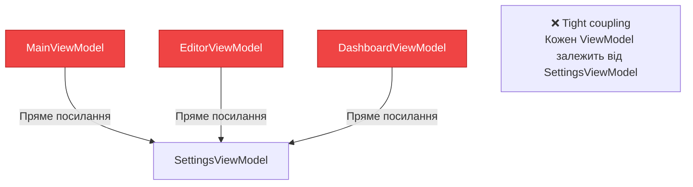
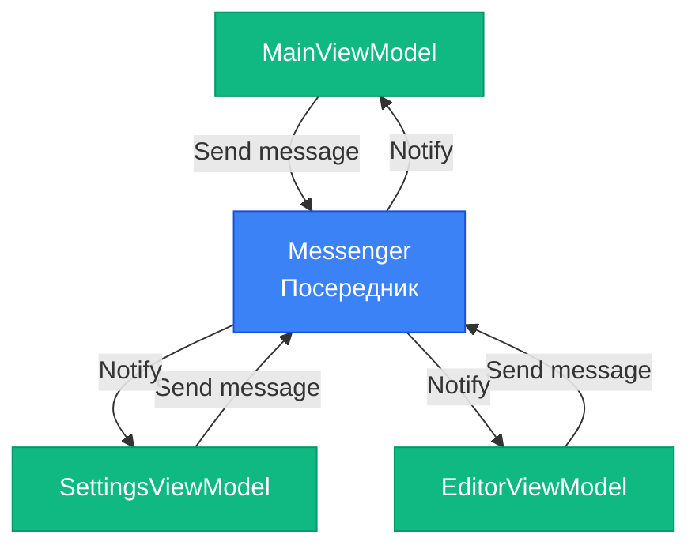

# Messenger Pattern: Комунікація між ViewModel без прямих посилань

## Вступ

У попередніх статтях ми створили [ViewModel](23.viewmodel-implementation), [Commands](24.commands) та автоматизували boilerplate через [MVVM Toolkit](25.mvvm-toolkit). Але залишилася одна проблема: **як ViewModel'и спілкуються між собою?**

Уявіть ситуацію: у вашому додатку є кілька ViewModel:

- `MainViewModel` — головне вікно з списком елементів
- `SettingsViewModel` — налаштування (тема, мова, розмір шрифту)
- `EditorViewModel` — редактор елемента

**Сценарій:** Користувач змінює тему у `SettingsViewModel` з Light на Dark. `MainViewModel` має оновити UI відповідно до нової теми.

**Питання:** Як `MainViewModel` дізнається про зміну теми?

### Антипатерн: Прямі посилання

**Спроба 1: Пряме посилання**

```csharp
public class MainViewModel : ObservableObject
{
    private SettingsViewModel _settingsViewModel;
    
    public MainViewModel(SettingsViewModel settingsViewModel)
    {
        _settingsViewModel = settingsViewModel;
        
        // Підписка на зміни
        _settingsViewModel.PropertyChanged += (s, e) =>
        {
            if (e.PropertyName == nameof(SettingsViewModel.Theme))
            {
                UpdateTheme(_settingsViewModel.Theme);
            }
        };
    }
}
```

**Проблеми:**

- ❌ **Tight coupling** — `MainViewModel` залежить від `SettingsViewModel`
- ❌ **Порушення MVVM** — ViewModel знає про іншу ViewModel
- ❌ **Складність тестування** — потрібен екземпляр `SettingsViewModel` для тестування `MainViewModel`
- ❌ **Масштабованість** — якщо 10 ViewModel потребують знати про зміну теми?

::mermaid

::

**Рішення:** **Messenger Pattern** — центральний посередник для комунікації між ViewModel без прямих посилань.

::note
**Для кого ця стаття?** Якщо ви вже знайомі з [MVVM Pattern](22.mvvm-pattern) та [MVVM Toolkit](25.mvvm-toolkit), ця стаття покаже, як організувати комунікацію між ViewModel через Messenger для loose coupling.
::

---

## Mediator Pattern: Центральний посередник

**Messenger Pattern** базується на **Mediator Pattern** — один з класичних патернів проектування (Gang of Four).

### Концепція Mediator Pattern

**Ідея:** Замість прямої комунікації між об'єктами, всі об'єкти спілкуються через центрального посередника (Mediator).

::mermaid

::

**Переваги:**

- ✅ **Loose coupling** — ViewModel не знають один про одного
- ✅ **Масштабованість** — легко додати нових підписників
- ✅ **Тестованість** — можна тестувати ViewModel ізольовано
- ✅ **Централізація** — вся комунікація через один об'єкт


### Як працює Messenger

**Процес комунікації:**

::mermaid
```mermaid
sequenceDiagram
    participant Settings as SettingsViewModel
    participant Messenger as Messenger
    participant Main as MainViewModel
    participant Editor as EditorViewModel
    
    Note over Main,Editor: Реєстрація підписників
    Main->>Messenger: Register<ThemeChangedMessage>
    Editor->>Messenger: Register<ThemeChangedMessage>
    
    Note over Settings,Editor: Зміна теми
    Settings->>Settings: Theme = "Dark"
    Settings->>Messenger: Send(ThemeChangedMessage("Dark"))
    
    Messenger->>Main: Notify: ThemeChangedMessage("Dark")
    Main->>Main: UpdateTheme("Dark")
    
    Messenger->>Editor: Notify: ThemeChangedMessage("Dark")
    Editor->>Editor: UpdateTheme("Dark")
    
    style Messenger fill:#3b82f6,stroke:#1d4ed8,color:#ffffff
    style Settings fill:#f59e0b,stroke:#b45309,color:#ffffff
```
::

**Ключові моменти:**

1. **Register** — ViewModel підписується на повідомлення певного типу
2. **Send** — ViewModel надсилає повідомлення через Messenger
3. **Notify** — Messenger сповіщає всіх підписників
4. **Unregister** — ViewModel відписується (важливо для уникнення memory leaks)

---

## WeakReferenceMessenger: Реалізація від CommunityToolkit.Mvvm

`CommunityToolkit.Mvvm` надає готову реалізацію Messenger — `WeakReferenceMessenger`.

### Чому WeakReference?

**Проблема сильних посилань:**

```csharp
// Сильне посилання
List<ViewModel> subscribers = new List<ViewModel>();
subscribers.Add(mainViewModel);

// mainViewModel не може бути видалений Garbage Collector,
// навіть якщо більше не використовується
```

**Рішення — слабкі посилання:**

```csharp
// Слабке посилання
List<WeakReference<ViewModel>> subscribers = new List<WeakReference<ViewModel>>();
subscribers.Add(new WeakReference<ViewModel>(mainViewModel));

// mainViewModel може бути видалений Garbage Collector,
// якщо більше немає сильних посилань
```

**Переваги `WeakReferenceMessenger`:**

- ✅ Автоматичне очищення — підписники, що більше не використовуються, видаляються GC
- ✅ Немає memory leaks — навіть якщо забули Unregister
- ✅ Безпечність — не потрібно вручну керувати життєвим циклом

**Недоліки:**

- ⚠️ Трохи повільніше — перевірка WeakReference при кожному Send
- ⚠️ Непередбачуваність — підписник може бути видалений GC у будь-який момент

### Базове використання

**Крок 1: Створити повідомлення**

```csharp
// Просте повідомлення
public class ThemeChangedMessage
{
    public string Theme { get; }
    
    public ThemeChangedMessage(string theme)
    {
        Theme = theme;
    }
}
```

**Крок 2: Надіслати повідомлення**

```csharp
public partial class SettingsViewModel : ObservableObject
{
    [ObservableProperty]
    private string _theme = "Light";
    
    partial void OnThemeChanged(string value)
    {
        // Надіслати повідомлення через Messenger
        WeakReferenceMessenger.Default.Send(new ThemeChangedMessage(value));
    }
}
```

**Крок 3: Підписатися на повідомлення**

```csharp
public partial class MainViewModel : ObservableObject
{
    public MainViewModel()
    {
        // Підписатися на повідомлення
        WeakReferenceMessenger.Default.Register<ThemeChangedMessage>(this, (recipient, message) =>
        {
            // Обробити повідомлення
            UpdateTheme(message.Theme);
        });
    }
    
    private void UpdateTheme(string theme)
    {
        // Логіка оновлення теми
        Console.WriteLine($"Тема змінена на: {theme}");
    }
}
```

**Ключові моменти:**

1. **`WeakReferenceMessenger.Default`** — singleton екземпляр Messenger
2. **`Register<TMessage>`** — підписка на повідомлення типу `TMessage`
3. **`this`** — recipient (хто отримує повідомлення)
4. **Lambda** — обробник повідомлення `(recipient, message) => { ... }`


### Unregister: Відписка від повідомлень

**Чому важливо відписуватися?**

Хоча `WeakReferenceMessenger` використовує слабкі посилання, краща практика — явно відписуватися, коли ViewModel більше не потрібен.

**Коли відписуватися:**

```csharp
public partial class MainViewModel : ObservableObject, IDisposable
{
    public MainViewModel()
    {
        WeakReferenceMessenger.Default.Register<ThemeChangedMessage>(this, OnThemeChanged);
    }
    
    private void OnThemeChanged(object recipient, ThemeChangedMessage message)
    {
        UpdateTheme(message.Theme);
    }
    
    public void Dispose()
    {
        // Відписатися від всіх повідомлень
        WeakReferenceMessenger.Default.UnregisterAll(this);
        
        // Або від конкретного типу
        // WeakReferenceMessenger.Default.Unregister<ThemeChangedMessage>(this);
    }
}
```

**Методи відписки:**

| Метод | Опис |
|-------|------|
| `Unregister<TMessage>(recipient)` | Відписатися від повідомлень типу `TMessage` |
| `UnregisterAll(recipient)` | Відписатися від всіх повідомлень |
| `Reset()` | Очистити всіх підписників (рідко використовується) |

---

## Типи повідомлень

`CommunityToolkit.Mvvm` надає кілька готових типів повідомлень для типових сценаріїв.

### ValueChangedMessage<T>: Просте повідомлення зі значенням

**Використання:**

```csharp
// Надіслати
WeakReferenceMessenger.Default.Send(new ValueChangedMessage<string>("Dark"));

// Отримати
WeakReferenceMessenger.Default.Register<ValueChangedMessage<string>>(this, (r, msg) =>
{
    string newTheme = msg.Value;
    UpdateTheme(newTheme);
});
```

**Переваги:**

- ✅ Не потрібно створювати власний клас повідомлення
- ✅ Generic — працює для будь-якого типу

**Недоліки:**

- ⚠️ Менш виразно — не зрозуміло, що означає `ValueChangedMessage<string>`
- ⚠️ Конфлікти — якщо кілька місць надсилають `ValueChangedMessage<string>` з різним значенням

### PropertyChangedMessage<T>: Повідомлення зі старим та новим значенням

**Використання:**

```csharp
// Надіслати
WeakReferenceMessenger.Default.Send(new PropertyChangedMessage<string>(
    sender: this,
    propertyName: nameof(Theme),
    oldValue: "Light",
    newValue: "Dark"
));

// Отримати
WeakReferenceMessenger.Default.Register<PropertyChangedMessage<string>>(this, (r, msg) =>
{
    if (msg.PropertyName == nameof(SettingsViewModel.Theme))
    {
        Console.WriteLine($"Тема змінена з '{msg.OldValue}' на '{msg.NewValue}'");
    }
});
```

**Переваги:**

- ✅ Доступ до старого та нового значення
- ✅ Ім'я властивості для фільтрації

### RequestMessage<T>: Запит-відповідь

**Сценарій:** `EditorViewModel` потребує дані з `MainViewModel`, але не має прямого посилання.

**Використання:**

```csharp
// Повідомлення-запит
public class GetCurrentUserRequest : RequestMessage<User>
{
}

// MainViewModel — надає дані
public class MainViewModel : ObservableObject
{
    private User _currentUser = new User { Name = "Іван" };
    
    public MainViewModel()
    {
        WeakReferenceMessenger.Default.Register<GetCurrentUserRequest>(this, (r, msg) =>
        {
            // Відповісти на запит
            msg.Reply(_currentUser);
        });
    }
}

// EditorViewModel — запитує дані
public class EditorViewModel : ObservableObject
{
    public void LoadUser()
    {
        var request = new GetCurrentUserRequest();
        
        // Надіслати запит
        WeakReferenceMessenger.Default.Send(request);
        
        // Отримати відповідь
        if (request.HasReceivedResponse)
        {
            User user = request.Response;
            Console.WriteLine($"Отримано користувача: {user.Name}");
        }
    }
}
```

**Ключові моменти:**

1. **`RequestMessage<T>`** — базовий клас для запитів
2. **`Reply(value)`** — надати відповідь
3. **`HasReceivedResponse`** — чи отримано відповідь
4. **`Response`** — значення відповіді

**Переваги:**

- ✅ Синхронний запит-відповідь
- ✅ Не потрібні прямі посилання

**Недоліки:**

- ⚠️ Тільки одна відповідь — перший, хто відповість
- ⚠️ Немає гарантії відповіді — потрібно перевіряти `HasReceivedResponse`

### CollectionRequestMessage<T>: Множинні відповіді

**Сценарій:** Зібрати дані з кількох ViewModel.

**Використання:**

```csharp
// Запит
public class GetAllOpenEditorsRequest : CollectionRequestMessage<string>
{
}

// Кілька EditorViewModel відповідають
public class EditorViewModel : ObservableObject
{
    public string FileName { get; set; }
    
    public EditorViewModel()
    {
        WeakReferenceMessenger.Default.Register<GetAllOpenEditorsRequest>(this, (r, msg) =>
        {
            msg.Reply(FileName);
        });
    }
}

// MainViewModel — збирає відповіді
public class MainViewModel : ObservableObject
{
    public void ShowOpenEditors()
    {
        var request = new GetAllOpenEditorsRequest();
        WeakReferenceMessenger.Default.Send(request);
        
        // Отримати всі відповіді
        foreach (string fileName in request.Responses)
        {
            Console.WriteLine($"Відкритий файл: {fileName}");
        }
    }
}
```

**Переваги:**

- ✅ Множинні відповіді від різних підписників
- ✅ Корисно для агрегації даних


---

## StrongReferenceMessenger: Альтернатива

`CommunityToolkit.Mvvm` також надає `StrongReferenceMessenger` — версію з сильними посиланнями.

### Порівняння: Weak vs Strong

| Аспект | WeakReferenceMessenger | StrongReferenceMessenger |
|--------|------------------------|--------------------------|
| Посилання | Слабкі (WeakReference) | Сильні (звичайні) |
| Memory leaks | Немає (GC видаляє) | Можливі (якщо забули Unregister) |
| Продуктивність | Трохи повільніше | Швидше |
| Unregister | Опціонально | Обов'язково |
| Використання | За замовчуванням | Для high-performance сценаріїв |

### Коли використовувати StrongReferenceMessenger

**Сценарії:**

- ✅ High-performance додатки (ігри, real-time системи)
- ✅ Короткоживучі підписники (створюються та видаляються швидко)
- ✅ Гарантований контроль життєвого циклу

**Використання:**

```csharp
// Створити екземпляр
var messenger = new StrongReferenceMessenger();

// Використовувати як WeakReferenceMessenger
messenger.Register<ThemeChangedMessage>(this, OnThemeChanged);
messenger.Send(new ThemeChangedMessage("Dark"));

// ⚠️ ОБОВ'ЯЗКОВО відписатися
messenger.UnregisterAll(this);
```

::warning
**Важливо:** При використанні `StrongReferenceMessenger` обов'язково викликайте `Unregister` або `UnregisterAll`, інакше виникнуть memory leaks.
::

---

## Практичні сценарії

Розберемо типові сценарії використання Messenger у реальних додатках.

### Сценарій 1: Зміна теми

**Проблема:** Користувач змінює тему у налаштуваннях. Всі вікна мають оновити UI.

**Рішення:**

```csharp
// Повідомлення
public class ThemeChangedMessage
{
    public string Theme { get; }
    public ThemeChangedMessage(string theme) => Theme = theme;
}

// SettingsViewModel — надсилає
public partial class SettingsViewModel : ObservableObject
{
    [ObservableProperty]
    private string _theme = "Light";
    
    partial void OnThemeChanged(string value)
    {
        WeakReferenceMessenger.Default.Send(new ThemeChangedMessage(value));
    }
}

// MainViewModel — отримує
public partial class MainViewModel : ObservableObject
{
    public MainViewModel()
    {
        WeakReferenceMessenger.Default.Register<ThemeChangedMessage>(this, (r, msg) =>
        {
            ApplyTheme(msg.Theme);
        });
    }
    
    private void ApplyTheme(string theme)
    {
        // Логіка застосування теми
        Application.Current.Resources.MergedDictionaries.Clear();
        Application.Current.Resources.MergedDictionaries.Add(
            new ResourceDictionary { Source = new Uri($"Themes/{theme}.xaml", UriKind.Relative) }
        );
    }
}
```

### Сценарій 2: Навігація між View

**Проблема:** `MainViewModel` потребує відкрити `EditorView`, але не має прямого доступу до View.

**Рішення:**

```csharp
// Повідомлення
public class NavigateMessage
{
    public string ViewName { get; }
    public object Parameter { get; }
    
    public NavigateMessage(string viewName, object parameter = null)
    {
        ViewName = viewName;
        Parameter = parameter;
    }
}

// MainViewModel — надсилає
public partial class MainViewModel : ObservableObject
{
    [RelayCommand]
    private void OpenEditor(int itemId)
    {
        WeakReferenceMessenger.Default.Send(new NavigateMessage("EditorView", itemId));
    }
}

// MainWindow (code-behind) — отримує
public partial class MainWindow : Window
{
    public MainWindow()
    {
        InitializeComponent();
        
        WeakReferenceMessenger.Default.Register<NavigateMessage>(this, (r, msg) =>
        {
            NavigateToView(msg.ViewName, msg.Parameter);
        });
    }
    
    private void NavigateToView(string viewName, object parameter)
    {
        switch (viewName)
        {
            case "EditorView":
                var editorWindow = new EditorWindow();
                editorWindow.DataContext = new EditorViewModel((int)parameter);
                editorWindow.Show();
                break;
        }
    }
}
```

### Сценарій 3: Діалог підтвердження

**Проблема:** `EditorViewModel` потребує показати діалог "Зберегти зміни?", але не має доступу до UI.

**Рішення:**

```csharp
// Повідомлення-запит
public class ConfirmationRequest : RequestMessage<bool>
{
    public string Title { get; }
    public string Message { get; }
    
    public ConfirmationRequest(string title, string message)
    {
        Title = title;
        Message = message;
    }
}

// EditorViewModel — запитує
public partial class EditorViewModel : ObservableObject
{
    [RelayCommand]
    private void Close()
    {
        if (HasUnsavedChanges)
        {
            var request = new ConfirmationRequest(
                "Зберегти зміни?",
                "У вас є незбережені зміни. Зберегти перед закриттям?"
            );
            
            WeakReferenceMessenger.Default.Send(request);
            
            if (request.HasReceivedResponse && request.Response)
            {
                Save();
            }
        }
    }
}

// MainWindow (code-behind) — відповідає
public partial class MainWindow : Window
{
    public MainWindow()
    {
        InitializeComponent();
        
        WeakReferenceMessenger.Default.Register<ConfirmationRequest>(this, (r, msg) =>
        {
            var result = MessageBox.Show(
                msg.Message,
                msg.Title,
                MessageBoxButton.YesNo,
                MessageBoxImage.Question
            );
            
            msg.Reply(result == MessageBoxResult.Yes);
        });
    }
}
```

### Сценарій 4: Оновлення списку після редагування

**Проблема:** `EditorViewModel` зберіг зміни. `MainViewModel` має оновити список.

**Рішення:**

```csharp
// Повідомлення
public class ItemUpdatedMessage
{
    public int ItemId { get; }
    public ItemUpdatedMessage(int itemId) => ItemId = itemId;
}

// EditorViewModel — надсилає
public partial class EditorViewModel : ObservableObject
{
    [RelayCommand]
    private async Task SaveAsync()
    {
        await _repository.UpdateAsync(Item);
        
        // Сповістити про оновлення
        WeakReferenceMessenger.Default.Send(new ItemUpdatedMessage(Item.Id));
    }
}

// MainViewModel — отримує та оновлює список
public partial class MainViewModel : ObservableObject
{
    public ObservableCollection<Item> Items { get; set; }
    
    public MainViewModel()
    {
        WeakReferenceMessenger.Default.Register<ItemUpdatedMessage>(this, async (r, msg) =>
        {
            // Перезавантажити оновлений елемент
            var updatedItem = await _repository.GetByIdAsync(msg.ItemId);
            var existingItem = Items.FirstOrDefault(i => i.Id == msg.ItemId);
            
            if (existingItem != null)
            {
                int index = Items.IndexOf(existingItem);
                Items[index] = updatedItem;
            }
        });
    }
}
```


---

## Best Practices та підводні камені

### Best Practices

::card-group

::card{title="📝 Виразні назви повідомлень" icon="i-lucide-file-text"}
Використовуйте описові назви: `ThemeChangedMessage`, а не `ValueChangedMessage<string>`. Код стає читабельнішим.
::

::card{title="🎯 Один тип — одна мета" icon="i-lucide-target"}
Не використовуйте один тип повідомлення для різних цілей. Створіть окремі класи для кожного сценарію.
::

::card{title="🧹 Завжди Unregister" icon="i-lucide-trash"}
Навіть з WeakReferenceMessenger, краща практика — явно відписуватися у Dispose або деструкторі.
::

::card{title="🔒 Immutable повідомлення" icon="i-lucide-lock"}
Робіть повідомлення незмінними (readonly властивості). Це запобігає випадковим змінам.
::

::

### Підводні камені

**1. Забули Unregister → Memory leak (для StrongReferenceMessenger)**

```csharp
// ❌ Погано
public class MyViewModel : ObservableObject
{
    public MyViewModel()
    {
        StrongReferenceMessenger.Default.Register<MyMessage>(this, OnMessage);
        // Забули Unregister — memory leak!
    }
}

// ✅ Добре
public class MyViewModel : ObservableObject, IDisposable
{
    public MyViewModel()
    {
        StrongReferenceMessenger.Default.Register<MyMessage>(this, OnMessage);
    }
    
    public void Dispose()
    {
        StrongReferenceMessenger.Default.UnregisterAll(this);
    }
}
```

**2. Циклічні повідомлення → Stack overflow**

```csharp
// ❌ Погано — безкінечний цикл
public class ViewModelA : ObservableObject
{
    public ViewModelA()
    {
        WeakReferenceMessenger.Default.Register<MessageA>(this, (r, msg) =>
        {
            WeakReferenceMessenger.Default.Send(new MessageB());  // Надсилає B
        });
    }
}

public class ViewModelB : ObservableObject
{
    public ViewModelB()
    {
        WeakReferenceMessenger.Default.Register<MessageB>(this, (r, msg) =>
        {
            WeakReferenceMessenger.Default.Send(new MessageA());  // Надсилає A → цикл!
        });
    }
}
```

**Рішення:** Додати прапорець для запобігання повторній обробці:

```csharp
public class MessageA
{
    public bool IsProcessed { get; set; }
}

WeakReferenceMessenger.Default.Register<MessageA>(this, (r, msg) =>
{
    if (!msg.IsProcessed)
    {
        msg.IsProcessed = true;
        // Обробка
    }
});
```

**3. Надто багато повідомлень → Складність**

Якщо у додатку 50+ типів повідомлень — це сигнал, що архітектура занадто складна. Розгляньте альтернативи:

- Shared State (наприклад, через DI)
- Event Aggregator з каналами
- Прямі посилання для тісно пов'язаних ViewModel

**4. Синхронна обробка → UI зависає**

```csharp
// ❌ Погано — довга операція у обробнику
WeakReferenceMessenger.Default.Register<DataLoadedMessage>(this, (r, msg) =>
{
    Thread.Sleep(5000);  // UI зависає!
    ProcessData(msg.Data);
});

// ✅ Добре — асинхронна обробка
WeakReferenceMessenger.Default.Register<DataLoadedMessage>(this, async (r, msg) =>
{
    await Task.Delay(5000);
    await ProcessDataAsync(msg.Data);
});
```

---

## Практичні завдання

### Рівень 1: Надіслати повідомлення про зміну теми

**Мета:** Навчитися використовувати Messenger для простої комунікації.

**Завдання:**

Створіть два ViewModel:

1. **SettingsViewModel:**
   - Властивість `Theme` (Light/Dark)
   - При зміні теми — надіслати `ThemeChangedMessage`

2. **MainViewModel:**
   - Підписатися на `ThemeChangedMessage`
   - Вивести у консоль нову тему

**Критерії успіху:**

- При зміні `Theme` у `SettingsViewModel` → `MainViewModel` отримує повідомлення
- Використано `WeakReferenceMessenger.Default`
- Всі тести проходять

**Підказка:**

```csharp
// Повідомлення
public class ThemeChangedMessage
{
    public string Theme { get; }
    public ThemeChangedMessage(string theme) => Theme = theme;
}

// SettingsViewModel
public partial class SettingsViewModel : ObservableObject
{
    [ObservableProperty]
    private string _theme = "Light";
    
    partial void OnThemeChanged(string value)
    {
        // TODO: Надіслати повідомлення
        WeakReferenceMessenger.Default.Send(new ThemeChangedMessage(value));
    }
}

// MainViewModel
public partial class MainViewModel : ObservableObject
{
    public MainViewModel()
    {
        // TODO: Підписатися на повідомлення
        WeakReferenceMessenger.Default.Register<ThemeChangedMessage>(this, (r, msg) =>
        {
            Console.WriteLine($"Тема змінена на: {msg.Theme}");
        });
    }
}
```

**Тести:**

```csharp
[Test]
public void ThemeChanged_ShouldSendMessage()
{
    var settingsVm = new SettingsViewModel();
    var mainVm = new MainViewModel();
    
    bool messageReceived = false;
    string receivedTheme = null;
    
    WeakReferenceMessenger.Default.Register<ThemeChangedMessage>(this, (r, msg) =>
    {
        messageReceived = true;
        receivedTheme = msg.Theme;
    });
    
    settingsVm.Theme = "Dark";
    
    Assert.IsTrue(messageReceived);
    Assert.AreEqual("Dark", receivedTheme);
    
    WeakReferenceMessenger.Default.UnregisterAll(this);
}
```


---

### Рівень 2: Навігація між View через Messenger

**Мета:** Реалізувати навігацію без прямих посилань на View.

**Завдання:**

Створіть систему навігації:

1. **NavigateMessage:**
   - `ViewName` (string) — назва View
   - `Parameter` (object) — параметр для передачі

2. **MainViewModel:**
   - Команда `OpenEditorCommand` — надсилає `NavigateMessage("EditorView", itemId)`
   - Команда `OpenSettingsCommand` — надсилає `NavigateMessage("SettingsView")`

3. **NavigationService (у code-behind або окремий клас):**
   - Підписується на `NavigateMessage`
   - Відкриває відповідне вікно

**Критерії успіху:**

- ViewModel не знає про View
- Навігація працює через Messenger
- Параметри передаються коректно
- Всі тести проходять

**Підказка:**

```csharp
// Повідомлення
public class NavigateMessage
{
    public string ViewName { get; }
    public object Parameter { get; }
    
    public NavigateMessage(string viewName, object parameter = null)
    {
        ViewName = viewName;
        Parameter = parameter;
    }
}

// MainViewModel
public partial class MainViewModel : ObservableObject
{
    [RelayCommand]
    private void OpenEditor(int itemId)
    {
        WeakReferenceMessenger.Default.Send(new NavigateMessage("EditorView", itemId));
    }
    
    [RelayCommand]
    private void OpenSettings()
    {
        WeakReferenceMessenger.Default.Send(new NavigateMessage("SettingsView"));
    }
}

// NavigationService (у MainWindow code-behind)
public partial class MainWindow : Window
{
    public MainWindow()
    {
        InitializeComponent();
        
        WeakReferenceMessenger.Default.Register<NavigateMessage>(this, (r, msg) =>
        {
            NavigateToView(msg.ViewName, msg.Parameter);
        });
    }
    
    private void NavigateToView(string viewName, object parameter)
    {
        // TODO: Відкрити відповідне вікно
        switch (viewName)
        {
            case "EditorView":
                var editorWindow = new EditorWindow();
                editorWindow.DataContext = new EditorViewModel((int)parameter);
                editorWindow.Show();
                break;
            
            case "SettingsView":
                var settingsWindow = new SettingsWindow();
                settingsWindow.DataContext = new SettingsViewModel();
                settingsWindow.Show();
                break;
        }
    }
}
```

**Тести:**

```csharp
[Test]
public void OpenEditor_ShouldSendNavigateMessage()
{
    var vm = new MainViewModel();
    bool messageReceived = false;
    string receivedViewName = null;
    int receivedItemId = 0;
    
    WeakReferenceMessenger.Default.Register<NavigateMessage>(this, (r, msg) =>
    {
        messageReceived = true;
        receivedViewName = msg.ViewName;
        receivedItemId = (int)msg.Parameter;
    });
    
    vm.OpenEditorCommand.Execute(42);
    
    Assert.IsTrue(messageReceived);
    Assert.AreEqual("EditorView", receivedViewName);
    Assert.AreEqual(42, receivedItemId);
    
    WeakReferenceMessenger.Default.UnregisterAll(this);
}
```

---

### Рівень 3: RequestMessage для діалогу підтвердження

**Мета:** Реалізувати запит-відповідь через Messenger.

**Завдання:**

Створіть систему діалогів підтвердження:

1. **ConfirmationRequest (RequestMessage<bool>):**
   - `Title` — заголовок діалогу
   - `Message` — текст повідомлення

2. **EditorViewModel:**
   - Команда `CloseCommand` — перевіряє незбережені зміни
   - Якщо є зміни → надсилає `ConfirmationRequest`
   - Якщо користувач підтвердив → зберігає та закриває

3. **DialogService (у code-behind):**
   - Підписується на `ConfirmationRequest`
   - Показує `MessageBox.Show`
   - Відповідає через `msg.Reply(result)`

**Критерії успіху:**

- ViewModel не викликає MessageBox напряму
- Діалог працює через RequestMessage
- Відповідь обробляється коректно
- Всі тести проходять

**Підказка:**

```csharp
// Повідомлення-запит
public class ConfirmationRequest : RequestMessage<bool>
{
    public string Title { get; }
    public string Message { get; }
    
    public ConfirmationRequest(string title, string message)
    {
        Title = title;
        Message = message;
    }
}

// EditorViewModel
public partial class EditorViewModel : ObservableObject
{
    [ObservableProperty]
    private bool _hasUnsavedChanges;
    
    [RelayCommand]
    private void Close()
    {
        if (HasUnsavedChanges)
        {
            var request = new ConfirmationRequest(
                "Зберегти зміни?",
                "У вас є незбережені зміни. Зберегти перед закриттям?"
            );
            
            WeakReferenceMessenger.Default.Send(request);
            
            if (request.HasReceivedResponse && request.Response)
            {
                Save();
            }
        }
        
        // Закрити вікно (через інше повідомлення або подію)
    }
    
    [RelayCommand]
    private void Save()
    {
        // Логіка збереження
        HasUnsavedChanges = false;
    }
}

// DialogService (у MainWindow code-behind)
public partial class MainWindow : Window
{
    public MainWindow()
    {
        InitializeComponent();
        
        WeakReferenceMessenger.Default.Register<ConfirmationRequest>(this, (r, msg) =>
        {
            var result = MessageBox.Show(
                msg.Message,
                msg.Title,
                MessageBoxButton.YesNo,
                MessageBoxImage.Question
            );
            
            msg.Reply(result == MessageBoxResult.Yes);
        });
    }
}
```

**Тести:**

```csharp
[Test]
public void Close_ShouldRequestConfirmation_WhenHasUnsavedChanges()
{
    var vm = new EditorViewModel { HasUnsavedChanges = true };
    bool requestReceived = false;
    
    WeakReferenceMessenger.Default.Register<ConfirmationRequest>(this, (r, msg) =>
    {
        requestReceived = true;
        Assert.AreEqual("Зберегти зміни?", msg.Title);
        msg.Reply(true);  // Симулюємо "Так"
    });
    
    vm.CloseCommand.Execute(null);
    
    Assert.IsTrue(requestReceived);
    Assert.IsFalse(vm.HasUnsavedChanges);  // Має зберегти
    
    WeakReferenceMessenger.Default.UnregisterAll(this);
}

[Test]
public void Close_ShouldNotSave_WhenUserDeclines()
{
    var vm = new EditorViewModel { HasUnsavedChanges = true };
    
    WeakReferenceMessenger.Default.Register<ConfirmationRequest>(this, (r, msg) =>
    {
        msg.Reply(false);  // Симулюємо "Ні"
    });
    
    vm.CloseCommand.Execute(null);
    
    Assert.IsTrue(vm.HasUnsavedChanges);  // Не має зберігати
    
    WeakReferenceMessenger.Default.UnregisterAll(this);
}
```

---

## Підсумок

Messenger Pattern забезпечує loose coupling між ViewModel через центрального посередника.

**Ключові висновки:**

::card-group

::card{title="🎯 Mediator Pattern" icon="i-lucide-target"}
Центральний посередник для комунікації без прямих посилань. Loose coupling та масштабованість.
::

::card{title="🔗 WeakReferenceMessenger" icon="i-lucide-link"}
Реалізація з слабкими посиланнями. Автоматичне очищення, немає memory leaks навіть без Unregister.
::

::card{title="📨 Типи повідомлень" icon="i-lucide-mail"}
ValueChangedMessage, PropertyChangedMessage, RequestMessage, CollectionRequestMessage для різних сценаріїв.
::

::card{title="⚡ StrongReferenceMessenger" icon="i-lucide-zap"}
Альтернатива для high-performance. Швидше, але потребує обов'язкового Unregister.
::

::card{title="🎨 Практичні сценарії" icon="i-lucide-palette"}
Зміна теми, навігація, діалоги підтвердження, оновлення списків — типові use cases.
::

::card{title="⚠️ Best Practices" icon="i-lucide-alert-triangle"}
Виразні назви, immutable повідомлення, завжди Unregister, уникати циклічних повідомлень.
::

::

**Переваги Messenger:**

- ✅ Loose coupling — ViewModel не знають один про одного
- ✅ Масштабованість — легко додати нових підписників
- ✅ Тестованість — можна тестувати ViewModel ізольовано
- ✅ Централізація — вся комунікація через один об'єкт
- ✅ Гнучкість — різні типи повідомлень для різних сценаріїв

**Недоліки:**

- ⚠️ Складність — додатковий рівень абстракції
- ⚠️ Debugging — складніше відстежити потік повідомлень
- ⚠️ Overhead — трохи повільніше за прямі посилання
- ⚠️ Можливі циклічні повідомлення

::tip
**Коли використовувати Messenger:** Для комунікації між слабо пов'язаними ViewModel (зміна теми, навігація, діалоги). Для тісно пов'язаних ViewModel розгляньте прямі посилання або shared state.
::

**Що далі?**

Ви завершили Block 7: MVVM! Наступний блок — **Стилізація та шаблони**:

- **Styles Basics** (стаття 27) — система стилів WPF як CSS для десктопу
- **Control Templates** (стаття 28) — повна перебудова зовнішнього вигляду контролів
- **Triggers and Visual States** (стаття 29) — інтерактивність та анімації

---

## Словник термінів

::note{title="📚 Глосарій"}

**Messenger Pattern** — патерн для комунікації між об'єктами через центрального посередника без прямих посилань.

**Mediator Pattern** — класичний патерн проектування (Gang of Four) для зменшення зв'язності між об'єктами.

**WeakReferenceMessenger** — реалізація Messenger з слабкими посиланнями. Автоматичне очищення підписників через GC.

**StrongReferenceMessenger** — реалізація Messenger з сильними посиланнями. Швидше, але потребує ручного Unregister.

**WeakReference** — слабке посилання, що не запобігає видаленню об'єкта Garbage Collector.

**Loose coupling** — слабка зв'язність між компонентами. Компоненти не залежать один від одного напряму.

**Tight coupling** — тісна зв'язність між компонентами. Компоненти мають прямі посилання один на одного.

**ValueChangedMessage<T>** — просте повідомлення зі значенням типу T.

**RequestMessage<T>** — повідомлення-запит з можливістю отримати відповідь типу T.

**CollectionRequestMessage<T>** — повідомлення-запит з можливістю отримати множинні відповіді типу T.

**Memory leak** — витік пам'яті, коли об'єкти не видаляються GC через сильні посилання.

**Unregister** — відписка від повідомлень. Важливо для уникнення memory leaks.

::

---

## Додаткові ресурси

::card-group

::card{title="📖 CommunityToolkit.Mvvm Messenger" icon="i-lucide-book-open" to="https://learn.microsoft.com/en-us/dotnet/communitytoolkit/mvvm/messenger"}
Офіційна документація про Messenger з прикладами.
::

::card{title="🎓 Mediator Pattern" icon="i-lucide-graduation-cap" to="https://refactoring.guru/design-patterns/mediator"}
Детальний огляд Mediator Pattern від Refactoring Guru.
::

::card{title="🔧 WeakReference in C#" icon="i-lucide-wrench" to="https://learn.microsoft.com/en-us/dotnet/api/system.weakreference"}
Офіційна документація про WeakReference та Garbage Collection.
::

::card{title="⚡ Messaging Best Practices" icon="i-lucide-zap" to="https://learn.microsoft.com/en-us/dotnet/communitytoolkit/mvvm/messenger#best-practices"}
Best practices для використання Messenger у MVVM.
::

::card{title="📚 Попередня стаття: MVVM Toolkit" icon="i-lucide-arrow-left" to="25.mvvm-toolkit"}
Повернутися до MVVM Toolkit — [ObservableProperty], [RelayCommand], Source Generators.
::

::card{title="📚 Наступна стаття: Styles Basics" icon="i-lucide-arrow-right" to="27.styles-basics"}
Дізнатися про систему стилів WPF — CSS для десктопу, implicit/explicit стилі, BasedOn.
::

::
