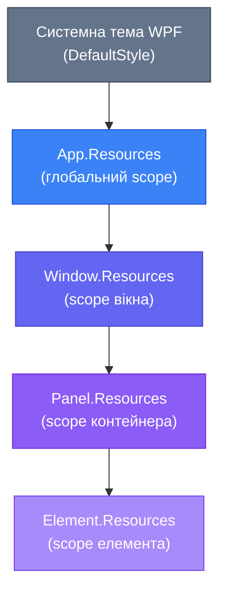

::note
**Нові терміни у цій статті:** `Style`, `Setter`, `TargetType`, `Implicit Style`, `Explicit Style`, `BasedOn`, `StaticResource`, `DynamicResource`, `ResourceDictionary`, `MergedDictionaries`, `x:Key`, скоп ресурсів, пріоритет стилів.
::

## Чому з'явилися стилі: від хаосу до системи

Уявіть, що ви розробляєте корпоративний додаток із двадцятьма формами. На кожній формі — десятки кнопок, поля введення, мітки. На самому початку роботи все виглядає непогано: кожен елемент має свої атрибути прямо у XAML. Одна кнопка — `FontSize="14" Padding="10,6" Background="#3B82F6" Foreground="White" CornerRadius="4"`. Друга — майже ідентична. Третя — теж. Через місяць дизайнер вирішує змінити відступи з `10` на `12`. Або колір акценту з синього на фіолетовий.

Скільки місць у коді доведеться змінювати? Якщо кнопок сотня — сотню місць. Якщо дизайн мінявся п'ять разів — п'ятсот правок вручну. Це не масштабується. Саме таку проблему виникла у ранніх GUI-фреймворках, і саме для її вирішення веброзробники створили CSS. WPF вчився у цього досвіду й запропонував свою відповідь — **систему стилів**.

Стиль у WPF — це не просто «набір атрибутів, що склали разом». Це повноцінний механізм, вбудований у систему Dependency Properties та Resource System. Стиль — це ресурс, він може бути успадкований, перевизначений, застосований автоматично або вручну, діяти в межах одного елемента або цілого додатку. Це відповідь WPF на питання: «Як забезпечити консистентний зовнішній вигляд без дублювання?»

Паралель із CSS тут не випадкова — вона дуже точна. Якщо у вас є досвід веброзробки, ви одразу побачите знайомі концепції: правила (Setter), селектори (TargetType), класи (x:Key), каскадність (BasedOn), область дії (scope). Якщо досвіду з CSS немає — нічого страшного, ми збудуємо розуміння з нуля через прості аналогії.

---

## Анатомія стилю: Style, Setter, TargetType

Почнімо з найпростішого можливого прикладу. Що таке стиль у WPF на рівні синтаксису?

Стиль — це об'єкт класу `Style`. Він містить колекцію об'єктів `Setter`. Кожен `Setter` встановлює значення однієї конкретної властивості (Property) на конкретне значення (Value). Стиль також має атрибут `TargetType` — він вказує, до якого типу контролів цей стиль призначений.

Якщо провести аналогію з CSS:

| CSS | WPF |
|---|---|
| Правило CSS (`font-size: 14px`) | `Setter` (`Property="FontSize" Value="14"`) |
| Блок правил `button { ... }` | `Style` з `TargetType="Button"` |
| CSS-клас `.primary-btn { ... }` | `Style` з `x:Key="PrimaryButton"` |
| CSS-успадкування (`extends`) | `BasedOn` |
| Таблиця стилів (CSS-файл) | `ResourceDictionary` |
| Область видимості (`:root`, `.container`) | Resources на рівні елемента / Window / App |

Розберімо кожен компонент деталізовано, перш ніж переходити до прикладів.

### Setter: одне правило

`Setter` — це атомарна одиниця стилю. Він завжди має два атрибути:
- **`Property`** — ім'я властивості, яку потрібно встановити. Це рядок, що відповідає імені DependencyProperty у вказаному `TargetType`.
- **`Value`** — значення, яке буде присвоєно цій властивості.

Важлива деталь: `Value` може бути не лише примітивом (числом, рядком), але й складним об'єктом — кистю, шаблоном, ресурсом. Якщо значення занадто складне для атрибутного запису, використовується розгорнутий синтаксис через дочірній елемент.

### TargetType: тип-мішень

`TargetType` у `Style` виконує роль CSS-селектора за типом елемента. Якщо `TargetType="Button"`, стиль може бути застосований лише до `Button` та його підкласів. Це не просто метадані — WPF використовує `TargetType` для перевірки: чи існує властивість із таким іменем у цьому типі? Якщо прописати `Property="CornerRadius"` у стилі з `TargetType="Button"` — компілятор та дизайнер миттєво підкажуть, чи коректне це поле.

Існує також форма без `TargetType` — але тоді кожен `Setter` мусить мати повне кваліфіковане ім'я властивості (наприклад, `Button.FontSize`). Ця форма рідко використовується на практиці.

---

## Перший стиль: де розмістити та як написати

Перш ніж побудувати стиль, потрібно відповісти на базове питання: **де він живе?** У WPF стилі є ресурсами — вони розміщуються у блоках `Resources`. Кожен `FrameworkElement` має властивість `Resources` типу `ResourceDictionary`. Ресурси, визначені у цьому блоці, доступні елементу та всім його нащадкам.

Найтиповіша структура для початку — розмістити стиль у `Window.Resources`:

```xml
<Window.Resources>
    <Style TargetType="Button">
        <!-- Setter'и тут -->
    </Style>
</Window.Resources>
```

Але давайте одразу подивимося на повноцінний перший приклад. Порівняємо підхід **без стилю** (inline-атрибути на кожному елементі) та **зі стилем**.

### До: inline-атрибути (антипатерн)

Ось як виглядає XAML без стилів. Кожна кнопка несе всі свої атрибути безпосередньо:

::wpf-preview{title="Без стилю: дублювання атрибутів"}

```xml
<StackPanel Margin="20" Spacing="10">
  <Button Content="Зберегти"
          FontSize="14"
          Padding="14,8"
          Background="#3B82F6"
          Foreground="White"
          HorizontalAlignment="Left"/>

  <Button Content="Скасувати"
          FontSize="14"
          Padding="14,8"
          Background="#3B82F6"
          Foreground="White"
          HorizontalAlignment="Left"/>

  <Button Content="Видалити"
          FontSize="14"
          Padding="14,8"
          Background="#3B82F6"
          Foreground="White"
          HorizontalAlignment="Left"/>
</StackPanel>
```

::

Зверніть увагу: `FontSize`, `Padding`, `Background`, `Foreground` — повністю ідентичні у всіх трьох кнопок. Якщо потрібно змінити `Padding` — три зміни. Якщо кнопок двадцять — двадцять змін. Це типове порушення принципу DRY (Don't Repeat Yourself) у UI-розробці.

### Після: той самий результат зі стилем

Тепер подивимося, як виглядає той самий інтерфейс із використанням стилю. Логіка зовнішнього вигляду виноситься в одне місце:

::wpf-preview{title="Implicit Style для Button: усі кнопки стилізовані автоматично"}

```xml
<StackPanel Margin="20" Spacing="10">
  <StackPanel.Resources>
    <Style TargetType="Button">
      <Setter Property="FontSize" Value="14"/>
      <Setter Property="Padding" Value="14,8"/>
      <Setter Property="Background" Value="#3B82F6"/>
      <Setter Property="Foreground" Value="White"/>
      <Setter Property="HorizontalAlignment" Value="Left"/>
    </Style>
  </StackPanel.Resources>

  <Button Content="Зберегти"/>
  <Button Content="Скасувати"/>
  <Button Content="Видалити"/>
</StackPanel>
```

::

::note
Превью використовує Avalonia Fluent Theme і виглядає як Windows 11. У реальному WPF-проєкті зовнішній вигляд кнопок буде дещо іншим (класична тема Aero із системними кольорами за замовчуванням). Але поведінка стилів — ідентична.
::

Ключова різниця: кнопки у XAML стали **декларативно чистими** — лише `Content`. Вся логіка зовнішнього вигляду зосереджена у стилі. Якщо тепер потрібно змінити `FontSize` — правляємо один рядок в одному місці.

---

## Implicit Style: стиль без імені

Приклад вище демонструє **Implicit Style** — стиль без атрибута `x:Key`. Саме відсутність ключа — це ознака того, що стиль застосовується **автоматично** до всіх елементів вказаного `TargetType` у межах свого scope.

Це одна з найпотужніших і найпростіших можливостей системи стилів WPF. Поведінка нагадує CSS «зоряний» (wildcard) селектор: `button { ... }` у CSS застосовується до всіх тегів `<button>` на сторінці. Implicit Style у WPF — те саме, але у межах конкретного XML-дерева (scope).

### Як WPF знаходить Implicit Style для елемента

Коли WPF відображає елемент (наприклад, `Button`), він шукає відповідний Implicit Style у такій послідовності:
1. Перевіряє `Resources` самого елемента.
2. Піднімається вгору по Logical Tree — перевіряє `Resources` батьківського елемента, потім його батька, і так далі.
3. Перевіряє `Application.Resources`.
4. Перевіряє `Theme` (системна тема WPF).

Якщо на будь-якому рівні знайдено Implicit Style із відповідним `TargetType` — він застосовується. Пошук зупиняється на першому збігу. Це і є **каскадність** у WPF.

Важливий нюанс: Implicit Style **замінює** стандартний системний стиль контролу? Ні — він **перекриває** лише ті властивості, які вказані у Setter'ах. Властивості, яких немає у стилі, беруться з `DefaultStyle` (системного стандартного стилю контролу). Детальніше про пріоритети — у розділі про Value Resolution нижче.

::warning
Implicit Style має одну пастку: він застосовується **до всіх** елементів вказаного типу у своєму scope — включно з тими, що знаходяться всередині складних контролів (наприклад, `ComboBox` всередині містить `Button` для розкриття). Якщо ваш Implicit Style для `Button` задає незвичайний колір — він може зламати вигляд комбобоксу. Тому виносьте Implicit Style якомога вище (у `Window.Resources` або `App.Resources`) тільки тоді, коли впевнені, що хочете стилізувати **всі** екземпляри типу.
::

---

## Explicit Style: стиль із іменем (x:Key)

Implicit Style зручний тоді, коли потрібно стилізувати **всі** елементи одного типу. Але що, якщо потрібні різні стилі для різних кнопок? Кнопка «Зберегти» — синя, «Видалити» — червона, «Скасувати» — нейтральна. Тут на сцену виходить **Explicit Style**.

Explicit Style — це стиль з атрибутом `x:Key`. Ключ — це унікальне ім'я ресурсу, за яким його можна знайти. Стиль сам по собі **ніде не застосовується автоматично**. Ви явно (explicit) вказуєте, до якого саме елемента його застосувати, через атрибут `Style="{StaticResource ключ}"`.

Ця поведінка точно відповідає CSS-класам: `.primary-button { ... }` не застосовується ні до чого, поки ви не напишете `class="primary-button"` на конкретному елементі.

### StaticResource та DynamicResource

Для звернення до ресурсів WPF надає два механізми:

**`StaticResource`** — розрізнення ресурсу відбувається **один раз**, під час завантаження XAML. Швидший, підходить для більшості випадків. Ресурс має бути визначений **раніше** у потоці XAML (або вище у дереві ресурсів/Resources).

**`DynamicResource`** — ресурс розрізняється **при кожному зверненні**. Дозволяє замінювати ресурс у runtime (наприклад, при перемиканні теми). Трохи повільніший через додаткову підтримку підписки на зміни.

Для стилів у межах одного вікна майже завжди достатньо `StaticResource`. `DynamicResource` знадобиться, коли будемо робити темну/світлу теми у Блоці 8.

### Приклад: три варіанти кнопки

Розглянемо класичний сценарій: кнопки Primary, Secondary та Danger. Кожна несе свою семантику — колір сигналізує про намір дії. Визначимо три Explicit Style і застосуємо їх вибірково:

::wpf-preview{title="Explicit Style: PrimaryButton, SecondaryButton, DangerButton"}

```xml
<StackPanel Margin="20" Spacing="12">
  <StackPanel.Resources>

    <!-- Base: спільні властивості для всіх кнопок -->
    <Style x:Key="BaseButton" TargetType="Button">
      <Setter Property="FontSize"   Value="14"/>
      <Setter Property="Padding"    Value="18,9"/>
      <Setter Property="FontWeight" Value="SemiBold"/>
      <Setter Property="HorizontalAlignment" Value="Left"/>
    </Style>

    <!-- Primary: синя — головна дія -->
    <Style x:Key="PrimaryButton" TargetType="Button"
           BasedOn="{StaticResource BaseButton}">
      <Setter Property="Background" Value="#3B82F6"/>
      <Setter Property="Foreground" Value="White"/>
    </Style>

    <!-- Secondary: сіра — другорядна дія -->
    <Style x:Key="SecondaryButton" TargetType="Button"
           BasedOn="{StaticResource BaseButton}">
      <Setter Property="Background" Value="#6B7280"/>
      <Setter Property="Foreground" Value="White"/>
    </Style>

    <!-- Danger: червона — деструктивна дія -->
    <Style x:Key="DangerButton" TargetType="Button"
           BasedOn="{StaticResource BaseButton}">
      <Setter Property="Background" Value="#EF4444"/>
      <Setter Property="Foreground" Value="White"/>
    </Style>

  </StackPanel.Resources>

  <TextBlock Text="Оберіть дію:" FontSize="13" Foreground="Gray" Margin="0,0,0,4"/>

  <Button Content="Зберегти зміни"
          Style="{StaticResource PrimaryButton}"/>

  <Button Content="Скасувати"
          Style="{StaticResource SecondaryButton}"/>

  <Button Content="Видалити запис"
          Style="{StaticResource DangerButton}"/>
</StackPanel>
```

::

::tip
Зверніть увагу на `BasedOn="{StaticResource BaseButton}"` — це і є успадкування стилів. `PrimaryButton`, `SecondaryButton` та `DangerButton` успадковують спільні властивості (`FontSize`, `Padding`, `FontWeight`) з `BaseButton` і лише **додають** свої. Жодного дублювання. Якщо треба змінити `FontSize` для всіх трьох — достатньо правити один рядок у `BaseButton`.
::

---

## BasedOn: успадкування стилів

`BasedOn` — один із найелегантніших механізмів системи стилів WPF. Він дозволяє одному стилю **розширювати** інший, так само як підклас розширює батьківський клас у ООП об'єктах.

Аналогія з CSS-каскадом тут дещо умовна — CSS каскадує автоматично «через теги», а у WPF `BasedOn` — явно вказується. Ближча аналогія: препроцесори типу SCSS/SASS із конструкцією `@extend`.

### Правила BasedOn

`BasedOn` приймає посилання на стиль двома способами:

**Спосіб 1: За ключем** — якщо базовий стиль має `x:Key`:
```xml
BasedOn="{StaticResource BaseButton}"
```

**Спосіб 2: За типом** — посилання на Implicit Style для конкретного типу:
```xml
BasedOn="{StaticResource {x:Type Button}}"
```

Другий спосіб означає: «візьми за базу Implicit Style для `Button`, якщо він існує у scope». Це корисно, коли хочеш **розширити** вже визначений Implicit Style, не дублюючи всі його властивості.

### Як працює BasedOn під капотом

Коли WPF застосовує стиль із `BasedOn`, він будує «ланцюжок» Setter'ів: спочатку читає Setter'и базового стилю (і його базового, якщо ланцюжок довший), потім — Setter'и поточного стилю. Setter'и поточного стилю **перекривають** однойменні Setter'и базового. Це класична схема успадкування — нащадок може взяти все від предка і перевизначити конкретні речі.

Практичний приклад — як визначити базовий Implicit Style, а потім розширити його «спеціалізованим» Explicit Style:

::wpf-preview{title="BasedOn: розширення Implicit Style через спеціалізований стиль"}

```xml
<StackPanel Margin="20" Spacing="14">
  <StackPanel.Resources>
    <!-- Implicit Style: базова типографіка для всіх TextBox -->
    <Style TargetType="TextBox">
      <Setter Property="FontSize"    Value="14"/>
      <Setter Property="Padding"     Value="8,6"/>
      <Setter Property="BorderBrush" Value="#D1D5DB"/>
      <Setter Property="Background"  Value="#F9FAFB"/>
    </Style>

    <!-- Explicit Style: розширює Implicit Style через {x:Type TextBox} -->
    <Style x:Key="ErrorTextBox" TargetType="TextBox"
           BasedOn="{StaticResource {x:Type TextBox}}">
      <Setter Property="BorderBrush"     Value="#EF4444"/>
      <Setter Property="Background"      Value="#FFF5F5"/>
      <Setter Property="Foreground"      Value="#991B1B"/>
    </Style>

    <!-- Explicit Style: розширює, додає жирний шрифт -->
    <Style x:Key="SuccessTextBox" TargetType="TextBox"
           BasedOn="{StaticResource {x:Type TextBox}}">
      <Setter Property="BorderBrush" Value="#10B981"/>
      <Setter Property="Background"  Value="#F0FDF4"/>
    </Style>
  </StackPanel.Resources>

  <TextBlock Text="Звичайне поле (Implicit Style):" FontSize="12" Foreground="Gray"/>
  <TextBox Text="Введіть значення..."/>

  <TextBlock Text="Поле з помилкою (ErrorTextBox):" FontSize="12" Foreground="#EF4444"/>
  <TextBox Text="Неправильний email!" Style="{StaticResource ErrorTextBox}"/>

  <TextBlock Text="Успішне поле (SuccessTextBox):" FontSize="12" Foreground="#10B981"/>
  <TextBox Text="Перевірено ✓" Style="{StaticResource SuccessTextBox}"/>
</StackPanel>
```

::

::note
Превью використовує Avalonia Fluent Theme. Реальний WPF відображатиме `TextBox` із класичним Aero-стилем (сірою рамкою та білим фоном за замовчуванням), але зміни через Setter-и — `BorderBrush`, `Background`, `Foreground` — будуть ідентичними.
::

Зверніть на ключову деталь: `ErrorTextBox` успадковує `FontSize`, `Padding`, `Background` з Implicit Style для `TextBox`, і лише **перевизначає** `BorderBrush` та `Background`. Якщо базовий Implicit Style зміниться (наприклад, `FontSize` зміниться з 14 на 15) — `ErrorTextBox` автоматично успадкує нове значення без жодних правок.

---

## Scope: де живуть стилі та хто їх «бачить»

Розуміння scope (області видимості) ресурсів — ключ до грамотного структурування стилів у великому проєкті. У WPF стилі розміщуються у `Resources`, і кожен рівень має свій scope.

### Чотири рівні розміщення стилів

::card-group

::card{title="Рівень елемента" icon="i-heroicons-cursor-arrow-rays"}

`<Button.Resources>` або `<StackPanel.Resources>` — стиль видимий тільки цьому елементу та його нащадкам. Максимально вузький scope. Рідко використовується для стилів (частіше для ресурсів-об'єктів, наприклад, конвертерів).

::

::card{title="Рівень Window" icon="i-heroicons-window"}

`<Window.Resources>` — стиль видимий усім елементам у межах одного вікна. Найпоширеніший рівень для стилів, специфічних для конкретного вікна або форми.

::

::card{title="Рівень Application" icon="i-heroicons-squares-2x2"}

`<Application.Resources>` у файлі `App.xaml` — стиль видимий усьому додатку. Сюди виносяться «глобальні» стилі, спільні для всіх вікон: типографіка, кольорова палітра, базові стилі контролів.

::

::card{title="ResourceDictionary" icon="i-heroicons-document-duplicate"}

Окремий XAML-файл, підключений через `MergedDictionaries`. Дозволяє розбити великий набір стилів на логічні файли: `Buttons.xaml`, `TextBoxes.xaml`, `Typography.xaml`. Підключення — в `App.xaml` або `Window.Resources`.

::

::

### Діаграма ієрархії scope

::mermaid



::

Стрілки на діаграмі означають напрямок **пошуку Implicit Style**: елемент спочатку шукає в собі, потім у батьківському контейнері, потім у `Window.Resources`, потім у `Application.Resources`, і нарешті — у системній темі. Перший знайдений стиль — переможець. Тому елемент на нижчому рівні завжди **перекриває** стиль вищого рівня.

### Права рука, ліва рука: пріоритет між рівнями

Уявімо ситуацію: в `App.xaml` визначений Implicit Style для `Button` із `FontSize="13"`. У конкретному `Window.Resources` визначений Implicit Style для `Button` із `FontSize="16"`. У `StackPanel.Resources` — ще один із `FontSize="18"`. Яке значення отримає кнопка всередині `StackPanel`?

Відповідь: **18** — оскільки `StackPanel.Resources` знаходиться ближче до елемента і WPF зупиняється на першому знайденому Implicit Style.

::warning
Завчасте перевизначення Implicit Style на різних рівнях scope — поширене джерело плутанини у великих проєктах. Рекомендована практика: **один рівень — один Implicit Style** для кожного типу. Глобальна типографіка та кольори — в `App.xaml`. Специфічні стилі для конкретного вікна — у `Window.Resources`. Ні в якому разі не дублюйте Implicit Style на кількох рівнях без чіткого наміру.
::

---

## ResourceDictionary та App.xaml: глобальні стилі

Коли стилів стає більше двох-трьох, розміщення їх безпосередньо у `Window.Resources` починає перевантажувати XAML-файл вікна. Класичне рішення — **ResourceDictionary**: окремий XAML-файл, що містить виключно ресурси (стилі, конвертери, кольори тощо).

### Створення ResourceDictionary

У Visual Studio: **Add → New Item → Resource Dictionary (WPF)**. Файл отримає стандартний шаблон:

```xml
<ResourceDictionary xmlns="http://schemas.microsoft.com/winfx/2006/xaml/presentation"
                    xmlns:x="http://schemas.microsoft.com/winfx/2006/xaml">

    <!-- Стилі тут -->
    <Style x:Key="PrimaryButton" TargetType="Button">
        <Setter Property="Background" Value="#3B82F6"/>
        <Setter Property="Foreground" Value="White"/>
        <Setter Property="Padding"    Value="16,8"/>
        <Setter Property="FontSize"   Value="14"/>
    </Style>

</ResourceDictionary>
```

Нічого зайвого — лише ресурси. Файл не має code-behind (немає `.xaml.cs`). Це принципова відмінність від `Window` чи `UserControl`.

### Підключення до App.xaml через MergedDictionaries

Щоб зробити стилі з `ResourceDictionary` доступними глобально для всього додатку, їх підключають у `App.xaml` через `MergedDictionaries`:

```xml
<Application xmlns="http://schemas.microsoft.com/winfx/2006/xaml/presentation"
             xmlns:x="http://schemas.microsoft.com/winfx/2006/xaml"
             x:Class="MyApp.App"
             StartupUri="MainWindow.xaml">

    <Application.Resources>
        <ResourceDictionary>
            <ResourceDictionary.MergedDictionaries>
                <!-- Підключаємо окремі файли стилів -->
                <ResourceDictionary Source="Styles/Buttons.xaml"/>
                <ResourceDictionary Source="Styles/TextBoxes.xaml"/>
                <ResourceDictionary Source="Styles/Typography.xaml"/>
            </ResourceDictionary.MergedDictionaries>

            <!-- Глобальні ресурси прямо тут (кольори, конвертери) -->
            <SolidColorBrush x:Key="PrimaryColor" Color="#3B82F6"/>
            <SolidColorBrush x:Key="DangerColor"  Color="#EF4444"/>
        </ResourceDictionary>
    </Application.Resources>

</Application>
```

Після підключення всі стилі з `Buttons.xaml`, `TextBoxes.xaml` та `Typography.xaml` стають доступними у будь-якому вікні додатку через `{StaticResource}` або як Implicit Style.

Рекомендована структура папки `Styles/` у проєкті:

```
MyApp/
├── App.xaml
├── Styles/
│   ├── Buttons.xaml       ← стилі кнопок
│   ├── TextBoxes.xaml     ← стилі TextBox, PasswordBox
│   ├── Typography.xaml    ← шрифти, TextBlock стилі
│   └── Colors.xaml        ← кольорова палітра (SolidColorBrush ресурси)
├── Views/
│   ├── MainWindow.xaml
│   └── ...
```

::tip
Ця структура — добрий старт для невеликих і середніх проєктів. У великих проєктах з темами (Dark/Light) `Styles/` замінюється на `Themes/Dark/` та `Themes/Light/` із відповідними підпапками. Але для вивчення основ — цього достатньо.
::

---

## Setter.Value для складних об'єктів

Поки що всі наші Setter'и мали прості значення: рядки, числа, кольори. Але `Value` може бути будь-яким XAML-об'єктом. Наприклад, `Background` зазвичай є `Brush`, і можна призначити не просто колір, а **градієнт**:

::wpf-preview{title="Setter.Value для складних об'єктів: LinearGradientBrush"}

```xml
<StackPanel Margin="20" Spacing="12">
  <StackPanel.Resources>
    <Style x:Key="GradientButton" TargetType="Button">
      <Setter Property="Foreground" Value="White"/>
      <Setter Property="FontSize"   Value="14"/>
      <Setter Property="Padding"    Value="20,10"/>
      <Setter Property="FontWeight" Value="SemiBold"/>
      <Setter Property="HorizontalAlignment" Value="Left"/>
      <Setter Property="Background">
        <Setter.Value>
          <LinearGradientBrush StartPoint="0,0" EndPoint="1,0">
            <GradientStop Color="#6366F1" Offset="0"/>
            <GradientStop Color="#8B5CF6" Offset="1"/>
          </LinearGradientBrush>
        </Setter.Value>
      </Setter>
    </Style>
  </StackPanel.Resources>

  <Button Content="Gradient Button" Style="{StaticResource GradientButton}"
          Command="{Binding ShowMessageCommand}"
          CommandParameter="Gradient кнопку натиснуто!"/>

  <Button Content="Ще один" Style="{StaticResource GradientButton}"/>
</StackPanel>
```

::

Зверніть на синтаксис: замість `Value="..."` використовується розгорнута форма `<Setter.Value>...</Setter.Value>`. Всередині — звичайний XAML-об'єкт (`LinearGradientBrush`). Цей самий патерн дозволяє встановити через Setter будь-яку властивість будь-якого типу, включаючи `ControlTemplate` (це і є суть стилізації кнопок у Блоку 8, де ми замінюємо весь шаблон контролу).

---

## Пріоритети: стиль проти локального значення

Одне з найважливіших питань, яке виникає у кожного, хто починає працювати зі стилями: **що переможе — значення у Style.Setter чи атрибут безпосередньо на елементі?**

Відповідь фундаментальна і пов'язана зі системою Dependency Properties, яку ми детально вивчимо у Блоці 5. Але зараз достатньо знати правило: **локальне значення завжди перемагає значення зі стилю**.

### Ланцюжок пріоритетів (спрощений)

WPF визначає значення Dependency Property через ланцюжок пріоритетів. Ось він від найвищого до найнижчого (спрощено для поточного рівня розуміння):

| Пріоритет | Джерело | Приклад |
|---|---|---|
| 1 (найвищий) | Анімація | `Storyboard` змінює `Width` |
| 2 | **Локальне значення** | `<Button Width="200"/>` |
| 3 | Triggers у стилі | `<Trigger Property="IsMouseOver" Value="True">` |
| 4 | Setters у стилі | `<Setter Property="Width" Value="100"/>` |
| 5 | Успадкування по дереву | `FontSize` від `Window` |
| 6 (найнижчий) | DefaultStyle (тема) | Стандартна тема WPF |

Рядок 2 і рядок 4 — найважливіші для розуміння стилів. Якщо на кнопці написано `Background="Red"` (локальне значення) і одночасно є стиль зі `<Setter Property="Background" Value="Blue"/>` — кнопка буде **червоною**. Локальне значення перемагає завжди.

### Демонстрація пріоритету: локальне vs стиль

::wpf-preview{title="Пріоритет локального значення над стилем"}

```xml
<StackPanel Margin="20" Spacing="14">
  <StackPanel.Resources>
    <Style TargetType="Button">
      <Setter Property="Background"         Value="#3B82F6"/>
      <Setter Property="Foreground"         Value="White"/>
      <Setter Property="Padding"            Value="16,8"/>
      <Setter Property="FontSize"           Value="14"/>
      <Setter Property="HorizontalAlignment" Value="Left"/>
    </Style>
  </StackPanel.Resources>

  <!-- Звичайна кнопка — отримує всі значення зі стилю -->
  <Button Content="Синя (зі стилю)"/>

  <!-- Локальне Background перемагає стиль — буде зеленою -->
  <Button Content="Зелена (локальне Background)"
          Background="#10B981"/>

  <!-- Локальний FontSize перемагає — шрифт буде 20 -->
  <Button Content="Великий шрифт (локальне FontSize=20)"
          FontSize="20"/>

  <!-- Комбінація: частина зі стилю, частина локальна -->
  <Button Content="Danger (локальне Background + Foreground)"
          Background="#EF4444"
          Foreground="White"/>
</StackPanel>
```

::

Подивіться на ці чотири кнопки уважно. Перша — повністю «живе» у стилі. Друга — змінює тільки `Background` локально, але `Foreground`, `Padding`, `FontSize` — все одно зі стилю. Третя — `FontSize` перевизначений, але фон лишається синім зі стилю. Четверта — два локальних атрибути, решта зі стилю.

Це дуже потужна модель: стиль задає **базову лінію**, а локальні атрибути дозволяють **точково відхилитися** від неї для конкретного елемента без зміни стилю.

### ClearValue: повернення до стилю

Іноді потрібна зворотна операція — **прибрати** локальне значення, щоб стиль знову "взяв контроль". У code-behind це робить метод `ClearValue()`:

```csharp
// Встановлюємо локальне значення (перекриває стиль)
myButton.Background = Brushes.Red;

// Прибираємо локальне значення — стиль відновлюється
myButton.ClearValue(Button.BackgroundProperty);
```

Після виклику `ClearValue(Button.BackgroundProperty)` кнопка знову отримає `Background` зі стилю — так ніби локальне значення ніколи не встановлювалось. Це особливо корисно у коді, де стан UI керується програматично.

::note
`ClearValue()` прибирає **тільки локальне значення** (пріоритет 2). Якщо є анімація (пріоритет 1), що змінює властивість — `ClearValue()` не допоможе. Для зупинки анімації потрібно зупинити `Storyboard`. Це деталь системи Value Resolution, яку ми детально розберемо у статті про Dependency Properties.
::

---

## Порівняльна таблиця: Implicit vs Explicit Style

Узагальнимо ключові відмінності між двома режимами роботи стилів:

| Аспект | Implicit Style | Explicit Style |
|---|---|---|
| **Наявність `x:Key`** | Відсутній | Обов'язковий (`x:Key="myStyle"`) |
| **Застосування** | Автоматично до всіх елементів `TargetType` у scope | Тільки через `Style="{StaticResource myStyle}"` |
| **CSS-аналог** | `button { ... }` (селектор по типу) | `.btn-primary { ... }` (клас) |
| **Зручність** | Не потрібно нічого писати на кожному елементі | Потрібно явно вказувати стиль |
| **Гнучкість** | Низька (один стиль на тип у scope) | Висока (різні стилі для різних елементів) |
| **Типове використання** | Базова типографіка, спільний FontSize/Padding | Варіанти кнопок, семантичні стилі |
| **Небезпека** | Може стилізувати небажані елементи всередині складних контролів | Потрібно не забути вказати на кожному елементі |

Обидва режими часто використовуються разом: Implicit Style задає **основу** (наприклад, єдиний `FontFamily` та `FontSize` для всіх `TextBlock`), а Explicit Style — **варіації** (заголовок, підзаголовок, підпис).

---

## Практика: повна стилізація форми

Дотепер ми вивчали стилі на ізольованих прикладах. Час зібрати все разом і показати, як виглядає **повноцінна стилізована форма** — з Implicit Style для `TextBox` та `TextBlock`, Explicit Style для варіантів кнопок і BasedOn для розширення базових стилів.

Уявімо типову задачу: форма реєстрації. Вона повинна виглядати консистентно — єдиний шрифт, єдина кольорова схема, чітке відокремлення головної дії (`PrimaryButton`) від другорядної (`GhostButton`).

::wpf-preview{title="Повна стилізація форми: форма реєстрації"}

```xml
<Grid>
  <Grid.Resources>

    <!-- Implicit Style: єдина типографіка для всіх TextBlock -->
    <Style TargetType="TextBlock">
      <Setter Property="FontFamily" Value="Segoe UI"/>
      <Setter Property="FontSize"   Value="13"/>
      <Setter Property="Foreground" Value="#374151"/>
    </Style>

    <!-- Implicit Style: єдина рамка та відступи для TextBox -->
    <Style TargetType="TextBox">
      <Setter Property="FontSize"    Value="14"/>
      <Setter Property="Padding"     Value="10,8"/>
      <Setter Property="BorderBrush" Value="#D1D5DB"/>
      <Setter Property="Background"  Value="#F9FAFB"/>
      <Setter Property="Margin"      Value="0,4,0,0"/>
    </Style>

    <!-- Базова кнопка (Explicit, без автозастосування) -->
    <Style x:Key="BaseButton" TargetType="Button">
      <Setter Property="FontSize"        Value="14"/>
      <Setter Property="FontWeight"      Value="SemiBold"/>
      <Setter Property="Padding"         Value="0,11"/>
      <Setter Property="BorderThickness" Value="0"/>
    </Style>

    <!-- Primary кнопка: успадковує BaseButton -->
    <Style x:Key="PrimaryButton" TargetType="Button"
           BasedOn="{StaticResource BaseButton}">
      <Setter Property="Background" Value="#4F46E5"/>
      <Setter Property="Foreground" Value="White"/>
    </Style>

    <!-- Ghost кнопка (посилання): успадковує BaseButton -->
    <Style x:Key="GhostButton" TargetType="Button"
           BasedOn="{StaticResource BaseButton}">
      <Setter Property="Background" Value="Transparent"/>
      <Setter Property="Foreground" Value="#4F46E5"/>
      <Setter Property="FontWeight" Value="Normal"/>
    </Style>

    <!-- Стиль мітки поля: розширює Implicit TextBlock -->
    <Style x:Key="FieldLabel" TargetType="TextBlock"
           BasedOn="{StaticResource {x:Type TextBlock}}">
      <Setter Property="FontSize"   Value="11"/>
      <Setter Property="FontWeight" Value="SemiBold"/>
      <Setter Property="Foreground" Value="#6B7280"/>
      <Setter Property="Margin"     Value="0,12,0,0"/>
    </Style>

  </Grid.Resources>

  <Border Background="White" CornerRadius="12" Padding="32"
          Width="360" VerticalAlignment="Center" HorizontalAlignment="Center">
    <StackPanel>

      <TextBlock Text="Створіть акаунт" FontSize="22"
                 FontWeight="Bold" Foreground="#111827"/>
      <TextBlock Text="Приєднуйтесь до тисяч розробників"
                 Foreground="#9CA3AF" Margin="0,4,0,20"/>

      <TextBlock Text="ІМ'Я" Style="{StaticResource FieldLabel}"/>
      <TextBox/>

      <TextBlock Text="EMAIL" Style="{StaticResource FieldLabel}"/>
      <TextBox/>

      <TextBlock Text="ПАРОЛЬ" Style="{StaticResource FieldLabel}"/>
      <TextBox/>

      <Button Content="Зареєструватися"
              Style="{StaticResource PrimaryButton}"
              Margin="0,24,0,0"
              Command="{Binding ShowMessageCommand}"
              CommandParameter="Форму відправлено!"/>

      <Button Content="Вже є акаунт? Увійти"
              Style="{StaticResource GhostButton}"
              Margin="0,8,0,0"/>

    </StackPanel>
  </Border>
</Grid>
```

::

::note
Превью використовує Avalonia Fluent Theme. У реальному WPF `TextBox` матиме класичний Aero-стиль рамки (сіра, без заокруглень). Щоб досягти однакового вигляду — потрібно замінювати `ControlTemplate`, що ми вивчимо в Блоці 8.
::

Подивіться на архітектуру стилів цієї форми:

- **Implicit Style `TextBlock`** — єдиний `FontFamily`, `FontSize`, `Foreground` по всій формі. Нічого не написано на кожному елементі.
- **Implicit Style `TextBox`** — єдиний `Padding`, `BorderBrush`, `Background` для полів.
- **`BaseButton`** (Explicit) — базові параметри кнопки. Сам по собі не застосовується нікуди.
- **`PrimaryButton`** та **`GhostButton`** — розширюють `BaseButton` лише у частині кольорів.
- **`FieldLabel`** — розширює Implicit Style для `TextBlock` через `BasedOn="{StaticResource {x:Type TextBlock}}"`.

Якщо завтра дизайнер скаже «змінити FontSize з 13 на 14» — одна зміна в Implicit Style для `TextBlock` поширюється на всі текстові елементи форми. Жодного ручного обходу.

---

## Практичні завдання

::accordion

::accordion-item{label="Рівень 1: Implicit Style для кнопок" icon="i-lucide-circle-help"}

**Ціль**: Відчути, як Implicit Style усуває дублювання.

**Завдання**: Є форма з 4 кнопками (Додати, Редагувати, Видалити, Скасувати). Кожна кнопка зараз має атрибути прямо на елементі: `FontSize="13"`, `Padding="10,6"`, `Margin="4"`.

1. Перенесіть спільні атрибути в Implicit Style для `Button` у `Window.Resources`.
2. Переконайтесь, що зовнішній вигляд не змінився.
3. Додайте до стилю `FontWeight="Medium"` — перевірте, що всі 4 кнопки стали жирнішими з одним правилом.
4. Змініть `FontSize` з `13` на `15` у стилі — переконайтесь, що всі кнопки оновились.

**Ключова перевірка**: знайдіть у коді хоча б одну кнопку з `FontSize` прямо на елементі. Якщо знайшли — щось пішло не так.

::

::accordion-item{label="Рівень 2: Три Explicit Style із BasedOn" icon="i-lucide-circle-help"}

**Ціль**: Побудувати систему семантичних варіантів кнопки.

**Завдання**: Реалізуйте три кнопки у формі підтвердження замовлення:

1. Створіть `BaseButton` стиль з `x:Key`: `FontSize="14"`, `Padding="16,9"`, `FontWeight="SemiBold"`, `BorderThickness="0"`.
2. Створіть `PrimaryButton` (BasedOn BaseButton): `Background="#2563EB"`, `Foreground="White"`.
3. Створіть `OutlineButton` (BasedOn BaseButton): `Background="Transparent"`, `Foreground="#2563EB"`, `BorderBrush="#2563EB"`, `BorderThickness="1.5"`.
4. Створіть `DangerButton` (BasedOn BaseButton): `Background="#DC2626"`, `Foreground="White"`.
5. Розмістіть кнопки «Підтвердити», «Зберегти чернетку», «Скасувати замовлення» з відповідними стилями.
6. **Розширення**: додайте `SuccessButton` (зелений), успадкований від `PrimaryButton` лише зміною кольору.

**Перевірка**: у вас має бути рівно один `FontSize` і один `Padding` у всьому коді (у `BaseButton`).

::

::accordion-item{label="Рівень 3: Повна стилізація форми профілю" icon="i-lucide-circle-help"}

**Ціль**: Збудувати повноцінну систему стилів в окремому `ResourceDictionary`.

**Завдання**: Форма редагування профілю користувача.

1. Створіть файл `Styles/FormStyles.xaml` (ResourceDictionary). Перенесіть туди всі стилі.
2. Підключіть у `App.xaml` через `MergedDictionaries`.
3. Стилі, які потрібно реалізувати у файлі:
   - Implicit Style для `TextBlock`: `FontFamily="Segoe UI"`, `FontSize="13"`, `Foreground="#1F2937"`.
   - Implicit Style для `TextBox`: `Padding="10,7"`, `BorderBrush="#E5E7EB"`, `Background="White"`.
   - `FieldLabel` (x:Key, BasedOn TextBlock): дрібніший шрифт, капслок-вигляд `Foreground="#9CA3AF"`.
   - `PrimaryButton`, `SecondaryButton` з BasedOn BaseButton.
4. Форма профілю включає: аватар (Border з Ellipse), поля `Ім'я`, `Email`, `Телефон`, `Про себе` (TextBox з висотою), блок кнопок.
5. **Перевірка**: змініть `FontFamily` в одному місці у `FormStyles.xaml` — вся форма оновилась.
6. **Розширення**: додайте `DisabledTextBox` стиль із `Opacity="0.6"` та `IsEnabled="False"` для поля Email (не редагується).

::

::

---

## Підсумок

### Що ми вивчили у цій статті

Ця стаття побудована навколо однієї центральної ідеї: **стилі у WPF — це той самий механізм консистентності, що CSS у веб**. Але реалізований через систему Dependency Properties та ResourceDictionary.

**Style та Setter** — атомарна одиниця стилю. `TargetType` визначає тип контролу, `Setter`-и задають значення властивостей. `Setter.Value` дозволяє призначити складний об'єкт (Brush, Template) через property element syntax.

**Implicit Style** (без `x:Key`) — автоматично застосовується до **всіх** елементів `TargetType` у scope. Аналог CSS-селектора за типом елемента. Потенційно небезпечний для складних контролів, що містять елементи вашого `TargetType` всередині.

**Explicit Style** (з `x:Key`) — застосовується тільки явно через `Style="{StaticResource key}"`. Аналог CSS-класу. Забезпечує максимальну гнучкість і передбачуваність.

**BasedOn** — успадкування стилів. Нащадок може перевизначити конкретні Setter'и, залишивши решту від предка. Ключ до побудови ієрархій стилів без дублювання.

**Scope** — рівні розміщення стилів: element → window → application → theme. Ближчий до елемента стиль перемагає дальший. Найкраща практика — один Implicit Style на рівень для кожного типу.

**StaticResource vs DynamicResource** — `StaticResource` для більшості випадків (швидший, визначається один раз), `DynamicResource` для runtime-зміни ресурсів (наприклад, перемикання темної/світлої теми).

**Пріоритет**: локальне значення (`Width="200"` прямо на елементі) завжди перемагає значення зі стилю. `ClearValue()` прибирає локальне значення, повертаючи контроль стилю.

**ResourceDictionary** та **MergedDictionaries** — механізм винесення стилів у окремі файли та їх глобальне підключення через `App.xaml`.

### Що далі

У наступній статті ми зробимо крок у зовсім інший вимір стилізації — **ControlTemplate**. Якщо стиль дозволяє змінити властивості контролу (колір, шрифт, розмір), то `ControlTemplate` дозволяє **повністю замінити** його візуальне дерево. Хочете круглу кнопку? Кнопку-картку? Прогрес-бар у вигляді кола? Це — ControlTemplate. Але без розуміння стилів та `BasedOn` — ControlTemplate не зрозуміти. Тому ця стаття — необхідна основа для Блоку 8.
