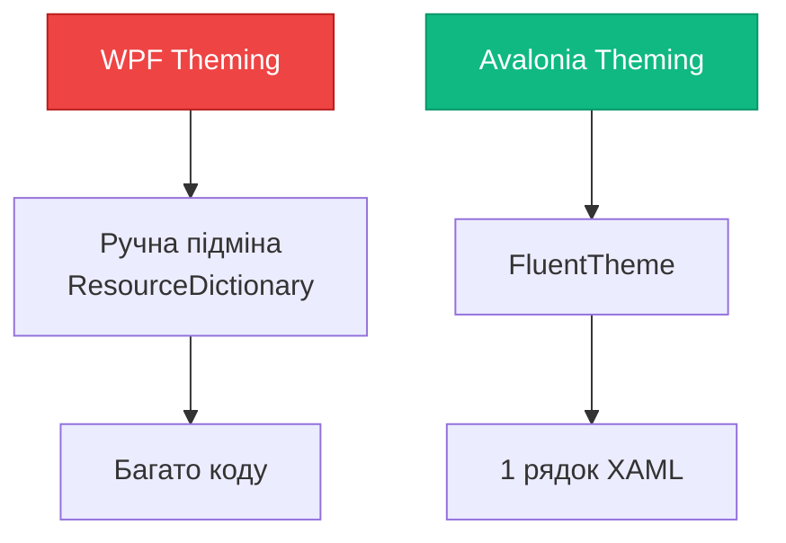
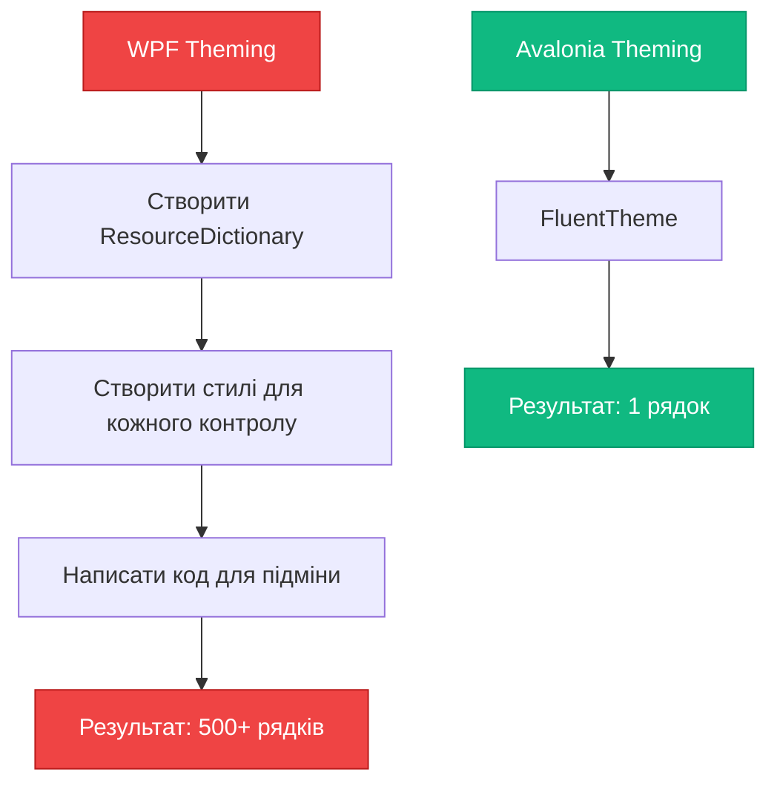

# Avalonia Themes: Fluent Design та система тематизації

## Вступ

У попередній статті ми розглянули [Resources та Themes у WPF](30.resources-themes), де для зміни теми потрібно вручну підміняти `ResourceDictionary` через `MergedDictionaries`. Це працює, але вимагає багато ручної роботи.

**Проблема WPF:**

```csharp
// WPF — ручна підміна теми
private void SwitchTheme(string theme)
{
    var dictionaries = Application.Current.Resources.MergedDictionaries;
    dictionaries.Clear();
    
    dictionaries.Add(new ResourceDictionary 
    { 
        Source = new Uri($"Themes/{theme}.xaml", UriKind.Relative) 
    });
}
```

**Avalonia має вбудовану систему тематизації:**

- ✅ **Fluent Theme** — готова тема у стилі Windows 11 Fluent Design
- ✅ **ThemeVariant** — автоматичне перемикання Dark/Light
- ✅ **Runtime switching** — зміна теми без перезавантаження
- ✅ **System theme following** — автоматичне слідування за системною темою
- ✅ **Community themes** — Material.Avalonia, Semi.Avalonia

::note
**Для кого ця стаття?** Якщо ви вже знайомі з [WPF Resources та Themes](30.resources-themes) та [Avalonia CSS Styling](27a.avalonia-css-styling), ця стаття покаже вбудовану систему тематизації Avalonia, що набагато потужніша за WPF.
::

---

## Fluent Theme: Windows 11 Fluent Design у Avalonia

**Fluent Theme** — це вбудована тема Avalonia, що імітує дизайн Windows 11 з підтримкою Dark/Light режимів.

### Підключення Fluent Theme

**App.axaml:**

```xml
<Application xmlns="https://github.com/avaloniaui"
             xmlns:x="http://schemas.microsoft.com/winfx/2006/xaml"
             x:Class="MyApp.App">
    <Application.Styles>
        <!-- Fluent Theme -->
        <FluentTheme />
    </Application.Styles>
</Application>
```

**Що це дає:**

- ✅ Всі контроли мають стиль Windows 11
- ✅ Автоматична підтримка Dark/Light режимів
- ✅ Акцентний колір (SystemAccentColor)
- ✅ Rounded corners, shadows, animations

### Порівняння з WPF

| Аспект | WPF | Avalonia Fluent Theme |
|--------|-----|----------------------|
| Підключення | Ручне (MergedDictionaries) | `<FluentTheme />` |
| Dark/Light | Ручна підміна словників | Вбудований ThemeVariant |
| Акцентний колір | Ручна реалізація | SystemAccentColor |
| Стиль | Aero (застарілий) | Windows 11 Fluent Design |
| Оновлення | Не оновлюється | Регулярні оновлення |

::mermaid

::

---

## ThemeVariant: Dark/Light режими

**ThemeVariant** — це механізм Avalonia для перемикання між світлою та темною темами.

### Встановлення ThemeVariant

**Метод 1: На рівні Application**

```xml
<Application xmlns="https://github.com/avaloniaui"
             RequestedThemeVariant="Dark">
    <Application.Styles>
        <FluentTheme />
    </Application.Styles>
</Application>
```

**Метод 2: На рівні Window**

```xml
<Window xmlns="https://github.com/avaloniaui"
        RequestedThemeVariant="Light">
    <!-- Контент -->
</Window>
```

**Метод 3: На рівні Control**

```xml
<Border RequestedThemeVariant="Dark">
    <!-- Темний контент всередині світлого вікна -->
</Border>
```

### Доступні значення

| Значення | Опис |
|----------|------|
| `Default` | Слідує за системною темою (Windows, macOS, Linux) |
| `Light` | Світла тема |
| `Dark` | Темна тема |


### Runtime switching: Зміна теми у коді

**C# код:**

```csharp
using Avalonia;
using Avalonia.Styling;

public partial class MainWindow : Window
{
    public MainWindow()
    {
        InitializeComponent();
    }
    
    private void SwitchToDark()
    {
        // Змінити тему на рівні Application
        Application.Current.RequestedThemeVariant = ThemeVariant.Dark;
    }
    
    private void SwitchToLight()
    {
        Application.Current.RequestedThemeVariant = ThemeVariant.Light;
    }
    
    private void FollowSystem()
    {
        Application.Current.RequestedThemeVariant = ThemeVariant.Default;
    }
}
```

**З ViewModel (MVVM):**

```csharp
public partial class SettingsViewModel : ObservableObject
{
    [ObservableProperty]
    private string _selectedTheme = "Default";
    
    partial void OnSelectedThemeChanged(string value)
    {
        var themeVariant = value switch
        {
            "Light" => ThemeVariant.Light,
            "Dark" => ThemeVariant.Dark,
            _ => ThemeVariant.Default
        };
        
        Application.Current.RequestedThemeVariant = themeVariant;
    }
}
```

**XAML з ComboBox:**

```xml
<StackPanel Margin="20">
    <TextBlock Text="Тема:" FontWeight="Bold"/>
    <ComboBox SelectedItem="{Binding SelectedTheme}" Margin="0,5,0,0">
        <ComboBoxItem Content="Системна (Default)"/>
        <ComboBoxItem Content="Світла (Light)"/>
        <ComboBoxItem Content="Темна (Dark)"/>
    </ComboBox>
</StackPanel>
```

### Автоматичне слідування за системною темою

**Переваги `ThemeVariant.Default`:**

- ✅ Автоматично змінюється при зміні системної теми
- ✅ Працює на Windows, macOS, Linux
- ✅ Користувач не потребує налаштувань у додатку

**Приклад:**

```xml
<Application RequestedThemeVariant="Default">
    <Application.Styles>
        <FluentTheme />
    </Application.Styles>
</Application>
```

Тепер додаток автоматично перемикається між світлою та темною темою разом з системою.

---

## Тематичні ресурси: DynamicResource

Avalonia автоматично змінює значення ресурсів залежно від `ThemeVariant`.

### Системні ресурси

**Приклад використання:**

```xml
<Border Background="{DynamicResource SystemAccentColor}"
        BorderBrush="{DynamicResource SystemControlForegroundBaseMediumBrush}"
        BorderThickness="1"
        CornerRadius="8"
        Padding="20">
    <TextBlock Text="Акцентний колір"
               Foreground="{DynamicResource SystemControlForegroundBaseHighBrush}"/>
</Border>
```

**Ключові системні ресурси:**

| Ресурс | Опис |
|--------|------|
| `SystemAccentColor` | Акцентний колір системи |
| `SystemAccentColorLight1` | Світліший відтінок акценту |
| `SystemAccentColorDark1` | Темніший відтінок акценту |
| `SystemControlForegroundBaseHighBrush` | Основний текст |
| `SystemControlForegroundBaseMediumBrush` | Вторинний текст |
| `SystemControlBackgroundAltHighBrush` | Альтернативний фон |
| `SystemControlHighlightAccentBrush` | Підсвічування акцентом |

### Кастомні тематичні ресурси

**Визначення ресурсів для різних тем:**

```xml
<Application.Resources>
    <ResourceDictionary>
        <ResourceDictionary.ThemeDictionaries>
            <!-- Світла тема -->
            <ResourceDictionary x:Key="Light">
                <SolidColorBrush x:Key="MyCustomBrush" Color="#2196F3"/>
                <x:Double x:Key="MyCustomOpacity">0.9</x:Double>
            </ResourceDictionary>
            
            <!-- Темна тема -->
            <ResourceDictionary x:Key="Dark">
                <SolidColorBrush x:Key="MyCustomBrush" Color="#64B5F6"/>
                <x:Double x:Key="MyCustomOpacity">0.8</x:Double>
            </ResourceDictionary>
        </ResourceDictionary.ThemeDictionaries>
    </ResourceDictionary>
</Application.Resources>
```

**Використання:**

```xml
<Border Background="{DynamicResource MyCustomBrush}"
        Opacity="{DynamicResource MyCustomOpacity}">
    <!-- Автоматично змінюється при зміні теми -->
</Border>
```

**Ключові моменти:**

1. **`ThemeDictionaries`** — словник словників для різних тем
2. **`x:Key="Light"` / `x:Key="Dark"`** — ключі для світлої та темної теми
3. **`DynamicResource`** — обов'язково для автоматичної зміни

---

## Simple Theme: Мінімальна тема для кастомізації

**Simple Theme** — це мінімальна тема Avalonia без зайвих стилів. Ідеально для створення власного дизайну з нуля.

### Підключення Simple Theme

```xml
<Application xmlns="https://github.com/avaloniaui">
    <Application.Styles>
        <SimpleTheme />
    </Application.Styles>
</Application>
```

**Відмінності від Fluent Theme:**

| Аспект | Fluent Theme | Simple Theme |
|--------|--------------|--------------|
| Стилізація | Повна (Windows 11) | Мінімальна |
| Розмір | ~500 KB | ~50 KB |
| Кастомізація | Складна | Легка |
| Використання | Production додатки | Кастомний дизайн |

**Коли використовувати Simple Theme:**

- ✅ Створення власного дизайну з нуля
- ✅ Мінімалістичні додатки
- ✅ Прототипування
- ✅ Навчальні проєкти

---

## Community Themes: Material та Semi

Avalonia має активну спільноту, що створює альтернативні теми.

### Material.Avalonia: Material Design

**Встановлення:**

```bash
dotnet add package Material.Avalonia
```

**Підключення:**

```xml
<Application xmlns="https://github.com/avaloniaui"
             xmlns:themes="clr-namespace:Material.Styles.Themes;assembly=Material.Styles">
    <Application.Styles>
        <themes:MaterialTheme BaseTheme="Dark" PrimaryColor="Blue" SecondaryColor="Lime"/>
    </Application.Styles>
</Application>
```

**Переваги:**

- ✅ Material Design від Google
- ✅ Багато готових компонентів
- ✅ Кастомізація кольорів
- ✅ Анімації та transitions

### Semi.Avalonia: Semi Design

**Встановлення:**

```bash
dotnet add package Semi.Avalonia
```

**Підключення:**

```xml
<Application xmlns="https://github.com/avaloniaui"
             xmlns:semiTheme="clr-namespace:Semi.Avalonia.Themes;assembly=Semi.Avalonia">
    <Application.Styles>
        <semiTheme:SemiTheme Locale="zh-CN"/>
    </Application.Styles>
</Application>
```

**Переваги:**

- ✅ Semi Design від ByteDance (TikTok)
- ✅ Сучасний дизайн
- ✅ Підтримка локалізації
- ✅ Багато компонентів

### Порівняння тем

| Тема | Стиль | Розмір | Підтримка | Використання |
|------|-------|--------|-----------|--------------|
| Fluent | Windows 11 | Середній | Офіційна | За замовчуванням |
| Simple | Мінімалістичний | Малий | Офіційна | Кастомізація |
| Material | Material Design | Великий | Community | Android-подібні додатки |
| Semi | Semi Design | Великий | Community | Сучасні додатки |


---

## Кастомізація Fluent Theme

Fluent Theme можна кастомізувати через властивості.

### Зміна акцентного кольору

**Метод 1: Через XAML**

```xml
<Application xmlns="https://github.com/avaloniaui">
    <Application.Styles>
        <FluentTheme>
            <FluentTheme.Palettes>
                <ColorPaletteResources x:Key="Light" Accent="#FF6B35" AltHigh="White"/>
                <ColorPaletteResources x:Key="Dark" Accent="#FF6B35" AltHigh="Black"/>
            </FluentTheme.Palettes>
        </FluentTheme>
    </Application.Styles>
</Application>
```

**Метод 2: Через код**

```csharp
var fluentTheme = Application.Current.Styles.OfType<FluentTheme>().FirstOrDefault();
if (fluentTheme != null)
{
    fluentTheme.Palettes[ThemeVariant.Light].Accent = Color.Parse("#FF6B35");
    fluentTheme.Palettes[ThemeVariant.Dark].Accent = Color.Parse("#FF6B35");
}
```

### Density: Щільність інтерфейсу

**Fluent Theme підтримує різну щільність:**

```xml
<FluentTheme DensityStyle="Compact"/>
<!-- або -->
<FluentTheme DensityStyle="Normal"/>
```

**Відмінності:**

| Density | Padding | FontSize | Використання |
|---------|---------|----------|--------------|
| Normal | Стандартний | 14px | Desktop додатки |
| Compact | Зменшений | 12px | Інформаційні панелі, таблиці |

---

## Порівняння: WPF vs Avalonia Theming

Розберемо детально відмінності у підходах до тематизації.

### WPF: Ручна робота

**Структура:**

```
Themes/
├── Light.xaml
├── Dark.xaml
└── Blue.xaml
```

**App.xaml:**

```xml
<Application.Resources>
    <ResourceDictionary>
        <ResourceDictionary.MergedDictionaries>
            <ResourceDictionary Source="Themes/Light.xaml"/>
        </ResourceDictionary.MergedDictionaries>
    </ResourceDictionary>
</Application.Resources>
```

**Зміна теми:**

```csharp
private void SwitchTheme(string theme)
{
    var dictionaries = Application.Current.Resources.MergedDictionaries;
    dictionaries.Clear();
    dictionaries.Add(new ResourceDictionary 
    { 
        Source = new Uri($"Themes/{theme}.xaml", UriKind.Relative) 
    });
}
```

**Проблеми:**

- ❌ Багато ручного коду
- ❌ Потрібно створювати всі стилі вручну
- ❌ Немає вбудованої підтримки системної теми
- ❌ Складно підтримувати

### Avalonia: Вбудована система

**App.axaml:**

```xml
<Application RequestedThemeVariant="Default">
    <Application.Styles>
        <FluentTheme />
    </Application.Styles>
</Application>
```

**Зміна теми:**

```csharp
Application.Current.RequestedThemeVariant = ThemeVariant.Dark;
```

**Переваги:**

- ✅ 1 рядок для підключення теми
- ✅ Вбудована підтримка Dark/Light
- ✅ Автоматичне слідування за системою
- ✅ Готові стилі для всіх контролів

### Порівняльна таблиця

| Аспект | WPF | Avalonia |
|--------|-----|----------|
| Підключення теми | 10+ рядків XAML | 1 рядок |
| Зміна теми | 5+ рядків C# | 1 рядок |
| Dark/Light | Ручна реалізація | Вбудована |
| Системна тема | Немає | ThemeVariant.Default |
| Акцентний колір | Ручна реалізація | SystemAccentColor |
| Стилі контролів | Створювати вручну | Готові |
| Підтримка | Застаріла | Активна |

::mermaid

::

---

## Практичні завдання

### Рівень 1: Перемикач Dark/Light через RequestedThemeVariant

**Мета:** Навчитися перемикати теми у Avalonia.

**Завдання:**

Створіть додаток з перемикачем теми:

1. **UI:**
   - ToggleSwitch для перемикання Dark/Light
   - Кілька контролів для демонстрації (Button, TextBox, Border)

2. **Функціональність:**
   - При зміні ToggleSwitch → змінити `RequestedThemeVariant`
   - Використати `DynamicResource` для кольорів

**Критерії успіху:**

- Тема змінюється при перемиканні ToggleSwitch
- Всі контроли оновлюються автоматично
- Використано `DynamicResource` для тематичних кольорів

**Підказка XAML:**

```xml
<Window xmlns="https://github.com/avaloniaui"
        x:Class="MyApp.MainWindow"
        Title="Theme Switcher" Width="400" Height="300">
    
    <StackPanel Margin="20" Spacing="10">
        <ToggleSwitch Content="Темна тема" 
                      IsChecked="{Binding IsDarkTheme}"
                      OffContent="Світла тема"
                      OnContent="Темна тема"/>
        
        <Border Background="{DynamicResource SystemAccentColor}"
                Padding="20"
                CornerRadius="8">
            <TextBlock Text="Акцентний колір"
                       Foreground="White"
                       FontSize="16"/>
        </Border>
        
        <Button Content="Кнопка з темою" HorizontalAlignment="Stretch"/>
        
        <TextBox Watermark="Введіть текст..."/>
    </StackPanel>
</Window>
```

**Підказка C#:**

```csharp
public partial class MainWindow : Window
{
    public MainWindow()
    {
        InitializeComponent();
        DataContext = new MainViewModel();
    }
}

public partial class MainViewModel : ObservableObject
{
    [ObservableProperty]
    private bool _isDarkTheme;
    
    partial void OnIsDarkThemeChanged(bool value)
    {
        Application.Current.RequestedThemeVariant = value 
            ? ThemeVariant.Dark 
            : ThemeVariant.Light;
    }
}
```

---

### Рівень 2: Кастомний AccentColor

**Мета:** Навчитися кастомізувати Fluent Theme.

**Завдання:**

Створіть додаток з вибором акцентного кольору:

1. **UI:**
   - ComboBox з кольорами (Blue, Red, Green, Purple, Orange)
   - Кілька контролів з акцентним кольором

2. **Функціональність:**
   - При виборі кольору → змінити `Accent` у `FluentTheme.Palettes`
   - Оновити всі контроли з `SystemAccentColor`

**Критерії успіху:**

- Акцентний колір змінюється при виборі з ComboBox
- Зміна працює для обох тем (Light/Dark)
- Всі контроли оновлюються автоматично

**Підказка:**

```csharp
public partial class MainViewModel : ObservableObject
{
    [ObservableProperty]
    private string _selectedColor = "Blue";
    
    partial void OnSelectedColorChanged(string value)
    {
        var color = value switch
        {
            "Red" => Color.Parse("#F44336"),
            "Green" => Color.Parse("#4CAF50"),
            "Purple" => Color.Parse("#9C27B0"),
            "Orange" => Color.Parse("#FF9800"),
            _ => Color.Parse("#2196F3") // Blue
        };
        
        var fluentTheme = Application.Current.Styles.OfType<FluentTheme>().FirstOrDefault();
        if (fluentTheme != null)
        {
            fluentTheme.Palettes[ThemeVariant.Light].Accent = color;
            fluentTheme.Palettes[ThemeVariant.Dark].Accent = color;
        }
    }
}
```

---

### Рівень 3: Автоматичне слідування за системною темою

**Мета:** Реалізувати автоматичне слідування за системною темою з можливістю override.

**Завдання:**

Створіть додаток з налаштуваннями теми:

1. **UI:**
   - RadioButton: "Системна", "Світла", "Темна"
   - Індикатор поточної теми
   - Демонстраційні контроли

2. **Функціональність:**
   - "Системна" → `ThemeVariant.Default` (слідує за ОС)
   - "Світла" → `ThemeVariant.Light`
   - "Темна" → `ThemeVariant.Dark`
   - Показати поточну активну тему (Light/Dark)

3. **Додатково:**
   - Зберегти вибір у Settings
   - Застосувати при запуску

**Критерії успіху:**

- Системна тема працює (змінюється разом з ОС)
- Ручний вибір override системну тему
- Налаштування зберігаються між запусками
- Показується поточна активна тема

**Підказка:**

```csharp
public partial class SettingsViewModel : ObservableObject
{
    [ObservableProperty]
    private string _themeMode = "System";
    
    [ObservableProperty]
    private string _currentActiveTheme;
    
    public SettingsViewModel()
    {
        // Завантажити збережені налаштування
        LoadSettings();
        
        // Підписатися на зміни теми
        Application.Current.ActualThemeVariantChanged += OnThemeChanged;
        
        UpdateCurrentTheme();
    }
    
    partial void OnThemeModeChanged(string value)
    {
        var themeVariant = value switch
        {
            "Light" => ThemeVariant.Light,
            "Dark" => ThemeVariant.Dark,
            _ => ThemeVariant.Default
        };
        
        Application.Current.RequestedThemeVariant = themeVariant;
        SaveSettings();
    }
    
    private void OnThemeChanged(object sender, EventArgs e)
    {
        UpdateCurrentTheme();
    }
    
    private void UpdateCurrentTheme()
    {
        CurrentActiveTheme = Application.Current.ActualThemeVariant == ThemeVariant.Dark 
            ? "Темна" 
            : "Світла";
    }
    
    private void LoadSettings()
    {
        // Завантажити з файлу або реєстру
        ThemeMode = Preferences.Get("ThemeMode", "System");
    }
    
    private void SaveSettings()
    {
        // Зберегти у файл або реєстр
        Preferences.Set("ThemeMode", ThemeMode);
    }
}
```

---

## Підсумок

Avalonia має вбудовану потужну систему тематизації, що набагато зручніша за WPF.

**Ключові висновки:**

::card-group

::card{title="🎨 Fluent Theme" icon="i-lucide-palette"}
Вбудована тема у стилі Windows 11. Підключення одним рядком, готові стилі для всіх контролів.
::

::card{title="🌓 ThemeVariant" icon="i-lucide-moon"}
Автоматичне перемикання Dark/Light. ThemeVariant.Default слідує за системною темою.
::

::card{title="🔄 Runtime Switching" icon="i-lucide-refresh-cw"}
Зміна теми без перезавантаження. Application.Current.RequestedThemeVariant = ThemeVariant.Dark.
::

::card{title="🎯 DynamicResource" icon="i-lucide-target"}
Тематичні ресурси автоматично змінюються. SystemAccentColor, SystemControlForegroundBaseHighBrush.
::

::card{title="🎭 Community Themes" icon="i-lucide-users"}
Material.Avalonia, Semi.Avalonia — альтернативні теми від спільноти.
::

::card{title="⚡ Простота" icon="i-lucide-zap"}
1 рядок замість 500+ у WPF. Вбудована підтримка замість ручної реалізації.
::

::

**Переваги Avalonia Theming:**

- ✅ Вбудована система — не потрібно створювати з нуля
- ✅ Fluent Theme — сучасний дизайн Windows 11
- ✅ ThemeVariant — автоматичне Dark/Light
- ✅ System following — слідування за ОС
- ✅ DynamicResource — автоматична зміна кольорів
- ✅ Community themes — Material, Semi
- ✅ Простота — 1 рядок замість 500+

**Порівняння з WPF:**

| Аспект | WPF | Avalonia |
|--------|-----|----------|
| Складність | Висока | Низька |
| Рядків коду | 500+ | 1-10 |
| Підтримка Dark/Light | Ручна | Вбудована |
| Системна тема | Немає | ThemeVariant.Default |
| Готові теми | Немає | Fluent, Simple |

::tip
**Рекомендація:** Використовуйте Fluent Theme для більшості додатків. Для кастомного дизайну — Simple Theme як базу. Для Material Design — Material.Avalonia.
::

**Що далі?**

Ви завершили Block 8: Стилізація! Наступний блок — **Просунуті контроли**:

- **Collection Controls** (стаття 31) — ListBox, ListView, TreeView
- **DataGrid** (стаття 32) — таблиці з сортуванням, фільтрацією, редагуванням

---

## Словник термінів

::note{title="📚 Глосарій"}

**Fluent Theme** — вбудована тема Avalonia у стилі Windows 11 Fluent Design.

**ThemeVariant** — механізм Avalonia для перемикання між світлою та темною темами.

**RequestedThemeVariant** — властивість для встановлення бажаної теми (Default, Light, Dark).

**ActualThemeVariant** — поточна активна тема (враховує системну тему для Default).

**SystemAccentColor** — акцентний колір системи (Windows, macOS, Linux).

**DynamicResource** — ресурс, що автоматично оновлюється при зміні теми.

**ThemeDictionaries** — словник словників для різних тем (Light, Dark).

**Simple Theme** — мінімальна тема Avalonia для кастомізації з нуля.

**Material.Avalonia** — community тема у стилі Material Design від Google.

**Semi.Avalonia** — community тема у стилі Semi Design від ByteDance.

**ColorPaletteResources** — набір кольорів для кастомізації Fluent Theme.

**DensityStyle** — щільність інтерфейсу (Normal, Compact).

::

---

## Додаткові ресурси

::card-group

::card{title="📖 Avalonia Themes Docs" icon="i-lucide-book-open" to="https://docs.avaloniaui.net/docs/guides/styles-and-resources/how-to-use-theme-variants"}
Офіційна документація про ThemeVariant та теми.
::

::card{title="🎨 Fluent Theme" icon="i-lucide-palette" to="https://docs.avaloniaui.net/docs/reference/styles/fluent"}
Повний гайд з Fluent Theme та кастомізації.
::

::card{title="🌓 Material.Avalonia" icon="i-lucide-moon" to="https://github.com/AvaloniaCommunity/Material.Avalonia"}
Material Design тема для Avalonia від спільноти.
::

::card{title="🎭 Semi.Avalonia" icon="i-lucide-users" to="https://github.com/irihitech/Semi.Avalonia"}
Semi Design тема для Avalonia.
::

::card{title="📚 Попередня стаття: Resources and Themes" icon="i-lucide-arrow-left" to="30.resources-themes"}
Повернутися до WPF Resources та Themes.
::

::card{title="📚 Наступна стаття: Collection Controls" icon="i-lucide-arrow-right" to="31.collection-controls"}
Дізнатися про ListBox, ListView, TreeView та інші колекційні контроли.
::

::
