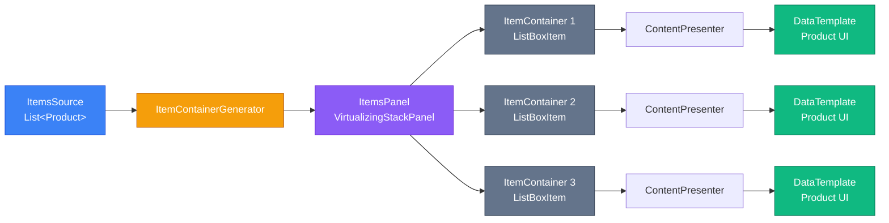

# Контроли колекцій: глибоке занурення

Коли ви працюєте з даними у desktop-застосунках, рано чи пізно виникає потреба відобразити список об'єктів — продуктів, користувачів, замовлень, повідомлень. У WPF та Avalonia для цього існує потужна система контролів колекцій, яка дозволяє не просто показати дані, а й повністю контролювати їхній вигляд, поведінку та продуктивність.

У цій статті ми розберемо архітектуру `ItemsControl` — базового класу для всіх контролів колекцій, дослідимо, як WPF перетворює колекцію об'єктів на UI-елементи, і навчимося створювати складні візуалізації даних через `ListBox` та `ListView`.

::note
**Для кого ця стаття?**

Ця стаття призначена для студентів, які вже знайомі з базовими контролами WPF/Avalonia (Button, TextBox, StackPanel) та розуміють концепцію Data Binding. Якщо ви вже створювали прості інтерфейси з кнопками та текстовими полями, але хочете навчитися працювати зі списками даних — ви в правильному місці.
::

## Навіщо потрібні контроли колекцій?

Уявіть, що вам потрібно відобразити список із 100 продуктів. Ви могли б створити 100 окремих `TextBlock` елементів вручну, але це було б абсолютно непрактично. Контроли колекцій вирішують цю проблему елегантно:

::card-group
::card{title="🔄 Автоматична генерація UI" icon="i-lucide-refresh-cw"}
Ви передаєте колекцію об'єктів, а контрол автоматично створює візуальні елементи для кожного об'єкта.
::

::card{title="📊 Шаблонізація" icon="i-lucide-layout-template"}
Ви визначаєте один шаблон (`DataTemplate`), який застосовується до всіх елементів колекції.
::

::card{title="⚡ Віртуалізація" icon="i-lucide-zap"}
Для великих списків створюються лише видимі елементи, що економить пам'ять та підвищує продуктивність.
::

::card{title="🎯 Інтерактивність" icon="i-lucide-mouse-pointer-click"}
Вбудована підтримка виділення, прокрутки, навігації клавіатурою та інших взаємодій.
::
::

## Архітектура ItemsControl

`ItemsControl` — це базовий клас для всіх контролів, що відображають колекції даних. Від нього успадковуються `ListBox`, `ListView`, `ComboBox`, `TreeView` та інші. Розуміння його архітектури — ключ до майстерного володіння контролами колекцій.

### Як працює ItemsControl: від даних до UI

Коли ви встановлюєте властивість `ItemsSource`, запускається складний процес перетворення даних на візуальні елементи:

::mermaid

::

Розберемо кожен етап детально:

**1. ItemsSource** — це колекція об'єктів, яку ви прив'язуєте до контрола. Це може бути `List<T>`, `ObservableCollection<T>`, масив або будь-який інший тип, що реалізує `IEnumerable`.

**2. ItemContainerGenerator** — внутрішній механізм WPF, який відповідає за створення контейнерів для кожного елемента даних. Він знає, який тип контейнера потрібен (для `ListBox` це `ListBoxItem`, для `ComboBox` — `ComboBoxItem`).

**3. ItemsPanel** — панель, яка розташовує контейнери. За замовчуванням це `VirtualizingStackPanel` (вертикальний список), але ви можете замінити її на `WrapPanel`, `UniformGrid` або навіть `Canvas`.

**4. ItemContainer** — обгортка навколо кожного елемента даних. Вона надає функціональність виділення, hover-ефектів, фокусу та інших інтерактивних можливостей.

**5. ContentPresenter** — елемент, який відображає вміст контейнера згідно з `DataTemplate`.

**6. DataTemplate** — шаблон, який визначає, як саме виглядатиме кожен елемент даних.

### Чому це важливо розуміти?

Розуміння цієї архітектури дозволяє вам:

- **Оптимізувати продуктивність**: знаючи про віртуалізацію, ви можете правильно налаштувати `ItemsPanel`.
- **Кастомізувати вигляд**: розуміючи різницю між `ItemTemplate` (шаблон даних) та `ItemContainerStyle` (стиль контейнера), ви можете створювати складні візуалізації.
- **Діагностувати проблеми**: коли щось працює не так, як очікувалося, ви знаєте, на якому етапі шукати проблему.

## ItemsPanel: зміна розташування елементів

За замовчуванням `ItemsControl` використовує `VirtualizingStackPanel` для вертикального розташування елементів. Але що, якщо вам потрібен горизонтальний список? Або сітка? Або навіть довільне розташування?

### Заміна ItemsPanel

Властивість `ItemsPanel` дозволяє замінити стандартну панель на будь-яку іншу:

::wpf-preview{title="Горизонтальний ListBox"}
```xml
<Window xmlns="https://github.com/avaloniaui"
        xmlns:x="http://schemas.microsoft.com/winfx/2006/xaml"
        Width="600" Height="200">
    <ListBox Margin="20">
        <ListBox.ItemsPanel>
            <ItemsPanelTemplate>
                <StackPanel Orientation="Horizontal" />
            </ItemsPanelTemplate>
        </ListBox.ItemsPanel>
        
        <ListBoxItem Content="Елемент 1" />
        <ListBoxItem Content="Елемент 2" />
        <ListBoxItem Content="Елемент 3" />
        <ListBoxItem Content="Елемент 4" />
        <ListBoxItem Content="Елемент 5" />
    </ListBox>
</Window>
```
::

::note
**Avalonia vs WPF**: В Avalonia рендеринг може відрізнятися від реального WPF, особливо в стилізації `ListBoxItem`. У реальному WPF елементи матимуть більш виражені рамки при виділенні.
::

### WrapPanel для адаптивних сіток

`WrapPanel` автоматично переносить елементи на новий рядок, коли вони не вміщуються по ширині. Це ідеально для галерей зображень або карткових інтерфейсів:

::wpf-preview{title="Галерея з WrapPanel"}
```xml
<Window xmlns="https://github.com/avaloniaui"
        xmlns:x="http://schemas.microsoft.com/winfx/2006/xaml"
        Width="500" Height="400">
    <ListBox Margin="20" ScrollViewer.HorizontalScrollBarVisibility="Disabled">
        <ListBox.ItemsPanel>
            <ItemsPanelTemplate>
                <WrapPanel />
            </ItemsPanelTemplate>
        </ListBox.ItemsPanel>
        
        <ListBox.ItemTemplate>
            <DataTemplate>
                <Border Width="100" Height="100" 
                        Background="#3b82f6" 
                        CornerRadius="8" 
                        Margin="5">
                    <TextBlock Text="{Binding}" 
                               HorizontalAlignment="Center" 
                               VerticalAlignment="Center"
                               Foreground="White"
                               FontWeight="Bold" />
                </Border>
            </DataTemplate>
        </ListBox.ItemTemplate>
        
        <ListBoxItem Content="1" />
        <ListBoxItem Content="2" />
        <ListBoxItem Content="3" />
        <ListBoxItem Content="4" />
        <ListBoxItem Content="5" />
        <ListBoxItem Content="6" />
        <ListBoxItem Content="7" />
        <ListBoxItem Content="8" />
    </ListBox>
</Window>
```
::

### UniformGrid для рівномірних сіток

`UniformGrid` розподіляє елементи по рівномірній сітці з однаковими розмірами комірок:

::wpf-preview{title="Сітка продуктів"}
```xml
<Window xmlns="https://github.com/avaloniaui"
        xmlns:x="http://schemas.microsoft.com/winfx/2006/xaml"
        Width="600" Height="400">
    <ListBox Margin="20">
        <ListBox.ItemsPanel>
            <ItemsPanelTemplate>
                <UniformGrid Columns="3" />
            </ItemsPanelTemplate>
        </ListBox.ItemsPanel>
        
        <ListBox.ItemTemplate>
            <DataTemplate>
                <Border Background="#f3f4f6" 
                        CornerRadius="8" 
                        Padding="15"
                        Margin="5">
                    <StackPanel>
                        <TextBlock Text="{Binding}" 
                                   FontWeight="Bold" 
                                   FontSize="16" />
                        <TextBlock Text="$99.99" 
                                   Foreground="#6b7280" 
                                   Margin="0,5,0,0" />
                    </StackPanel>
                </Border>
            </DataTemplate>
        </ListBox.ItemTemplate>
        
        <ListBoxItem Content="Продукт 1" />
        <ListBoxItem Content="Продукт 2" />
        <ListBoxItem Content="Продукт 3" />
        <ListBoxItem Content="Продукт 4" />
        <ListBoxItem Content="Продукт 5" />
        <ListBoxItem Content="Продукт 6" />
    </ListBox>
</Window>
```
::

### Порівняння панелей

| Панель | Розташування | Віртуалізація | Використання |
|--------|--------------|---------------|--------------|
| `StackPanel` | Вертикально/горизонтально | ❌ Ні | Невеликі списки |
| `VirtualizingStackPanel` | Вертикально/горизонтально | ✅ Так | Великі списки (за замовчуванням) |
| `WrapPanel` | Адаптивна сітка | ❌ Ні | Галереї, теги |
| `UniformGrid` | Рівномірна сітка | ❌ Ні | Каталоги продуктів |
| `Canvas` | Абсолютне позиціонування | ❌ Ні | Діаграми, графіки |

::tip
**Віртуалізація та продуктивність**

Якщо у вас список із тисячами елементів, обов'язково використовуйте `VirtualizingStackPanel`. Без віртуалізації WPF створить візуальні елементи для всіх об'єктів одразу, що призведе до затримок при завантаженні та великого споживання пам'яті.
::


## ItemContainerStyle: стилізація контейнерів

Коли ви працюєте з `ListBox`, кожен елемент даних обгортається в `ListBoxItem` — це і є контейнер. `ItemContainerStyle` дозволяє стилізувати ці контейнери, змінюючи їхній вигляд при наведенні, виділенні або в звичайному стані.

### Базова стилізація контейнера

::wpf-preview{title="Кастомний стиль ListBoxItem"}
```xml
<Window xmlns="https://github.com/avaloniaui"
        xmlns:x="http://schemas.microsoft.com/winfx/2006/xaml"
        Width="400" Height="300">
    <ListBox Margin="20">
        <ListBox.ItemContainerStyle>
            <Style Selector="ListBoxItem">
                <Setter Property="Margin" Value="0,0,0,10" />
                <Setter Property="Padding" Value="15" />
                <Setter Property="Background" Value="#f3f4f6" />
                <Setter Property="CornerRadius" Value="8" />
                
                <Style Selector="^:pointerover">
                    <Setter Property="Background" Value="#e5e7eb" />
                </Style>
                
                <Style Selector="^:selected">
                    <Setter Property="Background" Value="#3b82f6" />
                    <Setter Property="Foreground" Value="White" />
                </Style>
            </Style>
        </ListBox.ItemContainerStyle>
        
        <ListBoxItem Content="Перший елемент" />
        <ListBoxItem Content="Другий елемент" />
        <ListBoxItem Content="Третій елемент" />
        <ListBoxItem Content="Четвертий елемент" />
    </ListBox>
</Window>
```
::

### Alternating Row Colors (зебра-стиль)

Для покращення читабельності довгих списків часто використовують чергування кольорів рядків. WPF надає для цього властивість `AlternationCount`:

::wpf-preview{title="Зебра-стиль для списку"}
```xml
<Window xmlns="https://github.com/avaloniaui"
        xmlns:x="http://schemas.microsoft.com/winfx/2006/xaml"
        Width="400" Height="350">
    <ListBox Margin="20" AlternationCount="2">
        <ListBox.ItemContainerStyle>
            <Style Selector="ListBoxItem">
                <Setter Property="Padding" Value="15,10" />
                <Setter Property="Background" Value="White" />
                
                <Style Selector="^:nth-child(2n)">
                    <Setter Property="Background" Value="#f9fafb" />
                </Style>
                
                <Style Selector="^:selected">
                    <Setter Property="Background" Value="#3b82f6" />
                    <Setter Property="Foreground" Value="White" />
                </Style>
            </Style>
        </ListBox.ItemContainerStyle>
        
        <ListBoxItem Content="Рядок 1" />
        <ListBoxItem Content="Рядок 2" />
        <ListBoxItem Content="Рядок 3" />
        <ListBoxItem Content="Рядок 4" />
        <ListBoxItem Content="Рядок 5" />
        <ListBoxItem Content="Рядок 6" />
        <ListBoxItem Content="Рядок 7" />
        <ListBoxItem Content="Рядок 8" />
    </ListBox>
</Window>
```
::

::note
**AlternationCount та AlternationIndex**

`AlternationCount` визначає, скільки різних стилів чергуються (зазвичай 2 для зебри). `AlternationIndex` — це attached property, яка містить індекс поточного елемента в циклі чергування (0, 1, 0, 1...). Ви можете використовувати `AlternationIndex` у тригерах для застосування різних стилів.
::

### Складна стилізація з іконками та бейджами

::wpf-preview{title="Список повідомлень з бейджами"}
```xml
<Window xmlns="https://github.com/avaloniaui"
        xmlns:x="http://schemas.microsoft.com/winfx/2006/xaml"
        Width="450" Height="400">
    <ListBox Margin="20">
        <ListBox.ItemContainerStyle>
            <Style Selector="ListBoxItem">
                <Setter Property="Padding" Value="0" />
                <Setter Property="Margin" Value="0,0,0,8" />
                <Setter Property="Background" Value="Transparent" />
                <Setter Property="BorderThickness" Value="0" />
            </Style>
        </ListBox.ItemContainerStyle>
        
        <ListBox.ItemTemplate>
            <DataTemplate>
                <Border Background="#f3f4f6" 
                        CornerRadius="8" 
                        Padding="15">
                    <Grid ColumnDefinitions="Auto,*,Auto">
                        <Border Grid.Column="0" 
                                Width="40" Height="40" 
                                Background="#3b82f6" 
                                CornerRadius="20"
                                Margin="0,0,12,0">
                            <TextBlock Text="📧" 
                                       HorizontalAlignment="Center" 
                                       VerticalAlignment="Center"
                                       FontSize="20" />
                        </Border>
                        
                        <StackPanel Grid.Column="1" VerticalAlignment="Center">
                            <TextBlock Text="{Binding}" 
                                       FontWeight="Bold" 
                                       FontSize="14" />
                            <TextBlock Text="2 хвилини тому" 
                                       Foreground="#6b7280" 
                                       FontSize="12" 
                                       Margin="0,2,0,0" />
                        </StackPanel>
                        
                        <Border Grid.Column="2" 
                                Background="#ef4444" 
                                CornerRadius="10" 
                                Padding="8,4"
                                VerticalAlignment="Center">
                            <TextBlock Text="NEW" 
                                       Foreground="White" 
                                       FontSize="10" 
                                       FontWeight="Bold" />
                        </Border>
                    </Grid>
                </Border>
            </DataTemplate>
        </ListBox.ItemTemplate>
        
        <ListBoxItem Content="Нове повідомлення від Олексія" />
        <ListBoxItem Content="Запрошення на зустріч" />
        <ListBoxItem Content="Оновлення системи" />
    </ListBox>
</Window>
```
::

## ListBox vs ListView: коли що використовувати

`ListBox` та `ListView` — два найпопулярніші контроли для відображення списків. Хоча вони дуже схожі, між ними є важливі відмінності.

### ListBox: простота та гнучкість

`ListBox` — це базовий контрол для відображення списків. Він простий, легкий у налаштуванні та підходить для більшості сценаріїв.

**Переваги ListBox:**
- Простота використання
- Повна свобода в кастомізації через `DataTemplate`
- Легка стилізація
- Підтримка множинного виділення

**Коли використовувати:**
- Прості списки елементів
- Меню навігації
- Списки з кастомним дизайном
- Коли не потрібна табличність

### ListView: розширені можливості

`ListView` успадковується від `ListBox` і додає підтримку різних режимів відображення, зокрема `GridView` для табличного вигляду.

**Переваги ListView:**
- Вбудована підтримка колонок через `GridView`
- Можливість сортування по колонках
- Більш структурований вигляд для табличних даних

**Коли використовувати:**
- Табличні дані з колонками
- Коли потрібне сортування по колонках
- Файлові менеджери, списки контактів
- Коли структура даних важливіша за дизайн

::card-group
::card{title="📋 ListBox" icon="i-lucide-list"}
**Використовуйте для:**
- Меню та навігації
- Списків повідомлень
- Галерей зображень
- Кастомних карткових інтерфейсів
::

::card{title="📊 ListView" icon="i-lucide-table"}
**Використовуйте для:**
- Таблиць з даними
- Файлових браузерів
- Списків контактів
- Звітів та аналітики
::
::

### Приклад ListView з GridView

::wpf-preview{title="Список контактів через ListView"}
```xml
<Window xmlns="https://github.com/avaloniaui"
        xmlns:x="http://schemas.microsoft.com/winfx/2006/xaml"
        Width="600" Height="300">
    <Grid Margin="20">
        <ListBox>
            <ListBox.ItemTemplate>
                <DataTemplate>
                    <Grid ColumnDefinitions="200,150,*" Margin="0,5">
                        <TextBlock Grid.Column="0" Text="{Binding}" FontWeight="Bold" />
                        <TextBlock Grid.Column="1" Text="example@email.com" Foreground="#6b7280" />
                        <TextBlock Grid.Column="2" Text="+380 XX XXX XX XX" Foreground="#6b7280" />
                    </Grid>
                </DataTemplate>
            </ListBox.ItemTemplate>
            
            <ListBoxItem Content="Іван Петренко" />
            <ListBoxItem Content="Марія Коваленко" />
            <ListBoxItem Content="Олександр Шевченко" />
            <ListBoxItem Content="Анна Мельник" />
        </ListBox>
    </Grid>
</Window>
```
::

::note
**Avalonia vs WPF**: В Avalonia немає класу `ListView` з `GridView` як у WPF. Замість цього використовується `DataGrid` для табличних даних або `ListBox` з кастомним `DataTemplate` для імітації колонок.
::

## 🔵 Recap: OOP концепції в контролах колекцій

Для студентів, які тільки опановують ООП, важливо зрозуміти, як принципи об'єктно-орієнтованого програмування застосовуються в архітектурі контролів колекцій:

**Успадкування (Inheritance):**
```
Object → DispatcherObject → DependencyObject → Visual → UIElement 
  → FrameworkElement → Control → ItemsControl → ListBox
```

Кожен клас у цій ієрархії додає нову функціональність. `ItemsControl` додає можливість роботи з колекціями, `ListBox` додає виділення елементів.

**Інкапсуляція (Encapsulation):**
`ItemContainerGenerator` — це приклад інкапсуляції. Ви не бачите, як саме створюються контейнери, але можете використовувати результат його роботи.

**Поліморфізм (Polymorphism):**
Властивість `ItemsPanel` приймає будь-яку панель, що успадковується від `Panel`. Це дозволяє підставляти різні реалізації (`StackPanel`, `WrapPanel`, `UniformGrid`) без зміни коду `ItemsControl`.

**Композиція (Composition):**
`ItemsControl` складається з багатьох компонентів: `ItemsPanel`, `ItemContainerGenerator`, `ScrollViewer`. Кожен компонент відповідає за свою частину функціональності.


## Практичні завдання

### Рівень 1: Горизонтальний ListBox з WrapPanel

**Мета:** Навчитися змінювати `ItemsPanel` для створення адаптивного розташування елементів.

**Завдання:**
Створіть застосунок з горизонтальним списком кольорових карток. Коли вікно звужується, картки повинні автоматично переноситися на новий рядок.

**Вимоги:**
- Використайте `ListBox` з `WrapPanel` як `ItemsPanel`
- Створіть колекцію з 10-15 кольорів (можна використати hex-коди)
- Кожна картка повинна бути квадратом 80×80 пікселів
- При наведенні картка повинна збільшуватися до 90×90 пікселів (використайте `ScaleTransform`)
- При кліку на картку її hex-код повинен копіюватися в `TextBox`

**Підказка:**
```xml
<ListBox.ItemsPanel>
    <ItemsPanelTemplate>
        <WrapPanel />
    </ItemsPanelTemplate>
</ListBox.ItemsPanel>
```

### Рівень 2: Галерея зображень з DataTemplate

**Мета:** Опанувати створення складних візуалізацій через `DataTemplate` та роботу з зображеннями.

**Завдання:**
Створіть галерею зображень у стилі Pinterest з картками різної висоти.

**Вимоги:**
- Створіть клас `Photo` з властивостями: `Title`, `Author`, `ImageUrl`, `Likes`
- Використайте `ObservableCollection<Photo>` як джерело даних
- Кожна картка повинна містити:
  - Зображення (можна використати placeholder URLs з https://picsum.photos/)
  - Назву фото
  - Ім'я автора
  - Кількість лайків з іконкою ❤️
- Використайте `WrapPanel` для адаптивного розташування
- При кліку на картку вона повинна відкриватися в повному розмірі (можна використати `Window` або `Popup`)

**Структура класу:**
```csharp
public class Photo
{
    public string Title { get; set; }
    public string Author { get; set; }
    public string ImageUrl { get; set; }
    public int Likes { get; set; }
}
```

### Рівень 3: Карткова сітка продуктів з ItemContainerStyle

**Мета:** Створити професійний інтерфейс каталогу продуктів з анімаціями та інтерактивністю.

**Завдання:**
Розробіть каталог інтернет-магазину з картками продуктів, фільтрацією та анімаціями.

**Вимоги:**
- Створіть клас `Product` з властивостями: `Name`, `Price`, `Category`, `ImageUrl`, `Rating`, `InStock`
- Використайте `UniformGrid` з 3 колонками
- Кожна картка повинна містити:
  - Зображення продукту
  - Назву
  - Ціну (з форматуванням валюти)
  - Рейтинг (зірочки ⭐)
  - Бейдж "В наявності" / "Немає в наявності"
  - Кнопку "Додати в кошик"
- Реалізуйте `ItemContainerStyle` з анімаціями:
  - При наведенні картка піднімається (TranslateTransform) та з'являється тінь
  - При кліку картка злегка "натискається" (ScaleTransform)
- Додайте `ComboBox` для фільтрації по категоріях
- Використайте `ICollectionView` для фільтрації без зміни вихідної колекції

**Додаткові виклики:**
- Додайте пошук по назві продукту
- Реалізуйте сортування по ціні (зростання/спадання)
- Додайте індикатор "NEW" для нових продуктів (додайте властивість `IsNew`)
- Реалізуйте "швидкий перегляд" при наведенні (показ додаткової інформації)

**Приклад структури:**
```csharp
public class Product : INotifyPropertyChanged
{
    public string Name { get; set; }
    public decimal Price { get; set; }
    public string Category { get; set; }
    public string ImageUrl { get; set; }
    public double Rating { get; set; }
    public bool InStock { get; set; }
    public bool IsNew { get; set; }
}

public class MainViewModel : INotifyPropertyChanged
{
    public ObservableCollection<Product> Products { get; set; }
    public ICollectionView ProductsView { get; set; }
    public string SearchText { get; set; }
    public string SelectedCategory { get; set; }
    
    private void ApplyFilters()
    {
        ProductsView.Filter = item =>
        {
            var product = item as Product;
            // Логіка фільтрації
        };
    }
}
```

## Резюме

У цій статті ми детально розібрали архітектуру контролів колекцій у WPF та Avalonia:

**Ключові концепції:**
- `ItemsControl` — базовий клас для всіх контролів колекцій, який перетворює дані на UI через ланцюжок: ItemsSource → ItemContainerGenerator → ItemsPanel → ItemContainer → DataTemplate
- `ItemsPanel` дозволяє змінювати розташування елементів (StackPanel, WrapPanel, UniformGrid, Canvas)
- `ItemContainerStyle` надає контроль над виглядом контейнерів (hover, selection, alternating colors)
- `ListBox` — простий та гнучкий контрол для більшості сценаріїв
- `ListView` — розширений контрол з підтримкою табличного вигляду через GridView

**Важливі принципи:**
- Використовуйте `VirtualizingStackPanel` для великих списків (тисячі елементів)
- Розділяйте відповідальність: `ItemTemplate` для даних, `ItemContainerStyle` для контейнера
- `AlternationCount` та `AlternationIndex` для зебра-стилю
- Вибирайте правильний контрол: `ListBox` для кастомного дизайну, `ListView` для табличних даних

**Наступні кроки:**
У наступній статті ми розглянемо `DataGrid` — найпотужніший контрол для роботи з табличними даними, який надає вбудовану підтримку сортування, фільтрації, редагування та валідації.

## Глосарій

::note
**Основні терміни:**

- **ItemsControl** — базовий клас для контролів, що відображають колекції даних
- **ItemsSource** — властивість для прив'язки колекції даних до контрола
- **ItemContainerGenerator** — внутрішній механізм WPF для створення контейнерів елементів
- **ItemsPanel** — панель, яка розташовує контейнери елементів
- **ItemContainer** — обгортка навколо елемента даних (ListBoxItem, ComboBoxItem тощо)
- **ItemTemplate** — шаблон для відображення даних елемента
- **ItemContainerStyle** — стиль для контейнера елемента
- **Віртуалізація** — техніка оптимізації, коли створюються лише видимі елементи
- **AlternationCount** — кількість стилів, що чергуються (для зебра-ефекту)
- **AlternationIndex** — індекс елемента в циклі чергування
- **WrapPanel** — панель, що автоматично переносить елементи на новий рядок
- **UniformGrid** — сітка з рівномірними комірками
- **GridView** — режим відображення ListView для табличних даних
::

## Додаткові ресурси

::card-group
::card{title="📚 Microsoft Docs: ItemsControl" to="https://learn.microsoft.com/en-us/dotnet/desktop/wpf/controls/itemscontrol" target="_blank"}
Офіційна документація по ItemsControl з прикладами та best practices
::

::card{title="🎨 WPF Tutorial: ListBox Styling" to="https://wpf-tutorial.com/list-controls/listbox-control/" target="_blank"}
Детальний туторіал по стилізації ListBox з візуальними прикладами
::

::card{title="⚡ Avalonia Docs: ItemsControl" to="https://docs.avaloniaui.net/docs/reference/controls/itemscontrol" target="_blank"}
Документація Avalonia по контролам колекцій та їх особливостям
::

::card{title="🔧 GitHub: WPF Samples" to="https://github.com/microsoft/WPF-Samples" target="_blank"}
Офіційні приклади від Microsoft з різними сценаріями використання ItemsControl
::
::
