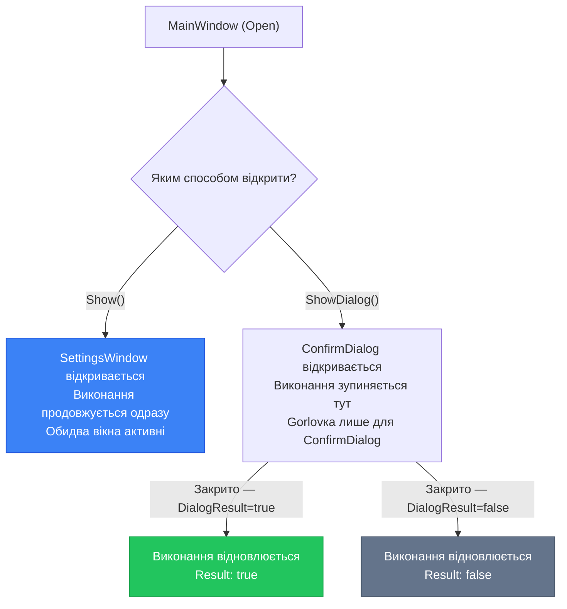

# Навігація та керування вікнами. Частина 1: вікна та сторінки

Кожен нетривіальний застосунок складається з більш ніж одного вікна. Налаштування, що відкриваються кнопкою на панелі інструментів. Діалогове вікно підтвердження перед видаленням. Форма реєстрації, що виринає поверх головного вікна та блокує взаємодію з ним доти, доки користувач не закриє її. Вікно \"Про програму\" з версією та ліцензією. Усе це — різні вікна, і WPF має добре продуману систему для управління ними.

Окрім класичних вікон, WPF пропонує ще один механізм навігації — `Frame` та `Page`. Ця система нагадує браузер: одне вікно, всередині якого змінюються \"сторінки\", є кнопки \"вперед\" і \"назад\". Звучить зручно — і справді, для певного класу застосунків це може бути доречно. Але на практиці у промисловій розробці цей підхід майже ніколи не використовується. Чому — ми розберемо детально.

У цій статті ми зосередимось на тому, що справді використовується в реальних проєктах: правильна робота з кількома вікнами, передача даних між ними, та розуміння механізму `Frame/Page` — щоб зрозуміти, чому від нього відмовляються на користь патерну MVVM-навігації, який розглянемо в [наступній частині](/csharp/desktop-ui/navigation-windows-part2).

::note
**Словник теми:** **Modal Window (Модальне вікно)** — вікно що блокує взаємодію з батьківським вікном до свого закриття (`ShowDialog()`). **Non-modal Window (Немодальне вікно)** — вікно що відкривається паралельно, не блокуючи батьківське (`Show()`). **Owner** — властивість, що встановлює батьківсько-дочірній зв'язок між вікнами. **DialogResult** — результат закриття діалогового вікна (true/false/null). **Frame** — контейнер всередині Window, що завантажує Page-об'єкти та підтримує навігацію. **Page** — спеціальний тип ui-елемента для використання всередині Frame або NavigationWindow. **NavigationService** — сервіс WPF для програмного керування навігацією між Page.
::

---

## Вікно як одиниця UI: загальна концепція

Перш ніж занурюватись у код, варто зрозуміти архітектурну роль вікна у WPF. Клас `Window` — це не просто прямокутник на екрані. Це повноцінний кореневий елемент, що:

- Має власне **Logical Tree** з усіма дочірніми елементами.
- Є **власником** UI-потоку та Dispatcher'а для своїх елементів.
- Підтримує власний **DataContext**, який успадковується всіма дочірніми елементами.
- Публікує lifecycle-події: `Loaded`, `ContentRendered`, `Closing`, `Closed`, `Activated`, `Deactivated`.

Звернімо увагу на принципову різницю між двома способами показати вікно. Це не просто різниця у назві методу — це різна **семантика взаємодії** з користувачем.

Метод `Show()` повертає управління **негайно**: виклик у коді-behind продовжується, вікно відкрито, але виконання потоку не зупиняється. Обидва вікна живуть паралельно, і користувач може перемикатись між ними.

Метод `ShowDialog()` блокує виконання потоку, що його викликав, до закриття відкритого вікна. Не буквально "блокує" — Dispatcher продовжує обробляти повідомлення для **всіх** вікон, тому UI не завмирає. Але рядок коду після `ShowDialog()` не виконається доти, поки діалог не закриється. Саме тому `ShowDialog()` повертає результат — ми можемо дізнатись, яку кнопку натиснув користувач.

::mermaid



::

---

## Show(): немодальні вікна

Немодальні вікна — це паралельні вікна застосунку. Класичні приклади: вікно \"Знайти та замінити\" у текстових редакторах (воно залишається відкритим, поки ви редагуєте текст), вікно \"Властивості\" у Провіднику, кілька відкритих документів у Notepad++.

Синтаксис відкриття немодального вікна гранично простий. Ми створюємо екземпляр нового вікна через `new` і викликаємо `Show()`. Ніякої магії — це звичайне створення об'єкту C# та виклик методу:

```csharp
// Code-behind: відкрити вікно налаштувань
private void OpenSettings_Click(object sender, RoutedEventArgs e)
{
    var settingsWindow = new SettingsWindow();
    settingsWindow.Show();
    // Виконання ПРОДОВЖУЄТЬСЯ тут одразу після Show()
    // settingsWindow живе на UI-потоці паралельно
}
```

Після виклику `Show()` виконання коду продовжується негайно. Якщо після `settingsWindow.Show()` ви поставите `MessageBox.Show("Виклик після Show")` — MessageBox з'явиться одразу, не чекаючи закриття SettingsWindow. Це принципово важливо розуміти, бо це означає: якщо вам потрібно щось зробити *після* того, як користувач закрив вікно — `Show()` для цього не підходить.

### Властивість Owner: зв'язок між вікнами

Є одна важлива деталь, яку часто ігнорують початківці — властивість `Owner`. Якщо відкрити вікно без Owner, воно поводить себе як незалежний застосунок: при згортанні MainWindow — SettingsWindow залишається на екрані. При перемиканні Alt+Tab — вони відображаються як окремі застосунки. При закритті MainWindow — SettingsWindow залишається відкритим, і застосунок "залипає" у фоні.

Правильний підхід — завжди встановлювати `Owner`:

```csharp
private void OpenSettings_Click(object sender, RoutedEventArgs e)
{
    var settingsWindow = new SettingsWindow();
    settingsWindow.Owner = this;     // this = поточне вікно (MainWindow)
    settingsWindow.Show();
}
```

Встановлення `Owner` дає кілька важливих ефектів. По-перше, дочірнє вікно завжди відображається поверх батьківського — немає ситуації, коли SettingsWindow "ховається" за MainWindow. По-друге, при згортанні власника — всі дочірні вікна теж згортаються разом з ним. По-третє, при закритті власника — всі дочірні вікна закриваються автоматично. І нарешті, в Alt+Tab вони виглядають як одна програма, а не кілька.

Додатково, власник дочірнього вікна доступний через зворотний зв'язок:

```csharp
// Зсередини SettingsWindow:
var mainWindow = (MainWindow)this.Owner;
// Тепер маємо доступ до MainWindow через Owner
```

Проте ця ідіома — пряме приведення `Owner` до конкретного типу — є поганою практикою. Вона створює тісну пов'язаність між вікнами. Якщо SettingsWindow знає про MainWindow — ви не можете відкрити SettingsWindow з іншого вікна без змін у її коді. Правильний підхід — передавати необхідні дані через конструктор або властивості (детально розглянемо далі).

### WindowStartupLocation: де з'явиться вікно

За замовчуванням нове вікно відкривається у лівому верхньому куті — позиція `(0, 0)`. Це очевидно незручно. WPF пропонує налаштування початкового положення через властивість `WindowStartupLocation`:

```xml
<!-- У XAML дочірнього вікна -->
<Window WindowStartupLocation="CenterOwner">
    <!-- CenterOwner — точно по центру батьківського вікна -->
</Window>
```

| Значення | Поведінка |
|----------|-----------|
| `Manual` | Позиція визначається властивостями `Left` та `Top`. За замовчуванням. |
| `CenterScreen` | Центр поточного монітора — незалежно від розташування батьківського вікна. |
| `CenterOwner` | Точно по центру вікна-власника (Owner). Найчастіший вибір для діалогів. |

`CenterOwner` — стандарт де-факто для діалогових вікон. Коли користувач натискає "Зберегти зміни?" — діалог має з'явитись поверх того вікна, де він і так вже дивиться, а не у центрі екрану (де може бути інший застосунок).

### Ereignis Closed та обробка закриття

Кожне вікно публікує дві події для закриття: `Closing` (відбувається *перед* закриттям, можна скасувати) та `Closed` (відбулось *після* закриття, незворотно). Для немодальних вікон часто потрібно відстежити момент закриття у батьківському вікні — наприклад, щоб прочитати внесені користувачем налаштування:

```csharp
private void OpenSettings_Click(object sender, RoutedEventArgs e)
{
    var settings = new SettingsWindow();
    settings.Owner = this;
    
    // Підписка на подію Closed — спрацює коли вікно закриється
    settings.Closed += (sender, args) =>
    {
        // Тут читаємо результати роботи вікна
        ApplyNewSettings(settings.SelectedTheme, settings.FontSize);
    };
    
    settings.Show();
    // Код продовжується, але Closed-обробник викличеться пізніше
}
```

Зверніть увагу на патерн: SettingsWindow має публічні властивості `SelectedTheme` і `FontSize`. Батьківське вікно не знає, *як* ці дані отримуються всередині SettingsWindow — воно лише читає їх публічний API після закриття. Це набагато кращий дизайн, ніж пряме звернення через `Owner`.

---

## ShowDialog(): модальні діалоги

Модальні вікна — інструмент для ситуацій, коли застосунку потрібна відповідь від користувача перед продовженням роботи. "Ви впевнені, що хочете видалити ці файли? Так / Ні". "Введіть ім'я нового файлу". "Оберіть кольорову схему і натисніть OK".

Ключова ідея модальності — **контекстна монополія уваги**. Поки відкрито модальне вікно, взаємодія з батьківським вікном заблокована. Це захищає від непослідовних дій: наприклад, від того, що користувач почне редагувати документ, поки не підтвердив видалення частини тексту.

```csharp
private void DeleteItem_Click(object sender, RoutedEventArgs e)
{
    var confirmDialog = new ConfirmDeleteDialog();
    confirmDialog.Owner = this;
    confirmDialog.WindowStartupLocation = WindowStartupLocation.CenterOwner;
    
    // ShowDialog() повертає bool? — nullable bool
    bool? result = confirmDialog.ShowDialog();
    
    // Код ТУТ виконується лише після закриття confirmDialog
    if (result == true)
    {
        // Користувач натиснув "Так" — видаляємо
        DeleteSelectedItem();
    }
    // Якщо false або null — видалення скасовано, нічого не робимо
}
```

### Механізм DialogResult: як вікно повідомляє про результат

Повернення `bool?` з `ShowDialog()` — це не магія WPF. За лаштунками це проста властивість `Window.DialogResult`. Коли ваш код усередині діалогового вікна встановлює `this.DialogResult = true` — вікно автоматично закривається і `ShowDialog()` у коді, що його відкрив, повертає `true`.

Подивимось на реалізацію діалогового вікна зсередини:

```csharp
// ConfirmDeleteDialog.xaml.cs
public partial class ConfirmDeleteDialog : Window
{
    public ConfirmDeleteDialog()
    {
        InitializeComponent();
    }

    // Кнопка "Так — видалити"
    private void YesButton_Click(object sender, RoutedEventArgs e)
    {
        DialogResult = true;   // Це закриє вікно і поверне true у ShowDialog()
    }

    // Кнопка "Скасувати"
    private void CancelButton_Click(object sender, RoutedEventArgs e)
    {
        DialogResult = false;  // Закриє вікно і поверне false у ShowDialog()
    }
}
```

Три важливі деталі. По-перше, `null` означає, що вікно закрито без явного встановлення `DialogResult` — наприклад, через Alt+F4 або кнопку X в заголовку. Це третій стан і його варто враховувати. По-друге, `DialogResult` можна встановити лише для вікна, відкритого через `ShowDialog()` — якщо ви встановите його на вікні, відкритому через `Show()`, WPF кине InvalidOperationException. По-третє, `IsCancel="True"` на Button — зручний спосіб автоматично встановити `DialogResult = false` при натисканні Escape або цієї кнопки без жодного коду:

```xml
<!-- XAML діалогового вікна — кнопки з автоматичною поведінкою -->
<StackPanel Orientation="Horizontal" HorizontalAlignment="Right">
    <Button Content="Так, видалити"
            IsDefault="True"
            Click="YesButton_Click"
            Margin="0,0,8,0"/>
    <Button Content="Скасувати"
            IsCancel="True"/>
    <!-- IsCancel=True: натискання Escape або цієї кнопки = DialogResult = false -->
</StackPanel>
```

`IsDefault="True"` на кнопці "Так, видалити" означає, що Enter підтвердить дію. `IsCancel="True"` на "Скасувати" означає, що Escape скасує. Це стандарт Windows-діалогів — запам'ятайте ці два атрибути.

::wpf-preview{title="Модальний діалог підтвердження з DialogResult"}

```xml
<StackPanel Margin="28" Spacing="16">

    <StackPanel Spacing="8">
        <TextBlock Text="⚠️ Підтвердження видалення"
                   FontSize="16" FontWeight="SemiBold"
                   Foreground="#dc2626"/>
        <TextBlock Text="Ви впевнені, що хочете видалити обраний елемент? Цю дію неможливо скасувати."
                   TextWrapping="Wrap"
                   Foreground="#374151"
                   FontSize="13"/>
    </StackPanel>

    <Border Background="#fef2f2" BorderBrush="#fca5a5"
            BorderThickness="1" CornerRadius="8" Padding="12">
        <StackPanel Orientation="Horizontal" Spacing="8">
            <TextBlock Text="🗑️" FontSize="14"/>
            <TextBlock Text="task_report_final_v3.docx (2.4 MB)"
                       FontSize="13" Foreground="#991b1b"
                       FontWeight="SemiBold"/>
        </StackPanel>
    </Border>

    <StackPanel Orientation="Horizontal"
                HorizontalAlignment="Right"
                Spacing="8">
        <Button Content="Скасувати"
                Padding="16,8"
                Background="#f1f5f9"
                Foreground="#374151"
                CornerRadius="6"
                Command="{Binding ShowMessageCommand}"
                CommandParameter="DialogResult = false → Вікно закрито. Видалення скасовано."/>
        <Button Content="Так, видалити"
                Padding="16,8"
                Background="#dc2626"
                Foreground="White"
                CornerRadius="6"
                Command="{Binding ShowMessageCommand}"
                CommandParameter="DialogResult = true → Вікно закрито. Виконується DeleteSelectedItem()."/>
    </StackPanel>

</StackPanel>
```

::

---

## Передача даних між вікнами

Одне з найчастіших практичних запитань: як передати дані у дочірнє вікно і як отримати результат назад? WPF не нав'язує жодного конкретного підходу — є кілька рівноправних способів, кожен зі своїми перевагами.

### Спосіб 1: Через конструктор (найпростіший)

Якщо дочірнє вікно потребує даних на момент відкриття і ці дані не змінюються в процесі, — передавайте через конструктор. Це найпростіший і найзрозуміліший підхід:

```csharp
// Клас дочірнього вікна
public partial class EditPersonDialog : Window
{
    public Person EditedPerson { get; private set; }

    // Конструктор приймає початкові дані
    public EditPersonDialog(Person person)
    {
        InitializeComponent();
        // Заповнення форми переданими даними
        NameTextBox.Text = person.Name;
        AgeTextBox.Text = person.Age.ToString();
        EditedPerson = person; // Зберігаємо для редагування
    }

    private void SaveButton_Click(object sender, RoutedEventArgs e)
    {
        // Зберігаємо відредаговані дані назад у властивість
        EditedPerson = new Person
        {
            Name = NameTextBox.Text,
            Age = int.Parse(AgeTextBox.Text)
        };
        DialogResult = true;
    }
}
```

Відкриття та читання результату в MainWindow:

```csharp
private void EditPerson_Click(object sender, RoutedEventArgs e)
{
    var selectedPerson = (Person)PeopleListBox.SelectedItem;
    
    var dialog = new EditPersonDialog(selectedPerson); // Передаємо через конструктор
    dialog.Owner = this;
    
    if (dialog.ShowDialog() == true)
    {
        // Читаємо результат через публічну властивість
        UpdatePersonInList(dialog.EditedPerson);
    }
}
```
```

### Спосіб 2: Через публічні властивості (для налаштувань)

Якщо вікно має багато параметрів, або вони можуть встановлюватись окремо залежно від контексту — публічні властивості дають більшу гнучкість:

```csharp
// Клас вікна з публічними властивостями для вхідних та вихідних даних
public partial class FilterDialog : Window
{
    // Вхідні дані — встановлює батьківський код до Show/ShowDialog
    public string InitialSearchText { get; set; } = "";
    public bool ShowArchivedItems { get; set; } = false;

    // Вихідні дані — читає батьківський код після закриття
    public string ResultSearchText { get; private set; } = "";
    public bool ResultShowArchived { get; private set; } = false;

    private void LoadedHandler(object sender, RoutedEventArgs e)
    {
        // При завантаженні — заповнюємо форму з вхідних властивостей
        SearchTextBox.Text = InitialSearchText;
        ArchivedCheckBox.IsChecked = ShowArchivedItems;
    }

    private void ApplyButton_Click(object sender, RoutedEventArgs e)
    {
        ResultSearchText = SearchTextBox.Text;
        ResultShowArchived = ArchivedCheckBox.IsChecked == true;
        DialogResult = true;
    }
}
```

Використання у MainWindow стає зрозумілим потоком даних:

```csharp
private void OpenFilter_Click(object sender, RoutedEventArgs e)
{
    var filter = new FilterDialog();
    filter.Owner = this;

    // Передаємо початкові значення через властивості
    filter.InitialSearchText = _currentFilter.Text;
    filter.ShowArchivedItems = _currentFilter.IncludeArchived;

    if (filter.ShowDialog() == true)
    {
        // Читаємо результат через властивості
        ApplyFilter(filter.ResultSearchText, filter.ResultShowArchived);
    }
}
```

### Спосіб 3: Через Events (для немодальних вікон)

Для немодальних вікон (`Show()`), де результат не повертається синхронно, найелегантніший підхід — власні події. Дочірнє вікно публікує event, батьківське — підписується:

```csharp
public partial class SearchPanel : Window
{
    // Власна подія — аргумент несе рядок пошуку
    public event EventHandler<string> SearchRequested;

    private void SearchButton_Click(object sender, RoutedEventArgs e)
    {
        // Публікуємо подію — батьківський код отримає її миттєво
        SearchRequested?.Invoke(this, SearchTextBox.Text);
    }
}
```

```csharp
// У MainWindow відкриваємо і підписуємось
private void OpenSearch_Click(object sender, RoutedEventArgs e)
{
    var searchPanel = new SearchPanel();
    searchPanel.Owner = this;

    // Підписка — при кожному пошуку оновлюємо список
    searchPanel.SearchRequested += (sender, query) =>
    {
        FilterListByQuery(query);
    };

    searchPanel.Show(); // Non-modal — обидва вікна активні паралельно
}
```

Events — найкращий підхід для "живих" інструментальних вікон, де дочірнє вікно та головне взаємодіють у реальному часі: вікно пошуку, панель фільтрів, вікно властивостей.

### Порівняльна таблиця підходів

| Підхід | Коли використовувати | Переваги | Недоліки |
|--------|---------------------|----------|----------|
| **Конструктор** | Прості діалоги з фіксованими вхідними даними | Явні залежності, зрозумілий код | Не підходить для складних об'єктів |
| **Публічні властивості** | Налаштувальні діалоги з кількома параметрами | Гнучкість, читабельний API | Трохи більше коду |
| **Events** | Немодальні вікна, "живий" зв'язок | Реакція в реальному часі | Потрібно відписуватись |
| **Owner як тип** | ❌ Ніколи | — | Тісна пов'язаність, крихкий код |

::tip
Золоте правило передачі даних між вікнами: **дочірнє вікно не повинно знати про тип батьківського**. Все що йому потрібно — отримати через конструктор/властивості і повернути через властивості/events. Якщо у вас є `(MainWindow)this.Owner` у залежному вікні — це запах поганого дизайну.
::

---

## Концепція Window всередині вікна: що таке "сторінка"?

До цього моменту ми розглядали класичну модель: кожен екран — окреме вікно. Але WPF пропонує альтернативу, яка на перший погляд здається привабливою: одне вікно з кількома "сторінками", між якими користувач може переміщатись.

Уявіть майстер встановлення програми (installer wizard): крок 1 → "Прийняти ліцензію", крок 2 → "Обрати папку встановлення", крок 3 → "Вибрати компоненти", крок 4 → "Встановлення", крок 5 → "Готово". Це класичний приклад навігації між станами в одному вікні. Кожен крок — фактично окремий екран (своя розмітка, своя логіка), але вікно одне.

WPF реалізує цю ідею через два класи: `Frame` та `Page`. Давайте розберемося, як вони влаштовані.

---

## Frame: браузер всередині вашого застосунку

`Frame` — це контрол WPF, який поводить себе як вбудований мінібраузер. Він завантажує вміст — `Page`-об'єкти або навіть веб-сторінки — та підтримує повноцінну навігацію: журнал переміщень, кнопки "вперед" та "назад", навігацію за URI.

Додавання `Frame` до головного вікна тривіальне:

```xml
<!-- MainWindow.xaml -->
<Window x:Class="MyApp.MainWindow" ...>
    <Grid>
        <!-- Верхня частина: навігаційна панель -->
        <StackPanel Orientation="Horizontal" VerticalAlignment="Top" Height="40">
            <Button Content="🏠 Головна" Click="GoHome_Click"/>
            <Button Content="⚙️ Налаштування" Click="GoSettings_Click"/>
        </StackPanel>

        <!-- Основна частина: Frame займає весь простір нижче -->
        <Frame x:Name="MainFrame"
               Margin="0,40,0,0"
               NavigationUIVisibility="Hidden"/>
               <!-- NavigationUIVisibility="Hidden" — прибираємо вбудовану панель браузера -->
    </Grid>
</Window>
```

`NavigationUIVisibility` відповідає за вбудовану панель Frame з кнопками "назад/вперед" та адресним рядком. За замовчуванням вона `Automatic` — тобто з'являється коли є що показувати. Майже завжди її приховують (`Hidden`), бо власна навігаційна панель виглядає краще.

## Page: сторінка для Frame

Клас `Page` — це спеціальний тип кореневого елемента, призначений для розміщення всередині `Frame`. Він схожий на `Window`, але не є самостійним вікном ОС — це лише вміст, який `Frame` завантажує та відображає. Якщо `Window` — це будівля, то `Page` — це кімната всередині неї.

Створення `Page` у Visual Studio: правою кнопкою на проєкт → Add → New Item → Page (WPF). Отримаємо знайому пару файлів: `HomePage.xaml` та `HomePage.xaml.cs`. Структура зовні схожа на Window:

```xml
<!-- HomePage.xaml -->
<Page x:Class="MyApp.Pages.HomePage"
      xmlns="http://schemas.microsoft.com/winfx/2006/xaml/presentation"
      xmlns:x="http://schemas.microsoft.com/winfx/2006/xaml"
      Title="Головна"
      Background="White">

    <StackPanel Margin="24" Spacing="16">
        <TextBlock Text="🏠 Головна сторінка"
                   FontSize="24" FontWeight="Bold"
                   Foreground="#1e293b"/>
        <TextBlock Text="Ласкаво просимо до застосунку!"
                   FontSize="14" Foreground="#64748b"/>
        <Button Content="Перейти до налаштувань →"
                HorizontalAlignment="Left"
                Padding="16,8"
                Click="GoToSettings_Click"/>
    </StackPanel>
</Page>
```

Властивість `Title` у `Page` — не заголовок вікна, а метадані сторінки. Якщо `Frame` має видиму навігаційну панель — він показує `Title` поточної сторінки там. Якщо навігаційна панель прихована — `Title` ніде не показується, але він все одно корисний для журналу навігації.

### Навігація між сторінками: два підходи

Є два способи змусити `Frame` завантажити `Page`. Перший — програмний через `NavigationService`, другий — декларативний через `Source` (URI).

**Підхід 1: NavigationService в code-behind**

`NavigationService` — це об'єкт, щo керує навігацією конкретного `Frame`. Кожен `Page` має доступ до свого NavigationService через властивість `this.NavigationService`:

```csharp
// MainWindow.xaml.cs — навігація з головного вікна
public partial class MainWindow : Window
{
    public MainWindow()
    {
        InitializeComponent();
        // Завантажуємо першу сторінку при старті
        MainFrame.Navigate(new HomePage());
    }

    private void GoHome_Click(object sender, RoutedEventArgs e)
    {
        MainFrame.Navigate(new HomePage());
    }

    private void GoSettings_Click(object sender, RoutedEventArgs e)
    {
        // Передаємо об'єкт сторінки напряму
        MainFrame.Navigate(new SettingsPage());
    }
}
```

```csharp
// HomePage.xaml.cs — навігація із самої сторінки
public partial class HomePage : Page
{
    private void GoToSettings_Click(object sender, RoutedEventArgs e)
    {
        // this.NavigationService — доступ до Frame що містить цю Page
        NavigationService.Navigate(new SettingsPage());
    }

    private void GoBack_Click(object sender, RoutedEventArgs e)
    {
        if (NavigationService.CanGoBack)
            NavigationService.GoBack();
    }
}
```

**Підхід 2: Навігація за URI**

`Frame.Source` і `Frame.Navigate(Uri)` дозволяють навігацію у стилі браузера — за адресою ресурсу. Це корисно для простих сценаріїв або систем що динамічно визначають, яку сторінку показати:

```csharp
// Навігація за Pack URI
MainFrame.Navigate(new Uri("Pages/HomePage.xaml", UriKind.Relative));
MainFrame.Navigate(new Uri("Pages/SettingsPage.xaml", UriKind.Relative));
```

```xml
<!-- Або статично у XAML — Frame одразу завантажує цю адресу -->
<Frame x:Name="MainFrame"
       Source="Pages/HomePage.xaml"
       NavigationUIVisibility="Hidden"/>
```

URI-навігація автоматично підтримує журнал: WPF запам'ятовує відвідані адреси, і `NavigationService.GoBack()` / `GoForward()` працюють "з коробки".

### NavigationWindow: ціле вікно як браузер

Для застосунків, де увесь UI — це набір сторінок (наприклад, wizard з кроками встановлення), WPF пропонує `NavigationWindow`. Це готовий `Window`, який вже містить вбудований `Frame` та навігаційну панель:

```xml
<!-- App.xaml — навіть StartupUri може вказувати на Page -->
<Application StartupUri="Pages/WizardStep1.xaml">
    <!-- WPF автоматично обгорне Page у NavigationWindow -->
</Application>
```

`NavigationWindow` публікує ті ж методи що і `Frame`: `Navigate()`, `GoBack()`, `GoForward()`, `CanGoBack`, `CanGoForward`. Він навіть додає стандартні кнопки "назад/вперед" у заголовок вікна.

::wpf-preview{title="Frame: навігація між сторінками через StackPanel-меню"}

```xml
<Grid>
    <Grid.ColumnDefinitions>
        <ColumnDefinition Width="180"/>
        <ColumnDefinition Width="*"/>
    </Grid.ColumnDefinitions>

    <!-- Ліва панель навігації -->
    <Border Grid.Column="0" Background="#1e293b">
        <StackPanel Margin="0,16">
            <Button Content="🏠  Головна"
                    HorizontalAlignment="Stretch"
                    HorizontalContentAlignment="Left"
                    Padding="20,12"
                    Background="Transparent"
                    Foreground="White"
                    BorderThickness="0"
                    Command="{Binding ShowMessageCommand}"
                    CommandParameter="Navigate → HomePage (новий екземпляр сторінки)"/>
            <Button Content="👤  Профіль"
                    HorizontalAlignment="Stretch"
                    HorizontalContentAlignment="Left"
                    Padding="20,12"
                    Background="Transparent"
                    Foreground="#94a3b8"
                    BorderThickness="0"
                    Command="{Binding ShowMessageCommand}"
                    CommandParameter="Navigate → ProfilePage"/>
            <Button Content="⚙️  Налаштування"
                    HorizontalAlignment="Stretch"
                    HorizontalContentAlignment="Left"
                    Padding="20,12"
                    Background="Transparent"
                    Foreground="#94a3b8"
                    BorderThickness="0"
                    Command="{Binding ShowMessageCommand}"
                    CommandParameter="Navigate → SettingsPage"/>
        </StackPanel>
    </Border>

    <!-- Права частина: місце для Frame -->
    <Border Grid.Column="1" Background="#f8fafc" Padding="32">
        <StackPanel VerticalAlignment="Center" Spacing="8">
            <TextBlock Text="[ Frame буде тут ]"
                       FontSize="18" FontWeight="SemiBold"
                       Foreground="#94a3b8"
                       HorizontalAlignment="Center"/>
            <TextBlock Text="У реальному застосунку тут Frame завантажував би Page"
                       FontSize="12" Foreground="#cbd5e1"
                       HorizontalAlignment="Center"/>
        </StackPanel>
    </Border>
</Grid>
```

::

::warning
Контрол `Frame` та клас `Page` є специфічними для WPF і не мають прямих аналогів в Avalonia. Для кросплатформних проєктів цей підхід взагалі не застосовний. У Avalonia навігація реалізується виключно через `ContentControl` + `DataTemplate` (MVVM-підхід), який ми розглянемо в наступній частині.
::

---

## Чому Frame/Page рідко використовується в реальних проєктах

Прочитавши попередні розділи, у вас може скластися враження, що `Frame` + `Page` — це зручний і природний інструмент для побудови багатоекранних застосунків. Синтаксис справді простий, навігація "з коробки", журнал безкоштовно. Чому ж тоді в переважній більшості реальних WPF-проєктів цього немає?

Відповідь — у чотирьох фундаментальних проблемах, кожна з яких є достатньою причиною для відмови.

### Проблема 1: DataContext і Binding працюють неправильно

У WPF DataContext успадковується по Logical Tree. Коли `Page` завантажується у `Frame` — вона стає частиною Logical Tree `Window`. Здавалося б, DataContext повинен успадковуватись. Але `Frame` за замовчуванням **ізолює** DataContext сторінки. Більше того — сторінка зберігається у журналі навігації як окремий об'єкт зі своїм DataContext.

На практиці це означає: якщо ваша `MainViewModel` встановлена як DataContext у `MainWindow`, то `HomePage`, завантажена у Frame, **не бачить** цей DataContext. Прив'язка `{Binding UserName}` у HomePage буде порожньою, хоча `MainViewModel.UserName` має значення. Це плутає розробників і змушує писати обхідні рішення.

### Проблема 2: Навігація за типом, а не за станом

У Frame ви навігуєте між **об'єктами** або **URI**: `Frame.Navigate(new SettingsPage())`. Кожен виклик `Navigate` зазвичай створює новий екземпляр сторінки. Стан не зберігається між переходами — якщо користувач заповнив форму, перейшов на іншу сторінку і повернувся назад — форма порожня.

Так, є `JournalEntry` і збереження стану — але це ускладнення поверх ускладнення. У MVVM-підході стан живе у ViewModel і він природно зберігається між переходами, бо ViewModel не знищується.

### Проблема 3: Неможливо тестувати

`Page` — це UI-клас. Логіка навігації ("при якому стані показувати яку сторінку") знаходиться в code-behind, в обробниках подій. Написати unit-тест для "перейти на сторінку налаштувань після успішного входу" — неможливо без запуску UI. Це порушує одну з головних переваг WPF: testability через MVVM.

### Проблема 4: Не працює з Dependency Injection

У сучасних проєктах ViewModel'и та сервіси створюються через DI-контейнер. `Frame.Navigate(new SettingsPage())` — це `new`, без DI. `SettingsPage` у конструкторі може потребувати `ISettingsService`, але Frame нічого про DI не знає. Доведеться або відмовитись від DI для сторінок, або писати додатковий клей між Frame та DI-контейнером.

### Що замість Frame/Page?

Усі ці проблеми вирішує підхід `ContentControl` + `DataTemplate` + `NavigationStore` — основа MVVM-навігації. Він детально розглянутий у [наступній частині](/csharp/desktop-ui/navigation-windows-part2). Коротко суть:

- Замість `Frame` — звичайний `ContentControl`.
- Замість `Page` — звичайні `UserControl` або `ViewModel`.
- "Навігація" — це зміна об'єкта в `ContentControl.Content`.
- WPF DataTemplate автоматично підбирає правильний View для ViewModel.
- Усе тестується, усе через DI, DataContext працює природно.

::caution
Використання `Frame` та `Page` у новому WPF-проєкті — це **антипатерн**. Єдиний виправданий сценарій: wizard (майстер) з лінійним покроковим переходом, де немає складної логіки і кожен крок — незалежний і безстановий. Для будь-якого іншого сценарію — MVVM-навігація.
::

| Критерій | Frame + Page | MVVM (ContentControl) |
|----------|-------------|----------------------|
| DataContext/Binding | ⚠️ Проблеми з успадкуванням | ✅ Природно працює |
| Unit-тестування | ❌ Неможливо без UI | ✅ Чистий C#, без UI |
| Dependency Injection | ❌ Ручний клей потрібен | ✅ Нативна підтримка |
| Стан між переходами | ⚠️ Складно, JournalEntry | ✅ ViewModel живе весь час |
| Кросплатформ (Avalonia) | ❌ Frame/Page немає | ✅ ContentControl є скрізь |
| Складність коду | ✅ Простий старт | ⚠️ Більше коду спочатку |

---

## Практичні завдання

::steps

### Рівень 1 — Немодальне та модальне вікно

Створіть застосунок з двома вікнами. Головне вікно має дві кнопки. Перша — "Відкрити панель пошуку" — відкриває `SearchWindow` через `Show()` (немодально). `SearchWindow` має `TextBox` і кнопку "Шукати"; при натисканні — публікує event, і MainWindow отримавши його виводить повідомлення: "Шукаємо: [текст]". Друга кнопка — "Очистити список?" — відкриває `ConfirmDialog` через `ShowDialog()`. Якщо `DialogResult == true` — очищає ListBox.

Вимоги: обидва вікна мають `Owner = this`. `ConfirmDialog` — `WindowStartupLocation.CenterOwner`. `IsDefault` та `IsCancel` на відповідних кнопках.

### Рівень 2 — Передача даних та результат

Створіть список контактів (ListBox з ім'ям та телефоном). При подвійному кліку на контакті — відкривається `EditContactDialog` (модально) з TextBox для імені та телефону, попередньо заповненими через конструктор. При натисканні "Зберегти" — `DialogResult = true`, і MainWindow оновлює запис у списку, читаючи публічну властивість `EditedContact`. Кнопка "Новий контакт" відкриває той самий діалог з порожніми полями.

### Рівень 3 — Frame/Page wizard (щоб зрозуміти обмеження)

Реалізуйте wizard реєстрації акаунту на 3 кроки через `Frame` та `Page`:
- Крок 1 (`RegistrationStep1Page`): Email та пароль.
- Крок 2 (`RegistrationStep2Page`): Ім'я та дата народження.
- Крок 3 (`RegistrationStep3Page`): Підтвердження — показати всі введені дані.

Навігація між кроками через `NavigationService`. Передати дані між сторінками через статичний клас-контейнер `RegistrationData`. Зітнувшись з проблемами DataContext та збереження стану — зафіксуйте їх. Порівняйте з MVVM-підходом з наступної частини.

::

---

## Підсумок

У цій частині ми вивчили фундамент багатовіконних WPF-застосунків. `Show()` та `ShowDialog()` — два принципово різних способи відкрити вікно, кожен зі своєю семантикою. `Owner` — обов'язковий атрибут вікна-нащадка, що забезпечує правильну поведінку в системному менеджері вікон. Передача даних між вікнами реалізується через конструктор, публічні властивості або events — залежно від напрямку і типу взаємодії.

Механізм `Frame` та `Page` ми розглянули свідомо детально, щоб ви розуміли, **чому** від нього відмовляються в реальних проєктах, а не просто запам'ятали правило "не використовувати Frame". Розуміючи обмеження — ви зможете пояснити будь-якому колезі, чому MVVM-навігація є кращим вибором.

У [наступній частині](/csharp/desktop-ui/navigation-windows-part2) ми побудуємо повноцінну MVVM-навігацію: `ContentControl` + `DataTemplate`, `NavigationStore`, `NavigationService` через DI — і ви побачите, як всі проблеми що ми перерахували в цій статті зникають природно.
