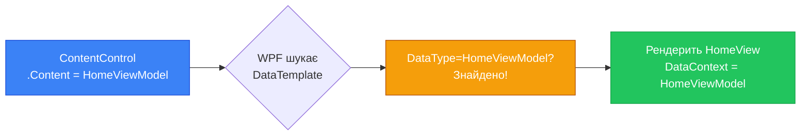

# Навігація та керування вікнами. Частина 2: MVVM-навігація

У [попередній частині](/csharp/desktop-ui/navigation-windows-part1) ми вивчили класичний WPF-підхід: кілька вікон, `Show()`, `ShowDialog()`, `DialogResult`. Ми також розглянули механізм `Frame` та `Page` і з'ясували чотири фундаментальні причини, чому від нього відмовляються у серйозних проєктах: проблеми з DataContext, відсутність тестованості, незручна робота з DI та несумісність з Avalonia.

Ця частина — про те, як навігація реалізується у реальних промислових WPF-застосунках. Підхід, який ми розглянемо, не є специфічним для WPF. Він побудований на базових принципах MVVM і однаково добре працює як у WPF, так і в Avalonia, MAUI або навіть Uno Platform — будь-якому XAML-фреймворку, що підтримує `ContentControl` та `DataTemplate`.

Ідея дивовижно проста, але щоб її зрозуміти — треба добре уявляти, що таке `ContentControl` і як працюють `DataTemplate`. Якщо ви читали цей курс послідовно — у вас вже є ця база (статті 13, 20). Якщо ні — коротке нагадування буде нижче.

::note
**Словник теми:** **ContentControl** — базовий клас контролів що мають один дочірній елемент (`Content`). Button, Label, GroupBox, Expander — всі вони ContentControl. **DataTemplate** — шаблон що описує, як відобразити об'єкт певного типу. WPF автоматично застосовує DataTemplate коли Content відповідає типу. **NavigationStore** — власний клас (не WPF-вбудований), що зберігає поточну ViewModel і публікує зміну через подію. **NavigationService** — сервіс що інкапсулює логіку зміни поточної ViewModel. **ViewModelBase** — базовий клас для всіх ViewModel, що реалізує `INotifyPropertyChanged`.
::

---

## Ключова ідея: "сторінка" — це ViewModel, а не UI

Відправна точка MVVM-навігації — зміна кута зору. Замість того, щоб думати "переходжу на сторінку Settings" — думайте "встановлюю `SettingsViewModel` як поточний активний стан застосунку".

Уявіть застосунок як машину зі станами. У будь-який момент він перебуває в одному зі станів: `HomeViewModel`, `SettingsViewModel`, `ProfileViewModel`, `LoginViewModel`. Перехід між станами — це зміна об'єкта, який зберігається у деякій властивості. UI лише відображає поточний стан.

Щоб зрозуміти механізм відображення, згадаємо, як WPF рендерить `ContentControl`. Якщо властивість `Content` містить рядок — показується TextBlock з цим рядком. Якщо `Content` містить `Button` — показується кнопка. Якщо `Content` містить **довільний C#-об'єкт** — WPF шукає `DataTemplate` для типу цього об'єкта і рендерить об'єкт через знайдений шаблон.

Це і є весь механізм. Ніякого Frame. Ніяких Page. Просто:

```
ContentControl.Content = new SettingsViewModel()
                ↓
WPF шукає DataTemplate з DataType="{x:Type vm:SettingsViewModel}"
                ↓
Знаходить → рендерить SettingsView всередині ContentControl
```

Давайте розберемо кожну частину цієї системи по черзі.

---

## Частина 1: ViewModelBase — спільний базовий клас

Перш за все — спільна основа. Кожна ViewModel потребує `INotifyPropertyChanged` для оповіщення UI про зміни. Замість копіювати реалізацію в кожен клас — виносимо її в базовий клас:

```csharp
// ViewModels/ViewModelBase.cs
using System.ComponentModel;
using System.Runtime.CompilerServices;

public abstract class ViewModelBase : INotifyPropertyChanged
{
    public event PropertyChangedEventHandler? PropertyChanged;

    // Захищений метод для виклику з підкласів
    protected virtual void OnPropertyChanged([CallerMemberName] string? propertyName = null)
    {
        PropertyChanged?.Invoke(this, new PropertyChangedEventArgs(propertyName));
    }

    // Зручний метод: встановлює поле і повідомляє UI тільки якщо значення змінилось
    protected bool SetField<T>(ref T field, T value, [CallerMemberName] string? propertyName = null)
    {
        if (EqualityComparer<T>.Default.Equals(field, value))
            return false;   // Значення не змінилось — не оновлюємо UI
        field = value;
        OnPropertyChanged(propertyName);
        return true;
    }
}
```

Атрибут `[CallerMemberName]` — це компіляторна магія: він автоматично підставляє ім'я метода або властивості, звідки викликається `OnPropertyChanged()`. Це означає, що у setter'і властивості нам не треба писати рядок з назвою — компілятор зробить це сам:

```csharp
// РАНІШЕ (без CallerMemberName):
private string _name = "";
public string Name
{
    get => _name;
    set { _name = value; OnPropertyChanged("Name"); } // Рядок — помилка при рефакторингу!
}

// ТЕПЕР (з CallerMemberName):
private string _name = "";
public string Name
{
    get => _name;
    set { SetField(ref _name, value); } // Назва підставляється компілятором ✅
}
```

Метод `SetField` робить ще одну важливу річ: він перевіряє, чи значення дійсно змінилось. Якщо `Name` вже дорівнює новому значенню — жодного оповіщення не відбувається. Це захищає від зайвих перемальовувань UI.

### Конкретні ViewModel для "сторінок"

Тепер кожна "сторінка" — це клас, що наслідує `ViewModelBase`. На цьому етапі вони можуть бути порожніми — але вони є повноцінними C# класами з можливістю мати властивості, команди, сервіси:

```csharp
// ViewModels/HomeViewModel.cs
public class HomeViewModel : ViewModelBase
{
    private string _welcomeMessage = "Ласкаво просимо!";
    public string WelcomeMessage
    {
        get => _welcomeMessage;
        set => SetField(ref _welcomeMessage, value);
    }
}

// ViewModels/SettingsViewModel.cs
public class SettingsViewModel : ViewModelBase
{
    private bool _isDarkTheme;
    public bool IsDarkTheme
    {
        get => _isDarkTheme;
        set => SetField(ref _isDarkTheme, value);
    }

    private string _language = "Українська";
    public string Language
    {
        get => _language;
        set => SetField(ref _language, value);
    }
}

// ViewModels/AboutViewModel.cs
public class AboutViewModel : ViewModelBase
{
    public string AppVersion => "1.0.0";
    public string AppName => "My WPF App";
    public string Developer => "Ваше ім'я";
}
```

---

## Частина 2: Views — UserControl, що відображає ViewModel

Кожна ViewModel потребує відповідного View. У MVVM-навігації View — це звичайний `UserControl`, а не `Page`. Це принципова відмінність від підходу Frame: `UserControl` не обмежений жодним контейнером і може використовуватись будь-де.

Структура файлів типового MVVM-проєкту з навігацією:

```
MyApp/
├── ViewModels/
│   ├── ViewModelBase.cs
│   ├── MainViewModel.cs       ← ViewModel головного вікна
│   ├── HomeViewModel.cs
│   ├── SettingsViewModel.cs
│   └── AboutViewModel.cs
├── Views/
│   ├── HomeView.xaml          ← UserControl для HomeViewModel
│   ├── SettingsView.xaml      ← UserControl для SettingsViewModel
│   └── AboutView.xaml         ← UserControl для AboutViewModel
└── MainWindow.xaml            ← Головне вікно з ContentControl
```

Кожен View — мінімальний UserControl з розміткою для відповідної ViewModel:

```xml
<!-- Views/HomeView.xaml -->
<UserControl x:Class="MyApp.Views.HomeView"
             xmlns="http://schemas.microsoft.com/winfx/2006/xaml/presentation"
             xmlns:x="http://schemas.microsoft.com/winfx/2006/xaml">
    <StackPanel Margin="32" Spacing="16">
        <TextBlock Text="🏠 Головна"
                   FontSize="28" FontWeight="Bold"
                   Foreground="#1e293b"/>
        <!-- DataContext тут = HomeViewModel (встановлений через DataTemplate) -->
        <TextBlock Text="{Binding WelcomeMessage}"
                   FontSize="14" Foreground="#64748b"/>
    </StackPanel>
</UserControl>
```

```xml
<!-- Views/SettingsView.xaml -->
<UserControl x:Class="MyApp.Views.SettingsView"
             xmlns="http://schemas.microsoft.com/winfx/2006/xaml/presentation"
             xmlns:x="http://schemas.microsoft.com/winfx/2006/xaml">
    <StackPanel Margin="32" Spacing="16">
        <TextBlock Text="⚙️ Налаштування"
                   FontSize="28" FontWeight="Bold"
                   Foreground="#1e293b"/>
        <StackPanel Orientation="Horizontal" Spacing="12">
            <CheckBox IsChecked="{Binding IsDarkTheme}"/>
            <TextBlock Text="Темна тема" VerticalAlignment="Center"/>
        </StackPanel>
    </StackPanel>
</UserControl>
```

Зверніть увагу: у Views немає жодного `DataContext = new ...`. Views абсолютно пасивні — вони лише описують, як відображати дані. DataContext буде встановлений автоматично через механізм DataTemplate.

---

## Частина 3: DataTemplate — клей між ViewModel і View

Це найважливіша частина всього механізму. `DataTemplate` з атрибутом `DataType` — це інструкція для WPF: "коли потрібно відобразити об'єкт типу X — використовуй ось цю розмітку".

DataTemplate'ів для навігації прийнято реєструвати в `App.xaml` — щоб вони були доступні в усьому застосунку:

```xml
<!-- App.xaml -->
<Application x:Class="MyApp.App"
             xmlns="http://schemas.microsoft.com/winfx/2006/xaml/presentation"
             xmlns:x="http://schemas.microsoft.com/winfx/2006/xaml"
             xmlns:vm="clr-namespace:MyApp.ViewModels"
             xmlns:views="clr-namespace:MyApp.Views">

    <Application.Resources>
        <ResourceDictionary>

            <!-- Кожен DataTemplate зв'язує ViewModel-тип з відповідним View -->
            <DataTemplate DataType="{x:Type vm:HomeViewModel}">
                <views:HomeView/>
            </DataTemplate>

            <DataTemplate DataType="{x:Type vm:SettingsViewModel}">
                <views:SettingsView/>
            </DataTemplate>

            <DataTemplate DataType="{x:Type vm:AboutViewModel}">
                <views:AboutView/>
            </DataTemplate>

        </ResourceDictionary>
    </Application.Resources>
</Application>
```

Ключова деталь — `DataTemplate` без `x:Key`. DataTemplate без ключа — це **implicit DataTemplate**: WPF застосовує його автоматично до будь-якого об'єкта відповідного типу. Немає потреби писати `{StaticResource HomeViewTemplate}` — WPF сам знайде правильний шаблон.

::mermaid



::

Коли WPF рендерить View через DataTemplate — він автоматично встановлює `DataContext` View рівним тому об'єкту, для якого знайшов шаблон. Тобто `HomeView.DataContext` буде дорівнювати тому самому екземпляру `HomeViewModel`, що міститься у `ContentControl.Content`. Binding у HomeView "бачить" властивості HomeViewModel автоматично — без жодного явного `DataContext =`.

---

## Частина 4: ContentControl у MainWindow

Тепер підключаємо `ContentControl` до головного вікна. Головне вікно матиме навігаційну панель зліва і `ContentControl` справа. При натисканні на пункт меню — `ContentControl.Content` зміниться на відповідну ViewModel:

```xml
<!-- MainWindow.xaml -->
<Window x:Class="MyApp.MainWindow" ...>
    <Grid>
        <Grid.ColumnDefinitions>
            <ColumnDefinition Width="200"/>
            <ColumnDefinition Width="*"/>
        </Grid.ColumnDefinitions>

        <!-- Ліва навігаційна панель -->
        <Border Grid.Column="0" Background="#1e293b">
            <StackPanel Margin="0,16">
                <Button Content="🏠  Головна"
                        Command="{Binding NavigateHomeCommand}"/>
                <Button Content="⚙️  Налаштування"
                        Command="{Binding NavigateSettingsCommand}"/>
                <Button Content="ℹ️  Про застосунок"
                        Command="{Binding NavigateAboutCommand}"/>
            </StackPanel>
        </Border>

        <!-- КЛЮЧОВА ЧАСТИНА: ContentControl відображає поточну "сторінку" -->
        <ContentControl Grid.Column="1"
                        Content="{Binding CurrentViewModel}"/>
        <!--
            Коли CurrentViewModel = HomeViewModel    → рендерить HomeView
            Коли CurrentViewModel = SettingsViewModel → рендерить SettingsView
            DataTemplate підбирається автоматично з App.xaml
        -->
    </Grid>
</Window>
```

`ContentControl` прив'язаний до `CurrentViewModel` — властивості `MainViewModel`. Коли `CurrentViewModel` змінюється — `ContentControl` перемальовується, і WPF шукає DataTemplate для нового типу. Вся навігація зводиться до однієї простої операції у ViewModel.

::wpf-preview{title="ContentControl + DataTemplate: MVVM-навігація між сторінками"}

```xml
<Grid>
    <Grid.ColumnDefinitions>
        <ColumnDefinition Width="200"/>
        <ColumnDefinition Width="*"/>
    </Grid.ColumnDefinitions>

    <Border Grid.Column="0" Background="#0f172a">
        <StackPanel Margin="0,24" Spacing="2">
            <TextBlock Text="MY APP"
                       Foreground="#475569" FontSize="10"
                       FontWeight="Bold" Margin="20,0,0,16"/>

            <Button HorizontalAlignment="Stretch"
                    HorizontalContentAlignment="Left"
                    Padding="20,12" Background="#1e3a5f"
                    Foreground="White" BorderThickness="0"
                    Command="{Binding ShowMessageCommand}"
                    CommandParameter="CurrentViewModel змінено → HomeViewModel. ContentControl автоматично рендерить HomeView.">
                <StackPanel Orientation="Horizontal" Spacing="10">
                    <TextBlock Text="🏠" FontSize="14"/>
                    <TextBlock Text="Головна" FontSize="13"/>
                </StackPanel>
            </Button>

            <Button HorizontalAlignment="Stretch"
                    HorizontalContentAlignment="Left"
                    Padding="20,12" Background="Transparent"
                    Foreground="#94a3b8" BorderThickness="0"
                    Command="{Binding ShowMessageCommand}"
                    CommandParameter="CurrentViewModel змінено → SettingsViewModel. ContentControl автоматично рендерить SettingsView.">
                <StackPanel Orientation="Horizontal" Spacing="10">
                    <TextBlock Text="⚙️" FontSize="14"/>
                    <TextBlock Text="Налаштування" FontSize="13"/>
                </StackPanel>
            </Button>

            <Button HorizontalAlignment="Stretch"
                    HorizontalContentAlignment="Left"
                    Padding="20,12" Background="Transparent"
                    Foreground="#94a3b8" BorderThickness="0"
                    Command="{Binding ShowMessageCommand}"
                    CommandParameter="CurrentViewModel змінено → AboutViewModel. ContentControl автоматично рендерить AboutView.">
                <StackPanel Orientation="Horizontal" Spacing="10">
                    <TextBlock Text="ℹ️" FontSize="14"/>
                    <TextBlock Text="Про застосунок" FontSize="13"/>
                </StackPanel>
            </Button>
        </StackPanel>
    </Border>

    <Border Grid.Column="1" Background="#f8fafc" Padding="32">
        <StackPanel VerticalAlignment="Center" Spacing="12">
            <TextBlock Text="🏠 Головна сторінка"
                       FontSize="24" FontWeight="Bold" Foreground="#1e293b"/>
            <TextBlock Text="Ласкаво просимо! Це HomeView, що рендериться через DataTemplate для HomeViewModel."
                       FontSize="13" Foreground="#64748b" TextWrapping="Wrap"/>
            <Border Background="#eff6ff" CornerRadius="8" Padding="14,10">
                <TextBlock FontSize="12" Foreground="#1d4ed8" TextWrapping="Wrap"
                           Text="ContentControl.Content = HomeViewModel → DataTemplate знайдено → HomeView відображається"/>
            </Border>
            <TextBlock Text="Натисніть кнопки навігації зліва →"
                       FontSize="12" Foreground="#94a3b8" FontStyle="Italic"/>
        </StackPanel>
    </Border>
</Grid>
```

::

::note
Превью використовує Avalonia Fluent Theme і виглядає як Windows 11. У реальному WPF-проєкті зовнішній вигляд кнопок та контролів буде відрізнятись, якщо ви не підключите бібліотеку тем (MaterialDesignInXaml або MahApps.Metro).
::

---

## Частина 5: MainViewModel — серце навігації

Тепер найцікавіше — `MainViewModel`. Це ViewModel головного вікна: вона зберігає поточну "сторінку" у властивості `CurrentViewModel` і має команди для навігації між ними.

Спочатку потрібна реалізація `ICommand`. Запишемо простий `RelayCommand` — якщо у вас ще немає і ви не використовуєте CommunityToolkit.Mvvm:

```csharp
// Commands/RelayCommand.cs
public class RelayCommand : ICommand
{
    private readonly Action<object?> _execute;
    private readonly Func<object?, bool>? _canExecute;

    public RelayCommand(Action<object?> execute, Func<object?, bool>? canExecute = null)
    {
        _execute = execute ?? throw new ArgumentNullException(nameof(execute));
        _canExecute = canExecute;
    }

    public event EventHandler? CanExecuteChanged
    {
        add    => CommandManager.RequerySuggested += value;
        remove => CommandManager.RequerySuggested -= value;
    }

    public bool CanExecute(object? parameter) => _canExecute?.Invoke(parameter) ?? true;
    public void Execute(object? parameter) => _execute(parameter);
}
```

`CommandManager.RequerySuggested` — механізм WPF, що автоматично перевіряє `CanExecute` при зміні фокусу або інших UI-подіях. Кнопки автоматично вмикаються/вимикаються без додаткового коду.

Тепер `MainViewModel`:

```csharp
// ViewModels/MainViewModel.cs
public class MainViewModel : ViewModelBase
{
    // Поточна "сторінка" — саме цю властивість відслідковує ContentControl
    private ViewModelBase _currentViewModel;
    public ViewModelBase CurrentViewModel
    {
        get => _currentViewModel;
        set => SetField(ref _currentViewModel, value);
    }

    public ICommand NavigateHomeCommand { get; }
    public ICommand NavigateSettingsCommand { get; }
    public ICommand NavigateAboutCommand { get; }

    public MainViewModel()
    {
        // Початкова "сторінка" при старті застосунку
        _currentViewModel = new HomeViewModel();

        // Кожна команда — просто встановлює CurrentViewModel
        NavigateHomeCommand     = new RelayCommand(_ => CurrentViewModel = new HomeViewModel());
        NavigateSettingsCommand = new RelayCommand(_ => CurrentViewModel = new SettingsViewModel());
        NavigateAboutCommand    = new RelayCommand(_ => CurrentViewModel = new AboutViewModel());
    }
}
```

Подивіться на команди уважніше. `NavigateHomeCommand` виконує лише одну дію: `CurrentViewModel = new HomeViewModel()`. Це все. Жодної роботи з UI, жодних `Frame.Navigate()`, жодних посилань на вікна. Чистий C#-код, що змінює властивість об'єкта.

Коли `CurrentViewModel` змінюється — `INotifyPropertyChanged` повідомляє WPF, `ContentControl.Content` отримує новий об'єкт, WPF шукає implicit DataTemplate для нового типу та рендерить відповідний View. Увесь ланцюжок відбувається автоматично.

Залишається підключити `MainViewModel` як DataContext:

```csharp
// MainWindow.xaml.cs
public partial class MainWindow : Window
{
    public MainWindow()
    {
        InitializeComponent();
        DataContext = new MainViewModel();
    }
}
```

Ось і вся базова MVVM-навігація. Структурно — п'ять простих кроків:

::steps

### Крок 1: ViewModelBase

Базовий клас з `INotifyPropertyChanged` та методом `SetField`.

### Крок 2: ViewModel для кожної "сторінки"

`HomeViewModel`, `SettingsViewModel`, `AboutViewModel` — звичайні C#-класи.

### Крок 3: UserControl для кожної ViewModel

`HomeView.xaml`, `SettingsView.xaml` — XAML-розмітка, прив'язана через `{Binding}`.

### Крок 4: Implicit DataTemplate в App.xaml

Пари "ViewModel-тип → View" через `DataTemplate DataType="{x:Type ...}"` без `x:Key`.

### Крок 5: MainViewModel + ContentControl

`CurrentViewModel` — властивість поточної сторінки. `ContentControl Content="{Binding CurrentViewModel}"`. Команди змінюють `CurrentViewModel`.

::

---

## NavigationStore: централізований стан навігації

Навігація у попередньому прикладі проста і зручна — але має один недолік: логіка навігації зосереджена в `MainViewModel`. Якщо вам потрібно перейти на іншу сторінку з іншої ViewModel (наприклад, після успішного логіну перекинути на Home) — це стає складним.

Рішення — виокремити стан навігації в окремий клас `NavigationStore`. Аналогія: уявіть `NavigationStore` як централізований диспетчерський пункт. Всі, хто хоче "переключити екран" — звертаються до нього. Він повідомляє MainViewModel про зміну, та оновлює ContentControl.

```csharp
// Navigation/NavigationStore.cs
public class NavigationStore
{
    private ViewModelBase? _currentViewModel;

    public ViewModelBase? CurrentViewModel
    {
        get => _currentViewModel;
        set
        {
            _currentViewModel = value;
            // Публікуємо подію — всі підписники дізнаються про зміну
            CurrentViewModelChanged?.Invoke();
        }
    }

    // Подія без аргументів — підписується MainViewModel
    public event Action? CurrentViewModelChanged;
}
```

Тепер `MainViewModel` підписується на цю подію і оновлює свій `CurrentViewModel`:

```csharp
// ViewModels/MainViewModel.cs (оновлена версія з NavigationStore)
public class MainViewModel : ViewModelBase
{
    private readonly NavigationStore _navigationStore;

    // CurrentViewModel тепер делегує до NavigationStore
    public ViewModelBase? CurrentViewModel => _navigationStore.CurrentViewModel;

    public MainViewModel(NavigationStore navigationStore)
    {
        _navigationStore = navigationStore;
        // Підписуємось на зміни у NavigationStore
        _navigationStore.CurrentViewModelChanged += OnCurrentViewModelChanged;
    }

    private void OnCurrentViewModelChanged()
    {
        // Повідомляємо ContentControl що CurrentViewModel змінився
        OnPropertyChanged(nameof(CurrentViewModel));
    }
}
```


