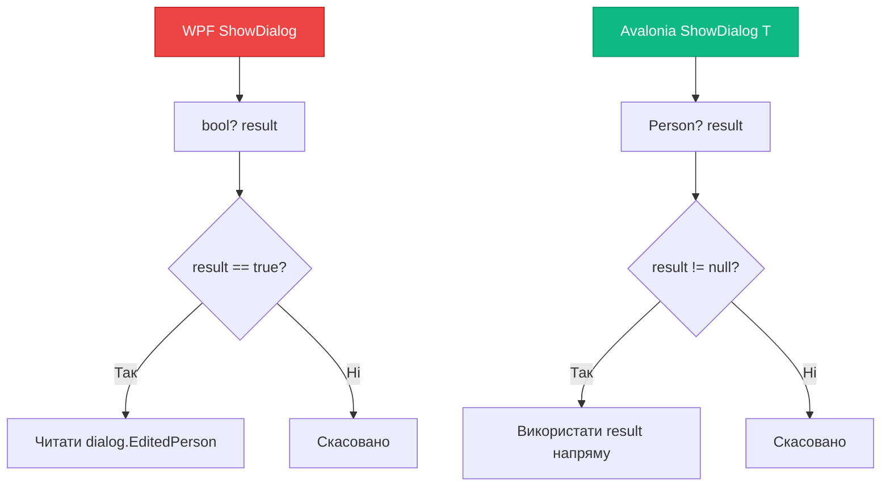
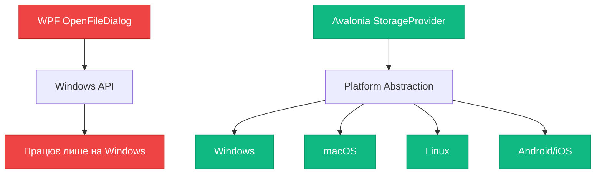
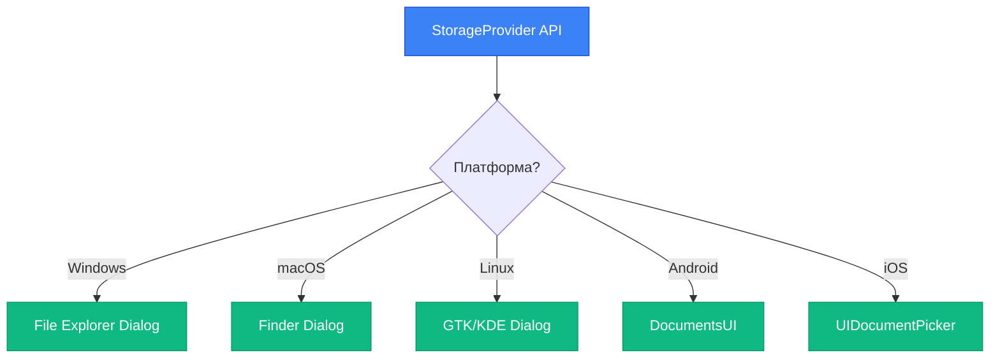

# Avalonia: Навігація та діалоги

## Вступ

У попередніх статтях ми розглянули [навігацію у WPF](/csharp/desktop-ui/navigation-windows-part1) та [MVVM-навігацію](/csharp/desktop-ui/navigation-windows-part2). WPF має добре продуману систему для роботи з вікнами, але вона тісно пов'язана з Windows API і не працює на інших платформах.

**Проблеми WPF при портуванні на інші ОС:**

- ❌ `ShowDialog()` повертає `bool?` — незручний API
- ❌ `OpenFileDialog` з WinForms — Windows-специфічний
- ❌ `Frame` та `Page` — не існують в Avalonia
- ❌ Немає вбудованої підтримки кросплатформних діалогів

**Avalonia пропонує кращі альтернативи:**

- ✅ `Window.ShowDialog<T>()` — типізований результат
- ✅ `StorageProvider` API — кросплатформні file pickers
- ✅ MVVM-навігація через `ContentControl` — працює ідентично WPF
- ✅ Нативні діалоги для кожної ОС

::note
**Для кого ця стаття?** Якщо ви вже знайомі з [WPF навігацією](/csharp/desktop-ui/navigation-windows-part1) та [MVVM-навігацією](/csharp/desktop-ui/navigation-windows-part2), ця стаття покаже кросплатформні альтернативи у Avalonia.
::

---

## Window.ShowDialog\<T\>(): типізований результат

У WPF метод `ShowDialog()` повертає `bool?` — nullable boolean. Це обмежує можливості передачі даних назад:

**WPF:**

```csharp
// WPF — лише bool?
var dialog = new EditPersonDialog(person);
bool? result = dialog.ShowDialog();

if (result == true)
{
    // Потрібно читати дані через властивості діалогу
    var editedPerson = dialog.EditedPerson;
}
```

**Avalonia має кращий API:**

```csharp
// Avalonia — типізований результат
var dialog = new EditPersonDialog(person);
Person? result = await dialog.ShowDialog<Person?>(this);

if (result != null)
{
    // Результат вже є об'єктом потрібного типу
    UpdatePerson(result);
}
```

### Ключові відмінності

| Аспект | WPF | Avalonia |
|--------|-----|----------|
| Повернення | `bool?` | `T` (будь-який тип) |
| Синхронність | Синхронний | Асинхронний (`async/await`) |
| Типізація | Слабка | Сильна |
| Зручність | Потрібно читати властивості | Результат вже готовий |

::mermaid

::

---

## Реалізація діалогу з типізованим результатом

Розберемо повний приклад діалогу редагування особи.

### Модель даних

```csharp
// Models/Person.cs
public record Person(string Name, int Age, string Email);
```

Використовуємо `record` — це immutable тип, ідеальний для передачі даних між вікнами.

### Діалогове вікно

**EditPersonDialog.axaml:**

```xml
<Window xmlns="https://github.com/avaloniaui"
        xmlns:x="http://schemas.microsoft.com/winfx/2006/xaml"
        x:Class="MyApp.Views.EditPersonDialog"
        Title="Редагувати особу"
        Width="400" Height="300"
        WindowStartupLocation="CenterOwner"
        CanResize="False">
    
    <StackPanel Margin="20" Spacing="12">
        <TextBlock Text="Редагування даних особи"
                   FontSize="18" FontWeight="Bold"/>
        
        <TextBlock Text="Ім'я:" Margin="0,8,0,0"/>
        <TextBox x:Name="NameTextBox" Watermark="Введіть ім'я"/>
        
        <TextBlock Text="Вік:" Margin="0,8,0,0"/>
        <NumericUpDown x:Name="AgeNumeric" Minimum="0" Maximum="150"/>
        
        <TextBlock Text="Email:" Margin="0,8,0,0"/>
        <TextBox x:Name="EmailTextBox" Watermark="example@email.com"/>
        
        <StackPanel Orientation="Horizontal" 
                    HorizontalAlignment="Right"
                    Spacing="8" Margin="0,20,0,0">
            <Button Content="Скасувати" 
                    Click="CancelButton_Click"
                    Width="100"/>
            <Button Content="Зберегти" 
                    Click="SaveButton_Click"
                    Width="100"
                    Classes="accent"/>
        </StackPanel>
    </StackPanel>
</Window>
```

**EditPersonDialog.axaml.cs:**

```csharp
using Avalonia.Controls;
using Avalonia.Interactivity;

namespace MyApp.Views;

public partial class EditPersonDialog : Window
{
    public EditPersonDialog()
    {
        InitializeComponent();
    }
    
    // Конструктор з початковими даними
    public EditPersonDialog(Person person) : this()
    {
        NameTextBox.Text = person.Name;
        AgeNumeric.Value = person.Age;
        EmailTextBox.Text = person.Email;
    }
    
    private void SaveButton_Click(object sender, RoutedEventArgs e)
    {
        // Створюємо новий об'єкт з відредагованими даними
        var result = new Person(
            Name: NameTextBox.Text ?? "",
            Age: (int)(AgeNumeric.Value ?? 0),
            Email: EmailTextBox.Text ?? ""
        );
        
        // КЛЮЧОВИЙ МОМЕНТ: Close(result) — передаємо результат
        Close(result);
    }
    
    private void CancelButton_Click(object sender, RoutedEventArgs e)
    {
        // Close(null) — скасування
        Close(null);
    }
}
```

### Використання діалогу

**MainWindow.axaml.cs:**

```csharp
private async void EditPerson_Click(object sender, RoutedEventArgs e)
{
    var selectedPerson = new Person("Іван Петренко", 30, "ivan@example.com");
    
    var dialog = new EditPersonDialog(selectedPerson);
    
    // ShowDialog<T>() — типізований результат
    Person? result = await dialog.ShowDialog<Person?>(this);
    
    if (result != null)
    {
        // Результат вже є об'єктом Person
        Console.WriteLine($"Збережено: {result.Name}, {result.Age}, {result.Email}");
        UpdatePersonInList(result);
    }
    else
    {
        Console.WriteLine("Редагування скасовано");
    }
}
```

### Ключові моменти

**1. Асинхронність:**

```csharp
// await — обов'язковий
Person? result = await dialog.ShowDialog<Person?>(this);
```

Avalonia використовує асинхронний підхід для всіх діалогів. Це дозволяє UI залишатися responsive.

**2. Типізація:**

```csharp
// Можна повертати будь-який тип
await dialog.ShowDialog<Person?>(this);
await dialog.ShowDialog<string>(this);
await dialog.ShowDialog<int>(this);
await dialog.ShowDialog<MyCustomResult>(this);
```

**3. Close(result):**

```csharp
// У діалозі — передаємо результат
Close(result);  // result: Person
Close(null);    // Скасування
```

Метод `Close(T result)` закриває вікно і повертає результат у `ShowDialog<T>()`.

---

## StorageProvider API: кросплатформні file pickers

У WPF для вибору файлів використовується `OpenFileDialog` з WinForms або `Microsoft.Win32.OpenFileDialog`. Обидва варіанти працюють лише на Windows.

**WPF (Windows-only):**

```csharp
// WPF — Windows-специфічний
var dialog = new Microsoft.Win32.OpenFileDialog();
dialog.Filter = "Text files (*.txt)|*.txt|All files (*.*)|*.*";

if (dialog.ShowDialog() == true)
{
    string filename = dialog.FileName;
    // Обробка файлу
}
```

**Avalonia має кросплатформний API:**

```csharp
// Avalonia — працює на Windows, macOS, Linux
var topLevel = TopLevel.GetTopLevel(this);
var files = await topLevel.StorageProvider.OpenFilePickerAsync(new FilePickerOpenOptions
{
    Title = "Оберіть текстовий файл",
    AllowMultiple = false,
    FileTypeFilter = new[] 
    { 
        new FilePickerFileType("Text files") { Patterns = new[] { "*.txt" } },
        new FilePickerFileType("All files") { Patterns = new[] { "*" } }
    }
});

if (files.Count > 0)
{
    var file = files[0];
    string path = file.Path.LocalPath;
    // Обробка файлу
}
```

### IStorageProvider: інтерфейс для роботи з файлами

`IStorageProvider` — це кросплатформний інтерфейс Avalonia для роботи з файловою системою.

**Доступ до StorageProvider:**

```csharp
// Через TopLevel (Window, UserControl)
var topLevel = TopLevel.GetTopLevel(this);
var storageProvider = topLevel.StorageProvider;
```

**Основні методи:**

| Метод | Опис |
|-------|------|
| `OpenFilePickerAsync()` | Відкрити файл(и) |
| `SaveFilePickerAsync()` | Зберегти файл |
| `OpenFolderPickerAsync()` | Обрати папку |

---

## OpenFilePickerAsync: вибір файлів

Метод для відкриття файлів з нативним діалогом ОС.

### Базовий приклад

```csharp
private async void OpenFile_Click(object sender, RoutedEventArgs e)
{
    var topLevel = TopLevel.GetTopLevel(this);
    
    var files = await topLevel.StorageProvider.OpenFilePickerAsync(new FilePickerOpenOptions
    {
        Title = "Відкрити файл",
        AllowMultiple = false
    });
    
    if (files.Count > 0)
    {
        var file = files[0];
        await ProcessFile(file);
    }
}

private async Task ProcessFile(IStorageFile file)
{
    // Читання файлу
    await using var stream = await file.OpenReadAsync();
    using var reader = new StreamReader(stream);
    string content = await reader.ReadToEndAsync();
    
    Console.WriteLine($"Файл: {file.Name}");
    Console.WriteLine($"Шлях: {file.Path.LocalPath}");
    Console.WriteLine($"Вміст: {content}");
}
```

### Фільтри типів файлів

```csharp
var files = await topLevel.StorageProvider.OpenFilePickerAsync(new FilePickerOpenOptions
{
    Title = "Оберіть зображення",
    AllowMultiple = true,
    FileTypeFilter = new[]
    {
        new FilePickerFileType("Зображення")
        {
            Patterns = new[] { "*.png", "*.jpg", "*.jpeg", "*.gif", "*.bmp" },
            MimeTypes = new[] { "image/*" }
        },
        new FilePickerFileType("Всі файли")
        {
            Patterns = new[] { "*" }
        }
    }
});
```

**Властивості FilePickerFileType:**

- `Patterns` — шаблони файлів (*.txt, *.png)
- `MimeTypes` — MIME типи (image/*, text/*)
- `AppleUniformTypeIdentifiers` — UTI для macOS/iOS

### Множинний вибір

```csharp
var files = await topLevel.StorageProvider.OpenFilePickerAsync(new FilePickerOpenOptions
{
    Title = "Оберіть файли",
    AllowMultiple = true  // Дозволити вибір кількох файлів
});

foreach (var file in files)
{
    Console.WriteLine($"Обрано: {file.Name}");
}
```

---

## SaveFilePickerAsync: збереження файлів

Метод для збереження файлів з нативним діалогом ОС.

### Базовий приклад

```csharp
private async void SaveFile_Click(object sender, RoutedEventArgs e)
{
    var topLevel = TopLevel.GetTopLevel(this);
    
    var file = await topLevel.StorageProvider.SaveFilePickerAsync(new FilePickerSaveOptions
    {
        Title = "Зберегти файл",
        SuggestedFileName = "document.txt",
        FileTypeChoices = new[]
        {
            new FilePickerFileType("Text files")
            {
                Patterns = new[] { "*.txt" }
            }
        }
    });
    
    if (file != null)
    {
        await SaveToFile(file, "Вміст файлу");
    }
}

private async Task SaveToFile(IStorageFile file, string content)
{
    await using var stream = await file.OpenWriteAsync();
    await using var writer = new StreamWriter(stream);
    await writer.WriteAsync(content);
    
    Console.WriteLine($"Збережено: {file.Path.LocalPath}");
}
```

### Початкова папка та ім'я файлу

```csharp
var file = await topLevel.StorageProvider.SaveFilePickerAsync(new FilePickerSaveOptions
{
    Title = "Зберегти звіт",
    SuggestedFileName = $"report_{DateTime.Now:yyyy-MM-dd}.pdf",
    DefaultExtension = "pdf",
    ShowOverwritePrompt = true,  // Попередження при перезаписі
    FileTypeChoices = new[]
    {
        new FilePickerFileType("PDF документи")
        {
            Patterns = new[] { "*.pdf" }
        }
    }
});
```

---

## OpenFolderPickerAsync: вибір папки

Метод для вибору папки з нативним діалогом ОС.

### Приклад

```csharp
private async void SelectFolder_Click(object sender, RoutedEventArgs e)
{
    var topLevel = TopLevel.GetTopLevel(this);
    
    var folders = await topLevel.StorageProvider.OpenFolderPickerAsync(new FolderPickerOpenOptions
    {
        Title = "Оберіть папку для експорту",
        AllowMultiple = false
    });
    
    if (folders.Count > 0)
    {
        var folder = folders[0];
        Console.WriteLine($"Обрано папку: {folder.Path.LocalPath}");
        
        // Створення файлу у обраній папці
        await CreateFileInFolder(folder);
    }
}

private async Task CreateFileInFolder(IStorageFolder folder)
{
    // Створення файлу у папці
    var file = await folder.CreateFileAsync("output.txt");
    
    await using var stream = await file.OpenWriteAsync();
    await using var writer = new StreamWriter(stream);
    await writer.WriteAsync("Вміст файлу");
}
```

---

## Порівняння: WPF vs Avalonia File Dialogs

Розберемо детально відмінності у підходах до роботи з файлами.

### WPF: Windows-специфічний API

**OpenFileDialog:**

```csharp
// WPF — працює лише на Windows
var dialog = new Microsoft.Win32.OpenFileDialog
{
    Title = "Відкрити файл",
    Filter = "Text files (*.txt)|*.txt|All files (*.*)|*.*",
    Multiselect = false
};

if (dialog.ShowDialog() == true)
{
    string filename = dialog.FileName;
    string content = File.ReadAllText(filename);
}
```

**SaveFileDialog:**

```csharp
var dialog = new Microsoft.Win32.SaveFileDialog
{
    Title = "Зберегти файл",
    FileName = "document.txt",
    Filter = "Text files (*.txt)|*.txt"
};

if (dialog.ShowDialog() == true)
{
    File.WriteAllText(dialog.FileName, "Вміст");
}
```

**Проблеми:**

- ❌ Працює лише на Windows
- ❌ Синхронний API (блокує UI)
- ❌ Застарілий дизайн діалогів
- ❌ Немає підтримки сучасних файлових систем

### Avalonia: Кросплатформний StorageProvider

**OpenFilePickerAsync:**

```csharp
// Avalonia — працює на Windows, macOS, Linux, Android, iOS
var topLevel = TopLevel.GetTopLevel(this);
var files = await topLevel.StorageProvider.OpenFilePickerAsync(new FilePickerOpenOptions
{
    Title = "Відкрити файл",
    AllowMultiple = false,
    FileTypeFilter = new[]
    {
        new FilePickerFileType("Text files") { Patterns = new[] { "*.txt" } }
    }
});

if (files.Count > 0)
{
    await using var stream = await files[0].OpenReadAsync();
    using var reader = new StreamReader(stream);
    string content = await reader.ReadToEndAsync();
}
```

**SaveFilePickerAsync:**

```csharp
var file = await topLevel.StorageProvider.SaveFilePickerAsync(new FilePickerSaveOptions
{
    Title = "Зберегти файл",
    SuggestedFileName = "document.txt"
});

if (file != null)
{
    await using var stream = await file.OpenWriteAsync();
    await using var writer = new StreamWriter(stream);
    await writer.WriteAsync("Вміст");
}
```

**Переваги:**

- ✅ Кросплатформний (Windows, macOS, Linux, mobile)
- ✅ Асинхронний API (не блокує UI)
- ✅ Нативні діалоги для кожної ОС
- ✅ Підтримка сучасних файлових систем
- ✅ Безпечний доступ до файлів (sandboxing)

### Порівняльна таблиця

| Аспект | WPF | Avalonia |
|--------|-----|----------|
| Платформи | Лише Windows | Windows, macOS, Linux, mobile |
| API | Синхронний | Асинхронний |
| Діалоги | Windows-стиль | Нативні для кожної ОС |
| Фільтри | Рядок "*.txt\|*.txt" | Типізовані FilePickerFileType |
| Безпека | Прямий доступ | Sandboxed (mobile) |
| Сучасність | Застарілий | Сучасний |

::mermaid

::


---

## MVVM-friendly Dialogs: ContentControl + DataTemplate

Як ми розглянули у статті про [MVVM-навігацію](/csharp/desktop-ui/navigation-windows-part2), найкращий підхід до навігації — це `ContentControl` + `DataTemplate`. Цей самий підхід працює ідентично в Avalonia.

### Базова структура

**App.axaml — реєстрація DataTemplate:**

```xml
<Application xmlns="https://github.com/avaloniaui"
             xmlns:vm="using:MyApp.ViewModels"
             xmlns:views="using:MyApp.Views">
    
    <Application.Styles>
        <FluentTheme />
    </Application.Styles>
    
    <Application.Resources>
        <!-- Implicit DataTemplates для навігації -->
        <DataTemplate DataType="{x:Type vm:HomeViewModel}">
            <views:HomeView/>
        </DataTemplate>
        
        <DataTemplate DataType="{x:Type vm:SettingsViewModel}">
            <views:SettingsView/>
        </DataTemplate>
        
        <DataTemplate DataType="{x:Type vm:AboutViewModel}">
            <views:AboutView/>
        </DataTemplate>
    </Application.Resources>
</Application>
```

**MainWindow.axaml — ContentControl для навігації:**

```xml
<Window xmlns="https://github.com/avaloniaui"
        x:Class="MyApp.Views.MainWindow"
        Title="My App" Width="800" Height="600">
    
    <Grid ColumnDefinitions="200,*">
        <!-- Навігаційна панель -->
        <Border Grid.Column="0" Background="#1e293b">
            <StackPanel Margin="0,20" Spacing="4">
                <Button Content="🏠  Головна"
                        Command="{Binding NavigateHomeCommand}"
                        HorizontalAlignment="Stretch"
                        HorizontalContentAlignment="Left"
                        Padding="20,12"/>
                
                <Button Content="⚙️  Налаштування"
                        Command="{Binding NavigateSettingsCommand}"
                        HorizontalAlignment="Stretch"
                        HorizontalContentAlignment="Left"
                        Padding="20,12"/>
                
                <Button Content="ℹ️  Про застосунок"
                        Command="{Binding NavigateAboutCommand}"
                        HorizontalAlignment="Stretch"
                        HorizontalContentAlignment="Left"
                        Padding="20,12"/>
            </StackPanel>
        </Border>
        
        <!-- КЛЮЧОВА ЧАСТИНА: ContentControl відображає поточну "сторінку" -->
        <ContentControl Grid.Column="1"
                        Content="{Binding CurrentViewModel}"/>
    </Grid>
</Window>
```

### ViewModelBase та NavigationStore

**ViewModelBase.cs:**

```csharp
using System.ComponentModel;
using System.Runtime.CompilerServices;

namespace MyApp.ViewModels;

public abstract class ViewModelBase : INotifyPropertyChanged
{
    public event PropertyChangedEventHandler? PropertyChanged;

    protected virtual void OnPropertyChanged([CallerMemberName] string? propertyName = null)
    {
        PropertyChanged?.Invoke(this, new PropertyChangedEventArgs(propertyName));
    }

    protected bool SetField<T>(ref T field, T value, [CallerMemberName] string? propertyName = null)
    {
        if (EqualityComparer<T>.Default.Equals(field, value))
            return false;
        field = value;
        OnPropertyChanged(propertyName);
        return true;
    }
}
```

**NavigationStore.cs:**

```csharp
namespace MyApp.Services;

public class NavigationStore
{
    private ViewModelBase? _currentViewModel;

    public ViewModelBase? CurrentViewModel
    {
        get => _currentViewModel;
        set
        {
            _currentViewModel = value;
            CurrentViewModelChanged?.Invoke();
        }
    }

    public event Action? CurrentViewModelChanged;
}
```

**MainViewModel.cs:**

```csharp
using System.Windows.Input;
using CommunityToolkit.Mvvm.Input;

namespace MyApp.ViewModels;

public partial class MainViewModel : ViewModelBase
{
    private readonly NavigationStore _navigationStore;

    public ViewModelBase? CurrentViewModel => _navigationStore.CurrentViewModel;

    public MainViewModel(NavigationStore navigationStore)
    {
        _navigationStore = navigationStore;
        _navigationStore.CurrentViewModelChanged += OnCurrentViewModelChanged;
        
        // Початкова сторінка
        _navigationStore.CurrentViewModel = new HomeViewModel();
    }

    private void OnCurrentViewModelChanged()
    {
        OnPropertyChanged(nameof(CurrentViewModel));
    }

    [RelayCommand]
    private void NavigateHome()
    {
        _navigationStore.CurrentViewModel = new HomeViewModel();
    }

    [RelayCommand]
    private void NavigateSettings()
    {
        _navigationStore.CurrentViewModel = new SettingsViewModel();
    }

    [RelayCommand]
    private void NavigateAbout()
    {
        _navigationStore.CurrentViewModel = new AboutViewModel();
    }
}
```

### Ключові моменти

**1. Ідентичний підхід до WPF:**

Код навігації у Avalonia абсолютно ідентичний WPF. Жодних змін не потрібно — лише namespace'и.

**2. Кросплатформність:**

Цей підхід працює на всіх платформах: Windows, macOS, Linux, Android, iOS.

**3. Тестованість:**

ViewModel'і не залежать від UI — їх можна тестувати без запуску застосунку.

**4. Dependency Injection:**

`NavigationStore` можна зареєструвати у DI-контейнері (наприклад, Microsoft.Extensions.DependencyInjection).

---

## Platform-specific Dialogs: нативні діалоги

Avalonia автоматично використовує нативні діалоги для кожної ОС.

### Windows

**Вигляд:**

- Windows 11 File Explorer dialog
- Підтримка темної теми
- Швидкий доступ до папок

**Особливості:**

- Інтеграція з Windows Search
- Попередній перегляд файлів
- Підтримка OneDrive

### macOS

**Вигляд:**

- macOS Finder dialog
- Підтримка темної теми
- iCloud Drive integration

**Особливості:**

- Spotlight search
- Tags та Smart Folders
- Quick Look preview

### Linux

**Вигляд:**

- GTK File Chooser (GNOME)
- KDE File Dialog (KDE Plasma)
- Залежить від desktop environment

**Особливості:**

- Інтеграція з файловим менеджером
- Підтримка різних DE
- Bookmarks та Recent files

### Порівняння

| Платформа | Діалог | Особливості |
|-----------|--------|-------------|
| Windows | File Explorer | OneDrive, Search, Preview |
| macOS | Finder | iCloud, Spotlight, Quick Look |
| Linux | GTK/KDE | DE-specific, Bookmarks |
| Android | DocumentsUI | Storage Access Framework |
| iOS | UIDocumentPicker | iCloud, Files app |

::mermaid

::

---

## Практичні завдання

### Рівень 1: Діалог з типізованим результатом

**Мета:** Навчитися використовувати `ShowDialog<T>()` для передачі даних.

**Завдання:**

Створіть додаток з діалогом введення імені:

1. **MainWindow:**
   - Кнопка "Додати користувача"
   - ListBox зі списком користувачів

2. **AddUserDialog:**
   - TextBox для імені
   - NumericUpDown для віку
   - Кнопки "Зберегти" та "Скасувати"

3. **Функціональність:**
   - При натисканні "Додати користувача" → відкрити діалог
   - При збереженні → додати користувача до списку
   - Використати `ShowDialog<User?>()` для повернення результату

**Критерії успіху:**

- Діалог повертає типізований результат (`User?`)
- При скасуванні повертається `null`
- Користувач додається до списку лише при збереженні

**Підказка:**

```csharp
// Models/User.cs
public record User(string Name, int Age);

// AddUserDialog.axaml.cs
private void SaveButton_Click(object sender, RoutedEventArgs e)
{
    var user = new User(
        Name: NameTextBox.Text ?? "",
        Age: (int)(AgeNumeric.Value ?? 0)
    );
    Close(user);
}

// MainWindow.axaml.cs
private async void AddUser_Click(object sender, RoutedEventArgs e)
{
    var dialog = new AddUserDialog();
    User? result = await dialog.ShowDialog<User?>(this);
    
    if (result != null)
    {
        Users.Add(result);
    }
}
```

---

### Рівень 2: StorageProvider для відкриття та збереження файлів

**Мета:** Навчитися використовувати `StorageProvider` API для роботи з файлами.

**Завдання:**

Створіть простий текстовий редактор:

1. **UI:**
   - TextBox для редагування тексту (AcceptsReturn="True")
   - Кнопка "Відкрити файл"
   - Кнопка "Зберегти файл"
   - TextBlock для відображення шляху до файлу

2. **Функціональність:**
   - "Відкрити файл" → `OpenFilePickerAsync()` → завантажити текст у TextBox
   - "Зберегти файл" → `SaveFilePickerAsync()` → зберегти текст з TextBox
   - Фільтр: лише текстові файли (*.txt)

**Критерії успіху:**

- Файл відкривається та відображається у TextBox
- Файл зберігається з новим вмістом
- Використано асинхронні методи (`async/await`)
- Показується шлях до поточного файлу

**Підказка:**

```csharp
private async void OpenFile_Click(object sender, RoutedEventArgs e)
{
    var topLevel = TopLevel.GetTopLevel(this);
    var files = await topLevel.StorageProvider.OpenFilePickerAsync(new FilePickerOpenOptions
    {
        Title = "Відкрити текстовий файл",
        AllowMultiple = false,
        FileTypeFilter = new[]
        {
            new FilePickerFileType("Text files") { Patterns = new[] { "*.txt" } }
        }
    });
    
    if (files.Count > 0)
    {
        var file = files[0];
        await using var stream = await file.OpenReadAsync();
        using var reader = new StreamReader(stream);
        EditorTextBox.Text = await reader.ReadToEndAsync();
        FilePathTextBlock.Text = file.Path.LocalPath;
    }
}

private async void SaveFile_Click(object sender, RoutedEventArgs e)
{
    var topLevel = TopLevel.GetTopLevel(this);
    var file = await topLevel.StorageProvider.SaveFilePickerAsync(new FilePickerSaveOptions
    {
        Title = "Зберегти файл",
        SuggestedFileName = "document.txt",
        FileTypeChoices = new[]
        {
            new FilePickerFileType("Text files") { Patterns = new[] { "*.txt" } }
        }
    });
    
    if (file != null)
    {
        await using var stream = await file.OpenWriteAsync();
        await using var writer = new StreamWriter(stream);
        await writer.WriteAsync(EditorTextBox.Text);
        FilePathTextBlock.Text = file.Path.LocalPath;
    }
}
```

---

### Рівень 3: MVVM-навігація з діалогами

**Мета:** Реалізувати повноцінну MVVM-навігацію з діалогами у Avalonia.

**Завдання:**

Створіть додаток з навігацією та діалогами:

1. **Структура:**
   - MainWindow з ContentControl для навігації
   - HomeView, SettingsView, UsersView
   - Діалог AddUserDialog

2. **Навігація:**
   - NavigationStore для зберігання поточної ViewModel
   - MainViewModel з командами навігації
   - Implicit DataTemplates у App.axaml

3. **Діалоги:**
   - UsersView має кнопку "Додати користувача"
   - При натисканні → відкрити AddUserDialog
   - Результат додати до ObservableCollection<User>

4. **Dependency Injection:**
   - Зареєструвати NavigationStore як Singleton
   - Зареєструвати ViewModel'і
   - Використати DI у MainWindow

**Критерії успіху:**

- Навігація працює через ContentControl + DataTemplate
- Діалог відкривається з ViewModel (через Interaction або Service)
- Результат діалогу обробляється у ViewModel
- Використано DI для NavigationStore
- Код тестований (ViewModel'і без залежностей від UI)

**Підказка для DI:**

```csharp
// Program.cs або App.axaml.cs
public static IServiceProvider ConfigureServices()
{
    var services = new ServiceCollection();
    
    // Singleton для NavigationStore
    services.AddSingleton<NavigationStore>();
    
    // ViewModels
    services.AddTransient<MainViewModel>();
    services.AddTransient<HomeViewModel>();
    services.AddTransient<SettingsViewModel>();
    services.AddTransient<UsersViewModel>();
    
    return services.BuildServiceProvider();
}

// MainWindow.axaml.cs
public MainWindow()
{
    InitializeComponent();
    
    var serviceProvider = ((App)Application.Current!).ServiceProvider;
    DataContext = serviceProvider.GetRequiredService<MainViewModel>();
}
```

**Підказка для діалогів у ViewModel:**

```csharp
// UsersViewModel.cs
[RelayCommand]
private async Task AddUser()
{
    // Отримати TopLevel через Interaction або Service
    var dialog = new AddUserDialog();
    
    // Потрібен доступ до Window — через Service або Interaction
    // Варіант 1: Через Interaction (Avalonia.ReactiveUI)
    var result = await Interactions.ShowDialog.Handle(dialog);
    
    // Варіант 2: Через IDialogService
    var result = await _dialogService.ShowDialog<User?>(dialog);
    
    if (result != null)
    {
        Users.Add(result);
    }
}
```

---

## Підсумок

Avalonia пропонує кращі альтернативи WPF-специфічних API для навігації та діалогів.

**Ключові висновки:**

::card-group

::card{title="🎯 ShowDialog<T>()" icon="i-lucide-target"}
Типізований результат замість bool?. Зручніший та безпечніший API.
::

::card{title="📁 StorageProvider" icon="i-lucide-folder"}
Кросплатформний API для file pickers. Працює на Windows, macOS, Linux, mobile.
::

::card{title="🔄 MVVM-навігація" icon="i-lucide-refresh-cw"}
ContentControl + DataTemplate працює ідентично WPF. Жодних змін у коді.
::

::card{title="🌍 Нативні діалоги" icon="i-lucide-globe"}
Автоматичне використання нативних діалогів для кожної ОС.
::

::card{title="⚡ Асинхронність" icon="i-lucide-zap"}
Всі діалоги асинхронні (async/await). UI залишається responsive.
::

::card{title="🧪 Тестованість" icon="i-lucide-flask"}
ViewModel'і не залежать від UI. Повна тестованість через DI.
::

::

**Переваги Avalonia:**

- ✅ Типізовані результати діалогів
- ✅ Кросплатформні file pickers
- ✅ Асинхронний API
- ✅ Нативні діалоги для кожної ОС
- ✅ MVVM-friendly підхід
- ✅ Dependency Injection
- ✅ Повна тестованість

**Порівняння з WPF:**

| Аспект | WPF | Avalonia |
|--------|-----|----------|
| ShowDialog результат | `bool?` | `T` (будь-який тип) |
| File pickers | Windows-only | Кросплатформні |
| API | Синхронний | Асинхронний |
| Діалоги | Windows-стиль | Нативні для ОС |
| MVVM-навігація | ContentControl | ContentControl (ідентично) |
| Тестованість | Складна | Легка |

::tip
**Рекомендація:** Використовуйте `ShowDialog<T>()` для типізованих результатів, `StorageProvider` для роботи з файлами, та `ContentControl` + `DataTemplate` для MVVM-навігації. Це забезпечить кросплатформність та тестованість.
::

**Що далі?**

Ви завершили статтю про навігацію та діалоги у Avalonia! Наступні теми:

- **Dependency Injection** — Microsoft.Extensions.DependencyInjection у Avalonia
- **Reactive Programming** — ReactiveUI та Observables
- **Advanced MVVM** — Messenger, Validation, Error Handling

---

## Словник термінів

::note{title="📚 Глосарій"}

**ShowDialog\<T\>()** — метод Avalonia для відкриття модального діалогу з типізованим результатом.

**StorageProvider** — кросплатформний інтерфейс Avalonia для роботи з файловою системою.

**IStorageFile** — інтерфейс для роботи з файлом (читання, запис, метадані).

**IStorageFolder** — інтерфейс для роботи з папкою (створення файлів, перелік вмісту).

**FilePickerOpenOptions** — налаштування для діалогу відкриття файлів.

**FilePickerSaveOptions** — налаштування для діалогу збереження файлів.

**FolderPickerOpenOptions** — налаштування для діалогу вибору папки.

**FilePickerFileType** — опис типу файлів для фільтрації (patterns, MIME types).

**TopLevel** — базовий клас для Window та інших top-level контролів.

**NavigationStore** — власний клас для зберігання поточної ViewModel у MVVM-навігації.

**ContentControl** — контрол для відображення одного дочірнього елемента (використовується для навігації).

**DataTemplate** — шаблон для відображення об'єкта певного типу.

**Implicit DataTemplate** — DataTemplate без x:Key, що застосовується автоматично.

::

---

## Додаткові ресурси

::card-group

::card{title="📖 Avalonia Dialogs Docs" icon="i-lucide-book-open" to="https://docs.avaloniaui.net/docs/concepts/services/storage-provider"}
Офіційна документація про StorageProvider та діалоги.
::

::card{title="🎯 ShowDialog<T> Guide" icon="i-lucide-target" to="https://docs.avaloniaui.net/docs/concepts/services/storage-provider/file-picker-apis"}
Повний гайд з ShowDialog<T>() та типізованими результатами.
::

::card{title="📁 File Pickers" icon="i-lucide-folder" to="https://docs.avaloniaui.net/docs/concepts/services/storage-provider"}
Детальна документація про OpenFilePickerAsync, SaveFilePickerAsync, OpenFolderPickerAsync.
::

::card{title="🔄 MVVM Navigation" icon="i-lucide-refresh-cw" to="https://docs.avaloniaui.net/docs/guides/data-binding/data-templates"}
Гайд з MVVM-навігації через ContentControl + DataTemplate.
::

::card{title="📚 Попередня стаття: WPF MVVM Navigation" icon="i-lucide-arrow-left" to="/csharp/desktop-ui/navigation-windows-part2"}
Повернутися до MVVM-навігації у WPF.
::

::card{title="📚 Наступна стаття: Dependency Injection" icon="i-lucide-arrow-right" to="/csharp/desktop-ui/36.dependency-injection"}
Дізнатися про Dependency Injection у WPF та Avalonia.
::

::
