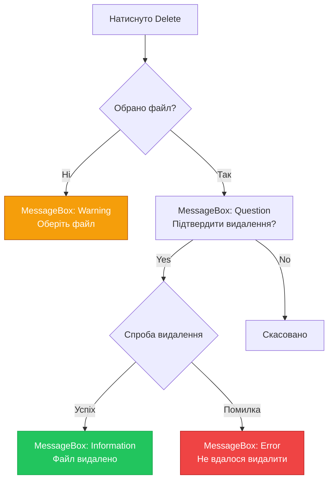
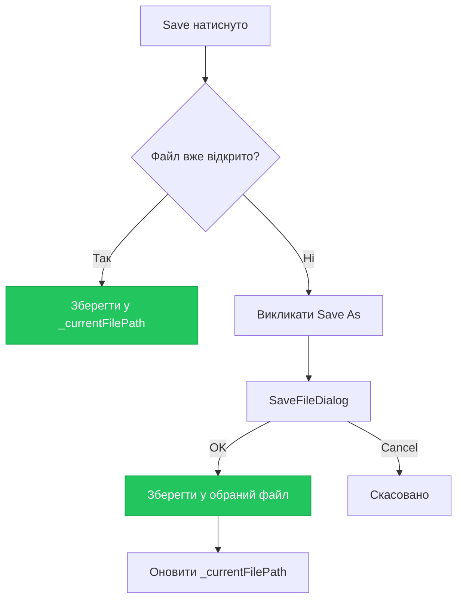
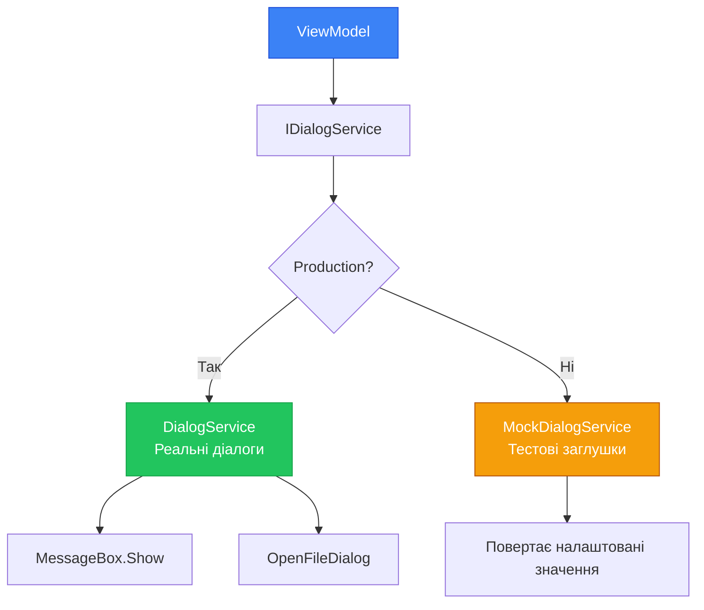

# Діалоги та File Pickers у WPF

Кожен застосунок потребує взаємодії з користувачем через діалогові вікна. "Ви впевнені, що хочете видалити цей файл?" — MessageBox з кнопками Так/Ні. "Оберіть файл для відкриття" — OpenFileDialog з переглядом файлової системи. "Зберегти зміни перед закриттям?" — кастомний діалог з трьома кнопками.

WPF пропонує набір стандартних діалогів для типових сценаріїв: повідомлення, вибір файлів, збереження файлів. Ці діалоги — не WPF-контроли, а обгортки навколо нативних Windows API. Вони виглядають як стандартні діалоги Windows і поводяться передбачувано для користувача.

Але стандартні діалоги мають обмеження. MessageBox не дозволяє кастомізувати кнопки або додати checkbox "Більше не показувати". OpenFileDialog не підтримує попередній перегляд зображень. Для складніших сценаріїв потрібні кастомні діалоги — власні вікна з повним контролем над UI та логікою.

У цій статті ми розглянемо весь спектр діалогів: від простого `MessageBox.Show()` до промислового Dialog Service pattern для MVVM-застосунків. Ви навчитесь створювати діалоги, що не порушують архітектуру та залишаються тестованими.

::note
**Словник теми:** **MessageBox** — стандартне діалогове вікно для повідомлень з кнопками OK/Cancel/Yes/No. **OpenFileDialog** — діалог вибору файлу для відкриття. **SaveFileDialog** — діалог вибору місця збереження файлу. **FolderBrowserDialog** — діалог вибору папки (з WinForms). **DialogResult** — результат закриття діалогового вікна (true/false/null). **IDialogService** — інтерфейс для абстракції роботи з діалогами у MVVM. **Dependency Injection (DI)** — патерн впровадження залежностей через конструктор або властивості.
::

---

## MessageBox: найпростіший діалог

`MessageBox` — це статичний клас з єдиним методом `Show()`, що відображає модальне вікно з текстом, іконкою та кнопками. Це найшвидший спосіб показати повідомлення користувачу.

### Базовий синтаксис

Найпростіший виклик — лише текст повідомлення:

```csharp
MessageBox.Show("Файл успішно збережено!");
```

Це відкриє вікно з текстом, іконкою інформації та кнопкою OK. Вікно модальне — воно блокує взаємодію з батьківським вікном до закриття.

### Параметри MessageBox.Show()

Метод `Show()` має кілька перевантажень з різними параметрами:

```csharp
MessageBoxResult result = MessageBox.Show(
    messageBoxText: "Ви впевнені, що хочете видалити цей файл?",
    caption: "Підтвердження видалення",
    button: MessageBoxButton.YesNo,
    icon: MessageBoxImage.Warning
);

if (result == MessageBoxResult.Yes)
{
    DeleteFile();
}
```

**Параметри:**

| Параметр | Тип | Опис |
|----------|-----|------|
| `messageBoxText` | `string` | Текст повідомлення (обов'язковий) |
| `caption` | `string` | Заголовок вікна |
| `button` | `MessageBoxButton` | Набір кнопок (OK, OKCancel, YesNo, YesNoCancel) |
| `icon` | `MessageBoxImage` | Іконка (None, Information, Warning, Error, Question) |
| `defaultResult` | `MessageBoxResult` | Кнопка за замовчуванням (підсвічена) |
| `owner` | `Window` | Батьківське вікно (для центрування) |

### MessageBoxButton: набори кнопок

`MessageBoxButton` визначає, які кнопки відображаються у діалозі:

```csharp
// OK — одна кнопка
MessageBox.Show("Операція завершена", "Інформація", MessageBoxButton.OK);

// OKCancel — дві кнопки
var result = MessageBox.Show("Продовжити?", "Підтвердження", MessageBoxButton.OKCancel);

// YesNo — дві кнопки
var result = MessageBox.Show("Зберегти зміни?", "Збереження", MessageBoxButton.YesNo);

// YesNoCancel — три кнопки
var result = MessageBox.Show(
    "Зберегти зміни перед закриттям?", 
    "Збереження", 
    MessageBoxButton.YesNoCancel
);
```

**Доступні значення:**

| Значення | Кнопки | Використання |
|----------|--------|--------------|
| `OK` | OK | Інформаційні повідомлення |
| `OKCancel` | OK, Скасувати | Підтвердження дії |
| `YesNo` | Так, Ні | Бінарний вибір |
| `YesNoCancel` | Так, Ні, Скасувати | Вибір з можливістю відміни |

### MessageBoxImage: іконки

`MessageBoxImage` визначає іконку, що відображається у діалозі:

```csharp
// Інформація (синя іконка "i")
MessageBox.Show("Файл збережено", "Інформація", 
    MessageBoxButton.OK, MessageBoxImage.Information);

// Попередження (жовтий трикутник з "!")
MessageBox.Show("Файл вже існує", "Попередження", 
    MessageBoxButton.OK, MessageBoxImage.Warning);

// Помилка (червоний круг з "X")
MessageBox.Show("Не вдалося зберегти файл", "Помилка", 
    MessageBoxButton.OK, MessageBoxImage.Error);

// Питання (синій круг з "?")
MessageBox.Show("Видалити файл?", "Підтвердження", 
    MessageBoxButton.YesNo, MessageBoxImage.Question);
```

**Доступні значення:**

| Значення | Іконка | Звук | Використання |
|----------|--------|------|--------------|
| `None` | Немає | Немає | Нейтральні повідомлення |
| `Information` | Синя "i" | Інформаційний | Успішні операції |
| `Warning` | Жовтий "!" | Попередження | Потенційні проблеми |
| `Error` | Червоний "X" | Помилка | Критичні помилки |
| `Question` | Синій "?" | Питання | Запити підтвердження |

::tip
**Рекомендація:** Завжди використовуйте відповідну іконку. `MessageBoxImage.Error` для помилок, `MessageBoxImage.Warning` для попереджень, `MessageBoxImage.Question` для підтверджень. Це допомагає користувачу швидко зрозуміти тип повідомлення.
::

### MessageBoxResult: обробка результату

`MessageBox.Show()` повертає `MessageBoxResult` — enum, що вказує, яку кнопку натиснув користувач:

```csharp
MessageBoxResult result = MessageBox.Show(
    "Зберегти зміни перед закриттям?",
    "Збереження",
    MessageBoxButton.YesNoCancel,
    MessageBoxImage.Question
);

switch (result)
{
    case MessageBoxResult.Yes:
        SaveChanges();
        CloseWindow();
        break;
    
    case MessageBoxResult.No:
        CloseWindow();
        break;
    
    case MessageBoxResult.Cancel:
        // Нічого не робимо — залишаємось у вікні
        break;
}
```

**Можливі значення:**

| Значення | Опис |
|----------|------|
| `OK` | Натиснуто OK |
| `Cancel` | Натиснуто Cancel або закрито вікно (X) |
| `Yes` | Натиснуто Yes |
| `No` | Натиснуто No |
| `None` | Діалог закрито без вибору (рідко) |

### Центрування відносно батьківського вікна

За замовчуванням MessageBox з'являється у центрі екрану. Щоб центрувати його відносно батьківського вікна — передайте `owner`:

```csharp
// У code-behind MainWindow
MessageBox.Show(
    this,  // owner — поточне вікно
    "Файл збережено",
    "Інформація",
    MessageBoxButton.OK,
    MessageBoxImage.Information
);
```

Тепер MessageBox з'явиться точно по центру MainWindow, а не екрану.

### Практичний приклад: підтвердження видалення

```csharp
private void DeleteButton_Click(object sender, RoutedEventArgs e)
{
    var selectedItem = ItemsListBox.SelectedItem as FileItem;
    if (selectedItem == null)
    {
        MessageBox.Show(
            this,
            "Оберіть файл для видалення",
            "Помилка",
            MessageBoxButton.OK,
            MessageBoxImage.Warning
        );
        return;
    }
    
    var result = MessageBox.Show(
        this,
        $"Ви впевнені, що хочете видалити файл '{selectedItem.Name}'?\n\nЦю дію неможливо скасувати.",
        "Підтвердження видалення",
        MessageBoxButton.YesNo,
        MessageBoxImage.Question
    );
    
    if (result == MessageBoxResult.Yes)
    {
        try
        {
            File.Delete(selectedItem.Path);
            Items.Remove(selectedItem);
            
            MessageBox.Show(
                this,
                "Файл успішно видалено",
                "Успіх",
                MessageBoxButton.OK,
                MessageBoxImage.Information
            );
        }
        catch (Exception ex)
        {
            MessageBox.Show(
                this,
                $"Не вдалося видалити файл:\n{ex.Message}",
                "Помилка",
                MessageBoxButton.OK,
                MessageBoxImage.Error
            );
        }
    }
}
```

::mermaid

::

---

## OpenFileDialog: вибір файлу для відкриття

`OpenFileDialog` — це стандартний Windows-діалог для вибору файлу. Він відображає файлову систему, дозволяє фільтрувати файли за розширенням та підтримує множинний вибір.

### Базовий приклад

```csharp
using Microsoft.Win32;  // Namespace для OpenFileDialog

private void OpenFile_Click(object sender, RoutedEventArgs e)
{
    var dialog = new OpenFileDialog();
    
    // ShowDialog() повертає bool? — true якщо користувач обрав файл
    bool? result = dialog.ShowDialog();
    
    if (result == true)
    {
        string filename = dialog.FileName;
        LoadFile(filename);
    }
}
```

**Ключові моменти:**

1. `OpenFileDialog` знаходиться у namespace `Microsoft.Win32`, а не `System.Windows.Controls`
2. `ShowDialog()` повертає `bool?` — `true` якщо файл обрано, `false` або `null` якщо скасовано
3. `FileName` містить повний шлях до обраного файлу

### Властивості OpenFileDialog

```csharp
var dialog = new OpenFileDialog
{
    Title = "Відкрити текстовий файл",
    Filter = "Text files (*.txt)|*.txt|All files (*.*)|*.*",
    FilterIndex = 1,
    InitialDirectory = Environment.GetFolderPath(Environment.SpecialFolder.MyDocuments),
    CheckFileExists = true,
    CheckPathExists = true,
    Multiselect = false
};

if (dialog.ShowDialog() == true)
{
    string filename = dialog.FileName;
    // Обробка файлу
}
```

**Основні властивості:**

| Властивість | Тип | Опис |
|-------------|-----|------|
| `Title` | `string` | Заголовок діалогу |
| `Filter` | `string` | Фільтр типів файлів |
| `FilterIndex` | `int` | Індекс активного фільтру (1-based) |
| `InitialDirectory` | `string` | Початкова папка |
| `FileName` | `string` | Обраний файл (повний шлях) |
| `FileNames` | `string[]` | Обрані файли (для Multiselect) |
| `CheckFileExists` | `bool` | Перевіряти існування файлу |
| `CheckPathExists` | `bool` | Перевіряти існування шляху |
| `Multiselect` | `bool` | Дозволити вибір кількох файлів |

### Filter: фільтрація файлів за розширенням

Властивість `Filter` визначає, які типи файлів відображаються у діалозі. Синтаксис:

```
"Опис1|Маска1|Опис2|Маска2|..."
```

**Приклади:**

```csharp
// Лише текстові файли
dialog.Filter = "Text files (*.txt)|*.txt";

// Текстові та всі файли
dialog.Filter = "Text files (*.txt)|*.txt|All files (*.*)|*.*";

// Зображення (кілька розширень)
dialog.Filter = "Image files (*.png;*.jpg;*.jpeg)|*.png;*.jpg;*.jpeg|All files (*.*)|*.*";

// Документи
dialog.Filter = "Word documents (*.docx)|*.docx|PDF files (*.pdf)|*.pdf|All files (*.*)|*.*";
```

**Структура фільтру:**

- Парні елементи (0, 2, 4...) — опис для користувача
- Непарні елементи (1, 3, 5...) — маски файлів
- Кілька масок розділяються крапкою з комою: `*.png;*.jpg;*.jpeg`

**FilterIndex:**

```csharp
dialog.Filter = "Text files (*.txt)|*.txt|CSV files (*.csv)|*.csv|All files (*.*)|*.*";
dialog.FilterIndex = 2;  // За замовчуванням обрано CSV files
```

`FilterIndex` — це 1-based індекс (перший фільтр = 1, другий = 2, тощо).

### Multiselect: вибір кількох файлів

```csharp
var dialog = new OpenFileDialog
{
    Title = "Оберіть файли для імпорту",
    Filter = "CSV files (*.csv)|*.csv",
    Multiselect = true  // Дозволити вибір кількох файлів
};

if (dialog.ShowDialog() == true)
{
    // FileNames — масив усіх обраних файлів
    foreach (string filename in dialog.FileNames)
    {
        ImportFile(filename);
    }
    
    MessageBox.Show($"Імпортовано {dialog.FileNames.Length} файлів");
}
```

**Важливо:** При `Multiselect = true` використовуйте `FileNames` (множина), а не `FileName` (однина).

### InitialDirectory: початкова папка

```csharp
// Папка "Мої документи"
dialog.InitialDirectory = Environment.GetFolderPath(Environment.SpecialFolder.MyDocuments);

// Папка "Робочий стіл"
dialog.InitialDirectory = Environment.GetFolderPath(Environment.SpecialFolder.Desktop);

// Поточна папка застосунку
dialog.InitialDirectory = AppDomain.CurrentDomain.BaseDirectory;

// Кастомна папка
dialog.InitialDirectory = @"C:\Projects\MyApp\Data";
```

**Environment.SpecialFolder** — enum з системними папками:

- `MyDocuments` — Мої документи
- `Desktop` — Робочий стіл
- `MyPictures` — Мої зображення
- `MyMusic` — Моя музика
- `ApplicationData` — AppData\Roaming
- `LocalApplicationData` — AppData\Local

### Практичний приклад: текстовий редактор

```csharp
private string? _currentFilePath;

private void OpenFile_Click(object sender, RoutedEventArgs e)
{
    var dialog = new OpenFileDialog
    {
        Title = "Відкрити текстовий файл",
        Filter = "Text files (*.txt)|*.txt|All files (*.*)|*.*",
        FilterIndex = 1,
        InitialDirectory = Environment.GetFolderPath(Environment.SpecialFolder.MyDocuments)
    };
    
    if (dialog.ShowDialog() == true)
    {
        try
        {
            string content = File.ReadAllText(dialog.FileName);
            EditorTextBox.Text = content;
            _currentFilePath = dialog.FileName;
            Title = $"Text Editor - {Path.GetFileName(dialog.FileName)}";
        }
        catch (Exception ex)
        {
            MessageBox.Show(
                this,
                $"Не вдалося відкрити файл:\n{ex.Message}",
                "Помилка",
                MessageBoxButton.OK,
                MessageBoxImage.Error
            );
        }
    }
}
```

---

## SaveFileDialog: збереження файлу

`SaveFileDialog` — це стандартний Windows-діалог для вибору місця збереження файлу. Він схожий на `OpenFileDialog`, але має додаткові властивості для збереження.

### Базовий приклад

```csharp
using Microsoft.Win32;

private void SaveFile_Click(object sender, RoutedEventArgs e)
{
    var dialog = new SaveFileDialog();
    
    if (dialog.ShowDialog() == true)
    {
        string filename = dialog.FileName;
        SaveToFile(filename);
    }
}
```

### Властивості SaveFileDialog

```csharp
var dialog = new SaveFileDialog
{
    Title = "Зберегти документ",
    Filter = "Text files (*.txt)|*.txt|All files (*.*)|*.*",
    FilterIndex = 1,
    FileName = "document.txt",  // Запропоноване ім'я файлу
    DefaultExt = "txt",  // Розширення за замовчуванням
    AddExtension = true,  // Автоматично додавати розширення
    OverwritePrompt = true,  // Попередження при перезаписі
    CreatePrompt = false,  // Попередження при створенні нового файлу
    InitialDirectory = Environment.GetFolderPath(Environment.SpecialFolder.MyDocuments)
};

if (dialog.ShowDialog() == true)
{
    File.WriteAllText(dialog.FileName, EditorTextBox.Text);
}
```

**Унікальні властивості SaveFileDialog:**

| Властивість | Тип | Опис |
|-------------|-----|------|
| `FileName` | `string` | Запропоноване ім'я файлу |
| `DefaultExt` | `string` | Розширення за замовчуванням (без крапки) |
| `AddExtension` | `bool` | Автоматично додавати розширення |
| `OverwritePrompt` | `bool` | Попередження при перезаписі існуючого файлу |
| `CreatePrompt` | `bool` | Попередження при створенні нового файлу |

### DefaultExt та AddExtension

```csharp
dialog.DefaultExt = "txt";
dialog.AddExtension = true;
```

Якщо користувач введе ім'я без розширення (наприклад, "document"), діалог автоматично додасть `.txt` → `document.txt`.

### OverwritePrompt: попередження при перезаписі

```csharp
dialog.OverwritePrompt = true;
```

Якщо файл вже існує, діалог покаже стандартне Windows-попередження: "Файл вже існує. Замінити його?"

### Практичний приклад: Save та Save As

```csharp
private string? _currentFilePath;

// Save — зберегти у поточний файл або викликати Save As
private void Save_Click(object sender, RoutedEventArgs e)
{
    if (_currentFilePath != null)
    {
        // Файл вже відкрито — зберігаємо у нього
        SaveToFile(_currentFilePath);
    }
    else
    {
        // Файл ще не збережено — викликаємо Save As
        SaveAs_Click(sender, e);
    }
}

// Save As — завжди показувати діалог
private void SaveAs_Click(object sender, RoutedEventArgs e)
{
    var dialog = new SaveFileDialog
    {
        Title = "Зберегти файл як",
        Filter = "Text files (*.txt)|*.txt|All files (*.*)|*.*",
        FilterIndex = 1,
        FileName = _currentFilePath != null 
            ? Path.GetFileName(_currentFilePath) 
            : "document.txt",
        DefaultExt = "txt",
        AddExtension = true,
        OverwritePrompt = true
    };
    
    if (dialog.ShowDialog() == true)
    {
        SaveToFile(dialog.FileName);
        _currentFilePath = dialog.FileName;
        Title = $"Text Editor - {Path.GetFileName(dialog.FileName)}";
    }
}

private void SaveToFile(string filename)
{
    try
    {
        File.WriteAllText(filename, EditorTextBox.Text);
        MessageBox.Show(
            this,
            "Файл успішно збережено",
            "Успіх",
            MessageBoxButton.OK,
            MessageBoxImage.Information
        );
    }
    catch (Exception ex)
    {
        MessageBox.Show(
            this,
            $"Не вдалося зберегти файл:\n{ex.Message}",
            "Помилка",
            MessageBoxButton.OK,
            MessageBoxImage.Error
        );
    }
}
```

::mermaid

::


---

## FolderBrowserDialog: вибір папки

WPF не має власного діалогу для вибору папки. Це одна з дивних прогалин фреймворку — є `OpenFileDialog` та `SaveFileDialog`, але немає `FolderDialog`. Причина історична: WPF створювався як наступник WinForms, і розробники припустили, що `FolderBrowserDialog` з WinForms буде достатньо.

### Використання WinForms FolderBrowserDialog

Щоб використати `FolderBrowserDialog`, потрібно додати посилання на `System.Windows.Forms`:

**1. Додати NuGet пакет:**

```bash
dotnet add package System.Windows.Forms
```

**2. Використати у коді:**

```csharp
using System.Windows.Forms;  // FolderBrowserDialog з WinForms

private void SelectFolder_Click(object sender, RoutedEventArgs e)
{
    using var dialog = new FolderBrowserDialog();
    dialog.Description = "Оберіть папку для експорту";
    dialog.ShowNewFolderButton = true;
    
    DialogResult result = dialog.ShowDialog();
    
    if (result == DialogResult.OK && !string.IsNullOrWhiteSpace(dialog.SelectedPath))
    {
        string folderPath = dialog.SelectedPath;
        ExportToFolder(folderPath);
    }
}
```

**Властивості FolderBrowserDialog:**

| Властивість | Тип | Опис |
|-------------|-----|------|
| `Description` | `string` | Опис над деревом папок |
| `SelectedPath` | `string` | Обрана папка (повний шлях) |
| `ShowNewFolderButton` | `bool` | Показувати кнопку "Створити папку" |
| `RootFolder` | `Environment.SpecialFolder` | Коренева папка дерева |

### Проблеми FolderBrowserDialog

`FolderBrowserDialog` має застарілий дизайн (Windows XP) і незручний UI:

- ❌ Застарілий вигляд (не відповідає Windows 10/11)
- ❌ Незручна навігація (лише дерево папок)
- ❌ Немає адресного рядка
- ❌ Немає можливості вставити шлях

### Альтернатива: OpenFileDialog з хаком

Існує хак для використання `OpenFileDialog` як діалогу вибору папки:

```csharp
private void SelectFolder_Click(object sender, RoutedEventArgs e)
{
    var dialog = new OpenFileDialog
    {
        Title = "Оберіть папку",
        CheckFileExists = false,
        CheckPathExists = true,
        FileName = "Folder Selection",
        Filter = "Folders|\n",
        ValidateNames = false
    };
    
    if (dialog.ShowDialog() == true)
    {
        string folderPath = Path.GetDirectoryName(dialog.FileName);
        ExportToFolder(folderPath);
    }
}
```

Це працює, але виглядає як баг — користувач бачить діалог вибору файлу, а не папки.

### Рекомендація: WindowsAPICodePack

Найкращий варіант — використати `WindowsAPICodePack`, що надає сучасний діалог вибору папки:

```bash
dotnet add package Microsoft.WindowsAPICodePack-Shell
```

```csharp
using Microsoft.WindowsAPICodePack.Dialogs;

private void SelectFolder_Click(object sender, RoutedEventArgs e)
{
    using var dialog = new CommonOpenFileDialog
    {
        IsFolderPicker = true,
        Title = "Оберіть папку для експорту",
        InitialDirectory = Environment.GetFolderPath(Environment.SpecialFolder.MyDocuments)
    };
    
    if (dialog.ShowDialog() == CommonFileDialogResult.Ok)
    {
        string folderPath = dialog.FileName;
        ExportToFolder(folderPath);
    }
}
```

**Переваги:**

- ✅ Сучасний дизайн (Windows Vista+)
- ✅ Адресний рядок
- ✅ Можливість вставити шлях
- ✅ Швидкий доступ до папок

::warning
`WindowsAPICodePack` працює лише на Windows Vista та новіших. Для Windows XP потрібен fallback на `FolderBrowserDialog`.
::

---

## Custom Dialogs: власні діалогові вікна

Стандартні діалоги обмежені у функціональності. Якщо потрібен checkbox "Більше не показувати", кілька полів введення, або кастомний дизайн — створюйте власні діалоги через `Window.ShowDialog()`.

### Створення кастомного діалогу

Кастомний діалог — це звичайне `Window` з властивістю `DialogResult`.

**ConfirmDialog.xaml:**

```xml
<Window x:Class="MyApp.Dialogs.ConfirmDialog"
        xmlns="http://schemas.microsoft.com/winfx/2006/xaml/presentation"
        xmlns:x="http://schemas.microsoft.com/winfx/2006/xaml"
        Title="Підтвердження"
        Width="400" Height="200"
        WindowStartupLocation="CenterOwner"
        ResizeMode="NoResize">
    
    <Grid Margin="20">
        <Grid.RowDefinitions>
            <RowDefinition Height="Auto"/>
            <RowDefinition Height="Auto"/>
            <RowDefinition Height="*"/>
            <RowDefinition Height="Auto"/>
        </Grid.RowDefinitions>
        
        <!-- Іконка та заголовок -->
        <StackPanel Grid.Row="0" Orientation="Horizontal" Margin="0,0,0,12">
            <TextBlock Text="⚠️" FontSize="24" Margin="0,0,12,0"/>
            <TextBlock x:Name="TitleTextBlock" 
                       Text="Підтвердження дії"
                       FontSize="16" FontWeight="Bold"
                       VerticalAlignment="Center"/>
        </StackPanel>
        
        <!-- Повідомлення -->
        <TextBlock Grid.Row="1" 
                   x:Name="MessageTextBlock"
                   Text="Ви впевнені, що хочете виконати цю дію?"
                   TextWrapping="Wrap"
                   Margin="0,0,0,12"/>
        
        <!-- Checkbox "Більше не показувати" -->
        <CheckBox Grid.Row="2" 
                  x:Name="DontShowAgainCheckBox"
                  Content="Більше не показувати це повідомлення"
                  VerticalAlignment="Bottom"
                  Margin="0,0,0,12"/>
        
        <!-- Кнопки -->
        <StackPanel Grid.Row="3" 
                    Orientation="Horizontal" 
                    HorizontalAlignment="Right">
            <Button Content="Так" 
                    Width="80" 
                    IsDefault="True"
                    Click="YesButton_Click"
                    Margin="0,0,8,0"/>
            <Button Content="Ні" 
                    Width="80" 
                    IsCancel="True"
                    Click="NoButton_Click"/>
        </StackPanel>
    </Grid>
</Window>
```

**ConfirmDialog.xaml.cs:**

```csharp
public partial class ConfirmDialog : Window
{
    public bool DontShowAgain => DontShowAgainCheckBox.IsChecked == true;
    
    public ConfirmDialog(string title, string message)
    {
        InitializeComponent();
        TitleTextBlock.Text = title;
        MessageTextBlock.Text = message;
    }
    
    private void YesButton_Click(object sender, RoutedEventArgs e)
    {
        DialogResult = true;  // Закрити з результатом true
    }
    
    private void NoButton_Click(object sender, RoutedEventArgs e)
    {
        DialogResult = false;  // Закрити з результатом false
    }
}
```

### Використання кастомного діалогу

```csharp
private void DeleteButton_Click(object sender, RoutedEventArgs e)
{
    var dialog = new ConfirmDialog(
        title: "Підтвердження видалення",
        message: "Ви впевнені, що хочете видалити обраний файл?\n\nЦю дію неможливо скасувати."
    );
    
    dialog.Owner = this;  // Центрувати відносно MainWindow
    
    bool? result = dialog.ShowDialog();
    
    if (result == true)
    {
        // Користувач натиснув "Так"
        DeleteFile();
        
        // Перевірити checkbox
        if (dialog.DontShowAgain)
        {
            SaveSetting("DontShowDeleteConfirmation", true);
        }
    }
}
```

### Патерн: ViewModel для діалогу

Для складніших діалогів використовуйте MVVM-підхід з ViewModel:

**EditPersonDialogViewModel.cs:**

```csharp
public class EditPersonDialogViewModel : ViewModelBase
{
    private string _name = "";
    public string Name
    {
        get => _name;
        set => SetField(ref _name, value);
    }
    
    private int _age;
    public int Age
    {
        get => _age;
        set => SetField(ref _age, value);
    }
    
    private string _email = "";
    public string Email
    {
        get => _email;
        set => SetField(ref _email, value);
    }
    
    public ICommand SaveCommand { get; }
    public ICommand CancelCommand { get; }
    
    public event EventHandler<bool>? RequestClose;
    
    public EditPersonDialogViewModel(Person? person = null)
    {
        if (person != null)
        {
            Name = person.Name;
            Age = person.Age;
            Email = person.Email;
        }
        
        SaveCommand = new RelayCommand(_ => Save(), _ => CanSave());
        CancelCommand = new RelayCommand(_ => Cancel());
    }
    
    private bool CanSave()
    {
        return !string.IsNullOrWhiteSpace(Name) && 
               Age > 0 && 
               !string.IsNullOrWhiteSpace(Email);
    }
    
    private void Save()
    {
        RequestClose?.Invoke(this, true);
    }
    
    private void Cancel()
    {
        RequestClose?.Invoke(this, false);
    }
}
```

**EditPersonDialog.xaml.cs:**

```csharp
public partial class EditPersonDialog : Window
{
    private readonly EditPersonDialogViewModel _viewModel;
    
    public Person? Result { get; private set; }
    
    public EditPersonDialog(Person? person = null)
    {
        InitializeComponent();
        
        _viewModel = new EditPersonDialogViewModel(person);
        _viewModel.RequestClose += OnRequestClose;
        DataContext = _viewModel;
    }
    
    private void OnRequestClose(object? sender, bool dialogResult)
    {
        if (dialogResult)
        {
            Result = new Person(
                Name: _viewModel.Name,
                Age: _viewModel.Age,
                Email: _viewModel.Email
            );
        }
        
        DialogResult = dialogResult;
    }
}
```

**Використання:**

```csharp
private void EditPerson_Click(object sender, RoutedEventArgs e)
{
    var selectedPerson = (Person)PeopleListBox.SelectedItem;
    
    var dialog = new EditPersonDialog(selectedPerson);
    dialog.Owner = this;
    
    if (dialog.ShowDialog() == true && dialog.Result != null)
    {
        UpdatePerson(dialog.Result);
    }
}
```

---

## MVVM-friendly Dialogs: Dialog Service pattern

У чистому MVVM ViewModel не повинна знати про View. Але як тоді відкрити діалог з ViewModel? Відповідь — через абстракцію: `IDialogService`.

### Проблема: ViewModel не може створювати вікна

```csharp
// ❌ ПОГАНО — ViewModel залежить від View
public class MainViewModel : ViewModelBase
{
    [RelayCommand]
    private void DeleteItem()
    {
        // ViewModel не повинна знати про MessageBox або Window!
        var result = MessageBox.Show("Видалити?", "Підтвердження", 
            MessageBoxButton.YesNo);
        
        if (result == MessageBoxResult.Yes)
        {
            // Видалення
        }
    }
}
```

Ця ViewModel не тестована — неможливо запустити unit-тест, бо `MessageBox.Show()` вимагає UI-потік.

### Рішення: IDialogService

Створюємо інтерфейс для роботи з діалогами:

```csharp
// Services/IDialogService.cs
public interface IDialogService
{
    bool ShowConfirmation(string title, string message);
    void ShowInformation(string title, string message);
    void ShowWarning(string title, string message);
    void ShowError(string title, string message);
    
    string? OpenFile(string title, string filter);
    string? SaveFile(string title, string filter, string defaultFileName);
    string? SelectFolder(string title);
    
    T? ShowDialog<T>(object viewModel) where T : class;
}
```

### Реалізація DialogService

```csharp
// Services/DialogService.cs
public class DialogService : IDialogService
{
    public bool ShowConfirmation(string title, string message)
    {
        var result = MessageBox.Show(
            message,
            title,
            MessageBoxButton.YesNo,
            MessageBoxImage.Question
        );
        return result == MessageBoxResult.Yes;
    }
    
    public void ShowInformation(string title, string message)
    {
        MessageBox.Show(message, title, MessageBoxButton.OK, MessageBoxImage.Information);
    }
    
    public void ShowWarning(string title, string message)
    {
        MessageBox.Show(message, title, MessageBoxButton.OK, MessageBoxImage.Warning);
    }
    
    public void ShowError(string title, string message)
    {
        MessageBox.Show(message, title, MessageBoxButton.OK, MessageBoxImage.Error);
    }
    
    public string? OpenFile(string title, string filter)
    {
        var dialog = new OpenFileDialog
        {
            Title = title,
            Filter = filter
        };
        
        return dialog.ShowDialog() == true ? dialog.FileName : null;
    }
    
    public string? SaveFile(string title, string filter, string defaultFileName)
    {
        var dialog = new SaveFileDialog
        {
            Title = title,
            Filter = filter,
            FileName = defaultFileName,
            AddExtension = true,
            OverwritePrompt = true
        };
        
        return dialog.ShowDialog() == true ? dialog.FileName : null;
    }
    
    public string? SelectFolder(string title)
    {
        using var dialog = new FolderBrowserDialog
        {
            Description = title,
            ShowNewFolderButton = true
        };
        
        return dialog.ShowDialog() == DialogResult.OK ? dialog.SelectedPath : null;
    }
    
    public T? ShowDialog<T>(object viewModel) where T : class
    {
        // Створення діалогу на основі ViewModel
        Window? dialog = viewModel switch
        {
            EditPersonDialogViewModel vm => new EditPersonDialog { DataContext = vm },
            ConfirmDialogViewModel vm => new ConfirmDialog { DataContext = vm },
            _ => throw new ArgumentException($"Unknown ViewModel type: {viewModel.GetType()}")
        };
        
        if (dialog == null)
            return null;
        
        dialog.Owner = Application.Current.MainWindow;
        
        bool? result = dialog.ShowDialog();
        
        // Повернути результат з діалогу
        return result == true ? (dialog as dynamic)?.Result as T : null;
    }
}
```

### Використання у ViewModel

```csharp
public class MainViewModel : ViewModelBase
{
    private readonly IDialogService _dialogService;
    
    public MainViewModel(IDialogService dialogService)
    {
        _dialogService = dialogService;
    }
    
    [RelayCommand]
    private void DeleteItem()
    {
        bool confirmed = _dialogService.ShowConfirmation(
            "Підтвердження видалення",
            "Ви впевнені, що хочете видалити обраний файл?"
        );
        
        if (confirmed)
        {
            // Видалення
            _dialogService.ShowInformation("Успіх", "Файл успішно видалено");
        }
    }
    
    [RelayCommand]
    private void OpenFile()
    {
        string? filename = _dialogService.OpenFile(
            "Відкрити файл",
            "Text files (*.txt)|*.txt|All files (*.*)|*.*"
        );
        
        if (filename != null)
        {
            LoadFile(filename);
        }
    }
    
    [RelayCommand]
    private void EditPerson()
    {
        var viewModel = new EditPersonDialogViewModel(SelectedPerson);
        
        Person? result = _dialogService.ShowDialog<Person>(viewModel);
        
        if (result != null)
        {
            UpdatePerson(result);
        }
    }
}
```

### Реєстрація у DI-контейнері

```csharp
// App.xaml.cs або Program.cs
public static IServiceProvider ConfigureServices()
{
    var services = new ServiceCollection();
    
    // Singleton для DialogService
    services.AddSingleton<IDialogService, DialogService>();
    
    // ViewModels
    services.AddTransient<MainViewModel>();
    
    return services.BuildServiceProvider();
}
```

### Mock для тестування

```csharp
// Tests/MockDialogService.cs
public class MockDialogService : IDialogService
{
    public bool ConfirmationResult { get; set; } = true;
    public string? OpenFileResult { get; set; }
    
    public bool ShowConfirmation(string title, string message)
    {
        return ConfirmationResult;
    }
    
    public void ShowInformation(string title, string message) { }
    public void ShowWarning(string title, string message) { }
    public void ShowError(string title, string message) { }
    
    public string? OpenFile(string title, string filter)
    {
        return OpenFileResult;
    }
    
    public string? SaveFile(string title, string filter, string defaultFileName)
    {
        return null;
    }
    
    public string? SelectFolder(string title)
    {
        return null;
    }
    
    public T? ShowDialog<T>(object viewModel) where T : class
    {
        return null;
    }
}
```

**Unit-тест:**

```csharp
[Fact]
public void DeleteItem_UserConfirms_DeletesItem()
{
    // Arrange
    var mockDialogService = new MockDialogService
    {
        ConfirmationResult = true  // Користувач підтвердив
    };
    var viewModel = new MainViewModel(mockDialogService);
    viewModel.Items.Add(new FileItem { Name = "test.txt" });
    viewModel.SelectedItem = viewModel.Items[0];
    
    // Act
    viewModel.DeleteItemCommand.Execute(null);
    
    // Assert
    Assert.Empty(viewModel.Items);
}
```

::mermaid

::


---

## Практичні завдання

### Рівень 1: MessageBox для підтвердження видалення

**Мета:** Навчитися використовувати `MessageBox` для підтвердження дій.

**Завдання:**

Створіть додаток зі списком файлів та кнопкою видалення:

1. **UI:**
   - ListBox зі списком файлів (ObservableCollection<FileItem>)
   - Кнопка "Видалити обраний файл"

2. **Функціональність:**
   - При натисканні "Видалити" → показати MessageBox з підтвердженням
   - Якщо користувач підтвердив → видалити файл зі списку
   - Показати MessageBox з результатом (успіх або помилка)

3. **Вимоги:**
   - Використати `MessageBoxImage.Question` для підтвердження
   - Використати `MessageBoxButton.YesNo`
   - Показати попередження, якщо файл не обрано

**Критерії успіху:**

- MessageBox з'являється при спробі видалення
- Файл видаляється лише при підтвердженні
- Показується повідомлення про успіх/помилку
- Обробляється випадок, коли файл не обрано

**Підказка:**

```csharp
public class FileItem
{
    public string Name { get; set; } = "";
    public string Path { get; set; } = "";
    public long Size { get; set; }
}

private void DeleteButton_Click(object sender, RoutedEventArgs e)
{
    var selectedItem = FilesListBox.SelectedItem as FileItem;
    
    if (selectedItem == null)
    {
        MessageBox.Show(
            this,
            "Оберіть файл для видалення",
            "Помилка",
            MessageBoxButton.OK,
            MessageBoxImage.Warning
        );
        return;
    }
    
    var result = MessageBox.Show(
        this,
        $"Ви впевнені, що хочете видалити файл '{selectedItem.Name}'?",
        "Підтвердження видалення",
        MessageBoxButton.YesNo,
        MessageBoxImage.Question
    );
    
    if (result == MessageBoxResult.Yes)
    {
        Files.Remove(selectedItem);
        MessageBox.Show(
            this,
            "Файл успішно видалено",
            "Успіх",
            MessageBoxButton.OK,
            MessageBoxImage.Information
        );
    }
}
```

---

### Рівень 2: Текстовий редактор з Open/Save File

**Мета:** Навчитися використовувати `OpenFileDialog` та `SaveFileDialog`.

**Завдання:**

Створіть простий текстовий редактор:

1. **UI:**
   - TextBox для редагування тексту (AcceptsReturn="True", TextWrapping="Wrap")
   - Кнопка "Відкрити файл"
   - Кнопка "Зберегти"
   - Кнопка "Зберегти як"
   - TextBlock для відображення шляху до поточного файлу

2. **Функціональність:**
   - "Відкрити файл" → OpenFileDialog → завантажити текст у TextBox
   - "Зберегти" → зберегти у поточний файл (або викликати "Зберегти як")
   - "Зберегти як" → SaveFileDialog → зберегти у новий файл
   - Фільтр: Text files (*.txt) та All files (*.*)

3. **Додатково:**
   - Відстежувати зміни у тексті (IsModified)
   - При закритті вікна → запитати про збереження, якщо є зміни
   - Оновлювати заголовок вікна з ім'ям файлу

**Критерії успіху:**

- Файл відкривається та відображається у TextBox
- "Зберегти" працює для існуючого файлу
- "Зберегти як" завжди показує діалог
- При закритті запитується про збереження змін
- Заголовок вікна показує ім'я файлу

**Підказка:**

```csharp
private string? _currentFilePath;
private bool _isModified;

private void OpenFile_Click(object sender, RoutedEventArgs e)
{
    if (_isModified)
    {
        var result = MessageBox.Show(
            this,
            "Зберегти зміни перед відкриттям нового файлу?",
            "Незбережені зміни",
            MessageBoxButton.YesNoCancel,
            MessageBoxImage.Question
        );
        
        if (result == MessageBoxResult.Yes)
            Save_Click(sender, e);
        else if (result == MessageBoxResult.Cancel)
            return;
    }
    
    var dialog = new OpenFileDialog
    {
        Title = "Відкрити текстовий файл",
        Filter = "Text files (*.txt)|*.txt|All files (*.*)|*.*",
        FilterIndex = 1
    };
    
    if (dialog.ShowDialog() == true)
    {
        EditorTextBox.Text = File.ReadAllText(dialog.FileName);
        _currentFilePath = dialog.FileName;
        _isModified = false;
        UpdateTitle();
    }
}

private void EditorTextBox_TextChanged(object sender, TextChangedEventArgs e)
{
    _isModified = true;
    UpdateTitle();
}

private void UpdateTitle()
{
    string filename = _currentFilePath != null 
        ? Path.GetFileName(_currentFilePath) 
        : "Untitled";
    string modified = _isModified ? "*" : "";
    Title = $"{filename}{modified} - Text Editor";
}
```

---

### Рівень 3: IDialogService для MVVM

**Мета:** Реалізувати Dialog Service pattern для тестованої MVVM-архітектури.

**Завдання:**

Створіть додаток з повноцінним Dialog Service:

1. **Структура:**
   - `IDialogService` інтерфейс
   - `DialogService` реалізація
   - `MockDialogService` для тестів
   - MainViewModel з командами

2. **Функціональність:**
   - Список користувачів (ObservableCollection<User>)
   - Команда "Додати користувача" → діалог введення
   - Команда "Редагувати користувача" → діалог редагування
   - Команда "Видалити користувача" → підтвердження через DialogService
   - Команда "Експортувати" → SaveFileDialog через DialogService

3. **Dependency Injection:**
   - Зареєструвати IDialogService у DI-контейнері
   - Впровадити через конструктор у MainViewModel

4. **Тестування:**
   - Unit-тест для команди видалення (з підтвердженням)
   - Unit-тест для команди видалення (без підтвердження)
   - Використати MockDialogService

**Критерії успіху:**

- ViewModel не залежить від конкретних діалогів
- Всі діалоги викликаються через IDialogService
- Unit-тести працюють без UI
- DI правильно налаштований
- Код повністю тестований

**Підказка для IDialogService:**

```csharp
public interface IDialogService
{
    bool ShowConfirmation(string title, string message);
    void ShowInformation(string title, string message);
    void ShowError(string title, string message);
    
    T? ShowDialog<T>(object viewModel) where T : class;
    string? SaveFile(string title, string filter, string defaultFileName);
}

public class MainViewModel : ViewModelBase
{
    private readonly IDialogService _dialogService;
    
    public ObservableCollection<User> Users { get; } = new();
    
    public MainViewModel(IDialogService dialogService)
    {
        _dialogService = dialogService;
    }
    
    [RelayCommand]
    private void DeleteUser(User user)
    {
        bool confirmed = _dialogService.ShowConfirmation(
            "Підтвердження видалення",
            $"Ви впевнені, що хочете видалити користувача '{user.Name}'?"
        );
        
        if (confirmed)
        {
            Users.Remove(user);
            _dialogService.ShowInformation("Успіх", "Користувача видалено");
        }
    }
    
    [RelayCommand]
    private void ExportUsers()
    {
        string? filename = _dialogService.SaveFile(
            "Експортувати користувачів",
            "CSV files (*.csv)|*.csv",
            "users.csv"
        );
        
        if (filename != null)
        {
            ExportToCsv(filename);
        }
    }
}
```

**Підказка для unit-тесту:**

```csharp
[Fact]
public void DeleteUser_UserConfirms_RemovesUser()
{
    // Arrange
    var mockDialogService = new MockDialogService
    {
        ConfirmationResult = true
    };
    var viewModel = new MainViewModel(mockDialogService);
    var user = new User("John Doe", 30);
    viewModel.Users.Add(user);
    
    // Act
    viewModel.DeleteUserCommand.Execute(user);
    
    // Assert
    Assert.Empty(viewModel.Users);
}

[Fact]
public void DeleteUser_UserCancels_DoesNotRemoveUser()
{
    // Arrange
    var mockDialogService = new MockDialogService
    {
        ConfirmationResult = false
    };
    var viewModel = new MainViewModel(mockDialogService);
    var user = new User("John Doe", 30);
    viewModel.Users.Add(user);
    
    // Act
    viewModel.DeleteUserCommand.Execute(user);
    
    // Assert
    Assert.Single(viewModel.Users);
}
```

---

## Підсумок

WPF пропонує набір стандартних діалогів для типових сценаріїв, але для складніших випадків потрібні кастомні рішення та MVVM-friendly підходи.

**Ключові висновки:**

::card-group

::card{title="💬 MessageBox" icon="i-lucide-message-square"}
Найпростіший діалог для повідомлень. MessageBox.Show() з параметрами button, icon, defaultResult.
::

::card{title="📂 OpenFileDialog" icon="i-lucide-folder-open"}
Стандартний діалог вибору файлу. Filter для фільтрації, Multiselect для кількох файлів.
::

::card{title="💾 SaveFileDialog" icon="i-lucide-save"}
Діалог збереження файлу. DefaultExt, AddExtension, OverwritePrompt для зручності.
::

::card{title="📁 FolderBrowserDialog" icon="i-lucide-folder"}
Вибір папки через WinForms. Застарілий дизайн — краще використати WindowsAPICodePack.
::

::card{title="🎨 Custom Dialogs" icon="i-lucide-palette"}
Власні діалоги через Window.ShowDialog(). Повний контроль над UI та логікою.
::

::card{title="🏗️ Dialog Service" icon="i-lucide-building"}
MVVM-friendly підхід через IDialogService. Тестованість та Dependency Injection.
::

::

**Переваги Dialog Service pattern:**

- ✅ ViewModel не залежить від конкретних діалогів
- ✅ Повна тестованість через Mock
- ✅ Dependency Injection
- ✅ Легко замінити реалізацію
- ✅ Чистий MVVM без порушень

**Порівняння підходів:**

| Підхід | Простота | Тестованість | MVVM | Використання |
|--------|----------|--------------|------|--------------|
| MessageBox напряму | Висока | Низька | ❌ | Прототипи |
| OpenFileDialog напряму | Висока | Низька | ❌ | Прості застосунки |
| Custom Dialog | Середня | Середня | ⚠️ | Кастомний UI |
| IDialogService | Низька | Висока | ✅ | Production MVVM |

::tip
**Рекомендація:** Для простих застосунків використовуйте стандартні діалоги напряму. Для production MVVM-застосунків — завжди використовуйте Dialog Service pattern з Dependency Injection.
::

**Що далі?**

Ви завершили статтю про діалоги та file pickers! Наступні теми:

- **Avalonia Dialogs** (стаття 36a) — кросплатформні діалоги у Avalonia
- **Dependency Injection** (стаття 37) — Microsoft.Extensions.DependencyInjection
- **Validation** (стаття 38) — INotifyDataErrorInfo та FluentValidation

---

## Словник термінів

::note{title="📚 Глосарій"}

**MessageBox** — стандартне модальне діалогове вікно для відображення повідомлень з кнопками.

**MessageBoxButton** — enum, що визначає набір кнопок у MessageBox (OK, OKCancel, YesNo, YesNoCancel).

**MessageBoxImage** — enum, що визначає іконку у MessageBox (None, Information, Warning, Error, Question).

**MessageBoxResult** — enum, що вказує, яку кнопку натиснув користувач (OK, Cancel, Yes, No, None).

**OpenFileDialog** — стандартний Windows-діалог для вибору файлу для відкриття.

**SaveFileDialog** — стандартний Windows-діалог для вибору місця збереження файлу.

**FolderBrowserDialog** — діалог вибору папки з WinForms (застарілий дизайн).

**Filter** — рядок фільтрації файлів за розширенням у форматі "Опис|Маска|Опис|Маска".

**FilterIndex** — індекс активного фільтру (1-based).

**Multiselect** — властивість OpenFileDialog для дозволу вибору кількох файлів.

**DialogResult** — результат закриття діалогового вікна (true/false/null).

**IDialogService** — інтерфейс для абстракції роботи з діалогами у MVVM.

**Dialog Service pattern** — патерн для тестованої роботи з діалогами через Dependency Injection.

**Mock** — тестова заглушка, що імітує поведінку реального об'єкта.

**Dependency Injection (DI)** — патерн впровадження залежностей через конструктор або властивості.

::

---

## Додаткові ресурси

::card-group

::card{title="📖 WPF MessageBox Docs" icon="i-lucide-book-open" to="https://learn.microsoft.com/en-us/dotnet/api/system.windows.messagebox"}
Офіційна документація про MessageBox та його параметри.
::

::card{title="📂 File Dialogs Guide" icon="i-lucide-folder" to="https://learn.microsoft.com/en-us/dotnet/api/microsoft.win32.openfiledialog"}
Повний гайд з OpenFileDialog та SaveFileDialog.
::

::card{title="🏗️ Dialog Service Pattern" icon="i-lucide-building" to="https://www.codeproject.com/Articles/36745/Showing-Dialogs-When-Using-The-MVVM-Pattern"}
Детальна стаття про Dialog Service pattern у MVVM.
::

::card{title="🧪 Unit Testing Dialogs" icon="i-lucide-flask" to="https://stackoverflow.com/questions/2246777/unit-testing-with-messagebox-show"}
Як тестувати код з діалогами через Mock.
::

::card{title="📚 Попередня стаття: Navigation Part 2" icon="i-lucide-arrow-left" to="/csharp/desktop-ui/navigation-windows-part2"}
Повернутися до MVVM-навігації.
::

::card{title="📚 Наступна стаття: Avalonia Dialogs" icon="i-lucide-arrow-right" to="/csharp/desktop-ui/36a.avalonia-dialogs"}
Дізнатися про кросплатформні діалоги у Avalonia.
::

::
