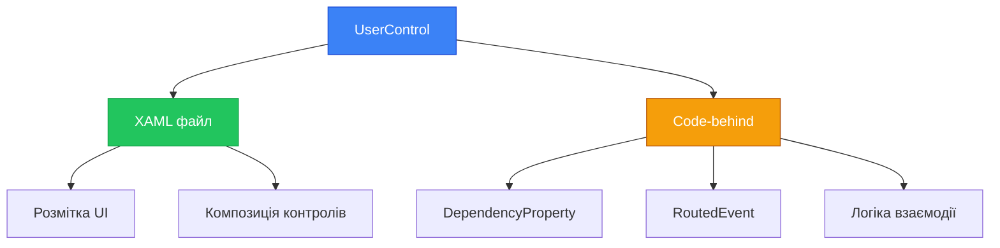
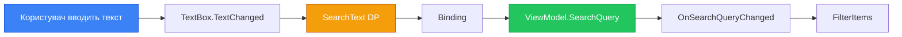
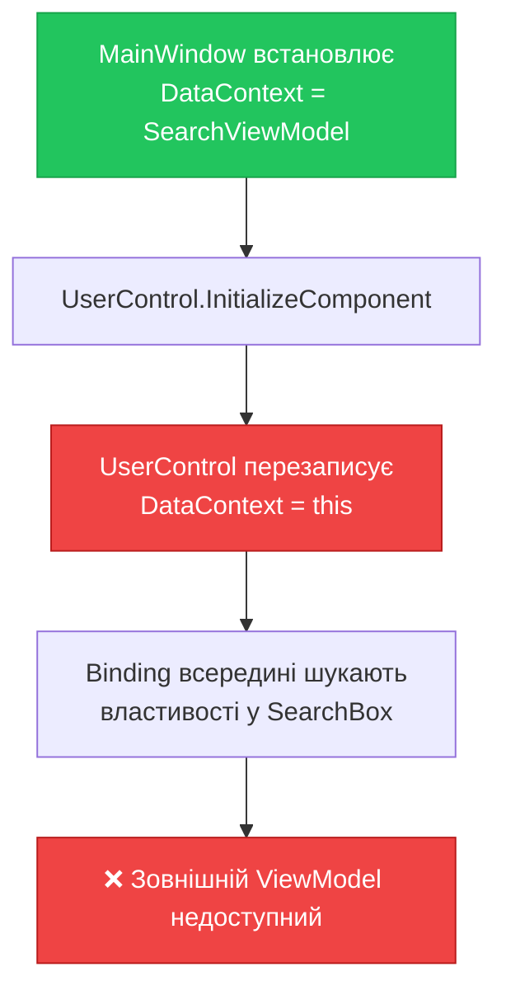
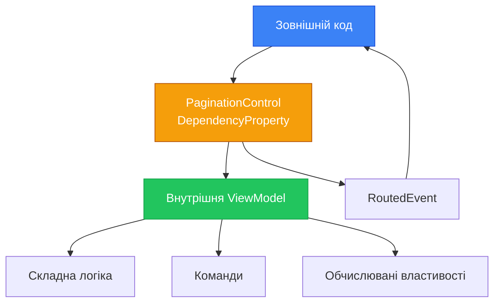

# UserControl: компонентний підхід у WPF

Уявіть, що ви створюєте застосунок з десятками екранів. На кожному екрані — панель пошуку: TextBox для введення запиту, кнопка "Шукати", іконка лупи, placeholder "Введіть текст для пошуку...". Ви копіюєте цю розмітку з екрану на екран. Потім дизайнер просить змінити колір кнопки. Тепер вам потрібно відредагувати 30 файлів XAML.

Це класична проблема дублювання коду. У C# ми розв'язуємо її через функції та класи. У WPF — через `UserControl`. UserControl — це перевикористовуваний UI-компонент, що інкапсулює розмітку, логіку та публічний API для зовнішнього використання.

UserControl — це не просто "шматок XAML". Це повноцінний компонент з власними властивостями (DependencyProperty), подіями (RoutedEvent), командами та навіть власною ViewModel для складних випадків. Це будівельний блок для створення бібліотек UI-компонентів, дизайн-систем та переносу коду між проєктами.

У цій статті ми детально розберемо всі аспекти створення UserControl: від базового синтаксису до складних патернів з ViewModel. Ви навчитесь створювати компоненти, що виглядають та поводяться як вбудовані WPF-контроли — з повною підтримкою Binding, Commands та MVVM.

::note
**Словник теми:** **UserControl** — перевикористовуваний UI-компонент, що складається з XAML-розмітки та code-behind. **DependencyProperty (DP)** — спеціальна властивість WPF з підтримкою Binding, Animation, Styling. **RoutedEvent** — подія WPF, що "спливає" або "тоне" по дереву елементів. **DataContext gotcha** — поширена помилка встановлення DataContext всередині UserControl. **RelativeSource Self** — спосіб прив'язки до властивостей самого UserControl. **Composition** — побудова складного UI з простих компонентів. **Component API** — публічний інтерфейс компонента (властивості, події, команди).
::

---

## Що таке UserControl і навіщо він потрібен

`UserControl` — це клас WPF, що наслідує `Control` і дозволяє створювати власні перевикористовувані компоненти. Технічно, UserControl — це контейнер, всередині якого ви розміщуєте інші контроли (TextBox, Button, StackPanel тощо) та визначаєте їхню взаємодію.

### Коли використовувати UserControl

**✅ Використовуйте UserControl коли:**

- Один і той самий UI повторюється на кількох екранах
- Потрібно інкапсулювати складну логіку взаємодії контролів
- Створюєте бібліотеку UI-компонентів для команди
- Хочете розбити великий екран на логічні частини
- Потрібен компонент з власним публічним API (властивості, події)

**❌ НЕ використовуйте UserControl коли:**

- UI використовується лише один раз — просто напишіть розмітку inline
- Потрібен контрол з повною підтримкою тем та стилів — створюйте CustomControl
- Потрібна лише зміна зовнішнього вигляду існуючого контролу — використовуйте ControlTemplate

### Приклад: панель пошуку

Замість копіювання цієї розмітки на кожен екран:

```xml
<!-- ❌ Дублювання коду на кожному екрані -->
<StackPanel Orientation="Horizontal" Margin="0,0,0,16">
    <TextBox x:Name="SearchTextBox" 
             Width="300" 
             Margin="0,0,8,0"
             VerticalContentAlignment="Center"/>
    <Button Content="🔍 Шукати" 
            Click="Search_Click"
            Padding="12,6"/>
</StackPanel>
```

Створюємо UserControl один раз і використовуємо скрізь:

```xml
<!-- ✅ Перевикористовуваний компонент -->
<local:SearchBox SearchText="{Binding SearchQuery}"
                 SearchCommand="{Binding SearchCommand}"
                 Margin="0,0,0,16"/>
```

Тепер зміна дизайну панелі пошуку вимагає редагування лише одного файлу — `SearchBox.xaml`.

### Структура UserControl

UserControl складається з двох файлів:

**1. XAML-файл (SearchBox.xaml)** — розмітка UI:

```xml
<UserControl x:Class="MyApp.Controls.SearchBox"
             xmlns="http://schemas.microsoft.com/winfx/2006/xaml/presentation"
             xmlns:x="http://schemas.microsoft.com/winfx/2006/xaml">
    <StackPanel Orientation="Horizontal">
        <TextBox Width="300" Margin="0,0,8,0"/>
        <Button Content="🔍 Шукати" Padding="12,6"/>
    </StackPanel>
</UserControl>
```

**2. Code-behind файл (SearchBox.xaml.cs)** — логіка та публічний API:

```csharp
namespace MyApp.Controls;

public partial class SearchBox : UserControl
{
    public SearchBox()
    {
        InitializeComponent();
    }
    
    // Тут будуть DependencyProperty, події, методи
}
```

::mermaid

::

---

## Створення базового UserControl

Розберемо покроковий процес створення UserControl на прикладі панелі пошуку.

### Крок 1: Створення файлів

**У Visual Studio:**

1. Правою кнопкою на папку проєкту → Add → New Item
2. Обрати "User Control (WPF)"
3. Ввести ім'я: `SearchBox.xaml`
4. Visual Studio автоматично створить два файли

**Вручну (для розуміння структури):**

Створіть папку `Controls` у проєкті та два файли:

**Controls/SearchBox.xaml:**

```xml
<UserControl x:Class="MyApp.Controls.SearchBox"
             xmlns="http://schemas.microsoft.com/winfx/2006/xaml/presentation"
             xmlns:x="http://schemas.microsoft.com/winfx/2006/xaml"
             xmlns:mc="http://schemas.openxmlformats.org/markup-compatibility/2006" 
             xmlns:d="http://schemas.microsoft.com/expression/blend/2008"
             mc:Ignorable="d" 
             d:DesignHeight="40" d:DesignWidth="400">
    
    <!-- Розмітка тут -->
    
</UserControl>
```

**Controls/SearchBox.xaml.cs:**

```csharp
using System.Windows.Controls;

namespace MyApp.Controls;

public partial class SearchBox : UserControl
{
    public SearchBox()
    {
        InitializeComponent();
    }
}
```

**Важливі деталі:**

- `x:Class` — повне ім'я класу з namespace
- `d:DesignHeight` та `d:DesignWidth` — розміри для дизайнера (не впливають на runtime)
- `InitializeComponent()` — метод, що завантажує XAML (генерується автоматично)

### Крок 2: Розмітка UI

Додаємо розмітку всередину UserControl:

```xml
<UserControl x:Class="MyApp.Controls.SearchBox"
             xmlns="http://schemas.microsoft.com/winfx/2006/xaml/presentation"
             xmlns:x="http://schemas.microsoft.com/winfx/2006/xaml"
             d:DesignHeight="40" d:DesignWidth="400">
    
    <Border Background="White" 
            BorderBrush="#e2e8f0" 
            BorderThickness="1" 
            CornerRadius="8"
            Padding="8">
        <Grid>
            <Grid.ColumnDefinitions>
                <ColumnDefinition Width="Auto"/>
                <ColumnDefinition Width="*"/>
                <ColumnDefinition Width="Auto"/>
            </Grid.ColumnDefinitions>
            
            <!-- Іконка пошуку -->
            <TextBlock Grid.Column="0" 
                       Text="🔍" 
                       FontSize="16"
                       VerticalAlignment="Center"
                       Margin="0,0,8,0"/>
            
            <!-- Поле введення -->
            <TextBox Grid.Column="1"
                     x:Name="SearchTextBox"
                     BorderThickness="0"
                     Background="Transparent"
                     VerticalContentAlignment="Center"
                     FontSize="14"/>
            
            <!-- Кнопка очищення -->
            <Button Grid.Column="2"
                    x:Name="ClearButton"
                    Content="✕"
                    Background="Transparent"
                    BorderThickness="0"
                    Padding="8,4"
                    Margin="8,0,0,0"
                    Cursor="Hand"
                    Click="ClearButton_Click"/>
        </Grid>
    </Border>
</UserControl>
```

**Code-behind для кнопки очищення:**

```csharp
public partial class SearchBox : UserControl
{
    public SearchBox()
    {
        InitializeComponent();
    }
    
    private void ClearButton_Click(object sender, RoutedEventArgs e)
    {
        SearchTextBox.Text = "";
        SearchTextBox.Focus();
    }
}
```

### Крок 3: Використання UserControl

Тепер використовуємо наш компонент у MainWindow:

```xml
<Window x:Class="MyApp.MainWindow"
        xmlns="http://schemas.microsoft.com/winfx/2006/xaml/presentation"
        xmlns:x="http://schemas.microsoft.com/winfx/2006/xaml"
        xmlns:controls="clr-namespace:MyApp.Controls"
        Title="My App" Width="600" Height="400">
    
    <StackPanel Margin="20">
        <TextBlock Text="Пошук файлів" 
                   FontSize="18" FontWeight="Bold"
                   Margin="0,0,0,12"/>
        
        <!-- Використання нашого UserControl -->
        <controls:SearchBox/>
        
        <ListBox Margin="0,16,0,0" Height="300"/>
    </StackPanel>
</Window>
```

**Ключові моменти:**

1. `xmlns:controls="clr-namespace:MyApp.Controls"` — реєстрація namespace для доступу до UserControl
2. `<controls:SearchBox/>` — використання як звичайного контролу
3. Можна встановлювати стандартні властивості: `Margin`, `Width`, `Height`, `HorizontalAlignment` тощо

::wpf-preview{title="Базовий UserControl: SearchBox"}

```xml
<Border Background="White" 
        BorderBrush="#e2e8f0" 
        BorderThickness="1" 
        CornerRadius="8"
        Padding="8"
        Width="400">
    <Grid>
        <Grid.ColumnDefinitions>
            <ColumnDefinition Width="Auto"/>
            <ColumnDefinition Width="*"/>
            <ColumnDefinition Width="Auto"/>
        </Grid.ColumnDefinitions>
        
        <TextBlock Grid.Column="0" 
                   Text="🔍" 
                   FontSize="16"
                   VerticalAlignment="Center"
                   Margin="0,0,8,0"/>
        
        <TextBox Grid.Column="1"
                 BorderThickness="0"
                 Background="Transparent"
                 VerticalContentAlignment="Center"
                 FontSize="14"
                 Text="Введіть текст для пошуку..."/>
        
        <Button Grid.Column="2"
                Content="✕"
                Background="Transparent"
                BorderThickness="0"
                Padding="8,4"
                Margin="8,0,0,0"
                Cursor="Hand"
                Command="{Binding ShowMessageCommand}"
                CommandParameter="Текст очищено"/>
    </Grid>
</Border>
```

::

---

## DependencyProperty: публічний API компонента

Базовий UserControl з попереднього розділу працює, але він ізольований — зовнішній код не може отримати текст пошуку або підписатись на зміни. Щоб зробити компонент справді перевикористовуваним, потрібен публічний API через `DependencyProperty`.

### Що таке DependencyProperty

`DependencyProperty` (скорочено DP) — це спеціальна властивість WPF з розширеними можливостями:

- ✅ Підтримка `{Binding}` — можна прив'язувати до ViewModel
- ✅ Підтримка `{StaticResource}` та `{DynamicResource}`
- ✅ Підтримка анімацій
- ✅ Підтримка стилів та тригерів
- ✅ Callback при зміні значення
- ✅ Валідація значень
- ✅ Успадкування значень по дереву елементів

Звичайна C# властивість (`public string Text { get; set; }`) не підтримує жодної з цих можливостей.

### Анатомія DependencyProperty

DependencyProperty складається з трьох частин:

**1. Статичне поле DependencyProperty:**

```csharp
public static readonly DependencyProperty SearchTextProperty =
    DependencyProperty.Register(
        name: "SearchText",                    // Ім'я властивості
        propertyType: typeof(string),          // Тип властивості
        ownerType: typeof(SearchBox),          // Клас-власник
        typeMetadata: new PropertyMetadata("")  // Метадані (значення за замовчуванням)
    );
```

**2. CLR-обгортка (wrapper):**

```csharp
public string SearchText
{
    get => (string)GetValue(SearchTextProperty);
    set => SetValue(SearchTextProperty, value);
}
```

**3. (Опціонально) Callback при зміні:**

```csharp
new PropertyMetadata("", OnSearchTextChanged)

private static void OnSearchTextChanged(DependencyObject d, DependencyPropertyChangedEventArgs e)
{
    var control = (SearchBox)d;
    string newValue = (string)e.NewValue;
    // Логіка при зміні
}
```

### Створення DependencyProperty для SearchText

Додаємо DependencyProperty до нашого SearchBox:

```csharp
public partial class SearchBox : UserControl
{
    // 1. Статичне поле DependencyProperty
    public static readonly DependencyProperty SearchTextProperty =
        DependencyProperty.Register(
            nameof(SearchText),
            typeof(string),
            typeof(SearchBox),
            new PropertyMetadata("", OnSearchTextChanged)
        );
    
    // 2. CLR-обгортка
    public string SearchText
    {
        get => (string)GetValue(SearchTextProperty);
        set => SetValue(SearchTextProperty, value);
    }
    
    // 3. Callback при зміні
    private static void OnSearchTextChanged(DependencyObject d, DependencyPropertyChangedEventArgs e)
    {
        var control = (SearchBox)d;
        string newValue = (string)e.NewValue;
        
        // Синхронізувати з внутрішнім TextBox
        if (control.SearchTextBox.Text != newValue)
        {
            control.SearchTextBox.Text = newValue;
        }
    }
    
    public SearchBox()
    {
        InitializeComponent();
        
        // Синхронізація у зворотний бік: TextBox → DependencyProperty
        SearchTextBox.TextChanged += (s, e) =>
        {
            SearchText = SearchTextBox.Text;
        };
    }
    
    private void ClearButton_Click(object sender, RoutedEventArgs e)
    {
        SearchText = "";  // Тепер змінюємо DependencyProperty, а не TextBox напряму
        SearchTextBox.Focus();
    }
}
```

### Використання DependencyProperty

Тепер можна прив'язувати `SearchText` до ViewModel:

```xml
<!-- У MainWindow -->
<controls:SearchBox SearchText="{Binding SearchQuery, UpdateSourceTrigger=PropertyChanged}"/>
```

```csharp
// У MainViewModel
public partial class MainViewModel : ObservableObject
{
    [ObservableProperty]
    private string _searchQuery = "";
    
    partial void OnSearchQueryChanged(string value)
    {
        // Автоматично викликається при зміні SearchQuery
        Console.WriteLine($"Пошуковий запит: {value}");
        FilterItems(value);
    }
}
```

**Що відбувається:**

1. Користувач вводить текст у TextBox всередині SearchBox
2. `TextChanged` event оновлює `SearchText` DependencyProperty
3. Binding передає значення у `SearchQuery` ViewModel
4. `OnSearchQueryChanged` викликається автоматично
5. Фільтрація списку відбувається у реальному часі

::mermaid

::

### Множинні DependencyProperty

Додаємо ще кілька властивостей для повного API:

```csharp
public partial class SearchBox : UserControl
{
    // SearchText
    public static readonly DependencyProperty SearchTextProperty =
        DependencyProperty.Register(nameof(SearchText), typeof(string), typeof(SearchBox),
            new PropertyMetadata("", OnSearchTextChanged));
    
    public string SearchText
    {
        get => (string)GetValue(SearchTextProperty);
        set => SetValue(SearchTextProperty, value);
    }
    
    // Placeholder
    public static readonly DependencyProperty PlaceholderProperty =
        DependencyProperty.Register(nameof(Placeholder), typeof(string), typeof(SearchBox),
            new PropertyMetadata("Введіть текст для пошуку..."));
    
    public string Placeholder
    {
        get => (string)GetValue(PlaceholderProperty);
        set => SetValue(PlaceholderProperty, value);
    }
    
    // IsSearching (для індикатора завантаження)
    public static readonly DependencyProperty IsSearchingProperty =
        DependencyProperty.Register(nameof(IsSearching), typeof(bool), typeof(SearchBox),
            new PropertyMetadata(false));
    
    public bool IsSearching
    {
        get => (bool)GetValue(IsSearchingProperty);
        set => SetValue(IsSearchingProperty, value);
    }
    
    // ShowClearButton
    public static readonly DependencyProperty ShowClearButtonProperty =
        DependencyProperty.Register(nameof(ShowClearButton), typeof(bool), typeof(SearchBox),
            new PropertyMetadata(true));
    
    public bool ShowClearButton
    {
        get => (bool)GetValue(ShowClearButtonProperty);
        set => SetValue(ShowClearButtonProperty, value);
    }
}
```

**Оновлена розмітка з прив'язкою до DP:**

```xml
<UserControl x:Class="MyApp.Controls.SearchBox"
             x:Name="Root">
    <Border Background="White" BorderBrush="#e2e8f0" BorderThickness="1" CornerRadius="8" Padding="8">
        <Grid>
            <Grid.ColumnDefinitions>
                <ColumnDefinition Width="Auto"/>
                <ColumnDefinition Width="*"/>
                <ColumnDefinition Width="Auto"/>
                <ColumnDefinition Width="Auto"/>
            </Grid.ColumnDefinitions>
            
            <!-- Іконка пошуку -->
            <TextBlock Grid.Column="0" Text="🔍" FontSize="16" VerticalAlignment="Center" Margin="0,0,8,0"/>
            
            <!-- Поле введення з Placeholder -->
            <Grid Grid.Column="1">
                <TextBox x:Name="SearchTextBox"
                         BorderThickness="0"
                         Background="Transparent"
                         VerticalContentAlignment="Center"
                         FontSize="14"/>
                
                <!-- Placeholder (показується коли текст порожній) -->
                <TextBlock Text="{Binding Placeholder, ElementName=Root}"
                           Foreground="#94a3b8"
                           FontSize="14"
                           VerticalAlignment="Center"
                           IsHitTestVisible="False">
                    <TextBlock.Visibility>
                        <MultiBinding Converter="{StaticResource TextEmptyToVisibilityConverter}">
                            <Binding Path="SearchText" ElementName="Root"/>
                        </MultiBinding>
                    </TextBlock.Visibility>
                </TextBlock>
            </Grid>
            
            <!-- Індикатор завантаження -->
            <TextBlock Grid.Column="2"
                       Text="⏳"
                       FontSize="16"
                       VerticalAlignment="Center"
                       Margin="8,0"
                       Visibility="{Binding IsSearching, ElementName=Root, Converter={StaticResource BoolToVisibilityConverter}}"/>
            
            <!-- Кнопка очищення -->
            <Button Grid.Column="3"
                    x:Name="ClearButton"
                    Content="✕"
                    Background="Transparent"
                    BorderThickness="0"
                    Padding="8,4"
                    Cursor="Hand"
                    Click="ClearButton_Click"
                    Visibility="{Binding ShowClearButton, ElementName=Root, Converter={StaticResource BoolToVisibilityConverter}}"/>
        </Grid>
    </Border>
</UserControl>
```

**Ключовий момент:** `x:Name="Root"` на UserControl дозволяє прив'язуватись до його DependencyProperty через `ElementName=Root`.

### Використання розширеного API

```xml
<controls:SearchBox SearchText="{Binding SearchQuery, UpdateSourceTrigger=PropertyChanged}"
                    Placeholder="Шукати файли..."
                    IsSearching="{Binding IsSearching}"
                    ShowClearButton="True"
                    Margin="0,0,0,16"/>
```

```csharp
public partial class MainViewModel : ObservableObject
{
    [ObservableProperty]
    private string _searchQuery = "";
    
    [ObservableProperty]
    private bool _isSearching;
    
    partial void OnSearchQueryChanged(string value)
    {
        SearchAsync(value);
    }
    
    private async void SearchAsync(string query)
    {
        if (string.IsNullOrWhiteSpace(query))
        {
            Items.Clear();
            return;
        }
        
        IsSearching = true;
        
        try
        {
            await Task.Delay(500);  // Debounce
            var results = await _searchService.SearchAsync(query);
            Items = new ObservableCollection<Item>(results);
        }
        finally
        {
            IsSearching = false;
        }
    }
}
```


---

## RoutedEvent: кастомні події для UserControl

DependencyProperty дозволяє зовнішньому коду передавати дані **всередину** компонента. Але як компонент може повідомити зовнішній код про події? Наприклад, "користувач натиснув Enter у полі пошуку" або "користувач натиснув кнопку Шукати".

Для цього використовуються `RoutedEvent` — події WPF, що "спливають" (bubbling) або "тонуть" (tunneling) по дереву елементів.

### Створення RoutedEvent

Структура схожа на DependencyProperty:

**1. Статичне поле RoutedEvent:**

```csharp
public static readonly RoutedEvent SearchRequestedEvent =
    EventManager.RegisterRoutedEvent(
        name: "SearchRequested",
        routingStrategy: RoutingStrategy.Bubble,
        handlerType: typeof(RoutedEventHandler),
        ownerType: typeof(SearchBox)
    );
```

**2. CLR-обгортка (wrapper):**

```csharp
public event RoutedEventHandler SearchRequested
{
    add => AddHandler(SearchRequestedEvent, value);
    remove => RemoveHandler(SearchRequestedEvent, value);
}
```

**3. Метод для виклику події:**

```csharp
private void RaiseSearchRequestedEvent()
{
    RoutedEventArgs args = new RoutedEventArgs(SearchRequestedEvent);
    RaiseEvent(args);
}
```

### Повний приклад: SearchRequested event

```csharp
public partial class SearchBox : UserControl
{
    // RoutedEvent для події пошуку
    public static readonly RoutedEvent SearchRequestedEvent =
        EventManager.RegisterRoutedEvent(
            nameof(SearchRequested),
            RoutingStrategy.Bubble,
            typeof(RoutedEventHandler),
            typeof(SearchBox)
        );
    
    public event RoutedEventHandler SearchRequested
    {
        add => AddHandler(SearchRequestedEvent, value);
        remove => RemoveHandler(SearchRequestedEvent, value);
    }
    
    private void RaiseSearchRequestedEvent()
    {
        RoutedEventArgs args = new RoutedEventArgs(SearchRequestedEvent);
        RaiseEvent(args);
    }
    
    public SearchBox()
    {
        InitializeComponent();
        
        // Викликати подію при натисканні Enter
        SearchTextBox.KeyDown += (s, e) =>
        {
            if (e.Key == Key.Enter)
            {
                RaiseSearchRequestedEvent();
            }
        };
    }
    
    private void SearchButton_Click(object sender, RoutedEventArgs e)
    {
        RaiseSearchRequestedEvent();
    }
}
```

### Використання RoutedEvent

**Варіант 1: Підписка у XAML:**

```xml
<controls:SearchBox SearchText="{Binding SearchQuery}"
                    SearchRequested="SearchBox_SearchRequested"/>
```

```csharp
// Code-behind MainWindow
private void SearchBox_SearchRequested(object sender, RoutedEventArgs e)
{
    var searchBox = (SearchBox)sender;
    string query = searchBox.SearchText;
    PerformSearch(query);
}
```

**Варіант 2: Підписка у коді:**

```csharp
public MainWindow()
{
    InitializeComponent();
    
    MySearchBox.SearchRequested += (s, e) =>
    {
        PerformSearch(MySearchBox.SearchText);
    };
}
```

### RoutedEvent з кастомними аргументами

Часто потрібно передати додаткові дані разом з подією. Для цього створюємо власний клас аргументів:

```csharp
// Кастомні аргументи події
public class SearchRequestedEventArgs : RoutedEventArgs
{
    public string SearchText { get; }
    public SearchOptions Options { get; }
    
    public SearchRequestedEventArgs(RoutedEvent routedEvent, string searchText, SearchOptions options)
        : base(routedEvent)
    {
        SearchText = searchText;
        Options = options;
    }
}

// Делегат для події
public delegate void SearchRequestedEventHandler(object sender, SearchRequestedEventArgs e);

public partial class SearchBox : UserControl
{
    // RoutedEvent з кастомним делегатом
    public static readonly RoutedEvent SearchRequestedEvent =
        EventManager.RegisterRoutedEvent(
            nameof(SearchRequested),
            RoutingStrategy.Bubble,
            typeof(SearchRequestedEventHandler),
            typeof(SearchBox)
        );
    
    public event SearchRequestedEventHandler SearchRequested
    {
        add => AddHandler(SearchRequestedEvent, value);
        remove => RemoveHandler(SearchRequestedEvent, value);
    }
    
    private void RaiseSearchRequestedEvent()
    {
        var options = new SearchOptions
        {
            CaseSensitive = CaseSensitiveCheckBox.IsChecked == true,
            WholeWord = WholeWordCheckBox.IsChecked == true
        };
        
        var args = new SearchRequestedEventArgs(SearchRequestedEvent, SearchText, options);
        RaiseEvent(args);
    }
}
```

**Використання:**

```csharp
MySearchBox.SearchRequested += (s, e) =>
{
    Console.WriteLine($"Пошук: {e.SearchText}");
    Console.WriteLine($"Case Sensitive: {e.Options.CaseSensitive}");
    Console.WriteLine($"Whole Word: {e.Options.WholeWord}");
    
    PerformSearch(e.SearchText, e.Options);
};
```

### RoutingStrategy: Bubble vs Tunnel vs Direct

WPF підтримує три стратегії маршрутизації подій:

| Стратегія | Напрямок | Використання |
|-----------|----------|--------------|
| `Bubble` | Знизу вгору (від дочірнього до батьківського) | Більшість подій (Click, MouseDown) |
| `Tunnel` | Зверху вниз (від батьківського до дочірнього) | Preview-події (PreviewMouseDown) |
| `Direct` | Лише на елементі-джерелі | Рідко використовується |

**Приклад Bubble:**

```
Button (Click) → StackPanel → Grid → Window
```

**Приклад Tunnel:**

```
Window (PreviewMouseDown) → Grid → StackPanel → Button
```

Для UserControl зазвичай використовується `RoutingStrategy.Bubble` — подія спливає від компонента до батьківських елементів.

---

## DataContext gotcha: найпоширеніша помилка

Це найважливіший розділ статті. Більшість початківців роблять одну критичну помилку при створенні UserControl — встановлюють `DataContext` всередині компонента. Це ламає Binding і робить компонент непридатним для використання.

### ❌ Помилка: встановлення DataContext у UserControl

```xml
<!-- ❌ НЕПРАВИЛЬНО -->
<UserControl x:Class="MyApp.Controls.SearchBox"
             DataContext="{Binding RelativeSource={RelativeSource Self}}">
    <!-- Розмітка -->
</UserControl>
```

Або у code-behind:

```csharp
// ❌ НЕПРАВИЛЬНО
public SearchBox()
{
    InitializeComponent();
    DataContext = this;  // Це зламає зовнішній Binding!
}
```

### Чому це проблема?

Коли ви встановлюєте `DataContext` всередині UserControl, зовнішній Binding перестає працювати:

```xml
<!-- У MainWindow -->
<controls:SearchBox DataContext="{Binding SearchViewModel}"/>
<!-- SearchViewModel НЕ буде доступний всередині SearchBox! -->
```

**Що відбувається:**

1. MainWindow встановлює `DataContext` SearchBox = `SearchViewModel`
2. UserControl у своєму конструкторі перезаписує `DataContext = this`
3. Всередині SearchBox тепер `DataContext = SearchBox`, а не `SearchViewModel`
4. Всі Binding всередині SearchBox шукають властивості у `SearchBox`, а не у `SearchViewModel`

::mermaid

::

### ✅ Правильний підхід: RelativeSource Self або ElementName

Замість встановлення `DataContext`, використовуйте `RelativeSource Self` або `ElementName` для прив'язки до DependencyProperty UserControl.

**Варіант 1: ElementName (рекомендовано):**

```xml
<UserControl x:Class="MyApp.Controls.SearchBox"
             x:Name="Root">
    <Border>
        <TextBox Text="{Binding SearchText, ElementName=Root}"/>
        <!-- ElementName=Root вказує на сам UserControl -->
    </Border>
</UserControl>
```

**Варіант 2: RelativeSource Self:**

```xml
<UserControl x:Class="MyApp.Controls.SearchBox">
    <Border>
        <TextBox Text="{Binding SearchText, RelativeSource={RelativeSource AncestorType=UserControl}}"/>
        <!-- Шукає найближчий батьківський UserControl -->
    </Border>
</UserControl>
```

**Варіант 3: RelativeSource FindAncestor (для вкладених елементів):**

```xml
<UserControl x:Class="MyApp.Controls.SearchBox">
    <Border>
        <StackPanel>
            <TextBox Text="{Binding SearchText, RelativeSource={RelativeSource AncestorType={x:Type local:SearchBox}}}"/>
            <!-- Явно вказуємо тип предка -->
        </StackPanel>
    </Border>
</UserControl>
```

### Порівняння підходів

| Підхід | Переваги | Недоліки |
|--------|----------|----------|
| `ElementName=Root` | Простий, читабельний | Потрібно `x:Name="Root"` |
| `RelativeSource AncestorType=UserControl` | Не потрібен x:Name | Довший синтаксис |
| `RelativeSource AncestorType={x:Type local:SearchBox}` | Явна типізація | Найдовший синтаксис |

**Рекомендація:** Використовуйте `ElementName=Root` — це найпростіший та найчитабельніший варіант.

### Правильна структура UserControl

```xml
<UserControl x:Class="MyApp.Controls.SearchBox"
             xmlns="http://schemas.microsoft.com/winfx/2006/xaml/presentation"
             xmlns:x="http://schemas.microsoft.com/winfx/2006/xaml"
             x:Name="Root">
    <!-- НЕ встановлюємо DataContext! -->
    
    <Border Background="White" BorderBrush="#e2e8f0" BorderThickness="1" CornerRadius="8" Padding="8">
        <Grid>
            <Grid.ColumnDefinitions>
                <ColumnDefinition Width="Auto"/>
                <ColumnDefinition Width="*"/>
                <ColumnDefinition Width="Auto"/>
            </Grid.ColumnDefinitions>
            
            <TextBlock Grid.Column="0" Text="🔍" FontSize="16" VerticalAlignment="Center" Margin="0,0,8,0"/>
            
            <!-- Прив'язка до DependencyProperty через ElementName -->
            <TextBox Grid.Column="1"
                     x:Name="SearchTextBox"
                     Text="{Binding SearchText, ElementName=Root, UpdateSourceTrigger=PropertyChanged}"
                     BorderThickness="0"
                     Background="Transparent"
                     VerticalContentAlignment="Center"
                     FontSize="14"/>
            
            <Button Grid.Column="2"
                    Content="✕"
                    Background="Transparent"
                    BorderThickness="0"
                    Padding="8,4"
                    Cursor="Hand"
                    Click="ClearButton_Click"
                    Visibility="{Binding ShowClearButton, ElementName=Root, Converter={StaticResource BoolToVisibilityConverter}}"/>
        </Grid>
    </Border>
</UserControl>
```

**Code-behind:**

```csharp
public partial class SearchBox : UserControl
{
    // DependencyProperty
    public static readonly DependencyProperty SearchTextProperty =
        DependencyProperty.Register(nameof(SearchText), typeof(string), typeof(SearchBox),
            new PropertyMetadata(""));
    
    public string SearchText
    {
        get => (string)GetValue(SearchTextProperty);
        set => SetValue(SearchTextProperty, value);
    }
    
    public SearchBox()
    {
        InitializeComponent();
        // НЕ встановлюємо DataContext!
    }
    
    private void ClearButton_Click(object sender, RoutedEventArgs e)
    {
        SearchText = "";
    }
}
```

**Використання:**

```xml
<!-- У MainWindow — DataContext працює правильно -->
<Window DataContext="{Binding MainViewModel}">
    <StackPanel>
        <!-- SearchBox отримує DataContext від Window -->
        <controls:SearchBox SearchText="{Binding SearchQuery}"/>
        
        <!-- Інші контроли також бачать MainViewModel -->
        <ListBox ItemsSource="{Binding Items}"/>
    </StackPanel>
</Window>
```

### 🔵 Recap: DataContext у UserControl

::note{title="🔵 Нагадування про DataContext"}

**Золоте правило UserControl:**

❌ **НІКОЛИ** не встановлюйте `DataContext` всередині UserControl  
✅ **ЗАВЖДИ** використовуйте `ElementName` або `RelativeSource` для прив'язки до DependencyProperty

**Чому це важливо:**

- UserControl — це перевикористовуваний компонент
- Зовнішній код повинен мати можливість встановити свій DataContext
- Встановлення DataContext всередині ламає цю можливість
- Це найпоширеніша помилка початківців у WPF

**Правильний патерн:**

```xml
<UserControl x:Name="Root">
    <TextBox Text="{Binding MyProperty, ElementName=Root}"/>
</UserControl>
```

**Неправильний патерн:**

```xml
<UserControl DataContext="{Binding RelativeSource={RelativeSource Self}}">
    <TextBox Text="{Binding MyProperty}"/>
</UserControl>
```

::

---

## Патерн: UserControl з власною ViewModel

Для складних UserControl з багатьма властивостями та логікою зручно створити окрему ViewModel. Але як це зробити правильно, не порушуючи DataContext?

### Проблема: складний UserControl

Уявімо складний компонент `PaginationControl` з логікою:

- Поточна сторінка (CurrentPage)
- Загальна кількість сторінок (TotalPages)
- Кількість кнопок сторінок для відображення
- Логіка обчислення видимих сторінок (1, 2, 3, ..., 10)
- Команди: FirstPage, PreviousPage, NextPage, LastPage, GoToPage

Вся ця логіка у code-behind буде громіздкою. Краще винести її у ViewModel.

### Рішення: внутрішня ViewModel

Створюємо ViewModel для внутрішньої логіки компонента:

```csharp
// ViewModels/PaginationViewModel.cs
public partial class PaginationViewModel : ObservableObject
{
    [ObservableProperty]
    private int _currentPage = 1;
    
    [ObservableProperty]
    private int _totalPages = 1;
    
    [ObservableProperty]
    private int _pageSize = 10;
    
    // Обчислювана властивість: видимі сторінки
    public ObservableCollection<int> VisiblePages { get; } = new();
    
    partial void OnCurrentPageChanged(int value)
    {
        UpdateVisiblePages();
    }
    
    partial void OnTotalPagesChanged(int value)
    {
        UpdateVisiblePages();
    }
    
    private void UpdateVisiblePages()
    {
        VisiblePages.Clear();
        
        // Логіка: показувати 5 сторінок навколо поточної
        int start = Math.Max(1, CurrentPage - 2);
        int end = Math.Min(TotalPages, CurrentPage + 2);
        
        for (int i = start; i <= end; i++)
        {
            VisiblePages.Add(i);
        }
    }
    
    [RelayCommand(CanExecute = nameof(CanGoToPreviousPage))]
    private void GoToPreviousPage()
    {
        if (CurrentPage > 1)
            CurrentPage--;
    }
    
    private bool CanGoToPreviousPage() => CurrentPage > 1;
    
    [RelayCommand(CanExecute = nameof(CanGoToNextPage))]
    private void GoToNextPage()
    {
        if (CurrentPage < TotalPages)
            CurrentPage++;
    }
    
    private bool CanGoToNextPage() => CurrentPage < TotalPages;
    
    [RelayCommand]
    private void GoToFirstPage()
    {
        CurrentPage = 1;
    }
    
    [RelayCommand]
    private void GoToLastPage()
    {
        CurrentPage = TotalPages;
    }
    
    [RelayCommand]
    private void GoToPage(int page)
    {
        if (page >= 1 && page <= TotalPages)
            CurrentPage = page;
    }
}
```

### UserControl з внутрішньою ViewModel

```csharp
// Controls/PaginationControl.xaml.cs
public partial class PaginationControl : UserControl
{
    private readonly PaginationViewModel _viewModel;
    
    // DependencyProperty для зовнішнього API
    public static readonly DependencyProperty CurrentPageProperty =
        DependencyProperty.Register(nameof(CurrentPage), typeof(int), typeof(PaginationControl),
            new FrameworkPropertyMetadata(1, FrameworkPropertyMetadataOptions.BindsTwoWayByDefault, OnCurrentPageChanged));
    
    public int CurrentPage
    {
        get => (int)GetValue(CurrentPageProperty);
        set => SetValue(CurrentPageProperty, value);
    }
    
    private static void OnCurrentPageChanged(DependencyObject d, DependencyPropertyChangedEventArgs e)
    {
        var control = (PaginationControl)d;
        control._viewModel.CurrentPage = (int)e.NewValue;
    }
    
    public static readonly DependencyProperty TotalPagesProperty =
        DependencyProperty.Register(nameof(TotalPages), typeof(int), typeof(PaginationControl),
            new PropertyMetadata(1, OnTotalPagesChanged));
    
    public int TotalPages
    {
        get => (int)GetValue(TotalPagesProperty);
        set => SetValue(TotalPagesProperty, value);
    }
    
    private static void OnTotalPagesChanged(DependencyObject d, DependencyPropertyChangedEventArgs e)
    {
        var control = (PaginationControl)d;
        control._viewModel.TotalPages = (int)e.NewValue;
    }
    
    // RoutedEvent для повідомлення про зміну сторінки
    public static readonly RoutedEvent PageChangedEvent =
        EventManager.RegisterRoutedEvent(nameof(PageChanged), RoutingStrategy.Bubble,
            typeof(RoutedPropertyChangedEventHandler<int>), typeof(PaginationControl));
    
    public event RoutedPropertyChangedEventHandler<int> PageChanged
    {
        add => AddHandler(PageChangedEvent, value);
        remove => RemoveHandler(PageChangedEvent, value);
    }
    
    public PaginationControl()
    {
        InitializeComponent();
        
        // Створюємо внутрішню ViewModel
        _viewModel = new PaginationViewModel();
        
        // Встановлюємо DataContext для КОРЕНЕВОГО елемента, а не UserControl
        RootGrid.DataContext = _viewModel;
        
        // Підписуємось на зміни у ViewModel
        _viewModel.PropertyChanged += (s, e) =>
        {
            if (e.PropertyName == nameof(_viewModel.CurrentPage))
            {
                // Синхронізуємо назад до DependencyProperty
                if (CurrentPage != _viewModel.CurrentPage)
                {
                    CurrentPage = _viewModel.CurrentPage;
                    
                    // Викликаємо RoutedEvent
                    var args = new RoutedPropertyChangedEventArgs<int>(
                        CurrentPage, _viewModel.CurrentPage, PageChangedEvent);
                    RaiseEvent(args);
                }
            }
        };
    }
}
```

**Ключовий момент:** `RootGrid.DataContext = _viewModel` — встановлюємо DataContext для кореневого Grid, а не для UserControl. Це дозволяє зовнішньому коду встановлювати свій DataContext для UserControl.

### XAML з внутрішньою ViewModel

```xml
<UserControl x:Class="MyApp.Controls.PaginationControl"
             xmlns="http://schemas.microsoft.com/winfx/2006/xaml/presentation"
             xmlns:x="http://schemas.microsoft.com/winfx/2006/xaml"
             x:Name="Root">
    
    <!-- DataContext встановлюється для RootGrid, а не для UserControl -->
    <Grid x:Name="RootGrid">
        <StackPanel Orientation="Horizontal" HorizontalAlignment="Center" Spacing="4">
            
            <!-- Перша сторінка -->
            <Button Content="⏮️" 
                    Command="{Binding GoToFirstPageCommand}"
                    Padding="8,4"
                    ToolTip="Перша сторінка"/>
            
            <!-- Попередня сторінка -->
            <Button Content="◀️" 
                    Command="{Binding GoToPreviousPageCommand}"
                    Padding="8,4"
                    ToolTip="Попередня сторінка"/>
            
            <!-- Кнопки сторінок -->
            <ItemsControl ItemsSource="{Binding VisiblePages}">
                <ItemsControl.ItemsPanel>
                    <ItemsPanelTemplate>
                        <StackPanel Orientation="Horizontal" Spacing="4"/>
                    </ItemsPanelTemplate>
                </ItemsControl.ItemsPanel>
                <ItemsControl.ItemTemplate>
                    <DataTemplate>
                        <Button Content="{Binding}"
                                Command="{Binding DataContext.GoToPageCommand, RelativeSource={RelativeSource AncestorType=UserControl}}"
                                CommandParameter="{Binding}"
                                Padding="8,4"
                                MinWidth="32">
                            <Button.Style>
                                <Style TargetType="Button">
                                    <Style.Triggers>
                                        <DataTrigger Binding="{Binding}" Value="{Binding DataContext.CurrentPage, RelativeSource={RelativeSource AncestorType=UserControl}}">
                                            <Setter Property="Background" Value="#3b82f6"/>
                                            <Setter Property="Foreground" Value="White"/>
                                            <Setter Property="FontWeight" Value="Bold"/>
                                        </DataTrigger>
                                    </Style.Triggers>
                                </Style>
                            </Button.Style>
                        </Button>
                    </DataTemplate>
                </ItemsControl.ItemTemplate>
            </ItemsControl>
            
            <!-- Наступна сторінка -->
            <Button Content="▶️" 
                    Command="{Binding GoToNextPageCommand}"
                    Padding="8,4"
                    ToolTip="Наступна сторінка"/>
            
            <!-- Остання сторінка -->
            <Button Content="⏭️" 
                    Command="{Binding GoToLastPageCommand}"
                    Padding="8,4"
                    ToolTip="Остання сторінка"/>
            
            <!-- Інформація про сторінки -->
            <TextBlock Text="{Binding CurrentPage, StringFormat='Сторінка {0}'}"
                       VerticalAlignment="Center"
                       Margin="12,0,0,0"/>
            <TextBlock Text="{Binding TotalPages, StringFormat='з {0}'}"
                       VerticalAlignment="Center"
                       Margin="4,0,0,0"/>
        </StackPanel>
    </Grid>
</UserControl>
```

### Використання PaginationControl

```xml
<controls:PaginationControl CurrentPage="{Binding CurrentPage, Mode=TwoWay}"
                            TotalPages="{Binding TotalPages}"
                            PageChanged="PaginationControl_PageChanged"/>
```

```csharp
public partial class MainViewModel : ObservableObject
{
    [ObservableProperty]
    private int _currentPage = 1;
    
    [ObservableProperty]
    private int _totalPages = 10;
    
    [ObservableProperty]
    private ObservableCollection<Item> _items = new();
    
    partial void OnCurrentPageChanged(int value)
    {
        LoadPage(value);
    }
    
    private async void LoadPage(int page)
    {
        var items = await _dataService.GetPageAsync(page, pageSize: 20);
        Items = new ObservableCollection<Item>(items);
    }
}
```

### Переваги патерну з внутрішньою ViewModel

- ✅ Вся складна логіка інкапсульована у ViewModel
- ✅ UserControl залишається тестованим (можна тестувати ViewModel окремо)
- ✅ Зовнішній DataContext не порушується
- ✅ Чистий розділ відповідальностей
- ✅ Легко додавати нову функціональність

::mermaid

::


---

## Практичні завдання

### Рівень 1: SearchBox UserControl

**Мета:** Навчитися створювати базовий UserControl з DependencyProperty.

**Завдання:**

Створіть перевикористовуваний компонент SearchBox:

1. **UI:**
   - TextBox для введення тексту
   - Button "Шукати" (або іконка 🔍)
   - Button "Очистити" (або іконка ✕)

2. **DependencyProperty:**
   - `SearchText` (string) — текст пошуку
   - `Placeholder` (string) — placeholder для TextBox

3. **Функціональність:**
   - Кнопка "Очистити" очищає текст
   - TextBox синхронізується з SearchText через Binding
   - Placeholder показується коли текст порожній

4. **Використання:**
   - Створити MainWindow зі списком файлів
   - Додати SearchBox з прив'язкою до ViewModel
   - Фільтрувати список при зміні SearchText

**Критерії успіху:**

- UserControl створено правильно (XAML + code-behind)
- DependencyProperty SearchText працює з Binding
- Placeholder відображається коли текст порожній
- Кнопка "Очистити" працює
- DataContext не встановлюється всередині UserControl

**Підказка:**

```csharp
public partial class SearchBox : UserControl
{
    public static readonly DependencyProperty SearchTextProperty =
        DependencyProperty.Register(
            nameof(SearchText),
            typeof(string),
            typeof(SearchBox),
            new FrameworkPropertyMetadata("", FrameworkPropertyMetadataOptions.BindsTwoWayByDefault)
        );
    
    public string SearchText
    {
        get => (string)GetValue(SearchTextProperty);
        set => SetValue(SearchTextProperty, value);
    }
    
    public static readonly DependencyProperty PlaceholderProperty =
        DependencyProperty.Register(
            nameof(Placeholder),
            typeof(string),
            typeof(SearchBox),
            new PropertyMetadata("Введіть текст для пошуку...")
        );
    
    public string Placeholder
    {
        get => (string)GetValue(PlaceholderProperty);
        set => SetValue(PlaceholderProperty, value);
    }
    
    public SearchBox()
    {
        InitializeComponent();
    }
    
    private void ClearButton_Click(object sender, RoutedEventArgs e)
    {
        SearchText = "";
    }
}
```

**XAML підказка:**

```xml
<UserControl x:Name="Root">
    <Border BorderBrush="#e2e8f0" BorderThickness="1" CornerRadius="8" Padding="8">
        <Grid>
            <Grid.ColumnDefinitions>
                <ColumnDefinition Width="*"/>
                <ColumnDefinition Width="Auto"/>
            </Grid.ColumnDefinitions>
            
            <TextBox Grid.Column="0"
                     Text="{Binding SearchText, ElementName=Root, UpdateSourceTrigger=PropertyChanged}"
                     BorderThickness="0"/>
            
            <Button Grid.Column="1"
                    Content="✕"
                    Click="ClearButton_Click"/>
        </Grid>
    </Border>
</UserControl>
```

---

### Рівень 2: HeaderControl з Title, Subtitle, Icon

**Мета:** Навчитися створювати складніший UserControl з кількома DependencyProperty.

**Завдання:**

Створіть компонент HeaderControl для заголовків екранів:

1. **UI:**
   - Іконка зліва (опціонально)
   - Заголовок (великий текст)
   - Підзаголовок (малий текст, опціонально)
   - Кнопка дії справа (опціонально)

2. **DependencyProperty:**
   - `Icon` (string) — emoji або символ іконки
   - `Title` (string) — основний заголовок
   - `Subtitle` (string) — підзаголовок
   - `ShowActionButton` (bool) — показувати кнопку дії
   - `ActionButtonText` (string) — текст кнопки дії

3. **RoutedEvent:**
   - `ActionButtonClicked` — подія при натисканні кнопки дії

4. **Функціональність:**
   - Іконка показується лише якщо Icon не порожній
   - Підзаголовок показується лише якщо Subtitle не порожній
   - Кнопка дії показується лише якщо ShowActionButton = true
   - При натисканні кнопки викликається RoutedEvent

**Критерії успіху:**

- Всі DependencyProperty працюють з Binding
- RoutedEvent викликається при натисканні кнопки
- Опціональні елементи показуються/ховаються правильно
- Компонент виглядає професійно
- DataContext не порушується

**Підказка для RoutedEvent:**

```csharp
public static readonly RoutedEvent ActionButtonClickedEvent =
    EventManager.RegisterRoutedEvent(
        nameof(ActionButtonClicked),
        RoutingStrategy.Bubble,
        typeof(RoutedEventHandler),
        typeof(HeaderControl)
    );

public event RoutedEventHandler ActionButtonClicked
{
    add => AddHandler(ActionButtonClickedEvent, value);
    remove => RemoveHandler(ActionButtonClickedEvent, value);
}

private void ActionButton_Click(object sender, RoutedEventArgs e)
{
    RaiseEvent(new RoutedEventArgs(ActionButtonClickedEvent));
}
```

**Використання:**

```xml
<controls:HeaderControl Icon="📁"
                        Title="Мої файли"
                        Subtitle="125 файлів, 2.4 GB"
                        ShowActionButton="True"
                        ActionButtonText="Додати файл"
                        ActionButtonClicked="HeaderControl_ActionButtonClicked"/>
```

---

### Рівень 3: PaginationControl з внутрішньою ViewModel

**Мета:** Навчитися створювати складний UserControl з власною ViewModel.

**Завдання:**

Створіть повноцінний компонент пагінації:

1. **Внутрішня ViewModel:**
   - `CurrentPage` (int) — поточна сторінка
   - `TotalPages` (int) — загальна кількість сторінок
   - `VisiblePages` (ObservableCollection<int>) — видимі номери сторінок
   - Команди: FirstPage, PreviousPage, NextPage, LastPage, GoToPage

2. **DependencyProperty (публічний API):**
   - `CurrentPage` (int, TwoWay) — синхронізується з ViewModel
   - `TotalPages` (int) — синхронізується з ViewModel
   - `PageSize` (int) — кількість елементів на сторінці

3. **RoutedEvent:**
   - `PageChanged` — подія при зміні сторінки

4. **Логіка:**
   - Показувати 5 сторінок навколо поточної (наприклад: 1, 2, 3, 4, 5 або 8, 9, 10, 11, 12)
   - Кнопки "Перша" та "Попередня" disabled на першій сторінці
   - Кнопки "Наступна" та "Остання" disabled на останній сторінці
   - Поточна сторінка підсвічується

5. **UI:**
   - Кнопка "⏮️ Перша"
   - Кнопка "◀️ Попередня"
   - Кнопки номерів сторінок (динамічно генеруються)
   - Кнопка "▶️ Наступна"
   - Кнопка "⏭️ Остання"
   - Текст "Сторінка X з Y"

**Критерії успіху:**

- Внутрішня ViewModel правильно інкапсульована
- DependencyProperty синхронізуються з ViewModel
- Логіка обчислення видимих сторінок працює правильно
- Команди мають правильний CanExecute
- RoutedEvent викликається при зміні сторінки
- DataContext зовнішнього коду не порушується
- Компонент повністю перевикористовуваний

**Підказка для ViewModel:**

```csharp
public partial class PaginationViewModel : ObservableObject
{
    [ObservableProperty]
    private int _currentPage = 1;
    
    [ObservableProperty]
    private int _totalPages = 1;
    
    public ObservableCollection<int> VisiblePages { get; } = new();
    
    partial void OnCurrentPageChanged(int value)
    {
        UpdateVisiblePages();
        GoToPreviousPageCommand.NotifyCanExecuteChanged();
        GoToNextPageCommand.NotifyCanExecuteChanged();
    }
    
    partial void OnTotalPagesChanged(int value)
    {
        UpdateVisiblePages();
    }
    
    private void UpdateVisiblePages()
    {
        VisiblePages.Clear();
        
        // Показувати 5 сторінок навколо поточної
        int start = Math.Max(1, CurrentPage - 2);
        int end = Math.Min(TotalPages, CurrentPage + 2);
        
        // Якщо менше 5 сторінок — показати всі
        if (end - start < 4)
        {
            if (CurrentPage <= 3)
                end = Math.Min(5, TotalPages);
            else
                start = Math.Max(1, TotalPages - 4);
        }
        
        for (int i = start; i <= end; i++)
        {
            VisiblePages.Add(i);
        }
    }
    
    [RelayCommand(CanExecute = nameof(CanGoToPreviousPage))]
    private void GoToPreviousPage()
    {
        if (CurrentPage > 1)
            CurrentPage--;
    }
    
    private bool CanGoToPreviousPage() => CurrentPage > 1;
    
    [RelayCommand(CanExecute = nameof(CanGoToNextPage))]
    private void GoToNextPage()
    {
        if (CurrentPage < TotalPages)
            CurrentPage++;
    }
    
    private bool CanGoToNextPage() => CurrentPage < TotalPages;
}
```

**Використання:**

```xml
<controls:PaginationControl CurrentPage="{Binding CurrentPage, Mode=TwoWay}"
                            TotalPages="{Binding TotalPages}"
                            PageChanged="PaginationControl_PageChanged"
                            Margin="0,16,0,0"/>
```

```csharp
public partial class MainViewModel : ObservableObject
{
    [ObservableProperty]
    private int _currentPage = 1;
    
    [ObservableProperty]
    private int _totalPages;
    
    [ObservableProperty]
    private ObservableCollection<Item> _items = new();
    
    partial void OnCurrentPageChanged(int value)
    {
        LoadPageAsync(value);
    }
    
    private async void LoadPageAsync(int page)
    {
        var result = await _dataService.GetPageAsync(page, pageSize: 20);
        Items = new ObservableCollection<Item>(result.Items);
        TotalPages = result.TotalPages;
    }
}
```

---

## Підсумок

UserControl — це потужний інструмент для створення перевикористовуваних UI-компонентів у WPF. Правильне використання DependencyProperty, RoutedEvent та уникнення DataContext gotcha робить компоненти професійними та зручними.

**Ключові висновки:**

::card-group

::card{title="🧩 Composition" icon="i-lucide-puzzle"}
UserControl — це композиція стандартних контролів. Інкапсулюйте складний UI у перевикористовувані компоненти.
::

::card{title="🔌 DependencyProperty" icon="i-lucide-plug"}
Публічний API компонента через DependencyProperty. Підтримка Binding, Animation, Styling.
::

::card{title="📡 RoutedEvent" icon="i-lucide-radio"}
Кастомні події для повідомлення зовнішнього коду. Bubbling стратегія для спливання подій.
::

::card{title="⚠️ DataContext Gotcha" icon="i-lucide-alert-triangle"}
НІКОЛИ не встановлюйте DataContext всередині UserControl. Використовуйте ElementName або RelativeSource.
::

::card{title="🏗️ Internal ViewModel" icon="i-lucide-building"}
Для складних компонентів створюйте внутрішню ViewModel. Встановлюйте DataContext для кореневого елемента, а не UserControl.
::

::card{title="♻️ Reusability" icon="i-lucide-recycle"}
UserControl — це будівельний блок для бібліотек компонентів та дизайн-систем.
::

::

**Переваги UserControl:**

- ✅ Перевикористовуваність коду
- ✅ Інкапсуляція складної логіки
- ✅ Чистий розділ відповідальностей
- ✅ Легке тестування (особливо з внутрішньою ViewModel)
- ✅ Можливість створення бібліотек компонентів
- ✅ Підтримка MVVM-архітектури

**Порівняння підходів:**

| Підхід | Складність | Перевикористовуваність | Тестованість | Використання |
|--------|------------|------------------------|--------------|--------------|
| Inline XAML | Низька | Низька | Низька | Унікальний UI |
| UserControl | Середня | Висока | Середня | Повторюваний UI |
| UserControl + ViewModel | Висока | Висока | Висока | Складні компоненти |
| CustomControl | Дуже висока | Дуже висока | Висока | Бібліотеки контролів |

::tip
**Рекомендація:** Використовуйте UserControl для будь-якого UI, що повторюється більше одного разу. Для складних компонентів з логікою — створюйте внутрішню ViewModel. Завжди пам'ятайте про DataContext gotcha!
::

**Що далі?**

Ви завершили статтю про UserControl! Наступні теми:

- **CustomControl** (стаття 38) — створення повністю кастомних контролів з ControlTemplate
- **Attached Properties** (стаття 39) — розширення функціональності існуючих контролів
- **Behaviors** (стаття 40) — додавання поведінки до контролів без наслідування

---

## Словник термінів

::note{title="📚 Глосарій"}

**UserControl** — перевикористовуваний UI-компонент, що складається з XAML-розмітки та code-behind.

**DependencyProperty (DP)** — спеціальна властивість WPF з підтримкою Binding, Animation, Styling та інших WPF-можливостей.

**RoutedEvent** — подія WPF, що "спливає" (bubbling) або "тоне" (tunneling) по дереву елементів.

**Bubbling** — стратегія маршрутизації події знизу вгору (від дочірнього до батьківського елемента).

**Tunneling** — стратегія маршрутизації події зверху вниз (від батьківського до дочірнього елемента).

**DataContext gotcha** — поширена помилка встановлення DataContext всередині UserControl, що ламає зовнішній Binding.

**RelativeSource Self** — спосіб прив'язки до властивостей самого елемента через RelativeSource.

**ElementName** — спосіб прив'язки до властивостей іншого елемента за його x:Name.

**Composition** — побудова складного UI з простих компонентів (композиція замість наслідування).

**Component API** — публічний інтерфейс компонента (DependencyProperty, RoutedEvent, методи).

**Internal ViewModel** — ViewModel для внутрішньої логіки UserControl (не порушує зовнішній DataContext).

**PropertyMetadata** — метадані DependencyProperty (значення за замовчуванням, callback при зміні).

**FrameworkPropertyMetadata** — розширені метадані з додатковими опціями (BindsTwoWayByDefault, AffectsRender).

**PropertyChangedCallback** — метод, що викликається при зміні значення DependencyProperty.

**CoerceValueCallback** — метод для валідації та корекції значення DependencyProperty.

::

---

## Додаткові ресурси

::card-group

::card{title="📖 WPF UserControl Docs" icon="i-lucide-book-open" to="https://learn.microsoft.com/en-us/dotnet/desktop/wpf/controls/how-to-create-apply-template"}
Офіційна документація про створення UserControl.
::

::card{title="🔌 DependencyProperty Guide" icon="i-lucide-plug" to="https://learn.microsoft.com/en-us/dotnet/desktop/wpf/properties/dependency-properties-overview"}
Повний гайд з DependencyProperty та PropertyMetadata.
::

::card{title="📡 RoutedEvent Tutorial" icon="i-lucide-radio" to="https://learn.microsoft.com/en-us/dotnet/desktop/wpf/events/routed-events-overview"}
Детальна стаття про RoutedEvent та стратегії маршрутизації.
::

::card{title="⚠️ DataContext Best Practices" icon="i-lucide-alert-triangle" to="https://stackoverflow.com/questions/84278/how-do-i-use-wpf-bindings-with-relativesource"}
Обговорення DataContext gotcha та правильних підходів.
::

::card{title="📚 Попередня стаття: Dialogs and File Pickers" icon="i-lucide-arrow-left" to="/csharp/desktop-ui/36.dialogs-file-pickers"}
Повернутися до діалогів та file pickers.
::

::card{title="📚 Наступна стаття: CustomControl" icon="i-lucide-arrow-right" to="/csharp/desktop-ui/38.custom-control"}
Дізнатися про створення повністю кастомних контролів.
::

::
