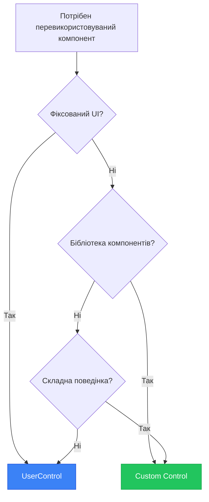
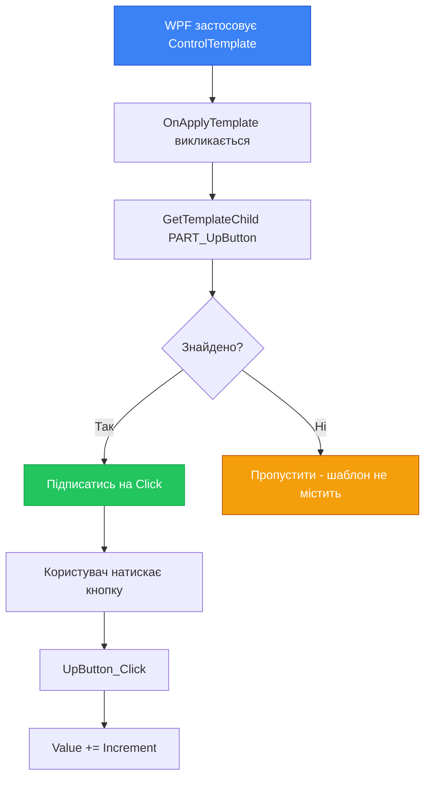

# Custom Controls: Lookless Controls у WPF

Уявіть, що ви створюєте бібліотеку UI-компонентів для всієї компанії. Дизайнери кожного проєкту хочуть використовувати ваші компоненти, але з різним зовнішнім виглядом: один проєкт має Material Design, інший — Fluent Design, третій — власний корпоративний стиль. Як створити компонент, що має поведінку, але дозволяє повністю змінити зовнішність?

Відповідь — `Custom Control` (також відомий як Lookless Control). На відміну від `UserControl`, що має фіксовану розмітку, Custom Control — це лише логіка та поведінка. Зовнішній вигляд визначається через `ControlTemplate`, який можна повністю замінити без зміни коду.

Це фундаментальна різниця у філософії. UserControl каже: "Ось мій UI, використовуй його як є". Custom Control каже: "Ось моя поведінка, намалюй мені будь-який UI". Всі вбудовані WPF-контроли (Button, TextBox, ListBox) — це Custom Controls. Ви можете повністю змінити їхній вигляд через Style та ControlTemplate, але поведінка залишається незмінною.

У цій статті ми детально розберемо створення Custom Controls: від базової структури до складних концепцій як Template Parts, OnApplyTemplate та Automation Peers. Ви навчитесь створювати професійні контроли, що можуть використовуватись у бібліотеках компонентів та дизайн-системах.

::note
**Словник теми:** **Custom Control** — контрол з поведінкою, але без фіксованого UI (lookless). **Lookless Control** — синонім Custom Control, підкреслює відсутність фіксованого вигляду. **ControlTemplate** — шаблон, що визначає зовнішній вигляд контролу. **Template Part** — іменована частина шаблону, до якої звертається код контролу. **DefaultStyleKey** — ключ для пошуку стилю за замовчуванням. **Generic.xaml** — файл зі стилями за замовчуванням для Custom Controls. **OnApplyTemplate** — метод, що викликається при застосуванні шаблону. **GetTemplateChild** — метод для пошуку Template Part за іменем. **Automation Peer** — клас для підтримки accessibility та UI Automation.
::

---

## UserControl vs Custom Control: фундаментальна різниця

Перш ніж занурюватись у створення Custom Control, важливо зрозуміти, чим він відрізняється від UserControl і коли використовувати кожен.

### UserControl: композиція з фіксованим UI

**UserControl** — це контейнер, що складається з інших контролів. Він має фіксовану розмітку у XAML-файлі.

**Характеристики:**

- ✅ Простий у створенні (XAML + code-behind)
- ✅ Ідеальний для перевикористовуваних частин UI
- ✅ Швидка розробка
- ❌ Фіксований зовнішній вигляд
- ❌ Важко змінити структуру UI ззовні
- ❌ Не підходить для бібліотек компонентів

**Приклад:** SearchBox з TextBox та Button — завжди має однакову структуру.

### Custom Control: поведінка без зовнішності

**Custom Control** — це клас з логікою, але без фіксованого UI. Зовнішній вигляд визначається через ControlTemplate.

**Характеристики:**

- ✅ Повна свобода зміни зовнішнього вигляду
- ✅ Ідеальний для бібліотек компонентів
- ✅ Підтримка тем та стилів
- ✅ Професійний підхід
- ❌ Складніший у створенні
- ❌ Потрібне розуміння ControlTemplate
- ❌ Більше коду

**Приклад:** Button — може виглядати як завгодно (плоска кнопка, 3D-кнопка, іконка), але поведінка (Click, IsPressed) незмінна.

### Порівняльна таблиця

| Аспект | UserControl | Custom Control |
|--------|-------------|----------------|
| **Структура** | XAML + code-behind | Клас + Generic.xaml |
| **UI** | Фіксований | Змінний через ControlTemplate |
| **Складність** | Низька | Висока |
| **Перевикористовуваність** | Середня | Висока |
| **Тематизація** | Обмежена | Повна |
| **Використання** | Конкретний додаток | Бібліотеки компонентів |
| **Приклади** | SearchBox, HeaderPanel | Button, Slider, DatePicker |

### Коли використовувати що?

**Використовуйте UserControl коли:**

- Створюєте UI для конкретного додатку
- Потрібна швидка розробка
- Зовнішній вигляд фіксований і не змінюватиметься
- Компонент використовується лише у вашому проєкті

**Використовуйте Custom Control коли:**

- Створюєте бібліотеку компонентів для кількох проєктів
- Потрібна повна свобода зміни зовнішнього вигляду
- Компонент має складну поведінку
- Потрібна підтримка тем та стилів
- Створюєте контрол для публікації (NuGet)

::mermaid

::

---

## Створення базового Custom Control

Розберемо покроковий процес створення Custom Control на прикладі `NumericUpDown` — контролу для введення чисел з кнопками +/-.

### Крок 1: Створення класу контролу

**У Visual Studio:**

1. Правою кнопкою на проєкт → Add → New Item
2. Обрати "Custom Control (WPF)"
3. Ввести ім'я: `NumericUpDown.cs`
4. Visual Studio створить клас та папку `Themes` з файлом `Generic.xaml`

**Вручну (для розуміння структури):**

Створіть клас `NumericUpDown.cs`:

```csharp
using System.Windows;
using System.Windows.Controls;

namespace MyApp.Controls;

public class NumericUpDown : Control
{
    // Статичний конструктор — викликається один раз при завантаженні типу
    static NumericUpDown()
    {
        // Реєструємо стиль за замовчуванням
        DefaultStyleKeyProperty.OverrideMetadata(
            typeof(NumericUpDown),
            new FrameworkPropertyMetadata(typeof(NumericUpDown))
        );
    }
    
    // Звичайний конструктор — викликається для кожного екземпляра
    public NumericUpDown()
    {
        // Ініціалізація
    }
}
```

**Ключові моменти:**

1. Наслідуємо `Control`, а не `UserControl`
2. Статичний конструктор реєструє `DefaultStyleKey`
3. `DefaultStyleKey` вказує WPF, де шукати стиль за замовчуванням

### Крок 2: Створення Generic.xaml

Створіть папку `Themes` у корені проєкту та файл `Generic.xaml`:

```xml
<ResourceDictionary xmlns="http://schemas.microsoft.com/winfx/2006/xaml/presentation"
                    xmlns:x="http://schemas.microsoft.com/winfx/2006/xaml"
                    xmlns:local="clr-namespace:MyApp.Controls">
    
    <!-- Стиль за замовчуванням для NumericUpDown -->
    <Style TargetType="{x:Type local:NumericUpDown}">
        <Setter Property="Template">
            <Setter.Value>
                <ControlTemplate TargetType="{x:Type local:NumericUpDown}">
                    <Border Background="{TemplateBinding Background}"
                            BorderBrush="{TemplateBinding BorderBrush}"
                            BorderThickness="{TemplateBinding BorderThickness}"
                            CornerRadius="4">
                        <Grid>
                            <Grid.ColumnDefinitions>
                                <ColumnDefinition Width="*"/>
                                <ColumnDefinition Width="Auto"/>
                            </Grid.ColumnDefinitions>
                            
                            <!-- TextBox для відображення значення -->
                            <TextBox Grid.Column="0"
                                     x:Name="PART_TextBox"
                                     Text="{Binding Value, RelativeSource={RelativeSource TemplatedParent}, UpdateSourceTrigger=PropertyChanged}"
                                     VerticalContentAlignment="Center"
                                     Padding="8,4"
                                     BorderThickness="0"/>
                            
                            <!-- Кнопки +/- -->
                            <StackPanel Grid.Column="1" Orientation="Vertical">
                                <Button x:Name="PART_UpButton"
                                        Content="▲"
                                        FontSize="8"
                                        Padding="8,2"
                                        BorderThickness="0"/>
                                <Button x:Name="PART_DownButton"
                                        Content="▼"
                                        FontSize="8"
                                        Padding="8,2"
                                        BorderThickness="0"/>
                            </StackPanel>
                        </Grid>
                    </Border>
                </ControlTemplate>
            </Setter.Value>
        </Setter>
    </Style>
    
</ResourceDictionary>
```

**Важливо:** Файл `Generic.xaml` має бути у папці `Themes` і мати Build Action = "Page".

### Крок 3: Реєстрація Generic.xaml

Переконайтесь, що `Generic.xaml` має правильні властивості:

**У .csproj:**

```xml
<ItemGroup>
    <Page Include="Themes\Generic.xaml">
        <Generator>MSBuild:Compile</Generator>
        <SubType>Designer</SubType>
    </Page>
</ItemGroup>
```

Або у властивостях файлу:
- Build Action: Page
- Custom Tool: MSBuild:Compile

### Крок 4: Додавання DependencyProperty

Додаємо властивість `Value` для зберігання числа:

```csharp
public class NumericUpDown : Control
{
    static NumericUpDown()
    {
        DefaultStyleKeyProperty.OverrideMetadata(
            typeof(NumericUpDown),
            new FrameworkPropertyMetadata(typeof(NumericUpDown))
        );
    }
    
    // DependencyProperty для значення
    public static readonly DependencyProperty ValueProperty =
        DependencyProperty.Register(
            nameof(Value),
            typeof(double),
            typeof(NumericUpDown),
            new FrameworkPropertyMetadata(
                0.0,
                FrameworkPropertyMetadataOptions.BindsTwoWayByDefault,
                OnValueChanged,
                CoerceValue
            )
        );
    
    public double Value
    {
        get => (double)GetValue(ValueProperty);
        set => SetValue(ValueProperty, value);
    }
    
    // Callback при зміні значення
    private static void OnValueChanged(DependencyObject d, DependencyPropertyChangedEventArgs e)
    {
        var control = (NumericUpDown)d;
        double newValue = (double)e.NewValue;
        
        // Можна додати логіку при зміні
        control.RaiseValueChangedEvent(newValue);
    }
    
    // Coerce — валідація та корекція значення
    private static object CoerceValue(DependencyObject d, object baseValue)
    {
        var control = (NumericUpDown)d;
        double value = (double)baseValue;
        
        // Обмежуємо значення між Minimum та Maximum
        if (value < control.Minimum)
            return control.Minimum;
        if (value > control.Maximum)
            return control.Maximum;
        
        return value;
    }
    
    // Додаткові властивості
    public static readonly DependencyProperty MinimumProperty =
        DependencyProperty.Register(nameof(Minimum), typeof(double), typeof(NumericUpDown),
            new PropertyMetadata(double.MinValue, OnMinMaxChanged));
    
    public double Minimum
    {
        get => (double)GetValue(MinimumProperty);
        set => SetValue(MinimumProperty, value);
    }
    
    public static readonly DependencyProperty MaximumProperty =
        DependencyProperty.Register(nameof(Maximum), typeof(double), typeof(NumericUpDown),
            new PropertyMetadata(double.MaxValue, OnMinMaxChanged));
    
    public double Maximum
    {
        get => (double)GetValue(MaximumProperty);
        set => SetValue(MaximumProperty, value);
    }
    
    public static readonly DependencyProperty IncrementProperty =
        DependencyProperty.Register(nameof(Increment), typeof(double), typeof(NumericUpDown),
            new PropertyMetadata(1.0));
    
    public double Increment
    {
        get => (double)GetValue(IncrementProperty);
        set => SetValue(IncrementProperty, value);
    }
    
    private static void OnMinMaxChanged(DependencyObject d, DependencyPropertyChangedEventArgs e)
    {
        var control = (NumericUpDown)d;
        // Перевалідувати Value при зміні Minimum/Maximum
        control.CoerceValue(ValueProperty);
    }
}
```

### Крок 5: Використання Custom Control

```xml
<Window xmlns:controls="clr-namespace:MyApp.Controls">
    <StackPanel Margin="20">
        <TextBlock Text="Кількість:" Margin="0,0,0,4"/>
        <controls:NumericUpDown Value="{Binding Quantity}"
                                Minimum="0"
                                Maximum="100"
                                Increment="1"
                                Width="150"
                                HorizontalAlignment="Left"/>
    </StackPanel>
</Window>
```

::wpf-preview{title="Базовий Custom Control: NumericUpDown"}

```xml
<Border Background="White" 
        BorderBrush="#e2e8f0" 
        BorderThickness="1" 
        CornerRadius="4"
        Width="150">
    <Grid>
        <Grid.ColumnDefinitions>
            <ColumnDefinition Width="*"/>
            <ColumnDefinition Width="Auto"/>
        </Grid.ColumnDefinitions>
        
        <TextBox Grid.Column="0"
                 Text="42"
                 VerticalContentAlignment="Center"
                 Padding="8,4"
                 BorderThickness="0"/>
        
        <StackPanel Grid.Column="1" Orientation="Vertical">
            <Button Content="▲"
                    FontSize="8"
                    Padding="8,2"
                    BorderThickness="0"
                    Command="{Binding ShowMessageCommand}"
                    CommandParameter="Value збільшено на Increment"/>
            <Button Content="▼"
                    FontSize="8"
                    Padding="8,2"
                    BorderThickness="0"
                    Command="{Binding ShowMessageCommand}"
                    CommandParameter="Value зменшено на Increment"/>
        </StackPanel>
    </Grid>
</Border>
```

::

---

## Template Parts: зв'язок між кодом та шаблоном

У попередньому прикладі ми створили шаблон з кнопками `PART_UpButton` та `PART_DownButton`, але вони ще не працюють. Щоб код контролу міг взаємодіяти з елементами шаблону, використовуються **Template Parts**.

### Що таке Template Part

Template Part — це іменований елемент у ControlTemplate, до якого звертається код контролу. Це контракт між кодом та шаблоном: "Якщо у шаблоні є елемент з таким іменем — я буду з ним працювати".

**Конвенція іменування:** `PART_` + описова назва (наприклад, `PART_UpButton`, `PART_TextBox`).

### Атрибут TemplatePart

Атрибут `[TemplatePart]` документує, які частини шаблону очікує контрол:

```csharp
[TemplatePart(Name = "PART_UpButton", Type = typeof(Button))]
[TemplatePart(Name = "PART_DownButton", Type = typeof(Button))]
[TemplatePart(Name = "PART_TextBox", Type = typeof(TextBox))]
public class NumericUpDown : Control
{
    // ...
}
```

**Важливо:** Атрибут `[TemplatePart]` — це лише документація. Він не змушує шаблон містити ці елементи. Код контролу має перевіряти наявність частин.

### OnApplyTemplate: пошук Template Parts

Метод `OnApplyTemplate()` викликається WPF, коли шаблон застосовується до контролу. Тут ми шукаємо Template Parts та підписуємось на їхні події:

```csharp
[TemplatePart(Name = "PART_UpButton", Type = typeof(Button))]
[TemplatePart(Name = "PART_DownButton", Type = typeof(Button))]
[TemplatePart(Name = "PART_TextBox", Type = typeof(TextBox))]
public class NumericUpDown : Control
{
    private Button? _upButton;
    private Button? _downButton;
    private TextBox? _textBox;
    
    public override void OnApplyTemplate()
    {
        // ВАЖЛИВО: спочатку викликати base
        base.OnApplyTemplate();
        
        // Відписатись від старих елементів (якщо шаблон змінився)
        if (_upButton != null)
            _upButton.Click -= UpButton_Click;
        if (_downButton != null)
            _downButton.Click -= DownButton_Click;
        if (_textBox != null)
            _textBox.PreviewKeyDown -= TextBox_PreviewKeyDown;
        
        // Знайти нові елементи
        _upButton = GetTemplateChild("PART_UpButton") as Button;
        _downButton = GetTemplateChild("PART_DownButton") as Button;
        _textBox = GetTemplateChild("PART_TextBox") as TextBox;
        
        // Підписатись на події нових елементів
        if (_upButton != null)
            _upButton.Click += UpButton_Click;
        if (_downButton != null)
            _downButton.Click += DownButton_Click;
        if (_textBox != null)
            _textBox.PreviewKeyDown += TextBox_PreviewKeyDown;
    }
    
    private void UpButton_Click(object sender, RoutedEventArgs e)
    {
        Value += Increment;
    }
    
    private void DownButton_Click(object sender, RoutedEventArgs e)
    {
        Value -= Increment;
    }
    
    private void TextBox_PreviewKeyDown(object sender, KeyEventArgs e)
    {
        if (e.Key == Key.Up)
        {
            Value += Increment;
            e.Handled = true;
        }
        else if (e.Key == Key.Down)
        {
            Value -= Increment;
            e.Handled = true;
        }
    }
}
```

### GetTemplateChild: безпечний пошук

`GetTemplateChild(string name)` повертає `DependencyObject?` — потрібно приведення типу:

```csharp
// ✅ Правильно — перевірка типу
_upButton = GetTemplateChild("PART_UpButton") as Button;
if (_upButton != null)
{
    _upButton.Click += UpButton_Click;
}

// ❌ Неправильно — може кинути InvalidCastException
_upButton = (Button)GetTemplateChild("PART_UpButton");
```

**Чому Template Part може бути null:**

1. Шаблон не містить елемента з таким іменем
2. Елемент має інший тип (наприклад, ToggleButton замість Button)
3. Шаблон взагалі не застосовано

**Правило:** Завжди перевіряйте `null` перед використанням Template Part.

### Повний приклад NumericUpDown

```csharp
using System.Windows;
using System.Windows.Controls;
using System.Windows.Input;

namespace MyApp.Controls;

[TemplatePart(Name = "PART_UpButton", Type = typeof(Button))]
[TemplatePart(Name = "PART_DownButton", Type = typeof(Button))]
[TemplatePart(Name = "PART_TextBox", Type = typeof(TextBox))]
public class NumericUpDown : Control
{
    private Button? _upButton;
    private Button? _downButton;
    private TextBox? _textBox;
    
    static NumericUpDown()
    {
        DefaultStyleKeyProperty.OverrideMetadata(
            typeof(NumericUpDown),
            new FrameworkPropertyMetadata(typeof(NumericUpDown))
        );
    }
    
    public NumericUpDown()
    {
        // Підтримка клавіатури на рівні контролу
        this.PreviewKeyDown += (s, e) =>
        {
            if (e.Key == Key.Up)
            {
                Value += Increment;
                e.Handled = true;
            }
            else if (e.Key == Key.Down)
            {
                Value -= Increment;
                e.Handled = true;
            }
        };
    }
    
    public override void OnApplyTemplate()
    {
        base.OnApplyTemplate();
        
        // Відписатись від старих елементів
        if (_upButton != null)
            _upButton.Click -= UpButton_Click;
        if (_downButton != null)
            _downButton.Click -= DownButton_Click;
        
        // Знайти нові елементи
        _upButton = GetTemplateChild("PART_UpButton") as Button;
        _downButton = GetTemplateChild("PART_DownButton") as Button;
        _textBox = GetTemplateChild("PART_TextBox") as TextBox;
        
        // Підписатись на події
        if (_upButton != null)
            _upButton.Click += UpButton_Click;
        if (_downButton != null)
            _downButton.Click += DownButton_Click;
    }
    
    private void UpButton_Click(object sender, RoutedEventArgs e)
    {
        Value += Increment;
    }
    
    private void DownButton_Click(object sender, RoutedEventArgs e)
    {
        Value -= Increment;
    }
    
    // DependencyProperty (з попереднього розділу)
    public static readonly DependencyProperty ValueProperty =
        DependencyProperty.Register(
            nameof(Value),
            typeof(double),
            typeof(NumericUpDown),
            new FrameworkPropertyMetadata(
                0.0,
                FrameworkPropertyMetadataOptions.BindsTwoWayByDefault,
                null,
                CoerceValue
            )
        );
    
    public double Value
    {
        get => (double)GetValue(ValueProperty);
        set => SetValue(ValueProperty, value);
    }
    
    public static readonly DependencyProperty MinimumProperty =
        DependencyProperty.Register(nameof(Minimum), typeof(double), typeof(NumericUpDown),
            new PropertyMetadata(double.MinValue, OnMinMaxChanged));
    
    public double Minimum
    {
        get => (double)GetValue(MinimumProperty);
        set => SetValue(MinimumProperty, value);
    }
    
    public static readonly DependencyProperty MaximumProperty =
        DependencyProperty.Register(nameof(Maximum), typeof(double), typeof(NumericUpDown),
            new PropertyMetadata(double.MaxValue, OnMinMaxChanged));
    
    public double Maximum
    {
        get => (double)GetValue(MaximumProperty);
        set => SetValue(MaximumProperty, value);
    }
    
    public static readonly DependencyProperty IncrementProperty =
        DependencyProperty.Register(nameof(Increment), typeof(double), typeof(NumericUpDown),
            new PropertyMetadata(1.0));
    
    public double Increment
    {
        get => (double)GetValue(IncrementProperty);
        set => SetValue(IncrementProperty, value);
    }
    
    private static object CoerceValue(DependencyObject d, object baseValue)
    {
        var control = (NumericUpDown)d;
        double value = (double)baseValue;
        
        if (value < control.Minimum)
            return control.Minimum;
        if (value > control.Maximum)
            return control.Maximum;
        
        return value;
    }
    
    private static void OnMinMaxChanged(DependencyObject d, DependencyPropertyChangedEventArgs e)
    {
        var control = (NumericUpDown)d;
        control.CoerceValue(ValueProperty);
    }
}
```

::mermaid

::


---

## Зміна зовнішнього вигляду через ControlTemplate

Головна перевага Custom Control — можливість повністю змінити зовнішній вигляд без зміни коду. Розберемо кілька прикладів.

### Альтернативний шаблон: горизонтальні кнопки

```xml
<Window.Resources>
    <Style x:Key="HorizontalNumericUpDown" TargetType="{x:Type local:NumericUpDown}">
        <Setter Property="Template">
            <Setter.Value>
                <ControlTemplate TargetType="{x:Type local:NumericUpDown}">
                    <Border Background="{TemplateBinding Background}"
                            BorderBrush="{TemplateBinding BorderBrush}"
                            BorderThickness="{TemplateBinding BorderThickness}"
                            CornerRadius="4">
                        <Grid>
                            <Grid.ColumnDefinitions>
                                <ColumnDefinition Width="Auto"/>
                                <ColumnDefinition Width="*"/>
                                <ColumnDefinition Width="Auto"/>
                            </Grid.ColumnDefinitions>
                            
                            <!-- Кнопка - зліва -->
                            <Button Grid.Column="0"
                                    x:Name="PART_DownButton"
                                    Content="−"
                                    FontSize="16"
                                    Padding="12,4"
                                    BorderThickness="0"/>
                            
                            <!-- TextBox по центру -->
                            <TextBox Grid.Column="1"
                                     x:Name="PART_TextBox"
                                     Text="{Binding Value, RelativeSource={RelativeSource TemplatedParent}, UpdateSourceTrigger=PropertyChanged}"
                                     TextAlignment="Center"
                                     VerticalContentAlignment="Center"
                                     Padding="8,4"
                                     BorderThickness="0"/>
                            
                            <!-- Кнопка + справа -->
                            <Button Grid.Column="2"
                                    x:Name="PART_UpButton"
                                    Content="+"
                                    FontSize="16"
                                    Padding="12,4"
                                    BorderThickness="0"/>
                        </Grid>
                    </Border>
                </ControlTemplate>
            </Setter.Value>
        </Setter>
    </Style>
</Window.Resources>

<local:NumericUpDown Style="{StaticResource HorizontalNumericUpDown}"
                     Value="{Binding Quantity}"
                     Width="200"/>
```

**Ключовий момент:** Код контролу не змінився — ми лише замінили ControlTemplate. Кнопки `PART_UpButton` та `PART_DownButton` все ще працюють, бо `OnApplyTemplate` знаходить їх за іменем.

### Мінімалістичний шаблон без кнопок

```xml
<Style x:Key="MinimalNumericUpDown" TargetType="{x:Type local:NumericUpDown}">
    <Setter Property="Template">
        <Setter.Value>
            <ControlTemplate TargetType="{x:Type local:NumericUpDown}">
                <Border Background="{TemplateBinding Background}"
                        BorderBrush="{TemplateBinding BorderBrush}"
                        BorderThickness="{TemplateBinding BorderThickness}"
                        CornerRadius="4">
                    <!-- Лише TextBox — без кнопок -->
                    <TextBox x:Name="PART_TextBox"
                             Text="{Binding Value, RelativeSource={RelativeSource TemplatedParent}, UpdateSourceTrigger=PropertyChanged}"
                             VerticalContentAlignment="Center"
                             Padding="8,4"
                             BorderThickness="0"/>
                    <!-- PART_UpButton та PART_DownButton відсутні -->
                </Border>
            </ControlTemplate>
        </Setter.Value>
    </Setter>
</Style>
```

**Що відбувається:**

1. `OnApplyTemplate` викликається
2. `GetTemplateChild("PART_UpButton")` повертає `null`
3. Код перевіряє `if (_upButton != null)` — false
4. Підписка на Click не відбувається
5. Контрол працює лише з клавіатурою (Up/Down keys)

Це демонструє гнучкість Template Parts — вони опціональні. Контрол має працювати навіть якщо частини шаблону відсутні.

### Шаблон з Slider замість кнопок

```xml
<Style x:Key="SliderNumericUpDown" TargetType="{x:Type local:NumericUpDown}">
    <Setter Property="Template">
        <Setter.Value>
            <ControlTemplate TargetType="{x:Type local:NumericUpDown}">
                <StackPanel>
                    <!-- Відображення значення -->
                    <TextBlock Text="{Binding Value, RelativeSource={RelativeSource TemplatedParent}, StringFormat='{}{0:F2}'}"
                               FontSize="24"
                               FontWeight="Bold"
                               HorizontalAlignment="Center"
                               Margin="0,0,0,8"/>
                    
                    <!-- Slider для зміни значення -->
                    <Slider Minimum="{Binding Minimum, RelativeSource={RelativeSource TemplatedParent}}"
                            Maximum="{Binding Maximum, RelativeSource={RelativeSource TemplatedParent}}"
                            Value="{Binding Value, RelativeSource={RelativeSource TemplatedParent}}"
                            TickFrequency="{Binding Increment, RelativeSource={RelativeSource TemplatedParent}}"
                            IsSnapToTickEnabled="True"/>
                </StackPanel>
            </ControlTemplate>
        </Setter.Value>
    </Setter>
</Style>
```

Тут взагалі немає Template Parts — весь UI побудований на Binding до DependencyProperty контролу. Це теж валідний підхід для простих випадків.

---

## Automation Peers: accessibility та UI Automation

`AutomationPeer` — це клас, що надає інформацію про контрол для accessibility-технологій (screen readers) та UI Automation (автоматизоване тестування).

### Навіщо потрібен AutomationPeer

**Для accessibility:**

- Screen readers (NVDA, JAWS) можуть озвучити контрол
- Користувачі з обмеженими можливостями можуть взаємодіяти з контролом
- Відповідність стандартам WCAG

**Для UI Automation:**

- Автоматизовані тести можуть знайти контрол
- Можна програмно змінювати значення
- Можна перевіряти стан контролу

### Створення AutomationPeer

```csharp
using System.Windows.Automation.Peers;
using System.Windows.Automation.Provider;

namespace MyApp.Controls;

// AutomationPeer для NumericUpDown
public class NumericUpDownAutomationPeer : FrameworkElementAutomationPeer, IRangeValueProvider
{
    public NumericUpDownAutomationPeer(NumericUpDown owner) : base(owner)
    {
    }
    
    private NumericUpDown NumericUpDown => (NumericUpDown)Owner;
    
    // Ім'я типу контролу для UI Automation
    protected override string GetClassNameCore()
    {
        return "NumericUpDown";
    }
    
    // Тип контролу (Spinner — найближчий стандартний тип)
    protected override AutomationControlType GetAutomationControlTypeCore()
    {
        return AutomationControlType.Spinner;
    }
    
    // Підтримувані патерни (IRangeValueProvider для числових значень)
    public override object GetPattern(PatternInterface patternInterface)
    {
        if (patternInterface == PatternInterface.RangeValue)
            return this;
        
        return base.GetPattern(patternInterface);
    }
    
    // Реалізація IRangeValueProvider
    public bool IsReadOnly => false;
    
    public double LargeChange => NumericUpDown.Increment * 10;
    
    public double Maximum => NumericUpDown.Maximum;
    
    public double Minimum => NumericUpDown.Minimum;
    
    public double SmallChange => NumericUpDown.Increment;
    
    public double Value => NumericUpDown.Value;
    
    public void SetValue(double value)
    {
        if (!IsEnabled())
            throw new ElementNotEnabledException();
        
        NumericUpDown.Value = value;
    }
}
```

### Реєстрація AutomationPeer у контролі

```csharp
public class NumericUpDown : Control
{
    // ... інший код ...
    
    // Перевизначаємо метод для створення AutomationPeer
    protected override AutomationPeer OnCreateAutomationPeer()
    {
        return new NumericUpDownAutomationPeer(this);
    }
}
```

### Використання у тестах

```csharp
// UI Automation тест
[Test]
public void NumericUpDown_SetValue_UpdatesControl()
{
    // Arrange
    var window = new MainWindow();
    window.Show();
    
    var numericUpDown = window.FindName("MyNumericUpDown") as NumericUpDown;
    var peer = UIElementAutomationPeer.CreatePeerForElement(numericUpDown);
    var rangeValueProvider = peer.GetPattern(PatternInterface.RangeValue) as IRangeValueProvider;
    
    // Act
    rangeValueProvider.SetValue(42);
    
    // Assert
    Assert.AreEqual(42, numericUpDown.Value);
}
```

### Accessibility для screen readers

З правильним AutomationPeer, screen reader озвучить контрол:

```
"NumericUpDown, spinner, value 42, minimum 0, maximum 100"
```

Користувач може:
- Почути поточне значення
- Змінити значення через клавіатуру
- Дізнатись діапазон допустимих значень

---

## Практичні завдання

### Рівень 1: NumericUpDown з кнопками +/-

**Мета:** Навчитися створювати базовий Custom Control з Template Parts.

**Завдання:**

Створіть повноцінний контрол NumericUpDown:

1. **Клас контролу:**
   - Наслідує `Control`
   - `DefaultStyleKey` у статичному конструкторі
   - DependencyProperty: `Value`, `Minimum`, `Maximum`, `Increment`

2. **Template Parts:**
   - `PART_UpButton` (Button) — збільшити значення
   - `PART_DownButton` (Button) — зменшити значення
   - `PART_TextBox` (TextBox) — відображення та редагування значення

3. **Generic.xaml:**
   - Стиль за замовчуванням з ControlTemplate
   - Вертикальне розташування кнопок справа від TextBox

4. **Функціональність:**
   - Кнопки +/- змінюють значення на Increment
   - Клавіші Up/Down також змінюють значення
   - Значення обмежується між Minimum та Maximum
   - TextBox дозволяє ручне введення

**Критерії успіху:**

- Custom Control створено правильно
- Generic.xaml у папці Themes
- Template Parts працюють через OnApplyTemplate
- DependencyProperty з CoerceValue для валідації
- Контрол можна використати у XAML з Binding

**Підказка:**

```csharp
public override void OnApplyTemplate()
{
    base.OnApplyTemplate();
    
    if (_upButton != null)
        _upButton.Click -= UpButton_Click;
    if (_downButton != null)
        _downButton.Click -= DownButton_Click;
    
    _upButton = GetTemplateChild("PART_UpButton") as Button;
    _downButton = GetTemplateChild("PART_DownButton") as Button;
    
    if (_upButton != null)
        _upButton.Click += UpButton_Click;
    if (_downButton != null)
        _downButton.Click += DownButton_Click;
}
```

---

### Рівень 2: RatingControl з 5 зірочками

**Мета:** Навчитися створювати Custom Control з динамічним UI.

**Завдання:**

Створіть контрол для відображення та редагування рейтингу (1-5 зірочок):

1. **Клас контролу:**
   - DependencyProperty: `Rating` (double, 0-5)
   - DependencyProperty: `MaxRating` (int, за замовчуванням 5)
   - DependencyProperty: `IsReadOnly` (bool)

2. **UI:**
   - 5 зірочок (★ або ☆)
   - Заповнені зірочки для поточного рейтингу
   - Напівзаповнена зірочка для дробових значень (наприклад, 3.5)
   - Hover-ефект при наведенні миші

3. **Функціональність:**
   - Клік на зірочку встановлює рейтинг
   - Hover показує попередній перегляд рейтингу
   - IsReadOnly вимикає редагування

4. **Шаблон:**
   - ItemsControl для генерації зірочок
   - DataTemplate для кожної зірочки
   - Triggers для зміни вигляду

**Критерії успіху:**

- Рейтинг відображається правильно (заповнені/порожні зірочки)
- Клік змінює рейтинг
- Hover показує попередній перегляд
- IsReadOnly працює
- Підтримка дробових значень (3.5 = 3 повні + 1 напів)

**Підказка для шаблону:**

```xml
<ItemsControl ItemsSource="{Binding Stars, RelativeSource={RelativeSource TemplatedParent}}">
    <ItemsControl.ItemsPanel>
        <ItemsPanelTemplate>
            <StackPanel Orientation="Horizontal"/>
        </ItemsPanelTemplate>
    </ItemsControl.ItemsPanel>
    <ItemsControl.ItemTemplate>
        <DataTemplate>
            <TextBlock Text="★" 
                       FontSize="24"
                       Cursor="Hand"
                       MouseLeftButtonDown="Star_Click"
                       MouseEnter="Star_MouseEnter"
                       MouseLeave="Star_MouseLeave">
                <TextBlock.Style>
                    <Style TargetType="TextBlock">
                        <Setter Property="Foreground" Value="#cbd5e1"/>
                        <Style.Triggers>
                            <DataTrigger Binding="{Binding IsFilled}" Value="True">
                                <Setter Property="Foreground" Value="#fbbf24"/>
                            </DataTrigger>
                        </Style.Triggers>
                    </Style>
                </TextBlock.Style>
            </TextBlock>
        </DataTemplate>
    </ItemsControl.ItemTemplate>
</ItemsControl>
```

---

### Рівень 3: CircularProgressBar з custom rendering

**Мета:** Навчитися створювати Custom Control з власним рендерингом через OnRender.

**Завдання:**

Створіть круговий прогрес-бар (як у мобільних додатках):

1. **Клас контролу:**
   - DependencyProperty: `Value` (double, 0-100)
   - DependencyProperty: `Thickness` (double, товщина кільця)
   - DependencyProperty: `StartAngle` (double, кут початку)
   - DependencyProperty: `ProgressBrush` (Brush, колір прогресу)
   - DependencyProperty: `TrackBrush` (Brush, колір треку)

2. **Rendering:**
   - Перевизначити `OnRender(DrawingContext dc)`
   - Намалювати коло-трек (сірий)
   - Намалювати дугу прогресу (кольоровий)
   - Відобразити відсоток по центру

3. **Функціональність:**
   - Анімація при зміні Value
   - Підтримка різних розмірів
   - Адаптивна товщина кільця

4. **Додатково:**
   - Індикатор завантаження (обертання)
   - Градієнтний прогрес
   - Кастомний текст замість відсотка

**Критерії успіху:**

- Круговий прогрес-бар відображається правильно
- Value змінює заповнення дуги
- OnRender малює геометрію
- Анімація плавна
- Адаптується до розміру контролу

**Підказка для OnRender:**

```csharp
protected override void OnRender(DrawingContext dc)
{
    base.OnRender(dc);
    
    double width = ActualWidth;
    double height = ActualHeight;
    double size = Math.Min(width, height);
    double radius = (size - Thickness) / 2;
    Point center = new Point(width / 2, height / 2);
    
    // Малюємо трек (повне коло)
    dc.DrawEllipse(
        null,
        new Pen(TrackBrush, Thickness),
        center,
        radius,
        radius
    );
    
    // Малюємо прогрес (дуга)
    double angle = (Value / 100.0) * 360.0;
    if (angle > 0)
    {
        var geometry = CreateArcGeometry(center, radius, StartAngle, angle);
        dc.DrawGeometry(null, new Pen(ProgressBrush, Thickness), geometry);
    }
    
    // Малюємо текст по центру
    var text = new FormattedText(
        $"{Value:F0}%",
        CultureInfo.CurrentCulture,
        FlowDirection.LeftToRight,
        new Typeface("Segoe UI"),
        size / 4,
        Foreground,
        VisualTreeHelper.GetDpi(this).PixelsPerDip
    );
    
    dc.DrawText(text, new Point(
        center.X - text.Width / 2,
        center.Y - text.Height / 2
    ));
}

private PathGeometry CreateArcGeometry(Point center, double radius, double startAngle, double sweepAngle)
{
    double startRad = (startAngle - 90) * Math.PI / 180;
    double endRad = (startAngle + sweepAngle - 90) * Math.PI / 180;
    
    Point startPoint = new Point(
        center.X + radius * Math.Cos(startRad),
        center.Y + radius * Math.Sin(startRad)
    );
    
    Point endPoint = new Point(
        center.X + radius * Math.Cos(endRad),
        center.Y + radius * Math.Sin(endRad)
    );
    
    bool isLargeArc = sweepAngle > 180;
    
    var figure = new PathFigure
    {
        StartPoint = startPoint,
        Segments = new PathSegmentCollection
        {
            new ArcSegment
            {
                Point = endPoint,
                Size = new Size(radius, radius),
                IsLargeArc = isLargeArc,
                SweepDirection = SweepDirection.Clockwise
            }
        }
    };
    
    return new PathGeometry { Figures = new PathFigureCollection { figure } };
}
```

**Підказка для анімації:**

```csharp
private static void OnValueChanged(DependencyObject d, DependencyPropertyChangedEventArgs e)
{
    var control = (CircularProgressBar)d;
    
    // Анімація зміни Value
    var animation = new DoubleAnimation
    {
        From = (double)e.OldValue,
        To = (double)e.NewValue,
        Duration = TimeSpan.FromMilliseconds(300),
        EasingFunction = new QuadraticEase { EasingMode = EasingMode.EaseOut }
    };
    
    control.BeginAnimation(ValueProperty, animation);
}
```

---

## Підсумок

Custom Controls — це професійний інструмент для створення перевикористовуваних компонентів з повною свободою зміни зовнішнього вигляду.

**Ключові висновки:**

::card-group

::card{title="🎭 Lookless" icon="i-lucide-eye-off"}
Custom Control — це поведінка без фіксованого UI. Зовнішній вигляд визначається через ControlTemplate.
::

::card{title="🧩 Template Parts" icon="i-lucide-puzzle"}
Іменовані елементи шаблону (PART_*) для зв'язку між кодом та UI. OnApplyTemplate для пошуку частин.
::

::card{title="📁 Generic.xaml" icon="i-lucide-folder"}
Файл у папці Themes зі стилями за замовчуванням. DefaultStyleKey вказує на тип контролу.
::

::card{title="♿ Accessibility" icon="i-lucide-accessibility"}
AutomationPeer для підтримки screen readers та UI Automation. Відповідність стандартам WCAG.
::

::card{title="🎨 Customization" icon="i-lucide-palette"}
Повна свобода зміни зовнішнього вигляду через Style та ControlTemplate без зміни коду.
::

::card{title="📚 Libraries" icon="i-lucide-library"}
Ідеальний вибір для бібліотек компонентів, дизайн-систем та публікації у NuGet.
::

::

**Переваги Custom Control:**

- ✅ Повна свобода зміни зовнішнього вигляду
- ✅ Підтримка тем та стилів
- ✅ Професійний підхід
- ✅ Ідеальний для бібліотек компонентів
- ✅ Accessibility через AutomationPeer
- ✅ Тестованість через UI Automation

**Порівняння підходів:**

| Аспект | UserControl | Custom Control |
|--------|-------------|----------------|
| Складність створення | Низька | Висока |
| Гнучкість UI | Низька | Висока |
| Тематизація | Обмежена | Повна |
| Accessibility | Базова | Повна (через AutomationPeer) |
| Використання | Конкретний додаток | Бібліотеки компонентів |
| Приклади | SearchBox, HeaderPanel | Button, Slider, DatePicker |

::tip
**Рекомендація:** Використовуйте UserControl для швидкої розробки UI конкретного додатку. Використовуйте Custom Control для створення бібліотек компонентів з повною підтримкою тем та accessibility.
::

**Що далі?**

Ви завершили статтю про Custom Controls! Наступні теми:

- **Attached Properties** (стаття 39) — розширення функціональності існуючих контролів
- **Behaviors** (стаття 40) — додавання поведінки без наслідування
- **Value Converters** (стаття 41) — перетворення даних у Binding

---

## Словник термінів

::note{title="📚 Глосарій"}

**Custom Control** — контрол з поведінкою, але без фіксованого UI (lookless control).

**Lookless Control** — синонім Custom Control, підкреслює відсутність фіксованого зовнішнього вигляду.

**ControlTemplate** — шаблон, що визначає зовнішній вигляд контролу (структуру UI).

**Template Part** — іменований елемент у ControlTemplate, до якого звертається код контролу.

**DefaultStyleKey** — ключ для пошуку стилю за замовчуванням у Generic.xaml.

**Generic.xaml** — файл у папці Themes зі стилями за замовчуванням для Custom Controls.

**OnApplyTemplate** — метод, що викликається при застосуванні ControlTemplate до контролу.

**GetTemplateChild** — метод для пошуку Template Part за іменем у застосованому шаблоні.

**TemplatePart** — атрибут для документування очікуваних частин шаблону.

**AutomationPeer** — клас для підтримки accessibility (screen readers) та UI Automation (тестування).

**IRangeValueProvider** — інтерфейс UI Automation для контролів з числовими значеннями.

**OnRender** — метод для власного рендерингу контролу через DrawingContext.

**CoerceValue** — callback для валідації та корекції значення DependencyProperty.

**FrameworkPropertyMetadata** — розширені метадані DependencyProperty з додатковими опціями.

::

---

## Додаткові ресурси

::card-group

::card{title="📖 WPF Custom Controls Docs" icon="i-lucide-book-open" to="https://learn.microsoft.com/en-us/dotnet/desktop/wpf/controls/control-authoring-overview"}
Офіційна документація про створення Custom Controls.
::

::card{title="🧩 Template Parts Guide" icon="i-lucide-puzzle" to="https://learn.microsoft.com/en-us/dotnet/desktop/wpf/controls/control-styles-and-templates"}
Повний гайд з Template Parts та OnApplyTemplate.
::

::card{title="♿ Automation Peers" icon="i-lucide-accessibility" to="https://learn.microsoft.com/en-us/dotnet/desktop/wpf/controls/ui-automation-of-a-wpf-custom-control"}
Детальна стаття про AutomationPeer та accessibility.
::

::card{title="🎨 ControlTemplate Tutorial" icon="i-lucide-palette" to="https://learn.microsoft.com/en-us/dotnet/desktop/wpf/themes/how-to-create-apply-template"}
Гайд зі створення та застосування ControlTemplate.
::

::card{title="📚 Попередня стаття: UserControl" icon="i-lucide-arrow-left" to="/csharp/desktop-ui/37.user-controls"}
Повернутися до UserControl.
::

::card{title="📚 Наступна стаття: Attached Properties" icon="i-lucide-arrow-right" to="/csharp/desktop-ui/39.attached-properties"}
Дізнатися про Attached Properties.
::

::
