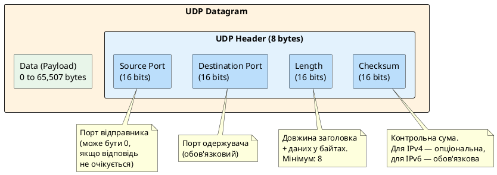
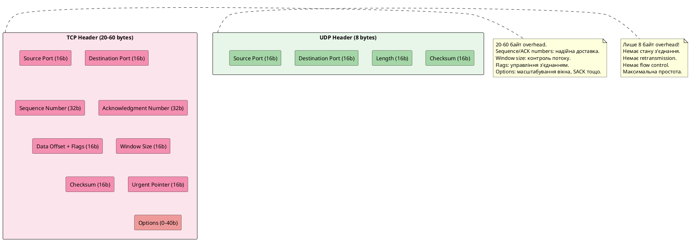
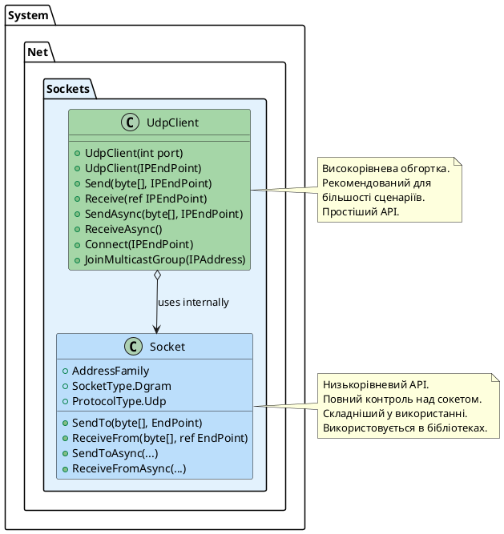
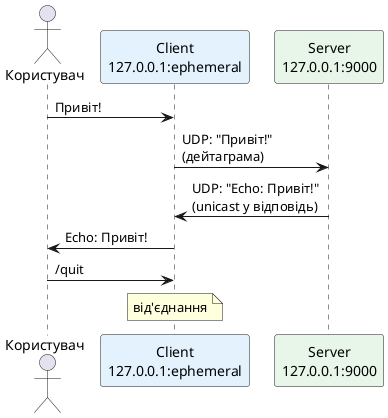
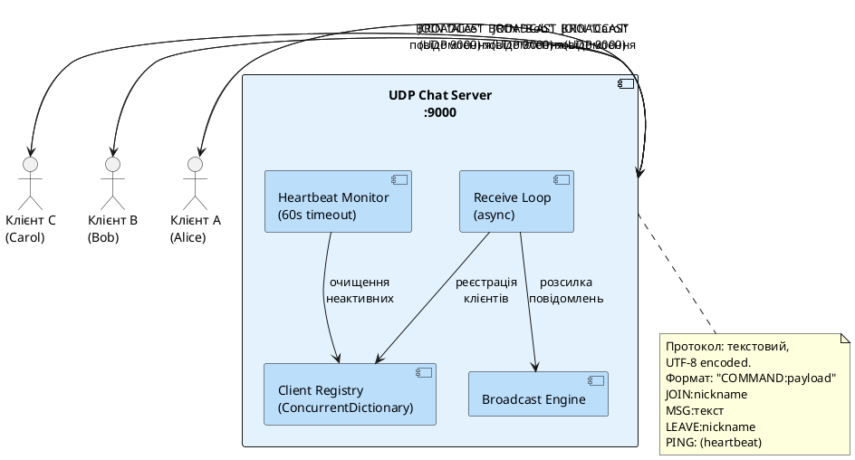

# UDP — протокол без з'єднання

## Від теорії до практики: чому UDP існує

У попередніх розділах ми вивчили мережеву модель OSI, стек TCP/IP та основи IP-адресації. Ми з'ясували, що транспортний рівень (Layer 4) відповідає за кінцеву доставку даних між процесами на різних хостах. Саме на транспортному рівні живуть два фундаментальні протоколи: **TCP** (Transmission Control Protocol) та **UDP** (User Datagram Protocol).

Між ними існує принципова філософська різниця. TCP — це протокол **надійності**: він гарантує доставку, порядок пакетів, відсутність дублікатів. UDP — це протокол **швидкості**: він надсилає дані без будь-яких гарантій, без встановлення з'єднання, без підтвердження отримання.

На перший погляд може здатися, що UDP — це «зламаний» або «неповноцінний» TCP. Але це глибока хибна думка. UDP — це **свідоме архітектурне рішення**, яке ідеально підходить для цілого класу задач, де накладні витрати TCP є неприйнятними.

::note
**Ключова ідея цього розділу:** UDP не є заміною TCP — це альтернативний інструмент з іншою моделлю надійності. Розуміння того, **коли** використовувати UDP замість TCP, є ознакою зрілого мережевого розробника.
::

---

## Історія та стандарт

UDP було розроблено **Девідом П. Ріком** (David P. Reed) у 1980 році та стандартизовано у документі **RFC 768** від серпня того ж року. Цей RFC є одним з найкоротших у своїй категорії — лише 3 сторінки. Для порівняння: RFC 793 (TCP), опублікований того ж року, містить 85 сторінок.

Ця лаконічність є красномовною: UDP робить рівно стільки, скільки потрібно, і нічого більше. Він надає лише **мультиплексування** (розрізнення потоків за номерами портів) та **опціональну перевірку цілісності** (checksum).

::callout{icon="i-lucide-book-open" color="primary"}
**RFC 768 — офіційне визначення UDP:**
"This User Datagram Protocol (UDP) makes available a datagram mode of packet-switched computer communication in the interconnected set of computer networks. This protocol assumes that the Internet Protocol (IP) is used as the underlying protocol."
::

---

## Анатомія UDP-дейтаграми

Перш ніж говорити про програмування, необхідно досконало розуміти структуру UDP-пакету. На відміну від TCP, заголовок UDP надзвичайно простий:

{.diagram-img}

::plant-uml



::

Розглянемо кожне поле детально:

::field-group

::field{name="Source Port" type="uint16 (2 байти)"}
Номер порту **відправника**. Це поле є опціональним з точки зору протоколу: якщо відправник не очікує відповіді, він може виставити значення `0`. Однак на практиці операційна система завжди призначає ефемерний порт (зазвичай у діапазоні 49152–65535), щоб отримувач міг надіслати відповідь.
::

::field{name="Destination Port" type="uint16 (2 байти)"}
Номер порту **одержувача**. Це поле є обов'язковим — воно визначає, якому процесу на цільовому хості призначено дейтаграму. Операційна система використовує це значення для **демультиплексування**: з потоку вхідних IP-пакетів ОС виокремлює UDP-дейтаграми та доставляє їх до відповідного сокету за номером порту.
::

::field{name="Length" type="uint16 (2 байти)"}
Загальна довжина UDP-дейтаграми в байтах, включаючи **заголовок (8 байтів)** та корисне навантаження (payload). Мінімальне значення — `8` (дейтаграма без даних). Максимальне значення — `65535`, але оскільки IP-пакет не може перевищувати 65535 байт (а заголовок IP займає від 20 байт), реальний максимум для UDP-payload становить **65507 байт** (65535 − 8 − 20 = 65507).
::

::field{name="Checksum" type="uint16 (2 байти)"}
Контрольна сума для перевірки цілісності дейтаграми. Обчислюється над **псевдозаголовком** (pseudo-header), що включає IP-адреси відправника та одержувача, протокол (17 для UDP) та довжину UDP, а також над самою UDP-дейтаграмою. У **IPv4** це поле є опціональним (значення `0x0000` означає «контрольна сума не обчислена»). У **IPv6** це поле є **обов'язковим**, оскільки IPv6 не обчислює власну контрольну суму заголовка.
::

::

### Порівняння заголовків TCP та UDP

Щоб зрозуміти, наскільки UDP є легшим, порівняємо обидва заголовки:

{.diagram-img}

::plant-uml



::

| Характеристика | TCP | UDP |
|---|---|---|
| Розмір заголовка | 20–60 байт | **8 байт** |
| Встановлення з'єднання | 3-way handshake | **Відсутнє** |
| Гарантія доставки | Так (ACK + retransmit) | **Ні** |
| Порядок пакетів | Гарантовано | **Не гарантовано** |
| Дублікати | Виключено | **Можливі** |
| Контроль потоку | Так (sliding window) | **Ні** |
| Контроль перевантажень | Так (AIMD) | **Ні** |
| Латентність | Вища (overhead) | **Нижча** |
| Тип передачі | Потокова (stream) | **Дейтаграми** |

---

## Модель доставки: дейтаграми vs потоки

Це одна з найважливіших концептуальних відмінностей між UDP та TCP, яку необхідно добре розуміти.

### TCP: потокова модель

TCP передає дані як **безперервний потік байтів** (byte stream). З точки зору застосунку немає жодних «меж повідомлень» — це просто послідовність байтів. Якщо ви надсилаєте рядок `"Hello"` (5 байт), а потім `"World"` (5 байт), TCP може:
- Доставити їх двома окремими блоками: `"Hello"` та `"World"`
- Об'єднати в один блок: `"HelloWorld"`
- Розбити інакше: `"Hell"` та `"oWorld"`

Застосунок відповідає за визначення меж повідомлень (наприклад, через довжину у заголовку, роздільник `\n` тощо).

### UDP: модель дейтаграм

UDP передає дані як **незалежні дейтаграми** (датаграми). Кожен виклик `sendto()` / `UdpClient.Send()` відправляє **одну дейтаграму**, яка або прийде цілком, або не прийде взагалі. Межі повідомлень **зберігаються**:

::note
Якщо ви надсилаєте UDP-дейтаграму з 100 байтами даних, отримувач або отримає рівно 100 байтів за один виклик `ReceiveFrom()`, або не отримає нічого. UDP **ніколи** не об'єднує кілька дейтаграм в одну і не розбиває одну дейтаграму на частини (але IP-фрагментація може відбуватися на мережевому рівні).
::

---

## Коли використовувати UDP

Розуміння того, коли обирати UDP замість TCP — це мистецтво архітектурного проектування. Ось категорії застосунків, де UDP є природним вибором:

::card-group

::card{title="🎮 Онлайн-ігри" icon="i-lucide-gamepad-2"}

- Позиції гравців, стан світу, дії (атаки, рухи)
- Застарілий пакет марно — краще отримати новий стан
- Затримка критична (< 50ms для комфортної гри)
- Надійність реалізується на рівні застосунку (sequence numbers)

::

::card{title="📡 Медіапотоки" icon="i-lucide-video"}

- Відео/аудіоконференції (Zoom, Teams, WebRTC)
- VoIP-телефонія
- Пропущений пакет призводить до артефакту, не до зупинки
- Retransmission TCP додала б неприйнятну затримку

::

::card{title="📊 Телеметрія та IoT" icon="i-lucide-activity"}

- Датчики, що надсилають показники (температура, тиск)
- Втрата 1–2% пакетів некритична
- Мільйони пристроїв — TCP-з'єднання кожного неможливе
- MQTT over UDP (CoAP) — стандарт IoT

::

::card{title="🔍 DNS-запити" icon="i-lucide-search"}

- Запит-відповідь вміщується в одну дейтаграму
- TCP-handshake подвоїв би затримку DNS-резолюції
- Якщо відповідь не прийшла — просто надішли запит знову
- DNS over UDP — стандарт з 1983 року (RFC 1035)

::

::

---

## Фундаментальні обмеження UDP

Чесне академічне обговорення UDP вимагає розуміння його обмежень:

::warning
**Обмеження 1: Відсутність гарантії доставки.**
UDP-дейтаграма може бути втрачена через перевантаження маршрутизатора, переповнення буфера, колізію на фізичному рівні або будь-яку іншу причину. Застосунок **не дізнається** про втрату — UDP просто не повідомляє про це.
::

::warning
**Обмеження 2: Відсутність порядку.**
Дейтаграми можуть прийти в іншому порядку, ніж були надіслані. Якщо ви відправили пакети `[1, 2, 3]`, отримувач може отримати `[3, 1, 2]`. Якщо порядок важливий — його потрібно реалізувати самостійно (sequence numbers).
::

::warning
**Обмеження 3: Можливість дублювання.**
У деяких мережевих конфігураціях одна й та сама дейтаграма може бути отримана двічі. Застосунок має бути готовий до обробки дублікатів.
::

::caution
**Обмеження 4: Максимальний розмір дейтаграми.**
Теоретичний максимум — 65507 байт, але на практиці використання дейтаграм понад **1472 байти** (MTU Ethernet 1500 − 20 IP − 8 UDP = 1472) призведе до IP-фрагментації, що збільшує ймовірність втрати пакету. Для критичних застосунків рекомендується не перевищувати **512 байт** payload.
::

---

## UDP у .NET: архітектура та класи

### Огляд API

Платформа .NET надає кілька рівнів абстракції для роботи з UDP:

{.diagram-img}

::plant-uml



::

Для більшості практичних сценаріїв рекомендується використовувати клас `UdpClient`, який є зручною обгорткою над низькорівневим `Socket`. Проте для розуміння того, що відбувається «під капотом», корисно знати про `Socket` безпосередньо.

### Клас UdpClient: детальний розбір

`UdpClient` знаходиться в просторі імен `System.Net.Sockets` і надає методи для надсилання та отримання UDP-дейтаграм. Розглянемо конструктори та ключові властивості:

::field-group

::field{name="UdpClient()" type="constructor"}
Створює UDP-сокет без прив'язки до порту. Корисно для **клієнтської сторони**, яка лише надсилає дані і не потребує фіксованого порту для прийому. ОС автоматично призначить ефемерний порт при першому виклику `Send()`.
::

::field{name="UdpClient(int port)" type="constructor"}
Створює UDP-сокет і **прив'язує** його до вказаного порту на всіх мережевих інтерфейсах (`0.0.0.0:port`). Використовується для **серверної сторони**, яка приймає вхідні дейтаграми на відомому порту.
::

::field{name="UdpClient(IPEndPoint localEP)" type="constructor"}
Створює UDP-сокет і прив'язує до конкретної IP-адреси та порту. Корисно, якщо хост має кілька мережевих інтерфейсів і ви хочете приймати дані лише на одному.
::

::field{name="Client" type="Socket"}
Доступ до базового об'єкту `Socket`. Дозволяє налаштувати низькорівневі параметри сокету (наприклад, `ReceiveBufferSize`, `DontFragment` тощо).
::

::field{name="Available" type="int"}
Кількість байтів, доступних для читання з буфера отримання. Корисно для неблокуючого polling: перевірте `Available > 0` перед викликом `Receive()`, щоб не блокувати потік.
::

::field{name="EnableBroadcast" type="bool"}
Дозволяє надсилати broadcast-дейтаграми (на адресу `255.255.255.255` або `192.168.x.255`). За замовчуванням `false` — спроба надіслати broadcast без встановлення цієї властивості призведе до `SocketException`.
::

::

### Ключові методи: Send та Receive

Розглянемо основний API для надсилання та отримання дейтаграм. Для сучасного .NET рекомендуються асинхронні варіанти на основі `Task`:

```csharp showLineNumbers
using System.Net;
using System.Net.Sockets;
using System.Text;

// ── НАДСИЛАННЯ ДЕЙТАГРАМИ ───────────────────────────────────────────────────

// Варіант 1: без попереднього Connect()
using var sender = new UdpClient();

byte[] data = Encoding.UTF8.GetBytes("Hello, UDP!");
var target = new IPEndPoint(IPAddress.Parse("127.0.0.1"), 9000);

// Send() є синхронним — блокує потік до завершення
int bytesSent = sender.Send(data, target);

// Асинхронний варіант (рекомендовано)
await sender.SendAsync(data, target);

// Варіант 2: з попереднім Connect()
// Connect() встановлює адресу за замовчуванням — не встановлює TCP-з'єднання!
// Це просто зберігає IPEndPoint для подальших Send() без явного зазначення адреси.
sender.Connect("127.0.0.1", 9000);
await sender.SendAsync(data); // адреса вже встановлена

// ── ОТРИМАННЯ ДЕЙТАГРАМИ ─────────────────────────────────────────────────────

using var receiver = new UdpClient(9000); // bind до порту 9000

// Синхронне отримання (блокує потік до надходження дейтаграми)
var remoteEP = new IPEndPoint(IPAddress.Any, 0);
byte[] received = receiver.Receive(ref remoteEP);
// Після повернення: remoteEP містить адресу відправника
Console.WriteLine($"Від: {remoteEP}, Дані: {Encoding.UTF8.GetString(received)}");

// Асинхронне отримання (рекомендовано)
UdpReceiveResult result = await receiver.ReceiveAsync();
byte[] payload   = result.Buffer;       // дані дейтаграми
IPEndPoint from  = result.RemoteEndPoint; // адреса відправника
```

::warning
**Важливо:** Виклик `UdpClient.Connect()` **не встановлює мережеве з'єднання** як TCP. Це лише зберігає цільову адресу для наступних викликів `Send()` без явної вказівки адреси. Крім того, після `Connect()` сокет відфільтровуватиме дейтаграми від інших адрес — `Receive()` ігноруватиме пакети від інших відправників.
::

### Порівняння синхронного та асинхронного API

::tabs

::tabs-item{label="Синхронний (застарілий)"}

```csharp showLineNumbers
// ❌ Небажаний підхід — блокує потік
using var server = new UdpClient(9000);

while (true)
{
    var clientEP = new IPEndPoint(IPAddress.Any, 0);
    // Блокує потік до надходження дейтаграми
    byte[] data = server.Receive(ref clientEP);
    
    string message = Encoding.UTF8.GetString(data);
    Console.WriteLine($"[{clientEP}]: {message}");
    
    // Відправка відповіді — також синхронна
    byte[] response = Encoding.UTF8.GetBytes($"Echo: {message}");
    server.Send(response, clientEP);
}
// Проблема: один потік обслуговує одного клієнта.
// Якщо обробка повільна — інші дейтаграми чекають у буфері.
```

::

::tabs-item{label="Асинхронний (сучасний)"}

```csharp showLineNumbers
// ✅ Рекомендований підхід — не блокує потік
using var server = new UdpClient(9000);

// CancellationToken для graceful shutdown
using var cts = new CancellationTokenSource();

while (!cts.Token.IsCancellationRequested)
{
    // Асинхронно чекаємо на дейтаграму — не блокуємо потік
    UdpReceiveResult result = await server.ReceiveAsync(cts.Token);
    
    // Обробляємо у фоновому завданні, щоб не затримувати отримання наступних
    _ = Task.Run(() => HandleDatagramAsync(result, server, cts.Token));
}

static async Task HandleDatagramAsync(
    UdpReceiveResult result,
    UdpClient server,
    CancellationToken ct)
{
    string message = Encoding.UTF8.GetString(result.Buffer);
    Console.WriteLine($"[{result.RemoteEndPoint}]: {message}");
    
    byte[] response = Encoding.UTF8.GetBytes($"Echo: {message}");
    await server.SendAsync(response, result.RemoteEndPoint, ct);
}
```

::

::

### Налаштування сокету: важливі параметри

Через властивість `Client` можна отримати доступ до базового `Socket` і налаштувати критичні параметри:

```csharp showLineNumbers
using var udpClient = new UdpClient(9000);

// Отримуємо базовий Socket для тонкого налаштування
Socket socket = udpClient.Client;

// ── БУФЕРИ ─────────────────────────────────────────────────────────────────

// Розмір буфера отримання (за замовчуванням ~8KB на Windows)
// Збільшення важливе для серверів з великою кількістю клієнтів
socket.ReceiveBufferSize = 1024 * 1024; // 1 MB

// Розмір буфера надсилання
socket.SendBufferSize = 1024 * 1024; // 1 MB

// ── BROADCAST ──────────────────────────────────────────────────────────────

// Дозволити надсилання broadcast-дейтаграм
udpClient.EnableBroadcast = true;
// Або через socket:
socket.SetSocketOption(SocketOptionLevel.Socket,
                       SocketOptionName.Broadcast, true);

// ── ФРАГМЕНТАЦІЯ ───────────────────────────────────────────────────────────

// Заборонити IP-фрагментацію (виставляє DF bit в IP заголовку)
// Якщо дейтаграма перевищить MTU — повернеться помилка замість фрагментації
socket.DontFragment = true;

// ── TIMEOUT ────────────────────────────────────────────────────────────────

// Таймаут для блокуючого Receive() (у мілісекундах)
socket.ReceiveTimeout = 5000; // 5 секунд

// ── REUSE ──────────────────────────────────────────────────────────────────

// Дозволити кільком процесам прив'язатись до одного порту
// (корисно для multicast або тестування)
socket.SetSocketOption(SocketOptionLevel.Socket,
                       SocketOptionName.ReuseAddress, true);
```

::tip
**Практична порада:** Для UDP-серверів, що обробляють велику кількість клієнтів, завжди збільшуйте `ReceiveBufferSize`. Якщо буфер переповниться, операційна система почне відкидати вхідні дейтаграми, і застосунок навіть не дізнається про їх втрату. Стандартний розмір (~8 KB) критично малий для production-сценаріїв.
::

### Обробка `SocketException` та типові помилки

При роботі з UDP необхідно коректно обробляти типові мережеві помилки:

```csharp showLineNumbers
using System.Net.Sockets;

using var client = new UdpClient(9000);

try
{
    UdpReceiveResult result = await client.ReceiveAsync();
    // обробка...
}
catch (SocketException ex)
{
    // Розшифровка типових кодів помилок
    switch (ex.SocketErrorCode)
    {
        case SocketError.ConnectionReset:
            // ICMP "Port Unreachable" від цільового хоста.
            // Виникає, коли ви надсилаєте на порт, де нічого не прослуховується.
            // ВАЖЛИВО: У Windows це перериває Receive() — потрібно перестворити сокет!
            Console.WriteLine("Цільовий хост відхилив з'єднання (ICMP Port Unreachable)");
            break;

        case SocketError.TimedOut:
            // Timeout (якщо встановлено ReceiveTimeout)
            Console.WriteLine("Час очікування вичерпано");
            break;

        case SocketError.AddressAlreadyInUse:
            // Порт вже зайнятий іншим процесом
            Console.WriteLine("Порт вже використовується");
            break;

        case SocketError.MessageSize:
            // Дейтаграма перевищує розмір буфера або MTU (якщо DontFragment)
            Console.WriteLine("Дейтаграма занадто велика");
            break;

        default:
            Console.WriteLine($"Мережева помилка: {ex.SocketErrorCode} ({ex.ErrorCode})");
            break;
    }
}
```

::caution
**Пастка Windows: ICMP та ConnectionReset.**
У Windows, якщо ви надсилаєте UDP-дейтаграму на порт, де нічого не прослуховується, ОС отримує у відповідь ICMP-повідомлення «Port Unreachable» і **асоціює його з вашим сокетом**. Наступний виклик `Receive()` на цьому ж сокеті кине `SocketException` з кодом `ConnectionReset`. Це специфічна поведінка Windows — в Linux/macOS цього не відбувається. Рішення: встановіть `SIO_UDP_CONNRESET` через `IOControl()`, або перехоплюйте цей виняток та продовжуйте роботу.
::

---

## Перший крок: простий UDP-чат в одному файлі

Перш ніж братися за повноцінний проєкт з кількох файлів, розберемо **мінімальний робочий приклад** — UDP-чат в одному `Program.cs`. Мета: зрозуміти базовий цикл «надіслати / отримати» без зайвих абстракцій.

::note
Цей приклад — навчальний. Він навмисно простий: один файл, без класів, без graceful shutdown. Прочитайте його, запустіть, зрозумійте — і тоді повний проєкт далі стане очевидним.
::

### Що будуємо

Дві консольні програми з одного файлу, що запускаються з різним аргументом:

- `dotnet run -- server` — сервер, що приймає повідомлення і відповідає «Echo: …»
- `dotnet run -- client` — клієнт, що надсилає рядки з консолі та виводить відповіді

{.diagram-img}

::plant-uml



::

### Код — весь в одному файлі

```csharp showLineNumbers
// Program.cs
// Запуск: dotnet run -- server  або  dotnet run -- client

using System.Net;
using System.Net.Sockets;
using System.Text;

const int Port = 9000;
const string Host = "127.0.0.1";

// Визначаємо режим з аргументу командного рядка
string mode = args.Length > 0 ? args[0] : "server";

if (mode == "server")
    await RunServerAsync();
else
    await RunClientAsync();

// ── СЕРВЕР ────────────────────────────────────────────────────────────────────

static async Task RunServerAsync()
{
    // Прив'язуємось до порту 9000 на всіх інтерфейсах
    using var server = new UdpClient(Port);
    Console.WriteLine($"[Server] Слухаємо на порту {Port}. Ctrl+C для зупинки.");

    while (true)
    {
        // 1. Чекаємо на будь-яку вхідну дейтаграму
        UdpReceiveResult result = await server.ReceiveAsync();

        // 2. Декодуємо байти в рядок
        string message = Encoding.UTF8.GetString(result.Buffer);
        Console.WriteLine($"[Server] Від {result.RemoteEndPoint}: {message}");

        // 3. Формуємо відповідь і надсилаємо назад відправнику
        //    result.RemoteEndPoint — це адреса клієнта (IP + ефемерний порт)
        string reply = $"Echo: {message}";
        byte[] replyBytes = Encoding.UTF8.GetBytes(reply);
        await server.SendAsync(replyBytes, result.RemoteEndPoint);
    }
}

// ── КЛІЄНТ ────────────────────────────────────────────────────────────────────

static async Task RunClientAsync()
{
    // Створюємо сокет без прив'язки до конкретного порту.
    // ОС автоматично призначить ефемерний порт (49152–65535).
    using var client = new UdpClient();

    // Connect() зберігає адресу сервера для наступних Send().
    // ВАЖЛИВО: це НЕ TCP-з'єднання — жодного handshake не відбувається!
    client.Connect(Host, Port);

    Console.WriteLine($"[Client] Підключено до {Host}:{Port}. Введіть повідомлення (/quit для виходу):");

    while (true)
    {
        Console.Write("> ");
        string? input = Console.ReadLine();

        if (string.IsNullOrWhiteSpace(input)) continue;
        if (input == "/quit") break;

        // 1. Кодуємо рядок у байти та надсилаємо
        byte[] data = Encoding.UTF8.GetBytes(input);
        await client.SendAsync(data); // адреса вже встановлена через Connect()

        // 2. Чекаємо на відповідь сервера
        //    Після Connect() ReceiveAsync() прийматиме лише від сервера
        UdpReceiveResult result = await client.ReceiveAsync();
        string reply = Encoding.UTF8.GetString(result.Buffer);

        Console.ForegroundColor = ConsoleColor.Green;
        Console.WriteLine($"  {reply}");
        Console.ResetColor();
    }

    Console.WriteLine("[Client] До побачення!");
}
```

### Як запустити

::steps

### Запустіть сервер

Відкрийте перший термінал:

::terminal-preview{title="Terminal 1 — Server"}

<div class="line"><span class="opacity-40">$</span> <strong>dotnet run -- server</strong></div>
<div class="line"><span class="text-blue-400">[Server] Слухаємо на порту 9000. Ctrl+C для зупинки.</span></div>

::

### Запустіть клієнта

Відкрийте другий термінал:

::terminal-preview{title="Terminal 2 — Client"}

<div class="line"><span class="opacity-40">$</span> <strong>dotnet run -- client</strong></div>
<div class="line">[Client] Підключено до 127.0.0.1:9000. Введіть повідомлення (/quit для виходу):</div>
<div class="line">> <strong>Привіт, UDP!</strong></div>
<div class="line"><span class="text-green-400">  Echo: Привіт, UDP!</span></div>
<div class="line">> <strong>Це дейтаграма</strong></div>
<div class="line"><span class="text-green-400">  Echo: Це дейтаграма</span></div>
<div class="line">> <strong>/quit</strong></div>
<div class="line">[Client] До побачення!</div>

::

### Вивід сервера

::terminal-preview{title="Terminal 1 — Server (live)"}

<div class="line"><span class="text-blue-400">[Server] Слухаємо на порту 9000. Ctrl+C для зупинки.</span></div>
<div class="line">[Server] Від 127.0.0.1:54231: Привіт, UDP!</div>
<div class="line">[Server] Від 127.0.0.1:54231: Це дейтаграма</div>

::

::

### Що відбувається під капотом

Розберемо ключові моменти цього прикладу крок за кроком:

::accordion
::accordion-item{label="Чому сервер знає, куди відправити відповідь?" icon="i-lucide-circle-help"}
UDP не встановлює з'єднання — сервер не «знає» клієнта заздалегідь. Але кожна вхідна дейтаграма містить у своєму заголовку **Source Port** клієнта. Саме тому `result.RemoteEndPoint` після `ReceiveAsync()` містить повну адресу відправника: `127.0.0.1:54231`. Сервер просто надсилає відповідь на цю адресу через `SendAsync(replyBytes, result.RemoteEndPoint)`.
::
::accordion-item{label="Що означає Connect() у UDP-клієнта?" icon="i-lucide-circle-help"}
`UdpClient.Connect()` — оманлива назва. Вона **не** встановлює з'єднання (як у TCP). Вона лише зберігає адресу сервера у внутрішньому стані сокету, щоб:
1. `SendAsync(data)` без явної адреси знав, куди надсилати.
2. `ReceiveAsync()` ігнорував дейтаграми від **інших** адрес (фільтрація).

Якщо ви хочете отримувати дейтаграми від будь-кого — не викликайте `Connect()`.
::
::accordion-item{label="Чому клієнт не знає свого порту?" icon="i-lucide-circle-help"}
Коли ми створюємо `new UdpClient()` без аргументів і не викликаємо `Bind()`, ОС сама призначає **ефемерний порт** при першому `Send()`. Це стандартна поведінка для клієнтської сторони: порт може бути будь-яким у діапазоні 49152–65535. Перевірити його можна через `((IPEndPoint)client.Client.LocalEndPoint!).Port`.
::
::accordion-item{label="Що буде, якщо надіслати два повідомлення без очікування?" icon="i-lucide-circle-help"}
Кожен `Send()` — це окрема незалежна дейтаграма. Сервер також надсилає **одну відповідь на кожну дейтаграму**. Якщо клієнт надішле дві дейтаграми і лише потім викличе `ReceiveAsync()` двічі — він отримає обидві відповіді. Але порядок не гарантований: відповідь на другу дейтаграму може прийти раніше, ніж на першу.
::
::

::tip
**Порівняйте з TCP.** При TCP-підключенні між тими самими адресами ви б написали: `TcpClient → Connect → NetworkStream.WriteAsync → ReadAsync`. UDP простіший: немає потоку, немає з'єднання, немає буферизації на рівні протоколу. Кожен `SendAsync` = один пакет, кожен `ReceiveAsync` = один пакет.
::

::warning
**Обмеження цього прикладу** — навмисні спрощення для навчання:
- Клієнт **блокує** введення, поки не отримає відповідь від сервера. Якщо сервер впав — клієнт зависне на `ReceiveAsync()` назавжди.
- Сервер обслуговує клієнтів **послідовно**: поки обробляє одну дейтаграму, інші чекають у буфері.
- Немає таймаутів, немає обробки помилок.

У наступному розділі ми усунемо всі ці обмеження в повноцінному проєкті.
::

### Тестування в локальній мережі та через Інтернет

До цього моменту ми використовували `127.0.0.1` (localhost) — і сервер, і клієнт запущені на одній машині. Але UDP справжньої сили набуває у реальній мережі. Розберемо, як підключити однокурсника або колегу по тому самому Wi-Fi, а потім — як налагодити зв'язок через Інтернет.

#### Крок 1: Знайти свою IP-адресу в локальній мережі

Коли ваш ноутбук підключається до Wi-Fi, роутер видає йому **приватну IPv4-адресу** (зазвичай у діапазоні `192.168.x.x` або `10.x.x.x`). Саме цю адресу потрібно повідомити іншому учаснику мережі.

::tabs

```bash [macOS / Linux]
# Показує всі мережеві інтерфейси та їхні IP-адреси
ip addr show

# Або коротше — лише IPv4, без loopback
ip -4 addr show scope global | grep inet

# Альтернатива на macOS (ifconfig)
ifconfig | grep "inet " | grep -v 127.0.0.1
```

```powershell [Windows]
# Показує всі адаптери та IP-адреси
ipconfig

# Або більш точно — лише IPv4
ipconfig | findstr /i "IPv4"
```

::

::terminal-preview{title="macOS — ip addr"}

<div class="line"><span class="opacity-40">$</span> <strong>ip -4 addr show scope global | grep inet</strong></div>
<div class="line">    inet <span class="text-green-400">192.168.1.42</span>/24 brd 192.168.1.255 scope global dynamic en0</div>

::

::terminal-preview{title="Windows — ipconfig"}

<div class="line"><span class="opacity-40">$</span> <strong>ipconfig | findstr /i "IPv4"</strong></div>
<div class="line">   IPv4-адреса . . . . . . . . : <span class="text-green-400">192.168.1.42</span></div>

::

::note
Вас цікавить адреса на **бездротовому адаптері** (`en0` на macOS, `Wi-Fi` або `WLAN` на Windows). Ігноруйте `127.0.0.1` (loopback), `172.x.x.x` (Docker/VMware) і IPv6-адреси виду `fe80::...`.
::

#### Крок 2: Запустити чат у локальній мережі

Якщо сервер запущено на вашій машині з IP `192.168.1.42`, клієнт на іншому ноутбуці в тій самій Wi-Fi мережі підключається так:

::tabs

```bash [Сервер (ваша машина)]
# Сервер слухає на всіх інтерфейсах — нічого не змінювати
dotnet run -- server
# Виведе: [Server] Слухаємо на порту 9000
```

```bash [Клієнт (ноутбук колеги)]
# Замість 127.0.0.1 вказуємо реальний IP сервера
dotnet run -- client 192.168.1.42
```

::

Для цього потрібно трохи змінити `RunClientAsync()`, щоб приймати IP як аргумент:

```csharp
// Читаємо IP з аргументів: dotnet run -- client 192.168.1.42
string host = args.Length > 1 ? args[1] : "127.0.0.1";
client.Connect(host, Port);
```

::caution
**Брандмауер!** На Windows Defender або macOS Firewall за замовчуванням **блокує вхідні UDP-з'єднання**. Якщо клієнт надіслав дейтаграму, але сервер нічого не отримав — справа в брандмауері. Для швидкого тесту:
- **Windows:** `Пуск → Брандмауер Windows → Додаткові параметри → Правила для вхідних підключень → Нове правило → Порт → UDP → 9000 → Дозволити`
- **macOS:** `Системні налаштування → Мережа → Брандмауер → Параметри брандмауера → додайте свій застосунок`
- **Linux:** `sudo ufw allow 9000/udp`
::

---

#### Крок 3: Зв'язок через Інтернет (UDP-тунелі)

Приватна адреса `192.168.x.x` недоступна з Інтернету — це «внутрішня» адреса вашої домашньої мережі. Щоб підключитись з іншого міста чи країни, потрібен **UDP-тунель** — сервіс, що отримує пакети зовні та пересилає їх на вашу локальну машину.

::warning
**ngrok не підтримує UDP** у безкоштовному тарифі (лише HTTP/HTTPS/TCP). Для UDP потрібні спеціалізовані сервіси.
::

##### Варіант A: Playit.gg (найпростіший, безкоштовно)

[Playit.gg](https://playit.gg) — безкоштовний сервіс для UDP-тунелів, спочатку орієнтований на ігрові сервери (Minecraft, Valheim тощо), але підходить для будь-якого UDP.

::steps

### Встановлення агента

::tabs

```bash [macOS / Linux]
# Завантажте агент з офіційного сайту
curl -SsL https://playit.gg/downloads/playit-linux-amd64 -o playit
chmod +x playit
./playit
```

```powershell [Windows]
# Завантажте exe з https://playit.gg/downloads/playit-windows.exe
# або через PowerShell:
Invoke-WebRequest -Uri "https://playit.gg/downloads/playit-windows.exe" -OutFile playit.exe
.\playit.exe
```

::

### Реєстрація тунелю

Після першого запуску агент виведе URL для реєстрації. Перейдіть за ним, створіть акаунт та додайте **UDP-тунель** на порт `9000`:

::terminal-preview{title="playit агент"}

<div class="line"><span class="text-yellow-400">[playit] Перейдіть для реєстрації: https://playit.gg/claim/AbCdEfGh</span></div>
<div class="line"><span class="text-green-400">[playit] Тунель активовано!</span></div>
<div class="line"><span class="text-blue-400">[playit] UDP  147.185.221.20:12345  →  127.0.0.1:9000</span></div>

::

### Запуск сервера та підключення

Запустіть ваш UDP-сервер як зазвичай — `dotnet run -- server`. Тепер клієнт з будь-якої точки світу підключається через публічну адресу:

::terminal-preview{title="Клієнт (будь-де в Інтернеті)"}

<div class="line"><span class="opacity-40">$</span> <strong>dotnet run -- client 147.185.221.20 12345</strong></div>
<div class="line">[Client] Підключено до 147.185.221.20:12345</div>
<div class="line">> <strong>Привіт з іншого міста!</strong></div>
<div class="line"><span class="text-green-400">  Echo: Привіт з іншого міста!</span></div>

::

::

Для цього потрібно адаптувати `Program.cs`, щоб порт також читався з аргументів:

```csharp
// dotnet run -- client 147.185.221.20 12345
string host = args.Length > 1 ? args[1] : "127.0.0.1";
int port    = args.Length > 2 && int.TryParse(args[2], out int p) ? p : Port;

client.Connect(host, port);
Console.WriteLine($"[Client] Підключено до {host}:{port}.");
```

---

##### Варіант B: Pinggy (без встановлення, лише SSH)

[Pinggy](https://pinggy.io) — тунель через звичайний SSH. Не потребує встановлення жодного додаткового ПЗ — лише стандартний `ssh`, який є на кожній macOS/Linux машині.

::terminal-preview{title="Відкрити UDP-тунель через Pinggy"}

<div class="line"><span class="opacity-40">$</span> <strong>ssh -p 443 -R0:localhost:9000 -o ServerAliveInterval=30 udp@a.pinggy.io</strong></div>
<div class="line"></div>
<div class="line"><span class="text-green-400">Public URL: udp://abc123.a.pinggy.link:40000</span></div>
<div class="line"><span class="text-blue-400">Forwarding UDP  0.0.0.0:40000  →  localhost:9000</span></div>

::

Клієнт підключається так: `dotnet run -- client abc123.a.pinggy.link 40000`.

::note
У безкоштовному тарифі Pinggy тунель діє **60 хвилин** — цього достатньо для навчального тестування. Для постійного використання потрібен платний план.
::

---

##### Порівняння сервісів

| Сервіс | UDP | Безкоштовно | Обмеження | Встановлення |
|---|---|---|---|---|
| **Playit.gg** | ✅ | ✅ | 4 UDP-тунелі | Агент (~5 МБ) |
| **Pinggy** | ✅ | ✅ (60 хв) | 60 хвилин на сесію | Лише `ssh` |
| **LocalXpose** | ✅ | ✅ (обмежено) | Мала пропускна здатність | CLI-агент |
| **frp** | ✅ | ✅ (self-hosted) | Потрібен власний VPS | Сервер + клієнт |
| **ngrok** | ❌ | — | UDP не підтримується | — |

---


## Практичний проєкт від A до Z: UDP-чат


Тепер ми побудуємо повноцінний консольний UDP-чат — від проектування до запуску. Цей проєкт демонструє всі ключові концепції роботи з UDP у реальному застосунку: обробку множини клієнтів, протокол обміну повідомленнями, graceful shutdown, журналювання.

### Архітектура системи

Перш ніж писати код, спроектуємо систему на рівні компонентів:

::plant-uml



::

### Протокол обміну повідомленнями

Ми розробимо простий текстовий протокол поверх UDP. Кожна дейтаграма містить рядок у форматі `КОМАНДА:дані`:

| Команда | Від | До | Опис |
|---|---|---|---|
| `JOIN:nickname` | Клієнт → Сервер | — | Реєстрація нового клієнта |
| `MSG:текст` | Клієнт → Сервер | — | Надсилання повідомлення |
| `LEAVE:nickname` | Клієнт → Сервер | — | Від'єднання клієнта |
| `PING:` | Клієнт → Сервер | — | Перевірка зв'язку (heartbeat) |
| `BROADCAST:ім'я:текст` | Сервер → Клієнти | — | Розсилка повідомлення всім |
| `SERVER:текст` | Сервер → Клієнти | — | Системне повідомлення |

::note
**Чому текстовий протокол?** Для навчальних цілей текстовий протокол є ідеальним — його легко читати в Wireshark, відлагоджувати вручну через `nc -u`. У production-системах використовують бінарні протоколи (Protocol Buffers, MessagePack) для мінімізації розміру дейтаграм.
::

### Структура проєкту

Ми створимо рішення з двома проєктами — сервером та клієнтом, що поділяють спільний код протоколу:

::code-tree

```text [UdpChat.sln]
UdpChat.sln
```

```csharp [UdpChat.Shared/ChatProtocol.cs]
// Спільна бібліотека: константи та парсинг протоколу
namespace UdpChat.Shared;

public static class ChatProtocol
{
    public const int DefaultPort = 9000;
    public const int MaxMessageSize = 1024; // bytes
    public const int HeartbeatIntervalMs = 30_000;
    public const int ClientTimeoutMs = 60_000;

    public static string FormatJoin(string nickname) =>
        $"JOIN:{nickname}";

    public static string FormatMessage(string text) =>
        $"MSG:{text}";

    public static string FormatLeave(string nickname) =>
        $"LEAVE:{nickname}";

    public static string FormatPing() => "PING:";

    public static string FormatBroadcast(string from, string text) =>
        $"BROADCAST:{from}:{text}";

    public static string FormatServer(string text) =>
        $"SERVER:{text}";

    public static (string command, string payload) Parse(string raw)
    {
        int colonIdx = raw.IndexOf(':');
        if (colonIdx < 0) return (raw, string.Empty);
        return (raw[..colonIdx], raw[(colonIdx + 1)..]);
    }
}
```

```csharp [UdpChat.Server/ClientInfo.cs]
// Інформація про підключеного клієнта
namespace UdpChat.Server;

using System.Net;

public sealed class ClientInfo
{
    public required string Nickname { get; init; }
    public required IPEndPoint EndPoint { get; init; }
    public DateTime LastSeenAt { get; set; } = DateTime.UtcNow;

    public bool IsTimedOut(int timeoutMs) =>
        (DateTime.UtcNow - LastSeenAt).TotalMilliseconds > timeoutMs;
}
```

```csharp [UdpChat.Server/Program.cs]
// Точка входу сервера
```

```csharp [UdpChat.Client/Program.cs]
// Точка входу клієнта
```

::

### Крок 1: Створення рішення

::steps

### Ініціалізація рішення

Виконайте у терміналі команди для створення структури проєкту:

::terminal-preview{title="dotnet new"}

<div class="line"><span class="opacity-40">$</span> <strong>mkdir UdpChat && cd UdpChat</strong></div>
<div class="line"><span class="opacity-40">$</span> <strong>dotnet new sln -n UdpChat</strong></div>
<div class="line"><span class="text-green-400">The template "Solution File" was created successfully.</span></div>
<div class="line"></div>
<div class="line"><span class="opacity-40">$</span> <strong>dotnet new classlib -n UdpChat.Shared -o UdpChat.Shared</strong></div>
<div class="line"><span class="opacity-40">$</span> <strong>dotnet new console -n UdpChat.Server -o UdpChat.Server</strong></div>
<div class="line"><span class="opacity-40">$</span> <strong>dotnet new console -n UdpChat.Client -o UdpChat.Client</strong></div>
<div class="line"></div>
<div class="line"><span class="opacity-40">$</span> <strong>dotnet sln add UdpChat.Shared UdpChat.Server UdpChat.Client</strong></div>
<div class="line"><span class="text-green-400">Project `UdpChat.Shared/UdpChat.Shared.csproj` added to the solution.</span></div>
<div class="line"><span class="text-green-400">Project `UdpChat.Server/UdpChat.Server.csproj` added to the solution.</span></div>
<div class="line"><span class="text-green-400">Project `UdpChat.Client/UdpChat.Client.csproj` added to the solution.</span></div>

::

### Додавання залежностей

::terminal-preview{title="dotnet add reference"}

<div class="line"><span class="opacity-40">$</span> <strong>dotnet add UdpChat.Server reference UdpChat.Shared</strong></div>
<div class="line"><span class="text-green-400">Reference `../UdpChat.Shared/UdpChat.Shared.csproj` added to the project.</span></div>
<div class="line"></div>
<div class="line"><span class="opacity-40">$</span> <strong>dotnet add UdpChat.Client reference UdpChat.Shared</strong></div>
<div class="line"><span class="text-green-400">Reference `../UdpChat.Shared/UdpChat.Shared.csproj` added to the project.</span></div>

::

::

### Крок 2: Спільна бібліотека (UdpChat.Shared)

Створіть файл `UdpChat.Shared/ChatProtocol.cs`:

```csharp showLineNumbers
namespace UdpChat.Shared;

/// <summary>
/// Статичний клас, що визначає протокол обміну повідомленнями UDP-чату.
/// Усі константи та методи форматування/парсингу зосереджені тут,
/// що гарантує консистентність між клієнтом та сервером.
/// </summary>
public static class ChatProtocol
{
    // ── Мережеві константи ────────────────────────────────────────────────

    /// <summary>Порт сервера за замовчуванням.</summary>
    public const int DefaultPort = 9000;

    /// <summary>
    /// Максимальний розмір дейтаграми в байтах.
    /// Обрано значно менше MTU (1472) для надійної доставки
    /// навіть через мережі з меншим MTU (наприклад, VPN: ~1350 байт).
    /// </summary>
    public const int MaxDatagramSize = 1024;

    // ── Таймаути ──────────────────────────────────────────────────────────

    /// <summary>Інтервал надсилання PING від клієнта (мс).</summary>
    public const int HeartbeatIntervalMs = 30_000;

    /// <summary>Час без PING, після якого клієнт вважається відключеним (мс).</summary>
    public const int ClientTimeoutMs = 60_000;

    // ── Команди протоколу ─────────────────────────────────────────────────

    public const string CmdJoin      = "JOIN";
    public const string CmdMessage   = "MSG";
    public const string CmdLeave     = "LEAVE";
    public const string CmdPing      = "PING";
    public const string CmdBroadcast = "BROADCAST";
    public const string CmdServer    = "SERVER";

    // ── Методи форматування ───────────────────────────────────────────────

    /// <summary>Формує пакет реєстрації: JOIN:nickname</summary>
    public static string FormatJoin(string nickname)    => $"{CmdJoin}:{nickname}";

    /// <summary>Формує пакет повідомлення: MSG:текст</summary>
    public static string FormatMessage(string text)     => $"{CmdMessage}:{text}";

    /// <summary>Формує пакет відключення: LEAVE:nickname</summary>
    public static string FormatLeave(string nickname)   => $"{CmdLeave}:{nickname}";

    /// <summary>Формує пакет heartbeat: PING:</summary>
    public static string FormatPing()                   => $"{CmdPing}:";

    /// <summary>Формує broadcast від сервера: BROADCAST:from:текст</summary>
    public static string FormatBroadcast(string from, string text) =>
        $"{CmdBroadcast}:{from}:{text}";

    /// <summary>Формує системне повідомлення від сервера: SERVER:текст</summary>
    public static string FormatServer(string text)      => $"{CmdServer}:{text}";

    // ── Парсинг ───────────────────────────────────────────────────────────

    /// <summary>
    /// Розбирає вхідний рядок на команду та payload.
    /// Формат: "COMMAND:payload" або "COMMAND:part1:part2"
    /// </summary>
    /// <returns>Кортеж (command, payload). Payload може містити символи ':'.</returns>
    public static (string Command, string Payload) Parse(string raw)
    {
        if (string.IsNullOrWhiteSpace(raw))
            return (string.Empty, string.Empty);

        int colonIdx = raw.IndexOf(':');
        if (colonIdx < 0)
            return (raw.Trim(), string.Empty);

        return (raw[..colonIdx].Trim(), raw[(colonIdx + 1)..]);
    }

    /// <summary>
    /// Розбирає BROADCAST payload на ім'я відправника та текст.
    /// BROADCAST:nickname:текст → ("nickname", "текст")
    /// </summary>
    public static (string From, string Text) ParseBroadcast(string payload)
    {
        int colonIdx = payload.IndexOf(':');
        if (colonIdx < 0) return (string.Empty, payload);
        return (payload[..colonIdx], payload[(colonIdx + 1)..]);
    }
}
```


### Крок 3: Серверна частина (UdpChat.Server)

Сервер — це центральний компонент архітектури. Він слухає вхідні дейтаграми, підтримує реєстр підключених клієнтів та розсилає повідомлення всім учасникам чату.

#### ClientInfo.cs — модель клієнта

```csharp showLineNumbers
namespace UdpChat.Server;

using System.Net;

/// <summary>
/// Представляє підключеного клієнта чату.
/// Зберігає мережеву адресу, нікнейм та час останньої активності
/// для механізму виявлення відключень (heartbeat timeout).
/// </summary>
public sealed class ClientInfo
{
    /// <summary>Псевдонім клієнта в чаті.</summary>
    public required string Nickname { get; init; }

    /// <summary>
    /// IP-адреса та порт клієнта.
    /// Оскільки UDP не встановлює з'єднання, ця адреса
    /// отримується з кожної вхідної дейтаграми.
    /// </summary>
    public required IPEndPoint EndPoint { get; init; }

    /// <summary>
    /// Час останньої отриманої дейтаграми від цього клієнта (UTC).
    /// Оновлюється при кожному MSG або PING.
    /// </summary>
    public DateTime LastSeenAt { get; set; } = DateTime.UtcNow;

    /// <summary>
    /// Перевіряє, чи перевищив час мовчання ліміт.
    /// </summary>
    /// <param name="timeoutMs">Ліміт мовчання у мілісекундах.</param>
    public bool IsTimedOut(int timeoutMs) =>
        (DateTime.UtcNow - LastSeenAt).TotalMilliseconds > timeoutMs;

    public override string ToString() =>
        $"{Nickname} @ {EndPoint}";
}
```

#### ChatServer.cs — основна логіка сервера

Це серце нашого проєкту. Клас `ChatServer` реалізує асинхронний цикл отримання дейтаграм, управляє реєстром клієнтів та забезпечує розсилку повідомлень:

```csharp showLineNumbers
namespace UdpChat.Server;

using System.Collections.Concurrent;
using System.Net;
using System.Net.Sockets;
using System.Text;
using UdpChat.Shared;

/// <summary>
/// UDP-сервер чату. Приймає дейтаграми від клієнтів,
/// парсить команди протоколу та розсилає повідомлення всім учасникам.
///
/// Потокобезпека: _clients використовує ConcurrentDictionary.
/// UdpClient.SendAsync є потокобезпечним для одночасних надсилань.
/// </summary>
public sealed class ChatServer : IAsyncDisposable
{
    // ── Стан ─────────────────────────────────────────────────────────────────

    private readonly UdpClient _udpServer;
    private readonly CancellationTokenSource _cts = new();

    /// <summary>
    /// Реєстр підключених клієнтів.
    /// Ключ: рядкове представлення IPEndPoint ("192.168.1.1:54321")
    /// Значення: об'єкт ClientInfo з нікнеймом та метаданими.
    ///
    /// ConcurrentDictionary обраний замість Dictionary + lock,
    /// оскільки читання/запис відбуваються з кількох Task одночасно.
    /// </summary>
    private readonly ConcurrentDictionary<string, ClientInfo> _clients = new();

    private readonly int _port;

    // ── Конструктор ───────────────────────────────────────────────────────────

    public ChatServer(int port = ChatProtocol.DefaultPort)
    {
        _port = port;
        _udpServer = new UdpClient(port);

        // Збільшуємо буфер для обробки великої кількості клієнтів
        _udpServer.Client.ReceiveBufferSize = 1024 * 1024; // 1 MB

        // Вимикаємо обробку ICMP Port Unreachable на Windows
        // (інакше SocketException ConnectionReset може перервати цикл прийому)
        if (OperatingSystem.IsWindows())
        {
            const uint IOC_IN = 0x80000000;
            const uint IOC_VENDOR = 0x18000000;
            const uint SIO_UDP_CONNRESET = IOC_IN | IOC_VENDOR | 12;
            _udpServer.Client.IOControl(
                (int)SIO_UDP_CONNRESET,
                new byte[] { 0 }, // 0 = вимкнути
                null);
        }
    }

    // ── Запуск сервера ────────────────────────────────────────────────────────

    /// <summary>
    /// Запускає три паралельних завдання:
    /// 1. Цикл отримання дейтаграм
    /// 2. Моніторинг неактивних клієнтів
    /// 3. Обробка Ctrl+C для graceful shutdown
    /// </summary>
    public async Task RunAsync()
    {
        Console.WriteLine($"[Server] UDP Chat Server запущено на порту {_port}");
        Console.WriteLine("[Server] Очікуємо підключень... (Ctrl+C для зупинки)");

        // Реєструємо обробник Ctrl+C для graceful shutdown
        Console.CancelKeyPress += (_, e) =>
        {
            e.Cancel = true; // не завершуємо процес одразу
            _cts.Cancel();   // сигналізуємо про зупинку
        };

        // Запускаємо паралельно: цикл прийому + монітор таймаутів
        await Task.WhenAll(
            ReceiveLoopAsync(_cts.Token),
            HeartbeatMonitorAsync(_cts.Token)
        );

        Console.WriteLine("[Server] Сервер зупинено.");
    }

    // ── Цикл отримання дейтаграм ──────────────────────────────────────────────

    private async Task ReceiveLoopAsync(CancellationToken ct)
    {
        while (!ct.IsCancellationRequested)
        {
            UdpReceiveResult result;
            try
            {
                result = await _udpServer.ReceiveAsync(ct);
            }
            catch (OperationCanceledException)
            {
                // Нормальне завершення при скасуванні
                break;
            }
            catch (SocketException ex)
            {
                Console.WriteLine($"[Server] Помилка сокету: {ex.SocketErrorCode}");
                continue; // продовжуємо, не завершуємо цикл
            }

            // Обробляємо кожну дейтаграму у фоновому завданні.
            // Це дозволяє сервер продовжити отримання наступних дейтаграм,
            // не чекаючи завершення обробки поточної.
            _ = Task.Run(() => ProcessDatagramAsync(result, ct), ct);
        }
    }

    // ── Обробка окремої дейтаграми ────────────────────────────────────────────

    private async Task ProcessDatagramAsync(UdpReceiveResult result, CancellationToken ct)
    {
        string raw;
        try
        {
            raw = Encoding.UTF8.GetString(result.Buffer).Trim();
        }
        catch (Exception)
        {
            // Некоректний UTF-8 — ігноруємо дейтаграму
            return;
        }

        var (command, payload) = ChatProtocol.Parse(raw);
        string clientKey = result.RemoteEndPoint.ToString();

        switch (command)
        {
            case ChatProtocol.CmdJoin:
                await HandleJoinAsync(clientKey, payload, result.RemoteEndPoint, ct);
                break;

            case ChatProtocol.CmdMessage:
                await HandleMessageAsync(clientKey, payload, ct);
                break;

            case ChatProtocol.CmdLeave:
                await HandleLeaveAsync(clientKey, ct);
                break;

            case ChatProtocol.CmdPing:
                HandlePing(clientKey);
                break;

            default:
                Console.WriteLine($"[Server] Невідома команда '{command}' від {result.RemoteEndPoint}");
                break;
        }
    }

    // ── Обробники команд ──────────────────────────────────────────────────────

    private async Task HandleJoinAsync(
        string clientKey,
        string nickname,
        IPEndPoint endPoint,
        CancellationToken ct)
    {
        if (string.IsNullOrWhiteSpace(nickname) || nickname.Length > 20)
        {
            await SendToAsync(
                ChatProtocol.FormatServer("Нікнейм має бути від 1 до 20 символів."),
                endPoint, ct);
            return;
        }

        // Перевіряємо унікальність нікнейму
        bool nicknameTaken = _clients.Values
            .Any(c => c.Nickname.Equals(nickname, StringComparison.OrdinalIgnoreCase));

        if (nicknameTaken)
        {
            await SendToAsync(
                ChatProtocol.FormatServer($"Нікнейм '{nickname}' вже зайнятий."),
                endPoint, ct);
            return;
        }

        // Реєструємо клієнта
        var client = new ClientInfo { Nickname = nickname, EndPoint = endPoint };
        _clients[clientKey] = client;

        Console.WriteLine($"[Server] + {client} приєднався до чату. Онлайн: {_clients.Count}");

        // Повідомляємо всіх про нового учасника
        string joinMsg = ChatProtocol.FormatServer($"🟢 {nickname} приєднався до чату!");
        await BroadcastAsync(joinMsg, ct);
    }

    private async Task HandleMessageAsync(
        string clientKey,
        string text,
        CancellationToken ct)
    {
        if (!_clients.TryGetValue(clientKey, out var client))
        {
            // Повідомлення від незареєстрованого клієнта — ігноруємо
            return;
        }

        // Оновлюємо час останньої активності
        client.LastSeenAt = DateTime.UtcNow;

        if (string.IsNullOrWhiteSpace(text)) return;

        // Обрізаємо занадто довгі повідомлення
        if (text.Length > 500)
            text = text[..500] + "...";

        Console.WriteLine($"[{client.Nickname}]: {text}");

        string broadcast = ChatProtocol.FormatBroadcast(client.Nickname, text);
        await BroadcastAsync(broadcast, ct);
    }

    private async Task HandleLeaveAsync(string clientKey, CancellationToken ct)
    {
        if (_clients.TryRemove(clientKey, out var client))
        {
            Console.WriteLine($"[Server] - {client} покинув чат. Онлайн: {_clients.Count}");
            string leaveMsg = ChatProtocol.FormatServer($"🔴 {client.Nickname} покинув чат.");
            await BroadcastAsync(leaveMsg, ct);
        }
    }

    private void HandlePing(string clientKey)
    {
        if (_clients.TryGetValue(clientKey, out var client))
            client.LastSeenAt = DateTime.UtcNow;
    }

    // ── Монітор heartbeat ─────────────────────────────────────────────────────

    /// <summary>
    /// Кожні 15 секунд перевіряє, чи не "замовкли" клієнти.
    /// Клієнт вважається відключеним, якщо від нього не надходило
    /// жодних дейтаграм протягом ClientTimeoutMs.
    /// </summary>
    private async Task HeartbeatMonitorAsync(CancellationToken ct)
    {
        while (!ct.IsCancellationRequested)
        {
            await Task.Delay(15_000, ct).ConfigureAwait(false);

            var timedOut = _clients
                .Where(kvp => kvp.Value.IsTimedOut(ChatProtocol.ClientTimeoutMs))
                .ToList();

            foreach (var (key, client) in timedOut)
            {
                _clients.TryRemove(key, out _);
                Console.WriteLine($"[Server] ⏱ {client} відключено за таймаутом.");

                string msg = ChatProtocol.FormatServer(
                    $"⏱ {client.Nickname} відключився (таймаут з'єднання).");
                await BroadcastAsync(msg, ct);
            }
        }
    }

    // ── Надсилання ────────────────────────────────────────────────────────────

    /// <summary>
    /// Розсилає повідомлення всім зареєстрованим клієнтам.
    /// Кожне надсилання є незалежним — якщо один клієнт недоступний,
    /// це не блокує розсилку іншим.
    /// </summary>
    private async Task BroadcastAsync(string message, CancellationToken ct)
    {
        byte[] data = Encoding.UTF8.GetBytes(message);

        // Надсилаємо всім паралельно
        var tasks = _clients.Values
            .Select(client => SendToAsync(data, client.EndPoint, ct));

        await Task.WhenAll(tasks);
    }

    private async Task SendToAsync(string message, IPEndPoint endpoint, CancellationToken ct)
    {
        byte[] data = Encoding.UTF8.GetBytes(message);
        await SendToAsync(data, endpoint, ct);
    }

    private async Task SendToAsync(byte[] data, IPEndPoint endpoint, CancellationToken ct)
    {
        try
        {
            await _udpServer.SendAsync(data, endpoint, ct);
        }
        catch (SocketException ex)
        {
            Console.WriteLine($"[Server] Помилка надсилання до {endpoint}: {ex.SocketErrorCode}");
        }
    }

    // ── IAsyncDisposable ──────────────────────────────────────────────────────

    public async ValueTask DisposeAsync()
    {
        await _cts.CancelAsync();
        _udpServer.Dispose();
        _cts.Dispose();
    }
}
```

#### Program.cs (Server)

```csharp showLineNumbers
using UdpChat.Server;
using UdpChat.Shared;

// Зчитуємо порт з аргументів командного рядка або використовуємо 9000
int port = args.Length > 0 && int.TryParse(args[0], out int p)
    ? p
    : ChatProtocol.DefaultPort;

await using var server = new ChatServer(port);
await server.RunAsync();
```


### Крок 4: Клієнтська частина (UdpChat.Client)

Клієнт реалізує два паралельних потоки виконання: один для **відправки** повідомлень (зчитування з консолі), інший для **отримання** широкомовних повідомлень від сервера. Обидва потоки працюють одночасно без блокування один одного.

#### ChatClient.cs

```csharp showLineNumbers
namespace UdpChat.Client;

using System.Net;
using System.Net.Sockets;
using System.Text;
using UdpChat.Shared;

/// <summary>
/// UDP-клієнт чату. Керує двома паралельними задачами:
/// - SendLoop: зчитує введення користувача та надсилає MSG-дейтаграми
/// - ReceiveLoop: слухає вхідні дейтаграми від сервера та виводить їх
/// - HeartbeatLoop: надсилає PING кожні 30 секунд для підтримки реєстрації
/// </summary>
public sealed class ChatClient : IAsyncDisposable
{
    private readonly UdpClient _udpClient;
    private readonly IPEndPoint _serverEndPoint;
    private readonly CancellationTokenSource _cts = new();
    private string _nickname = string.Empty;

    public ChatClient(string serverHost, int port = ChatProtocol.DefaultPort)
    {
        _serverEndPoint = new IPEndPoint(
            IPAddress.Parse(serverHost), port);

        _udpClient = new UdpClient();

        // Встановлюємо адресу сервера за замовчуванням.
        // Після Connect() Receive() прийматиме лише дейтаграми від сервера.
        _udpClient.Connect(_serverEndPoint);
    }

    // ── Підключення ───────────────────────────────────────────────────────────

    public async Task<bool> ConnectAsync(string nickname, CancellationToken ct = default)
    {
        _nickname = nickname;

        // Надсилаємо JOIN — сервер зареєструє нас
        string joinPacket = ChatProtocol.FormatJoin(nickname);
        await SendRawAsync(joinPacket, ct);

        Console.WriteLine($"Підключення до {_serverEndPoint} як '{nickname}'...");
        return true;
    }

    // ── Основний цикл ─────────────────────────────────────────────────────────

    public async Task RunAsync()
    {
        // Три паралельних завдання
        await Task.WhenAll(
            ReceiveLoopAsync(_cts.Token),
            SendLoopAsync(_cts.Token),
            HeartbeatLoopAsync(_cts.Token)
        );
    }

    // ── Цикл отримання повідомлень від сервера ────────────────────────────────

    private async Task ReceiveLoopAsync(CancellationToken ct)
    {
        while (!ct.IsCancellationRequested)
        {
            UdpReceiveResult result;
            try
            {
                // Після Connect() ReceiveAsync() приймає лише від _serverEndPoint
                result = await _udpClient.ReceiveAsync(ct);
            }
            catch (OperationCanceledException)
            {
                break;
            }
            catch (SocketException ex)
            {
                Console.ForegroundColor = ConsoleColor.Red;
                Console.WriteLine($"\n[Помилка] {ex.SocketErrorCode}");
                Console.ResetColor();
                break;
            }

            string raw = Encoding.UTF8.GetString(result.Buffer).Trim();
            var (command, payload) = ChatProtocol.Parse(raw);

            switch (command)
            {
                case ChatProtocol.CmdBroadcast:
                    // BROADCAST:nickname:текст
                    var (from, text) = ChatProtocol.ParseBroadcast(payload);

                    // Виділяємо власні повідомлення кольором
                    if (from.Equals(_nickname, StringComparison.OrdinalIgnoreCase))
                    {
                        Console.ForegroundColor = ConsoleColor.Cyan;
                        Console.WriteLine($"\n[Ви]: {text}");
                    }
                    else
                    {
                        Console.ForegroundColor = ConsoleColor.Yellow;
                        Console.WriteLine($"\n[{from}]: {text}");
                    }
                    Console.ResetColor();
                    Console.Write("> "); // Відновлюємо підказку введення
                    break;

                case ChatProtocol.CmdServer:
                    // Системне повідомлення
                    Console.ForegroundColor = ConsoleColor.Green;
                    Console.WriteLine($"\n*** {payload} ***");
                    Console.ResetColor();
                    Console.Write("> ");
                    break;

                default:
                    // Невідома команда — виводимо сирий текст
                    Console.WriteLine($"\n[Raw]: {raw}");
                    Console.Write("> ");
                    break;
            }
        }
    }

    // ── Цикл надсилання повідомлень ───────────────────────────────────────────

    private async Task SendLoopAsync(CancellationToken ct)
    {
        Console.Write("> ");

        while (!ct.IsCancellationRequested)
        {
            string? input;
            try
            {
                // Console.ReadLine() є синхронним, але ми запускаємо його
                // у Task.Run, щоб не блокувати поточний async потік
                input = await Task.Run(Console.ReadLine, ct);
            }
            catch (OperationCanceledException)
            {
                break;
            }

            if (input is null || input.Equals("/quit", StringComparison.OrdinalIgnoreCase))
            {
                // Повідомляємо сервер про відключення та завершуємо
                await SendRawAsync(ChatProtocol.FormatLeave(_nickname), ct);
                await _cts.CancelAsync();
                break;
            }

            if (string.IsNullOrWhiteSpace(input))
            {
                Console.Write("> ");
                continue;
            }

            // Надсилаємо повідомлення
            string msgPacket = ChatProtocol.FormatMessage(input);
            await SendRawAsync(msgPacket, ct);
            Console.Write("> ");
        }
    }

    // ── Heartbeat (підтримка реєстрації) ─────────────────────────────────────

    private async Task HeartbeatLoopAsync(CancellationToken ct)
    {
        while (!ct.IsCancellationRequested)
        {
            try
            {
                await Task.Delay(ChatProtocol.HeartbeatIntervalMs, ct);
                await SendRawAsync(ChatProtocol.FormatPing(), ct);
            }
            catch (OperationCanceledException)
            {
                break;
            }
        }
    }

    // ── Допоміжний метод надсилання ───────────────────────────────────────────

    private async Task SendRawAsync(string message, CancellationToken ct)
    {
        try
        {
            byte[] data = Encoding.UTF8.GetBytes(message);
            await _udpClient.SendAsync(data, ct);
        }
        catch (SocketException ex)
        {
            Console.ForegroundColor = ConsoleColor.Red;
            Console.WriteLine($"\n[Помилка надсилання] {ex.SocketErrorCode}");
            Console.ResetColor();
        }
    }

    public async ValueTask DisposeAsync()
    {
        await _cts.CancelAsync();
        _udpClient.Dispose();
        _cts.Dispose();
    }
}
```

#### Program.cs (Client)

```csharp showLineNumbers
using UdpChat.Client;
using UdpChat.Shared;

Console.Title = "UDP Chat Client";
Console.WriteLine("=== UDP Chat Client ===");
Console.Write("Введіть IP сервера (або Enter для localhost): ");
string serverHost = Console.ReadLine()?.Trim() ?? string.Empty;
if (string.IsNullOrEmpty(serverHost)) serverHost = "127.0.0.1";

Console.Write("Введіть порт (або Enter для 9000): ");
string portStr = Console.ReadLine()?.Trim() ?? string.Empty;
int port = int.TryParse(portStr, out int p) ? p : ChatProtocol.DefaultPort;

Console.Write("Введіть нікнейм: ");
string nickname = Console.ReadLine()?.Trim() ?? "Anonymous";

Console.WriteLine("Команди: /quit — вийти з чату");
Console.WriteLine(new string('─', 40));

await using var client = new ChatClient(serverHost, port);
await client.ConnectAsync(nickname);
await client.RunAsync();
```

---

### Крок 5: Запуск та демонстрація

Відкрийте три термінальні вікна та виконайте:

::steps

### Запуск сервера

::terminal-preview{title="Terminal 1 — Server"}

<div class="line"><span class="opacity-40">$</span> <strong>dotnet run --project UdpChat.Server</strong></div>
<div class="line"><span class="text-green-400">[Server] UDP Chat Server запущено на порту 9000</span></div>
<div class="line"><span class="text-blue-400">[Server] Очікуємо підключень... (Ctrl+C для зупинки)</span></div>

::

### Підключення першого клієнта (Alice)

::terminal-preview{title="Terminal 2 — Alice"}

<div class="line"><span class="opacity-40">$</span> <strong>dotnet run --project UdpChat.Client</strong></div>
<div class="line">=== UDP Chat Client ===</div>
<div class="line">Введіть IP сервера (або Enter для localhost): <strong></strong></div>
<div class="line">Введіть порт (або Enter для 9000): <strong></strong></div>
<div class="line">Введіть нікнейм: <strong>Alice</strong></div>
<div class="line">Команди: /quit — вийти з чату</div>
<div class="line">────────────────────────────────────────</div>
<div class="line">Підключення до 127.0.0.1:9000 як 'Alice'...</div>
<div class="line"></div>
<div class="line"><span class="text-green-400">*** 🟢 Alice приєдналась до чату! ***</span></div>
<div class="line">> <strong>Привіт всім!</strong></div>
<div class="line"></div>
<div class="line"><span class="text-cyan-400">[Ви]: Привіт всім!</span></div>
<div class="line">> </div>

::

### Підключення другого клієнта (Bob)

::terminal-preview{title="Terminal 3 — Bob"}

<div class="line"><span class="opacity-40">$</span> <strong>dotnet run --project UdpChat.Client</strong></div>
<div class="line">Введіть нікнейм: <strong>Bob</strong></div>
<div class="line">Підключення до 127.0.0.1:9000 як 'Bob'...</div>
<div class="line"></div>
<div class="line"><span class="text-green-400">*** 🟢 Bob приєднався до чату! ***</span></div>
<div class="line"><span class="text-yellow-400">[Alice]: Привіт всім!</span></div>
<div class="line">> <strong>Привіт, Alice! Як справи?</strong></div>
<div class="line"></div>
<div class="line"><span class="text-cyan-400">[Ви]: Привіт, Alice! Як справи?</span></div>
<div class="line">> </div>

::

### Вивід сервера під час роботи

::terminal-preview{title="Terminal 1 — Server (live output)" :expandable="true"}

<div class="line"><span class="text-green-400">[Server] UDP Chat Server запущено на порту 9000</span></div>
<div class="line"><span class="text-blue-400">[Server] Очікуємо підключень... (Ctrl+C для зупинки)</span></div>
<div class="line"><span class="text-green-400">[Server] + Alice @ 127.0.0.1:52341 приєдналась до чату. Онлайн: 1</span></div>
<div class="line"><span class="text-green-400">[Server] + Bob @ 127.0.0.1:52456 приєднався до чату. Онлайн: 2</span></div>
<div class="line">[Alice]: Привіт всім!</div>
<div class="line">[Bob]: Привіт, Alice! Як справи?</div>
<div class="line">[Alice]: Добре, дякую! А ти як?</div>
<div class="line"><span class="text-rose-400">[Server] - Alice @ 127.0.0.1:52341 покинула чат. Онлайн: 1</span></div>
<div class="line"><span class="text-yellow-400">[Server] ⏱ Bob @ 127.0.0.1:52456 відключено за таймаутом.</span></div>
<div class="line"><span class="text-blue-400">[Server] Сервер зупинено.</span></div>

::

::

---

::note
**Broadcast та Multicast** — це окремі механізми групової розсилки UDP, що заслуговують на детальний розгляд. Вони розглянуті у наступній статті: **UDP Broadcast та Multicast**.
::

---


## Підсумок: UDP в реальних системах

Ми пройшли повний шлях від теорії до практики. Підведемо підсумки ключових висновків:

::card-group

::card{title="📐 Теоретичні засади" icon="i-lucide-book"}

- RFC 768: 8-байтовий заголовок, дейтаграмна модель
- Відсутність гарантій — свідоме рішення, не дефект
- Межі повідомлень зберігаються (на відміну від TCP)
- MTU 1472 байти — безпечна межа для одного пакету

::

::card{title="⚙️ .NET API" icon="i-lucide-code-2"}

- `UdpClient` — основний клас для більшості сценаріїв
- Завжди використовуйте `SendAsync/ReceiveAsync`
- Збільшуйте `ReceiveBufferSize` для серверів
- Обробляйте `ConnectionReset` на Windows

::

::card{title="🏗️ Архітектурні патерни" icon="i-lucide-layers"}

- Текстовий vs бінарний протокол — компроміс між зручністю та продуктивністю
- `ConcurrentDictionary` для стану клієнтів
- Heartbeat для виявлення відключень
- Broadcast та Multicast для групових розсилок

::

::card{title="🚀 Практичний проєкт" icon="i-lucide-terminal"}

- Повний UDP-чат: сервер + клієнт
- Протокол `JOIN/MSG/LEAVE/PING/BROADCAST/SERVER`
- Graceful shutdown через `CancellationToken`
- Паралельні задачі: receive + send + heartbeat

::

::

::note
**Що далі?** На основі цього знання ви можете дослідити протоколи, що будуються поверх UDP: **QUIC** (HTTP/3, реалізований у `System.Net.Quic`), **DTLS** (захищений UDP для IoT), **WebRTC** (відеоконференції у браузері) та бібліотеки надійного UDP, такі як **ENet** або **RakNet** для ігрових серверів.
::
