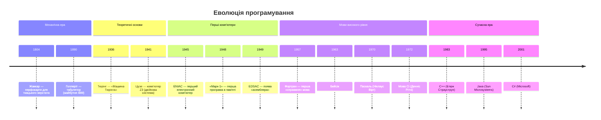
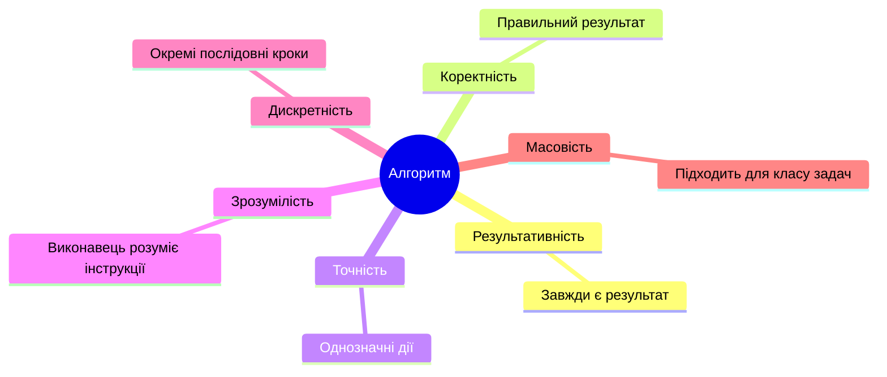
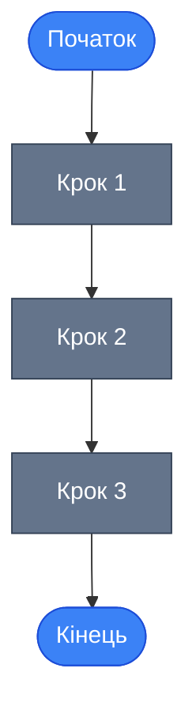
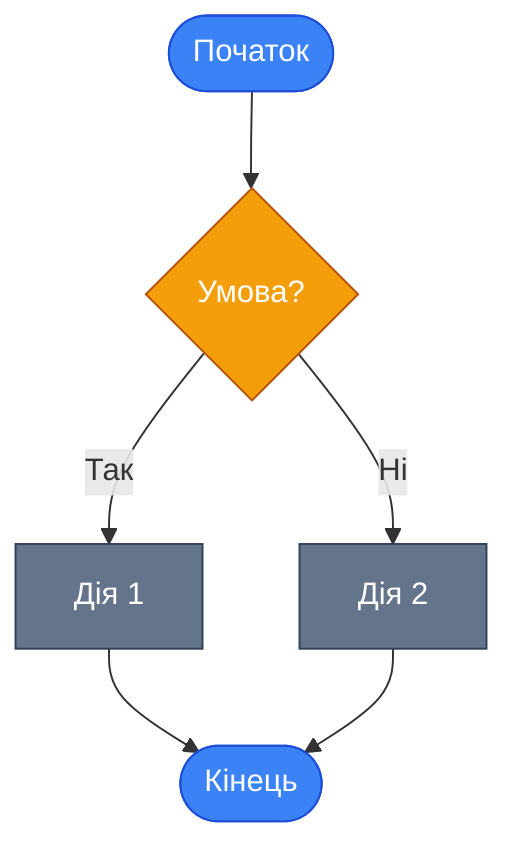
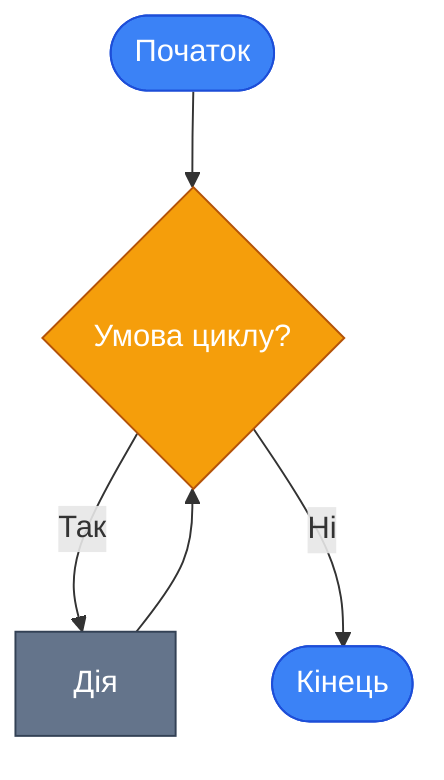
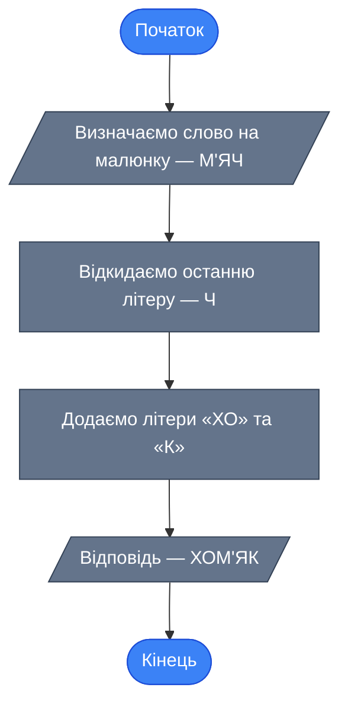
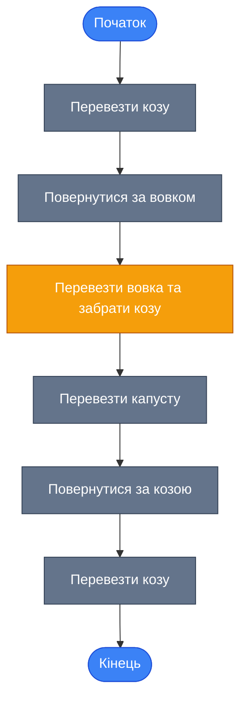
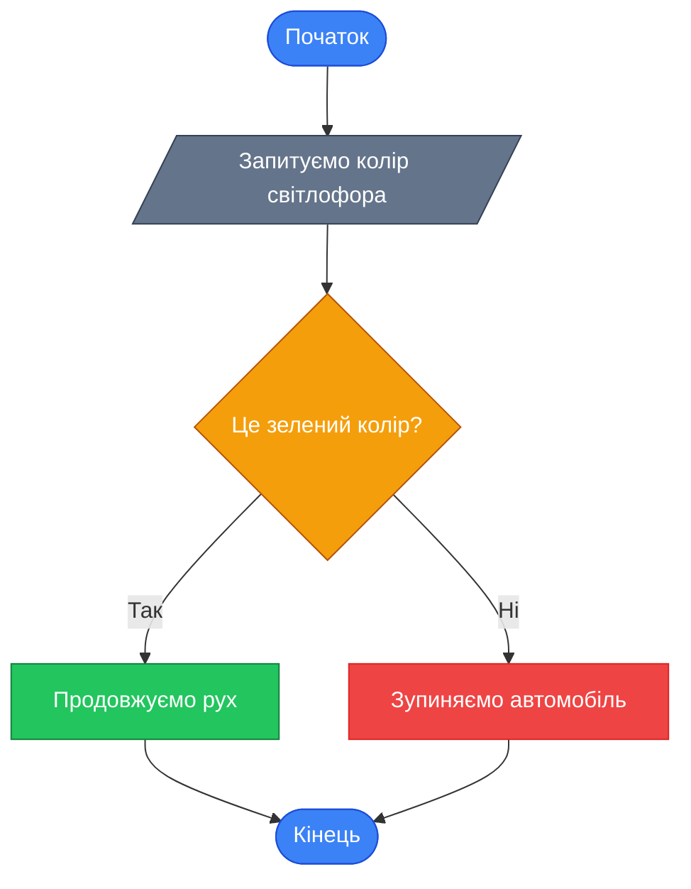

## Навіщо вчити програмування?

Уявіть: ви відкриваєте сайт з вакансіями і бачите, що програмісти — одні з найбільш запитуваних і високооплачуваних спеціалістів. Але чому? Відповідь проста — попит на кваліфікованих програмістів значно перевищує пропозицію. Програмування — це не просто «знання слів якоюсь мовою». Це **спосіб мислення**, вміння розкладати складні задачі на прості кроки та давати комп'ютеру чіткі інструкції.

У цьому розділі ми почнемо з самих основ: зрозуміємо, звідки взялося програмування, що таке алгоритм і як його описати графічно.

::note
**Що ви отримаєте після вивчення цього розділу:**
- Розуміння історії розвитку програмування та мов
- Чітке визначення алгоритму та його властивостей
- Вміння розрізняти типи алгоритмів
- Навички побудови блок-схем

::

## Коротка подорож в історію

Перш ніж писати код, варто знати, як ми дійшли до сучасних мов програмування. Ця подорож — від механічних пристроїв до C++ — допоможе зрозуміти, **чому** мови програмування влаштовані саме так.

::mermaid

::

### Ключові віхи

::card-group

::card{title="🏭 1804 — Перфокарти" icon="i-lucide-cog"}
Жозеф Марі Жаккар створив «програмно-керований» ткацький верстат. Перфокарти визначали візерунок тканини — це був перший приклад **програмного управління** пристроєм.

::

::card{title="🧮 1936 — Машина Тюрінга" icon="i-lucide-brain"}
Алан Тюрінг описав гіпотетичний пристрій, здатний вирішити **будь-яку** математичну задачу. Це — теоретичний прообраз сучасного комп'ютера.

::

::card{title="⚡ 1945 — ENIAC" icon="i-lucide-zap"}
Перший повністю електронний комп'ютер. Для програмування потрібно було **вручну** встановлювати тисячі перемикачів та штекерів.

::

::card{title="🔤 1949 — Асемблер" icon="i-lucide-code"}
Моріс Вілкс запропонував мнемонічні позначення замість числових кодів. Слово **«assembler»** (збирач) з'явилося саме тоді.

::

::card{title="🚀 1972 — Мова Сі" icon="i-lucide-terminal"}
Денніс Рітчі створив мову Сі у Bell Labs. Саме ця мова стала **фундаментом** для C++, Java та C#.

::

::card{title="➕ 1983 — C++" icon="i-lucide-plus-circle"}
Б'ярн Страуструп розширив мову Сі, додавши класи та об'єктно-орієнтоване програмування. Назва «C++» означає «Сі плюс один крок уперед».

::

::

::tip
Зверніть увагу на еволюційний ланцюжок: **Сі → C++ → Java → C#**. Кожна наступна мова будувалася на досвіді попередньої, вирішуючи її обмеження. Тому, вивчаючи C++, ви закладаєте фундамент для розуміння багатьох сучасних мов.

::

## Перше знайомство з алгоритмами

### Що таке алгоритм?

Щодня ми стикаємося з алгоритмами, навіть не усвідомлюючи цього. Ранковий ритуал, рецепт приготування страви, інструкція зі складання меблів — все це алгоритми.

Розглянемо простий приклад — **приготування яєчні**:

::steps

### Увімкнути плиту

### Поставити пательню

### Налити масло

### Розігріти пательню

### Розбити 2 яйця

### Смажити 5 хвилин на повільному вогні

::

При виконанні цієї послідовності ми отримаємо гарячий сніданок. Але що станеться, якщо поміняти місцями кроки 2 і 3 — налити масло, а потім поставити пательню? Масло опиниться на плиті, а не на пательні!

::warning
Порядок дій в алгоритмі має **критичне** значення. Навіть одна переставлена дія може призвести до абсолютно невірного результату — як у програмуванні, так і в реальному житті.

::

> **Алгоритм** (algorithm) — це чітка і строга послідовність дій, яка приводить до потрібного результату.

Уявіть роботу великого заводу з виробництва автомобілів. Потрібний результат — **працюючий** автомобіль, а не брак. Важлива не сама наявність результату, а його **якість**. Невірно написаний алгоритм — як зламаний конвеєр: він виробляє брак.

### Властивості алгоритму

Щоб алгоритм був надійним і працював коректно, він повинен відповідати шести ключовим властивостям:

::card-group

::card{title="🎯 Результативність" icon="i-lucide-target"}
Алгоритм **завжди** має приводити до результату. Якщо ви виконали всі кроки, але нічого не отримали — це поганий алгоритм.

::

::card{title="✅ Коректність" icon="i-lucide-check-circle"}
Результат має бути **правильним**. Готовий сніданок, а не брудна плита. Якщо результат відрізняється від очікуваного — помилка в алгоритмі.

::

::card{title="📏 Точність" icon="i-lucide-ruler"}
Усі дії мають бути описані **однозначно**. «Смажити деякий час» — погано. «Смажити 5 хвилин» — добре. Двозначність неприпустима.

::

::card{title="💡 Зрозумілість" icon="i-lucide-lightbulb"}
Виконавець має **розуміти** всі інструкції. Рецепт іноземною мовою буде марним. У програмуванні ми «спілкуємося» з комп'ютером мовою C++.

::

::card{title="🧩 Дискретність" icon="i-lucide-layout-grid"}
Алгоритм складається з **окремих кроків**. Неможливо виконати все одночасно — спочатку одна дія, потім наступна.

::

::card{title="♻️ Масовість" icon="i-lucide-repeat"}
Алгоритм має підходити для **цілого класу** подібних задач. Рецепт яєчні працює з курячими, перепелиними чи страусиними яйцями — змінюється лише час приготування.

::

::

::mermaid

::

::caution
Порушення **будь-якої** з цих властивостей може призвести до нестабільної системи. Програма, яка працює «через раз» або дає неправильні відповіді, зазвичай побудована на алгоритмі, де одна з властивостей порушена.

::

### Типи алгоритмів

Не всі задачі розв'язуються однаково. Залежно від структури дій, виділяють три основні типи алгоритмів:

::tabs

::tabs-item{label="Лінійний" icon="i-lucide-arrow-down"}

**Лінійний алгоритм** — дії виконуються строго одна за одною, без жодних відхилень.

**Аналогія**: Рецепт з кулінарної книги — ви чітко знаєте, який продукт брати, у якій кількості і що з ним робити.

::mermaid

::

**Приклад**: Обчислити площу прямокутника — зчитати довжину, зчитати ширину, помножити.

::

::tabs-item{label="Розгалужений" icon="i-lucide-git-branch"}

**Розгалужений алгоритм** — виконується вибір одного з декількох можливих шляхів залежно від умови.

**Аналогія**: Ви лежите на дивані. Якщо дощ припинився — йдете гуляти, інакше — дивитесь телевізор. Залежно від погоди, ви можете піти лише **одним** шляхом.

::mermaid

::

**Приклад**: Світлофор — якщо зелений колір — продовжуємо рух, інакше — зупиняємо автомобіль.

::

::tabs-item{label="Циклічний" icon="i-lucide-refresh-cw"}

**Циклічний алгоритм** — повтор одних і тих самих дій, поки виконується певна умова.

**Аналогія**: Садівник заповнює клумбу квітами. Для кожної квітки: викопати ямку → полити → посадити → засипати землею. І так **доти**, доки не засадить усю клумбу.

::mermaid

::

**Приклад**: Друкувати «Привіт» 10 разів — повторювати дію, поки лічильник не досягне 10.

::

::

## Графічний опис алгоритму: блок-схеми

### Навіщо потрібні блок-схеми?

Дослідження показують, що більшість людей — **візуали**. Графічна схема дозволяє швидко зрозуміти суть алгоритму, тоді як текстовий опис може бути заплутаним.

> **Блок-схема** (flowchart) — графічний спосіб опису алгоритму, що складається з функціональних блоків, з'єднаних стрілками.

### Елементи блок-схем

| Елемент | Форма | Призначення | Входи / Виходи |
|:--------|:------|:------------|:----------------|
| **Початок / Кінець** | Овал (скруглений прямокутник) | Позначає початок або завершення алгоритму | Початок — тільки вихід; Кінець — тільки вхід |
| **Дія** | Прямокутник | Обчислення, присвоєння, виконання команди | 1 вхід, 1 вихід |
| **Умова** | Ромб | Перевірка умови (розгалуження) | 1 вхід, **2 виходи** (Так / Ні) |
| **Ввід / Вивід** | Паралелограм | Введення або виведення даних | 1 вхід, 1 вихід |
| **Цикл** | Шестикутник | Початок або кінець циклу | 1 вхід, 1 вихід |

::note
**Правила побудови блок-схем:**
- Схема будується **зверху вниз**
- Блок «Початок» розміщується тільки **один раз** на початку
- Блок «Кінець» розміщується тільки **один раз** у кінці
- Виходи блоку «Умова» обов'язково підписуються: `Так / Ні`, `+ / -` або `true / false`

::

### Приклад: Розгадування ребуса

Побудуємо блок-схему для простого алгоритму — розгадування ребуса, де з малюнка м'яча потрібно отримати слово «хом'як»:

::mermaid

::

Це приклад **лінійного** алгоритму — всі дії виконуються послідовно.

### Приклад: Вовк, Коза і Капуста

Класична головоломка: фермер має перевезти вовка, козу та капусту через річку. У човні лише два місця (одне для фермера). На березі не можна залишити козу з капустою або вовка з козою.

::mermaid

::

::tip
Зверніть увагу на крок «Перевезти вовка **та забрати козу**» (виділений жовтим). Це ключовий хід — без нього вовк з'їв би козу на протилежному березі. При побудові алгоритму **кожен крок** потрібно аналізувати з точки зору його впливу на весь алгоритм.

::

### Приклад: Світлофор (розгалужений алгоритм)

Автомобіль рухається дорогою. Водій бачить світлофор. Потрібно визначити дії водія залежно від кольору:

::mermaid

::

У цьому прикладі:
- **Вхідні дані** — колір світлофора
- **Вихідні дані** — одна з двох дій (продовження руху або зупинка)
- Блок **«Умова»** (ромб) має два виходи — і саме тут алгоритм **розгалужується**

## Практичні завдання

### Рівень 1 — Базовий

::collapsible{title="Завдання 1.1: Визначте тип алгоритму"}
Для кожного з описаних сценаріїв визначте тип алгоритму (лінійний, розгалужений, циклічний):

1. Зварити каву: налити воду → засипати каву → увімкнути кавоварку → дочекатися готовності
2. Перевірити парольноякщо пароль правильний — дозволити вхід, інакше — показати помилку
3. Роздрукувати 100 примірників документа — повторювати друк, поки лічильник не досягне 100

::

::collapsible{title="Завдання 1.2: Знайдіть помилку у властивостях"}
Наведено алгоритм «Приготування чаю»:

1. Увімкнути плиту
2. Поставити чайник
3. Дочекатися кипіння
4. Налити воду в чашку
5. Покласти щось

Крок 5 порушує одну з властивостей алгоритму. Яку саме? Обґрунтуйте та виправте його.

::

### Рівень 2 — Логічний

::collapsible{title="Завдання 2.1: Побудуйте блок-схему"}
Побудуйте блок-схему для наступного алгоритму:

**Задача**: Вам потрібно визначити, чи може людина кататися на атракціоні. Вхідні дані — зріст людини. Якщо зріст ≥ 120 см — кататися можна, інакше — ні.

Вкажіть:
- Вхідні дані
- Блок умови
- Два можливі результати

::

::collapsible{title="Завдання 2.2: Визначте послідовність"}
Фермер має виконати ранкові справи в правильному порядку:
- Покормити тварин
- Прибрати стайню
- Подоїти корову
- Відвезти молоко на ринок

Але є обмеження: **подоїти корову можна тільки після того, як вона поїсть**, а **відвезти молоко — тільки після доїння**.

Запишіть правильну послідовність та побудуйте блок-схему.

::

### Рівень 3 — Творчий

::collapsible{title="Завдання 3.1: Алгоритм для банкомату"}
Розробіть розгалужений алгоритм роботи банкомату:

1. Користувач вставляє картку
2. Вводить PIN-код
3. Якщо PIN правильний — показати меню, інакше — повідомити про помилку (максимум 3 спроби)
4. Користувач обирає «Зняти готівку»
5. Вводить суму
6. Якщо на рахунку достатньо коштів — видати гроші, інакше — повідомити про нестачу

Побудуйте блок-схему для цього алгоритму. Зверніть увагу: тут є і **розгалуження**, і **цикл** (повторне введення PIN).

::

## Підсумок

::card-group

::card{title="📌 Алгоритм" icon="i-lucide-list-ordered"}
Чітка послідовність дій для досягнення результату. Має 6 обов'язкових властивостей: результативність, коректність, точність, зрозумілість, дискретність, масовість.

::

::card{title="📌 Три типи" icon="i-lucide-git-branch"}
**Лінійний** — крок за кроком. **Розгалужений** — вибір шляху за умовою. **Циклічний** — повтор дій.

::

::card{title="📌 Блок-схема" icon="i-lucide-workflow"}
Графічний спосіб описати алгоритм. Овал — початок/кінець, прямокутник — дія, ромб — умова, паралелограм — ввід/вивід.

::

::
