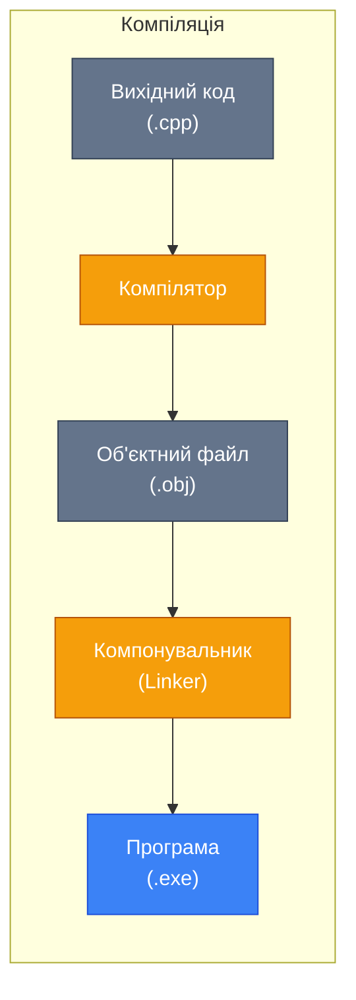

## Від алгоритму до програми

У попередньому розділі ми навчилися описувати алгоритми словами та блок-схемами. Але комп'ютер не розуміє ні слів, ні малюнків — він «говорить» лише мовою **машинних кодів**. Ось як виглядає програма «Hello, World!» на «рідній» мові комп'ютера:

```
_YН¦ў+._5lЧ№+f-Н¦ў+ +f+ ¤д-ы+fО_fО¦¤+эm№¤+¤+¦Ф№+¤-;
wGГ=xФ№+MZР + @ А -¦ ¦ -!+ L-!Tu ._5lЧ№+f-
```

Писати в такому коді — неможливо. Саме тому існують **мови програмування** — вони дозволяють писати інструкції зрозумілою для людини мовою, а потім **перекладати** їх на машинний код.

::note
C++ — це **компільована мова програмування**. Це означає, що ваш код спочатку перекладається (компілюється) у машинний код, а потім виконується комп'ютером. Але існує й інший підхід — **інтерпретація**. Давайте розберемо різницю.

::

## Компіляція vs Інтерпретація

Мови програмування поділяються на дві основні групи за способом перекладу коду в машинну мову.

::tabs

::tabs-item{label="🔄 Інтерпретація" icon="i-lucide-repeat"}

**Інтерпретатор** (interpreter) перекладає код **під час виконання**, рядок за рядком:

1. Зчитує перший рядок коду
2. Перевіряє на помилки
3. Якщо помилок немає — переводить у машинний код і виконує
4. Переходить до наступного рядка
5. Якщо знайдена помилка — **зупиняється** і повідомляє про неї

**Особливості:**
- Машинна версія коду **ніде не зберігається**
- При **кожному** запуску програми інтерпретатор знову перевіряє весь код
- Швидкість запуску **нижча**, бо кожен раз відбувається перевірка

**Приклади мов:** Python, JavaScript, PHP

::

::tabs-item{label="⚙️ Компіляція" icon="i-lucide-cog"}

**Компілятор** (compiler) перекладає **весь код одразу**, до запуску програми:

1. Перевіряє **весь** код від початку до кінця
2. Якщо є помилки — видає **список усіх** помилок (не зупиняється на першій)
3. Якщо помилок немає — створює **об'єктний файл** (`.obj`)
4. **Компонувальник** (linker) збирає об'єктний файл у **виконуваний файл** (`.exe`)
5. Файл `.exe` запускається **без участі компілятора**

**Особливості:**
- Результат компіляції **зберігається** як `.exe` файл
- Наступні запуски відбуваються **миттєво** (без повторної компіляції)
- Усі помилки показуються **одразу**, а не по одній

**Приклади мов:** C, C++, C#, Go, Rust

::

::

::mermaid



::

::tip
**Перевага компіляції для C++**: Скомпільована програма працює **значно швидше**, ніж інтерпретована, тому що машинний код виконується напряму процесором без посередника. Саме тому C++ використовують для ігор, операційних систем та інших програм, де швидкість критична.

::

## Що таке IDE?

**IDE** (Integrated Development Environment — інтегроване середовище розробки) — це програма, яка об'єднує всі необхідні інструменти для розробки в одному місці:

::card-group

::card{title="📝 Текстовий редактор" icon="i-lucide-file-text"}
Підсвічування синтаксису, автодоповнення, форматування коду.

::

::card{title="⚙️ Компілятор" icon="i-lucide-cog"}
Перетворює ваш код у машинну мову.

::

::card{title="🐛 Відладчик (Debugger)" icon="i-lucide-bug"}
Дозволяє знаходити та виправляти помилки, виконуючи програму крок за кроком.

::

::card{title="📁 Менеджер проєктів" icon="i-lucide-folder-open"}
Організація файлів, налаштування збірки, управління залежностями.

::

::

### Microsoft Visual Studio

Для вивчення C++ ми використовуватимемо **Microsoft Visual Studio** — один з найпотужніших IDE у світі. Історія Visual Studio почалася в 1997 році, і з тих пір він залишається стандартом індустрії.

**Редакції Visual Studio:**

| Редакція | Ціна | Призначення |
|:---------|:-----|:------------|
| **Community** | Безкоштовна | Навчання, особисті проєкти, невеликі команди |
| **Professional** | Платна | Професійна розробка |
| **Enterprise** | Платна | Корпоративні проєкти, розширені інструменти |

::tip
Для навчання повністю достатньо **Visual Studio Community** — вона безкоштовна і включає все необхідне для розробки на C++.

::

::warning
**Рекомендація**: Обирайте **англійську** мову інтерфейсу Visual Studio. Це допоможе:
1. Розширити професійний словниковий запас
2. Уникнути проблем при перенесенні проєктів
3. Адаптуватися до міжнародних команд розробників

::

## Створення першого проєкту

Настав час написати свою першу програму! Один із засновників мови Сі, Браян Керніган, сказав:

> *«Єдиний спосіб вивчати нову мову програмування — писати на ній програми.»*

Традиційно, перша програма на будь-якій мові — це **«Hello, World!»** (Привіт, Світе!). Давайте створимо її.

::steps

### Запуск Visual Studio

Відкрийте Visual Studio через меню «Пуск» або ярлик на робочому столі. Ви побачите стартове вікно.

### Створення нового проєкту

Виберіть :kbd{value=File} → :kbd{value=New} → :kbd{value=Project}. У діалоговому вікні:
- Оберіть мову **C++**
- Тип проєкту — **Windows Desktop Wizard** (або **Empty Project**)
- Натисніть **Next**

### Налаштування проєкту

- **Project name** — введіть назву, наприклад, `HelloWorld`
- **Location** — оберіть папку для збереження
- **Solution name** — залиште таке саме ім'я
- Натисніть **Create**

### Налаштування типу проєкту

У вікні налаштувань:
- Тип проєкту — **Console Application**
- Встановіть прапорець **Empty Project** (порожній проєкт)
- Натисніть **OK**

### Додавання файлу коду

У вікні **Solution Explorer** (:kbd{value=Ctrl} + :kbd{value=Alt} + :kbd{value=L}):\n
- Натисніть правою кнопкою на папці **Source Files**
- Оберіть **Add** → **New Item...**
- Виберіть **C++ File (.cpp)**
- Назвіть файл `Hello`
- Натисніть **Add**

### Написання коду

У текстовій області, що з'явилася, введіть код вашої першої програми (див. наступний розділ).

::

## Анатомія програми «Hello, World!»

Ось повний код першої програми:

```cpp [Hello.cpp] showLineNumbers
#include <iostream>

using namespace std;

int main()
{
    cout << "Hello, World!\n";
    return 0;
}
```

Давайте розберемо **кожен рядок** — у програмуванні не повинно бути «магії»:

### Рядок 1: `#include <iostream>`

```cpp
#include <iostream>
```

**Що робить**: Підключає **бібліотеку** (library) під назвою `iostream` до нашої програми.

**Навіщо**: Бібліотека — це файл, у якому містяться описи функцій, реалізованих іншими програмістами. Бібліотека `iostream` (input/output stream — потік введення/виведення) містить інструменти для виведення тексту на екран (`cout`) та зчитування даних з клавіатури (`cin`). Без цього рядка компілятор **не зрозуміє**, що таке `cout`.

::note
**Аналогія**: Уявіть, що ви збираєте меблі. `#include <iostream>` — це як відкрити набір інструментів. Без нього у вас не буде ні викрутки, ні ключів.

::

### Рядок 3: `using namespace std;`

```cpp
using namespace std;
```

**Що робить**: Підключає **простір імен** (namespace) під назвою `std` (standard — стандартний).

**Навіщо**: У C++ є поняття «простір імен» — це область, де визначені певні команди. Команда `cout` знаходиться в просторі `std`. Без цього рядка довелося б щоразу писати `std::cout` замість просто `cout`.

### Рядок 5: `int main()`

```cpp
int main()
```

**Що робить**: Визначає **головну функцію** програми — точку входу (entry point).

**Навіщо**: Кожна програма на C++ **обов'язково** має містити функцію з ім'ям `main()`. Саме з цієї функції починається виконання. Слово `int` означає, що функція повертає ціле число (integer).

### Рядки 6 і 9: `{` та `}`

```cpp
{
    // Код програми
}
```

**Що робить**: Фігурні дужки визначають **тіло функції** — блок коду, що належить функції `main`.

### Рядок 7: `cout << "Hello, World!\n";`

```cpp
cout << "Hello, World!\n";
```

**Що робить**: Виводить текст `Hello, World!` на екран і переходить на новий рядок.

- `cout` — команда виводу (console output)
- `<<` — оператор направлення (направляємо дані в потік виводу)
- `"Hello, World!\n"` — текстовий рядок у подвійних лапках
- `\n` — спеціальний символ «перехід на новий рядок»
- `;` — крапка з комою, **обов'язковий** завершувач кожної команди в C++

### Рядок 8: `return 0;`

```cpp
return 0;
```

**Що робить**: Повертає значення `0` операційній системі.

**Навіщо**: Це сигнал, що програма завершилася **успішно**, без помилок. Якби були помилки, можна було б повернути інше число.

## Компіляція та запуск

Після написання коду потрібно його скомпілювати та запустити:

::steps

### Компіляція

У меню виберіть :kbd{value=Build} → :kbd{value=Rebuild Solution}. Компілятор перевірить ваш код і створить виконуваний файл.

### Запуск

У меню виберіть :kbd{value=Debug} → :kbd{value=Start Without Debugging} (або натисніть :kbd{value=Ctrl} + :kbd{value=F5}).

### Результат

Відкриється консольне вікно з текстом:

```
Hello, World!
Press any key to continue...
```

Натисніть будь-яку клавішу, щоб закрити вікно.

::

::caution
**Типові помилки початківців:**
- Забули `;` (крапку з комою) в кінці команди
- Забули підключити `#include <iostream>`
- Написали `Main` замість `main` (C++ **чутливий до регістру**!)
- Забули фігурні дужки `{ }`

::

## Коментарі в C++

Коментарі — це замітки до програми, призначені **виключно для програміста**. Компілятор їх повністю ігнорує.

::code-group

```cpp [Однорядковий коментар]
// Це коментар до кінця рядка
int age = 25; // Вік користувача
```

```cpp [Багаторядковий коментар]
/* Це багаторядковий коментар.
   Він може займати будь-яку
   кількість рядків. */
int height = 180;
```

::

::tip
**Навіщо коментувати код?**
- Пояснити складну логіку
- Залишити нотатки для себе або колег
- Тимчасово «вимкнути» частину коду під час відладки

Добрий коментар пояснює **чому**, а не **що**. Наприклад:
- ❌ `// Присвоюємо 25 змінній age` — очевидно з коду
- ✅ `// Вік за замовчуванням для нових користувачів` — пояснює *навіщо*

::

## Збереження та відкриття проєкту

Щоб відкрити раніше збережений проєкт:
1. Запустіть Visual Studio
2. Виберіть :kbd{value=File} → :kbd{value=Open} → :kbd{value=Project/Solution}
3. Знайдіть файл вашого проєкту (`.sln`)
4. Відкрийте та продовжуйте роботу

## Правила, які потрібно запам'ятати

::card-group

::card{title="📚 Бібліотека" icon="i-lucide-book-open"}
Якщо програма виводить дані на екран, на початку має бути `#include <iostream>` та `using namespace std;`

::

::card{title="🚀 Функція main()" icon="i-lucide-play"}
Кожна програма **обов'язково** має містити функцію `main()`. Виконання починається звідси.

::

::card{title="📐 Фігурні дужки" icon="i-lucide-braces"}
Команди функції `main()` знаходяться всередині фігурних дужок `{ }`.

::

::card{title="⚡ Крапка з комою" icon="i-lucide-alert-circle"}
Кожна команда **обов'язково** закінчується символом `;` (крапка з комою).

::

::

## Практичні завдання

### Рівень 1 — Базовий

::collapsible{title="Завдання 1.1: Виправте помилки"}
У наведеному коді є **4 помилки**. Знайдіть та виправте їх:

```cpp
#include <iostream>

using namespace std

int Main()
{
    cout << "Hello, C++!\n"
    return 0;
}
```

::

::collapsible{title="Завдання 1.2: Напишіть свою програму"}
Створіть програму, яка виводить на екран ваше ім'я, місто та улюблену мову програмування. Кожен пункт — на окремому рядку.

Очікуваний результат (приклад):
```
Name: Alex
City: Kyiv
Favorite language: C++
```

::

### Рівень 2 — Логічний

::collapsible{title="Завдання 2.1: Додайте коментарі"}
Перепишіть програму «Hello, World!» і додайте коментарі до **кожного** рядка, пояснюючи, що він робить. Використовуйте обидва типи коментарів.

::

::collapsible{title="Завдання 2.2: Побудуйте блок-схему компіляції"}
Намалюйте блок-схему, яка описує процес створення виконуваного файлу `.exe` з вихідного коду `.cpp`. Включіть етапи: написання коду → компіляція → перевірка помилок → створення `.obj` → компоновка → `.exe`.

::

### Рівень 3 — Творчий

::collapsible{title="Завдання 3.1: Візитка-програма"}
Створіть консольну програму, яка виводить красиво оформлену «візитку»:

```
=============================
|   Student Card            |
|   Name: [Ваше ім'я]      |
|   Group: [Ваша група]    |
|   Year: 2026              |
=============================
```

Використовуйте символи `=`, `|` та пробіли для створення рамки.

::

## Підсумок

::card-group

::card{title="📌 Компіляція" icon="i-lucide-cog"}
C++ — компільована мова. Компілятор перетворює весь код у машинну мову **до запуску**. Результат — файл `.exe`, який працює без компілятора.

::

::card{title="📌 IDE" icon="i-lucide-monitor"}
Visual Studio — інтегроване середовище розробки, що поєднує редактор коду, компілятор та відладчик.

::

::card{title="📌 Структура програми" icon="i-lucide-file-code"}
Мінімальна програма: `#include <iostream>` → `using namespace std;` → `int main()` → `{ код; return 0; }`

::

::
