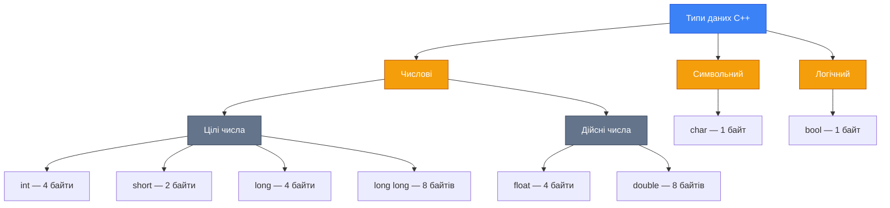

## Навіщо потрібні типи даних?

Ви вже вмієте виводити текст на екран. Але програми існують не лише для показу надписів — вони **обробляють дані**: рахують зарплати, аналізують інформацію, конвертують одиниці виміру. Для цього дані потрібно десь **зберігати**.

Уявіть, що оперативна пам'ять комп'ютера — це величезна шафа з ящиками різних розмірів. Перш ніж покласти щось у ящик, ви повинні вибрати **правильний розмір**: ви ж не будете наливати молоко в сірникову коробку або ховати велосипед у шухляду.

> **Тип даних** (data type) — поняття, що визначає максимальний розмір (у байтах) та вид інформації, яка буде зберігатися.

::note
C++ є **строго типізованою** мовою. Це означає, що для кожної змінної потрібно чітко вказати її тип. Компілятор перевірить, чи ви не намагаєтесь покласти «велосипед у шухляду».

::

## Класифікація типів даних

Усі базові типи в C++ можна розділити на три групи:

::mermaid



::

## Числові типи

### Цілі числа (integer types)

Цілі числа — це числа без дробової частини: вік, кількість, рік, номер кімнати тощо.

| Тип | Розмір | Діапазон значень | Приклад використання |
|:----|:-------|:-----------------|:---------------------|
| `short` | 2 байти | від -32 768 до 32 767 | Короткі лічильники |
| `int` | 4 байти | від -2 147 483 648 до 2 147 483 647 | Вік, кількість, більшість цілих чисел |
| `long` | 4 байти | від -2 147 483 648 до 2 147 483 647 | Аналогічно `int` (на більшості платформ) |
| `long long` | 8 байтів | від -9 223 372 036 854 775 808 до 9 223 372 036 854 775 807 | Дуже великі числа (населення планети) |

::tip
**Який тип обрати?** У більшості випадків використовуйте **`int`** — це стандартний тип для цілих чисел. `short` — якщо потрібна економія пам'яті, `long long` — якщо число може перевищити 2 мільярди.

::

### Дійсні числа (floating-point types)

Дійсні числа — це числа з дробовою частиною: температура, вага, відстань, ціна тощо.

::warning
**Важливо**: В C++ для відокремлення дробової частини використовується **точка**, а не кома! Наприклад, `7.8`, а не `7,8`.

::

| Тип | Розмір | Точність | Приклад використання |
|:----|:-------|:---------|:---------------------|
| `float` | 4 байти | ~7 значущих цифр (одинарна точність) | Швидкі обчислення, графіка |
| `double` | 8 байтів | ~15 значущих цифр (подвійна точність) | Наукові обчислення, фінанси |

**Що таке «точність»?** Це кількість значущих цифр, які тип може зберегти. Наприклад, `float` зберігає приблизно 7 цифр: число `123456789.0` буде збережено як `123456792.0` — останні цифри «загубляться».

### Експоненційний запис

Для дуже великих або дуже малих чисел використовують **експоненційну форму**:

```cpp
double weightAtom = 2.5194e+017;
// Це означає: 2.5194 × 10^17 = 251 940 000 000 000 000
```

| Запис | Розшифровка | Звичайний вигляд |
|:------|:------------|:-----------------|
| `3.4E-008` | 3.4 × 10⁻⁸ | 0.000000034 |
| `-1.5E+003` | -1.5 × 10³ | -1500 |
| `2.5e+017` | 2.5 × 10¹⁷ | 250 000 000 000 000 000 |

## Символьний тип

| Тип | Розмір | Призначення |
|:----|:-------|:------------|
| `char` | 1 байт | Зберігання **одного** символу |

```cpp
char symbol = 'A';  // Один символ — в одинарних лапках!
```

::caution
**Одинарні лапки `' '`** — для **одного** символу (`char`).
**Подвійні лапки `" "`** — для **рядка** тексту (набору символів).

```cpp
char letter = 'A';            // ✅ Один символ
cout << "Hello";              // ✅ Рядок тексту
char wrong = "A";             // ❌ Помилка! Подвійні лапки для char
```

::

Escape-послідовність трактується компілятором як **один символ** і може бути записана в змінну типу `char`:

```cpp
const char NEW_LINE = '\n';
cout << NEW_LINE; // Виведе порожній рядок
```

## Логічний тип

| Тип | Розмір | Можливі значення |
|:----|:-------|:-----------------|
| `bool` | 1 байт | `true` (істина) або `false` (хибність) |

```cpp
bool isStudent = true;
bool hasDiploma = false;
```

Логічний тип використовується для зберігання результатів перевірок та умов. Детальніше ви познайомитеся з ним, коли вивчите розгалуження та цикли.

## Змінні та константи

Тепер, коли ви знаєте, які бувають «ящики» (типи даних), розберемося, як їх створювати та використовувати.

::tabs

::tabs-item{label="📦 Змінна" icon="i-lucide-box"}

> **Змінна** (variable) — область оперативної пам'яті, що має власне ім'я і призначена для зберігання даних, які **можуть бути змінені**.

**Аналогія**: Змінна — як рюкзак з биркою. Ви можете покласти в нього книгу, а потім замінити книгу на ноутбук. Бирка (ім'я) залишається тією самою, а вміст змінюється.

Приклад: ваш **вік** — змінна. Сьогодні комусь 26, а через рік буде 27.

::

::tabs-item{label="🔒 Константа" icon="i-lucide-lock"}

> **Константа** (constant) — область оперативної пам'яті, що має власне ім'я і призначена для зберігання **постійних** даних. Її значення неможливо змінити після створення.

**Аналогія**: Константа — як табличка на двері з номером кімнати. Номер визначається один раз і ніколи не міняється.

Приклад: кількість **днів у тижні** — 7, кількість **місяців у році** — 12. Ці значення не змінюються.

::

::

### Оголошення змінних

Існує два способи створити змінну:

```cpp
// Спосіб 1: Оголошення без початкового значення
int age;         // Створили змінну, але всередині — випадкове число!

// Спосіб 2: Оголошення з ініціалізацією (рекомендовано)
int age = 25;    // Створили змінну і одразу задали значення
```

::warning
**Важливо**: Якщо ви оголосите змінну без ініціалізації (`int age;`), у ній буде **випадкове число**, яке визначається операційною системою. Завжди ініціалізуйте змінні при створенні!

::

### Оголошення констант

```cpp
const int DAYS_IN_WEEK = 7;
```

- `const` — ключове слово, що робить значення **незмінним**
- `int` — тип даних
- `DAYS_IN_WEEK` — ім'я константи
- `= 7` — значення

::caution
Константа **обов'язково** має бути ініціалізована при створенні. Змінити її значення пізніше — **неможливо**.

```cpp
const int PI = 3;
PI = 4;  // ❌ Помилка! Неможливо змінити константу
```

::

### Оператор присвоєння

Знак `=` у C++ — це **оператор присвоєння** (assignment operator). Він записує значення з правого боку в змінну зліва:

```cpp
int age;
age = 34;    // Змінній age ПРИСВОЇТИ значення 34
```

Зверніть увагу: це **не рівняння** з математики! Зліва — куди записати, справа — що записати.

### Вивід змінних на екран

```cpp
// Вивід значення змінної (без лапок!)
cout << age;

// Вивід кількох змінних
cout << age << height;

// Комбінування тексту та змінних
cout << "Вік: " << age << ", Зріст: " << height << "\n";
```

::note
Зверніть увагу: ім'я змінної пишеться **без лапок**. Якщо ви напишете `cout << "age"`, на екрані з'явиться текст `age`, а не значення змінної.

::

## Правила іменування

Ім'я змінної (ідентифікатор) — це бирка, за якою ви знаходите дані в пам'яті. Є **обов'язкові правила**, яких неможливо порушити:

::card-group

::card{title="🔤 Тільки латиниця" icon="i-lucide-type"}
Великі та малі літери латинського алфавіту. C++ **чутливий до регістру**: `age` та `Age` — це **дві різні** змінні.

::

::card{title="🔢 Цифри, але не першим" icon="i-lucide-hash"}
Цифри дозволені, але **не на початку** імені. `name1` — допустимо, `1name` — **ні**.

::

::card{title="➖ Знак підкреслення" icon="i-lucide-minus"}
Символ `_` використовується замість пробілу: `ageOfMan` або `age_of_man` замість `Age of Man`. Пробіли в іменах **заборонені**.

::

::card{title="🚫 Не ключові слова" icon="i-lucide-ban"}
Не можна називати змінну ключовими словами мови: `int`, `float`, `return`, `if` тощо. Visual Studio підсвічує їх синім кольором.

::

::card{title="⚠️ Унікальні імена" icon="i-lucide-alert-triangle"}
Небажано мати дві змінні з **однаковими іменами** в одній області видимості.

::

::card{title="💡 Інтуїтивні назви" icon="i-lucide-lightbulb"}
Ім'я має пояснювати **призначення**: `studentAge` зрозуміліше, ніж `x` або `a1`.

::

::

::tip
**Порівняйте читабельність:**
- ❌ `int a = 34;` — що таке `a`? Незрозуміло.
- ❌ `int ageofman = 34;` — важко читати.
- ✅ `int ageOfMan = 34;` — зрозуміло та зручно (camelCase).

::

## Практичний приклад: Скільки годин у 2000 році?

Розробимо програму, що обчислює кількість годин у 2000 році (366 днів × 24 години).

**Алгоритм:**
1. Оголосити константи: кількість днів та годин у добі
2. Обчислити результат
3. Вивести на екран

```cpp [HoursInYear.cpp] showLineNumbers
#include <iostream>

using namespace std;

int main()
{
    // Оголошуємо константи
    const int DAYS_IN_2000 = 366;
    const int HOURS_IN_DAY = 24;

    // Оголошуємо змінну для результату
    int hoursInYear;

    // Обчислюємо
    hoursInYear = DAYS_IN_2000 * HOURS_IN_DAY;

    // Виводимо результат
    cout << "\t\t In 2000 year " << hoursInYear;
    cout << " hours\n";

    return 0;
}
```

Розберемо ключові рядки:

- **Рядок 8–9**: Створюємо константи — значення, що не зміняться в програмі. Оператор `*` — знак множення в C++ (комбінація :kbd{value=Shift} + :kbd{value=8})
- **Рядок 12**: Оголошуємо змінну без початкового значення — ми заповнимо її на наступному кроці
- **Рядок 15**: Обчислюємо: `366 × 24 = 8784` та зберігаємо результат в `hoursInYear`
- **Рядок 18**: Виводимо **текст** в лапках та **значення змінної** без лапок

**Результат:**
```
         In 2000 year 8784 hours
```

## Практичний приклад: Розрахунок покупки

Напишемо програму, яка обчислює вартість покупки зі знижкою.

```cpp [Purchase.cpp] showLineNumbers
#include <iostream>

using namespace std;

int main()
{
    // Оголошуємо змінні
    float discount = 0.05;    // Знижка 5%
    float cost = 10.50;       // Ціна одиниці товару
    int count = 5;            // Кількість
    float price;              // Підсумкова вартість

    // Обчислюємо вартість зі знижкою
    price = count * cost - count * cost * discount;

    // Виводимо результат
    cout << "Please, pay: " << price << "\n";

    return 0;
}
```

- **Рядок 8**: `float` — використовуємо тип з рухомою точкою, бо знижка — дробове число
- **Рядок 10**: `int` — кількість товару завжди ціле число
- **Рядок 14**: Формула: `повна_вартість - знижка`, де знижка = `кількість × ціна × відсоток`

**Результат:**
```
Please, pay: 49.875
```

## Символьні та логічні змінні

```cpp
// Логічна змінна
bool flag;
flag = true;

// Символьна змінна — один символ у одинарних лапках
char symbol = 'A';

// Escape-послідовність як символ
const char NEW_LINE = '\n';
cout << NEW_LINE; // Виведе порожній рядок
```

## Літерали

**Літерали** (literals) — це фіксовані значення, записані безпосередньо в коді програми. На відміну від змінних, літерали **не мають імені** і **не можуть бути змінені**.

| Літерал | Тип | Пояснення |
|:--------|:----|:----------|
| `5` | `int` | Цілочисельний літерал |
| `5l` або `5L` | `long` | Суфікс `l`/`L` означає `long` |
| `true` / `false` | `bool` | Логічні літерали |
| `5.0` | `double` | Дійсний літерал (за замовчуванням `double`) |
| `5.0f` або `5.0F` | `float` | Суфікс `f`/`F` означає `float` |
| `0.3e-2` | `double` | Експоненційна форма |
| `'d'` | `char` | Символьний літерал |
| `"Visual"` | рядок | Рядковий літерал |

```cpp
cout << "abrakadabra" << '\n';  // "abrakadabra" — рядковий, '\n' — символьний
int a = 2;                       // 2 — літерал типу int
float pi = 3.14f;               // 3.14f — літерал типу float
```

::note
Рядковий літерал — це набір символів у подвійних лапках. Компілятор **не обробляє** його вміст як команди, навіть якщо всередині є ключові слова: `"int return void"` — це просто текст.

::

## Чутливість до регістру

::caution
**Критично важливо**: C++ **чутливий до регістру** (case-sensitive). Великі та малі літери — це різні символи!

```cpp
int age = 25;   // ✅ Правильно
int Age = 30;   // ✅ Це ІНША змінна!
int AGE = 35;   // ✅ І це теж інша змінна!

int number;     // ✅ Тип int — з малої літери
int Number;     // ✅ Змінна Number
Int number2;    // ❌ ПОМИЛКА! "Int" — не існує, правильно "int"
```

Запам'ятайте: `int`, `float`, `double`, `char`, `bool` — усі ключові слова пишуться **малими літерами**.

::

## Практичні завдання

### Рівень 1 — Базовий

::collapsible{title="Завдання 1.1: Визначте типи"}
Для кожного значення визначте найбільш підходящий тип даних C++:

1. Кількість студентів у групі — 28
2. Температура повітря — 36.6
3. Перша літера імені — 'A'
4. Чи є людина студентом — так
5. Населення Землі — 8 000 000 000
6. Ціна товару — 99.99

::

::collapsible{title="Завдання 1.2: Виправте помилки оголошення"}
Знайдіть та виправте помилки в наступних оголошеннях:

```cpp
int 1number = 10;
float my value = 3.14;
const int MAX;
Int count = 5;
char letter = "B";
```

::

### Рівень 2 — Логічний

::collapsible{title="Завдання 2.1: Діагональ телевізора"}
Дана діагональ телевізора в дюймах. Написати програму, що визначає діагональ у сантиметрах (1 дюйм = 2.54 см).

**Приклад:**
- Вхідні дані: діагональ 42 дюйми
- Вихідні дані: діагональ 106.68 см

Використовуйте константу для коефіцієнта перетворення.

::

::collapsible{title="Завдання 2.2: Повербанк"}
Ємність акумулятора смартфона становить N мАг. Написати програму, що визначає мінімальну ємність повербанка, якщо необхідно забезпечити 3 повних заряди.

**Приклад:**
- Вхідні дані: ємність акумулятора 3000 мАг
- Вихідні дані: мінімальна ємність повербанка 9000 мАг

::

### Рівень 3 — Творчий

::collapsible{title="Завдання 3.1: Калькулятор часу"}
Створіть програму, яка переводить задану кількість секунд у формат «години:хвилини:секунди».

**Підказка**: Використовуйте оператори ділення `/` та остачі від ділення `%`.

**Приклад:**
- Вхідні дані: 3661 секунда
- Вихідні дані: 1 год 1 хв 1 сек

::

## Підсумок

::card-group

::card{title="📌 Типи даних" icon="i-lucide-database"}
`int` — цілі числа, `float`/`double` — дійсні, `char` — один символ, `bool` — логічне значення. Тип визначає розмір пам'яті та допустимі операції.

::

::card{title="📌 Змінні та константи" icon="i-lucide-box"}
Змінна — значення може змінюватися. Константа (`const`) — фіксоване значення, задане при створенні. Завжди ініціалізуйте змінні!

::

::card{title="📌 Правила іменування" icon="i-lucide-tag"}
Тільки латиниця, цифри (не першим символом) та `_`. Ключові слова заборонені. C++ чутливий до регістру.

::

::
