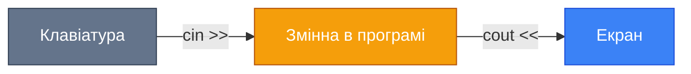
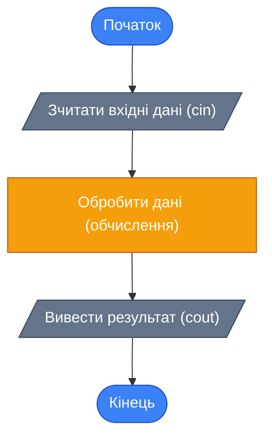

## Від виводу до діалогу

До цього моменту наші програми були «монологом» — вони лише виводили заготовлені дані на екран. Але більшість реальних програм — це **діалог** з користувачем. Калькулятор запитує числа, пошукова система — запит, магазин — кількість товару. Щоб програма стала інтерактивною, їй потрібен механізм **введення** даних.

## Оператор `cin`

Так само, як `cout <<` виводить дані **з** програми **на** екран, оператор `cin >>` зчитує дані **з** клавіатури **в** програму. Зверніть увагу на напрямок стрілок:

::mermaid



::

- `cout <<` — **виведення** (console output) — стрілки вказують **від** програми
- `cin >>` — **введення** (console input) — стрілки вказують **до** програми

### Синтаксис

```cpp
cin >> ім'я_змінної;
```

Наприклад:

```cpp
int age;
cin >> age;   // Програма зупиняється і чекає, поки користувач введе число
```

Коли програма зустрічає `cin >>`, вона **зупиняється** і чекає, поки користувач введе дані з клавіатури та натисне :kbd{value=Enter}.

### Введення кількох змінних

Можна зчитувати кілька значень одним рядком:

```cpp
cin >> quantity >> price >> discount;
```

У цьому випадку користувач вводить три числа, розділені пробілами або натисканням :kbd{value=Enter}.

::note
**Важливо**: Змінна, у яку ви вводите дані, **повинна бути оголошена заздалегідь**. Ви не можете писати `cin >> x;`, якщо `x` не був оголошений.

::

## Практичний приклад: Покупка з введенням

У попередньому розділі ми написали програму розрахунку покупки зі знижкою, але ціна та кількість були «зашиті» в код. Тепер зробимо програму **інтерактивною** — користувач сам введе ці значення.

```cpp [PurchaseInput.cpp] showLineNumbers
#include <iostream>

using namespace std;

int main()
{
    // Оголошуємо змінні
    float discount = 0.05;   // Знижка 5% (фіксована)
    float cost;              // Ціна товару (введе користувач)
    int count;               // Кількість (введе користувач)
    float price;             // Підсумкова вартість

    // Запитуємо ціну
    cout << "What's the cost?\n";
    cin >> cost;

    // Запитуємо кількість
    cout << "How much?\n";
    cin >> count;

    // Обчислюємо вартість зі знижкою
    price = count * cost - count * cost * discount;

    // Виводимо результат
    cout << "Please, pay: " << price << "\n";

    return 0;
}
```

Розберемо нові елементи:

- **Рядок 14**: `cout` виводить запрошення — щоб користувач розумів, що від нього очікують
- **Рядок 15**: `cin >> cost;` — програма **зупиняється** і чекає введення числа. Коли користувач введе число (наприклад, `10.50`) і натисне :kbd{value=Enter}, значення запишеться в змінну `cost`
- **Рядок 18–19**: Аналогічно — запитуємо кількість

**Приклад роботи програми:**

```
What's the cost?
10.50
How much?
5
Please, pay: 49.875
```

::tip
**Best practice**: Завжди виводьте **підказку** перед `cin >>`, щоб користувач розумів, що від нього очікують. Без підказки програма просто «замерзне» — і користувач не зрозуміє, що потрібно ввести число.

::

## Практичний приклад: Програма-обманщик

А тепер напишемо цікаву програму! Це гра: програма та користувач загадують числа. Хто загадає більше — той переможе. Але комп'ютер **завжди** виграє. Чому?

```cpp [Game.cpp] showLineNumbers
#include <iostream>

using namespace std;

int main()
{
    // Запрошення до гри
    cout << "Let's play!\n";

    // Оголошення змінної для числа користувача
    int number;

    // Запит числа
    cout << "Enter a number: ";
    cin >> number;

    // Компʼютер "загадує" число (завжди на 1 більше!)
    cout << "I have " << number + 1 << "\n";

    // Вивід результату
    cout << "I'm winner!\n";

    return 0;
}
```

**Приклад роботи:**

```
Let's play!
Enter a number: 67
I have 68
I'm winner!
```

### Чому комп'ютер завжди виграє?

Розгадка — в **рядку 18**:

```cpp
cout << "I have " << number + 1 << "\n";
```

Тут виводиться не фіксоване число, а **вираз** `number + 1` — значення змінної `number`, збільшене на 1. Яке б число ви не ввели, комп'ютер виведе число, що на одиницю **більше**.

::note
Якщо замінити `number + 1` на `number - 1`, то перемогу завжди здобуватиме **користувач** — число комп'ютера буде на одиницю **менше**.

::

## Арифметичні оператори

У прикладах вище ми вже використовували деякі математичні операції. Ось основні арифметичні оператори C++:

| Оператор | Дія | Приклад | Результат |
|:---------|:----|:--------|:----------|
| `+` | Додавання | `5 + 3` | `8` |
| `-` | Віднімання | `10 - 4` | `6` |
| `*` | Множення | `7 * 3` | `21` |
| `/` | Ділення | `15 / 4` | `3` (ціле ділення!) |
| `%` | Остача від ділення | `15 % 4` | `3` |

::warning
**Увага з діленням!** Якщо обидва числа **цілі** (`int`), результат теж буде **цілим** — дробова частина відкидається:

```cpp
int result = 15 / 4;   // result = 3, а не 3.75!
float result2 = 15.0 / 4;  // result2 = 3.75 (одне з чисел — дійсне)
```

::

### Використання виразів з `cout`

В `cout` можна виводити не тільки змінні, але й **вирази** (формули):

```cpp
int a = 10;
int b = 3;

cout << "Sum: " << a + b << "\n";       // Sum: 13
cout << "Product: " << a * b << "\n";    // Product: 30
cout << "Division: " << a / b << "\n";   // Division: 3
cout << "Remainder: " << a % b << "\n";  // Remainder: 1
```

## Комбінування `cin` та `cout`

Ось типовий шаблон інтерактивної програми:

```cpp showLineNumbers
#include <iostream>

using namespace std;

int main()
{
    // 1. Оголошення змінних
    int value1, value2;
    int result;

    // 2. Запит вхідних даних
    cout << "Enter first number: ";
    cin >> value1;

    cout << "Enter second number: ";
    cin >> value2;

    // 3. Обчислення
    result = value1 + value2;

    // 4. Вивід результату
    cout << "Sum = " << result << "\n";

    return 0;
}
```

Цей шаблон — **фундамент** більшості ваших майбутніх програм: ввід → обробка → вивід.

::mermaid



::

## Практичні завдання

### Рівень 1 — Базовий

::collapsible{title="Завдання 1.1: Вивід таблиці (Escape-послідовності)"}
Напишіть програму, яка виводить на екран текстову таблицю з використанням Escape-послідовностей:

```
================================
|  Symbol  |     Description   |
================================
|   \n     |     New line      |
|   \t     |     Tab           |
|   \\     |     Backslash     |
================================
```

::

::collapsible{title="Завдання 1.2: Привітання"}
Напишіть програму, яка запитує ім'я користувача та виводить привітання. Для імені використовуйте тип `string` (підключіть `#include <string>`):

```cpp
string name;
cout << "What is your name? ";
cin >> name;
cout << "Hello, " << name << "!\n";
```

::

### Рівень 2 — Логічний

::collapsible{title="Завдання 2.1: Діагональ телевізора"}
Дана діагональ телевізора в дюймах. Написати програму, що визначає діагональ у сантиметрах (1 дюйм = 2.54 см). Діагональ вводиться з клавіатури.

**Перевірка:**
- Вхідні дані: `42`
- Вихідні дані: `Diagonal: 106.68 cm`

::

::collapsible{title="Завдання 2.2: Потреба в кормі для хом'ячка"}
За один день хом'ячок з'їдає K грамів корму. Написати програму, яка визначає, скільки **кілограмів** корму потрібно закупити на 30 днів. Витрату за день ввести з клавіатури.

**Перевірка:**
- Вхідні дані: `20` (грам на день)
- Вихідні дані: `Feed for 30 days: 0.6 kg`

**Підказка**: Щоб перевести грами в кілограми, розділіть на 1000.0 (дійсне ділення!).

::

### Рівень 3 — Творчий

::collapsible{title="Завдання 3.1: Міні-калькулятор"}
Створіть програму-калькулятор, яка:
1. Запитує два числа у користувача
2. Виводить результати **всіх** чотирьох арифметичних операцій

**Приклад:**
```
Enter first number: 15
Enter second number: 4
========================
15 + 4 = 19
15 - 4 = 11
15 * 4 = 60
15 / 4 = 3
15 % 4 = 3
========================
```

**Додатковий виклик**: Зробіть так, щоб ділення давало **дійсний** результат (3.75 замість 3).

::

::collapsible{title="Завдання 3.2: Конвертер валют"}
Напишіть програму, яка конвертує суму з однієї валюти в іншу. Курс обміну та суму ввести з клавіатури.

**Приклад:**
```
Enter amount in USD: 100
Enter exchange rate (1 USD = ? UAH): 41.5
Result: 4150 UAH
```

::

## Підсумок

::card-group

::card{title="📌 cin >>" icon="i-lucide-keyboard"}
Оператор введення даних з клавіатури. Програма зупиняється і чекає, поки користувач введе значення та натисне :kbd{value=Enter}.

::

::card{title="📌 Шаблон програми" icon="i-lucide-layout-template"}
Більшість програм працюють за схемою: **введення** (cin) → **обробка** (обчислення) → **виведення** (cout).

::

::card{title="📌 Арифметика" icon="i-lucide-calculator"}
Основні оператори: `+`, `-`, `*`, `/`, `%`. При діленні цілих чисел дробова частина **відкидається**.

::

::
