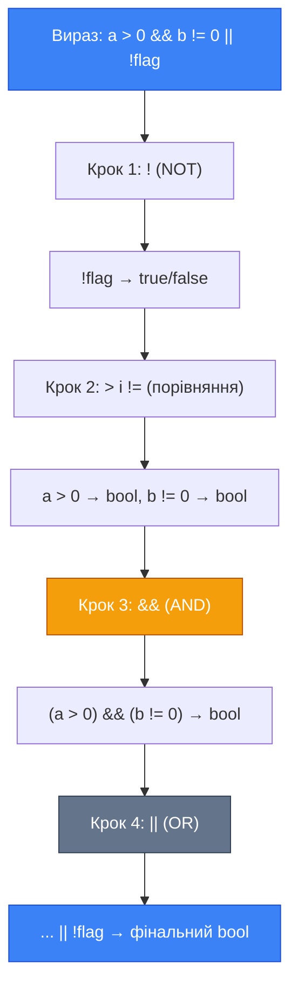

## Мова операторів: від виразів до рішень

До цього моменту ви вже вмієте зберігати дані у змінних і вводити їх з клавіатури. Але програма — це не просто сховище даних. Програма **думає**: вона порівнює числа, приймає рішення, виконує дії залежно від умов. Інструментом для всього цього є **оператори**.

Оператор (operator) — це символ або ключове слово, яке дає компілятору команду виконати певну дію над одним або кількома **операндами** (operands). Операнди — це дані, з якими виконується операція: значення, змінні або вирази.

```cpp
int result = 10 + 3;
//            ↑   ↑
//       операнди: 10 і 3
//              ↑
//       оператор: +
```

Усі оператори C++ поділяються на кілька груп за призначенням:

::card-group

::card{title="➕ Арифметичні" icon="i-lucide-calculator"}
Виконують математичні обчислення: `+`, `-`, `*`, `/`, `%`

::

::card{title="✏️ Присвоєння" icon="i-lucide-pencil"}
Записують значення у змінну: `=`, `+=`, `-=`, `*=`, `/=`, `%=`

::

::card{title="⚖️ Порівняння" icon="i-lucide-scale"}
Порівнюють два значення: `==`, `!=`, `<`, `>`, `<=`, `>=`

::

::card{title="🔗 Логічні" icon="i-lucide-git-merge"}
Об'єднують умови: `&&`, `||`, `!`

::

::card{title="↕️ Інкремент / Декремент" icon="i-lucide-arrow-up-down"}
Збільшують або зменшують значення на 1: `++`, `--`

::

::card{title="🔢 Побітові" icon="i-lucide-cpu"}
Маніпулюють окремими бітами: `&`, `|`, `^`, `~`, `<<`, `>>`

::

::

У цій статті ми детально розберемо перші п'ять груп — саме їх ви будете використовувати щодня.

## Арифметичні оператори

Ви вже зустрічалися з ними у попередньому розділі. Розглянемо їх систематично та зверніть увагу на деталі, які часто є джерелом помилок.

| Оператор | Назва              | Приклад | Результат   |
| :------- | :----------------- | :------ | :---------- |
| `+`      | Додавання          | `7 + 3` | `10`        |
| `-`      | Віднімання         | `7 - 3` | `4`         |
| `*`      | Множення           | `7 * 3` | `21`        |
| `/`      | Ділення            | `7 / 3` | `2` (ціле!) |
| `%`      | Остача від ділення | `7 % 3` | `1`         |

### Ціле ділення та його пастка

Найбільш несподіваний оператор для новачків — це `/`. У C++ поведінка оператора ділення залежить від **типів** операндів.

Якщо обидва операнди є цілими числами (`int`, `short`, `long` тощо), C++ виконує **ціле ділення** (integer division): дробова частина результату просто відкидається, а **не округлюється**.

```cpp
int a = 7;
int b = 3;
int result = a / b;  // result = 2, а не 2.333...
```

::terminal-preview{title="Integer Division Result"}

<div class="line"><span class="text-gray-400">// cout << 7 / 3;</span></div>
<div class="line">2</div>
::

Зверніть увагу на принципову відмінність: `7 / 3 = 2`, а не `2.33`. Дробова частина `.33` не округлюється до нуля — вона **знищується**. Якщо вам потрібен дійсний результат, хоча б один із операндів повинен бути типу `float` або `double`:

```cpp
int a = 7;
int b = 3;

double result1 = a / b;          // result1 = 2.0  ← НЕПРАВИЛЬНО!
double result2 = (double)a / b;  // result2 = 2.333... ← Правильно
double result3 = a / 3.0;        // result3 = 2.333... ← Теж правильно
```

У першому рядку ціле ділення відбувається **до** присвоєння в `double`: спочатку `7 / 3 = 2`, а потім `2` конвертується у `2.0`. Результат некоректний. У другому та третьому рядках хоча б один з операндів є дійсним числом — тому і ділення стає дійсним.

::warning
**Ціле ділення** — найпоширеніша причина неправильних результатів у задачах на конвертацію. Якщо ваша програма дає `0`, `1` або інше округлене значення замість дробового — перевірте типи операндів у виразі ділення.

::

### Оператор остачі `%`

Оператор `%` (модуль або остача від ділення) повертає **залишок** від цілого ділення. Він застосовується **лише до цілих** типів.

```cpp
cout << 10 % 3;  // 1  (10 = 3*3 + 1)
cout << 14 % 7;  // 0  (14 = 7*2 + 0)
cout << 5  % 8;  // 5  (5 = 8*0 + 5)
```

::terminal-preview{title="Modulo Operator Results"}

<div class="line"><span class="text-gray-400">// cout << 10 % 3;</span></div>
<div class="line">1</div>
<div class="line"><span class="text-gray-400">// cout << 14 % 7;</span></div>
<div class="line">0</div>
<div class="line"><span class="text-gray-400">// cout << 5 % 8;</span></div>
<div class="line">5</div>
::

Навіщо він потрібен? Декілька практичних застосувань:

- **Перевірка парності**: якщо `n % 2 == 0`, число парне.
- **Циклічне лічення**: наприклад, дні тижня від `0` до `6`. Якщо день `d + 3` може вийти за межі, використайте `(d + 3) % 7`.
- **Виділення цифр**: остання цифра числа `n` — це `n % 10`, передостання — `(n / 10) % 10`.

### Пріоритет арифметичних операцій

C++ дотримується математичного пріоритету (precedence): множення, ділення та остача виконуються **до** додавання та віднімання. Для зміни порядку використовуйте **дужки**.

```cpp
int a = 2 + 3 * 4;    // a = 14 (спочатку 3*4=12, потім 2+12)
int b = (2 + 3) * 4;  // b = 20 (дужки змінюють порядок)
int c = 10 - 6 / 2;   // c = 7  (спочатку 6/2=3, потім 10-3)
```

::tip
**Рекомендація**: Якщо вираз складний — ставте дужки явно, навіть якщо пріоритет і без них правильний. Це робить код зрозумілішим для читача (і для вас самих через тиждень).

::

## Оператори присвоєння

Звичайний оператор присвоєння `=` ви вже знаєте. Але C++ має скорочені форми, які суміщають арифметичну операцію з присвоєнням. Вони називаються **складеними операторами присвоєння** (compound assignment operators).

### Складені оператори присвоєння

| Оператор | Еквівалент  | Приклад  | Результат                                 |
| :------- | :---------- | :------- | :---------------------------------------- |
| `x += n` | `x = x + n` | `x += 5` | Збільшити `x` на 5                        |
| `x -= n` | `x = x - n` | `x -= 3` | Зменшити `x` на 3                         |
| `x *= n` | `x = x * n` | `x *= 2` | Подвоїти `x`                              |
| `x /= n` | `x = x / n` | `x /= 4` | Поділити `x` на 4                         |
| `x %= n` | `x = x % n` | `x %= 7` | Залишити лише остачу від ділення `x` на 7 |

```cpp
int score = 100;
score += 50;  // score = 150 (нараховуємо бонуси)
score -= 30;  // score = 120 (штраф)
score *= 2;   // score = 240 (подвоєння)
score /= 3;   // score = 80  (ціле ділення!)
```

::debugger-view{title="Compound Assignment Trace" :variables='[{"name": "start score", "type": "int", "value": "100"}, {"name": "after += 50", "type": "int", "value": "150"}, {"name": "after -= 30", "type": "int", "value": "120"}, {"name": "after *= 2", "type": "int", "value": "240"}, {"name": "after /= 3", "type": "int", "value": "80"}]'}
::

Ці оператори не просто «зручне скорочення» — вони роблять код читабельнішим, явно показуючи, що ми **модифікуємо** існуючу змінну, а не присвоюємо їй нове незалежне значення.

### Інкремент та декремент

Окремий та дуже поширений випадок — збільшення або зменшення значення **рівно на одиницю**. Для цього C++ має спеціальні оператори.

**Інкремент** (increment) `++` — збільшує значення змінної на 1.
**Декремент** (decrement) `--` — зменшує значення змінної на 1.

```cpp
int counter = 0;
counter++;  // counter = 1
counter++;  // counter = 2
counter--;  // counter = 1
```

Кожен з цих операторів існує у двох формах: **префіксній** (перед змінною) та **постфіксній** (після змінної). Різниця проявляється лише тоді, коли вираз використовується у ширшому контексті — наприклад, при виводі або присвоєнні.

::tabs

::tabs-item{label="Префіксний ++x" icon="i-lucide-chevrons-up"}

Спочатку **збільшує** значення, потім повертає **вже збільшене** значення.

```cpp
int x = 5;
int y = ++x;  // Спочатку x стає 6, потім y = 6
// x = 6, y = 6
```

Аналогія: **«Спочатку дій, потім звітуй»**.

::

::tabs-item{label="Постфіксний x++" icon="i-lucide-chevrons-down"}

Спочатку повертає **поточне** значення, а **потім** збільшує його.

```cpp
int x = 5;
int y = x++;  // y = 5 (береться поточне значення), потім x стає 6
// x = 6, y = 5
```

Аналогія: **«Спочатку звітуй, потім дій»**.

::

::

::note
Якщо інкремент стоїть у **окремому рядку** (`counter++;`), між префіксною та постфіксною формами **немає жодної різниці** — обидва варіанти просто збільшують значення на 1. Різниця виникає лише всередині складніших виразів.

::

## Перетворення типів

У C++ типи суворо визначені. Проте іноді нам потрібно «переключитися» між типами: взяти ціле число і зробити з нього дійсне, або навпаки. Для цього існують механізми **перетворення типів** (type conversion).

### Неявне перетворення (implicit conversion)

Коли значення одного типу автоматично перетворюється в інший без жодних додаткових команд — це **неявне** перетворення. Компілятор виконує його самостійно, коли типи операндів не збігаються.

Загальне правило: при змішуванні різних числових типів C++ **розширює** менший тип до більшого (щоб уникнути втрати інформації).

```cpp
int    age = 25;
double ratio = age;      // int → double: неявне розширення (безпечно)
// ratio = 25.0

double pi = 3.14159;
int piInt = pi;          // double → int: неявне звуження (небезпечно!)
// piInt = 3 (дробова частина ЗАГУБЛЕНА)
```

Ієрархія неявного розширення виглядає таким чином:

::mermaid


::

Кожен тип автоматично й безпечно розширюється до наступного. Рух у зворотному напрямку (звуження) — небезпечний, адже веде до **втрати даних**.

::warning
Перетворення від `double` до `int` не дає похибки компіляції, але **мовчки знищує** дробову частину. Компілятор може видати `warning` (попередження), але не зупинить компіляцію. Це один з найнебезпечніших аспектів неявних перетворень.

::

### Явне перетворення (explicit cast)

Коли перетворення потрібно виконати **свідомо та навмисно**, використовується явне приведення типу (type cast). Синтаксис у стилі C, який прийнятий у цьому курсі:

```cpp
(тип) вираз
```

```cpp
int a = 7;
int b = 3;

double result = (double)a / b;  // 7.0 / 3 = 2.333...
```

Тут `(double)a` — це **явне** перетворення значення змінної `a` до типу `double`. Сама змінна `a` при цьому **не змінюється** — вона залишається `int`. Перетворюється лише значення, яке використовується у цьому виразі.

Розглянемо ще один типовий приклад — виведення відсотка:

```cpp
int correct = 7;
int total = 10;

// Неправильно: 7 / 10 = 0 (ціле ділення), 0 * 100 = 0
double percent1 = correct / total * 100;

// Правильно: (7.0) / 10 = 0.7, 0.7 * 100 = 70.0
double percent2 = (double)correct / total * 100;

cout << "Percent: " << percent2 << "%\n";  // Percent: 70%
```

::tip
**Правило явного приведення**: використовуйте `(тип)`, коли:

- ділите два цілих числа і потребуєте дійсного результату
- конвертуєте між `int` і `char` (код символу)
- хочете явно показати читачу, що перетворення свідоме, а не випадкове

::

### Перетворення `char` та `int`

Тип `char` зберігає один символ, але **внутрішньо** він є числом — кодом символу за таблицею ASCII. Це дає змогу конвертувати між символами та їх числовими кодами.

```cpp
char letter = 'A';
int code = (int)letter;     // code = 65 (код символу 'A' в ASCII)

int number = 66;
char symbol = (char)number; // symbol = 'B' (символ з кодом 66)

cout << "Код 'A': " << code << "\n";    // Код 'A': 65
cout << "Символ 66: " << symbol << "\n"; // Символ 66: B
```

::terminal-preview{title="Character ASCII Conversion"}

<div class="line">Код 'A': 65</div>
<div class="line">Символ 66: B</div>
::

::memory-view{title="RAM: char 'A'" startAddress="0x00A1" :data='[65, 0, 0, 0]' :highlight="[0]"}
::

Ця властивість використовується, наприклад, для визначення, чи є символ літерою, цифрою, або для переведення між регістрами:

```cpp
char lower = 'a';
char upper = (char)(lower - 32);  // 'a'(97) - 32 = 'A'(65)
cout << upper;  // A
```

::note
Таблиця ASCII визначає коди для 128 базових символів. Великі латинські літери: A=65, B=66 ... Z=90. Малі: a=97, b=98 ... z=122. Різниця між відповідними регістрами завжди становить 32.

::

## Оператори порівняння

Щоб програма могла **приймати рішення**, їй потрібно вміти порівнювати значення. Для цього використовуються **оператори порівняння** (relational / comparison operators). На відміну від арифметичних операторів, вони повертають не число, а **логічне значення** типу `bool`: `true` (істина) або `false` (хибність).

| Оператор | Значення            | Приклад  | Результат |
| :------- | :------------------ | :------- | :-------- |
| `==`     | Дорівнює            | `5 == 5` | `true`    |
| `!=`     | Не дорівнює         | `5 != 3` | `true`    |
| `<`      | Менше               | `3 < 5`  | `true`    |
| `>`      | Більше              | `3 > 5`  | `false`   |
| `<=`     | Менше або дорівнює  | `5 <= 5` | `true`    |
| `>=`     | Більше або дорівнює | `6 >= 5` | `true`    |

::caution
**Критична помилка-пастка!** Оператор порівняння — `==` (два знаки рівності). Оператор присвоєння — `=` (один знак). Написавши `if (x = 5)` замість `if (x == 5)`, ви не порівняєте `x` з `5` — ви **присвоїте** `x` значення `5`, і умова завжди буде `true` (непорожнє значення = `true`). Компілятор часто not попереджає про це.

::

### Де застосовуються оператори порівняння?

Результат порівняння — значення `bool`. Його можна зберегти у змінній:

```cpp
int age = 20;
bool isAdult = (age >= 18);  // true
bool isChild = (age < 12);   // false

cout << isAdult;  // Виведе: 1 (true відображається як 1)
cout << isChild;  // Виведе: 0 (false відображається як 0)
```

::terminal-preview{title="Boolean Output"}

<div class="line"><span class="text-gray-400">// cout << true;</span></div>
<div class="line">1</div>
<div class="line"></div>
<div class="line"><span class="text-gray-400">// cout << false;</span></div>
<div class="line">0</div>
::

Або використати напряму в умовній конструкції (детальніше про `if` — у наступному розділі):

```cpp
if (age >= 18) {
    cout << "Доступ дозволено\n";
}
```

## Логічні оператори

Поодинці оператори порівняння дозволяють перевірити лише **одну умову**: «вік більший за 18» або «пароль вірний». Але реальні програми часто потребують складніших перевірок: «**вік більший за 18** І **є квиток**» або «**температура вище 37** АБО **є симптоми**». Для об'єднання кількох умов в одну використовуються **логічні оператори** (logical operators).

### Оператор І — `&&` (логічне AND)

Повертає `true` лише якщо **обидві** умови є істинними одночасно. Достатньо хоч одній умові бути `false` — і весь вираз стає `false`.

**Таблиця істинності `&&`:**

| Умова A | Умова B | A `&&` B   |
| :------ | :------ | :--------- |
| `false` | `false` | `false`    |
| `false` | `true`  | `false`    |
| `true`  | `false` | `false`    |
| `true`  | `true`  | **`true`** |

```cpp
int age = 20;
bool hasTicket = true;

bool canEnter = (age >= 18) && hasTicket;
// true && true → true: вхід дозволено
```

Аналогія з життя: ви заходите у клуб лише якщо **І** ви повнолітній, **І** у вас є квиток.

### Оператор АБО — `||` (логічне OR)

Повертає `true` якщо **хоча б одна** з умов є істинною. Повертає `false` лише якщо **обидві** умови хибні.

**Таблиця істинності `||`:**

| Умова A | Умова B | A `\|\|` B  |
| :------ | :------ | :---------- |
| `false` | `false` | **`false`** |
| `false` | `true`  | `true`      |
| `true`  | `false` | `true`      |
| `true`  | `true`  | `true`      |

```cpp
bool hasPass = false;
bool isEmployee = true;

bool canGoIn = hasPass || isEmployee;
// false || true → true: вхід дозволено
```

Аналогія: Ви можете увійти у службовий вхід, якщо **АБО** маєте перепустку, **АБО** є співробітником (є хоча б одна підстава).

### Оператор НЕ — `!` (логічне NOT)

**Інвертує** логічне значення: перетворює `true` на `false`, і навпаки. Це унарний оператор — він діє на **один** операнд.

| Умова A | `!A`    |
| :------ | :------ |
| `false` | `true`  |
| `true`  | `false` |

```cpp
bool isRaining = false;
bool goForAWalk = !isRaining;  // true: не дощить → можна гуляти

bool isDividableBy2 = (number % 2 == 0);
bool isOdd = !isDividableBy2;  // інвертуємо: ділиться → підраховуємо непарне
```

### Складні логічні вирази

Логічні оператори можна комбінувати для побудови складних умов. Пріоритет операцій: `!` виконується першим, потім `&&`, потім `||`. Дужки дозволяють перевизначити порядок.

```cpp
int temperature = 38;
bool hasCough = true;
bool hasVaccine = false;

// Пацієнт у групі ризику: висока температура АБО (кашель І без щеплення)
bool isAtRisk = (temperature > 37) || (hasCough && !hasVaccine);
// true || (true && true) → true || true → true
```

Розберемо, як обчислюється цей вираз покроково:

1. `!hasVaccine` → `!false` → `true`
2. `hasCough && true` → `true && true` → `true`
3. `(temperature > 37)` → `(38 > 37)` → `true`
4. `true || true` → `true`

::tip
**Короткочасне обчислення** (short-circuit evaluation): C++ не обчислює другу частину логічного виразу, якщо результат вже визначений після першої. Для `&&`: якщо перша умова — `false`, результат завжди `false`, друга умова не перевіряється. Для `||`: якщо перша умова — `true`, результат завжди `true`. Це важливо, коли друга умова містить виклик функції або звернення до пам'яті.

::

## Пріоритет усіх операторів

У складних виразах порядок виконання операторів визначається їх **пріоритетом** (precedence). Ось спрощена таблиця від найвищого до найнижчого:

| Пріоритет     | Оператори                            | Напрям виконання |
| :------------ | :----------------------------------- | :--------------- |
| 1 (найвищий)  | `()` дужки                           | зліва направо    |
| 2             | `!`, `++`, `--` (префіксні), `(тип)` | справа наліво    |
| 3             | `*`, `/`, `%`                        | зліва направо    |
| 4             | `+`, `-`                             | зліва направо    |
| 5             | `<`, `>`, `<=`, `>=`                 | зліва направо    |
| 6             | `==`, `!=`                           | зліва направо    |
| 7             | `&&`                                 | зліва направо    |
| 8             | `\|\|`                               | зліва направо    |
| 9 (найнижчий) | `=`, `+=`, `-=`, `*=`, `/=`, `%=`    | справа наліво    |

::mermaid



::

::note
**Практична порада**: не покладайтеся на пам'ять. Щоразу, коли виникають сумніви щодо порядку виконання, ставте **дужки**. Код `(a > 0) && (b != 0) || !flag` значно читабельніший, ніж `a > 0 && b != 0 || !flag`, навіть якщо результат однаковий.

::

## Практичний приклад: Перевірка трикутника

Складемо програму, яка зчитує три сторони та перевіряє, чи можуть вони утворити трикутник. За теоремою: трикутник існує, якщо **кожна** зі сторін **менша** за суму двох інших.

```cpp [Triangle.cpp] showLineNumbers
#include <iostream>

using namespace std;

int main()
{
    double a, b, c;

    cout << "Enter three sides: ";
    cin >> a >> b >> c;

    bool isValid = (a + b > c) && (a + c > b) && (b + c > a);

    cout << "Is triangle: " << isValid << "\n";
    // Виведе 1 (true) або 0 (false)

    return 0;
}
```

Розберемо ключові елементи:

- **Рядок 10**: Зчитуємо три числа через пробіл — `cin` автоматично розбиває введення за пробілами.
- **Рядок 12**: Перевірка складається з трьох умов, з'єднаних `&&`. Усі три повинні бути `true` одночасно, щоб трикутник існував.
- **Рядок 14**: `bool` при виводі через `cout` відображається як `0` або `1`.

**Приклади роботи:**

::terminal-preview{title="Execution: Triangle Check"}

<div class="line">Enter three sides: <span class="text-blue-400 font-bold">3 4 5</span></div>
<div class="line">Is triangle: 1</div>
<div class="line"></div>
<div class="line">Enter three sides: <span class="text-blue-400 font-bold">1 2 10</span></div>
<div class="line">Is triangle: 0</div>
::

## Практичний приклад: Конвертер одиниць з відсотком

Розробимо програму, що переводить температуру із Цельсія у Фаренгейт і відразу показує відсоток від «точки кипіння» (100°C = 212°F).

```cpp [TempConverter.cpp] showLineNumbers
#include <iostream>

using namespace std;

int main()
{
    double celsius;

    cout << "Enter temperature in Celsius: ";
    cin >> celsius;

    // Формула перетворення
    double fahrenheit = celsius * 9.0 / 5.0 + 32.0;

    // Відсоток від точки кипіння (100 C)
    double percentOfBoiling = celsius / 100.0 * 100.0;

    // Чи перевищує температура поріг нормального тіла (36.6)?
    bool isHighTemp = celsius > 36.6;

    cout << celsius << " C = " << fahrenheit << " F\n";
    cout << "Percent of boiling: " << percentOfBoiling << "%\n";
    cout << "High temperature: " << isHighTemp << "\n";

    return 0;
}
```

Аналіз ключових рядків:

- **Рядок 13**: Формула `* 9.0 / 5.0` використовує дійсні літерали (`9.0`, `5.0`), щоб ділення не було цілочисельним. Якщо написати `* 9 / 5`, при `celsius = 37` отримуємо `37 * 9 / 5 = 333 / 5 = 66` (ціле ділення!), а не правильне `66.6`.
- **Рядок 16**: Тут теж поділ на `100.0` (дійсне), а не `100`.
- **Рядок 19**: Результат порівняння зберігається у `bool isHighTemp` і виводиться як `0` або `1`.

**Приклад роботи:**

::terminal-preview{title="Execution: TempConverter"}

<div class="line">Enter temperature in Celsius: <span class="text-blue-400 font-bold">37</span></div>
<div class="line">37 C = 98.6 F</div>
<div class="line">Percent of boiling: 37%</div>
<div class="line">High temperature: 1</div>
::

## Практичні завдання

### Рівень 1 — Базовий

::collapsible{title="Завдання 1.1: Визначте результат виразу"}
Визначте значення виразів, не запускаючи програму. Потім перевірте свої відповіді кодом:

```cpp
int a = 10, b = 3;

cout << a / b       << "\n";  // ?
cout << a % b       << "\n";  // ?
cout << a / 3.0     << "\n";  // ?
cout << (a > b)     << "\n";  // ?
cout << (a == 10)   << "\n";  // ?
cout << (a != b)    << "\n";  // ?
cout << !true       << "\n";  // ?
cout << (a > 5 && b < 5) << "\n"; // ?
```

::

::collapsible{title="Завдання 1.2: Виправте помилки"}
Знайдіть та виправте всі помилки у фрагменті коду:

```cpp
int x = 7, y = 2;
double result = x / y;        // Має бути 3.5
bool isEqual = (x = y);       // Має перевіряти рівність
bool isPositive = x > 0 && < 100;  // Синтаксична помилка
```

Скільки помилок ви знайшли?

::

### Рівень 2 — Логічний

::collapsible{title="Завдання 2.1: Парне чи непарне"}
Напишіть програму, яка зчитує ціле число та виводить `1`, якщо воно **парне**, і `0`, якщо **непарне**. Використовуйте оператор `%` та збережіть результат у `bool`.

**Перевірка:**

- Введено `14` → `1` (парне)
- Введено `7` → `0` (непарне)

::

::collapsible{title="Завдання 2.2: Цифри числа"}
Напишіть програму, яка зчитує тризначне число (наприклад, `357`) та виводить окремо кожну цифру:

- Перша цифра (сотні): `3`
- Друга цифра (десятки): `5`
- Третя цифра (одиниці): `7`

**Підказка**: цифра одиниць — `n % 10`, цифра десятків — `(n / 10) % 10`, цифра сотень — `n / 100`.

::

::collapsible{title="Завдання 2.3: Рік — високосний?"}
Напишіть програму, яка зчитує рік та виводить `1`, якщо він **високосний**, і `0` — якщо ні.

Рік є високосним, якщо:

- Ділиться на 4 **І** не ділиться на 100
- **АБО** ділиться на 400

Збережіть результат у `bool leapYear` та виведіть його.

**Перевірка:** 2000 → `1`, 1900 → `0`, 2024 → `1`, 2023 → `0`

::

### Рівень 3 — Творчий

::collapsible{title="Завдання 3.1: Калькулятор BMI"}
Реалізуйте програму-калькулятор індексу маси тіла (BMI). Програма повинна:

1. Зчитати вагу (кг) та зріст (м)
2. Обчислити BMI за формулою: `BMI = weight / (height * height)`
3. Вивести значення BMI
4. Вивести `1`/`0` для двох перевірок:
    - `isNormal`: чи знаходиться BMI у нормальному діапазоні (від 18.5 до 24.9 включно)
    - `isOverweight`: чи BMI більший або рівний 25.0

**Приклад:**

```
Enter weight (kg): 75
Enter height (m): 1.75
BMI: 24.49
Normal weight: 1
Overweight: 0
```

::

::collapsible{title="Завдання 3.2: Конвертер систем числення (символи)"}
Напишіть програму, яка зчитує **цифру** від 0 до 9 (як `char`), конвертує її в числове значення (`int`) та виводить її квадрат.

Підказка: якщо `char digit = '7'`, то числове значення — `(int)digit - (int)'0'` (різниця між кодом символу та кодом символу `'0'`).

**Приклад:**

```
Enter digit: 7
Digit value: 7
Square: 49
```

::

## Підсумок

::card-group

::card{title="📌 Арифметичні оператори" icon="i-lucide-calculator"}
`+`, `-`, `*`, `/`, `%`. Ціле ділення відкидає дробову частину — для дійсного результату хоча б один операнд має бути `double`/`float`.

::

::card{title="📌 Оператори присвоєння" icon="i-lucide-pencil"}
`=`, `+=`, `-=`, `*=`, `/=`, `%=` — суміщують операцію з присвоєнням. `++`/`--` — інкремент та декремент.

::

::card{title="📌 Перетворення типів" icon="i-lucide-arrow-left-right"}
Неявне (автоматичне) — компілятор розширює тип. Явне `(тип)вираз` — свідоме перетворення. Звуження типу (double → int) знищує дробову частину.

::

::card{title="📌 Оператори порівняння" icon="i-lucide-scale"}
`==`, `!=`, `<`, `>`, `<=`, `>=` — повертають `bool`. Пам'ятайте: `==` (порівняння) ≠ `=` (присвоєння)!

::

::card{title="📌 Логічні оператори" icon="i-lucide-git-merge"}
`&&` (AND) — обидві умови, `||` (OR) — хоча б одна, `!` (NOT) — інверсія. Підтримують короткочасне обчислення.

::

::card{title="📌 Пріоритет" icon="i-lucide-list-ordered"}
`!` → `*/%` → `+-` → `<><=>=` → `==!=` → `&&` → `||` → `=`. Сумнівно — ставте дужки.

::

::
