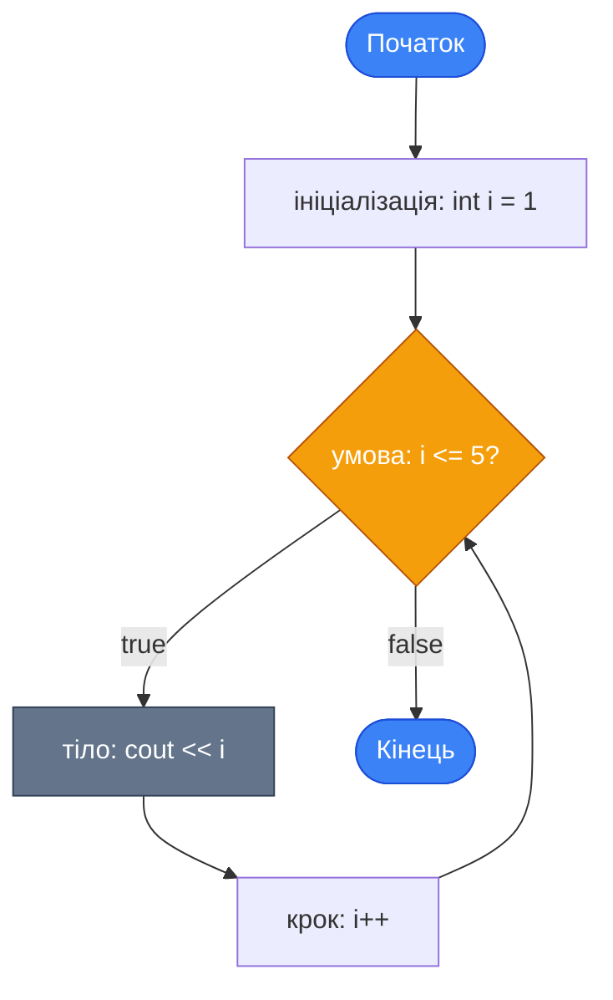
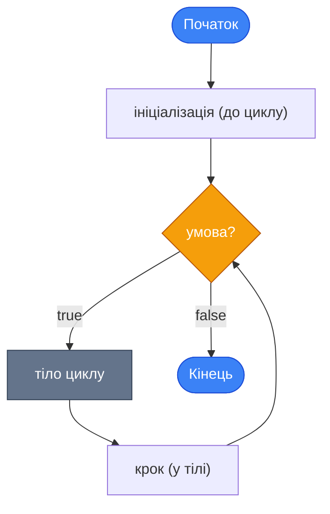
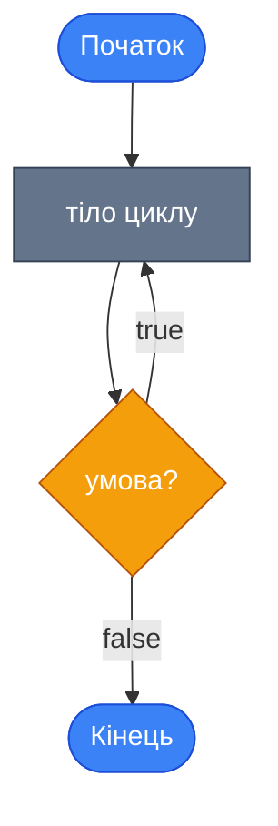
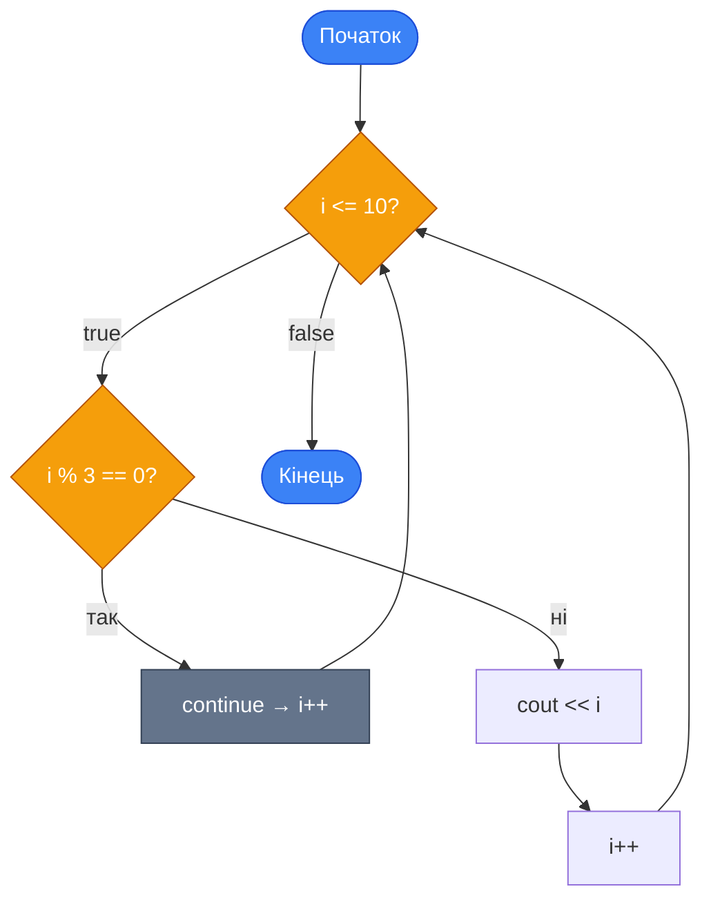

## Від одноразових дій — до повторень

Уявіть, що вам потрібно вивести на екран числа від 1 до 100. Без циклів рішення виглядало б так:

```cpp
cout << 1 << "\n";
cout << 2 << "\n";
cout << 3 << "\n";
// ... ще 97 рядків ...
cout << 100 << "\n";
```

Це не тільки катастрофічно нудно писати — це ще й принципово неправильній підхід. А що, якщо число 100 вводить користувач? Ви не можете заздалегідь написати стільки рядків, скільки він захоче.

Саме для таких ситуацій існують **цикли** (loops) — конструкції, що дозволяють виконувати один і той самий блок коду **багаторазово**, доки виконується певна умова. Цикли — один із фундаментальних будівельних блоків будь-якої програми: без них неможливі пошук, сортування, обробка масивів, введення даних до правильного формату і сотні інших повсякденних задач.

У C++ є три основних типи циклів. Кожен з них краще підходить для певного сценарію:

::card-group

::card{title="🔢 for" icon="i-lucide-repeat"}
Використовується, коли **кількість повторень відома заздалегідь**. Ідеальний для перебору послідовностей та масивів.

::

::card{title="🔄 while" icon="i-lucide-refresh-cw"}
Використовується, коли потрібно повторювати **доки виконується умова**, і кількість ітерацій — невідома.

::

::card{title="⬇️ do-while" icon="i-lucide-arrow-down-circle"}
Аналог `while`, але тіло виконується **щонайменше один раз**, навіть якщо умова від початку хибна.

::

::

## Цикл `for`

### Анатомія циклу `for`

Цикл `for` — найпоширеніший в C++, коли відома кількість кроків. Його синтаксис відразу показує всі три частини управління циклом в одному рядку:

```cpp
for (ініціалізація; умова; крок)
{
    // тіло циклу
}
```

Розберемо класичний приклад:

```cpp
for (int i = 1; i <= 5; i++)
{
    cout << i << "\n";
}
```

::mermaid



::

Три частини заголовка виконуються у строго визначеному порядку:

1. **Ініціалізація** (`int i = 1`) — виконується **один раз** перед початком циклу. Зазвичай тут оголошується та ініціалізується лічильник.
2. **Умова** (`i <= 5`) — перевіряється **перед кожною ітерацією**. Якщо умова `false` — цикл завершується.
3. **Крок** (`i++`) — виконується **після кожної ітерації** (після тіла). Зазвичай змінює лічильник.

**Виведення програми:**
```
1
2
3
4
5
```

### Лічильник і напрямок

Лічильник циклу — не обов'язково `i`, і не обов'язково зростає. Ось різні варіанти:

```cpp
// Від 0 до N-1 (найпоширеніший варіант у програмуванні)
for (int i = 0; i < 5; i++)
{
    cout << i << " ";  // 0 1 2 3 4
}

// Від 10 до 1 (спадаючий)
for (int count = 10; count >= 1; count--)
{
    cout << count << " ";  // 10 9 8 7 6 5 4 3 2 1
}

// З кроком 2 (парні числа)
for (int n = 2; n <= 10; n += 2)
{
    cout << n << " ";  // 2 4 6 8 10
}
```

::tip
**Конвенція іменування лічильника**: для простих числових циклів традиційно використовують `i`, `j`, `k`. Для більш специфічних циклів — змістовні імена: `row`, `col`, `step`, `attempt`. Однолітерні імена допустимі лише для «технічних» лічильників, зміст яких очевидний з контексту.

::

### Практичний приклад: сума рядів

Одне з найпоширеніших застосувань циклу `for` — **накопичення**: сума, добуток, підрахунок елементів. Обчислимо суму чисел від 1 до N, де N вводить користувач.

```cpp [SumOfN.cpp] showLineNumbers
#include <iostream>

using namespace std;

int main()
{
    int n;
    int sum = 0;  // Накопичувач — починаємо з нуля!

    cout << "Enter N: ";
    cin >> n;

    for (int i = 1; i <= n; i++)
    {
        sum += i;  // Додаємо поточне число до суми
    }

    cout << "Sum 1.." << n << " = " << sum << "\n";

    return 0;
}
```

Ключові моменти:

- **Рядок 8**: Змінна `sum` — це **накопичувач** (accumulator). Вона ініціалізується нулем ПЕРЕД циклом. Якщо забути ініціалізацію — в `sum` буде сміттєве значення, і результат буде неправильним.
- **Рядок 14**: `sum += i` — скорочена форма `sum = sum + i`. За кожну ітерацію накопичуємо поточне значення `i`.

**Трасування виконання** (`n = 4`):

| Ітерація | `i` | `sum` до | `sum += i` | `sum` після |
|:---------|:----|:---------|:-----------|:------------|
| 1 | 1 | 0 | 0 + 1 | 1 |
| 2 | 2 | 1 | 1 + 2 | 3 |
| 3 | 3 | 3 | 3 + 3 | 6 |
| 4 | 4 | 6 | 6 + 4 | **10** |

```
Enter N: 4
Sum 1..4 = 10
```

## Цикл `while`

### Анатомія циклу `while`

Цикл `while` (поки) — простіший за синтаксисом, але потужніший за логікою. Він повторює тіло, **доки умова залишається істинною**. На відміну від `for`, тут немає вбудованого місця для ініціалізації та кроку — програміст розміщує їх самостійно.

```cpp
// Ініціалізація — ДО циклу
while (умова)
{
    // тіло циклу
    // Крок — у тілі
}
```

Еквівалент попереднього прикладу через `while`:

```cpp
int i = 1;               // ← Ініціалізація до циклу
while (i <= 5)
{
    cout << i << "\n";
    i++;                 // ← Крок у тілі
}
```

::mermaid



::

### Коли `while` кращий за `for`

Різниця між `for` і `while` — не стільки технічна, скільки **семантична** (смислова). Вибирайте той, що краще відповідає задачі:

| `for` | `while` |
|:------|:--------|
| Кількість ітерацій відома до початку | Кількість ітерацій невідома |
| Перебір від A до B | Повторення до виконання умови |
| Обробка масивів, послідовностей | Введення даних, пошук, ігровий цикл |

### Практичний приклад: валідація вводу

Найкласичніший сценарій для `while` — **перевірка введених даних**: повторювати запит, доки користувач не введе коректне значення.

```cpp [Validate.cpp] showLineNumbers
#include <iostream>

using namespace std;

int main()
{
    int age;

    cout << "Enter your age (1-120): ";
    cin >> age;

    while (age < 1 || age > 120)
    {
        cout << "Invalid! Enter age between 1 and 120: ";
        cin >> age;
    }

    cout << "Your age: " << age << "\n";

    return 0;
}
```

Розберемо логіку:

- **Рядок 10**: Перший ввід відбувається **до** циклу — щоб уникнути зайвих запитів, якщо значення одразу правильне.
- **Рядок 12**: Умова продовження: `age < 1 || age > 120` — якщо вік за межами допустимих значень, цикл продовжується.
- **Рядок 14–15**: Знову виводимо підказку і знову зчитуємо. Після `cin >> age` значення оновлюється, умова перевіряється знову.

```
Enter your age (1-120): 0
Invalid! Enter age between 1 and 120: 200
Invalid! Enter age between 1 and 120: 25
Your age: 25
```

### Нескінченний цикл

Цикл `while (true)` — нескінченний. Він виконується вічно, якщо не переривається оператором `break` (розглянемо нижче). Використовується для **ігрових циклів** та **меню**:

```cpp
while (true)
{
    cout << "1 - Play\n";
    cout << "2 - Settings\n";
    cout << "0 - Exit\n";
    cout << "Choice: ";

    int choice;
    cin >> choice;

    if (choice == 0)
    {
        break;  // Вихід з нескінченного циклу
    }
    // Обробка вибору...
}
```

::caution
**Безкінечний цикл без `break`** — найпоширеніша причина «зависання» програми. Якщо програма перестала реагувати — майже напевно де-небудь є цикл, умова виходу з якогоніколи не досягається. У Visual Studio примусово зупинити виконання можна через :kbd{value="Ctrl"} + :kbd{value="C"} у вікні консолі.

::

## Цикл `do-while`

### Анатомія `do-while`

Цикл `do-while` — варіант `while`, де перевірка умови відбувається **після** виконання тіла. Це гарантує, що тіло виконається **мінімум один раз**, навіть якщо умова спочатку хибна.

```cpp
do
{
    // тіло циклу (виконується мінімум один раз)
} while (умова);
//              ↑
//    Крапка з комою обов'язкова!
```

::mermaid



::

::warning
Після закриваючої дужки умови `while (умова)` обов'язково ставиться **крапка з комою** `;`. Це одне з найчастіших синтаксичних упущень при роботі з `do-while`.

::

### Порівняння `while` та `do-while`

```cpp
// while: якщо count = 0, тіло НЕ виконається жодного разу
int count = 0;
while (count > 0)
{
    cout << "while: " << count << "\n";
    count--;
}
// Нічого не виведе

// do-while: тіло виконається ОДИН РАЗ, навіть при count = 0
count = 0;
do
{
    cout << "do-while: " << count << "\n";
    count--;
} while (count > 0);
// Виведе: do-while: 0
```

### Практичний приклад: меню з повторним запитом

`do-while` ідеально підходить для **меню**: спочатку показуємо варіанти, потім перевіряємо вибір — і якщо він некоректний, повторюємо.

```cpp [Menu.cpp] showLineNumbers
#include <iostream>

using namespace std;

int main()
{
    int choice;

    do
    {
        cout << "\n=== MENU ===\n";
        cout << "1 - Calculate sum\n";
        cout << "2 - Calculate product\n";
        cout << "0 - Exit\n";
        cout << "Choice: ";
        cin >> choice;

        if (choice == 1)
        {
            cout << "Sum mode selected.\n";
        }
        else if (choice == 2)
        {
            cout << "Product mode selected.\n";
        }
        else if (choice != 0)
        {
            cout << "Unknown option!\n";
        }

    } while (choice != 0);

    cout << "Goodbye!\n";

    return 0;
}
```

Логіка `do-while` тут природна: меню **завжди** потрібно показати хоча б раз. А після кожного вибору перевіряємо — продовжувати чи ні.

## Оператори `break` та `continue`

### `break` — достроковий вихід

Оператор `break` **негайно** завершує виконання поточного циклу та передає управління наступному рядку **після** тіла циклу. Використовується для виходу з циклу за особливою умовою.

```cpp
// Пошук першого чисел, що ділиться на 7, у діапазоні 1..50
int target = -1;

for (int i = 1; i <= 50; i++)
{
    if (i % 7 == 0)
    {
        target = i;
        break;  // Знайшли — виходимо з циклу одразу
    }
}

cout << "First divisible by 7: " << target << "\n";  // 7
```

Без `break` цикл пройшов би всі 50 значень. Із `break` — зупиняється на першому знайденому. Це ефективно для **пошукових** алгоритмів, де результат потрібен одразу після знаходження.

::note
`break` виходить лише з **одного** (найближчого) циклу. Якщо цикли вкладені — `break` виходить лише з внутрішнього. Для виходу з кількох рівнів використовуються прапор-змінна або `goto` (рідко).

::

### `continue` — пропуск ітерації

Оператор `continue` **не виходить** з циклу — він лише **пропускає** залишок поточної ітерації та переходить до наступної перевірки умови.

```cpp
// Вивести числа від 1 до 10, крім кратних 3
for (int i = 1; i <= 10; i++)
{
    if (i % 3 == 0)
    {
        continue;  // Пропускаємо 3, 6, 9 — стрибаємо до i++
    }

    cout << i << " ";
}
// Виведе: 1 2 4 5 7 8 10
```

::mermaid



::

### Різниця між `break` і `continue`

| | `break` | `continue` |
|:--|:--------|:-----------|
| Що робить | Виходить **з циклу** | Переходить до **наступної ітерації** |
| Виконання після | Рядок ПІСЛЯ циклу | Наступна перевірка умови |
| Типовий сценарій | Знайшли те, що шукали | Пропускаємо «непотрібні» елементи |

## Вкладені цикли

Цикл може знаходитися **всередині** іншого циклу. Такі конструкції називаються **вкладеними** (nested loops). Вони використовуються для роботи з двовимірними даними: рядки/стовпці таблиць, координатні сітки, перебір комбінацій.

```cpp
// Таблиця множення від 1 до 3
for (int row = 1; row <= 3; row++)       // Зовнішній цикл — рядки
{
    for (int col = 1; col <= 3; col++)   // Внутрішній цикл — стовпці
    {
        cout << row * col << "\t";
    }
    cout << "\n";  // Перехід на новий рядок після кожного рядка таблиці
}
```

**Результат:**
```
1    2    3
2    4    6
3    6    9
```

Принцип роботи: для кожного значення **зовнішнього** лічильника (`row`) **внутрішній** цикл (`col`) проходить **повний цикл** від початку до кінця. Тобто:

- `row = 1` → `col` = 1, 2, 3 → виведення рядка `1 2 3`
- `row = 2` → `col` = 1, 2, 3 → виведення рядка `2 4 6`
- `row = 3` → `col` = 1, 2, 3 → виведення рядка `3 6 9`

**Загальна кількість ітерацій** = (ітерацій зовнішнього) × (ітерацій внутрішнього) = 3 × 3 = 9.

### Практичний приклад: малювання фігур символами

Вкладені цикли — класичний спосіб малювати текстові фігури. Це одне з найпоширеніших навчальних завдань для розвитку «мислення циклами».

```cpp [Pyramid.cpp] showLineNumbers
#include <iostream>

using namespace std;

int main()
{
    int height;

    cout << "Enter pyramid height: ";
    cin >> height;

    for (int row = 1; row <= height; row++)
    {
        for (int star = 1; star <= row; star++)
        {
            cout << "* ";
        }
        cout << "\n";
    }

    return 0;
}
```

Для `height = 5`:
```
*
* *
* * *
* * * *
* * * * *
```

Зверніть на логіку: у рядку з номером `row` друкується рівно `row` зірочок (на рядку 1 — одна зірочка, на рядку 2 — дві, і т.д.). Саме тому умова внутрішнього циклу — `star <= row`, а не фіксоване число.

## Типові алгоритмічні шаблони

Більшість задач на цикли зводяться до кількох класичних **шаблонів** (patterns). Знаючи їх, ви зможете вирішувати нові задачі, комбінуючи знайомі блоки.

### Шаблон 1: Накопичувач

Використовується для обчислення суми, добутку або будь-якого значення, яке «збирається» по крупицях за кожну ітерацію.

```cpp
// Сума / добуток / підрахунок
int sum = 0;           // Нейтральний елемент для суми = 0
int product = 1;       // Нейтральний елемент для добутку = 1
int count = 0;         // Лічильник

for (int i = 1; i <= n; i++)
{
    sum += i;          // sum = sum + i
    product *= i;      // product = product * i (факторіал!)
    if (i % 2 == 0)
    {
        count++;       // Рахуємо парні числа
    }
}
```

::note
**Нейтральний елемент** — значення, яке не змінює результат при підсумовуванні/множенні на нього. Для суми — це `0` (0 + x = x). Для добутку — це `1` (1 × x = x). Ніколи не забувайте ініціалізувати накопичувач перед циклом!

::

### Шаблон 2: Пошук мінімуму / максимуму

Ініціюємо «поточний максимум» першим значенням або найменш вигідним значенням, а потім оновлюємо по ходу.

```cpp
int n;
cout << "Enter count: ";
cin >> n;

int value;
cout << "Enter first value: ";
cin >> value;

int maxVal = value;  // Поки що максимум — перший елемент
int minVal = value;

for (int i = 2; i <= n; i++)
{
    cout << "Enter value: ";
    cin >> value;

    if (value > maxVal)
    {
        maxVal = value;
    }
    if (value < minVal)
    {
        minVal = value;
    }
}

cout << "Max: " << maxVal << "\n";
cout << "Min: " << minVal << "\n";
```

### Шаблон 3: Прапор (flag)

Логічна змінна, що позначає, чи знайдено певний елемент або виконано певну умову.

```cpp
bool found = false;

for (int i = 1; i <= n; i++)
{
    if (/* умова знаходження */)
    {
        found = true;
        break;
    }
}

if (found)
{
    cout << "Found!\n";
}
else
{
    cout << "Not found.\n";
}
```

## Повний приклад: Статистика чисел

Об'єднаємо всі шаблони в одній програмі, що зчитує N чисел і підраховує статистику.

```cpp [Statistics.cpp] showLineNumbers
#include <iostream>

using namespace std;

int main()
{
    int n;

    cout << "How many numbers? ";
    cin >> n;

    int value;
    int sum = 0;
    int positiveCount = 0;
    int negativeCount = 0;

    // Читаємо перше число окремо — щоб ініціалізувати min/max
    cout << "Enter number 1: ";
    cin >> value;

    int maxVal = value;
    int minVal = value;
    sum += value;

    if (value > 0) positiveCount++;
    else if (value < 0) negativeCount++;

    // Читаємо інші числа (з 2-го по n-е)
    for (int i = 2; i <= n; i++)
    {
        cout << "Enter number " << i << ": ";
        cin >> value;

        sum += value;

        if (value > maxVal) maxVal = value;
        if (value < minVal) minVal = value;

        if (value > 0) positiveCount++;
        else if (value < 0) negativeCount++;
    }

    // Вивід результатів
    cout << "\n--- Statistics ---\n";
    cout << "Sum:      " << sum << "\n";
    cout << "Average:  " << (double)sum / n << "\n";
    cout << "Max:      " << maxVal << "\n";
    cout << "Min:      " << minVal << "\n";
    cout << "Positive: " << positiveCount << "\n";
    cout << "Negative: " << negativeCount << "\n";
    cout << "Zeros:    " << (n - positiveCount - negativeCount) << "\n";

    return 0;
}
```

Декілька важливих рішень у цій програмі:

- **Рядки 18–26**: Перший елемент зчитується **поза** циклом. Це дозволяє ініціалізувати `maxVal` і `minVal` реальним значенням, а не довільним числом.
- **Рядок 28**: Цикл починається з `i = 2` — перший елемент вже оброблений.
- **Рядок 46**: `(double)sum / n` — явне приведення для дійсного результату середнього.
- **Рядок 50**: Кількість нулів обчислюється **деривативно** — без окремого лічильника, через формулу.

**Приклад роботи:**
```
How many numbers? 4
Enter number 1: 5
Enter number 2: -3
Enter number 3: 0
Enter number 4: 8

--- Statistics ---
Sum:      10
Average:  2.5
Max:      8
Min:      -3
Positive: 2
Negative: 1
Zeros:    1
```

## Практичні завдання

### Рівень 1 — Базовий

::collapsible{title="Завдання 1.1: Ромб з зірочок"}
Виведіть ромб із зірочок через `*` для висоти 5 (кількість рядків:  1-3-5-3-1 зірочок):

```
*
* * *
* * * * *
* * *
*
```

**Підказка**: Розбийте на два цикли — перший малює верхню половину (збільшення), другий — нижню (зменшення).

::

::collapsible{title="Завдання 1.2: Визначте результат трасування"}
Не запускаючи код, визначте, що виведе наступна програма:

```cpp
int x = 1;
while (x <= 16)
{
    if (x % 4 == 0) cout << x << " ";
    x++;
}
```

Потім перевірте свою відповідь.

::

### Рівень 2 — Логічний

::collapsible{title="Завдання 2.1: Таблиця множення"}
Напишіть програму, яка виводить повну таблицю множення від 1 до N (N вводить користувач). Числа вирівняні у стовпці через `\t`.

**Приклад для N = 3:**
```
1    2    3
2    4    6
3    6    9
```

::

::collapsible{title="Завдання 2.2: Факторіал"}
Напишіть програму, яка обчислює N! (N факторіал) для числа, введеного з клавіатури.

Нагадування: `0! = 1`, `1! = 1`, `5! = 1×2×3×4×5 = 120`.

**Перевірка:** `7! = 5040`, `10! = 3628800`

**Підказка**: Накопичувач для добутку ініціалізується `1`, а не `0`.

::

::collapsible{title="Завдання 2.3: Числа Фібоначчі"}
Виведіть перші N чисел послідовності Фібоначчі (кожне наступне — сума двох попередніх):

`1, 1, 2, 3, 5, 8, 13, 21, ...`

**Приклад:** при N = 7 → `1 1 2 3 5 8 13`

**Підказка**: Потрібно зберігати два попередніх значення (`prev1`, `prev2`) та обчислювати наступне: `next = prev1 + prev2`.

::

### Рівень 3 — Творчий

::collapsible{title="Завдання 3.1: Вгадай число"}
Реалізуйте гру «Вгадай число». Програма «загадує» фіксоване число (наприклад, `42`). Гравець вводить здогадки, а програма відповідає: `Too high`, `Too low`, або `Correct!`. Гра закінчується, коли число вгадано. Порахуйте кількість спроб.

```
Enter guess: 50
Too high!
Enter guess: 30
Too low!
Enter guess: 42
Correct! Attempts: 3
```

**Розширення**: Обмежте кількість спроб (наприклад, 7). Якщо число не вгадано — `Game over!`.

::

::collapsible{title="Завдання 3.2: Простота числа"}
Напишіть програму, яка визначає, чи є введене число **простим** (ділиться лише на 1 та на себе).

Алгоритм: перевіряйте дільники від 2 до `n-1`. Якщо хоч один ділник знайдено — число не просте. Використовуйте `break` при знаходженні першого дільника.

**Приклад:**
```
Enter number: 17
17 is prime.

Enter number: 12
12 is NOT prime.
```

**Оптимізація**: достатньо перевіряти дільники до `n/2` — якщо `n` не ділиться жодним числом до `n/2`, воно просте.

::

## Підсумок

::card-group

::card{title="📌 for" icon="i-lucide-repeat"}
Коли відома кількість ітерацій. Ініціалізація, умова та крок — в одному рядку. Лічильник традиційно `i`, `j`, `k`.

::

::card{title="📌 while" icon="i-lucide-refresh-cw"}
Коли кількість ітерацій невідома. Ініціалізація — до циклу, крок — у тілі. Зупиняється, коли умова стає `false`.

::

::card{title="📌 do-while" icon="i-lucide-arrow-down-circle"}
Тіло виконується мінімум один раз. Після `while(умова)` обов'язковий `;`. Ідеальний для меню та першого запиту.

::

::card{title="📌 break / continue" icon="i-lucide-scissors"}
`break` — вихід з циклу. `continue` — пропуск ітерації. Обидва діють лише на найближчий цикл.

::

::card{title="📌 Накопичувач" icon="i-lucide-sigma"}
Ініціалізується до циклу (`sum = 0`, `product = 1`). Оновлюється в тілі. Основа алгоритмів суми, добутку, підрахунку.

::

::card{title="📌 Вкладені цикли" icon="i-lucide-layers"}
Для двовимірних задач: таблиці, фігури, комбінації. Кількість ітерацій = зовнішні × внутрішні.

::

::
