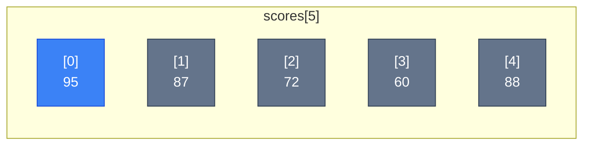
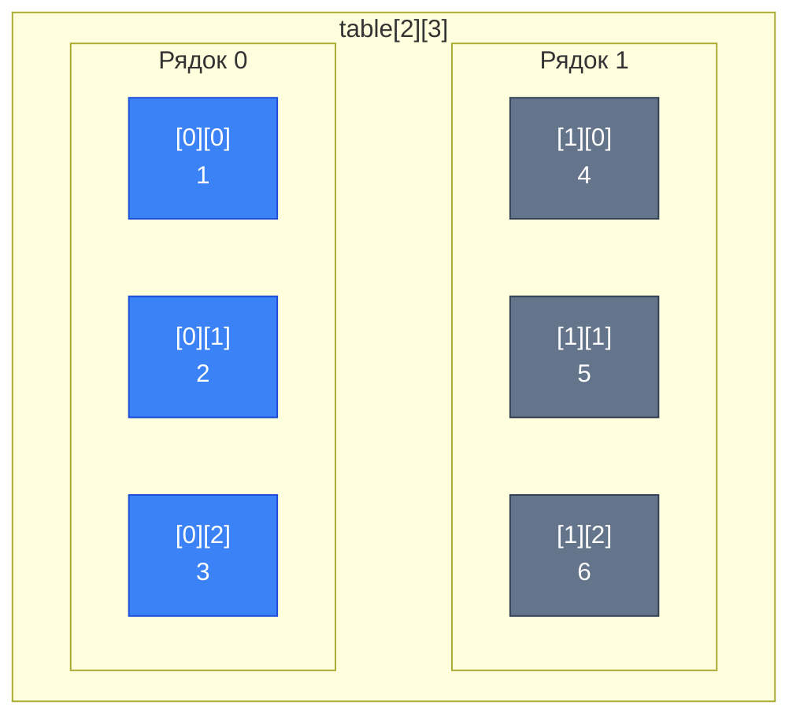

## Проблема: зберегти 30 оцінок

Уявіть задачу: прочитати оцінки 30 студентів, знайти середнє, максимум і мінімум, вивести тих, хто вище середньої. З тим, що ви вже знаєте, рішення виглядало б жахливо:

```cpp
int grade1, grade2, grade3; // ... grade30;
cin >> grade1 >> grade2 >> grade3; // ... >> grade30;
int sum = grade1 + grade2 + grade3; // + ... + grade30;
```

Тридцять окремих змінних, жодного способу обробити їх автоматично в циклі. А якщо студентів 300? 3000? Очевидно, що цей підхід нежиттєздатний.

Для таких ситуацій — зберігати **набір однотипних значень** і обробляти їх в циклі — існує фундаментальна структура даних: **масив** (array).

> **Масив** — це **іменована послідовність** елементів **одного типу**, що зберігаються у суміжних (поруч розташованих) ділянках пам'яті та доступні через числовий **індекс**.

Ключові слова у цьому визначенні: **одного типу** (масив `int` містить лише `int`) та **суміжних ділянках** (всі елементи розміщені підряд у пам'яті — це дає миттєвий доступ за індексом).

## Оголошення та ініціалізація

### Синтаксис оголошення

```cpp
тип ім'я[розмір];
```

```cpp
int grades[30];      // Масив із 30 цілих чисел
double prices[10];   // Масив із 10 дійсних чисел
char letters[5];     // Масив із 5 символів
bool flags[8];       // Масив із 8 логічних значень
```

Після цього оголошення в пам'яті резервується **безперервний блок**: для `int grades[30]` — 30 × 4 байти = 120 байтів.

::memory-view{title="RAM: int grades[30] (uninitialized)" startAddress="0x0100" :data='[0, 0, 0, 0, 0, 0, 0, 0]' :highlight="[]"}
::

::warning
Якщо оголосити масив без ініціалізації (`int grades[30];`), всі його елементи містять **сміттєві значення** — випадкові числа, що залишилися в пам'яті від попередніх програм. Завжди ініціалізуйте масив перед використанням!

::

### Ініціалізація при оголошенні

```cpp
// Явна ініціалізація всіх елементів
int scores[5] = {95, 87, 72, 60, 88};

// Ініціалізація нулями — якщо значень менше, решта = 0
int data[10] = {1, 2, 3};   // {1, 2, 3, 0, 0, 0, 0, 0, 0, 0}

// Ініціалізація ВСІХ елементів нулями
int zeros[100] = {0};

// Розмір виводиться автоматично з кількості елементів
int primes[] = {2, 3, 5, 7, 11};  // Розмір = 5

::memory-view{title="RAM: int scores[5]" startAddress="0x0120" :data='[0, 0, 0, 95, 0, 0, 0, 87, 0, 0, 0, 72, 0, 0, 0, 60, 0, 0, 0, 88]' :highlight="[3, 7, 11, 15, 19]"}
::
```

::tip
**Ініціалізація нулями `= {0}`** — найпоширеніший і безпечний спосіб підготувати масив до роботи. Він гарантує, що жоден елемент не міститиме «сміття».

::

### Константа для розміру масиву

**Ніколи** не пишіть розмір масиву «магічним числом» просто в коді. Замість цього використовуйте іменовану константу:

```cpp
// ❌ Погано — розмір розкиданий по коду
int grades[30];
for (int i = 0; i < 30; i++)
{
    // ...
}

// ✅ Добре — одна константа управляє всім
const int STUDENT_COUNT = 30;
int grades[STUDENT_COUNT];

for (int i = 0; i < STUDENT_COUNT; i++)
{
    // ...
}
```

Якщо знадобиться змінити кількість студентів на 50 — у першому варіанті доведеться знайти та замінити кожне `30` у всьому файлі. У другому — змінити одне значення константи.

## Доступ до елементів: індексація

Кожен елемент масиву має **індекс** (index) — порядковий номер, починаючи з **нуля**. Це одна з найважливіших особливостей C++ (і більшості мов програмування): перший елемент — `[0]`, другий — `[1]`, ..., останній — `[N-1]`.

```cpp
int scores[5] = {95, 87, 72, 60, 88};
//  індекси:      0   1   2   3   4
```

::mermaid



::

```cpp
// Зчитати значення елемента
cout << scores[0];  // 95 (перший)
cout << scores[4];  // 88 (останній)

// Записати значення
scores[2] = 100;    // Змінюємо третій елемент

// Використання змінної як індексу
int i = 3;
cout << scores[i];  // 60

::debugger-view{title="State: scores[i]" :variables='[{"name": "i", "type": "int", "value": "3"}, {"name": "scores[i]", "type": "int", "value": "60"}]'}
::
```

::caution
**Вихід за межі масиву** (out-of-bounds access) — одна з найнебезпечніших помилок у C++. Звернення до `scores[5]` або `scores[-1]` **не дає помилки компіляції** і навіть може не дати помилки під час виконання — натомість програма читає або пише у **довільну ділянку пам'яті**. Поведінка непередбачувана і часто катастрофічна. Завжди слідкуйте, щоб індекс знаходився в діапазоні `0 ... N-1`.

::

## Обхід масиву циклом

Масиви та цикли `for` — природне поєднання. Лічильник `i` стає індексом елемента:

```cpp [PrintArray.cpp] showLineNumbers
#include <iostream>

using namespace std;

int main()
{
    const int SIZE = 5;
    int scores[SIZE] = {95, 87, 72, 60, 88};

    // Виводимо всі елементи
    for (int i = 0; i < SIZE; i++)
    {
        cout << "scores[" << i << "] = " << scores[i] << "\n";
    }

    return 0;
}
```

**Результат:**

::terminal-preview{title="Execution: PrintArray"}

<div class="line">scores[0] = 95</div>
<div class="line">scores[1] = 87</div>
<div class="line">scores[2] = 72</div>
<div class="line">scores[3] = 60</div>
<div class="line">scores[4] = 88</div>
::

Зверніть на умову циклу: `i < SIZE`, а не `i <= SIZE`. При `SIZE = 5` коректні індекси — `0, 1, 2, 3, 4`. Значення `5` вже виходить за межі.

### Введення масиву з клавіатури

```cpp
const int SIZE = 5;
int values[SIZE];

cout << "Enter " << SIZE << " numbers:\n";

for (int i = 0; i < SIZE; i++)
{
    cout << "values[" << i << "]: ";
    cin >> values[i];
}
```

::terminal-preview{title="Execution: Input Array"}

<div class="line">Enter 5 numbers:</div>
<div class="line">values[0]: <span class="text-blue-400 font-bold">10</span></div>
<div class="line">values[1]: <span class="text-blue-400 font-bold">20</span></div>
<div class="line">values[2]: <span class="text-blue-400 font-bold">30</span></div>
<div class="line">values[3]: <span class="text-blue-400 font-bold">40</span></div>
<div class="line">values[4]: <span class="text-blue-400 font-bold">50</span></div>
::

### Range-based for (спрощений обхід)

У стандарті C++11 з'явився **range-based for** — спрощений синтаксис для обходу всіх елементів:

```cpp
int scores[] = {95, 87, 72, 60, 88};

for (int score : scores)
{
    cout << score << " ";
}
// Виведе: 95 87 72 60 88
```

Читається як: «для кожного `score` у `scores`». Не потрібен лічильник та розмір. Але є обмеження: не можна дізнатися поточний індекс, і цикл завжди йде вперед. Якщо потрібен індекс або зміна елемента — використовуйте звичайний `for`.

::note
У range-based for для **зміни** елементів масиву змінна має бути посиланням (`int& score : scores`). Без `&` ви отримуєте копію і оригінал не змінюється. Детальніше про посилання — у відповідному розділі.

::

## Алгоритми на масивах

### Сума та середнє

```cpp [AverageScore.cpp] showLineNumbers
#include <iostream>

using namespace std;

int main()
{
    const int SIZE = 6;
    int grades[SIZE] = {78, 92, 55, 88, 67, 95};

    int sum = 0;

    for (int i = 0; i < SIZE; i++)
    {
        sum += grades[i];
    }

    double average = (double)sum / SIZE;

    cout << "Sum: "     << sum     << "\n";
    cout << "Average: " << average << "\n";

    return 0;
}
```

::terminal-preview{title="Execution: Average Score"}

<div class="line">Sum: 495</div>
<div class="line">Average: 82.5</div>
::

- **Рядок 10**: Накопичувач `sum` ініціалізується нулем до циклу.
- **Рядок 17**: Явне приведення `(double)sum` перед діленням — щоб отримати дійсний результат, а не цілочисельне ділення.

### Пошук мінімуму та максимуму

```cpp
const int SIZE = 6;
int data[SIZE] = {34, 17, 89, 42, 11, 73};

int maxVal = data[0];  // Ініціалізуємо ПЕРШИМ елементом масиву
int minVal = data[0];

int maxIndex = 0;
int minIndex = 0;

for (int i = 1; i < SIZE; i++)  // Починаємо з 1, бо [0] вже взяли
{
    if (data[i] > maxVal)
    {
        maxVal = data[i];
        maxIndex = i;
    }
    if (data[i] < minVal)
    {
        minVal = data[i];
        minIndex = i;
    }
}

cout << "Max: " << maxVal << " at index " << maxIndex << "\n";
cout << "Min: " << minVal << " at index " << minIndex << "\n";
```

::terminal-preview{title="Execution: Min/Max Search"}

<div class="line">Max: 89 at index 2</div>
<div class="line">Min: 11 at index 4</div>
::

Ключовий момент: `maxVal` і `minVal` ініціалізуються `data[0]` — першим **реальним** елементом масиву. Ніколи не ініціалізуйте їх `0` або `-1`: якщо всі елементи масиву від'ємні, тоді `maxVal = 0` одразу стане хибним максимумом.

### Лінійний пошук (linear search)

Перевіряємо кожен елемент по черзі в пошуках потрібного значення:

```cpp
const int SIZE = 8;
int numbers[SIZE] = {14, 7, 33, 2, 56, 99, 12, 44};

int target;
cout << "Search for: ";
cin >> target;

int foundIndex = -1;  // -1 означає «не знайдено»

for (int i = 0; i < SIZE; i++)
{
    if (numbers[i] == target)
    {
        foundIndex = i;
        break;  // Знайшли — виходимо одразу
    }
}

if (foundIndex != -1)
{
    cout << target << " found at index " << foundIndex << "\n";
}
else
{
    cout << target << " not found.\n";
}
```

::terminal-preview{title="Execution: Linear Search"}

<div class="line">Search for: <span class="text-blue-400 font-bold">56</span></div>
<div class="line">56 found at index 4</div>
<div class="line"></div>
<div class="line">Search for: <span class="text-blue-400 font-bold">100</span></div>
<div class="line">100 not found.</div>
::

::debugger-view{title="State: Found Target" :variables='[{"name": "target", "type": "int", "value": "56"}, {"name": "foundIndex", "type": "int", "value": "4"}]'}
::

Значення `foundIndex = -1` — класичний «сигнальний» маркер: жодний коректний індекс не може бути -1, тому це безпечний спосіб позначити «не знайдено».

### Сортування бульбашкою (bubble sort)

**Сортування** (sorting) — упорядкування елементів масиву за зростанням або спаданням. Один з найпростіших алгоритмів — **сортування бульбашкою** (bubble sort): за кожен прохід порівнюємо сусідні елементи та міняємо їх місцями, якщо вони не в правильному порядку. Найбільший елемент «спливає» вгору, як бульбашка.

````cpp [BubbleSort.cpp] showLineNumbers
#include <iostream>

using namespace std;

int main()
{
    const int SIZE = 6;
    int arr[SIZE] = {64, 34, 25, 12, 22, 11};

    // Зовнішній цикл: N-1 проходів
    for (int pass = 0; pass < SIZE - 1; pass++)
    {
        // Внутрішній цикл: порівнюємо сусідів
        for (int i = 0; i < SIZE - 1 - pass; i++)
        {
            if (arr[i] > arr[i + 1])
            {
                // Міняємо елементи місцями
                int temp = arr[i];
                arr[i] = arr[i + 1];
                arr[i + 1] = temp;
            }
        }
    }

    // Виводимо відсортований масив
    for (int i = 0; i < SIZE; i++)
    {
        cout << arr[i] << " ";
    }
    cout << "\n";

    return 0;
}

::debugger-view{title="Trace: Bubble Sort (One Pass)" :variables='[{"name": "arr[0]", "type": "int", "value": "34"}, {"name": "arr[1]", "type": "int", "value": "25"}, {"name": "arr[2]", "type": "int", "value": "12"}, {"name": "arr[3]", "type": "int", "value": "22"}, {"name": "arr[4]", "type": "int", "value": "11"}, {"name": "arr[5]", "type": "int", "value": "64"}]' :highlight="[5]"}
::

::terminal-preview{title="Execution: Bubble Sort Result"}
<div class="line">11 12 22 25 34 64</div>
::

Розберемо механізм обміну (рядки 18–21):

```cpp
int temp = arr[i];      // Зберігаємо arr[i] у тимчасову змінну
arr[i] = arr[i + 1];   // Перекладаємо arr[i+1] на місце arr[i]
arr[i + 1] = temp;     // Перекладаємо збережений arr[i] на місце arr[i+1]
````

Без `temp` перший рядок `arr[i] = arr[i + 1]` знищив би оригінальне значення `arr[i]` — і воно було б втрачене. Тимчасова змінна — обов'язковий посередник при обміні.

**Трасування першого проходу** (масив `{64, 34, 25, 12, 22, 11}`):

| Порівняння                     | До                          | Після                            |
| :----------------------------- | :-------------------------- | :------------------------------- |
| `arr[0]` vs `arr[1]` (64 > 34) | `{64, 34, ...}`             | `{34, 64, ...}`                  |
| `arr[1]` vs `arr[2]` (64 > 25) | `{34, 64, 25, ...}`         | `{34, 25, 64, ...}`              |
| `arr[2]` vs `arr[3]` (64 > 12) | `{34, 25, 64, 12, ...}`     | `{34, 25, 12, 64, ...}`          |
| `arr[3]` vs `arr[4]` (64 > 22) | `{34, 25, 12, 64, 22, ...}` | `{34, 25, 12, 22, 64, ...}`      |
| `arr[4]` vs `arr[5]` (64 > 11) | `{..., 64, 11}`             | `{..., 11, 64}` ✅ `64` на місці |

Після першого проходу максимальний елемент `64` стоїть на останньому місці. Після другого проходу — `34` на передостанньому. І так далі.

**Результат:** `11 12 22 25 34 64`

## Двовимірні масиви

Одновимірний масив — це рядок. **Двовимірний** (2D) масив — це **таблиця** з рядками і стовпцями. Він природно моделює матриці, шахові дошки, карти рівнів у грі.

### Оголошення та ініціалізація

```cpp
тип ім'я[рядки][стовпці];

// Приклад: матриця 3×4 (3 рядки, 4 стовпці)
int matrix[3][4];

// Ініціалізація
int table[2][3] = {
    {1, 2, 3},   // Рядок 0
    {4, 5, 6}    // Рядок 1
};
```

::mermaid



::

::memory-view{title="RAM: 2D Array matrix[2][3]" startAddress="0x0200" :data='[0, 0, 0, 1, 0, 0, 0, 2, 0, 0, 0, 3, 0, 0, 0, 4, 0, 0, 0, 5, 0, 0, 0, 6]' :highlight="[3, 7, 11, 15, 19, 23]"}
::

### Обхід двовимірного масиву

Для обходу потрібні **два вкладені цикли**: зовнішній — по рядках, внутрішній — по стовпцях.

```cpp
const int ROWS = 3;
const int COLS = 4;

int matrix[ROWS][COLS] = {
    {1,  2,  3,  4},
    {5,  6,  7,  8},
    {9, 10, 11, 12}
};

// Вивід у вигляді таблиці
for (int row = 0; row < ROWS; row++)
{
    for (int col = 0; col < COLS; col++)
    {
        cout << matrix[row][col] << "\t";
    }
    cout << "\n";  // Перехід на новий рядок після кожного рядка матриці
}
```

::terminal-preview{title="Execution: Matrix output"}

<div class="line">1    2    3    4</div>
<div class="line">5    6    7    8</div>
<div class="line">9    10   11   12</div>
::

### Практичний приклад: успішність матриці студентів

```cpp [GradeMatrix.cpp] showLineNumbers
#include <iostream>

using namespace std;

int main()
{
    const int STUDENTS = 3;
    const int SUBJECTS = 4;

    int grades[STUDENTS][SUBJECTS] = {
        {85, 92, 78, 90},   // Студент 0
        {70, 65, 88, 75},   // Студент 1
        {95, 98, 100, 92}   // Студент 2
    };

    // Середня оцінка кожного студента
    for (int student = 0; student < STUDENTS; student++)
    {
        int sum = 0;

        for (int subject = 0; subject < SUBJECTS; subject++)
        {
            sum += grades[student][subject];
        }

        double average = (double)sum / SUBJECTS;
        cout << "Student " << student << " average: " << average << "\n";
    }

    return 0;
}
```

- **Рядки 10–14**: Ініціалізація матриці: кожен рядок — один студент, кожен стовпець — одна дисципліна.
- **Рядки 17–27**: Для кожного студента окремо накопичується сума оцінок по всіх предметах (внутрішній цикл), потім ділиться на кількість предметів.

**Результат:**

```
Student 0 average: 86.25
Student 1 average: 74.5
Student 2 average: 96.25
```

::terminal-preview{title="Execution: Grade Matrix"}

<div class="line">Student 0 average: 86.25</div>
<div class="line">Student 1 average: 74.5</div>
<div class="line">Student 2 average: 96.25</div>
::

::debugger-view{title="State: Grade Matrix Processing" :variables='[{"name": "student", "type": "int", "value": "2"}, {"name": "sum", "type": "int", "value": "385"}, {"name": "average", "type": "double", "value": "96.25"}]'}
::

## Масиви та рядки (`char` масиви)

У C++ рядок тексту — це масив символів типу `char`, що закінчується спеціальним символом `'\0'` (нуль-термінатор). Цей підхід успадкований з мови C.

```cpp
// Оголошення рядка як масиву char
char name[20] = "Ivan";
//   Фактично: {'I', 'v', 'a', 'n', '\0', ?, ?, ...}
//   Нуль-термінатор '\0' показує кінець рядка

::memory-view{title="RAM: char name[20]" startAddress="0x0300" :data='[73, 118, 97, 110, 0, 0, 0, 0]' :highlight="[0, 1, 2, 3, 4]"}
::
```

```cpp
// Введення та виведення рядка
char city[50];
cout << "Enter city: ";
cin >> city;       // Зчитує одне слово (до пробілу)
cout << city;      // cout знає, де кінець — за '\0'
```

::terminal-preview{title="Execution: char array string"}

<div class="line">Enter city: <span class="text-blue-400 font-bold">Kyiv</span></div>
<div class="line">Kyiv</div>
::

::note
Тип `string` (з бібліотеки `<string>`) — більш зручний та безпечний спосіб роботи з текстом у C++. `char`-масиви — це низькорівневий підхід, важливий для розуміння внутрішньої механіки. У сучасному коді переважно використовується `string`. З ним ми детально познайомимося в окремому розділі.

::

## Повний приклад: Журнал оцінок

Реалізуємо повну програму: введення оцінок студентів, підрахунок статистики та виведення тих, хто вище середнього.

```cpp [GradeBook.cpp] showLineNumbers
#include <iostream>

using namespace std;

int main()
{
    const int SIZE = 5;
    int grades[SIZE];
    int sum = 0;

    // Введення оцінок
    cout << "Enter " << SIZE << " grades:\n";

    for (int i = 0; i < SIZE; i++)
    {
        cout << "Student " << (i + 1) << ": ";
        cin >> grades[i];
        sum += grades[i];  // Суму рахуємо відразу при введенні
    }

    // Обчислення середнього
    double average = (double)sum / SIZE;

    // Пошук max/min
    int maxGrade = grades[0];
    int minGrade = grades[0];

    for (int i = 1; i < SIZE; i++)
    {
        if (grades[i] > maxGrade) maxGrade = grades[i];
        if (grades[i] < minGrade) minGrade = grades[i];
    }

    // Вивід статистики
    cout << "\n--- Results ---\n";
    cout << "Average: " << average << "\n";
    cout << "Max:     " << maxGrade << "\n";
    cout << "Min:     " << minGrade << "\n";

    // Хто вище середнього?
    cout << "\nAbove average:\n";

    for (int i = 0; i < SIZE; i++)
    {
        if (grades[i] > average)
        {
            cout << "  Student " << (i + 1)
                 << ": " << grades[i] << "\n";
        }
    }

    return 0;
}
```

Важлива деталь — **рядок 18**: накопичуємо суму `sum += grades[i]` прямо під час введення. Це дозволяє обійтися одним циклом замість двох (введення + підрахунок суми). Після виходу з циклу і масив заповнений, і сума порахована.

**Приклад роботи:**

```
Enter 5 grades:
Student 1: 78
Student 2: 92
Student 3: 55
Student 4: 88
Student 5: 67

--- Results ---
Average: 76
Max:     92
Min:     55

Above average:
  Student 4: 88
```

::terminal-preview{title="Execution: GradeBook"}

<div class="line">Enter 5 grades:</div>
<div class="line">Student 1: <span class="text-blue-400 font-bold">78</span></div>
<div class="line">Student 2: <span class="text-blue-400 font-bold">92</span></div>
<div class="line">Student 3: <span class="text-blue-400 font-bold">55</span></div>
<div class="line">Student 4: <span class="text-blue-400 font-bold">88</span></div>
<div class="line">Student 5: <span class="text-blue-400 font-bold">67</span></div>
<div class="line"></div>
<div class="line">--- Results ---</div>
<div class="line">Average: 76</div>
<div class="line">Max:     92</div>
<div class="line">Min:     55</div>
<div class="line"></div>
<div class="line">Above average:</div>
<div class="line">  Student 1: 78</div>
<div class="line">  Student 2: 92</div>
<div class="line">  Student 4: 88</div>
::

## Практичні завдання

### Рівень 1 — Базовий

::collapsible{title="Завдання 1.1: Заповнення та вивід"}
Оголосіть масив із 7 цілих чисел. Заповніть його квадратами чисел від 1 до 7 (без ручного введення, лише через формулу `i * i` у циклі). Виведіть елементи у двох форматах:

```
Inline: 1 4 9 16 25 36 49
Index view:
[0] = 1
[1] = 4
...
[6] = 49
```

::

::collapsible{title="Завдання 1.2: Виправте помилки"}
Знайдіть всі помилки у фрагменті коду. Їх щонайменше 4:

```cpp
const int N = 5;
int arr[N];
arr = {1, 2, 3, 4, 5};       // Помилка 1

for (int i = 1; i <= N; i++)  // Помилка 2
{
    cout << arr[i];
}

int last = arr[N];             // Помилка 3
int sum;                       // Помилка 4
sum += arr[0];
```

::

### Рівень 2 — Логічний

::collapsible{title="Завдання 2.1: Обернення масиву"}
Напишіть програму, яка зчитує 6 чисел у масив, а потім виводить їх у **зворотному порядку** (без другого масиву — лише через зміну індексу).

**Приклад:**

```
Input:  1 2 3 4 5 6
Output: 6 5 4 3 2 1
```

::

::collapsible{title="Завдання 2.2: Підрахунок повторень"}
Зчитайте 10 чисел (від 1 до 5 включно) у масив. Підрахуйте, скільки разів зустрічається кожне з чисел від 1 до 5.

**Підказка**: Використовуйте другий масив `int count[6] = {0};` (індекс = число). При зустрічі числа `x` виконайте `count[x]++`.

**Приклад:**

```
Input: 3 1 4 1 5 9 2 6 5 3   ← (якщо не в межах — пропускати)
1: 2 times
2: 1 time
3: 2 times
...
```

::

::collapsible{title="Завдання 2.3: Злиття двох масивів"}
Дано два відсортованих масиви по 3 елементи. Заповніть третій масив розміром 6 так, щоб він теж був відсортованим.

**Підказка**: Порівнюйте поточні елементи обох масивів і завжди беріть менший.

**Приклад:**

```
A: 1 4 7
B: 2 5 9
C: 1 2 4 5 7 9
```

::

### Рівень 3 — Творчий

::collapsible{title="Завдання 3.1: Гра «Пам'ять»"}
Реалізуйте текстову гру «Пам'ять». Програма:

1. Виводить масив із 6 чисел (наприклад, `{3, 7, 1, 9, 4, 6}`) на 2 секунди
2. «Очищає» екран (виводить 20 порожніх рядків)
3. Запитує користувача — яке число стояло на позиції `i` (позиція вводиться)?
4. Перевіряє відповідь і виводить `Correct!` або `Wrong! It was X.`

**Підказка**: Паузу можна зімітувати через цикл `for (int i = 0; i < 100000000; i++);` або `#include <windows.h>` + `Sleep(2000)`.

::

::collapsible{title="Завдання 3.2: Матриця — сума рядків та стовпців"}
Оголосіть матрицю 3×3. Заповніть її числами з клавіатури. Виведіть:

- Суму кожного рядка
- Суму кожного стовпця
- Суму головної діагоналі (елементи `[0][0]`, `[1][1]`, `[2][2]`)

**Приклад:**

```
Matrix:
1  2  3
4  5  6
7  8  9

Row sums:    6   15   24
Col sums:   12   15   18
Diagonal:   15
```

::

## Підсумок

::card-group

::card{title="📌 Оголошення" icon="i-lucide-database"}
`тип ім'я[розмір];` — масив однотипних елементів. Розмір — через `const` константу. Ініціалізація `= {0}` гарантує відсутність сміттєвих значень.

::

::card{title="📌 Індексація" icon="i-lucide-hash"}
Елементи — від `[0]` до `[N-1]`. Вихід за межі (`[N]` або `[-1]`) — невизначена поведінка без помилки компіляції.

::

::card{title="📌 Обхід" icon="i-lucide-repeat"}
Класичний `for (int i = 0; i < SIZE; i++)`. Range-based `for (int x : arr)` — якщо індекс не потрібен.

::

::card{title="📌 Алгоритми" icon="i-lucide-cpu"}
Сума/середнє — накопичувач. Min/max — ініціалізація першим елементом. Пошук — `foundIndex = -1`. Обмін — через `temp`.

::

::card{title="📌 2D масив" icon="i-lucide-grid"}
`тип ім'я[рядки][стовпці]`. Обхід — двома вкладеними циклами. Доступ: `arr[row][col]`.

::

::card{title="📌 Сортування" icon="i-lucide-arrow-up-narrow-wide"}
Bubble sort: N-1 проходів, порівняння сусідів, обмін через `temp`. Простий, але O(n²) — для навчання.

::

::
