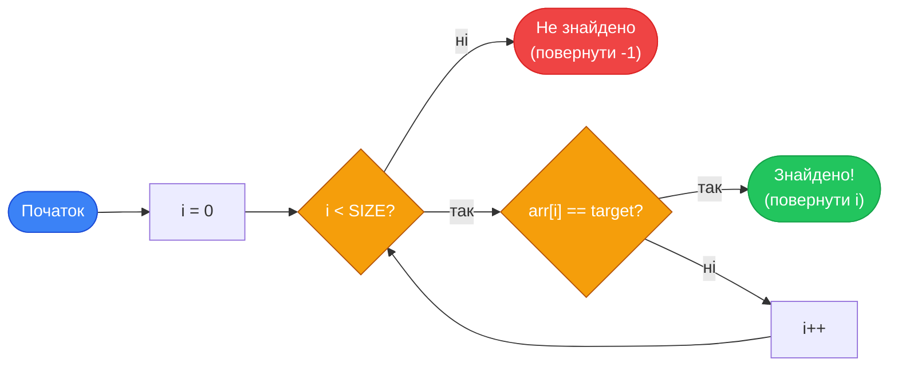
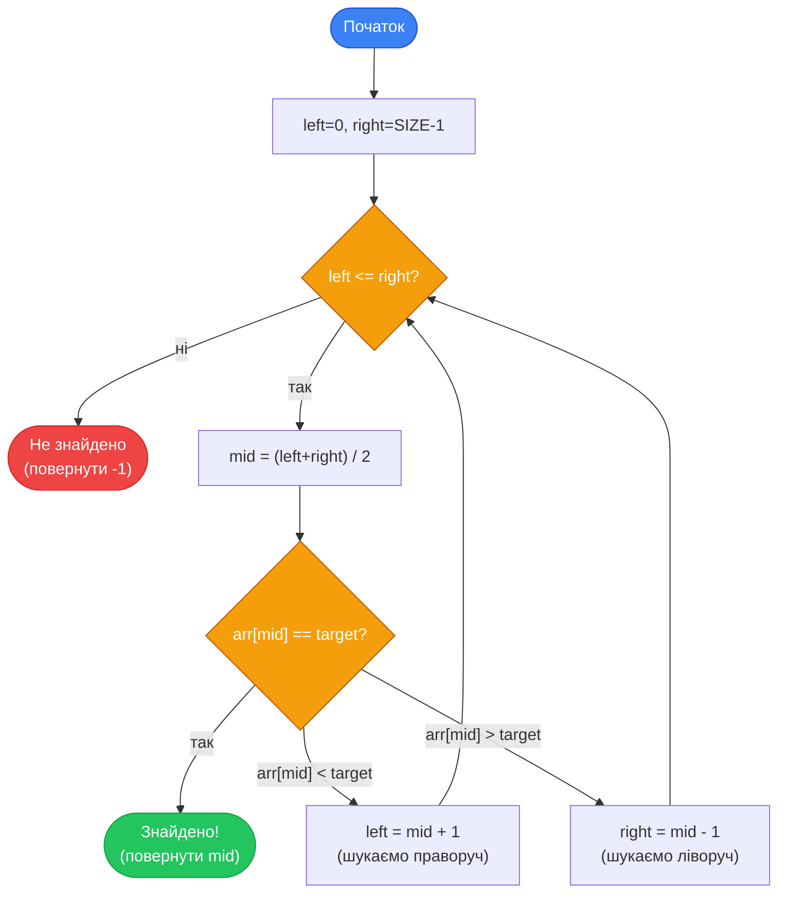

## Задача пошуку

Пошук — одна з найбільш вживаних операцій у програмуванні. Пошуковик Google шукає сторінку серед мільярдів. Банківська система шукає рахунок серед мільйонів клієнтів. Ваш редактор коду шукає слово у файлі. Скрізь одна й та сама фундаментальна задача: маємо колекцію елементів — знайдіть серед них той, що відповідає умові.

Здавалося б, що тут думати: переглядай по черзі, поки не знайдеш. Але «переглядай по черзі» для мільярда елементів займе секунди. А якщо дані **впорядковані** — можна скоротити час у мільйони разів. Саме цю різницю демонструють два класичні алгоритми: **лінійний** та **бінарний** пошук.

## Лінійний пошук (Linear Search)

### Ідея

Лінійний пошук (linear search) — найпростіший можливий алгоритм: перевіряємо елементи **по черзі**, від першого до останнього, поки не знайдемо потрібний або не вичерпаємо весь масив. Жодних передумов до даних — масив може бути довільним.

Аналогія: ви шукаєте ключі у квартирі. Не знаєте, де вони лежать — перевіряєте кожну кімнату по черзі. Якщо знайшли — зупиняєтеся. Якщо обійшли всю квартиру — значить, ключів немає.

### Покрокове трасування

Масив: `{14, 7, 33, 2, 56, 99, 12}`, шукаємо `56`.

| Крок | Індекс | Елемент | Порівняння |
|:-----|:-------|:--------|:-----------|
| 1 | 0 | 14 | 14 == 56? ❌ |
| 2 | 1 | 7 | 7 == 56? ❌ |
| 3 | 2 | 33 | 33 == 56? ❌ |
| 4 | 3 | 2 | 2 == 56? ❌ |
| 5 | 4 | **56** | 56 == 56? ✅ Знайдено! |

Виконано **5 порівнянь**. Якби `56` стояло на останньому місці — знадобилося б 7. Якби його не було — теж 7 (перевірити весь масив).

::mermaid



::

### Реалізація

```cpp [LinearSearch.cpp] showLineNumbers
#include <iostream>

using namespace std;

// Повертає індекс знайденого елемента або -1
int linearSearch(int arr[], int size, int target)
{
    for (int i = 0; i < size; i++)
    {
        if (arr[i] == target)
        {
            return i;  // Знайшли — повертаємо індекс одразу
        }
    }

    return -1;  // Не знайдено
}

int main()
{
    const int SIZE = 7;
    int numbers[SIZE] = {14, 7, 33, 2, 56, 99, 12};

    int target;
    cout << "Search for: ";
    cin >> target;

    int result = linearSearch(numbers, SIZE, target);

    if (result != -1)
    {
        cout << target << " found at index " << result << "\n";
    }
    else
    {
        cout << target << " not found.\n";
    }

    return 0;
}
```

::terminal-preview{title="Execution: Linear Search"}
<div class="line">Search for: <span class="text-blue-400 font-bold">56</span></div>
<div class="line">56 found at index 4</div>
::

::debugger-view{title="State: Linear Search (i=4)" :variables='[{"name": "i", "type": "int", "value": "4"}, {"name": "arr[i]", "type": "int", "value": "56"}, {"name": "target", "type": "int", "value": "56"}]' :highlight="[1]"}
::

Кілька деталей:

- **Рядок 6**: Функція приймає масив, його розмір та шукане значення — і повертає індекс або `-1`. Значення `-1` — загальноприйнятий сигнал «не знайдено», адже жоден коректний індекс не може бути від'ємним.
- **Рядок 12**: `return i` всередині циклу — **достроковий вихід** з функції. Як тільки елемент знайдено, немає сенсу продовжувати перевірку.
- **Рядок 16**: Якщо цикл завершився без `return` — жодного збігу не знайдено.

### Пошук усіх входжень

Базовий алгоритм знаходить лише **перший** збіг. Якщо потрібні **всі** позиції, де зустрічається значення — не виходимо при знаходженні, а продовжуємо:

```cpp
int target = 3;
int count = 0;

cout << "Found at indexes: ";

for (int i = 0; i < SIZE; i++)
{
    if (arr[i] == target)
    {
        cout << i << " ";
        count++;
    }
}

cout << "\nTotal: " << count << "\n";
```

### Аналіз складності

| Випадок | Складність | Коли |
|:--------|:-----------|:-----|
| **Best case** | O(1) | Елемент — на першій позиції |
| **Average case** | O(n) | Елемент — десь у середині |
| **Worst case** | O(n) | Елемент — наприкінці або відсутній |

У **середньому** лінійний пошук переглядає половину масиву, але асимптотично це все одно O(n) — кількість операцій лінійно зростає з розміром масиву.

**Переваги лінійного пошуку:**
- Працює на **будь-якому** масиві — відсортованому та невідсортованому
- Гранично простий у реалізації
- Ефективний для **малих** масивів (до ~100 елементів)

**Недоліки:**
- O(n) — не масштабується на великих даних
- Не використовує структуру (відсортованість) даних

---

## Бінарний пошук (Binary Search)

### Ідея: «Відгадай число» за 20 запитань

Уявіть гру: загадано число від 1 до 1 000 000. Ви можете ставити запитання «більше чи менше за X?». Скільки запитань потрібно гарантовано відгадати число?

Якщо діяти лінійно — до 1 000 000 запитань. Але якщо **кожного разу ділити залишок навпіл**: перше питання `X = 500 000` (половина). Якщо відповідь «більше» — загадане в `[500 001, 1 000 000]`. Наступне — `750 000`. І так далі. Кожне запитання **вдвічі** скорочує область пошуку.

За 20 запитань: `2²⁰ = 1 048 576 > 1 000 000`. Тобто **20 запитань** гарантовано достатньо для мільйона варіантів. Це O(log n).

**Ось і є бінарний пошук.** Але він вимагає однієї критичної передумови: масив має бути **відсортований**.

::caution
**Бінарний пошук працює ЛИШЕ на відсортованому масиві.** Застосування його до невідсортованих даних дасть некоректний результат без жодного повідомлення про помилку. Якщо масив не відсортований — спочатку відсортуйте.

::

### Принцип роботи

1. Маємо відсортований масив і шукане значення `target`.
2. Визначаємо три покажчики: `left = 0`, `right = SIZE - 1`, `mid = (left + right) / 2`.
3. Порівнюємо `arr[mid]` з `target`:
   - `arr[mid] == target` → знайшли! Повертаємо `mid`.
   - `arr[mid] < target` → елемент у **правій** половині. `left = mid + 1`.
   - `arr[mid] > target` → елемент у **лівій** половині. `right = mid - 1`.
4. Повторюємо, поки `left <= right`. Якщо цикл завершився — елемента немає.

### Покрокове трасування

Відсортований масив: `{1, 3, 5, 7, 9, 11, 13, 15, 17, 19}` (10 елементів), шукаємо `7`.

**Ітерація 1:**
```
left=0, right=9, mid=(0+9)/2=4
arr[4] = 9
9 > 7 → шукаємо ліворуч: right = mid-1 = 3
```

**Ітерація 2:**
```
left=0, right=3, mid=(0+3)/2=1
arr[1] = 3
3 < 7 → шукаємо праворуч: left = mid+1 = 2
```

**Ітерація 3:**
```
left=2, right=3, mid=(2+3)/2=2
arr[2] = 5
5 < 7 → шукаємо праворуч: left = mid+1 = 3
```

**Ітерація 4:**
```
left=3, right=3, mid=(3+3)/2=3
arr[3] = 7
7 == 7 → ✅ Знайдено! Індекс = 3
```

**4 порівняння** для масиву з 10 елементів. Лінійний пошук у найгіршому випадку потребував би 10.

::mermaid



::

### Реалізація ітеративна

```cpp [BinarySearch.cpp] showLineNumbers
#include <iostream>

using namespace std;

// Масив ОБОВ'ЯЗКОВО відсортований!
// Повертає індекс або -1
int binarySearch(int arr[], int size, int target)
{
    int left = 0;
    int right = size - 1;

    while (left <= right)
    {
        int mid = left + (right - left) / 2;  // Безпечний розрахунок mid

        if (arr[mid] == target)
        {
            return mid;
        }
        else if (arr[mid] < target)
        {
            left = mid + 1;   // Відкидаємо ліву половину
        }
        else
        {
            right = mid - 1;  // Відкидаємо праву половину
        }
    }

    return -1;
}

int main()
{
    const int SIZE = 10;
    int sorted[SIZE] = {1, 3, 5, 7, 9, 11, 13, 15, 17, 19};

    int target;
    cout << "Search for: ";
    cin >> target;

    int result = binarySearch(sorted, SIZE, target);

    if (result != -1)
    {
        cout << target << " found at index " << result << "\n";
    }
    else
    {
        cout << target << " not found.\n";
    }

    return 0;
}
```

Важлива деталь у **рядку 14**: обчислення `mid` як `left + (right - left) / 2`, а не `(left + right) / 2`. Математично результат однаковий, але другий варіант може викликати **переповнення** (overflow) типу `int`, якщо `left` і `right` — великі числа (наприклад, для масиву з мільярдів елементів: `left + right` перевищить `INT_MAX`). Перший варіант безпечний завжди.

### Реалізація рекурсивна

Бінарний пошук природно виражається рекурсією — кожен виклик вирішує задачу на вдвічі меншому підмасиві:

```cpp [BinarySearchRecursive.cpp] showLineNumbers
#include <iostream>

using namespace std;

int binarySearchRecursive(int arr[], int left, int right, int target)
{
    // Базовий випадок: область пошуку порожня
    if (left > right)
    {
        return -1;
    }

    int mid = left + (right - left) / 2;

    if (arr[mid] == target)
    {
        return mid;
    }
    else if (arr[mid] < target)
    {
        // Рекурсивно шукаємо у правій половині
        return binarySearchRecursive(arr, mid + 1, right, target);
    }
    else
    {
        // Рекурсивно шукаємо у лівій половині
        return binarySearchRecursive(arr, left, mid - 1, target);
    }
}

int main()
{
    const int SIZE = 10;
    int sorted[SIZE] = {1, 3, 5, 7, 9, 11, 13, 15, 17, 19};

    int target = 11;
    int result = binarySearchRecursive(sorted, 0, SIZE - 1, target);

    if (result != -1)
    {
        cout << target << " found at index " << result << "\n";
    }
    else
    {
        cout << target << " not found.\n";
    }

    return 0;
}
```

Рекурсивна та ітеративна версії **абсолютно еквівалентні** за результатом та складністю O(log n). Ітеративна версія трохи ефективніша (немає накладних витрат на виклики функцій і стек рекурсії). Рекурсивна — виразніша і ближча до математичного визначення.

### Аналіз складності

| Випадок | Складність | Коли |
|:--------|:-----------|:-----|
| **Best case** | O(1) | Елемент — рівно на середній позиції |
| **Average case** | O(log n) | Стандартний випадок |
| **Worst case** | O(log n) | Елемент на краю або відсутній |
| **Пам'ять (ітеративна)** | O(1) | Лише кілька змінних |
| **Пам'ять (рекурсивна)** | O(log n) | Стек рекурсивних викликів |

---

## Порівняння: лінійний vs бінарний

### Складність

| n (розмір) | Лінійний (O(n)) | Бінарний (O(log n)) |
|:-----------|:----------------|:--------------------|
| 10 | 10 | 4 |
| 100 | 100 | 7 |
| 1 000 | 1 000 | 10 |
| 1 000 000 | 1 000 000 | 20 |
| 1 000 000 000 | 1 000 000 000 | 30 |

Різниця між 1 000 000 000 та **30** операціями — це різниця між «секундами» та «миттєво».

### Наочна схема: пошук у 16 елементах

```
Лінійний пошук (шукаємо 14-й елемент):
■ ■ ■ ■  ■ ■ ■ ■  ■ ■ ■ ■  ■ ■ ← стоп
1 2 3 4  5 6 7 8  9 ...    14 (14 порівнянь)

Бінарний пошук:
[0 ............ 15]   mid=7 → 14>arr[7] → правіше
         [8 .... 15]  mid=11 → 14>arr[11] → правіше
               [12..15] mid=13 → 14>arr[13] → правіше
                  [14..15] mid=14 → ✅ (4 порівняння)
```

### Зведена таблиця

| Критерій | Лінійний | Бінарний |
|:---------|:---------|:---------|
| **Складність** | O(n) | O(log n) |
| **Передумова** | Немає | Масив відсортований |
| **Структура даних** | Будь-яка | Тільки впорядкована |
| **Best case** | O(1) | O(1) |
| **Реалізація** | Тривіальна | Проста, але є нюанси |
| **N = 1 000 000** | ~500 000 порівнянь | ~20 порівнянь |
| **Коли обирати** | Малі масиви, невідсортовані дані, пошук усіх входжень | Великі відсортовані масиви |

### Чи завжди бінарний кращий?

Бінарний пошук **не завжди** виграє. Кілька сценаріїв, де лінійний пошук виправданий:

1. **Масив невідсортований, і сортувати не варто.** Якщо пошук виконується один раз — сортування (O(n log n)) дорожче, ніж лінійний пошук (O(n)).
2. **Масив малий** (до 20–30 елементів). Різниця між 20 та 5 порівняннями непомітна, а простота лінійного пошуку цінна.
3. **Потрібно знайти всі входження** або виконати умовний пошук (не за рівністю, а за предикатом). Лінійний пошук гнучкіший.
4. **Дані надходять динамічно** (онлайн-пошук). Підтримувати відсортованість при постійних вставках дорого.

---

## Практичні завдання

### Рівень 1 — Базовий

::collapsible{title="Завдання 1.1: Трасування бінарного пошуку"}
Виконайте бінарний пошук вручну для масиву `{2, 5, 8, 12, 16, 23, 38, 56, 72, 91}` та значення `target = 23`. Запишіть значення `left`, `right`, `mid` та `arr[mid]` на кожній ітерації.

Скільки ітерацій знадобилося? Яке максимальне число ітерацій для масиву з 10 елементів?

::

::collapsible{title="Завдання 1.2: Пошук першого від'ємного"}
Напишіть функцію лінійного пошуку, яка знаходить **перший від'ємний елемент** у масиві та повертає його індекс. Якщо від'ємних немає — повертає `-1`.

```
{5, 12, -3, 8, -1, 4} → індекс 2 (значення -3)
{1, 2, 3, 4, 5}       → -1
```

::

### Рівень 2 — Логічний

::collapsible{title="Завдання 2.1: Бінарний пошук — перше входження"}
У масиві можуть бути **дублікати**: `{1, 3, 3, 3, 5, 7, 9}`. Стандартний бінарний пошук знайде **якийсь** елемент зі значенням 3, але не обов'язково перший. Модифікуйте алгоритм так, щоб він завжди повертав **перший** (найлівіший) збіг.

**Підказка**: коли знайдено збіг (`arr[mid] == target`), не повертайте одразу `mid` — запишіть `result = mid` і продовжуйте пошук у лівій половині (`right = mid - 1`).

::

::collapsible{title="Завдання 2.2: Пошук у 2D матриці"}
Дана матриця `N×M`, де кожен рядок відсортований, а перший елемент кожного рядка більший за останній елемент попереднього (тобто вся матриця «відсортована» якщо читати рядками). Реалізуйте пошук значення `target`.

**Підказка**: Можна «розгорнути» 2D індекс у 1D — `row = mid / COLS`, `col = mid % COLS`. Тоді бінарний пошук працює від `0` до `ROWS*COLS-1`.

```
Matrix:
 1   3   5   7
10  11  16  20
23  30  34  60

target = 16 → знайдено (рядок 1, стовпець 2) ✅
target = 13 → не знайдено ❌
```

::

### Рівень 3 — Творчий

::collapsible{title="Завдання 3.1: Телефонна книга"}
Реалізуйте просту телефонну книгу. Зберігайте пари (ім'я, номер) у двох паралельних масивах `char names[N][20]` та `int phones[N]`. Масив вже відсортований за іменами.

Реалізуйте пошук за ім'ям через лінійний пошук та виведіть відповідний номер. Якщо не знайдено — повідомте про це.

**Вхід:** `Alice` → `Вихід: Alice: +380501234567`

::

::collapsible{title="Завдання 3.2: Квадратний корінь через бінарний пошук"}
Бінарний пошук можна застосувати не лише до масивів, а й до **числових діапазонів**. Реалізуйте обчислення цілої частини квадратного кореня числа `n` без використання `sqrt()`.

Алгоритм: бінарний пошук у діапазоні `[0, n]`. На кожному кроці перевіряємо: `mid*mid <= n` — тоді `left = mid + 1`, інакше `right = mid - 1`. Відповідь — `right` після завершення.

```
n = 25 → 5  (5² = 25)
n = 30 → 5  (5² = 25 ≤ 30, 6² = 36 > 30)
n = 2  → 1
```

::

## Підсумок

::card-group

::card{title="📌 Лінійний пошук O(n)" icon="i-lucide-scan-line"}
Перевіряє елементи по черзі. Жодних передумов. Повертає індекс або -1. Підходить для малих і невідсортованих масивів.

::

::card{title="📌 Бінарний пошук O(log n)" icon="i-lucide-scissors"}
Вдвічі звужує область пошуку щокроку. Вимагає відсортованого масиву. Для 1 000 000 елементів — лише 20 кроків.

::

::card{title="📌 Безпечний mid" icon="i-lucide-shield"}
Завжди обчислюйте `mid = left + (right - left) / 2`, а не `(left + right) / 2` — щоб уникнути переповнення для великих індексів.

::

::card{title="📌 Коли що обирати" icon="i-lucide-git-branch"}
Невідсортований або малий масив → лінійний. Великий відсортований масив → бінарний. Один пошук у невідсортованому → лінійний (сортувати дорожче).

::

::
