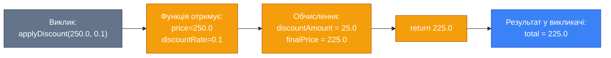
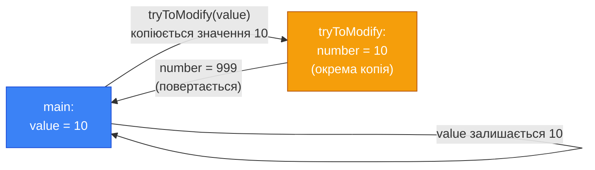

## Проблема, яку вирішують функції

Уявіть програму, що розраховує знижку для трьох різних категорій товарів. Без функцій вона може виглядати так:

```cpp
// Категорія 1
float cost1 = 250.0;
float discount1 = cost1 * 0.1;
float total1 = cost1 - discount1;
cout << "Total 1: " << total1 << "\n";

// Категорія 2
float cost2 = 480.0;
float discount2 = cost2 * 0.1;
float total2 = cost2 - discount2;
cout << "Total 2: " << total2 << "\n";

// Категорія 3
float cost3 = 130.0;
float discount3 = cost3 * 0.1;
float total3 = cost3 - discount3;
cout << "Total 3: " << total3 << "\n";
```

На перший погляд — нормально. Але придивіться: три блоки роблять **абсолютно одне і те саме**, різниться лише число. Тепер уявіть, що відсоток знижки змінився з 10% на 15%. Потрібно знайти та замінити `0.1` у всіх трьох місцях. А якщо таких місць не три, а тридцять? Одна пропущена заміна — і програма дає неправильний результат.

Ця проблема має назву **дублювання коду** (code duplication) і є одним з найбільших «гріхів» у програмуванні. Принцип **DRY** — _Don't Repeat Yourself_ (не повторюйся) — свідчить: кожна одиниця знання повинна мати єдине, однозначне місце у системі.

**Функція** (function) — іменований блок коду, що виконує певну задачу і може бути викликаний з будь-якого місця програми стільки разів, скільки потрібно. Функції — головний інструмент боротьби з дублюванням. Але не лише: вони також дозволяють розбити складну задачу на прості підзадачі, зробити код зрозумілішим та легшим для тестування.

::card-group

::card{title="♻️ Повторне використання" icon="i-lucide-repeat-2"}
Написали один раз — викликаєте скільки потрібно. Зміна логіки — в одному місці.

::

::card{title="🧩 Декомпозиція" icon="i-lucide-puzzle"}
Розбиваємо велику задачу на маленькі, зрозумілі підзадачі. Кожна функція — один обов'язок.

::

::card{title="📖 Читабельність" icon="i-lucide-book-open"}
`calculateDiscount(cost)` читається як природна мова. Читач розуміє намір без вивчення деталей реалізації.

::

::card{title="🔬 Тестованість" icon="i-lucide-test-tube"}
Маленьку функцію легко перевірити ізольовано. Якщо `calculateDiscount(100.0)` повертає `90.0` — вона коректна.

::

::

## Анатомія функції

Повний синтаксис функції в C++:

```cpp
тип_повернення ім'я_функції(тип параметр1, тип параметр2)
{
    // Тіло функції
    return значення;
}
```

Розберемо конкретний приклад — функцію розрахунку вартості зі знижкою:

```cpp
float applyDiscount(float price, float discountRate)
{
    float discountAmount = price * discountRate;
    float finalPrice = price - discountAmount;
    return finalPrice;
}
```

Кожна частина несе своє значення:

- **`float`** (перед іменем) — **тип повернення** (return type): тип значення, яке функція обчислює та повертає викликачу. Тут — дійсне число.
- **`applyDiscount`** — **ім'я функції** (function name): у стилі `camelCase`, дієслово або дієслівна фраза, що описує дію.
- **`float price, float discountRate`** — **список параметрів** (parameter list): змінні, що отримують вхідні дані. Кожен параметр — окрема пара `тип ім'я`.
- **Тіло** `{ ... }` — реалізація: послідовність інструкцій, що обчислюють результат.
- **`return finalPrice`** — **оператор повернення**: завершує виконання функції та передає значення назад у місце виклику.

::mermaid



::

## Виклик функції

Функцію потрібно спочатку **визначити**, а потім **викликати**. Виклик — це вираз, який запускає виконання тіла функції:

```cpp [DiscountApp.cpp] showLineNumbers
#include <iostream>

using namespace std;

// Визначення функції — ДО main
float applyDiscount(float price, float discountRate)
{
    float discountAmount = price * discountRate;
    float finalPrice = price - discountAmount;
    return finalPrice;
}

int main()
{
    // Виклики — тепер без дублювання!
    float total1 = applyDiscount(250.0f, 0.1f);
    float total2 = applyDiscount(480.0f, 0.1f);
    float total3 = applyDiscount(130.0f, 0.1f);

    cout << "Total 1: " << total1 << "\n";
    cout << "Total 2: " << total2 << "\n";
    cout << "Total 3: " << total3 << "\n";

    // Можна викликати з виразу безпосередньо
    cout << "Total 4: " << applyDiscount(999.0f, 0.2f) << "\n";

    return 0;
}
```

::terminal-preview{title="Execution: DiscountApp"}
<div class="line">Total 1: 225</div>
<div class="line">Total 2: 432</div>
<div class="line">Total 3: 117</div>
<div class="line">Total 4: 799.2</div>
::

Ключові спостереження:

- **Рядок 6**: Функція визначена **до** `main`. C++ читає файл зверху вниз: коли компілятор зустрічає виклик `applyDiscount` у рядку 16, він вже «знає» цю функцію. Як визначати функції після точки виклику — розглянемо у наступній статті (прототипи).
- **Рядки 16–18**: Кожен виклик — окремий «запуск» функції зі своїми значеннями. Функція виконується заново, незалежно від попереднього виклику.
- **Рядок 24**: Результат функції можна використати безпосередньо у виразі, не зберігаючи у змінну.

Якщо знижка зміниться — достатньо оновити **одну функцію**. Усі три виклики автоматично отримають нову логіку.

## Параметри та аргументи

Два терміни, які часто плутають новачки, але мають різне значення:

**Параметр** (parameter) — змінна у **визначенні** функції. Це «заповнювач»: він описує, які дані функція очікує отримати, але сам значення не має.

**Аргумент** (argument) — конкретне значення, що передається у функцію при **виклику**. Це реальне «м'ясо», яке заповнює заповнювач.

```cpp
//              ↓↓↓↓↓  Це параметри
float applyDiscount(float price, float discountRate)
{
    // ...
}

//                           ↓↓↓↓↓  Це аргументи
float result = applyDiscount(250.0f, 0.1f);
```

Аналогія: параметр — це «порожня форма для заповнення» (як «Ваше ім'я:\_\_\_\_»). Аргумент — це те, що ви вписуєте у цю форму («Іван»).

### Відповідність параметрів та аргументів

При виклику функції аргументи відповідають параметрам **за позицією** та **за сумісністю типів**:

```cpp
void describe(int age, double height, char grade)
{
    cout << "Age: "    << age    << "\n";
    cout << "Height: " << height << "\n";
    cout << "Grade: "  << grade  << "\n";
}

// ✅ Правильно — три аргументи, відповідають трьом параметрам
describe(20, 1.75, 'A');

// ❌ Помилка — аргументів більше або менше, ніж параметрів
describe(20, 1.75);
describe(20, 1.75, 'A', "extra");
```

::warning
**Порядок аргументів** критично важливий. Виклик `describe(1.75, 20, 'A')` не дасть помилки компіляції (оскільки `1.75` неявно конвертується в `int`), але результат буде неправильним: `age = 1`, `height = 20.0`.

::

### Функції без параметрів

Функція може мати порожній список параметрів — якщо їй не потрібні вхідні дані:

```cpp
void printSeparator()
{
    cout << "========================\n";
}

// Виклик
printSeparator();
cout << "Results:\n";
printSeparator();
```

## Оператор `return`

Оператор `return` виконує дві речі одночасно: **завершує** виконання функції та **передає** значення назад у місце виклику.

### Дострокове повернення

`return` може стояти у будь-якому місці тіла функції — не лише в кінці. Функція завершується на **першому** зустрінутому `return`:

```cpp
// Функція: знайти максимум з двох чисел
int max(int a, int b)
{
    if (a > b)
    {
        return a;  // Виходимо одразу, якщо a більше
    }

    return b;  // Сюди потрапляємо лише якщо a <= b
}
```

Дострокове повернення — потужна техніка для уникнення глибокої вкладеності умов. Порівняйте:

```cpp
// ❌ Глибока вкладеність (важко читати)
int processValue(int value)
{
    if (value > 0)
    {
        if (value < 100)
        {
            return value * 2;
        }
        else
        {
            return 100;
        }
    }
    else
    {
        return 0;
    }
}

// ✅ Ранній вихід (легко читати)
int processValue(int value)
{
    if (value <= 0)  return 0;
    if (value >= 100) return 100;
    return value * 2;
}
```

Обидві версії — ідентичні за поведінкою. Але друга — значно чистіша.

### Тип значення, що повертається

Тип значення, що повертається оператором `return`, повинен відповідати (або бути сумісним з) типом повернення функції:

```cpp
int square(int n)
{
    return n * n;        // ✅ int повертає int
}

double squareDouble(int n)
{
    return n * n;        // ✅ int неявно конвертується в double
}

int badFunction(int n)
{
    return 3.14;         // ⚠️ double → int: 3.14 втрачає дробову частину → поверне 3
}
```

## Функції типу `void`

Не кожна функція повертає результат. Якщо функція виконує **дію** (виводить на екран, записує у файл, змінює стан програми), а не **обчислення** — вона може не повертати нічого. Для таких функцій тип повернення — **`void`**.

```cpp
void printGreeting(const char name[])
{
    cout << "Hello, " << name << "!\n";
    cout << "Welcome to the system.\n";
    // Немає return — компілятор розуміє, що тут кінець функції
}

void drawRectangle(int width, int height)
{
    for (int row = 0; row < height; row++)
    {
        for (int col = 0; col < width; col++)
        {
            cout << "* ";
        }
        cout << "\n";
    }
}

int main()
{
    printGreeting("Alice");
    drawRectangle(5, 3);
    return 0;
}
```

У `void` функції можна використати `return;` (без значення) для дострокового виходу:

```cpp
void printPositive(int value)
{
    if (value <= 0)
    {
        return;  // Виходимо, якщо значення не підходить
    }

    cout << "Positive: " << value << "\n";
}
```

::tip
**Правило єдиного обов'язку** (Single Responsibility Principle): кожна функція повинна виконувати рівно **одну** добре визначену задачу. Якщо ім'я функції містить «та» або «і» (`calculateAndPrint`), це сигнал, що її слід розбити на дві.

::

## Передача аргументів за значенням

У C++ за замовчуванням аргументи передаються у функцію **за значенням** (pass by value): функція отримує **копію** аргументу, а не оригінал. Будь-які зміни копії не впливають на оригінальну змінну.

```cpp [PassByValue.cpp] showLineNumbers
#include <iostream>

using namespace std;

void tryToModify(int number)
{
    cout << "Inside (before): " << number << "\n";  // 10
    number = 999;  // Змінюємо КОПІЮ
    cout << "Inside (after):  " << number << "\n";  // 999
}

int main()
{
    int value = 10;

    cout << "Before call: " << value << "\n";  // 10
    tryToModify(value);
    cout << "After call:  " << value << "\n";  // 10 — оригінал НЕ змінився!

    return 0;
}
```

::terminal-preview{title="Execution: PassByValue"}
<div class="line">Before call: 10</div>
<div class="line">Inside (before): 10</div>
<div class="line">Inside (after):  999</div>
<div class="line">After call:  10</div>
::

::debugger-view{title="Final State: value holds original" :variables='[{"name": "value", "type": "int", "value": "10"}]' :highlight="[0]"}
::

**Результат:**
```
Before call: 10
Inside (before): 10
Inside (after):  999
After call:  10
```

::mermaid



::

Передача за значенням — безпечний механізм: функція не може «зіпсувати» дані викликача. Але іноді нам потрібно, щоб функція **змінила** оригінальну змінну або щоб **не копіювати** великі структури даних (масиви сотень тисяч елементів). Для цього існує передача за посиланням та за покажчиком — теми, що розглядаються окремо.

### Масиви — виняток із правила

Масиви у C++ передаються **не за значенням**, а як вказівник на перший елемент. Тому зміни всередині функції **впливають** на оригінальний масив. Це важливий винаток, який часто дивує:

```cpp
void zeroOut(int arr[], int size)
{
    for (int i = 0; i < size; i++)
    {
        arr[i] = 0;  // Змінює ОРИГІНАЛЬНИЙ масив!
    }
}

int main()
{
    int data[5] = {1, 2, 3, 4, 5};
    zeroOut(data, 5);
    // data тепер: {0, 0, 0, 0, 0}
    return 0;
}
```

## Повний приклад: Калькулятор середньої оцінки

Розберемо програму з кількома функціями, кожна з яких відповідає за свою задачу:

```cpp [GradeCalculator.cpp] showLineNumbers
#include <iostream>

using namespace std;

// Обчислює суму елементів масиву
int sumArray(int arr[], int size)
{
    int total = 0;

    for (int i = 0; i < size; i++)
    {
        total += arr[i];
    }

    return total;
}

// Обчислює середнє значення
double average(int arr[], int size)
{
    return (double)sumArray(arr, size) / size;
}

// Знаходить максимум у масиві
int findMax(int arr[], int size)
{
    int maxVal = arr[0];

    for (int i = 1; i < size; i++)
    {
        if (arr[i] > maxVal)
        {
            maxVal = arr[i];
        }
    }

    return maxVal;
}

// Виводить результати (void — лише дія)
void printReport(int grades[], int size)
{
    cout << "\n=== Grade Report ===\n";
    cout << "Count:   " << size            << "\n";
    cout << "Sum:     " << sumArray(grades, size) << "\n";
    cout << "Average: " << average(grades, size)  << "\n";
    cout << "Max:     " << findMax(grades, size)  << "\n";
}

int main()
{
    const int SIZE = 6;
    int grades[SIZE] = {78, 92, 55, 88, 67, 95};

    printReport(grades, SIZE);

    return 0;
}
```

::terminal-preview{title="Execution: GradeReport"}
<div class="line">=== Grade Report ===</div>
<div class="line">Count:   6</div>
<div class="line">Sum:     475</div>
<div class="line">Average: 79.1667</div>
<div class="line">Max:     95</div>
::

Зверніть на архітектуру програми:

- **Рядок 20**: `average` не дублює логіку суми — вона **викликає** `sumArray`. Функції можуть викликати одна одну.
- **Рядки 37–45**: `printReport` — `void` функція-«диригент»: вона не обчислює, лише організовує вивід, делегуючи обчислення іншим функціям.
- **Кожна функція** — одна задача. Це робить кожну з них легкою для читання, тестування та заміни.

**Результат:**
```
=== Grade Report ===
Count:   6
Sum:     475
Average: 79.1667
Max:     95
```

## Практичні завдання

### Рівень 1 — Базовий

::collapsible{title="Завдання 1.1: Функція степеня"}
Напишіть функцію `int power(int base, int exponent)`, що обчислює `base` у степені `exponent` через цикл (без `pow` з бібліотеки). Протестуйте: `power(2, 10) = 1024`, `power(3, 4) = 81`.

::

::collapsible{title="Завдання 1.2: Виправте помилки функції"}
Знайдіть та виправте всі помилки:

```cpp
int multiply(float a, float b)   // Має повертати float
{
    float result = a * b
    return;                      // Помилка
}

void main()                      // Помилка
{
    float r = multiply(3, 4, 5); // Помилка
    cout << r;
}
```

::

### Рівень 2 — Логічний

::collapsible{title="Завдання 2.1: Функції для статистики"}
Реалізуйте три окремі функції для масиву цілих чисел:
- `int sumOf(int arr[], int size)` — сума
- `int minOf(int arr[], int size)` — мінімум
- `double averageOf(int arr[], int size)` — середнє

Переконайтеся, що `averageOf` **використовує** `sumOf` всередині (не дублює логіку).

::

::collapsible{title="Завдання 2.2: Функція перевертання числа"}
Напишіть функцію `int reverseNumber(int n)`, що повертає число із переверненими цифрами. Використайте оператори `%` та `/`.

```
reverseNumber(12345) → 54321
reverseNumber(1000)  → 1
reverseNumber(7)     → 7
```

::

### Рівень 3 — Творчий

::collapsible{title="Завдання 3.1: Бібліотека геометрії"}
Створіть «бібліотеку» з функцій для геометричних обчислень. Реалізуйте:
- `double circleArea(double radius)` — площа кола
- `double circlePerimeter(double radius)` — периметр кола
- `double rectangleArea(double width, double height)`
- `double rectanglePerimeter(double width, double height)`
- `double triangleArea(double a, double b, double c)` — за формулою Герона

Напишіть `main`, що зчитує з клавіатури вибір фігури та її розміри, і виводить площу та периметр.

::

## Підсумок

::card-group

::card{title="📌 Функція" icon="i-lucide-function-square"}
Іменований блок коду з визначеною задачею. Структура: `тип ім'я(параметри) { тіло; return значення; }`. Вирішує дублювання.

::

::card{title="📌 Параметри vs аргументи" icon="i-lucide-arrow-right-left"}
Параметр — у визначенні (форма для заповнення). Аргумент — у виклику (реальне значення). Відповідність — за позицією.

::

::card{title="📌 return" icon="i-lucide-corner-up-left"}
Завершує функцію та повертає значення. Можна ставити у будь-якому місці (достроковий вихід). `void` функції — без значення.

::

::card{title="📌 Pass by value" icon="i-lucide-copy"}
Функція отримує **копію** аргументу. Зміна копії не впливає на оригінал. Масиви — виняток (передаються як вказівник).

::

::
