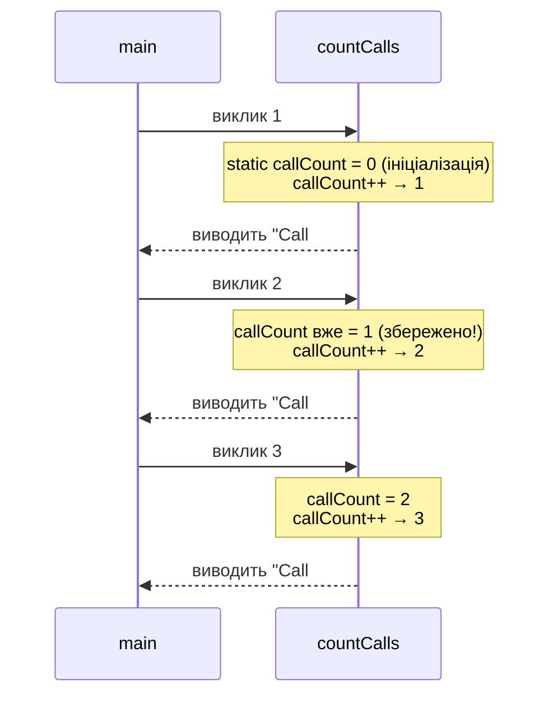

## Проблема порядку визначення

У попередній статті всі функції визначалися **до** `main`. Це спрацьовує для простих програм, але у реальному коді функції часто викликають одна одну у будь-якому порядку. Розглянемо ситуацію:

```cpp
int main()
{
    int result = add(3, 5);  // ❌ Помилка! add ще не визначена
    return 0;
}

int add(int a, int b)
{
    return a + b;
}
```

Компілятор читає файл зверху вниз. Коли він бачить виклик `add(3, 5)` у `main`, він ще не знає, що таке `add` — і видає помилку. Перенести `add` вище — здається простим рішенням, але що якщо функцій сотні? Або дві функції викликають одна одну (взаємна рекурсія)?

Рішення — **прототип функції**.

## Прототипи функцій

**Прототип** (function prototype / forward declaration) — оголошення функції **без тіла**: лише підпис (сигнатура), що повідомляє компілятору ім'я функції, тип повернення та типи параметрів. Після прототипу компілятор знає, як правильно інтерпретувати виклики — навіть без повного визначення.

```cpp
// Прототип: лише підпис, крапка з комою в кінці
int add(int a, int b);

int main()
{
    int result = add(3, 5);  // ✅ Компілятор знає: add приймає два int, повертає int
    cout << result << "\n";
    return 0;
}

// Визначення може бути нижче
int add(int a, int b)
{
    return a + b;
}
```

Прототип — це **обіцянка** компілятору: «десь у цьому файлі (або у підключеному заголовку) є функція з таким підписом». Якщо обіцянку не виконати (не написати визначення) — отримаємо помилку при **компонуванні** (linker error), а не при компіляції.

### Імена параметрів у прототипі — необов'язкові

У прототипі імена параметрів можна опускати — компілятору важливі лише **типи**:

```cpp
// Обидва варіанти коректні
double power(double base, int exponent);  // З іменами (читабельніше)
double power(double, int);                // Без імен
```

На практиці імена корисно залишати: вони документують призначення кожного параметра для читача коду.

### Де розміщувати прототипи

**Рекомендована структура файлу:**

```cpp
#include <iostream>

using namespace std;

// 1. Прототипи — на початку файлу
float applyDiscount(float price, float rate);
int   clamp(int value, int minVal, int maxVal);
void  printSeparator();

// 2. main
int main()
{
    // ...
}

// 3. Визначення функцій — після main,
//    в алфавітному порядку або за логічними групами
float applyDiscount(float price, float rate)
{
    return price - price * rate;
}
// ...
```

Прототипи вгорі разом дають читачу **«зміст»** файлу — список усіх функцій одним поглядом.

## Область видимості

**Область видимості** (scope) — частина програми, де ідентифікатор (змінна, функція) є доступним. У C++ кожна пара фігурних дужок `{}` утворює новий **блок видимості**.

### Локальні змінні

Змінна, оголошена **всередині** функції або блоку, є **локальною** (local): вона існує лише у межах цього блоку і «зникає» після його закриття.

```cpp
void functionA()
{
    int x = 10;  // Локальна для functionA
    cout << x;
    // x тут існує
}   // ← x знищується тут

void functionB()
{
    // cout << x;  // ❌ Помилка! x з functionA тут недоступна

    int x = 20;  // Абсолютно нова змінна, теж називається x
    cout << x;   // 20
}
```

Локальні змінні живуть у **стеку** (stack) — спеціальній ділянці пам'яті для тимчасових даних. При вхід у функцію — стек «росте» (виділяється пам'ять для локальних змінних). При виході — «скорочується» (пам'ять звільняється). Саме тому значення локальної змінної **не зберігається** між викликами функції.

### Вкладені блоки

Видимість діє і для вкладених блоків всередині функції:

```cpp
void example()
{
    int outer = 1;

    {
        int inner = 2;         // Видима тут
        cout << outer << "\n"; // ✅ outer доступна (оголошена зовні)
        cout << inner << "\n"; // ✅
    }  // ← inner знищується

    // cout << inner;  // ❌ inner більше не існує
    cout << outer << "\n";     // ✅ outer ще жива
}
```

### Глобальні змінні

Змінна, оголошена **поза** будь-якою функцією, є **глобальною** (global): вона доступна з будь-якої функції файлу протягом усього часу виконання програми.

```cpp
int globalCounter = 0;  // Глобальна змінна

void increment()
{
    globalCounter++;  // Доступ до глобальної
}

void printCounter()
{
    cout << globalCounter << "\n";
}

int main()
{
    increment();
    increment();
    printCounter();  // 2
    return 0;
}
```

Глобальні змінні **ініціалізуються автоматично** нулем (на відміну від локальних, де потрібна явна ініціалізація).

### Небезпека глобальних змінних

::caution
Глобальні змінні — одна з головних причин складних і важко відтворюваних помилок. Уникайте їх у всіх випадках, де можна передати дані через параметри.

**Проблеми глобальних змінних:**
- **Неявна залежність**: будь-яка функція може змінити глобальну змінну — складно відстежити, що і коли її змінило.
- **Важко тестувати**: функція, що читає глобальний стан, веде себе по-різному залежно від стану, а не лише від аргументів.
- **Конфлікти імен**: у великих програмах глобальні імена легко конфліктують між різними модулями.
- **Паралелізм**: у багатопотокових програмах глобальні змінні потребують синхронізації.

::

Коли глобальні змінні виправдані: **глобальні константи** (`const`). Константа не може змінитися — тому всі ризики знімаються:

```cpp
const double PI = 3.14159265;        // ✅ Глобальна константа — норма
const int MAX_BUFFER_SIZE = 65536;   // ✅

int errorCount = 0;                  // ❌ Глобальна змінна — небезпечно
```

### Конфлікт імен: локальна «перекриває» глобальну

Якщо локальна змінна має те саме ім'я, що й глобальна — локальна **«приховує»** глобальну в межах свого блоку:

```cpp
int value = 100;  // Глобальна

void test()
{
    int value = 42;          // Локальна — «приховує» глобальну
    cout << value << "\n";   // 42 (локальна)
}

void check()
{
    cout << value << "\n";   // 100 (глобальна — локальної тут немає)
}
```

Це поведінка не є помилкою, але може призводити до плутанини. **Ніколи** не давайте локальним змінним ті самі імена, що й глобальним — коду з такою неоднозначністю важко довіряти.

## Параметри за замовчуванням

Іноді деякі параметри функції найчастіше приймають одне й те саме значення. Наприклад, функція виводу сепаратора здебільшого виводить 40 символів, але іноді — 20 або 60. Щоразу передавати `40` у виклику — зайвий шум.

**Параметри за замовчуванням** (default parameters) дозволяють вказати значення, яке використовується, якщо аргумент для цього параметра не переданий:

```cpp
// Оголошення з параметром за замовчуванням
void printSeparator(int length = 40, char symbol = '=')
{
    for (int i = 0; i < length; i++)
    {
        cout << symbol;
    }
    cout << "\n";
}

int main()
{
    printSeparator();          // length=40, symbol='='  (обидва за замовчуванням)
    printSeparator(20);        // length=20, symbol='='  (тільки symbol — за замовчуванням)
    printSeparator(30, '-');   // length=30, symbol='-'  (жодного за замовчуванням)

    return 0;
}
```

### Правила параметрів за замовчуванням

**Правило 1: Тільки з кінця.** Параметри зі значеннями за замовчуванням повинні стояти в **кінці** списку параметрів. Не можна «пропустити» параметр у середині:

```cpp
// ✅ Правильно — за замовчуванням у кінці
void connect(const char host[], int port = 80, bool secure = false);

// ❌ Неправильно — параметр з default перед параметром без default
void connect(int port = 80, const char host[], bool secure = false);
```

**Правило 2: Лише в прототипі.** Якщо є прототип — значення за замовчуванням вказуються **лише у прототипі**, не у визначенні:

```cpp
// Прототип — тут значення за замовчуванням
void greet(const char name[], int times = 1);

// Визначення — БЕЗ значень за замовчуванням
void greet(const char name[], int times)
{
    for (int i = 0; i < times; i++)
    {
        cout << "Hello, " << name << "!\n";
    }
}
```

**Правило 3: Пропустити параметр «у середині» — неможливо.** Якщо функція `f(int a = 1, int b = 2, int c = 3)`, виклик `f(,,5)` не є коректним синтаксисом. Щоб передати значення для `c`, потрібно передати і `a`, і `b`.

::tip
Параметри за замовчуванням — чудовий спосіб спростити API функції. Але не зловживайте: якщо майже всі параметри мають значення за замовчуванням — це сигнал, що функція, можливо, намагається робити забагато різних речей одночасно.

::

## Статичні локальні змінні

Ми з'ясували, що локальні змінні «зникають» після виходу з функції. Але іноді потрібно, щоб локальна змінна **зберігала своє значення між викликами** — наприклад, лічильник кількості викликів.

Ключове слово **`static`** перед локальною змінною змінює її поведінку: вона ініціалізується лише **один раз** (при першому виклику функції) та існує протягом усього часу виконання програми. При наступних викликах функції змінна вже існує — і зберігає значення від попереднього виклику.

```cpp [StaticDemo.cpp] showLineNumbers
#include <iostream>

using namespace std;

void countCalls()
{
    static int callCount = 0;  // Ініціалізується лише при ПЕРШОМУ виклику!
    callCount++;
    cout << "Call #" << callCount << "\n";
}

int main()
{
    countCalls();  // Call #1
    countCalls();  // Call #2
    countCalls();  // Call #3
    return 0;
}
```

::terminal-preview{title="Execution: StaticDemo"}
<div class="line">Call #1</div>
<div class="line">Call #2</div>
<div class="line">Call #3</div>
::

::debugger-view{title="State: static callCount" :variables='[{"name": "callCount", "type": "static int", "value": "3"}]' :highlight="[0]"}
::

**Результат:**
```
Call #1
Call #2
Call #3
```

Якби `callCount` була **звичайною** локальною змінною — кожен виклик ініціалізував би її до `0`, і програма завжди виводила б `Call #1`.

::mermaid



::

### Практичне застосування: генератор унікальних ID

```cpp
int generateId()
{
    static int nextId = 1000;  // Починаємо з 1000
    return nextId++;           // Постфіксний ++ — повертаємо ПОТОЧНЕ значення,
}                              // потім збільшуємо для наступного виклику

int main()
{
    cout << generateId() << "\n";  // 1000
    cout << generateId() << "\n";  // 1001
    cout << generateId() << "\n";  // 1002
    return 0;
}
```

::terminal-preview{title="Execution: generateId"}
<div class="line">1000</div>
<div class="line">1001</div>
<div class="line">1002</div>
::

Кожен виклик `generateId()` повертає нове унікальне число. Стан (`nextId`) зберігається між викликами — але прихований від зовнішнього коду. Це набагато краще, ніж глобальна змінна: інкапсуляція стану всередині функції.

::note
Статичні локальні змінні зберігаються у тій же ділянці пам'яті, що й глобальні змінні (статичний сегмент даних), а не у стеку. Але на відміну від глобальних — вони **видимі лише** у своїй функції. Це об'єднує переваги обох підходів: постійне існування + обмежена видимість.

::

## Рекурсія

**Рекурсія** (recursion) — виклик функцією **самої себе**. Це потужна техніка для задач, що природно розбиваються на менші версії тієї самої задачі.

Класичний приклад — факторіал: `n! = n × (n-1)!`, а `0! = 1`.

```cpp
int factorial(int n)
{
    if (n == 0)          // Базовий випадок: зупинка рекурсії
    {
        return 1;
    }

    return n * factorial(n - 1);  // Рекурсивний виклик
}
```

Кожна рекурсивна функція має дві частини:

1. **Базовий випадок** (base case) — умова, при якій функція повертає результат без рекурсивного виклику. Без базового випадку рекурсія нескінченна → переповнення стеку.
2. **Рекурсивний крок** — виклик функції з меншим (простішим) аргументом, що наближає нас до базового випадку.

Трасування `factorial(4)`:

```
factorial(4)
  → 4 * factorial(3)
       → 3 * factorial(2)
            → 2 * factorial(1)
                 → 1 * factorial(0)
                      → 1  (базовий випадок)
                 → 1 * 1 = 1
            → 2 * 1 = 2
       → 3 * 2 = 6
  → 4 * 6 = 24
```

::caution
Рекурсія вимагає обережності. **Нескінченна рекурсія** (забутий базовий випадок або умова, що ніколи не досягається) призводить до **переповнення стеку** (stack overflow) і аварійного завершення програми. Завжди перевіряйте, що кожен рекурсивний виклик наближає до базового випадку.

::

## Повний приклад: Система введення з валідацією

Об'єднаємо прототипи, параметри за замовчуванням та статичні змінні в одній програмі:

```cpp [InputSystem.cpp] showLineNumbers
#include <iostream>

using namespace std;

// Прототипи
int readInt(const char prompt[], int minVal = 0, int maxVal = 100);
void printAttemptStats();

int main()
{
    int age    = readInt("Enter age (1-120): ", 1, 120);
    int score  = readInt("Enter score (0-100): ");      // minVal=0, maxVal=100
    int rating = readInt("Enter rating (1-5): ", 1, 5);

    cout << "\nAge: "    << age    << "\n";
    cout << "Score: "   << score  << "\n";
    cout << "Rating: "  << rating << "\n";

    printAttemptStats();

    return 0;
}

// Читає int у діапазоні [minVal, maxVal] з повторним запитом
int readInt(const char prompt[], int minVal, int maxVal)
{
    int value;

    do
    {
        cout << prompt;
        cin >> value;

        if (value < minVal || value > maxVal)
        {
            cout << "  Please enter a value between "
                 << minVal << " and " << maxVal << ".\n";
        }

    } while (value < minVal || value > maxVal);

    return value;
}

// Показує загальну кількість спроб введення
void printAttemptStats()
{
    // Статична змінна — підраховує загальну кількість невдалих спроб
    // (у цьому прикладі — просто виводить). 
    // У реальному коді readInt() передавала б їй через static лічильник
    cout << "\n[Input session complete]\n";
}
```

::terminal-preview{title="Execution: InputSystem"}
<div class="line">Enter age (1-120): <span class="text-blue-400 font-bold">150</span></div>
<div class="line">  Please enter a value between 1 and 120.</div>
<div class="line">Enter age (1-120): <span class="text-blue-400 font-bold">25</span></div>
<div class="line">Enter score (0-100): <span class="text-blue-400 font-bold">85</span></div>
<div class="line">Enter rating (1-5): <span class="text-blue-400 font-bold">5</span></div>
<div class="line"></div>
<div class="line">Age: 25</div>
<div class="line">Score: 85</div>
<div class="line">Rating: 5</div>
<div class="line"></div>
<div class="line">[Input session complete]</div>
::

Зверніть на рядки 11–12: опустивши аргументи для `minVal` і `maxVal`, ми отримуємо значення за замовчуванням `0` і `100` — без зайвого коду.

## Практичні завдання

### Рівень 1 — Базовий

::collapsible{title="Завдання 1.1: Прототипи у правильному порядку"}
Дано файл з функціями у хаотичному порядку: `main` викликає `printResult`, `printResult` викликає `format`, `format` використовує `round`. Напишіть прototites для всіх функцій так, щоб порядок визначень більше не мав значення. Визначте функції у будь-якому (іншому) порядку та переконайтеся, що програма компілюється.

::

::collapsible{title="Завдання 1.2: Scope — передбачте вивід"}
Визначте, що виведе програма. Не запускайте код — лише логічний аналіз:

```cpp
int x = 1;

void foo()
{
    int x = 2;
    cout << x << " ";  // ?
    {
        int x = 3;
        cout << x << " ";  // ?
    }
    cout << x << " ";  // ?
}

int main()
{
    cout << x << " ";  // ?
    foo();
    cout << x << " ";  // ?
}
```

::

### Рівень 2 — Логічний

::collapsible{title="Завдання 2.1: Функція з параметрами за замовчуванням"}
Напишіть функцію `void printTable(int rows = 5, int cols = 5, char fill = '*')`, що малює таблицю з символів:
- `printTable()` → 5×5 зірочок
- `printTable(3, 7)` → 3×7 зірочок
- `printTable(4, 4, '#')` → 4×4 решіток

Переконайтеся, що прototipe і визначення правильно розподілені.

::

::collapsible{title="Завдання 2.2: Лічильник з static"}
Реалізуйте дві функції:
- `int nextEven()` — повертає наступне парне число (2, 4, 6, 8, ...) при кожному виклику. Використовує `static`.
- `int nextOdd()` — аналогічно для непарних (1, 3, 5, 7, ...).

Продемонструйте, що лічильники кожної функції — незалежні.

::

### Рівень 3 — Творчий

::collapsible{title="Завдання 3.1: Рекурсивна сума цифр"}
Напишіть рекурсивну функцію `int digitSum(int n)`, що обчислює суму цифр числа.

```
digitSum(12345) → 15   (1+2+3+4+5)
digitSum(999)   → 27
digitSum(7)     → 7
```

**Підказка**: `n % 10` — остання цифра. `n / 10` — число без останньої цифри. Базовий випадок: `n < 10`.

::

## Підсумок

::card-group

::card{title="📌 Прototipe" icon="i-lucide-file-code"}
Підпис функції без тіла: `тип ім'я(типи);`. Дозволяє викликати функцію до її визначення. Розміщуйте вгорі файлу.

::

::card{title="📌 Область видимості" icon="i-lucide-eye"}
Кожен `{}` — новий блок. Локальні змінні існують лише у своєму блоці. Глобальні — весь час виконання. Уникайте глобальних змінних (але не констант).

::

::card{title="📌 Default parameters" icon="i-lucide-sliders-horizontal"}
`void f(int a, int b = 10)`. Аргументи зліва направо; параметри зі значеннями — лише в кінці. Значення вказується у прototipe, не у визначенні.

::

::card{title="📌 Static locals" icon="i-lucide-database"}
`static int x = 0` — ініціалізується один раз, зберігає значення між викликами. Зберігається у статичному сегменті, але видима лише у своїй функції.

::

::
