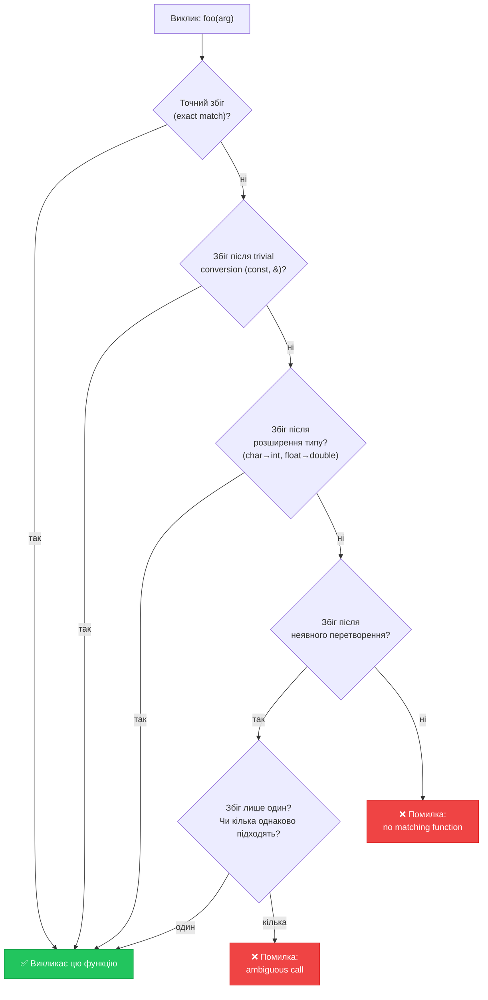

## Одне ім'я — різна поведінка

Функція `print` могла б виводити ціле число, дійсне, символ або рядок. Без спеціальних механізмів доводилося б придумувати унікальне ім'я для кожного варіанту:

```cpp
void printInt(int value)    { cout << value; }
void printDouble(double value) { cout << value; }
void printChar(char value)  { cout << value; }
```

Це незручно: читач коду мусить пам'ятати різні імена для одної концептуальної дії. C++ пропонує дві елегантні альтернативи: **перевантаження функцій** та **шаблони функцій**. Обидва дозволяють одному імені функції служити різним типам — але реалізують це принципово різними способами.

## Перевантаження функцій (Function Overloading)

### Ідея та синтаксис

**Перевантаження функцій** — оголошення кількох функцій з **однаковим іменем**, але **різними списками параметрів**. Компілятор сам визначає, яку саме функцію викликати, виходячи з типів та кількості переданих аргументів.

```cpp
// Три функції з однаковим іменем, але різними параметрами
void print(int value)
{
    cout << "int: " << value << "\n";
}

void print(double value)
{
    cout << "double: " << value << "\n";
}

void print(const char text[])
{
    cout << "string: " << text << "\n";
}

int main()
{
    print(42);         // → print(int)    → "int: 42"
    print(3.14);       // → print(double) → "double: 3.14"
    print("Hello");    // → print(char[]) → "string: Hello"

    return 0;
}
```

::terminal-preview{title="Execution: Overloading Print"}
<div class="line">int: 42</div>
<div class="line">double: 3.14</div>
<div class="line">string: Hello</div>
::

Механізм вибору правильної функції — **роздільна здатність перевантаження** (overload resolution). Він відбувається виключно на етапі **компіляції**: до виконання програми компілятор вже знає, яка саме функція буде викликана.

### Що вважається різними підписами

Перевантаження визначається **сигнатурою** функції: ім'ям та списком типів параметрів (без типу повернення!). Дві функції мають різну сигнатуру, якщо відрізняються:

- **Кількістю** параметрів
- **Типами** параметрів (у будь-якій позиції)
- **Порядком** типів параметрів

```cpp
// ✅ Різні сигнатури — коректне перевантаження
int add(int a, int b);
double add(double a, double b);
int add(int a, int b, int c);         // Три параметри
double add(int a, double b);          // Різні типи

// ❌ НЕ є перевантаженням — однакова сигнатура!
int multiply(int a, int b);
double multiply(int a, int b);  // Різниться лише тип повернення — ПОМИЛКА
```

::caution
**Тип повернення не є частиною сигнатури.** Дві функції з однаковими параметрами та різними типами повернення — це помилка компіляції. Компілятор не може з'ясувати, яку з них виклика ти, якщо результат не присвоюється змінній конкретного типу.

::

### Правила роздільної здатності перевантаження

Компілятор вибирає перевантажену функцію у кілька кроків — від «ідеального» збігу до «найкращого з можливих»:

::mermaid



::

```cpp
void test(int x)    { cout << "int\n"; }
void test(double x) { cout << "double\n"; }
void test(float x)  { cout << "float\n"; }

test(5);     // → test(int)    — точний збіг
test(3.14);  // → test(double) — точний збіг (літерал double)
test(3.14f); // → test(float)  — точний збіг (суфікс f → float)
test('A');   // → test(int)    — char розширюється до int
```

### Неоднозначне перевантаження (Ambiguous Call)

Якщо компілятор знаходить **кілька** функцій, що однаково добре підходять до виклику — це помилка неоднозначності:

```cpp
void ambiguous(int a, double b)    { cout << "1\n"; }
void ambiguous(double a, int b)    { cout << "2\n"; }

ambiguous(1, 2);  // ❌ Помилка! Обидві вимагають однакових перетворень:
                  // 1→double + 2→int  vs  1→int + 2→double → рівнозначні
```

Рішення — або явно вказати тип через `static_cast`, або переглянути дизайн функцій:

```cpp
ambiguous(1, static_cast<double>(2));  // → ambiguous(int, double)
```

### Перевантаження по кількості параметрів

```cpp
// Пошук максимуму серед 2, 3 або 4 чисел
int max(int a, int b)
{
    return (a > b) ? a : b;
}

int max(int a, int b, int c)
{
    return max(max(a, b), c);  // Перевикористовує двопараметровий max!
}

int max(int a, int b, int c, int d)
{
    return max(max(a, b), max(c, d));
}

int main()
{
    cout << max(3, 7)          << "\n";  // 7
    cout << max(3, 7, 5)       << "\n";  // 7
    cout << max(3, 7, 5, 9)    << "\n";  // 9
    return 0;
}
```

::terminal-preview{title="Execution: Overloading Max"}
<div class="line">7</div>
<div class="line">7</div>
<div class="line">9</div>
::

Зверніть на рядок 10: `max(int, int, int)` повторно використовує `max(int, int)`. Не дублює логіку «порівняння двох» — делегує її вже існуючій функції. Це ключовий принцип хорошого проектування.

### Перевантаження та значення за замовчуванням

Поєднання перевантаження та default parameters може призвести до неоднозначності:

```cpp
void greet(const char name[], int times = 1)
{
    for (int i = 0; i < times; i++) cout << "Hi, " << name << "\n";
}

void greet(const char name[])  // ❌ Конфліктує з попередньою!
{
    cout << "Hello, " << name << "\n";
}

greet("Alice");  // Яку функцію викликати? Обидві підходять!
```

::warning
Не поєднуйте перевантаження та параметри за замовчуванням, якщо вони можуть утворити неоднозначні виклики. Це одне з найпоширеніших джерел несподіваних помилок компіляції.

::

---

## Шаблони функцій (Function Templates)

### Проблема: дублювання для різних типів

Перевантаження вирішує проблему «одне ім'я, різні типи», але вимагає писати окреме тіло для кожного типу. Якщо логіка ідентична — це дублювання:

```cpp
int    absVal(int x)    { return (x < 0) ? -x : x; }
double absVal(double x) { return (x < 0) ? -x : x; }
float  absVal(float x)  { return (x < 0) ? -x : x; }
// Три функції. Одна логіка. Тричі.
```

**Шаблони функцій** (function templates) вирішують це «раз і назавжди»: ми описуємо логіку **один раз**, параметризуючи тип. Компілятор автоматично генерує потрібні версії під конкретні типи при кожному виклику.

### Синтаксис шаблону

```cpp
template<typename T>
T absVal(T x)
{
    return (x < 0) ? -x : x;
}
```

Розберемо синтаксис:

- **`template<typename T>`** — оголошення шаблону. `T` — **параметр типу** (type parameter): заповнювач для конкретного типу. Ім'я `T` — умовне; можна написати `Type`, `ValueType` тощо, але `T` — загальноприйнята домовленість.
- **`T absVal(T x)`** — функція, де тип повернення і тип параметра — однакові (`T`). Компілятор підставить реальний тип замість `T`.

### Інстанціація шаблону

Коли компілятор зустрічає виклик шаблонної функції з конкретним типом — він **інстанціює** (instantiates) шаблон: генерує повноцінну функцію, підставляючи конкретний тип замість `T`.

```cpp
template<typename T>
T absVal(T x)
{
    return (x < 0) ? -x : x;
}

int main()
{
    cout << absVal(-5)    << "\n";   // T = int    → компілятор генерує absVal<int>
    cout << absVal(-3.14) << "\n";   // T = double → компілятор генерує absVal<double>
    cout << absVal(-2.5f) << "\n";   // T = float  → компілятор генерує absVal<float>

    return 0;
}
```

::terminal-preview{title="Execution: absVal Template"}
<div class="line">5</div>
<div class="line">3.14</div>
<div class="line">2.5</div>
::

Компілятор сам виводить тип `T` із типу переданого аргументу — це **неявна інстанціація** (implicit instantiation). Але можна вказати тип і явно:

```cpp
cout << absVal<int>(-5)     << "\n";  // Явна інстанціація: T = int
cout << absVal<double>(-5)  << "\n";  // Явна: T = double (int → double)
```

Явна інстанціація рідко потрібна, але буває корисна, коли компілятор не може правильно вивести тип або ми хочемо примусово задати тип.

### Шаблони з кількома типами

Шаблони можуть мати кілька параметрів типів:

```cpp
template<typename T, typename U>
void printPair(T first, U second)
{
    cout << "(" << first << ", " << second << ")\n";
}

int main()
{
    printPair(1, 3.14);       // T=int, U=double
    printPair("age", 25);     // T=char[], U=int
    printPair(true, 'x');     // T=bool, U=char
    return 0;
}
```

### Шаблон функції обміну (swap)

Один із найкласичніших шаблонів — універсальний обмін двох значень. Стандартна бібліотека C++ (STL) містить `std::swap` — саме як шаблон:

```cpp
template<typename T>
void swapValues(T& a, T& b)   // T& — посилання, щоб змінювати оригінали
{
    T temp = a;
    a = b;
    b = temp;
}

int main()
{
    int x = 5, y = 10;
    swapValues(x, y);
    cout << x << " " << y << "\n";  // 10 5

    double p = 1.1, q = 2.2;
    swapValues(p, q);
    cout << p << " " << q << "\n";  // 2.2 1.1

    return 0;
}
```

::terminal-preview{title="Execution: swapValues Template"}
<div class="line">10 5</div>
<div class="line">2.2 1.1</div>
::

Тут `T&` — посилання на тип `T`. Без `&` обмін відбувався б з копіями, і оригінали не змінились bi. Посилання детально розглядаються у окремому розділі.

### Шаблон з не-типовим параметром

Параметр шаблону може бути не лише типом, а й **конкретним значенням** (константою):

```cpp
// N — розмір масиву, визначений на етапі компіляції
template<typename T, int N>
void printArray(T arr[N])
{
    for (int i = 0; i < N; i++)
    {
        cout << arr[i] << " ";
    }
    cout << "\n";
}

int main()
{
    int nums[5] = {1, 2, 3, 4, 5};
    printArray<int, 5>(nums);   // T=int, N=5

    return 0;
}
```

### Спеціалізація шаблону

Іноді загальна логіка шаблону не підходить для конкретного типу. **Спеціалізація** (template specialization) дозволяє перевизначити поведінку шаблону для окремого типу:

```cpp
// Загальний шаблон
template<typename T>
T getMax(T a, T b)
{
    return (a > b) ? a : b;
}

// Спеціалізація для const char* (рядки порівнюємо не через >)
template<>
const char* getMax<const char*>(const char* a, const char* b)
{
    return (strcmp(a, b) > 0) ? a : b;
}

int main()
{
    cout << getMax(3, 7)              << "\n";  // 7 (загальний шаблон)
    cout << getMax("apple", "banana") << "\n";  // banana (спеціалізація)
    return 0;
}
```

---

## Overloading vs Templates: коли що обирати?

Обидва механізми вирішують схожу задачу. Ключова відмінність — у **природі відмінностей між варіантами**:

| | **Overloading** | **Template** |
|:--|:----------------|:-------------|
| **Логіка** | Може відрізнятися для кожного типу | Однакова для всіх типів |
| **Кількість коду** | Окреме тіло для кожного типу | Одне тіло для всіх типів |
| **Нові типи** | Потребує нового перевантаження | Автоматично підтримує все |
| **Помилки** | На рівні виклику функції | На рівні шаблону (іноді складні) |
| **Гнучкість** | Повна — кожна версія робить своє | Обмежена — логіка фіксована |

```cpp
// Overloading — різна логіка для різних типів
void serialize(int value)     { cout << value; }
void serialize(double value)  { cout << fixed << value; }
void serialize(bool value)    { cout << (value ? "true" : "false"); }

// Template — однакова логіка, будь-який тип
template<typename T>
T clamp(T value, T minVal, T maxVal)
{
    if (value < minVal) return minVal;
    if (value > maxVal) return maxVal;
    return value;
}
```

`serialize` — ідеальний кандидат для **перевантаження**: кожен тип серіалізується по-своєму. `clamp` — ідеальний **шаблон**: «затискання» значення між мінімумом і максимумом однаково для `int`, `double`, `float`.

### Поєднання: overloading + templates

Шаблон і перевантаження можуть існувати разом. Компілятор спочатку шукає **точний збіг** серед перевантажень — і лише потім вдається до шаблону:

```cpp
template<typename T>
void describe(T value)
{
    cout << "Generic: " << value << "\n";
}

// Явне перевантаження для bool
void describe(bool value)
{
    cout << "Bool: " << (value ? "true" : "false") << "\n";
}

int main()
{
    describe(42);      // → шаблон (Generic: 42)
    describe(3.14);    // → шаблон (Generic: 3.14)
    describe(true);    // → перевантаження! (Bool: true)
    return 0;
}
```

---

## Повний приклад: Типобезпечна математична бібліотека

```cpp [MathLib.cpp] showLineNumbers
#include <iostream>
#include <cmath>

using namespace std;

// ─── Шаблони ───────────────────────────────────────────────

template<typename T>
T getMin(T a, T b)
{
    return (a < b) ? a : b;
}

template<typename T>
T getMax(T a, T b)
{
    return (a > b) ? a : b;
}

template<typename T>
T clamp(T value, T lo, T hi)
{
    return getMax(lo, getMin(value, hi));
}

template<typename T>
T absVal(T x)
{
    return (x < 0) ? -x : x;
}

// ─── Перевантаження ────────────────────────────────────────

// round для int — вже ціле, нічого не змінюємо
int roundTo(int value, int /* decimals */)
{
    return value;
}

// round для double — реальне округлення
double roundTo(double value, int decimals)
{
    double factor = pow(10.0, decimals);
    return round(value * factor) / factor;
}

// ─── main ──────────────────────────────────────────────────

int main()
{
    // Шаблони — один код, різні типи
    cout << getMin(3, 7)          << "\n";   // 3 (int)
    cout << getMin(3.14, 2.72)    << "\n";   // 2.72 (double)

    cout << clamp(150, 0, 100)    << "\n";   // 100
    cout << clamp(-5.0, 0.0, 1.0) << "\n";  // 0

    // Перевантаження — різна логіка
    cout << roundTo(42, 2)        << "\n";   // 42 (int версія)
    cout << roundTo(3.14159, 2)   << "\n";   // 3.14 (double версія)

    return 0;
}
```

::terminal-preview{title="Execution: MathLib"}
<div class="line">3</div>
<div class="line">2.72</div>
<div class="line">100</div>
<div class="line">0</div>
<div class="line">42</div>
<div class="line">3.14</div>
::

Результат:
```
3
2.72
100
0
42
3.14
```

`getMin`, `getMax`, `clamp`, `absVal` — **шаблони**: однакова логіка, будь-який тип. `roundTo` — **перевантаження**: для `int` і `double` різна реалізація.

---

## Практичні завдання

### Рівень 1 — Базовий

::collapsible{title="Завдання 1.1: Перевантаження describe"}
Напишіть три перевантаження функції `void describe(...)`:
- Для `int`: `"Integer: 42"`
- Для `double`: `"Double: 3.14"` (з двома знаками після крапки)
- Для `char`: `"Char: 'A' (ASCII: 65)"`

Продемонструйте, що компілятор обирає правильну версію автоматично.

::

::collapsible{title="Завдання 1.2: Шаблон суми масиву"}
Напишіть шаблонну функцію `T sumArray(T arr[], int size)`, що повертає суму елементів масиву довільного числового типу. Протестуйте для `int[]` та `double[]`.

::

### Рівень 2 — Логічний

::collapsible{title="Завдання 2.1: Шаблонне сортування вибіркою"}
Перетворіть реалізацію selection sort на **шаблонну функцію** `void selectionSort(T arr[], int size)`. Переконайтеся, що вона правильно сортує як `int[]`, так і `double[]`.

::

::collapsible{title="Завдання 2.2: Overloading printFormatted"}
Реалізуйте перевантажену функцію `void printFormatted(...)`:
- `int` — у вигляді `[  42]` (поле завширшки 6, праворуч)
- `double` — у вигляді `[3.1416]` (4 знаки після крапки)
- `const char*` — у вигляді `[Hello     ]` (поле завширшки 10, ліворуч)

Скористайтесь маніпуляторами `setw`, `setprecision`, `left`, `right` із `<iomanip>`.

::

### Рівень 3 — Творчий

::collapsible{title="Завдання 3.1: Шаблонний стек"}
Реалізуйте шаблонний «стек» (LIFO-структура) через масив:

```cpp
template<typename T, int CAPACITY>
struct Stack {
    T data[CAPACITY];
    int top = 0;
};

template<typename T, int N>
void push(Stack<T, N>& s, T value) { ... }

template<typename T, int N>
T pop(Stack<T, N>& s) { ... }

template<typename T, int N>
bool isEmpty(const Stack<T, N>& s) { ... }
```

Продемонструйте роботу `Stack<int, 10>` та `Stack<double, 5>`.

::

## Підсумок

::card-group

::card{title="📌 Overloading" icon="i-lucide-layers-2"}
Кілька функцій з однаковим іменем, різними параметрами. Компілятор обирає на етапі компіляції. Тип повернення — не частина сигнатури. Використовуйте, коли логіка різна для різних типів.

::

::card{title="📌 Роздільна здатність" icon="i-lucide-search-code"}
Компілятор шукає: точний збіг → розширення типу → неявне перетворення. Якщо кілька варіантів рівнозначні — помилка ambiguous call.

::

::card{title="📌 Template" icon="i-lucide-code-2"}
`template<typename T>` — параметризує тип. Одна логіка для всіх типів. Інстанціація — автоматична (неявна) або явна `<int>`. Використовуйте, коли логіка однакова.

::

::card{title="📌 Спеціалізація" icon="i-lucide-git-fork"}
`template<> void f<SpecificType>(...)` — перевизначення шаблону для конкретного типу. Дозволяє зберегти загальний шаблон, але «виправити» його для особливих випадків.

::

::card{title="📌 Overloading + Templates" icon="i-lucide-combine"}
Можна поєднувати. Перевантаження має пріоритет над шаблоном при точному збігу. Шаблон — «запасний варіант» для інших типів.

::

::
