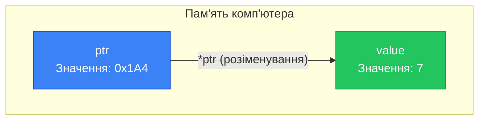

## Пам'ять та адресація

Коли ви оголошуєте змінну у програмі, комп'ютер виділяє для неї певне місце в оперативній пам'яті (RAM). Уявіть пам'ять як гігантську шафу з мільйонами пронумерованих шухлядок. Кожна шухлядка має свій унікальний номер — **адресу**, і може зберігати 1 байт даних.

Коли ми пишемо `int a = 7;`, компілятор робить дві речі:
1. Знаходить вільне місце в пам'яті (наприклад, 4 послідовні байти для `int`).
2. Запам'ятовує, що ім'я `a` пов'язане з адресою першого з цих байтів (наприклад, `0x0046FCF0`).

Нам зазвичай не потрібно знати точну адресу — ми звертаємося до змінної за іменем. Але іноді доступ до адрес критично важливий для ефективності та можливостей C++.

### Оператор адреси (`&`)

Щоб дізнатися фізичну адресу змінної в пам'яті комп'ютера, використовується **унарний оператор адреси `&`** (амперсанд). Його ставлять перед іменем змінної:

```cpp showLineNumbers
#include <iostream>

using namespace std;

int main()
{
    int a = 7;
    cout << "Value of a:   " << a << "\n";
    cout << "Address of a: " << &a << "\n";
    return 0;
}
```

::terminal-preview{title="Execution: Address operator"}
<div class="line">Value of a:   7</div>
<div class="line">Address of a: <span class="text-blue-400 font-bold">0x0046fcf0</span></div>
::

**Приблизний результат:**
```
Value of a:   7
Address of a: 0x0046fcf0
```
Адреси виводяться у шістнадцятковій (hexadecimal) системі числення, оскільки це компактніший спосіб запису двійкових даних пам'яті. Значення адреси при кожному запуску програми буде різним (операційна система виділяє вільну пам'ять динамічно).

::note
Не плутайте унарний оператор адреси `&a` з [бінарним оператором побітового «І»](06.operators-type-conversion) `a & b`. Контекст їхнього використання чітко розрізняє їх для компілятора.
::

---

## Вказівники (Pointers)

**Вказівник** (pointer) — це спеціальна змінна, яка замість даних (чисел, символів) зберігає **адресу іншої змінної** в пам'яті.

### Оголошення вказівників

Вказівники оголошуються за допомогою зірочки `*` між типом даних і назвою змінної. Зірочка вказує компілятору, що ця змінна є вказівником.

```cpp
int *iPtr;      // Вказівник на ціле число (int)
double *dPtr;   // Вказівник на дробове число (double)
char *cPtr;     // Вказівник на символ (char)
```

::caution
**Пастка синтаксису:** Зірочку можна ставити біля типу (`int* ptr`), біля імені (`int *ptr`) або посередині (`int * ptr`). Але при оголошенні кількох змінних в одному рядку зірочка належить **лише цій змінній**:

```cpp
int* ptr1, ptr2;  // ptr1 — це ВКАЗІВНИК, а ptr2 — ЗВИЧАЙНА змінна (int)
int *p1, *p2;     // Тепер p1 і p2 — обидва вказівники
```
**Найкраща практика:** Оголошуйте кожен вказівник в окремому рядку із зірочкою біля змінної.
::

### Ініціалізація вказівників

Щоб вказівник дійсно «вказував» на змінну, йому потрібно присвоїти її адресу за допомогою `&`.

```cpp
int value = 5;
int *ptr = &value;  // ptr тепер зберігає адресу змінної value
```

Як і звичайні змінні, неініціалізовані вказівники містять «сміття» — випадкову адресу, яка залишилася в пам'яті від попередніх операцій. Очевидно, що намагатися за цією адресою щось прочитати — дуже небезпечно.

::warning
Тип вказівника **обов'язково** повинен збігатися з типом змінної, на яку він вказує:
```cpp
int iValue = 7;
double dValue = 9.0;

int *iPtr = &iValue;    // ✅ Правильно
double *dPtr = &dValue; // ✅ Правильно

iPtr = &dValue;         // ❌ Помилка: вказівник int* не може зберігати адресу double
```
::

Вказівникам не можна напряму присвоювати числа (адже адреси визначає операційна система):
```cpp
int *ptr = 7;           // ❌ Помилка: 7 — це число, а не адреса
int *ptr2 = 0x0012FF7C; // ❌ Помилка: C++ забороняє такий "хак"
```

---

## Оператор розіменування (`*`)

Наявність адреси — це чудово. Але головна магія вказівників у тому, що ми можемо **звернутися до даних за цією адресою**. Це робиться за допомогою **оператора розіменування** (dereference operator) `*`.

Розіменування `*ptr` означає: «піди за адресою, яку зберігає `ptr`, і дай мені значення, що там лежить».

```cpp showLineNumbers
#include <iostream>

using namespace std;

int main()
{
    int value = 5;
    int *ptr = &value;

    cout << "Address of value (&value): " << &value << "\n";
    cout << "Address inside ptr (ptr):  " << ptr << "\n";

    cout << "\nValue itself (value):      " << value << "\n";
    cout << "Value via pointer (*ptr):  " << *ptr << "\n";  // Розіменування!

    return 0;
}
```

::terminal-preview{title="Execution: Pointer Dereference"}
<div class="line">Address of value (&value): 0x0012ff60</div>
<div class="line">Address inside ptr (ptr):  0x0012ff60</div>
<div class="line"></div>
<div class="line">Value itself (value):      5</div>
<div class="line">Value via pointer (*ptr):  5</div>
::

::memory-view{title="Pointer & Value in Memory" startAddress="0x0012ff58" :data='[0, 18, 255, 96, 0, 0, 0, 5, 0, 0, 0, 0]' :highlight="[0, 1, 2, 3, 7]"}
::

::note
У `memory-view` вище: перші 8 байт (спрощено) представляють вказівник `ptr`, що зберігає адресу `0x12ff60`. За цією адресою (байт 7) зберігається число `5`.
::
```

**Результат:**
```text
Address of value (&value): 0x0012ff60
Address inside ptr (ptr):  0x0012ff60

Value itself (value):      5
Value via pointer (*ptr):  5
```

### Зміна значення через вказівник

`*ptr` обробляється компілятором абсолютно ідентично самій змінній `value`. Ми можемо не тільки читати, але й **змінювати** значення за адресою:

```cpp
int value = 5;
int *ptr = &value;

*ptr = 7;  // Змінюємо значення в пам'яті, на яку вказує ptr
cout << value; // Виведе 7! Змінна value змінилася "дистанційно"
```

::mermaid



::

### Що відбувається при розіменуванні сміття?

Якщо ви створюєте вказівник, не ініціалізуєте його і намагаєтесь розіменувати — це **катастрофа** (Undefined Behavior):
```cpp
int *ptr;    // Неініціалізований вказівник зі "сміттєвою" адресою
*ptr = 42;   // ❌ ЗБІЙ ПРОГРАМИ!
```
Ви намагаєтесь записати число `42` в якусь випадкову ділянку пам'яті комп'ютера. Сучасна операційна система миттєво «вб'є» вашу програму з помилкою *Segmentation Fault (Access Violation)*, щоб врятувати систему від пошкодження.

---

## Нульові вказівники та `nullptr`

Якщо вам потрібно створити вказівник, але він зараз ні на що не вказує — його **необхідно** відзначити як порожній. Для цього існує концепція загальновідомого безпечного стану — **нульового вказівника** (null pointer).

В старому Сі (і до стандарту C++11) для цього використовували число `0` або макрос `NULL`:
```cpp
int *ptr1 = 0;     // Старий стиль (працює, але недолуго: 0 - це int)
int *ptr2 = NULL;  // С-стиль (макрос, зазвичай визначений як 0)
```

Починаючи з **C++11**, з'явилося спеціальне ключове слово **`nullptr`** (null pointer literal). Воно гарантує, що жодної плутанини з числами не виникне:

```cpp
int *ptr = nullptr;  // Сучасний і безпечний стиль
```

Оскільки нульовий вказівник конвертується в `false`, його дуже зручно використовувати в умовах (наприклад, перед розіменуванням, щоб уникнути збою):

```cpp
int *ptr = nullptr;

// ... десь у коді ...

if (ptr) {  // Аналогічно до (ptr != nullptr)
    cout << "Pointer holds value: " << *ptr << "\n";
} else {
    cout << "Pointer is null. Cannot dereference!\n";
}
```

::tip
**Золоте правило С++:** Завжди ініціалізуйте вказівники при створенні. Або реальною адресою (`&variable`), або `nullptr`.
::

---

## Розмір вказівників

Скільки місця в пам'яті займає сам вказівник? Це залежить не від типу даних, на який він вказує, а від **архітектури комп'ютера / ОС** (32-бітна чи 64-бітна).

Річ у тім, що вказівник — це лише адреса. У 32-бітній операційній системі довжина будь-якої адреси становить 32 біти (4 байти). У 64-бітній ОС адреса займає 64 біти (8 байт).

```cpp
char *cPtr;
int *iPtr;
double *dPtr;

// На 64-бітному компіляторі всі три виведуть "8", на 32-бітному - "4"
cout << sizeof(cPtr) << "\n";
cout << sizeof(iPtr) << "\n";
cout << sizeof(dPtr) << "\n";
```
Зверніть увагу: `sizeof(*iPtr)` — розмір типу `int` (4), але `sizeof(iPtr)` — розмір адреси (8).

---

## Для чого потрібні вказівники?

Новачки часто запитують: «Навіщо мені працювати через якісь вказівники і адреси, якщо я можу просто використовувати самі змінні?».

У мові C++ вказівники — це не просто химерний синтаксис, а базовий механізм для:

1. **Динамічного виділення пам'яті** (`new` / `delete`). Єдиний спосіб працювати з пам'яттю з **Купи** (Heap), чий розмір невідомий під час компіляції.
2. **Масивів та рядків** "під капотом". Масив C-стилю — це насправді вказівник.
3. **Обміну даними з функціями без копіювання**. Якщо структура "важить" 1 Мегабайт, передавати її як аргумент довго. Ми просто передаємо вказівник (8 байт).
4. **Реалізації складних структур даних**. Зв'язні списки (Linked Lists), дерева (Trees) та графи складаються з вузлів, які вказують один на одний через вказівники.
5. **Поліморфізму в ООП**. Робота з базовими класами замість похідних (віртуальні функції).

Ми детально розберемо кожен з цих пунктів у наступних розділах.

---

## Підсумок

::card-group

::card{title="📍 Адреси (&)" icon="i-lucide-map-pin"}
Кожна змінна має свою унікальну адресу в ОЗП (RAM). Унарний оператор `&` дозволяє отримати цю адресу (наприклад, `&x`).

::

::card{title="⚓ Вказівники (*)" icon="i-lucide-anchor"}
Вказівник (`int* ptr`) — це змінна, яка зберігає адресу іншої змінної. Його розмір фіксований: 8 байт для 64-бітних систем.

::

::card{title="🎯 Розіменування (*)" icon="i-lucide-target"}
Унарний оператор розіменування `*ptr` дозволяє "перейти" за збереженою адресою для читання або зміни оригінального значення. 

::

::card{title="🛡️ nullptr" icon="i-lucide-shield-alert"}
Порожній вказівник завжди має дорівнювати `nullptr`. Розіменування сміттєвого вказівника чи `nullptr` призводить до збою (Crash).

::

::
