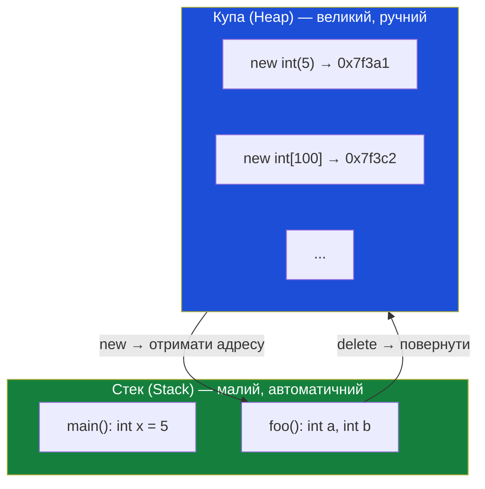
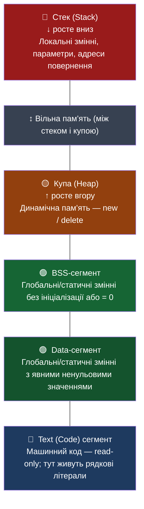

# Динамічна пам'ять

## Обмеження статичних розмірів

Усе, що ми писали до цього моменту, підпорядковується одному непорушному правилу: **розмір кожної змінної або масиву відомий на етапі компіляції**. Коли ви оголошуєте `int arr[10]`, компілятор ще до запуску програми «знає», що потрібно виділити рівно 40 байт. Це зручно і швидко — але негнучко.

Уявіть типову задачу: вам потрібно прочитати з клавіатури кількість студентів у групі, а потім — їхні оцінки. Ви не знаєте заздалегідь, чи буде студентів 5 чи 500. Спроба вирішити це через звичайний масив:

```cpp [ProblemWithStack.cpp] showLineNumbers
#include <iostream>

int main()
{
    int count;
    std::cout << "Кількість студентів: ";
    std::cin >> count;

    // ❌ Помилка компіляції: розмір масиву має бути константою!
    // int grades[count]; // Variable Length Array — заборонено у стандартному C++

    // ❌ Або навіть якби це спрацювало — 
    // int grades[1000000]; // ~4 МБ на стеку → миттєвий Stack Overflow

    return 0;
}
```

Оголошення `int grades[count]` є **Variable Length Array (VLA)** — ця конструкція не входить до стандарту C++ (хоча деякі компілятори її допускають як розширення). Вона небезпечна і ненадійна. Єдиний правильний спосіб вирішити задачу з невідомим розміром — **динамічне виділення пам'яті**.

::note
**Передумови.** Стаття є прямим продовженням розділу про вказівники. Знання `int* ptr`, операцій розіменування `*ptr` і взяття адреси `&var` є обов'язковими.
::

---

## Stack vs Heap: дві арени пам'яті

Щоб зрозуміти динамічну пам'ять, треба усвідомити різницю між двома принципово різними ділянками пам'яті, якими оперує програма.

### Стек (Stack)

**Стек** — це ділянка пам'яті, якою керує компілятор **автоматично**. Кожна функція, що породжує виклик, отримує свій **стековий фрейм** (stack frame) — резервовану область, де розміщуються її локальні змінні і параметри. При поверненні з функції цей фрейм знищується миттєво.

Переваги стеку:
- **Надзвичайно швидкий**: виділення і звільнення — це лише зміщення одного вказівника.
- **Повністю автоматичний**: ніяких ручних операцій.

Обмеження стеку:
- **Малий розмір**: зазвичай від 1 до 8 МБ в залежності від ОС і налаштувань.
- **Розмір відомий наперед**: вказати `arr[count]`, де `count` — змінна, неможна.
- **Час життя прив'язаний до функції**: локальна змінна зникає, коли функція повернулась.

### Купа (Heap)

**Купа** (Heap) — це величезний пул вільної пам'яті комп'ютера, яким керує операційна система. Вона може займати гігабайти. Пам'ять у Купі живе рівно стільки, скільки потрібно програмісту: від моменту виділення до моменту явного звільнення.

Переваги купи:
- **Великий розмір**: обмежений лише фізичною RAM і файлом підкачки.
- **Гнучкий розмір**: можна виділити рівно стільки, скільки вирахувано у runtime.
- **Гнучкий час життя**: не прив'язаний до жодного блоку чи функції.

Обмеження купи:
- **Повністю ручний контроль**: якщо виділили — зобов'язані вручну звільнити.
- **Повільніший**: виділення вимагає звернення до ОС і пошуку вільного блоку.
- **Небезпечний при помилках**: забув звільнити → витік; звільнив двічі → краш.

::mermaid



::

---

## Оператор `new`: запит пам'яті у Купі

Щоб отримати пам'ять у Купі, використовується оператор **`new`**. Він знаходить вільну ділянку потрібного розміру, резервує її і **повертає адресу** першого байту цієї ділянки. Саме тому результат `new` завжди зберігається у **вказівнику**:

```cpp [NewBasic.cpp] showLineNumbers
#include <iostream>

int main()
{
    // Виділення пам'яті для одного int у Купі.
    // new int — знаходить 4 вільних байти, резервує, повертає адресу.
    int* ptr = new int;

    // Через розіменування записуємо значення в щойно виділену ділянку
    *ptr = 42;

    std::cout << "Значення: " << *ptr << '\n';   // 42
    std::cout << "Адреса:   " << ptr  << '\n';   // наприклад, 0x55f3c2a01eb0

    // ОБОВ'ЯЗКОВО звільнити пам'ять після використання
    delete ptr;
    ptr = nullptr;

    return 0;
}
```

::terminal-preview{title="./NewBasic"}
<div class="line"><span class="opacity-40">$</span> <strong class="font-bold">./NewBasic</strong></div>
<div class="line">Значення: <span class="text-blue-400">42</span></div>
<div class="line">Адреса:   <span class="text-yellow-400">0x55f3c2a01eb0</span></div>
::

**Рядок 7.** `int* ptr = new int` — все відбувається в два кроки: (1) `new int` звертається до ОС і отримує адресу 4 вільних байт; (2) ця адреса зберігається у вказівнику `ptr`. Якщо загубити `ptr` — адреса буде втрачена і ви більше ніколи не зможете звільнити цю пам'ять.

**Рядок 10.** `*ptr = 42` — звичайне розіменування вказівника. `new` виділив сирі байти, але не ініціалізував їх — там може бути будь-яке «сміття». Тому значення потрібно записати явно.

### Ініціалізація при виділенні

Замість роздільного виділення і присвоєння можна ініціалізувати значення прямо в `new`:

```cpp [NewInit.cpp] showLineNumbers
#include <iostream>

int main()
{
    // Виділення і одразу ініціалізація значенням 7
    int* ptrA = new int(7);   // пряма ініціалізація
    int* ptrB = new int{8};   // uniform-ініціалізація (C++11)

    std::cout << *ptrA << '\n'; // 7
    std::cout << *ptrB << '\n'; // 8

    delete ptrA;
    delete ptrB;
    ptrA = nullptr;
    ptrB = nullptr;

    return 0;
}
```

`new int(7)` — виділяє 4 байти і одразу записує туди `7`. Це компактніше і безпечніше: ненульові дані не «залишились» від попереднього використання пам'яті.

### Що відбувається, коли пам'яті немає?

Хоча в сучасних системах це рідкість, Купа може вичерпатися. За замовчуванням при невдалому `new` програма генерує **виняток** `std::bad_alloc` і аварійно завершується.

Якщо це неприйнятно, використовують форму `new (std::nothrow)` — вона не кидає виняток, а повертає `nullptr`:

```cpp [NewNothrow.cpp] showLineNumbers
#include <iostream>
#include <new> // для std::nothrow

int main()
{
    // std::nothrow: якщо пам'яті немає — повертає nullptr, а не кидає виняток
    int* ptr = new (std::nothrow) int;

    if (ptr == nullptr) // завжди перевіряємо при nothrow!
    {
        std::cout << "Не вдалося виділити пам'ять!\n";
        return 1;
    }

    *ptr = 100;
    std::cout << "Значення: " << *ptr << '\n';

    delete ptr;
    ptr = nullptr;

    return 0;
}
```


**Рядок 7.** `new (std::nothrow) int` — це не «параметр» конструктора, а **placement specifier**: спеціальний тег, що змінює поведінку `new`. `std::nothrow` — константа зі стандартного заголовку `<new>`.

**Рядок 9.** `if (ptr == nullptr)` — перевірка **обов'язкова**. Без неї розіменування `nullptr` призведе до UB. При `std::nothrow` відповідальність перевірки повністю лежить на програмісті.

---

## Оператор `delete`: повернення пам'яті

Купа — це не стек. ОС не знає, коли ваша програма закінчила використовувати виділену ділянку. Якщо ви виділили пам'ять через `new` і не повернули її — вона залишатиметься «зайнятою» аж до завершення програми. Щоб явно повернути пам'ять, використовується оператор **`delete`**:

```cpp [DeleteBasic.cpp] showLineNumbers
#include <iostream>

int main()
{
    int* ptr = new int(7); // 1. виділили 4 байти у Купі, записали 7

    std::cout << *ptr << '\n'; // 2. попрацювали з ділянкою → 7

    delete ptr; // 3. повертаємо 4 байти ОС: "ця ділянка більше не наша"
    ptr = nullptr; // 4. занулюємо вказівник — запобіжний захід

    return 0;
}
```

::terminal-preview{title="./DeleteBasic"}
<div class="line"><span class="opacity-40">$</span> <strong class="font-bold">./DeleteBasic</strong></div>
<div class="line"><span class="text-blue-400">7</span></div>
::

**Рядок 9. `delete ptr`** — оператор іде за адресою, що зберігає `ptr`, і повідомляє системі, що цей блок пам'яті тепер вільний. Важливо: `delete` **не обнуляє** `ptr` і не змінює значення за адресою. Після `delete ptr` сам `ptr` все ще зберігає стару адресу — але ця адреса більше не є «нашою».

**Рядок 10. `ptr = nullptr`** — про всяк випадок присвоюємо вказівнику `nullptr`. Це «знешкоджує» його: будь-яка спроба розіменувати `nullptr` дасть зрозуміло видиму помилку (а не тихе UB зі старою, чужою адресою).

::note
`delete nullptr` — абсолютно безпечна операція. Стандарт C++ гарантує, що вона нічого не робить. Це означає, що завжди можна безпечно писати `delete ptr;` навіть якщо `ptr` вже `nullptr` — без ризику подвійного звільнення.
::

---

## Висячі вказівники (Dangling Pointers)

**Висячий вказівник** (dangling pointer) — це вказівник, що зберігає адресу пам'яті, яка вже була звільнена. Будь-яка операція з таким вказівником є **невизначеною поведінкою** (Undefined Behavior, UB): програма може впасти, вивести сміття або, що ще гірше — «спрацювати нормально» один раз і впасти в іншому місці.

```cpp [DanglingPointer.cpp] showLineNumbers
#include <iostream>

int main()
{
    int* ptr = new int(8);

    delete ptr; // пам'ять повернена ОС, але ptr досі = стара адреса

    // ❌ Усе нижче — невизначена поведінка:

    std::cout << *ptr << '\n'; // читаємо чужу пам'ять — UB, сміття або краш
    *ptr = 10;                 // записуємо в чужу пам'ять — UB
    delete ptr;                // подвійне звільнення — майже гарантований краш

    return 0;
}
```

::terminal-preview{title="./DanglingPointer (можливий вивід)"}
<div class="line"><span class="opacity-40">$</span> <strong class="font-bold">./DanglingPointer</strong></div>
<div class="line text-red-400 font-bold">free(): double free detected in tcache 2</div>
<div class="line text-red-400">Aborted (core dumped)</div>
::

Найбільша небезпека висячих вказівників — вони проявляються **непередбачувано**. Та сама адреса, що ви «читаєте» після `delete`, може вже бути виділена для іншої змінної через наступний `new`. Ви тихо читаєте або псуєте чужі дані, і це може проявитися далеко від місця помилки.

**Три правила для уникнення висячих вказівників:**

1. Одразу після `delete ptr` — присвоюйте `ptr = nullptr`.
2. Не передавайте вказівник у «кілька рук» без чіткого визначення, хто власник.
3. Одна ділянка пам'яті — один `delete`. Ніколи двічі.

---

## Витік пам'яті (Memory Leak)

Якщо програма виділила пам'ять через `new`, але перед знищенням вказівника не викликала `delete` — адреса ділянки губиться. Ось що відбувається в кожному з поширених випадків:

```cpp [MemoryLeaks.cpp] showLineNumbers
#include <iostream>

// Випадок 1: вказівник — локальна змінна, delete не викликано
void case1()
{
    int* ptr = new int(5); // виділили
    // ... попрацювали ...
    // забули delete!
    // ptr знищується при виході з функції → адреса загублена навіки
}

// Випадок 2: переприсвоєння вказівника без попереднього delete
void case2()
{
    int* ptr = new int(7);  // виділили, ptr = адреса A
    ptr = new int(10);      // ❌ ptr = адреса B, адреса A загублена назавжди
    delete ptr;             // звільняємо лише адресу B — A залишається у витоку
    ptr = nullptr;
}

// Випадок 3: зміна вказівника на статичну адресу
void case3()
{
    int local = 99;
    int* ptr = new int(8); // виділили у Купі
    ptr = &local;          // ❌ ptr тепер вказує на стек — динамічна адреса загублена
    // delete ptr не можна — ptr вже не вказує на Купу
}

int main()
{
    case1();
    case2();
    case3();

    std::cout << "Програма завершилась — але пам'ять витекла!\n";

    return 0;
}
```

**Рядки 6–9. `case1`** — найпоширеніша помилка. Вказівник `ptr` є локальною змінною функції. Коли функція повертається, `ptr` знищується (як і всі локальні змінні), але пам'ять у Купі, на яку він вказував, залишається зарезервованою. Адресу загублено — `delete` більше викликати нема звідки.

**Рядок 16. `case2`** — небезпечне переприсвоєння. Після `ptr = new int(10)` вказівник `ptr` тепер вказує на нову ділянку. Стара (з числом `7`) досяжна більше не є жодною змінною.

**Наслідки витоків.** Якщо програма виконується довго (сервер, ігровий двигун) і постійно виділяє пам'ять без звільнення — вільна RAM поступово вичерпується. Врешті ОС примусово завершить програму або весь комп'ютер сповільниться до зупинки.

::warning
Витоки пам'яті — одна з найпідступніших помилок. Компілятор про них **не попереджає**. Програма може виглядати нормальною протягом годин і проявити проблему лише під навантаженням. Для пошуку витоків використовують: **Valgrind** (Linux), **Dr. Memory** (Windows), **AddressSanitizer** (вбудований у GCC/Clang).
::

---

## Динамічні масиви: `new[]` і `delete[]`

Якщо розмір масиву невідомий до запуску — виділяємо його динамічно через **`new[]`**:

```cpp [DynamicArray.cpp] showLineNumbers
#include <iostream>

int main()
{
    int count;
    std::cout << "Скільки чисел: ";
    std::cin >> count;

    // new int[count] → знаходить count*4 вільних байт, повертає адресу першого
    int* array = new int[count];

    for (int i = 0; i < count; ++i)
        array[i] = (i + 1) * 10; // 10, 20, 30, ...

    std::cout << "Масив: ";
    for (int i = 0; i < count; ++i)
        std::cout << array[i] << ' ';
    std::cout << '\n';

    // ОБОВ'ЯЗКОВО: delete[] — не delete!
    delete[] array;
    array = nullptr;

    return 0;
}
```

::terminal-preview{title="./DynamicArray"}
<div class="line"><span class="opacity-40">$</span> <strong class="font-bold">./DynamicArray</strong></div>
<div class="line">Скільки чисел: <span class="text-yellow-400">5</span></div>
<div class="line">Масив: <span class="text-blue-400">10 20 30 40 50</span></div>
::

**Рядок 10. `int* array = new int[count]`** — `new[]` виділяє `count * sizeof(int)` байт суцільним блоком і повертає вказівник на перший елемент. `array[i]` — звичайна індексація, яка є синтаксичним цукром для `*(array + i)`.

**Рядок 21. `delete[] array`** — квадратні дужки сигналізують системі: «тут масив, а не один об'єкт». Без `[]` — звільниться лише перший елемент, решта потраплять у витік. Це також може зіпсувати внутрішні структури купи і призвести до краш.

::caution
Правило без винятків: `new` → `delete`, `new[]` → `delete[]`. Плутати їх — **невизначена поведінка**, навіть якщо програма «здається» нормально.
::

### Ініціалізація динамічного масиву

```cpp [DynamicArrayInit.cpp] showLineNumbers
#include <iostream>

int main()
{
    // Усі елементи = 0 (value-initialization через порожні дужки)
    int* zeros = new int[5]();
    for (int i = 0; i < 5; ++i)
        std::cout << zeros[i] << ' '; // 0 0 0 0 0
    std::cout << '\n';

    // Ініціалізація списком (C++11): перші N задані, решта — 0
    int* preset = new int[5]{ 10, 20, 30 }; // {10, 20, 30, 0, 0}
    for (int i = 0; i < 5; ++i)
        std::cout << preset[i] << ' '; // 10 20 30 0 0
    std::cout << '\n';

    delete[] zeros;
    delete[] preset;
    zeros = nullptr;
    preset = nullptr;

    return 0;
}
```

::terminal-preview{title="./DynamicArrayInit"}
<div class="line"><span class="opacity-40">$</span> <strong class="font-bold">./DynamicArrayInit</strong></div>
<div class="line"><span class="text-blue-400">0 0 0 0 0</span></div>
<div class="line"><span class="text-blue-400">10 20 30 0 0</span></div>
::

**Рядок 6. `new int[5]()`** — порожні дужки після `[]` → **value-initialization**: для числових типів це нульова ініціалізація. Без дужок — **default-initialization**: значення невизначені (сміття).

---

## Карта пам'яті процесу

Пам'ять програми поділяється на **п'ять логічних сегментів**:

::mermaid



::

| Сегмент | Що зберігається | Час існування |
|---|---|---|
| **Text (Code)** | Машинний код, рядкові літерали (`"hello"`) | Весь час роботи |
| **Data** | Глобальні/статичні з ненульовим значенням | Весь час роботи |
| **BSS** | Глобальні/статичні без ініціалізації або = 0 | Весь час роботи |
| **Heap** | Динамічна пам'ять (`new`) | Від `new` до `delete` |
| **Stack** | Локальні змінні, параметри, адреси повернення | Від входу у блок до виходу |

**Чому не можна змінити рядковий літерал?** `const char* msg = "hello"` — `"hello"` зберігається у Text-сегменті, захищеному від запису. Спроба `msg[0] = 'H'`  — UB і майже гарантований краш.

---

## Стек викликів (Call Stack)

Кожен виклик функції кладе на стек новий **стековий фрейм** (stack frame) — блок із локальними змінними, параметрами і **адресою повернення**. При поверненні фрейм знищується миттєво.

```cpp [CallStack.cpp] showLineNumbers
#include <iostream>

int add(int a, int b) // 3. виклик → фрейм add() з'являється на стеку
{
    int result = a + b; // 4. result живе у фреймі add()
    return result;      // 5. повернення → фрейм znищується
}

int main() // 1. програма стартує → фрейм main() з'являється
{
    int x = 5;         // 2. x живе у фреймі main()
    int y = add(x, 3); // 6. add повернув 8 → y = 8

    std::cout << y << '\n';

    return 0; // 7. фрейм main() знищується
}
```

::tip
Саме тому не можна **повертати вказівник на локальну змінну** з функції — після повернення фрейм знищений і вказівник стає висячим:

```cpp
int* broken()
{
    int local = 42;
    return &local; // ❌ local буде знищена → висячий вказівник
}
```
::

---

## Переповнення стека (Stack Overflow)

Стек має жорсткий ліміт (зазвичай 1–8 МБ). При переповненні — **Stack Overflow** і аварійне завершення.

```cpp [StackOverflow.cpp]
// Причина 1: нескінченна рекурсія
int factorial(int n)
{
    return n * factorial(n - 1); // ❌ немає умови зупинки
}

// Причина 2: надто великий масив на стеку
void riskyFunction()
{
    int huge[10000000]; // ❌ ~40 МБ → миттєвий Stack Overflow
}
```

::terminal-preview{title="Runtime: Stack Overflow"}
<div class="line text-red-400 font-bold">Process finished with exit code -1073741571 (0xC00000FD)</div>
<div class="line text-yellow-400">Stack overflow detected at 0x00B3F000</div>
::

::caution
Stack Overflow — **не помилка компіляції**. Програма падає лише при виконанні. Для великих масивів або масивів зі змінним розміром — завжди `new[]`.
::

---

## Практичні завдання

### :icon{name="i-heroicons-pencil-square"} Завдання

::card-group

::card{title="Рівень 1 — Базовий" icon="i-heroicons-academic-cap"}

**Завдання 1.** Виділіть динамічно `double`, запишіть `3.14`, виведіть і звільніть. Обов'язково зануліть після `delete`.

**Завдання 2.** Знайдіть і виправте витік пам'яті. Поясніть, де і чому він виникає:
```cpp
void readNumber()
{
    int* num = new int;
    std::cin >> *num;
    std::cout << *num << '\n';
}
```

**Завдання 3.** Які з рядків є помилковими? Поясніть:
```cpp
int* a = new int(5);
delete a;
std::cout << *a;   // (а)

int* b = new int[10];
delete b;           // (б)

int* c = nullptr;
delete c;           // (в)
```

::

::card{title="Рівень 2 — Логіка" icon="i-heroicons-cpu-chip"}

**Завдання 4.** Зчитайте `n`, виділіть масив `int[n]`, заповніть квадратами чисел від 1 до n (`1, 4, 9, 16, ...`), виведіть і звільніть.

**Завдання 5.** Реалізуйте `int* createFilledArray(int size, int value)` — виділяє масив, заповнює кожен елемент `value`, повертає. Викличте, виведіть, звільніть у `main`.

**Завдання 6.** Реалізуйте `int* copyArray(int* source, int size)` — динамічна копія масиву. Покажіть, що зміна копії не впливає на оригінал.

::

::card{title="Рівень 3 — Архітектура" icon="i-heroicons-building-library"}

**Завдання 7.** Реалізуйте `int* resizeArray(int* oldArray, int oldSize, int newSize)`:
- Алоцює новий масив `newSize` елементів.
- Копіює `min(oldSize, newSize)` елементів.
- Звільняє `oldArray`.
- Повертає новий масив.

Протестуйте: масив `{1, 2, 3}` → розширити до 5 (нові = 0) → вивести.

::

::

---

## Підсумок

::card-group

::card{title="Стек vs Купа" icon="i-heroicons-scale"}

Стек: автоматичний, малий, розмір наперед. Купа: ручний, великий, гнучкий розмір у runtime.

::

::card{title="new / delete" icon="i-heroicons-plus-circle"}

`new int(5)` → `delete p`. `new int[n]` → `delete[] arr`. Після: `p = nullptr`.

::

::card{title="Висячі вказівники" icon="i-heroicons-exclamation-triangle"}

Після `delete` → вказівник висячий. Захист: `ptr = nullptr` одразу після `delete`.

::

::card{title="Витоки пам'яті" icon="i-heroicons-eye-dropper"}

Виділили — забули `delete` → адреса загублена. Інструменти: Valgrind, AddressSanitizer.

::

::card{title="new[] → delete[]" icon="i-heroicons-link"}

Ніколи не плутайте форми. `new` ↔ `delete`, `new[]` ↔ `delete[]`.

::

::card{title="Stack Overflow" icon="i-heroicons-fire"}

Нескінченна рекурсія або великий локальний масив → стек переповнюється. Рішення: `new[]`.

::

::
