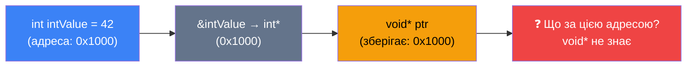

# Вказівники типу `void`

## Проблема узагальнення: навіщо потрібен «вказівник без типу»?

Уявіть, що ви пишете бібліотеку для обробки даних і хочете реалізувати одну функцію, яка виводить значення змінної на екран, незалежно від її типу — `int`, `double`, `char*` чи будь-який інший. Перше, що спало б на думку, — написати окремі перевантажені версії функції для кожного типу. Але якщо типів десятки? Чи взагалі невідомо, які типи будуть передані? Саме тут у стандарті C (а пізніше і C++) з'явилася ідея «загального вказівника» — вказівника, який вміє зберегти адресу об'єкта *будь-якого* типу без жодних обмежень. Цей механізм отримав назву **вказівник типу `void`** (void pointer, або generic pointer).

Однак разом із гнучкістю `void*` приносить і серйозну відповідальність: компілятор більше не контролює коректність. Розуміння того, чому це так, і коли такий підхід є прийнятним, — ключова мета цієї статті.

::note
**Передумови.** Перед читанням переконайтеся, що ви знайомі з основами вказівників ([стаття 15](/cpp/pointers-basics)), константними вказівниками та масивами ([стаття 17](/cpp/pointers-const-arrays)), а також адресною арифметикою ([стаття 18](/cpp/pointer-arithmetic)). Концепція `static_cast` коротко пояснена нижче, але загальне уявлення про явне перетворення типів буде корисним.
::

---

## Що таке `void*`

**Вказівник типу `void`** (`void*`) — це вказівник, який може зберігати адресу об'єкта *будь-якого* типу даних. На відміну від `int*` (який може вказувати тільки на `int`) або `double*` (який вказує тільки на `double`), `void*` не прив'язаний до жодного конкретного типу.

Стандарт C++ гарантує, що будь-який вказівник на об'єкт може бути неявно перетворений у `void*` без втрати інформації про адресу. Тобто `void*` зберігає *лише адресу* — числове значення, що вказує на розміщення даних у пам'яті, — але не має уявлення про те, що саме зберігається за цією адресою.

Оголошення `void*` виглядає так само, як і для будь-якого іншого вказівника, тільки замість конкретного типу стоїть ключове слово `void`:

```cpp [main.cpp]
void* ptr;              // не ініціалізований — небезпечно!
void* safePtr = nullptr; // правильна ініціалізація нульовим вказівником
```

::warning
Завжди ініціалізуйте вказівники. Неініціалізований `void* ptr;` містить сміттєве значення і може призвести до невизначеної поведінки при будь-якій спробі його використання.
::

---

## Неявне перетворення до `void*`

Перша і, мабуть, найзручніша властивість `void*` — це можливість неявно прийняти адресу об'єкта *будь-якого* типу. C++ дозволяє таке перетворення без жодного `cast`:

```cpp [main.cpp]
#include <iostream>

int main()
{
    int    intValue  = 42;
    double dblValue  = 3.14;
    char   charValue = 'Z';

    void* ptr;

    ptr = &intValue;  // int* → void*  (неявне, дозволено)
    ptr = &dblValue;  // double* → void* (неявне, дозволено)
    ptr = &charValue; // char* → void*  (неявне, дозволено)

    return 0;
}
```

Розглянемо детально рядок `ptr = &intValue;`. Оператор `&intValue` повертає `int*` — вказівник на ціле число. Коли ми присвоюємо його `void*`, компілятор виконує неявне (implicit) перетворення: адреса залишається тією самою, але інформація про тип «забувається». Після цього `ptr` знає лише *де* знаходяться дані, але не *що* саме там лежить.

::mermaid



::

Саме цей «амнезійний» характер `void*` є і його силою (прийме будь-який тип), і його головною небезпекою (не контролює коректність).

---

## Неможливість прямого розіменування

Розіменування (dereference) — це операція отримання значення, на яке вказує вказівник. Для `int* p` вираз `*p` повертає `int`. Але що повертає `*voidPtr`? Компілятор не може відповісти на це питання, адже розмір і формат даних визначаються типом — а тип невідомий.

Саме тому **розіменування `void*` напряму є забороненим і компілятор відкине такий код з помилкою**:

```cpp [main.cpp]
int value = 7;
void* voidPtr = &value;

// std::cout << *voidPtr; // ❌ Помилка компіляції:
// error: 'void*' is not a pointer-to-object type
```

Щоб розіменувати `void*`, необхідно спочатку **явно перетворити** його до конкретного типу вказівника за допомогою `static_cast`. Лише після цього отриманий конкретний вказівник можна розіменувати:

```cpp [main.cpp] {6-7}
#include <iostream>

int main()
{
    int value = 7;
    void* voidPtr = &value;

    int* intPtr = static_cast<int*>(voidPtr); // void* → int*
    std::cout << *intPtr << '\n';             // ✅ Виводить: 7

    // Або ж в один вираз:
    std::cout << *static_cast<int*>(voidPtr) << '\n'; // ✅ Виводить: 7

    return 0;
}
```

**Розбір ключових рядків:**

- `static_cast<int*>(voidPtr)` — оператор явного перетворення типів часу компіляції. Ми «нагадуємо» компілятору, що за адресою, яку зберігає `voidPtr`, знаходиться саме `int`. Компілятор довіряє нам на слово.
- `*intPtr` — тепер розіменування є законним: компілятор знає, що `intPtr` вказує на `int` розміром 4 байти, тому читає рівно 4 байти з пам'яті і інтерпретує їх як ціле число.

::caution
Якщо ви приведете `void*` до *неправильного* типу (наприклад, вказівник на `double` приведете до `int*`), компілятор не видасть помилки — але результат буде **невизначеним**. Це і є головна небезпека `void*`.
::

::debugger-view{title="Local Variables — після static_cast" :variables='[{"name": "value", "type": "int", "value": "7"}, {"name": "voidPtr", "type": "void*", "value": "0x00CFFC44"}, {"name": "intPtr", "type": "int*", "value": "0x00CFFC44"}]'}
::

Зверніть увагу на рядок `intPtr` у дебаггері: адреса `0x00CFFC44` збігається з адресою у `voidPtr`. Перетворення типу змінює лише *інтерпретацію* компілятором, але не переміщує нічого в пам'яті.

---

## Неможливість адресної арифметики

Адресна арифметика (pointer arithmetic) з `void*` також є забороненою. Щоб зрозуміти чому, згадаємо, як вона працює для звичайних вказівників.

Коли ми пишемо `ptr++` для `int* ptr`, компілятор насправді додає до адреси значення `sizeof(int)` — тобто 4 байти. Він «знає», що наступний `int` у пам'яті розміщується рівно через 4 байти. Але для `void*` компілятор не знає розміру елемента — а значить, не може коректно обчислити зміщення:

```cpp [main.cpp]
int arr[] = {10, 20, 30};
void* vPtr = arr;

// vPtr++;    // ❌ Помилка: arithmetic on a pointer to void
// vPtr + 1;  // ❌ Те саме
```

Щоб виконати арифметику, необхідно спочатку привести `void*` до конкретного типу:

```cpp [main.cpp]
int arr[] = {10, 20, 30};
void* vPtr = arr;

int* iPtr = static_cast<int*>(vPtr);
std::cout << *(iPtr + 1) << '\n'; // ✅ Виводить: 20
```

::note
У мові C (на відміну від C++) деякі компілятори (наприклад, GCC з розширеннями) дозволяють арифметику з `void*`, вважаючи крок рівним 1 байту. Однак це **нестандартна поведінка**, яка не гарантується стандартом C++ і не є переносимою.
::

---

## Практичний приклад: «поліморфна» функція виводу

Класичний приклад застосування `void*` — функція, яка приймає значення довільного типу і виводить його на екран. Щоб функція знала, як інтерпретувати отримані дані, разом із `void*` передається додатковий цілочисельний параметр, що описує тип:

```cpp [VoidPrint.cpp] showLineNumbers
#include <iostream>

// Константи для позначення типу (замість enum, який ми ще не вивчали)
const int TYPE_INT    = 0;
const int TYPE_DOUBLE = 1;
const int TYPE_CSTR   = 2;

void printValue(void* ptr, int type)
{
    if (type == TYPE_INT)
    {
        // Приводимо void* до int*, потім розіменовуємо
        std::cout << *static_cast<int*>(ptr) << '\n';
    }
    else if (type == TYPE_DOUBLE)
    {
        // Аналогічно для double
        std::cout << *static_cast<double*>(ptr) << '\n';
    }
    else if (type == TYPE_CSTR)
    {
        // char* не потребує розіменування: cout обробляє char* як рядок
        std::cout << static_cast<char*>(ptr) << '\n';
    }
}

int main()
{
    int    n = 42;
    double d = 9.81;
    char   s[] = "Привіт";

    printValue(&n, TYPE_INT);    // Виводить: 42
    printValue(&d, TYPE_DOUBLE); // Виводить: 9.81
    printValue(s,  TYPE_CSTR);   // Виводить: Привіт

    return 0;
}
```

**Детальний розбір функції `printValue`:**

- **Рядок 9.** Функція приймає два аргументи: `void* ptr` (адреса об'єкта будь-якого типу) і `int type` (цілочисельний ярлик, що описує, що саме знаходиться за цією адресою).
- **Рядок 13.** `*static_cast<int*>(ptr)` — двоетапна операція: спочатку `static_cast<int*>(ptr)` перетворює `void*` на `int*`, а потім `*` розіменовує результат, отримуючи значення типу `int`.
- **Рядок 22.** Зверніть увагу: для `char*` ми *не* розіменовуємо. `std::cout` розпізнає, що `char*` — це C-style рядок, і виводить увесь рядок до нульового символу. Якби ми написали `*static_cast<char*>(ptr)`, то отримали б лише перший символ.

::terminal-preview{title="./VoidPrint"}
<div class="line"><span class="opacity-40">$</span> <strong class="font-bold">./VoidPrint</strong></div>
<div class="line"><span class="text-blue-400 font-bold">42</span></div>
<div class="line"><span class="text-blue-400 font-bold">9.81</span></div>
<div class="line"><span class="text-blue-400 font-bold">Привіт</span></div>
::

Функція `printValue` виглядає елегантно і справді є корисною ілюстрацією принципу роботи `void*`. Але тепер розглянемо, чому саме такий підхід є **анти-патерном у сучасному C++**.

---

## `void*` як анти-патерн: проблема втрати безпеки типів

**Безпека типів** (type safety) — це властивість мови або програми запобігати некоректним операціям з даними через контроль типів. C++ є мовою зі статичною типізацією: компілятор перевіряє коректність операцій над типами *до* виконання програми. `void*` повністю обходить цей механізм.

Розглянемо ситуацію з нашою функцією `printValue`:

```cpp [bug.cpp]
int n = 42;

// Ми передаємо int*, але вказуємо тип TYPE_CSTR.
// Компілятор не бачить жодної проблеми!
printValue(&n, TYPE_CSTR); // ❌ Невизначена поведінка
```

Що відбудеться? Функція виконає `static_cast<char*>(&n)` — і отримає вказівник `char*` на байти, що містять число `42`. Далі `std::cout` почне читати байти, починаючи з адреси `n`, і виводити їх як символи, поки не натрапить на нульовий байт. На 64-бітній системі з little-endian порядком байтів перший байт числа `42` — це `0x2A` (символ `*`), після чого йдуть три нульові байти — і рядок негайно «завершується». Програма виведе `*` або щось подібне замість очікуваного числа, але **не впаде з помилкою** — що набагато гірше: помилку буде важко відловити.

::warning
Найнебезпечніші помилки — це ті, що **не проявляються** одразу. Використання `void*` без належного контролю типів може призвести до тихої логічної помилки, яка проявиться лише за специфічних умов у продакшн-середовищі.
::

---

## Сучасні альтернативи `void*`

Стандарт C++ пропонує кілька потужних механізмів, які вирішують ту ж задачу узагальнення, але зі збереженням безпеки типів:

::card-group

::card{title="Перевантаження функцій" icon="i-heroicons-squares-plus"}

Окрема функція для кожного типу. Компілятор сам обирає потрібну версію. Безпечно, читабельно.

```cpp
void print(int v)         { std::cout << v; }
void print(double v)      { std::cout << v; }
void print(const char* v) { std::cout << v; }
```

::

::card{title="Шаблони функцій" icon="i-heroicons-code-bracket"}

Один код для всіх типів, але компілятор генерує окрему безпечну версію для кожного типу автоматично.

```cpp
template<typename T>
void print(const T& value)
{
    std::cout << value << '\n';
}
```

::

::

Шаблони функцій — найбільш поширена і потужна альтернатива. Порівняємо підходи:

::code-group

```cpp [void* підхід (небезпечний)]
// Потребує ручного відстеження типу — схильний до помилок
void printValue(void* ptr, int type)
{
    if (type == TYPE_INT)
        std::cout << *static_cast<int*>(ptr);
    // ... багато boilerplate коду
}

// Виклик: можна передати неправильний тип!
int n = 42;
printValue(&n, TYPE_DOUBLE); // Тихий UB!
```

```cpp [Шаблон (безпечний)]
template<typename T>
void printValue(const T& value)
{
    std::cout << value << '\n';
}

// Виклик: компілятор сам визначає тип, помилка неможлива
int n = 42;
printValue(n);    // ✅ int
printValue(3.14); // ✅ double
printValue("Hi"); // ✅ const char*
```

::

Різниця разюча: шаблонна версія коротша, читабельніша і абсолютно безпечна — компілятор не дозволить передати некоректний аргумент, оскільки тип визначається автоматично.

---

## `void*` vs `nullptr` vs нульовий вказівник

Студенти часто плутають три пов'язані поняття. Давайте їх чітко розмежуємо:

| Поняття | Визначення | Тип | Чи можна розіменувати? |
|---|---|---|---|
| **`void*`** | Вказівник без типу, зберігає адресу | `void*` | Лише після `static_cast` |
| **`nullptr`** | Літерал нульового вказівника (C++11) | `std::nullptr_t` | Ніколи — UB |
| **Нульовий вказівник** | Будь-який вказівник зі значенням `0`/`nullptr` | `T*` | Ніколи — UB |

**Ключова різниця між `void*` і `nullptr`:**

- `void*` — це *тип вказівника*. Він може мати як ненульове, так і нульове значення.
- `nullptr` — це *значення*. Воно може бути присвоєне вказівнику будь-якого типу, зокрема і `void*`.

```cpp [PointersComparison.cpp]
#include <iostream>

int main()
{
    void* vp = nullptr; // void* зі значенням nullptr — цілком коректно

    int x = 5;
    void* vp2 = &x;     // void* з реальною адресою

    // nullptr можна присвоїти вказівнику будь-якого типу:
    int*    ip  = nullptr;
    double* dp  = nullptr;
    void*   vp3 = nullptr;

    // Перевірка на null перед розіменуванням:
    if (vp2 != nullptr)
    {
        std::cout << *static_cast<int*>(vp2) << '\n'; // ✅ Безпечно
    }

    return 0;
}
```

::note
`void*` може бути нульовим вказівником — це цілком законний стан, що означає «вказівник без типу, який ні на що не вказує». Але розіменування нульового вказівника, незалежно від його типу, завжди є невизначеною поведінкою (undefined behavior).
::

---

## Коли `void*` все ж таки виправданий

Попри те, що в сучасному C++ `void*` вважається анти-патерном, є кілька ситуацій, де він залишається необхідним або прийнятним:

::accordion
::accordion-item{label="1. Взаємодія з C API" icon="i-lucide-circle-help"}
Функції мови C, зокрема стандартні (`memcpy`, `malloc`, `qsort`), оперують `void*` за визначенням. При виклику таких функцій у C++-коді використання `void*` є неминучим.

```cpp
int arr[] = {5, 2, 8, 1, 4};

// Функція порівняння для qsort — приймає const void*
int compareInts(const void* a, const void* b)
{
    int valA = *static_cast<const int*>(a);
    int valB = *static_cast<const int*>(b);
    return valA - valB;
}

// qsort — стандартна функція сортування C — приймає void*
qsort(arr, 5, sizeof(int), compareInts);
```
::
::accordion-item{label="2. Реалізація власних алокаторів пам'яті" icon="i-lucide-circle-help"}
Коли ви пишете власний менеджер пам'яті або пул об'єктів (object pool), на рівні управління байтами тип даних ще невідомий. У таких випадках `void*` є природним вибором для роботи з «сирою» пам'яттю.
::
::accordion-item{label="3. Низькорівневі системні інтерфейси" icon="i-lucide-circle-help"}
Операційні системи та апаратні інтерфейси нерідко використовують `void*` для передачі даних, тип яких визначається контекстом або протоколом. Наприклад, функція потоку в POSIX (`pthread_create`) приймає `void* (*start_routine)(void*)`.
::
::accordion-item{label="4. Обмежені вбудовані системи (embedded)" icon="i-lucide-circle-help"}
На мікроконтролерах компілятори іноді не підтримують шаблони або STL. У такому вузькоспеціалізованому середовищі `void*` може бути єдиним прийнятним засобом узагальнення.
::
::

::tip
**Правило великого пальця:** якщо ви пишете `void*` у новому C++-коді і у вас немає описаних вище причин — зупиніться і подумайте, чи не вирішить задачу шаблон або перевантаження функції. Майже напевно вирішить.
::

---

## Практика та підсумок

### :icon{name="i-heroicons-pencil-square"} Практичні завдання

::card-group

::card{title="Рівень 1 — Базовий" icon="i-heroicons-academic-cap"}

**Завдання 1.** Оголосіть вказівник типу `void*` і послідовно присвойте йому адреси змінних `int`, `float` та `bool`. Після кожного присвоєння виведіть значення, правильно привевши `void*` до відповідного типу через `static_cast`.

**Завдання 2.** Чому наступний код не компілюється? Виправте його:
```cpp
double pi = 3.14159;
void* vp = &pi;
std::cout << *vp << '\n'; // Помилка. Що не так?
```

**Завдання 3.** Напишіть функцію `bool isNull(void* ptr)`, що повертає `true`, якщо переданий вказівник є нульовим, і `false` інакше. Протестуйте її з `nullptr` і з адресою реальної змінної.

::

::card{title="Рівень 2 — Логіка" icon="i-heroicons-cpu-chip"}

**Завдання 4.** Реалізуйте функцію `void swapMemory(void* a, void* b, int size)`, яка обмінює значення двох ділянок пам'яті через побайтове копіювання в тимчасовий буфер `char`. Протестуйте для обміну двох `int` та двох `double`.

**Завдання 5.** Напишіть функцію `void printArray(void* arr, int length, int elementSize, int type)`, що виводить масив довільного типу. Використовуйте константи `TYPE_INT`, `TYPE_DOUBLE` для визначення типу. Всередині застосуйте адресну арифметику через `char*` (кожен байт — крок 1), а для зчитування — `static_cast` до потрібного типу.

::

::card{title="Рівень 3 — Архітектура" icon="i-heroicons-building-library"}

**Завдання 6.** Реалізуйте спрощений **пул пам'яті** (memory pool): структура (яку ми поки що замінимо глобальними змінними) з масивом `char buffer[1024]`, цілочисельним лічильником `int offset = 0` і двома функціями:
- `void* poolAllocate(int size)` — повертає вказівник на наступний вільний блок і збільшує `offset`.
- `void poolReset()` — скидає `offset` у нуль.

Протестуйте: виділіть пам'ять для `int`, `double` і `char[20]`, запишіть значення і зчитайте через `static_cast`.

::

::

---

## Підсумок

::card-group

::card{title="Що таке void*" icon="i-heroicons-magnifying-glass"}

`void*` — вказівник без типу, що може зберігати адресу об'єкта будь-якого типу. Неявне перетворення до `void*` дозволено, але зворотне потребує `static_cast`.

::

::card{title="Що заборонено" icon="i-heroicons-x-circle"}

- Пряме розіменування `*voidPtr` — заборонено
- Адресна арифметика `voidPtr++` — заборонено
- Посилання на `void` (`void&`) — не існує

::

::card{title="Головна небезпека" icon="i-heroicons-exclamation-triangle"}

`void*` обходить систему типів C++. Компілятор не перевірить коректність `static_cast` — відповідальність повністю на розробнику.

::

::card{title="Сучасні альтернативи" icon="i-heroicons-arrow-trending-up"}

Перевантаження функцій і шаблони (`template<typename T>`) вирішують ту ж задачу безпечно. Надавайте їм перевагу в будь-якому новому C++-коді.

::

::

У наступній статті ми розглянемо **вказівники на вказівники** (`int**`) — ще один рівень непрямості, що відкриває можливість створення динамічних двовимірних масивів та є основою для розуміння аргументу `char** argv` функції `main`.
