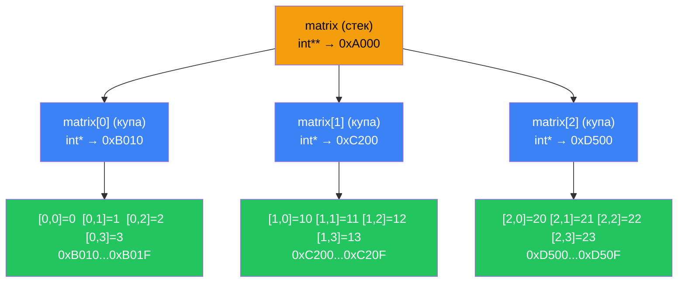

# Вказівники на вказівники

## Ще один рівень непрямості: навіщо вказівник на вказівник?

У попередніх статтях ми навчилися зберігати адресу змінної у вказівнику. Але що, якщо нам потрібно зберегти адресу *самого вказівника*? На перший погляд це звучить як штучне ускладнення, проте такий механізм є природним рішенням низки практичних задач:

- **Динамічні двовимірні масиви**, розміри яких невідомі на момент компіляції.
- **Масиви рядків** у стилі C (класичний приклад — `char** argv`).
- **Функції, що змінюють самий вказівник** через параметр (передача вказівника «за посиланням» у стилі C).

Усе це стає можливим завдяки конструкції **вказівник на вказівник** (pointer to pointer), або **подвійний вказівник** (double pointer), що оголошується через подвоєну зірочку: `int**`.

::note
**Передумови.** Ця стаття спирається на основи вказівників ([стаття 15](/cpp/pointers-basics)) і динамічне виділення пам'яті ([стаття 19](/cpp/dynamic-memory)), зокрема оператори `new[]` і `delete[]`. Без розуміння того, як `new` виділяє пам'ять у купі (heap), матеріал про двовимірні масиви буде важко сприйняти.
::

---

## Базова концепція: вказівник — це теж змінна

Щоб зрозуміти `int**`, достатньо пригадати одну фундаментальну властивість: **вказівник — це звичайна змінна**, яка зберігає адресу. Як і будь-яка змінна, вона сама займає місце в пам'яті і, відповідно, **має власну адресу**.

Візьмемо звичайний ланцюжок:

```cpp [Chain.cpp] showLineNumbers
int value   = 7;       // int-змінна: зберігає 7, знаходиться за адресою 0x1000
int* ptr    = &value;  // int*-вказівник: зберігає 0x1000, сам за адресою 0x2000
int** pptr  = &ptr;    // int**-вказівник: зберігає 0x2000, сам за адресою 0x3000
```

::mermaid


::

Щоб дістатися до значення `7` через `pptr`, нам потрібно виконати **два розіменування** послідовно:

- `*pptr` → отримуємо `ptr` (тобто адресу `0x1000`)
- `**pptr` → отримуємо `value` (тобто `7`)

Це і є суть подвійного вказівника — кожна додаткова зірочка в оголошенні відповідає одному додатковому рівню розіменування при зверненні до кінцевого значення.

---

## Оголошення, ініціалізація та розіменування

Повний приклад з усіма варіантами доступу до даних:

```cpp [DoublePtr.cpp] showLineNumbers
#include <iostream>

int main()
{
    int   value = 7;
    int*  ptr   = &value;  // вказує на value
    int** pptr  = &ptr;    // вказує на ptr

    std::cout << value   << '\n'; // 7  — пряме звернення до змінної
    std::cout << *ptr    << '\n'; // 7  — розіменування ptr
    std::cout << **pptr  << '\n'; // 7  — подвійне розіменування pptr

    // Можна також модифікувати value через pptr:
    **pptr = 42;
    std::cout << value << '\n';   // 42 — змінилось!

    return 0;
}
```

**Розбір ключових моментів:**

- **Рядок 6.** `int** pptr = &ptr;` — беремо адресу *вказівника* `ptr`. Оператор `&` повертає `int**` (вказівник на `int*`), що і є типом `pptr`.
- **Рядок 11.** `**pptr` — два розіменування: перше дає нам `ptr` (типу `int*`), друге — значення, на яке вказує `ptr`.
- **Рядок 14.** `**pptr = 42` — через подвійне розіменування ми записуємо нове значення безпосередньо в `value`. Усі три вирази (`value`, `*ptr`, `**pptr`) тепер дадуть `42`.

::debugger-view{title="Local Variables" :variables='[{"name": "value", "type": "int", "value": "42"}, {"name": "ptr", "type": "int*", "value": "0x00CFFC40"}, {"name": "pptr", "type": "int**", "value": "0x00CFFC44"}]'}
::

::warning
Вираз `int** pptr = &&value;` є **незаконним** і не скомпілюється. Оператор `&value` повертає r-value (тимчасове значення адреси), яке не має власного розміщення в пам'яті — тому взяти його адресу оператором `&` неможливо. Щоб отримати `int**`, потрібна проміжна `int*`-змінна.
::

---

## Масиви вказівників

Найпоширеніше практичне застосування `int**` — динамічне виділення **масиву вказівників**. Уявіть, що нам потрібен масив із 3 вказівників на `int`, кожен з яких спрямований на власну змінну:

```cpp [PtrArray.cpp] showLineNumbers
#include <iostream>

int main()
{
    int a = 10, b = 20, c = 30;

    int** ptrs = new int*[3]; // масив із 3-х вказівників на int
    ptrs[0] = &a;             // ptrs[0] вказує на a
    ptrs[1] = &b;             // ptrs[1] вказує на b
    ptrs[2] = &c;             // ptrs[2] вказує на c

    for (int i = 0; i < 3; ++i)
    {
        std::cout << *ptrs[i] << '\n'; // розіменовуємо кожен вказівник
    }

    delete[] ptrs; // звільняємо лише масив вказівників, не самі змінні!
    return 0;
}
```

::terminal-preview{title="./PtrArray"}
<div class="line"><span class="opacity-40">$</span> <strong class="font-bold">./PtrArray</strong></div>
<div class="line"><span class="text-blue-400 font-bold">10</span></div>
<div class="line"><span class="text-blue-400 font-bold">20</span></div>
<div class="line"><span class="text-blue-400 font-bold">30</span></div>
::

Зверніть увагу на рядок 16: `delete[] ptrs` звільняє лише сам масив вказівників (`ptrs`), але **не об'єкти, на які вони вказують** (`a`, `b`, `c`). Ті знаходяться на стеку і знищуються автоматично при виході з `main`. Плутанина в цьому питанні — одна з найпоширеніших причин витоків пам'яті або подвійного звільнення.

---

## Динамічні двовимірні масиви

Найбільш складне, але і найбільш практично важливе застосування `int**` — **динамічне виділення двовимірного масиву**, розмір якого невідомий під час компіляції.

### Чому `new int[rows][cols]` не працює для динамічних розмірів

Якщо обидва розміри відомі завчасно і є константами компіляції, можна написати:

```cpp
int (*matrix)[7] = new int[15][7]; // ✅ Але тільки якщо 7 — константа компіляції
```

Однак якщо кількість стовпців задається під час виконання — наприклад, читається з вводу користувача — такий синтаксис є неможливим. Саме тут і потрібен `int**`.

### Класичний підхід: масив рядків

Ідея проста: замість одного суцільного блоку пам'яті ми створюємо масив вказівників, кожен з яких вказує на окремо виділений «рядок»:

::steps

### Крок 1: Виділити масив вказівників (рядки)

```cpp
int rows = 4;
int cols = 5;

int** matrix = new int*[rows]; // масив із rows вказівників — це «рядки»
```

### Крок 2: Виділити кожен рядок окремо

```cpp
for (int r = 0; r < rows; ++r)
{
    matrix[r] = new int[cols]; // кожен рядок — окремий масив у купі
}
```

### Крок 3: Ініціалізувати значення

```cpp
for (int r = 0; r < rows; ++r)
{
    for (int c = 0; c < cols; ++c)
    {
        matrix[r][c] = r * cols + c; // заповнюємо як у 2D-масиві
    }
}
```

### Крок 4: Використати масив

```cpp
std::cout << matrix[1][3] << '\n'; // Виводить: 8
// Синтаксис matrix[r][c] еквівалентний (*(matrix + r))[c]
```

### Крок 5: Звільнити пам'ять у зворотному порядку

```cpp
for (int r = 0; r < rows; ++r)
{
    delete[] matrix[r]; // спочатку — кожен рядок
}
delete[] matrix; // потім — масив вказівників
```

::

::caution
Порядок звільнення критично важливий. Якщо видалити `matrix` першим (`delete[] matrix`), адреси рядків будуть втрачені і звільнити їх буде неможливо — це **витік пам'яті** (memory leak). Завжди звільняйте у порядку, **зворотному до виділення**: спочатку найглибші рівні, потім зовнішні.
::

Повний приклад роботи з динамічним двовимірним масивом:

```cpp [Dynamic2D.cpp] showLineNumbers
#include <iostream>

int main()
{
    int rows = 3;
    int cols = 4;

    // Виділення
    int** matrix = new int*[rows];
    for (int r = 0; r < rows; ++r)
        matrix[r] = new int[cols];

    // Заповнення
    for (int r = 0; r < rows; ++r)
        for (int c = 0; c < cols; ++c)
            matrix[r][c] = r * 10 + c;

    // Вивід
    for (int r = 0; r < rows; ++r)
    {
        for (int c = 0; c < cols; ++c)
            std::cout << matrix[r][c] << '\t';
        std::cout << '\n';
    }

    // Звільнення (зворотний порядок!)
    for (int r = 0; r < rows; ++r)
        delete[] matrix[r];
    delete[] matrix;

    return 0;
}
```

::terminal-preview{title="./Dynamic2D"}
<div class="line"><span class="opacity-40">$</span> <strong class="font-bold">./Dynamic2D</strong></div>
<div class="line"><span class="text-blue-400">0</span>&nbsp;&nbsp;&nbsp;&nbsp;<span class="text-blue-400">1</span>&nbsp;&nbsp;&nbsp;&nbsp;<span class="text-blue-400">2</span>&nbsp;&nbsp;&nbsp;&nbsp;<span class="text-blue-400">3</span></div>
<div class="line"><span class="text-blue-400">10</span>&nbsp;&nbsp;&nbsp;<span class="text-blue-400">11</span>&nbsp;&nbsp;&nbsp;<span class="text-blue-400">12</span>&nbsp;&nbsp;&nbsp;<span class="text-blue-400">13</span></div>
<div class="line"><span class="text-blue-400">20</span>&nbsp;&nbsp;&nbsp;<span class="text-blue-400">21</span>&nbsp;&nbsp;&nbsp;<span class="text-blue-400">22</span>&nbsp;&nbsp;&nbsp;<span class="text-blue-400">23</span></div>
::

---

## Структура пам'яті: чому рядки не є суміжними

Це надзвичайно важливий нюанс, який відрізняє «масив масивів» від справжнього прямокутного двовимірного масиву.

::mermaid



::

Зверніть увагу: `matrix[0]`, `matrix[1]` і `matrix[2]` вказують на **різні, не суміжні** ділянки купи. Це принципова відмінність від статичного масиву `int arr[3][4]`, де всі 12 елементів розміщені в одній неперервній ділянці пам'яті. Ця несуміжність означає:

- **Перевага:** кожен рядок може мати **різну довжину** (так звані «зубчасті», або jagged-масиви).
- **Недолік:** через відсутність locality of reference (просторової локалізації) кеш процесора використовується менш ефективно порівняно з суцільними масивами.

---

## Альтернатива: «сплющений» одновимірний масив

Коли двовимірний масив є прямокутним (однакова кількість стовпців у кожному рядку), існує набагато елегантніша альтернатива — **«сплющити» його в одновимірний масив** і обраховувати індекс вручну. Це дає суміжний блок пам'яті, кращу продуктивність кешу і значно простіше управління пам'яттю:

```cpp [Flat2D.cpp] showLineNumbers
#include <iostream>

// Перетворення 2D-індексів на 1D
int getIndex(int row, int col, int numCols)
{
    return row * numCols + col;
}

int main()
{
    int rows = 3;
    int cols = 4;

    // Один виклик new замість rows+1 викликів
    int* matrix = new int[rows * cols];

    // Заповнення через допоміжну функцію
    for (int r = 0; r < rows; ++r)
        for (int c = 0; c < cols; ++c)
            matrix[getIndex(r, c, cols)] = r * 10 + c;

    // Доступ через getIndex()
    std::cout << "matrix[1][3] = " << matrix[getIndex(1, 3, cols)] << '\n'; // 13

    // Один виклик delete[]
    delete[] matrix;
    return 0;
}
```

**Переваги «сплюснутого» підходу:**
- Один виклик `new` і один `delete[]` — менше шансів на витік.
- Всі дані в суміжній пам'яті — кеш процесора задоволений.
- Простіше для компілятора оптимізувати.

::tip
У сучасному C++ для більшості задач слід надавати перевагу `std::vector<std::vector<int>>` або `std::vector<int>` зі сплющенням замість ручного управління `int**`. Вони автоматично управляють пам'яттю і запобігають витокам.
::

---

## Глибокі рівні вкладеності: `int***` і далі

Концептуально нічого не заважає додати ще один рівень непрямості:

```cpp
int***  ptr3; // вказівник на вказівник на вказівник
int**** ptr4; // і ще глибше...
```

Тривимірний масив через `int***` будувався б за аналогічною схемою: масив вказівників на `int**`, кожен із яких є масивом вказівників на `int*`, а кожен з тих — масив `int`. Кількість викликів `new` і `delete` зростає експоненційно, а складність коду стрімко збільшується.

::warning
На практиці рівень вкладеності вказівників більше двох (`int***` і глибше) майже ніколи не є правильним рішенням. Це надійний сигнал, що варто переглянути архітектуру і скористатися вищерівневими абстракціями: `std::vector`, `std::array` або сплющеним масивом.
::

---

## Порівняння підходів до двовимірних масивів

| Підхід | Суміжність пам'яті | Різна довжина рядків | Управління пам'яттю | Рекомендація |
|---|---|---|---|---|
| `int arr[R][C]` | ✅ Так | ❌ Ні | Автоматичне (стек) | Якщо розміри відомі на компіляції |
| `int** matrix` (класичний) | ❌ Ні | ✅ Так | Ручне (складне) | Лише для jagged-масивів |
| `int* flat` (сплющений) | ✅ Так | ❌ Ні | Ручне (просте) | Для прямокутних матриць |
| `std::vector<std::vector<int>>` | ❌ Ні | ✅ Так | Автоматичне (RAII) | ✅ Рекомендований вибір |
| `std::vector<int>` (сплющений) | ✅ Так | ❌ Ні | Автоматичне (RAII) | ✅ Найкраща продуктивність |

---

## Практика та підсумок

### :icon{name="i-heroicons-pencil-square"} Практичні завдання

::card-group

::card{title="Рівень 1 — Базовий" icon="i-heroicons-academic-cap"}

**Завдання 1.** Оголосіть змінну `int x = 100`, звичайний вказівник `int* p = &x` та подвійний вказівник `int** pp = &p`. Виведіть значення `x` трьома способами: через `x`, через `*p` та через `**pp`. Переконайтесь, що всі три виводять `100`.

**Завдання 2.** Чому наступний код не компілюється? Поясніть помилку і виправте її, додавши одну проміжну змінну:
```cpp
int val = 5;
int** pp = &&val; // помилка компіляції
```

**Завдання 3.** Динамічно виділіть масив вказівників `int*` розміром 3. Оголосіть три окремі змінні `int` і запишіть їхні адреси в елементи масиву. Виведіть значення, розіменувавши кожен вказівник, і звільніть пам'ять.

::

::card{title="Рівень 2 — Логіка" icon="i-heroicons-cpu-chip"}

**Завдання 4.** Реалізуйте функцію `void allocate2D(int**& matrix, int rows, int cols)`, що динамічно виділяє двовимірний масив і заповнює його нулями. Напишіть парну функцію `void free2D(int**& matrix, int rows)` для коректного звільнення. У `main` продемонструйте їх роботу.

**Завдання 5.** Реалізуйте функцію `void transpose(int** src, int** dst, int rows, int cols)`, що транспонує матрицю `src` (розміром `rows × cols`) у попередньо виділену `dst` (розміром `cols × rows`). Перевірте результат для матриці 3×4.

::

::card{title="Рівень 3 — Архітектура" icon="i-heroicons-building-library"}

**Завдання 6.** Реалізуйте набір функцій для роботи з «сплющеною» матрицею (без STL і без класів):
- `int* createMatrix(int rows, int cols)` — виділяє пам'ять.
- `void setElement(int* matrix, int row, int col, int cols, int value)` — записує значення.
- `int getElement(int* matrix, int row, int col, int cols)` — зчитує значення.
- `void printMatrix(int* matrix, int rows, int cols)` — виводить матрицю рядками.
- `void freeMatrix(int* matrix)` — звільняє пам'ять.

Перевірте: створіть матрицю 4×4, заповніть її значеннями таблиці множення (`i * j`) і виведіть.

::

::

---

## Підсумок

::card-group

::card{title="Ключова ідея" icon="i-heroicons-light-bulb"}

`int**` — вказівник на вказівник. Потребує подвійного розіменування `**` для доступу до кінцевого значення. Сам вказівник — це теж змінна зі своєю адресою.

::

::card{title="Головне застосування" icon="i-heroicons-table-cells"}

Динамічні двовимірні масиви: виділяємо масив `int*` (рядки), потім кожен рядок окремо. Рядки **не є суміжними** в пам'яті.

::

::card{title="Правило звільнення" icon="i-heroicons-trash"}

Звільняти у **зворотному** порядку: спочатку кожен рядок (`delete[] matrix[r]`), потім масив вказівників (`delete[] matrix`).

::

::card{title="Краща альтернатива" icon="i-heroicons-arrow-trending-up"}

`std::vector<std::vector<int>>` — автоматичне управління пам'яттю. `std::vector<int>` зі сплющенням — найкраща продуктивність.

::

::

У наступній статті ми розглянемо **оператор `->` (доступ до членів через вказівник)** — лаконічний синтаксичний цукор, без якого неможливо комфортно працювати зі структурами та об'єктами через вказівники.
