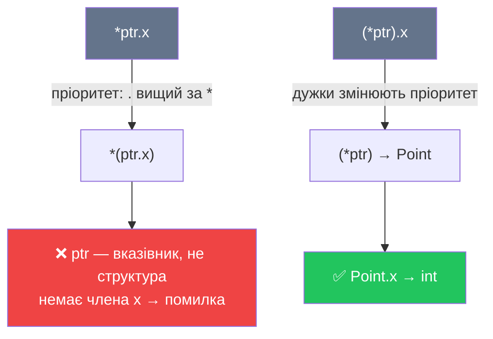

# Оператор доступу до членів через вказівник (`->`)

## Проблема: доступ до структури через вказівник

До цього моменту ми вже знайомі зі структурами (struct) та вміємо звертатися до їхніх членів через оператор `.`. Але у реальних програмах ми часто маємо справу не зі змінною структури безпосередньо, а з **вказівником на неї** — наприклад, після динамічного виділення пам'яті через `new`, або коли структура передається у функцію для уникнення копіювання.

У такій ситуації звичайний доступ через `.` не спрацює. Потрібен додатковий крок — розіменування, і саме тут з'являється дрібна, але болюча проблема з пріоритетом операторів. Щоб її розв'язати, C++ надає спеціальний оператор `->`, який ми детально розглянемо у цій статті.

::note
**Передумови.** Стаття спирається на основи вказівників ([стаття 15](/cpp/pointers-basics)), посилань ([стаття 16](/cpp/references)) та динамічного виділення пам'яті ([стаття 19](/cpp/dynamic-memory)). Знання структур є обов'язковим — передбачається, що ви вже вміли оголошувати `struct` і звертатися до полів через `.`.
::

---

## Три способи доступу до членів: `var`, `ref` та `ptr`

Щоб зрозуміти проблему, яку вирішує `->`, спочатку систематизуємо всі три способи доступу до членів структури залежно від того, що у вас є — змінна, посилання чи вказівник.

Оголосимо просту структуру `Point`:

```cpp [Point.cpp] showLineNumbers
#include <iostream>

struct Point
{
    int x;
    int y;
};

int main()
{
    Point p = { 10, 20 };  // звичайна змінна структури

    // Спосіб 1: через змінну — оператор "."
    p.x = 30;
    std::cout << p.x << '\n'; // 30

    // Спосіб 2: через посилання — теж оператор "."
    Point& ref = p;
    ref.y = 50;
    std::cout << ref.y << '\n'; // 50

    // Спосіб 3: через вказівник — потрібне розіменування
    Point* ptr = &p;
    (*ptr).x = 99; // спочатку розіменовуємо, потім звертаємося до члена
    std::cout << p.x << '\n';  // 99

    return 0;
}
```

Рядки 1 і 2 виглядають природно. Рядок 3 — `(*ptr).x` — вже більш громіздкий. Чому потрібні дужки? Тут криється важливий нюанс пріоритету операторів.

---

## Пастка пріоритетів: чому `*ptr.x` — помилка

Розглянемо, що станеться, якщо написати без дужок:

```cpp [Priority.cpp]
Point* ptr = &p;

// ptr.x     — ❌ Помилка: ptr — це вказівник, а не структура; у нього немає члена x
// *ptr.x    — ❌ Помилка компіляції: читається як *(ptr.x), що безглуздо
// (*ptr).x  — ✅ Правильно: спочатку розіменовуємо ptr, потім звертаємося до x
```

Причина у **пріоритеті операторів** (operator precedence). У C++ оператор `.` (доступ до члена) має **вищий пріоритет**, ніж оператор `*` (розіменування). Тому вираз `*ptr.x` компілятор читає зліва направо після урахування пріоритетів як `*(ptr.x)` — тобто «візьми член `x` у вказівника `ptr`, а потім розіменуй». Але `ptr` — це `Point*`, у нього немає члена `x`. Результат — помилка компіляції.

::mermaid



::

Дужки у `(*ptr).x` змушують компілятор спочатку виконати розіменування `*ptr` (отримуємо `Point`), а вже потім звернутися до члена через `.`. Але щоразу тримати це в голові та клацати дужки — незручно і схильно до помилок. Саме тому мова C++ пропонує простіше рішення.

---

## Оператор `->`: синтаксичний цукор

Оператор **`->`** (стрілка, arrow operator) — це скорочена форма, яка об'єднує розіменування вказівника і доступ до члена в одну операцію. Наступні два рядки абсолютно еквівалентні:

```cpp
(*ptr).x = 99;   // повна форма — громіздко
ptr->x = 99;     // скорочена форма — чисто і зрозуміло
```

`ptr->x` читається буквально: **«перейти за вказівником `ptr` і взяти член `x`»**. Жодних дужок, жодних проблем із пріоритетом — компілятор сам виконує всю роботу.

Повний приклад з усіма трьома способами доступу поруч:

```cpp [ArrowOp.cpp] showLineNumbers
#include <iostream>

struct Rectangle
{
    double width;
    double height;
};

double calcArea(Rectangle* rect)
{
    return rect->width * rect->height; // через вказівник — завжди ->
}

int main()
{
    Rectangle r = { 5.0, 3.0 };

    Rectangle* ptr = &r;

    // Рівнозначні способи читати поле width:
    std::cout << r.width     << '\n'; // 5 — через змінну
    std::cout << (*ptr).width << '\n'; // 5 — розіменування + крапка
    std::cout << ptr->width   << '\n'; // 5 — оператор стрілки ✅

    // Модифікація через ->
    ptr->width = 10.0;
    std::cout << "Площа: " << calcArea(ptr) << '\n'; // 30

    return 0;
}
```

**Розбір ключових рядків:**

- **Рядки 21–23.** Усі три вирази дають однаковий результат `5`. Перший — прямий доступ через змінну, другий — громіздкий класичний спосіб, третій — рекомендований `->`.
- **Рядок 26.** `ptr->width = 10.0` змінює поле `width` безпосередньо в об'єкті `r` через вказівник.
- **Рядок 10.** У функції `calcArea` параметр `rect` є вказівником — тому використовуємо `->`. Використання `.` тут дало б помилку компіляції.

::terminal-preview{title="./ArrowOp"}
<div class="line"><span class="opacity-40">$</span> <strong class="font-bold">./ArrowOp</strong></div>
<div class="line"><span class="text-blue-400">5</span></div>
<div class="line"><span class="text-blue-400">5</span></div>
<div class="line"><span class="text-blue-400">5</span></div>
<div class="line">Площа: <span class="text-blue-400 font-bold">30</span></div>
::

---

## `->` з динамічно виділеними структурами

Найбільш часто оператор `->` зустрічається разом з динамічним виділенням пам'яті. Коли ми створюємо структуру через `new`, результатом є вказівник — і це єдиний спосіб взаємодіяти з цим об'єктом:

```cpp [DynamicStruct.cpp] showLineNumbers
#include <iostream>

struct Player
{
    int health;
    int score;
};

int main()
{
    // new повертає вказівник Player* — доступ тільки через ->
    Player* player = new Player;

    player->health = 100;
    player->score  = 0;

    std::cout << "Health: " << player->health << '\n';
    std::cout << "Score:  " << player->score  << '\n';

    // Еквівалентний, але громіздкий запис:
    // (*player).health = 100;
    // (*player).score  = 0;

    delete player; // звільняємо пам'ять
    player = nullptr;

    return 0;
}
```

::terminal-preview{title="./DynamicStruct"}
<div class="line"><span class="opacity-40">$</span> <strong class="font-bold">./DynamicStruct</strong></div>
<div class="line">Health: <span class="text-blue-400 font-bold">100</span></div>
<div class="line">Score:  <span class="text-blue-400 font-bold">0</span></div>
::

Зверніть увагу: після `delete player` ми обов'язково присвоюємо `player = nullptr`. Це запобігає ситуації «висячого вказівника» (dangling pointer) — після звільнення пам'яті будь-яке звернення через `player->` є невизначеною поведінкою, і присвоєння `nullptr` дозволяє виявити такі помилки через перевірку `if (player != nullptr)`.

---

## Ланцюгове звернення через `->` (chaining)

Якщо структура містить вказівник на іншу структуру, можна ланцюгово застосовувати `->` кілька разів поспіль:

```cpp [Chaining.cpp] showLineNumbers
#include <iostream>

struct Engine
{
    int horsepower;
};

struct Car
{
    Engine* engine; // вказівник на Engine
    int year;
};

int main()
{
    Engine v8 = { 450 };
    Car sportsCar = { &v8, 2024 };

    Car* carPtr = &sportsCar;

    // Перший -> розіменовує carPtr → Car
    // .engine дає нам Engine*
    // Другий -> розіменовує Engine* → Engine
    // .horsepower дає нам int
    std::cout << carPtr->engine->horsepower << '\n'; // 450

    // Рівнозначно (але набагато гірше читається):
    std::cout << (*(*carPtr).engine).horsepower << '\n'; // 450

    return 0;
}
```

**Розбір рядка 24:** `carPtr->engine->horsepower` розкладається покроково:

1. `carPtr->engine` — розіменовуємо `carPtr` (отримуємо `Car`), звертаємося до члена `engine` (отримуємо `Engine*`).
2. `(Engine*)->horsepower` — розіменовуємо отриманий `Engine*` (отримуємо `Engine`), звертаємося до поля `horsepower` (отримуємо `int`).

Порівняйте з рядком 27: `(*(*carPtr).engine).horsepower` — те саме, але читати це значно важче. Саме для таких ситуацій `->` є незамінним.

::warning
Ланцюгове `->` потрібно використовувати обережно: якщо будь-який проміжний вказівник є `nullptr`, розіменування призведе до аварійного завершення програми (segmentation fault). Перед ланцюговим доступом завжди перевіряйте вказівники на `nullptr`.
::

---

## Передача структури у функцію: посилання vs вказівник

Розглянемо типову ситуацію: функція отримує структуру і має доступ до її членів. Є два способи — через посилання і через вказівник:

::code-group

```cpp [Через посилання (const&)]
void printPoint(const Point& p)
{
    // Посилання — використовуємо крапку "."
    std::cout << "x=" << p.x
              << " y=" << p.y << '\n';
}

// Виклик:
Point pt = { 3, 7 };
printPoint(pt); // передаємо pt — копіювання не відбувається
```

```cpp [Через вказівник (*)]
void printPoint(const Point* p)
{
    // Вказівник — використовуємо стрілку "->"
    std::cout << "x=" << p->x
              << " y=" << p->y << '\n';
}

// Виклик:
Point pt = { 3, 7 };
printPoint(&pt); // передаємо адресу pt
```

::

Обидва варіанти однаково ефективні — жодного копіювання структури. Різниця в **синтаксисі виклику** та **можливості передати `nullptr`**: вказівник можна перевірити на `nullptr`, посилання — ні. У сучасному C++ для «необов'язкових» параметрів (які можуть бути відсутні) зазвичай воліють вказівник, для обов'язкових — константне посилання.

---

## Зведена таблиця: `.` проти `->`

| Ситуація | Синтаксис | Приклад |
|---|---|---|
| Змінна структури | `var.member` | `p.x` |
| Посилання на структуру | `ref.member` | `ref.x` |
| Вказівник на структуру | `ptr->member` | `ptr->x` |
| Вказівник на структуру (альтернатива) | `(*ptr).member` | `(*ptr).x` |
| Ланцюговий вказівник | `ptr->inner->member` | `carPtr->engine->hp` |

::tip
**Золоте правило:** якщо у вас є вказівник — завжди використовуйте `->`. Якщо є змінна або посилання — завжди використовуйте `.`. Ніколи не змішуйте.
::

---

## Практика та підсумок

### :icon{name="i-heroicons-pencil-square"} Практичні завдання

::card-group

::card{title="Рівень 1 — Базовий" icon="i-heroicons-academic-cap"}

**Завдання 1.** Оголосіть структуру `Circle` з полями `double radius` і `double x, y` (координати центру). Створіть змінну `Circle c`, посилання `Circle& ref = c` та вказівник `Circle* ptr = &c`. Заповніть поля через всі три способи (`.`, `ref.`, `ptr->`) і виведіть результати.

**Завдання 2.** Що виведе наступний код і чому? Поясніть без запуску.
```cpp
struct Box { int side; };

Box b = { 5 };
Box* p = &b;
p->side = 10;
std::cout << b.side << '\n';
```

**Завдання 3.** Виправте помилку в коді:
```cpp
struct Student { int age; };
Student s = { 20 };
Student* ptr = &s;
std::cout << *ptr.age << '\n'; // ❌
```

::

::card{title="Рівень 2 — Логіка" icon="i-heroicons-cpu-chip"}

**Завдання 4.** Оголосіть структуру `Person` з полями `int age` та `double salary`. Реалізуйте функцію `void applyRaise(Person* person, double percent)`, що збільшує `salary` на відсоток. Всередині функції використовуйте `->`. Перевірте на `nullptr` перед доступом.

**Завдання 5.** Динамічно виділіть масив із 3 структур `Point`. Заповніть кожну структуру значеннями через `->` (зверніть увагу: елементи масиву структур можна отримати через `array[i].member` або `(array + i)->member`). Виведіть всі точки і звільніть пам'ять.

::

::card{title="Рівень 3 — Архітектура" icon="i-heroicons-building-library"}

**Завдання 6.** Реалізуйте просту **«перелінковану» структуру** (linked list вручну, лише два вузли):

```cpp
struct Node
{
    int value;
    Node* next; // вказівник на наступний вузол
};
```

У `main`:
1. Динамічно виділіть два вузли (`new Node`).
2. Заповніть значення першого (`value = 10`) і другого (`value = 20`).
3. Зв'яжіть їх: `first->next = second`, `second->next = nullptr`.
4. Виведіть значення обох вузлів, пройшовши ланцюгом через `->next->value`.
5. Звільніть обидва вузли у **зворотному** порядку.

::

::

---

## Підсумок

::card-group

::card{title="Проблема" icon="i-heroicons-exclamation-circle"}

Доступ до членів структури через вказівник потребує розіменування: `(*ptr).member`. Дужки обов'язкові через пріоритет: `.` вищий за `*`.

::

::card{title="Рішення" icon="i-heroicons-check-circle"}

Оператор `->` об'єднує розіменування та доступ до члена: `ptr->member`. Читабельно, безпечно, без дужок.

::

::card{title="Золоте правило" icon="i-heroicons-star"}

- Є вказівник `T*` → використовуй `ptr->member`
- Є змінна `T` або посилання `T&` → використовуй `var.member`

::

::card{title="Ланцюгування" icon="i-heroicons-link"}

`ptr->inner->field` — кожна `->` розіменовує вказівник і йде до наступного рівня. Перевіряйте кожен вказівник на `nullptr`.

::

::

У наступній статті ми перейдемо до **вказівників на функції** — механізму, що дозволяє зберігати адресу функції у змінній і передавати її як аргумент, відкриваючи можливості для callback-функцій та гнучкого дизайну.
