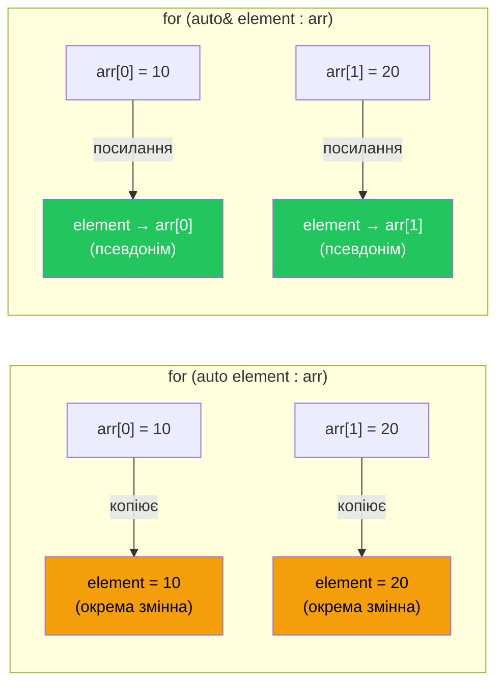
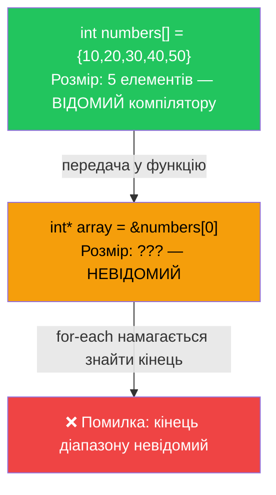

# Цикл `for-each` (Range-based for)

## Проблема класичного `for`: де ховаються помилки?

Уявіть собі, що вам потрібно знайти максимальний бал серед семи студентів. Ви відкриваєте редактор і пишете перше, що спадає на думку — класичний цикл `for`:

```cpp [Scores.cpp]
#include <iostream>

int main()
{
    const int NUM_STUDENTS = 7;
    int scores[NUM_STUDENTS] = { 45, 87, 55, 68, 80, 90, 58 };

    int maxScore = 0;

    for (int i = 0; i < NUM_STUDENTS; ++i)
    {
        if (scores[i] > maxScore)
            maxScore = scores[i];
    }

    std::cout << "Найвищий бал: " << maxScore << '\n';

    return 0;
}
```

Код працює. Але розгляньмо його уважніше: рядок `i < NUM_STUDENTS` — де ховається пастка? Якщо написати `i <= NUM_STUDENTS`, програма вийде за межі масиву і поведінка буде невизначеною. Якщо масив передається як параметр функції, він перетворюється на вказівник, і `NUM_STUDENTS` стає недоступним — виникає окрема проблема. Щоразу, пишучи такий цикл, ми змушені тримати в голові кілька деталей одночасно: початкове значення, умову зупинки, крок, правильне ім'я масиву.

Ця сукупність дрібниць породжує цілий клас помилок, відомий як **«off-by-one errors»** (помилки неврахованої одиниці). Саме щоб усунути цю проблему, у стандарті **C++11** з'явився новий синтаксис — **цикл `for-each`**, відомий також як **range-based for** (цикл діапазону).

::note
**Передумови.** Стаття спирається на знання масивів (стаття 09), циклів (стаття 08), вказівників ([стаття 15](/cpp/pointers-basics)), посилань ([стаття 16](/cpp/references)) і явища Array Decay ([стаття 17](/cpp/pointers-const-arrays)). Саме Array Decay є ключем до розуміння головного обмеження `for-each`, яке ми розглянемо нижче.
::

---

## Синтаксис та перша програма

Загальна форма циклу `for-each` виглядає так:

```
for (оголошення_елемента : діапазон)
    тіло_циклу;
```

де:
- **`оголошення_елемента`** — змінна, якій на кожній ітерації присвоюється значення чергового елемента діапазону.
- **`діапазон`** — масив, `std::vector`, `std::string` чи інший об'єкт, що підтримує ітерацію.

Перепишемо приклад пошуку максимального балу з використанням `for-each`:

```cpp [Scores.cpp] showLineNumbers
#include <iostream>

int main()
{
    const int NUM_STUDENTS = 7;
    int scores[NUM_STUDENTS] = { 45, 87, 55, 68, 80, 90, 58 };

    int maxScore = 0;

    for (int score : scores) // на кожній ітерації score = черговий елемент scores
    {
        if (score > maxScore)
            maxScore = score;
    }

    std::cout << "Найвищий бал: " << maxScore << '\n';

    return 0;
}
```

**Розбір ключового рядка (рядок 10):**

`for (int score : scores)` читається буквально: **«для кожного `score` з `scores`»**. На першій ітерації `score` отримує значення `45`, на другій — `87`, на третій — `55` і так далі, доки всі елементи масиву не будуть опрацьовані. Жодного індексу, жодної умови зупинки, жодної можливості вийти за межі масиву.

::terminal-preview{title="./Scores"}
<div class="line"><span class="opacity-40">$</span> <strong class="font-bold">./Scores</strong></div>
<div class="line">Найвищий бал: <span class="text-blue-400 font-bold">90</span></div>
::

---

## `auto` у `for-each`: дозвольте компілятору думати за вас

У прикладі вище ми явно написали `int score`. Але що, якщо тип елементів складний, або ми просто не хочемо дублювати інформацію? Ключове слово `auto` ідеально доповнює `for-each` — воно автоматично виводить тип елементу з типу масиву:

```cpp [AutoForEach.cpp] showLineNumbers
#include <iostream>

int main()
{
    double temperatures[] = { 22.5, 19.0, 25.7, 18.3, 21.1 };

    for (auto temp : temperatures) // компілятор виводить тип: double
    {
        std::cout << temp << ' ';
    }
    std::cout << '\n';

    return 0;
}
```

::terminal-preview{title="./AutoForEach"}
<div class="line"><span class="opacity-40">$</span> <strong class="font-bold">./AutoForEach</strong></div>
<div class="line"><span class="text-blue-400">22.5 19 25.7 18.3 21.1</span></div>
::

`auto` у `for-each` — це більше, ніж зручність. Припустімо, що ви вирішите змінити тип масиву з `double` на `float`. З явним `float temp` вам потрібно шукати і змінювати всі такі місця у коді. З `auto` — достатньо змінити тип масиву, і цикл автоматично адаптується.

::tip
Використовуйте `auto` в `for-each` як стандартну практику. Це не «лінь», а навмисне делегування відповідальності за визначення типу компілятору, який завжди зробить це правильно.
::

---

## Копіювання vs посилання: прихована вартість

Тут криється важливий нюанс, який новачки часто пропускають. Коли ви пишете `for (auto element : array)`, на кожній ітерації компілятор **копіює** черговий елемент масиву у змінну `element`. Для `int` чи `double` це незначна операція. Але уявіть масив великих структур або об'єктів — кожне копіювання матиме помітну вартість.

Щоб продемонструвати різницю, поглянемо на схему:

::mermaid



::

Щоб уникнути копіювання, достатньо додати `&` — і `element` стане **посиланням** (псевдонімом) на реальний елемент масиву, а не його копією:

```cpp [Reference.cpp] showLineNumbers
#include <iostream>

int main()
{
    int numbers[] = { 1, 2, 3, 4, 5 };

    // Варіант 1: копія — зміни НЕ впливають на масив
    for (auto num : numbers)
    {
        num = num * 2; // змінюємо лише локальну копію
    }
    std::cout << numbers[0] << '\n'; // Виводить: 1 (масив не змінився!)

    // Варіант 2: посилання — зміни впливають на масив
    for (auto& num : numbers)
    {
        num = num * 2; // змінюємо сам елемент масиву
    }
    std::cout << numbers[0] << '\n'; // Виводить: 2 (масив змінився!)

    return 0;
}
```

**Розбір:**

- **Рядок 8.** `for (auto num : numbers)` — `num` є копією. Будь-які зміни `num` залишаються локальними та не впливають на вихідний масив.
- **Рядок 16.** `for (auto& num : numbers)` — `num` є посиланням. Оператор `num = num * 2` фактично змінює `numbers[0]`, `numbers[1]` тощо.

---

## `const auto&` — золотий стандарт для читання

Якщо ваша мета — лише *прочитати* елементи без їх зміни, найкращою практикою є **`const auto&`**:

- `const` — гарантує, що ми випадково не змінимо елемент.
- `&` — запобігає зайвому копіюванню.
- `auto` — компілятор сам виводить тип.

```cpp [BestPractice.cpp] showLineNumbers
#include <iostream>

int main()
{
    int scores[] = { 45, 87, 55, 68, 80, 90, 58 };

    int total = 0;

    for (const auto& score : scores) // читаємо без копіювання
    {
        total += score;
    }

    std::cout << "Сума: " << total << '\n';

    return 0;
}
```

`const auto&` є правилом, якого варто дотримуватися за замовчуванням тоді, коли вам не потрібно змінювати елементи. Для невеликих скалярних типів (`int`, `double`, `char`) різниця між `auto` та `const auto&` в сучасних компіляторах мінімальна — вони самі оптимізують код. Але для великих об'єктів `const auto&` є справжньою необхідністю.

::card-group

::card{title="for (auto elem : arr)" icon="i-heroicons-document-duplicate"}

**Копіювання.** Кожен елемент копіюється. Зміни `elem` не впливають на масив. Повільніше для великих об'єктів.

::

::card{title="for (auto& elem : arr)" icon="i-heroicons-pencil"}

**Посилання.** Псевдонім реального елемента. Зміни `elem` змінюють масив. Без копіювання.

::

::card{title="for (const auto& elem : arr)" icon="i-heroicons-lock-closed"}

**Константне посилання.** ✅ Рекомендовано для читання. Без копіювання, без випадкових змін.

::

::

---

## Робота зі `std::vector` та іншими контейнерами

`for-each` дозволяє ітерувати не лише по статичних масивах, а й по будь-якому **контейнері стандартної бібліотеки** — `std::vector`, `std::string`, `std::array` тощо. Синтаксис залишається ідентичним:

```cpp [VectorLoop.cpp] showLineNumbers
#include <iostream>
#include <vector>

int main()
{
    std::vector<int> primes = { 2, 3, 5, 7, 11, 13, 17 };

    std::cout << "Прості числа: ";

    for (const auto& prime : primes)
    {
        std::cout << prime << ' ';
    }

    std::cout << '\n';

    return 0;
}
```

::terminal-preview{title="./VectorLoop"}
<div class="line"><span class="opacity-40">$</span> <strong class="font-bold">./VectorLoop</strong></div>
<div class="line">Прості числа: <span class="text-blue-400">2 3 5 7 11 13 17</span></div>
::

Зверніть увагу: для `std::vector` синтаксис **абсолютно ідентичний** синтаксису для звичайного масиву. Це одна з найважливіших переваг `for-each` — він абстрагує конкретний тип контейнера. Якщо ви вирішите замінити `std::vector` на `std::array` або будь-який інший стандартний контейнер — тіло циклу не зміниться.

---

## Головне обмеження: чому `for-each` не працює з вказівниками

Ось де знають про себе знання з попередніх статей. Уявімо, що ми передаємо масив у функцію і хочемо підсумувати його елементи за допомогою `for-each`:

```cpp [BrokenForEach.cpp]
#include <iostream>

int sumArray(int array[]) // array тут — це int*, не масив!
{
    int total = 0;

    for (const auto& num : array) // ❌ Помилка компіляції
    {
        total += num;
    }

    return total;
}

int main()
{
    int numbers[] = { 10, 20, 30, 40, 50 };
    std::cout << sumArray(numbers) << '\n';

    return 0;
}
```

Компілятор відкине цей код з помилкою на кшталт:
```
error: 'begin' was not declared in this scope
```

**Чому?** Щоб цикл `for-each` міг ітерувати, він повинен знати **де починається** і **де закінчується** діапазон. Для статичного масиву компілятор знає його розмір з оголошення. Але коли масив передається у функцію, відбувається **Array Decay** — масив «розпадається» у вказівник `int*`, і інформація про розмір безповоротно губиться. Вказівник знає лише адресу першого елемента, але не знає кількості елементів — тому `for-each` не може визначити, де зупинитися.

::mermaid



::

З цієї ж причини `for-each` **не працює з динамічними масивами** (`new int[n]`): змінна `int*` не несе в собі інформацію про розмір.

### Правильне рішення: передавати розмір явно або використовувати `std::vector`

```cpp [WorkingSum.cpp] showLineNumbers
#include <iostream>
#include <vector>

// Варіант 1: передаємо розмір явно, використовуємо звичайний for
int sumWithSize(int array[], int length)
{
    int total = 0;

    for (int i = 0; i < length; ++i)
    {
        total += array[i];
    }

    return total;
}

// Варіант 2: std::vector — for-each працює, розмір відомий завжди
int sumVector(const std::vector<int>& vec)
{
    int total = 0;

    for (const auto& num : vec) // ✅ Працює!
    {
        total += num;
    }

    return total;
}

int main()
{
    int numbers[] = { 10, 20, 30, 40, 50 };
    std::vector<int> numVec = { 10, 20, 30, 40, 50 };

    std::cout << "Сума (масив): " << sumWithSize(numbers, 5) << '\n';
    std::cout << "Сума (vector): " << sumVector(numVec) << '\n';

    return 0;
}
```

---

## Відсутність індексу та як це обійти

Одне з найчастіших запитань: «А як дізнатися індекс поточного елемента в `for-each`?». Коротка відповідь — **ніяк безпосередньо**. Це архітектурне рішення: `for-each` абстрагується від поняття індексу, адже багато контейнерів (наприклад, зв'язані списки) взагалі не підтримують довільного доступу за індексом.

Якщо індекс вам все ж потрібен, є два поширені підходи:

```cpp [IndexWorkaround.cpp] showLineNumbers
#include <iostream>

int main()
{
    int values[] = { 10, 20, 30, 40, 50 };

    // Підхід 1: окремий лічильник
    int index = 0;

    for (const auto& val : values)
    {
        std::cout << "values[" << index << "] = " << val << '\n';
        ++index;
    }

    std::cout << '\n';

    // Підхід 2: якщо потрібен індекс — краще використати звичайний for
    int length = 5;

    for (int i = 0; i < length; ++i)
    {
        std::cout << "values[" << i << "] = " << values[i] << '\n';
    }

    return 0;
}
```

::terminal-preview{title="./IndexWorkaround" :expandable="true" maxHeight="180px"}
<div class="line"><span class="opacity-40">$</span> <strong class="font-bold">./IndexWorkaround</strong></div>
<div class="line">values[0] = <span class="text-blue-400">10</span></div>
<div class="line">values[1] = <span class="text-blue-400">20</span></div>
<div class="line">values[2] = <span class="text-blue-400">30</span></div>
<div class="line">values[3] = <span class="text-blue-400">40</span></div>
<div class="line">values[4] = <span class="text-blue-400">50</span></div>
::

::tip
Якщо вам потрібен індекс — це чіткий сигнал, що `for-each` є неоптимальним вибором для цієї задачі. Використовуйте звичайний `for` з явним індексом. Кожен інструмент має своє місце.
::

---

## Коли і що використовувати

Настав час систематизувати: коли `for-each` є правильним вибором, а коли — ні.

::tabs

::tabs-item{label="✅ Використовуйте for-each"}

- Потрібно пройти по **всіх** елементах послідовно.
- Не потрібен індекс елемента.
- Не потрібно пропускати елементи або проходити в зворотному порядку.
- Маєте `std::vector`, `std::string` або інший стандартний контейнер.
- Статичний масив з відомим розміром у **поточній** області видимості.

```cpp
// ✅ Ідеальний випадок для for-each
int values[] = { 3, 1, 4, 1, 5, 9 };
int total = 0;

for (const auto& val : values)
    total += val;
```

::

::tabs-item{label="❌ Не використовуйте for-each"}

- Потрібен індекс поточного елемента.
- Ітерація в зворотному порядку чи з кроком більше 1.
- Масив отримано як `int*` параметр функції (Array Decay).
- Динамічний масив (`new int[n]`).
- Маєте намір видаляти елементи під час ітерації.

```cpp
// ❌ for-each не підходить — потрібен індекс
int values[] = { 3, 1, 4, 1, 5, 9 };

for (int i = values[i - 1] != values[i]; i < 6; ++i)
    // ...

// Краще: звичайний for
for (int i = 1; i < 6; ++i)
{
    if (values[i] != values[i - 1])
        std::cout << values[i] << '\n';
}
```

::

::

---

## Практика та підсумок

### :icon{name="i-heroicons-pencil-square"} Практичні завдання

::card-group

::card{title="Рівень 1 — Базовий" icon="i-heroicons-academic-cap"}

**Завдання 1.** Оголосіть масив з 6 цілих чисел. Використайте `for-each` з `auto`, щоб вивести кожен елемент через пробіл. Потім повторіть з `const auto&` — поясніть різницю у написанні та результаті.

**Завдання 2.** Напишіть програму, що знаходить мінімальне значення в масиві `double` з 5 елементів за допомогою `for-each`. Використовуйте `const auto&`.

**Завдання 3.** Чому наступний код не компілюється? Запропонуйте два способи виправлення:
```cpp
void printAll(int arr[])
{
    for (const auto& num : arr) // ❌
        std::cout << num << ' ';
}
```

::

::card{title="Рівень 2 — Логіка" icon="i-heroicons-cpu-chip"}

**Завдання 4.** Оголосіть масив `int values[8]` і заповніть його довільними числами. Використайте `for-each` з `auto&` (без `const`), щоб замінити всі від'ємні числа на нуль. Виведіть масив до і після змін.

**Завдання 5.** Реалізуйте функцію `bool containsValue(const std::vector<int>& vec, int target)`, що повертає `true`, якщо вектор містить задане значення. Всередині використовуйте `for-each` з `const auto&` і оператор `break` для раннього виходу.

**Завдання 6.** Напишіть програму, яка за допомогою `for-each` підраховує кількість парних і непарних чисел у масиві з 10 елементів і виводить обидва лічильники.

::

::card{title="Рівень 3 — Архітектура" icon="i-heroicons-building-library"}

**Завдання 7.** Реалізуйте функцію `void replaceAll(std::vector<int>& vec, int oldValue, int newValue)`, що замінює всі входження `oldValue` на `newValue` у векторі. Використайте `for-each` з `auto&`. У `main` продемонструйте роботу: замініть усі `0` на `-1` у векторі `{1, 0, 2, 0, 3, 0}`.

**Завдання 8.** Напишіть програму-«довідник імен»: оголосіть масив рядків `const char*` з 6–8 імен. Зчитайте ім'я з клавіатури (`std::string`). За допомогою `for-each` з `const auto&` перевірте, чи є таке ім'я в масиві, і виведіть відповідне повідомлення (`"знайдено"` або `"не знайдено"`).

::

::

---

## Підсумок

::card-group

::card{title="Синтаксис" icon="i-heroicons-code-bracket"}

```cpp
for (const auto& elem : container)
    // тіло циклу
```

Читається: **«для кожного `elem` з `container`»**. Без індексів, без меж, без off-by-one.

::

::card{title="Три форми" icon="i-heroicons-list-bullet"}

- `auto elem` — копія, зміни не впливають на контейнер.
- `auto& elem` — посилання, можна змінювати.
- `const auto& elem` — ✅ рекомендовано для читання.

::

::card{title="Головне обмеження" icon="i-heroicons-exclamation-triangle"}

Не працює з `int*` (Array Decay) і динамічними масивами `new int[n]`. Компілятор не знає довжини — і не може визначити кінець діапазону.

::

::card{title="Коли обирати" icon="i-heroicons-arrows-right-left"}

Потрібні всі елементи по порядку → `for-each`. Потрібен індекс / зворотний порядок / пропуск → звичайний `for`.

::

::

У наступній статті ми розглянемо **вказівники на функції** — механізм, що дозволяє зберігати адресу функції у змінній і передавати її як аргумент, що є фундаментом для callback-функцій та гнучкого дизайну програм.
