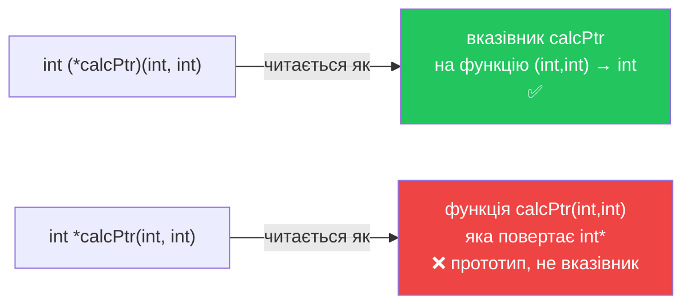
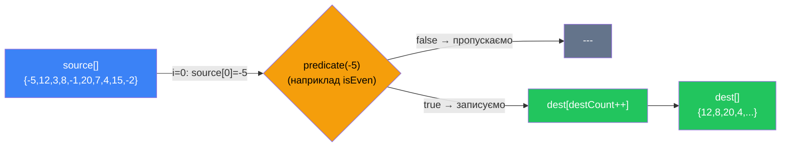

# Вказівники на функції

## Функція як дані: парадигмальний стрибок

До цього моменту ми мали чітке розмежування у свідомості: **код** — це те, що виконується; **дані** — це те, що зберігається у змінних і передається між функціями. Вказівники на функції руйнують цю межу. Вони дозволяють трактувати **функцію як значення** — зберегти її адресу у змінній, передати як аргумент, повернути як результат іншої функції.

Це не просто технічна особливість мови. Це **концептуальний стрибок**, який відкриває принципово новий спосіб проектування програм — стиль, що в теорії програмування називається **функціональним програмуванням** (functional programming, FP).

::note
**Передумови.** Стаття вимагає впевненого розуміння вказівників ([стаття 15](/cpp/pointers-basics)) і функцій взагалі. Знання пріоритету операторів (чому потрібні дужки в синтаксисі) буде корисним — ми пояснимо це детально нижче.
::

---

## Що таке функціональне програмування і до чого тут C++?

Перш ніж занурюватися в синтаксис, варто зрозуміти **ширший контекст**. Функціональне програмування — це парадигма, в якій функції є повноцінними «громадянами першого класу» (first-class citizens): їх можна передавати як аргументи, повертати з функцій і зберігати у структурах даних — точнісінько як звичайні числа чи рядки.

Мови на кшталт Haskell, F# або, частково, Python та JavaScript побудовані навколо цієї ідеї з самого початку. У C++ до C++11 функціональний стиль був можливий лише через вказівники на функції — саме тому їх розуміння є фундаментом для всього,  що стосується гнучкого проектування на C++.

::card-group

::card{title="Процедурне програмування" icon="i-heroicons-document-text"}

Функції — це **блоки коду** з іменами. Вони приймають дані і повертають дані. Самі не є даними.

```cpp
int add(int a, int b) { return a + b; }
int result = add(3, 5); // виклик функції
```

::

::card{title="Функціональне програмування" icon="i-heroicons-arrow-path"}

Функції — це **значення**. Їх можна зберігати у змінних, передавати іншим функціям і отримувати як результат.

```cpp
int (*operation)(int, int) = add; // функція як значення
int result = operation(3, 5);     // виклик через вказівник
```

::

::

Практичні наслідки цього переходу колосальні. Ось лише деякі кейси, які стають можливими:

- **Callback-функції** (функції зворотного виклику) — передача «інструкції» у бібліотечний код.
- **Таблиці диспетчеризації** — заміна великих `if/else` або `switch` на масив функцій.
- **Стратегії** — алгоритм, чия поведінка залежить від переданої функції (наприклад, спосіб сортування).
- **Обробники подій** — реакція на дію користувача через вказівник на функцію.

Усе це ми розглянемо детально в цій статті.

---

## Функція як l-value: адреса у пам'яті

Перший крок до розуміння — прийняти факт: **функція в пам'яті займає місце**. Скомпільований машинний код функції зберігається у сегменті коду (code segment) процесу, і кожна функція має свою унікальну адресу — так само, як кожна змінна.

Ось простий спосіб це побачити:

```cpp [FunctionAddr.cpp] showLineNumbers
#include <iostream>

int getValue()
{
    return 7;
}

int main()
{
    // getValue без дужок — це адреса функції, а не її виклик!
    std::cout << reinterpret_cast<void*>(getValue) << '\n';

    // Порівняйте:
    std::cout << getValue() << '\n'; // 7 — це вже виклик функції

    return 0;
}
```

::terminal-preview{title="./FunctionAddr"}
<div class="line"><span class="opacity-40">$</span> <strong class="font-bold">./FunctionAddr</strong></div>
<div class="line"><span class="text-gray-400">00007FF6A3C21020</span></div>
<div class="line"><span class="text-blue-400 font-bold">7</span></div>
::

**Найпоширеніша помилка початківців** — написати ім'я функції без дужок там, де очікується виклик, або навпаки — поставити дужки там, де потрібна адреса:

```cpp [Mistakes.cpp]
int * functionPtr = getValue;  // ❌ getValue — адреса, а не int
std::cout << getValue;         // ❌ Виводить адресу, а не результат
int result = getValue;         // ❌ Присвоюємо адресу, а не значення
```

**Ім'я функції без `()` — це її адреса. Ім'я функції з `()` — це її виклик.** Ця різниця є основою всього матеріалу статті.

---

## Синтаксис оголошення вказівника на функцію

Тут C++ демонструє один із найбільш неінтуїтивних синтаксисів у всій мові. Підготуйтеся — і прочитайте уважно.

Щоб оголосити вказівник на функцію, потрібно вказати:
1. **Тип повернення** функції, на яку вказуватиме вказівник.
2. **Ім'я вказівника** у дужках зі зірочкою: `(*ім'я)`.
3. **Типи параметрів** функції у дужках справа.

```
тип_повернення (*ім'я_вказівника)(типи_параметрів);
```

Розглянемо конкретні приклади:

```cpp [Declarations.cpp] showLineNumbers
// Вказівник на функцію без параметрів, що повертає int
int (*getterPtr)();

// Вказівник на функцію з двома int-параметрами, що повертає int
int (*calcPtr)(int, int);

// Вказівник на функцію з двома int-параметрами, що повертає bool
bool (*comparePtr)(int, int);

// Правильна ініціалізація (завжди ініціалізуйте вказівники!)
int (*safePtr)(int, int) = nullptr;
```

**Чому дужки навколо `*ім'я` обов'язкові?** Знову питання пріоритету операторів. Розберемо:

```cpp
int (*calcPtr)(int, int);  // ✅ вказівник на функцію, що повертає int
int  *calcPtr (int, int);  // ❌ оголошення функції calcPtr, що повертає int*
```

У другому рядку оператор `()` (виклик функції) має вищий пріоритет за `*`, тому без дужок `int *calcPtr(int, int)` компілятор читає це як: «функція `calcPtr`, що приймає два `int` і повертає `int*`» — тобто прототип функції, а не вказівник. Дужки `(*)` примушують компілятор спочатку прочитати «це вказівник», а вже потім — «на що він вказує».

::mermaid



::

---

## Присвоєння та сумісність типів

Вказівник на функцію можна ініціалізувати або переприсвоїти — але лише функцією з **абсолютно ідентичною сигнатурою** (тип повернення + типи параметрів):

```cpp [Compatibility.cpp] showLineNumbers
int add(int a, int b)
{
    return a + b;
}

double addDouble(double a, double b)
{
    return a + b;
}

int square(int x)
{
    return x * x;
}

int main()
{
    int (*calcPtr)(int, int);

    calcPtr = add;        // ✅ Сигнатури збігаються: int(int,int)
    calcPtr = addDouble;  // ❌ Помилка: double(double,double) ≠ int(int,int)
    calcPtr = square;     // ❌ Помилка: int(int) ≠ int(int,int) — різна к-сть параметрів

    return 0;
}
```

::note
C++ автоматично перетворює ім'я функції у вказівник на неї (function-to-pointer implicit conversion). Тому писати `calcPtr = &add;` не обов'язково — але допустимо. Зворотне перетворення (вказівник → `void*`) автоматично **не** виконується, тому у прикладі вище ми використовували `reinterpret_cast`.
::

---

## Виклик через вказівник

Існує два синтаксично рівнозначні способи викликати функцію через вказівник:

```cpp [Calling.cpp] showLineNumbers
#include <iostream>

int multiply(int a, int b)
{
    return a * b;
}

int main()
{
    int (*calcPtr)(int, int) = multiply;

    // Спосіб 1: явне розіменування
    int result1 = (*calcPtr)(3, 4); // (*calcPtr) — отримуємо функцію, (3, 4) — викликаємо

    // Спосіб 2: неявне розіменування (рекомендований стиль)
    int result2 = calcPtr(3, 4);    // виглядає як звичайний виклик функції

    std::cout << result1 << '\n'; // 12
    std::cout << result2 << '\n'; // 12

    return 0;
}
```

Обидва способи дають ідентичний результат. **Спосіб 2 (неявний)** є більш прийнятим у сучасному коді — він виглядає як звичайний виклик функції і не захаращує код зайвими операторами розіменування.

::warning
**Параметри за замовчуванням не працюють через вказівник на функцію.** Якщо функція оголошена як `int add(int a, int b = 0)`, то при виклику через вказівник значення `0` для `b` не буде підставлено — потрібно завжди передавати всі аргументи явно. Це пов'язано з тим, що параметри за замовчуванням обробляються компілятором статично, а вказівники на функції вирішуються під час виконання.
::

---

## Callback-функції: серцевина патерну

Найважливіше застосування вказівників на функції — **передача функції як аргументу іншій функції**. Функція, що передається таким чином, називається **callback** (функція зворотного виклику). Назва відображає суть: ви «реєструєте» функцію, і бібліотечний або алгоритмічний код «повертається» до неї у потрібний момент.

Класичний приклад — **сортування з кастомним порівнювачем**. Ідея: алгоритм сортування визначає *механізм* (як переставляти елементи), а callback визначає *стратегію* (коли переставляти — за зростанням, за спаданням, за абсолютним значенням тощо).

```cpp [SelectionSort.cpp] showLineNumbers
#include <iostream>
#include <utility>    // для std::swap

// Функція сортування вибором з кастомним порівнювачем
void selectionSort(int* array, int size, bool (*compare)(int, int))
{
    for (int startIndex = 0; startIndex < size; ++startIndex)
    {
        int bestIndex = startIndex;

        for (int currentIndex = startIndex + 1; currentIndex < size; ++currentIndex)
        {
            // Делегуємо рішення про перестановку callback-функції
            if (compare(array[bestIndex], array[currentIndex]))
                bestIndex = currentIndex;
        }

        std::swap(array[startIndex], array[bestIndex]);
    }
}

// Стратегія 1: сортування за зростанням
bool ascending(int a, int b)
{
    return a > b; // переставляти, якщо перший більший за другий
}

// Стратегія 2: сортування за спаданням
bool descending(int a, int b)
{
    return a < b; // переставляти, якщо перший менший за другий
}

// Допоміжна функція виводу масиву
void printArray(int* array, int size)
{
    for (int i = 0; i < size; ++i)
        std::cout << array[i] << ' ';
    std::cout << '\n';
}

int main()
{
    int numbers[] = { 4, 8, 5, 6, 2, 3, 1, 7 };

    // Використовуємо функцію descending як callback
    selectionSort(numbers, 8, descending);
    printArray(numbers, 8); // 8 7 6 5 4 3 2 1

    // Тепер передаємо ascending — алгоритм не змінився, лише стратегія
    selectionSort(numbers, 8, ascending);
    printArray(numbers, 8); // 1 2 3 4 5 6 7 8

    return 0;
}
```

::terminal-preview{title="./SelectionSort"}
<div class="line"><span class="opacity-40">$</span> <strong class="font-bold">./SelectionSort</strong></div>
<div class="line"><span class="text-blue-400">8 7 6 5 4 3 2 1</span></div>
<div class="line"><span class="text-blue-400">1 2 3 4 5 6 7 8</span></div>
::

**Розбір архітектурного рішення.** Зверніть увагу на рядок 5: `bool (*compare)(int, int)` — це параметр функції `selectionSort`. Він приймає **будь-яку** функцію з сигнатурою `bool(int, int)`, не знаючи нічого про її конкретну реалізацію. У рядках 43 і 47 ми передаємо відповідно `descending` і `ascending` — **не як виклики**, а як **адреси функцій**.

Ключовий момент рядка 13: `compare(array[bestIndex], array[currentIndex])` — алгоритм не знає *чого саме* він порівнює. Рішення про перестановку повністю делеговане зовнішньому коду. **Саме це і є callback-патерн**: алгоритмічний «каркас» залишається незмінним, а поведінка налаштовується ззовні.

### Додаємо третю стратегію без зміни алгоритму

Потужність підходу стає особливо помітною, коли ми додаємо нову поведінку, жодного рядка в `selectionSort` не змінюючи:

```cpp [EvensFirst.cpp] showLineNumbers
// Стратегія 3: спочатку парні числа, потім непарні; всередині груп — за зростанням
bool evensFirst(int a, int b)
{
    bool aIsEven = (a % 2 == 0);
    bool bIsEven = (b % 2 == 0);

    if (aIsEven && !bIsEven)
        return false; // a парне, b непарне — a йде першим, не міняємо

    if (!aIsEven && bIsEven)
        return true;  // a непарне, b парне — b має йти першим, міняємо

    return ascending(a, b); // в одній групі — за зростанням
}

int main()
{
    int numbers[] = { 4, 8, 6, 3, 1, 2, 5, 7 };

    selectionSort(numbers, 8, evensFirst);
    printArray(numbers, 8); // 2 4 6 8 1 3 5 7

    return 0;
}
```

::terminal-preview{title="./EvensFirst"}
<div class="line"><span class="opacity-40">$</span> <strong class="font-bold">./EvensFirst</strong></div>
<div class="line"><span class="text-blue-400">2 4 6 8 1 3 5 7</span></div>
::

Нова логіка `evensFirst` не торкнулася жодного рядка в `selectionSort`. Це — **відкритість до розширення і закритість до модифікації** (один з фундаментальних принципів проектування software).

---

## Фільтрація: callback-механізм у дії

Розглянемо ще один класичний кейс, де callback-патерн розкривається з усією силою — **фільтрація масиву**. Завдання просте: з вихідного масиву чисел відібрати лише ті елементи, що задовольняють певну умову, і записати їх у новий масив.

Умова фільтрації буде мінятися — саме її ми і передаватимемо як callback. В теорії функціонального програмування таку функцію-умову називають **предикатом** (predicate) — функцією, що повертає `true` або `false`.

### Крок 1: визначаємо сигнатуру предиката

Предикат для фільтрації цілих чисел — це функція, що приймає одне `int` і повертає `bool`:

```cpp
bool (*predicate)(int)
```

Читається: «вказівник на функцію, що приймає `int` і повертає `bool`». Це і буде наш callback-параметр.

### Крок 2: реалізуємо `filterArray`

Зупинімося і подумаємо над сигнатурою функції. Нам потрібно:
- Прийняти вхідний масив і його розмір.
- Прийняти **вихідний** масив (куди запишемо відфільтровані елементи).
- Прийняти предикат — умову відбору.
- **Повернути кількість** знайдених елементів, щоб викликаючий код знав, скільки з вихідного масиву реально заповнено.

```cpp [FilterArray.cpp] showLineNumbers
#include <iostream>

// Фільтрує елементи масиву source за умовою predicate.
// Результати записуються у масив dest.
// Повертає кількість відфільтрованих елементів.
int filterArray(int* source, int sourceSize, int* dest, bool (*predicate)(int))
{
    int destCount = 0; // лічильник знайдених елементів

    for (int i = 0; i < sourceSize; ++i)
    {
        // Передаємо черговий елемент у predicate.
        // predicate сам вирішує: залишати чи ні.
        if (predicate(source[i]))
        {
            dest[destCount] = source[i]; // копіюємо елемент у вихідний масив
            ++destCount;                 // збільшуємо лічильник
        }
    }

    return destCount; // повідомляємо, скільки елементів відібрано
}

// --- Предикати --- //

bool isEven(int n)
{
    return n % 2 == 0; // парне число
}

bool isOdd(int n)
{
    return n % 2 != 0; // непарне число
}

bool isPositive(int n)
{
    return n > 0; // більше нуля
}

bool isGreaterThanTen(int n)
{
    return n > 10; // більше 10
}

// Допоміжна функція для виводу масиву
void printArray(int* array, int size)
{
    for (int i = 0; i < size; ++i)
        std::cout << array[i] << ' ';
    std::cout << '\n';
}

int main()
{
    int source[] = { -5, 12, 3, 8, -1, 20, 7, 4, 15, -2 };
    const int SOURCE_SIZE = 10;

    int dest[SOURCE_SIZE]; // вихідний масив — максимум стільки ж, скільки у вхідному
    int count = 0;

    // Фільтруємо парні числа
    count = filterArray(source, SOURCE_SIZE, dest, isEven);
    std::cout << "Парні (" << count << "): ";
    printArray(dest, count);

    // Фільтруємо непарні числа
    count = filterArray(source, SOURCE_SIZE, dest, isOdd);
    std::cout << "Непарні (" << count << "): ";
    printArray(dest, count);

    // Фільтруємо позитивні числа
    count = filterArray(source, SOURCE_SIZE, dest, isPositive);
    std::cout << "Позитивні (" << count << "): ";
    printArray(dest, count);

    // Фільтруємо числа більше 10
    count = filterArray(source, SOURCE_SIZE, dest, isGreaterThanTen);
    std::cout << "Більше 10 (" << count << "): ";
    printArray(dest, count);

    return 0;
}
```

::terminal-preview{title="./FilterArray"}
<div class="line"><span class="opacity-40">$</span> <strong class="font-bold">./FilterArray</strong></div>
<div class="line">Парні (<span class="text-blue-400">4</span>): <span class="text-blue-400">12 8 20 4</span></div>
<div class="line">Непарні (<span class="text-blue-400">4</span>): <span class="text-blue-400">3 -1 7 15</span></div>
<div class="line">Позитивні (<span class="text-blue-400">7</span>): <span class="text-blue-400">12 3 8 20 7 4 15</span></div>
<div class="line">Більше 10 (<span class="text-blue-400">3</span>): <span class="text-blue-400">12 20 15</span></div>
::

### Розбір по рядках

**Рядок 6.** Сигнатура `filterArray`:
- `int* source, int sourceSize` — вхідний масив і його розмір.
- `int* dest` — вихідний масив, куди ми записуємо відфільтровані елементи. Його виділяє **викликаючий код** — нам достатньо знати його адресу.
- `bool (*predicate)(int)` — callback-параметр. `filterArray` не знає нічого про логіку фільтрації; вся умова відбору захована у цій функції.
- Повертає `int` — кількість елементів, що потрапили у `dest`.

**Рядок 8.** `int destCount = 0` — ми будемо нарощувати цей лічильник щоразу, коли предикат повертає `true`. Він же слугує індексом запису у `dest`.

**Рядок 13.** `if (predicate(source[i]))` — це серце алгоритму. `filterArray` **делегує** рішення про те, чи включати елемент у результат, зовнішній функції. Сам алгоритм нічого не знає: він лише запитує предикат і діє відповідно до відповіді.

**Рядок 15.** `dest[destCount] = source[i]` — записуємо елемент у вихідний масив за поточним лічильником, потім збільшуємо лічильник. Таким чином `destCount` одночасно є і кількістю записаних елементів, і наступним вільним індексом.

**Рядок 64.** `int dest[SOURCE_SIZE]` — ми виділяємо масив максимально можливого розміру (рівного вхідному). У найгіршому випадку всі елементи пройдуть фільтр — тоді нам знадобиться стільки ж місця. Реальна кількість записаних елементів повернеться через `count`.

### Візуалізація потоку даних

::mermaid



::

### Потужність підходу: жоден рядок `filterArray` не змінюється

Додамо ще один предикат — «число ділиться на 3» — і переконаємося, що алгоритм фільтрації не потребує жодних змін:

```cpp [ExtraPredicates.cpp] showLineNumbers
bool isDivisibleByThree(int n)
{
    return n % 3 == 0;
}

bool isBetweenFiveAndFifteen(int n)
{
    return n >= 5 && n <= 15;
}

int main()
{
    int source[] = { -5, 12, 3, 8, -1, 20, 7, 4, 15, -2 };
    const int SOURCE_SIZE = 10;
    int dest[SOURCE_SIZE];
    int count = 0;

    // Передаємо НОВІ предикати — filterArray не змінилась!
    count = filterArray(source, SOURCE_SIZE, dest, isDivisibleByThree);
    std::cout << "Ділиться на 3 (" << count << "): ";
    printArray(dest, count);

    count = filterArray(source, SOURCE_SIZE, dest, isBetweenFiveAndFifteen);
    std::cout << "Від 5 до 15 (" << count << "): ";
    printArray(dest, count);

    return 0;
}
```

::terminal-preview{title="./ExtraPredicates"}
<div class="line"><span class="opacity-40">$</span> <strong class="font-bold">./ExtraPredicates</strong></div>
<div class="line">Ділиться на 3 (<span class="text-blue-400">3</span>): <span class="text-blue-400">12 3 15</span></div>
<div class="line">Від 5 до 15 (<span class="text-blue-400">4</span>): <span class="text-blue-400">12 8 7 15</span></div>
::

Саме так і виглядає **відкритість до розширення**: нові вимоги до фільтрації реалізуються через нові функції-предикати, а не через редагування `filterArray`. Алгоритм ізольований від бізнес-логіки.

### Псевдонім для предиката

Як ми вивчили, сирий синтаксис `bool (*predicate)(int)` читається не дуже. Застосуємо `using`, щоб зробити код самодокументованим:

```cpp [WithUsing.cpp]
using IntPredicate = bool(*)(int);

// Тепер підпис filterArray читається як природна мова:
int filterArray(int* source, int sourceSize, int* dest, IntPredicate predicate);
```

`IntPredicate` — ємна назва, що одразу передає сенс: «умова (predicate) для цілого числа (int)». Порівняйте з `bool (*predicate)(int)` — сенс той самий, але читабельність принципово різна.

---

## Значення за замовчуванням для вказівника на функцію

Так само, як звичайні параметри можуть мати значення за замовчуванням, параметр-вказівник на функцію теж може:

```cpp [DefaultCallback.cpp]
// За замовчуванням сортуємо за зростанням
void selectionSort(int* array, int size, bool (*compare)(int, int) = ascending)
{
    // тіло функції
}

int main()
{
    int numbers[] = { 5, 3, 1, 4, 2 };

    selectionSort(numbers, 5);            // використовує ascending за замовчуванням
    selectionSort(numbers, 5, descending); // явно передаємо descending

    return 0;
}
```

::note
Пам'ятаймо: параметри за замовчуванням вирішуються під час **компіляції**. Тому значення за замовчуванням для самого вказівника-параметра (`= ascending`) — це нормально, але параметри за замовчуванням функції, на яку вказує вказівник, при виклику через нього — **не спрацюють**. Це різні речі.
::

---

## Таблиця диспетчеризації: масив функцій

Вказівники на функції можна зберігати у масивах. Це відкриває шлях до елегантної заміни великих `if-else` або `switch`-конструкцій — паттерн, відомий як **таблиця диспетчеризації** (dispatch table або jump table).

Класичний приклад — калькулятор, де операція вибирається оператором:

```cpp [Calculator.cpp] showLineNumbers
#include <iostream>

int add(int a, int b)      { return a + b; }
int subtract(int a, int b) { return a - b; }
int multiply(int a, int b) { return a * b; }
int divide(int a, int b)   { return a / b; }

int main()
{
    // Масив із 4 вказівників на функції з однаковою сигнатурою int(int,int)
    int (*operations[4])(int, int) = { add, subtract, multiply, divide };

    int a = 10;
    int b = 3;

    // Індекс 0 → add, 1 → subtract, 2 → multiply, 3 → divide
    for (int i = 0; i < 4; ++i)
    {
        std::cout << operations[i](a, b) << '\n';
    }

    return 0;
}
```

::terminal-preview{title="./Calculator"}
<div class="line"><span class="opacity-40">$</span> <strong class="font-bold">./Calculator</strong></div>
<div class="line"><span class="text-blue-400">13</span></div>
<div class="line"><span class="text-blue-400">7</span></div>
<div class="line"><span class="text-blue-400">30</span></div>
<div class="line"><span class="text-blue-400">3</span></div>
::

Порівняйте, як виглядав би цей код зі `switch`:

::code-group

```cpp [switch-підхід (громіздкий)]
int applyOperation(int a, int b, int opIndex)
{
    switch (opIndex)
    {
        case 0: return add(a, b);
        case 1: return subtract(a, b);
        case 2: return multiply(a, b);
        case 3: return divide(a, b);
        default: return 0;
    }
}
```

```cpp [таблиця диспетчеризації (елегантно)]
// Масив функцій — визначаємо один раз
int (*operations[4])(int, int) = { add, subtract, multiply, divide };

int applyOperation(int a, int b, int opIndex)
{
    return operations[opIndex](a, b); // один рядок замість switch
}
```

::

З таблицею диспетчеризації **додавання нової операції** зводиться до додавання одного рядка в масив — без зміни логіки диспетчеризації.

---

## Потворний синтаксис і як його приборкати: `using`

Синтаксис `int (*compare)(int, int)` є одним з найнечитабельніших у мові C++. Якщо такий тип з'являється кілька разів — це стає справжнім болем. Вирішення — псевдоніми типів через `using` (сучасний C++11-спосіб, кращий за старий `typedef`):

```cpp [Using.cpp] showLineNumbers
// Без псевдоніму — важкочитабельно:
void selectionSort(int* array, int size, bool (*compare)(int, int));

// З using — читається природно:
using CompareFunction = bool(*)(int, int);

// Тепер параметр виглядає як іменований тип:
void selectionSort(int* array, int size, CompareFunction compare);

// Можна зберігати у змінній:
CompareFunction currentStrategy = ascending;

// Масив стратегій:
CompareFunction strategies[2] = { ascending, descending };
```

**Розбір рядка 5.** `using CompareFunction = bool(*)(int, int);` — читається зліва направо: «`CompareFunction` — це псевдонім для `bool(*)(int, int)`», тобто вказівника на функцію, що приймає два `int` і повертає `bool`. Порівняйте з еквівалентним `typedef bool (*CompareFunction)(int, int);` — у `typedef` ім'я ховається всередині, що значно ускладнює читання.

::tip
Завжди використовуйте `using` замість `typedef` для псевдонімів типів — це сучасна практика C++11 і новіше. Синтаксис `using` є більш однорідним і читабельним.
::

---

## `std::function`: сучасний стандарт

C++11 приніс ще більш потужну альтернативу — `std::function` із заголовку `<functional>`. Це узагальнена обгортка, що може зберігати **будь-який callable об'єкт**: звичайну функцію, лямбду (стаття 25), метод класу тощо.

Синтаксис `std::function` читається набагато природніше:

```
std::function<тип_повернення(типи_параметрів)>
```

```cpp [StdFunction.cpp] showLineNumbers
#include <iostream>
#include <functional> // необхідно підключити

int add(int a, int b)      { return a + b; }
int subtract(int a, int b) { return a - b; }

int main()
{
    // Оголошення: функція, що приймає два int і повертає int
    std::function<int(int, int)> operation;

    operation = add;
    std::cout << operation(10, 3) << '\n'; // 13

    operation = subtract;
    std::cout << operation(10, 3) << '\n'; // 7

    return 0;
}
```

::terminal-preview{title="./StdFunction"}
<div class="line"><span class="opacity-40">$</span> <strong class="font-bold">./StdFunction</strong></div>
<div class="line"><span class="text-blue-400">13</span></div>
<div class="line"><span class="text-blue-400">7</span></div>
::

**Перепишемо `selectionSort` з `std::function`** — і подивимося, наскільки читабельніше вийде підпис:

```cpp [SortWithStdFunction.cpp] showLineNumbers
#include <functional>
#include <utility>

// Підпис функції тепер самодокументований
void selectionSort(int* array, int size, std::function<bool(int, int)> compare)
{
    for (int startIndex = 0; startIndex < size; ++startIndex)
    {
        int bestIndex = startIndex;

        for (int currentIndex = startIndex + 1; currentIndex < size; ++currentIndex)
        {
            if (compare(array[bestIndex], array[currentIndex]))
                bestIndex = currentIndex;
        }

        std::swap(array[startIndex], array[bestIndex]);
    }
}
```

Рядок 5 читається буквально: «`selectionSort` приймає масив, розмір і функцію, яка порівнює два `int` і повертає `bool`». Жодного незрозумілого `(*)`.

### Порівняння трьох підходів

| Підхід | Синтаксис (параметр) | Читабельність | Гнучкість |
|---|---|---|---|
| Сирий вказівник | `bool (*compare)(int, int)` | ❌ Складно | Лише звичайні функції |
| `using`-псевдонім | `CompareFunction compare` | ✅ Добре | Лише звичайні функції |
| `std::function` | `std::function<bool(int,int)> compare` | ✅ Відмінно | Функції + лямбди + методи |

::tip
У сучасному C++ для параметрів і змінних, що зберігають callable-об'єкти, **надавайте перевагу `std::function`**. Сирі вказівники на функції лишаються актуальними в системному коді, при взаємодії з C API або там, де накладні витрати `std::function` (мінімальні, але є) неприпустимі.
::

---

## Що відкриває розуміння цієї теми

Ось конкретні патерни і техніки, які стають доступними після опанування вказівників на функції:

::accordion
::accordion-item{label="Патерн Стратегія (Strategy Pattern)" icon="i-lucide-circle-help"}
Родоначальник ООП-патернів. Алгоритм (стратегія) виноситься в окрему функцію і передається в основний код через вказівник. Саме це ми бачили в `selectionSort` з `compare`. Той самий алгоритм — різна поведінка залежно від переданої стратегії.
::
::accordion-item{label="Обробники подій (Event Handlers)" icon="i-lucide-circle-help"}
Фреймворки для UI (кнопки, клавіатура, миша) реєструють callback-функції для обробки подій. Натиснули кнопку — фреймворк «повертається» до вашої функції-обробника. Без вказівників на функції реалізувати це неможливо.
::
::accordion-item{label="Таблиці диспетчеризації (Jump Tables)" icon="i-lucide-circle-help"}
Масиви вказівників на функції замість великих `switch`. Компілятор і сам іноді генерує jump tables для `switch` з послідовними значеннями — ви можете зробити це явно для максимального контролю.
::
::accordion-item{label="Сортування та алгоритми STL" icon="i-lucide-circle-help"}
`std::sort`, `std::find_if`, `std::transform` і десятки інших алгоритмів стандартної бібліотеки приймають callable-параметри. Розуміння концепції callback дозволяє ефективно використовувати весь арсенал STL. Лямбди (стаття 25) ще більше спростять цей підхід.
::
::accordion-item{label="Плагінна архітектура" icon="i-lucide-circle-help"}
Динамічні бібліотеки (DLL/SO) часто надають API через таблиці вказівників на функції. Завантажуючи бібліотеку і отримуючи адреси її функцій, ви отримуєте можливість розширювати програму без перекомпіляції ядра.
::
::

---

## Практика та підсумок

### :icon{name="i-heroicons-pencil-square"} Практичні завдання

::card-group

::card{title="Рівень 1 — Базовий" icon="i-heroicons-academic-cap"}

**Завдання 1.** Оголосіть вказівник `calcPtr` на функцію, що приймає два `int` і повертає `int`. Напишіть функції `add`, `subtract` і `multiply` з такою сигнатурою. Послідовно присвоюйте кожну функцію `calcPtr` і викликайте через нього з аргументами `10` і `4`. Виведіть результати.

**Завдання 2.** Що виведе наступний код? Без запуску поясніть кожен рядок:
```cpp
int double_val(int x) { return x * 2; }

int main()
{
    int (*fn)(int) = double_val;
    std::cout << fn(5)  << '\n';
    std::cout << (*fn)(7) << '\n';
    fn = double_val;
    std::cout << fn(fn(3)) << '\n'; // fn викликається двічі!
}
```

**Завдання 3.** Оголосіть `using`-псевдонім `Transformer` для функції `int(int)`. Напишіть функцію `applyToArray(int* array, int size, Transformer fn)`, що застосовує `fn` до кожного елемента масиву. Перевірте з функцією, що подвоює число.

::

::card{title="Рівень 2 — Логіка" icon="i-heroicons-cpu-chip"}

**Завдання 4.** Реалізуйте функцію `findFirst(int* array, int size, bool (*predicate)(int))`, що повертає **індекс** першого елемента, для якого `predicate` повертає `true`, або `-1`. Перевірте з предикатами «є парним» і «більше 10».

**Завдання 5.** Реалізуйте таблицю диспетчеризації для простого калькулятора:
- Функції `add`, `subtract`, `multiply`, `divide` (з перевіркою ділення на нуль).
- Масив вказівників `int (*operations[4])(int, int)`.
- Функція `getOperation(char op)`, що повертає відповідний вказівник із масиву.
- У `main` зчитайте два числа та символ операції, знайдіть та викличте відповідну функцію.

::

::card{title="Рівень 3 — Архітектура" icon="i-heroicons-building-library"}

**Завдання 6.** Реалізуйте систему «конвеєра обробки даних» (pipeline):

```cpp
using Transform = int (*)(int);

// Функція apply застосовує масив трансформацій послідовно до числа
int apply(int value, Transform* pipeline, int steps);
```

Напишіть щонайменше 3 трансформації (`double_val`, `addTen`, `square`). У `main` створіть конвеєри з різних комбінацій трансформацій і продемонструйте результати:
- `[double_val, addTen]` для числа `5` → `5*2=10` → `10+10=20`
- `[square, double_val]` для числа `3` → `3*3=9` → `9*2=18`

::

::

---

## Підсумок

::card-group

::card{title="Синтаксис" icon="i-heroicons-code-bracket"}

`int (*ptr)(int, int)` — вказівник `ptr` на функцію `int(int,int)`. Дужки навколо `*ptr` обов'язкові через пріоритет операторів.

::

::card{title="Присвоєння і виклик" icon="i-heroicons-bolt"}

`ptr = funcName;` — зберігаємо адресу. `ptr(a, b);` або `(*ptr)(a, b);` — викликаємо. Ніколи не пишіть `ptr = func();` — це виклик, а не адреса.

::

::card{title="Читабельний синтаксис" icon="i-heroicons-tag"}

`using MyFunc = int(*)(int, int);` — псевдонім типу. `std::function<int(int,int)>` — гнучка обгортка C++11, що приймає також лямбди.

::

::card{title="Ключовий патерн" icon="i-heroicons-arrows-right-left"}

Callback: передаєте функцію як аргумент → алгоритмічний каркас незмінний → поведінка налаштовується ззовні. Основа гнучкого проектування.

::

::

У наступній статті ми розглянемо **лямбда-вирази** — компактний синтаксис C++11 для визначення анонімних функцій прямо в місці їх використання, що є природним розвитком концепції callback і вказівників на функції.
