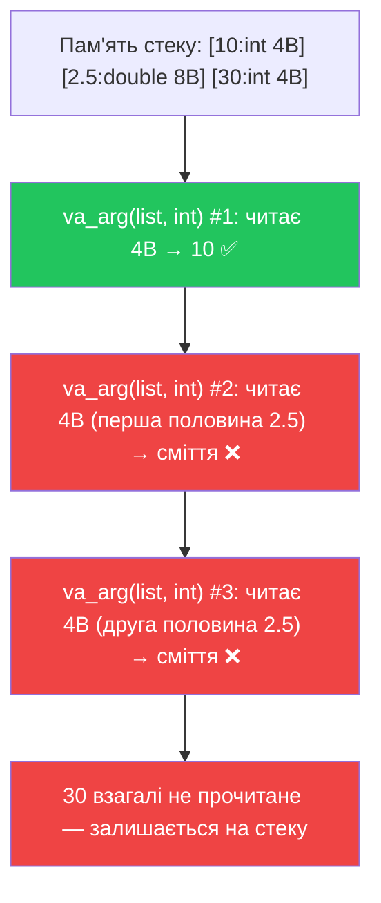

# Еліпсис

## Ідея: функції зі змінною кількістю аргументів

До цього моменту усі функції, що ми писали, мали фіксовану кількість параметрів. Навіть якщо деякі з них мали значення за замовчуванням — їх точна кількість визначалася при оголошенні. Але уявіть задачу: написати функцію `findMax`, що знаходить максимум з *будь-якої* кількості переданих чисел — двох, трьох, десяти.

Наївне рішення — зробити кілька перевантажень:

```cpp
int findMax(int a, int b);
int findMax(int a, int b, int c);
int findMax(int a, int b, int c, int d);
// ... і т.д. до нескінченності
```

Це, очевидно, не масштабується. Саме для таких задач у C++ (успадкований з мови C) існує механізм **еліпсиса** — три крапки `...`, що дозволяють передати довільну кількість аргументів.

::note
**Передумови.** Розуміння вказівників, масивів і базового синтаксису функцій. Еліпсис — це успадкований з мови C механізм, тому він є частиною «низькорівневого» C++ і несе відповідні ризики.
::

::warning
**Важливо наперед:** еліпсис є **небезпечним** механізмом і у сучасному C++ практично не використовується у новому коді. Проте він присутній у великій кількості старих C і C++ бібліотек (включно із самим `printf`), тому розуміти його необхідно. Ми вивчаємо його, щоб **читати** існуючий код, а не писати новий.
::

---

## Синтаксис: як виглядає функція з еліпсисом

Загальна форма функції з еліпсисом:

```
тип_повернення ім'я_функції(обов'язкові_параметри, ...)
```

**Правила:**
- Еліпсис (`...`) завжди є **останнім** параметром.
- До нього обов'язково має бути хоча б **один звичайний параметр** — компілятор вимагає цього для роботи `va_start`.
- Аргументи за еліпсисом **не мають типів** у сигнатурі — компілятор їх не перевіряє.

Найпростіший приклад оголошення:

```cpp
// count — обов'язковий параметр; ... — решта аргументів
double findAverage(int count, ...);

// Перший — фіксований; ... — решта
int findMax(int first, ...);

// format — рядок-декодер; ... — дані
void myPrint(const char* format, ...);
```

---

## Механізм: `va_list`, `va_start`, `va_arg`, `va_end`

Доступ до аргументів еліпсиса здійснюється через чотири макроси з заголовку `<cstdarg>`:

| Макрос | Призначення |
|---|---|
| `va_list list` | Оголошення «вказівника» на список аргументів |
| `va_start(list, lastParam)` | Ініціалізація: вказати, що `list` починається після `lastParam` |
| `va_arg(list, Type)` | Зчитати поточний аргумент як тип `Type` і перейти до наступного |
| `va_end(list)` | Очищення — обов'язково викликати перед виходом з функції |

Розглянемо покроково, як це працює на прикладі обчислення середнього арифметичного:

```cpp [FindAverage.cpp] showLineNumbers
#include <iostream>
#include <cstdarg>  // обов'язково для va_list та ін.

// count — кількість аргументів, що підуть за ним в "..."
double findAverage(int count, ...)
{
    double sum = 0;

    // Крок 1: оголошуємо va_list — "вказівник" на список змінних аргументів
    va_list list;

    // Крок 2: ініціалізуємо va_list
    // Перший аргумент — наш va_list
    // Другий аргумент — ОСТАННІЙ ЗВИЧАЙНИЙ параметр (перед "...")
    va_start(list, count);

    // Крок 3: зчитуємо аргументи по одному
    for (int i = 0; i < count; ++i)
    {
        // va_arg зчитує поточний аргумент як тип int і переходить до наступного
        sum += va_arg(list, int);
    }

    // Крок 4: ОБОВ'ЯЗКОВЕ очищення
    va_end(list);

    return sum / count;
}

int main()
{
    std::cout << findAverage(3, 10, 20, 30)     << '\n'; // 20
    std::cout << findAverage(5, 1, 2, 3, 4, 5)  << '\n'; // 3
    std::cout << findAverage(2, 100, 200)        << '\n'; // 150

    return 0;
}
```

::terminal-preview{title="./FindAverage"}
<div class="line"><span class="opacity-40">$</span> <strong class="font-bold">./FindAverage</strong></div>
<div class="line"><span class="text-blue-400">20</span></div>
<div class="line"><span class="text-blue-400">3</span></div>
<div class="line"><span class="text-blue-400">150</span></div>
::

### Детальний розбір кожного кроку

**Рядок 10. `va_list list;`** — оголошення об'єкту типу `va_list`. Технічно `va_list` — це тип, що описує стек аргументів функції. Його можна уявити як «вказівник всередину пам'яті стеку», що вказує на поточний аргумент. Імʼя `list` — довільне, але загальноприйняте.

**Рядок 15. `va_start(list, count);`** — ініціалізація. Другий аргумент `count` — це **ім'я останнього звичайного параметра** функції (перед `...`). Компілятор за допомогою адреси цього параметра знаходить початок «прихованих» аргументів на стеку.

::warning
Якщо другий аргумент `va_start` не є останнім звичайним параметром, поведінка невизначена. Потрібно завжди вказувати саме той параметр, що стоїть безпосередньо перед `...`.
::

**Рядок 22. `va_arg(list, int);`** — зчитування одного аргументу. Перший параметр — наш `va_list`, другий — **тип**, до якого треба перетворити поточний аргумент. Після виклику `va_list` «просувається» до наступного аргументу — це не просто зчитування, це й ітерація.

**Рядок 25. `va_end(list);`** — обов'язкове очищення. На більшості платформ це просто маркерна операція, але стандарт вимагає її виклику. Без неї — невизначена поведінка при виході з функції.

---

## Три способи відстеження кількості аргументів

Ключова проблема еліпсиса: сама функція **не знає**, скільки аргументів було передано. Стандарт C++ пропонує три підходи до вирішення цієї проблеми — і кожен має свої недоліки.

### Спосіб 1: параметр-кількість

Передаємо кількість аргументів явно як перший параметр. Це найпоширеніший підхід — власне, так ми зробили вище з `findAverage(int count, ...)`.

```cpp [Method1Count.cpp] showLineNumbers
#include <iostream>
#include <cstdarg>

int findMax(int count, ...)
{
    va_list list;
    va_start(list, count);

    int maxVal = va_arg(list, int); // читаємо перший як початкове максимальне

    for (int i = 1; i < count; ++i)
    {
        int current = va_arg(list, int);
        if (current > maxVal)
            maxVal = current;
    }

    va_end(list);
    return maxVal;
}

int main()
{
    std::cout << findMax(4, 7, 2, 15, 3)  << '\n'; // 15
    std::cout << findMax(3, 100, 50, 200) << '\n'; // 200

    // ❌ Помилка програміста: count=4, але передано лише 3 числа
    // std::cout << findMax(4, 7, 2, 15) << '\n'; // UB: читаємо 4-й аргумент зі сміття стеку

    return 0;
}
```

::terminal-preview{title="./Method1Count"}
<div class="line"><span class="opacity-40">$</span> <strong class="font-bold">./Method1Count</strong></div>
<div class="line"><span class="text-blue-400">15</span></div>
<div class="line"><span class="text-blue-400">200</span></div>
::

**Недолік:** якщо `count` не відповідає реальній кількості аргументів — читаємо зі стеку сміття або пропускаємо аргументи. Компілятор про це **не попередить**.

---

### Спосіб 2: контрольне значення (sentinel)

Замість лічильника — спеціальне «фінальне» значення (sentinel), що сигналізує про кінець списку. Наприклад, `-1` для списків невід'ємних цілих або `nullptr` для списків вказівників.

```cpp [Method2Sentinel.cpp] showLineNumbers
#include <iostream>
#include <cstdarg>

// Суммує числа до тих пір, поки не побачить -1
// first — перше число (обов'язковий параметр), решта — в еліпсисі
int sumUntilSentinel(int first, ...)
{
    int total = first; // перше число обробляємо окремо
    int count = 1;

    va_list list;
    va_start(list, first);

    while (true)
    {
        int current = va_arg(list, int);

        if (current == -1) // контрольне значення — зупиняємось
            break;

        total += current;
        ++count;
    }

    va_end(list);

    std::cout << "(sum of " << count << " numbers) ";
    return total;
}

int main()
{
    std::cout << sumUntilSentinel(1, 2, 3, 4, -1)    << '\n'; // 10
    std::cout << sumUntilSentinel(10, 20, 30, -1)    << '\n'; // 60
    std::cout << sumUntilSentinel(5, -1)             << '\n'; // 5 (лише одне число)

    // ❌ Забули -1 в кінці — нескінченний цикл + UB:
    // std::cout << sumUntilSentinel(1, 2, 3) << '\n';

    return 0;
}
```

::terminal-preview{title="./Method2Sentinel"}
<div class="line"><span class="opacity-40">$</span> <strong class="font-bold">./Method2Sentinel</strong></div>
<div class="line">(sum of 4 numbers) <span class="text-blue-400">10</span></div>
<div class="line">(sum of 3 numbers) <span class="text-blue-400">60</span></div>
<div class="line">(sum of 1 numbers) <span class="text-blue-400">5</span></div>
::

**Недолік:** якщо забути передати sentinel — цикл продовжується, читаючи зі стеку сміття, аж до UB або збою. Sentinel-значення не може бути водночас валідним аргументом (якщо `-1` є контрольним, то ніяке від'ємне число не можна передати).

---

### Спосіб 3: рядок-формат (format string)

Передаємо рядок, де кожен символ вказує тип чергового аргументу. Саме так влаштована стандартна функція `printf`: `%d` для `int`, `%f` для `double`, `%s` для рядка і т.д.

```cpp [Method3Format.cpp] showLineNumbers
#include <iostream>
#include <cstdarg>

// fmt — рядок-декодер: 'i' = int, 'd' = double
// повертає суму всіх чисел (незалежно від типу)
double sumMixed(const char* fmt, ...)
{
    va_list list;
    va_start(list, fmt);

    double total = 0;
    int index = 0;

    while (fmt[index] != '\0') // проходимо по рядку-форматі
    {
        if (fmt[index] == 'i')
        {
            total += va_arg(list, int);
        }
        else if (fmt[index] == 'd')
        {
            total += va_arg(list, double);
        }
        // інші символи — ігноруємо або помилка
        ++index;
    }

    va_end(list);
    return total;
}

int main()
{
    // "iii" — три int
    std::cout << sumMixed("iii", 1, 2, 3) << '\n'; // 6

    // "iidi" — int, int, double, int
    std::cout << sumMixed("iidi", 10, 20, 3.5, 5) << '\n'; // 38.5

    // "dd" — два double
    std::cout << sumMixed("dd", 1.5, 2.5) << '\n'; // 4

    return 0;
}
```

::terminal-preview{title="./Method3Format"}
<div class="line"><span class="opacity-40">$</span> <strong class="font-bold">./Method3Format</strong></div>
<div class="line"><span class="text-blue-400">6</span></div>
<div class="line"><span class="text-blue-400">38.5</span></div>
<div class="line"><span class="text-blue-400">4</span></div>
::

**Рядок 15.** `while (fmt[index] != '\0')` — рядок у C/C++ завжди завершується нуль-символом `'\0'`. Ми читаємо символ за символом, поки не натрапимо на нього — це природна «зупинка», яка не потребує окремого лічильника.

**Недолік:** якщо кількість або типи аргументів не збігаються з форматним рядком — UB. Ніякої перевірки під час компіляції немає.

---

## Чому еліпсис небезпечний: детальний розбір

### Небезпека 1: відсутність перевірки типів

Розглянемо найпростішу пастку:

```cpp [TypeMismatch.cpp] showLineNumbers
#include <iostream>
#include <cstdarg>

double findAverage(int count, ...)
{
    double sum = 0;
    va_list list;
    va_start(list, count);

    for (int i = 0; i < count; ++i)
        sum += va_arg(list, int); // очікуємо лише int

    va_end(list);
    return sum / count;
}

int main()
{
    // ✅ Нормально: усі аргументи — int
    std::cout << findAverage(3, 10, 20, 30) << '\n'; // 20

    // ❌ НЕБЕЗПЕЧНО: передаємо double замість int
    std::cout << findAverage(3, 10, 2.5, 30) << '\n'; // UB: сміття!

    return 0;
}
```

Що відбувається при передачі `2.5` замість `int`? `double` займає **8 байт**, а `int` — **4 байти**. `va_arg(list, int)` читає лише перші 4 байти репрезентації числа `2.5` і трактує їх як `int`. Решту 4 байтів буде прочитано при наступному виклику `va_arg` — що зіпсує наступний аргумент.

::mermaid



::

**Компілятор не попередить** про невідповідність типів — він просто передасть байти у стек. Уся відповідальність за типову правильність лежить на програмісті.

### Небезпека 2: невідповідність кількості аргументів

Якщо `count` більший за реальну кількість аргументів — читаємо зі стеку сміття:

```cpp [CountMismatch.cpp]
// ❌ count=4, але передано лише 3 числа
std::cout << findAverage(4, 10, 20, 30) << '\n'; // читає "30" + next stack garbage
// Можливий вивід: 23.5 (або будь-що)

// ❌ count=2, але передано 4 числа — зайві ігноруються без попередження
std::cout << findAverage(2, 10, 20, 30, 40) << '\n'; // виводить 15 — 30 і 40 ігноруються
```

У першому випадку четвертим «аргументом» стане довільне значення зі стеку. У другому — функція відпрацює «правильно», але тихо проігнорує два аргументи. Жоден із цих випадків не є помилкою компіляції.

### Небезпека 3: проблема малих типів

У більшості компіляторів `va_arg` не підтримує типи менші за `int`. Тому:

```cpp
// ❌ UB: char менший за int в контексті va_arg
char ch = va_arg(list, char);  // НЕБЕЗПЕЧНО

// ✅ Правильно: отримати int і перетворити в char
char ch = static_cast<char>(va_arg(list, int)); // безпечно
```

Аргументи типу `char` і `short` **автоматично просуваються** до `int` при передачі через еліпсис — такі правила мовного стандарту. Тому й зчитувати їх потрібно як `int`.

---

## Зведення: всі небезпеки еліпсиса

::card-group

::card{title="Немає перевірки типів" icon="i-heroicons-x-circle"}

Компілятор ніяк не перевіряє типи аргументів. Передати `double` замість `int` — тихе UB. Читаємо «сміттєві» байти без жодного попередження.

::

::card{title="Немає перевірки кількості" icon="i-heroicons-x-circle"}

Функція не знає, скільки аргументів насправді передано. Будь-який механізм відстеження (кількість, sentinel, формат) реалізується вручну і є потенційним джерелом помилок.

::

::card{title="Малі типи просуваються" icon="i-heroicons-exclamation-triangle"}

`char`, `short`, `float` автоматично просуваються до `int`/`double`. Зчитувати їх потрібно через більший тип + `static_cast`. Забув — UB.

::

::card{title="Не працює з об'єктами C++" icon="i-heroicons-x-circle"}

Передача об'єктів класів у еліпсис є невизначеною поведінкою, якщо клас має нетривіальний конструктор копіювання або деструктор. Еліпсис — механізм чистого C.

::

::

---

## Рекомендації та сучасні альтернативи

::accordion

::accordion-item{label="Порада 1: уникайте еліпсиса у новому коді" icon="i-lucide-circle-help"}

Якщо можливо — не використовуйте `...` в новому C++ коді взагалі. Практично завжди є безпечніша альтернатива, яка зберігає перевірку типів під час компіляції.
::

::accordion-item{label="Порада 2: масив замість еліпсиса" icon="i-lucide-circle-help"}

Найпростіша заміна еліпсиса — передача масиву з кількістю елементів. Компілятор перевіряє тип, ніякого `va_arg`:

```cpp
// Замість: double findAverage(int count, ...)
// Краще:
double findAverage(int* numbers, int count)
{
    double sum = 0;
    for (int i = 0; i < count; ++i)
        sum += numbers[i];
    return sum / count;
}

int main()
{
    int nums[] = { 10, 20, 30 };
    std::cout << findAverage(nums, 3) << '\n'; // 20 — з перевіркою типів!
}
```

Масив — нудніший API, але 100% безпечний.
::

::accordion-item{label="Порада 3: не змішуйте типи" icon="i-lucide-circle-help"}

Якщо ви все ж таки використовуєте eліпсис — обмежтеся одним типом аргументів. Функція `findAverage(int count, ...)` повинна отримувати **тільки** `int`. Це суттєво зменшує ймовірність пастки «неправильний тип → сміття».
::

::accordion-item{label="Порада 4: count/format безпечніші за sentinel" icon="i-lucide-circle-help"}

Контрольне значення (`-1`, `nullptr`) залишає ризик «забув sentinel → нескінченний цикл». Параметр-кількість або формат-рядок чіткіше обмежують ітерацію. Проте й вони не дають жодної компіляторної гарантії.
::

::accordion-item{label="Де еліпсис все ще зустрічається" icon="i-lucide-circle-help"}

- **`printf` / `scanf`** — класика C, де `%d`, `%f`, `%s` є форматним рядком.
- **Логери** в C-бібліотеках — `log(LOG_ERROR, "Value: %d", value)`.
- **Старий C++ код** — бібліотеки, написані до C++11.
- **Системний код** — взаємодія з C API операційної системи.

Тобто читання коду з еліпсисом — важливий навик. Написання нового — ні.
::

::

---

## Практичні завдання

### :icon{name="i-heroicons-pencil-square"} Завдання

::card-group

::card{title="Рівень 1 — Базовий" icon="i-heroicons-academic-cap"}

**Завдання 1.** Що виведе код нижче? Поясніть по кроках, що відбувається з `va_list`:
```cpp
#include <cstdarg>
#include <iostream>

int sumThree(int a, ...)
{
    va_list list;
    va_start(list, a);

    int b = va_arg(list, int);
    int c = va_arg(list, int);

    va_end(list);
    return a + b + c;
}

int main()
{
    std::cout << sumThree(1, 2, 3) << '\n';
    std::cout << sumThree(10, 20, 30) << '\n';
}
```

**Завдання 2.** Напишіть функцію `int sumAll(int count, ...)`, що підсумовує `count` цілих чисел. Протестуйте: `sumAll(3, 1, 2, 3)` → 6, `sumAll(5, 10, 20, 30, 40, 50)` → 150.

**Завдання 3.** Поясніть, що відбудеться (і чому) при виклику:
```cpp
double findAverage(int count, ...);
// Виклик:
std::cout << findAverage(3, 1.5, 2.5, 3.5) << '\n'; // double замість int!
```

::

::card{title="Рівень 2 — Логіка" icon="i-heroicons-cpu-chip"}

**Завдання 4.** Реалізуйте функцію `int findMin(int count, ...)`, що знаходить мінімум серед `count` цілих чисел. Протестуйте: `findMin(5, 7, 2, 14, 1, 9)` → 1.

**Завдання 5.** Реалізуйте варіант `findAverage` зі sentinel-значенням `0` (нуль означає кінець): `findAverageSentinel(10, 30, 20, 0)` → 20. Що є фундаментальним обмеженням такого підходу (яке число не можна буде включити у список)?

**Завдання 6.** Перепишіть `double findAverage(int count, ...)` без еліпсиса — використовуючи масив `int*` і параметр `int size`. Порівняйте обидва підходи: що ви виграли і що «втратили» в зручності API?

::

::card{title="Рівень 3 — Аналіз" icon="i-heroicons-building-library"}

**Завдання 7.** Напишіть функцію `void printValues(const char* fmt, ...)`, де `fmt` — рядок-формат:
- `'i'` → зчитати `int` і вивести
- `'d'` → зчитати `double` і вивести
- `'c'` — зчитати `int` і вивести як `char` (через `static_cast<char>`)
- Розделяти виводи пробілом

Протестуйте: `printValues("idc", 42, 3.14, 65)` → `42 3.14 A`

::

::

---

## Підсумок

::card-group

::card{title="Синтаксис" icon="i-heroicons-code-bracket"}

`тип функція(param, ...)` — `...` завжди останнім. Обов'язково підключити `<cstdarg>`. `va_start` → цикл `va_arg` → `va_end`.

::

::card{title="Три способи обмеження" icon="i-heroicons-list-bullet"}

**Count**: `findAverage(4, ...)` — найчастіший. **Sentinel**: `sumUntil(-1)` — контрольне значення. **Format**: `print("iid", ...)` — як `printf`. Усі три мають вразливості.

::

::card{title="Небезпеки" icon="i-heroicons-exclamation-triangle"}

Немає перевірки типів. Немає перевірки кількості. `char`/`short`/`float` просуваються. Об'єкти C++ — UB. Компілятор мовчить.

::

::card{title="У новому коді" icon="i-heroicons-shield-check"}

Замість `...` — масив + розмір, або `std::initializer_list`. Еліпсис вивчаємо, щоб **читати** старий сод, не писати новий.

::

::

У наступній статті ми розглянемо **аргументи командного рядка** — встроєний механізм C++ для передачі параметрів програмі при її запуску.
