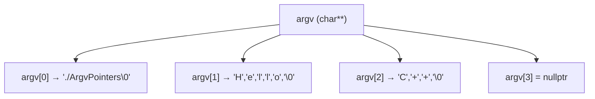

# Аргументи командного рядка

## Навіщо потрібні аргументи командного рядка

Усі програми, які ми писали до цього, отримували вхідні дані одним способом: через `std::cin` — тобто програма запускалась, призупинялась і чекала, поки користувач введе щось з клавіатури. Цей підхід зручний для навчання, але він є **непридатним для автоматизації**.

Уявіть таку задачу: у вас є програма, що обробляє зображення — стискає їх і зберігає мініатюру. У каталозі лежить 500 файлів. Щоб обробити кожен через `std::cin`, потрібно 500 разів запустити програму вручну і ввести ім'я файлу. Але що, якщо цю програму викликає веб-сервер, скрипт або планувальник завдань? Вони не можуть «вводити» дані через клавіатуру — їм потрібно передати всю необхідну інформацію **при запуску**.

Саме для цього і існують **аргументи командного рядка** (command-line arguments) — рядки, які передаються програмі ОС у момент її запуску. Ви вже бачили цей механізм щодня:

```
// Компілятор g++ отримує ім'я файлу як аргумент
g++ main.cpp -o program

// git отримує команду і шлях
git add .

// Запуск власної програми з аргументами
./picture photo.jpg --width=200
```

Кожен з цих інструментів реалізований на C або C++, і їхній `main` отримує аргументи через стандартний механізм, який ми зараз вивчимо.

::note
**Передумови.** Розуміння C-рядків (`const char*`), масивів вказівників і базової роботи з `std::cin`/`std::cout`. Аргументи командного рядка є частиною стандарту C++ і підтримуються усіма компіляторами і платформами.
::

---

## Нова форма `main`: `argc` і `argv`

До цього ми оголошували `main` без параметрів:

```cpp
int main()
{
    // ...
}
```

Щоб отримати доступ до аргументів командного рядка, використовується **інша форма `main`** з двома параметрами:

```cpp
int main(int argc, char* argv[])
{
    // ...
}
```

Або еквівалентний запис через подвійний вказівник:

```cpp
int main(int argc, char** argv)
{
    // Ідентично попередньому — обидві форми правильні
}
```

::note
Обидві форми абсолютно рівнозначні. Перша — `char* argv[]` — є інтуїтивнішою і частіше рекомендована в підручниках. Друга — `char** argv` — демонструє справжню природу: вказівник на вказівник на `char`.
::

### Розбір параметрів

**`argc`** (від _"argument count"_ — кількість аргументів) — ціле число, що зберігає кількість аргументів. **Завжди** щонайменше `1`, бо першим аргументом є **ім'я самої програми**.

**`argv`** (від _"argument values"_ — значення аргументів) — масив C-рядків (`char*`) довжиною `argc`. Кожен елемент — один аргумент:

| Індекс | Вміст `argv[i]` |
|---|---|
| `argv[0]` | Шлях до виконуваного файлу (`"C:\\program.exe"` або `"./program"`) |
| `argv[1]` | Перший аргумент користувача |
| `argv[2]` | Другий аргумент користувача |
| `argv[argc-1]` | Останній аргумент |
| `argv[argc]` | Гарантовано `nullptr` (нульовий вказівник) |

---

## Перший приклад: виводимо всі аргументи

```cpp [PrintArgs.cpp] showLineNumbers
#include <iostream>

int main(int argc, char* argv[])
{
    std::cout << "Кількість аргументів: " << argc << '\n';
    std::cout << "Аргументи:\n";

    for (int i = 0; i < argc; ++i)
    {
        std::cout << "  argv[" << i << "] = " << argv[i] << '\n';
    }

    return 0;
}
```

Якщо скомпілювати цю програму і запустити її так:

```
./PrintArgs hello world 42
```

Вивід:

::terminal-preview{title="./PrintArgs hello world 42"}
<div class="line"><span class="opacity-40">$</span> <strong class="font-bold">./PrintArgs hello world 42</strong></div>
<div class="line">Кількість аргументів: <span class="text-blue-400">4</span></div>
<div class="line">Аргументи:</div>
<div class="line">  argv[0] = <span class="text-yellow-400">./PrintArgs</span></div>
<div class="line">  argv[1] = <span class="text-blue-400">hello</span></div>
<div class="line">  argv[2] = <span class="text-blue-400">world</span></div>
<div class="line">  argv[3] = <span class="text-blue-400">42</span></div>
::

**Розбір.** Навіть якщо ми передали 3 аргументи (`hello`, `world`, `42`), `argc` = 4, бо `argv[0]` — сама програма. Аргументи завжди є **рядками** — зверніть: `42` виведено як рядок `"42"`, а не як числове значення.

**Рядок 8.** `for (int i = 0; i < argc; ++i)` — ітерація по всіх аргументах. Якщо хочете пропустити `argv[0]` (ім'я програми) і обробляти лише аргументи від користувача — починайте з `i = 1`.

---

## Перевірка наявності аргументів

Завжди перевіряйте `argc` перед доступом до `argv[1]` та далі. Якщо користувач не передав жодного аргументу — `argv[1]` просто не існує, і звертання до нього — невизначена поведінка:

```cpp [CheckArgs.cpp] showLineNumbers
#include <iostream>
#include <cstdlib> // для exit()

int main(int argc, char* argv[])
{
    // Перевіряємо: чи передав користувач хоча б один аргумент?
    // argc == 1 означає: є лише argv[0] (ім'я програми), більше нічого
    if (argc < 2)
    {
        // argv[0] — ім'я програми: виводимо правильне «використання»
        std::cout << "Використання: " << argv[0] << " <ім'я файлу>\n";
        std::cout << "Приклад:      " << argv[0] << " photo.jpg\n";

        // exit(1) — завершуємо програму з кодом помилки 1
        // За конвенцією: 0 = успіх, не 0 = помилка
        exit(1);
    }

    // Тепер safe: argv[1] гарантовано існує
    std::cout << "Обробляємо файл: " << argv[1] << '\n';
    // ... подальша логіка роботи з файлом

    return 0;
}
```

::terminal-preview{title="./CheckArgs (без аргументів)"}
<div class="line"><span class="opacity-40">$</span> <strong class="font-bold">./CheckArgs</strong></div>
<div class="line">Використання: <span class="text-yellow-400">./CheckArgs</span> &lt;ім'я файлу&gt;</div>
<div class="line">Приклад:      <span class="text-yellow-400">./CheckArgs</span> photo.jpg</div>
::

::terminal-preview{title="./CheckArgs photo.jpg"}
<div class="line"><span class="opacity-40">$</span> <strong class="font-bold">./CheckArgs photo.jpg</strong></div>
<div class="line">Обробляємо файл: <span class="text-blue-400">photo.jpg</span></div>
::

**Рядок 8.** `if (argc < 2)` — якщо менше двох аргументів (тобто немає `argv[1]`), виводимо підказку і завершуємо. Це стандартна конвенція: будь-яка CLI-програма повинна пояснювати користувачу своє «правильне» використання, якщо аргументів бракує.

**Рядок 14.** `exit(1)` — функція зі `<cstdlib>`, що завершує програму негайно, не повертаючись з `main`. Аргумент — **код виходу**: `0` означає успіх, будь-яке ненульове — помилку. Ця конвенція є стандартною в Unix/Linux/Windows і дозволяє скриптам та автоматизаційним інструментам перевіряти, чи завершилась програма успішно.

---

## Конвертація аргументів у числа

Усі аргументи командного рядка приходять як **рядки** (`const char*`), навіть якщо користувач ввів число. Щоб використати їх як числа — потрібно явно конвертувати.

Найпростіший спосіб у C++ — через `std::stringstream`:

```cpp [NumericArg.cpp] showLineNumbers
#include <iostream>
#include <sstream>  // для std::stringstream
#include <cstdlib>  // для exit()

int main(int argc, char* argv[])
{
    if (argc < 2)
    {
        std::cout << "Використання: " << argv[0] << " <число>\n";
        exit(1);
    }

    // argv[1] — рядок, наприклад "42" або "hello"
    // Конвертуємо його в int через std::stringstream
    std::stringstream converter(argv[1]); // ініціалізуємо потік рядком

    int number;

    // Оператор >> намагається зчитати int з рядка
    // Якщо рядок не є числом — повертає false (потік у стані помилки)
    if (!(converter >> number))
    {
        std::cout << "Помилка: \"" << argv[1] << "\" — не є цілим числом.\n";
        exit(1);
    }

    std::cout << "Отримано число: " << number << '\n';
    std::cout << "Подвоєне:       " << number * 2 << '\n';
    std::cout << "Квадрат:        " << number * number << '\n';

    return 0;
}
```

::terminal-preview{title="./NumericArg 15"}
<div class="line"><span class="opacity-40">$</span> <strong class="font-bold">./NumericArg 15</strong></div>
<div class="line">Отримано число: <span class="text-blue-400">15</span></div>
<div class="line">Подвоєне:       <span class="text-blue-400">30</span></div>
<div class="line">Квадрат:        <span class="text-blue-400">225</span></div>
::

::terminal-preview{title="./NumericArg hello"}
<div class="line"><span class="opacity-40">$</span> <strong class="font-bold">./NumericArg hello</strong></div>
<div class="line">Помилка: <span class="text-red-400">"hello"</span> — не є цілим числом.</div>
::

**Рядок 15.** `std::stringstream converter(argv[1])` — створюємо «рядковий потік», ініціалізований рядком-аргументом. `std::stringstream` поводиться як `std::cin`, але зчитує дані не з клавіатури, а з рядка в пам'яті. Включити потрібно `<sstream>`.

**Рядок 21.** `if (!(converter >> number))` — оператор `>>` намагається зчитати `int` з потоку. Якщо це неможливо (рядок не є числом) — потік переходить у стан помилки і `>>` повертає `false`-подібне значення. Оператор `!` інвертує результат: якщо конвертація **не вдалась** → заходимо в `if`.

### Практичний приклад: конвертація кількох аргументів

```cpp [MultiNumeric.cpp] showLineNumbers
#include <iostream>
#include <sstream>
#include <cstdlib>

int strToInt(const char* str)
{
    std::stringstream ss(str);
    int result;
    if (!(ss >> result))
        return 0; // значення за замовчуванням при помилці
    return result;
}

int main(int argc, char* argv[])
{
    if (argc < 3)
    {
        std::cout << "Використання: " << argv[0] << " <width> <height>\n";
        exit(1);
    }

    int width  = strToInt(argv[1]);
    int height = strToInt(argv[2]);

    if (width <= 0 || height <= 0)
    {
        std::cout << "Помилка: розміри мають бути додатніми числами.\n";
        exit(1);
    }

    std::cout << "Розмір:  " << width << " x " << height << '\n';
    std::cout << "Площа:   " << width * height << '\n';
    std::cout << "Периметр:" << 2 * (width + height) << '\n';

    return 0;
}
```

::terminal-preview{title="./MultiNumeric 16 9"}
<div class="line"><span class="opacity-40">$</span> <strong class="font-bold">./MultiNumeric 16 9</strong></div>
<div class="line">Розмір:  <span class="text-blue-400">16 x 9</span></div>
<div class="line">Площа:   <span class="text-blue-400">144</span></div>
<div class="line">Периметр:<span class="text-blue-400">50</span></div>
::

**Рядки 5–11.** Допоміжна функція `strToInt` — приймає C-рядок і повертає `int`. Можна розміщувати логіку конвертації прямо в `main`, але виносити її у функцію є гарною практикою: повторне використання і зрозумілість.

---

## Парсинг аргументів: як shell розбиває рядок

Коли ви вводите команду в терміналі, **операційна система** (точніше — shell: bash, cmd, PowerShell) відповідає за розбиття рядка на окремі аргументи. Важливо розуміти правила, щоб ваша програма отримувала саме те, що ви задумали.

### Роздільник — пробіл

```
./program Hello world
```

`argc = 3`: `argv[1] = "Hello"`, `argv[2] = "world"`. Кожне слово — окремий аргумент.

### Рядки у подвійних лапках — один аргумент

```
./program "Hello world"
```

`argc = 2`: `argv[1] = "Hello world"`. Лапки говорять shell: все всередині — один аргумент, навіть якщо є пробіли.

### Порожній рядок

```
./program ""
```

`argc = 2`: `argv[1] = ""` (порожній рядок). Порожній аргумент — теж аргумент.

### Спеціальні символи

```
./program file*.txt    // shell розкриє * у список файлів!
./program 'file*.txt'  // одинарні лапки у bash: передати буквально
```

```cpp [ParsingDemo.cpp] showLineNumbers
#include <iostream>

int main(int argc, char* argv[])
{
    std::cout << "argc = " << argc << '\n';

    for (int i = 0; i < argc; ++i)
        std::cout << "argv[" << i << "] = \"" << argv[i] << "\"\n";

    return 0;
}
```

::code-group

```bash [Без лапок]
$ ./ParsingDemo one two three
argc = 4
argv[0] = "./ParsingDemo"
argv[1] = "one"
argv[2] = "two"
argv[3] = "three"
```

```bash [З подвійними лапками]
$ ./ParsingDemo "one two" three
argc = 3
argv[0] = "./ParsingDemo"
argv[1] = "one two"
argv[2] = "three"
```

```bash [Порожній аргумент]
$ ./ParsingDemo "" hello
argc = 3
argv[0] = "./ParsingDemo"
argv[1] = ""
argv[2] = "hello"
```

::

---

## Повний практичний приклад: калькулятор з CLI

Побудуємо повноцінну маленьку програму-калькулятор, що приймає вираз `<число> <оператор> <число>` через аргументи командного рядка:

```cpp [Calculator.cpp] showLineNumbers
#include <iostream>
#include <sstream>
#include <cstdlib>

int strToInt(const char* str, bool& success)
{
    std::stringstream ss(str);
    int result;
    success = static_cast<bool>(ss >> result);
    return result;
}

int main(int argc, char* argv[])
{
    // Перевірка: потрібно рівно 3 аргументи (число оператор число)
    if (argc != 4)
    {
        std::cout << "Використання: " << argv[0] << " <число> <оператор> <число>\n";
        std::cout << "Оператори:    + - * /\n";
        std::cout << "Приклад:      " << argv[0] << " 10 + 5\n";
        exit(1);
    }

    // Конвертуємо перше і третє аргументи в числа
    bool ok1, ok2;
    int left  = strToInt(argv[1], ok1);
    int right = strToInt(argv[3], ok2);

    if (!ok1 || !ok2)
    {
        std::cout << "Помилка: очікуються цілі числа.\n";
        exit(1);
    }

    // argv[2] — оператор (рядок, але нас цікавить перший символ)
    char op = argv[2][0];

    if (op == '+')
        std::cout << left << " + " << right << " = " << (left + right) << '\n';
    else if (op == '-')
        std::cout << left << " - " << right << " = " << (left - right) << '\n';
    else if (op == '*')
        std::cout << left << " * " << right << " = " << (left * right) << '\n';
    else if (op == '/')
    {
        if (right == 0)
        {
            std::cout << "Помилка: ділення на нуль!\n";
            exit(1);
        }
        std::cout << left << " / " << right << " = " << (left / right) << '\n';
    }
    else
    {
        std::cout << "Помилка: невідомий оператор '" << op << "'.\n";
        std::cout << "Допустимі: + - * /\n";
        exit(1);
    }

    return 0;
}
```

::terminal-preview{title="./Calculator демонстрація"}
<div class="line"><span class="opacity-40">$</span> <strong class="font-bold">./Calculator 10 + 5</strong></div>
<div class="line">10 + 5 = <span class="text-blue-400">15</span></div>
<div class="line"><span class="opacity-40">$</span> <strong class="font-bold">./Calculator 100 / 7</strong></div>
<div class="line">100 / 7 = <span class="text-blue-400">14</span></div>
<div class="line"><span class="opacity-40">$</span> <strong class="font-bold">./Calculator 5 * 8</strong></div>
<div class="line">5 * 8 = <span class="text-blue-400">40</span></div>
<div class="line"><span class="opacity-40">$</span> <strong class="font-bold">./Calculator 10 / 0</strong></div>
<div class="line"><span class="text-red-400">Помилка: ділення на нуль!</span></div>
<div class="line"><span class="opacity-40">$</span> <strong class="font-bold">./Calculator</strong></div>
<div class="line">Використання: ./Calculator &lt;число&gt; &lt;оператор&gt; &lt;число&gt;</div>
<div class="line">Оператори:    + - * /</div>
::

**Рядок 16.** `if (argc != 4)` — строга перевірка: саме 4 аргументи (`argv[0]` + 3 від користувача). Якщо менше або більше — помилка.

**Рядок 38.** `char op = argv[2][0]` — `argv[2]` є рядком `char*`. Нас цікавить **перший символ** — оператор. `argv[2][0]` — читання нульового елементу рядку. Якщо користувач передав `"+"`, то `argv[2][0] == '+'`.

**Рядки 5–10.** `strToInt` приймає додатковий параметр `bool& success` — прапорець успіху конвертації. Це дозволяє функції повідомляти, чи вдалась конвертація, без повернення спеціального «службового» значення на кшталт `-1`.

---

## Зв'язок із вказівниками: `char** argv` зсередини

Оскільки ця стаття є частиною модуля про вказівники — розглянемо `argv` через призму того, що ми вивчили.

`argv` — це масив вказівників на рядки. Кожен елемент `argv[i]` є `char*` — вказівником на перший символ i-го рядка. Останній елемент `argv[argc]` завжди є `nullptr`.

```cpp [ArgvPointers.cpp] showLineNumbers
#include <iostream>

int main(int argc, char* argv[])
{
    // argv[i] — вказівник на char (перший символ рядка)
    // argv[i][j] — j-й символ i-го аргументу

    for (int i = 0; i < argc; ++i)
    {
        char* arg = argv[i]; // вказівник на початок рядка

        std::cout << "argv[" << i << "]: ";

        // Ітеруємо по символах рядка вручну — через арифметику вказівників
        int j = 0;
        while (arg[j] != '\0')
        {
            std::cout << arg[j];
            ++j;
        }
        std::cout << " (довжина: " << j << ")\n";
    }

    // argv[argc] — гарантовано nullptr (NULL-термінатор масиву вказівників)
    std::cout << "argv[argc] == nullptr: "
              << (argv[argc] == nullptr ? "так" : "ні") << '\n';

    return 0;
}
```

::terminal-preview{title="./ArgvPointers Hello C++"}
<div class="line"><span class="opacity-40">$</span> <strong class="font-bold">./ArgvPointers Hello C++</strong></div>
<div class="line">argv[0]: ./ArgvPointers (довжина: 14)</div>
<div class="line">argv[1]: Hello (довжина: 5)</div>
<div class="line">argv[2]: C++ (довжина: 3)</div>
<div class="line">argv[argc] == nullptr: <span class="text-blue-400">так</span></div>
::

::mermaid



::

`argv` — це вказівник на вказівники. `argv[i]` — вказівник на C-рядок (масив символів). `argv[i][j]` — j-й символ i-го аргументу. `argv[argc]` — гарантований `nullptr`, що дозволяє також ітерувати через `while (*argv)` замість лічильника `argc`.

---

## Практичні завдання

### :icon{name="i-heroicons-pencil-square"} Завдання

::card-group

::card{title="Рівень 1 — Базовий" icon="i-heroicons-academic-cap"}

**Завдання 1.** Напишіть програму `EchoArgs`, що виводить всі аргументи **окрім** `argv[0]` (ім'я програми), кожен на новому рядку. Якщо аргументів немає — вивести `"Жодних аргументів не передано."`.

**Завдання 2.** Що виведе команда? Поясніть значення `argc` і кожного `argv[i]`:
```
./MyProgram "one two" three "" four
```

**Завдання 3.** Напишіть програму `CountChars`, що приймає один рядковий аргумент і виводить кількість символів у ньому (не через `strlen`, а через власний цикл з вказівником або індексом).

::

::card{title="Рівень 2 — Логіка" icon="i-heroicons-cpu-chip"}

**Завдання 4.** Напишіть програму `SumArgs`, що приймає довільну кількість числових аргументів і виводить їхню суму. Приклад: `./SumArgs 10 20 30 40` → `Sum: 100`. Якщо якийсь аргумент не є числом — вивести помилку і завершити програму з кодом `1`.

**Завдання 5.** Напишіть програму `Repeat`, що приймає два аргументи: рядок і ціле число. Виводить рядок стільки разів, скільки вказує число: `./Repeat hello 3` → виводить `hello` тричі кожен з нового рядка.

**Завдання 6.** Напишіть програму `MaxOfArgs`, що знаходить максимум серед переданих чисел: `./MaxOfArgs 7 2 15 3 11` → `Max: 15`. Якщо аргументів немає — вивести підказку.

::

::card{title="Рівень 3 — Архітектура" icon="i-heroicons-building-library"}

**Завдання 7.** Реалізуйте просту утиліту `FileInfo`, що приймає один або кілька «імен файлів» як аргументи і для кожного виводить:
- Ім'я файлу
- Розширення (частина після останньої крапки)
- Прапорець: «має розширення» або «без розширення»

Наприклад: `./FileInfo photo.jpg document.pdf readme` →
```
photo.jpg     → розширення: jpg
document.pdf  → розширення: pdf
readme        → без розширення
```

*(Не потрібно відкривати файли — лише аналізувати рядки-аргументи.)*

::

::

---

## Підсумок

::card-group

::card{title="Синтаксис main" icon="i-heroicons-code-bracket"}

`int main(int argc, char* argv[])`. `argc` ≥ 1 завжди. `argv[0]` — ім'я програми. `argv[argc]` — `nullptr`.

::

::card{title="Доступ до аргументів" icon="i-heroicons-cursor-arrow-rays"}

Перевіряйте `argc` перед доступом. `argv[i]` — C-рядок. `argv[i][j]` — символ. Ітерувати від `i=1` для аргументів користувача.

::

::card{title="Числова конвертація" icon="i-heroicons-calculator"}

`std::stringstream ss(argv[i]); int n; ss >> n;` — найпростіший спосіб. Перевіряйте успішність через `if (!(ss >> n))`.

::

::card{title="Shell-парсинг" icon="i-heroicons-command-line"}

Пробіл = роздільник. Подвійні лапки = один аргумент. `argc` залежить від shell, not від вашої програми.

::

::card{title="Завжди exit(1) при помилці" icon="i-heroicons-shield-check"}

Код виходу `0` = успіх, не `0` = помилка. Це дозволяє скриптам і автоматизації перевіряти результат.

::

::card{title="argv у пам'яті" icon="i-heroicons-circle-stack"}

`argv` — `char**`, масив вказівників на C-рядки. Кожен `argv[i]` — вказівник на перший символ. Гарантований `nullptr` в кінці.

::

::
