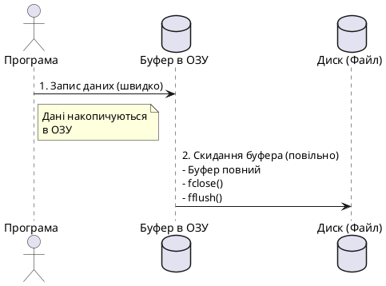
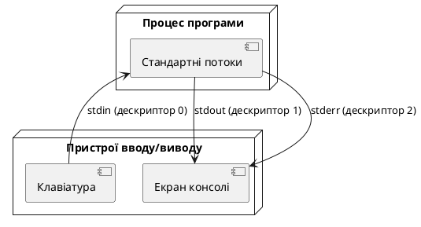
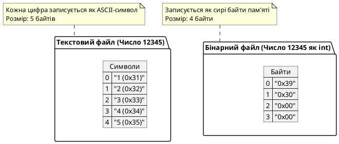
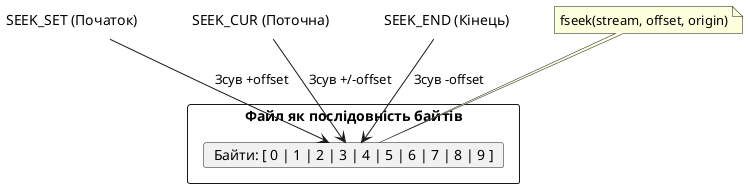
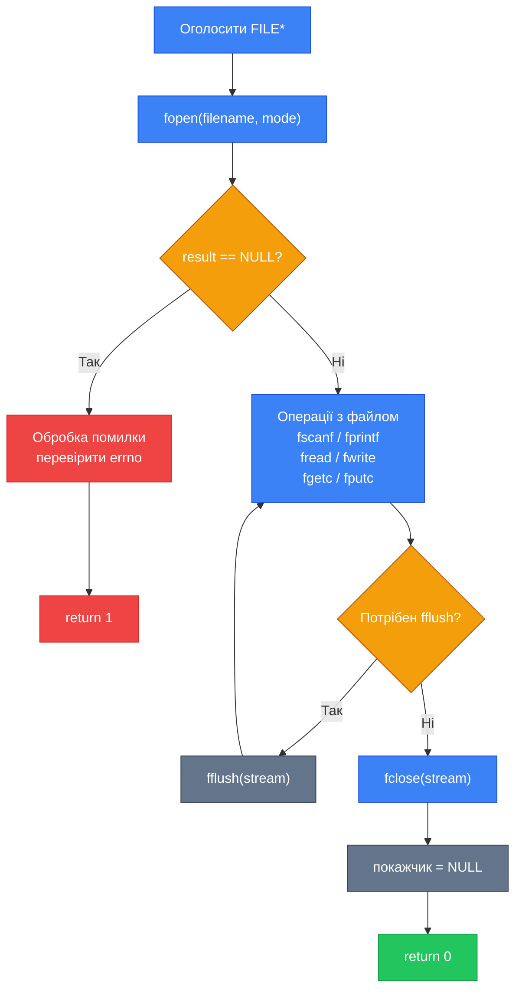

# Робота з файлами: C-стиль (stdio.h)

## Що таке файл і навіщо він потрібен

До цього моменту всі дані, з якими працювали наші програми, існували лише в оперативній пам'яті. Масиви, змінні, рядки — усе це зникає в момент завершення роботи програми. Це фундаментальне обмеження: якщо ви обчислили середню оцінку 200 студентів, записали в масив і вийшли з програми — результат втрачено назавжди.

**Файл** — це іменована область зовнішньої пам'яті (жорсткого диска, SSD, флеш-накопичувача), що зберігає дані незалежно від того, працює програма чи ні. Файл має чотири ключові характеристики:

- **Ім'я та розширення** — унікальний ідентифікатор у файловій системі. `myData.txt` і `myData.dat` — це **абсолютно різні** файли, навіть якщо їхні назви збігаються.
- **Повний шлях** — місцезнаходження файлу в ієрархії каталогів: `C:\Users\ivan\documents\data.txt` або `/home/ivan/data.txt`.
- **Розмір** — кількість байтів даних. Обмежений лише ємністю носія.
- **Персистентність** — дані зберігаються між запусками програм і навіть при вимкненні живлення (якщо програма коректно закрила файл).

::note
Назва файлу складається з двох частин: власне назви та розширення, розділених крапкою. Розширення — лише конвенція, що сигналізує операційній системі та програмам про формат вмісту. Але для мови C жодного значення розширення не має — файл є просто послідовністю байтів.
::

Дуже поширеними є дві операції: **читання** — отримання збережених даних у програму, та **запис** — збереження результатів роботи програми у файл для подальшого використання.

---

## Потоки та буферизація

C++ не має вбудованих операторів для роботи з файлами. Натомість уся взаємодія з файлами відбувається через **потоки** (streams), реалізовані у стандартній бібліотеці.

**Потік** (stream) — це абстрактна послідовність байтів, що не залежить від конкретного пристрою. За допомогою потоків програма працює однаково з файлом на диску, клавіатурою, принтером або навіть іншою програмою — не знаючи, що саме знаходиться «на іншому кінці».

Існує два типи потоків:

::card-group

::card{title="Текстовий потік" icon="i-lucide-file-text"}
Послідовність символів, організована в рядки. Рядки відокремлені спеціальним символом нового рядка (`'\n'`). За передачі на екран деякі службові символи не відображаються. Зручний для даних, які людина має читати вручну.
::

::card{title="Бінарний потік" icon="i-lucide-binary"}
Послідовність байтів довільних даних. Кожен байт у файлі відповідає рівно одному байту в пам'яті програми — без жодних перетворень. Ефективний для зберігання чисел, структур, зображень, звуку.
::

::

Аби збільшити швидкість передачі даних, операційна система використовує **буфер** — спеціальну область оперативної пам'яті. Замість того, щоб при кожному виклику `fwrite()` фізично записувати байти на диск (що дуже повільно), ОС накопичує дані в буфері й відправляє їх на диск пакетами. Фактичний запис відбувається у трьох ситуаціях:

1. **Буфер заповнений** — автоматичне скидання накопичених даних.
2. **Файл закрито** (`fclose()`) — примусове скидання перед звільненням ресурсів.
3. **Викликано `fflush()`** — ручне скидання у будь-який момент.

{.diagram-img}

::plant-uml



::

::caution
Якщо програма аварійно завершується без виклику `fclose()`, вміст буфера може **не потрапити на диск**. Дані в буфері, що не були скинуті, втрачаються безповоротно. Завжди закривайте файли явно перед виходом із програми.
::

---

## Структура FILE та підключення бібліотеки

У мові C класичний механізм роботи з файлами базується на бібліотеці **`<stdio.h>`** (у C++ підключається як `<cstdio>`). Ця бібліотека надає структуру `FILE` та набір функцій для роботи з нею.

Структура `FILE` — це непрозора (opaque) структура, поля якої приховані від програміста навмисно: ви не повинні знати деталей реалізації, щоб не залежати від конкретного компілятора чи платформи. Внутрішньо вона містить:

::field-group
::field{name="Дескриптор файлу" type="int"}
Унікальний числовий ідентифікатор, який операційна система призначає відкритому файлу. У Unix-подібних системах: `0` — stdin, `1` — stdout, `2` — stderr.
::
::field{name="Покажчик буфера" type="unsigned char\*"}
Адреса поточного байта в буфері вводу/виводу. Зсувається при кожній операції читання або запису.
::
::field{name="Лічильник байтів" type="int"}
Кількість байтів, що залишилися в буфері (при читанні) або вільних місць (при записі).
::
::field{name="Режим і стан" type="unsigned short"}
Прапорці режиму відкриття (читання/запис/бінарний), прапорець кінця файлу (EOF), прапорець помилки.
::
::

::note
Безпосередньо звертатися до полів `FILE` не потрібно і не варто — вони залежать від реалізації та компілятора. Уся взаємодія з файлом відбувається виключно через покажчик `FILE*` і бібліотечні функції.
::

Для підключення бібліотеки у C++ використовується:

```cpp [Main.cpp] showLineNumbers
#include <cstdio>   // C++ обгортка над stdio.h (рекомендовано в C++)
// або
#include <stdio.h>  // класичний C-заголовок (також працює в C++)
```

---

## Оголошення файлового покажчика

Перший крок роботи з будь-яким файлом — оголошення **файлового покажчика** (file pointer). Це змінна типу `FILE*`, через яку надалі виконуватимуться всі операції з файлом.

```cpp
FILE* ім'я_покажчика;
```

Якщо програма працює з кількома файлами одночасно — оголошується відповідна кількість покажчиків:

```cpp
FILE* inputFile;
FILE* outputFile;
FILE* logFile;
```

Самого лише оголошення недостатньо: покажчик треба **ініціалізувати** через функцію відкриття файлу. До ініціалізації покажчик містить невизначене значення і використовувати його у файлових функціях категорично не можна.

::tip
За угодою прийнятого в курсі стилю (camelCase) файлові покажчики іменуються так само, як і звичайні змінні: `inputFile`, `outputFile`, `dataFile`. Це відображає їхню природу — вони є «посередниками» для доступу до ресурсу.
::

---

## Відкриття файлу: функція fopen

Функція `fopen()` створює зв'язок між файловим покажчиком у програмі і фізичним файлом на диску. Її синтаксис:

```cpp
FILE* fopen(const char* filename, const char* mode);
```

- **`filename`** — ім'я файлу або повний шлях до нього (рядок C-style у лапках).
- **`mode`** — рядок режиму відкриття, що визначає дозволені операції.

Функція повертає покажчик на структуру `FILE` при успіху або **`NULL`** при невдачі.

### Режими відкриття

|  Режим  | Дія                        | Якщо файл існує  | Якщо файл не існує |
| :-----: | :------------------------- | :--------------- | :----------------- |
|  `"r"`  | Читання (текст)            | Відкриває        | Повертає NULL      |
|  `"w"`  | Запис (текст)              | **Очищає** вміст | Створює новий      |
|  `"a"`  | Дозапис у кінець (текст)   | Зберігає вміст   | Створює новий      |
| `"r+"`  | Читання + запис (текст)    | Відкриває        | Повертає NULL      |
| `"w+"`  | Читання + запис (текст)    | **Очищає** вміст | Створює новий      |
| `"a+"`  | Читання + дозапис (текст)  | Зберігає вміст   | Створює новий      |
| `"rb"`  | Читання (бінарний)         | Відкриває        | Повертає NULL      |
| `"wb"`  | Запис (бінарний)           | **Очищає** вміст | Створює новий      |
| `"ab"`  | Дозапис (бінарний)         | Зберігає вміст   | Створює новий      |
| `"r+b"` | Читання + запис (бінарний) | Відкриває        | Повертає NULL      |
| `"w+b"` | Читання + запис (бінарний) | **Очищає** вміст | Створює новий      |

::warning
Режим `"w"` для **існуючого** файлу знищує його попередній вміст без попередження. Якщо вам потрібно додати дані в кінець, а не перезаписати файл — використовуйте режим `"a"` (append).
::

### Приклад відкриття файлу з перевіркою помилок

Обов'язковою практикою є перевірка результату `fopen()`. Функція може повернути `NULL` з різних причин: файл не знайдено, недостатньо прав доступу, диск заповнений, помилка файлової системи.

```cpp [OpenFile.cpp] showLineNumbers
#include <cstdio>
#include <cstdlib>

int main()
{
    FILE* dataFile;

    // Відкриваємо файл для запису (текстовий режим)
    dataFile = fopen("students.txt", "w");

    if (dataFile == NULL)
    {
        fprintf(stderr, "Помилка: не вдалося відкрити файл students.txt\n");
        return 1;
    }

    // Файл успішно відкрито — записуємо дані
    fprintf(dataFile, "Іван Петренко, 20, 4.5\n");
    fprintf(dataFile, "Олена Коваль, 19, 4.8\n");

    fclose(dataFile);
    return 0;
}
```

::terminal-preview{title="./OpenFile"}

<div class="line"><span class="opacity-40">$</span> <strong class="font-bold">g++ -std=c++17 OpenFile.cpp -o OpenFile && ./OpenFile</strong></div>
<div class="line"><span class="text-green-400 font-bold">Execution finished with exit code 0</span></div>
<div class="line"><span class="text-gray-400">Файл students.txt створено у поточній директорії.</span></div>
::

---

## Стандартні потоки та файловий дескриптор

{.diagram-img}

::plant-uml



::

В операційній системі завжди відкриті три стандартні потоки, що доступні будь-якій програмі без явного `fopen()`:

| Дескриптор | Символьна назва | Призначення                       |
| :--------: | :-------------- | :-------------------------------- |
|    `0`     | `stdin`         | Стандартний ввід (клавіатура)     |
|    `1`     | `stdout`        | Стандартний вивід (екран)         |
|    `2`     | `stderr`        | Стандартний потік помилок (екран) |

Це означає, що `printf("Hello")` і `fprintf(stdout, "Hello")` — еквівалентні виклики. Так само `scanf("%d", &n)` і `fscanf(stdin, "%d", &n)` роблять те саме. Функції `fprintf` і `fscanf` є узагальненнями `printf`/`scanf` для довільного потоку.

::note
`stderr` — окремий від `stdout` потік. Це дозволяє перенаправляти корисний вивід програми у файл (`./program > output.txt`), а повідомлення про помилки все одно бачити в терміналі. Завжди використовуйте `fprintf(stderr, ...)` для діагностичних повідомлень.
::

---

## Закриття файлу: функція fclose

Після завершення роботи з файлом його **обов'язково** потрібно закрити. Функція `fclose()` скидає буфер на диск, звільняє системні ресурси (файловий дескриптор) і розриває зв'язок між покажчиком і файлом.

```cpp
int fclose(FILE* stream);
```

Повертає `0` при успіху і `EOF` (зазвичай `-1`) при помилці.

```cpp [CloseExample.cpp] showLineNumbers
#include <cstdio>

int main()
{
    FILE* logFile;
    int   closeResult;

    logFile = fopen("app.log", "w");
    if (logFile == NULL)
    {
        fprintf(stderr, "Помилка відкриття файлу\n");
        return 1;
    }

    fprintf(logFile, "Програма запущена\n");

    // Явно закриваємо і перевіряємо результат
    closeResult = fclose(logFile);
    if (closeResult != 0)
    {
        fprintf(stderr, "Помилка закриття файлу\n");
        return 1;
    }

    return 0;
}
```

::tip
Після `fclose()` покажчик `logFile` стає «висячим» (dangling pointer) — він зберігає адресу вже звільненої структури. Хорошою практикою є присвоєння `NULL` після закриття: `logFile = NULL;`. Це запобігає випадковому повторному використанню закритого покажчика.
::

---

## Форматований запис: функція fprintf

Для запису текстових даних у файл використовується функція `fprintf()` — повний аналог `printf()`, але першим параметром приймає файловий покажчик.

```cpp
int fprintf(FILE* stream, const char* format, ...);
```

Повертає кількість записаних символів при успіху або від'ємне значення при помилці.

Рядок формату підтримує ті самі специфікатори, що й `printf`: `%d`, `%f`, `%s`, `%c`, `%ld`, `%lf` і т.д.

### Приклад: запис масиву у текстовий файл

Збережемо масив із п'яти цілих чисел у файлі так, щоб кожен елемент розташовувався в новому рядку:

```cpp [WriteArray.cpp] showLineNumbers
#include <cstdio>

int main()
{
    FILE* dataFile;
    int   numbers[5] = { 10, 25, 37, 42, 58 };

    dataFile = fopen("numbers.txt", "w");
    if (dataFile == NULL)
    {
        fprintf(stderr, "Помилка: файл не відкрито\n");
        return 1;
    }

    // Записуємо кожен елемент масиву в окремий рядок файлу
    for (int i = 0; i < 5; i++)
    {
        fprintf(dataFile, "%d\n", numbers[i]);
    }

    fclose(dataFile);
    dataFile = NULL;

    fprintf(stdout, "Дані успішно записано у numbers.txt\n");
    return 0;
}
```

::terminal-preview{title="./WriteArray"}

<div class="line"><span class="opacity-40">$</span> <strong class="font-bold">./WriteArray</strong></div>
<div class="line"><span class="text-green-400 font-bold">Дані успішно записано у numbers.txt</span></div>
<div class="line"></div>
<div class="line"><span class="opacity-40">$</span> <strong class="font-bold">cat numbers.txt</strong></div>
<div class="line">10</div>
<div class="line">25</div>
<div class="line">37</div>
<div class="line">42</div>
<div class="line">58</div>
::

### Запис структур у текстовий файл

У реальних програмах часто потрібно зберегти масив структур. Розглянемо приклад зі студентами:

```cpp [WriteStudents.cpp] showLineNumbers
#include <cstdio>
#include <cstring>

struct Student
{
    char   name[50];
    int    age;
    double gpa;
};

int main()
{
    FILE*   dataFile;
    Student students[3] = {
        { "Іван Петренко", 20, 4.5 },
        { "Олена Коваль",  19, 4.8 },
        { "Михайло Бойко", 21, 3.9 }
    };

    dataFile = fopen("students.txt", "w");
    if (dataFile == NULL)
    {
        fprintf(stderr, "Не вдалося відкрити файл\n");
        return 1;
    }

    // Записуємо заголовок і дані кожного студента
    fprintf(dataFile, "%-25s %5s %6s\n", "Ім'я", "Вік", "ГПА");
    fprintf(dataFile, "%-25s %5s %6s\n", "-------------------------", "---", "------");

    for (int i = 0; i < 3; i++)
    {
        fprintf(dataFile, "%-25s %5d %6.2f\n",
                students[i].name,
                students[i].age,
                students[i].gpa);
    }

    fclose(dataFile);
    dataFile = NULL;

    return 0;
}
```

::terminal-preview{title="cat students.txt"}

<div class="line"><span class="opacity-40">$</span> <strong class="font-bold">cat students.txt</strong></div>
<div class="line">Ім'я                       Вік    ГПА</div>
<div class="line">------------------------- -----  ------</div>
<div class="line">Іван Петренко              20    4.50</div>
<div class="line">Олена Коваль               19    4.80</div>
<div class="line">Михайло Бойко              21    3.90</div>
::

Зверніть увагу на специфікатори форматування: `%-25s` — рядок шириною 25 символів з вирівнюванням ліворуч, `%5d` — ціле число шириною 5 символів, `%6.2f` — число з плаваючою крапкою шириною 6 знаків і 2 знаки після крапки.

---

## Форматоване читання: функція fscanf

Функція `fscanf()` зчитує форматовані дані з файлу — аналог `scanf()` для потоку `FILE*`.

```cpp
int fscanf(FILE* stream, const char* format, ...);
```

Повертає кількість успішно прочитаних і збережених елементів або `EOF` при кінці файлу чи помилці.

### Виявлення кінця файлу: функція feof

Оскільки наперед невідомо, скільки записів у файлі, читання зазвичай виконується у циклі до досягнення кінця файлу. Для контролю призначена функція `feof()`:

```cpp
int feof(FILE* stream);
```

Повертає **ненульове значення**, якщо досягнуто кінця файлу, і `0` — якщо ні.

::warning
Важливий нюанс: `feof()` повертає `true` **тільки після** невдалої спроби читання, а не перед нею. Тому перевіряти `feof()` слід **після** виклику `fscanf()`, а не до.
::

### Приклад: читання масиву з файлу

Прочитаємо числа з файлу `numbers.txt`, що був створений попереднім прикладом:

```cpp [ReadArray.cpp] showLineNumbers
#include <cstdio>

int main()
{
    FILE* dataFile;
    int   value;
    int   count;

    dataFile = fopen("numbers.txt", "r");
    if (dataFile == NULL)
    {
        fprintf(stderr, "Файл numbers.txt не знайдено\n");
        return 1;
    }

    count = 0;
    fprintf(stdout, "Вміст файлу numbers.txt:\n");

    // Читаємо поки не кінець файлу
    while (fscanf(dataFile, "%d", &value) == 1)
    {
        fprintf(stdout, "[%d] %d\n", count, value);
        count++;
    }

    fprintf(stdout, "Всього прочитано елементів: %d\n", count);

    fclose(dataFile);
    dataFile = NULL;

    return 0;
}
```

::terminal-preview{title="./ReadArray"}

<div class="line"><span class="opacity-40">$</span> <strong class="font-bold">./ReadArray</strong></div>
<div class="line">Вміст файлу numbers.txt:</div>
<div class="line">[0] <span class="text-blue-400">10</span></div>
<div class="line">[1] <span class="text-blue-400">25</span></div>
<div class="line">[2] <span class="text-blue-400">37</span></div>
<div class="line">[3] <span class="text-blue-400">42</span></div>
<div class="line">[4] <span class="text-blue-400">58</span></div>
<div class="line">Всього прочитано елементів: <span class="text-green-400 font-bold">5</span></div>
<div class="line">Execution finished with <span class="text-green-400 font-bold">exit code 0</span>.</div>
::

Зверніть: умова циклу — `fscanf(...) == 1`, а не `!feof(...)`. Порівняння з поверненим значенням `fscanf` є правильним патерном: `1` означає, що рівно один елемент успішно прочитано. Якщо читання завершилося помилкою або досягнуто EOF — `fscanf` поверне `EOF` або `0`.

### Приклад: читання структур із файлу

Читання рядків із файлу зі студентами (формат: `ім'я вік gpa`):

```cpp [ReadStudents.cpp] showLineNumbers
#include <cstdio>

struct Student
{
    char   name[50];
    int    age;
    double gpa;
};

int main()
{
    FILE*   dataFile;
    Student buffer;
    int     count;

    // Попередньо запишемо дані без форматування (для читання fscanf)
    dataFile = fopen("raw_students.txt", "w");
    if (dataFile == NULL) { return 1; }

    fprintf(dataFile, "Petrenko 20 4.5\n");
    fprintf(dataFile, "Koval 19 4.8\n");
    fprintf(dataFile, "Boiko 21 3.9\n");
    fclose(dataFile);

    // Відкриваємо для читання
    dataFile = fopen("raw_students.txt", "r");
    if (dataFile == NULL)
    {
        fprintf(stderr, "Файл не знайдено\n");
        return 1;
    }

    count = 0;
    // Перший параметр fscanf — файл, далі — специфікатор і адреси змінних
    while (fscanf(dataFile, "%s %d %lf",
                  buffer.name, &buffer.age, &buffer.gpa) == 3)
    {
        fprintf(stdout, "%-15s | вік: %d | gpa: %.2f\n",
                buffer.name, buffer.age, buffer.gpa);
        count++;
    }

    fprintf(stdout, "\nПрочитано %d студентів\n", count);

    fclose(dataFile);
    return 0;
}
```

::terminal-preview{title="./ReadStudents"}

<div class="line"><span class="opacity-40">$</span> <strong class="font-bold">./ReadStudents</strong></div>
<div class="line">Petrenko        | вік: <span class="text-blue-400">20</span> | gpa: <span class="text-blue-400">4.50</span></div>
<div class="line">Koval           | вік: <span class="text-blue-400">19</span> | gpa: <span class="text-blue-400">4.80</span></div>
<div class="line">Boiko           | вік: <span class="text-blue-400">21</span> | gpa: <span class="text-blue-400">3.90</span></div>
<div class="line"></div>
<div class="line">Прочитано <span class="text-green-400 font-bold">3</span> студентів</div>
<div class="line">Execution finished with <span class="text-green-400 font-bold">exit code 0</span>.</div>
::

---

## Безпечні версії функцій у Visual Studio

Деякі компілятори, зокрема Visual Studio 2019 і новіші, вважають функції `fopen`, `fscanf`, `fprintf` та інші **небезпечними** — і генерують помилку компіляції або попередження C4996. Причина: ці функції не перевіряють межі буферів і потенційно вразливі до переповнення.

Є два способи вирішити цю проблему:

::tabs

::tabs-item{label="Спосіб 1: #define"}
Додайте на початку файлу (до будь-яких `#include`) директиву:

```cpp [Main.cpp] showLineNumbers
#define _CRT_SECURE_NO_WARNINGS
#include <cstdio>

// Тепер fopen, fscanf і т.д. компілюються без помилок
```

Це відключає попередження для всього файлу.
::

::tabs-item{label="Спосіб 2: fopen_s"}
Замінити `fopen` на безпечну версію `fopen_s` (доступна лише на Windows/MSVC):

```cpp [Main.cpp] showLineNumbers
#include <cstdio>

int main()
{
    FILE* dataFile;

    // fopen_s приймає покажчик на покажчик як перший аргумент
    errno_t err = fopen_s(&dataFile, "data.txt", "r");

    if (err != 0 || dataFile == NULL)
    {
        fprintf(stderr, "Помилка відкриття файлу\n");
        return 1;
    }

    fclose(dataFile);
    return 0;
}
```

Зверніть: `fopen_s` **не є стандартом ISO C++** — вона доступна лише в MSVC і деяких інших компіляторах. Якщо пишете переносний код — використовуйте `#define _CRT_SECURE_NO_WARNINGS` і стандартний `fopen`.
::

::

::note
У цьому курсі ми використовуємо `#define _CRT_SECURE_NO_WARNINGS` для сумісності з Visual Studio без зміни стандартного API. Якщо ваш компілятор (GCC, Clang) не потребує цього — просто не додавайте цей рядок.
::

---

## Посимвольне читання: функції fgetc і fputc

Окрім форматованих функцій, бібліотека `<cstdio>` надає функції **посимвольного** вводу/виводу. Вони найпростіші за своєю природою: читають або записують рівно один байт за раз.

### fgetc — читання одного символу

```cpp
int fgetc(FILE* stream);
```

Зчитує наступний символ із потоку і повертає його у форматі `int`. Якщо досягнуто кінця файлу або сталася помилка — повертає `EOF` (константа зі значенням `-1`).

Чому `int`, а не `char`? Тому що `EOF = -1`, а `char` може бути беззнаковим на деяких платформах (тоді `-1` перетвориться на `255`). Змінна типу `int` гарантує коректне порівняння з `EOF`.

### fputc — запис одного символу

```cpp
int fputc(int c, FILE* stream);
```

Записує символ `c` у потік. Повертає записаний символ або `EOF` при помилці.

### Приклад: підрахунок довжини рядків у файлі

Прочитаємо текстовий файл і визначимо довжину кожного рядка:

```cpp [LineLength.cpp] showLineNumbers
#include <cstdio>

int main()
{
    FILE* dataFile;
    int   ch;
    int   lineNum;
    int   lineLen;

    // Створимо тестовий файл
    dataFile = fopen("text.txt", "w");
    if (dataFile == NULL) { return 1; }
    fprintf(dataFile, "Hello, World!\n");
    fprintf(dataFile, "C programming\n");
    fprintf(dataFile, "File I/O\n");
    fclose(dataFile);

    // Відкриваємо для посимвольного читання
    dataFile = fopen("text.txt", "r");
    if (dataFile == NULL)
    {
        fprintf(stderr, "Файл не знайдено\n");
        return 1;
    }

    lineNum = 1;
    lineLen = 0;

    while ((ch = fgetc(dataFile)) != EOF)
    {
        if (ch == '\n')
        {
            fprintf(stdout, "Рядок %d: %d символів\n", lineNum, lineLen);
            lineNum++;
            lineLen = 0;
        }
        else
        {
            lineLen++;
        }
    }

    // Останній рядок без '\n'
    if (lineLen > 0)
    {
        fprintf(stdout, "Рядок %d: %d символів\n", lineNum, lineLen);
    }

    fclose(dataFile);
    return 0;
}
```

::terminal-preview{title="./LineLength"}

<div class="line"><span class="opacity-40">$</span> <strong class="font-bold">./LineLength</strong></div>
<div class="line">Рядок 1: <span class="text-blue-400">13</span> символів</div>
<div class="line">Рядок 2: <span class="text-blue-400">13</span> символів</div>
<div class="line">Рядок 3: <span class="text-blue-400">7</span> символів</div>
<div class="line">Execution finished with <span class="text-green-400 font-bold">exit code 0</span>.</div>
::

### Приклад: копіювання файлу посимвольно

Копіювання — класичний сценарій для `fgetc`/`fputc`. Цей підхід читає і записує по одному символу, що робить його повільним, але гранично простим:

```cpp [CopyFile.cpp] showLineNumbers
#include <cstdio>

int main()
{
    FILE* sourceFile;
    FILE* destFile;
    int   ch;

    sourceFile = fopen("text.txt", "r");
    if (sourceFile == NULL)
    {
        fprintf(stderr, "Вхідний файл не знайдено\n");
        return 1;
    }

    destFile = fopen("text_copy.txt", "w");
    if (destFile == NULL)
    {
        fprintf(stderr, "Не вдалося створити вихідний файл\n");
        fclose(sourceFile);
        return 1;
    }

    // Посимвольне копіювання
    while ((ch = fgetc(sourceFile)) != EOF)
    {
        fputc(ch, destFile);
    }

    fclose(sourceFile);
    fclose(destFile);

    fprintf(stdout, "Файл скопійовано у text_copy.txt\n");
    return 0;
}
```

::terminal-preview{title="./CopyFile"}

<div class="line"><span class="opacity-40">$</span> <strong class="font-bold">./CopyFile</strong></div>
<div class="line"><span class="text-green-400 font-bold">Файл скопійовано у text_copy.txt</span></div>
<div class="line"><span class="opacity-40">$</span> <strong class="font-bold">diff text.txt text_copy.txt</strong></div>
<div class="line"><span class="text-green-400">(файли ідентичні — diff нічого не виводить)</span></div>
::

::note
Зверніть на важливий патерн у `CopyFile.cpp`: якщо не вдалося відкрити `destFile`, ми закриваємо вже відкритий `sourceFile` перед виходом. Це правило ресурсного менеджменту: кожен відкритий ресурс має бути закритий, навіть за аварійного виходу.
::

---

## Порядкове читання та запис: fgets і fputs

Якщо посимвольні функції зручні для покрокової обробки, то для читання і запису цілих рядків тексту призначені функції `fgets` і `fputs`.

### fgets — читання рядка

```cpp
char* fgets(char* s, int n, FILE* stream);
```

- **`s`** — буфер, куди буде записано зчитаний рядок.
- **`n`** — максимальна кількість символів для читання (включно з нульовим термінатором).
- **`stream`** — файловий потік.

`fgets` читає символи до тих пір, поки не зустріне символ нового рядка `'\n'`, не прочитає `n-1` символів, або не досягне кінця файлу. Символ `'\n'` **включається** в результуючий рядок. Рядок завжди завершується нульовим символом `'\0'`.

Повертає `s` при успіху або `NULL` при кінці файлу чи помилці.

### fputs — запис рядка

```cpp
int fputs(const char* s, FILE* stream);
```

Записує рядок `s` у потік. На відміну від `fgets`, символ `'\n'` **не додається автоматично** — його потрібно включити в рядок явно. Повертає невід'ємне значення при успіху або `EOF` при помилці.

### Приклад: порядкове читання файлу

```cpp [ReadLines.cpp] showLineNumbers
#include <cstdio>

int main()
{
    FILE* dataFile;
    char  lineBuffer[256];
    int   lineNum;

    // Підготовка тестового файлу
    dataFile = fopen("poem.txt", "w");
    if (dataFile == NULL) { return 1; }
    fputs("Реве та стогне Дніпр широкий,\n", dataFile);
    fputs("Сердитий вітер завива,\n", dataFile);
    fputs("Додолу верби гне високі,\n", dataFile);
    fputs("Горами хвилю підійма.\n", dataFile);
    fclose(dataFile);

    // Читаємо рядок за рядком
    dataFile = fopen("poem.txt", "r");
    if (dataFile == NULL)
    {
        fprintf(stderr, "Файл poem.txt не знайдено\n");
        return 1;
    }

    lineNum = 0;
    while (fgets(lineBuffer, sizeof(lineBuffer), dataFile) != NULL)
    {
        lineNum++;
        fprintf(stdout, "%2d: %s", lineNum, lineBuffer);
    }

    fclose(dataFile);
    return 0;
}
```

::terminal-preview{title="./ReadLines"}

<div class="line"><span class="opacity-40">$</span> <strong class="font-bold">./ReadLines</strong></div>
<div class="line"> 1: Реве та стогне Дніпр широкий,</div>
<div class="line"> 2: Сердитий вітер завива,</div>
<div class="line"> 3: Додолу верби гне високі,</div>
<div class="line"> 4: Горами хвилю підійма.</div>
<div class="line">Execution finished with <span class="text-green-400 font-bold">exit code 0</span>.</div>
::

::tip
`sizeof(lineBuffer)` — найкращий спосіб передати розмір буфера в `fgets`. Він автоматично відстежує розмір масиву і захищає від переповнення буфера (buffer overflow). Ніколи не передавайте магічне число вручну — якщо розмір буфера зміниться, виклик `fgets` оновиться автоматично.
::

### Різниця між fgets і посимвольним читанням

::card-group

::card{title="fgetc (посимвольно)" icon="i-lucide-letter-text"}

- Обробляє по одному символу
- Максимальна гнучкість: можна аналізувати кожен байт
- Повільніше при читанні великих файлів
- Підходить для: парсингу, підрахунку символів, копіювання
  ::

::card{title="fgets (порядково)" icon="i-lucide-align-justify"}

- Читає цілий рядок за раз (до `'\n'` або `n-1` символів)
- Простіше для обробки текстових файлів рядок-за-рядком
- Включає `'\n'` у кінці (потрібно обрізати при необхідності)
- Підходить для: читання конфігів, CSV, логів
  ::

::

---

## Бінарні файли: fread і fwrite

До цього ми працювали виключно з текстовими файлами. Текстовий файл — це послідовність символів, де числа зберігаються у вигляді їхніх рядкових представлень. Наприклад, число `12345` займає в текстовому файлі **5 байтів** (по одному на кожну цифру).

**Бінарний файл** зберігає дані у тому вигляді, в якому вони знаходяться в оперативній пам'яті. Число `12345` типу `int` займатиме рівно `sizeof(int) = 4` байти незалежно від свого значення. Це дає переваги:

- **Компактність**: числа, структури займають менше місця.
- **Швидкість**: немає витрат на текстове перетворення.
- **Точність**: числа з плаваючою крапкою зберігаються без втрати точності.

За відкриття бінарного файлу другим параметром `fopen()` є рядок із символом `'b'`: `"rb"`, `"wb"`, `"r+b"` і т.д.

{.diagram-img}

::plant-uml



::

### fwrite — запис бінарних даних

```cpp
size_t fwrite(const void* ptr, size_t size, size_t count, FILE* stream);
```

- **`ptr`** — покажчик на дані для запису.
- **`size`** — розмір одного елемента в байтах.
- **`count`** — кількість елементів для запису.
- **`stream`** — файловий потік.

Повертає кількість **успішно записаних елементів** (не байтів!). При помилці значення менше `count`.

### fread — читання бінарних даних

```cpp
size_t fread(void* ptr, size_t size, size_t count, FILE* stream);
```

Параметри аналогічні `fwrite`. Повертає кількість успішно прочитаних елементів.

### Приклад: запис і читання масиву цілих чисел

```cpp [BinaryArray.cpp] showLineNumbers
#include <cstdio>

int main()
{
    FILE*  binFile;
    int    writeData[5] = { 100, 200, 300, 400, 500 };
    int    readData[5]  = { 0, 0, 0, 0, 0 };
    size_t written;
    size_t readCount;

    // --- Запис масиву в бінарний файл ---
    binFile = fopen("array.bin", "wb");
    if (binFile == NULL)
    {
        fprintf(stderr, "Помилка запису\n");
        return 1;
    }

    // Записуємо весь масив одним викликом
    written = fwrite(writeData, sizeof(int), 5, binFile);
    fprintf(stdout, "Записано елементів: %zu\n", written);

    fclose(binFile);

    // --- Читання масиву з бінарного файлу ---
    binFile = fopen("array.bin", "rb");
    if (binFile == NULL)
    {
        fprintf(stderr, "Помилка читання\n");
        return 1;
    }

    readCount = fread(readData, sizeof(int), 5, binFile);
    fprintf(stdout, "Прочитано елементів: %zu\n", readCount);

    fclose(binFile);

    // Виводимо прочитані дані
    fprintf(stdout, "Дані: ");
    for (int i = 0; i < (int)readCount; i++)
    {
        fprintf(stdout, "%d ", readData[i]);
    }
    fprintf(stdout, "\n");

    return 0;
}
```

::terminal-preview{title="./BinaryArray"}

<div class="line"><span class="opacity-40">$</span> <strong class="font-bold">./BinaryArray</strong></div>
<div class="line">Записано елементів: <span class="text-blue-400">5</span></div>
<div class="line">Прочитано елементів: <span class="text-blue-400">5</span></div>
<div class="line">Дані: <span class="text-blue-400">100 200 300 400 500</span></div>
<div class="line">Execution finished with <span class="text-green-400 font-bold">exit code 0</span>.</div>
::

### Запис структур у бінарний файл

Найпотужніший аспект бінарного вводу/виводу — можливість зберегти цілу структуру **одним викликом**, без розбивки на окремі поля:

```cpp [BinaryStruct.cpp] showLineNumbers
#include <cstdio>
#include <cstring>

struct Student
{
    char   name[50];
    int    age;
    double gpa;
};

int main()
{
    FILE*   binFile;
    Student writeStudents[3];
    Student readStudents[3];

    // Заповнюємо структури
    strncpy(writeStudents[0].name, "Petrenko Ivan", 49);
    writeStudents[0].age = 20;
    writeStudents[0].gpa = 4.5;

    strncpy(writeStudents[1].name, "Koval Olena", 49);
    writeStudents[1].age = 19;
    writeStudents[1].gpa = 4.8;

    strncpy(writeStudents[2].name, "Boiko Mykhailo", 49);
    writeStudents[2].age = 21;
    writeStudents[2].gpa = 3.9;

    // --- Запис ---
    binFile = fopen("students.bin", "wb");
    if (binFile == NULL) { return 1; }

    // Записуємо весь масив структур одним викликом fwrite
    fwrite(writeStudents, sizeof(Student), 3, binFile);
    fclose(binFile);

    // --- Читання ---
    binFile = fopen("students.bin", "rb");
    if (binFile == NULL) { return 1; }

    size_t count = fread(readStudents, sizeof(Student), 3, binFile);
    fclose(binFile);

    // Виводимо прочитані дані
    for (size_t i = 0; i < count; i++)
    {
        fprintf(stdout, "%-20s | %d р. | GPA: %.2f\n",
                readStudents[i].name,
                readStudents[i].age,
                readStudents[i].gpa);
    }

    return 0;
}
```

::terminal-preview{title="./BinaryStruct"}

<div class="line"><span class="opacity-40">$</span> <strong class="font-bold">./BinaryStruct</strong></div>
<div class="line">Petrenko Ivan        | <span class="text-blue-400">20</span> р. | GPA: <span class="text-blue-400">4.50</span></div>
<div class="line">Koval Olena          | <span class="text-blue-400">19</span> р. | GPA: <span class="text-blue-400">4.80</span></div>
<div class="line">Boiko Mykhailo       | <span class="text-blue-400">21</span> р. | GPA: <span class="text-blue-400">3.90</span></div>
<div class="line">Execution finished with <span class="text-green-400 font-bold">exit code 0</span>.</div>
::

::warning
Бінарні файли **непереносні між платформами**: структура може мати різний вирівнюваний відступ (padding) на різних компіляторах. Файл, записаний на Windows x64, може бути неправильно прочитаний на ARM64. Для переносних форматів використовуйте текстові файли або стандартизовані формати (JSON, XML, Protocol Buffers).
::

---

## Довільний доступ до файлу: fseek, ftell, rewind

Усі розглянуті вище функції реалізують **послідовний доступ** — читання або запис відбувається від початку файлу до кінця, байт за байтом. Але іноді потрібно перейти до конкретної позиції у файлі, не читаючи всього, що перед нею. Це називається **довільним доступом** (random access).

Кожен відкритий файл має внутрішній **покажчик поточної позиції** (file position indicator). При відкритті він встановлюється на початок файлу (у режимах `"r"`, `"w"`, `"r+"`) або на кінець (у режимі `"a"`). Після кожної операції читання або запису покажчик автоматично зсувається на кількість прочитаних/записаних байтів.

### fseek — переміщення покажчика

```cpp
int fseek(FILE* stream, long int offset, int origin);
```

- **`stream`** — файловий покажчик.
- **`offset`** — зсув у байтах від точки відліку (може бути від'ємним).
- **`origin`** — точка відліку:

| Константа  | Значення | Позиція         |
| :--------- | :------: | :-------------- |
| `SEEK_SET` |   `0`    | Початок файлу   |
| `SEEK_CUR` |   `1`    | Поточна позиція |
| `SEEK_END` |   `2`    | Кінець файлу    |

Повертає `0` при успіху і ненульове значення при помилці.

{.diagram-img}

::plant-uml



::

### ftell — отримання поточної позиції

```cpp
long int ftell(FILE* stream);
```

Повертає поточну позицію файлового покажчика в байтах від початку файлу. При помилці повертає `-1L`.

### rewind — повернення на початок

```cpp
void rewind(FILE* stream);
```

Еквівалент `fseek(stream, 0, SEEK_SET)` — переміщує покажчик на початок файлу і скидає прапорці помилок.

### Приклад: визначення розміру файлу

Класичний спосіб визначити розмір файлу за допомогою `fseek` і `ftell`:

```cpp [FileSize.cpp] showLineNumbers
#include <cstdio>

long getFileSize(const char* filename)
{
    FILE*    file;
    long     size;

    file = fopen(filename, "rb");
    if (file == NULL)
    {
        return -1;
    }

    // Переміщуємо покажчик у кінець файлу
    fseek(file, 0, SEEK_END);

    // Отримуємо поточну позицію — це і є розмір файлу
    size = ftell(file);

    fclose(file);
    return size;
}

int main()
{
    long size;

    size = getFileSize("students.bin");
    if (size == -1)
    {
        fprintf(stderr, "Файл не знайдено\n");
        return 1;
    }

    fprintf(stdout, "Розмір students.bin: %ld байтів\n", size);
    return 0;
}
```

::terminal-preview{title="./FileSize"}

<div class="line"><span class="opacity-40">$</span> <strong class="font-bold">./FileSize</strong></div>
<div class="line">Розмір students.bin: <span class="text-blue-400">276</span> байтів</div>
<div class="line"><span class="text-gray-400">(3 структури × sizeof(Student) = 3 × 92 байти)</span></div>
<div class="line">Execution finished with <span class="text-green-400 font-bold">exit code 0</span>.</div>
::

### Приклад: читання конкретного елемента бінарного файлу

Довільний доступ особливо корисний для бінарних файлів зі структурами однакового розміру. Якщо кожен запис займає `sizeof(Student)` байтів, то N-й запис знаходиться на зміщенні `N * sizeof(Student)` від початку файлу.

```cpp [RandomAccess.cpp] showLineNumbers
#include <cstdio>
#include <cstring>

struct Student
{
    char   name[50];
    int    age;
    double gpa;
};

// Читає студента за індексом (0-based) з бінарного файлу
int readStudentAt(const char* filename, int index, Student* result)
{
    FILE*    file;
    long     offset;

    file = fopen(filename, "rb");
    if (file == NULL) { return -1; }

    // Переміщуємо покажчик до потрібного запису
    offset = (long)(index * sizeof(Student));
    if (fseek(file, offset, SEEK_SET) != 0)
    {
        fclose(file);
        return -1;
    }

    // Читаємо один запис
    if (fread(result, sizeof(Student), 1, file) != 1)
    {
        fclose(file);
        return -1;
    }

    fclose(file);
    return 0;
}

int main()
{
    Student s;

    // Читаємо другого студента (індекс 1)
    if (readStudentAt("students.bin", 1, &s) == 0)
    {
        fprintf(stdout, "Студент[1]: %s, вік %d, GPA %.2f\n",
                s.name, s.age, s.gpa);
    }

    // Читаємо третього студента (індекс 2)
    if (readStudentAt("students.bin", 2, &s) == 0)
    {
        fprintf(stdout, "Студент[2]: %s, вік %d, GPA %.2f\n",
                s.name, s.age, s.gpa);
    }

    return 0;
}
```

::terminal-preview{title="./RandomAccess"}

<div class="line"><span class="opacity-40">$</span> <strong class="font-bold">./RandomAccess</strong></div>
<div class="line">Студент[1]: <span class="text-blue-400">Koval Olena</span>, вік <span class="text-blue-400">19</span>, GPA <span class="text-blue-400">4.80</span></div>
<div class="line">Студент[2]: <span class="text-blue-400">Boiko Mykhailo</span>, вік <span class="text-blue-400">21</span>, GPA <span class="text-blue-400">3.90</span></div>
<div class="line">Execution finished with <span class="text-green-400 font-bold">exit code 0</span>.</div>
::

### Приклад: заміна запису у бінарному файлі

Режим `"r+b"` дозволяє **одночасно читати і записувати** у файл — без його очищення. Це необхідно для модифікації окремих записів:

```cpp [UpdateRecord.cpp] showLineNumbers
#include <cstdio>
#include <cstring>

struct Student
{
    char   name[50];
    int    age;
    double gpa;
};

// Оновлює GPA студента за індексом
int updateGpa(const char* filename, int index, double newGpa)
{
    FILE*    file;
    Student  s;
    long     offset;

    file = fopen(filename, "r+b");
    if (file == NULL) { return -1; }

    offset = (long)(index * sizeof(Student));
    fseek(file, offset, SEEK_SET);

    // Спочатку читаємо існуючий запис
    if (fread(&s, sizeof(Student), 1, file) != 1)
    {
        fclose(file);
        return -1;
    }

    // Модифікуємо поле
    s.gpa = newGpa;

    // Повертаємося до початку запису і записуємо оновлений
    fseek(file, offset, SEEK_SET);
    fwrite(&s, sizeof(Student), 1, file);

    fclose(file);
    return 0;
}

int main()
{
    Student s;
    FILE*   file;

    // Оновлюємо GPA другого студента
    if (updateGpa("students.bin", 1, 4.95) == 0)
    {
        fprintf(stdout, "GPA оновлено успішно\n");
    }

    // Перевіряємо результат
    file = fopen("students.bin", "rb");
    if (file != NULL)
    {
        fseek(file, sizeof(Student), SEEK_SET);
        fread(&s, sizeof(Student), 1, file);
        fclose(file);

        fprintf(stdout, "Оновлений запис: %s — GPA: %.2f\n", s.name, s.gpa);
    }

    return 0;
}
```

::terminal-preview{title="./UpdateRecord"}

<div class="line"><span class="opacity-40">$</span> <strong class="font-bold">./UpdateRecord</strong></div>
<div class="line"><span class="text-green-400 font-bold">GPA оновлено успішно</span></div>
<div class="line">Оновлений запис: <span class="text-blue-400">Koval Olena</span> — GPA: <span class="text-blue-400">4.95</span></div>
<div class="line">Execution finished with <span class="text-green-400 font-bold">exit code 0</span>.</div>
::

---

## Очищення буфера: fflush

Функція `fflush()` примусово скидає вміст буфера виводу на фізичний пристрій (диск, екран) без закриття потоку.

```cpp
int fflush(FILE* stream);
```

Повертає `0` при успіху і `EOF` при помилці.

Передача `NULL` як аргумент скидає **всі** відкриті буферизовані потоки: `fflush(NULL)`.

### Коли потрібен fflush?

У більшості сценаріїв `fflush` не потрібен: дані скидаються автоматично при `fclose()`. Але є ситуації, де явний `fflush` необхідний:

1. **Перед читанням після запису**: якщо ви записали дані у файл у режимі `"r+b"` і хочете одразу прочитати їх назад, без `fflush` можна прочитати застарілі дані з буфера.

2. **Лог-файли при аварійному завершенні**: якщо програма може аварійно завершитися, запишіть критичні повідомлення і одразу виконайте `fflush`.

3. **Тривала взаємодія з бінарним файлом**: при частих зчитуваннях і записах у одному файлі очищення буфера між ними запобігає неузгодженості.

```cpp [FlushExample.cpp] showLineNumbers
#include <cstdio>
#include <cstring>

int main()
{
    FILE* logFile;

    logFile = fopen("critical.log", "w");
    if (logFile == NULL) { return 1; }

    fprintf(logFile, "[START] Програма запущена\n");
    fflush(logFile);  // Гарантуємо запис на диск одразу

    // ... довга операція ...
    fprintf(logFile, "[INFO] Операція розпочата\n");
    fflush(logFile);  // Ще одне примусове скидання

    // Якщо після цього рядка програма впаде —
    // попередні записи вже є на диску
    fprintf(logFile, "[END] Завершено\n");

    fclose(logFile);
    return 0;
}
```

::note
`fflush` застосовується лише до **вихідних** потоків. Виклик `fflush()` для вхідного потоку (наприклад, `fflush(stdin)`) — це **невизначена поведінка** за стандартом C і дає різні результати на різних компіляторах. Ніколи не використовуйте `fflush(stdin)` для очищення буфера вводу.
::

---

## Перевірка стану файлу: ferror та clearerr

При роботі з файлами можуть виникати помилки (диск переповнений, пристрій відключено). Бібліотека `<cstdio>` надає функції для перевірки та скидання прапорців стану:

```cpp
int ferror(FILE* stream);   // Повертає ненуль при помилці потоку
int feof(FILE* stream);     // Повертає ненуль при досягненні EOF
void clearerr(FILE* stream); // Скидає прапорці помилки та EOF
```

Прапорці помилки і EOF зберігаються у структурі `FILE` і не скидаються автоматично. Це означає: якщо `fscanf` повернув `EOF` і ви хочете читати файл знову після `rewind()`, слід спочатку викликати `clearerr()`.

```cpp [ErrorCheck.cpp] showLineNumbers
#include <cstdio>

int main()
{
    FILE* dataFile;
    int   value;

    dataFile = fopen("numbers.txt", "r");
    if (dataFile == NULL) { return 1; }

    // Читаємо всі числа
    while (fscanf(dataFile, "%d", &value) == 1)
    {
        fprintf(stdout, "%d\n", value);
    }

    // Перевіряємо, чому зупинились
    if (feof(dataFile))
    {
        fprintf(stdout, "\nДосягнуто кінець файлу\n");
    }
    else if (ferror(dataFile))
    {
        fprintf(stderr, "\nПомилка читання файлу!\n");
    }

    // Скидаємо прапорці і повертаємось до початку
    clearerr(dataFile);
    rewind(dataFile);

    // Тепер можемо читати знову
    fprintf(stdout, "Перше число: ");
    fscanf(dataFile, "%d", &value);
    fprintf(stdout, "%d\n", value);

    fclose(dataFile);
    return 0;
}
```

::terminal-preview{title="./ErrorCheck"}

<div class="line"><span class="opacity-40">$</span> <strong class="font-bold">./ErrorCheck</strong></div>
<div class="line">10</div>
<div class="line">25</div>
<div class="line">37</div>
<div class="line">42</div>
<div class="line">58</div>
<div class="line"></div>
<div class="line">Досягнуто кінець файлу</div>
<div class="line">Перше число: <span class="text-blue-400">10</span></div>
<div class="line">Execution finished with <span class="text-green-400 font-bold">exit code 0</span>.</div>
::

---

## Функції fgetpos і fsetpos

Для більш надійного збереження і відновлення позицій у файлах стандарт C надає пару функцій `fgetpos`/`fsetpos`, що використовують тип `fpos_t` замість `long`. Це важливо для файлів розміром понад 2 Гб (на 32-бітних системах `long` обмежений 2 Гб).

```cpp
int fgetpos(FILE* stream, fpos_t* pos);  // Зберігає позицію
int fsetpos(FILE* stream, const fpos_t* pos);  // Відновлює позицію
```

```cpp [FposExample.cpp] showLineNumbers
#include <cstdio>

int main()
{
    FILE*  dataFile;
    fpos_t savedPos;
    int    value;

    dataFile = fopen("numbers.txt", "r");
    if (dataFile == NULL) { return 1; }

    // Читаємо перші два числа
    fscanf(dataFile, "%d", &value);
    fprintf(stdout, "1-е: %d\n", value);

    fscanf(dataFile, "%d", &value);
    fprintf(stdout, "2-е: %d\n", value);

    // Зберігаємо поточну позицію
    fgetpos(dataFile, &savedPos);
    fprintf(stdout, "Позицію збережено\n");

    // Читаємо ще два числа
    fscanf(dataFile, "%d", &value);
    fprintf(stdout, "3-є: %d\n", value);

    fscanf(dataFile, "%d", &value);
    fprintf(stdout, "4-е: %d\n", value);

    // Відновлюємо збережену позицію
    fsetpos(dataFile, &savedPos);

    // Читаємо з тієї ж позиції знову
    fscanf(dataFile, "%d", &value);
    fprintf(stdout, "Знову 3-є: %d\n", value);

    fclose(dataFile);
    return 0;
}
```

::terminal-preview{title="./FposExample"}

<div class="line"><span class="opacity-40">$</span> <strong class="font-bold">./FposExample</strong></div>
<div class="line">1-е: <span class="text-blue-400">10</span></div>
<div class="line">2-е: <span class="text-blue-400">25</span></div>
<div class="line">Позицію збережено</div>
<div class="line">3-є: <span class="text-blue-400">37</span></div>
<div class="line">4-е: <span class="text-blue-400">42</span></div>
<div class="line">Знову 3-є: <span class="text-blue-400">37</span></div>
<div class="line">Execution finished with <span class="text-green-400 font-bold">exit code 0</span>.</div>
::

---

## Практичний приклад: база даних студентів

Об'єднаємо всі вивчені концепції в один повноцінний приклад — просту базу даних студентів у бінарному файлі з підтримкою додавання, перегляду, пошуку та оновлення записів.

```cpp [StudentDB.cpp] showLineNumbers
#include <cstdio>
#include <cstring>
#include <cstdlib>

#define MAX_NAME_LEN 50
#define DB_FILENAME  "students.db"

struct Student
{
    char   name[MAX_NAME_LEN];
    int    age;
    double gpa;
    int    isActive;  // 1 = активний, 0 = видалений
};

// Додати студента у файл (дозапис)
int addStudent(const char* name, int age, double gpa)
{
    FILE*   dbFile;
    Student s;

    strncpy(s.name, name, MAX_NAME_LEN - 1);
    s.name[MAX_NAME_LEN - 1] = '\0';
    s.age      = age;
    s.gpa      = gpa;
    s.isActive = 1;

    dbFile = fopen(DB_FILENAME, "ab");
    if (dbFile == NULL) { return -1; }

    fwrite(&s, sizeof(Student), 1, dbFile);
    fclose(dbFile);
    return 0;
}

// Вивести всіх активних студентів
void listStudents()
{
    FILE*   dbFile;
    Student s;
    int     index;

    dbFile = fopen(DB_FILENAME, "rb");
    if (dbFile == NULL)
    {
        fprintf(stdout, "(база порожня)\n");
        return;
    }

    fprintf(stdout, "\n%-4s %-20s %-5s %-6s\n",
            "№", "Ім'я", "Вік", "GPA");
    fprintf(stdout, "----+--------------------+-----+------\n");

    index = 0;
    while (fread(&s, sizeof(Student), 1, dbFile) == 1)
    {
        if (s.isActive)
        {
            fprintf(stdout, "%-4d %-20s %-5d %.2f\n",
                    index, s.name, s.age, s.gpa);
        }
        index++;
    }

    fclose(dbFile);
}

// Знайти студента за ім'ям
int findStudent(const char* name, Student* result)
{
    FILE*   dbFile;
    Student s;
    int     index;

    dbFile = fopen(DB_FILENAME, "rb");
    if (dbFile == NULL) { return -1; }

    index = 0;
    while (fread(&s, sizeof(Student), 1, dbFile) == 1)
    {
        if (s.isActive && strncmp(s.name, name, MAX_NAME_LEN) == 0)
        {
            *result = s;
            fclose(dbFile);
            return index;
        }
        index++;
    }

    fclose(dbFile);
    return -1;  // Не знайдено
}

// Оновити GPA за індексом
int updateGpa(int index, double newGpa)
{
    FILE*   dbFile;
    Student s;
    long    offset;

    dbFile = fopen(DB_FILENAME, "r+b");
    if (dbFile == NULL) { return -1; }

    offset = (long)(index * sizeof(Student));
    fseek(dbFile, offset, SEEK_SET);

    if (fread(&s, sizeof(Student), 1, dbFile) != 1)
    {
        fclose(dbFile);
        return -1;
    }

    s.gpa = newGpa;

    fseek(dbFile, offset, SEEK_SET);
    fwrite(&s, sizeof(Student), 1, dbFile);

    fclose(dbFile);
    return 0;
}

int main()
{
    Student found;
    int     idx;

    // Додаємо кількох студентів
    addStudent("Petrenko Ivan",  20, 4.5);
    addStudent("Koval Olena",    19, 4.8);
    addStudent("Boiko Mykhailo", 21, 3.9);
    addStudent("Savchenko Anna", 20, 4.2);

    fprintf(stdout, "=== Список студентів ===");
    listStudents();

    // Пошук
    idx = findStudent("Koval Olena", &found);
    if (idx >= 0)
    {
        fprintf(stdout, "\nЗнайдено [%d]: %s, GPA: %.2f\n",
                idx, found.name, found.gpa);

        // Оновлюємо GPA
        updateGpa(idx, 4.95);
        fprintf(stdout, "GPA оновлено до 4.95\n");
    }

    fprintf(stdout, "\n=== Після оновлення ===");
    listStudents();

    return 0;
}
```

::terminal-preview{title="./StudentDB"}

<div class="line"><span class="opacity-40">$</span> <strong class="font-bold">./StudentDB</strong></div>
<div class="line">=== Список студентів ===</div>
<div class="line"></div>
<div class="line">№    Ім'я                 Вік   GPA</div>
<div class="line">----+--------------------+-----+------</div>
<div class="line">0    Petrenko Ivan        20    4.50</div>
<div class="line">1    Koval Olena          19    4.80</div>
<div class="line">2    Boiko Mykhailo       21    3.90</div>
<div class="line">3    Savchenko Anna       20    4.20</div>
<div class="line"></div>
<div class="line">Знайдено [1]: <span class="text-blue-400">Koval Olena</span>, GPA: 4.80</div>
<div class="line"><span class="text-green-400 font-bold">GPA оновлено до 4.95</span></div>
<div class="line"></div>
<div class="line">=== Після оновлення ===</div>
<div class="line"></div>
<div class="line">№    Ім'я                 Вік   GPA</div>
<div class="line">----+--------------------+-----+------</div>
<div class="line">0    Petrenko Ivan        20    4.50</div>
<div class="line">1    Koval Olena          19    <span class="text-green-400 font-bold">4.95</span></div>
<div class="line">2    Boiko Mykhailo       21    3.90</div>
<div class="line">3    Savchenko Anna       20    4.20</div>
<div class="line">Execution finished with <span class="text-green-400 font-bold">exit code 0</span>.</div>
::

---

## Порівняльна таблиця функцій stdio.h

::collapsible{title="Показати повну таблицю функцій"}

| Функція    | Прототип                                            | Призначення             |
| :--------- | :-------------------------------------------------- | :---------------------- |
| `fopen`    | `FILE* fopen(const char*, const char*)`             | Відкрити файл           |
| `fclose`   | `int fclose(FILE*)`                                 | Закрити файл            |
| `fflush`   | `int fflush(FILE*)`                                 | Примусово скинути буфер |
| `fprintf`  | `int fprintf(FILE*, const char*, ...)`              | Форматований запис      |
| `fscanf`   | `int fscanf(FILE*, const char*, ...)`               | Форматоване читання     |
| `fputc`    | `int fputc(int, FILE*)`                             | Записати один символ    |
| `fgetc`    | `int fgetc(FILE*)`                                  | Прочитати один символ   |
| `fputs`    | `int fputs(const char*, FILE*)`                     | Записати рядок          |
| `fgets`    | `char* fgets(char*, int, FILE*)`                    | Прочитати рядок         |
| `fwrite`   | `size_t fwrite(const void*, size_t, size_t, FILE*)` | Бінарний запис          |
| `fread`    | `size_t fread(void*, size_t, size_t, FILE*)`        | Бінарне читання         |
| `fseek`    | `int fseek(FILE*, long, int)`                       | Перемістити покажчик    |
| `ftell`    | `long ftell(FILE*)`                                 | Отримати позицію        |
| `rewind`   | `void rewind(FILE*)`                                | Повернутись на початок  |
| `fgetpos`  | `int fgetpos(FILE*, fpos_t*)`                       | Зберегти позицію        |
| `fsetpos`  | `int fsetpos(FILE*, const fpos_t*)`                 | Відновити позицію       |
| `feof`     | `int feof(FILE*)`                                   | Перевірка кінця файлу   |
| `ferror`   | `int ferror(FILE*)`                                 | Перевірка помилки       |
| `clearerr` | `void clearerr(FILE*)`                              | Скинути прапорці        |
| `remove`   | `int remove(const char*)`                           | Видалити файл           |
| `rename`   | `int rename(const char*, const char*)`              | Перейменувати файл      |
| `tmpfile`  | `FILE* tmpfile()`                                   | Тимчасовий файл         |

::

---

## Додаткові корисні функції

### remove і rename

Бібліотека `<cstdio>` також надає функції для роботи з файлами на рівні файлової системи — без необхідності відкривати їх:

```cpp [FileOps.cpp] showLineNumbers
#include <cstdio>

int main()
{
    FILE* f;

    // Створимо тестовий файл
    f = fopen("temp.txt", "w");
    fprintf(f, "test data\n");
    fclose(f);

    // Перейменовуємо файл
    if (rename("temp.txt", "renamed.txt") == 0)
    {
        fprintf(stdout, "Файл перейменовано\n");
    }

    // Видаляємо файл
    if (remove("renamed.txt") == 0)
    {
        fprintf(stdout, "Файл видалено\n");
    }
    else
    {
        fprintf(stderr, "Помилка видалення\n");
    }

    return 0;
}
```

::terminal-preview{title="./FileOps"}

<div class="line"><span class="opacity-40">$</span> <strong class="font-bold">./FileOps</strong></div>
<div class="line"><span class="text-green-400">Файл перейменовано</span></div>
<div class="line"><span class="text-green-400">Файл видалено</span></div>
<div class="line">Execution finished with <span class="text-green-400 font-bold">exit code 0</span>.</div>
::

---

## Схема циклу роботи з файлом

::mermaid



::

---

## Практика

### Рівень 1 — Базовий

::accordion

::accordion-item{label="Завдання 1.1: Перший текстовий файл" icon="i-lucide-circle-help"}
Напишіть програму, яка:

1. Запитує у користувача 5 цілих чисел.
2. Записує їх у текстовий файл `numbers.txt` (кожне на новому рядку).
3. Закриває файл.
4. Відкриває файл повторно для читання.
5. Читає числа та виводить їх суму і середнє значення на екран.

Вимоги: перевіряти результат `fopen()` при кожному відкритті. Використати `fprintf` для запису і `fscanf` для читання.
::

::accordion-item{label="Завдання 1.2: Підрахунок символів" icon="i-lucide-circle-help"}
Напишіть програму, що зчитує текстовий файл `input.txt` посимвольно (за допомогою `fgetc`) і підраховує:

- Загальну кількість символів.
- Кількість рядків (символів `'\n'`).
- Кількість пробілів.
- Кількість великих латинських літер (A–Z).
- Кількість малих латинських літер (a–z).

Результати вивести у форматованому вигляді на екран.
::

::accordion-item{label="Завдання 1.3: Копіювання з перетворенням" icon="i-lucide-circle-help"}
Напишіть програму, яка читає файл `source.txt` рядок за рядком (за допомогою `fgets`) і записує його у `output.txt`, де кожен рядок пронумерований: `001: текст рядка`. Максимальна довжина рядка — 200 символів.
::

::

### Рівень 2 — Бінарні файли

::accordion

::accordion-item{label="Завдання 2.1: Журнал оцінок" icon="i-lucide-circle-help"}
Реалізуйте бінарний журнал оцінок. Структура `GradeRecord`:

- `char subject[40]` — назва предмету
- `char student[50]` — ім'я студента
- `int grade` — оцінка (1–100)
- `int year` — рік

Функції:

- `addRecord(filename, record)` — додати запис у кінець файлу.
- `printAllRecords(filename)` — вивести всі записи.
- `printByStudent(filename, name)` — вивести всі оцінки одного студента.
- `calcAverage(filename, name)` — обчислити середню оцінку студента.

`main()` демонструє роботу всіх функцій.
::

::accordion-item{label="Завдання 2.2: Зміна двох елементів" icon="i-lucide-circle-help"}
У бінарному файлі `float_data.bin` записано 10 дійсних чисел типу `float`.

Завдання:

1. Записати у файл числа від `1.5` до `10.5` (крок `1.0`).
2. Знайти у масиві максимальний і мінімальний елементи та їхні індекси.
3. За допомогою `fseek` перейти до позиції максимального елемента і записати на його місце мінімальний, і навпаки.
4. Зчитати весь масив заново і вивести результат.
   ::

::

### Рівень 3 — Комплексний

::accordion

::accordion-item{label="Завдання 3.1: Словник" icon="i-lucide-circle-help"}
Реалізуйте простий двомовний словник з персистентним зберіганням. Структура `DictEntry`:

- `char wordUkr[50]` — слово українською
- `char wordEng[50]` — слово англійською

Програма повинна:

1. При запуску завантажити всі записи з `dictionary.bin` у масив.
2. Надавати текстове меню: (1) Додати слово, (2) Знайти переклад, (3) Вивести всі слова, (4) Вийти.
3. При виході зберегти оновлений словник у файл.

Для пошуку — перебір всіх записів через `fread` у циклі. Для збереження — відкриття у режимі `"wb"` і запис всього масиву через `fwrite`.
::

::

---

## Резюме

::card-group

::card{title="📁 Відкриття і закриття" icon="i-lucide-folder-open"}
Кожен файл відкривається через `fopen()`, яка повертає `FILE*` або `NULL`. Завжди перевіряйте результат. Закривайте файл через `fclose()` — це скидає буфер і звільняє ресурси. Після `fclose()` присвоюйте покажчику `NULL`.
::

::card{title="📝 Текстові файли" icon="i-lucide-file-text"}
`fprintf`/`fscanf` — форматований запис/читання (аналоги `printf`/`scanf`). `fputc`/`fgetc` — посимвольно. `fputs`/`fgets` — порядково. Перевірка кінця файлу — через повернене значення `fscanf` або `feof()`.
::

::card{title="🔢 Бінарні файли" icon="i-lucide-binary"}
`fwrite`/`fread` — блокова передача байтів. Дані зберігаються точно як у пам'яті — без текстового перетворення. Ідеально для масивів і структур. Не переносні між різними архітектурами без додаткових заходів.
::

::card{title="📍 Позиціонування" icon="i-lucide-move-horizontal"}
`fseek(file, offset, SEEK_SET/CUR/END)` — перемістити покажчик. `ftell()` — отримати поточну позицію. `rewind()` — повернутись на початок. `fgetpos`/`fsetpos` — надійне збереження позиції для великих файлів.
::

::card{title="⚙️ Управління буфером" icon="i-lucide-settings"}
`fflush(stream)` — примусово скидає буфер на диск без закриття файлу. Критично важливо для лог-файлів і при перемежованих записах/читаннях. Ніколи не використовуйте `fflush(stdin)`.
::

::card{title="🔍 Стан потоку" icon="i-lucide-activity"}
`feof()` — перевірка кінця файлу. `ferror()` — перевірка помилки. `clearerr()` — скидання обох прапорців (необхідно перед `rewind()` для повторного читання).
::

::

::note
Розглянутий C-style API є фундаментом, на якому побудована вся файлова екосистема Unix і Windows. Незважаючи на вік (він з'явився у 1970-х роках разом із мовою C), ці функції залишаються ефективними, переносними й повсюдно підтримуваними. Знання C-style IO — обов'язкова базова компетенція для будь-якого системного програміста. У наступному розділі ми розглянемо сучасну C++-альтернативу: потоки `ifstream`, `ofstream` і `fstream` із бібліотеки `<fstream>`.
::
