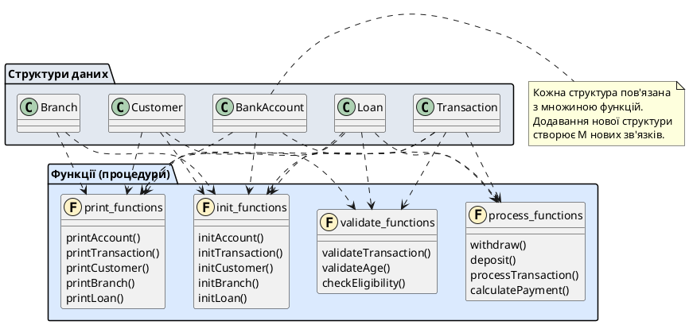
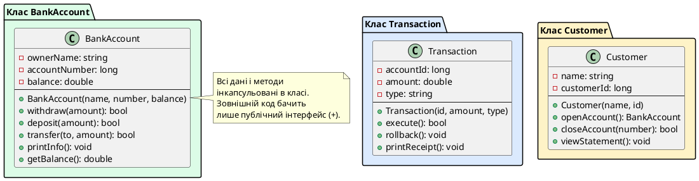

# Введення в ООП: від процедур до об'єктів

## Початкова точка: повернення до структур

На попередніх етапах нашого курсу ми ретельно вивчили структури (`struct`) — механізм агрегування даних, що дозволяє об'єднати кілька змінних під одним іменем. Згадаймо типовий приклад із серії статей про структури:

```cpp
struct BankAccount
{
    std::string ownerName;
    long accountNumber;
    double balance;
};
```

Структура `BankAccount` вирішила фундаментальну проблему: вона дозволила нам зберігати всі атрибути банківського рахунку — ім'я власника, номер рахунку, баланс — як єдину семантичну одиницю. Більше не потрібно жонглювати трьома незалежними змінними або трьома паралельними масивами. Один об'єкт `BankAccount account;` — і всі дані рахунку рухаються разом.

Але структура зберігає лише **дані**. Поведінка — функції, що працюють із цими даними — залишається зовні. Типовий код із структурами виглядає так:

```cpp
void initAccount(BankAccount& account, const std::string& name, 
                 long number, double initialBalance)
{
    account.ownerName = name;
    account.accountNumber = number;
    account.balance = initialBalance;
}

void printAccount(const BankAccount& account)
{
    std::cout << "Рахунок #" << account.accountNumber
              << ", власник: " << account.ownerName
              << ", баланс: " << account.balance << " грн\n";
}

bool withdraw(BankAccount& account, double amount)
{
    if (account.balance >= amount)
    {
        account.balance -= amount;
        return true;
    }
    return false;
}
```

Три окремі функції, кожна приймає `BankAccount` як параметр. Структура і функції живуть окремим життям — компілятор не знає, що `printAccount` і `withdraw` **належать** типу `BankAccount`. Для компілятора це просто вільні функції, які випадково працюють із певною структурою.

::note
Цей підхід називається **процедурним програмуванням**: дані (`struct`) і процедури (функції) існують окремо. Програма — це набір функцій, що оперують над даними. Зв'язок між даними і процедурами підтримується лише в голові програміста. Компілятор про цей зв'язок нічого не знає.
::

Такий підхід працює добре для невеликих програм. Але що станеться, коли проєкт зростає?

---

## Проблема процедурного коду: розрив зчеплення

Уявімо, що наша банківська система розширюється. Тепер у нас не один тип сутності, а п'ять:

```cpp
struct BankAccount { std::string ownerName; long number; double balance; };
struct Transaction { long accountId; double amount; std::string type; int timestamp; };
struct Customer    { std::string name; int age; std::string phone; long accountNumber; };
struct Branch      { int branchId; std::string address; int employeeCount; };
struct Loan        { long customerId; double amount; double interestRate; int months; };
```

Для кожної з цих структур потрібні функції ініціалізації, виведення, валідації, обчислення. Швидко виникає функціональний зоопарк:

```cpp
// Рахунки
void initAccount(BankAccount& acc, ...);
void printAccount(const BankAccount& acc);
bool withdraw(BankAccount& acc, double amount);
bool deposit(BankAccount& acc, double amount);
double getAccountBalance(const BankAccount& acc);

// Транзакції
void initTransaction(Transaction& t, ...);
void printTransaction(const Transaction& t);
bool validateTransaction(const Transaction& t);
void processTransaction(Transaction& t, BankAccount& acc);

// Клієнти
void initCustomer(Customer& c, ...);
void printCustomer(const Customer& c);
bool validateAge(const Customer& c);
bool updatePhone(Customer& c, const std::string& newPhone);

// Відділення
void initBranch(Branch& b, ...);
void printBranch(const Branch& b);
int getTotalEmployees(const Branch& b);

// Кредити
void initLoan(Loan& l, ...);
void printLoan(const Loan& l);
double calculateMonthlyPayment(const Loan& l);
bool checkEligibility(const Loan& l, const Customer& c);
```

П'ять структур, по чотири-п'ять функцій на кожну — **25 вільних функцій у глобальному просторі імен**. Кожна нова структура множить кількість функцій. Кожна нова операція вимагає написання функції для кожної структури.

Гірше того: **кожна функція повинна знати внутрішню структуру даних**. Якщо ми змінимо представлення балансу з `double` на структуру `Money { int wholeUnits; int cents; std::string currency; }`, потрібно переписати `withdraw`, `deposit`, `printAccount`, `getAccountBalance` — і кожну іншу функцію, що читає або записує `balance`.

::warning
Це створює ефект **високого зчеплення** (high coupling) між даними і функціями: зміна у структурі даних призводить до каскадних змін у десятках функцій. Одночасно це **низька зв'язність** (low cohesion): функції, що логічно належать одній сутності, розкидані по всьому коду без видимого групування.
::

---

## Криза складності: формула N×M

Процедурне програмування має фундаментальну проблему масштабування, яку можна виразити математично.

Нехай у системі існує **N структур** (типів даних) і **M операцій** (дій, які можна виконати над цими типами). У процедурному підході кожна операція повинна бути реалізована окремо для кожного типу даних. Це створює **N × M зв'язків**:

::math-formula
\text{Складність} = N \times M
::

Для нашого прикладу: 5 структур × 5 операцій = **25 функцій**. Якщо система зростає до 20 структур і 15 операцій — це вже **300 функцій**. Додавання нової структури вимагає написання M нових функцій. Додавання нової операції вимагає модифікації N структур.

Візуалізуємо цю проблему:

::plant-uml{alt="Мережа залежностей процедурного коду"}



::

Ця діаграма ілюструює **експоненційне зростання складності**. Пунктирні лінії представляють залежності: кожна функція повинна знати про внутрішню структуру кожного типу даних, з яким вона працює. Зміна у будь-якій структурі потенційно впливає на всі функції, що з нею працюють.

::caution
У реальних промислових системах це призводить до того, що називається **спагетті-кодом** (spaghetti code): заплутаної мережі взаємозалежностей, де зміна однієї частини програми непередбачувано ламає інші частини. Підтримка такого коду стає надзвичайно дорогою.
::

---

## Історична відповідь: від C до C++

Проблему N×M складності усвідомлювали вже на початку 1970-х років. Спроби її вирішити призвели до появи нової парадигми програмування — **об'єктно-орієнтованої**.

### Передумови: Simula та Smalltalk

Перші ідеї ООП з'явилися у мові **Simula 67** (1967), розробленій норвезькими вченими Оле-Йоганом Далем і Крістеном Нюгордом для моделювання складних систем. Simula ввела поняття **класу** — шаблону, що об'єднує дані і функції в єдину одиницю.

Ідеї Simula були радикально розвинені Аланом Кеєм у мові **Smalltalk** (1972-1980). Smalltalk сформулював три фундаментальні принципи ООП, які ми розглянемо далі. Smalltalk був чистою об'єктно-орієнтованою мовою: у ній абсолютно все — включно з числами і логічними значеннями — було об'єктом.

### Народження C++: C with Classes

У 1979 році данський інженер **Б'ярн Страуструп** (Bjarne Stroustrup), працюючи у Bell Labs над дисертацією, зіткнувся з тією самою проблемою складності при розробці розподілених систем на мові C. Він вивчив Simula і вирішив додати її об'єктно-орієнтовані можливості до C, зберігаючи при цьому ефективність і контроль над залізом, які робили C популярним для системного програмування.

Так з'явилася мова **C with Classes** (1980) — пряма попередниця C++. Вона додавала до C:

- **Класи** — типи даних, що об'єднують поля і функції
- **Інкапсуляцію** — приховування внутрішньої структури
- **Наслідування** — побудову нових класів на основі існуючих
- **Конструктори і деструктори** — автоматичне керування життєвим циклом об'єктів

У 1983 році мова була перейменована на **C++** (оператор інкременту `++` символізував «розширення C»). Перший комерційний компілятор вийшов у 1985 році.


::note
Ключова філософія Страуструпа: **«C++ — це C плюс можливість абстракції без втрати ефективності»**. На відміну від Smalltalk, де все є об'єктом і все динамічне, C++ дозволяв програмісту вибирати рівень абстракції: від низькорівневих маніпуляцій з пам'яттю до високорівневих об'єктних моделей.
::

### Еволюція стандартів


C++ пройшов довгий шлях від експериментального розширення до однієї з найпопулярніших мов світу:

| Рік | Стандарт | Ключові нововведення ООП |
|-----|----------|--------------------------|
| 1985 | Перший випуск | Класи, наслідування, віртуальні функції |
| 1998 | C++98 (ISO/IEC 14882:1998) | Перший міжнародний стандарт, STL як набір класів-контейнерів |
| 2003 | C++03 | Технічні виправлення |
| 2011 | C++11 | `= default`, `= delete`, move-семантика, лямбди як функціональні об'єкти |
| 2014 | C++14 | Узагальнені лямбди |
| 2017 | C++17 | `inline static`, структуроване зв'язування |
| 2020 | C++20 | Концепти (constraints на класи-шаблони), модулі |
| 2023 | C++23 | Покращення pattern matching |

Кожен стандарт розширював можливості ООП, зберігаючи зворотну сумісність із C та попередніми версіями C++.

---

## Що таке ООП: теоретичні основи

Перш ніж переходити до практичних аспектів, важливо чітко усвідомити, що саме означає термін **«об'єктно-орієнтоване програмування»** на концептуальному рівні.

### Визначення об'єкта

В контексті ООП **об'єкт** (*object*) — це програмна сутність, що об'єднує:

1. **Стан** (*state*) — набір даних (полів, атрибутів), що описують поточний стан об'єкта
2. **Поведінку** (*behavior*) — набір операцій (методів), які об'єкт може виконувати над своїм станом або у відповідь на зовнішні запити
3. **Ідентичність** (*identity*) — унікальну адресу в пам'яті, що відрізняє цей об'єкт від інших, навіть якщо вони мають ідентичний стан

Ключова ідея: об'єкт **інкапсулює** стан і поведінку як нероздільне ціле. Зовнішній світ взаємодіє з об'єктом через його **інтерфейс** (публічні методи), не маючи прямого доступу до внутрішнього стану.

::note
**Аналогія:** Мобільний телефон — це об'єкт. Його **стан** — заряд батареї, встановлені додатки, збережені контакти. Його **поведінка** — прийняти дзвінок, надіслати повідомлення, зробити фото. Його **інтерфейс** — сенсорний екран і кнопки. Ви не можете (і не повинні) напряму змінювати вольтаж батареї — ви взаємодієте через інтерфейс: «підключити зарядку». Телефон сам керує своїм внутрішнім станом.
::

### Визначення класу

**Клас** (*class*) — це шаблон, «креслення», що описує структуру (які дані) і поведінку (які методи) об'єктів певного типу. Клас не займає пам'яті — це лише опис. Об'єкт — це конкретний **екземпляр** (*instance*) класу, що займає реальну пам'ять.

**Аналогія:** Архітектурний проєкт будинку — це клас. Він описує, скільки поверхів, де розташовані кімнати, які матеріали використовувати. За одним проєктом можна збудувати десятки фізичних будинків — кожен буде **екземпляром** цього класу. Проєкт сам по собі не є будинком — це лише інструкція для будівництва.

### Парадигма vs методологія

**ООП — це парадигма програмування**, тобто фундаментальний стиль організації коду. На відміну від **процедурної парадигми** («програма = алгоритми + структури даних»), ООП стверджує: «програма = взаємодіючі об'єкти».

ООП не є технологією чи бібліотекою — це спосіб мислення про проблему. Два програмісти можуть написати програму на одній мові, але один використовуватиме процедурний підхід (функції + структури), а інший — об'єктний (класи + методи). Результат працюватиме однаково, але архітектура, читабельність, підтримуваність будуть кардинально різними.

---

## Чотири стовпи ООП: фундаментальні принципи

Об'єктно-орієнтоване програмування ґрунтується на чотирьох взаємопов'язаних принципах. Кожен із них вирішує конкретну проблему складності програм. Розгляньмо їх детально з реальними аналогіями.

### Принцип 1: Інкапсуляція (Encapsulation)

**Визначення:** Приховування внутрішньої структури об'єкта та надання контрольованого доступу до його стану через публічний інтерфейс.

**Суть:** Об'єкт стає «чорною скринькою». Зовнішній код не знає і не повинен знати, як саме всередині зберігаються дані. Він може лише викликати публічні методи — «натискати кнопки» інтерфейсу.

#### Аналогія: банкомат

Коли ви використовуєте банкомат, ви не знаєте (і не маєте потреби знати):
- Як він зберігає інформацію про ваш баланс (база даних, формат запису)
- Як він комунікує з банківським сервером (протокол, шифрування)
- Як він рахує купюри (механічні лічильники, сенсори)

Ви взаємодієте **лише через інтерфейс**: вставити картку, ввести PIN, натиснути «Зняти готівку», ввести суму. Банкомат — це інкапсульований об'єкт:

```cpp
class ATM
{
private:
    // Приховані внутрішні дані
    double balance;
    int cashReserve;
    std::string encryptedPIN;

public:
    // Публічний інтерфейс
    bool authenticate(const std::string& pin);
    bool withdraw(double amount);
    double checkBalance();
};
```

Якщо банк вирішить змінити спосіб зберігання балансу (наприклад, перейти з MySQL на PostgreSQL), це не зачепить ваше використання банкомату — інтерфейс залишається незмінним.

#### Переваги інкапсуляції

1. **Захист від некоректного використання:** Об'єкт може валідувати вхідні дані. Наприклад, метод `withdraw(amount)` перевірить, чи `amount > 0` і чи `amount <= balance`.

2. **Свобода зміни реалізації:** Поки публічний інтерфейс не змінюється, внутрішню реалізацію можна повністю переписати без впливу на код, що використовує клас.

3. **Спрощення для користувача:** Замість запам'ятовування десятків полів і правил їх зміни, користувач бачить лише кілька зрозумілих методів.

4. **Гарантія консистентності:** Об'єкт сам підтримує коректність свого стану. Наприклад, у банківському рахунку `balance` ніколи не стане від'ємним, бо метод `withdraw()` це контролює.

---

### Принцип 2: Наслідування (Inheritance)

**Визначення:** Механізм створення нових класів на основі існуючих, з автоматичним успадкуванням полів і методів базового класу.

**Суть:** Спільна функціональність виноситься у **батьківський** (базовий) клас. **Дочірні** (похідні) класи успадковують цю функціональність і додають свою специфічну поведінку.

#### Аналогія: біологічна класифікація

У біології існує ієрархія: Царство → Тип → Клас → Ряд → Родина → Рід → Вид.

Візьмемо клас **Ссавці** (*Mammalia*):
- Усі ссавці мають: хребет, теплокровність, живе народження, годування молоком
- Підклас **Хижаки** (*Carnivora*) успадковує ці риси + додає: гострі ікла, когті, м'ясоїдність
- Підклас **Котячі** (*Felidae*) успадковує все вище + додає: втяжні кігті, нічний зір
- Вид **Лев** (*Panthera leo*) успадковує все вище + додає: гриву (у самців), зграйний спосіб життя

Кожен наступний рівень **не переписує** спільні риси — він їх **успадковує** і додає специфічні.

#### Приклад у коді

```cpp
// Базовий клас — спільна функціональність
class BankAccount
{
protected:
    std::string ownerName;
    long accountNumber;
    double balance;

public:
    void deposit(double amount) { balance += amount; }
    double getBalance() const { return balance; }
};

// Похідний клас — спеціалізація для ощадного рахунку
class SavingsAccount : public BankAccount
{
private:
    double interestRate;  // Додаткове поле

public:
    void applyInterest()  // Додатковий метод
    {
        balance += balance * interestRate;
    }
};

// Похідний клас — спеціалізація для кредитного рахунку
class CreditAccount : public BankAccount
{
private:
    double creditLimit;

public:
    bool withdraw(double amount)  // Перевизначений метод
    {
        if (balance - amount >= -creditLimit)
        {
            balance -= amount;
            return true;
        }
        return false;
    }
};
```

`SavingsAccount` і `CreditAccount` **автоматично** отримують `ownerName`, `accountNumber`, `balance`, `deposit()`, `getBalance()` від `BankAccount`. Їм не потрібно переписувати цю логіку — вона **успадкована**.

#### Переваги наслідування

1. **Повторне використання коду:** Спільна логіка пишеться один раз у базовому класі.
2. **Логічна організація:** Ієрархія класів відображає реальні взаємозв'язки предметної області.
3. **Полегшення розширення:** Нові типи додаються через успадкування, без зміни існуючого коду.

---

### Принцип 3: Поліморфізм (Polymorphism)

**Визначення:** Можливість об'єктів різних типів реагувати на один і той самий виклик методу по-різному, залежно від їхнього фактичного типу.

**Суть:** Один інтерфейс — багато реалізацій. Код може оперувати абстракціями, не знаючи конкретного типу об'єкта під час компіляції.

#### Аналогія: універсальний пульт

Уявімо пульт дистанційного керування з кнопкою **«Включити»** (Power). Цей пульт може працювати з різними пристроями:

- **Телевізор:** кнопка Power → увімкнення екрану, завантаження ОС
- **Кондиціонер:** кнопка Power → запуск компресора, охолодження повітря
- **Музичний центр:** кнопка Power → увімкнення підсилювача, готовність до відтворення

Ви натискаєте **одну кнопку**, але кожен пристрій реагує **по-своєму**. Пульт не знає, який саме пристрій перед ним — йому достатньо знати, що пристрій «розуміє» команду Power.

#### Приклад у коді

```cpp
// Базовий клас із віртуальним методом
class Device
{
public:
    virtual void powerOn() = 0;  // Чиста віртуальна функція
};

class Television : public Device
{
public:
    void powerOn() override
    {
        std::cout << "Телевізор: завантаження ОС, увімкнення екрану\n";
    }
};

class AirConditioner : public Device
{
public:
    void powerOn() override
    {
        std::cout << "Кондиціонер: запуск компресора, охолодження\n";
    }
};

// Поліморфна функція
void activateDevice(Device* device)
{
    device->powerOn();  // Викликається правильна версія залежно від типу
}

int main()
{
    Television tv;
    AirConditioner ac;

    activateDevice(&tv);  // Виведе: "Телевізор: ..."
    activateDevice(&ac);  // Виведе: "Кондиціонер: ..."
}
```

Функція `activateDevice()` не знає конкретного типу пристрою — вона працює з абстракцією `Device*`. Правильна версія `powerOn()` визначається **під час виконання** (*runtime polymorphism*).

#### Переваги поліморфізму

1. **Гнучкість:** Новий тип можна додати без зміни коду, що використовує базовий інтерфейс.
2. **Розширюваність:** Система відкрита для розширення (нові класи), але закрита для модифікації (існуючий код не змінюється).
3. **Абстракція:** Код працює з високорівневими концепціями, не залежачи від деталей реалізації.

---

### Принцип 4: Абстракція (Abstraction)

**Визначення:** Виділення суттєвих характеристик об'єкта та ігнорування несуттєвих деталей для конкретного контексту.

**Суть:** Моделюючи реальний об'єкт, ми не копіюємо його повністю — ми створюємо **спрощену модель**, що включає лише ті аспекти, які важливі для нашої задачі.

#### Аналогія: карта метро vs географічна карта

**Карта метро** — це абстракція транспортної мережі:
- Вона показує: станції, лінії, пересадки
- Вона **не** показує: реальні відстані, географічне розташування, глибину залягання тунелів

Чому? Бо для пасажира ці деталі **несуттєві**. Йому потрібно знати: «Як дістатися з точки А до точки Б? Де зробити пересадку?». Карта метро — це **абстракція**, що відкидає зайву інформацію і фокусується на суті.

**Географічна карта** міста — інша абстракція:
- Вона показує: реальні відстані, вулиці, будівлі, рельєф
- Вона може **не** показувати: лінії метро (або показувати спрощено)

Дві різні абстракції одного об'єкта (міста), кожна — для свого контексту.

#### Приклад у коді

Абстрагуймо **автомобіль** для різних контекстів:

**Контекст 1: Гоночний симулятор**

```cpp
class RaceCar
{
private:
    double speed;          // Швидкість — критично важлива
    double acceleration;   // Прискорення
    double handling;       // Кермова керованість

public:
    void accelerate();
    void brake();
    void turn(double angle);
};
```

Для гонок важливі швидкість і керованість. Несуттєві деталі (колір салону, місткість багажника) — відкинуті.

**Контекст 2: Система обліку автопарку компанії**

```cpp
class CompanyCar
{
private:
    std::string licensePlate;  // Номерний знак
    std::string assignedDriver; // Призначений водій
    int mileage;               // Пробіг
    Date lastServiceDate;      // Дата ТО

public:
    void assignToDriver(std::string driver);
    void recordMileage(int km);
    bool needsService();
};
```

Для обліку важливі номер, водій, пробіг. Швидкість і прискорення — несуттєві.

Обидва класи моделюють **автомобіль**, але різні абстракції включають різні аспекти залежно від контексту.

#### Переваги абстракції

1. **Спрощення:** Відкидаючи несуттєві деталі, ми зменшуємо складність моделі.
2. **Фокус на суті:** Абстракція виділяє саме те, що важливо для розв'язання задачі.
3. **Зменшення зв'язності:** Код залежить від абстракцій, а не від конкретних реалізацій.

---

## Взаємодія чотирьох принципів

Чотири принципи ООП не існують ізольовано — вони працюють разом, формуючи цілісну методологію:

1. **Абстракція** визначає, що саме моделювати — які аспекти реальності важливі
2. **Інкапсуляція** створює межі об'єкта — приховує деталі, залишає лише інтерфейс
3. **Наслідування** організує об'єкти в ієрархії — виносить спільне у базові класи
4. **Поліморфізм** дозволяє коду працювати з абстракціями — викликати методи, не знаючи конкретного типу

::plant-uml{alt="Взаємозв'язок чотирьох принципів ООП"}

```plantuml
@startuml
skinparam style plain
skinparam backgroundColor #FFFFFF

package "Чотири принципи ООП" {
    
    rectangle "Абстракція" as ABS #DBEAFE {
        Виділення суттєвого,
        відкидання несуттєвого
    }
    
    rectangle "Інкапсуляція" as ENC #DCFCE7 {
        Приховування деталей,
        публічний інтерфейс
    }
    
    rectangle "Наслідування" as INH #FEF3C7 {
        Ієрархії класів,
        повторне використання
    }
    
    rectangle "Поліморфізм" as POLY #FCE7F3 {
        Єдиний інтерфейс,
        різні реалізації
    }
}

ABS -down-> ENC : визначає що\nінкапсулювати
ENC -down-> INH : інкапсульовані\nкласи організуються\nв ієрархії
INH -down-> POLY : похідні класи\nреалізують поліморфну\nповедінку
POLY -up-> ABS : працює з\nабстракціями

note bottom of POLY
  Всі чотири принципи
  взаємодіють разом,
  формуючи цілісну
  методологію проєктування
end note

@enduml
```

::

**Приклад інтеграції всіх принципів:**

```cpp
// Абстракція: моделюємо платіжний інструмент для онлайн-магазину
// Нам важливі: можливість оплати, перевірка коштів
// Нам НЕ важливі: фізичні розміри картки, матеріал виготовлення

// Інкапсуляція: деталі реалізації приховані
class PaymentMethod
{
protected:
    double availableBalance;

public:
    // Публічний інтерфейс
    virtual bool processPayment(double amount) = 0;
    virtual bool checkFunds(double amount) = 0;
};

// Наслідування: спеціалізовані типи платіжних методів
class CreditCard : public PaymentMethod
{
private:
    double creditLimit;

public:
    bool processPayment(double amount) override
    {
        if (availableBalance + creditLimit >= amount)
        {
            availableBalance -= amount;
            return true;
        }
        return false;
    }
    
    bool checkFunds(double amount) override
    {
        return (availableBalance + creditLimit >= amount);
    }
};

class DebitCard : public PaymentMethod
{
public:
    bool processPayment(double amount) override
    {
        if (availableBalance >= amount)
        {
            availableBalance -= amount;
            return true;
        }
        return false;
    }
    
    bool checkFunds(double amount) override
    {
        return (availableBalance >= amount);
    }
};

// Поліморфізм: функція працює з абстракцією
void checkout(PaymentMethod* payment, double totalPrice)
{
    if (payment->checkFunds(totalPrice))
    {
        payment->processPayment(totalPrice);
        std::cout << "Оплата успішна\n";
    }
    else
    {
        std::cout << "Недостатньо коштів\n";
    }
}
```

Функція `checkout()` не знає конкретного типу (`CreditCard` чи `DebitCard`) — вона працює з абстракцією `PaymentMethod*`. Це і є сила ООП: поєднання всіх чотирьох принципів створює гнучку, розширювану систему.

---

## ООП як зміна парадигми: моделювання від об'єктів

Процедурне програмування моделює систему **від завдань**: «Які дії потрібно виконати? Які функції написати?». Програміст починає з алгоритму, а дані підбирає під нього.

Об'єктно-орієнтоване програмування моделює систему **від об'єктів**: «Які сутності існують у задачі? Які атрибути і поведінку вони мають?». Програміст починає з аналізу предметної області, ідентифікує об'єкти реального світу і перетворює їх на програмні об'єкти.

Ця зміна перспективи має глибокі наслідки. Розгляньмо приклад із банківською системою:

**Процедурний підхід:**
1. Функція `withdrawMoney()` — як зняти гроші з рахунку?
2. Функція `transferFunds()` — як перевести гроші між рахунками?
3. Функція `calculateInterest()` — як нарахувати відсотки?

Думка йде від дій. Структури даних стають просто «контейнерами для передачі параметрів».

**Об'єктно-орієнтований підхід:**
1. Об'єкт `BankAccount` — що може робити рахунок? `withdraw(amount)`, `deposit(amount)`, `transfer(toAccount, amount)`
2. Об'єкт `Customer` — що може робити клієнт? `openAccount()`, `closeAccount()`, `viewStatement()`
3. Об'єкт `Transaction` — що може робити транзакція? `execute()`, `rollback()`, `getReceipt()`

Думка йде від сутностей. Функції стають **методами** — поведінкою, що належить об'єкту. Дані і поведінка об'єднуються.

::tip
Практична порада: коли починаєте новий проєкт, спочатку складіть список **іменників** у описі задачі — це потенційні класи. Потім складіть список **дієслів**, пов'язаних із кожним іменником — це потенційні методи. Наприклад: «Рахунок **зараховує** гроші» → `BankAccount::deposit(amount)`.
::

Це змінює структуру коду на фундаментальному рівні:

```cpp
// Процедурний стиль
withdrawMoney(account, 500);
transferFunds(fromAccount, toAccount, 1000);
printAccountInfo(account);

// Об'єктно-орієнтований стиль
account.withdraw(500);
fromAccount.transfer(toAccount, 1000);
account.printInfo();
```

Друга версія читається як природна мова: «рахунок знімає 500», «рахунок переводить на інший рахунок 1000», «рахунок друкує інформацію». Об'єкт стає підметом, метод — присудком. Код відображає структуру реальності.

---

## Швидке нагадування: чотири принципи ООП

Вище ми детально розглянули чотири фундаментальні принципи об'єктно-орієнтованого програмування. Коротко нагадаємо їх суть:

::card-group

::card{title="🎯 Абстракція" icon="i-lucide-layers"}
Виділення суттєвих характеристик об'єкта та ігнорування несуттєвих деталей для конкретного контексту. Карта метро — абстракція міста для пасажирів.
::

::card{title="🔒 Інкапсуляція" icon="i-lucide-lock"}
Приховування внутрішньої структури об'єкта і надання контрольованого доступу через публічний інтерфейс. Банкомат — інкапсульований об'єкт із кнопками як інтерфейсом.
::

::card{title="🧬 Наслідування" icon="i-lucide-git-branch"}
Побудова нових класів на основі існуючих, з автоматичним успадкуванням полів і методів. Біологічна класифікація: Ссавці → Хижаки → Котячі → Лев.
::

::card{title="🎭 Поліморфізм" icon="i-lucide-shapes"}
Можливість обробляти об'єкти різних типів через єдиний інтерфейс. Універсальний пульт: одна кнопка Power працює з телевізором, кондиціонером, музичним центром.
::

::

Детальні пояснення, аналогії та приклади коду для кожного принципу ви знайдете у розділі **«Чотири стовпи ООП»** вище. У наступних статтях серії ми покроково реалізуємо кожен із цих принципів у C++.

---

## Перший погляд на зміну мислення

Повернімося до прикладу, з якого ми почали. Процедурний код:

```cpp
struct Student
{
    std::string m_name;
    int         m_age;
    double      m_gpa;
};

void initStudent(Student& s, const std::string& name, int age, double gpa)
{
    s.m_name = name;
    s.m_age  = age;
    s.m_gpa  = gpa;
}

void printStudent(const Student& s)
{
    std::cout << "Студент: " << s.m_name 
              << ", вік: " << s.m_age 
              << ", GPA: " << s.m_gpa << "\n";
}

int main()
{
    Student olena;
    initStudent(olena, "Олена Коваль", 20, 3.9);
    printStudent(olena);
}
```

Тут три окремі сутності: структура `Student`, функція `initStudent`, функція `printStudent`. Зв'язок між ними існує лише в голові програміста.

Тепер уявімо об'єктно-орієнтований підхід (детальний синтаксис ми вивчимо у наступних статтях):

```cpp
class BankAccount
{
private:
    std::string ownerName;
    long accountNumber;
    double balance;

public:
    // Конструктор — автоматична ініціалізація
    BankAccount(const std::string& name, long number, double initialBalance)
        : ownerName(name), accountNumber(number), balance(initialBalance)
    {
    }

    // Метод — поведінка, що належить об'єкту
    void printInfo() const
    {
        std::cout << "Рахунок #" << accountNumber 
                  << ", власник: " << ownerName 
                  << ", баланс: " << balance << " грн\n";
    }

    bool withdraw(double amount)
    {
        if (balance >= amount)
        {
            balance -= amount;
            return true;
        }
        return false;
    }
};

int main()
{
    BankAccount myAccount("Іван Петренко", 123456789, 5000.0);
    myAccount.printInfo();
    myAccount.withdraw(500.0);
    myAccount.printInfo();
}
```

Ключові відмінності:

1. **Дані приховані** (`private`): зовнішній код не може безпосередньо змінювати `ownerName`, `accountNumber` або `balance`
2. **Функції стали методами**: `printInfo()` та `withdraw()` тепер **належать** класу `BankAccount`, а не є вільними функціями
3. **Автоматична ініціалізація**: конструктор `BankAccount(...)` викликається при створенні об'єкта
4. **Природний синтаксис**: `myAccount.withdraw(500)` читається як «мій рахунок знімає 500»

Порівняйте виклики:

```cpp
// Процедурний стиль
withdraw(myAccount, 500);    // "Зніми з рахунку 500"
                             // Рахунок — пасивні дані, функція — активна дія

// Об'єктно-орієнтований стиль
myAccount.withdraw(500);     // "Рахунку, зніми 500"
                             // Рахунок — активний об'єкт, який виконує власну поведінку
```

У першому випадку об'єкт — це пасивний контейнер даних, яким маніпулює зовнішня функція. У другому — об'єкт є автономною сутністю, що володіє власною поведінкою.

::note
Це фундаментальна зміна парадигми: від **пасивних даних + активних функцій** до **активних об'єктів, що інкапсулюють і дані, і поведінку**. Об'єкт стає самостійною одиницею, що відповідає за підтримку власної коректності.
::

---

## Аналогія: від механічного годинника до смартфону

Щоб зрозуміти різницю між процедурним і об'єктно-орієнтованим підходами на інтуїтивному рівні, розгляньмо аналогію з технічними пристроями.

**Процедурне програмування — це механічний годинник XVIII століття:**


- Усі шестерні, пружини, важелі лежать відкрито
- Щоб завести годинник, ви крутите конкретну шестерню
- Щоб перевести стрілки, ви штовхаєте важіль
- Для кожної дії потрібно знати внутрішній механізм

Якщо майстер змінює внутрішній механізм (наприклад, замінює пружину на електричний мотор), усі інструкції користувача стають недійсними. Потрібно вчитися заново.

**Об'єктно-орієнтоване програмування — це смартфон:**

- Внутрішні компоненти приховані за корпусом
- Для всіх дій існує єдиний інтерфейс — сенсорний екран
- Ви не знаєте (і не повинні знати), як працює процесор, пам'ять, радіомодуль
- Виробник може замінити процесор ARM на x86 — ваші програми продовжують працювати

Смартфон — це **інкапсульований об'єкт**. Він має:
- **Приховані дані**: внутрішні схеми, регістри, стан пам'яті
- **Публічний інтерфейс**: тачскрін, кнопки, порти
- **Поведінку**: відповіді на дотики, обробка даних, комунікація з мережею

Саме цей принцип ми переносимо у програмування: замість розкиданих шестерень (змінних) і важелів (функцій), ми створюємо закінчені об'єкти з чіткими межами та інтерфейсами.

---

## Вирішення проблеми N×M: як ООП змінює формулу

Згадаймо проблему складності процедурного підходу: **N структур × M операцій = N×M зв'язків**. Як ООП її вирішує?

У об'єктно-орієнтованому підході кожна операція стає **методом класу**. Замість M вільних функцій для N структур, ми маємо N класів, кожен із M методів. Здається, що кількість коду та зв'язків залишається незмінною? Але це не так.

**Ключова відмінність:** у процедурному коді зв'язки **явні та розосереджені**. Кожна функція має знати про внутрішню структуру кожного типу даних. У об'єктно-орієнтованому коді зв'язки **інкапсульовані та локалізовані**. Кожен клас знає лише про власні дані.

Порівняймо зміну вимог:

**Сценарій 1: Додати нову структуру (тип даних)**

*Процедурний підхід:*
- Створити `struct NewType`
- Написати `initNewType()`, `printNewType()`, `validateNewType()`, ... — M нових функцій
- Кожна функція повинна знати внутрішню структуру `NewType`

*Об'єктно-орієнтований підхід:*
- Створити `class NewType`
- Реалізувати M методів **всередині** класу
- Решта системи не змінюється — новий клас інкапсульований

**Сценарій 2: Змінити представлення даних**

*Процедурний підхід:*
- Змінити `struct Student { double m_gpa; }` на `struct Student { Grade m_grade; }`
- Переписати **кожну** функцію, що працює з `m_gpa`: `calculateScholarship()`, `printStudent()`, `validateStudent()`, ...
- Можливо, забути переписати якусь функцію → баг

*Об'єктно-орієнтований підхід:*
- Змінити приватне поле `m_gpa` на `m_grade` всередині класу `Student`
- Переписати методи **тільки цього класу**
- Зовнішній код продовжує викликати `student.getGpa()` — інтерфейс не змінився

::plant-uml{alt="Інкапсульована структура ООП"}



::

Кожен клас — це самодостатня одиниця. Додавання нового класу не вимагає модифікації існуючих. Зміна внутрішньої структури класу не зачіпає зовнішній код, якщо публічний інтерфейс залишається стабільним.

::tip
Це принцип **локальності змін** (locality of change): зміни в одній частині системи не поширюються на інші частини. У добре спроєктованій об'єктно-орієнтованій системі зміна реалізації одного класу не вимагає перекомпіляції інших класів, що його використовують — за умови, що інтерфейс не змінився.
::

---

## Реальний світ уже об'єктний: аргумент від природи

Чому об'єктно-орієнтоване програмування природне для людини? Тому що **реальний світ організований саме так**.

Озирніться. Усе навколо — це об'єкти:
- **Автомобіль**: має властивості (колір, марка, пробіг) і поведінку (їхати, гальмувати, сигналити)
- **Банківський рахунок**: має властивості (номер, баланс, власник) і поведінку (поповнити, зняти, перевести)
- **Документ Word**: має властивості (текст, шрифт, стилі) і поведінку (редагувати, зберегти, роздрукувати)

Жоден із цих об'єктів не існує як «пасивні дані плюс зовнішні функції». Автомобіль не просто лежить, а хтось ззовні крутить його колеса — автомобіль **їде сам**, коли ви натискаєте педаль газу. Банківський рахунок не просто число, яке хтось змінює — рахунок **сам перевіряє**, чи вистачає грошей для зняття.

ООП моделює цю реальність: об'єкти програми стають **агентами**, що мають стан і поведінку, а не пасивними контейнерами даних.

Більше того: ваш мозок організований саме так. Коли ви думаєте про завдання, ви природно виділяєте сутності («студент записується на курс», а не «функція `enroll()` приймає структуру `student` і структуру `course`»). ООП дозволяє писати код, що відповідає вашій ментальній моделі задачі.

::note
Дослідження з когнітивної психології (наприклад, роботи Елеонор Рош у 1970-х) показали, що людський розум природно категоризує світ через **прототипи** та **ієрархії**. Ми думаємо категоріями «птах → горобець», «транспорт → автомобіль», «людина → студент». Саме ці ментальні структури ООП формалізує через класи і наслідування.
::

---

## Що ООП **не** є: розвінчання міфів

Перед тим, як перейти до практики, варто розвіяти кілька поширених непорозумінь.

**Міф 1: «ООП робить код повільнішим»**

*Реальність:* Добре написаний об'єктно-орієнтований код може бути таким самим ефективним, як процедурний. Компілятори C++ агресивно оптимізують виклики методів (inline-підстановка, девіртуалізація). Втрати продуктивності виникають лише при зловживанні віртуальними функціями або надмірній абстракції, але це проблема архітектури, а не парадигми.

**Міф 2: «ООП змушує писати більше коду»**

*Реальність:* На ранніх етапах може здатися, що об'єктно-орієнтований код довший (потрібно оголошувати класи, писати конструктори). Але при зростанні проєкту ООП дає **експоненційне** скорочення: код стає повторно використовуваним. Один клас `Student` замінює десятки розкиданих функцій.

**Міф 3: «ООП — це лише синтаксичний цукор над struct»**

*Реальність:* Технічно, на низькому рівні, клас дійсно компілюється у щось схоже на структуру плюс функції. Але **семантика** змінюється кардинально: інкапсуляція, наслідування, поліморфізм — це не просто зручності синтаксису, а принципи організації складних систем. Так само, як асемблер технічно «може все», що може C++, але програмувати великі системи на асемблері неможливо через відсутність абстракцій.

**Міф 4: «ООП замінює процедурний підхід»**

*Реальність:* ООП **доповнює** процедурний підхід, а не замінює його. У C++ ви можете (і часто повинні) змішувати обидві парадигми: використовувати класи для складних сутностей і прості функції для утилітарних операцій. Наприклад, `std::sort()` — це функція, а `std::vector` — це клас. Обидва разом утворюють потужний інструментарій.

---

## Перше знайомство: від `processPayment(card, amount)` до `card.processPayment(amount)`

Завершимо концептуальний огляд класичним прикладом, що демонструє суть зміни мислення.

**Процедурна модель:**

```cpp
struct CreditCard
{
    std::string cardNumber;
    std::string holderName;
    double balance;
    double creditLimit;
};

struct Store
{
    std::string name;
    std::string location;
};

bool processPayment(CreditCard& card, double amount, const Store& store)
{
    if (card.balance + amount <= card.creditLimit)
    {
        card.balance += amount;
        std::cout << "Оплата " << amount << " грн в " << store.name << " успішна\n";
        return true;
    }
    std::cout << "Недостатньо коштів\n";
    return false;
}
```

Виклик: `processPayment(myCard, 250, bookStore);`

Читається: «Функція `processPayment` бере картку `myCard`, суму `250` і магазин `bookStore` і виконує дію».

**Об'єктно-орієнтована модель:**

```cpp
class CreditCard
{
private:
    std::string cardNumber;
    std::string holderName;
    double balance;
    double creditLimit;

public:
    bool processPayment(double amount, const Store& store)
    {
        if (balance + amount <= creditLimit)
        {
            balance += amount;
            std::cout << "Оплата " << amount << " грн в " 
                      << store.getName() << " успішна\n";
            return true;
        }
        std::cout << "Недостатньо коштів\n";
        return false;
    }
};
```

Виклик: `myCard.processPayment(250, bookStore);`

Читається: «Картка `myCard` виконує дію `processPayment` на суму `250` у магазині `bookStore`».

Здається незначною різницею? Але вона фундаментальна:

1. **Суб'єкт дії:** У процедурному коді дію виконує **функція** (вона є активною силою). В ООП дію виконує **об'єкт** (він є активною силою).

2. **Відповідальність:** У процедурному коді `processPayment` відповідає за зміну `card.balance`. В ООП `CreditCard` відповідає за зміну власного стану через власний метод.

3. **Інкапсуляція:** У процедурному коді функція має прямий доступ до `card.balance` — поле публічне. В ООП поле `balance` приватне — зовнішній код не може його змінити напряму.

Ось чому `myCard.processPayment(250, store)` читається природніше, ніж `processPayment(myCard, 250, store)`: у реальному світі саме **картка** обробляє платіж, а не «функція обробки бере картку і обробляє». Об'єкт — це активний агент, а не пасивний набір даних.

---

## Резюме: підготовка до подорожі

Ми пройшли довгий концептуальний шлях від усвідомлення обмежень процедурного підходу до розуміння філософії ООП. Підведімо підсумки того, що ми дізналися:

**Проблема процедурного програмування:**
- Дані (`struct`) і функції існують окремо
- Зростання складності за формулою N×M: кожна нова структура або операція множить зв'язки
- Високе зчеплення і низька зв'язність: зміна в одному місці вимагає змін у багатьох місцях
- Відсутність природного відображення реальності

**Рішення через ООП:**
- Інкапсуляція: об'єднання даних і поведінки, приховування внутрішньої структури
- Наслідування: побудова ієрархій класів, повторне використання коду
- Поліморфізм: єдиний інтерфейс для різних типів об'єктів
- Локальність змін: модифікація класу не зачіпає зовнішній код

**Історичний контекст:**
- Simula 67 (1967) — перші класи і наслідування
- Smalltalk (1972-1980) — чиста об'єктна парадигма
- C with Classes (1980) → C++ (1983) — ООП із ефективністю C
- Еволюція стандартів: C++98 → C++11 → C++17 → C++20 → C++23

**Зміна мислення:**
- Від «які функції написати?» до «які об'єкти існують?»
- Від пасивних даних до активних агентів
- Від `function(object, ...)` до `object.method(...)`

На наступному етапі ми перейдемо від концепцій до практики. Ми перетворимо знайому `struct` на `class`, навчимося писати методи замість вільних функцій, з'ясуємо, що таке **конструктор** і чому він автоматично викликається при створенні об'єкта, і зрозуміємо різницю між **публічним інтерфейсом** та **приватною реалізацією**.

::tip
Перед переходом до наступної статті рекомендується повторити матеріал про структури (статті 33–36), особливо розділ про оператор крапка (`.`) та передачу структур у функції. Ці знання будуть фундаментом для розуміння методів класу та прихованого покажчика `this`.
::

Об'єктно-орієнтоване програмування — це не просто новий синтаксис. Це новий спосіб думати про програми. Готові розпочати цю подорож?

