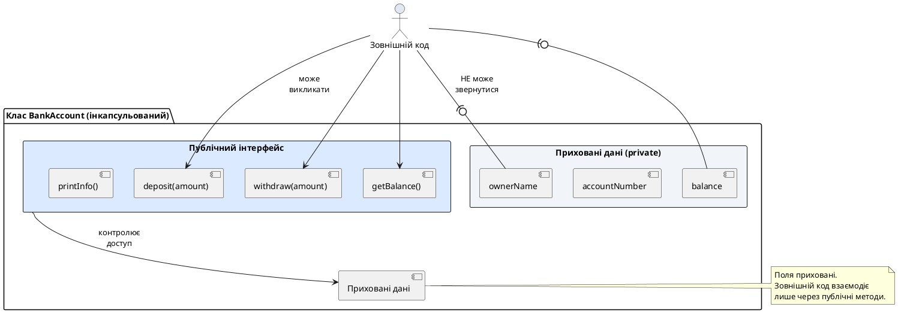

# Специфікатори доступу та інкапсуляція

## Проблема відкритих полів: чому це небезпечно?

У попередній статті ми створили клас `BankAccount` з публічними полями:

```cpp
class BankAccount
{
public:
    std::string ownerName;
    long accountNumber;
    double balance;

    void deposit(double amount)
    {
        balance += amount;
    }

    void withdraw(double amount)
    {
        if (balance >= amount)
        {
            balance -= amount;
        }
    }
};
```

Здається, що все працює чудово. Але розгляньмо, що може піти не так:

```cpp
int main()
{
    BankAccount account;
    account.ownerName = "Іван Петренко";
    account.accountNumber = 123456789;
    account.balance = 1000.0;

    // Операції через методи — все добре
    account.deposit(500.0);
    account.withdraw(200.0);

    // Але нічого не заважає зробити це:
    account.balance = -5000.0;        // ❌ Від'ємний баланс!
    account.balance = 999999999.9;    // ❌ Довільна зміна балансу!
    account.accountNumber = -1;       // ❌ Некоректний номер рахунку!
    account.ownerName = "";           // ❌ Порожнє ім'я!
}
```

**Проблема:** Оскільки поля публічні, зовнішній код може **безпосередньо змінювати** їх, обходячи будь-яку логіку валідації. Ми створили методи `deposit` і `withdraw`, але користувач може просто проігнорувати їх і змінити `balance` напряму.

Це порушує один із чотирьох фундаментальних принципів ООП, що ми вивчили у статті 49 — **інкапсуляцію**. Дані класу повинні бути **приховані**, а доступ до них — **контрольований** через публічний інтерфейс.

::warning
**Золоте правило ООП:** Ніколи не робіть поля класу публічними, якщо це не проста структура даних без логіки. Поля повинні бути `private`, а доступ — через методи.
::

---

## Специфікатори доступу: `public`, `private`, `protected`

**Специфікатор доступу** (*access specifier*) — це ключове слово, що визначає, хто має доступ до членів класу (полів і методів). У C++ існує три специфікатори:

### `public` — відкритий доступ

Члени, оголошені після `public:`, **доступні звідусіль**: як всередині класу, так і ззовні.

```cpp
class Example
{
public:
    int publicField;      // Доступне звідусіль
    void publicMethod();  // Доступний звідусіль
};

int main()
{
    Example obj;
    obj.publicField = 10;  // ✅ Доступ дозволений
    obj.publicMethod();    // ✅ Доступ дозволений
}
```

**Коли використовувати:** Для методів, що становлять **публічний інтерфейс** класу — те, що клас пропонує зовнішньому світу.

### `private` — закритий доступ

Члени, оголошені після `private:`, **доступні лише всередині класу**. Зовнішній код не може до них звернутися.

```cpp
class Example
{
private:
    int privateField;      // Доступне лише всередині Example
    void privateMethod();  // Доступний лише всередині Example

public:
    void publicMethod()
    {
        privateField = 5;    // ✅ Доступ всередині класу
        privateMethod();     // ✅ Доступ всередині класу
    }
};

int main()
{
    Example obj;
    obj.privateField = 10;  // ❌ Помилка компіляції!
    obj.privateMethod();    // ❌ Помилка компіляції!
}
```

**Коли використовувати:** Для полів класу та допоміжних методів, що є **деталями реалізації**, які не повинні бути видимі ззовні.

### `protected` — захищений доступ

Члени, оголошені після `protected:`, доступні всередині класу **та у його похідних класах** (про наслідування у статтях 58-60).

```cpp
class Base
{
protected:
    int protectedField;  // Доступне у Base і похідних класах
};

class Derived : public Base
{
public:
    void someMethod()
    {
        protectedField = 10;  // ✅ Доступ у похідному класі
    }
};

int main()
{
    Base obj;
    obj.protectedField = 5;  // ❌ Помилка компіляції!
}
```

**Коли використовувати:** Для членів, які потрібні похідним класам, але не повинні бути публічними. На початковому етапі вивчення ООП `protected` майже не використовується — зосередьтеся на `public` і `private`.

::note
**Специфікатор діє до наступного специфікатора або до кінця класу:**

```cpp
class Demo
{
private:
    int a;     // private
    int b;     // private

public:
    int c;     // public
    void foo(); // public

private:
    int d;     // private
};
```

Можна використовувати кілька секцій одного специфікатора, але рекомендується групувати: спочатку `public`, потім `private`.
::

---

## Доступ за замовчуванням: `struct` vs `class`

Ми згадували це у попередній статті, але тепер розгляньмо детальніше. **Єдина різниця між `struct` і `class` у C++ — це доступ за замовчуванням:**

::code-group

```cpp [struct — public за замовчуванням]
struct Rectangle
{
    // Без специфікатора — public
    double width;
    double height;

    double area()
    {
        return width * height;
    }
};

int main()
{
    Rectangle rect;
    rect.width = 5.0;   // ✅ Доступ дозволений
    rect.height = 3.0;  // ✅ Доступ дозволений
}
```

```cpp [class — private за замовчуванням]
class Rectangle
{
    // Без специфікатора — private
    double width;   // ❌ Private за замовчуванням
    double height;  // ❌ Private за замовчуванням

    double area()   // ❌ Private за замовчуванням
    {
        return width * height;
    }
};

int main()
{
    Rectangle rect;
    rect.width = 5.0;  // ❌ Помилка компіляції!
}
```

```cpp [class з явним public]
class Rectangle
{
public:  // Явно вказуємо public
    double width;
    double height;

    double area()
    {
        return width * height;
    }
};

int main()
{
    Rectangle rect;
    rect.width = 5.0;   // ✅ Тепер доступ дозволений
}
```

::

**Висновок:** `struct` і `class` функціонально ідентичні — різниця лише у доступі за замовчуванням. Після компіляції обидва перетворюються на однаковий машинний код.

::tip
**Практична рекомендація:**
- Використовуйте `struct` для простих контейнерів даних без логіки (наприклад, `Point`, `Color`, `Vector3`)
- Використовуйте `class` для об'єктів з інкапсульованим станом і поведінкою (наприклад, `BankAccount`, `Customer`, `FileReader`)

У 95% випадків у ООП-коді використовується `class`.
::

---

## Інкапсуляція: що це і навіщо?

**Інкапсуляція** (*encapsulation*) — це процес приховування внутрішньої структури об'єкта і надання контрольованого доступу через публічний інтерфейс.

### Аналогія: банкомат

Коли ви користуєтеся банкоматом:

- Ви **НЕ** знаєте (і не повинні знати):
  - Як він з'єднується з банківським сервером
  - У якому форматі зберігає дані на сервері
  - Як він перевіряє PIN-код (алгоритм шифрування)
  - Скільки купюр лежить у кожному відділенні

- Ви **знаєте** лише **публічний інтерфейс**:
  - Вставити картку
  - Ввести PIN
  - Вибрати операцію (зняти готівку, перевірити баланс)
  - Ввести суму

Банкомат — це **інкапсульований об'єкт**. Внутрішня реалізація прихована. Зовнішній користувач взаємодіє лише через інтерфейс.

### Аналогія: автомобіль

Коли ви керуєте автомобілем:

- **Приховано:** Робота двигуна, трансмісії, системи гальмування, ABS, електронного блоку керування
- **Публічний інтерфейс:** Кермо, педалі газу і гальм, перемикач передач

Якщо виробник змінить двигун (наприклад, з бензинового на електричний), вам не потрібно вчитися керувати автомобілем заново — інтерфейс залишається тим самим.

::plant-uml{alt="Інкапсуляція: публічний інтерфейс vs приховані деталі"}



::

---

## Чому поля мають бути `private`: чотири переваги

### Перевага 1: Захист від некоректних значень

Публічне поле можна встановити у будь-яке значення, включно з некоректними:

```cpp
class BankAccount
{
public:
    double balance;  // Публічне — небезпечно
};

int main()
{
    BankAccount account;
    account.balance = -5000.0;  // ❌ Від'ємний баланс — логічна помилка!
}
```

Приватне поле з методом-сеттером дозволяє **валідувати** значення:

```cpp
class BankAccount
{
private:
    double balance;  // Приховано

public:
    void setBalance(double newBalance)
    {
        if (newBalance < 0.0)
        {
            std::cout << "Помилка: баланс не може бути від'ємним\n";
            return;
        }
        balance = newBalance;
    }
};

int main()
{
    BankAccount account;
    account.setBalance(-5000.0);  // ✅ Метод відхилить некоректне значення
}
```

### Перевага 2: Можливість змінити реалізацію без зміни інтерфейсу

Припустімо, у нас є клас `Temperature` зі значенням у Цельсіях:

```cpp
// Версія 1: зберігаємо у Цельсіях
class Temperature
{
public:
    double celsius;
};

int main()
{
    Temperature temp;
    temp.celsius = 25.0;
    std::cout << temp.celsius << "°C\n";
}
```

Тепер ми вирішили змінити внутрішнє представлення — зберігати у Кельвінах для точніших обчислень. **Проблема:** весь зовнішній код, що звертається до `celsius`, зламається!


З інкапсуляцією зміна реалізації не зачіпає зовнішній код:

```cpp
// Версія 1: зберігаємо у Цельсіях
class Temperature
{
private:
    double celsius;

public:
    void setCelsius(double c) { celsius = c; }
    double getCelsius() const { return celsius; }
};

// Версія 2: зміна реалізації — зберігаємо у Кельвінах
class Temperature
{
private:
    double kelvin;  // Змінили внутрішнє представлення!

public:
    void setCelsius(double c) { kelvin = c + 273.15; }
    double getCelsius() const { return kelvin - 273.15; }
};

int main()
{
    // Зовнішній код не змінюється!
    Temperature temp;
    temp.setCelsius(25.0);
    std::cout << temp.getCelsius() << "°C\n";
}
```

Зовнішній код продовжує використовувати `setCelsius()` і `getCelsius()` — інтерфейс залишився незмінним, хоча реалізація повністю перероблена.

### Перевага 3: Спрощення використання класу

Уявімо клас, що зберігає координати точки у декартових координатах (`x`, `y`), але також підтримує полярні координати (`r`, `θ`). Якщо обидва представлення публічні, користувач повинен **сам** підтримувати їх синхронність:

```cpp
class Point
{
public:
    double x;      // Декартові координати
    double y;
    double r;      // Полярні координати
    double theta;
};

int main()
{
    Point p;
    p.x = 3.0;
    p.y = 4.0;
    
    // Користувач зобов'язаний вручну оновити r і theta!
    p.r = std::sqrt(p.x * p.x + p.y * p.y);
    p.theta = std::atan2(p.y, p.x);
    
    // Якщо забути — дані стануть несумісними
}
```

З інкапсуляцією клас **сам** підтримує консистентність:

```cpp
class Point
{
private:
    double x;
    double y;

public:
    void setCartesian(double newX, double newY)
    {
        x = newX;
        y = newY;
    }

    double getX() const { return x; }
    double getY() const { return y; }

    double getRadius() const
    {
        return std::sqrt(x * x + y * y);  // Обчислюється автоматично
    }

    double getTheta() const
    {
        return std::atan2(y, x);  // Обчислюється автоматично
    }
};
```

Користувач змінює `x` і `y`, а клас автоматично забезпечує коректність полярних координат.

### Перевага 4: Полегшення налагодження

Якщо поле публічне, **будь-яка частина коду** може його змінити. Коли щось йде не так, знайти, де саме поле отримало некоректне значення, майже неможливо.

Якщо поле приватне і змінюється лише через метод, ви можете поставити **точку зупинки** (*breakpoint*) у цьому методі і відстежити всі зміни:

```cpp
class BankAccount
{
private:
    double balance;

public:
    void setBalance(double newBalance)
    {
        // Точка зупинки ТУТ — бачите всі спроби зміни balance
        std::cout << "Balance changed to: " << newBalance << "\n";
        balance = newBalance;
    }
};
```

Це різко скорочує час налагодження.

::note
**Підсумок чотирьох переваг:**

1. **Валідація** — захист від некоректних значень
2. **Гнучкість** — зміна реалізації без зміни інтерфейсу
3. **Простота** — клас сам підтримує внутрішню консистентність
4. **Налагодження** — легко знайти, де змінюється значення

Ці переваги є причиною, чому **інкапсуляція** — один із чотирьох фундаментальних принципів ООП.
::

---

## Геттери і сеттери: контрольований доступ

Якщо поля приховані, як зовнішній код може з ними працювати? Через **функції доступу** (*accessor functions*):

- **Геттер** (*getter*) — метод, що повертає значення приватного поля
- **Сеттер** (*setter*) — метод, що встановлює значення приватного поля

### Конвенції іменування геттерів і сеттерів

У C++ немає єдиного стандарту, але найпопулярніші два підходи:

**Підхід 1: `get`/`set` префікси (Java-стиль, який ми використовуємо у курсі)**

```cpp
class Circle
{
private:
    double radius;

public:
    double getRadius() const { return radius; }
    
    void setRadius(double r)
    {
        if (r > 0.0)
        {
            radius = r;
        }
    }
};
```

**Підхід 2: Без префіксів (C++-стиль STL)**

```cpp
class Circle
{
private:
    double radiusValue;

public:
    double radius() const { return radiusValue; }
    
    void radius(double r)
    {
        if (r > 0.0)
        {
            radiusValue = r;
        }
    }
};
```

::tip
**У нашому курсі використовуємо підхід 1** (`get`/`set` префікси), бо він явніший і зрозуміліший для початківців. У реальних проєктах дотримуйтесь code style вашої команди.
::

### Приклад: повна інкапсуляція класу `BankAccount`

```cpp
class BankAccount
{
private:
    // Приховані поля
    std::string ownerName;
    long accountNumber;
    double balance;

public:
    // Геттери
    std::string getOwnerName() const
    {
        return ownerName;
    }

    long getAccountNumber() const
    {
        return accountNumber;
    }

    double getBalance() const
    {
        return balance;
    }

    // Сеттери з валідацією
    void setOwnerName(const std::string& name)
    {
        if (name.empty())
        {
            std::cout << "Помилка: ім'я не може бути порожнім\n";
            return;
        }
        ownerName = name;
    }

    void setAccountNumber(long number)
    {
        if (number <= 0)
        {
            std::cout << "Помилка: номер рахунку має бути додатнім\n";
            return;
        }
        accountNumber = number;
    }

    // Для balance немає сеттера — лише deposit/withdraw
    void deposit(double amount)
    {
        if (amount <= 0.0)
        {
            std::cout << "Помилка: сума має бути додатною\n";
            return;
        }
        balance += amount;
        std::cout << "Поповнено: " << amount << " грн\n";
    }

    bool withdraw(double amount)
    {
        if (amount <= 0.0)
        {
            std::cout << "Помилка: сума має бути додатною\n";
            return false;
        }
        if (balance < amount)
        {
            std::cout << "Помилка: недостатньо коштів\n";
            return false;
        }
        balance -= amount;
        std::cout << "Знято: " << amount << " грн\n";
        return true;
    }

    void printInfo() const
    {
        std::cout << "Рахунок #" << accountNumber
                  << ", власник: " << ownerName
                  << ", баланс: " << balance << " грн\n";
    }
};

int main()
{
    BankAccount account;
    account.setOwnerName("Іван Петренко");
    account.setAccountNumber(123456789);
    account.deposit(1000.0);

    account.printInfo();
    account.withdraw(300.0);
    account.printInfo();

    // Спроба некоректних операцій
    account.withdraw(2000.0);  // Недостатньо коштів
    account.setAccountNumber(-1);  // Некоректний номер

    // Прямий доступ до полів — неможливий
    // account.balance = 999999.0;  // ❌ Помилка компіляції!

    return 0;
}
```

**Вивід:**

```
Поповнено: 1000 грн
Рахунок #123456789, власник: Іван Петренко, баланс: 1000 грн
Знято: 300 грн
Рахунок #123456789, власник: Іван Петренко, баланс: 700 грн
Помилка: недостатньо коштів
Помилка: номер рахунку має бути додатнім
```

Зверніть увагу:
- Усі поля `private`
- Доступ лише через методи
- Кожен сеттер **валідує** дані
- Для `balance` немає `setBalance()` — лише `deposit()` і `withdraw()`, що реалізують бізнес-логіку

---

## Коли геттер чи сеттер НЕ потрібен

::warning
**Антипатерн:** Створювати геттер і сеттер для кожного поля «на всяк випадок».
::

Якщо для кожного приватного поля є публічний геттер і сеттер без валідації, інкапсуляція **втрачає сенс**:

```cpp
// ❌ Антипатерн: псевдоінкапсуляція
class BadExample
{
private:
    int value;

public:
    int getValue() const { return value; }
    void setValue(int v) { value = v; }  // Немає валідації — навіщо тоді private?
};
```

Це **не краще**, ніж публічне поле — лише більше коду без реальної користі.

::tip
**Правило:** Створюйте геттер чи сеттер **лише тоді**, коли це **дійсно потрібно** для логіки класу:

- **Геттер без сеттера:** Поле обчислюється автоматично або не повинно змінюватися ззовні (read-only)
- **Сеттер з валідацією:** Поле може змінюватися, але лише коректними значеннями
- **Спеціальні методи замість сеттера:** Як `deposit()` і `withdraw()` замість `setBalance()`
- **Ні геттера, ні сеттера:** Поле — деталь реалізації, яку зовнішній код не повинен знати
::

---

## Контроль доступу працює на рівні класу, а не об'єкта

Важлива деталь, яку часто упускають: **`private` члени доступні всім об'єктам того самого класу**, а не лише поточному об'єкту.

```cpp
class Point
{
private:
    double x;
    double y;

public:
    Point(double xVal, double yVal) : x(xVal), y(yVal) {}

    double distanceTo(const Point& other) const
    {
        // Ми можемо звернутися до other.x і other.y,
        // хоча вони private, бо other — той самий клас Point!
        double dx = x - other.x;
        double dy = y - other.y;
        return std::sqrt(dx * dx + dy * dy);
    }

    void copyFrom(const Point& other)
    {
        x = other.x;  // ✅ Доступ до private-поля іншого об'єкта Point
        y = other.y;  // ✅ Доступ до private-поля іншого об'єкта Point
    }
};

int main()
{
    Point p1(3.0, 4.0);
    Point p2(6.0, 8.0);

    double dist = p1.distanceTo(p2);  // ✅ p1 має доступ до полів p2
    std::cout << "Відстань: " << dist << "\n";
}
```

Це корисно для реалізації операцій порівняння, копіювання та інших методів, що працюють з двома об'єктами одного класу.

::note
**Принцип:** Контроль доступу в C++ діє на рівні **класу**, а не об'єкта. Метод класу `Foo` має доступ до `private`-членів **будь-якого** об'єкта класу `Foo`, не тільки `this`.
::

---

## Порядок розміщення секцій: best practices

Існує дві популярні конвенції:

**Варіант 1: Public зверху (рекомендований у курсі)**

```cpp
class Customer
{
public:
    // Публічний інтерфейс — те, що бачить користувач
    void register();
    void updateEmail(const std::string& newEmail);
    std::string getName() const;

private:
    // Приховані деталі реалізації
    std::string name;
    std::string email;
    bool active;
};
```

**Переваги:** Читач відразу бачить **інтерфейс** класу — що клас уміє робити. Деталі реалізації йдуть після.

**Варіант 2: Private зверху**

```cpp
class Customer
{
private:
    // Поля зверху
    std::string name;
    std::string email;
    bool active;

public:
    // Методи внизу
    void register();
    void updateEmail(const std::string& newEmail);
    std::string getName() const;
};
```

**Переваги:** Методи бачать поля, оголошені вище (хоча у C++ порядок не має значення для членів класу).

::tip
**У нашому курсі використовуємо варіант 1** (public зверху), бо він відповідає принципу «думай від інтерфейсу». Користувачу класу важливо знати, **що** клас уміє, а не **як** він це реалізує всередині.
::


---

## Практичний приклад: клас `Rectangle` з інкапсуляцією

Створімо клас прямокутника з повною інкапсуляцією і додатковою логікою:

```cpp
#include <iostream>

class Rectangle
{
private:
    double width;
    double height;

public:
    // Конструктор (про них детально у наступній статті)
    Rectangle() : width(1.0), height(1.0) {}

    // Геттери
    double getWidth() const
    {
        return width;
    }

    double getHeight() const
    {
        return height;
    }

    // Сеттери з валідацією
    void setWidth(double w)
    {
        if (w <= 0.0)
        {
            std::cout << "Помилка: ширина має бути додатною\n";
            return;
        }
        width = w;
    }

    void setHeight(double h)
    {
        if (h <= 0.0)
        {
            std::cout << "Помилка: висота має бути додатною\n";
            return;
        }
        height = h;
    }

    // Обчислювані властивості (геттери без відповідних полів)
    double area() const
    {
        return width * height;
    }

    double perimeter() const
    {
        return 2 * (width + height);
    }

    // Методи модифікації
    void scale(double factor)
    {
        if (factor <= 0.0)
        {
            std::cout << "Помилка: коефіцієнт має бути додатним\n";
            return;
        }
        width *= factor;
        height *= factor;
    }

    bool isSquare() const
    {
        return width == height;
    }

    void print() const
    {
        std::cout << "Прямокутник " << width << "×" << height
                  << " (площа: " << area() << ", периметр: " 
                  << perimeter() << ")\n";
    }
};

int main()
{
    Rectangle rect;
    rect.setWidth(5.0);
    rect.setHeight(3.0);
    rect.print();

    std::cout << "Площа: " << rect.area() << "\n";
    std::cout << "Периметр: " << rect.perimeter() << "\n";
    std::cout << "Квадрат? " << (rect.isSquare() ? "Так" : "Ні") << "\n\n";

    rect.scale(2.0);
    rect.print();

    // Спроби некоректних операцій
    rect.setWidth(-10.0);  // Буде відхилено
    rect.setHeight(0.0);   // Буде відхилено

    // Прямий доступ — неможливий
    // rect.width = 100.0;  // ❌ Помилка компіляції

    return 0;
}
```

**Вивід:**

```
Прямокутник 5×3 (площа: 15, периметр: 16)
Площа: 15
Периметр: 16
Квадрат? Ні

Прямокутник 10×6 (площа: 60, периметр: 32)
Помилка: ширина має бути додатною
Помилка: висота має бути додатною
```

Зверніть увагу на ключові моменти:
- `area()` і `perimeter()` — це **обчислювані властивості**, а не поля
- `isSquare()` — геттер, що повертає логічне значення
- `scale()` — метод модифікації з валідацією
- Усі некоректні значення відхиляються

---

## Практичне завдання: клас `Temperature`

::accordion

::accordion-item{label="📝 Завдання" icon="i-lucide-clipboard-list"}

Створіть клас `Temperature`, що зберігає температуру і підтримує конвертацію між Цельсієм і Фаренгейтом.

**Вимоги:**

1. Приватне поле `celsius` (зберігаємо завжди у Цельсіях)
2. Методи:
   - `setCelsius(double c)` — встановити температуру у Цельсіях
   - `setFahrenheit(double f)` — встановити температуру у Фаренгейтах (конвертувати в Цельсії)
   - `getCelsius()` — отримати температуру у Цельсіях
   - `getFahrenheit()` — отримати температуру у Фаренгейтах (конвертувати з Цельсіїв)
   - `print()` — вивести температуру у обох шкалах

**Формули:**
- Цельсій → Фаренгейт: `F = C × 9/5 + 32`
- Фаренгейт → Цельсій: `C = (F - 32) × 5/9`

**Приклад використання:**

```cpp
int main()
{
    Temperature temp;
    
    temp.setCelsius(25.0);
    temp.print();
    
    temp.setFahrenheit(68.0);
    temp.print();
    
    std::cout << "У Цельсіях: " << temp.getCelsius() << "°C\n";
    std::cout << "У Фаренгейтах: " << temp.getFahrenheit() << "°F\n";
    
    return 0;
}
```

**Очікуваний вивід:**

```
Температура: 25°C (77°F)
Температура: 20°C (68°F)
У Цельсіях: 20°C
У Фаренгейтах: 68°F
```

::

::accordion-item{label="✅ Розв'язок" icon="i-lucide-check-circle"}

```cpp
#include <iostream>
#include <iomanip>

class Temperature
{
private:
    double celsius;  // Зберігаємо завжди у Цельсіях

public:
    void setCelsius(double c)
    {
        celsius = c;
    }

    void setFahrenheit(double f)
    {
        celsius = (f - 32.0) * 5.0 / 9.0;
    }

    double getCelsius() const
    {
        return celsius;
    }

    double getFahrenheit() const
    {
        return celsius * 9.0 / 5.0 + 32.0;
    }

    void print() const
    {
        std::cout << std::fixed << std::setprecision(1);
        std::cout << "Температура: " << celsius << "°C ("
                  << getFahrenheit() << "°F)\n";
    }
};

int main()
{
    Temperature temp;
    
    temp.setCelsius(25.0);
    temp.print();
    
    temp.setFahrenheit(68.0);
    temp.print();
    
    std::cout << "У Цельсіях: " << temp.getCelsius() << "°C\n";
    std::cout << "У Фаренгейтах: " << temp.getFahrenheit() << "°F\n";
    
    return 0;
}
```

**Пояснення:**

1. Поле `celsius` приховане — зовнішній код не може його змінити напряму
2. `setCelsius()` і `setFahrenheit()` — два способи встановити температуру
3. `getFahrenheit()` **обчислює** значення на льоту, а не зберігає його — це економить пам'ять і гарантує консистентність
4. Якщо у майбутньому ми змінимо внутрішнє представлення (наприклад, на Кельвіни), зовнішній код не зламається — достатньо оновити методи

::

::

---

## Розширене завдання: клас `Stack` з інкапсуляцією

::accordion

::accordion-item{label="📝 Завдання підвищеної складності" icon="i-lucide-layers"}

Реалізуйте клас `Stack` (стек) — структуру даних LIFO (Last In, First Out — «останній прийшов, перший пішов»).

**Вимоги:**

1. Приватні поля:
   - Масив `int data[10]` для зберігання елементів
   - `int top` — індекс верхнього елемента стеку (-1, якщо стек порожній)

2. Публічні методи:
   - `push(int value)` — додати елемент у стек (повертає `bool`: `true` — успіх, `false` — стек переповнений)
   - `pop()` — видалити верхній елемент (повертає його значення; якщо стек порожній — вивести помилку)
   - `peek()` — подивитися верхній елемент без видалення
   - `isEmpty()` — чи стек порожній?
   - `isFull()` — чи стек заповнений?
   - `size()` — кількість елементів у стеку
   - `print()` — вивести всі елементи стеку

**Приклад використання:**

```cpp
int main()
{
    Stack stack;
    
    stack.push(10);
    stack.push(20);
    stack.push(30);
    stack.print();
    
    std::cout << "Верхній елемент: " << stack.peek() << "\n";
    std::cout << "Розмір стеку: " << stack.size() << "\n";
    
    std::cout << "Видалено: " << stack.pop() << "\n";
    stack.print();
    
    return 0;
}
```

**Очікуваний вивід:**

```
Стек: [10 20 30]
Верхній елемент: 30
Розмір стеку: 3
Видалено: 30
Стек: [10 20]
```

::

::accordion-item{label="✅ Розв'язок" icon="i-lucide-check-circle"}

```cpp
#include <iostream>

class Stack
{
private:
    int data[10];  // Масив для зберігання елементів
    int top;       // Індекс верхнього елемента (-1 = порожній)

public:
    // Конструктор (про них у наступній статті)
    Stack() : top(-1) {}

    bool push(int value)
    {
        if (isFull())
        {
            std::cout << "Помилка: стек переповнений\n";
            return false;
        }
        data[++top] = value;
        return true;
    }

    int pop()
    {
        if (isEmpty())
        {
            std::cout << "Помилка: стек порожній\n";
            return -1;  // Або можна кинути виняток
        }
        return data[top--];
    }

    int peek() const
    {
        if (isEmpty())
        {
            std::cout << "Помилка: стек порожній\n";
            return -1;
        }
        return data[top];
    }

    bool isEmpty() const
    {
        return top == -1;
    }

    bool isFull() const
    {
        return top == 9;
    }

    int size() const
    {
        return top + 1;
    }

    void print() const
    {
        std::cout << "Стек: [";
        for (int i = 0; i <= top; i++)
        {
            std::cout << data[i];
            if (i < top) std::cout << " ";
        }
        std::cout << "]\n";
    }
};

int main()
{
    Stack stack;
    
    stack.push(10);
    stack.push(20);
    stack.push(30);
    stack.print();
    
    std::cout << "Верхній елемент: " << stack.peek() << "\n";
    std::cout << "Розмір стеку: " << stack.size() << "\n";
    
    std::cout << "Видалено: " << stack.pop() << "\n";
    stack.print();
    
    // Тестування переповнення
    for (int i = 0; i < 10; i++)
    {
        stack.push(i * 10);
    }
    stack.print();
    stack.push(999);  // Має вивести помилку
    
    return 0;
}
```

**Ключові моменти:**

1. Поля `data` і `top` приховані — зовнішній код не може їх пошкодити
2. Методи `push()` і `pop()` контролюють доступ до масиву
3. Перевірка переповнення/спустошення вбудована у методи
4. `peek()` дозволяє подивитися елемент без його видалення

::

::

---

## Резюме: сила інкапсуляції

У цій статті ми реалізували один із чотирьох фундаментальних принципів ООП — **інкапсуляцію**. Підведімо підсумки:

**Специфікатори доступу:**

::card-group

::card{title="public" icon="i-lucide-unlock"}
Доступні звідусіль. Використовуйте для методів, що становлять **публічний інтерфейс** класу.
::

::card{title="private" icon="i-lucide-lock"}
Доступні лише всередині класу. Використовуйте для **полів** і допоміжних методів — деталей реалізації.
::

::card{title="protected" icon="i-lucide-shield"}
Доступні всередині класу та у похідних класах. Розглянемо детально при вивченні наслідування.
::

::

**Чотири переваги інкапсуляції:**

1. **Валідація даних** — захист від некоректних значень
2. **Гнучкість зміни реалізації** — публічний інтерфейс стабільний, внутрішня структура може змінюватися
3. **Спрощення використання** — клас сам підтримує внутрішню консистентність
4. **Полегшення налагодження** — легко відстежити, де змінюється значення

**Геттери і сеттери:**

- Створюйте **лише за потреби**, а не автоматично для кожного поля
- Сеттери мають **валідувати** дані
- Геттери можуть **обчислювати** значення на льоту замість зберігання

**Золоте правило:**

```cpp
class GoodExample
{
private:
    // Усі поля — приховані
    int value;

public:
    // Публічний інтерфейс — контрольований доступ
    void setValue(int v);
    int getValue() const;
};
```

**Що далі:**

Ми навчилися приховувати дані і надавати до них контрольований доступ. Але наш клас `BankAccount` все ще має проблему: об'єкт можна створити **неініціалізованим**:

```cpp
BankAccount account;  // Поля мають сміттєві значення!
```

У наступній статті ми вивчимо **конструктори** — спеціальні методи, що гарантують коректну ініціалізацію об'єкта при його створенні. Конструктор — це «народження» об'єкта, момент, коли він отримує початковий коректний стан. Без конструктора інкапсуляція неповна — адже об'єкт може почати життя з некоректними даними.

::tip
Практикуйтеся: візьміть будь-який свій клас із публічними полями і перепишіть його з повною інкапсуляцією. Додайте геттери/сеттери з валідацією. Відчуйте, як код стає надійнішим, коли дані захищені від прямого доступу.
::

Ви освоїли інкапсуляцію — один із наріжних каменів об'єктно-орієнтованого програмування. Попереду — конструктори, деструктори, і багато іншого! 🚀

