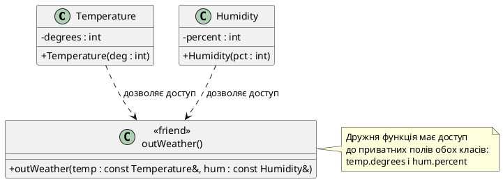

# Дружні функції та класи

## Проблема непорушності інкапсуляції

До цього моменту ми розглянули інкапсуляцію як фундаментальний принцип ООП: дані класу мають бути приховані у `private`-секції, а зовнішній світ взаємодіє з ними виключно через контрольований публічний інтерфейс. Це захищає інваріанти класу, дозволяє змінювати реалізацію без впливу на клієнтський код і знижує кількість точок зчеплення між компонентами системи.

Але реальні програми рідко складаються з ідеально ізольованих, самодостатніх класів. Іноді дві сутності настільки тісно пов'язані на концептуальному рівні, що штучна ізоляція через `public`-методи стає не захистом, а обтяженням. Розглянемо конкретний сценарій.

Нехай у нас є клас `Fraction`, що представляє звичайний дріб із чисельником і знаменником:

```cpp
class Fraction
{
private:
    int numerator;
    int denominator;

public:
    Fraction(int num = 0, int den = 1)
        : numerator(num), denominator(den)
    {
        if (denominator == 0)
        {
            denominator = 1;  // захист від ділення на нуль
        }
    }

    void print() const
    {
        std::cout << numerator << "/" << denominator;
    }
};
```

Тепер припустімо, що нам потрібна функція, яка перевіряє рівність двох дробів. Природний інтерфейс такої функції — вільна функція, що приймає два об'єкти та повертає `bool`:

```cpp
bool isEqual(const Fraction& a, const Fraction& b);
```

Чому вільна функція, а не метод `a.isEqual(b)`? По-перше, математично рівність — це симетричне відношення: `a == b` те саме, що `b == a`. Запис `isEqual(a, b)` підкреслює цю симетрію краще, ніж асиметричний `a.isEqual(b)`. По-друге, у майбутньому ми захочемо перевантажити оператор `==`, а бінарний оператор порівняння природно реалізувати саме як вільну функцію або через `friend`.

Але як реалізувати `isEqual()`? Два дроби рівні, якщо їх чисельники та знаменники співпадають після скорочення. Найпростіше — порівняти добутки «навхрест»: `a.numerator * b.denominator == b.numerator * a.denominator`. Проблема: поля `numerator` і `denominator` — приватні. Функція `isEqual()` не має доступу до них.

Перший спосіб — додати публічні геттери:

```cpp
class Fraction
{
private:
    int numerator;
    int denominator;

public:
    // ... конструктор

    int getNumerator() const   { return numerator; }
    int getDenominator() const { return denominator; }
};

bool isEqual(const Fraction& a, const Fraction& b)
{
    return a.getNumerator() * b.getDenominator() ==
           b.getNumerator() * a.getDenominator();
}
```

Це працює. Але чи дійсно `getNumerator()` і `getDenominator()` повинні бути частиною публічного інтерфейсу? Якщо ці методи існують виключно для того, щоб одна функція `isEqual()` могла виконати свою роботу — ми розширили публічний інтерфейс не для потреб клієнтів класу, а заради внутрішніх технічних обставин. Це порушує принцип найменших привілеїв (*principle of least privilege*): інтерфейс класу став ширшим, ніж насправді потрібно. Кожен публічний метод — це зобов'язання підтримувати його поведінку назавжди.

::note
**Принцип найменших привілеїв** стверджує: кожен компонент системи має мати доступ лише до тих ресурсів і операцій, які йому безпосередньо потрібні для виконання своєї функції — і не більше. У контексті класів це означає: публічний інтерфейс має бути мінімальним і відображати логічні операції над об'єктом, а не внутрішню структуру даних.
::

Є й друга проблема: геттери роблять внутрішню структуру даних видимою назовні. Якщо ми вирішимо рефакторити `Fraction` — скажімо, зберігати дріб у вигляді єдиного числа `double` замість двох `int` — всі клієнти, що викликають `getNumerator()`, зламаються або вимагатимуть емуляції старого інтерфейсу.

Потрібен механізм, що дозволяє одній, чітко визначеній зовнішній функції отримати **контрольований доступ до приватних членів класу**, не відкриваючи цього доступу всьому світу через публічні геттери. Саме для цього C++ пропонує **дружні функції** (*friend functions*).

---

## Дружня функція: синтаксис та семантика

**Дружня функція** (friend function) — це звичайна вільна функція, яка оголошена класом як «друг» і завдяки цьому має доступ до всіх приватних і захищених членів цього класу, наче вона сама є методом. У всіх інших аспектах дружня функція залишається звичайною функцією: вона не має неявного покажчика `this`, не належить класу, не успадковується.

Синтаксис оголошення дружньої функції:

```cpp
class ClassName
{
private:
    // ... приватні поля

public:
    // ... публічні методи

    // Оголошення дружньої функції — може бути у будь-якій секції
    friend returnType functionName(parameters);
};
```

Ключове слово `friend` може стояти у будь-якій секції класу — `public`, `private` чи `protected` — це не впливає на доступність функції ззовні. Дружба — це **однобічна довіра**, яку клас надає функції, а не права, які функція отримує від клієнтів класу. Прийнято розміщувати оголошення `friend`-функцій у `public`-секції, щоб вони були на виду.

Тепер перепишемо приклад із `Fraction`:

```cpp [FractionFriend.cpp] showLineNumbers
#include <iostream>

class Fraction
{
private:
    int numerator;
    int denominator;

public:
    Fraction(int num = 0, int den = 1)
        : numerator(num), denominator(den)
    {
        if (denominator == 0)
        {
            denominator = 1;
        }
    }

    void print() const
    {
        std::cout << numerator << "/" << denominator;
    }

    // Оголошуємо функцію isEqual дружньою класу Fraction
    friend bool isEqual(const Fraction& a, const Fraction& b);
};

// Визначення дружньої функції — поза класом, без префіксу Fraction::
bool isEqual(const Fraction& a, const Fraction& b)
{
    // Маємо прямий доступ до приватних полів обох об'єктів
    return a.numerator * b.denominator == b.numerator * a.denominator;
}

int main()
{
    Fraction f1(1, 2);  // 1/2
    Fraction f2(2, 4);  // 2/4 = 1/2
    Fraction f3(3, 5);  // 3/5

    f1.print();
    std::cout << (isEqual(f1, f2) ? " == " : " != ");
    f2.print();
    std::cout << "\n";

    f1.print();
    std::cout << (isEqual(f1, f3) ? " == " : " != ");
    f3.print();
    std::cout << "\n";

    return 0;
}
```


::terminal-preview{title="./FractionFriend"}

<div class="line"><span class="opacity-40">$</span> <strong class="font-bold">./FractionFriend</strong></div>
<div class="line">1/2 <span class="text-green-400">==</span> 2/4</div>
<div class="line">1/2 <span class="text-red-400">!=</span> 3/5</div>
<div class="line">Execution finished with <span class="text-green-400 font-bold">exit code 0</span>.</div>
::

Зверніть увагу на рядок 25: оголошення `friend bool isEqual(...)` всередині класу. Це **не визначення функції** — лише повідомлення компілятору, що функція з такою сигнатурою має доступ до приватних полів. Саме визначення функції розміщене поза класом, на рядку 29, без префіксу `Fraction::`, бо `isEqual()` — не метод класу.

На рядку 32 функція `isEqual()` звертається до `a.numerator` і `b.denominator` — приватних полів обох об'єктів. Це можливо виключно завдяки оголошенню `friend` всередині класу `Fraction`. Будь-яка інша функція, що спробує звернутися до `a.numerator`, отримає помилку компіляції.

::tip
Дружня функція може бути оголошена у будь-якій секції класу (`public`, `private`, `protected`), і це не впливає на її доступність ззовні. Рекомендується розміщувати `friend`-оголошення у `public`-секції, щоб вони були на виду в інтерфейсі класу.
::

---

## Дружня функція та кілька класів

Одна функція може бути другом для кількох незалежних класів. Це корисно, коли функція виконує операцію, що логічно пов'язує дві різні сутності, і потребує доступу до внутрішніх даних обох.

Класичний приклад — погодна система, де температура і вологість вимірюються окремими датчиками і зберігаються у різних класах, але функція виводу повідомлення про погоду потребує доступу до обох значень:

```cpp [WeatherFriend.cpp] showLineNumbers
#include <iostream>

// Попереднє оголошення класу Humidity — інформуємо компілятор про існування типу
class Humidity;

class Temperature
{
private:
    int degrees;

public:
    Temperature(int deg = 0) : degrees(deg) {}

    // Функція outWeather — друг класу Temperature
    friend void outWeather(const Temperature& temp, const Humidity& hum);
};

class Humidity
{
private:
    int percent;

public:
    Humidity(int pct = 0) : percent(pct) {}

    // Та ж функція outWeather — друг класу Humidity
    friend void outWeather(const Temperature& temp, const Humidity& hum);
};

// Визначення дружньої функції — має доступ до приватних полів обох класів
void outWeather(const Temperature& temp, const Humidity& hum)
{
    std::cout << "Temperature: " << temp.degrees << "°C, "
              << "Humidity: " << hum.percent << "%\n";
}

int main()
{
    Temperature currentTemp(22);
    Humidity currentHum(65);

    outWeather(currentTemp, currentHum);

    return 0;
}
```

::terminal-preview{title="./WeatherFriend"}

<div class="line"><span class="opacity-40">$</span> <strong class="font-bold">./WeatherFriend</strong></div>
<div class="line">Temperature: <span class="text-blue-400">22</span>°C, Humidity: <span class="text-blue-400">65</span>%</div>
<div class="line">Execution finished with <span class="text-green-400 font-bold">exit code 0</span>.</div>
::

Два моменти, на які варто звернути увагу.

**По-перше**, рядок 4: `class Humidity;` — це **попереднє оголошення** (forward declaration) класу Humidity. Воно необхідне, бо на рядку 15, всередині визначення класу `Temperature`, ми згадуємо тип `Humidity` у сигнатурі дружньої функції. Компілятор на цьому етапі ще не бачив повного визначення `Humidity` (воно йде лише на рядку 18), але йому достатньо знати, що такий тип існує — деталі структури не потрібні.

Попереднє оголошення класу виконує ту саму роль, що й прототип функції: повідомляє компілятору про об'єкт, який буде визначено пізніше, але який потрібно згадати зараз. Синтаксис: `class ClassName;` — ключове слово `class`, ім'я класу, крапка з комою.

**По-друге**, оголошення `friend void outWeather(...)` присутнє **в обох класах** — на рядку 15 у `Temperature` і на рядку 28 у `Humidity`. Це не помилка і не дублювання. Кожен клас самостійно вирішує, кому він довіряє. Функція `outWeather()` отримує доступ до приватних полів `Temperature` завдяки рядку 15 і доступ до приватних полів `Humidity` завдяки рядку 28. Якби одне з цих оголошень було відсутнє, функція не змогла б звернутися до відповідних приватних полів.

::note
**Дружба не транзитивна**: якщо клас A оголосив функцію F своїм другом, а клас B оголосив функцію G своїм другом, це не означає, що F автоматично стає другом B, або що G стає другом A. Кожна дружня відношення встановлюється явно і незалежно.
::

---

## Дружні класи

Окрім окремих функцій, клас може оголосити **цілий інший клас** своїм другом. У такому випадку **всі методи** класу-друга отримують доступ до приватних членів першого класу.

Синтаксис дружнього класу:

```cpp
class A
{
private:
    int secretData;

public:
    // Клас B тепер друг класу A — усі методи B мають доступ до secretData
    friend class B;
};
```

Розглянемо класичний приклад: клас `Values`, що зберігає пару значень `int` і `double`, та клас `Display`, що відповідає за виведення цих значень на екран. Логіка виводу є складною: Display вирішує, яке значення показувати першим, додає форматування, вирівнювання — все це щільно прив'язано до структури даних Values. Замість створювати геттери для кожного поля, ми робимо `Display` другом `Values`:

```cpp [DisplayFriend.cpp] showLineNumbers
#include <iostream>

class Values
{
private:
    int intValue;
    double doubleValue;

public:
    Values(int iv, double dv) : intValue(iv), doubleValue(dv) {}

    // Клас Display — друг класу Values
    friend class Display;
};

class Display
{
private:
    bool showIntFirst;

public:
    Display(bool intFirst) : showIntFirst(intFirst) {}

    void show(const Values& values) const
    {
        // Маємо доступ до приватних полів values
        if (showIntFirst)
        {
            std::cout << "Integer: " << values.intValue
                      << ", Double: " << values.doubleValue << "\n";
        }
        else
        {
            std::cout << "Double: " << values.doubleValue
                      << ", Integer: " << values.intValue << "\n";
        }
    }
};

int main()
{
    Values data(42, 3.14);
    Display displayIntFirst(true);
    Display displayDoubleFirst(false);

    displayIntFirst.show(data);
    displayDoubleFirst.show(data);

    return 0;
}
```


::terminal-preview{title="./DisplayFriend"}

<div class="line"><span class="opacity-40">$</span> <strong class="font-bold">./DisplayFriend</strong></div>
<div class="line">Integer: <span class="text-blue-400">42</span>, Double: <span class="text-blue-400">3.14</span></div>
<div class="line">Double: <span class="text-blue-400">3.14</span>, Integer: <span class="text-blue-400">42</span></div>
<div class="line">Execution finished with <span class="text-green-400 font-bold">exit code 0</span>.</div>
::

На рядку 13 клас `Values` оголошує `Display` своїм другом: `friend class Display;`. Це означає, що будь-який метод класу `Display` — зараз чи у майбутньому — може звертатися до `intValue` і `doubleValue` безпосередньо. Рядки 29 і 34 демонструють цей доступ: метод `Display::show()` читає приватні поля об'єкта `values`.

### Властивості дружби між класами

Дружба класів має кілька фундаментальних властивостей, що відрізняють її від звичайних відношень ООП (наслідування, композиції):

**1. Дружба не взаємна.** Якщо клас A оголосив клас B своїм другом, це **не** означає, що B автоматично стає другом A. Дружба — це однобічна довіра, яку один клас надає іншому. Щоб зробити довіру взаємною, обидва класи мають містити відповідні `friend`-оголошення:

```cpp
class A
{
    friend class B;  // B має доступ до приватних членів A
};

class B
{
    friend class A;  // A має доступ до приватних членів B
};
```

**2. Дружба не транзитивна.** Якщо A — друг B, а B — друг C, це **не** означає, що A автоматично друг C. Кожна дружня відношення встановлюється явно і незалежно.

**3. Дружба не успадковується.** Якщо клас A оголосив клас B своїм другом, а клас D успадкований від B, клас D **не** стає автоматично другом A. Дружба не передається у спадок.

::warning
Дружні класи створюють **щільне зчеплення** (tight coupling) між двома типами: зміна внутрішньої реалізації одного класу може вимагати змін у класі-другові. Якщо клас `Values` змінить внутрішнє представлення даних, всі методи `Display`, що звертаються до цих полів, доведеться переписати. Це робить код менш гнучким і ускладнює рефакторинг. Використовуйте дружні класи лише тоді, коли два типи **концептуально нерозривні** і завжди еволюціонують разом.
::

---

## Дружній метод (окремий метод іншого класу)

Іноді потрібно надати доступ до приватних полів не цілому класу, а лише **одному конкретному методу** іншого класу. Це забезпечує точніший контроль: замість того, щоб відкривати дані всім методам класу-друга, ми відкриваємо їх лише тому методу, якому вони дійсно потрібні.

Синтаксис оголошення дружнього методу:

```cpp
class A
{
    // Лише метод B::specificMethod() — друг A, решта методів B — ні
    friend void B::specificMethod();
};
```

Розглянемо приклад із попереднього розділу, але замість того, щоб робити весь клас `Display` другом `Values`, зробимо другом лише метод `Display::show()`:

```cpp [DisplayMethodFriend.cpp] showLineNumbers
#include <iostream>

// Попереднє оголошення класу Display
class Display;

class Values
{
private:
    int intValue;
    double doubleValue;

public:
    Values(int iv, double dv) : intValue(iv), doubleValue(dv) {}

    // Лише метод Display::show() — друг класу Values
    friend void Display::show(const Values& values) const;
};

class Display
{
private:
    bool showIntFirst;

public:
    Display(bool intFirst) : showIntFirst(intFirst) {}

    // Оголошення методу — визначення буде пізніше, після Values
    void show(const Values& values) const;
};

// Визначення методу Display::show() — тепер Values повністю видимий
void Display::show(const Values& values) const
{
    if (showIntFirst)
    {
        std::cout << "Integer: " << values.intValue
                  << ", Double: " << values.doubleValue << "\n";
    }
    else
    {
        std::cout << "Double: " << values.doubleValue
                  << ", Integer: " << values.intValue << "\n";
    }
}

int main()
{
    Values data(42, 3.14);
    Display displayIntFirst(true);

    displayIntFirst.show(data);

    return 0;
}
```

::terminal-preview{title="./DisplayMethodFriend"}

<div class="line"><span class="opacity-40">$</span> <strong class="font-bold">./DisplayMethodFriend</strong></div>
<div class="line">Integer: <span class="text-blue-400">42</span>, Double: <span class="text-blue-400">3.14</span></div>
<div class="line">Execution finished with <span class="text-green-400 font-bold">exit code 0</span>.</div>
::

Цей приклад містить складну **хореографію попередніх оголошень і визначень**, характерну для дружніх методів. Розберемо її крок за кроком.

**Рядок 4:** `class Display;` — попереднє оголошення класу Display. Воно необхідне для рядка 16.

**Рядок 16:** `friend void Display::show(...);` — оголошення дружнього методу всередині класу `Values`. Щоб компілятор зрозумів `Display::show`, йому потрібно знати, що клас `Display` існує (звідси попереднє оголошення на рядку 4). Проте компілятору **не потрібно** знати повну структуру `Display` — достатньо знати його ім'я.

**Рядок 19–29:** повне визначення класу `Display`. Зверніть увагу, що метод `show()` **оголошений** всередині класу (рядок 29), але **не визначений** там. Визначення винесено за межі класу.

**Чому не можна визначити `show()` всередині класу Display?** Тому що `show()` звертається до приватних полів `values.intValue` і `values.doubleValue`. Щоб ці звернення були дозволені, компілятор повинен побачити оголошення `friend` всередині класу `Values`. Але на момент, коли компілятор обробляє тіло класу `Display` (рядки 19–29), він ще **не бачив** повного визначення класу `Values` (воно закінчується на рядку 17). Звідси правило: визначення дружнього методу має йти **після** повного визначення класу, якому цей метод є другом.

**Рядок 33–45:** визначення методу `Display::show()` **після** повних визначень обох класів. Тепер компілятор знає, що `Display::show()` — друг `Values`, і дозволяє звернення до приватних полів.

::note
Дружній метод вимагає обережного порядку оголошень: попереднє оголошення класу, оголошення дружнього методу всередині класу-власника приватних даних, повне визначення класу, що містить дружній метод (але без визначення самого методу), а вже потім — визначення дружнього методу. У реальних проєктах це спрощується розподілом на `.h` і `.cpp` файли: `.h` містить оголошення, `.cpp` — визначення.
::

---

## Порядок оголошень при використанні друзів: танець попередніх декларацій

Коли дружні функції чи методи працюють із кількома класами, порядок оголошень може здатися заплутаним. Наведемо загальний рецепт для найскладнішого випадку — дружнього методу одного класу до іншого класу:

::steps

### Крок 1. Попереднє оголошення залежних класів
Якщо клас A згадує клас B у дружньому оголошенні, компілятору достатньо знати, що B існує. Починайте файл із попередніх оголошень усіх класів:

```cpp
class Display;
class Values;
```

### Крок 2. Визначення класу-власника приватних даних
Оголосіть клас, що надає доступ до своїх приватних членів, із `friend`-оголошенням:

```cpp
class Values
{
private:
    int data;
public:
    friend void Display::show(const Values&);
};
```

### Крок 3. Повне визначення класу, що містить дружній метод
Оголосіть клас-друг із прототипом дружнього методу, але без його визначення:

```cpp
class Display
{
public:
    void show(const Values& v);  // прототип, не визначення
};
```

### Крок 4. Визначення дружнього методу
Тепер, коли обидва класи повністю визначені, реалізуйте дружній метод:

```cpp
void Display::show(const Values& v)
{
    std::cout << v.data;  // доступ до приватного поля
}
```

::

У реальних проєктах цей «танець» спрощується розподілом коду на файли:

- `Values.h` — оголошення класу Values із `friend`-декларацією
- `Display.h` — оголошення класу Display із прототипом методу `show()`
- `Display.cpp` — визначення методу `Display::show()`, що включає `Values.h`

Завдяки такому розподілу всі класи «бачать» один одного через include-директиви, і ніякого ручного упорядкування не потрібно.

---

## Коли використовувати `friend`, а коли — ні

Дружні функції та класи — потужний механізм, але він порушує інкапсуляцію у тому сенсі, що зовнішній код отримує прямий доступ до внутрішніх даних. Це не завжди погано — але потребує виправдання. Ось загальні сценарії, коли `friend` доцільний:


::card-group

::card{title="✅ Перевантаження операторів" icon="i-lucide-check-circle"}

Найпоширеніший випадок: перевантаження бінарних операторів (`+`, `-`, `*`, `==`) природно реалізувати як вільні функції, щоб забезпечити симетричність `a + b` і `b + a`. Такі функції потребують доступу до приватних полів обох операндів — `friend` дозволяє це без створення геттерів.

```cpp
class Complex
{
private:
    double real, imag;
public:
    friend Complex operator+(const Complex& a, const Complex& b);
};
```

::

::card{title="✅ Оператори потоків (<<, >>)" icon="i-lucide-check-circle"}

Перевантаження `operator<<` для виводу об'єкта у `std::ostream` та `operator>>` для вводу з `std::istream` **обов'язково** реалізуються як вільні функції (бо лівий операнд — потік, а не ваш клас). Доступ до приватних полів через `friend` дозволяє ефективно форматувати вивід.

```cpp
class Point
{
private:
    int x, y;
public:
    friend std::ostream& operator<<(std::ostream& out, const Point& p);
};
```

::

::card{title="✅ Тісно пов'язані класи" icon="i-lucide-check-circle"}

Коли два класи концептуально нерозривні (наприклад, `Iterator` і `Container`, `Node` і `LinkedList`), один з них може бути другом іншого. Це доцільно, якщо альтернатива — десятки дрібних геттерів, що роблять внутрішню структуру видимою всьому світу.

```cpp
class LinkedList
{
private:
    struct Node { int data; Node* next; };
    Node* head;
public:
    friend class Iterator;
};
```

::

::card{title="✅ Функції тестування (unit tests)" icon="i-lucide-check-circle"}

У тестових фреймворках дружні функції дозволяють тестам перевіряти внутрішній стан об'єкта без розширення публічного інтерфейсу. Це особливо корисно для приватних допоміжних методів, що не мають бути доступні клієнтам, але повинні бути покриті тестами.

```cpp
class BankAccount
{
private:
    double balance;
public:
    friend class BankAccountTest;  // тестовий клас має доступ
};
```

::

::

::card-group

::card{title="❌ Уникати: геттери через friend" icon="i-lucide-x-circle"}

Якщо єдина причина зробити функцію дружньою — уникнути написання геттерів, краще написати геттери. `friend` не економить код, а робить залежності менш явними.

```cpp
// ❌ Погано — friend замість простого геттера
class Rectangle
{
private:
    int width, height;
public:
    friend int calculateArea(const Rectangle& r);
};

// ✅ Краще — публічний геттер
class Rectangle
{
private:
    int width, height;
public:
    int getWidth() const { return width; }
    int getHeight() const { return height; }
};
```

::

::card{title="❌ Уникати: широка дружба" icon="i-lucide-x-circle"}

Якщо ви оголошуєте друзями десятки функцій або класів, це ознака проблеми у дизайні. Чим більше друзів має клас, тим слабша інкапсуляція і тим складніше рефакторити приватні поля — кожна зміна впливає на всіх друзів.

::

::card{title="❌ Уникати: friend як «hack»" icon="i-lucide-x-circle"}

Якщо ви додаєте `friend`, бо «інакше не компілюється» або «не знаю, як по-іншому» — зупиніться. `friend` — це усвідомлене рішення про архітектуру, а не обхідний шлях.

::

::

---

## Перевантаження операторів та `friend`: попередній погляд

Найпоширеніше застосування дружніх функцій у C++ — перевантаження операторів. Хоча тема перевантаження операторів докладно розглядається у наступних статтях (статті 63–65), корисно вже зараз побачити, чому саме `friend` там критично важливий.

Припустімо, ми хочемо перевантажити оператор `+` для класу `Fraction`:

```cpp
Fraction f1(1, 2);  // 1/2
Fraction f2(1, 3);  // 1/3
Fraction f3 = f1 + f2;  // має дати 5/6
```

Є два способи перевантажити бінарний оператор: як метод класу або як вільна функція.

**Спосіб 1 — метод класу:**

```cpp
class Fraction
{
private:
    int numerator, denominator;
public:
    Fraction operator+(const Fraction& other) const
    {
        // this->numerator доступний (ми всередині класу)
        // other.numerator доступний (other — той самий клас)
        return Fraction(
            numerator * other.denominator + other.numerator * denominator,
            denominator * other.denominator
        );
    }
};
```

Це працює для `f1 + f2`, що компілятор перетворює у `f1.operator+(f2)`. Але якщо ми хочемо додати дріб і ціле число: `f1 + 2`, нам потрібен другий перевантажений метод. А що з `2 + f1`? Це компілятор спробує перетворити у `2.operator+(f1)`, але `int` — вбудований тип, і ми не можемо додати до нього методи.

**Спосіб 2 — вільна функція:**

```cpp
class Fraction
{
private:
    int numerator, denominator;
public:
    friend Fraction operator+(const Fraction& a, const Fraction& b);
    friend Fraction operator+(const Fraction& a, int b);
    friend Fraction operator+(int a, const Fraction& b);
};

Fraction operator+(const Fraction& a, const Fraction& b)
{
    return Fraction(
        a.numerator * b.denominator + b.numerator * a.denominator,
        a.denominator * b.denominator
    );
}

Fraction operator+(const Fraction& a, int b)
{
    return a + Fraction(b, 1);  // зводимо до Fraction + Fraction
}

Fraction operator+(int a, const Fraction& b)
{
    return Fraction(a, 1) + b;
}
```

Тепер працюють всі три варіанти: `f1 + f2`, `f1 + 2`, `2 + f1`. Вільна функція симетрична: обидва операнди мають однакову роль, і компілятор може виконати неявні перетворення для будь-якого з них.

::note
Оператори `<<` і `>>` для потоків `std::ostream` і `std::istream` **обов'язково** реалізуються як вільні функції, бо лівий операнд — це потік (об'єкт класу `std::ostream`), а не ваш клас. Ви не можете додати метод у стандартний клас `std::ostream`, тому єдиний спосіб — вільна дружня функція.
::

---

## Практичне завдання: система координат у 3D-просторі

Щоб закріпити матеріал, реалізуємо невелику систему для роботи з геометрією у тривимірному просторі. **Точка** (*point*) у геометрії — це позиція, що має координати `x`, `y`, `z`. **Вектор** (*vector*) у фізиці — це напрямок і величина, також представлені трійкою чисел `x`, `y`, `z`.

Вектор можна **застосувати** до точки, щоб перемістити її: якщо до точки `(1, 2, 3)` застосувати вектор `(0, 1, 0)`, отримаємо нову точку `(1, 3, 3)`. Ця операція — додавання покомпонентне: `Point(x1, y1, z1) + Vector(x2, y2, z2) = Point(x1+x2, y1+y2, z1+z2)`.

Реалізуємо два класи — `Point3D` і `Vector3D` — з дружніми функціями:

```cpp [Geometry3D.cpp] showLineNumbers
#include <iostream>

class Vector3D;  // попереднє оголошення

class Point3D
{
private:
    double x, y, z;

public:
    Point3D(double xCoord = 0.0, double yCoord = 0.0, double zCoord = 0.0)
        : x(xCoord), y(yCoord), z(zCoord)
    {
    }

    void print() const
    {
        std::cout << "Point(" << x << ", " << y << ", " << z << ")";
    }

    // Дружня функція для застосування вектора до точки
    friend Point3D applyVector(const Point3D& point, const Vector3D& vector);
};

class Vector3D
{
private:
    double x, y, z;

public:
    Vector3D(double xComp = 0.0, double yComp = 0.0, double zComp = 0.0)
        : x(xComp), y(yComp), z(zComp)
    {
    }

    void print() const
    {
        std::cout << "Vector(" << x << ", " << y << ", " << z << ")";
    }

    // Та сама функція — друг класу Vector3D
    friend Point3D applyVector(const Point3D& point, const Vector3D& vector);
};

// Визначення дружньої функції — має доступ до приватних полів обох класів
Point3D applyVector(const Point3D& point, const Vector3D& vector)
{
    return Point3D(
        point.x + vector.x,
        point.y + vector.y,
        point.z + vector.z
    );
}

int main()
{
    Point3D origin(0.0, 0.0, 0.0);
    Vector3D offset(3.0, 4.0, 5.0);

    std::cout << "Початкова точка: ";
    origin.print();
    std::cout << "\n";

    std::cout << "Застосовуємо вектор: ";
    offset.print();
    std::cout << "\n";

    Point3D moved = applyVector(origin, offset);

    std::cout << "Результат: ";
    moved.print();
    std::cout << "\n";

    return 0;
}
```

::terminal-preview{title="./Geometry3D"}

<div class="line"><span class="opacity-40">$</span> <strong class="font-bold">./Geometry3D</strong></div>
<div class="line">Початкова точка: Point(<span class="text-blue-400">0</span>, <span class="text-blue-400">0</span>, <span class="text-blue-400">0</span>)</div>
<div class="line">Застосовуємо вектор: Vector(<span class="text-blue-400">3</span>, <span class="text-blue-400">4</span>, <span class="text-blue-400">5</span>)</div>
<div class="line">Результат: Point(<span class="text-blue-400">3</span>, <span class="text-blue-400">4</span>, <span class="text-blue-400">5</span>)</div>
<div class="line">Execution finished with <span class="text-green-400 font-bold">exit code 0</span>.</div>
::

Функція `applyVector()` є другом обох класів (рядки 22 і 43). Завдяки цьому вона може читати приватні поля `point.x`, `point.y`, `point.z` і `vector.x`, `vector.y`, `vector.z` (рядки 49–51) без геттерів.

::accordion

::accordion-item{label="🎯 Завдання: метод замість функції" icon="i-lucide-lightbulb"}

Перепишіть приклад так, щоб замість вільної функції `applyVector()` клас `Point3D` мав метод `moveBy(const Vector3D& vector)`, що є другом класу `Vector3D`. Метод повинен змінювати координати точки на місці, а не повертати нову точку.

**Підказка:** метод буде виглядати так:

```cpp
class Point3D
{
public:
    void moveBy(const Vector3D& vector);
};

class Vector3D
{
    friend void Point3D::moveBy(const Vector3D& vector);
};

void Point3D::moveBy(const Vector3D& vector)
{
    x += vector.x;
    y += vector.y;
    z += vector.z;
}
```

::

::accordion-item{label="🤔 Чому не можна обійтися без friend?" icon="i-lucide-help-circle"}

Якщо б клас `Vector3D` мав публічні геттери `getX()`, `getY()`, `getZ()`, функція `applyVector()` могла б працювати без `friend`. Але геттери роблять внутрішню структуру даних видимою всім клієнтам класу. Якщо ми вирішимо змінити представлення вектора (наприклад, зберігати його у сферичних координатах), всі клієнти, що викликають `getX()`, зламаються. `friend` дозволяє відкрити дані лише одній функції, залишаючи решту світу ізольованою.

::

::

---

## Резюме: баланс між інкапсуляцією та прагматизмом

Дружні функції та класи — це інструмент, що дозволяє контрольовано порушувати інкапсуляцію, коли альтернатива — розширення публічного інтерфейсу або дублювання коду — гірша.


::card-group

::card{title="🔑 Дружня функція" icon="i-lucide-key"}

Вільна функція, оголошена класом через `friend`, що має доступ до приватних і захищених членів цього класу. Не є методом класу, не має `this`, не успадковується.

**Коли використовувати:** перевантаження симетричних бінарних операторів, функції, що працюють із кількома класами.

::

::card{title="🔑 Дружній клас" icon="i-lucide-users"}

Клас, оголошений через `friend class ClassName`, всі методи якого мають доступ до приватних членів класу-друга.

**Коли використовувати:** тісно пов'язані класи (ітератор і контейнер, node і список), коли альтернатива — десятки дрібних геттерів.

::

::card{title="🔑 Дружній метод" icon="i-lucide-function-square"}

Конкретний метод іншого класу, оголошений через `friend ReturnType ClassName::methodName(...)`, що має доступ до приватних членів.

**Коли використовувати:** точковий доступ — лише один метод потребує доступу, решта методів класу — ні.

::

::card{title="⚠️ Властивості дружби" icon="i-lucide-info"}

- **Не взаємна:** A друг B ≠ B друг A
- **Не транзитивна:** A друг B, B друг C ≠ A друг C
- **Не успадковується:** якщо B друг A, похідний від B клас D не стає другом A
- **Створює зчеплення:** зміни у класі впливають на всіх друзів

::

::

---

## Діаграма класів із дружніми відношеннями

Наступна діаграма показує структуру прикладу з класами `Temperature`, `Humidity` та дружньою функцією `outWeather`:

::plant-uml{alt="Діаграма класів із дружньою функцією"}



::

Стрілки від `Temperature` і `Humidity` до `outWeather` показують, що обидва класи **надають доступ** дружній функції. Дружня функція не належить жодному класу, але може читати приватні поля обох.

---

## Анонс наступної статті

У цій статті ми розглянули, як надати зовнішній функції чи класу доступ до приватних членів через механізм `friend`. Це особливо корисно для перевантаження операторів — теми, яку ми почнемо вивчати через кілька статей (статті 63–65).

Але перед тим, як перейти до перевантаження операторів, нам потрібно розглянути ще кілька фундаментальних механізмів класів. У **наступній статті (стаття 61)** ми познайомимося з **анонімними об'єктами** — тимчасовими об'єктами без імені, що створюються «на льоту» для передачі у функції або повернення з них. Ми також вивчимо **вкладені типи** — `enum`, `struct` і `class` всередині іншого класу — механізм, що дозволяє інкапсулювати допоміжні типи даних і зменшити забруднення глобального простору імен.

Анонімні об'єкти та вкладені типи — це дві техніки, що роблять код компактнішим і виразнішим, а їхнє розуміння критично важливе для ефективної роботи з перевантаженням операторів і конструктором копіювання у подальших статтях.

::tip
**Практична порада:** коли ви дивитеся на сторонній код і бачите `friend`, поставте собі три питання:
1. Чи дійсно ця функція/клас потребує доступу до приватних членів?
2. Чи є альтернатива через публічні методи без розширення інтерфейсу?
3. Чи будуть два типи завжди еволюціонувати разом (тісно пов'язані), чи це випадкова залежність?

Якщо відповіді «так», «ні», «разом» — `friend` виправданий. Інакше — шукайте інший дизайн.
::
