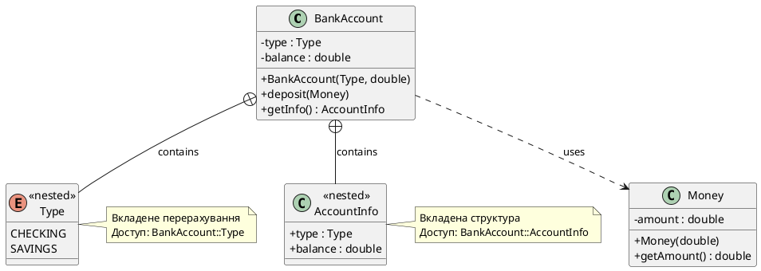

# Анонімні об'єкти та вкладені типи

## Тимчасові змінні: коли ім'я зайве

Більшість змінних у програмі мають **семантичне значення** — їхнє ім'я відображає роль у бізнес-логіці. Змінна `userBalance` зберігає баланс користувача, `validationResult` — результат перевірки форми, `currentTemperature` — поточну температуру сенсора. Ім'я змінної — це частина документації: воно пояснює код без коментарів.

Але іноді змінна існує виключно як **проміжний носій значення**, що не має власної семантики. Розглянемо просту функцію додавання:

```cpp
int add(int a, int b)
{
    int result = a + b;
    return result;
}
```

Змінна `result` тут — це «технічна» змінна. Вона не представляє жодної бізнес-сутності, не зберігається між викликами функції, не використовується у кількох місцях. Єдина причина її існування — C++ вимагає явного оператора `return`, і ми не можемо написати `return a + b;` без створення проміжного значення. Насправді, ми можемо:

```cpp
int add(int a, int b)
{
    return a + b;  // Анонімне значення — результат виразу a + b
}
```

Компілятор обчислює `a + b`, поміщає результат у **тимчасовий, неіменований об'єкт** (анонімний об'єкт, *temporary object*), копіює його значення у повернення функції, а потім знищує тимчасовий об'єкт. Все це відбувається без участі програміста. Код стає лаконічнішим — немає змінної `result`, яка захаращує простір імен і створює ілюзію, що вона має значення.

Анонімні об'єкти — це фундаментальна частина семантики C++, що виходить далеко за межі простих арифметичних виразів. Вони використовуються при передачі аргументів у функції, поверненні значень із функцій, створенні тимчасових об'єктів класів для одноразових операцій. Розуміння їх поведінки критично важливе для написання ефективного коду та уникнення тонких помилок із часом життя об'єктів.

::note
**Анонімний об'єкт** (anonymous object, temporary object) — це значення без імені, що має **область видимості виразу** (*expression scope*). Воно створюється, використовується та знищується в межах одного виразу. Оскільки об'єкт не має імені, немає способу посилатися на нього за межами місця створення.
::

---

## Анонімні об'єкти у виразах

Найпростіший випадок анонімного об'єкта — результат арифметичного або логічного виразу:

```cpp [AnonymousExpressions.cpp] showLineNumbers
#include <iostream>

int main()
{
    // Вираз 5 + 3 створює анонімний int зі значенням 8
    std::cout << 5 + 3 << "\n";

    // Вираз 10 > 5 створює анонімний bool зі значенням true
    if (10 > 5)
    {
        std::cout << "Condition is true\n";
    }

    // Множинні анонімні об'єкти у складному виразі
    std::cout << (2 + 3) * (4 - 1) << "\n";  // (5) * (3) = 15

    return 0;
}
```

::terminal-preview{title="./AnonymousExpressions"}

<div class="line"><span class="opacity-40">$</span> <strong class="font-bold">./AnonymousExpressions</strong></div>
<div class="line"><span class="text-blue-400">8</span></div>
<div class="line">Condition is true</div>
<div class="line"><span class="text-blue-400">15</span></div>
<div class="line">Execution finished with <span class="text-green-400 font-bold">exit code 0</span>.</div>
::

**Рядок 6:** вираз `5 + 3` обчислюється компілятором або під час виконання (залежно від оптимізацій), результат поміщається у тимчасовий `int`, який передається у `std::cout`. Після виконання рядка тимчасовий об'єкт знищується.

**Рядок 9:** вираз `10 > 5` створює анонімний `bool` зі значенням `true`. Цей об'єкт існує лише для умови `if` — після переходу у тіло блоку він вже не існує.

**Рядок 15:** складний вираз містить **чотири** анонімні об'єкти: `(2 + 3)` → 5, `(4 - 1)` → 3, `5 * 3` → 15, і фінальний результат 15 передається у `std::cout`.

Кожен із цих анонімних об'єктів — це реальний об'єкт у пам'яті (або у регістрі процесора), але компілятор керує ним автоматично. Немає необхідності оголошувати змінні типу `int temp1 = 2 + 3; int temp2 = 4 - 1; int temp3 = temp1 * temp2;` — анонімні об'єкти виконують цю роль неявно.

---

## Передача анонімних об'єктів у функції

Анонімні об'єкти особливо корисні при передачі аргументів у функції. Замість створення іменованої змінної, що використовується один раз, можна передати результат виразу безпосередньо:

```cpp [AnonymousArguments.cpp] showLineNumbers
#include <iostream>

void printValue(int value)
{
    std::cout << "Value: " << value << "\n";
}

int square(int x)
{
    return x * x;
}

int main()
{
    // Спосіб 1: іменована змінна (багатослівний)
    int result = 4 + 2;
    printValue(result);

    // Спосіб 2: анонімний об'єкт (лаконічний)
    printValue(4 + 2);

    // Можна передавати результат іншої функції
    printValue(square(5));

    // Або навіть складний вираз
    printValue(square(3) + square(4));  // 9 + 16 = 25

    return 0;
}
```

::terminal-preview{title="./AnonymousArguments"}

<div class="line"><span class="opacity-40">$</span> <strong class="font-bold">./AnonymousArguments</strong></div>
<div class="line">Value: <span class="text-blue-400">6</span></div>
<div class="line">Value: <span class="text-blue-400">6</span></div>
<div class="line">Value: <span class="text-blue-400">25</span></div>
<div class="line">Value: <span class="text-blue-400">25</span></div>
<div class="line">Execution finished with <span class="text-green-400 font-bold">exit code 0</span>.</div>
::

**Рядок 16–17:** класичний підхід — створюємо змінну `result`, ініціалізуємо її, передаємо у функцію. Змінна займає місце у стеку, має ім'я, існує до кінця блоку — все це для одноразового використання.

**Рядок 20:** анонімний об'єкт — вираз `4 + 2` обчислюється, результат копіюється у параметр `value` функції `printValue()`, тимчасовий об'єкт знищується. Ніяких зайвих змінних.

**Рядок 23:** функція `square(5)` повертає анонімний `int` зі значенням 25, який одразу передається у `printValue()`. Це ланцюгова передача анонімних значень.

**Рядок 26:** складний вираз `square(3) + square(4)` створює кілька анонімних об'єктів: результат `square(3)` → 9, результат `square(4)` → 16, сума → 25. Фінальний анонімний об'єкт передається у `printValue()`.

::tip
**Коли використовувати іменовані змінні, а коли — анонімні об'єкти?** Якщо значення використовується **один раз** і не має семантичного значення (це просто проміжний результат обчислення), анонімний об'єкт робить код чистішим. Якщо значення використовується **кілька разів** або його **ім'я пояснює логіку** (наприклад, `userAge`, `validationResult`), створіть іменовану змінну.
::

---

## Повернення анонімних об'єктів із функцій

Повернення значень із функцій — ще одна область, де анонімні об'єкти роблять код виразнішим. Замість створення локальної змінної, її ініціалізації та повернення, можна повернути результат виразу безпосередньо:

```cpp [AnonymousReturn.cpp] showLineNumbers
#include <iostream>

// ❌ Погано: зайва тимчасова змінна
int addVerbose(int a, int b)
{
    int result = a + b;
    return result;
}

// ✅ Добре: анонімне значення
int add(int a, int b)
{
    return a + b;  // Анонімний int — результат виразу
}

// Складніший приклад: вибір значення
int max(int a, int b)
{
    return (a > b) ? a : b;  // Тернарний оператор повертає анонімне значення
}

// Обчислення з проміжними кроками
double computeArea(double radius)
{
    const double PI = 3.14159;
    return PI * radius * radius;  // Результат множення — анонімний double
}

int main()
{
    std::cout << "5 + 3 = " << add(5, 3) << "\n";
    std::cout << "max(10, 7) = " << max(10, 7) << "\n";
    std::cout << "Area of circle (r=5) = " << computeArea(5.0) << "\n";

    // Можна одразу використати повернене значення у виразі
    std::cout << "Sum doubled: " << add(4, 6) * 2 << "\n";

    return 0;
}
```

::terminal-preview{title="./AnonymousReturn"}

<div class="line"><span class="opacity-40">$</span> <strong class="font-bold">./AnonymousReturn</strong></div>
<div class="line">5 + 3 = <span class="text-blue-400">8</span></div>
<div class="line">max(10, 7) = <span class="text-blue-400">10</span></div>
<div class="line">Area of circle (r=5) = <span class="text-blue-400">78.5398</span></div>
<div class="line">Sum doubled: <span class="text-blue-400">20</span></div>
<div class="line">Execution finished with <span class="text-green-400 font-bold">exit code 0</span>.</div>
::

**Рядки 4–8:** функція `addVerbose` створює локальну змінну `result`, що існує до кінця функції. При поверненні її значення **копіюється** у місце виклику, потім `result` знищується. Два кроки: створити змінну, скопіювати її.

**Рядки 11–14:** функція `add` повертає результат виразу `a + b` безпосередньо. Компілятор створює анонімний об'єкт із результатом, копіює його у місце виклику, знищує. Одне виразне повернення.

**Рядок 19:** тернарний оператор `(a > b) ? a : b` обчислюється у анонімний `int` — або значення `a`, або значення `b`. Результат повертається без проміжної змінної.

**Рядок 26:** складний вираз `PI * radius * radius` створює кілька анонімних `double` (результат першого множення, результат другого), фінальне значення повертається.

**Рядок 36:** повернене анонімне значення `add(4, 6)` (яке дорівнює 10) одразу використовується у множенні `* 2` — ще один анонімний об'єкт.

::caution
**Увага: висячі посилання!** Ніколи не повертайте посилання або покажчик на локальну змінну функції. Коли функція завершується, локальні змінні знищуються, і посилання стає **висячим** (*dangling reference*). Повертайте за значенням, якщо об'єкт невеликий, або використовуйте динамічну пам'ять / `std::unique_ptr` для великих об'єктів.
::

---

## Анонімні об'єкти класів

До цього моменту ми розглядали анонімні об'єкти фундаментальних типів (`int`, `double`, `bool`). Але анонімні об'єкти можуть бути будь-якого типу — включно з класами. Синтаксис створення анонімного об'єкта класу:

```cpp
ClassName(arguments);  // Створює тимчасовий об'єкт ClassName, викликає конструктор
```

Розглянемо клас `Money`, що представляє грошову суму:

```cpp [AnonymousClass.cpp] showLineNumbers
#include <iostream>

class Money
{
private:
    int dollars;

public:
    Money(int d) : dollars(d) {}

    int getDollars() const
    {
        return dollars;
    }
};

void printMoney(const Money& amount)
{
    std::cout << amount.getDollars() << " dollars\n";
}

int main()
{
    // Спосіб 1: іменований об'єкт
    Money myMoney(50);
    printMoney(myMoney);

    // Спосіб 2: анонімний об'єкт
    printMoney(Money(75));

    // Можна передавати кілька анонімних об'єктів
    printMoney(Money(100));
    printMoney(Money(200));

    return 0;
}
```


::terminal-preview{title="./AnonymousClass"}

<div class="line"><span class="opacity-40">$</span> <strong class="font-bold">./AnonymousClass</strong></div>
<div class="line"><span class="text-blue-400">50</span> dollars</div>
<div class="line"><span class="text-blue-400">75</span> dollars</div>
<div class="line"><span class="text-blue-400">100</span> dollars</div>
<div class="line"><span class="text-blue-400">200</span> dollars</div>
<div class="line">Execution finished with <span class="text-green-400 font-bold">exit code 0</span>.</div>
::

**Рядок 25–26:** створюємо іменований об'єкт `myMoney` типу `Money`, ініціалізуємо його значенням 50, передаємо у функцію. Об'єкт існує до кінця `main()`.

**Рядок 29:** `Money(75)` — це **виклик конструктора класу Money без імені об'єкта**. Компілятор створює тимчасовий об'єкт `Money`, викликає конструктор із аргументом 75, передає цей об'єкт у параметр `amount` функції `printMoney()` (через константне посилання), після завершення виклику функції анонімний об'єкт знищується.

**Рядки 32–33:** кожен виклик `printMoney(Money(...))` створює новий анонімний об'єкт. Час життя кожного — один вираз.

Анонімні об'єкти класів особливо корисні для **fluent interface** — стилю API, де методи повертають об'єкти, що дозволяє ланцюгові виклики:

```cpp
printResult(Calculator().add(5).multiply(3).subtract(2).getResult());
```

Тут `Calculator()` — анонімний об'єкт, методи `add()`, `multiply()`, `subtract()` повертають посилання на себе (або копію), фінальний `getResult()` повертає результат обчислення. Весь ланцюг існує у межах одного виразу.

---

## Час життя анонімних об'єктів

Анонімні об'єкти мають **область видимості виразу** (*expression scope*): вони знищуються наприкінці повного виразу, у якому були створені. «Повний вираз» (*full expression*) — це вираз, що не є підвиразом іншого виразу, зазвичай закінчується крапкою з комою.

```cpp [LifetimeDemo.cpp] showLineNumbers
#include <iostream>

class Tracer
{
private:
    int id;

public:
    Tracer(int id) : id(id)
    {
        std::cout << "Tracer(" << id << ") constructed\n";
    }

    ~Tracer()
    {
        std::cout << "Tracer(" << id << ") destroyed\n";
    }

    int getId() const
    {
        return id;
    }
};

void process(const Tracer& t)
{
    std::cout << "Processing Tracer " << t.getId() << "\n";
}

int main()
{
    std::cout << "=== Test 1: Single expression ===\n";
    process(Tracer(1));
    std::cout << "After process() call\n\n";

    std::cout << "=== Test 2: Named object ===\n";
    Tracer named(2);
    process(named);
    std::cout << "Before end of main\n";

    return 0;
}
```

::terminal-preview{title="./LifetimeDemo"}

<div class="line"><span class="opacity-40">$</span> <strong class="font-bold">./LifetimeDemo</strong></div>
<div class="line">=== Test 1: Single expression ===</div>
<div class="line">Tracer(<span class="text-blue-400">1</span>) constructed</div>
<div class="line">Processing Tracer <span class="text-blue-400">1</span></div>
<div class="line">Tracer(<span class="text-blue-400">1</span>) destroyed</div>
<div class="line">After process() call</div>
<div class="line"></div>
<div class="line">=== Test 2: Named object ===</div>
<div class="line">Tracer(<span class="text-blue-400">2</span>) constructed</div>
<div class="line">Processing Tracer <span class="text-blue-400">2</span></div>
<div class="line">Before end of main</div>
<div class="line">Tracer(<span class="text-blue-400">2</span>) destroyed</div>
<div class="line">Execution finished with <span class="text-green-400 font-bold">exit code 0</span>.</div>
::

**Test 1 (рядок 33):** анонімний об'єкт `Tracer(1)` створюється, передається у `process()` через константне посилання, функція виконується, вираз завершується — об'єкт знищується **одразу після виконання рядка 33**. Рядок «Tracer(1) destroyed» виводиться перед «After process() call».

**Test 2 (рядки 37–39):** іменований об'єкт `named` створюється на рядку 37 і існує до кінця блоку `main()`. Рядок «Tracer(2) destroyed» виводиться **після** «Before end of main» — об'єкт знищується лише при виході з `main()`.

::warning
**Обмеження анонімних об'єктів:** оскільки вони знищуються наприкінці виразу, ви **не можете повертати посилання або покажчик на анонімний об'єкт**. Наприклад:

```cpp
const Money& getMoney()
{
    return Money(100);  // ❌ ПОМИЛКА: повертаємо посилання на тимчасовий об'єкт
}  // Об'єкт знищується тут, посилання стає висячим
```

Викликав `getMoney()` отримує посилання на знищений об'єкт — **undefined behavior**.
::

---

## Анонімні об'єкти та rvalue

Анонімні об'єкти у C++ розглядаються як **rvalue** (*right value*) — значення, що може стояти лише **праворуч** від оператора присвоювання. На відміну від **lvalue** (*left value*) — об'єктів, що мають адресу та можуть стояти зліва від `=`.

```cpp
int x = 10;       // x — lvalue (має адресу, можна взяти &x)
int y = x + 5;    // (x + 5) — rvalue (тимчасове значення, немає адреси)

x = 20;           // ✅ lvalue зліва від =
10 = x;           // ❌ ПОМИЛКА: rvalue (літерал 10) не може бути зліва
```

Це має критичне значення для передачі анонімних об'єктів у функції:

```cpp
void processValue(int value);           // Приймає rvalue та lvalue (копія)
void processRef(int& ref);              // Приймає лише lvalue (може змінювати)
void processConstRef(const int& ref);   // Приймає rvalue та lvalue (не змінює)
```

**Чому анонімні об'єкти можна передавати у `const&`, але не у не-const `&`?**

Константне посилання може зв'язатися з тимчасовим об'єктом і продовжити його час життя до кінця scope посилання. Не-константне посилання не може зв'язатися з rvalue, бо дозволяло б змінювати тимчасовий об'єкт, що скоро буде знищений — це було б джерелом помилок.

```cpp
void modify(Money& m)
{
    // Може змінювати m
}

void observe(const Money& m)
{
    // Може лише читати m
}

int main()
{
    modify(Money(50));       // ❌ ПОМИЛКА: не можна передати rvalue у &
    observe(Money(50));      // ✅ OK: можна передати rvalue у const&
}
```

::note
У C++11 з'явилися **rvalue-посилання** (`&&`) та **move-семантика**, що дозволяють ефективно «переміщувати» ресурси з тимчасових об'єктів замість копіювання. Це тема окремої статті про конструктор переміщення та `std::move`, але важливо знати, що анонімні об'єкти — це саме той випадок, коли move-семантика дає найбільший виграш у продуктивності.
::

---

## Вкладені типи: інкапсуляція допоміжних сутностей

До цього моменту всі типи даних (класи, структури, перерахування), які ми визначали, існували у **глобальній області видимості** або у просторі імен. Але C++ дозволяє визначати один тип **всередині іншого** — створювати **вкладені типи** (*nested types*).

Чому це корисно? Іноді клас потребує допоміжного типу, що має сенс лише у контексті цього класу. Розглянемо клас `Fruit`, що зберігає тип фрукта:

```cpp
// ❌ Не ідеально: глобальне перерахування
enum FruitType
{
    APPLE,
    BANANA,
    ORANGE
};

class Fruit
{
private:
    FruitType type;

public:
    Fruit(FruitType t) : type(t) {}
    FruitType getType() const { return type; }
};

int main()
{
    Fruit apple(APPLE);  // Доступ до APPLE напряму — забруднює глобальний простір
}
```

Проблема: перерахування `FruitType` та його енумератори (`APPLE`, `BANANA`, `ORANGE`) існують у глобальній області видимості. Будь-який код у програмі може звернутися до `APPLE`, навіть якщо він не має відношення до класу `Fruit`. Це забруднює простір імен і створює ризик конфліктів імен (що, якщо у нас є інший клас `Computer` з енумератором `APPLE`?).

Вкладені типи вирішують цю проблему: ми **визначаємо тип всередині класу**, і він стає частиною інтерфейсу класу:

```cpp [NestedEnum.cpp] showLineNumbers
#include <iostream>

class Fruit
{
public:
    // Вкладене перерахування — належить класу Fruit
    enum Type
    {
        APPLE,
        BANANA,
        ORANGE
    };

private:
    Type type;

public:
    Fruit(Type t) : type(t) {}

    Type getType() const
    {
        return type;
    }

    void print() const
    {
        switch (type)
        {
            case APPLE:  std::cout << "Apple";  break;
            case BANANA: std::cout << "Banana"; break;
            case ORANGE: std::cout << "Orange"; break;
        }
    }
};

int main()
{
    // Доступ до вкладеного енумератора через ім'я класу
    Fruit apple(Fruit::APPLE);
    Fruit banana(Fruit::BANANA);

    std::cout << "I have an ";
    apple.print();
    std::cout << " and a ";
    banana.print();
    std::cout << "\n";

    return 0;
}
```

::terminal-preview{title="./NestedEnum"}

<div class="line"><span class="opacity-40">$</span> <strong class="font-bold">./NestedEnum</strong></div>
<div class="line">I have an <span class="text-green-400">Apple</span> and a <span class="text-yellow-400">Banana</span></div>
<div class="line">Execution finished with <span class="text-green-400 font-bold">exit code 0</span>.</div>
::

**Рядки 7–12:** перерахування `Type` визначене всередині `public`-секції класу `Fruit`. Тепер `Type` — це **вкладений тип**, що належить класу.

**Рядок 38:** доступ до енумератора здійснюється через **оператор роздільної здатності `::`** — `Fruit::APPLE`. Клас `Fruit` діє як простір імен для свого вкладеного типу.

**Рядки 29–31:** всередині методів класу `Fruit` можна звертатися до `APPLE`, `BANANA`, `ORANGE` без префікса, бо компілятор знає, що вони належать до `Fruit::Type`.


::tip
**Специфікатор доступу для вкладених типів.** Вкладені типи можуть бути `public`, `private` або `protected`. `public`-типи доступні ззовні через `ClassName::TypeName`. `private`-типи доступні лише методам класу — це корисно для внутрішніх деталей реалізації, які не повинні бути частиною публічного інтерфейсу.
::

---

## Вкладені класи та структури

Окрім `enum`, можна визначати вкладені `struct` і `class`. Це корисно для допоміжних типів, що мають сенс лише у контексті зовнішнього класу.

Приклад: клас `LinkedList`, що містить вузли списку:

```cpp [NestedClass.cpp] showLineNumbers
#include <iostream>

class LinkedList
{
private:
    // Вкладена структура Node — приватна, доступна лише LinkedList
    struct Node
    {
        int data;
        Node* next;

        Node(int value) : data(value), next(nullptr) {}
    };

    Node* head;

public:
    LinkedList() : head(nullptr) {}

    ~LinkedList()
    {
        Node* current = head;
        while (current != nullptr)
        {
            Node* toDelete = current;
            current = current->next;
            delete toDelete;
        }
    }

    void append(int value)
    {
        Node* newNode = new Node(value);
        if (head == nullptr)
        {
            head = newNode;
        }
        else
        {
            Node* current = head;
            while (current->next != nullptr)
            {
                current = current->next;
            }
            current->next = newNode;
        }
    }

    void print() const
    {
        Node* current = head;
        std::cout << "List: ";
        while (current != nullptr)
        {
            std::cout << current->data << " ";
            current = current->next;
        }
        std::cout << "\n";
    }
};

int main()
{
    LinkedList list;

    list.append(10);
    list.append(20);
    list.append(30);

    list.print();

    // ❌ ПОМИЛКА: Node — приватний вкладений тип, недоступний ззовні
    // LinkedList::Node* node = new LinkedList::Node(5);

    return 0;
}
```

::terminal-preview{title="./NestedClass"}

<div class="line"><span class="opacity-40">$</span> <strong class="font-bold">./NestedClass</strong></div>
<div class="line">List: <span class="text-blue-400">10 20 30</span></div>
<div class="line">Execution finished with <span class="text-green-400 font-bold">exit code 0</span>.</div>
::

**Рядки 7–13:** структура `Node` визначена у `private`-секції класу `LinkedList`. Це **деталь реалізації** — зовнішній код не повинен знати, що список реалізований через вузли. Інкапсуляція захищена.

**Рядки 22, 33, 51:** методи `LinkedList` мають повний доступ до `Node`, бо це частина того самого класу.

**Рядок 73 (закоментований):** спроба створити `LinkedList::Node` ззовні призведе до помилки компіляції — `Node` приватний.

Вкладений клас має доступ до всіх членів зовнішнього класу (включно з `private`), якщо він оголошений як `friend` або є частиною реалізації. Проте вкладений клас **не має неявного покажчика на зовнішній клас** — якщо потрібно звернутися до полів зовнішнього класу, їх потрібно передати явно.

---

## Вкладені псевдоніми типів

Окрім `enum`, `struct` і `class`, можна створювати **вкладені псевдоніми типів** через `using` (C++11) або `typedef`. Це корисно для скорочення складних типів:

```cpp [NestedTypeAlias.cpp] showLineNumbers
#include <iostream>
#include <vector>
#include <string>

class StudentDatabase
{
public:
    // Вкладені псевдоніми типів для читабельності
    using StudentID = unsigned int;
    using StudentName = std::string;
    using GradeList = std::vector<int>;

    struct StudentRecord
    {
        StudentID id;
        StudentName name;
        GradeList grades;
    };

private:
    std::vector<StudentRecord> students;

public:
    void addStudent(StudentID id, const StudentName& name)
    {
        students.push_back({id, name, {}});
    }

    void addGrade(StudentID id, int grade)
    {
        for (auto& student : students)
        {
            if (student.id == id)
            {
                student.grades.push_back(grade);
                return;
            }
        }
    }

    void printStudent(StudentID id) const
    {
        for (const auto& student : students)
        {
            if (student.id == id)
            {
                std::cout << "ID: " << student.id << ", Name: " << student.name << ", Grades: ";
                for (int grade : student.grades)
                {
                    std::cout << grade << " ";
                }
                std::cout << "\n";
                return;
            }
        }
    }
};

int main()
{
    StudentDatabase db;

    // Використовуємо вкладені типи через ім'я класу
    StudentDatabase::StudentID alice = 101;
    StudentDatabase::StudentID bob = 102;

    db.addStudent(alice, "Alice");
    db.addStudent(bob, "Bob");

    db.addGrade(alice, 85);
    db.addGrade(alice, 90);
    db.addGrade(bob, 78);

    db.printStudent(alice);
    db.printStudent(bob);

    return 0;
}
```

::terminal-preview{title="./NestedTypeAlias"}

<div class="line"><span class="opacity-40">$</span> <strong class="font-bold">./NestedTypeAlias</strong></div>
<div class="line">ID: <span class="text-blue-400">101</span>, Name: <span class="text-green-400">Alice</span>, Grades: <span class="text-blue-400">85 90</span></div>
<div class="line">ID: <span class="text-blue-400">102</span>, Name: <span class="text-green-400">Bob</span>, Grades: <span class="text-blue-400">78</span></div>
<div class="line">Execution finished with <span class="text-green-400 font-bold">exit code 0</span>.</div>
::

**Рядки 9–11:** псевдоніми `StudentID`, `StudentName`, `GradeList` роблять код самодокументованим. Замість `unsigned int id` читаємо `StudentID id` — одразу ясно, що це не просто число, а ідентифікатор студента.

**Рядки 64–65:** доступ до вкладених псевдонімів через `StudentDatabase::StudentID`. Це підкреслює, що `StudentID` — не універсальний тип, а специфічний для бази даних студентів.

**Перевага:** якщо в майбутньому потрібно змінити тип `StudentID` з `unsigned int` на `std::string` (наприклад, для буквено-цифрових ідентифікаторів), достатньо змінити одну строку у псевдонімі — весь код оновиться автоматично.

---

## Доступ до вкладених типів: оператор `::`

Доступ до вкладених типів здійснюється через **оператор роздільної здатності `::`** (*scope resolution operator*):

```cpp
ClassName::NestedType
```

Це працює як для типів, так і для статичних членів класу (що ми вивчали у статті 58):

```cpp
class Config
{
public:
    enum Mode { DEBUG, RELEASE };
    static const int MAX_CONNECTIONS = 100;

    using Timeout = std::chrono::seconds;
};

int main()
{
    Config::Mode mode = Config::DEBUG;           // Доступ до вкладеного enum
    int maxConn = Config::MAX_CONNECTIONS;       // Доступ до static const
    Config::Timeout timeout(30);                 // Доступ до вкладеного псевдоніма
}
```

Якщо вкладений тип є `enum class` (область видимості обмежена перерахуванням), доступ до енумератора вимагає подвійного `::`:

```cpp
class Fruit
{
public:
    enum class Type { APPLE, BANANA, ORANGE };
};

int main()
{
    Fruit::Type type = Fruit::Type::APPLE;  // Подвійний ::
}
```

::note
**Вкладені типи у стандартній бібліотеці.** Багато класів STL використовують вкладені типи. Наприклад, `std::vector<int>::iterator`, `std::map<K, V>::value_type`, `std::string::size_type`. Це робить код виразнішим і дозволяє контейнерам визначати типи, що залежать від їхніх параметрів шаблону.
::

---

## Коли використовувати вкладені типи

Вкладені типи доцільні у кількох сценаріях:

::card-group

::card{title="✅ Допоміжні типи" icon="i-lucide-check-circle"}

Коли тип має сенс лише у контексті зовнішнього класу і не повинен бути доступний глобально. Приклад: `Node` у `LinkedList`, `Iterator` у контейнерах STL.

**Переваги:** інкапсуляція, зменшення забруднення глобального простору імен, чіткий зв'язок між типами.

::

::card{title="✅ Прапорці та режими" icon="i-lucide-settings"}

Коли клас має кілька режимів роботи або опцій, представлених перерахуванням. Приклад: `File::Mode` (READ, WRITE, APPEND), `Socket::Protocol` (TCP, UDP).

**Переваги:** енумератори не конфліктують з іншими класами, код читабельніший (`File::READ` vs просто `READ`).

::

::card{title="✅ Псевдоніми для складних типів" icon="i-lucide-type"}

Коли клас використовує складні шаблонні типи, що варто скоротити. Приклад: `using Callback = std::function<void(int, std::string)>`.

**Переваги:** код стає компактнішим, зміна типу в одному місці поширюється на весь клас.

::

::card{title="❌ Уникати: загальні типи" icon="i-lucide-x-circle"}

Якщо тип може використовуватися кількома не пов'язаними класами, він не повинен бути вкладеним. Приклад: `Date`, `Time`, `Money` — це загальні типи, що мають існувати у глобальній області або у просторі імен.

**Проблема:** якщо `Date` вкладений у `Invoice`, а потім з'являється клас `Order`, що також потребує `Date`, доведеться або дублювати визначення, або робити `Date` глобальним — краще відразу зробити його незалежним типом.

::

::

---

## Практичне завдання: система управління рахунками

Закріпимо матеріал, реалізувавши систему управління банківськими рахунками з використанням вкладених типів та анонімних об'єктів.

Вимоги:
- Клас `BankAccount` із вкладеним `enum Type` (CHECKING, SAVINGS)
- Метод `deposit()` приймає анонімний об'єкт класу `Money`
- Метод `getInfo()` повертає анонімний об'єкт структури `AccountInfo`

::::accordion

:::accordion-item{label="💡 Підказка: структура класів" icon="i-lucide-lightbulb"}

```cpp
class Money
{
private:
    double amount;
public:
    Money(double a) : amount(a) {}
    double getAmount() const { return amount; }
};

class BankAccount
{
public:
    enum Type { CHECKING, SAVINGS };

    struct AccountInfo
    {
        Type type;
        double balance;
    };

private:
    Type type;
    double balance;

public:
    BankAccount(Type t, double initial);
    void deposit(const Money& money);
    AccountInfo getInfo() const;
};
```

:::

:::accordion-item{label="✅ Повне рішення" icon="i-lucide-code"}

```cpp
#include <iostream>
#include <iomanip>

class Money
{
private:
    double amount;

public:
    Money(double a) : amount(a) {}

    double getAmount() const
    {
        return amount;
    }
};

class BankAccount
{
public:
    enum Type
    {
        CHECKING,
        SAVINGS
    };

    struct AccountInfo
    {
        Type type;
        double balance;
    };

private:
    Type type;
    double balance;

public:
    BankAccount(Type t, double initial) : type(t), balance(initial) {}

    void deposit(const Money& money)
    {
        balance += money.getAmount();
        std::cout << "Deposited $" << std::fixed << std::setprecision(2)
                  << money.getAmount() << ". New balance: $" << balance << "\n";
    }

    // Повертає анонімний об'єкт AccountInfo
    AccountInfo getInfo() const
    {
        return {type, balance};  // Агрегатна ініціалізація анонімного об'єкта
    }
};

void printAccountInfo(const BankAccount::AccountInfo& info)
{
    std::cout << "Account type: "
              << (info.type == BankAccount::CHECKING ? "Checking" : "Savings")
              << ", Balance: $" << std::fixed << std::setprecision(2)
              << info.balance << "\n";
}

int main()
{
    BankAccount checking(BankAccount::CHECKING, 1000.0);
    BankAccount savings(BankAccount::SAVINGS, 5000.0);

    // Передаємо анонімні об'єкти Money
    checking.deposit(Money(250.50));
    savings.deposit(Money(1000.0));

    // getInfo() повертає анонімний AccountInfo
    std::cout << "\n=== Account Information ===\n";
    printAccountInfo(checking.getInfo());
    printAccountInfo(savings.getInfo());

    return 0;
}
```

::terminal-preview{title="./BankSystem"}

<div class="line"><span class="opacity-40">$</span> <strong class="font-bold">./BankSystem</strong></div>
<div class="line">Deposited $<span class="text-green-400">250.50</span>. New balance: $<span class="text-green-400">1250.50</span></div>
<div class="line">Deposited $<span class="text-green-400">1000.00</span>. New balance: $<span class="text-green-400">6000.00</span></div>
<div class="line"></div>
<div class="line">=== Account Information ===</div>
<div class="line">Account type: <span class="text-blue-400">Checking</span>, Balance: $<span class="text-green-400">1250.50</span></div>
<div class="line">Account type: <span class="text-blue-400">Savings</span>, Balance: $<span class="text-green-400">6000.00</span></div>
<div class="line">Execution finished with <span class="text-green-400 font-bold">exit code 0</span>.</div>
::

**Рядок 70–71:** передача анонімних об'єктів `Money(250.50)` у метод `deposit()`. Об'єкт створюється, передається через константне посилання, знищується після виклику.

**Рядок 51:** метод `getInfo()` повертає анонімний об'єкт `AccountInfo`, створений через агрегатну ініціалізацію `{type, balance}`.

**Рядки 76–77:** результат `checking.getInfo()` — анонімний об'єкт, що одразу передається у `printAccountInfo()`.

:::

::::

---

## Резюме: виразність через тимчасовість

Анонімні об'єкти та вкладені типи — це два механізми, що роблять C++ виразнішим і компактнішим. Анонімні об'єкти дозволяють уникнути зайвих іменованих змінних, коли значення потрібне лише один раз. Вкладені типи дозволяють інкапсулювати допоміжні сутності всередині класу, зменшуючи забруднення глобального простору імен.


::card-group

::card{title="🎭 Анонімні об'єкти" icon="i-lucide-sparkles"}

Тимчасові значення без імені, що створюються «на льоту» і знищуються наприкінці виразу. Зменшують багатослівність коду, уникають проміжних змінних.

**Використання:** передача аргументів, повернення значень, одноразові операції. **Обмеження:** область видимості виразу, є rvalue, не можна повертати посилання.

::

::card{title="📦 Вкладені типи" icon="i-lucide-box"}

Типи (enum, struct, class, псевдоніми), визначені всередині іншого класу. Доступ через оператор `::`. Можуть бути public (частина інтерфейсу) або private (деталь реалізації).

**Використання:** допоміжні типи, режими роботи, прапорці, скорочення складних типів. **Переваги:** інкапсуляція, зменшення забруднення простору імен.

::

::card{title="🔗 Зв'язок із rvalue" icon="i-lucide-link"}

Анонімні об'єкти є rvalue — не мають адреси, не можуть стояти зліва від `=`. Можуть передаватися у `const&`, але не у не-const `&`.

**Перспектива:** у C++11 з'явилися rvalue-посилання (`&&`) та move-семантика, що дозволяють ефективно переміщувати ресурси з тимчасових об'єктів. Це тема статей про конструктор переміщення.

::

::card{title="📚 Вкладені типи у STL" icon="i-lucide-library"}

Стандартна бібліотека активно використовує вкладені типи: `std::vector<T>::iterator`, `std::map<K,V>::value_type`, `std::string::size_type`.

**Значення:** ці типи залежать від параметрів шаблону контейнера — вкладеність дозволяє кожному контейнеру визначати свої специфічні типи.

::

::

---

## Діаграма класів із вкладеними типами

Наступна діаграма ілюструє структуру класу з вкладеними типами:

::plant-uml{alt="Клас із вкладеними типами"}



::

Стрілки `+--` показують відношення **вкладеності** (containment) — тип `Type` та структура `AccountInfo` є частиною класу `BankAccount`. Пунктирна стрілка `..>` показує **залежність** (dependency) — `BankAccount` використовує `Money`, але не містить його як вкладений тип.

---

## Анонс наступної статті

У цій статті ми вивчили анонімні об'єкти — тимчасові значення без імені, що живуть лише в межах виразу — та вкладені типи — механізм інкапсуляції допоміжних сутностей всередині класу. Обидва ці поняття є елементами виразності C++, що дозволяють писати компактний, читабельний код.

Анонімні об'єкти класів особливо цінні у поєднанні з **перевантаженням операторів** — темою, яку ми почнемо вивчати у **наступній статті (стаття 63)**. Перевантаження операторів дозволяє об'єктам користувацьких класів поводитися як вбудовані типи: додавати дроби через `+`, порівнювати дати через `<`, виводити об'єкти у потік через `<<`. І саме анонімні об'єкти роблять такий код елегантним:

```cpp
Fraction result = Fraction(1, 2) + Fraction(1, 3);  // Анонімні об'єкти у виразі
std::cout << Fraction(2, 3);                         // Анонімний об'єкт у виводі
```

Але перед тим, як перейти до перевантаження операторів, у **статті 62** ми застосуємо весь накопичений досвід із класів, конструкторів, деструкторів та RAII до практичної задачі: **вимірювання часу виконання коду**. Ми побудуємо клас `Timer`, що використовує бібліотеку `<chrono>` та ідіому RAII для автоматичного таймінгу, і порівняємо продуктивність різних алгоритмів сортування.

::tip
**Практична порада:** коли бачите у своєму коді багато тимчасових змінних типу `int temp1 = ...; int temp2 = temp1 + ...; return temp2;` — це сигнал, що можна спростити код через анонімні об'єкти. Коли бачите глобальні перерахування чи структури, що використовуються лише одним класом — це сигнал, що їх варто зробити вкладеними. Обидва ці прийоми роблять код читабельнішим і менш схильним до конфліктів імен.
::
