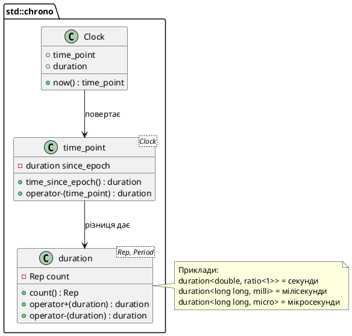

# Вимірювання часу виконання: RAII-таймер

## Задача вибору: який алгоритм швидший?

Одне з найважливіших питань, що постає перед розробником під час оптимізації програми: **який із двох алгоритмів виконується швидше?** Часто логічний аналіз складності (нотація Big O) дає приблизну відповідь — алгоритм зі складністю O(n log n) теоретично швидший за O(n²). Але реальна продуктивність залежить від багатьох факторів: розміру вхідних даних, характеристик апаратної частини, ефективності компілятора, розташування даних у пам'яті. Теорія дає загальний напрямок, емпіричне вимірювання — конкретні цифри.

Розглянемо практичний приклад. Нехай потрібно відсортувати масив із 10 000 елементів. Є два варіанти:

1. **Сортування вибором** (selection sort) — простий алгоритм зі складністю O(n²), який ми можемо реалізувати самостійно за кілька рядків.
2. **std::sort із стандартної бібліотеки** — складний гібридний алгоритм (зазвичай introsort: quicksort + heapsort + insertion sort для малих підмасивів) зі складністю O(n log n).

Теоретично std::sort має бути швидшим. Але **наскільки** швидшим? У 2 рази? У 10 разів? У 100 разів? Щоб це з'ясувати, потрібно **виміряти час виконання** обох варіантів на реальному обладнанні.

Вимірювання часу виконання (тайминг коду, *code timing*) — це процес фіксації точного часу початку і завершення фрагмента коду з подальшим обчисленням різниці. У C++11 стандартна бібліотека `<chrono>` надає високоточні інструменти для роботи з часом, що не залежать від платформи.

::note
**Вимірювання часу ≠ профілювання.** Профілювання (*profiling*) — це детальний аналіз програми, що показує, скільки часу витрачено на кожну функцію, скільки разів вона викликалася, де виникають «вузькі місця». Вимірювання часу — простіший інструмент: ми засікаємо час одного конкретного фрагмента коду. Для глибокого аналізу продуктивності використовують профайлери (Valgrind, gprof, Visual Studio Profiler), для швидкої перевірки — таймер.
::

---

## Бібліотека `<chrono>`: годинник, точки часу та тривалості

Стандартна бібліотека C++11 `<chrono>` організована навколо трьох фундаментальних концепцій:

**1. Годинник (*clock*)** — це механізм, що визначає поточний момент часу. Стандарт визначає кілька різних годинників:

- `std::chrono::system_clock` — системний годинник, прив'язаний до реального календарного часу (може змінюватися при коригуванні системного часу користувачем або NTP-синхронізацією).
- `std::chrono::steady_clock` — монотонний годинник, що ніколи не йде назад і не коригується. Ідеальний для вимірювання тривалостей, бо гарантує, що `now()` завжди більший або дорівнює попередньому виклику.
- `std::chrono::high_resolution_clock` — годинник із найвищою доступною роздільною здатністю на поточній платформі. На багатьох системах є псевдонімом до `steady_clock`.

**2. Точка часу (*time point*)** — це конкретний момент у часі, представлений як тривалість від початку епохи годинника (зазвичай від 1 січня 1970 року для `system_clock`). Тип: `std::chrono::time_point<Clock>`.

**3. Тривалість (*duration*)** — це інтервал часу, представлений як кількість тіків (*ticks*) певної одиниці вимірювання (секунди, мілісекунди, мікросекунди тощо). Тип: `std::chrono::duration<Rep, Period>`, де `Rep` — арифметичний тип для зберігання кількості тіків, `Period` — відношення одиниці вимірювання до секунди.

Ієрархія взаємодії:

::plant-uml{alt="Ієрархія компонентів бібліотеки chrono"}



::

Типовий сценарій вимірювання часу:

```cpp
#include <chrono>

auto start = std::chrono::high_resolution_clock::now();

// Код, час виконання якого вимірюється
performHeavyComputation();

auto end = std::chrono::high_resolution_clock::now();

// Різниця двох time_point дає duration
std::chrono::duration<double> elapsed = end - start;

std::cout << "Elapsed time: " << elapsed.count() << " seconds\n";
```

Цей підхід працює, але вимагає ручної роботи: оголосити дві змінні, обчислити різницю, перетворити у потрібні одиниці. Код стає багатослівним і повторюваним. Якщо потрібно виміряти час кількох фрагментів у різних місцях програми — шаблонний код дублюється.

Набагато елегантніше — **інкапсулювати** весь механізм вимірювання часу у окремий клас, який автоматично фіксує початок при створенні об'єкта і виводить результат при знищенні. Це класичне застосування ідіоми RAII, яку ми вивчали у статті 54.

---

## RAII-таймер: конструктор фіксує, деструктор виводить

Нагадаємо концепцію RAII (*Resource Acquisition Is Initialization*): ресурс захоплюється у конструкторі, звільняється у деструкторі. У контексті вимірювання часу «ресурс» — це точка початку відліку. Конструктор фіксує поточний момент, деструктор обчислює тривалість і виводить результат. Об'єкт таймера існує рівно стільки, скільки виконується вимірюваний код.

Синтаксис використання буде виглядати так:

```cpp
int main()
{
    Timer t;  // Конструктор фіксує час початку
    
    // Код, що вимірюється
    sortLargeArray();
    
    // При виході зі scope деструктор виводить тривалість
    return 0;
}
```

Деструктор викликається автоматично при виході зі scope — не потрібно пам'ятати про виклик якогось методу `stop()` чи `report()`. Це особливо корисно, якщо всередині блоку є кілька шляхів виходу (ранній `return`, виключення): деструктор спрацює у будь-якому випадку.

Розглянемо повну реалізацію класу `Timer`:

```cpp [Timer.cpp] showLineNumbers
#include <iostream>
#include <chrono>

class Timer
{
private:
    // Псевдоніми типів для зручного доступу до вкладених типів chrono
    using Clock = std::chrono::high_resolution_clock;
    using Second = std::chrono::duration<double, std::ratio<1>>;
    
    std::chrono::time_point<Clock> start;

public:
    Timer() : start(Clock::now())
    {
    }

    ~Timer()
    {
        auto end = Clock::now();
        std::chrono::duration<double> elapsed = end - start;
        std::cout << "Elapsed time: " << elapsed.count() << " seconds\n";
    }
};

int main()
{
    {
        Timer t;
        // Симуляція важкого обчислення — сума чисел від 0 до 100 мільйонів
        long long sum = 0;
        for (long long i = 0; i < 100'000'000; ++i)
        {
            sum += i;
        }
        std::cout << "Sum: " << sum << "\n";
    }  // Деструктор t викликається тут — виводиться час

    return 0;
}
```

::terminal-preview{title="./Timer"}

<div class="line"><span class="opacity-40">$</span> <strong class="font-bold">./Timer</strong></div>
<div class="line">Sum: <span class="text-blue-400">4999999950000000</span></div>
<div class="line">Elapsed time: <span class="text-green-400">0.0842</span> seconds</div>
<div class="line">Execution finished with <span class="text-green-400 font-bold">exit code 0</span>.</div>
::

Розберемо ключові елементи реалізації.

**Рядки 8–9:** псевдоніми типів `using Clock = ...` та `using Second = ...`. Бібліотека `<chrono>` активно використовує шаблони, і повні імена типів можуть бути довгими: `std::chrono::time_point<std::chrono::high_resolution_clock>`. Псевдоніми робляк код читабельнішим і дозволяють легко змінити тип годинника у одному місці (наприклад, з `high_resolution_clock` на `steady_clock`).

**Рядок 9:** `std::chrono::duration<double, std::ratio<1>>` — це тривалість, що зберігає кількість секунд у типі `double`. Параметр `std::ratio<1>` означає «одна секунда на одну одиницю». Якби ми хотіли мілісекунди, використовували б `std::ratio<1, 1000>` (одна мілісекунда = 1/1000 секунди), але стандарт надає готовий псевдонім `std::chrono::milliseconds`.

**Рядок 14:** конструктор фіксує поточний момент через `Clock::now()` у поле `start`. Це виконується одразу при створенні об'єкта.

**Рядки 18–23:** деструктор обчислює різницю `end - start`, що дає `duration`, і виводить кількість секунд через метод `count()`.

**Рядки 28–37:** блок із локальною змінною `t` типу `Timer`. Об'єкт `t` створюється на початку блоку (рядок 29), живе протягом виконання циклу, і автоматично знищується при виході з блоку (рядок 37, закриваюча дужка). Саме тут спрацьовує деструктор і виводиться результат.

::tip
Якщо потрібно виміряти час окремого фрагмента всередині функції, огорніть його у додатковий блок `{ Timer t; /* код */ }`. Деструктор спрацює при виході з блоку, не чекаючи завершення всієї функції.
::

---

## Розширення Timer: метод reset() та elapsed()

RAII-таймер із деструктором, що виводить результат, зручний для швидких вимірювань. Але іноді потрібна більша гнучкість: перезапустити таймер без створення нового об'єкта, отримати тривалість у довільний момент без знищення таймера. Додамо два методи:


```cpp [TimerAdvanced.cpp] showLineNumbers
#include <iostream>
#include <chrono>

class Timer
{
private:
    using Clock = std::chrono::high_resolution_clock;
    using Second = std::chrono::duration<double, std::ratio<1>>;
    
    std::chrono::time_point<Clock> start;

public:
    Timer() : start(Clock::now())
    {
    }

    // Скидає таймер — фіксує новий момент початку
    void reset()
    {
        start = Clock::now();
    }

    // Повертає тривалість від start до поточного моменту (у секундах)
    double elapsed() const
    {
        return std::chrono::duration_cast<Second>(Clock::now() - start).count();
    }
};

int main()
{
    Timer t;

    // Перший фрагмент коду
    long long sum1 = 0;
    for (long long i = 0; i < 50'000'000; ++i)
    {
        sum1 += i;
    }
    std::cout << "First computation: " << t.elapsed() << " seconds\n";

    // Скидаємо таймер і вимірюємо другий фрагмент
    t.reset();
    long long sum2 = 0;
    for (long long i = 0; i < 100'000'000; ++i)
    {
        sum2 += i;
    }
    std::cout << "Second computation: " << t.elapsed() << " seconds\n";

    return 0;
}
```

::terminal-preview{title="./TimerAdvanced"}

<div class="line"><span class="opacity-40">$</span> <strong class="font-bold">./TimerAdvanced</strong></div>
<div class="line">First computation: <span class="text-green-400">0.0412</span> seconds</div>
<div class="line">Second computation: <span class="text-green-400">0.0823</span> seconds</div>
<div class="line">Execution finished with <span class="text-green-400 font-bold">exit code 0</span>.</div>
::

**Рядок 18–21:** метод `reset()` оновлює поле `start` новим поточним моментом. Це дозволяє перезапустити відлік без створення нового об'єкта `Timer`.

**Рядок 24–27:** метод `elapsed()` обчислює різницю між поточним моментом і `start`, перетворює її у секунди через `duration_cast<Second>()` і повертає кількість секунд як `double`. Метод оголошений `const`, бо не змінює стан об'єкта.

**Рядок 26:** `std::chrono::duration_cast<Second>(...)` — явне перетворення типу тривалості. Оператор `Clock::now() - start` повертає `duration` із внутрішнім представленням у тіках годинника (зазвичай наносекунди). `duration_cast` конвертує це у `duration<double, ratio<1>>` (секунди у `double`).

**Рядки 40 і 49:** виклик `t.elapsed()` у довільний момент дозволяє отримати проміжний результат без знищення таймера. Це корисно для вимірювання послідовних етапів виконання програми.

::note
**Вибір годинника: `steady_clock` vs `high_resolution_clock`.** Для вимірювання тривалостей завжди віддавайте перевагу `steady_clock`, бо він гарантує монотонність: час ніколи не йде назад, навіть якщо користувач коригує системний час. `high_resolution_clock` може бути псевдонімом до `system_clock`, що призведе до некоректних вимірювань при зміні системного часу. У нашому прикладі ми використали `high_resolution_clock` для демонстрації, але у продакшн-коді краще `steady_clock`.
::

---

## Практичний приклад: порівняння алгоритмів сортування

Повернемося до початкового питання: наскільки швидший `std::sort` порівняно з простим сортуванням вибором? Реалізуємо обидва алгоритми та виміряємо час їх виконання на масиві з 10 000 елементів.

```cpp [SortBenchmark.cpp] showLineNumbers
#include <iostream>
#include <array>
#include <algorithm>
#include <chrono>

class Timer
{
private:
    using Clock = std::chrono::steady_clock;
    using Second = std::chrono::duration<double, std::ratio<1>>;
    
    std::chrono::time_point<Clock> start;

public:
    Timer() : start(Clock::now()) {}

    void reset()
    {
        start = Clock::now();
    }

    double elapsed() const
    {
        return std::chrono::duration_cast<Second>(Clock::now() - start).count();
    }
};

const int ARRAY_SIZE = 10'000;

// Сортування вибором — O(n²)
void selectionSort(std::array<int, ARRAY_SIZE>& arr)
{
    for (int start = 0; start < ARRAY_SIZE - 1; ++start)
    {
        int smallestIndex = start;
        
        for (int current = start + 1; current < ARRAY_SIZE; ++current)
        {
            if (arr[current] < arr[smallestIndex])
            {
                smallestIndex = current;
            }
        }
        
        std::swap(arr[start], arr[smallestIndex]);
    }
}

int main()
{
    // Створюємо масив у зворотному порядку — найгірший випадок для сортування
    std::array<int, ARRAY_SIZE> arr1;
    for (int i = 0; i < ARRAY_SIZE; ++i)
    {
        arr1[i] = ARRAY_SIZE - i;
    }

    // Копіюємо масив для другого тесту
    std::array<int, ARRAY_SIZE> arr2 = arr1;

    // Тест 1: сортування вибором
    {
        Timer t;
        selectionSort(arr1);
        std::cout << "Selection sort time: " << t.elapsed() << " seconds\n";
    }

    // Тест 2: std::sort
    {
        Timer t;
        std::sort(arr2.begin(), arr2.end());
        std::cout << "std::sort time:      " << t.elapsed() << " seconds\n";
    }

    // Перевірка коректності — обидва масиви мають бути відсортовані
    std::cout << "\nFirst elements: arr1[0] = " << arr1[0] 
              << ", arr2[0] = " << arr2[0] << "\n";
    std::cout << "Last elements:  arr1[" << ARRAY_SIZE - 1 << "] = " << arr1[ARRAY_SIZE - 1]
              << ", arr2[" << ARRAY_SIZE - 1 << "] = " << arr2[ARRAY_SIZE - 1] << "\n";

    return 0;
}
```

::terminal-preview{title="./SortBenchmark (Release mode)"}

<div class="line"><span class="opacity-40">$</span> <strong class="font-bold">./SortBenchmark</strong></div>
<div class="line">Selection sort time: <span class="text-yellow-400">0.0487</span> seconds</div>
<div class="line">std::sort time:      <span class="text-green-400">0.000641</span> seconds</div>
<div class="line"></div>
<div class="line">First elements: arr1[0] = <span class="text-blue-400">1</span>, arr2[0] = <span class="text-blue-400">1</span></div>
<div class="line">Last elements:  arr1[9999] = <span class="text-blue-400">10000</span>, arr2[9999] = <span class="text-blue-400">10000</span></div>
<div class="line">Execution finished with <span class="text-green-400 font-bold">exit code 0</span>.</div>
::

Результат вражаючий: `std::sort` виконується приблизно у **76 разів швидше** за сортування вибором! (0.0487 / 0.000641 ≈ 76). Це демонструє різницю між O(n²) та O(n log n) на практиці: для n = 10 000, n² = 100 000 000, а n log₂ n ≈ 133 000 — різниця в 750 разів теоретично, на практиці — трохи менше через константні фактори та кеш-ефективність.

**Рядки 9–10:** використали `steady_clock` замість `high_resolution_clock` — більш надійний вибір для бенчмарків.

**Рядки 52–57:** створюємо масив у зворотному порядку — найгірший випадок для більшості алгоритмів сортування. Це гарантує, що тест виміряє реальну продуктивність, а не випадково оптимізований сценарій.

**Рядки 62–66 та 69–73:** кожен тест огорнуто у додатковий блок `{ Timer t; ... }`. Це гарантує, що деструктор `t` викликається одразу після завершення сортування, до виконання наступного коду.

**Рядки 76–79:** перевірка коректності — обидва масиви мають містити відсортовані дані. Без цієї перевірки ми не можемо бути впевнені, що алгоритми працюють правильно.

::caution
**Режим компіляції критично важливий!** У режимі Debug (без оптимізацій) різниця може бути набагато менш вражаючою, бо компілятор не застосовує інлайнінг, векторизацію циклів та інші оптимізації. Завжди вимірюйте продуктивність у режимі **Release** із увімкненими оптимізаціями (`-O2` або `-O3` для GCC/Clang, `/O2` для MSVC).
::

---

## Фактори, що впливають на точність вимірювань

Вимірювання часу виконання — емпіричний метод, і його результати залежать від багатьох зовнішніх факторів. Щоб отримати достовірні дані, потрібно контролювати ці фактори або усвідомлювати їх вплив.

::card-group

::card{title="⚙️ Режим компіляції" icon="i-lucide-settings"}

**Debug vs Release.** У режимі Debug компілятор вимикає більшість оптимізацій, додає додатковий код для налагодження, зберігає всі символи. Один і той самий код може працювати у 10–100 разів повільніше в Debug порівняно з Release. Вимірювання у Debug-режимі покаже абсолютно некоректні результати.

**Рекомендація:** завжди вимірюйте продуктивність у Release-режимі з максимальним рівнем оптимізацій.

::

::card{title="🖥️ Фонові процеси" icon="i-lucide-cpu"}

**Інші програми.** Антивірус, індексатор файлів, системні оновлення, браузери з важкими веб-сторінками — все це споживає процесорний час і пам'ять. Якщо під час вимірювання фоновий процес раптово завантажив CPU на 100%, результат буде спотворений.

**Рекомендація:** закрийте непотрібні програми, зачекайте завершення системних завдань, вимкніть антивірус на час тестування (якщо безпечно).

::

::card{title="🔄 Повторні вимірювання" icon="i-lucide-repeat"}

**Статистична варіативність.** Навіть за ідеальних умов результати вимірювань коливаються на кілька відсотків через планувальник ОС, кеш-промахи, переривання від апаратури. Один вимір може випадково потрапити на момент короткочасного навантаження.

**Рекомендація:** виконайте вимірювання 3–5 разів, відкиньте викиди (аномально високі чи низькі значення), обчисліть середнє або медіану.

::

::card{title="🎲 Детермінованість даних" icon="i-lucide-dice"}

**Вплив вхідних даних.** Якщо алгоритм обробляє випадкові дані, час виконання може змінюватися залежно від конкретної послідовності. Наприклад, quicksort працює швидше на випадкових даних, ніж на вже відсортованих.

**Рекомендація:** використовуйте фіксоване seed для генератора випадкових чисел або попередньо згенеровані тестові дані, щоб результати були відтворюваними.

::

::

::warning
**Вимірювання у виробничому коді (production).** Ніколи не залишайте детальне вимірювання часу у продакшн-версії програми без можливості його вимкнути. Виклики `Clock::now()` самі по собі займають час (десятки–сотні наносекунд), і якщо їх багато, вони можуть вплинути на продуктивність. Використовуйте умовну компіляцію (`#ifdef PROFILING_ENABLED`) або конфігураційні прапорці для увімкнення вимірювань лише у режимі тестування.
::

---

## Вкладені типи у класі Timer: `using`-псевдоніми

Повернемося до рядків 8–9 класу `Timer`:

```cpp
using Clock = std::chrono::steady_clock;
using Second = std::chrono::duration<double, std::ratio<1>>;
```

Це приклад **вкладених псевдонімів типів** (*nested type aliases*) — механізму, що дозволяє створювати короткі локальні імена для складних типів всередині класу. `Clock` і `Second` існують лише у контексті класу `Timer` і не забруднюють глобальний простір імен.


Чому це корисно?

**1. Читабельність.** Замість `std::chrono::time_point<std::chrono::steady_clock>` (58 символів) пишемо `std::chrono::time_point<Clock>` (37 символів) або навіть `TimePoint`, якщо створимо псевдонім.

**2. Гнучкість.** Якщо потрібно змінити тип годинника (наприклад, з `steady_clock` на `system_clock`), достатньо змінити одну строку у псевдонімі — всі використання автоматично оновляться.

**3. Інкапсуляція.** Псевдоніми `Clock` і `Second` — частина приватної реалізації класу. Клієнти класу (код, що використовує `Timer`) не бачать і не залежать від цих деталей.

Вкладені псевдоніми типів — це частина більш широкої теми **вкладених типів** (*nested types*), яку ми детально розглянемо у наступній статті (стаття 61). Вкладені типи дозволяють визначати `enum`, `struct`, `class` всередині іншого класу, створюючи ієрархію типів і захищаючи допоміжні типи від зовнішнього доступу.

::note
**`using` vs `typedef`.** До стандарту C++11 для створення псевдонімів використовувалося ключове слово `typedef`: `typedef std::chrono::steady_clock Clock;`. Нова форма `using Clock = ...;` читабельніша, особливо для складних типів (шаблони, покажчики на функції), і дозволяє створювати шаблонні псевдоніми (*alias templates*). У сучасному коді віддавайте перевагу `using`.
::

---

## Практичне завдання: багатоетапний таймер

Закріпимо матеріал практичним завданням. Розширимо клас `Timer` так, щоб він міг вимірювати кілька послідовних етапів виконання програми та виводити таблицю результатів наприкінці.

Вимоги:

- Метод `checkpoint(const std::string& label)` — фіксує поточний час та зберігає мітку (*label*).
- Деструктор виводить таблицю всіх контрольних точок із часом від початку та від попередньої контрольної точки.

::accordion

::accordion-item{label="💡 Підказка: структура даних" icon="i-lucide-lightbulb"}

Для зберігання контрольних точок використайте `std::vector<std::pair<std::string, TimePoint>>` або окрему структуру:

```cpp
struct Checkpoint
{
    std::string label;
    std::chrono::time_point<Clock> time;
};

std::vector<Checkpoint> checkpoints;
```

::

::accordion-item{label="🎯 Очікуваний результат" icon="i-lucide-target"}

```
Checkpoint           | Total time | Delta time
--------------------------------------------------
Load data            |   0.023 s  |   0.023 s
Process data         |   0.145 s  |   0.122 s
Save results         |   0.189 s  |   0.044 s
```

::

::accordion-item{label="✅ Повне рішення" icon="i-lucide-code"}

```cpp
#include <iostream>
#include <vector>
#include <string>
#include <chrono>
#include <iomanip>

class MultiTimer
{
private:
    using Clock = std::chrono::steady_clock;
    using TimePoint = std::chrono::time_point<Clock>;
    using Second = std::chrono::duration<double>;

    struct Checkpoint
    {
        std::string label;
        TimePoint time;
    };

    TimePoint start;
    std::vector<Checkpoint> checkpoints;

public:
    MultiTimer() : start(Clock::now()) {}

    void checkpoint(const std::string& label)
    {
        checkpoints.push_back({label, Clock::now()});
    }

    ~MultiTimer()
    {
        if (checkpoints.empty())
        {
            return;
        }

        std::cout << "\n";
        std::cout << std::left << std::setw(20) << "Checkpoint"
                  << " | " << std::setw(12) << "Total time"
                  << " | " << std::setw(12) << "Delta time" << "\n";
        std::cout << std::string(50, '-') << "\n";

        TimePoint previous = start;
        for (const auto& cp : checkpoints)
        {
            double total = std::chrono::duration_cast<Second>(cp.time - start).count();
            double delta = std::chrono::duration_cast<Second>(cp.time - previous).count();

            std::cout << std::left << std::setw(20) << cp.label
                      << " | " << std::right << std::fixed << std::setprecision(3)
                      << std::setw(8) << total << " s"
                      << " | " << std::setw(8) << delta << " s\n";

            previous = cp.time;
        }
    }
};

int main()
{
    MultiTimer timer;

    // Етап 1: завантаження даних
    long long sum1 = 0;
    for (long long i = 0; i < 20'000'000; ++i)
    {
        sum1 += i;
    }
    timer.checkpoint("Load data");

    // Етап 2: обробка даних
    long long sum2 = 0;
    for (long long i = 0; i < 100'000'000; ++i)
    {
        sum2 += i;
    }
    timer.checkpoint("Process data");

    // Етап 3: збереження результатів
    long long sum3 = 0;
    for (long long i = 0; i < 30'000'000; ++i)
    {
        sum3 += i;
    }
    timer.checkpoint("Save results");

    std::cout << "All computations completed.\n";

    return 0;
}
```

::terminal-preview{title="./MultiTimer"}

<div class="line"><span class="opacity-40">$</span> <strong class="font-bold">./MultiTimer</strong></div>
<div class="line">All computations completed.</div>
<div class="line"></div>
<div class="line">Checkpoint           | Total time | Delta time</div>
<div class="line">--------------------------------------------------</div>
<div class="line">Load data            |    <span class="text-green-400">0.017</span> s |    <span class="text-green-400">0.017</span> s</div>
<div class="line">Process data         |    <span class="text-yellow-400">0.101</span> s |    <span class="text-yellow-400">0.084</span> s</div>
<div class="line">Save results         |    <span class="text-green-400">0.127</span> s |    <span class="text-green-400">0.026</span> s</div>
<div class="line">Execution finished with <span class="text-green-400 font-bold">exit code 0</span>.</div>
::

**Пояснення:**

- `std::vector<Checkpoint> checkpoints` зберігає всі контрольні точки.
- Метод `checkpoint()` додає нову контрольну точку із міткою та поточним часом.
- Деструктор обходить вектор контрольних точок, обчислює час від початку (`total`) та від попередньої точки (`delta`), форматує таблицю через `std::setw` та `std::setprecision`.

::

::

---

## Резюме: RAII-таймер як інструмент оптимізації

Вимірювання часу виконання — базовий інструмент розробника, що дозволяє перейти від припущень про продуктивність до фактичних даних. Бібліотека `<chrono>` надає платформонезалежні засоби роботи з часом високої точності, а ідіома RAII дозволяє інкапсулювати механізм вимірювання у зручний клас із автоматичним життєвим циклом.

::card-group

::card{title="⏱️ Бібліотека <chrono>" icon="i-lucide-clock"}

Три основні компоненти:
- **Clock** — джерело часу (`steady_clock`, `system_clock`, `high_resolution_clock`)
- **time_point** — конкретний момент у часі
- **duration** — інтервал часу з гнучкими одиницями вимірювання

Для бенчмарків використовуйте `steady_clock` — монотонний та незалежний від системного часу.

::

::card{title="🏗️ RAII-таймер" icon="i-lucide-play-circle"}

Конструктор фіксує `Clock::now()`, деструктор виводить тривалість. Об'єкт таймера живе рівно стільки, скільки виконується вимірюваний код. Додаткові методи `reset()` та `elapsed()` забезпечують гнучкість.

**Переваги:** автоматичність, відсутність ручного керування, гарантоване вимірювання навіть при ранніх виходах або винятках.

::

::card{title="📊 Порівняння алгоритмів" icon="i-lucide-bar-chart"}

Вимірювання дозволяє порівнювати різні реалізації одного алгоритму чи різні алгоритми для однієї задачі. У прикладі `std::sort` виявився у **76 разів швидшим** за сортування вибором на масиві з 10 000 елементів — це демонструє практичну різницю між O(n log n) та O(n²).

::

::card{title="⚠️ Точність вимірювань" icon="i-lucide-alert-triangle"}

Результати залежать від режиму компіляції (Debug vs Release), фонових процесів, детермінованості даних. Завжди вимірюйте у Release-режимі, повторюйте кілька разів, контролюйте зовнішні фактори.

**Правило:** один вимір — анекдот, три виміри — тренд, п'ять вимірів — статистика.

::

::

---

## Анонс наступної статті

У цій статті ми побудували RAII-таймер, що використовує вкладені псевдоніми типів (`using Clock = ...`) для інкапсуляції деталей реалізації. Це приклад більш широкої концепції — **вкладених типів** (*nested types*), коли один тип (клас, структура, перерахування) визначається всередині іншого.

У **наступній статті (стаття 61)** ми систематично вивчимо вкладені типи та анонімні об'єкти:

- **Вкладені типи:** як і навіщо визначати `enum`, `struct`, `class` всередині класу. Доступ через оператор `::`. Інкапсуляція допоміжних типів.
- **Анонімні об'єкти:** тимчасові об'єкти без імені, що створюються «на льоту» для передачі у функції або повернення з них. Час життя, оптимізації компілятора, зв'язок із rvalue-посиланнями (попередній погляд на move-семантику).

Обидві теми — вкладені типи та анонімні об'єкти — є елементами виразності мови C++, що дозволяють писати компактний, читабельний код без зайвих глобальних імен і проміжних змінних. Вони критично важливі для розуміння ідіоматичного сучасного C++ та підготують нас до перевантаження операторів у статтях 63–65.

::tip
**Практична порада для бенчмаркінгу:** перед серйозними вимірюваннями продуктивності ознайомтеся з концепцією **warming up** — перший запуск коду може бути повільнішим через холодний кеш, ліниву ініціалізацію, JIT-компіляцію (для інтерпретованих мов). Виконайте алгоритм один раз «на розігрів», потім виміряйте 5–10 запусків і обчисліть середнє. Для професійного бенчмаркінгу використовуйте бібліотеки типу Google Benchmark, що автоматизують ці практики.
::
