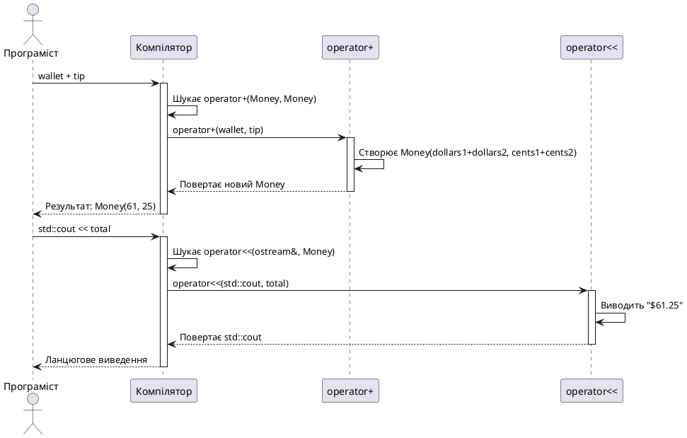

# Перевантаження операторів: основи та арифметика

## Проблема: класи поводяться «не так, як треба»

Одна з найбільших переваг вбудованих типів C++ (`int`, `double`, `bool`) — вони поводяться **інтуїтивно**. Ми пишемо `a + b`, `x < y`, `count++` — і все працює так, як очікуємо. Оператори — це частина природної мови програмування, що робить код читабельним і виразним.

Але що відбувається, коли ми створюємо власний клас? Розглянемо клас `Money`, що представляє грошову суму у доларах та центах:

```cpp [MoneyProblem.cpp] showLineNumbers
#include <iostream>

class Money
{
private:
    int dollars;
    int cents;

public:
    Money(int d, int c) : dollars(d), cents(c) {}

    int getDollars() const { return dollars; }
    int getCents() const { return cents; }
};

int main()
{
    Money wallet(50, 75);   // $50.75
    Money tip(10, 25);      // $10.25

    // ❌ Хочемо написати:
    // Money total = wallet + tip;

    // ✅ Але змушені робити так:
    Money total(
        wallet.getDollars() + tip.getDollars(),
        wallet.getCents() + tip.getCents()
    );

    std::cout << "Total: $" << total.getDollars() << "." << total.getCents() << "\n";

    return 0;
}
```

Рядки 27–30 — це те, що ми **змушені** писати, бо компілятор не знає, як додавати об'єкти `Money`. Але це виглядає багатослівно та неприродньо. Ми хочемо писати `wallet + tip`, як для чисел. Ми хочемо писати `wallet < tip` для порівняння, `std::cout << wallet` для виводу.

**Перевантаження операторів** (*operator overloading*) дозволяє навчити компілятор розуміти звичайні оператори для користувацьких типів. Після перевантаження ми зможемо писати:

```cpp
Money total = wallet + tip;
if (wallet > tip) { /* ... */ }
std::cout << wallet;
```

Код стає читабельним, виразним, **природним**. Об'єкти користувацьких класів поводяться як вбудовані типи.

::note
**Перевантаження оператора** (operator overloading) — це механізм, що дозволяє визначити поведінку стандартних операторів (`+`, `-`, `*`, `==`, `<<` тощо) для користувацьких типів. Компілятор перетворює вираз `a + b` на виклик функції `operator+(a, b)` або `a.operator+(b)`, залежно від того, як оператор перевантажений.
::

---

## Оператори як функції: що насправді відбувається

У C++ оператори — це **синтаксичний цукор** для функцій зі спеціальними іменами. Коли компілятор зустрічає вираз `a + b`, він шукає функцію з іменем `operator+`, що приймає типи операндів `a` і `b`.

Є два способи перевантажити оператор:

**1. Через вільну функцію (або friend-функцію):**

```cpp
ReturnType operator+(const Type& left, const Type& right);
```

Вираз `a + b` перетворюється на виклик `operator+(a, b)`.

**2. Через метод класу:**

```cpp
class Type
{
    ReturnType operator+(const Type& right) const;
};
```

Вираз `a + b` перетворюється на виклик `a.operator+(b)`. Лівий операнд стає неявним об'єктом `this`.

Розглянемо конкретний приклад із числами:

```cpp [OperatorAsSyntaxSugar.cpp] showLineNumbers
#include <iostream>

int main()
{
    int a = 10, b = 5;

    // Спосіб 1: природний синтаксис
    int sum1 = a + b;

    // Спосіб 2: явний виклик функції operator+ (не працює для вбудованих типів)
    // int sum2 = operator+(a, b);  // ❌ ПОМИЛКА: немає такої функції

    std::cout << "Sum: " << sum1 << "\n";

    // Але для користувацьких типів компілятор ДІЙСНО викликає operator+
    // Money total = wallet + tip;
    // перетворюється на:
    // Money total = operator+(wallet, tip);  або  wallet.operator+(tip);

    return 0;
}
```

Для вбудованих типів (`int`, `double`) оператори жорстко закодовані у компілятор — їх не можна перевантажити. Але для користувацьких типів ми **визначаємо** поведінку оператора, створюючи функцію з іменем `operator+`.

::warning
**Не можна змінювати поведінку операторів для вбудованих типів.** Вираз `int operator+(int a, int b) { return a - b; }` — недопустимий. Оператори можна перевантажувати лише тоді, коли **хоча б один операнд є користувацьким типом**.
::

---

## Фундаментальні правила перевантаження

Перш ніж перейти до практики, важливо усвідомити обмеження системи перевантаження операторів у C++. Ці правила захищають від хаотичного використання механізму:

::card-group

::card{title="🚫 Не можна створювати нові оператори" icon="i-lucide-ban"}

Ви не можете винайти оператор `**` для піднесення до степеня або `<=>` (хоча останній з'явився в C++20 як вбудований). Лише існуючі оператори можна перевантажувати.

::

::card{title="🚫 Не можна змінювати арність" icon="i-lucide-ban"}

**Арність** (arity) — кількість операндів. Оператор `+` завжди бінарний (два операнди), `-` може бути унарним (один операнд) або бінарним. Ви не можете зробити `+` унарним або `!` бінарним.

::

::card{title="🚫 Не можна змінювати пріоритет" icon="i-lucide-ban"}

Пріоритет операторів фіксований: `*` виконується раніше за `+`, `&&` раніше за `||`. Перевантаження не змінює порядок обчислення виразів.

::

::card{title="🚫 Деякі оператори заборонені" icon="i-lucide-ban"}

**Не можна перевантажити:**
- `::` (scope resolution)
- `.` (member access)
- `.*` (pointer-to-member selection)
- `?:` (ternary conditional)
- `sizeof`, `typeid`, `alignof`

Ці оператори критичні для роботи компілятора і мови.

::

::

::tip
**Принцип найменшого здивування** (*Principle of Least Astonishment*): перевантажуйте оператори так, щоб їхня поведінка відповідала інтуїції. Оператор `+` має додавати, `<` — порівнювати на «менше», `<<` — виводити у потік. Якщо `money1 + money2` віднімає гроші — це порушення принципу. Код стає заплутаним і небезпечним.
::

---

## Перший приклад: додавання грошей

Почнемо з найпростішого оператора — бінарного `+`. Ми хочемо, щоб вираз `wallet + tip` повертав новий об'єкт `Money` із сумою.

### Крок 1: Базовий клас Money

Спочатку реалізуємо клас без перевантаження, але з коректною логікою додавання центів (врахування переповнення на долари):

```cpp [MoneyBasic.cpp] showLineNumbers
#include <iostream>

class Money
{
private:
    int dollars;
    int cents;

    // Нормалізація: якщо центів >= 100, переносимо у долари
    void normalize()
    {
        if (cents >= 100)
        {
            dollars += cents / 100;
            cents = cents % 100;
        }
        else if (cents < 0)
        {
            int dollarsBorrowed = (-cents / 100) + 1;
            dollars -= dollarsBorrowed;
            cents += dollarsBorrowed * 100;
        }
    }

public:
    Money(int d = 0, int c = 0) : dollars(d), cents(c)
    {
        normalize();
    }

    int getDollars() const { return dollars; }
    int getCents() const { return cents; }

    // Допоміжний метод для виводу
    void print() const
    {
        std::cout << "$" << dollars << ".";
        if (cents < 10)
        {
            std::cout << "0";  // Доповнення нулем: $5.05 замість $5.5
        }
        std::cout << cents;
    }
};

int main()
{
    Money wallet(50, 75);
    Money tip(10, 50);

    std::cout << "Wallet: ";
    wallet.print();
    std::cout << "\nTip: ";
    tip.print();
    std::cout << "\n";

    // Ручне додавання — багатослівно
    Money total(wallet.getDollars() + tip.getDollars(),
                wallet.getCents() + tip.getCents());

    std::cout << "Total: ";
    total.print();
    std::cout << "\n";

    return 0;
}
```

::terminal-preview{title="./MoneyBasic"}

<div class="line"><span class="opacity-40">$</span> <strong class="font-bold">./MoneyBasic</strong></div>
<div class="line">Wallet: <span class="text-green-400">$50.75</span></div>
<div class="line">Tip: <span class="text-green-400">$10.50</span></div>
<div class="line">Total: <span class="text-green-400">$61.25</span></div>
<div class="line">Execution finished with <span class="text-green-400 font-bold">exit code 0</span>.</div>
::

**Рядки 10–23:** метод `normalize()` обробляє переповнення центів. Якщо `cents >= 100`, конвертуємо у долари. Це гарантує, що `Money(5, 150)` перетвориться на `$6.50`.

**Рядки 59–60:** ручне додавання через геттери — працює, але код важкий для читання. Давайте додамо оператор `+`.


### Крок 2: Перевантаження через friend-функцію

Оператор `+` природно реалізувати як **вільну функцію** (або friend-функцію), бо обидва операнди мають рівну роль — не має сенсу вважати лівий операнд «головним».

```cpp [MoneyOperatorPlus.cpp] showLineNumbers
#include <iostream>

class Money
{
private:
    int dollars;
    int cents;

    void normalize()
    {
        if (cents >= 100)
        {
            dollars += cents / 100;
            cents = cents % 100;
        }
        else if (cents < 0)
        {
            int dollarsBorrowed = (-cents / 100) + 1;
            dollars -= dollarsBorrowed;
            cents += dollarsBorrowed * 100;
        }
    }

public:
    Money(int d = 0, int c = 0) : dollars(d), cents(c)
    {
        normalize();
    }

    int getDollars() const { return dollars; }
    int getCents() const { return cents; }

    void print() const
    {
        std::cout << "$" << dollars << ".";
        if (cents < 10) std::cout << "0";
        std::cout << cents;
    }

    // Оголошуємо operator+ дружньою функцією
    friend Money operator+(const Money& left, const Money& right);
};

// Визначення operator+ — поза класом
Money operator+(const Money& left, const Money& right)
{
    // Додаємо долари до доларів, центи до центів
    // Конструктор автоматично нормалізує результат
    return Money(left.dollars + right.dollars,
                 left.cents + right.cents);
}

int main()
{
    Money wallet(50, 75);
    Money tip(10, 50);

    std::cout << "Wallet: ";
    wallet.print();
    std::cout << "\nTip: ";
    tip.print();
    std::cout << "\n";

    // ✅ Тепер можемо писати природно!
    Money total = wallet + tip;

    std::cout << "Total: ";
    total.print();
    std::cout << "\n";

    // Можна навіть ланцюгово
    Money extra(5, 0);
    Money grandTotal = wallet + tip + extra;

    std::cout << "Grand Total: ";
    grandTotal.print();
    std::cout << "\n";

    return 0;
}
```

::terminal-preview{title="./MoneyOperatorPlus"}

<div class="line"><span class="opacity-40">$</span> <strong class="font-bold">./MoneyOperatorPlus</strong></div>
<div class="line">Wallet: <span class="text-green-400">$50.75</span></div>
<div class="line">Tip: <span class="text-green-400">$10.50</span></div>
<div class="line">Total: <span class="text-green-400">$61.25</span></div>
<div class="line">Grand Total: <span class="text-green-400">$66.25</span></div>
<div class="line">Execution finished with <span class="text-green-400 font-bold">exit code 0</span>.</div>
::

**Рядок 41:** оголошення `friend Money operator+(...)` всередині класу надає функції доступ до приватних полів `dollars` і `cents`.

**Рядки 45–51:** визначення функції поза класом. Вона створює новий об'єкт `Money` через конструктор, який автоматично нормалізує центи.

**Рядок 66:** `wallet + tip` — компілятор перетворює це на `operator+(wallet, tip)`. Код читається природно.

**Рядок 71:** ланцюговий виклик `wallet + tip + extra` працює завдяки асоціативності зліва направо: спочатку `(wallet + tip)` повертає тимчасовий `Money`, потім `temp + extra`.

::note
**Чому `friend`, а не звичайна вільна функція?** Без `friend` функція `operator+` не мала б доступу до `left.dollars` і `right.cents` — вони приватні. Довелося б використовувати геттери, що робить код багатослівнішим: `return Money(left.getDollars() + right.getDollars(), ...)`. `friend` дозволяє писати лаконічно.
::

---

## Арифметичні оператори: повний набір

Тепер, коли ми зрозуміли принцип, додамо решту арифметичних операторів: `-`, `*`, `/`. Логіка аналогічна до `+`.

```cpp [MoneyArithmetic.cpp] showLineNumbers
#include <iostream>

class Money
{
private:
    int dollars;
    int cents;

    void normalize()
    {
        if (cents >= 100)
        {
            dollars += cents / 100;
            cents = cents % 100;
        }
        else if (cents < 0)
        {
            int dollarsBorrowed = (-cents / 100) + 1;
            dollars -= dollarsBorrowed;
            cents += dollarsBorrowed * 100;
        }
    }

public:
    Money(int d = 0, int c = 0) : dollars(d), cents(c)
    {
        normalize();
    }

    int getDollars() const { return dollars; }
    int getCents() const { return cents; }

    // Для множення та ділення корисно отримати загальну кількість центів
    int totalCents() const
    {
        return dollars * 100 + cents;
    }

    void print() const
    {
        std::cout << "$" << dollars << ".";
        if (cents < 10) std::cout << "0";
        std::cout << cents;
    }

    // Оголошуємо всі арифметичні оператори дружніми
    friend Money operator+(const Money& left, const Money& right);
    friend Money operator-(const Money& left, const Money& right);
    friend Money operator*(const Money& money, int multiplier);
    friend Money operator/(const Money& money, int divisor);
};

Money operator+(const Money& left, const Money& right)
{
    return Money(left.dollars + right.dollars,
                 left.cents + right.cents);
}

Money operator-(const Money& left, const Money& right)
{
    return Money(left.dollars - right.dollars,
                 left.cents - right.cents);
}

// Множимо гроші на ціле число
Money operator*(const Money& money, int multiplier)
{
    int totalCents = money.totalCents();
    int resultCents = totalCents * multiplier;
    return Money(resultCents / 100, resultCents % 100);
}

// Ділимо гроші на ціле число
Money operator/(const Money& money, int divisor)
{
    if (divisor == 0)
    {
        std::cerr << "Error: Division by zero\n";
        return Money(0, 0);
    }

    int totalCents = money.totalCents();
    int resultCents = totalCents / divisor;
    return Money(resultCents / 100, resultCents % 100);
}

int main()
{
    Money price(15, 99);    // $15.99
    Money discount(3, 50);  // $3.50

    std::cout << "Price: ";
    price.print();
    std::cout << "\nDiscount: ";
    discount.print();
    std::cout << "\n\n";

    Money final = price - discount;
    std::cout << "After discount: ";
    final.print();
    std::cout << "\n";

    Money doubled = price * 2;
    std::cout << "Doubled price: ";
    doubled.print();
    std::cout << "\n";

    Money half = price / 2;
    std::cout << "Half price: ";
    half.print();
    std::cout << "\n";

    // Комбіновані вирази
    Money combo = (price - discount) * 3;
    std::cout << "Three items after discount: ";
    combo.print();
    std::cout << "\n";

    return 0;
}
```

::terminal-preview{title="./MoneyArithmetic"}

<div class="line"><span class="opacity-40">$</span> <strong class="font-bold">./MoneyArithmetic</strong></div>
<div class="line">Price: <span class="text-green-400">$15.99</span></div>
<div class="line">Discount: <span class="text-green-400">$3.50</span></div>
<div class="line"></div>
<div class="line">After discount: <span class="text-green-400">$12.49</span></div>
<div class="line">Doubled price: <span class="text-green-400">$31.98</span></div>
<div class="line">Half price: <span class="text-green-400">$7.99</span></div>
<div class="line">Three items after discount: <span class="text-green-400">$37.47</span></div>
<div class="line">Execution finished with <span class="text-green-400 font-bold">exit code 0</span>.</div>
::

**Рядки 34–37:** метод `totalCents()` конвертує гроші у центи — корисно для множення та ділення, щоб уникнути втрати точності.

**Рядки 66–70:** множення `Money * int`. Конвертуємо у центи, множимо, конвертуємо назад у долари та центи.

**Рядки 73–84:** ділення `Money / int`. Перевіряємо ділення на нуль, потім аналогічно множенню.

**Рядок 117:** комбінований вираз `(price - discount) * 3` — демонструє, що оператори працюють разом природно, як для вбудованих типів.

::caution
**Втрата точності при діленні.** Ділення `$10.00 / 3` дає `$3.33`, втрачаючи один цент через цілочисельне ділення. У реальних фінансових системах використовують спеціалізовані бібліотеки для роботи з грошима (наприклад, зберігають кількість найменших одиниць валюти — центів).
::

---

## Симетрія операторів: `money * 2` vs `2 * money`

Поточна реалізація `operator*` працює для `price * 2`, але **не працює** для `2 * price`. Спробуємо:

```cpp
Money doubled1 = price * 2;   // ✅ Працює: operator*(price, 2)
Money doubled2 = 2 * price;   // ❌ ПОМИЛКА: немає operator*(int, Money)
```

Щоб забезпечити **комутативність** (симетрію) множення, потрібно додати другу версію оператора:

```cpp [MoneyCommutative.cpp] showLineNumbers
class Money
{
    // ... попередній код ...

    friend Money operator*(const Money& money, int multiplier);
    friend Money operator*(int multiplier, const Money& money);  // Симетрична версія
};

Money operator*(const Money& money, int multiplier)
{
    int totalCents = money.totalCents();
    int resultCents = totalCents * multiplier;
    return Money(resultCents / 100, resultCents % 100);
}

// Симетрична версія: делегує роботу першій
Money operator*(int multiplier, const Money& money)
{
    return money * multiplier;  // Викликає operator*(Money, int)
}

int main()
{
    Money price(10, 50);

    Money doubled1 = price * 3;   // ✅ Працює
    Money doubled2 = 3 * price;   // ✅ Тепер теж працює!

    doubled1.print();
    std::cout << "\n";
    doubled2.print();
    std::cout << "\n";

    return 0;
}
```

**Рядки 17–20:** друга версія `operator*` приймає `int` зліва, `Money` справа. Вона просто викликає першу версію — уникаємо дублювання коду.

Тепер обидва варіанти працюють:
- `price * 3` → `operator*(price, 3)` (перша версія)
- `3 * price` → `operator*(3, price)` (друга версія) → викликає першу

::tip
**Коли потрібна симетрія?** Для комутативних операцій (множення, додавання) симетрія природна: `a + b` = `b + a`. Для некомутативних (віднімання, ділення) симетрія не має сенсу: `money - 5` ≠ `5 - money`. Множення грошей на число комутативне, тому симетричні версії корисні.
::

---

## Оператори порівняння: `==`, `!=`, `<`, `<=`, `>`, `>=`

Оператори порівняння дозволяють порівнювати об'єкти:

```cpp
if (wallet > tip) { /* більше грошей у гаманці */ }
if (price == discount) { /* однакова сума */ }
```

Реалізуємо всі шість операторів. Трюк: достатньо реалізувати `==` та `<`, а решту виразити через них:


```cpp [MoneyComparison.cpp] showLineNumbers
#include <iostream>

class Money
{
private:
    int dollars;
    int cents;

    void normalize()
    {
        if (cents >= 100)
        {
            dollars += cents / 100;
            cents = cents % 100;
        }
        else if (cents < 0)
        {
            int dollarsBorrowed = (-cents / 100) + 1;
            dollars -= dollarsBorrowed;
            cents += dollarsBorrowed * 100;
        }
    }

public:
    Money(int d = 0, int c = 0) : dollars(d), cents(c)
    {
        normalize();
    }

    int totalCents() const
    {
        return dollars * 100 + cents;
    }

    void print() const
    {
        std::cout << "$" << dollars << ".";
        if (cents < 10) std::cout << "0";
        std::cout << cents;
    }

    // Оператори порівняння
    friend bool operator==(const Money& left, const Money& right);
    friend bool operator!=(const Money& left, const Money& right);
    friend bool operator<(const Money& left, const Money& right);
    friend bool operator<=(const Money& left, const Money& right);
    friend bool operator>(const Money& left, const Money& right);
    friend bool operator>=(const Money& left, const Money& right);
};

// Базові оператори: == та <
bool operator==(const Money& left, const Money& right)
{
    return left.totalCents() == right.totalCents();
}

bool operator<(const Money& left, const Money& right)
{
    return left.totalCents() < right.totalCents();
}

// Решта операторів виражаються через == та <
bool operator!=(const Money& left, const Money& right)
{
    return !(left == right);
}

bool operator<=(const Money& left, const Money& right)
{
    return (left < right) || (left == right);
}

bool operator>(const Money& left, const Money& right)
{
    return !(left <= right);
}

bool operator>=(const Money& left, const Money& right)
{
    return !(left < right);
}

int main()
{
    Money wallet(50, 0);
    Money tip(25, 50);
    Money another(50, 0);

    std::cout << "Wallet: ";
    wallet.print();
    std::cout << "\nTip: ";
    tip.print();
    std::cout << "\nAnother: ";
    another.print();
    std::cout << "\n\n";

    // Тестуємо всі оператори
    std::cout << "wallet == another: " << (wallet == another) << "\n";
    std::cout << "wallet != tip: " << (wallet != tip) << "\n";
    std::cout << "wallet > tip: " << (wallet > tip) << "\n";
    std::cout << "tip < wallet: " << (tip < wallet) << "\n";
    std::cout << "wallet >= another: " << (wallet >= another) << "\n";
    std::cout << "tip <= wallet: " << (tip <= wallet) << "\n";

    // Використання у умовах
    if (wallet > tip)
    {
        std::cout << "\nWallet has more money than tip\n";
    }

    return 0;
}
```

::terminal-preview{title="./MoneyComparison"}

<div class="line"><span class="opacity-40">$</span> <strong class="font-bold">./MoneyComparison</strong></div>
<div class="line">Wallet: <span class="text-green-400">$50.00</span></div>
<div class="line">Tip: <span class="text-green-400">$25.50</span></div>
<div class="line">Another: <span class="text-green-400">$50.00</span></div>
<div class="line"></div>
<div class="line">wallet == another: <span class="text-blue-400">1</span></div>
<div class="line">wallet != tip: <span class="text-blue-400">1</span></div>
<div class="line">wallet > tip: <span class="text-blue-400">1</span></div>
<div class="line">tip < wallet: <span class="text-blue-400">1</span></div>
<div class="line">wallet >= another: <span class="text-blue-400">1</span></div>
<div class="line">tip <= wallet: <span class="text-blue-400">1</span></div>
<div class="line"></div>
<div class="line">Wallet has more money than tip</div>
<div class="line">Execution finished with <span class="text-green-400 font-bold">exit code 0</span>.</div>
::

**Рядки 52–59:** базові оператори `==` та `<` порівнюють загальну кількість центів. Це гарантує коректне порівняння незалежно від того, як зберігаються долари та центи.

**Рядки 62–79:** решта чотирьох операторів виражаються через `==` та `<`. Наприклад:
- `a != b` ≡ `!(a == b)`
- `a <= b` ≡ `(a < b) || (a == b)`
- `a > b` ≡ `!(a <= b)`
- `a >= b` ≡ `!(a < b)`

Це зменшує дублювання коду та ризик помилок.

::note
**C++20 spaceship operator (`<=>`):** У C++20 з'явився оператор тристороннього порівняння `<=>` (spaceship operator), що автоматично генерує всі шість операторів порівняння з одного визначення. Але у цьому курсі ми дотримуємося C++11/14/17 стандартів, тому реалізуємо їх вручну.
::

---

## Оператори вводу/виводу: `<<` та `>>`

Найкорисніші оператори для користувацьких класів — `operator<<` (вивід у потік) та `operator>>` (ввід із потоку). Вони дозволяють використовувати об'єкти з `std::cout` та `std::cin` природно:

```cpp
std::cout << money;  // Замість money.print()
std::cin >> money;   // Замість ручного вводу через геттери
```

**Критично важливо:** оператори `<<` та `>>` **завжди** перевантажуються як **вільні (або friend) функції**, бо лівий операнд — це потік (`std::ostream&` або `std::istream&`), а не наш клас. Ми не можемо додати методи до стандартних класів потоків.

```cpp [MoneyIO.cpp] showLineNumbers
#include <iostream>

class Money
{
private:
    int dollars;
    int cents;

    void normalize()
    {
        if (cents >= 100)
        {
            dollars += cents / 100;
            cents = cents % 100;
        }
        else if (cents < 0)
        {
            int dollarsBorrowed = (-cents / 100) + 1;
            dollars -= dollarsBorrowed;
            cents += dollarsBorrowed * 100;
        }
    }

public:
    Money(int d = 0, int c = 0) : dollars(d), cents(c)
    {
        normalize();
    }

    // Оператори вводу/виводу
    friend std::ostream& operator<<(std::ostream& out, const Money& money);
    friend std::istream& operator>>(std::istream& in, Money& money);
};

// Вивід у потік
std::ostream& operator<<(std::ostream& out, const Money& money)
{
    out << "$" << money.dollars << ".";
    if (money.cents < 10)
    {
        out << "0";  // Доповнення нулем
    }
    out << money.cents;
    return out;  // Повертаємо потік для ланцюгових викликів
}

// Ввід із потоку
std::istream& operator>>(std::istream& in, Money& money)
{
    std::cout << "Enter dollars: ";
    in >> money.dollars;
    std::cout << "Enter cents: ";
    in >> money.cents;
    money.normalize();  // Нормалізуємо після вводу
    return in;  // Повертаємо потік для ланцюгових викликів
}

int main()
{
    Money wallet(50, 75);
    Money tip;

    // Вивід через operator<<
    std::cout << "Wallet: " << wallet << "\n";

    // Ввід через operator>>
    std::cout << "Enter tip amount:\n";
    std::cin >> tip;

    // Ланцюговий вивід
    std::cout << "Wallet: " << wallet << ", Tip: " << tip << "\n";

    Money total = wallet + tip;
    std::cout << "Total: " << total << "\n";

    return 0;
}
```

::terminal-preview{title="./MoneyIO"}

<div class="line"><span class="opacity-40">$</span> <strong class="font-bold">./MoneyIO</strong></div>
<div class="line">Wallet: <span class="text-green-400">$50.75</span></div>
<div class="line">Enter tip amount:</div>
<div class="line">Enter dollars: <span class="text-blue-400">10</span></div>
<div class="line">Enter cents: <span class="text-blue-400">50</span></div>
<div class="line">Wallet: <span class="text-green-400">$50.75</span>, Tip: <span class="text-green-400">$10.50</span></div>
<div class="line">Total: <span class="text-green-400">$61.25</span></div>
<div class="line">Execution finished with <span class="text-green-400 font-bold">exit code 0</span>.</div>
::

**Рядок 36–44:** `operator<<` приймає `std::ostream&` (посилання на потік виводу) та `const Money&` (об'єкт для виводу). Виводить гроші у форматі `$XX.XX` і **повертає потік**, щоб дозволити ланцюгові виклики.

**Рядок 44:** `return out;` критично важливий! Він дозволяє писати `std::cout << wallet << ", Tip: " << tip`. Компілятор перетворює це на:
```cpp
operator<<(operator<<(std::cout, wallet), ", Tip: ")...
```

**Рядки 48–56:** `operator>>` приймає `std::istream&` (посилання на потік вводу) та **не-const** `Money&` (об'єкт буде змінено). Зчитує долари та центи, нормалізує, повертає потік.

::warning
**Чому `Money&`, а не `const Money&` у `operator>>`?** Оператор вводу **змінює** об'єкт, тому параметр не може бути константним. Натомість `operator<<` не змінює об'єкт, тому використовує `const Money&`.
::

---

## Friend-функція vs метод класу: коли що використовувати

Ми бачили, що оператори можна перевантажувати як friend-функції або як методи класу. Коли використовувати який підхід?

### Через friend-функцію (або вільну функцію):

```cpp
friend ReturnType operator@(const Type& left, const Type& right);
```

**Переваги:**
- Симетрія: обидва операнди мають однакову роль
- Можливість підтримки `2 * money` (лівий операнд — не об'єкт класу)
- Обов'язково для `operator<<` та `operator>>` (лівий операнд — потік)

**Використання:** бінарні арифметичні оператори (`+`, `-`, `*`, `/`), оператори порівняння (`==`, `<`), оператори потоків (`<<`, `>>`).

### Через метод класу:

```cpp
class Type
{
    ReturnType operator@(const Type& right) const;
};
```

**Переваги:**
- Коротший синтаксис (немає `friend`)
- Лівий операнд — завжди об'єкт класу (неявний `this`)
- Обов'язково для операторів присвоювання (`=`, `+=`, `-=`), індексації (`[]`), виклику (`()`), доступу до членів (`->`)

**Використання:** оператори, що модифікують лівий операнд (присвоювання, інкремент), оператори, де лівий операнд є головним (індексація, виклик).

::card-group

::card{title="✅ Через friend" icon="i-lucide-users"}

- Бінарні арифметичні: `+`, `-`, `*`, `/`
- Порівняння: `==`, `!=`, `<`, `<=`, `>`, `>=`
- Потоки: `<<`, `>>`
- Логічні: `&&`, `||`

::

::card{title="✅ Через метод" icon="i-lucide-user"}

- Присвоювання: `=`, `+=`, `-=`, `*=`, `/=`
- Унарні: `-`, `!`, `~`, `++`, `--`
- Доступ: `[]`, `()`, `->`
- Приведення типів

::

::

::tip
**Загальне правило:** якщо оператор **не змінює** об'єкт і має симетричну роль операндів — використовуйте friend-функцію. Якщо оператор **змінює** лівий операнд або є унарним — використовуйте метод класу. Для операторів потоків (`<<`, `>>`) вибору немає — завжди friend-функція.
::

---

## Повна реалізація класу Money з усіма операторами

Об'єднаємо все, що ми вивчили, у повний клас `Money` з усіма корисними операторами:

```cpp [MoneyComplete.cpp] showLineNumbers
#include <iostream>

class Money
{
private:
    int dollars;
    int cents;

    void normalize()
    {
        if (cents >= 100)
        {
            dollars += cents / 100;
            cents = cents % 100;
        }
        else if (cents < 0)
        {
            int dollarsBorrowed = (-cents / 100) + 1;
            dollars -= dollarsBorrowed;
            cents += dollarsBorrowed * 100;
        }
    }

public:
    Money(int d = 0, int c = 0) : dollars(d), cents(c)
    {
        normalize();
    }

    int totalCents() const
    {
        return dollars * 100 + cents;
    }

    // Арифметичні оператори
    friend Money operator+(const Money& left, const Money& right);
    friend Money operator-(const Money& left, const Money& right);
    friend Money operator*(const Money& money, int multiplier);
    friend Money operator*(int multiplier, const Money& money);
    friend Money operator/(const Money& money, int divisor);

    // Оператори порівняння
    friend bool operator==(const Money& left, const Money& right);
    friend bool operator!=(const Money& left, const Money& right);
    friend bool operator<(const Money& left, const Money& right);
    friend bool operator<=(const Money& left, const Money& right);
    friend bool operator>(const Money& left, const Money& right);
    friend bool operator>=(const Money& left, const Money& right);

    // Оператори вводу/виводу
    friend std::ostream& operator<<(std::ostream& out, const Money& money);
    friend std::istream& operator>>(std::istream& in, Money& money);
};

// === Реалізація арифметичних операторів ===

Money operator+(const Money& left, const Money& right)
{
    return Money(left.dollars + right.dollars,
                 left.cents + right.cents);
}

Money operator-(const Money& left, const Money& right)
{
    return Money(left.dollars - right.dollars,
                 left.cents - right.cents);
}

Money operator*(const Money& money, int multiplier)
{
    int totalCents = money.totalCents();
    return Money((totalCents * multiplier) / 100,
                 (totalCents * multiplier) % 100);
}

Money operator*(int multiplier, const Money& money)
{
    return money * multiplier;
}

Money operator/(const Money& money, int divisor)
{
    if (divisor == 0)
    {
        std::cerr << "Error: Division by zero\n";
        return Money(0, 0);
    }
    int totalCents = money.totalCents();
    return Money((totalCents / divisor) / 100,
                 (totalCents / divisor) % 100);
}

// === Реалізація операторів порівняння ===

bool operator==(const Money& left, const Money& right)
{
    return left.totalCents() == right.totalCents();
}

bool operator!=(const Money& left, const Money& right)
{
    return !(left == right);
}

bool operator<(const Money& left, const Money& right)
{
    return left.totalCents() < right.totalCents();
}

bool operator<=(const Money& left, const Money& right)
{
    return (left < right) || (left == right);
}

bool operator>(const Money& left, const Money& right)
{
    return !(left <= right);
}

bool operator>=(const Money& left, const Money& right)
{
    return !(left < right);
}

// === Реалізація операторів вводу/виводу ===

std::ostream& operator<<(std::ostream& out, const Money& money)
{
    out << "$" << money.dollars << ".";
    if (money.cents < 10)
    {
        out << "0";
    }
    out << money.cents;
    return out;
}

std::istream& operator>>(std::istream& in, Money& money)
{
    std::cout << "Enter dollars: ";
    in >> money.dollars;
    std::cout << "Enter cents: ";
    in >> money.cents;
    money.normalize();
    return in;
}

int main()
{
    Money wallet(100, 50);
    Money expense(35, 75);

    std::cout << "=== Financial Calculator ===\n\n";

    std::cout << "Wallet: " << wallet << "\n";
    std::cout << "Expense: " << expense << "\n\n";

    // Арифметичні операції
    Money remaining = wallet - expense;
    std::cout << "Remaining after expense: " << remaining << "\n";

    Money tripled = expense * 3;
    std::cout << "Expense tripled: " << tripled << "\n";

    Money shared = wallet / 2;
    std::cout << "Wallet split in half: " << shared << "\n\n";

    // Порівняння
    if (wallet > expense)
    {
        std::cout << "You have enough money for the expense\n";
    }

    if (remaining == Money(64, 75))
    {
        std::cout << "Calculation is correct!\n";
    }

    // Складні вирази
    Money total = (wallet - expense) + (expense / 2);
    std::cout << "\nComplex calculation result: " << total << "\n";

    return 0;
}
```

::terminal-preview{title="./MoneyComplete"}

<div class="line"><span class="opacity-40">$</span> <strong class="font-bold">./MoneyComplete</strong></div>
<div class="line">=== Financial Calculator ===</div>
<div class="line"></div>
<div class="line">Wallet: <span class="text-green-400">$100.50</span></div>
<div class="line">Expense: <span class="text-green-400">$35.75</span></div>
<div class="line"></div>
<div class="line">Remaining after expense: <span class="text-green-400">$64.75</span></div>
<div class="line">Expense tripled: <span class="text-green-400">$107.25</span></div>
<div class="line">Wallet split in half: <span class="text-green-400">$50.25</span></div>
<div class="line"></div>
<div class="line">You have enough money for the expense</div>
<div class="line">Calculation is correct!</div>
<div class="line"></div>
<div class="line">Complex calculation result: <span class="text-green-400">$82.62</span></div>
<div class="line">Execution finished with <span class="text-green-400 font-bold">exit code 0</span>.</div>
::

Тепер клас `Money` поводиться як вбудований тип: можна додавати, віднімати, множити, ділити, порівнювати, виводити у потік. Код клієнта читається природно, без зайвих викликів методів.


---

## Діаграма взаємодії: як працює перевантаження

Наступна діаграма показує, як компілятор перетворює вираз із перевантаженими операторами на виклики функцій:

::plant-uml{alt="Перетворення виразу з операторами"}



::

Компілятор перетворює:
- `wallet + tip` → `operator+(wallet, tip)`
- `std::cout << total` → `operator<<(std::cout, total)`

Це відбувається на етапі компіляції — жодних додаткових накладних витрат під час виконання.

---

## Практичне завдання: клас Vector2D

Закріпимо матеріал, реалізувавши клас `Vector2D` для двовимірних векторів із повним набором операторів.

Вимоги:
- Поля `x` та `y` (координати вектора)
- Оператори: `+`, `-`, `*` (множення на скаляр), `==`, `!=`
- Оператори вводу/виводу `<<` та `>>`
- Метод `length()` для обчислення довжини вектора

::::accordion

:::accordion-item{label="💡 Підказка: структура класу" icon="i-lucide-lightbulb"}

```cpp
#include <cmath>

class Vector2D
{
private:
    double x;
    double y;

public:
    Vector2D(double x = 0.0, double y = 0.0);
    
    double length() const
    {
        return std::sqrt(x * x + y * y);
    }

    friend Vector2D operator+(const Vector2D& a, const Vector2D& b);
    friend Vector2D operator-(const Vector2D& a, const Vector2D& b);
    friend Vector2D operator*(const Vector2D& v, double scalar);
    friend Vector2D operator*(double scalar, const Vector2D& v);
    // ... інші оператори
};
```

:::

:::accordion-item{label="✅ Повне рішення" icon="i-lucide-code"}

```cpp
#include <iostream>
#include <cmath>
#include <iomanip>

class Vector2D
{
private:
    double x;
    double y;

public:
    Vector2D(double xCoord = 0.0, double yCoord = 0.0) : x(xCoord), y(yCoord) {}

    double length() const
    {
        return std::sqrt(x * x + y * y);
    }

    // Арифметичні оператори
    friend Vector2D operator+(const Vector2D& a, const Vector2D& b);
    friend Vector2D operator-(const Vector2D& a, const Vector2D& b);
    friend Vector2D operator*(const Vector2D& v, double scalar);
    friend Vector2D operator*(double scalar, const Vector2D& v);

    // Оператори порівняння
    friend bool operator==(const Vector2D& a, const Vector2D& b);
    friend bool operator!=(const Vector2D& a, const Vector2D& b);

    // Вивід/ввід
    friend std::ostream& operator<<(std::ostream& out, const Vector2D& v);
    friend std::istream& operator>>(std::istream& in, Vector2D& v);
};

// === Реалізація ===

Vector2D operator+(const Vector2D& a, const Vector2D& b)
{
    return Vector2D(a.x + b.x, a.y + b.y);
}

Vector2D operator-(const Vector2D& a, const Vector2D& b)
{
    return Vector2D(a.x - b.x, a.y - b.y);
}

Vector2D operator*(const Vector2D& v, double scalar)
{
    return Vector2D(v.x * scalar, v.y * scalar);
}

Vector2D operator*(double scalar, const Vector2D& v)
{
    return v * scalar;
}

bool operator==(const Vector2D& a, const Vector2D& b)
{
    const double EPSILON = 0.0001;
    return std::abs(a.x - b.x) < EPSILON && std::abs(a.y - b.y) < EPSILON;
}

bool operator!=(const Vector2D& a, const Vector2D& b)
{
    return !(a == b);
}

std::ostream& operator<<(std::ostream& out, const Vector2D& v)
{
    out << "Vector2D(" << std::fixed << std::setprecision(2) 
        << v.x << ", " << v.y << ")";
    return out;
}

std::istream& operator>>(std::istream& in, Vector2D& v)
{
    std::cout << "Enter x: ";
    in >> v.x;
    std::cout << "Enter y: ";
    in >> v.y;
    return in;
}

int main()
{
    Vector2D v1(3.0, 4.0);
    Vector2D v2(1.0, 2.0);

    std::cout << "v1 = " << v1 << "\n";
    std::cout << "v2 = " << v2 << "\n";
    std::cout << "Length of v1: " << v1.length() << "\n\n";

    Vector2D sum = v1 + v2;
    std::cout << "v1 + v2 = " << sum << "\n";

    Vector2D diff = v1 - v2;
    std::cout << "v1 - v2 = " << diff << "\n";

    Vector2D scaled = v1 * 2.0;
    std::cout << "v1 * 2 = " << scaled << "\n";

    Vector2D scaled2 = 0.5 * v2;
    std::cout << "0.5 * v2 = " << scaled2 << "\n\n";

    if (v1 != v2)
    {
        std::cout << "Vectors are different\n";
    }

    Vector2D v3(3.0, 4.0);
    if (v1 == v3)
    {
        std::cout << "v1 and v3 are equal\n";
    }

    return 0;
}
```

::terminal-preview{title="./Vector2D"}

<div class="line"><span class="opacity-40">$</span> <strong class="font-bold">./Vector2D</strong></div>
<div class="line">v1 = <span class="text-blue-400">Vector2D(3.00, 4.00)</span></div>
<div class="line">v2 = <span class="text-blue-400">Vector2D(1.00, 2.00)</span></div>
<div class="line">Length of v1: <span class="text-green-400">5</span></div>
<div class="line"></div>
<div class="line">v1 + v2 = <span class="text-blue-400">Vector2D(4.00, 6.00)</span></div>
<div class="line">v1 - v2 = <span class="text-blue-400">Vector2D(2.00, 2.00)</span></div>
<div class="line">v1 * 2 = <span class="text-blue-400">Vector2D(6.00, 8.00)</span></div>
<div class="line">0.5 * v2 = <span class="text-blue-400">Vector2D(0.50, 1.00)</span></div>
<div class="line"></div>
<div class="line">Vectors are different</div>
<div class="line">v1 and v3 are equal</div>
<div class="line">Execution finished with <span class="text-green-400 font-bold">exit code 0</span>.</div>
::

**Пояснення:**

- **Рядок 57:** порівняння дійсних чисел через `EPSILON` — компенсує похибку округлення у операціях з плаваючою комою.
- **Рядки 48–51:** симетрична версія `operator*` дозволяє писати як `v * 2.0`, так і `2.0 * v`.
- **Рядок 14:** метод `length()` використовує теорему Піфагора для обчислення довжини вектора.

:::

::::

---

## Резюме: природність через перевантаження

Перевантаження операторів — потужний механізм, що дозволяє користувацьким класам інтегруватися у мову C++ природно і виразно. Замість багатослівних викликів методів (`wallet.add(tip).print()`) ми пишемо інтуїтивні вирази (`std::cout << wallet + tip`).

::card-group

::card{title="➕ Арифметичні оператори" icon="i-lucide-plus"}

`+`, `-`, `*`, `/` — реалізуються через **friend-функції** для симетрії. Повертають новий об'єкт (за значенням), не змінюють операнди. Для комутативних операцій (множення) додають симетричні версії (`int * Money`).

::

::card{title="⚖️ Оператори порівняння" icon="i-lucide-scale"}

`==`, `!=`, `<`, `<=`, `>`, `>=` — достатньо реалізувати `==` та `<`, решту виразити через них. Повертають `bool`. Використовуються у умовах та сортуванні.

::

::card{title="📤 Оператори потоків" icon="i-lucide-arrow-right-left"}

`<<` (вивід), `>>` (ввід) — **завжди** через friend-функції, бо лівий операнд — потік (`std::ostream&` або `std::istream&`). Повертають потік за посиланням для ланцюгових викликів.

::

::card{title="🎯 Принцип дизайну" icon="i-lucide-target"}

**Принцип найменшого здивування:** оператори мають поводитися інтуїтивно. `+` додає, `<` порівнює, `<<` виводить. Не використовуйте `+` для віднімання або `<` для виводу — це порушує очікування і робить код небезпечним.

::

::

---

## Анонс наступної статті

У цій статті ми вивчили перевантаження арифметичних операторів, операторів порівняння та потоків — базовий набір для роботи з користувацькими класами. Але C++ пропонує набагато більше можливостей перевантаження.

У **наступній статті (стаття 64)** ми розглянемо **розширене перевантаження операторів**:

- **Унарні оператори** (`-`, `!`, `~`) — оператори з одним операндом
- **Інкремент та декремент** (`++`, `--`) — префіксна vs постфіксна форми, різниця сигнатур
- **Оператор індексації** (`[]`) — доступ до елементів контейнера, повернення за посиланням
- **Оператор виклику функції** (`()`) — функтори, об'єкти, що поводяться як функції
- **Оператори присвоювання** (`=`, `+=`, `-=`) — модифікація об'єкта, повернення `*this`

Ці оператори дозволяють створювати контейнери, що поводяться як масиви (`array[i]`), об'єкти, що викликаються як функції (`functor(args)`), і класи з природною семантикою присвоювання.

::tip
**Практична порада:** перш ніж перевантажувати оператор, поставте собі запитання: «Чи зробить це код читабельнішим?». Якщо `money.add(tip)` зрозуміліший за `money + tip` (що малоймовірно для грошей), не перевантажуйте. Але для векторів, матриць, комплексних чисел, грошей, дат — перевантаження робить код природним і виразним. Це баланс між виразністю та відповідальністю: потужний механізм вимагає обережного використання.
::
