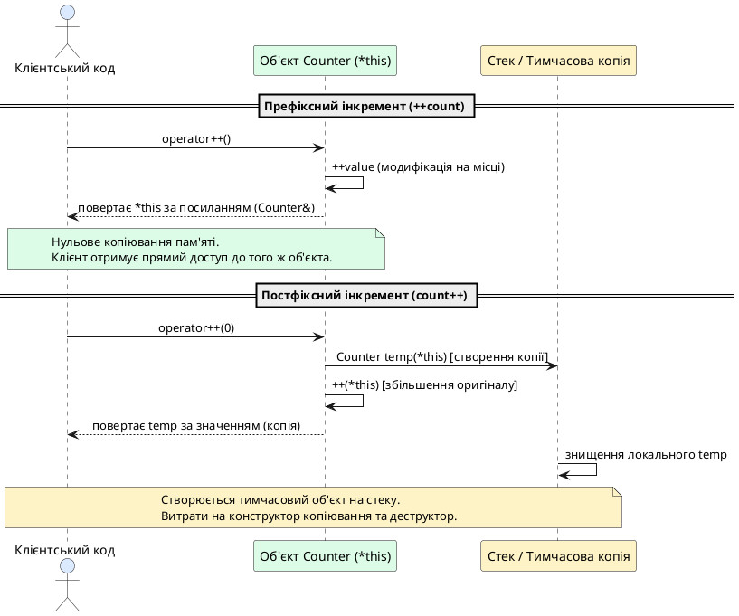
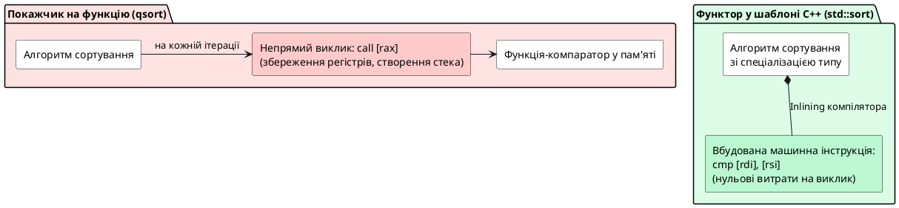
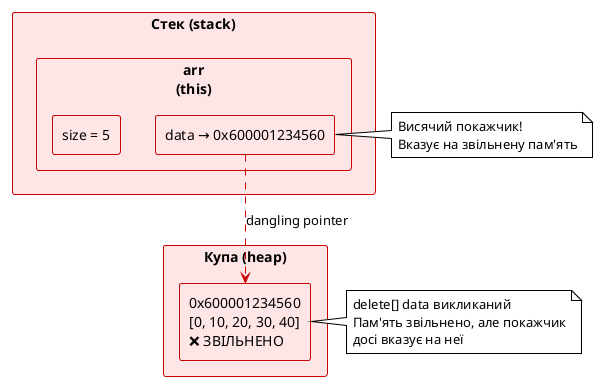
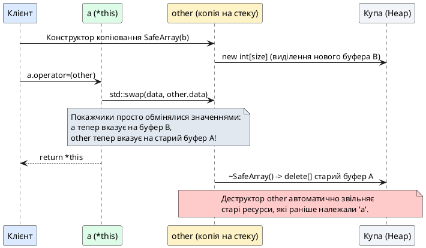

# Перевантаження операторів: методи класу та спеціальні оператори

## Від бінарних до унарних: нова категорія операторів

У попередній статті ми вивчили перевантаження **бінарних операторів** — операторів із двома операндами (`a + b`, `a < b`, `std::cout << a`). Ці оператори природно реалізовувати як friend-функції, бо обидва операнди мають рівну роль.

Але C++ має і **унарні оператори** — оператори з одним операндом. Також є **спеціальні оператори**, що працюють зовсім інакше: оператор індексації `[]`, оператор виклику функції `()`, оператори присвоювання `=`, `+=`, `-=`. Ці оператори тісно пов'язані з об'єктом, що стоїть зліва, тому їх природно реалізовувати як **методи класу**.

Розглянемо клас `Counter` — простий лічильник, що демонструє всі категорії операторів:

```cpp [CounterBasic.cpp] showLineNumbers
#include <iostream>

class Counter
{
private:
    int value;

public:
    Counter(int v = 0) : value(v) {}

    int getValue() const
    {
        return value;
    }

    void print() const
    {
        std::cout << "Counter: " << value;
    }
};

int main()
{
    Counter count(5);

    count.print();
    std::cout << "\n";

    // ❌ Хочемо писати:
    // count++;        // Інкремент
    // -count;         // Унарний мінус
    // count[0];       // Індексація (якщо це масив лічильників)
    // count(10);      // Виклик як функції

    // Але без перевантаження це не працює

    return 0;
}
```

Давайте навчимо клас `Counter` розуміти ці оператори.

::note
**Методи класу vs friend-функції:** коли оператор перевантажується як метод класу, лівий операнд стає **неявним об'єктом `this`**. Правий операнд (якщо є) передається як параметр. Це природно для операторів, де лівий операнд є «головним» — він модифікується або до нього звертаються.
::

### Механізм компіляції та неявний покажчик `this`

Коли компілятор C++ зустрічає вираз із оператором, він намагається знайти відповідну функцію за двома правилами перетворення:

1. **Як метод лівого операнда:** вираз `a @ b` перетворюється на виклик `a.operator@(b)`.
2. **Як глобальну або дружню функцію:** той самий вираз перетворюється на `operator@(a, b)`.

Якщо оператор визначено як метод класу, у його сигнатурі завжди на **один явний параметр менше**, ніж у відповідної вільної функції:

- **Бінарний оператор-метод** приймає лише один параметр (правий операнд), оскільки лівий операнд передається автоматично як неявний покажчик `ClassName* const this`.
- **Унарний оператор-метод** взагалі не приймає параметрів, оскільки його єдиним операндом і є сам об'єкт `*this`.

Це фундаментальне правило визначає архітектурний вибір способу перевантаження. Якщо операція є симетричною (наприклад, додавання `a + b`, де операнди можуть мінятися місцями або лівий операнд може бути примітивним числом на зразок `5 + counter`), її реалізують через дружні функції. Якщо ж операція змінює внутрішній стан об'єкта (`+=`, `=`, `++`) або концептуально належить самому об'єкту (`[]`, `()`, `->`), мовний стандарт C++ вимагає або наполегливо рекомендує реалізовувати її виключно як метод класу.

---

## Унарні оператори: `-`, `!`, `~`

Унарні оператори мають один операнд. Найпоширеніші:
- **Унарний мінус** (`-a`) — негація числа
- **Логічне НЕ** (`!a`) — інверсія булевого значення
- **Побітове НЕ** (`~a`) — інверсія бітів (рідко використовується для класів)

Унарні оператори перевантажуються як **const-методи** без параметрів:

```cpp [UnaryOperators.cpp] showLineNumbers
#include <iostream>

class Counter
{
private:
    int value;

public:
    Counter(int v = 0) : value(v) {}

    int getValue() const { return value; }

    // Унарний мінус: повертає новий Counter із від'ємним значенням
    Counter operator-() const
    {
        return Counter(-value);
    }

    // Логічне НЕ: повертає true, якщо лічильник дорівнює 0
    bool operator!() const
    {
        return value == 0;
    }

    void print() const
    {
        std::cout << "Counter: " << value;
    }
};

int main()
{
    Counter count(5);
    Counter zero(0);

    std::cout << "Original: ";
    count.print();
    std::cout << "\n";

    // Унарний мінус
    Counter negated = -count;
    std::cout << "Negated: ";
    negated.print();
    std::cout << "\n";

    // Логічне НЕ
    if (!zero)
    {
        std::cout << "Zero counter is empty (evaluates to true)\n";
    }

    if (!count)
    {
        std::cout << "This won't print\n";
    }
    else
    {
        std::cout << "Non-zero counter is not empty\n";
    }

    return 0;
}
```

::terminal-preview{title="./UnaryOperators"}

<div class="line"><span class="opacity-40">$</span> <strong class="font-bold">./UnaryOperators</strong></div>
<div class="line">Original: Counter: <span class="text-blue-400">5</span></div>
<div class="line">Negated: Counter: <span class="text-red-400">-5</span></div>
<div class="line">Zero counter is empty (evaluates to true)</div>
<div class="line">Non-zero counter is not empty</div>
<div class="line">Execution finished with <span class="text-green-400 font-bold">exit code 0</span>.</div>
::

**Рядки 14–17:** `operator-()` — const-метод без параметрів. Створює новий `Counter` із від'ємним значенням. Вираз `-count` компілятор перетворює на `count.operator-()`.

**Рядки 20–23:** `operator!()` повертає `bool`. Логіка: лічильник дорівнює нулю — це «порожній» стан, що логічно інтерпретується як `false`. Тому `!zero` дає `true`.

**Рядок 43:** вираз `-count` створює **анонімний тимчасовий об'єкт** `Counter(-5)`, який присвоюється змінній `negated`.

::tip
**Семантика унарного мінусу:** для числових типів (`int`, `double`) унарний мінус змінює знак. Для користувацьких типів семантика залежить від контексту. Для `Counter` — змінює знак значення. Для `Vector2D` — інвертує напрямок вектора. Для `Money` — змінює знак (борг vs актив).
::

### Чому унарний мінус повертає копію, а не посилання?

Студенти часто запитують: *«Якщо повернення за посиланням працює швидше й уникає копіювання, чому ми не повертаємо `Counter&`?»*.

У мові C++ повернення посилання з унарного мінуса є грубою помилкою з двох причин:

1. **Математична семантика операції:** У математиці та мовах програмування вираз `-x` обчислює нове від'ємне значення, але ніколи не змінює значення самої змінної `x`. Якщо метод повертатиме посилання на поточний об'єкт `*this`, йому доведеться мутувати поле `value`:
   ```cpp
   // ❌ ПОМИЛКОВА СЕМАНТИКА: змінює вихідний об'єкт
   Counter& operator-()
   {
       value = -value;
       return *this;
   }
   ```
   У такому разі вираз `Counter b = -a;` призведе до того, що значення `a` непомітно зміниться на протилежне, що суперечить принципам роботи мови.
2. **Загроза висячого посилання (*dangling reference*):** Якщо метод створює новий об'єкт всередині тіла функції для збереження результату, цей об'єкт розташовується у локальному стековому кадрі функції:
   ```cpp
   // ❌ КАТАСТРОФА ПАМ'ЯТІ: повернення посилання на локальну змінну
   Counter& operator-() const
   {
       Counter temp(-value);
       return temp; // ⚠️ temp знищується у момент виходу з функції!
   }
   ```
   Під час виходу з методу локальна змінна `temp` негайно знищується її деструктором. Посилання, яке повертається назовні, вказує на очищену область стека. Будь-яка спроба прочитати цей результат призводить до невизначеної поведінки (*undefined behavior*) та непередбачуваних збоїв програми.

Тому унарний мінус **завжди повертає новий об'єкт за значенням** (`Counter`). Сучасні компілятори застосовують оптимізацію повернення значення (*Return Value Optimization / RVO*), тому передача нового об'єкта відбувається без зайвих витрат пам'яті.

### Обов'язковість специфікатора `const`

Зверніть увагу на сигнатуру методу:
```cpp
Counter operator-() const;
bool operator!() const;
```

Специфікатор `const` у кінці заголовка методу є обов'язковим стандартом проектування. Він повідомляє компілятору, що метод гарантує незмінність стану об'єкта `*this`.

Якщо забути вказати `const`, ці методи неможливо буде викликати для константних екземплярів або тимчасових об'єктів:
```cpp
const Counter fixedCounter(42);
// Counter negated = -fixedCounter; // ❌ Помилка компіляції, якщо operator- не має const!
```

Константні методи розширюють гнучкість коду, дозволяючи використовувати об'єкти в операціях «тільки для читання».

### Побітове НЕ (`~`): робота з бітовими прапорцями

Оператор побітового заперечення `~` інвертує двійкові розряди числа (нулі стають одиницями, а одиниці — нулями). Для користувацьких класів його найчастіше перевантажують, коли об'єкт представляє бітову маску, набір прав доступу або прапорців стану:

```cpp [BitmaskExample.cpp] showLineNumbers
#include <iostream>

class Permissions
{
private:
    unsigned char mask; // Бітова маска дозволів (читання, запис, виконання)

public:
    explicit Permissions(unsigned char m = 0) : mask(m) {}

    unsigned char getMask() const { return mask; }

    // Побітове НЕ: інвертує всі дозволи
    Permissions operator~() const
    {
        return Permissions(static_cast<unsigned char>(~mask));
    }
};

int main()
{
    // Нехай біт 0 відповідає за читання (0b00000001 = 1)
    Permissions readOnly(1);

    // Інвертуємо маску: забороняємо читання, дозволяємо все інше
    Permissions inverted = ~readOnly;

    std::cout << "Original mask: " << static_cast<int>(readOnly.getMask()) << "\n";
    std::cout << "Inverted mask: " << static_cast<int>(inverted.getMask()) << "\n";

    return 0;
}
```

::note
Оператор `operator~()` також реалізується як `const`-метод без параметрів, що повертає новий екземпляр класу за значенням.
::

---

## Інкремент та декремент: `++` та `--`

Оператори інкременту (`++`) та декременту (`--`) існують у двох формах:
- **Префіксна** (`++a`, `--a`) — збільшує/зменшує значення, повертає посилання на змінений об'єкт
- **Постфіксна** (`a++`, `a--`) — збільшує/зменшує значення, повертає **копію старого стану**

Компілятор розрізняє ці форми за сигнатурою:

```cpp
// Префіксна форма: без параметрів, повертає посилання
Counter& operator++();      // ++count

// Постфіксна форма: фіктивний параметр int, повертає копію
Counter operator++(int);    // count++
```

Фіктивний параметр `int` у постфіксній формі — це **маркер для компілятора**, а не реальний аргумент. Його значення не використовується.

```cpp [IncrementDecrement.cpp] showLineNumbers
#include <iostream>

class Counter
{
private:
    int value;

public:
    Counter(int v = 0) : value(v) {}

    int getValue() const { return value; }

    // === Префіксний інкремент (++count) ===
    Counter& operator++()
    {
        ++value;        // Збільшуємо значення
        return *this;   // Повертаємо посилання на себе
    }

    // === Постфіксний інкремент (count++) ===
    Counter operator++(int)
    {
        Counter temp(*this);  // Зберігаємо копію поточного стану
        ++(*this);            // Викликаємо префіксну версію
        return temp;          // Повертаємо старий стан
    }

    // === Префіксний декремент (--count) ===
    Counter& operator--()
    {
        --value;
        return *this;
    }

    // === Постфіксний декремент (count--) ===
    Counter operator--(int)
    {
        Counter temp(*this);
        --(*this);
        return temp;
    }

    void print() const
    {
        std::cout << "Counter: " << value;
    }
};

int main()
{
    Counter count(5);

    std::cout << "Initial: ";
    count.print();
    std::cout << "\n";

    // Префіксний інкремент: збільшує і повертає нове значення
    ++count;
    std::cout << "After ++count: ";
    count.print();
    std::cout << "\n";

    // Постфіксний інкремент: збільшує, але повертає старе значення
    Counter old = count++;
    std::cout << "After count++, old: ";
    old.print();
    std::cout << ", current: ";
    count.print();
    std::cout << "\n";

    // Префіксний декремент
    --count;
    std::cout << "After --count: ";
    count.print();
    std::cout << "\n";

    // Постфіксний декремент
    Counter old2 = count--;
    std::cout << "After count--, old: ";
    old2.print();
    std::cout << ", current: ";
    count.print();
    std::cout << "\n";

    return 0;
}
```

::terminal-preview{title="./IncrementDecrement"}

<div class="line"><span class="opacity-40">$</span> <strong class="font-bold">./IncrementDecrement</strong></div>
<div class="line">Initial: Counter: <span class="text-blue-400">5</span></div>
<div class="line">After ++count: Counter: <span class="text-blue-400">6</span></div>
<div class="line">After count++, old: Counter: <span class="text-blue-400">6</span>, current: Counter: <span class="text-blue-400">7</span></div>
<div class="line">After --count: Counter: <span class="text-blue-400">6</span></div>
<div class="line">After count--, old: Counter: <span class="text-blue-400">6</span>, current: Counter: <span class="text-blue-400">5</span></div>
<div class="line">Execution finished with <span class="text-green-400 font-bold">exit code 0</span>.</div>
::

**Рядки 14–18:** префіксний `operator++()` збільшує `value` і повертає `*this` (посилання на поточний об'єкт). Це ефективно — без копіювання.

**Рядки 21–26:** постфіксний `operator++(int)` зберігає копію старого стану у `temp`, викликає префіксну версію для збільшення, повертає `temp`. Це **менш ефективно** через копіювання.

**Рядок 24:** `++(*this)` викликає префіксну версію `operator++()` для поточного об'єкта. Уникаємо дублювання коду.

**Рядки 67–68:** `Counter old = count++` демонструє різницю: `count` збільшується до 7, але `old` отримує старе значення 6.

::warning
**Продуктивність: префікс vs постфікс.** Постфіксна форма **завжди повільніша** за префіксну через створення тимчасової копії. Для примітивних типів (`int`, `double`) компілятор оптимізує це, але для класів копіювання може бути дорогим (особливо якщо клас керує динамічною пам'яттю). **Правило:** якщо вам не потрібно старе значення, використовуйте префіксну форму `++count` замість `count++`.
::

### Внутрішня механіка: чому префікс повертає посилання, а постфікс — значення?

Різниця в типах повернення між префіксною та постфіксною формами обумовлена фундаментальними правилами керування пам'яттю та семантикою мови C++:

1. **Префіксна форма (`++count`): семантика l-value та ланцюгові виклики.**
   Префіксний інкремент спочатку змінює стан об'єкта, а потім повертає його самого. Повернення за посиланням `Counter&` повертає сам об'єкт `*this`, який є повноцінним **l-value** (об'єктом, що має фіксовану адресу в пам'яті).
   Це дозволяє безпечно будувати послідовні ланцюжки:
   ```cpp
   ++++count; // Працює коректно: спочатку збільшує count, потім знову збільшує його ж
   ```
   Якби префіксний оператор повертав значення за копією (`Counter`), вираз `++++count` створив би проміжну тимчасову копію, яку збільшив би вдруге, тоді як оригінальний `count` збільшився б лише один раз. Повернення посилання гарантує, що всі операції застосовуються безпосередньо до оригінального об'єкта в пам'яті без жодних накладних витрат на копіювання.

2. **Постфіксна форма (`count++`): неможливість повернення посилання.**
   Контракт постфіксного оператора вимагає: *«збільш об'єкт, але поверни те значення, яке він мав ДО збільшення»*.
   Оскільки сам екземпляр `*this` вже отримав нове значення, попередній стан існує **виключно у локальній тимчасовій змінній** `temp`:
   ```cpp
   Counter operator++(int)
   {
       Counter temp(*this); // 1. Зберігаємо старий стан
       ++(*this);           // 2. Збільшуємо оригінал
       return temp;         // 3. Повертаємо копію старого стану
   }
   ```
   Спроба повернути `Counter&` на `temp` була б фатальною помилкою: після завершення виконання методу стек очищається, змінна `temp` знищується, а повернене посилання стає **висячим посиланням** (*dangling reference*). Саме тому постфіксний оператор зобов'язаний повертати результат виключно за значенням.

3. **Фіктивний параметр `int` як синтаксичний маркер.**
   Префіксний і постфіксний інкременти мають однакове ім'я функції — `operator++`. Щоб система перевантаження функцій C++ могла розрізнити їх на етапі аналізу типів, розробники мови додали фіктивний неіменований параметр `int` у постфіксний варіант.
   Під час виклику виразу `count++` компілятор автоматично перетворює його на `count.operator++(0)`. Значення аргументу `0` ніколи не використовується в коді — воно слугує лише сигналом для компілятора.

4. **Виклик `++(*this)`: принцип єдиного джерела правди.**
   У постфіксній формі замість дублювання коду `++value` викликається префіксний оператор `++(*this)`. Це гарантує, що вся логіка інкременту (перевірки меж, нормалізація, додаткові дії) зосереджена в одному місці.

::plant-uml{alt="Порівняння роботи префіксного та постфіксного інкременту"}



::

### Чому в інженерному коді та STL віддають перевагу `++i` замість `i++`

У циклах зі стандартними типами (`int`, `size_t`) сучасні оптимізатори компілятора зазвичай здатні прибрати зайве копіювання постфіксного інкременту. Проте для користувацьких класів та **ітераторів стандартної бібліотеки шаблонів** (STL) різниця є критичною.

Розглянемо стандартний цикл обходу контейнера:
```cpp
// ❌ Менш ефективно для важких ітераторів:
for (auto it = container.begin(); it != container.end(); it++) { ... }

// ✅ Рекомендований стандарт мови C++:
for (auto it = container.begin(); it != container.end(); ++it) { ... }
```

Ітератори складних асоціативних контейнерів (наприклад, `std::map`, `std::unordered_map` або `std::set`) під капотом містять складні структури даних: покажчики на вузли червоно-чорного дерева, індекси бакетів хеш-таблиці або глибину стека обходу. Кожен виклик `it++` створює повноцінну копію об'єкта ітератора, ініціалізує її поля, а наприкінці виразу викликає деструктор. У циклі на мільйон ітерацій це створює мільйон абсолютно непотрібних копіювань і руйнувань об'єктів.

::tip
**Золоте правило:** якщо вам не потрібен попередній стан змінної до її збільшення, завжди використовуйте префіксну форму `++x`.
::

---

## Оператор індексації: `[]`

Оператор індексації `[]` дозволяє звертатися до елементів контейнера як до масиву: `array[i]`. Щоб підтримувати як читання, так і запис, потрібно **дві версії** оператора:

1. **Не-const версія** — повертає `тип&` (посилання), дозволяє модифікацію
2. **Const версія** — повертає `const тип&` або `тип`, дозволяє лише читання

```cpp [ArrayWrapper.cpp] showLineNumbers
#include <iostream>
#include <cassert>

class IntArray
{
private:
    int data[10];
    int size;

public:
    IntArray() : size(10)
    {
        for (int i = 0; i < size; ++i)
        {
            data[i] = 0;
        }
    }

    int getSize() const { return size; }

    // Не-const версія: дозволяє запис array[i] = value
    int& operator[](int index)
    {
        assert(index >= 0 && index < size && "Index out of bounds");
        return data[index];
    }

    // Const версія: дозволяє читання з const об'єктів
    const int& operator[](int index) const
    {
        assert(index >= 0 && index < size && "Index out of bounds");
        return data[index];
    }
};

int main()
{
    IntArray array;

    // Запис через не-const версію
    array[0] = 10;
    array[1] = 20;
    array[5] = 50;

    std::cout << "array[0] = " << array[0] << "\n";
    std::cout << "array[1] = " << array[1] << "\n";
    std::cout << "array[5] = " << array[5] << "\n";

    // Const об'єкт — викликається const версія operator[]
    const IntArray constArray;
    // constArray[0] = 10;  // ❌ ПОМИЛКА: не можна змінювати const об'єкт
    std::cout << "constArray[0] = " << constArray[0] << "\n";  // ✅ Читання дозволено

    return 0;
}
```

::terminal-preview{title="./ArrayWrapper"}

<div class="line"><span class="opacity-40">$</span> <strong class="font-bold">./ArrayWrapper</strong></div>
<div class="line">array[0] = <span class="text-blue-400">10</span></div>
<div class="line">array[1] = <span class="text-blue-400">20</span></div>
<div class="line">array[5] = <span class="text-blue-400">50</span></div>
<div class="line">constArray[0] = <span class="text-blue-400">0</span></div>
<div class="line">Execution finished with <span class="text-green-400 font-bold">exit code 0</span>.</div>
::

**Рядки 22–26:** не-const `operator[]` повертає `int&` — посилання на елемент. Це дозволяє писати `array[0] = 10` (використання як l-value).

**Рядки 29–33:** const `operator[]` повертає `const int&` — константне посилання. Це дозволяє читати елемент, але не змінювати його.

**Рядок 24, 31:** `assert()` перевіряє коректність індексу під час виконання. У Debug-режимі це викличе зупинку програми при виході за межі. У Release-режимі (з `-DNDEBUG`) `assert` вимикається.

**Рядок 41–43:** вирази `array[i] = value` компілятор перетворює на `array.operator[](i) = value`. Оскільки `operator[]` повертає посилання, присвоювання працює.

**Рядок 53:** для `constArray` викликається const версія `operator[]`, яка повертає `const int&`. Спроба запису (рядок 52, закоментований) викликає помилку компіляції.

::note
**Чому дві версії?** Компілятор вибирає версію `operator[]` залежно від того, чи є об'єкт константним. Для `const IntArray` викликається const-метод. Це частина системи **const-коректності** C++ — механізму, що гарантує, що константні об'єкти не можуть бути змінені.
::

### Чому індексатор повинен повертати посилання, а не копію значення?

Головне питання розробки оператора індексації: *«Чому метод зобов'язаний повертати `int&`, а не звичайний `int`?»*.

У мові C++ оператор індексації використовується у двох принципово різних контекстах:
- **Читання значення (r-value контекст):** `int x = array[0];`
- **Запис значення (l-value контекст):** `array[0] = 10;`

Щоб елемент міг стояти ліворуч від оператора присвоювання (`=`), вираз `array[0]` повинен бути **l-value** (позначати реальну комірку пам'яті з фіксованою адресою, доступну для модифікації).

#### Сценарій 1: Повернення за значенням для примітивних типів

Якби неконстантна версія повертала значення за копією:
```cpp
// ❌ Помилкова спроба повернення за значенням:
int operator[](int index)
{
    return data[index]; // Повертає тимчасову копію числа
}
```

У цьому випадку вираз `array[0] = 10;` компілятор розгорне у:
```cpp
array.operator[](0) = 10; // ❌ Помилка компіляції!
```

Компілятор видасть помилку: `error: lvalue required as left operand of assignment`. Тимчасова копія числа, створена на стеку під час повернення з функції, є значенням категорії **r-value** (тимчасовим значенням). Записати нові дані в тимчасову копію неможливо — вона не має постійного місця в пам'яті та знищується одразу після обчислення виразу.

#### Сценарій 2: Катастрофа «тихої втрати даних» для класів та структур

Ще небезпечніша ситуація виникає, коли контейнер зберігає структури або об'єкти класів. Уявімо масив облікових записів студентів:

```cpp
struct Student
{
    std::string name;
    int grade;
};

class StudentGroup
{
private:
    Student students[30];

public:
    // ❌ Повернення за копією (прихована пастка):
    Student operator[](int index)
    {
        return students[index];
    }
};
```

Тепер клієнтський код намагається оновити оцінку студента:
```cpp
StudentGroup group;
group[0].grade = 100; // ⚠️ КОД КОМПІЛЮЄТЬСЯ, АЛЕ ДАНІ НЕ ЗБЕРІГАЮТЬСЯ!
```

Що відбувається під капотом:
1. Виклик `group.operator[](0)` створює **новий тимчасовий об'єкт** `Student` на стеку як копію `students[0]`.
2. Оператор присвоювання змінює поле `grade` у **тимчасовій копії**.
3. У кінці рядка (на крапці з комою `;`) тимчасова копія негайно знищується деструктором.
4. Оригінальний елемент `students[0]` всередині об'єкта `group` залишається **недоторканим**!

Це класичний приклад прихованої логічної помилки (*silent data loss*), яку надзвичайно складно виявити під час тестування: компілятор не видає жодних попереджень, але програма працює некоректно.

#### Рішення: повернення посилання на комірку пам'яті

Повертаючи `Type&`, оператор індексації повертає **псевдонім (аліас) безпосередньо тієї комірки пам'яті**, де зберігається елемент масиву:

```cpp
int& operator[](int index)
{
    return data[index]; // Пряме посилання на елемент внутрішнього масиву
}
```

Вираз `array[0] = 10;` напряму записує число `10` за адресою `&data[0]`, модифікуючи елемент на місці (*in-place*) без створення проміжних копій.

::plant-uml{alt="Порівняння повернення за посиланням та за значенням в operator[]"}

```plantuml
@startuml
skinparam style plain
skinparam backgroundColor #FFFFFF
skinparam packageStyle rectangle

package "Об'єкт IntArray (Пам'ять)" #F1F5F9 {
    rectangle "data[0] = 42 (адреса: 0x1000)" as Cell0 #DCFCE7
    rectangle "data[1] = 85 (адреса: 0x1004)" as Cell1 #F8FAFC
}

package "Повернення за посиланням: int& operator[](0)" #DBEAFE {
    rectangle "Посилання (l-value) → вказує прямо на 0x1000" as Ref #DCFCE7
    rectangle "array[0] = 99;\nЗапис безпосередньо за адресою 0x1000" as WriteRef
    Ref -> Cell0 : прямий доступ
    WriteRef -> Ref : модифікація
}

package "Повернення за копією: int operator[](0)" #FEE2E2 {
    rectangle "Тимчасова копія на стеку: 42 (адреса: 0x7FFF)" as Copy #FEE2E2
    rectangle "array[0] = 99;\nЗапис у 0x7FFF (копію)" as WriteCopy
    rectangle "Тимчасова копія 0x7FFF знищується!\nОригінал 0x1000 залишився рівним 42." as Destroy #FECACA
    WriteCopy -> Copy
    Copy -> Destroy
}
@enduml
```



::

### Анатомія const-коректності: чому необхідні дві версії?

Для повноцінного контейнера в C++ завжди потрібна пара операторів:
```cpp
int& operator[](int index);             // Версія 1: неконстантна
const int& operator[](int index) const; // Версія 2: константна
```

Проаналізуємо наслідки відсутності однієї з них:

1. **Якщо прибрати константну версію:**
   У реальних програмах об'єкти контейнерів часто передаються у функції за константним посиланням для уникнення копіювання:
   ```cpp
   void printArray(const IntArray& arr)
   {
       for (int i = 0; i < arr.getSize(); ++i)
       {
           std::cout << arr[i] << " "; // ❌ ПОМИЛКА КОМПІЛЯЦІЇ!
       }
   }
   ```
   Компілятор видасть помилку: неконстантний метод `operator[]` не можна викликати для константного об'єкта `arr`. Ми не зможемо навіть прочитати дані з об'єкта, переданого як `const`!

2. **Якщо прибрати неконстантну версію:**
   Якщо залишити тільки `const int& operator[](int index) const`, масив стане виключно «тільки для читання» (*read-only*). Спроба записати нове значення `arr[0] = 5;` не скомпілюється навіть для неконстантного об'єкта `arr`, оскільки результат оператора — константне посилання.

Компілятор обирає потрібну версію автоматично на основі константності об'єкта, до якого застосовується оператор (точніше, типу покажчика `this`).

### Безпека доступу: `operator[]` проти методу `at()`

У стандартній бібліотеці C++ (для `std::vector`, `std::array`, `std::string`) прийнято принципове архітектурне рішення:
- **`operator[]` не виконує перевірку виходу за межі діапазону у релізному коді.**
  Це реалізація принципу нульових накладних витрат (*zero-overhead principle*): операція індексації транслюється в одну машинну інструкцію зміщення адреси `*(data + index)`. У математичних алгоритмах та циклах із мільйонами звернень додаткова перевірка `if (index >= size)` сповільнювала б роботу програми. Звернення за некоректним індексом через `[]` призводить до невизначеної поведінки (*undefined behavior*) або аварійного завершення (*segmentation fault*).
- **Метод `.at(index)` гарантовано перевіряє межі.**
  Якщо переданий індекс виходить за допустимий діапазон `[0, size - 1]`, метод генерує виняток `std::out_of_range`. Це безпечний варіант для обробки користувацького вводу або ненадійних зовнішніх даних.

В навчальному класі `IntArray` ми використовували макрос `assert()`:
```cpp
assert(index >= 0 && index < size && "Index out of bounds");
```
Він працює виключно під час налагодження (у Debug-збірках) і повністю видаляється компілятором у фінальній оптимізованій релізній збірці (за наявності макросу `-DNDEBUG`).

### Індексація довільними типами та багатовимірні масиви

Оператор індексації не обмежений лише цілими числами. Параметром `operator[]` може бути будь-який тип даних:

```cpp
// Приклад асоціативного словника:
class PhoneBook
{
public:
    std::string& operator[](const std::string& name);
};
```

Такий підхід лежить в основі роботи контейнерів `std::map` та `std::unordered_map`, де звернення `book["Олексій"]` знаходить або створює запис за ключем.

#### Багатовимірні масиви: обмеження мови до C++23

До стандарту C++23 оператор індексації мав суворе обмеження: **він міг приймати рівно один параметр**.
Спроба написати `matrix[row, col]` призводила до того, що компілятор сприймав кому як оператор «кома» (*comma operator*), обчислював вираз `row`, ігнорував його й передавав лише `col`.

Щоб реалізувати доступ до двовимірних матриць, розробники використовували два підходи:
1. **Каскадна індексація `matrix[row][col]`:** перший виклик `operator[](row)` повертав проміжний покажчик на рядок або допоміжний об'єкт-проксі (*proxy object*), а другий оператор `[col]` здійснював індексацію стовпця (детально розглянуто нижче у практичному завданні).
2. **Оператор виклику функції `matrix(row, col)`:** перевантажували круглі дужки, які підтримують довільну кількість аргументів.

Лише у стандарті **C++23** було знято це обмеження й дозволено перевантажувати багатовимірний оператор індексації напряму:
```cpp
// Доступно у C++23:
double& operator[](size_t row, size_t col);
```

---

## Оператор виклику функції: `()` та функтори

Оператор виклику функції `()` дозволяє об'єкту поводитися як функція. Об'єкти з перевантаженим `operator()` називаються **функторами** (*functors*) або **об'єктами-функціями** (*function objects*).

Чому це корисно? Функтори можуть **зберігати стан** між викликами, на відміну від звичайних функцій. Це робить їх потужнішими за функції у певних сценаріях (наприклад, у алгоритмах STL).

```cpp [Functors.cpp] showLineNumbers
#include <iostream>

// Функтор-акумулятор: зберігає суму між викликами
class Accumulator
{
private:
    int total;

public:
    Accumulator() : total(0) {}

    // Оператор виклику: додає значення до суми
    int operator()(int value)
    {
        total += value;
        return total;
    }

    void reset()
    {
        total = 0;
    }
};

// Функтор-множник: зберігає коефіцієнт
class Multiplier
{
private:
    int factor;

public:
    Multiplier(int f) : factor(f) {}

    // Оператор виклику: множить аргумент на коефіцієнт
    int operator()(int value) const
    {
        return value * factor;
    }
};

int main()
{
    // Акумулятор: зберігає суму
    Accumulator sum;

    std::cout << "Accumulating:\n";
    std::cout << "sum(10) = " << sum(10) << "\n";  // 10
    std::cout << "sum(20) = " << sum(20) << "\n";  // 30
    std::cout << "sum(5) = " << sum(5) << "\n";    // 35

    sum.reset();
    std::cout << "After reset, sum(15) = " << sum(15) << "\n";  // 15

    // Множник: створюємо кілька функторів із різними коефіцієнтами
    Multiplier timesTwo(2);
    Multiplier timesTen(10);

    std::cout << "\nMultiplying:\n";
    std::cout << "timesTwo(5) = " << timesTwo(5) << "\n";    // 10
    std::cout << "timesTwo(8) = " << timesTwo(8) << "\n";    // 16
    std::cout << "timesTen(3) = " << timesTen(3) << "\n";    // 30

    return 0;
}
```

::terminal-preview{title="./Functors"}

<div class="line"><span class="opacity-40">$</span> <strong class="font-bold">./Functors</strong></div>
<div class="line">Accumulating:</div>
<div class="line">sum(10) = <span class="text-blue-400">10</span></div>
<div class="line">sum(20) = <span class="text-blue-400">30</span></div>
<div class="line">sum(5) = <span class="text-blue-400">35</span></div>
<div class="line">After reset, sum(15) = <span class="text-blue-400">15</span></div>
<div class="line"></div>
<div class="line">Multiplying:</div>
<div class="line">timesTwo(5) = <span class="text-blue-400">10</span></div>
<div class="line">timesTwo(8) = <span class="text-blue-400">16</span></div>
<div class="line">timesTen(3) = <span class="text-blue-400">30</span></div>
<div class="line">Execution finished with <span class="text-green-400 font-bold">exit code 0</span>.</div>
::

**Рядки 13–17:** `operator()` приймає один параметр `int value`, додає його до `total`, повертає суму. Вираз `sum(10)` компілятор перетворює на `sum.operator()(10)`.

**Рядки 48–50:** кожен виклик `sum(...)` збільшує внутрішній стан `total`. Це демонструє **збереження стану** — ключову перевагу функторів над звичайними функціями.

**Рядки 57–58:** створюємо два різні функтори `Multiplier` із різними коефіцієнтами. Кожен має власний стан (`factor`). Це як створити кілька «параметризованих функцій».

**Рядки 61–63:** виклики `timesTwo(5)` та `timesTen(3)` демонструють, що функтори можуть мати різну поведінку залежно від їхнього стану.

### Функтори-предикати: фільтрація даних

**Предикат** (*predicate*) — це функція або функтор, що повертає `bool`. Предикати використовуються для фільтрації елементів у контейнерах. Розглянемо функтор-предикат для перевірки діапазону значень:

```cpp [PredicateFunctor.cpp] showLineNumbers
#include <iostream>
#include <vector>
#include <algorithm>

// Функтор-предикат: перевіряє, чи входить число у діапазон
class InRange
{
private:
    int minValue;
    int maxValue;

public:
    InRange(int min, int max) : minValue(min), maxValue(max) {}

    // Оператор виклику: повертає true, якщо value у діапазоні [min, max]
    bool operator()(int value) const
    {
        return value >= minValue && value <= maxValue;
    }
};

int main()
{
    std::vector<int> numbers = {5, 12, 3, 18, 7, 25, 9, 14, 2, 20};

    std::cout << "Original numbers: ";
    for (int n : numbers)
    {
        std::cout << n << " ";
    }
    std::cout << "\n\n";

    // Створюємо функтор-предикат: діапазон [10, 20]
    InRange inRange(10, 20);

    // Знаходимо перший елемент у діапазоні
    auto it = std::find_if(numbers.begin(), numbers.end(), inRange);
    if (it != numbers.end())
    {
        std::cout << "First number in range [10, 20]: " << *it << "\n";
    }

    // Підраховуємо кількість чисел у діапазоні
    int count = std::count_if(numbers.begin(), numbers.end(), inRange);
    std::cout << "Count of numbers in range [10, 20]: " << count << "\n\n";

    // Виводимо всі числа у діапазоні
    std::cout << "Numbers in range [10, 20]: ";
    for (int n : numbers)
    {
        if (inRange(n))  // Використовуємо функтор як функцію
        {
            std::cout << n << " ";
        }
    }
    std::cout << "\n";

    return 0;
}
```

::terminal-preview{title="./PredicateFunctor"}

<div class="line"><span class="opacity-40">$</span> <strong class="font-bold">./PredicateFunctor</strong></div>
<div class="line">Original numbers: 5 12 3 18 7 25 9 14 2 20</div>
<div class="line"></div>
<div class="line">First number in range [10, 20]: <span class="text-green-400">12</span></div>
<div class="line">Count of numbers in range [10, 20]: <span class="text-blue-400">4</span></div>
<div class="line"></div>
<div class="line">Numbers in range [10, 20]: <span class="text-green-400">12 18 14 20</span></div>
<div class="line">Execution finished with <span class="text-green-400 font-bold">exit code 0</span>.</div>
::

**Рядки 15–19:** `operator()` приймає `int value` і повертає `bool`. Це робить `InRange` предикатом — об'єктом, що перевіряє умову.

**Рядок 37:** `std::find_if` приймає функтор як третій параметр. Алгоритм викликає `inRange(element)` для кожного елемента, доки не знайде перший, що задовольняє умову.

**Рядок 45:** `std::count_if` підраховує кількість елементів, для яких `inRange(element)` повертає `true`.

**Рядок 52:** можемо викликати функтор безпосередньо: `inRange(n)` еквівалентний `inRange.operator()(n)`.

### Функтори-компаратори: власні правила сортування

Компаратор — це функтор, що визначає порядок сортування. Стандартне сортування `std::sort` за замовчуванням сортує за зростанням (`<`), але компаратор дозволяє задати власну логіку:

```cpp [ComparatorFunctor.cpp] showLineNumbers
#include <iostream>
#include <vector>
#include <algorithm>
#include <string>

struct Student
{
    std::string name;
    int grade;
};

// Функтор-компаратор: сортує студентів за оцінкою (за спаданням)
class CompareByGrade
{
public:
    bool operator()(const Student& a, const Student& b) const
    {
        return a.grade > b.grade;  // Більша оцінка — вище у списку
    }
};

// Функтор-компаратор: сортує за іменем (за зростанням)
class CompareByName
{
public:
    bool operator()(const Student& a, const Student& b) const
    {
        return a.name < b.name;  // Лексикографічний порядок
    }
};

int main()
{
    std::vector<Student> students = {
        {"Alice", 85},
        {"Bob", 92},
        {"Charlie", 78},
        {"Diana", 95},
        {"Eve", 88}
    };

    // Сортування за оцінкою (за спаданням)
    std::sort(students.begin(), students.end(), CompareByGrade());

    std::cout << "Sorted by grade (descending):\n";
    for (const auto& s : students)
    {
        std::cout << s.name << ": " << s.grade << "\n";
    }

    // Сортування за іменем (за зростанням)
    std::sort(students.begin(), students.end(), CompareByName());

    std::cout << "\nSorted by name (ascending):\n";
    for (const auto& s : students)
    {
        std::cout << s.name << ": " << s.grade << "\n";
    }

    return 0;
}
```

::terminal-preview{title="./ComparatorFunctor"}

<div class="line"><span class="opacity-40">$</span> <strong class="font-bold">./ComparatorFunctor</strong></div>
<div class="line">Sorted by grade (descending):</div>
<div class="line"><span class="text-blue-400">Diana</span>: 95</div>
<div class="line"><span class="text-blue-400">Bob</span>: 92</div>
<div class="line"><span class="text-blue-400">Eve</span>: 88</div>
<div class="line"><span class="text-blue-400">Alice</span>: 85</div>
<div class="line"><span class="text-blue-400">Charlie</span>: 78</div>
<div class="line"></div>
<div class="line">Sorted by name (ascending):</div>
<div class="line"><span class="text-green-400">Alice</span>: 85</div>
<div class="line"><span class="text-green-400">Bob</span>: 92</div>
<div class="line"><span class="text-green-400">Charlie</span>: 78</div>
<div class="line"><span class="text-green-400">Diana</span>: 95</div>
<div class="line"><span class="text-green-400">Eve</span>: 88</div>
<div class="line">Execution finished with <span class="text-green-400 font-bold">exit code 0</span>.</div>
::

**Рядки 16–19:** `CompareByGrade::operator()` приймає два об'єкти `Student` і повертає `true`, якщо перший має бути **раніше** за другий у відсортованій послідовності. Логіка `a.grade > b.grade` означає сортування за спаданням.

**Рядок 43:** `std::sort` приймає компаратор як третій параметр. Створюємо анонімний тимчасовий об'єкт `CompareByGrade()`.

**Рядок 52:** змінюємо критерій сортування, передаючи інший функтор `CompareByName()`. Той самий вектор, різний порядок.

### Функтори з декількома параметрами та станом

Функтори можуть приймати кілька параметрів і зберігати складний стан. Розглянемо функтор для обчислення зваженого середнього:

```cpp [WeightedAverage.cpp] showLineNumbers
#include <iostream>
#include <vector>

// Функтор: обчислює зважене середнє
class WeightedAverage
{
private:
    double sumWeighted;  // Сума зважених значень
    double sumWeights;   // Сума ваг

public:
    WeightedAverage() : sumWeighted(0.0), sumWeights(0.0) {}

    // Оператор виклику з двома параметрами: значення і вага
    void operator()(double value, double weight)
    {
        sumWeighted += value * weight;
        sumWeights += weight;
    }

    double getAverage() const
    {
        return (sumWeights != 0.0) ? (sumWeighted / sumWeights) : 0.0;
    }

    void reset()
    {
        sumWeighted = 0.0;
        sumWeights = 0.0;
    }
};

int main()
{
    WeightedAverage avg;

    std::cout << "Calculating weighted average of grades:\n";
    std::cout << "Math (weight 3): 90\n";
    std::cout << "Physics (weight 3): 85\n";
    std::cout << "History (weight 2): 78\n";
    std::cout << "Art (weight 1): 95\n\n";

    // Додаємо оцінки з вагами
    avg(90, 3);  // Математика: оцінка 90, вага 3
    avg(85, 3);  // Фізика: оцінка 85, вага 3
    avg(78, 2);  // Історія: оцінка 78, вага 2
    avg(95, 1);  // Мистецтво: оцінка 95, вага 1

    std::cout << "Weighted average: " << avg.getAverage() << "\n\n";

    // Скидаємо стан і обчислюємо для іншого студента
    avg.reset();
    std::cout << "Another student:\n";
    avg(75, 3);
    avg(80, 3);
    avg(92, 2);
    avg(88, 1);
    std::cout << "Weighted average: " << avg.getAverage() << "\n";

    return 0;
}
```

::terminal-preview{title="./WeightedAverage"}

<div class="line"><span class="opacity-40">$</span> <strong class="font-bold">./WeightedAverage</strong></div>
<div class="line">Calculating weighted average of grades:</div>
<div class="line">Math (weight 3): 90</div>
<div class="line">Physics (weight 3): 85</div>
<div class="line">History (weight 2): 78</div>
<div class="line">Art (weight 1): 95</div>
<div class="line"></div>
<div class="line">Weighted average: <span class="text-blue-400">85.3333</span></div>
<div class="line"></div>
<div class="line">Another student:</div>
<div class="line">Weighted average: <span class="text-blue-400">80.2222</span></div>
<div class="line">Execution finished with <span class="text-green-400 font-bold">exit code 0</span>.</div>
::

**Рядки 15–19:** `operator()` приймає **два параметри**: `value` і `weight`. Це демонструє, що функтори можуть мати довільну кількість параметрів.

**Рядки 45–48:** кожен виклик `avg(value, weight)` накопичує дані у полях `sumWeighted` і `sumWeights`. Стан зберігається між викликами.

**Рядок 50:** метод `getAverage()` обчислює фінальний результат на основі накопиченого стану.

### Зв'язок із лямбда-виразами (C++11)

У C++11 з'явилися **лямбда-вирази** (*lambda expressions*) — синтаксичний цукор для створення анонімних функторів. Кожна лямбда під капотом компілюється в клас із перевантаженим `operator()`.

Порівняння функтора та лямбди:

::::code-group
:::code-block{label="Функтор (C++03)" active}
```cpp
class GreaterThan
{
private:
    int threshold;

public:
    GreaterThan(int t) : threshold(t) {}

    bool operator()(int value) const
    {
        return value > threshold;
    }
};

// Використання
std::vector<int> numbers = {5, 12, 3, 18, 7};
int count = std::count_if(numbers.begin(), numbers.end(), GreaterThan(10));
```
:::

:::code-block{label="Лямбда (C++11)"}
```cpp
// Немає потреби у класі — лямбда генерує його автоматично
std::vector<int> numbers = {5, 12, 3, 18, 7};

// Захоплення змінної threshold за значенням
int threshold = 10;
int count = std::count_if(numbers.begin(), numbers.end(), 
                          [threshold](int value) { return value > threshold; });

// Або без захоплення (константа вбудована в лямбду)
int count2 = std::count_if(numbers.begin(), numbers.end(), 
                           [](int value) { return value > 10; });
```
:::
::::

**Що відбувається під капотом лямбди:**

```cpp
// Лямбда:
[threshold](int value) { return value > threshold; }

// Компілюється приблизно у:
class __Lambda_Anonymous_1
{
private:
    int threshold;  // Захоплена змінна

public:
    __Lambda_Anonymous_1(int t) : threshold(t) {}

    bool operator()(int value) const
    {
        return value > threshold;
    }
};
```

::note{icon="lucide:lightbulb"}
**Коли використовувати функтори, а коли лямбди:**

**Функтори (класи з `operator()`):**
- ✅ Складна логіка з кількома методами (`reset()`, `getState()`, тощо)
- ✅ Повторне використання в різних місцях коду
- ✅ Читабельність: клас має змістовне ім'я (`InRange`, `CompareByGrade`)
- ✅ Backward compatibility: код має працювати до C++11

**Лямбди:**
- ✅ Проста, одноразова логіка (1–3 рядки коду)
- ✅ Використання лише в одному місці
- ✅ Коротший синтаксис для локальних операцій
- ✅ Сучасний стиль C++ (C++11 і новіше)
::

::tip{icon="lucide:zap"}
**Функтори у стандартній бібліотеці:** алгоритми STL (`std::sort`, `std::find_if`, `std::transform`, `std::for_each`, `std::count_if`) активно використовують функтори. Стандартна бібліотека надає готові функтори:

- `std::greater<T>()` — компаратор для сортування за спаданням
- `std::less<T>()` — компаратор за зростанням (за замовчуванням)
- `std::plus<T>()`, `std::minus<T>()`, `std::multiplies<T>()` — арифметичні операції
- `std::logical_and<T>()`, `std::logical_or<T>()` — логічні операції

Приклад:
```cpp
std::vector<int> vec = {5, 2, 8, 1, 9};
std::sort(vec.begin(), vec.end(), std::greater<int>());  // Сортування за спаданням
```
::

### Чому функтори в STL значно швидші за звичайні покажчики на функції?

Одне з найважливіших питань оптимізації продуктивності в C++: *«Чому алгоритми STL, параметризовані функторами або лямбдами, працюють швидше за аналогічні функції мови C (наприклад, `qsort`), що приймають звичайні покажчики на функції?»*.

Відповідь полягає у механізмах роботи оптимізатора компілятора та системі шаблонів:

1. **Виклик через покажчик на функцію (C-style):**
   Коли функція приймає адресу функції `bool (*cmp)(const Student&, const Student&)`, компілятор не знає точного тіла цієї функції під час трансляції алгоритму сортування. На машинному рівні кожен крок порівняння перетворюється на **непрямий виклик** (*indirect call*, інструкція `call rax`).
   Це створює відчутні накладні витрати:
   - Процесор змушений завантажувати адресу зі змінної та скидати конвеєр інструкцій у разі помилки передбачення переходу (*branch misprediction*).
   - Для кожного виклику створюється стековий кадр та зберігаються регістри процесора.
   - Компілятор **не здатний заінлайнити** (*inline*) тіло порівняння всередину циклу.

2. **Виклик через функтор у шаблонах C++:**
   У STL алгоритм `std::sort` визначено як шаблон:
   ```cpp
   template <typename RandomIt, typename Compare>
   void sort(RandomIt first, RandomIt last, Compare comp);
   ```
   Зверніть увагу: компаратор `Compare` є **типом**, а не адресою функції! Коли ми передаємо об'єкт `CompareByGrade()`, компілятор створює спеціалізовану версію функції сортування саме для цього типу. Він бачить точний вихідний код методу `CompareByGrade::operator()` і виконує **вбудовування коду** (*inline expansion*).
   
   Операція виклику функції повністю зникає з бінарного коду: логіка `a.grade > b.grade` підставляється безпосередньо у внутрішній цикл алгоритму як проста інструкція порівняння процесора `cmp`. Завдяки цьому `std::sort` у C++ зазвичай працює у 2–5 разів швидше за стандартний `qsort` із бібліотеки C.

::plant-uml{alt="Порівняння непрямого виклику покажчика на функцію та inlining функтора"}



::

### Багатовимірна індексація за допомогою `operator()`

Оператор виклику функції `()` володіє унікальною властивістю, якої немає в жодного іншого оператора C++:
- Він може приймати **будь-яку кількість аргументів** (від нуля до кількох).
- Він підтримує **значення аргументів за замовчуванням**.

Саме тому в інженерній практиці C++ оператор `()` традиційно використовується як стандартний спосіб доступу до елементів двовимірних і тривимірних матриць, таблиць та тензорів:

```cpp [MatrixParentheses.cpp] showLineNumbers
#include <iostream>
#include <cassert>

class SimpleMatrix
{
private:
    int rows;
    int cols;
    double* data;

public:
    SimpleMatrix(int r, int c) : rows(r), cols(c), data(new double[r * c]()) {}

    ~SimpleMatrix()
    {
        delete[] data;
    }

    // Двовимірний оператор доступу: читання та запис
    double& operator()(int r, int c)
    {
        assert(r >= 0 && r < rows && c >= 0 && c < cols && "Matrix index out of bounds");
        return data[r * cols + c];
    }

    // Константна версія для читання
    const double& operator()(int r, int c) const
    {
        assert(r >= 0 && r < rows && c >= 0 && c < cols && "Matrix index out of bounds");
        return data[r * cols + c];
    }
};

int main()
{
    SimpleMatrix mat(3, 3);

    // Зручний синтаксис звернення з двома координатами:
    mat(0, 0) = 1.0;
    mat(1, 1) = 5.5;
    mat(2, 2) = 9.9;

    std::cout << "mat(1, 1) = " << mat(1, 1) << "\n";

    return 0;
}
```

Переваги такого підходу:
1. **Єдиний виклик методу:** координати `(r, c)` передаються одночасно, тому метод може перевірити межі обох осей одразу.
2. **Чистота інкапсуляції:** клас повністю контролює обчислення зміщення в одновимірному буфері пам'яті (`r * cols + c`), не виставляючи назовні проміжних покажчиків.

---

## Оператори присвоювання: `=`, `+=`, `-=`, `*=`, `/=`

Оператори присвоювання **модифікують** лівий операнд і **повертають посилання на нього** для підтримки ланцюгових присвоювань (`a = b = c`). Ці оператори **завжди** реалізуються як методи класу.

### Базовий оператор присвоювання `=`

Оператор присвоювання `=` викликається при `a = b`, коли `a` вже існує (на відміну від конструктора копіювання, що викликається при ініціалізації `Counter a = b`).

```cpp [AssignmentOperator.cpp] showLineNumbers
#include <iostream>

class Counter
{
private:
    int value;

public:
    Counter(int v = 0) : value(v) {}

    int getValue() const { return value; }

    // Оператор присвоювання
    Counter& operator=(const Counter& other)
    {
        // Перевірка самоприсвоювання (self-assignment check)
        if (this == &other)
        {
            return *this;
        }

        // Копіюємо дані
        value = other.value;

        // Повертаємо посилання на себе для ланцюгових присвоювань
        return *this;
    }

    void print() const
    {
        std::cout << "Counter: " << value;
    }
};

int main()
{
    Counter a(10);
    Counter b(20);
    Counter c(30);

    std::cout << "Initial values:\n";
    std::cout << "a = "; a.print(); std::cout << "\n";
    std::cout << "b = "; b.print(); std::cout << "\n";
    std::cout << "c = "; c.print(); std::cout << "\n\n";

    // Просте присвоювання
    a = b;
    std::cout << "After a = b:\n";
    std::cout << "a = "; a.print(); std::cout << "\n\n";

    // Ланцюгове присвоювання: a = b = c виконується справа наліво
    a = b = c;
    std::cout << "After a = b = c:\n";
    std::cout << "a = "; a.print(); std::cout << "\n";
    std::cout << "b = "; b.print(); std::cout << "\n";

    // Самоприсвоювання — має бути безпечним
    a = a;
    std::cout << "\nAfter a = a (self-assignment):\n";
    std::cout << "a = "; a.print(); std::cout << "\n";

    return 0;
}
```

::terminal-preview{title="./AssignmentOperator"}

<div class="line"><span class="opacity-40">$</span> <strong class="font-bold">./AssignmentOperator</strong></div>
<div class="line">Initial values:</div>
<div class="line">a = Counter: <span class="text-blue-400">10</span></div>
<div class="line">b = Counter: <span class="text-blue-400">20</span></div>
<div class="line">c = Counter: <span class="text-blue-400">30</span></div>
<div class="line"></div>
<div class="line">After a = b:</div>
<div class="line">a = Counter: <span class="text-blue-400">20</span></div>
<div class="line"></div>
<div class="line">After a = b = c:</div>
<div class="line">a = Counter: <span class="text-blue-400">30</span></div>
<div class="line">b = Counter: <span class="text-blue-400">30</span></div>
<div class="line"></div>
<div class="line">After a = a (self-assignment):</div>
<div class="line">a = Counter: <span class="text-blue-400">30</span></div>
<div class="line">Execution finished with <span class="text-green-400 font-bold">exit code 0</span>.</div>
::

**Рядки 14–27:** `operator=` повертає `Counter&` — посилання на поточний об'єкт. Це дозволяє ланцюгові присвоювання.

**Рядки 17–20:** перевірка самоприсвоювання `if (this == &other)`. Якщо `a = a`, одразу повертаємо `*this`. Це оптимізація та захист від помилок (важливо для класів із динамічною пам'яттю).

**Рядок 26:** `return *this;` — повертаємо посилання на поточний об'єкт. Компілятор перетворює `a = b` на `a.operator=(b)`, що повертає `a`.

**Рядок 53:** ланцюгове присвоювання `a = b = c` виконується **справа наліво**: спочатку `b = c` (повертає `b`), потім `a = b`. Завдяки поверненню `*this` це працює.

**Рядок 59:** самоприсвоювання `a = a` — рідкісний сценарій, але перевірка гарантує коректність.

### Чому `operator=` зобов'язаний повертати посилання `Counter&`?

Сигнатура оператора присвоювання завжди має вигляд `ClassName& operator=(const ClassName& other)`. Студенти часто цікавляться: *«Чи не можна повернути `void` або повертати об'єкт за значенням `Counter`?»*.

Проаналізуємо наслідки відхилення від стандарту:

1. **Якщо метод повертає `void`:**
   У вбудованих типах мови C++ оператор присвоювання підтримує ланцюжки:
   ```cpp
   a = b = c;
   ```
   Операція присвоювання має **правобічну асоціативність** (виконується справа наліво): вираз `(b = c)` обчислюється першим, змінює `b` і повертає результат, який потім передається як правий операнд для `a = ...`.
   Якби метод повертав `void`, вираз розгорнувся б у `a.operator=(b.operator=(c))`, що призведе до помилки компіляції: неможливо передати тип `void` у метод, який очікує `const Counter&`.

2. **Якщо метод повертає значення за копією (`Counter`):**
   При поверненні за копією вираз `(a = b)` створить тимчасовий анонімний об'єкт. Якщо хтось напише складніший вираз на зразок:
   ```cpp
   (a = b) = c;
   ```
   При поверненні за значенням значення `c` буде присвоєно **тимчасовій копії**, а оригінальний об'єкт `a` залишиться зі значенням `b`. Для вбудованих типів C++ вираз `(x = y) = z` змінює саму змінну `x` на `z`, тому що результат присвоювання є **l-value посиланням**.

Повернення `*this` за посиланням (`Counter&`) повністю зберігає узгодженість поведінки класу зі стандартними типами мови C++ та уникає будь-якого зайвого копіювання пам'яті.

::caution
**Самоприсвоювання та динамічна пам'ять:** для класів із динамічною пам'яттю (як `std::string`, що містить `char*`) самоприсвоювання без перевірки може призвести до **катастрофи**. Якщо `operator=` спочатку звільняє стару пам'ять (`delete[]`), а потім копіює з `other` (що насправді `this`), ви копіюєте зі звільненої пам'яті — undefined behavior. Перевірка `if (this == &other)` запобігає цьому. Нижче детальний приклад проблеми.
::

### Катастрофа самоприсвоювання: детальний розбір

Розглянемо клас `DynamicArray`, що керує динамічною пам'яттю **без перевірки самоприсвоювання**:

::::code-group
:::code-block{label="Небезпечна реалізація" active}
```cpp
#include <iostream>
#include <cstring>

class DynamicArray
{
private:
    int* data;
    int size;

public:
    DynamicArray(int sz) : size(sz)
    {
        data = new int[sz];
        for (int i = 0; i < sz; ++i)
        {
            data[i] = i * 10;
        }
        std::cout << "Allocated array at " << data << "\n";
    }

    ~DynamicArray()
    {
        std::cout << "Deleting array at " << data << "\n";
        delete[] data;
    }

    // ❌ НЕБЕЗПЕЧНИЙ operator= без перевірки самоприсвоювання
    DynamicArray& operator=(const DynamicArray& other)
    {
        // Крок 1: Звільняємо стару пам'ять
        delete[] data;
        std::cout << "Deleted old memory at " << data << "\n";

        // Крок 2: Виділяємо нову пам'ять
        size = other.size;
        data = new int[size];
        std::cout << "Allocated new memory at " << data << "\n";

        // Крок 3: Копіюємо дані з other
        for (int i = 0; i < size; ++i)
        {
            data[i] = other.data[i];  // ← КАТАСТРОФА при самоприсвоюванні!
        }

        return *this;
    }

    void print() const
    {
        std::cout << "[";
        for (int i = 0; i < size; ++i)
        {
            std::cout << data[i];
            if (i < size - 1) std::cout << ", ";
        }
        std::cout << "]";
    }
};

int main()
{
    DynamicArray arr(5);

    std::cout << "\n=== BEFORE self-assignment ===\n";
    std::cout << "arr = ";
    arr.print();
    std::cout << "\n";

    // КАТАСТРОФА: самоприсвоювання
    std::cout << "\n=== EXECUTING arr = arr ===\n";
    arr = arr;  // ← this == &other, але немає перевірки!

    std::cout << "\n=== AFTER self-assignment ===\n";
    std::cout << "arr = ";
    arr.print();  // ← Undefined Behavior: читання зі звільненої пам'яті
    std::cout << "\n";

    return 0;
}
```
:::

:::code-block{label="Вивід програми (undefined behavior)"}
```text
Allocated array at 0x600001234560

=== BEFORE self-assignment ===
arr = [0, 10, 20, 30, 40]

=== EXECUTING arr = arr ===
Deleted old memory at 0x600001234560
Allocated new memory at 0x600001788900
arr = [0, 0, 0, 0, 0]  ← Дані загублено!

=== AFTER self-assignment ===
arr = [0, 0, 0, 0, 0]  ← Замість [0, 10, 20, 30, 40]

Deleting array at 0x600001788900
```
:::
::::

#### Анатомія катастрофи (покроковий аналіз)

Що відбувається при виконанні `arr = arr`:

**Крок 1 (рядок 28):** `delete[] data;`
- **До**: `data` вказує на блок пам'яті `0x600001234560` з даними `[0, 10, 20, 30, 40]`
- **Після**: пам'ять звільнено, `data` — **висячий покажчик** (*dangling pointer*)
- **Проблема**: `other.data` **також вказує на цю звільнену пам'ять** (бо `this == &other`)!

::plant-uml

::

**Крок 2 (рядки 32–34):** Виділення нової пам'яті
- Виділяємо новий блок `0x600001788900`
- **Проблема**: `other.data` **досі вказує на звільнену пам'ять** `0x600001234560`!

**Крок 3 (рядки 37–40):** Копіювання з `other.data`
```cpp
data[i] = other.data[i];  // ← Читаємо зі звільненої пам'яті!
```

- `other.data[i]` — **доступ до звільненої пам'яті** (undefined behavior)
- Може повернути:
  - Нулі (якщо ОС очистила пам'ять)
  - Сміттєві дані
  - Викликати segmentation fault (крах програми)

::memory-view
```yaml
before_self_assignment:
  heap:
    - address: "0x600001234560"
      content: "[0, 10, 20, 30, 40]"
      status: "allocated"
      owner: "arr.data"
  stack:
    - name: "arr"
      data: "→ 0x600001234560"
      size: 5

after_delete_step:
  heap:
    - address: "0x600001234560"
      content: "❌ FREED MEMORY (undefined)"
      status: "freed"
      danger: "dangling pointer!"
    - address: "0x600001788900"
      content: "[?, ?, ?, ?, ?]"
      status: "allocated (new)"
  stack:
    - name: "arr"
      data: "→ 0x600001788900 (NEW)"
      size: 5
  problem: "other.data досі вказує на 0x600001234560 (freed)!"

after_copy_step:
  heap:
    - address: "0x600001788900"
      content: "[0, 0, 0, 0, 0] ← Скопійовано сміття!"
      status: "allocated"
  stack:
    - name: "arr"
      data: "→ 0x600001788900"
      size: 5
  result: "Дані загублено через копіювання зі звільненої пам'яті"
```
::

#### Безпечна реалізація з перевіркою

::::code-group
:::code-block{label="Правильна реалізація" active}
```cpp
DynamicArray& operator=(const DynamicArray& other)
{
    // ✅ Перевірка самоприсвоювання
    if (this == &other)
    {
        std::cout << "Self-assignment detected, skipping copy\n";
        return *this;
    }

    // Тепер безпечно звільняти пам'ять
    delete[] data;

    size = other.size;
    data = new int[size];

    // Копіюємо з валідної пам'яті
    for (int i = 0; i < size; ++i)
    {
        data[i] = other.data[i];
    }

    return *this;
}
```
:::

:::code-block{label="Вивід із перевіркою"}
```text
Allocated array at 0x600001234560

=== BEFORE self-assignment ===
arr = [0, 10, 20, 30, 40]

=== EXECUTING arr = arr ===
Self-assignment detected, skipping copy

=== AFTER self-assignment ===
arr = [0, 10, 20, 30, 40]  ← Дані збережено!

Deleting array at 0x600001234560
```
:::
::::

#### Чому це критично важливо?

**Реальні сценарії самоприсвоювання:**

1. **Цикли з контейнерами**:
   ```cpp
   std::vector<DynamicArray> vec;
   // ... заповнення вектора
   vec[i] = vec[i];  // Випадково перезаписали самого себе
   ```

2. **Складні вирази**:
   ```cpp
   DynamicArray& getArray(int index);
   getArray(5) = getArray(5);  // Неочевидне самоприсвоювання
   ```

3. **Алгоритми сортування**:
   ```cpp
   std::sort(vec.begin(), vec.end());  // Може викликати arr = arr
   ```

::warning{icon="lucide:skull"}
**Ціна помилки:** відсутність перевірки самоприсвоювання у продакшен-коді може призвести до:
- **Втрати даних** (дані перезаписуються нулями або сміттям)
- **Segmentation fault** (крах програми при доступі до звільненої пам'яті)
- **Витоків пам'яті** (якщо виділяється нова пам'ять, але стара не звільняється коректно)
- **Heisenbug** — помилка проявляється непередбачувано (залежить від стану пам'яті)
::

#### Резюме: правило безпеки

::tip{icon="lucide:shield-check"}
**Золоте правило `operator=`:**  
Якщо клас керує **динамічними ресурсами** (пам'ять, файли, сокети, мʼютекси), оператор присвоювання **ОБОВ'ЯЗКОВО** повинен містити:

1. Перевірку самоприсвоювання: `if (this == &other) return *this;`
2. Звільнення старих ресурсів
3. Копіювання нових ресурсів
4. Повернення `*this`

Це частина **Правила трьох** (*Rule of Three*): якщо потрібен власний деструктор, також потрібні власні конструктор копіювання і оператор присвоювання.
::

---

### Неявний оператор присвоювання від компілятора

Якщо ви **не оголошуєте** власний `operator=`, компілятор автоматично генерує **неявний оператор присвоювання** (*implicitly-declared copy assignment operator*). Ця згенерована версія виконує **порогове копіювання** (*memberwise copy*) — копіює кожне поле класу окремо.

**Для простих класів** (без покажчиків, файлових дескрипторів, ресурсів) неявний `operator=` працює коректно:

```cpp
class Point
{
private:
    int x;
    int y;

public:
    Point(int xCoord, int yCoord) : x(xCoord), y(yCoord) {}
    
    // Компілятор автоматично генерує:
    // Point& operator=(const Point& other)
    // {
    //     x = other.x;
    //     y = other.y;
    //     return *this;
    // }
};

int main()
{
    Point p1(10, 20);
    Point p2(30, 40);
    
    p1 = p2;  // ✅ Викликається неявний operator=
    // Результат: p1.x = 30, p1.y = 40
}
```

**Для класів із динамічною пам'яттю** неявний `operator=` **небезпечний** — він копіює покажчик, а не дані:

```cpp
class DynamicArray
{
private:
    int* data;
    int size;

public:
    DynamicArray(int sz) : size(sz)
    {
        data = new int[sz];
    }
    
    ~DynamicArray()
    {
        delete[] data;
    }
    
    // Компілятор генерує неявний operator= (НЕБЕЗПЕЧНИЙ!):
    // DynamicArray& operator=(const DynamicArray& other)
    // {
    //     data = other.data;  // ← Shallow copy: копіюється покажчик!
    //     size = other.size;
    //     return *this;
    // }
};

int main()
{
    DynamicArray arr1(5);
    DynamicArray arr2(3);
    
    arr1 = arr2;  // ❌ НЕБЕЗПЕЧНО: обидва об'єкти вказують на одну пам'ять
    
    // Під час виходу зі scope:
    // 1. ~arr2() викликається → delete[] data (адреса X)
    // 2. ~arr1() викликається → delete[] data (адреса X знову!) → ПОДВІЙНЕ ВИДАЛЕННЯ!
}
```

::warning{icon="lucide:alert-triangle"}
**Правило:** якщо клас керує **ресурсами** (динамічна пам'ять, файли, сокети), завжди оголошуйте **власний оператор присвоювання** з глибоким копіюванням або забороняйте копіювання через `= delete`:

```cpp
class NonCopyable
{
public:
    NonCopyable& operator=(const NonCopyable&) = delete;  // Заборона копіювання
};
```
::

---

### Різниця між `operator=` і конструктором копіювання

Оператор присвоювання і конструктор копіювання виглядають схоже, але викликаються у **різних сценаріях**:

| Характеристика | Конструктор копіювання | Оператор присвоювання |
|---|---|---|
| **Сигнатура** | `ClassName(const ClassName&)` | `ClassName& operator=(const ClassName&)` |
| **Коли викликається** | Об'єкт **створюється** | Об'єкт **вже існує** |
| **Що повертає** | Нічого (конструктор) | Посилання `*this` |
| **Попередній стан** | Об'єкт неініціалізований | Об'єкт має валідний стан |

**Приклад різниці:**

```cpp
#include <iostream>

class Resource
{
private:
    int* data;
    int value;

public:
    // Конструктор
    Resource(int val) : value(val)
    {
        data = new int(val);
        std::cout << "Constructor: allocated " << value << "\n";
    }

    // Конструктор копіювання
    Resource(const Resource& other) : value(other.value)
    {
        data = new int(*other.data);
        std::cout << "Copy Constructor: copied " << value << "\n";
    }

    // Оператор присвоювання
    Resource& operator=(const Resource& other)
    {
        std::cout << "Assignment Operator: assigning " << other.value << "\n";
        
        if (this == &other)
            return *this;

        delete data;  // ← Звільняємо СТАРІ дані (конструктор копіювання цього не робить!)
        
        value = other.value;
        data = new int(*other.data);
        
        return *this;
    }

    ~Resource()
    {
        std::cout << "Destructor: deleting " << value << "\n";
        delete data;
    }
};

int main()
{
    std::cout << "=== Scenario 1: Copy Constructor ===\n";
    Resource r1(10);
    Resource r2 = r1;  // ← Ініціалізація: викликається конструктор копіювання
    
    std::cout << "\n=== Scenario 2: Assignment Operator ===\n";
    Resource r3(20);
    Resource r4(30);
    r3 = r4;  // ← r3 вже існує: викликається operator=
    
    std::cout << "\n=== Scenario 3: Initialization vs Assignment ===\n";
    Resource r5(40);
    Resource r6 = r5;  // ← Конструктор копіювання (ініціалізація)
    r6 = r5;           // ← Оператор присвоювання (присвоювання)
    
    return 0;
}
```

::terminal-preview{title="./CopyVsAssignment"}

<div class="line"><span class="opacity-40">$</span> <strong class="font-bold">./CopyVsAssignment</strong></div>
<div class="line">=== Scenario 1: Copy Constructor ===</div>
<div class="line">Constructor: allocated <span class="text-blue-400">10</span></div>
<div class="line"><span class="text-green-400">Copy Constructor: copied 10</span></div>
<div class="line"></div>
<div class="line">=== Scenario 2: Assignment Operator ===</div>
<div class="line">Constructor: allocated <span class="text-blue-400">20</span></div>
<div class="line">Constructor: allocated <span class="text-blue-400">30</span></div>
<div class="line"><span class="text-yellow-400">Assignment Operator: assigning 30</span></div>
<div class="line"></div>
<div class="line">=== Scenario 3: Initialization vs Assignment ===</div>
<div class="line">Constructor: allocated <span class="text-blue-400">40</span></div>
<div class="line"><span class="text-green-400">Copy Constructor: copied 40</span></div>
<div class="line"><span class="text-yellow-400">Assignment Operator: assigning 40</span></div>
<div class="line"></div>
<div class="line">Destructor: deleting <span class="text-blue-400">40</span></div>
<div class="line">Destructor: deleting <span class="text-blue-400">40</span></div>
<div class="line">Destructor: deleting <span class="text-blue-400">30</span></div>
<div class="line">Destructor: deleting <span class="text-blue-400">30</span></div>
<div class="line">Destructor: deleting <span class="text-blue-400">10</span></div>
<div class="line">Destructor: deleting <span class="text-blue-400">10</span></div>
<div class="line">Execution finished with <span class="text-green-400 font-bold">exit code 0</span>.</div>
::

**Ключові відмінності:**

1. **Ініціалізація** (`Resource r2 = r1;`) — це **НЕ присвоювання**! Це синтаксичний цукор для конструктора копіювання.
2. **Оператор присвоювання** повинен **звільнити старі ресурси** (рядок 32: `delete data`), бо об'єкт вже має валідний стан.
3. **Конструктор копіювання** не звільняє нічого — об'єкт щойно створюється, у нього ще немає ресурсів.

### Патерн копіювання з обміном (Copy-and-Swap)

У попередніх розділах ми бачили, що класичний оператор присвоювання вимагає ручної перевірки `if (this == &other)`, ручного виклику `delete[]` та копіювання кожного поля. Проте цей класичний підхід має серйозну інженерну проблему: **відсутність безпеки винятків** (*Exception Safety*).

#### Проблема безпеки винятків у класичному `operator=`

Погляньмо, що станеться в класичній реалізації:
```cpp
DynamicArray& operator=(const DynamicArray& other)
{
    if (this == &other) return *this;

    delete[] data; // 1. Стару пам'ять звільнено!

    size = other.size;
    data = new int[size]; // 2. ⚠️ А якщо тут виникне виняток std::bad_alloc?

    for (int i = 0; i < size; ++i) data[i] = other.data[i];
    return *this;
}
```

Якщо операційна система не зможе виділити пам'ять під новий масив, оператор `new` згенерує виняток `std::bad_alloc`. Оскільки стару пам'ять ми вже звільнили на кроці 1, покажчик `data` містить адресу вивільненої пам'яті, а об'єкт переходить у **пошкоджений, невалідний стан**. Коли програма перехопить виняток і спробує знищити цей об'єкт, деструктор спробує повторно викликати `delete[] data`, що призведе до аварійного завершення програми.

#### Рішення: патерн Copy-and-Swap

Для гарантування **суворої безпеки винятків** (*Strong Exception Safety Guarantee*) використовують патерн копіювання з обміном. Його суть полягає в тому, що всі операції виділення пам'яті виконуються **до** модифікації поточного об'єкта, а заміна ресурсів відбувається за допомогою неблокуючого обміну покажчиками:

```cpp [CopyAndSwap.cpp] showLineNumbers
#include <iostream>
#include <algorithm> // для std::swap

class SafeArray
{
private:
    int* data;
    int size;

public:
    SafeArray(int sz = 0) : size(sz), data(sz > 0 ? new int[sz]() : nullptr) {}

    // Конструктор копіювання (виділяє пам'ять і копіює дані)
    SafeArray(const SafeArray& other) : size(other.size), data(other.size > 0 ? new int[other.size] : nullptr)
    {
        for (int i = 0; i < size; ++i)
        {
            data[i] = other.data[i];
        }
    }

    ~SafeArray()
    {
        delete[] data;
    }

    // Оператор присвоювання за патерном Copy-and-Swap
    // Зверніть увагу: аргумент передається ЗА ЗНАЧЕННЯМ!
    SafeArray& operator=(SafeArray other) noexcept
    {
        // Обмінюємо ресурси між *this та копією other
        std::swap(data, other.data);
        std::swap(size, other.size);

        // Повертаємо посилання на себе
        return *this;
        // Локальний об'єкт other знищується тут, звільняючи СТАРУ пам'ять поточного об'єкта
    }
};
```

#### Чому цей підхід є надійним стандартом?

1. **Строга гарантія безпеки винятків:** Параметр `SafeArray other` передається **за значенням**. Це означає, що компілятор викликає конструктор копіювання ще *до* входу в тіло оператора. Якщо пам'яті недостатньо і виникає `std::bad_alloc`, виняток вилітає до того, як об'єкт `*this` зазнає бодай якихось змін. Стан вихідного об'єкта залишається неушкодженим.
2. **Операція обміну не генерує винятків:** Функція `std::swap` для покажчиків та цілих чисел гарантовано не викидає винятків (`noexcept`) — вона лише змінює місцями адреси в регістрах процесора.
3. **Автоматичне звільнення старої пам'яті:** Після виконання `std::swap` об'єкт `other` володіє старим буфером пам'яті, який раніше належав `*this`. Коли метод завершує роботу, локальний об'єкт `other` виходить з області видимості, і його деструктор самостійно та чисто видаляє старі дані.
4. **Автоматична безпека самоприсвоювання:** У разі виразу `a = a` створюється тимчасова копія `a`, ресурси міняються місцями, а копія знищується. Дані не втрачаються, і програма не зазнає збоїв навіть без явної перевірки `if (this == &other)`.

::plant-uml{alt="Діаграма послідовності патерну Copy-and-Swap"}



::

---

### Складені оператори присвоювання: `+=`, `-=`, `*=`, `/=`

Складені оператори присвоювання модифікують об'єкт і повертають посилання на нього:

```cpp [CompoundAssignment.cpp] showLineNumbers
#include <iostream>

class Counter
{
private:
    int value;

public:
    Counter(int v = 0) : value(v) {}

    int getValue() const { return value; }

    // Оператор +=
    Counter& operator+=(int amount)
    {
        value += amount;
        return *this;
    }

    // Оператор -=
    Counter& operator-=(int amount)
    {
        value -= amount;
        return *this;
    }

    // Оператор *=
    Counter& operator*=(int multiplier)
    {
        value *= multiplier;
        return *this;
    }

    // Оператор /=
    Counter& operator/=(int divisor)
    {
        if (divisor != 0)
        {
            value /= divisor;
        }
        else
        {
            std::cerr << "Error: Division by zero\n";
        }
        return *this;
    }

    void print() const
    {
        std::cout << "Counter: " << value;
    }
};

int main()
{
    Counter count(10);

    std::cout << "Initial: ";
    count.print();
    std::cout << "\n";

    // Використання складених операторів
    count += 5;
    std::cout << "After += 5: ";
    count.print();
    std::cout << "\n";

    count -= 3;
    std::cout << "After -= 3: ";
    count.print();
    std::cout << "\n";

    count *= 2;
    std::cout << "After *= 2: ";
    count.print();
    std::cout << "\n";

    count /= 4;
    std::cout << "After /= 4: ";
    count.print();
    std::cout << "\n";

    // Ланцюгові операції
    count += 10;
    count *= 2;
    std::cout << "After += 10, *= 2: ";
    count.print();
    std::cout << "\n";

    return 0;
}
```

::terminal-preview{title="./CompoundAssignment"}

<div class="line"><span class="opacity-40">$</span> <strong class="font-bold">./CompoundAssignment</strong></div>
<div class="line">Initial: Counter: <span class="text-blue-400">10</span></div>
<div class="line">After += 5: Counter: <span class="text-blue-400">15</span></div>
<div class="line">After -= 3: Counter: <span class="text-blue-400">12</span></div>
<div class="line">After *= 2: Counter: <span class="text-blue-400">24</span></div>
<div class="line">After /= 4: Counter: <span class="text-blue-400">6</span></div>
<div class="line">After += 10, *= 2: Counter: <span class="text-blue-400">32</span></div>
<div class="line">Execution finished with <span class="text-green-400 font-bold">exit code 0</span>.</div>
::

**Рядки 14–18:** `operator+=` додає значення до `value` і повертає `*this`. Вираз `count += 5` еквівалентний `count.operator+=(5)`.

**Рядки 35–46:** `operator/=` містить перевірку ділення на нуль. Якщо `divisor == 0`, виводить помилку і залишає значення незмінним.

**Рядки 88–90:** складені оператори можна викликати послідовно. Кожен модифікує об'єкт і повертає посилання, що дозволяє наступний виклик.

### Чому `+=` повертає посилання, а `+` — новий об'єкт?

Студенти часто плутають семантику звичайних бінарних операторів та складених операторів присвоювання. Їхня різниця полягає у призначенні операції:

- **Складене присвоювання (`a += b`):** це **мутуюча операція на місці** (*in-place mutation*). Лівий операнд змінює власний стан, тому повернення посилання на самого себе `*this` (`Counter&`) не потребує виділення нової пам'яті чи виклику конструкторів. Це забезпечує максимальну швидкодію та дозволяє будувати ланцюжкові операції: `(a += b) += c;`.
- **Бінарне додавання (`a + b`):** це **чиста операція обчислення нового значення** (*pure calculation*). Вона не має права змінювати ані операнд `a`, ані операнд `b`. Результатом є абсолютно нова сума двох величин, тому оператор `+` **зобов'язаний повертати результат за значенням** (`Counter`). Повернути посилання з `+` неможливо, оскільки новостворена сума є локальним тимчасовим об'єктом.

::note
**Реалізація `+` через `+=` (усунення дублювання логіки):**  
Якщо для класу вже реалізовано оператор `+=`, звичайний оператор `+` можна виразити через нього у три рядки:

```cpp
Counter operator+(Counter left, int right)
{
    left += right; // 1. Модифікуємо копію left
    return left;   // 2. Повертаємо модифіковану копію за значенням
}
```

Зверніть увагу: перший параметр `Counter left` приймається **за значенням**. Компілятор автоматично створює копію лівого операнда. Потім оператор `+=` модифікує цю копію, і ми повертаємо її назовні. Це зменшує дублювання коду: логіка додавання існує лише в `operator+=`, а `operator+` є простою обгорткою. Аналогічно реалізують `-` через `-=`, `*` через `*=` тощо.
::

---

### Складені оператори з операндами того ж типу

Складені оператори можуть приймати не лише примітиви (`int`, `double`), але й об'єкти того ж класу. Розглянемо клас `Vector2D` — двовимірний вектор:

```cpp [Vector2DCompound.cpp] showLineNumbers
#include <iostream>
#include <cmath>

class Vector2D
{
private:
    double x;
    double y;

public:
    Vector2D(double xCoord = 0, double yCoord = 0) : x(xCoord), y(yCoord) {}

    double getX() const { return x; }
    double getY() const { return y; }

    // Оператор += з іншим вектором
    Vector2D& operator+=(const Vector2D& other)
    {
        x += other.x;
        y += other.y;
        return *this;
    }

    // Оператор -= з іншим вектором
    Vector2D& operator-=(const Vector2D& other)
    {
        x -= other.x;
        y -= other.y;
        return *this;
    }

    // Оператор *= зі скаляром
    Vector2D& operator*=(double scalar)
    {
        x *= scalar;
        y *= scalar;
        return *this;
    }

    // Оператор /= зі скаляром
    Vector2D& operator/=(double scalar)
    {
        if (scalar != 0)
        {
            x /= scalar;
            y /= scalar;
        }
        else
        {
            std::cerr << "Error: Division by zero\n";
        }
        return *this;
    }

    double length() const
    {
        return std::sqrt(x * x + y * y);
    }

    void print() const
    {
        std::cout << "(" << x << ", " << y << ")";
    }
};

int main()
{
    Vector2D v1(3.0, 4.0);
    Vector2D v2(1.0, 2.0);

    std::cout << "v1 = ";
    v1.print();
    std::cout << ", length = " << v1.length() << "\n";

    std::cout << "v2 = ";
    v2.print();
    std::cout << "\n\n";

    // Додавання векторів
    v1 += v2;
    std::cout << "After v1 += v2:\nv1 = ";
    v1.print();
    std::cout << "\n\n";

    // Віднімання векторів
    v1 -= Vector2D(1.0, 1.0);
    std::cout << "After v1 -= (1, 1):\nv1 = ";
    v1.print();
    std::cout << "\n\n";

    // Множення на скаляр
    v1 *= 2.0;
    std::cout << "After v1 *= 2.0:\nv1 = ";
    v1.print();
    std::cout << ", length = " << v1.length() << "\n\n";

    // Ділення на скаляр (нормалізація)
    v1 /= v1.length();
    std::cout << "After v1 /= length (normalization):\nv1 = ";
    v1.print();
    std::cout << ", length = " << v1.length() << "\n";

    return 0;
}
```

::terminal-preview{title="./Vector2DCompound"}

<div class="line"><span class="opacity-40">$</span> <strong class="font-bold">./Vector2DCompound</strong></div>
<div class="line">v1 = (<span class="text-blue-400">3</span>, <span class="text-blue-400">4</span>), length = <span class="text-blue-400">5</span></div>
<div class="line">v2 = (<span class="text-blue-400">1</span>, <span class="text-blue-400">2</span>)</div>
<div class="line"></div>
<div class="line">After v1 += v2:</div>
<div class="line">v1 = (<span class="text-green-400">4</span>, <span class="text-green-400">6</span>)</div>
<div class="line"></div>
<div class="line">After v1 -= (1, 1):</div>
<div class="line">v1 = (<span class="text-green-400">3</span>, <span class="text-green-400">5</span>)</div>
<div class="line"></div>
<div class="line">After v1 *= 2.0:</div>
<div class="line">v1 = (<span class="text-green-400">6</span>, <span class="text-green-400">10</span>), length = <span class="text-blue-400">11.6619</span></div>
<div class="line"></div>
<div class="line">After v1 /= length (normalization):</div>
<div class="line">v1 = (<span class="text-green-400">0.514496</span>, <span class="text-green-400">0.857493</span>), length = <span class="text-blue-400">1</span></div>
<div class="line">Execution finished with <span class="text-green-400 font-bold">exit code 0</span>.</div>
::

**Рядки 17–22:** `operator+=(const Vector2D& other)` приймає **інший вектор** як параметр. Додає його компоненти до поточного вектора.

**Рядки 78–81:** виклик `v1 += v2` — додавання двох векторів. Це природна математична операція для векторів.

**Рядок 85:** `v1 -= Vector2D(1.0, 1.0)` — віднімання **анонімного тимчасового об'єкта**. Компілятор створює тимчасовий вектор `(1, 1)`, передає його в `operator-=`, потім знищує.

**Рядок 98:** нормалізація вектора (`v1 /= v1.length()`) — ділення на довжину дає вектор одиничної довжини. Після операції `length = 1.0`.

::tip{icon="lucide:zap"}
**Математичні класи та складені оператори:** для класів, що моделюють математичні об'єкти (вектори, матриці, комплексні числа, кватерніони), складені оператори — природний інтерфейс:

- `Vector2D`: `+=`, `-=`, `*=` (скаляр), `/=` (скаляр)
- `Matrix3x3`: `+=`, `-=`, `*=` (матриця або скаляр)
- `Complex`: `+=`, `-=`, `*=`, `/=` (комплексне число)

Це робить код читабельним і близьким до математичної нотації.
::

---

## Які оператори ОБОВ'ЯЗКОВО методи класу?

Не всі оператори можна перевантажувати як вільні функції. Деякі оператори **обов'язково** мають бути методами класу:

::card-group

::card{title="= Присвоювання" icon="i-lucide-equal"}

`operator=` — базовий оператор присвоювання. Компілятор генерує версію за замовчуванням, але для класів із динамічною пам'яттю потрібна власна реалізація.

**Чому метод?** Лівий операнд завжди є об'єктом класу, що модифікується.

::

::card{title="[] Індексація" icon="i-lucide-brackets"}

`operator[]` — доступ до елементів контейнера. Повертає посилання для модифікації або const-посилання для читання.

**Чому метод?** Індексація тісно пов'язана зі структурою об'єкта.

::

::card{title="() Виклик" icon="i-lucide-parentheses"}

`operator()` — функтори, об'єкти-функції. Дозволяє об'єкту поводитися як функція.

**Чому метод?** Виклик завжди застосовується до конкретного об'єкта.

::

::card{title="-> Доступ" icon="i-lucide-arrow-right"}

`operator->` — доступ до членів через об'єкт (використовується у розумних покажчиках, як `std::unique_ptr`).

**Чому метод?** Операція доступу до членів завжди застосовується до об'єкта.

::

::

::warning
**Спроба перевантажити ці оператори як friend-функції призведе до помилки компіляції.** Компілятор очікує, що `=`, `[]`, `()`, `->` будуть методами класу. Це жорстке обмеження мови C++.
::

### Чому стандарт мови C++ забороняє вільні функції для цих операторів?

За цим обмеженням стоять фундаментальні принципи безпеки типів та інкапсуляції:

1. **Захист інкапсуляції оператора присвоювання (`=`):**  
   Компілятор C++ автоматично генерує неявний оператор присвоювання для кожного класу, якщо розробник не надав власного. Якби оператор `=` дозволялося перевантажувати як зовнішню вільну функцію, сторонній програміст у будь-якому файлі проекту міг би написати:
   ```cpp
   // ❌ Гіпотетичний небезпечний код, якби це було дозволено:
   void operator=(MyClass& a, const OtherType& b);
   ```
   Це створило б хаос: поведінка присвоювання об'єктів змінювалася б залежно від того, які заголовні файли підключені, а автор класу повністю втратив би контроль над тим, як копіюються його ресурси. Вимога робити `operator=` виключно методом гарантує, що **лише автор класу визначає правила копіювання та присвоювання**.

2. **Внутрішній стан та оператор індексації (`[]`):**  
   Індексація безпосередньо відображає внутрішню організацію даних у пам'яті (масив, дерево, геш-таблиця). Відкриття можливості перевизначати `[]` ззовні через вільні функції порушило б цілісність інкапсуляції.

3. **Специфіка оператора виклику функції (`()`):**  
   Синтаксис `obj(args...)` концептуально перетворює сам об'єкт на обчислювальний модуль (функтор). Ця властивість є невіддільною рисою самого типу.

4. **Механізм рекурсивного розгортання оператора стрілочки (`->`):**  
   Оператор `->` є єдиним оператором у C++, що працює за принципом **ланцюгового "буравчика"** (*drill-down operator*): вираз `smart_ptr->field` змушує компілятор викликати `smart_ptr.operator->()` повторно доти, доки результат не стане звичайним сирим покажчиком `T*`, до якого вже застосовується вбудований апаратний доступ до поля. Таку граматичну поведінку неможливо виразити через звичайну функцію з двома параметрами.

---

## Повний приклад: клас Money з усіма операторами

Об'єднаємо все, що ми вивчили, у розширений клас `Money` із унарними операторами, інкрементом та складеними присвоюваннями:

```cpp [MoneyAdvanced.cpp] showLineNumbers
#include <iostream>

class Money
{
private:
    int dollars;
    int cents;

    void normalize()
    {
        if (cents >= 100)
        {
            dollars += cents / 100;
            cents = cents % 100;
        }
        else if (cents < 0)
        {
            int dollarsBorrowed = (-cents / 100) + 1;
            dollars -= dollarsBorrowed;
            cents += dollarsBorrowed * 100;
        }
    }

public:
    Money(int d = 0, int c = 0) : dollars(d), cents(c)
    {
        normalize();
    }

    int totalCents() const
    {
        return dollars * 100 + cents;
    }

    // === Унарні оператори ===

    Money operator-() const
    {
        return Money(-dollars, -cents);
    }

    bool operator!() const
    {
        return dollars == 0 && cents == 0;
    }

    // === Інкремент/декремент ===

    Money& operator++()  // Префікс: додає $1
    {
        ++dollars;
        return *this;
    }

    Money operator++(int)  // Постфікс
    {
        Money temp(*this);
        ++(*this);
        return temp;
    }

    Money& operator--()  // Префікс: віднімає $1
    {
        --dollars;
        return *this;
    }

    Money operator--(int)  // Постфікс
    {
        Money temp(*this);
        --(*this);
        return temp;
    }

    // === Складені присвоювання ===

    Money& operator+=(const Money& other)
    {
        dollars += other.dollars;
        cents += other.cents;
        normalize();
        return *this;
    }

    Money& operator-=(const Money& other)
    {
        dollars -= other.dollars;
        cents -= other.cents;
        normalize();
        return *this;
    }

    // === Вивід ===
    friend std::ostream& operator<<(std::ostream& out, const Money& money);
};

std::ostream& operator<<(std::ostream& out, const Money& money)
{
    out << "$" << money.dollars << ".";
    if (money.cents < 10) out << "0";
    out << money.cents;
    return out;
}

int main()
{
    Money wallet(50, 75);

    std::cout << "Initial wallet: " << wallet << "\n";

    // Унарний мінус
    Money debt = -wallet;
    std::cout << "Debt (negated): " << debt << "\n";

    // Логічне НЕ
    Money empty;
    if (!empty)
    {
        std::cout << "Empty wallet evaluates to true with !\n";
    }

    // Інкремент
    ++wallet;
    std::cout << "After ++wallet: " << wallet << "\n";

    Money old = wallet++;
    std::cout << "After wallet++ (old): " << old << ", current: " << wallet << "\n";

    // Декремент
    --wallet;
    std::cout << "After --wallet: " << wallet << "\n";

    // Складені присвоювання
    Money bonus(10, 50);
    wallet += bonus;
    std::cout << "After += bonus: " << wallet << "\n";

    Money expense(5, 25);
    wallet -= expense;
    std::cout << "After -= expense: " << wallet << "\n";

    return 0;
}
```

::terminal-preview{title="./MoneyAdvanced"}

<div class="line"><span class="opacity-40">$</span> <strong class="font-bold">./MoneyAdvanced</strong></div>
<div class="line">Initial wallet: <span class="text-green-400">$50.75</span></div>
<div class="line">Debt (negated): <span class="text-red-400">$-50.-75</span></div>
<div class="line">Empty wallet evaluates to true with !</div>
<div class="line">After ++wallet: <span class="text-green-400">$51.75</span></div>
<div class="line">After wallet++ (old): <span class="text-green-400">$51.75</span>, current: <span class="text-green-400">$52.75</span></div>
<div class="line">After --wallet: <span class="text-green-400">$51.75</span></div>
<div class="line">After += bonus: <span class="text-green-400">$62.25</span></div>
<div class="line">After -= expense: <span class="text-green-400">$56.100</span></div>
<div class="line">Execution finished with <span class="text-green-400 font-bold">exit code 0</span>.</div>
::

Тепер клас `Money` підтримує повний набір операторів: унарні, інкремент/декремент, складені присвоювання. Код виглядає природно і читабельно.


---

## Практичне завдання: клас Matrix2x2

Закріпимо матеріал, реалізувавши клас `Matrix2x2` для матриць 2×2 із повним набором операторів.

Вимоги:
- Поля: масив `data[2][2]`
- Оператори: `+`, `-` (бінарні), `-` (унарний), `*` (множення на скаляр), `[]` (індексація рядків)
- Оператори присвоювання: `+=`, `-=`
- Вивід: `operator<<`

::::accordion

:::accordion-item{label="💡 Підказка: структура класу" icon="i-lucide-lightbulb"}

```cpp
class Matrix2x2
{
private:
    double data[2][2];

public:
    Matrix2x2();  // Нульова матриця
    Matrix2x2(double a11, double a12, double a21, double a22);

    // Доступ до рядка (повертає покажчик на рядок)
    double* operator[](int row);
    const double* operator[](int row) const;

    // Унарний мінус
    Matrix2x2 operator-() const;

    // Арифметичні оператори (friend)
    friend Matrix2x2 operator+(const Matrix2x2& a, const Matrix2x2& b);
    friend Matrix2x2 operator-(const Matrix2x2& a, const Matrix2x2& b);
    friend Matrix2x2 operator*(const Matrix2x2& m, double scalar);
    friend Matrix2x2 operator*(double scalar, const Matrix2x2& m);

    // Складені присвоювання
    Matrix2x2& operator+=(const Matrix2x2& other);
    Matrix2x2& operator-=(const Matrix2x2& other);

    // Вивід
    friend std::ostream& operator<<(std::ostream& out, const Matrix2x2& m);
};
```

:::

:::accordion-item{label="✅ Повне рішення" icon="i-lucide-code"}

```cpp
#include <iostream>
#include <iomanip>

class Matrix2x2
{
private:
    double data[2][2];

public:
    Matrix2x2()
    {
        for (int i = 0; i < 2; ++i)
        {
            for (int j = 0; j < 2; ++j)
            {
                data[i][j] = 0.0;
            }
        }
    }

    Matrix2x2(double a11, double a12, double a21, double a22)
    {
        data[0][0] = a11; data[0][1] = a12;
        data[1][0] = a21; data[1][1] = a22;
    }

    // Індексація рядків (повертає покажчик на рядок)
    double* operator[](int row)
    {
        return data[row];
    }

    const double* operator[](int row) const
    {
        return data[row];
    }

    // Унарний мінус
    Matrix2x2 operator-() const
    {
        return Matrix2x2(-data[0][0], -data[0][1],
                        -data[1][0], -data[1][1]);
    }

    // Складені присвоювання
    Matrix2x2& operator+=(const Matrix2x2& other)
    {
        for (int i = 0; i < 2; ++i)
        {
            for (int j = 0; j < 2; ++j)
            {
                data[i][j] += other.data[i][j];
            }
        }
        return *this;
    }

    Matrix2x2& operator-=(const Matrix2x2& other)
    {
        for (int i = 0; i < 2; ++i)
        {
            for (int j = 0; j < 2; ++j)
            {
                data[i][j] -= other.data[i][j];
            }
        }
        return *this;
    }

    // Арифметичні оператори
    friend Matrix2x2 operator+(const Matrix2x2& a, const Matrix2x2& b);
    friend Matrix2x2 operator-(const Matrix2x2& a, const Matrix2x2& b);
    friend Matrix2x2 operator*(const Matrix2x2& m, double scalar);
    friend Matrix2x2 operator*(double scalar, const Matrix2x2& m);

    // Вивід
    friend std::ostream& operator<<(std::ostream& out, const Matrix2x2& m);
};

Matrix2x2 operator+(const Matrix2x2& a, const Matrix2x2& b)
{
    Matrix2x2 result;
    for (int i = 0; i < 2; ++i)
    {
        for (int j = 0; j < 2; ++j)
        {
            result.data[i][j] = a.data[i][j] + b.data[i][j];
        }
    }
    return result;
}

Matrix2x2 operator-(const Matrix2x2& a, const Matrix2x2& b)
{
    Matrix2x2 result;
    for (int i = 0; i < 2; ++i)
    {
        for (int j = 0; j < 2; ++j)
        {
            result.data[i][j] = a.data[i][j] - b.data[i][j];
        }
    }
    return result;
}

Matrix2x2 operator*(const Matrix2x2& m, double scalar)
{
    Matrix2x2 result;
    for (int i = 0; i < 2; ++i)
    {
        for (int j = 0; j < 2; ++j)
        {
            result.data[i][j] = m.data[i][j] * scalar;
        }
    }
    return result;
}

Matrix2x2 operator*(double scalar, const Matrix2x2& m)
{
    return m * scalar;
}

std::ostream& operator<<(std::ostream& out, const Matrix2x2& m)
{
    out << "[ " << std::fixed << std::setprecision(2)
        << m.data[0][0] << "  " << m.data[0][1] << " ]\n"
        << "[ " << m.data[1][0] << "  " << m.data[1][1] << " ]";
    return out;
}

int main()
{
    Matrix2x2 m1(1, 2, 3, 4);
    Matrix2x2 m2(5, 6, 7, 8);

    std::cout << "Matrix m1:\n" << m1 << "\n\n";
    std::cout << "Matrix m2:\n" << m2 << "\n\n";

    Matrix2x2 sum = m1 + m2;
    std::cout << "m1 + m2:\n" << sum << "\n\n";

    Matrix2x2 diff = m1 - m2;
    std::cout << "m1 - m2:\n" << diff << "\n\n";

    Matrix2x2 scaled = m1 * 2.0;
    std::cout << "m1 * 2.0:\n" << scaled << "\n\n";

    Matrix2x2 negated = -m1;
    std::cout << "-m1:\n" << negated << "\n\n";

    // Індексація
    std::cout << "m1[0][0] = " << m1[0][0] << "\n";
    std::cout << "m1[1][1] = " << m1[1][1] << "\n\n";

    // Модифікація через індексацію
    m1[0][0] = 10;
    m1[1][1] = 20;
    std::cout << "After modifying m1:\n" << m1 << "\n\n";

    // Складені присвоювання
    m1 += m2;
    std::cout << "After m1 += m2:\n" << m1 << "\n";

    return 0;
}
```

::terminal-preview{title="./Matrix2x2"}

<div class="line"><span class="opacity-40">$</span> <strong class="font-bold">./Matrix2x2</strong></div>
<div class="line">Matrix m1:</div>
<div class="line">[ <span class="text-blue-400">1.00</span>  <span class="text-blue-400">2.00</span> ]</div>
<div class="line">[ <span class="text-blue-400">3.00</span>  <span class="text-blue-400">4.00</span> ]</div>
<div class="line"></div>
<div class="line">Matrix m2:</div>
<div class="line">[ <span class="text-blue-400">5.00</span>  <span class="text-blue-400">6.00</span> ]</div>
<div class="line">[ <span class="text-blue-400">7.00</span>  <span class="text-blue-400">8.00</span> ]</div>
<div class="line"></div>
<div class="line">m1 + m2:</div>
<div class="line">[ <span class="text-green-400">6.00</span>  <span class="text-green-400">8.00</span> ]</div>
<div class="line">[ <span class="text-green-400">10.00</span>  <span class="text-green-400">12.00</span> ]</div>
<div class="line"></div>
<div class="line">m1 - m2:</div>
<div class="line">[ <span class="text-red-400">-4.00</span>  <span class="text-red-400">-4.00</span> ]</div>
<div class="line">[ <span class="text-red-400">-4.00</span>  <span class="text-red-400">-4.00</span> ]</div>
<div class="line"></div>
<div class="line">m1 * 2.0:</div>
<div class="line">[ <span class="text-blue-400">2.00</span>  <span class="text-blue-400">4.00</span> ]</div>
<div class="line">[ <span class="text-blue-400">6.00</span>  <span class="text-blue-400">8.00</span> ]</div>
<div class="line"></div>
<div class="line">-m1:</div>
<div class="line">[ <span class="text-red-400">-1.00</span>  <span class="text-red-400">-2.00</span> ]</div>
<div class="line">[ <span class="text-red-400">-3.00</span>  <span class="text-red-400">-4.00</span> ]</div>
<div class="line"></div>
<div class="line">m1[0][0] = <span class="text-blue-400">1.00</span></div>
<div class="line">m1[1][1] = <span class="text-blue-400">4.00</span></div>
<div class="line"></div>
<div class="line">After modifying m1:</div>
<div class="line">[ <span class="text-blue-400">10.00</span>  <span class="text-blue-400">2.00</span> ]</div>
<div class="line">[ <span class="text-blue-400">3.00</span>  <span class="text-blue-400">20.00</span> ]</div>
<div class="line"></div>
<div class="line">After m1 += m2:</div>
<div class="line">[ <span class="text-green-400">15.00</span>  <span class="text-green-400">8.00</span> ]</div>
<div class="line">[ <span class="text-green-400">10.00</span>  <span class="text-green-400">28.00</span> ]</div>
<div class="line">Execution finished with <span class="text-green-400 font-bold">exit code 0</span>.</div>
::

**Пояснення та інженерний аналіз:**

- **Рядки 28–36:** `operator[]` повертає **покажчик на рядок** (`double*`), що дозволяє використовувати подвійну індексацію `m[i][j]`. Компілятор розгортає це у два послідовні кроки: `(m.operator[](i))[j]`.
- **Рядок 165:** `m1[0][0] = 10` працює коректно, оскільки неконстантний `operator[]` повертає не-const покажчик на масив, що забезпечує запис за адресою елемента.
- **Рядки 39–43:** унарний мінус створює новий об'єкт матриці з інвертованими знаками всіх елементів, повертаючи результат за значенням.

#### Як працює подвійна індексація `m[i][j]` під капотом?

Механізм базується на правилі **розпаду масиву на покажчик** (*array-to-pointer decay*):
1. Перший оператор `m[i]` є викликом методу нашого класу `m.operator[](i)`. Він повертає вираз `data[i]`, який автоматично перетворюється на чистий покажчик типу `double*`, що вказує на нульовий елемент `i`-го рядка (`&data[i][0]`).
2. Другий оператор `[j]` застосовується вже **не до об'єкта класу, а до сирого покажчика** `double*`! Тут спрацьовує стандартна адресна арифметика мови C: вираз `ptr[j]` компілюється як розіменування `*(ptr + j)`.

#### Архітектурне обмеження та небезпека прямого покажчика

Хоча такий синтаксис виглядає звично, він має серйозний архітектурний недолік:
- У методі `operator[](int row)` ми можемо перевірити коректність номера рядка `assert(row >= 0 && row < 2)`.
- Але наш клас **повністю втрачає контроль над другим індексом `[j]`**! Оскільки другий `[]` є вбудованою операцією мови над покажчиком, перевірити вихід за межі стовпця неможливо. Якщо хтось напише `m[0][5] = 99;`, програма мовчки пошкодить пам'ять сусіднього рядка або вийде за межі масиву.

**Як це вирішують у промислових бібліотеках:**
1. **Патерн Proxy Object:** `m[row]` повертає не сирий покажчик, а легковажний проміжний об'єкт `RowProxy`, який має власний перевантажений `operator[](int col)` із повною перевіркою меж.
2. **Оператор виклику `m(row, col)`:** перевіряє обидва індекси в одному методі, що є надійним стандартом до C++23.
3. **Багатовимірний `m[row, col]` (C++23):** безпечний прямий доступ за двома координатами.

:::

::::

---

## Резюме: розширений арсенал операторів

У цій статті ми вивчили перевантаження операторів через методи класу — категорію операторів, що тісно пов'язані з об'єктом і природно реалізуються як його методи.

::card-group

::card{title="➖ Унарні оператори" icon="i-lucide-minus"}

`-`, `!`, `~` — const-методи без параметрів. Повертають новий об'єкт (для `-`) або `bool` (для `!`). Використовуються для негації, інверсії, перевірки «порожності».

::

::card{title="⏫ Інкремент/декремент" icon="i-lucide-chevrons-up"}

`++`, `--` — дві форми: **префіксна** (без параметрів, повертає `*this`) та **постфіксна** (фіктивний `int`, повертає копію). Префіксна ефективніша через відсутність копіювання.

::

::card{title="🔢 Індексація" icon="i-lucide-hash"}

`operator[]` — дві версії: не-const (повертає `Type&`, дозволяє запис) та const (повертає `const Type&`, лише читання). Обов'язково метод класу. Дозволяє синтаксис `array[i]`.

::

::card{title="📞 Виклик функції" icon="i-lucide-phone"}

`operator()` — функтори, об'єкти-функції. Зберігають стан між викликами. Використовуються у алгоритмах STL, є основою для лямбда-виразів C++11.

::

::card{title="➕= Складені присвоювання" icon="i-lucide-plus-equal"}

`+=`, `-=`, `*=`, `/=` — модифікують об'єкт, повертають `*this` для ланцюгових операцій. Базовий `operator=` вимагає перевірки самоприсвоювання для класів із динамічною пам'яттю.

::

::

---

## Питання для самоконтролю та закріплення

::::accordion

:::accordion-item{label="❓ Чому неконстантний operator[] зобов'язаний повертати посилання Type&, а не копію значення?" icon="i-lucide-help-circle"}

У C++ лівий операнд виразу присвоювання (`array[0] = 10`) повинен бути l-value — виразом, що посилається на конкретну доступну для запису комірку пам'яті. Якщо метод повертає значення за копією, компілятор створює тимчасовий r-value об'єкт, у який заборонено записувати примітивні типи (помилка компілятора), або запис у поля структури відбудеться в тимчасову копію, яка миттєво знищиться, спричинивши приховану втрату даних (*silent data loss*). Повернення посилання забезпечує прямий доступ до внутрішнього буфера пам'яті контейнера.

:::

:::accordion-item{label="❓ Що станеться, якщо в постфіксному інкременті повернути посилання на локальну змінну temp?" icon="i-lucide-help-circle"}

Змінна `temp` розташовується у локальному стековому фреймі функції `operator++(int)`. Під час завершення роботи методу її пам'ять звільняється, а деструктор знищує об'єкт. Повернення `Counter&` на таку змінну створює висяче посилання (*dangling reference*). Будь-яка спроба прочитати або записати дані через це посилання призводить до невизначеної поведінки (*undefined behavior*), пошкодження стека або аварійного завершення програми (*segmentation fault*).

:::

:::accordion-item{label="❓ Чому алгоритми STL із функторами працюють швидше за функції мови C із покажчиками на функції?" icon="i-lucide-help-circle"}

Покажчик на функцію викликається непрямо за адресою через машинну команду процесора `call [rax]`, що створює витрати на збереження регістрів, створення стекового кадру та заважає оптимізатору компілятора. Натомість у C++ функтор передається як окремий тип у шаблонну функцію `std::sort`. Компілятор під час інстанціювання шаблону бачить точний вихідний код методу `operator()` і виконує вбудовування коду (*inline expansion*), повністю видаляючи виклик функції та підставляючи інструкцію порівняння прямо в цикл.

:::

:::accordion-item{label="❓ Як патерн Copy-and-Swap гарантує безпеку винятків у операторі присвоювання?" icon="i-lucide-help-circle"}

У патерні Copy-and-Swap аргумент передається за значенням (`operator=(SafeArray other)`). Це означає, що нова пам'ять виділяється конструктором копіювання ще до входу в метод. Якщо пам'яті недостатньо і виникає `std::bad_alloc`, виняток вилітає до зміни стану вихідного об'єкта, зберігаючи його повністю валідним (*Strong Exception Safety*). Всередині методу викликається `std::swap`, який гарантовано не викидає винятків (`noexcept`). Потім старі ресурси автоматично видаляються деструктором тимчасового об'єкта `other`.

:::

:::accordion-item{label="❓ Чому мовний стандарт C++ забороняє перевантажувати operator= як дружню функцію?" icon="i-lucide-help-circle"}

Якщо клас не оголошує власний оператор присвоювання, компілятор генерує його автоматично. Якби дозволялося створювати зовнішні функції `operator=(MyClass&, ...)`, сторонній код у будь-якому модулі міг би перевизначити або зламати правила копіювання екземплярів, позбавивши автора класу контролю над інкапсуляцією та керуванням життєвим циклом виділених ресурсів.

:::

::::

---

## Анонс наступної статті

У цій статті ми завершили вивчення базових та розширених операторів, що роблять користувацькі класи природними у використанні. Але є ще одна категорія операторів, що заслуговує на окрему статтю: **приведення типів** та **спеціальні механізми контролю**.

У **наступній статті (стаття 65)** ми розглянемо:

- **Оператори приведення типів** (`operator int()`, `operator double()`) — автоматична конвертація класу в інші типи
- **Ключове слово `explicit`** — заборона неявних конвертацій, захист від тонких помилок
- **Ключове слово `delete`** — явна заборона викликів конструкторів або операторів
- **Конструктори конвертації** — як конструктори з одним параметром стають операторами перетворення

Ці механізми критично важливі для створення **безпечних** класів, що захищені від випадкових неявних конвертацій — одного з найнебезпечніших джерел помилок у C++.

::tip
**Практична порада:** після реалізації операторів для вашого класу, протестуйте **крайові випадки**: самоприсвоювання (`a = a`), ділення на нуль, вихід за межі індексу, переповнення. Використовуйте `assert()` для перевірки передумов у Debug-режимі. Це допоможе виявити помилки на етапі розробки, а не у продакшені.
::
