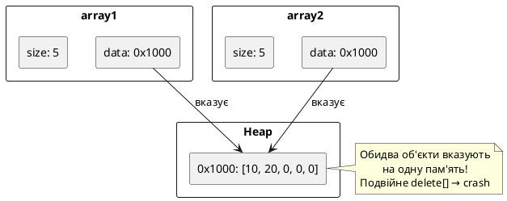
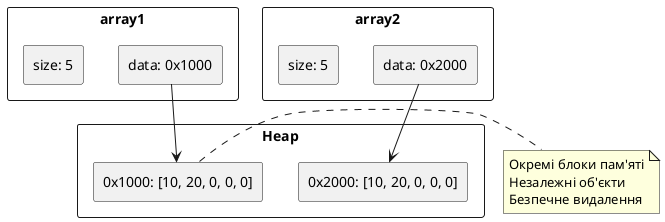

# Глибоке копіювання та оператор присвоювання

## Повернення до проблеми: подвійне видалення

У статті 59 ми зіткнулися з критичною проблемою: **поверхневе копіювання** (*shallow copy*) класів із динамічною пам'яттю призводить до катастрофічних помилок. Нагадаємо проблему:

```cpp [ShallowCopyProblem.cpp] showLineNumbers
#include <iostream>

class IntArray
{
private:
    int* data;
    int size;

public:
    IntArray(int s) : size(s)
    {
        data = new int[size];
        std::cout << "Allocated array of size " << size << "\n";
    }

    ~IntArray()
    {
        delete[] data;
        std::cout << "Deallocated array\n";
    }

    void set(int index, int value)
    {
        data[index] = value;
    }

    int get(int index) const
    {
        return data[index];
    }
};

int main()
{
    IntArray array1(5);
    array1.set(0, 10);
    array1.set(1, 20);

    // Копіювання: компілятор створює shallow copy
    IntArray array2 = array1;

    std::cout << "array1[0] = " << array1.get(0) << "\n";
    std::cout << "array2[0] = " << array2.get(0) << "\n";

    // Модифікація array2 впливає на array1!
    array2.set(0, 99);
    std::cout << "After modifying array2:\n";
    std::cout << "array1[0] = " << array1.get(0) << "\n";  // ⚠️ Теж 99!

    return 0;  // ☠️ CRASH при виході: подвійне delete[]
}
```

::terminal-preview{title="./ShallowCopyProblem"}

<div class="line"><span class="opacity-40">$</span> <strong class="font-bold">./ShallowCopyProblem</strong></div>
<div class="line">Allocated array of size <span class="text-blue-400">5</span></div>
<div class="line">array1[0] = <span class="text-green-400">10</span></div>
<div class="line">array2[0] = <span class="text-green-400">10</span></div>
<div class="line">After modifying array2:</div>
<div class="line">array1[0] = <span class="text-red-400">99</span></div>
<div class="line">Deallocated array</div>
<div class="line">Deallocated array</div>
<div class="line"><span class="text-red-400 font-bold">Segmentation fault (core dumped)</span></div>
::

**Що відбулося?**

1. **Рядок 41:** `IntArray array2 = array1;` викликає конструктор копіювання за замовчуванням, що робить **побайтове копіювання** полів: `array2.data = array1.data`, `array2.size = array1.size`
2. **Проблема:** тепер `array1.data` і `array2.data` вказують на **одну і ту ж** ділянку пам'яті
3. **Рядок 47:** зміна `array2.set(0, 99)` модифікує спільний масив, тому `array1.get(0)` теж повертає 99
4. **Рядок 51:** при виході зі `main()` спочатку викликається `~IntArray()` для `array2` — звільняє пам'ять. Потім викликається `~IntArray()` для `array1` — намагається звільнити **вже звільнену** пам'ять → **подвійне видалення** (*double free*) → crash

::plant-uml{title="Проблема поверхневого копіювання" backgroundColor="#FFFFFF"}

::

У цій статті ми **вирішимо** цю проблему раз і назавжди, реалізувавши **глибоке копіювання** та **оператор присвоювання**.

---

## Shallow copy vs Deep copy

::card-group

::card{title="🪶 Shallow Copy (поверхневе)" icon="i-lucide-copy"}

**Побайтове копіювання** полів класу. Копіюються **значення** полів, але не дані, на які вказують покажчики.

**Проблема:** декілька об'єктів вказують на одну пам'ять → подвійне видалення або неочікувані модифікації.

**Коли безпечно:** для класів без покажчиків (класи з лише `int`, `double`, `bool` полями).

::

::card{title="🏔️ Deep Copy (глибоке)" icon="i-lucide-layers"}

**Виділення нової пам'яті** та **копіювання даних**. Кожен об'єкт має власний блок пам'яті.

**Результат:** об'єкти незалежні — зміна одного не впливає на інший.

**Коли потрібно:** для класів із покажчиками, динамічними масивами, файловими дескрипторами тощо.

::

::

::plant-uml{title="Deep Copy: кожен об'єкт має власну пам'ять" backgroundColor="#FFFFFF"}

::

---

## Реалізація глибокого копіювання: конструктор копіювання

Щоб забезпечити глибоке копіювання, потрібно **перевантажити конструктор копіювання** — спеціальний конструктор, що викликається при створенні об'єкта як копії іншого.

**Сигнатура:**

```cpp
ClassName(const ClassName& other);
```

**Параметр:** константне посилання на об'єкт-джерело. Посилання — щоб уникнути безкінечної рекурсії (інакше копіювання параметра викликало б конструктор копіювання → копіювання параметра → ...).

```cpp [DeepCopyConstructor.cpp] showLineNumbers
#include <iostream>

class IntArray
{
private:
    int* data;
    int size;

public:
    IntArray(int s) : size(s)
    {
        data = new int[size];
        for (int i = 0; i < size; ++i)
        {
            data[i] = 0;
        }
        std::cout << "Constructed IntArray of size " << size << "\n";
    }

    // Деструктор
    ~IntArray()
    {
        delete[] data;
        std::cout << "Destroyed IntArray\n";
    }

    // Конструктор глибокого копіювання
    IntArray(const IntArray& other) : size(other.size)
    {
        std::cout << "Copy constructor called\n";

        // Виділяємо НОВУ пам'ять
        data = new int[size];

        // Копіюємо дані поелементно
        for (int i = 0; i < size; ++i)
        {
            data[i] = other.data[i];
        }
    }

    void set(int index, int value)
    {
        data[index] = value;
    }

    int get(int index) const
    {
        return data[index];
    }

    int getSize() const
    {
        return size;
    }
};

int main()
{
    IntArray array1(5);
    array1.set(0, 10);
    array1.set(1, 20);
    array1.set(2, 30);

    std::cout << "\nCreating array2 as copy of array1...\n";
    IntArray array2 = array1;  // Викликається конструктор копіювання

    std::cout << "\narray1[0] = " << array1.get(0) << "\n";
    std::cout << "array2[0] = " << array2.get(0) << "\n";

    // Модифікація array2 не впливає на array1
    array2.set(0, 99);
    std::cout << "\nAfter modifying array2[0] = 99:\n";
    std::cout << "array1[0] = " << array1.get(0) << " (unchanged!)\n";
    std::cout << "array2[0] = " << array2.get(0) << "\n";

    std::cout << "\nExiting main()...\n";
    return 0;  // ✅ Безпечне видалення: кожен об'єкт має власну пам'ять
}
```

::terminal-preview{title="./DeepCopyConstructor"}

<div class="line"><span class="opacity-40">$</span> <strong class="font-bold">./DeepCopyConstructor</strong></div>
<div class="line">Constructed IntArray of size <span class="text-blue-400">5</span></div>
<div class="line"></div>
<div class="line">Creating array2 as copy of array1...</div>
<div class="line"><span class="text-yellow-400">Copy constructor called</span></div>
<div class="line"></div>
<div class="line">array1[0] = <span class="text-green-400">10</span></div>
<div class="line">array2[0] = <span class="text-green-400">10</span></div>
<div class="line"></div>
<div class="line">After modifying array2[0] = 99:</div>
<div class="line">array1[0] = <span class="text-green-400">10</span> (unchanged!)</div>
<div class="line">array2[0] = <span class="text-yellow-400">99</span></div>
<div class="line"></div>
<div class="line">Exiting main()...</div>
<div class="line">Destroyed IntArray</div>
<div class="line">Destroyed IntArray</div>
<div class="line">Execution finished with <span class="text-green-400 font-bold">exit code 0</span>.</div>
::

**Рядки 28–40:** конструктор копіювання виконує три кроки:
1. **Рядок 28:** ініціалізує `size` значенням з `other` (через MIL)
2. **Рядок 33:** виділяє **нову** пам'ять для `data` — це ключовий крок глибокого копіювання
3. **Рядки 36–39:** копіює дані поелементно з `other.data` у `this->data`

**Рядок 68:** `IntArray array2 = array1;` — це **ініціалізація**, не присвоювання. Викликається конструктор копіювання, що створює `array2` із власною пам'яттю.

**Рядок 74:** модифікація `array2.set(0, 99)` змінює лише `array2.data` — `array1.data` залишається незмінним (рядок 75).

**Рядки 79–80:** при виході зі `main()` викликаються деструктори для `array2` і `array1` — кожен звільняє **власну** пам'ять. Немає подвійного видалення, немає crash.

::note
**Коли викликається конструктор копіювання?**
1. Ініціалізація об'єкта копією: `IntArray a2 = a1;` або `IntArray a2(a1);`
2. Передача об'єкта за значенням у функцію: `void foo(IntArray arr)` → копіює аргумент
3. Повернення об'єкта за значенням із функції: `IntArray bar() { return arr; }` → копіює `arr`

У всіх цих випадках компілятор викликає конструктор копіювання.
::


---

## Оператор присвоювання: `operator=`

Конструктор копіювання вирішує проблему **ініціалізації** (`IntArray a2 = a1`), але не вирішує проблему **присвоювання** вже існуючому об'єкту:

```cpp
IntArray a1(5);
IntArray a2(10);  // a2 вже існує з власною пам'яттю
a2 = a1;          // ❓ Що відбувається тут?
```

Для цього потрібно перевантажити **оператор присвоювання** `operator=`.

**Сигнатура:**

```cpp
ClassName& operator=(const ClassName& other);
```

**Повернення:** посилання на `*this` для підтримки ланцюгових присвоювань (`a = b = c`).

### Алгоритм `operator=`:

1. **Перевірка самоприсвоювання** — якщо `this == &other`, нічого не робити
2. **Звільнення старих ресурсів** — `delete[]` поточну пам'ять
3. **Виділення нових ресурсів** — `new[]` для копії
4. **Копіювання даних** — поелементне копіювання з `other`
5. **Повернення `*this`** — для ланцюгових присвоювань

```cpp [AssignmentOperator.cpp] showLineNumbers
#include <iostream>

class IntArray
{
private:
    int* data;
    int size;

public:
    IntArray(int s) : size(s)
    {
        data = new int[size];
        for (int i = 0; i < size; ++i)
        {
            data[i] = 0;
        }
        std::cout << "Constructed IntArray of size " << size << "\n";
    }

    ~IntArray()
    {
        delete[] data;
        std::cout << "Destroyed IntArray of size " << size << "\n";
    }

    // Конструктор копіювання (глибоке копіювання)
    IntArray(const IntArray& other) : size(other.size)
    {
        std::cout << "Copy constructor called\n";
        data = new int[size];
        for (int i = 0; i < size; ++i)
        {
            data[i] = other.data[i];
        }
    }

    // Оператор присвоювання (глибоке копіювання)
    IntArray& operator=(const IntArray& other)
    {
        std::cout << "Assignment operator called\n";

        // Крок 1: Перевірка самоприсвоювання
        if (this == &other)
        {
            std::cout << "Self-assignment detected, skipping\n";
            return *this;
        }

        // Крок 2: Звільнення старої пам'яті
        delete[] data;

        // Крок 3: Виділення нової пам'яті
        size = other.size;
        data = new int[size];

        // Крок 4: Копіювання даних
        for (int i = 0; i < size; ++i)
        {
            data[i] = other.data[i];
        }

        // Крок 5: Повернення посилання на себе
        return *this;
    }

    void set(int index, int value)
    {
        data[index] = value;
    }

    int get(int index) const
    {
        return data[index];
    }

    int getSize() const
    {
        return size;
    }
};

int main()
{
    IntArray array1(5);
    array1.set(0, 10);
    array1.set(1, 20);

    IntArray array2(3);  // array2 вже існує з size=3
    array2.set(0, 99);

    std::cout << "\nBefore assignment:\n";
    std::cout << "array1: size=" << array1.getSize() << ", [0]=" << array1.get(0) << "\n";
    std::cout << "array2: size=" << array2.getSize() << ", [0]=" << array2.get(0) << "\n";

    // Присвоювання: викликається operator=
    std::cout << "\nExecuting: array2 = array1\n";
    array2 = array1;

    std::cout << "\nAfter assignment:\n";
    std::cout << "array1: size=" << array1.getSize() << ", [0]=" << array1.get(0) << "\n";
    std::cout << "array2: size=" << array2.getSize() << ", [0]=" << array2.get(0) << "\n";

    // Модифікація array2 не впливає на array1
    array2.set(0, 777);
    std::cout << "\nAfter array2.set(0, 777):\n";
    std::cout << "array1[0] = " << array1.get(0) << " (unchanged)\n";
    std::cout << "array2[0] = " << array2.get(0) << "\n";

    // Самоприсвоювання
    std::cout << "\nExecuting: array1 = array1 (self-assignment)\n";
    array1 = array1;

    // Ланцюгове присвоювання
    IntArray array3(2);
    std::cout << "\nExecuting: array3 = array2 = array1\n";
    array3 = array2 = array1;  // Викликається двічі: array2 = array1, array3 = array2
    std::cout << "array3[0] = " << array3.get(0) << "\n";

    std::cout << "\nExiting main()...\n";
    return 0;
}
```

::terminal-preview{title="./AssignmentOperator"}

<div class="line"><span class="opacity-40">$</span> <strong class="font-bold">./AssignmentOperator</strong></div>
<div class="line">Constructed IntArray of size <span class="text-blue-400">5</span></div>
<div class="line">Constructed IntArray of size <span class="text-blue-400">3</span></div>
<div class="line"></div>
<div class="line">Before assignment:</div>
<div class="line">array1: size=<span class="text-blue-400">5</span>, [0]=<span class="text-green-400">10</span></div>
<div class="line">array2: size=<span class="text-blue-400">3</span>, [0]=<span class="text-yellow-400">99</span></div>
<div class="line"></div>
<div class="line">Executing: array2 = array1</div>
<div class="line"><span class="text-yellow-400">Assignment operator called</span></div>
<div class="line"></div>
<div class="line">After assignment:</div>
<div class="line">array1: size=<span class="text-blue-400">5</span>, [0]=<span class="text-green-400">10</span></div>
<div class="line">array2: size=<span class="text-blue-400">5</span>, [0]=<span class="text-green-400">10</span></div>
<div class="line"></div>
<div class="line">After array2.set(0, 777):</div>
<div class="line">array1[0] = <span class="text-green-400">10</span> (unchanged)</div>
<div class="line">array2[0] = <span class="text-yellow-400">777</span></div>
<div class="line"></div>
<div class="line">Executing: array1 = array1 (self-assignment)</div>
<div class="line"><span class="text-yellow-400">Assignment operator called</span></div>
<div class="line"><span class="text-red-400">Self-assignment detected, skipping</span></div>
<div class="line"></div>
<div class="line">Executing: array3 = array2 = array1</div>
<div class="line">Constructed IntArray of size <span class="text-blue-400">2</span></div>
<div class="line"><span class="text-yellow-400">Assignment operator called</span></div>
<div class="line"><span class="text-yellow-400">Assignment operator called</span></div>
<div class="line">array3[0] = <span class="text-green-400">10</span></div>
<div class="line"></div>
<div class="line">Exiting main()...</div>
<div class="line">Destroyed IntArray of size <span class="text-blue-400">5</span></div>
<div class="line">Destroyed IntArray of size <span class="text-blue-400">5</span></div>
<div class="line">Destroyed IntArray of size <span class="text-blue-400">5</span></div>
<div class="line">Execution finished with <span class="text-green-400 font-bold">exit code 0</span>.</div>
::

**Рядки 43–47:** **перевірка самоприсвоювання** — якщо `this == &other`, об'єкт присвоюється сам собі (`a = a`). У такому випадку нічого не робимо, одразу повертаємо `*this`.

**Чому це важливо?** Без цієї перевірки крок 2 звільнив би пам'ять, а крок 4 намагався б копіювати зі звільненої пам'яті → undefined behavior.

**Рядок 51:** звільняємо стару пам'ять `array2` (розмір 3). Це критично: інакше витік пам'яті.

**Рядки 54–55:** виділяємо нову пам'ять розміру `other.size` (тепер `array2` має розмір 5, як `array1`).

**Рядки 58–61:** копіюємо дані поелементно.

**Рядок 65:** повертаємо `*this` — посилання на поточний об'єкт. Це дозволяє ланцюгові присвоювання.

**Рядок 100:** `array2 = array1` — викликається `operator=`, що звільняє стару пам'ять `array2`, виділяє нову і копіює дані з `array1`.

**Рядок 116:** самоприсвоювання `array1 = array1` — перевірка на рядку 43 спрацьовує, нічого не відбувається.

**Рядок 121:** ланцюгове присвоювання `array3 = array2 = array1` виконується **справа наліво**:
1. Спочатку `array2 = array1` (повертає `array2`)
2. Потім `array3 = array2` (повертає `array3`)

::warning
**Критична помилка: забути перевірку самоприсвоювання.** Уявімо, що рядки 43–47 відсутні:

```cpp
IntArray& operator=(const IntArray& other)
{
    delete[] data;         // Звільняємо пам'ять
    size = other.size;
    data = new int[size];
    // Копіюємо з other.data — але якщо this == &other,
    // то other.data вже видалений! Undefined behavior!
    for (int i = 0; i < size; ++i)
        data[i] = other.data[i];  // ☠️ Копіювання зі звільненої пам'яті
    return *this;
}
```

При `a = a` цей код **спочатку видаляє `a.data`**, потім намагається скопіювати з `a.data` (що вже не існує). Це призведе до crash або мусору.
::

---

## Правило трьох (Rule of Three)

Якщо ваш клас потребує хоча б одного з цих трьох, він майже напевно потребує **всіх трьох**:

::steps

### Деструктор `~ClassName()`

Звільняє ресурси (пам'ять, файли, з'єднання). Якщо клас керує динамічною пам'яттю, деструктор обов'язковий.

### Конструктор копіювання `ClassName(const ClassName&)`

Забезпечує глибоке копіювання ресурсів. Без нього компілятор створює shallow copy, що призводить до подвійного видалення.

### Оператор присвоювання `operator=(const ClassName&)`

Забезпечує глибоке копіювання при присвоюванні. Без нього присвоювання створює shallow copy.

::

::note
**Чому "всі три"?** Якщо класу потрібен деструктор (він керує ресурсами), то при копіюванні потрібно **також** копіювати ці ресурси (інакше подвійне видалення). При присвоюванні потрібно **спочатку звільнити** старі ресурси, **потім** скопіювати нові. Всі три операції тісно пов'язані з управлінням ресурсами.
::

**Приклад порушення:**

```cpp
class Broken
{
private:
    int* data;

public:
    Broken(int size) { data = new int[size]; }
    ~Broken() { delete[] data; }  // ✅ Є деструктор

    // ❌ Немає конструктора копіювання → shallow copy → crash
    // ❌ Немає operator= → shallow copy → crash
};

int main()
{
    Broken b1(10);
    Broken b2 = b1;  // ☠️ Shallow copy → подвійне видалення при виході
    return 0;
}
```

---

## Повний приклад: клас `DynamicString`

Застосуємо Правило трьох до класу, що керує рядком із динамічною пам'яттю:

```cpp [DynamicString.cpp] showLineNumbers
#include <iostream>
#include <cstring>

class DynamicString
{
private:
    char* text;
    int length;

public:
    // Конструктор
    DynamicString(const char* str = "")
    {
        length = std::strlen(str);
        text = new char[length + 1];
        std::strcpy(text, str);
        std::cout << "Constructed: \"" << text << "\"\n";
    }

    // Деструктор
    ~DynamicString()
    {
        std::cout << "Destroying: \"" << text << "\"\n";
        delete[] text;
    }

    // Конструктор копіювання (глибоке копіювання)
    DynamicString(const DynamicString& other)
    {
        std::cout << "Copy constructor: copying \"" << other.text << "\"\n";
        length = other.length;
        text = new char[length + 1];
        std::strcpy(text, other.text);
    }

    // Оператор присвоювання (глибоке копіювання)
    DynamicString& operator=(const DynamicString& other)
    {
        std::cout << "Assignment operator: copying \"" << other.text << "\"\n";

        // Самоприсвоювання
        if (this == &other)
        {
            return *this;
        }

        // Звільнити старе
        delete[] text;

        // Виділити нове і скопіювати
        length = other.length;
        text = new char[length + 1];
        std::strcpy(text, other.text);

        return *this;
    }

    // Геттери
    const char* getText() const { return text; }
    int getLength() const { return length; }

    // Вивід
    void print() const
    {
        std::cout << "\"" << text << "\" (length: " << length << ")";
    }
};

int main()
{
    DynamicString s1("Hello");
    s1.print();
    std::cout << "\n\n";

    // Конструктор копіювання
    DynamicString s2 = s1;
    s2.print();
    std::cout << "\n\n";

    // Оператор присвоювання
    DynamicString s3("World");
    s3.print();
    std::cout << "\n";

    s3 = s1;  // s3 тепер копія s1
    s3.print();
    std::cout << "\n\n";

    // Самоприсвоювання
    s1 = s1;
    s1.print();
    std::cout << "\n\n";

    std::cout << "Exiting main()...\n";
    return 0;
}
```

::terminal-preview{title="./DynamicString"}

<div class="line"><span class="opacity-40">$</span> <strong class="font-bold">./DynamicString</strong></div>
<div class="line">Constructed: "<span class="text-green-400">Hello</span>"</div>
<div class="line">"<span class="text-green-400">Hello</span>" (length: 5)</div>
<div class="line"></div>
<div class="line">Copy constructor: copying "<span class="text-green-400">Hello</span>"</div>
<div class="line">"<span class="text-green-400">Hello</span>" (length: 5)</div>
<div class="line"></div>
<div class="line">Constructed: "<span class="text-blue-400">World</span>"</div>
<div class="line">"<span class="text-blue-400">World</span>" (length: 5)</div>
<div class="line">Assignment operator: copying "<span class="text-green-400">Hello</span>"</div>
<div class="line">"<span class="text-green-400">Hello</span>" (length: 5)</div>
<div class="line"></div>
<div class="line">Assignment operator: copying "<span class="text-green-400">Hello</span>"</div>
<div class="line">"<span class="text-green-400">Hello</span>" (length: 5)</div>
<div class="line"></div>
<div class="line">Exiting main()...</div>
<div class="line">Destroying: "<span class="text-green-400">Hello</span>"</div>
<div class="line">Destroying: "<span class="text-green-400">Hello</span>"</div>
<div class="line">Destroying: "<span class="text-green-400">Hello</span>"</div>
<div class="line">Execution finished with <span class="text-green-400 font-bold">exit code 0</span>.</div>
::

Клас `DynamicString` демонструє **коректне управління ресурсами**: три деструктори викликаються безпечно, кожен об'єкт має власну пам'ять, немає crash.


---

## Практичне завдання: клас `Matrix`

Закріпимо матеріал, реалізувавши клас `Matrix` для матриць довільного розміру з динамічною пам'яттю.

Вимоги:
- Поля: `double** data`, `int rows`, `int cols`
- Конструктор: виділяє двовимірний масив
- Деструктор: звільняє двовимірний масив
- Конструктор копіювання: глибоке копіювання
- Оператор присвоювання: глибоке копіювання із самоприсвоюванням
- Методи: `get(r, c)`, `set(r, c, value)`, `print()`

::::accordion

:::accordion-item{label="💡 Підказка: виділення двовимірного масиву" icon="i-lucide-lightbulb"}

Двовимірний масив у динамічній пам'яті:

```cpp
// Виділення
data = new double*[rows];  // Масив покажчиків на рядки
for (int i = 0; i < rows; ++i)
{
    data[i] = new double[cols];  // Кожен рядок — масив double
}

// Звільнення
for (int i = 0; i < rows; ++i)
{
    delete[] data[i];  // Спочатку звільнити кожен рядок
}
delete[] data;  // Потім масив покажчиків
```

:::

:::accordion-item{label="✅ Повне рішення" icon="i-lucide-code"}

```cpp
#include <iostream>

class Matrix
{
private:
    double** data;
    int rows;
    int cols;

public:
    // Конструктор
    Matrix(int r, int c) : rows(r), cols(c)
    {
        data = new double*[rows];
        for (int i = 0; i < rows; ++i)
        {
            data[i] = new double[cols];
            for (int j = 0; j < cols; ++j)
            {
                data[i][j] = 0.0;
            }
        }
        std::cout << "Constructed Matrix " << rows << "x" << cols << "\n";
    }

    // Деструктор
    ~Matrix()
    {
        for (int i = 0; i < rows; ++i)
        {
            delete[] data[i];
        }
        delete[] data;
        std::cout << "Destroyed Matrix " << rows << "x" << cols << "\n";
    }

    // Конструктор копіювання (глибоке копіювання)
    Matrix(const Matrix& other) : rows(other.rows), cols(other.cols)
    {
        std::cout << "Copy constructor: Matrix " << rows << "x" << cols << "\n";

        data = new double*[rows];
        for (int i = 0; i < rows; ++i)
        {
            data[i] = new double[cols];
            for (int j = 0; j < cols; ++j)
            {
                data[i][j] = other.data[i][j];
            }
        }
    }

    // Оператор присвоювання (глибоке копіювання)
    Matrix& operator=(const Matrix& other)
    {
        std::cout << "Assignment operator: Matrix " << other.rows << "x" << other.cols << "\n";

        // Самоприсвоювання
        if (this == &other)
        {
            return *this;
        }

        // Звільнити стару пам'ять
        for (int i = 0; i < rows; ++i)
        {
            delete[] data[i];
        }
        delete[] data;

        // Виділити нову пам'ять
        rows = other.rows;
        cols = other.cols;
        data = new double*[rows];
        for (int i = 0; i < rows; ++i)
        {
            data[i] = new double[cols];
            for (int j = 0; j < cols; ++j)
            {
                data[i][j] = other.data[i][j];
            }
        }

        return *this;
    }

    // Геттери та сеттери
    double get(int r, int c) const
    {
        return data[r][c];
    }

    void set(int r, int c, double value)
    {
        data[r][c] = value;
    }

    int getRows() const { return rows; }
    int getCols() const { return cols; }

    // Вивід
    void print() const
    {
        for (int i = 0; i < rows; ++i)
        {
            std::cout << "[ ";
            for (int j = 0; j < cols; ++j)
            {
                std::cout << data[i][j];
                if (j < cols - 1) std::cout << ", ";
            }
            std::cout << " ]\n";
        }
    }
};

int main()
{
    Matrix m1(2, 3);
    m1.set(0, 0, 1.0);
    m1.set(0, 1, 2.0);
    m1.set(0, 2, 3.0);
    m1.set(1, 0, 4.0);
    m1.set(1, 1, 5.0);
    m1.set(1, 2, 6.0);

    std::cout << "\nMatrix m1:\n";
    m1.print();

    // Конструктор копіювання
    std::cout << "\nCreating m2 as copy of m1...\n";
    Matrix m2 = m1;
    std::cout << "Matrix m2:\n";
    m2.print();

    // Модифікація m2 не впливає на m1
    m2.set(0, 0, 99.0);
    std::cout << "\nAfter m2.set(0, 0, 99):\n";
    std::cout << "m1[0][0] = " << m1.get(0, 0) << " (unchanged)\n";
    std::cout << "m2[0][0] = " << m2.get(0, 0) << "\n";

    // Оператор присвоювання
    std::cout << "\nCreating m3...\n";
    Matrix m3(1, 1);
    std::cout << "\nExecuting: m3 = m1\n";
    m3 = m1;
    std::cout << "Matrix m3:\n";
    m3.print();

    std::cout << "\nExiting main()...\n";
    return 0;
}
```

::terminal-preview{title="./Matrix"}

<div class="line"><span class="opacity-40">$</span> <strong class="font-bold">./Matrix</strong></div>
<div class="line">Constructed Matrix <span class="text-blue-400">2x3</span></div>
<div class="line"></div>
<div class="line">Matrix m1:</div>
<div class="line">[ <span class="text-green-400">1</span>, <span class="text-green-400">2</span>, <span class="text-green-400">3</span> ]</div>
<div class="line">[ <span class="text-green-400">4</span>, <span class="text-green-400">5</span>, <span class="text-green-400">6</span> ]</div>
<div class="line"></div>
<div class="line">Creating m2 as copy of m1...</div>
<div class="line">Copy constructor: Matrix <span class="text-blue-400">2x3</span></div>
<div class="line">Matrix m2:</div>
<div class="line">[ <span class="text-green-400">1</span>, <span class="text-green-400">2</span>, <span class="text-green-400">3</span> ]</div>
<div class="line">[ <span class="text-green-400">4</span>, <span class="text-green-400">5</span>, <span class="text-green-400">6</span> ]</div>
<div class="line"></div>
<div class="line">After m2.set(0, 0, 99):</div>
<div class="line">m1[0][0] = <span class="text-green-400">1</span> (unchanged)</div>
<div class="line">m2[0][0] = <span class="text-yellow-400">99</span></div>
<div class="line"></div>
<div class="line">Creating m3...</div>
<div class="line">Constructed Matrix <span class="text-blue-400">1x1</span></div>
<div class="line"></div>
<div class="line">Executing: m3 = m1</div>
<div class="line">Assignment operator: Matrix <span class="text-blue-400">2x3</span></div>
<div class="line">Matrix m3:</div>
<div class="line">[ <span class="text-green-400">1</span>, <span class="text-green-400">2</span>, <span class="text-green-400">3</span> ]</div>
<div class="line">[ <span class="text-green-400">4</span>, <span class="text-green-400">5</span>, <span class="text-green-400">6</span> ]</div>
<div class="line"></div>
<div class="line">Exiting main()...</div>
<div class="line">Destroyed Matrix <span class="text-blue-400">2x3</span></div>
<div class="line">Destroyed Matrix <span class="text-blue-400">2x3</span></div>
<div class="line">Destroyed Matrix <span class="text-blue-400">2x3</span></div>
<div class="line">Execution finished with <span class="text-green-400 font-bold">exit code 0</span>.</div>
::

**Пояснення:**

- **Рядки 14–22:** конструктор виділяє масив покажчиків (`new double*[rows]`), потім для кожного рядка виділяє масив (`new double[cols]`). Двовимірний масив у пам'яті.
- **Рядки 27–34:** деструктор звільняє у зворотному порядку: спочатку кожен рядок (`delete[] data[i]`), потім масив покажчиків (`delete[] data`).
- **Рядки 38–51:** конструктор копіювання виділяє **нову** пам'ять і копіює дані поелементно.
- **Рядки 54–86:** `operator=` звільняє стару пам'ять, виділяє нову (навіть якщо розмір змінився: `m3` був 1×1, став 2×3), копіює дані.
- **Рядок 147:** модифікація `m2` не впливає на `m1` — глибоке копіювання працює.

:::

::::

---

## Альтернативи глибокому копіюванню

Глибоке копіювання вирішує проблему, але **дороге**: виділення пам'яті, копіювання даних. Для великих масивів це може бути повільно. Є альтернативи:

::card-group

::card{title="🚫 Заборона копіювання" icon="i-lucide-ban"}

Використовуйте `= delete` для конструктора копіювання та `operator=`:

```cpp
class UniqueArray
{
public:
    UniqueArray(const UniqueArray&) = delete;
    UniqueArray& operator=(const UniqueArray&) = delete;
};
```

**Коли:** для класів із унікальними ресурсами (`FileHandle`, `Mutex`).

::

::card{title="🔀 Move-семантика" icon="i-lucide-move"}

C++11 додав **move constructor** та **move assignment**, що **переміщують** ресурси замість копіювання:

```cpp
class IntArray
{
public:
    // Move constructor
    IntArray(IntArray&& other) noexcept;
    // Move assignment
    IntArray& operator=(IntArray&& other) noexcept;
};
```

**Коли:** для тимчасових об'єктів, повернення з функцій. Набагато швидше за копіювання.

::

::card{title="📊 Лічильник посилань" icon="i-lucide-users"}

Кілька об'єктів вказують на одні дані, лічильник відстежує кількість. Звільняє пам'ять, коли лічильник = 0. Використовується у `std::shared_ptr`.

**Коли:** для великих даних, що активно шаряться між об'єктами.

::

::card{title="💡 Copy-on-write" icon="i-lucide-copy"}

Об'єкти шарять дані до першої модифікації. При спробі зміни створюється копія. Використовується у деяких реалізаціях `std::string` (до C++11).

**Коли:** рідко модифіковані дані, часте копіювання.

::

::

::note
**Правило п'яти (Rule of Five):** у C++11+ до Правила трьох додалися **move constructor** та **move assignment**. Якщо клас керує ресурсами, йому потрібні всі **п'ять** спеціальних функцій:

1. Деструктор
2. Конструктор копіювання
3. Оператор присвоювання
4. Move constructor (C++11)
5. Move assignment (C++11)

Move-семантика — тема окремого розділу курсу (C++11 features).
::

---

## Резюме: завершення циклу управління ресурсами

У цій статті ми вирішили проблему, що виникла у статті 59, і завершили вивчення базових механізмів ООП у C++.

**Ключові концепції:**

1. **Shallow copy** — побайтове копіювання полів, небезпечне для покажчиків
2. **Deep copy** — виділення нової пам'яті та копіювання даних
3. **Конструктор копіювання** — `ClassName(const ClassName&)`, викликається при ініціалізації
4. **Оператор присвоювання** — `operator=(const ClassName&)`, викликається при присвоюванні
5. **Самоприсвоювання** — перевірка `if (this == &other)` критична для коректності
6. **Правило трьох** — деструктор + конструктор копіювання + operator= йдуть разом

::tip
**Практична порада:** у сучасному C++ (після C++11) замість ручного управління пам'яттю використовуйте **смарт-покажчики** (`std::unique_ptr`, `std::shared_ptr`) та **контейнери STL** (`std::vector`, `std::string`). Вони автоматично реалізують Правило п'яти і захищають від витоків пам'яті. Але розуміння **як це працює** всередині критично важливе для професійного C++ програміста.
::

---

## Що далі: від базового ООП до розширених тем

Ми завершили серію з **18 статей** про **об'єктно-орієнтоване програмування у C++**. Пройшли шлях від мотивації ООП (стаття 49) через механізми класів (статті 50–60) до розширених технік перевантаження операторів та управління пам'яттю (статті 61–66).

**Що ви тепер вмієте:**

- Створювати класи з інкапсуляцією, конструкторами, деструкторами
- Використовувати покажчик `this`, статичні члени, friend-функції
- Перевантажувати оператори для природного синтаксису
- Контролювати конвертації через `explicit` та `delete`
- Коректно управляти динамічною пам'яттю через глибоке копіювання

**Наступні теми курсу C++:**

- **Наслідування та поліморфізм** — другий і третій стовпи ООП, віртуальні функції, абстрактні класи
- **Шаблони (templates)** — generic programming, `template<typename T>`, STL під капотом
- **Обробка помилок** — винятки (*exceptions*), RAII та exception safety
- **C++11/14/17/20 features** — auto, range-based for, lambda, move-семантика, smart pointers, constexpr

Але це вже теми окремих серій. Базові механізми ООП, що ви вивчили у цих 18 статтях, — фундамент для всього, що буде далі. Вітаю з завершенням цього етапу! 🎉
