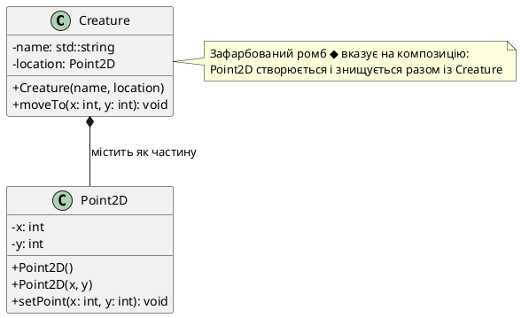
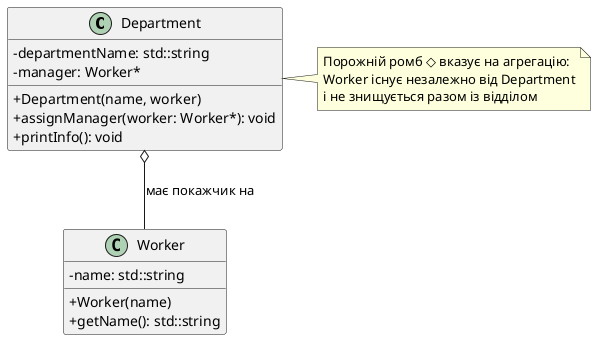

## Чому самодостатні класи не вистачає

На попередніх етапах ми познайомилися з фундаментальними механізмами об'єктно-орієнтованого програмування: інкапсуляцією даних, конструкторами та деструкторами, перевантаженням операторів. Ми навчилися створювати автономні класи, які зберігають стан і надають методи для його модифікації. Проте реальні програмні системи рідко складаються з ізольованих класів-одинаків.

Уявіть собі завдання моделювання автомобіля в симуляційній програмі. Ви могли б створити монолітний клас `Car`, який містить сотні полів: параметри двигуна (`enginePower`, `fuelType`, `cylinderCount`), характеристики коробки передач (`gearCount`, `transmissionType`), властивості кожного колеса (`tirePressure`, `wheelDiameter`) і навіть дані про систему гальмування. Результатом стане клас-велетень на тисячі рядків, у якому важко орієнтуватися, тестувати окремі підсистеми та повторно використовувати код в інших проєктах.

Архітектурна проблема полягає не в тому, що ми **можемо** вмістити всю логіку в один клас, а в тому, що **не повинні** цього робити. Компілятор C++ не заборонить вам написати `Car::calculateEngineTorque()`, `Car::simulateTransmissionShift()` та `Car::applyBrakingForce()` у одному файлі, але така структура порушує фундаментальний принцип декомпозиції: **один клас має виконувати одну добре визначену роль**.

Саме для розв'язання цієї проблеми індустрія програмування виробила набір структурних шаблонів взаємодії між об'єктами. У реальному світі складні сутності природно розкладаються на дрібніші компоненти: автомобіль **складається** з двигуна, кузова та коліс; університет **володіє** факультетами; підприємство **наймає** працівників. Кожен із цих зв'язків має власну семантику життєвого циклу та відповідальності за керування ресурсами. Наша задача — навчитися точно відображати ці відносини в коді C++.

::note
Розуміння зв'язків між об'єктами критично важливе не лише для проєктування класів, але й для грамотного читання документації бібліотек. Коли ви бачите у документації Qt фразу «`QMainWindow` takes ownership of the widget», це сигнал: використовується композиція, і вам не потрібно вручну викликати `delete` для цього віджета. Якщо ж сказано «stores a pointer to external data», це агрегація — вам необхідно самостійно керувати життєвим циклом зовнішнього об'єкта.

::

## Ієрархія взаємодій між об'єктами

Перед тим, як заглибитися в технічну реалізацію, важливо усвідомити загальну карту типів зв'язків. У теорії об'єктно-орієнтованого проєктування прийнято виділяти чотири основних типи відносин між класами, кожен із яких відображає різну силу зв'язку та різну відповідальність за життєвий цикл об'єктів.

### Композиція (*Composition*)

Це найсильніший тип зв'язку, що моделює відношення **«ціле-частина»** (*part-of*). Частина не може існувати без цілого, створюється разом із ним і знищується у момент знищення контейнера. Класичний приклад: **серце є частиною тіла людини**. Якщо тіло перестає існувати, серце теж припиняє функціонування. У програмуванні такі відносини часто реалізуються через зберігання об'єктів-частин **за значенням** як полів класу-контейнера.

::tip
**Правило семантичної чіткості**: Якщо ви не можете уявити, що частина існує окремо від цілого, використовуйте композицію. Наприклад, `Fraction` не може існувати без `numerator` та `denominator` — це чиста композиція.

::

### Агрегація (*Aggregation*)

Це слабша форма зв'язку, що моделює відношення **«володіє/містить»** (*has-a*), але без жорсткого контролю життєвого циклу. Об'єкт-контейнер **знає** про свої частини та може з ними взаємодіяти, але не відповідає за їх створення чи знищення. Приклад: **університетський факультет має викладачів**. Викладачі можуть існувати до створення факультету, можуть переходити на інші факультети, а після розформування факультету продовжують працювати в університеті. У C++ агрегація часто реалізується через **покажчики** або **посилання** на зовнішні об'єкти.

### Асоціація (*Association*)

Відношення **«використовує»** (*uses-a*) між об'єктами, які взаємодіють як рівноправні партнери без концепції володіння. Наприклад, **пацієнт відвідує лікаря**: обидва існують незалежно, можуть мати багато партнерів одночасно. Асоціація може бути односпрямованою (клас `А` знає про `B`, але `B` не знає про `А`) або двоспрямованою (*bidirectional*).

### Залежність (*Dependency*)

Найслабший тип зв'язку: об'єкт **тимчасово використовує** інший об'єкт для виконання конкретної операції, але не зберігає на нього посилання. Типовий приклад: метод приймає аргумент або створює локальну змінну іншого класу. Залежність не впливає на життєвий цикл і не створює постійного зв'язку в пам'яті.

::card-group

::card{title="🔗 Композиція (Composition)" icon="i-lucide-box"}

**Семантика**: «ціле-частина», нерозривний життєвий цикл  
**Приклад**: Автомобіль ↔ Двигун  
**Реалізація**: поля за значенням  
**UML**: зафарбований ромб `◆`

::

::card{title="🔗 Агрегація (Aggregation)" icon="i-lucide-layers"}

**Семантика**: «володіє», незалежний життєвий цикл  
**Приклад**: Відділ ↔ Працівники  
**Реалізація**: покажчики/посилання  
**UML**: порожній ромб `◇`

::

::

У цій статті ми детально розглянемо перші два типи зв'язків — **композицію** та **агрегацію**, оскільки саме вони визначають структуру класів із вкладеними об'єктами та правила керування ресурсами. Асоціацію та залежність ми вивчимо в наступних лекціях, коли перейдемо до проєктування складніших систем взаємодії.

## Композиція: нерозривний життєвий цикл частин і цілого

Композиція (*composition*) — це структурний шаблон, у якому складний об'єкт-контейнер (ціле, *whole*) **повністю відповідає** за існування своїх складових частин (*parts*). Частина створюється у момент конструювання цілого і знищується у момент його деструкції. Між двома об'єктами встановлюється відношення суворого володіння: частина належить рівно одному контейнеру і не може існувати поза його межами.

### Формальні ознаки композиції

Для того, щоб відношення між класами кваліфікувалося як композиція, необхідно дотримання чотирьох умов:

1. **Частина є невід'ємною складовою цілого**: Поле-член класу безпосередньо представляє сутність, без якої ціле втрачає сенс. Наприклад, дріб (`Fraction`) не може існувати без чисельника і знаменника.

2. **Частина може належати лише одному об'єкту за раз**: Якщо `m_numerator` є полем об'єкта `fraction1`, то цей самий екземпляр `m_numerator` не може одночасно бути частиною `fraction2`. Кожен об'єкт класу володіє власними копіями своїх полів.

3. **Існування частини керується об'єктом**: Контейнер має повний контроль над життєвим циклом частини. Якщо частина створюється динамічно (через `new`), контейнер зобов'язаний звільнити пам'ять у своєму деструкторі.

4. **Частина не знає про існування цілого**: Поле `m_numerator` є звичайним цілим числом (`int`) і не має жодної інформації про клас `Fraction`, до якого воно належить. Це односпрямовані відносини: клас знає про свої поля, але поля не знають про клас.

::note
**Термінологія «батько-нащадок»**: У неформальній літературі об'єкт-контейнер іноді називають «батьківським об'єктом» (*parent*), а його частини — «дочірніми об'єктами» (*children*). Однак у контексті об'єктно-орієнтованого програмування термін «батьківський клас» зарезервований для наслідування (*inheritance*), тому ми дотримуємося нейтральних термінів «ціле» (*whole*) і «частина» (*part*).

::

### Реалізація композиції: об'єкти за значенням

Найпростіший і найбезпечніший спосіб реалізації композиції в C++ — це оголошення полів класу **за значенням**, а не через покажчики. Розглянемо класичний приклад класу `Fraction`, який складається з двох цілочисельних частин:

```cpp
class Fraction
{
private:
    int numerator;
    int denominator;

public:
    Fraction(int num = 0, int den = 1)
        : numerator(num), denominator(den)
    {
        if (denominator == 0) {
            denominator = 1; // Захист від ділення на нуль
        }
    }

    void print() const
    {
        std::cout << numerator << "/" << denominator;
    }
};
```

Проаналізуємо, як цей клас задовольняє всім критеріям композиції:

- **Невід'ємність**: Дріб `Fraction` не може існувати без чисельника і знаменника. Ці два поля визначають сутність об'єкта.
- **Унікальне володіння**: Кожен об'єкт `Fraction f(3, 5);` створює власну пару `{numerator=3, denominator=5}`. Якщо ми створюємо другий об'єкт `Fraction g(1, 2);`, він отримує власні, незалежні поля.
- **Керований життєвий цикл**: Поля `numerator` і `denominator` автоматично конструюються разом із об'єктом `Fraction` (через список ініціалізації) і автоматично знищуються, коли об'єкт виходить із області видимості.
- **Односпрямованість**: Ціле число `numerator` не має інформації про те, що воно є частиною дробу. Це просто примітивне значення типу `int`.

::tip
**Переваги зберігання частин за значенням**: Компілятор автоматично керує пам'яттю, не потрібні ручні виклики `delete`, відсутній ризик висячих покажчиків (*dangling pointers*). Це найбезпечніша та найрекомендованіша форма композиції у сучасному C++.

::


## Композиція із динамічною пам'яттю: відповідальність класу

У деяких випадках частини об'єкта необхідно створювати динамічно — наприклад, коли розмір даних невідомий на момент компіляції або коли частина є великим об'єктом, передача якого за значенням неефективна. У таких ситуаціях композиція все одно зберігає повний контроль над життєвим циклом, але реалізується через **покажчики-члени** класу із ручним керуванням пам'яттю.

Розглянемо клас `IntArray`, який інкапсулює динамічний масив цілих чисел. Масив є невід'ємною частиною об'єкта і не може існувати без контейнера:

```cpp
class IntArray
{
private:
    int* data;      // Покажчик на динамічний масив (частина об'єкта)
    int length;     // Розмір масиву

public:
    // Конструктор виділяє пам'ять для масиву (створює частину)
    IntArray(int size)
        : length(size)
    {
        data = new int[length]{};  // Ініціалізація нулями
    }

    // Деструктор звільняє пам'ять (знищує частину)
    ~IntArray()
    {
        delete[] data;
        data = nullptr;
    }

    // Оператор індексації для доступу до елементів
    int& operator[](int index)
    {
        return data[index];
    }

    int getLength() const { return length; }
};
```

Аналіз реалізації з погляду композиції:

- **Створення частини**: Конструктор класу `IntArray` викликає `new int[length]` — це означає, що **клас відповідає** за створення масиву. Користувач класу лише передає розмір, але не бере участі у виділенні пам'яті.
- **Знищення частини**: Деструктор `~IntArray()` викликає `delete[] data` — це гарантує, що пам'ять звільниться автоматично, коли об'єкт `IntArray` вийде зі scope або буде видалений через `delete`.
- **Приховування деталей**: Зовнішній код не має доступу до покажчика `data` (він приватний). Користувач взаємодіє з масивом виключно через публічний інтерфейс `operator[]` і `getLength()`.

::warning
**Правило трьох (Rule of Three)**: Якщо клас використовує динамічну пам'ять у композиції, він **обов'язково** має реалізувати три спеціальні методи: деструктор, конструктор копіювання та оператор присвоювання. Без них компілятор згенерує неправильні версії за замовчуванням, що призведе до подвійного звільнення пам'яті (*double delete*) або витоків.

::

Приклад використання:

```cpp
int main()
{
    IntArray numbers(5);  // Конструктор виділяє масив на 5 елементів

    numbers[0] = 10;
    numbers[1] = 20;

    std::cout << "First element: " << numbers[0] << "\n";

    // Деструктор IntArray автоматично викличе delete[] при виході зі scope
    return 0;
}
```

При виході з функції `main()` об'єкт `numbers` знищується, що автоматично запускає деструктор `~IntArray()`, який звільняє динамічний масив `data`. Користувач класу не бачить цього процесу і не повинен турбуватися про ручне звільнення пам'яті — це є суттю ідіоми **RAII** (*Resource Acquisition Is Initialization*), яку ми вивчали раніше.

## Моделювання реальних систем через композицію

Композиція особливо ефективна для моделювання складних об'єктів, що природно розкладаються на дрібніші підсистеми. Повернімося до прикладу симуляції істоти у грі, яка переміщується по двовимірній карті. Замість того, щоб зберігати координати `x` і `y` безпосередньо в класі `Creature`, ми можемо інкапсулювати концепцію «точка у просторі» в окремий клас `Point2D` і вбудувати його в `Creature` через композицію.

### Клас Point2D — інкапсуляція координат

```cpp
class Point2D
{
private:
    int x;
    int y;

public:
    // Конструктор за замовчуванням — початок координат (0, 0)
    Point2D()
        : x(0), y(0)
    {
    }

    // Параметризований конструктор для заданої точки
    Point2D(int xCoord, int yCoord)
        : x(xCoord), y(yCoord)
    {
    }

    // Метод для переміщення точки на нову позицію
    void setPoint(int newX, int newY)
    {
        x = newX;
        y = newY;
    }

    // Перевантаження оператора виводу для зручного друку
    friend std::ostream& operator<<(std::ostream& out, const Point2D& point)
    {
        out << "(" << point.x << ", " << point.y << ")";
        return out;
    }
};
```

Клас `Point2D` повністю автономний: він інкапсулює поведінку двовимірної точки, не знаючи нічого про те, хто його використовує. Це дозволяє повторно використовувати його в різних контекстах — для позицій істот, координат будівель, точок на карті тощо.

### Клас Creature — композиція з Point2D

```cpp
class Creature
{
private:
    std::string name;
    Point2D location;  // Композиція: location є частиною Creature

public:
    Creature(const std::string& creatureName, const Point2D& startLocation)
        : name(creatureName), location(startLocation)
    {
    }

    // Делегування переміщення підоб'єкту Point2D
    void moveTo(int x, int y)
    {
        location.setPoint(x, y);
    }

    // Вивід інформації про істоту разом із її координатами
    friend std::ostream& operator<<(std::ostream& out, const Creature& creature)
    {
        out << creature.name << " is at " << creature.location;
        return out;
    }
};
```

Проаналізуємо відносини:

- **Частина належить цілому**: Поле `location` оголошено за значенням, а не через покажчик. Це означає, що об'єкт `Point2D` фізично вбудований у структуру пам'яті об'єкта `Creature`. Коли створюється `Creature`, одночасно конструюється і його `location`.
- **Тривалість життя частини залежить від цілого**: Коли об'єкт `Creature` знищується, автоматично викликається деструктор `Point2D` для поля `location`. Ніяка зовнішня логіка не потрібна.
- **Делегування обов'язків**: Метод `moveTo()` класу `Creature` не реалізує логіку переміщення самостійно — він делегує цю роботу методу `setPoint()` підоб'єкта `Point2D`. Це приклад **композиційного підходу до розподілу відповідальності**: кожен клас робить те, що він знає найкраще.

### Використання у програмі

```cpp
int main()
{
    std::cout << "Enter a name for your creature: ";
    std::string name;
    std::cin >> name;

    // Створюємо істоту на початковій позиції (5, 6)
    Creature creature(name, Point2D(5, 6));

    std::cout << creature << "\n";

    // Переміщуємо істоту на нову позицію (10, 15)
    creature.moveTo(10, 15);

    std::cout << "After moving: " << creature << "\n";

    return 0;
}
```

::terminal-preview{title="./creature_simulation" :cursor="false"}
<div class="line"><span class="opacity-40">$</span> <strong class="font-bold">./creature_simulation</strong></div>
<div class="line">Enter a name for your creature: <span class="text-green-400 font-bold">Dragon</span></div>
<div class="line">Dragon is at (5, 6)</div>
<div class="line">After moving: Dragon is at (10, 15)</div>
::

### Архітектурні переваги композиції

Чому варто виділяти `Point2D` в окремий клас замість того, щоб просто додати поля `int x, y` безпосередньо в `Creature`? Це питання має фундаментальне значення для розуміння принципів проєктування:

**Перевага №1: Модульність і спрощення розуміння**  
Кожен клас зосереджений на одній відповідальності (*Single Responsibility Principle*). Клас `Point2D` знає все про координати і операції з ними (відстань, зсув, обертання), а клас `Creature` зосереджений на високорівневій логіці істоти (здоров'я, інвентар, поведінка). Розробник, який хоче зрозуміти систему координат, може відкрити лише `Point2D.h` і побачити все необхідне в одному місці.

**Перевага №2: Повторне використання коду (*Reusability*)**  
Якщо завтра ви захочете додати клас `Building`, який також має координати, ви просто використаєте той самий клас `Point2D`:

```cpp
class Building
{
private:
    std::string type;
    Point2D position;  // Повторне використання вже готового класу

public:
    Building(const std::string& buildingType, const Point2D& pos)
        : type(buildingType), position(pos) {}
};
```

Без `Point2D` вам довелося б дублювати код роботи з координатами в кожному класі.

**Перевага №3: Легкість розширення функціональності**  
Припустімо, ви вирішили додати обчислення відстані між двома точками або перевірку, чи лежить точка в певному прямокутнику. Ви просто додаєте ці методи в клас `Point2D`, і всі класи, що використовують його (і `Creature`, і `Building`), автоматично отримують доступ до нової функціональності без жодних змін у своєму коді.

::tip
**Правило одного завдання для класів**: Якщо клас виконує більше однієї чітко виокремленої ролі, це сигнал до декомпозиції. Питайте себе: «Чи можу я описати призначення цього класу однією фразою без сполучників "і", "також", "крім того"?» Якщо ні — клас слід розділити.

::


## UML-діаграма композиції: зафарбований ромб

Уніфікована мова моделювання (*Unified Modeling Language*, UML) використовує графічну нотацію для представлення відносин між класами. Композиція позначається **зафарбованим (чорним) ромбом** `◆` на стороні класу-контейнера, від якого веде суцільна лінія до класу-частини. Цей символ візуально підкреслює міцність зв'язку: ромб «прив'язує» частину до цілого, вказуючи на нерозривність життєвих циклів.

::plant-uml{alt="Композиція: Creature містить Point2D як частину"}



::

Інтерпретація діаграми:

- **Зафарбований ромб на стороні `Creature`**: вказує, що `Creature` є «власником» частини `Point2D`.
- **Множинність «1»**: за замовчуванням одна істота має рівно одну точку локації. Якби істота мала список точок маршруту, ми б вказали `1..*` або `0..*`.
- **Напрямок залежності**: стрілка йде від цілого до частини, що відповідає односпрямованості відносин у коді (клас `Creature` знає про `Point2D`, але `Point2D` не знає про `Creature`).

::note
**Відмінність від асоціації**: Якби замість композиції ми використовували звичайну асоціацію (зв'язок без ромба, просто суцільна лінія), це б означало, що `Point2D` існує незалежно, і `Creature` лише тримає на нього посилання. Ромб є критично важливим символом для розрізнення цих двох типів відносин.

::

## Розташування об'єктів у пам'яті: монолітний блок

Одна з ключових характеристик композиції — це **фізична близькість** у пам'яті. Коли ви оголошуєте поле за значенням (`Point2D location;`), компілятор вбудовує байти під-об'єкта безпосередньо у структуру батьківського об'єкта. Це означає, що `Creature` і його `location` розміщені в єдиному неперервному блоці пам'яті.

::memory-view{title="Структура об'єкта Creature у пам'яті" :variables='[{"name": "name", "type": "std::string", "value": "\"Dragon\"", "offset": "0x00"}, {"name": "location.x", "type": "int", "value": "10", "offset": "0x20"}, {"name": "location.y", "type": "int", "value": "15", "offset": "0x24"}]'}
::

Візуалізація показує, що поле `location` (яке є об'єктом типу `Point2D`) **не зберігає покажчик** на окрему область пам'яті — воно безпосередньо містить два цілі числа `x` і `y` всередині самого об'єкта `Creature`. Цей фізичний факт має кілька важливих наслідків:

**Наслідок №1: Кеш-локальність (*Cache Locality*)**  
Оскільки всі дані об'єкта знаходяться поруч, центральний процесор може завантажити їх в один кеш-рядок за одну операцію звернення до пам'яті. Це критично важливо для продуктивності в циклах обробки великих колекцій об'єктів.

**Наслідок №2: Відсутність непрямої адресації**  
Виклик `creature.location.x` перетворюється компілятором на просте зміщення від базової адреси об'єкта `creature`, без додаткового розіменування покажчика. Це робить доступ до полів максимально швидким.

**Наслідок №3: Автоматичне копіювання**  
Якщо ви скопіюєте об'єкт `Creature` (через конструктор копіювання або присвоювання), компілятор автоматично скопіює всі байти об'єкта, включно з вбудованим `Point2D`. Не потрібно турбуватися про «глибоке копіювання» покажчиків — все вже глибоке за замовчуванням.

::tip
**Коли використовувати композицію за значенням**: Якщо розмір частини невеликий (до ~100 байтів) і частина логічно нерозривно пов'язана з цілим, завжди віддавайте перевагу зберіганню за значенням. Це найбезпечніший і найефективніший спосіб моделювання.

::

## Агрегація: слабке володіння без контролю життєвого циклу

Якщо композиція моделює відношення нерозривного володіння, то **агрегація** (*aggregation*) представляє більш гнучкий зв'язок, у якому об'єкт-контейнер **знає** про свої частини та може з ними взаємодіяти, але **не контролює** їхнє створення і знищення. Частини в агрегації існують незалежно від контейнера: вони створюються до нього, можуть переходити від одного контейнера до іншого і продовжують існувати після знищення контейнера.

### Формальні ознаки агрегації

Відношення між класами є агрегацією, якщо виконуються наступні умови:

1. **Частина є складовою цілого**: Контейнер містить частину як свій член і використовує її функціональність.

2. **Частина може належати кільком об'єктам одночасно**: На відміну від композиції, один і той самий екземпляр частини може бути доступний кільком контейнерам. Наприклад, працівник може бути членом кількох департаментів (основний і суміщення).

3. **Частина існує незалежно від цілого**: Створення та знищення частини є обов'язком зовнішнього коду, а не самого контейнера. Контейнер лише отримує посилання або покажчик на вже існуючий об'єкт.

4. **Частина не знає про існування цілого**: Односпрямованість зберігається — клас-частина залишається автономним і не залежить від контейнера.

Класичний реальний приклад агрегації: **університетський факультет і викладачі**. Викладач існує як окрема особа до того, як його призначили на факультет. Він може викладати на кількох факультетах одночасно (суміщення кафедр). Якщо факультет розформовується, викладач не припиняє існування — він продовжує працювати в університеті або переходить на інший факультет.

### Реалізація агрегації через покажчики

Оскільки контейнер в агрегації не відповідає за створення частини, він зберігає **покажчик** або **посилання** на зовнішній об'єкт. Розглянемо приклад відділу компанії, який містить працівників:

```cpp
class Worker
{
private:
    std::string name;

public:
    Worker(const std::string& workerName)
        : name(workerName)
    {
        std::cout << "Worker " << name << " hired\n";
    }

    ~Worker()
    {
        std::cout << "Worker " << name << " retired\n";
    }

    std::string getName() const { return name; }
};
```

Клас `Worker` повністю автономний: він не знає нічого про відділи, департаменти чи компанії. Це просто сутність «працівник» із ім'ям.

```cpp
class Department
{
private:
    std::string departmentName;
    Worker* manager;  // Агрегація: покажчик на зовнішній об'єкт Worker

public:
    // Конструктор приймає вже існуючий об'єкт Worker
    Department(const std::string& name, Worker* externalWorker = nullptr)
        : departmentName(name), manager(externalWorker)
    {
        std::cout << "Department " << departmentName << " created\n";
    }

    ~Department()
    {
        std::cout << "Department " << departmentName << " disbanded\n";
        // Увага: НЕ викликаємо delete manager!
        // Працівник існує незалежно від відділу
    }

    void assignManager(Worker* newManager)
    {
        manager = newManager;
    }

    void printInfo() const
    {
        std::cout << "Department: " << departmentName;
        if (manager != nullptr) {
            std::cout << ", Manager: " << manager->getName();
        } else {
            std::cout << ", Manager: [none]";
        }
        std::cout << "\n";
    }
};
```

Критичні моменти реалізації:

- **Передача покажчика ззовні**: Конструктор `Department` приймає `Worker*` як параметр, а не створює працівника самостійно через `new`. Це означає, що об'єкт `Worker` уже існував до створення відділу.
- **Відсутність `delete` у деструкторі**: Деструктор `~Department()` **не** звільняє пам'ять, на яку вказує `manager`. Причина: відділ не створював цього працівника і не має права його знищувати. Відповідальність за звільнення лежить на тому коді, який створив об'єкт `Worker`.
- **Можливість перепризначення**: Метод `assignManager()` дозволяє змінити менеджера відділу, вказавши на іншого працівника. Це демонструє гнучкість агрегації: зв'язок не є постійним.

### Використання агрегації у програмі

```cpp
int main()
{
    // Створюємо працівників незалежно від відділів
    Worker* alice = new Worker("Alice");
    Worker* bob = new Worker("Bob");

    {
        // Створюємо відділ і призначаємо менеджера
        Department engineering("Engineering", alice);
        engineering.printInfo();

        // Змінюємо менеджера відділу
        engineering.assignManager(bob);
        engineering.printInfo();

        // Відділ знищується при виході зі scope
    }

    // Працівники продовжують існувати після знищення відділу
    std::cout << "Workers still exist: " << alice->getName()
              << ", " << bob->getName() << "\n";

    // Звільняємо пам'ять працівників вручну
    delete alice;
    delete bob;

    return 0;
}
```

::terminal-preview{title="./department_simulation" :cursor="false"}
<div class="line">Worker Alice hired</div>
<div class="line">Worker Bob hired</div>
<div class="line">Department Engineering created</div>
<div class="line">Department: Engineering, Manager: Alice</div>
<div class="line">Department: Engineering, Manager: Bob</div>
<div class="line">Department Engineering disbanded</div>
<div class="line">Workers still exist: Alice, Bob</div>
<div class="line">Worker Alice retired</div>
<div class="line">Worker Bob retired</div>
::

Проаналізуємо порядок подій:

1. **Створення працівників поза відділом**: Об'єкти `alice` і `bob` створюються в `main()` через `new` — це зовнішній код відповідає за їхнє існування.
2. **Створення відділу з агрегацією**: Конструктор `Department` отримує покажчик на `alice` і зберігає його в `manager`.
3. **Перепризначення менеджера**: Метод `assignManager(bob)` змінює покажчик `manager` на іншого працівника. Важливо: `alice` **не** знищується при цьому, оскільки відділ не володіє нею.
4. **Знищення відділу**: При виході зі scope викликається `~Department()`, але працівники **залишаються живими**, оскільки деструктор не викликає `delete`.
5. **Ручне звільнення працівників**: Після знищення відділу програма продовжує роботу з `alice` і `bob`, і лише потім викликає `delete` для них.

::warning
**Небезпека висячих покажчиків у агрегації**: Якщо зовнішній код видалить об'єкт `Worker` через `delete alice`, але відділ все ще зберігає покажчик `manager = alice`, цей покажчик стане **висячим** (*dangling pointer*). Будь-який доступ до `manager->getName()` після цього призведе до **Undefined Behavior**. Агрегація вимагає дисципліни: ви повинні гарантувати, що частини існують принаймні стільки ж, скільки контейнери, що на них посилаються.

::


## UML-діаграма агрегації: порожній ромб

На відміну від композиції, агрегація в UML позначається **порожнім (білим) ромбом** `◇` на стороні класу-контейнера. Візуально цей символ вказує на слабшу форму зв'язку: частина не «вплавлена» в ціле, а лише асоційована з ним.

::plant-uml{alt="Агрегація: Department містить покажчик на Worker"}



::

Ключова різниця між діаграмами композиції та агрегації — це **заповненість ромба**:

- **Зафарбований `◆`** = композиція = міцний зв'язок = частина знищується разом із цілим
- **Порожній `◇`** = агрегація = слабкий зв'язок = частина існує незалежно

::tip
**Правило вибору типу відносин**: Якщо ви можете уявити ситуацію, коли частина продовжує існувати після знищення контейнера, це агрегація. Якщо життя частини без контейнера не має сенсу — це композиція.

::

## Порівняння структур пам'яті: композиція vs агрегація

Одне з фундаментальних технічних відмінностей між композицією та агрегацією полягає в тому, **де саме в пам'яті знаходяться частини** об'єкта. Розглянемо це на прикладі двох класів: `Creature` (композиція з `Point2D`) і `Department` (агрегація з `Worker`).

### Композиція: монолітний блок у стеку або купі

```cpp
Creature dragon("Dragon", Point2D(10, 15));
```

Коли створюється об'єкт `dragon`, компілятор виділяє єдиний неперервний блок пам'яті, який містить:
- Байти рядка `name` (залежно від реалізації `std::string`, це може бути малий рядок в стеку або покажчик на купу)
- Два цілих числа `location.x` і `location.y` безпосередньо всередині об'єкта `Creature`

**Візуалізація в стеку:**

```
Адреса       | Зміст              | Пояснення
-------------|--------------------|---------------------------------
0x7FFF1000   | [std::string data] | Поле name
0x7FFF1020   | 10                 | location.x (частина об'єкта)
0x7FFF1024   | 15                 | location.y (частина об'єкта)
```

Все це є частиною одного об'єкта. Якщо `dragon` виходить зі scope, весь блок звільняється одночасно.

### Агрегація: контейнер і частини в різних областях пам'яті

```cpp
Worker* alice = new Worker("Alice");
Department engineering("Engineering", alice);
```

Тут ситуація інша:
- Об'єкт `alice` створений динамічно через `new` і розміщений у **купі** за адресою, наприклад, `0x00A00100`.
- Об'єкт `engineering` створений у **стеку** (або також у купі, якщо ми створили його через `new`) і зберігає **покажчик** на `alice`.

**Візуалізація зв'язку через покажчик:**

```
Стек (об'єкт Department):
Адреса       | Зміст              | Пояснення
-------------|--------------------|---------------------------------
0x7FFF2000   | "Engineering"      | departmentName
0x7FFF2020   | 0x00A00100         | manager (покажчик на купу)

Купа (об'єкт Worker):
Адреса       | Зміст              | Пояснення
-------------|--------------------|---------------------------------
0x00A00100   | "Alice"            | name
```

Критична різниця: **об'єкт `Department` не містить байти об'єкта `Worker`**. Він зберігає лише 8-байтовий покажчик (на 64-бітній системі), який веде до окремої області пам'яті, де живе `alice`.

::memory-view{title="Агрегація: покажчик manager веде до зовнішнього об'єкта" :variables='[{"name": "departmentName", "type": "std::string", "value": "\"Engineering\"", "offset": "0x7FFF2000"}, {"name": "manager", "type": "Worker*", "value": "0x00A00100 →", "offset": "0x7FFF2020"}, {"name": "[manager->name]", "type": "std::string (в купі)", "value": "\"Alice\"", "offset": "0x00A00100"}]'}
::

Наслідки цієї різниці:

**Непряма адресація**: Доступ до `engineering.manager->getName()` вимагає двох операцій звернення до пам'яті: спочатку прочитати покажчик `manager` зі структури `Department`, потім перейти за цим покажчиком до об'єкта `Worker` у купі. У композиції достатньо одного звернення з фіксованим зміщенням.

**Фрагментація пам'яті**: Об'єкти розкидані по різних областях пам'яті, що погіршує кеш-локальність і може сповільнити обробку великих колекцій.

**Гнучкість розміщення**: Об'єкт `Worker` може бути створений у будь-який момент у будь-якому місці програми і переданий у кілька різних контейнерів одночасно (кілька відділів можуть посилатися на одного працівника).

## Вибір між композицією та агрегацією: інженерні критерії

Новачки часто запитують: «Коли використовувати композицію, а коли агрегацію?» Відповідь залежить від **семантики предметної області** та **вимог до життєвого циклу**. Ось набір практичних критеріїв для прийняття рішення:

### Використовуйте композицію, якщо:

**Критерій №1: Частина не має сенсу поза контекстом цілого**  
Приклад: Чисельник і знаменник дробу (`Fraction`). Поняття «чисельник сам по собі» не має сенсу — він завжди є частиною конкретного дробу.

**Критерій №2: Тривалість життя частини повністю визначається цілим**  
Приклад: Динамічний масив усередині класу `IntArray`. Масив створюється конструктором і знищується деструктором. Користувач класу не бачить і не контролює цю пам'ять.

**Критерій №3: Необхідна висока продуктивність і кеш-локальність**  
Приклад: Ігрові об'єкти, що обробляються в тісних циклах (частинки, снаряди, ефекти). Зберігання координат і швидкості за значенням дозволяє процесору завантажити всі дані об'єкта за одне звернення до пам'яті.

**Критерій №4: Ви хочете уникнути ручного керування пам'яттю**  
Композиція за значенням не вимагає викликів `new`/`delete`, що робить код безпечнішим і простішим для розуміння.

### Використовуйте агрегацію, якщо:

**Критерій №1: Частина може існувати незалежно від контейнера**  
Приклад: Працівник і відділ компанії. Працівник наймається до того, як його призначають у відділ, і продовжує існувати після розформування відділу.

**Критерій №2: Частина може належати кільком контейнерам одночасно**  
Приклад: Студент, що відвідує кілька курсів. Об'єкт `Student` може зберігатися у списках різних об'єктів `Course`, але сам студент — єдиний екземпляр у системі.

**Критерій №3: Частина створюється та керується зовнішньою підсистемою**  
Приклад: Система управління ресурсами, де текстури та моделі завантажуються центральним менеджером ресурсів (`ResourceManager`), а ігрові об'єкти (`GameObject`) лише зберігають покажчики на ці ресурси.

**Критерій №4: Необхідна динамічна заміна частин під час виконання**  
Приклад: Система плагінів, де основна програма тримає покажчики на інтерфейси плагінів, які можуть завантажуватися та вивантажуватися в рантаймі.

::note
**Спрощене правило для новачків**: Якщо ви створюєте частину через `new` і зберігаєте покажчик, це схоже на агрегацію. Якщо оголошуєте поле за значенням (`Type member;`), це композиція. Але остаточне рішення залежить від **семантики**, а не лише від синтаксису.

::

## Змішана модель: композиція і агрегація в одному класі

У реальних системах часто зустрічаються класи, які використовують **обидва** типи відносин одночасно. Наприклад, клас університетського факультету може мати:

- **Композиція**: Назва факультету (`std::string name`), адміністративні дані, бюджет — все це створюється разом із факультетом і знищується разом із ним.
- **Агрегація**: Список викладачів (`std::vector<Teacher*> staff`), які існують незалежно від факультету і можуть викладати на кількох факультетах.

```cpp
class Faculty
{
private:
    std::string name;              // Композиція: невід'ємна частина факультету
    int foundationYear;            // Композиція
    std::vector<Teacher*> staff;   // Агрегація: покажчики на зовнішніх викладачів

public:
    Faculty(const std::string& facultyName, int year)
        : name(facultyName), foundationYear(year)
    {
    }

    ~Faculty()
    {
        // Композиція: name і foundationYear знищуються автоматично
        // Агрегація: НЕ викликаємо delete для викладачів!
        staff.clear();  // Очищуємо вектор покажчиків, але не знищуємо самих викладачів
    }

    void addTeacher(Teacher* teacher)
    {
        staff.push_back(teacher);
    }

    void printInfo() const
    {
        std::cout << "Faculty: " << name << " (founded " << foundationYear << ")\n";
        std::cout << "Staff: " << staff.size() << " teachers\n";
    }
};
```

Така змішана модель є нормою в промисловому коді: кожне поле класу обирається за принципом «що найкраще відповідає його природі». Немає потреби штучно використовувати лише один тип відносин для всього класу.

::tip
**Правило прагматизму**: Не намагайтеся підігнати реальність під формальні визначення. Якщо певне поле логічно є частиною об'єкта і ніколи не використовується окремо — зробіть його композицією. Якщо поле є спільним ресурсом — зробіть агрегацією. Чистота теоретичної моделі менш важлива, ніж зрозумілість коду.

::


## Альтернатива сирим покажчикам: `std::reference_wrapper`

У попередніх прикладах агрегації ми використовували сирі покажчики (`Worker*`), щоб зберегти посилання на зовнішній об'єкт. Проте сирі покажчики мають кілька недоліків: вони можуть бути `nullptr`, вимагають ручних перевірок валідності та не захищають від висячих покажчиків. У сучасному C++ існує безпечніша альтернатива для агрегації — **`std::reference_wrapper`**, обгортка над посиланням, яка дозволяє зберігати посилання у контейнерах STL.

### Проблема зберігання посилань у векторах

Чому ми не можемо просто написати `std::vector<Worker&> staff;`? Причина в тому, що **посилання в C++ не можна перепризначити** після ініціалізації. Вектор вимагає можливості копіювати та переміщувати елементи, що несумісно з семантикою посилань. Спроба скомпілювати такий код призведе до помилки:

```cpp
std::vector<Worker&> staff;  // ❌ Помилка компіляції: вектор не може зберігати посилання
```

### Рішення: `std::reference_wrapper<T>`

Клас `std::reference_wrapper<T>` (заголовок `<functional>`) є «обгорткою-посиланням», яка поводиться як посилання, але може бути скопійована та перепризначена. Всередині він зберігає покажчик, але надає інтерфейс, схожий на посилання:

```cpp
#include <functional>  // для std::reference_wrapper
#include <vector>
#include <iostream>
#include <string>

class Teacher
{
private:
    std::string name;

public:
    Teacher(const std::string& teacherName)
        : name(teacherName)
    {
    }

    std::string getName() const { return name; }
};

class Faculty
{
private:
    std::string name;
    std::vector<std::reference_wrapper<Teacher>> staff;  // Вектор обгорток-посилань

public:
    Faculty(const std::string& facultyName)
        : name(facultyName)
    {
    }

    void addTeacher(Teacher& teacher)
    {
        staff.push_back(std::ref(teacher));  // std::ref створює reference_wrapper
    }

    void printStaff() const
    {
        std::cout << "Faculty " << name << " staff:\n";
        for (const auto& teacherRef : staff) {
            // Автоматичне перетворення на Teacher&
            std::cout << "  - " << teacherRef.get().getName() << "\n";
        }
    }
};
```

Використання:

```cpp
int main()
{
    Teacher alice("Alice Johnson");
    Teacher bob("Bob Smith");

    Faculty computerScience("Computer Science");

    // Додаємо викладачів (передаємо посилання, а не покажчики)
    computerScience.addTeacher(alice);
    computerScience.addTeacher(bob);

    computerScience.printStaff();

    // alice і bob продовжують існувати після знищення computerScience
    return 0;
}
```

::terminal-preview{title="./faculty_demo" :cursor="false"}
<div class="line">Faculty Computer Science staff:</div>
<div class="line">  - Alice Johnson</div>
<div class="line">  - Bob Smith</div>
::

Переваги `std::reference_wrapper` у порівнянні з сирими покажчиками:

**Перевага №1: Гарантія ненульового посилання**  
На відміну від покажчика, `std::reference_wrapper` **не може бути `nullptr`**. Ви не можете створити обгортку без валідного об'єкта. Це усуває необхідність перевірок `if (ptr != nullptr)`.

**Перевага №2: Семантика посилань**  
Синтаксис `std::ref(teacher)` чітко вказує: ми **не** передаємо володіння, а лише створюємо псевдонім на існуючий об'єкт. Це робить код більш зрозумілим для читача.

**Перевага №3: Сумісність зі стандартними контейнерами**  
`std::vector<std::reference_wrapper<T>>` дозволяє зберігати «посилання» у векторах, множинах та інших контейнерах STL, що неможливо зробити з чистими посиланнями `T&`.

::note
**Коли використовувати `std::reference_wrapper`**: Якщо ви впевнені, що об'єкт-частина завжди існує на момент використання контейнера і ніколи не буде `nullptr`, віддавайте перевагу `std::reference_wrapper` замість сирих покажчиків. Це робить код безпечнішим і виразнішим.

::

## Підводні камені агрегації: висячі покажчики та витоки

Агрегація надає велику гнучкість, але водночас покладає на програміста відповідальність за коректне керування життєвими циклами. Розглянемо типові помилки, з якими стикаються новачки.

### Помилка №1: Знищення частини до знищення контейнера

```cpp
int main()
{
    Department* engineering;

    {
        Worker temp("Temporary Worker");
        engineering = new Department("Engineering", &temp);
    }  // temp виходить зі scope і знищується тут

    engineering->printInfo();  // ❌ Undefined Behavior: покажчик manager висить

    delete engineering;
    return 0;
}
```

**Проблема**: Об'єкт `temp` знищується при виході зі внутрішнього блоку, але відділ `engineering` продовжує зберігати покажчик на його адресу. Будь-який доступ до `manager` після цього є доступом до звільненої пам'яті.

**Розв'язання**: Гарантуйте, що об'єкти-частини живуть **принаймні стільки ж**, скільки контейнери, що на них посилаються. У разі сумнівів — використовуйте композицію замість агрегації.

### Помилка №2: Подвійне видалення пам'яті

```cpp
int main()
{
    Worker* alice = new Worker("Alice");

    Department dept1("HR", alice);
    Department dept2("IT", alice);  // Обидва відділи посилаються на alice

    // Хтось помилково додає delete у деструктор Department
    // Результат: перший деструктор видалить alice, другий спробує видалити знову → crash

    return 0;
}
```

**Проблема**: Якщо програміст забув, що агрегація **не** має видаляти частини, і додав `delete manager;` у деструктор `Department`, обидва відділи спробують видалити одного й того ж працівника.

**Розв'язання**: Чітко документуйте відповідальність за пам'ять. Якщо клас **не володіє** покажчиком (агрегація), деструктор **не повинен** викликати `delete`.

### Помилка №3: Витік пам'яті через відсутність видалення

```cpp
int main()
{
    Worker* alice = new Worker("Alice");

    {
        Department engineering("Engineering", alice);
        // engineering знищується тут, але alice залишається у купі
    }

    // Забули викликати delete alice → витік пам'яті

    return 0;
}
```

**Проблема**: Об'єкт `alice` створений динамічно, але ніхто не видалив його після використання. Оскільки відділ не володіє працівником, він не видаляє його у деструкторі. Якщо програміст забув про ручне видалення — пам'ять витікає.

**Розв'язання**: У сучасному C++ уникайте сирих покажчиків для володіння. Використовуйте **розумні покажчики** (`std::unique_ptr`, `std::shared_ptr`), які автоматично керують пам'яттю. Агрегація може зберігати `std::shared_ptr` або необроблений покажчик (`T*`), якщо час життя гарантовано зовні.

::warning
**Агрегація і безпека пам'яті**: Сирі покажчики у агрегації — це потенційна мінне поле. Якщо ваш проєкт використовує C++11 або новіший, розгляньте використання `std::weak_ptr` для агрегації: він дозволяє перевірити, чи ще існує об'єкт, на який він посилається, і не запобігає його видаленню.

::

## Композиція проти наслідування: коли не треба вигадувати ієрархії

Новачки, які вперше знайомляться з ООП, часто надмірно захоплюються наслідуванням (*inheritance*), намагаючись побудувати глибокі ієрархії класів для кожної задачі. Проте досвідчені інженери дотримуються правила: **«Віддавайте перевагу композиції над наслідуванням»** (*Favor composition over inheritance*).

### Чому композиція часто кращий вибір

Розглянемо приклад: ви моделюєте автомобіль і хочете додати йому можливість увімкнення двигуна. Початківець може спробувати створити ієрархію:

```cpp
// ❌ Неправильний підхід: наслідування для отримання функціональності
class Engine { /* ... */ };
class Car : public Engine { /* ... */ };  // "Автомобіль Є двигуном"?!
```

Це порушує логіку відносин «is-a»: автомобіль **не є** двигуном, він **має** двигун. Правильне рішення — композиція:

```cpp
// ✅ Правильний підхід: композиція для моделювання частин
class Engine { /* ... */ };
class Car {
private:
    Engine engine;  // Автомобіль МІСТИТЬ двигун
};
```

**Переваги композиції над наслідуванням:**

1. **Гнучкість конфігурації**: Ви можете легко замінити тип двигуна (електричний, бензиновий, дизельний) без зміни ієрархії класів. У наслідуванні таке неможливо без множинного наслідування, яке створює складні проблеми.

2. **Уникнення хиткої базової класи (*Fragile Base Class Problem*)**: Зміни у батьківському класі автоматично впливають на всіх нащадків, що може зламати код, який ви не контролюєте. Композиція ізолює зміни.

3. **Множинна функціональність без множинного наслідування**: Якщо вам потрібно, щоб `Car` міг «літати» і «плавати», у наслідуванні ви потрапите в пастку множинного наслідування (`class Car : public Vehicle, public Flyable, public Swimmable`). У композиції ви просто додаєте поля `FlightModule` і `FloatationModule`.

::tip
**Правило проєктування**: Використовуйте наслідування лише для моделювання відносин **«є різновидом»** (*is-a*): `Dog` є `Animal`, `SavingsAccount` є `BankAccount`. Для всіх інших відносин використовуйте композицію або агрегацію.

::

## Практичний приклад: моделювання комп'ютера

Закріпимо знання на реалістичному прикладі: моделювання настільного комп'ютера. Комп'ютер має кілька компонентів, кожен із яких представляє різні типи відносин.

### Структура системи

- **Композиція**: Корпус (`Case`), материнська плата (`Motherboard`) — невід'ємні частини комп'ютера, які створюються разом із ним.
- **Агрегація**: Процесор (`CPU`), відеокарта (`GPU`), монітор (`Monitor`) — ці компоненти можуть існувати окремо, замінюватися або переставлятися між різними комп'ютерами.

### Реалізація класів-компонентів

```cpp
class CPU
{
private:
    std::string model;
    int coreCount;

public:
    CPU(const std::string& cpuModel, int cores)
        : model(cpuModel), coreCount(cores)
    {
        std::cout << "CPU " << model << " initialized\n";
    }

    ~CPU()
    {
        std::cout << "CPU " << model << " powered down\n";
    }

    std::string getModel() const { return model; }
};

class Monitor
{
private:
    int size;  // Розмір діагоналі в дюймах

public:
    Monitor(int inches)
        : size(inches)
    {
        std::cout << size << "\" Monitor connected\n";
    }

    ~Monitor()
    {
        std::cout << size << "\" Monitor disconnected\n";
    }
};

class Motherboard
{
private:
    std::string chipset;

public:
    Motherboard(const std::string& chipsetName)
        : chipset(chipsetName)
    {
        std::cout << "Motherboard " << chipset << " installed\n";
    }
};
```

### Клас Computer із змішаною моделлю

```cpp
class Computer
{
private:
    // Композиція: материнська плата створюється разом із комп'ютером
    Motherboard motherboard;

    // Агрегація: процесор і монітор існують незалежно
    CPU* processor;
    Monitor* display;

public:
    Computer(const std::string& chipset, CPU* cpu, Monitor* monitor)
        : motherboard(chipset), processor(cpu), display(monitor)
    {
        std::cout << "Computer assembled\n";
    }

    ~Computer()
    {
        std::cout << "Computer disassembled\n";
        // Композиція: motherboard знищується автоматично
        // Агрегація: НЕ видаляємо processor і display
    }

    void printSpecs() const
    {
        std::cout << "Computer specs:\n";
        std::cout << "  CPU: " << processor->getModel() << "\n";
        std::cout << "  Display: " << display << " (pointer address)\n";
    }
};
```

### Демонстрація життєвих циклів

```cpp
int main()
{
    // Створюємо компоненти незалежно (агрегація)
    CPU* intelCore = new CPU("Intel Core i7-12700K", 12);
    Monitor* dellMonitor = new Monitor(27);

    {
        // Збираємо комп'ютер (material створюється всередині конструктора)
        Computer gamingPC("Intel Z690", intelCore, dellMonitor);
        gamingPC.printSpecs();

        // Комп'ютер знищується при виході зі scope
    }

    std::cout << "\nComponents still exist after PC disassembly:\n";

    // Компоненти можна використовувати в іншому комп'ютері
    Computer officePC("AMD B550", intelCore, dellMonitor);

    // Вручну звільняємо пам'ять компонентів
    delete intelCore;
    delete dellMonitor;

    return 0;
}
```

::terminal-preview{title="./computer_demo" :cursor="false"}
<div class="line">CPU Intel Core i7-12700K initialized</div>
<div class="line">27" Monitor connected</div>
<div class="line">Motherboard Intel Z690 installed</div>
<div class="line">Computer assembled</div>
<div class="line">Computer specs:</div>
<div class="line">  CPU: Intel Core i7-12700K</div>
<div class="line">Computer disassembled</div>
<div class="line"></div>
<div class="line">Components still exist after PC disassembly:</div>
<div class="line">Motherboard AMD B550 installed</div>
<div class="line">Computer assembled</div>
<div class="line">Computer disassembled</div>
<div class="line">CPU Intel Core i7-12700K powered down</div>
<div class="line">27" Monitor disconnected</div>
::

Аналіз виводу показує:

- **Материнська плата** створюється двічі (по разу для кожного комп'ютера) і знищується разом із комп'ютерами — це композиція.
- **Процесор і монітор** створюються один раз, використовуються обома комп'ютерами і знищуються лише в кінці програми — це агрегація.


## Зведення: композиція vs агрегація

Для закріплення матеріалу розглянемо порівняльну таблицю ключових характеристик обох типів відносин:

::card-group

::card{title="📦 Композиція (Composition)" icon="i-lucide-package"}

**Відношення**: «ціле-частина» (*part-of*)  
**Життєвий цикл**: Частина створюється і знищується разом із цілим  
**Володіння**: Суворе — частина належить рівно одному об'єкту  
**Реалізація**: Поля за значенням або покажчики з `delete` у деструкторі  
**UML-символ**: Зафарбований ромб `◆`  
**Приклад**: Серце є частиною тіла, `m_numerator` є частиною `Fraction`

::

::card{title="🔗 Агрегація (Aggregation)" icon="i-lucide-link"}

**Відношення**: «володіє/містить» (*has-a*)  
**Життєвий цикл**: Частина існує незалежно від контейнера  
**Володіння**: Слабке — частина може належати кільком об'єктам  
**Реалізація**: Покажчики/посилання без `delete` у деструкторі  
**UML-символ**: Порожній ромб `◇`  
**Приклад**: Відділ має працівників, університет має студентів

::

::

### Контрольні запитання для вибору типу відносин

Якщо ви не впевнені, який тип відносин використовувати, задайте собі ці запитання:

**Питання №1**: Чи може частина існувати без контейнера?  
- **Ні** → Композиція  
- **Так** → Агрегація

**Питання №2**: Чи хто створює частину — конструктор контейнера чи зовнішній код?  
- **Конструктор** → Композиція  
- **Зовнішній код** → Агрегація

**Питання №3**: Чи має деструктор контейнера видаляти частину?  
- **Так** → Композиція  
- **Ні** → Агрегація

**Питання №4**: Чи може частина одночасно належати кільком контейнерам?  
- **Ні** → Композиція  
- **Так** → Агрегація

## Антипатерни та типові помилки проєктування

Завершимо огляд аналізом поширених помилок, які роблять початківці при моделюванні зв'язків між об'єктами.

### Антипатерн №1: Божественний об'єкт (*God Object*)

**Опис**: Створення одного гігантського класу, який містить усі поля і методи, необхідні для всієї підсистеми, замість декомпозиції на дрібніші класи.

```cpp
// ❌ Антипатерн: монолітний клас-велетень
class GameCharacter
{
private:
    // Параметри персонажа
    int health, mana, strength, agility;

    // Інвентар
    std::vector<Item> inventory;

    // Система руху
    double positionX, positionY, velocityX, velocityY;

    // Анімація
    std::string currentAnimation;
    int animationFrame;

    // Штучний інтелект
    AIState aiState;
    std::vector<Waypoint> pathToTarget;

    // Звуки
    std::string footstepSound, attackSound;

    // ... ще 50 полів ...

public:
    // ... 100+ методів для всього цього ...
};
```

**Проблема**: Клас перетворюється на неконтрольовану кашу з непов'язаних відповідальностей. Тестувати, розуміти та модифікувати такий код надзвичайно складно.

**Розв'язання**: Декомпозиція через композицію:

```cpp
// ✅ Правильний підхід: декомпозиція на модулі
class GameCharacter
{
private:
    Stats stats;               // Композиція: параметри персонажа
    Inventory inventory;       // Композиція: система інвентаря
    Transform transform;       // Композиція: позиція та швидкість
    AnimationController animator;  // Композиція: система анімації
    AIController* ai;          // Агрегація: ШІ може бути спільним для типу ворогів
    SoundProfile* sounds;      // Агрегація: звукові профілі можуть бути спільними

public:
    // Кожна підсистема має власний інтерфейс
};
```

### Антипатерн №2: Надмірна вкладеність (*Over-Nesting*)

**Опис**: Створення глибокої ієрархії композиції (об'єкт містить об'єкт, який містить об'єкт...), що ускладнює доступ до даних.

```cpp
// ❌ Антипатерн: ланцюг доступу довжиною 5 рівнів
player.getBody().getLeftArm().getHand().getFingers().getThumb().bend(45);
```

**Проблема**: Порушення закону Деметри (*Law of Demeter* / «Принцип найменшого знання»). Зовнішній код знає занадто багато про внутрішню структуру об'єкта.

**Розв'язання**: Делегування через методи верхнього рівня:

```cpp
// ✅ Правильний підхід: приховування вкладеності
player.bendLeftThumb(45);  // Метод делегує виклик вниз по ієрархії
```

### Антипатерн №3: Псевдоагрегація через `shared_ptr`

**Опис**: Використання `std::shared_ptr` у всіх місцях замість явного визначення відповідальності за володіння.

```cpp
// ❌ Сумнівний підхід: все через shared_ptr
class Department
{
private:
    std::shared_ptr<Worker> manager;  // Хто насправді володіє працівником?
};
```

**Проблема**: Коли всі об'єкти зберігаються через `shared_ptr`, неясно, хто відповідає за життєвий цикл. Це може призвести до циклічних посилань та витоків пам'яті.

**Розв'язання**: Чітко визначайте семантику володіння:

- `std::unique_ptr` — для композиції (єдиний власник)
- Сирий покажчик `T*` або `std::reference_wrapper` — для агрегації (невладіюче посилання)
- `std::shared_ptr` — лише коли дійсно потрібне спільне володіння з динамічним підрахунком посилань

::warning
**Ментальна модель для покажчиків**: Запитайте себе: «Якщо цей об'єкт видаляє свій покажчик, чи знищується ресурс назавжди, чи інші об'єкти ще можуть його використовувати?» Перший випадок — композиція, другий — агрегація або спільне володіння.

::

## Практичне завдання: моделювання бібліотечної системи

Закріпимо матеріал на практиці. Спроєктуйте систему для управління бібліотекою з наступними сутностями:

- **`Book`**: Книга з назвою, автором та ISBN
- **`Library`**: Бібліотека, яка **володіє** колекцією книг (композиція)
- **`Member`**: Член бібліотеки (читач), який може брати книги
- **`Loan`**: Запис про позичання книги членом бібліотеки (агрегація: зберігає посилання на `Book` і `Member`, але не створює їх)

::::accordion

:::accordion-item{label="💡 Підказки до завдання" icon="i-lucide-lightbulb"}

**Підказка №1: Композиція для `Library` і `Book`**  
Бібліотека створює книги при їх додаванні у каталог і знищує всю колекцію при закритті. Використовуйте `std::vector<Book>` для зберігання за значенням або `std::vector<std::unique_ptr<Book>>` для динамічного виділення.

**Підказка №2: Агрегація для `Loan`**  
Запис про позичання не створює ні книгу, ні читача — він лише фіксує факт зв'язку між ними. Використовуйте покажчики або `std::reference_wrapper`.

**Підказка №3: Методи для `Library`**  
Реалізуйте:
- `addBook(const std::string& title, const std::string& author, const std::string& isbn)` — додає книгу у колекцію
- `printCatalog()` — виводить список всіх книг
- `findBookByISBN(const std::string& isbn)` — повертає покажчик на книгу або `nullptr`

**Підказка №4: Деструктори та RAII**  
Переконайтеся, що при знищенні `Library` автоматично знищуються всі книги, але при знищенні `Loan` не знищуються ні книга, ні читач.

:::

:::accordion-item{label="✅ Розв'язок завдання" icon="i-lucide-check-circle"}

```cpp
#include <iostream>
#include <string>
#include <vector>
#include <memory>

// Клас Book: інкапсулює дані про книгу
class Book
{
private:
    std::string title;
    std::string author;
    std::string isbn;

public:
    Book(const std::string& bookTitle, const std::string& bookAuthor, const std::string& bookISBN)
        : title(bookTitle), author(bookAuthor), isbn(bookISBN)
    {
    }

    std::string getISBN() const { return isbn; }

    void print() const
    {
        std::cout << "\"" << title << "\" by " << author << " (ISBN: " << isbn << ")\n";
    }
};

// Клас Library: композиція з Book
class Library
{
private:
    std::string name;
    std::vector<std::unique_ptr<Book>> catalog;  // Композиція через unique_ptr

public:
    Library(const std::string& libraryName)
        : name(libraryName)
    {
        std::cout << "Library \"" << name << "\" opened\n";
    }

    ~Library()
    {
        std::cout << "Library \"" << name << "\" closed. " << catalog.size() << " books archived.\n";
        // unique_ptr автоматично звільнить всі книги
    }

    void addBook(const std::string& title, const std::string& author, const std::string& isbn)
    {
        catalog.push_back(std::make_unique<Book>(title, author, isbn));
    }

    void printCatalog() const
    {
        std::cout << "\n=== " << name << " Catalog ===\n";
        for (const auto& book : catalog) {
            book->print();
        }
        std::cout << "\n";
    }

    Book* findBookByISBN(const std::string& isbn)
    {
        for (const auto& book : catalog) {
            if (book->getISBN() == isbn) {
                return book.get();  // Повертаємо сирий покажчик (невладіюче посилання)
            }
        }
        return nullptr;
    }
};

// Клас Member: автономна сутність читача
class Member
{
private:
    std::string name;
    int memberID;

public:
    Member(const std::string& memberName, int id)
        : name(memberName), memberID(id)
    {
    }

    std::string getName() const { return name; }
    int getID() const { return memberID; }
};

// Клас Loan: агрегація з Book і Member
class Loan
{
private:
    Book* borrowedBook;  // Агрегація: не володіє книгою
    Member* borrower;    // Агрегація: не володіє читачем
    std::string dueDate;

public:
    Loan(Book* book, Member* member, const std::string& due)
        : borrowedBook(book), borrower(member), dueDate(due)
    {
        std::cout << "Loan created: " << borrower->getName()
                  << " borrowed ISBN " << borrowedBook->getISBN()
                  << " (due: " << dueDate << ")\n";
    }

    ~Loan()
    {
        std::cout << "Loan record archived\n";
        // НЕ видаляємо borrowedBook і borrower — агрегація!
    }

    void printInfo() const
    {
        std::cout << "Borrower: " << borrower->getName()
                  << ", Book ISBN: " << borrowedBook->getISBN()
                  << ", Due: " << dueDate << "\n";
    }
};

int main()
{
    Library cityLibrary("City Central Library");

    // Композиція: бібліотека створює і володіє книгами
    cityLibrary.addBook("The C++ Programming Language", "Bjarne Stroustrup", "978-0321563842");
    cityLibrary.addBook("Effective C++", "Scott Meyers", "978-0321334879");

    cityLibrary.printCatalog();

    // Автономні об'єкти членів бібліотеки
    Member alice("Alice Johnson", 1001);
    Member bob("Bob Smith", 1002);

    // Агрегація: запис про позичання посилається на існуючі об'єкти
    Book* effectiveCpp = cityLibrary.findBookByISBN("978-0321334879");
    if (effectiveCpp != nullptr) {
        Loan loan1(effectiveCpp, &alice, "2026-10-01");
        loan1.printInfo();
    }

    // Бібліотека знищується, книги видаляються, але alice і bob продовжують існувати
    return 0;
}
```

::terminal-preview{title="./library_system" :cursor="false"}
<div class="line">Library "City Central Library" opened</div>
<div class="line"></div>
<div class="line">=== City Central Library Catalog ===</div>
<div class="line">"The C++ Programming Language" by Bjarne Stroustrup (ISBN: 978-0321563842)</div>
<div class="line">"Effective C++" by Scott Meyers (ISBN: 978-0321334879)</div>
<div class="line"></div>
<div class="line">Loan created: Alice Johnson borrowed ISBN 978-0321334879 (due: 2026-10-01)</div>
<div class="line">Borrower: Alice Johnson, Book ISBN: 978-0321334879, Due: 2026-10-01</div>
<div class="line">Loan record archived</div>
<div class="line">Library "City Central Library" closed. 2 books archived.</div>
::

:::

::::

## Висновки та наступні кроки

Ми дослідили два фундаментальні типи структурних зв'язків між об'єктами в C++: **композицію** та **агрегацію**. Обидва патерни є проявами принципу **«має»** (*has-a*), але відрізняються силою зв'язку та відповідальністю за життєві цикли.

**Ключові висновки**:

1. **Композиція** моделює нерозривне володіння: частина створюється і знищується разом із цілим. Реалізується через поля за значенням або покажчики з ручним керуванням у деструкторі.

2. **Агрегація** моделює слабке володіння: частина існує незалежно від контейнера, може належати кільком об'єктам одночасно. Реалізується через покажчики або `std::reference_wrapper` без видалення у деструкторі.

3. **Вибір між ними** визначається семантикою предметної області: якщо частина не має сенсу поза контекстом цілого — композиція; якщо частина може існувати автономно — агрегація.

4. **UML-нотація** допомагає візуалізувати тип зв'язку: зафарбований ромб `◆` для композиції, порожній ромб `◇` для агрегації.

5. **Сучасні інструменти**: Для безпечної реалізації використовуйте `std::unique_ptr` (композиція), `std::reference_wrapper` (агрегація без `nullptr`), `std::shared_ptr` (спільне володіння).

**На наступному етапі** ми розглянемо інші типи зв'язків між об'єктами: **асоціацію** (рівноправне партнерство без концепції володіння) та **залежність** (тимчасове використання без збереження посилань). Потім перейдемо до вивчення **контейнерних класів** та `std::initializer_list` — потужного інструменту для ініціалізації колекцій у стилі `{1, 2, 3}`.

::note
**Рекомендована література для поглибленого вивчення**:  
- Erich Gamma et al., *"Design Patterns: Elements of Reusable Object-Oriented Software"* — класичний посібник з патернів проєктування, де композиція розглядається як альтернатива наслідуванню.
- Scott Meyers, *"Effective C++"* (Item 38: Model "has-a" or "is-implemented-in-terms-of" through composition) — детальний аналіз вибору між композицією та наслідуванням.

::
